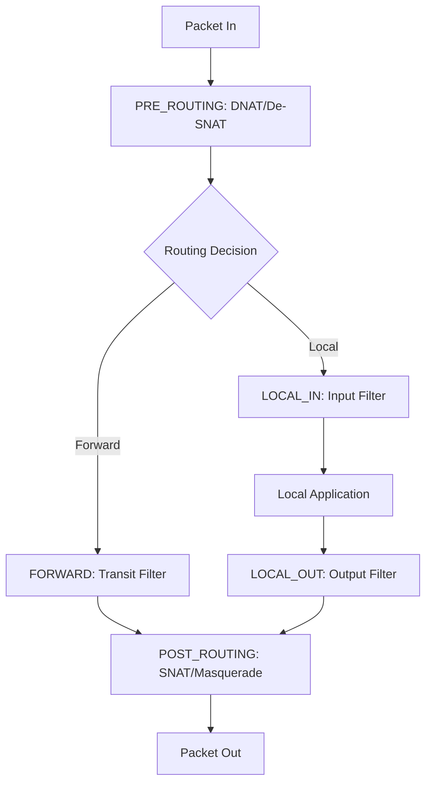

# Chapter 2: Kernel Module Architecture

This chapter explains the internal workings of the IPFire-Wall kernel module, its integration with Netfilter, and how it evaluates security policies.

## 2.1. Netfilter Hook Integration
IPFire-Wall registers itself at several points in the Linux network stack (Hooks).

## 2.2. Rule Hierarchy & Evaluation Logic
When a packet hits a filtering hook (`LOCAL_IN`, `LOCAL_OUT`, or `FORWARD`), it is evaluated against several lists of rules in a prioritized sequence.

### The Priority Chain:
1. **Blacklist (Dropped Rules)**: The engine first scans the `dropped` list. If a match is found, the packet is discarded immediately. This ensures that blocked entities cannot bypass later permission checks.
2. **Administrator Rules (Root)**: The `allowed` list is scanned for rules inserted by the system administrator.
3. **User Rules**: If enabled, rules defined by non-root users are checked next.

### Evaluation Mechanism:
- **First-Match Wins**: The evaluation stops as soon as a rule matches.
- **Default Policy**: If no rule matches any list, the module applies the `default_policy` (configured as either `ACCEPT` or `DROP`).

## 2.3. Filtering Granularity
Rules can match packets based on a wide array of criteria:
- **L3 (IP)**: Source/Destination IP addresses and IP Options.
- **L4 (Transport)**: Protocol (TCP, UDP, ICMP, IGMP) and Port numbers.
- **Direction**: Inbound, Outbound, or Forwarded.
- **Interface**: Incoming or Outgoing network device indices.
- **Payload**: FTP command inspection (for dynamic NAT).
