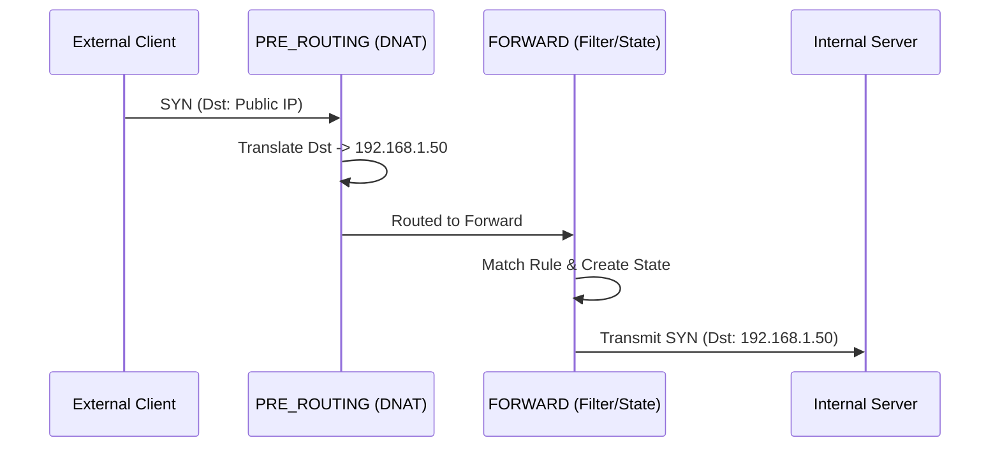

# Chapter 5: Packet Flow Walkthroughs

This chapter provides step-by-step analysis of how specific real-world packet scenarios traverse the IPFire-Wall engine.

## 5.1. Scenario 1: DNAT to Forwarded Internal Server
An external client connects to the firewall's public IP on port 80, which is redirected to an internal web server.

1. **PRE_ROUTING Hook**:
   - The packet `Src:Client, Dst:Firewall_Public` is intercepted.
   - `dnat_translation()` matches a rule and changes the destination to `Firewall_Internal_Server`.
   - The kernel is notified of the `daddr` change and clears the old route.
2. **Routing Decision**: The kernel finds the route for the new internal destination; it is not local, so the packet moves to the FORWARD hook.
3. **FORWARD Hook**:
   - `ipfire_filter()` is called.
   - It identifies this as a new connection.
   - It matches a stateful rule allowing traffic to the server.
   - `keep_state()` creates an entry in the state table.
4. **POST_ROUTING Hook**: The packet leaves the firewall towards the internal server.

## 5.2. Scenario 2: Masqueraded Outbound Connection
An internal client connects to the internet; the firewall hides the internal IP.

1. **LOCAL_OUT / FORWARD**: The packet is accepted by the filtering engine.
2. **POST_ROUTING**:
   - `masquerade_translation()` is called.
   - The engine dynamically finds the IP address of the outgoing WAN interface (`get_ifaddr`).
   - The packet's source address is replaced.
   - An entry is added to the `snat_table` to handle return traffic.

## 5.3. Scenario 3: Stateful Return Traffic
The reply from a previously accepted connection arrives.

1. **PRE_ROUTING**: If the original connection was NATed, the reverse translation is applied here.
2. **LOCAL_IN / FORWARD**:
   - `check_state()` is called.
   - A **reverse match** is found in the state table.
   - **Verdict: ACCEPT**. Rule evaluation is skipped entirely.
   - The state machine transitions (e.g., to `SYN_RECV` or `ESTABLISHED`).
3. **Delivery**: The packet is delivered to the initial requestor.
