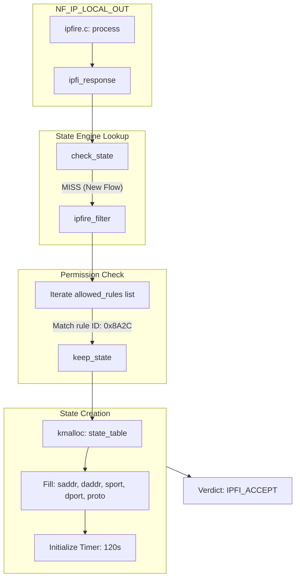

# IPFire Packet Flow Walkthrough (Technical Master Edition)

This document provides exhaustive technical walkthroughs of packet flows through the IPFire kernel module. It goes beyond high-level logic to explore the internal function call stacks, specific source code segments, and low-level state transitions.

---

## 1. The Filtering Lifecycle: Hook to Verdict

Every packet handled by IPFire follows a predictable lifecycle within the kernel.

### The Standard Call Stack
When a packet is intercepted by a Netfilter hook, the following internal chain is executed:

1.  **`ipfire.c:process()`**: The primary dispatcher for all hooks.
2.  **`ipfi_response()`**: Orchestrates the filtering decision.
3.  **`check_state()`**: Performs the O(1) hash lookup for established flows.
4.  **`ipfire_filter()`**: (If state miss) Performs the O(n) rule comparison.
5.  **`keep_state()`**: (If match) Initializes a new state tracking entry.

---

## 2. Scenario 1: Stateful HTTP Connection (OUTPUT)

### 2.1. Initial SYN (The "Slow Path")

When an application initiates a connection, the first packet triggers the "Slow Path" logic.

#### Analysis of Rule Matching Logic
In `ipfire_filter()`, the engine iterates through the `allowed` list. For an HTTP rule, the matching sequence looks like this:

```c
// Internal Matching Core (conceptual simplified C)
if (rule->direction == flow->direction && 
    (rule->protocol == 0 || rule->protocol == ip_hdr(skb)->protocol)) {
    
    // Transport layer check
    if (transport_protos_match(skb, rule)) {
        // Source/Dest IP check
        if (ip_match(skb, rule)) {
            return MATCH_FOUND;
        }
    }
}
```

#### Detailed Outgoing SYN Workflow



### 2.2. Returning SYN-ACK (The Transition)

The reply packet is the first "Reverse" match. This packet is critical because it transitions the state from `SYN_SENT` to `SYN_RECV`.

#### Internal Call: `check_state()`
The lookup in `check_state()` uses a normalized hash to find the entry regardless of direction:

```c
// Hash computation normalization
u32 hash = get_state_hash(saddr, daddr, sport, dport, proto);
// The saddr/daddr are swapped in the call to get_state_hash for reverse packets
```

### 2.3. The Fast Path (Established Data)

Once the 3-way handshake is complete, every subsequent packet avoids the rule list entirely.

#### Performance Metrics
- **Slow Path (First Packet)**: O(N) where N is number of rules in the list.
- **Fast Path (Subsequent)**: O(1) Hash Table lookup + State machine update.

---

## 3. Scenario 2: Passive FTP (Dynamic NAT)

FTP is complex because it uses a control channel to negotiate a dynamic data channel.

### 3.1. The Payload Inspection
When `FTP_SUPPORT=YES` is enabled, the state engine invokes the FTP helper during the control connection's lifetime.

#### The Hook: `helpers/ftp.c`
When a packet is identified as part of an FTP control stream, the engine calls `ftp_support()`:

```c
// Scanning for PASV response
if (data_start_with_227(payload)) {
    extract_ftp_info(payload, &finfo);
    if (finfo.valid) {
        add_ftp_dynamic_rule(sttable, finfo.ip, finfo.port);
    }
}
```

### 3.2. Data Channel "Prediction"
The `add_ftp_dynamic_rule` creates a "zombie" state entry that has no active ports yet but is pre-authorized by the control channel's policy.

---

## 4. Scenario 3: DNAT Interaction with FORWARD Hook

This is one of the most technical flows in the module because it spans across different kernel subsystem triggers.

### 4.1. Destination Translation (PRE_ROUTING)
The packet enters `PRE_ROUTING` and is transformed.

| Feature | Logic |
|---------|-------|
| **Transformation** | `ip_hdr(skb)->daddr` is changed to the internal server IP. |
| **Checkums** | `ip_send_check(iph)` is called to recompute the L3 CRC. |
| **Routing Trigger** | The destination cache (`skb_dst(skb)`) is released to force a re-route. |

```c
// Forcing Re-routing in ipfi_pre_process
if (daddr_changed) {
    dst_release(skb_dst(skb));
    skb_dst_set(skb, NULL); // Kernel will re-route before next hook
}
```

### 4.2. State Tracking in the FORWARD Hook
Because the destination was changed to a non-local address, the kernel routes the packet to the `FORWARD` chain instead of `LOCAL_IN`.

1.  **State Lookup**: `check_state` misses because the *modified* addresses are hashed.
2.  **Rule Match**: The `FORWARD` rule list is scanned.
3.  **State Creation**: A state is created based on the **post-NAT** addresses. This is critical for matching return traffic correctly.

---

## 5. Summary Table: Flow Characteristics

| Phase | Hook | Path | Algorithm | Complexity |
|-------|------|------|-----------|------------|
| Initialization | Any | Slow | Rule List Scan | O(Rules) |
| Established | Any | Fast | JHash Table | O(1) |
| NAT (Pre) | PRE_ROUTING | Logic | Rules + Table | O(NAT_Rules) |
| NAT (Post) | POST_ROUTING| Logic | Dynamic Table | O(1) |
