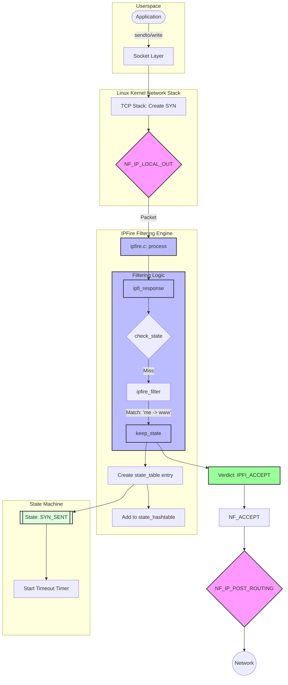
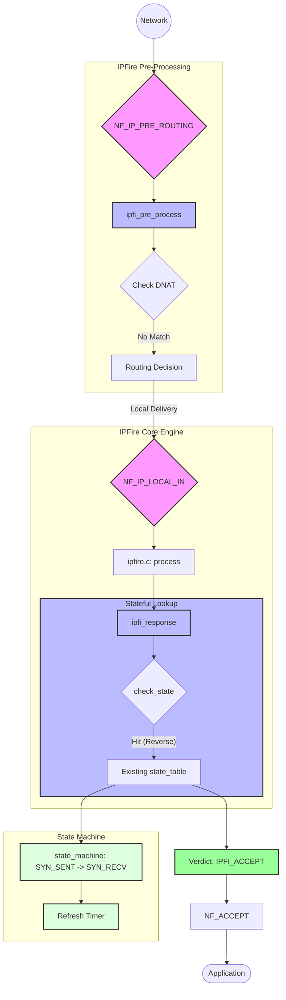
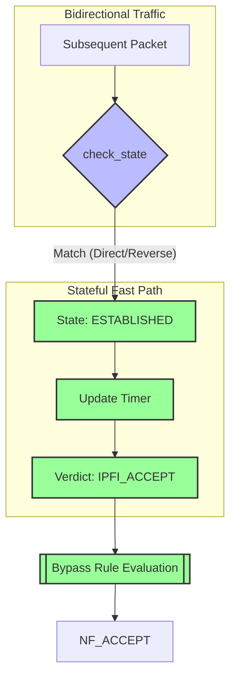
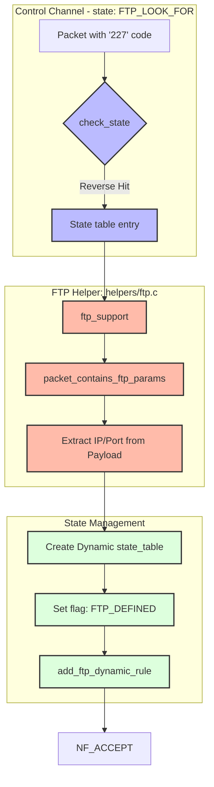
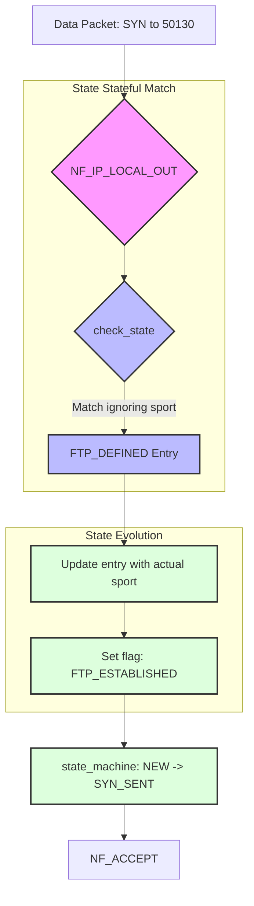
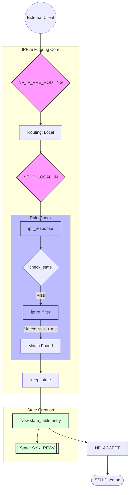
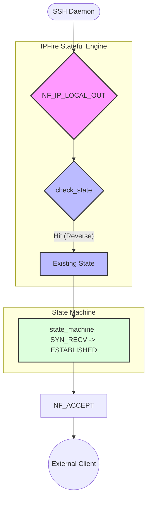
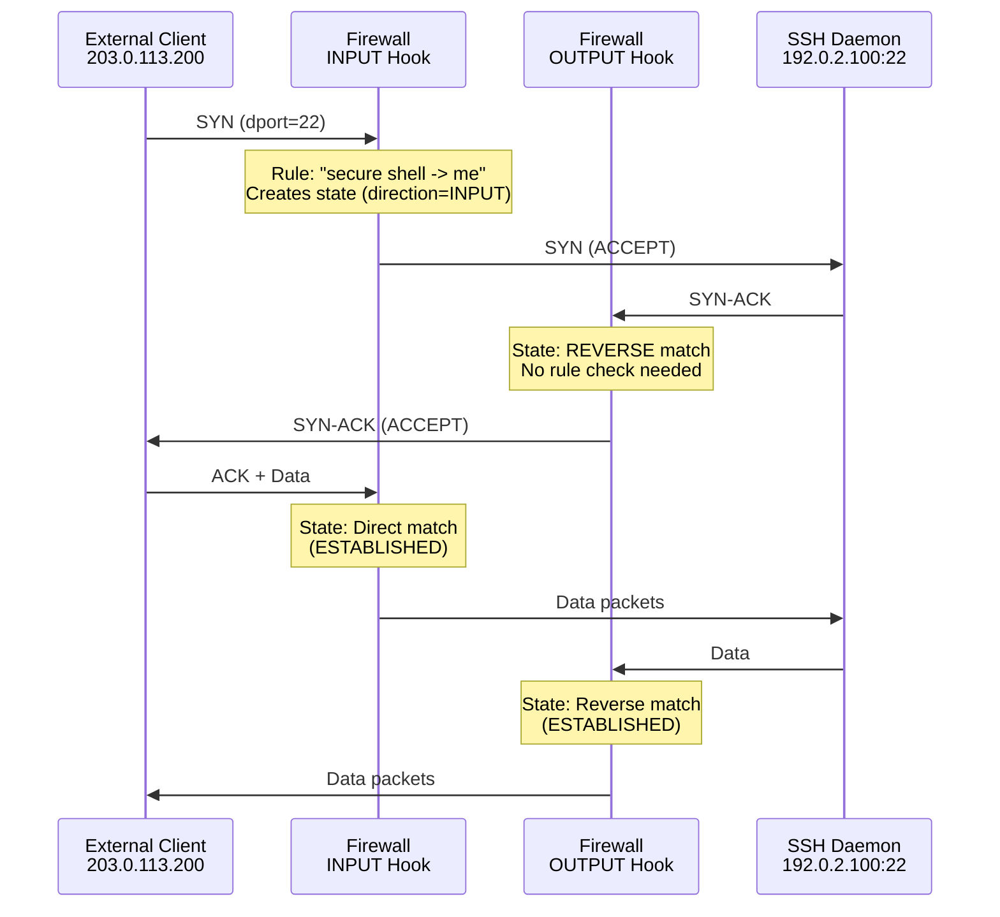

# IPFire Packet Flow Walkthrough

This document provides comprehensive walkthroughs of packet flows through the IPFire kernel firewall module for three representative rules from `allowed.base`. Each walkthrough demonstrates different firewall concepts and provides detailed diagrams showing packet traversal through Netfilter hooks and the IPFire filtering engine.

---

## Rule Selection

We analyze three conceptually different rules that showcase the firewall's capabilities:

1. **HTTP Connection (Stateful)** - Basic stateful connection tracking
2. **FTP Control Connection (Passive FTP)** - Dynamic state creation for data channels
3. **SSH Bidirectional Access** - Both INPUT and OUTPUT paths with state tracking

---

## Rule 1: HTTP Connection (Stateful)

### Rule Definition
```
RULE
NAME=me -> www
DIRECTION=OUTPUT
MYSRCADDR
PROTOCOL=6
DSTPORT=80
KEEP_STATE=YES
```

### Scenario
A user on the firewall machine initiates an HTTP connection to a web server at `203.0.113.50:80`.

### Outgoing SYN Packet Flow



#### Key Operations

1. **Hook Entry**: `NF_IP_LOCAL_OUT` invokes `ipfi_response()` with `flow.direction = IPFI_OUTPUT`
2. **State Check**: `check_state()` searches hash table - no match (new connection)
3. **Rule Matching**: `ipfire_filter()` iterates through permission rules
4. **Rule Match**: Matches `me -> www` (protocol=6, dport=80, MYSRCADDR, OUTPUT)
5. **State Creation**: `keep_state()` allocates new `state_table`:
   ```c
   state_table {
       saddr: 192.0.2.100        // Local firewall IP
       daddr: 203.0.113.50       // Web server IP
       sport: 54321              // Ephemeral port
       dport: 80                 // HTTP
       protocol: IPPROTO_TCP
       state: SYN_SENT
       direction: IPFI_OUTPUT
       rule_id: <hash of rule>
   }
   ```
6. **Hash Table**: Entry added to `state_hashtable` using `jhash_3words(saddr, daddr, ports)`
7. **Timer**: Setup timer expires in ~120 seconds (setup/shutdown timeout)
8. **Verdict**: Returns `NF_ACCEPT`

### Returning SYN-ACK Packet Flow



#### Key Operations

1. **Reverse Match**: `check_state()` finds entry with **reverse** matching:
   ```c
   // Packet has: src=203.0.113.50:80, dst=192.0.2.100:54321
   // State table: saddr=192.0.2.100:54321, daddr=203.0.113.50:80
   reverse_state_match() -> returns 1
   ```
2. **State Machine**: `state_machine()` transitions `SYN_SENT + (SYN|ACK)` → `SYN_RECV`
3. **Timer Update**: `update_timer_of_state_entry()` extends timeout to established connection timeout (~3600 seconds)
4. **No Rule Check**: Since state matched, `ipfire_filter()` is **not called**
5. **Verdict**: Returns `NF_ACCEPT` based on state match

### Established Connection Data Flow



#### Performance Note
Once state is `ESTABLISHED`, all subsequent packets bypass rule evaluation entirely, providing high-performance stateful filtering via hash table lookup.

---

## Rule 2: FTP Control Connection (Passive FTP)

### Rule Definition
```
RULE
NAME=me -> ftp control
DIRECTION=OUTPUT
MYSRCADDR
PROTOCOL=6
DSTPORT=21
KEEP_STATE=YES
FTP_SUPPORT=YES
```

### Scenario
User initiates FTP connection to `203.0.113.100:21` and enters passive mode (PASV).

### Control Connection Establishment

The initial FTP control connection follows the same flow as HTTP (Rule 1), with state tracking for `<local>:ephemeral <-> <server>:21`.

### PASV 227 Response Flow

When the server sends a PASV 227 reply like:
```
227 Entering Passive Mode (203,0,113,100,195,210)
```

This encodes data channel endpoint: `203.0.113.100:50130` (195*256 + 210)



#### Key Operations

1. **FTP Flag Check**: Control connection state has `ftp = FTP_LOOK_FOR`
2. **Payload Inspection**: `ftp_support()` in `helpers/ftp.c` scans TCP payload
3. **227 Detection**: `data_start_with_227()` confirms "227" at start of data
4. **Parameter Extraction**: 
   ```c
   // Parses: (203,0,113,100,195,210)
   ftp_info {
       ftp_addr: 203.0.113.100 (in network order)
       ftp_port: 50130 (195*256 + 210, in network order)
       valid: 1
   }
   ```
5. **Dynamic State Creation**:
   ```c
   struct state_table *newt = kmalloc(...)
   newt->saddr = <local_ip>
   newt->sport = 0              // ANY source port
   newt->daddr = 203.0.113.100  // From FTP response
   newt->dport = 50130          // From FTP response
   newt->ftp = FTP_DEFINED      // Special FTP state
   newt->state = IPFI_NOSTATE
   ```
6. **Special Matching**: When matching FTP_DEFINED states, source port is **ignored** in first packet

### Data Connection Flow



#### FTP State Transitions
```
Control: ESTABLISHED (ftp=FTP_LOOK_FOR)
         ↓ (227 response detected)
Dynamic: Created (ftp=FTP_DEFINED, sport=0)
         ↓ (First outgoing packet)
Data:    ESTABLISHED (ftp=FTP_ESTABLISHED, sport=<actual>)
```

---

## Rule 3: SSH Bidirectional Access

### Rule Definitions
```
RULE
NAME=me -> secure shell
DIRECTION=OUTPUT
MYSRCADDR
PROTOCOL=6
DSTPORT=22
KEEP_STATE=YES

RULE
NAME=secure shell -> me
DIRECTION=INPUT
MYDSTADDR
PROTOCOL=6
DSTPORT=22
KEEP_STATE=YES
```

### Scenario A: Outgoing SSH Connection

This follows the same stateful flow as Rule 1 (HTTP), but to `dport=22`.

### Scenario B: Incoming SSH Connection

User connects FROM `203.0.113.200` TO the firewall's SSH server at `192.0.2.100:22`.



### Return Traffic (SYN-ACK from SSH daemon)



### Bidirectional Flow Diagram



---

## State Matching Logic

### Direct vs. Reverse Matching

The firewall uses sophisticated matching to handle bidirectional traffic:

#### Direct Match
```c
// State table: saddr=A, daddr=B, sport=X, dport=Y, direction=OUTPUT
// Packet:      src=A,   dst=B,   sport=X, dport=Y, hook=LOCAL_OUT
// Result: MATCH (same direction, same addresses/ports)
```

#### Reverse Match
```c
// State table: saddr=A, daddr=B, sport=X, dport=Y, direction=OUTPUT
// Packet:      src=B,   dst=A,   sport=Y, dport=X, hook=LOCAL_IN
// Result: MATCH (opposite direction, swapped addresses/ports)
```

### Hash Table Optimization

State lookups use bidirectional hash normalization:

```c
u32 get_state_hash(__u32 saddr, __u32 daddr, __u16 sport, __u16 dport, __u8 proto)
{
    // Normalize: smaller address/port first
    if (saddr > daddr || (saddr == daddr && sport > dport)) {
        swap(saddr, daddr);
        swap(sport, dport);
    }
    return jhash_3words(saddr, daddr, (sport << 16) | dport, proto);
}
```

This ensures both directions of a connection hash to the same bucket.

---

## Timer Management

### State Timeouts

| State | Timeout | Description |
|-------|---------|-------------|
| SYN_SENT | 120s | Setup phase |
| SYN_RECV | 120s | Setup phase |
| ESTABLISHED | 3600s | Active connection |
| FIN_WAIT | 120s | Shutdown phase |
| TIME_WAIT | 120s | Connection closing |

### Timer Optimization

Timers are only updated if >1 second has passed since last update:

```c
void update_timer_of_state_entry(struct state_table *sttable)
{
    unsigned long now = jiffies;
    if (time_after(now, sttable->last_timer_update + HZ)) {
        mod_timer(&sttable->timer_statelist, 
                  jiffies + get_timeout_by_state(sttable->protocol, sttable->state) * HZ);
        sttable->last_timer_update = now;
    }
}
```

This reduces `mod_timer` overhead for high-throughput connections.

---

## Performance Characteristics

### Rule Evaluation Bypass

Once a state is established:
- **State lookup**: O(1) hash table lookup
- **Rule evaluation**: Skipped entirely
- **Throughput impact**: Minimal (only hash computation + state machine update)

### Comparison

| Packet Type | State Lookup | Rule Evaluation | Verdict Source |
|-------------|--------------|-----------------|----------------|
| New connection SYN | Miss | Full scan | Rule match |
| Return SYN-ACK | Hit (reverse) | Skipped | State |
| Established data | Hit (direct/reverse) | Skipped | State |
| Unrelated packet | Miss | Full scan | Default policy |

---

## Summary

These three rules demonstrate:

1. **Stateful HTTP**: Basic hash-based connection tracking eliminates rule re-evaluation
2. **FTP with Passive Mode**: Dynamic state creation allows data channels through firewall
3. **Bidirectional SSH**: Separate INPUT/OUTPUT rules with unified state tracking

The IPFire architecture achieves high performance through:
- Hash table-based state lookups
- Bidirectional connection normalization  
- Timer optimization for high-throughput connections
- Bypass of rule evaluation for established states
