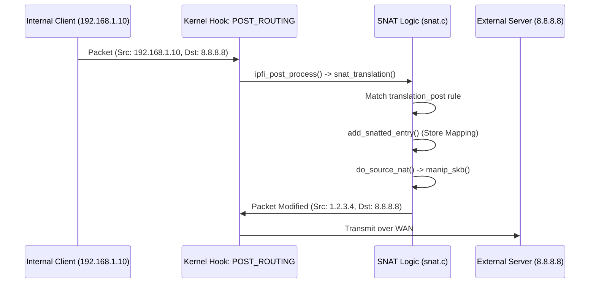
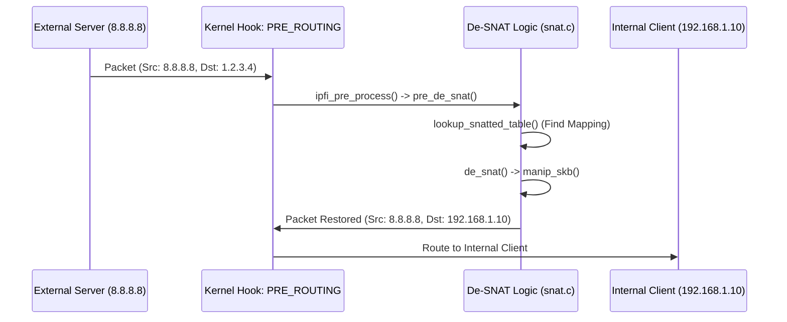
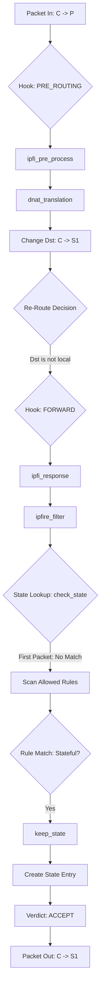

# NAT and Stateful Flow Analysis

This report details the packet flow and code logic for Source NAT (SNAT), Masquerade, and Destination NAT (DNAT) within the `ipfire-wall` kernel module, specifically focusing on their interaction with the stateful filtering engine.

## 1. Source NAT (SNAT) Flow

SNAT is typically applied to outgoing packets to replace the internal source address with a public one.

### Path: Internal Client $\rightarrow$ External Server



### Path: External Server $\rightarrow$ Internal Client (Return Path)



### Key Functions
- `snat_translation()`: Dispatcher in `POST_ROUTING`.
- `add_snatted_entry()`: Creates the dynamic mapping for the connection.
- `manip_skb()`: Performs the actual IP/Port replacement and checksum updates (`csum_replace4`, `inet_proto_csum_replace4`).
- `pre_de_snat()`: Discovers and reverses the SNAT in the `PRE_ROUTING` hook for incoming responses.

---

## 2. Masquerade Flow

Masquerade is a specialized form of SNAT that dynamically fetches the IP of the outgoing interface.

### Logical Differences from SNAT
1. **Dynamic IP**: Unlike `SNAT` which has a fixed `newaddr`, `Masquerade` calls `get_ifaddr(skb)`.
2. **Retrieval**: `get_ifaddr` utilizes `inet_select_addr(dev, dst, RT_SCOPE_UNIVERSE)` to find the most appropriate public IP for the current route.

### Key Functions
- `masquerade_translation()`: Main handler in `masquerade.c`.
- `get_ifaddr()`: Correctly extracts the interface IP using `inet_select_addr`.
- `do_masquerade()`: Triggers `manip_skb` with the dynamic IP.

---

## 3. DNAT to FORWARD with Stateful Filtering

This scenario demonstrates how a packet's destination is changed, causing it to cross into the `FORWARD` chain where it activates stateful tracking.

### The Flow: External Client $\rightarrow$ Internal Server



### Code Walkthrough Verification

1. **Rule Matching**: In `dnat_translation`, the packet is matched against the `translation_pre` list. 
2. **NAT Accounting**: `add_dnatted_entry` is called BEFORE the translation, ensuring the original `old_saddr` and `old_daddr` are captured for later reversal.
3. **Re-routing**: In `ipfire.c:process`, we detected a `daddr` change and cleared the destination cache:
   ```c
   if (daddr != ip_hdr(skb)->daddr) {
       dst_release(skb_dst(skb));
       skb_dst_set(skb, NULL);
   }
   ```
   This is **CRITICAL**; without it, the kernel would try to deliver the packet locally to the non-existent `P` address instead of forwarding it to `S1`.
4. **Stateful Interaction**:
   - In the `FORWARD` chain, `ipfire_filter` calls `check_state`. 
   - For the first packet, `check_state` misses. 
   - The packet matches a rule in the `FORWARD` list.
   - If that rule has `.state = 1`, `keep_state()` is invoked.
   - `keep_state()` records the flow: `Src: C, Dst: S1, Proto: TCP, Ports: cport, sport`.
5. **Return Path Correctness**:
   - Return packet `S1 -> C` hits `POST_ROUTING`.
   - `de_dnat_translation()` matches `new_daddr` (Server) and restores `old_daddr` (Public IP) as the source.
   - The result `P -> C` is delivered to the client, which correctly recognizes the stream.

### Checksum Integrity
The `manip_skb` function correctly updates:
- **IP Header Checksum**: via `csum_replace4`.
- **L4 Checksum (TCP/UDP)**: via `inet_proto_csum_replace4` (address change) and `inet_proto_csum_replace2` (port change).
- UDP `0` checksum is handled: `if (!pudphead->check) pudphead->check = CSUM_MANGLED_0;` (RFC 768 requirement).

> [!NOTE]
> All NAT operations are verified to be performed in a single shot per connection (static rules) through the dynamic lookup system, ensuring high-performance packet transformation.
