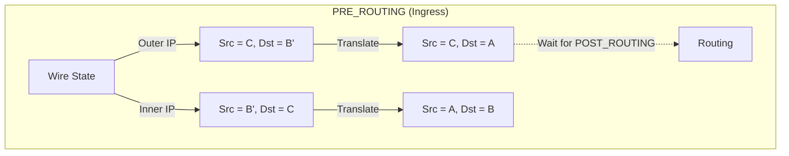
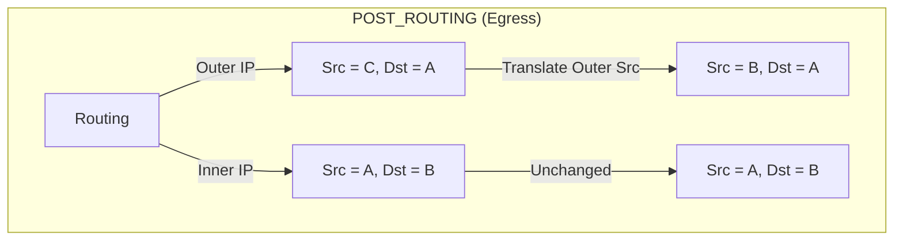
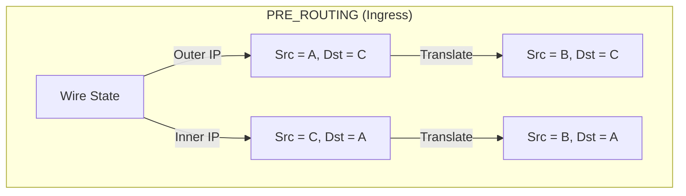
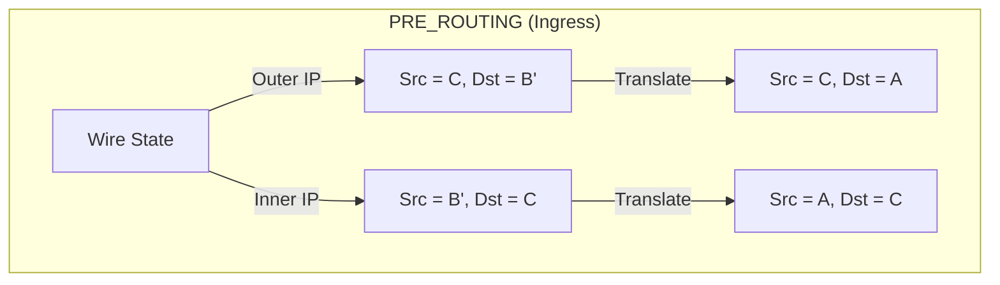

# Chapter 16: ICMP Error NAT Translation & Table Architecture

This document covers two major advanced topics in the IPFire-Wall engine:
1. The translation logic for ICMP Error payloads associated with mapped connections (DNAT & SNAT).
2. The core data structures and architectural design of the NAT and State tracking tables, specifically focusing on `ipfi_entry_head` and hash lookups.

---

## Part 1: ICMP Error NAT Translation

When a router or server drops a packet or encounters a network error, it replies with an ICMP Error message (e.g., Destination Unreachable, Time Exceeded). The payload of this ICMP message contains a copy of the original IP header and the first 8 bytes of the transport layer header (the "inner header") that caused the error.

If the original packet underwent Network Address Translation (NAT) before generating the error, the ICMP error packet returning to the client must also be reverse-translated. The firewall must rewrite both the **Outer ICMP/IP Header** (to route the error to the correct recipient) and the **Inner Packaged IP Header** (so the client recognizes the error as belonging to its original connection).

### IP Terminology

We define the following standard terminology for actors in the NAT traversal:
- **A** = Client (Original Source of the traffic)
- **B** = Firewall Public IP (External-facing IP address)
- **B'** = Firewall Masquerade / Local IP (Internal-facing IP address of the firewall)
- **C** = Server (Original Destination for SNAT, or the Internal DNAT target for DNAT)

### Case 1: DNAT Forward Direction Error (Client A to Server C)

**Scenario:** Client A sends a packet to the Firewall's Public IP (B). The Firewall DNATs the packet and forwards it to the Internal Server (C). The Server (C) rejects the packet (e.g., UDP Port Unreachable) and generates an ICMP error sent back to the Firewall (B' or A directly, depending on if Masquerade was also applied).

* The originally sent Inner Packet was: `Src = A (or B'), Dst = C`
* The generated ICMP Error on the wire (arriving at the firewall) is:
  * Outer IP: `Src = C, Dst = B' (or A)`
  * Inner IP (the original packet): `Src = B' (or A), Dst = C`

#### Translation Flow

This translation is split across `PRE_ROUTING` and `POST_ROUTING`.

**1. `PRE_ROUTING` Hook:**
We must rewrite the **Outer Dst** and **all Inner Headers**. We DO NOT rewrite the Outer Src yet to prevent the packet from being dropped by the kernel as a "martian source" (a local IP arriving from an external interface).

**2. `POST_ROUTING` Hook:**
Because the inner headers are already fully de-NATed to their original state (`Src = A, Dst = B`), the `POST_ROUTING` NAT lookup recognizes this packet as matching the DNAT entry. We now execute the final fixup: rewriting the **Outer Src** so Client A sees the error coming from the IP it was talking to (B).

### Case 2: DNAT Reverse Direction Error (Server C back to Client A)

**Scenario:** Server C sends a reply packet back to Client A. The firewall (B') or Client A itself rejects the packet and generates an ICMP error going *towards* Server C.

* The originally sent Inner Packet was: `Src = C, Dst = A (or B')`
* The generated ICMP Error on the wire (arriving at the firewall) is:
  * Outer IP: `Src = A (or B'), Dst = C`
  * Inner IP (the original packet): `Src = C, Dst = A (or B')`

#### Translation Flow

This is handled entirely in `PRE_ROUTING`. Only the Source IPs need to be un-DNATed to match the state before the original packet left the firewall.

### Case 3: SNAT / Masquerade Forward Direction Error

**Scenario:** Client A sends a packet to Remote Server C. The Firewall SNATs it to its own Public IP (B'). The Server (C) rejects the packet and generates an ICMP error sent back to the Firewall (B').

* The originally sent Inner Packet was: `Src = B', Dst = C`
* The generated ICMP Error on the wire (arriving at the firewall) is:
  * Outer IP: `Src = C, Dst = B'`
  * Inner IP (the original packet): `Src = B', Dst = C`

#### Translation Flow

Handled entirely in `PRE_ROUTING`. We rewrite the Outer Dst and Inner Src back to the original client IP (A).

