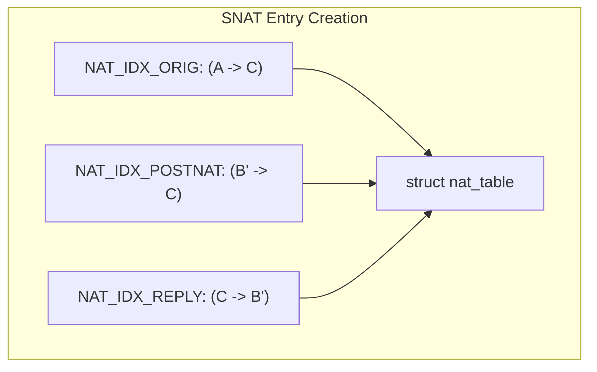
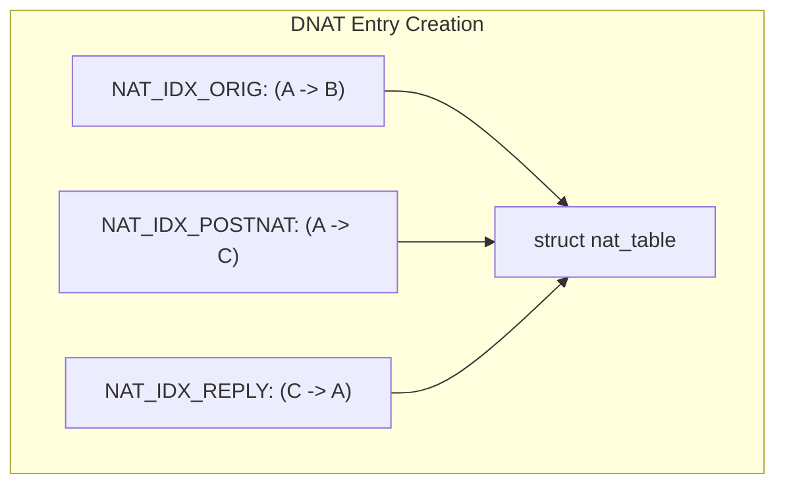
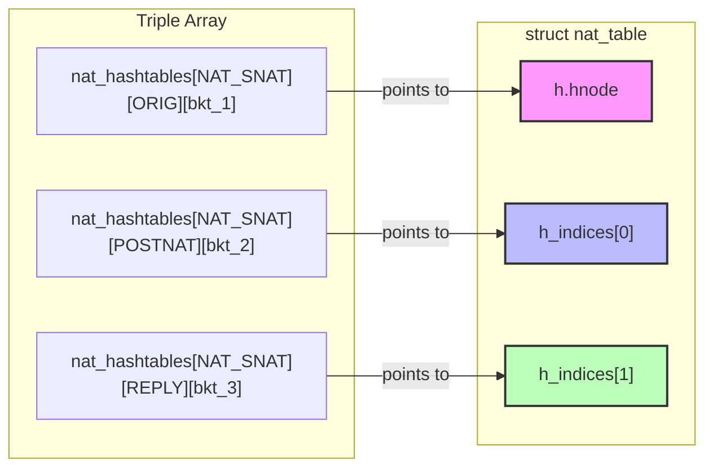

# Chapter 17: NAT Table Architecture and Lifecycle

The IPFire-Wall engine tracks NAT mappings using highly parallelized, lock-striped hash tables. To manage the lifecycle of these entries dynamically and safely, the engine uses a unified header struct known as `struct ipfi_entry_head`, which organizes hash indices, timeouts, and Reference Counting (RCU) operations.

---

## 1. The Core Lifecycle Header (`ipfi_entry_head`)

Every tracking structure (e.g., `struct nat_table`, `struct state_table`) **must** declare `struct ipfi_entry_head h;` as its **first member**. This allows the C code to safely cast between the specialized table entry and the generic lifecycle header.

```c
struct ipfi_entry_head {
  struct timer_list timer;
  struct work_struct cleanup_work;
  struct rcu_head rcuh;
  struct list_head lnode; 
  struct hlist_node hnode; 
  refcount_t refcnt;
  unsigned long status;
  unsigned long last_timer_update;
};
```

* **`timer`**: A kernel timer that fires when the connection times out.
* **`cleanup_work`**: A workqueue struct used to defer destruction of the entry to process context (removing an entry from a timer interrupt context can cause lock inversion or sleep-in-atomic issues).
* **`rcuh`**: The Read-Copy-Update (RCU) head. Used to schedule the memory free (`kfree`) *after* all currently executing readers (who might still be holding a pointer to the entry) have exited their RCU critical sections.
* **`lnode`**: A standard linked-list node. This is used by the generic LRU (Least Recently Used) list implementations, particularly in the logging table.
* **`hnode`**: A hash-list node used to link the entry into an array of hash buckets. This represents the **Primary Lookup Index** (`NAT_IDX_ORIG`).
* **`refcnt`**: Reference counter. Ensures the memory is not freed while multiple threads or packets are actively processing the connection.
* **`status`**: A bitmask used for atomic state flags (e.g., `IPFI_ENTRY_REMOVED` ensures the entry is only deleted once).
* **`last_timer_update`**: Timestamp used for timer throttling (avoiding a lock/update on the timer data structure for every single packet).

---

## 2. NAT Indices (`NAT_IDX_ORIG`, `POSTNAT`, `REPLY`)

A single `struct nat_table` entry tracks a bi-directional traffic flow. The firewall must be able to lookup the NAT entry using the packet tuple as it appears at different stages of the network stack.

To handle this, the engine hashes the connection into three separate indices:

### `NAT_IDX_ORIG` (Index 0)
* **Meaning:** The original 5-tuple of the packet that *created* the translation, before any IP addresses or ports were altered.
* **Hook Usage:** Used when the identical client sends a subsequent packet matching the exact original 5-tuple. 
* **Data Structure:** Embedded directly as `h.hnode`.

### `NAT_IDX_POSTNAT` (Index 1)
* **Meaning:** "Post-NAT" or "Post-Routing" state. The 5-tuple of the packet *after* the firewall has applied the translation, as it looks leaving the router.
* **Hook Usage:** This index is strictly used for matching **ICMP Error payloads** in `PRE_ROUTING` and `POST_ROUTING`. When an downstream router returns an ICMP error, the inner IP payload inside the ICMP packet matches the `POSTNAT` state (e.g., Firewall Public IP -> Server C), not the original state (Client A -> Server C).
* **Data Structure:** Embedded as `h_indices[0]`.

### `NAT_IDX_REPLY` (Index 2)
* **Meaning:** The expected reverse flow. The 5-tuple of the reply packet returning from the destination. 
* **Hook Usage:** Used to match returning traffic to reverse the NAT. For SNAT, matched in `PRE_ROUTING` to un-SNAT the destination back to the client. For DNAT, matched in `POST_ROUTING` to un-DNAT the source back to the firewall's public IP.
* **Data Structure:** Embedded as `h_indices[1]`.

---

## 3. Scenario Flows for Indices

### SNAT / Masquerade Scenario

1. Client A sends packet to Server C. `Tuple = (A -> C)`.
2. Firewall intercepts in `POST_ROUTING`, applies SNAT. Packet becomes `(B' -> C)`.
3. Firewall creates a `NAT_SNAT` entry:



When returning traffic `(C -> B')` arrives at `PRE_ROUTING`, the firewall calculates its hash, searches `NAT_IDX_REPLY`, finds the `nat_table` entry, and rewrites the destination back to `(A)`.

### DNAT / Port Forwarding Scenario

1. Client A sends packet to Firewall Public IP B. `Tuple = (A -> B)`.
2. Firewall intercepts in `PRE_ROUTING`, applies DNAT. Packet becomes `(A -> C)`.
3. Firewall creates a `NAT_DNAT` entry:



When returning traffic `(C -> A)` arrives at `POST_ROUTING`, the firewall searches `NAT_IDX_REPLY`, finds the `nat_table` entry, and rewrites the source back to `(B)`.

---

## 4. The `nat_hashtables` Triple Array

The global tracking table for NAT is defined in `common/globals.c` as:
```c
struct hlist_head nat_hashtables[2][NAT_IDX_COUNT][1 << NAT_HASH_BITS];
```

This is a 3-Dimensional array representing the entire hash map:

1. **`[2]` (Type):** Distinguishes between `NAT_SNAT` (0) and `NAT_DNAT` (1).
2. **`[NAT_IDX_COUNT]` (Index):** `ORIG=0`, `POSTNAT=1`, `REPLY=2`.
3. **`[1 << NAT_HASH_BITS]` (Bucket):** The actual hash buckets array (e.g., 256 buckets) where collisions are resolved via linked lists.

### How an entry is linked into the Triple Array

When a single `struct nat_table` is created, it is inserted into the 3D array three separate times, using its three different node pointers (`hnode`, `h_indices[0]`, `h_indices[1]`).



When the router needs to look up the Reverse flow for a DNAT connection, it executes `lookup_nat_idx(NAT_DNAT, NAT_IDX_REPLY, skb)`. The function:
1. Calculates the hash of the current SKB (the returning packet).
2. Modulos the hash against `(1 << NAT_HASH_BITS)` to find `Bucket N`.
3. Traverses the linked list at `nat_hashtables[1][2][N]`.
4. As it traverses, it inspects the `h_indices[1]` nodes. Because `h_indices` is embedded in `struct nat_table`, the C `container_of` macro safely resolves the `h_indices` pointer backwards in memory to find the start of the `struct nat_table` itself, giving the router access to all NAT rewrite data.
