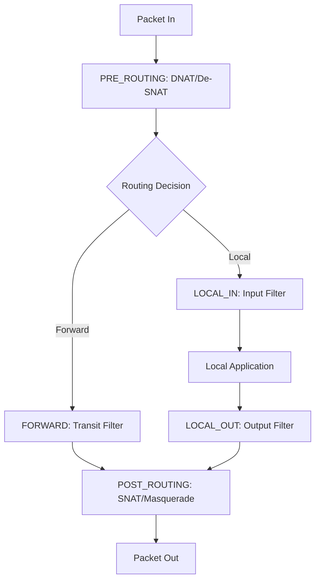
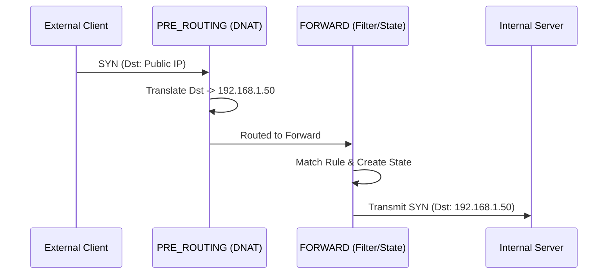
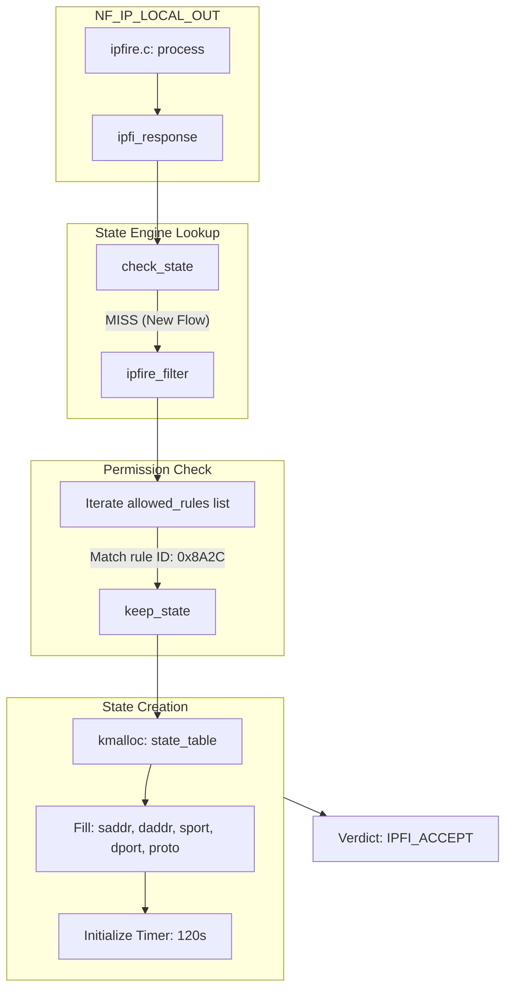

# IPFire-Wall: Consolidated Project Report

*Generated on: Thu Feb  5 03:58:27 PM CET 2026*

# Chapter 1: Refactoring & Optimization

This chapter documents the structural and performance improvements implemented during the refactoring phase of the IPFire-Wall project.

## 1.1. Modular Source Reorganization
The module was transitioned from a flat, monolithic directory structure to a specialized modular hierarchy to improve maintainability and codebase clarity.

### Directory Mapping
| Subdirectory | Responsibility |
|--------------|----------------|
| `common/` | Shared data structures, constants, and global utility functions. |
| `filter/` | The core filtering engine, rule traversal logic, and stateful hooks. |
| `filter/state/` | State machine implementation and state table management. |
| `nat/` | Translation logic for DNAT, SNAT, and Masquerade. |
| `netlink/` | Communication layer between the kernel and userspace commands. |
| `proc/` | Implementation of the `/proc/ipfire` interface. |
| `includes/` | Centralized repository for all internal headers. |

## 1.2. Per-CPU Statistics Optimization
To ensure maximum performance on multi-core systems, the statistics tracking was moved from global atomics (which cause cache-line bouncing) to purely per-CPU counters.

- **Infrastructure**: Counters are instances of `struct ipfi_counters` allocated via `alloc_percpu`.
- **Latency Reduction**: Updates in the network hot path (like `INPUT` or `FORWARD`) use the `IPFI_STAT_INC` macro, which translates to a single instruction per-core increment.
- **On-Demand Aggregation**: Global totals are only computed when a user runs `ipfire -s`, at which point the kernel iterates over all online CPUs and sums the values.

## 1.3. Netlink Protocol Simplification
The Netlink message structure was streamlined by removing legacy per-packet sequence IDs (`packet_id` and `logu_id`).

- **Rationale**: Sequential IDs created a bottleneck for parallel packet processing.
- **Reporting Transition**: Reliability is now monitored by the kernel itself. If a Netlink send fails (e.g., due to a full buffer), the kernel increments a `total_lost` counter. The userspace app now requests this counter on-demand rather than inferring loss from gaps in sequence IDs.

## 1.4. Build System Modernization
A shadow-tree build system was implemented using a `build/` directory.
- **Feature**: Source files are symlinked into `build/` before compilation.
- **Benefit**: All intermediate artifacts (`.o`, `.mod`, etc.) are hidden from the main source tree, keeping the environment clean for development.

---

# Chapter 2: Kernel Module Architecture

This chapter explains the internal workings of the IPFire-Wall kernel module, its integration with Netfilter, and how it evaluates security policies.

## 2.1. Netfilter Hook Integration
IPFire-Wall registers itself at several points in the Linux network stack (Hooks).



## 2.2. Rule Hierarchy & Evaluation Logic
When a packet hits a filtering hook (`LOCAL_IN`, `LOCAL_OUT`, or `FORWARD`), it is evaluated against several lists of rules in a prioritized sequence.

### The Priority Chain:
1. **Blacklist (Dropped Rules)**: The engine first scans the `dropped` list. If a match is found, the packet is discarded immediately. This ensures that blocked entities cannot bypass later permission checks.
2. **Administrator Rules (Root)**: The `allowed` list is scanned for rules inserted by the system administrator.
3. **User Rules**: If enabled, rules defined by non-root users are checked next.

### Evaluation Mechanism:
- **First-Match Wins**: The evaluation stops as soon as a rule matches.
- **Default Policy**: If no rule matches any list, the module applies the `default_policy` (configured as either `ACCEPT` or `DROP`).

## 2.3. Filtering Granularity
Rules can match packets based on a wide array of criteria:
- **L3 (IP)**: Source/Destination IP addresses and IP Options.
- **L4 (Transport)**: Protocol (TCP, UDP, ICMP, IGMP) and Port numbers.
- **Direction**: Inbound, Outbound, or Forwarded.
- **Interface**: Incoming or Outgoing network device indices.
- **Payload**: FTP command inspection (for dynamic NAT).

---

# Chapter 3: Stateful Connection Management

IPFire-Wall employs a stateful inspection engine that tracks the status of network connections to improve both security and performance.

## 3.1. The Stateful Fast-Path
One of the core design goals is to avoid re-evaluating the entire rule list for every packet in a high-volume stream.

- **Slow Path**: The **first packet** (e.g., a TCP SYN) triggers a full scan of the rule lists. If accepted by a stateful rule, an entry is created in the `state_table`.
- **Fast Path**: Lookups for **subsequent packets** are performed against the state table using a hash-based mechanism (`jhash_3words`). This lookup is **O(1)**, meaning it stays fast regardless of how many rules are active.

## 3.2. State Transition Tracking
The module implements a dedicated state machine for different protocols.

### TCP Connection Lifecycle:
- `SYN_SENT`: Initial request seen.
- `SYN_RECV`: Reply from server seen (SYN/ACK).
- `ESTABLISHED`: Handshake complete (ACK seen).
- `FIN_WAIT / CLOSE_WAIT`: Connection termination in progress.

### UDP "Pseudo-States":
Since UDP is connectionless, the engine creates virtual states (`UDP_NEW` -> `UDP_ESTABLISHED`) to allow return traffic (e.g., DNS responses) through the firewall for a defined period.

## 3.3. Table Management
- **Lookups**: Perform bidirectional hashing. Both sides of a connection (`A:port1 <-> B:port2` and `B:port2 <-> A:port1`) produce the same hash key, allowing consistent tracking of bidirectional flows.
- **Lifetimes**: Every state entry has an associated kernel timer. If no traffic is seen for a specific duration (e.g., 3600s for ESTABLISHED TCP, or ~30s for UDP), the entry is automatically purged to free resources.
- **Capacity**: The firewall enforces a `max_state_entries` limit to prevent resource exhaustion attacks.

## 3.4. FTP Support
The engine includes a specialized parser for the FTP protocol. It monitors the "control" channel for `PASV` commands and dynamically injects "Data Channel" states, allowing passive FTP to function through the NAT without requiring manual rule openings for high-numbered ports.

---

# Chapter 4: Userspace Application (ipfire)

The `ipfire` utility is the primary administrative tool for interacting with the kernel-space firewall module.

## 4.1. Core Usage & CLI Flags
The application communicates with the kernel via Netlink sockets using the `IPFI_CONTROL` and `IPFI_DATA` protocols.

| Flag | Action | Description |
|------|--------|-------------|
| `-v` | Version / Status | Shows if the module is loaded and current global settings. |
| `-s` | Statistics | Displays a combined report of kernel per-CPU counters and userspace logging counts. |
| `-X` | Flush | Clears all current filtering rules and resets the state table. |
| `-p <policy>` | Set Policy | Changes the default policy to `accept` or `drop`. |
| `-a <rule>` | Add Rule | Inserts a new rule into the appropriate chain. |

## 4.2. Configuration Files
The application behavior can be customized via config files, typically located in `/etc/ipfire/`.

- `allowed.base`: List of rules to be automatically loaded on startup.
- `ipfire.conf`: Global options such as logging levels, max NAT entries, and stateful tracking defaults.

## 4.3. Interpreting Statistics
The `-s` (Statistics) output is divided into three sections:
1. **Userspace Stats**: Counts of packets actually received and displayed by the tool. Useful for auditing.
2. **Kernel Stats**: High-level counters for `INPUT`, `OUTPUT`, `FORWARD`, and `POST-ROUTING`.
3. **Transmission Health**: Specifically reports `total_lost` (packets the kernel tried to log but couldn't due to buffer pressure).

## 4.4. Logging and Real-time Monitoring
When running, `ipfire` can act as a listener, printing headers for every packet matched by a rule with the `NOTIFY` flag. These logs include:
- Timestamp and user ID.
- Hook location and verdict (ACCEPT/DROP).
- Detailed IP/TCP/UDP header information.

---

# Chapter 5: Packet Flow Walkthroughs

This chapter provides step-by-step analysis of how specific real-world packet scenarios traverse the IPFire-Wall engine.

## 5.1. Scenario 1: DNAT to Forwarded Internal Server
An external client connects to the firewall's public IP on port 80, which is redirected to an internal web server.

1. **PRE_ROUTING Hook**:
   - The packet `Src:Client, Dst:Firewall_Public` is intercepted.
   - `dnat_translation()` matches a rule and changes the destination to `Firewall_Internal_Server`.
   - The kernel is notified of the `daddr` change and clears the old route.
2. **Routing Decision**: The kernel finds the route for the new internal destination; it is not local, so the packet moves to the FORWARD hook.
3. **FORWARD Hook**:
   - `ipfire_filter()` is called.
   - It identifies this as a new connection.
   - It matches a stateful rule allowing traffic to the server.
   - `keep_state()` creates an entry in the state table.
4. **POST_ROUTING Hook**: The packet leaves the firewall towards the internal server.



## 5.2. Scenario 2: Masqueraded Outbound Connection
An internal client connects to the internet; the firewall hides the internal IP.

1. **LOCAL_OUT / FORWARD**: The packet is accepted by the filtering engine.
2. **POST_ROUTING**:
   - `masquerade_translation()` is called.
   - The engine dynamically finds the IP address of the outgoing WAN interface (`get_ifaddr`).
   - The packet's source address is replaced.
   - An entry is added to the `snat_table` to handle return traffic.

## 5.3. Scenario 3: Stateful Return Traffic
The reply from a previously accepted connection arrives.

1. **PRE_ROUTING**: If the original connection was NATed, the reverse translation is applied here.
2. **LOCAL_IN / FORWARD**:
   - `check_state()` is called.
   - A **reverse match** is found in the state table.
   - **Verdict: ACCEPT**. Rule evaluation is skipped entirely.
   - The state machine transitions (e.g., to `SYN_RECV` or `ESTABLISHED`).
3. **Delivery**: The packet is delivered to the initial requestor.

---

# IPFire Packet Flow Walkthrough (Technical Master Edition)

This document provides exhaustive technical walkthroughs of packet flows through the IPFire kernel module. It goes beyond high-level logic to explore the internal function call stacks, specific source code segments, and low-level state transitions.

---

## 1. The Filtering Lifecycle: Hook to Verdict

Every packet handled by IPFire follows a predictable lifecycle within the kernel.

### The Standard Call Stack
When a packet is intercepted by a Netfilter hook, the following internal chain is executed:

1.  **`ipfire.c:process()`**: The primary dispatcher for all hooks.
2.  **`ipfi_response()`**: Orchestrates the filtering decision.
3.  **`check_state()`**: Performs the O(1) hash lookup for established flows.
4.  **`ipfire_filter()`**: (If state miss) Performs the O(n) rule comparison.
5.  **`keep_state()`**: (If match) Initializes a new state tracking entry.

---

## 2. Scenario 1: Stateful HTTP Connection (OUTPUT)

### 2.1. Initial SYN (The "Slow Path")

When an application initiates a connection, the first packet triggers the "Slow Path" logic.

#### Analysis of Rule Matching Logic
In `ipfire_filter()`, the engine iterates through the `allowed` list. For an HTTP rule, the matching sequence looks like this:

```c
// Internal Matching Core (conceptual simplified C)
if (rule->direction == flow->direction && 
    (rule->protocol == 0 || rule->protocol == ip_hdr(skb)->protocol)) {
    
    // Transport layer check
    if (transport_protos_match(skb, rule)) {
        // Source/Dest IP check
        if (ip_match(skb, rule)) {
            return MATCH_FOUND;
        }
    }
}
```

#### Detailed Outgoing SYN Workflow



### 2.2. Returning SYN-ACK (The Transition)

The reply packet is the first "Reverse" match. This packet is critical because it transitions the state from `SYN_SENT` to `SYN_RECV`.

#### Internal Call: `check_state()`
The lookup in `check_state()` uses a normalized hash to find the entry regardless of direction:

```c
// Hash computation normalization
u32 hash = get_state_hash(saddr, daddr, sport, dport, proto);
// The saddr/daddr are swapped in the call to get_state_hash for reverse packets
```

### 2.3. The Fast Path (Established Data)

Once the 3-way handshake is complete, every subsequent packet avoids the rule list entirely.

#### Performance Metrics
- **Slow Path (First Packet)**: O(N) where N is number of rules in the list.
- **Fast Path (Subsequent)**: O(1) Hash Table lookup + State machine update.

---

## 3. Scenario 2: Passive FTP (Dynamic NAT)

FTP is complex because it uses a control channel to negotiate a dynamic data channel.

### 3.1. The Payload Inspection
When `FTP_SUPPORT=YES` is enabled, the state engine invokes the FTP helper during the control connection's lifetime.

#### The Hook: `helpers/ftp.c`
When a packet is identified as part of an FTP control stream, the engine calls `ftp_support()`:

```c
// Scanning for PASV response
if (data_start_with_227(payload)) {
    extract_ftp_info(payload, &finfo);
    if (finfo.valid) {
        add_ftp_dynamic_rule(sttable, finfo.ip, finfo.port);
    }
}
```

### 3.2. Data Channel "Prediction"
The `add_ftp_dynamic_rule` creates a "zombie" state entry that has no active ports yet but is pre-authorized by the control channel's policy.

---

## 4. Scenario 3: DNAT Interaction with FORWARD Hook

This is one of the most technical flows in the module because it spans across different kernel subsystem triggers.

### 4.1. Destination Translation (PRE_ROUTING)
The packet enters `PRE_ROUTING` and is transformed.

| Feature | Logic |
|---------|-------|
| **Transformation** | `ip_hdr(skb)->daddr` is changed to the internal server IP. |
| **Checkums** | `ip_send_check(iph)` is called to recompute the L3 CRC. |
| **Routing Trigger** | The destination cache (`skb_dst(skb)`) is released to force a re-route. |

```c
// Forcing Re-routing in ipfi_pre_process
if (daddr_changed) {
    dst_release(skb_dst(skb));
    skb_dst_set(skb, NULL); // Kernel will re-route before next hook
}
```

### 4.2. State Tracking in the FORWARD Hook
Because the destination was changed to a non-local address, the kernel routes the packet to the `FORWARD` chain instead of `LOCAL_IN`.

1.  **State Lookup**: `check_state` misses because the *modified* addresses are hashed.
2.  **Rule Match**: The `FORWARD` rule list is scanned.
3.  **State Creation**: A state is created based on the **post-NAT** addresses. This is critical for matching return traffic correctly.

---

## 5. Summary Table: Flow Characteristics

| Phase | Hook | Path | Algorithm | Complexity |
|-------|------|------|-----------|------------|
| Initialization | Any | Slow | Rule List Scan | O(Rules) |
| Established | Any | Fast | JHash Table | O(1) |
| NAT (Pre) | PRE_ROUTING | Logic | Rules + Table | O(NAT_Rules) |
| NAT (Post) | POST_ROUTING| Logic | Dynamic Table | O(1) |

---

# TCP/UDP State Machine: Deep Dive (Technical Master Edition)

This chapter provides an exhaustive analysis of the IPFire state machine, detailing how it tracks connection lifetimes, handles exceptions, and optimizes performance for high-throughput flows.

---

## 1. TCP State Lifecycle

The state machine implements a robust subset of RFC 793 to track connection health.

### 1.1. State Transition Table

The following table summarizes the legal transitions within the IPFire kernel.

| Current State | Event (Flags) | Next State | Logic Context |
|---------------|---------------|------------|---------------|
| `NOSTATE` | `SYN` (Out/In) | `SYN_SENT` | Initial Handshake Start |
| `SYN_SENT` | `SYN+ACK` (Rev) | `SYN_RECV` | Handshake Response |
| `SYN_RECV` | `ACK` (Dir) | `ESTABLISHED`| Connection Fully Open |
| `ESTABLISHED` | `FIN` (Out/In) | `FIN_WAIT` | Teardown Start |
| `FIN_WAIT` | `ACK` (Rev) | `CLOSE_WAIT`| Two-stage Termination |
| `ANY` | `RST` | `CLOSED` | Immediate Teardown |

### 1.2. The Three-Way Handshake Core Logic

The implementation in `ipfi_state_machine.c` ensures strict flag checking during the setup phase:

```c
// handshake logic segment
if (syn && !ack && !rst && !fin) {
    if (current_state == NOSTATE) return SYN_SENT;
}

if (syn && ack && !rst && !fin && reverse) {
    if (current_state == SYN_SENT) return SYN_RECV;
}

if (!syn && ack && !rst && !fin && !reverse) {
    if (current_state == SYN_RECV) return ESTABLISHED;
}
```

---

## 2. Timer Aggregation Logic

To avoid the performance penalty of frequent timer renewals (`mod_timer` syscall overhead), IPFire implements a "1-second throttle".

### 2.1. Why Aggregation?
In a high-speed Gbit link, a single connection might send thousands of packets per second. Updating the kernel timer for every packet would consume excessive CPU cycles.

### 2.2. The Implementation
The engine only updates the timer if at least 1 second (measured in `HZ` / Jiffies) has elapsed since the last update.

```c
void update_timer_of_state_entry(struct state_table *sttable) {
    unsigned long now = jiffies;
    // HZ represents 1 second in kernel-time
    if (time_after(now, sttable->last_timer_update + HZ)) {
        mod_timer(&sttable->timer_statelist, 
                  jiffies + get_timeout_by_state(sttable->protocol, sttable->state) * HZ);
        sttable->last_timer_update = now;
    }
}
```

---

## 3. GUESS States & Normalization

GUESS states are a unique feature of IPFire that allows it to "adopt" existing connections that were established before the module was loaded.

### 3.1. Mid-Flow Connection Detection
If a packet arrives that is NOT a SYN but has no matching state, the machine "guesses" where it belongs.

```c
// GUESS_ESTABLISHED detection
if (!rst && !fin && !syn && ack && (current_state == NOSTATE)) {
    return GUESS_ESTABLISHED;
}
```

### 3.2. Normalization on Storage
The engine returns a GUESS state for accounting, but **normalizes** it to a standard state before storing it in the hash table. This ensures future packets follow standard RFC transitions.

```c
// Normalization logic in set_state()
if (found_state == GUESS_ESTABLISHED) {
    entry->state.state = ESTABLISHED;
} else if (found_state == GUESS_SYN_RECV) {
    entry->state.state = SYN_RECV;
}
```

---

## 4. UDP "Pseudo-States"

Since UDP is stateless, the machine uses timeout-based persistence to simulate connection tracking.

- **`UDP_NEW`**: Created on the first packet.
- **`UDP_ESTAB`**: Promoted on the first *return* packet (where `reverse == 1`).
- **Timeout**: Typically 30-60 seconds of inactivity.

---

## 5. Security & Established Flow Bypass

One of the most important design decisions is that **Established flows bypass permission rules entirely.**

### Why?
1.  **Consistency**: Once a connection is allowed by a rule, it should remain allowed until it closes. If a firewall rule changes mid-connection, the active stream isn't "cut" unless explicitly flushed.
2.  **Performance**: Rule lists can be long (O(N)). Hash table lookups are O(1). By skipping the list for millions of data packets, we save massive amounts of CPU time.

---

# NAT and Stateful Flow Analysis (Technical Master Edition)

This report details the packet flow and code logic for Source NAT (SNAT), Masquerade, and Destination NAT (DNAT) within the IPFire kernel module, specifically focusing on the low-level manipulation of the `sk_buff` structure and transport headers.

---

## 1. The Core Engine: `manip_skb`

All NAT operations in IPFire eventually funnel into the `manip_skb()` function. This function is responsible for the delicate task of modifying packet headers while maintaining protocol integrity (checksums).

### 1.1. Step-by-Step Logic
1.  **L3 Address Swap**: The IP header's source or destination address is replaced.
2.  **L3 Checksum Update**: Since the IP header Changed, the CRC must be updated. IPFire uses incremental updates for performance.
3.  **L4 Port Swap**: For TCP/UDP, the source/destination ports are replaced.
4.  **L4 Checksum Update**: Transport layer checksums (TCP/UDP) include a "pseudo-header" that contains the IP addresses. Therefore, changing an IP address REQUIRES recomputing the L4 checksum.

### 1.2. Incremental Checksum Logic
Instead of recalculating the entire packet checksum from scratch (which is expensive), IPFire uses the `csum_replace4` utility from the kernel:

```c
// Example: Updating IP Header Checksum after address change
csum_replace4(&iph->check, oldaddr, newaddr);

// Example: Updating TCP Checksum for Pseudo-Header change
inet_proto_csum_replace4(&tcph->check, skb, oldaddr, newaddr, true);
```

---

## 2. Source NAT (SNAT) and Masquerade

### 2.1. SNAT Lifecycle
In `POST_ROUTING`, the engine identifies packets requiring SNAT.

1.  **Rule Match**: `snat_translation()` finds a match in `translation_post`.
2.  **Accounting**: `add_snatted_entry()` records the `(original_src -> new_src)` mapping. This is vital for "De-SNATting" the return traffic.
3.  **Transformation**: `do_source_nat()` executes the `manip_skb` logic on the source fields.

### 2.2. Masquerade: The Dynamic SNAT
Masquerade is identical to SNAT except it doesn't have a fixed IP. It calls `get_ifaddr()` which uses `inet_select_addr()` to find the primary IP of the outgoing network interface.

---

## 3. Destination NAT (DNAT): The Routing Challenge

DNAT is the most complex because it happens in `PRE_ROUTING`, *before* the kernel makes its final routing decision.

### 3.1. Re-Routing Logic
If IPFire changes the destination IP of a packet, the kernel's original routing plan (based on the old IP) is now invalid. To fix this, IPFire must manually clear the kernel's destination cache.

```c
// Force re-routing in ipfi_pre_process
if (daddr != iph->daddr) {
    dst_release(skb_dst(skb)); // Free old route
    skb_dst_set(skb, NULL);    // Tell kernel to re-route
}
```

### 3.2. Interaction with FORWARD Hook
When a packet's destination is changed to an internal server (e.g., Load Balancing), it no longer looks like a "Local In" packet.

1.  **Kernel Decision**: After `PRE_ROUTING` and the `skb_dst_set(NULL)` call, the kernel re-runs the routing table.
2.  **Path Change**: The packet is now destined for an internal network, so it enters the `FORWARD` hook.
3.  **State Logic**: In the `FORWARD` hook, `check_state` misses (because it was just created/NATted), and the packet hits the FORWARDing permission rules.

---

## 4. Checksum Corner Cases

### 4.1. UDP Zero Checksum
RFC 768 allows UDP checksums to be `0` (disabled). However, when we NAT a packet, most kernels require that if you change the address, you MUST provide a valid checksum or a specific "mangled zero" value if the original was zero.

```c
// Handle UDP zero checksum
if (!pudphead->check) {
    pudphead->check = CSUM_MANGLED_0;
}
```

---

## 5. Summary: NAT Hook Matrix

| NAT Type | Direction | Hook | Primary Objective |
|----------|-----------|------|-------------------|
| **SNAT** | Outgoing | `POST_ROUTING` | Hide internal IP |
| **Masq** | Outgoing | `POST_ROUTING` | Dynamic SNAT for WAN |
| **DNAT** | Incoming | `PRE_ROUTING` | Port Forwarding / LB |
| **Re-NAT**| Incoming | `PRE_ROUTING` | Restoring original IP |

---

# Developer API Guide: Internal Kernel Interfaces

This guide provides technical documentation for developers who wish to extend or integrate with the IPFire kernel module.

---

## 1. Centralized Data Structures (`common/`)

Shared structures are defined in `common/ipfi_structures.h` to ensure consistency between kernel and userspace.

### 1.1. `ipfire_info_t`
The primary metadata carrier for packets in the filtering hot path.

```c
typedef struct {
    __u32 saddr, daddr;    // Source and Destination IPs
    __u16 sport, dport;    // Source and Destination Ports
    __u8 proto;            // Protocol (TCP/UDP/ICMP)
    __u8 direction;        // IPFI_INPUT, IPFI_OUTPUT, IPFI_FWD
    __u32 rule_id;         // Hash of the matching rule
    // ... statistics fields ...
} ipfire_info_t;
```

---

## 2. Kernel API: Core Logic Functions

### 2.1. `ipfi_response()`
**Location**: `kernel/ipfi_machine.c`
**Purpose**: Main entry point for filtering decisions.
**Arguments**:
- `struct sk_buff *skb`: The kernel packet buffer.
- `const ipfi_flow *flow`: Metadata about the packet's path.

### 2.2. `check_state()`
**Location**: `kernel/ipfi_state_machine.c`
**Purpose**: O(1) state lookup.
**Returns**: `struct response` (verdict and state metadata).

### 2.3. `keep_state()`
**Location**: `kernel/ipfi_state_machine.c`
**Purpose**: Initializes a new entry in the bidirectional hash table.

---

## 3. Communication Protocol: Netlink

IPFire uses a custom Netlink protocol to communicate with the `ipfire` userspace utility.

### 3.1. Message Structure
Messages are sent using the `send_data_to_user()` function in `kernel/netlink/`.

| Field | Size | Description |
|-------|------|-------------|
| Header | 16 bytes | Netlink standard header |
| Proto | 1 byte | Protocol ID |
| Direction | 1 byte | In/Out/Fwd indicator |
| IPs | 8 bytes | Source and Dest addresses |
| Ports | 4 bytes | Source and Dest ports |
| Verdict| 1 byte | ACCEPT/DROP |

### 3.2. Reliability Tracking
If `netlink_unicast()` returns a negative value, the kernel increments the `total_lost` counter in the per-CPU statistics. This allows the administrator to detect if the logging daemon is falling behind.

---

## 4. Statistics Management

### 4.1. Reading Per-CPU Counters
To aggregate statistics for userspace, use the following pattern:

```c
struct ipfi_stats total = {0};
int cpu;
for_each_possible_cpu(cpu) {
    struct ipfi_counters *c = per_cpu_ptr(kernel_stats, cpu);
    total.accepted += c->accepted;
    total.dropped += c->dropped;
    // ... sum other fields ...
}
```

---

## 5. Adding a New Helper
To add support for a new protocol (like FTP), developers should:
1.  Implement a parser in `kernel/helpers/`.
2.  Register the helper in the `KEEP_STATE` logic within `ipfi_state_machine.c`.
3.  Ensure the helper correctly identifies the "adoption" phase versus the "data" phase.

---

