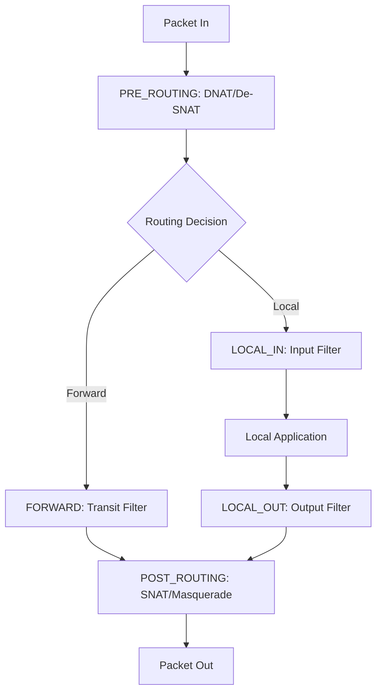
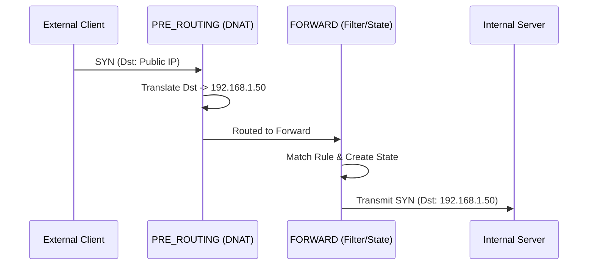

# IPFire-Wall: Consolidated Project Report

*Generated on: Thu Feb  5 02:19:00 PM CET 2026*

# Chapter 1: Refactoring & Optimization

This chapter documents the structural and performance improvements implemented during the refactoring phase of the IPFire-Wall project.

## 1.1. Modular Source Reorganization
The module was transitioned from a flat, monolithic directory structure to a specialized modular hierarchy to improve maintainability and codebase clarity.

### Directory Mapping
| Subdirectory | Responsibility |
|--------------|----------------|
| `common/` | Shared data structures, constants, and global utility functions. |
| `filter/` | The core filtering engine, rule traversal logic, and stateful hooks. |
| `filter/state/` | State machine implementation and state table management. |
| `nat/` | Translation logic for DNAT, SNAT, and Masquerade. |
| `netlink/` | Communication layer between the kernel and userspace commands. |
| `proc/` | Implementation of the `/proc/ipfire` interface. |
| `includes/` | Centralized repository for all internal headers. |

## 1.2. Per-CPU Statistics Optimization
To ensure maximum performance on multi-core systems, the statistics tracking was moved from global atomics (which cause cache-line bouncing) to purely per-CPU counters.

- **Infrastructure**: Counters are instances of `struct ipfi_counters` allocated via `alloc_percpu`.
- **Latency Reduction**: Updates in the network hot path (like `INPUT` or `FORWARD`) use the `IPFI_STAT_INC` macro, which translates to a single instruction per-core increment.
- **On-Demand Aggregation**: Global totals are only computed when a user runs `ipfire -s`, at which point the kernel iterates over all online CPUs and sums the values.

## 1.3. Netlink Protocol Simplification
The Netlink message structure was streamlined by removing legacy per-packet sequence IDs (`packet_id` and `logu_id`).

- **Rationale**: Sequential IDs created a bottleneck for parallel packet processing.
- **Reporting Transition**: Reliability is now monitored by the kernel itself. If a Netlink send fails (e.g., due to a full buffer), the kernel increments a `total_lost` counter. The userspace app now requests this counter on-demand rather than inferring loss from gaps in sequence IDs.

## 1.4. Build System Modernization
A shadow-tree build system was implemented using a `build/` directory.
- **Feature**: Source files are symlinked into `build/` before compilation.
- **Benefit**: All intermediate artifacts (`.o`, `.mod`, etc.) are hidden from the main source tree, keeping the environment clean for development.

---

# Chapter 2: Kernel Module Architecture

This chapter explains the internal workings of the IPFire-Wall kernel module, its integration with Netfilter, and how it evaluates security policies.

## 2.1. Netfilter Hook Integration
IPFire-Wall registers itself at several points in the Linux network stack (Hooks).

## 2.2. Rule Hierarchy & Evaluation Logic
When a packet hits a filtering hook (`LOCAL_IN`, `LOCAL_OUT`, or `FORWARD`), it is evaluated against several lists of rules in a prioritized sequence.

### The Priority Chain:
1. **Blacklist (Dropped Rules)**: The engine first scans the `dropped` list. If a match is found, the packet is discarded immediately. This ensures that blocked entities cannot bypass later permission checks.
2. **Administrator Rules (Root)**: The `allowed` list is scanned for rules inserted by the system administrator.
3. **User Rules**: If enabled, rules defined by non-root users are checked next.

### Evaluation Mechanism:
- **First-Match Wins**: The evaluation stops as soon as a rule matches.
- **Default Policy**: If no rule matches any list, the module applies the `default_policy` (configured as either `ACCEPT` or `DROP`).

## 2.3. Filtering Granularity
Rules can match packets based on a wide array of criteria:
- **L3 (IP)**: Source/Destination IP addresses and IP Options.
- **L4 (Transport)**: Protocol (TCP, UDP, ICMP, IGMP) and Port numbers.
- **Direction**: Inbound, Outbound, or Forwarded.
- **Interface**: Incoming or Outgoing network device indices.
- **Payload**: FTP command inspection (for dynamic NAT).

---

# Chapter 3: Stateful Connection Management

IPFire-Wall employs a stateful inspection engine that tracks the status of network connections to improve both security and performance.

## 3.1. The Stateful Fast-Path
One of the core design goals is to avoid re-evaluating the entire rule list for every packet in a high-volume stream.

- **Slow Path**: The **first packet** (e.g., a TCP SYN) triggers a full scan of the rule lists. If accepted by a stateful rule, an entry is created in the `state_table`.
- **Fast Path**: Lookups for **subsequent packets** are performed against the state table using a hash-based mechanism (`jhash_3words`). This lookup is **O(1)**, meaning it stays fast regardless of how many rules are active.

## 3.2. State Transition Tracking
The module implements a dedicated state machine for different protocols.

### TCP Connection Lifecycle:
- `SYN_SENT`: Initial request seen.
- `SYN_RECV`: Reply from server seen (SYN/ACK).
- `ESTABLISHED`: Handshake complete (ACK seen).
- `FIN_WAIT / CLOSE_WAIT`: Connection termination in progress.

### UDP "Pseudo-States":
Since UDP is connectionless, the engine creates virtual states (`UDP_NEW` -> `UDP_ESTABLISHED`) to allow return traffic (e.g., DNS responses) through the firewall for a defined period.

## 3.3. Table Management
- **Lookups**: Perform bidirectional hashing. Both sides of a connection (`A:port1 <-> B:port2` and `B:port2 <-> A:port1`) produce the same hash key, allowing consistent tracking of bidirectional flows.
- **Lifetimes**: Every state entry has an associated kernel timer. If no traffic is seen for a specific duration (e.g., 3600s for ESTABLISHED TCP, or ~30s for UDP), the entry is automatically purged to free resources.
- **Capacity**: The firewall enforces a `max_state_entries` limit to prevent resource exhaustion attacks.

## 3.4. FTP Support
The engine includes a specialized parser for the FTP protocol. It monitors the "control" channel for `PASV` commands and dynamically injects "Data Channel" states, allowing passive FTP to function through the NAT without requiring manual rule openings for high-numbered ports.

---

# Chapter 4: Userspace Application (ipfire)

The `ipfire` utility is the primary administrative tool for interacting with the kernel-space firewall module.

## 4.1. Core Usage & CLI Flags
The application communicates with the kernel via Netlink sockets using the `IPFI_CONTROL` and `IPFI_DATA` protocols.

| Flag | Action | Description |
|------|--------|-------------|
| `-v` | Version / Status | Shows if the module is loaded and current global settings. |
| `-s` | Statistics | Displays a combined report of kernel per-CPU counters and userspace logging counts. |
| `-X` | Flush | Clears all current filtering rules and resets the state table. |
| `-p <policy>` | Set Policy | Changes the default policy to `accept` or `drop`. |
| `-a <rule>` | Add Rule | Inserts a new rule into the appropriate chain. |

## 4.2. Configuration Files
The application behavior can be customized via config files, typically located in `/etc/ipfire/`.

- `allowed.base`: List of rules to be automatically loaded on startup.
- `ipfire.conf`: Global options such as logging levels, max NAT entries, and stateful tracking defaults.

## 4.3. Interpreting Statistics
The `-s` (Statistics) output is divided into three sections:
1. **Userspace Stats**: Counts of packets actually received and displayed by the tool. Useful for auditing.
2. **Kernel Stats**: High-level counters for `INPUT`, `OUTPUT`, `FORWARD`, and `POST-ROUTING`.
3. **Transmission Health**: Specifically reports `total_lost` (packets the kernel tried to log but couldn't due to buffer pressure).

## 4.4. Logging and Real-time Monitoring
When running, `ipfire` can act as a listener, printing headers for every packet matched by a rule with the `NOTIFY` flag. These logs include:
- Timestamp and user ID.
- Hook location and verdict (ACCEPT/DROP).
- Detailed IP/TCP/UDP header information.

---

# Chapter 5: Packet Flow Walkthroughs

This chapter provides step-by-step analysis of how specific real-world packet scenarios traverse the IPFire-Wall engine.

## 5.1. Scenario 1: DNAT to Forwarded Internal Server
An external client connects to the firewall's public IP on port 80, which is redirected to an internal web server.

1. **PRE_ROUTING Hook**:
   - The packet `Src:Client, Dst:Firewall_Public` is intercepted.
   - `dnat_translation()` matches a rule and changes the destination to `Firewall_Internal_Server`.
   - The kernel is notified of the `daddr` change and clears the old route.
2. **Routing Decision**: The kernel finds the route for the new internal destination; it is not local, so the packet moves to the FORWARD hook.
3. **FORWARD Hook**:
   - `ipfire_filter()` is called.
   - It identifies this as a new connection.
   - It matches a stateful rule allowing traffic to the server.
   - `keep_state()` creates an entry in the state table.
4. **POST_ROUTING Hook**: The packet leaves the firewall towards the internal server.

## 5.2. Scenario 2: Masqueraded Outbound Connection
An internal client connects to the internet; the firewall hides the internal IP.

1. **LOCAL_OUT / FORWARD**: The packet is accepted by the filtering engine.
2. **POST_ROUTING**:
   - `masquerade_translation()` is called.
   - The engine dynamically finds the IP address of the outgoing WAN interface (`get_ifaddr`).
   - The packet's source address is replaced.
   - An entry is added to the `snat_table` to handle return traffic.

## 5.3. Scenario 3: Stateful Return Traffic
The reply from a previously accepted connection arrives.

1. **PRE_ROUTING**: If the original connection was NATed, the reverse translation is applied here.
2. **LOCAL_IN / FORWARD**:
   - `check_state()` is called.
   - A **reverse match** is found in the state table.
   - **Verdict: ACCEPT**. Rule evaluation is skipped entirely.
   - The state machine transitions (e.g., to `SYN_RECV` or `ESTABLISHED`).
3. **Delivery**: The packet is delivered to the initial requestor.

---

