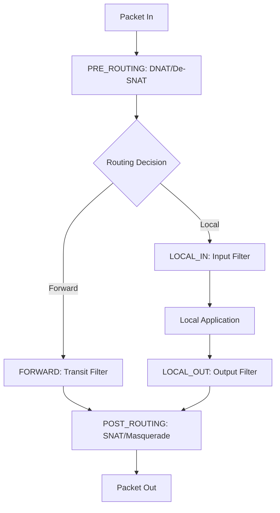
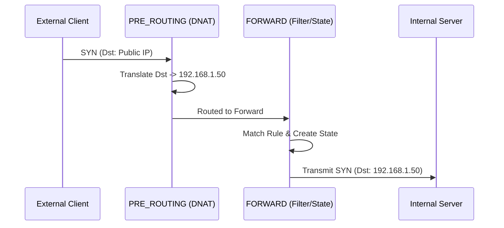
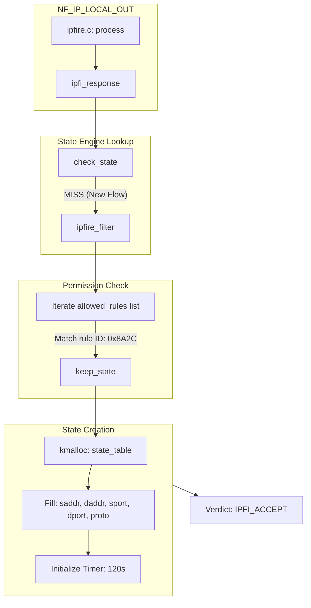

# IPFire-Wall: Consolidated Project Report

*Generated on: Fri Feb 20 11:47:37 AM CET 2026*

# Chapter 1: Refactoring & Optimization

This chapter documents the structural and performance improvements implemented during the refactoring phase of the IPFire-Wall project.

## 1.1. Modular Source Reorganization
The module was transitioned from a flat, monolithic directory structure to a specialized modular hierarchy to improve maintainability and codebase clarity.

### Directory Mapping
| Subdirectory | Responsibility |
|--------------|----------------|
| `common/` | Shared data structures, constants, and global utility functions. |
| `filter/` | The core filtering engine, rule traversal logic, and stateful hooks. |
| `filter/state/` | State machine implementation and state table management. |
| `nat/` | Translation logic for DNAT, SNAT, and Masquerade. |
| `netlink/` | Communication layer between the kernel and userspace commands. |
| `proc/` | Implementation of the `/proc/ipfire` interface. |
| `includes/` | Centralized repository for all internal headers. |

## 1.2. Per-CPU Statistics Optimization
To ensure maximum performance on multi-core systems, the statistics tracking was moved from global atomics (which cause cache-line bouncing) to purely per-CPU counters.

- **Infrastructure**: Counters are instances of `struct ipfi_counters` allocated via `alloc_percpu`.
- **Latency Reduction**: Updates in the network hot path (like `INPUT` or `FORWARD`) use the `IPFI_STAT_INC` macro, which translates to a single instruction per-core increment.
- **On-Demand Aggregation**: Global totals are only computed when a user runs `ipfire -s`, at which point the kernel iterates over all online CPUs and sums the values.

## 1.3. Netlink Protocol Simplification
The Netlink message structure was streamlined by removing legacy per-packet sequence IDs (`packet_id` and `logu_id`).

- **Rationale**: Sequential IDs created a bottleneck for parallel packet processing.
- **Reporting Transition**: Reliability is now monitored by the kernel itself. If a Netlink send fails (e.g., due to a full buffer), the kernel increments a `total_lost` counter. The userspace app now requests this counter on-demand rather than inferring loss from gaps in sequence IDs.

## 1.4. Build System Modernization
A shadow-tree build system was implemented using a `build/` directory.
- **Feature**: Source files are symlinked into `build/` before compilation.
- **Benefit**: All intermediate artifacts (`.o`, `.mod`, etc.) are hidden from the main source tree, keeping the environment clean for development.

## 1.5. Unified Table Lifecycle & Slab Allocation
The memory management for filtering tables was standardized to use a unified lifecycle and dedicated kernel slab caches (`kmem_cache`).

- **Unified Lifecycle**: All table entries (State, NAT, and LogInfo) now embed `struct ipfi_entry_head`, sharing consistent RCU-based synchronization and reference counting.
- **Slab Migration**:
  - The static `loginfo_pool` was removed in favor of the `ipfi_loginfo` slab.
  - State and NAT tables were migrated from dynamic `kmalloc` to their respective `ipfi_state` and `ipfi_nat` slabs.
- **Benefits**:
  - **Efficiency**: Slab allocation provides better cache locality and zero internal fragmentation for fixed-size entries.
  - **Consistency**: A single code path (`table_lifecycle.c`) manages the complex interactions between RCU, workqueues, and timers for all module entries.
  - **Transparency**: Memory usage is now visible per-module via `/proc/slabinfo`.

---

# Chapter 2: Kernel Module Architecture

This chapter explains the internal workings of the IPFire-Wall kernel module, its integration with Netfilter, and how it evaluates security policies.

## 2.1. Netfilter Hook Integration
IPFire-Wall registers itself at several points in the Linux network stack (Hooks).


```mermaid
graph TD
    In[Packet In] --> Pre[PRE_ROUTING: DNAT/De-SNAT]
    Pre --> Routing{Routing Decision}
    Routing -->|Local| InHook[LOCAL_IN: Input Filter]
    Routing -->|Forward| FwdHook[FORWARD: Transit Filter]
    InHook --> App[Local Application]
    App --> OutHook[LOCAL_OUT: Output Filter]
    FwdHook --> Post[POST_ROUTING: SNAT/Masquerade]
    OutHook --> Post
    Post --> Out[Packet Out]
```

## 2.2. Rule Hierarchy & Evaluation Logic
When a packet hits a filtering hook (`LOCAL_IN`, `LOCAL_OUT`, or `FORWARD`), it is evaluated against several lists of rules in a prioritized sequence.

### The Priority Chain:
1. **Blacklist (Dropped Rules)**: The engine first scans the `dropped` list. If a match is found, the packet is discarded immediately. This ensures that blocked entities cannot bypass later permission checks.
2. **Administrator Rules (Root)**: The `allowed` list is scanned for rules inserted by the system administrator.
3. **User Rules**: If enabled, rules defined by non-root users are checked next.

### Evaluation Mechanism:
- **First-Match Wins**: The evaluation stops as soon as a rule matches.
- **Default Policy**: If no rule matches any list, the module applies the `default_policy` (configured as either `ACCEPT` or `DROP`).

## 2.3. Filtering Granularity
Rules can match packets based on a wide array of criteria:
- **L3 (IP)**: Source/Destination IP addresses and IP Options.
- **L4 (Transport)**: Protocol (TCP, UDP, ICMP, IGMP) and Port numbers.
- **Direction**: Inbound, Outbound, or Forwarded.
- **Interface**: Incoming or Outgoing network device indices.
- **Payload**: FTP command inspection (for dynamic NAT).

---

# Chapter 3: Stateful Connection Management

IPFire-Wall employs a stateful inspection engine that tracks the status of network connections to improve both security and performance.

## 3.1. The Stateful Fast-Path
One of the core design goals is to avoid re-evaluating the entire rule list for every packet in a high-volume stream.

- **Slow Path**: The **first packet** (e.g., a TCP SYN) triggers a full scan of the rule lists. If accepted by a stateful rule, an entry is created in the `state_table`.
- **Fast Path**: Lookups for **subsequent packets** are performed against the state table using a hash-based mechanism (`jhash_3words`). This lookup is **O(1)**, meaning it stays fast regardless of how many rules are active.

## 3.2. State Transition Tracking
The module implements a dedicated state machine for different protocols.

### TCP Connection Lifecycle:
- `SYN_SENT`: Initial request seen.
- `SYN_RECV`: Reply from server seen (SYN/ACK).
- `ESTABLISHED`: Handshake complete (ACK seen).
- `FIN_WAIT / CLOSE_WAIT`: Connection termination in progress.

### UDP "Pseudo-States":
Since UDP is connectionless, the engine creates virtual states (`UDP_NEW` -> `UDP_ESTABLISHED`) to allow return traffic (e.g., DNS responses) through the firewall for a defined period.

## 3.3. Table Management
- **Lookups**: Perform bidirectional hashing. Both sides of a connection (`A:port1 <-> B:port2` and `B:port2 <-> A:port1`) produce the same hash key, allowing consistent tracking of bidirectional flows.
- **Lifetimes**: Every state entry has an associated kernel timer. If no traffic is seen for a specific duration (e.g., 3600s for ESTABLISHED TCP, or ~30s for UDP), the entry is automatically purged to free resources.
- **Allocation**: State entries are allocated from a dedicated `kmem_cache` slab (`ipfi_state`), ensuring low-latency access and optimized memory layout.
- **Namespaces**: In the current implementation, state tables are shared across all network namespaces (even with `per_net=1`).
- **Capacity**: The firewall enforces a `max_state_entries` limit to prevent resource exhaustion attacks.

## 3.4. FTP Support
The engine includes a specialized parser for the FTP protocol. It monitors the "control" channel for `PASV` commands and dynamically injects "Data Channel" states, allowing passive FTP to function through the NAT without requiring manual rule openings for high-numbered ports.

---

# Chapter 4: Userspace Application (ipfire)

The `ipfire` utility is the primary administrative tool for interacting with the kernel-space firewall module.

## 4.1. Core Usage & CLI Flags
The application communicates with the kernel via Netlink sockets using the `IPFI_CONTROL` and `IPFI_DATA` protocols.

### General Options
| Flag | Description |
|------|-------------|
| `-h, --help` | Show the help message and exit. |
| `-quiet` | Do not print packets to the console. |
| `-daemon` | Run the application as a background daemon. |
| `-quiet_daemon` | Run as a background daemon and redirect standard output/error to `/dev/null`. |
| `-lang <file>` | Specify a language file (detected automatically by default). |

### Initialization & Cleanup (Root Only)
| Flag | Description |
|------|-------------|
| `-load, -rc` | Load all rules from configuration files and run in the background. |
| `-flush` | Flush all rules from the kernel and exit immediately. |
| `-noflush` | Prevent the automatic flushing of rules when the userspace process exits. |
| `-rmmod` | Unload the `ipfire` kernel module upon exit. |
| `-clearlog` | Truncate the log file at startup. |

### Configuration Paths
| Flag | Description |
|------|-------------|
| `-allowed <file>` | Override the path for the permission rules file. |
| `-blacklist <file>` | Override the path for the denial rules file. |
| `-blacksites <file>`| Override the path for the blocked sites list. |
| `-translation <file>`| Override the path for the NAT rules file. |
| `-logfile <file>` | Override the path for the system log file (Root only). |

### Advanced Features & Tuning
| Flag | Description |
|------|-------------|
| `-kloglevel <0-7>` | Set the kernel-space log level (0=Emergency, 7=Debug). |
| `-loguser <0-7>` | Set the userspace interface log level. |
| `-log <0-7>` | Set the logging level for the file-based logger. |
| `-dns <seconds>` | Enable the DNS resolver with a specific refresh interval. |
| `-nodns` | Disable the background DNS resolver. |
| `-services` | Enable resolution of port numbers to service names (via `/etc/services`). |
| `-noservices` | Disable port-to-service name resolution. |
| `-allstate` | Enable stateful tracking for ALL traffic, regardless of rule flags. |
| `-mailer <V> <U>` | Send email summaries every `<V>` units of `<U>` (sec, min, hour, days). |
| `-user` | Run with user-level privileges (Root only). |
| `-nouser` | Disable user-level privilege mode. |

## 4.2. Configuration Files
The application behavior can be customized via config files. For the root user, these are located in `/etc/ipfire/`. For normal users, they are in `~/.IPFIRE/`.

- `allowed`: List of rules to be automatically loaded on startup.
- `options`: Global configuration file (compatible with IqFIREwall) using a simple `KEY=VALUE` format.
- Shared assets (default rules, documentation, help) are stored in `/usr/share/ipfire/`.

## 4.3. Interpreting Statistics
The `-s` (Statistics) output is divided into three sections:
1. **Userspace Stats**: Counts of packets actually received and displayed by the tool. Useful for auditing.
2. **Kernel Stats**: High-level counters for `INPUT`, `OUTPUT`, `FORWARD`, and `POST-ROUTING`.
3. **Transmission Health**: Specifically reports `total_lost` (packets the kernel tried to log but couldn't due to buffer pressure).

## 4.4. Logging and Real-time Monitoring
When running, `ipfire` can act as a listener, printing headers for every packet matched by a rule with the `NOTIFY` flag. These logs include:
- Timestamp and user ID.
- Hook location and verdict (ACCEPT/DROP).
- Detailed IP/TCP/UDP header information.
## 4.5. Logging Deduplication & Technical Bounds
To prevent system instability and terminal flooding, the kernel enforces technical bounds on logging configuration. These values control the **deduplication window**: a packet hitting a rule for the first time is logged, and subsequent identical packets are suppressed until the lifetime expires.

| Parameter | Default (SMB) | Enforced Range | Description |
|-----------|---------------|----------------|-------------|
| `LOGINFO_LIFETIME` | 30s | 5s – 600s | The TTL for a deduplication entry. |
| `MAX_LOGINFO_ENTRIES` | 256 | 64 – 65536 | The maximum number of distinct flows to track for deduplication. |

If a user attempts to set values outside these bounds via the Netlink interface, the kernel will automatically adjust them to the nearest limit and print a warning in `dmesg`.

## 4.6. Installation & Systemd Integration

### Building the Project
IPFire-Wall relies on two distinct compilation processes: one for the kernel module and one for the userspace application.

1.  **Kernel Module (`ipfi.ko`)**:
    Navigate to the `kernel/` directory and use the provided `Makefile`. You will need the Linux headers for your currently running kernel installed.
    ```bash
    cd kernel/
    make
    ```
    This produces the `ipfi.ko` module, which must be loaded by the `sysadmin` or automatically via the system service before starting the userspace application.

2.  **Userspace Application (`ipfire`)**:
    The userspace tools and configuration libraries are built using CMake from the `ipfi/` subdirectory.
    ```bash
    cd ipfi/
    cmake -B build -DCMAKE_INSTALL_PREFIX=/usr
    sudo cmake --build build --target install
    ```
    *Note: The `CMAKE_INSTALL_PREFIX` dictates where the binaries (`/bin/`), configuration files (`/etc/ipfire/`), and shared language assets (`/share/ipfire/`) will be installed. If omitted, it defaults to `/usr/local`.*

### Systemd Service Setup
When the userspace project is installed via `make install`, a Systemd unit file (`ipfire.service`) is automatically placed into `${CMAKE_INSTALL_PREFIX}/etc/systemd/system/`.

This service automates the lifecycle of both the kernel module and the userspace daemon:

- **Start (`systemctl start ipfire`)**:
  The service executes `/usr/bin/ipfire -rc -user`. This tells the userspace application to load all configuration rules (`-rc`) and immediately detach into the background as a user-privilege daemon (`-user`).

- **Stop (`systemctl stop ipfire`)**:
  Systemd automatically sends a `SIGTERM` signal to all processes in the service's cgroup. The `ipfire` application intercepts this signal, frees its memory, cleanly unloads from the kernel socket, and prints a comforting exit message:
  *"The application has been closed due to a service stop (SIGTERM)."*
  Afterward, the service runs `modprobe -r ipfi` to safely remove the kernel module. If a user is currently running a foreground `ipfire` instance (outside Systemd), the module removal will fail gracefully, ensuring active sessions are not interrupted.

- **Reload (`systemctl reload ipfire`)**:
  Systemd sends a `SIGHUP` signal to the `ipfire` main process. The application catches the `SIGHUP` and prints:
  *"The application has been closed due to a service reload (SIGHUP)."*
  The service then removes the kernel module, clearing all state, and re-executes the startup sequence (`ipfire -rc -user`) to apply fresh configurations.

---

# Chapter 5: Packet Flow Walkthroughs

This chapter provides step-by-step analysis of how specific real-world packet scenarios traverse the IPFire-Wall engine.

## 5.1. Scenario 1: DNAT to Forwarded Internal Server
An external client connects to the firewall's public IP on port 80, which is redirected to an internal web server.

1. **PRE_ROUTING Hook**:
   - The packet `Src:Client, Dst:Firewall_Public` is intercepted.
   - `dnat_translation()` matches a rule and changes the destination to `Firewall_Internal_Server`.
   - The kernel is notified of the `daddr` change and clears the old route.
2. **Routing Decision**: The kernel finds the route for the new internal destination; it is not local, so the packet moves to the FORWARD hook.
3. **FORWARD Hook**:
   - `ipfire_filter()` is called.
   - It identifies this as a new connection.
   - It matches a stateful rule allowing traffic to the server.
   - `keep_state()` creates an entry in the state table.
4. **POST_ROUTING Hook**: The packet leaves the firewall towards the internal server.


```mermaid
sequenceDiagram
    participant C as External Client
    participant P as PRE_ROUTING (DNAT)
    participant F as FORWARD (Filter/State)
    participant S as Internal Server

    C->>P: SYN (Dst: Public IP)
    P->>P: Translate Dst -> 192.168.1.50
    P->>F: Routed to Forward
    F->>F: Match Rule & Create State
    F->>S: Transmit SYN (Dst: 192.168.1.50)
```

## 5.2. Scenario 2: Masqueraded Outbound Connection
An internal client connects to the internet; the firewall hides the internal IP.

1. **LOCAL_OUT / FORWARD**: The packet is accepted by the filtering engine.
2. **POST_ROUTING**:
   - `masquerade_translation()` is called.
   - The engine dynamically finds the IP address of the outgoing WAN interface (`get_ifaddr`).
   - The packet's source address is replaced.
   - An entry is added to the `snat_table` to handle return traffic.

## 5.3. Scenario 3: Stateful Return Traffic
The reply from a previously accepted connection arrives.

1. **PRE_ROUTING**: If the original connection was NATed, the reverse translation is applied here.
2. **LOCAL_IN / FORWARD**:
   - `check_state()` is called.
   - A **reverse match** is found in the state table.
   - **Verdict: ACCEPT**. Rule evaluation is skipped entirely.
   - The state machine transitions (e.g., to `SYN_RECV` or `ESTABLISHED`).
3. **Delivery**: The packet is delivered to the initial requestor.

---

# IPFire Packet Flow Walkthrough (Technical Master Edition)

This document provides exhaustive technical walkthroughs of packet flows through the IPFire kernel module. It goes beyond high-level logic to explore the internal function call stacks, specific source code segments, and low-level state transitions.

---

## 1. The Filtering Lifecycle: Hook to Verdict

Every packet handled by IPFire follows a predictable lifecycle within the kernel.

### The Standard Call Stack
When a packet is intercepted by a Netfilter hook, the following internal chain is executed:

1.  **`ipfire.c:process()`**: The primary dispatcher for all hooks.
2.  **`ipfi_response()`**: Orchestrates the filtering decision.
3.  **`check_state()`**: Performs the O(1) hash lookup for established flows.
4.  **`ipfire_filter()`**: (If state miss) Performs the O(n) rule comparison.
5.  **`keep_state()`**: (If match) Initializes a new state tracking entry.

---

## 2. Scenario 1: Stateful HTTP Connection (OUTPUT)

### 2.1. Initial SYN (The "Slow Path")

When an application initiates a connection, the first packet triggers the "Slow Path" logic.

#### Analysis of Rule Matching Logic
In `ipfire_filter()`, the engine iterates through the `allowed` list. For an HTTP rule, the matching sequence looks like this:

```c
// Internal Matching Core (conceptual simplified C)
if (rule->direction == flow->direction && 
    (rule->protocol == 0 || rule->protocol == ip_hdr(skb)->protocol)) {
    
    // Transport layer check
    if (transport_protos_match(skb, rule)) {
        // Source/Dest IP check
        if (ip_match(skb, rule)) {
            return MATCH_FOUND;
        }
    }
}
```

#### Detailed Outgoing SYN Workflow


```mermaid
flowchart TD
    subgraph Hook_Entry [NF_IP_LOCAL_OUT]
        Process[ipfire.c: process] --> Response[ipfi_response]
    end

    subgraph State_Check [State Engine Lookup]
        Response --> CheckState[check_state]
        CheckState -- "MISS (New Flow)" --> Filter[ipfire_filter]
    end

    subgraph Rule_Evaluation [Permission Check]
        Filter --> Loop[Iterate allowed_rules list]
        Loop -- "Match rule ID: 0x8A2C" --> KeepState[keep_state]
    end

    subgraph State_Initialization [State Creation]
        KeepState --> Alloc[kmalloc: state_table]
        Alloc --> Fill[Fill: saddr, daddr, sport, dport, proto]
        Fill --> Timer[Initialize Timer: 120s]
    end

    State_Initialization --> Verdict[Verdict: IPFI_ACCEPT]
```

### 2.2. Returning SYN-ACK (The Transition)

The reply packet is the first "Reverse" match. This packet is critical because it transitions the state from `SYN_SENT` to `SYN_RECV`.

#### Internal Call: `check_state()`
The lookup in `check_state()` uses a normalized hash to find the entry regardless of direction:

```c
// Hash computation normalization
u32 hash = get_state_hash(saddr, daddr, sport, dport, proto);
// The saddr/daddr are swapped in the call to get_state_hash for reverse packets
```

### 2.3. The Fast Path (Established Data)

Once the 3-way handshake is complete, every subsequent packet avoids the rule list entirely.

#### Performance Metrics
- **Slow Path (First Packet)**: O(N) where N is number of rules in the list.
- **Fast Path (Subsequent)**: O(1) Hash Table lookup + State machine update.

---

## 3. Scenario 2: Passive FTP (Dynamic NAT)

FTP is complex because it uses a control channel to negotiate a dynamic data channel.

### 3.1. The Payload Inspection
When `FTP_SUPPORT=YES` is enabled, the state engine invokes the FTP helper during the control connection's lifetime.

#### The Hook: `helpers/ftp.c`
When a packet is identified as part of an FTP control stream, the engine calls `ftp_support()`:

```c
// Scanning for PASV response
if (data_start_with_227(payload)) {
    extract_ftp_info(payload, &finfo);
    if (finfo.valid) {
        add_ftp_dynamic_rule(sttable, finfo.ip, finfo.port);
    }
}
```

### 3.2. Data Channel "Prediction"
The `add_ftp_dynamic_rule` creates a "zombie" state entry that has no active ports yet but is pre-authorized by the control channel's policy.

---

## 4. Scenario 3: DNAT Interaction with FORWARD Hook

This is one of the most technical flows in the module because it spans across different kernel subsystem triggers.

### 4.1. Destination Translation (PRE_ROUTING)
The packet enters `PRE_ROUTING` and is transformed.

| Feature | Logic |
|---------|-------|
| **Transformation** | `ip_hdr(skb)->daddr` is changed to the internal server IP. |
| **Checkums** | `ip_send_check(iph)` is called to recompute the L3 CRC. |
| **Routing Trigger** | The destination cache (`skb_dst(skb)`) is released to force a re-route. |

```c
// Forcing Re-routing in ipfi_pre_process
if (daddr_changed) {
    dst_release(skb_dst(skb));
    skb_dst_set(skb, NULL); // Kernel will re-route before next hook
}
```

### 4.2. State Tracking in the FORWARD Hook
Because the destination was changed to a non-local address, the kernel routes the packet to the `FORWARD` chain instead of `LOCAL_IN`.

1.  **State Lookup**: `check_state` misses because the *modified* addresses are hashed.
2.  **Rule Match**: The `FORWARD` rule list is scanned.
3.  **State Creation**: A state is created based on the **post-NAT** addresses. This is critical for matching return traffic correctly.

---

## 5. Summary Table: Flow Characteristics

| Phase | Hook | Path | Algorithm | Complexity |
|-------|------|------|-----------|------------|
| Initialization | Any | Slow | Rule List Scan | O(Rules) |
| Established | Any | Fast | JHash Table | O(1) |
| NAT (Pre) | PRE_ROUTING | Logic | Rules + Table | O(NAT_Rules) |
| NAT (Post) | POST_ROUTING| Logic | Dynamic Table | O(1) |

---

# TCP/UDP State Machine: Deep Dive (Technical Master Edition)

This chapter provides an exhaustive analysis of the IPFire state machine, detailing how it tracks connection lifetimes, handles exceptions, and optimizes performance for high-throughput flows.

---

## 1. TCP State Lifecycle

The state machine implements a robust subset of RFC 793 to track connection health.

### 1.1. State Transition Table

The following table summarizes the legal transitions within the IPFire kernel.

| Current State | Event (Flags) | Next State | Logic Context |
|---------------|---------------|------------|---------------|
| `NOSTATE` | `SYN` (Out/In) | `SYN_SENT` | Initial Handshake Start |
| `SYN_SENT` | `SYN+ACK` (Rev) | `SYN_RECV` | Handshake Response |
| `SYN_RECV` | `ACK` (Dir) | `ESTABLISHED`| Connection Fully Open |
| `ESTABLISHED` | `FIN` (Out/In) | `FIN_WAIT` | Teardown Start |
| `FIN_WAIT` | `ACK` (Rev) | `CLOSE_WAIT`| Two-stage Termination |
| `ANY` | `RST` | `CLOSED` | Immediate Teardown |

### 1.2. The Three-Way Handshake Core Logic

The implementation in `ipfi_state_machine.c` ensures strict flag checking during the setup phase:

```c
// handshake logic segment
if (syn && !ack && !rst && !fin) {
    if (current_state == NOSTATE) return SYN_SENT;
}

if (syn && ack && !rst && !fin && reverse) {
    if (current_state == SYN_SENT) return SYN_RECV;
}

if (!syn && ack && !rst && !fin && !reverse) {
    if (current_state == SYN_RECV) return ESTABLISHED;
}
```

---

## 2. Timer Aggregation Logic

To avoid the performance penalty of frequent timer renewals (`mod_timer` syscall overhead), IPFire implements a "1-second throttle".

### 2.1. Why Aggregation?
In a high-speed Gbit link, a single connection might send thousands of packets per second. Updating the kernel timer for every packet would consume excessive CPU cycles.

### 2.2. The Implementation
The engine only updates the timer if at least 1 second (measured in `HZ` / Jiffies) has elapsed since the last update.

```c
void update_timer_of_state_entry(struct state_table *sttable) {
    unsigned long now = jiffies;
    // HZ represents 1 second in kernel-time
    if (time_after(now, sttable->last_timer_update + HZ)) {
        mod_timer(&sttable->timer_statelist, 
                  jiffies + get_timeout_by_state(sttable->protocol, sttable->state) * HZ);
        sttable->last_timer_update = now;
    }
}
```

---

## 3. GUESS States & Normalization

GUESS states are a unique feature of IPFire that allows it to "adopt" existing connections that were established before the module was loaded.

### 3.1. Mid-Flow Connection Detection
If a packet arrives that is NOT a SYN but has no matching state, the machine "guesses" where it belongs.

```c
// GUESS_ESTABLISHED detection
if (!rst && !fin && !syn && ack && (current_state == NOSTATE)) {
    return GUESS_ESTABLISHED;
}
```

### 3.2. Normalization on Storage
The engine returns a GUESS state for accounting, but **normalizes** it to a standard state before storing it in the hash table. This ensures future packets follow standard RFC transitions.

```c
// Normalization logic in set_state()
if (found_state == GUESS_ESTABLISHED) {
    entry->state.state = ESTABLISHED;
} else if (found_state == GUESS_SYN_RECV) {
    entry->state.state = SYN_RECV;
}
```

---

## 4. UDP "Pseudo-States"

Since UDP is stateless, the machine uses timeout-based persistence to simulate connection tracking.

- **`UDP_NEW`**: Created on the first packet.
- **`UDP_ESTAB`**: Promoted on the first *return* packet (where `reverse == 1`).
- **Timeout**: Typically 30-60 seconds of inactivity.

---

## 5. Security & Established Flow Bypass

One of the most important design decisions is that **Established flows bypass permission rules entirely.**

### Why?
1.  **Consistency**: Once a connection is allowed by a rule, it should remain allowed until it closes. If a firewall rule changes mid-connection, the active stream isn't "cut" unless explicitly flushed.
2.  **Performance**: Rule lists can be long (O(N)). Hash table lookups are O(1). By skipping the list for millions of data packets, we save massive amounts of CPU time.

---

# NAT and Stateful Flow Analysis (Technical Master Edition)

This report details the packet flow and code logic for Source NAT (SNAT), Masquerade, and Destination NAT (DNAT) within the IPFire kernel module, specifically focusing on the low-level manipulation of the `sk_buff` structure and transport headers.

---

## 1. The Core Engine: `manip_skb`

All NAT operations in IPFire eventually funnel into the `manip_skb()` function. This function is responsible for the delicate task of modifying packet headers while maintaining protocol integrity (checksums).

### 1.1. Step-by-Step Logic
1.  **L3 Address Swap**: The IP header's source or destination address is replaced.
2.  **L3 Checksum Update**: Since the IP header Changed, the CRC must be updated. IPFire uses incremental updates for performance.
3.  **L4 Port Swap**: For TCP/UDP, the source/destination ports are replaced.
4.  **L4 Checksum Update**: Transport layer checksums (TCP/UDP) include a "pseudo-header" that contains the IP addresses. Therefore, changing an IP address REQUIRES recomputing the L4 checksum.

### 1.2. Incremental Checksum Logic
Instead of recalculating the entire packet checksum from scratch (which is expensive), IPFire uses the `csum_replace4` utility from the kernel:

```c
// Example: Updating IP Header Checksum after address change
csum_replace4(&iph->check, oldaddr, newaddr);

// Example: Updating TCP Checksum for Pseudo-Header change
inet_proto_csum_replace4(&tcph->check, skb, oldaddr, newaddr, true);
```

---

## 2. Source NAT (SNAT) and Masquerade

### 2.1. SNAT Lifecycle
In `POST_ROUTING`, the engine identifies packets requiring SNAT.

1.  **Rule Match**: `snat_translation()` finds a match in `translation_post`.
2.  **Accounting**: `add_snatted_entry()` records the `(original_src -> new_src)` mapping. This is vital for "De-SNATting" the return traffic.
3.  **Allocation**: Entries are allocated from the `ipfi_nat` slab cache for high-performance translation tracking.
4.  **Transformation**: `do_source_nat()` executes the `manip_skb` logic on the source fields.

### 2.2. Masquerade: The Dynamic SNAT
Masquerade is identical to SNAT except it doesn't have a fixed IP. It calls `get_ifaddr()` which uses `inet_select_addr()` to find the primary IP of the outgoing network interface.

---

## 3. Destination NAT (DNAT): The Routing Challenge

DNAT is the most complex because it happens in `PRE_ROUTING`, *before* the kernel makes its final routing decision.

### 3.1. Re-Routing Logic
If IPFire changes the destination IP of a packet, the kernel's original routing plan (based on the old IP) is now invalid. To fix this, IPFire must manually clear the kernel's destination cache.

```c
// Force re-routing in ipfi_pre_process
if (daddr != iph->daddr) {
    dst_release(skb_dst(skb)); // Free old route
    skb_dst_set(skb, NULL);    // Tell kernel to re-route
}
```

### 3.2. Interaction with FORWARD Hook
When a packet's destination is changed to an internal server (e.g., Load Balancing), it no longer looks like a "Local In" packet.

1.  **Kernel Decision**: After `PRE_ROUTING` and the `skb_dst_set(NULL)` call, the kernel re-runs the routing table.
2.  **Path Change**: The packet is now destined for an internal network, so it enters the `FORWARD` hook.
3.  **State Logic**: In the `FORWARD` hook, `check_state` misses (because it was just created/NATted), and the packet hits the FORWARDing permission rules.

---

## 4. Checksum Corner Cases

### 4.1. UDP Zero Checksum
RFC 768 allows UDP checksums to be `0` (disabled). However, when we NAT a packet, most kernels require that if you change the address, you MUST provide a valid checksum or a specific "mangled zero" value if the original was zero.

```c
// Handle UDP zero checksum
if (!pudphead->check) {
    pudphead->check = CSUM_MANGLED_0;
}
```

---

## 5. Summary: NAT Hook Matrix

| NAT Type | Direction | Hook | Primary Objective |
|----------|-----------|------|-------------------|
| **SNAT** | Outgoing | `POST_ROUTING` | Hide internal IP |
| **Masq** | Outgoing | `POST_ROUTING` | Dynamic SNAT for WAN |
| **DNAT** | Incoming | `PRE_ROUTING` | Port Forwarding / LB |
| **Re-NAT**| Incoming | `PRE_ROUTING` | Restoring original IP |

---

# Developer API Guide: Internal Kernel Interfaces

This guide provides technical documentation for developers who wish to extend or integrate with the IPFire kernel module.

---

## 1. Centralized Data Structures (`common/`)

Shared structures are defined in `common/ipfi_structures.h` to ensure consistency between kernel and userspace.

### 1.1. `ipfire_info_t`
The primary metadata carrier for packets in the filtering hot path.

```c
typedef struct {
    __u32 saddr, daddr;    // Source and Destination IPs
    __u16 sport, dport;    // Source and Destination Ports
    __u8 proto;            // Protocol (TCP/UDP/ICMP)
    __u8 direction;        // IPFI_INPUT, IPFI_OUTPUT, IPFI_FWD
    __u32 rule_id;         // Hash of the matching rule
    // ... statistics fields ...
} ipfire_info_t;
```

### 1.2. Unified Entry API (`ipfi_entry.h`)
All stateful entries use a standardized lifecycle API.

- `ipfi_entry_init(h, list_head, counter, list_lock)`: Initializes the entry, sets up the timer, and provides RCU-safe list insertion.
- `ipfi_entry_arm_timer(h)`: Activates the entry's timer. Should be called **after** the entry is safely on a list.
- `ipfi_entry_put(h)`: Standard reference decrement. If the count hits zero, the entry is queued for cleanup.
- `ipfi_entry_update_timer(h, proto, state)`: Refreshes the entry's lifetime based on the protocol state.
- `ipfi_entry_remove(h)`: Logically removes the entry from its table.

---

## 2. Kernel API: Core Logic Functions

### 2.1. `ipfi_response()`
**Location**: `kernel/ipfi_machine.c`
**Purpose**: Main entry point for filtering decisions.
**Arguments**:
- `struct sk_buff *skb`: The kernel packet buffer.
- `const ipfi_flow *flow`: Metadata about the packet's path.

### 2.2. `check_state()`
**Location**: `kernel/ipfi_state_machine.c`
**Purpose**: O(1) state lookup.
**Returns**: `struct response` (verdict and state metadata).

### 2.3. `keep_state()`
**Location**: `kernel/ipfi_state_machine.c`
**Purpose**: Initializes a new entry in the bidirectional hash table.

---

## 3. Communication Protocol: Netlink

IPFire uses a custom Netlink protocol to communicate with the `ipfire` userspace utility.

### 3.1. Message Structure
Messages are sent using the `send_data_to_user()` function in `kernel/netlink/`.

| Field | Size | Description |
|-------|------|-------------|
| Header | 16 bytes | Netlink standard header |
| Proto | 1 byte | Protocol ID |
| Direction | 1 byte | In/Out/Fwd indicator |
| IPs | 8 bytes | Source and Dest addresses |
| Ports | 4 bytes | Source and Dest ports |
| Verdict| 1 byte | ACCEPT/DROP |

### 3.2. Reliability Tracking
If `netlink_unicast()` returns a negative value, the kernel increments the `total_lost` counter in the per-CPU statistics. This allows the administrator to detect if the logging daemon is falling behind.

---

## 4. Statistics Management

### 4.1. Reading Per-CPU Counters
To aggregate statistics for userspace, use the following pattern:

```c
struct ipfi_stats total = {0};
int cpu;
for_each_possible_cpu(cpu) {
    struct ipfi_counters *c = per_cpu_ptr(kernel_stats, cpu);
    total.accepted += c->accepted;
    total.dropped += c->dropped;
    // ... sum other fields ...
}
```

---

## 5. Adding a New Helper
To add support for a new protocol (like FTP), developers should:
1.  Implement a parser in `kernel/helpers/`.
2.  Register the helper in the `KEEP_STATE` logic within `ipfi_state_machine.c`.
3.  Ensure the helper correctly identifies the "adoption" phase versus the "data" phase.

---

# Chapter 10: Lifecycle & Synchronization

This chapter describes how IPFire-Wall manages memory and concurrency for its
internal tables using the unified `ipfi_entry` framework.

---

## 10.1. The Unified Entry Header

All dynamic table entries (State, NAT, LogInfo) embed `ipfi_entry_head` as
their **first** member. This layout is mandated: `container_of` relies on the
head being at offset 0 so that `kfree(h)` frees the whole object.

```c
struct ipfi_entry_head {
    struct timer_list    timer;          /* per-entry expiry timer */
    struct work_struct   cleanup_work;   /* deferred-delete work item */
    struct rcu_head      rcuh;           /* RCU callback node */
    struct list_head     lnode;          /* list linkage (NAT; loginfo LRU) */
    struct hlist_node    hnode;          /* primary hash linkage */
    refcount_t           refcnt;         /* reference counter */
    unsigned long        status;         /* IPFI_ENTRY_REMOVED bit */
    unsigned long        last_timer_update; /* throttle timestamp */
};
```

---

## 10.2. Entry Lifecycle — Full Chain

Every entry starts with `refcount = 1` (the **container reference**).

```
ALLOCATED (refcnt = 1)
    │
    ▼  added to hash table + timer armed
LIVE
    │
    ├─── timer fires ──────────────────────────────────────────┐
    │                                                          │
    └─── eviction (loginfo only, capacity-based) ─────────────┤
                                                               │
                                                               ▼
                                               [under table spinlock]
                                                ipfi_entry_remove(h, &counter)
                                                  │
                                                ├─ test_and_set_bit(REMOVED)
                                                  │     WINNER proceeds ──────▶ hlist del_rcu
                                                  │     LOSER returns (no-op)        counter−−
                                                  │                                  ipfi_entry_put(h)
                                                  │                                        │
                                                  │                              refcount → 0
                                                  │                                        │
                                                  │                              queue_work(ipfire_wq)
                                                  │
                                                  ▼    [workqueue / process context]
                                              free_entry_work()
                                                  ├─ timer_delete_sync()      ← wait for timer
                                                  └─ call_rcu(free_entry_rcu) ← wait for readers
                                                              │
                                                              ▼  [RCU callback]
                                                          kfree(h)              ← object freed
```

### Key invariants

| Invariant | Enforcement |
|-----------|-------------|
| REMOVED set **exactly once** | `test_and_set_bit` atomicity |
| `ipfi_entry_put` called **exactly once** | only the bit winner calls it |
| `kfree` happens after timer is **fully dead** | `timer_delete_sync` before `call_rcu` |
| `kfree` happens after all **RCU readers** are done | `call_rcu` grace period |
| `queue_work` is safe under `spin_lock_bh` | `queue_work` uses `spin_lock_irqsave`, never sleeps |

---

## 10.3. loginfo — The Dual-Link Special Case

`ipfire_loginfo` is the **only** entry type carrying two simultaneous links:

```
active_logi_list  ◄─── lnode ───► ipfire_loginfo ◄─── hnode ───► loginfo_hashtable
     (LRU eviction, O(1) tail)              (dedup lookup, O(1))
```

This is necessary because:
- `active_logi_list` (lnode) enables O(1) LRU eviction: oldest entry is
  always at the tail, removed when the table reaches `max_loginfo_entries`.
  The kernel enforces a capacity bound of **[64, 65536]** to ensure both
  deduplication effectiveness and memory safety.
- `loginfo_hashtable` (hnode) enables O(1) duplicate detection lookups.

`ipfi_entry_remove` handles **only hnode**. The loginfo lnode must be
managed separately, under `loginfo_list_lock`, by **both** the timer
callback and the eviction path.

### The evict-vs-timer race and its fix

Two paths can try to remove the same lnode from `active_logi_list`:

```
Path A (timer callback)         Path B (loginfo_evict_oldest)
─────────────────────           ────────────────────────────
spin_lock_bh(lock)              spin_lock_bh(lock)   ← serialised by lock
if (!REMOVED)                   list_del_rcu(lnode)
  list_del_rcu(lnode)           ipfi_entry_remove()  ← sets REMOVED, puts
ipfi_entry_remove()             timer_delete()
spin_unlock_bh(lock)            spin_unlock_bh(lock)
```

Because both paths hold `loginfo_list_lock`, they are **serialised**.
The REMOVED pre-check in path A ensures that if eviction already ran,
the timer callback skips `list_del_rcu` (which would otherwise write to
`LIST_POISON` addresses → silent hard panic).

`timer_delete()` in path B deflects any **pending** timer fire. If the
timer is already running (blocked on the lock), the REMOVED check will
cause it to skip lnode removal and be a no-op in `ipfi_entry_remove`.

---

## 10.4. Safe Module Shutdown (7-Step Sequence)

Unloading a stateful kernel module requires draining all pending timers,
work items, and RCU callbacks before freeing the slab caches.

```
Step 1  we_are_exiting = true         ← no new allocations
Step 2  unregister_hooks()            ← no new packets enter
Step 3  synchronize_net()             ← wait for in-flight packets
Step 4  fini_machine / fini_log /     ← flush tables:
        fini_translation                ipfi_entry_put chains → queue_work
Step 5  destroy_workqueue(ipfire_wq)  ← drain work items:
                                        each runs timer_delete_sync + call_rcu
Step 6  rcu_barrier()                 ← wait for all call_rcu callbacks
                                        (i.e., all kfree calls) to complete
Step 7  kmem_cache_destroy()          ← safe: all objects are freed

> [!WARNING]
> The order of Step 2 and Step 3 is critical. If `synchronize_net()` is called *before* unregistering hooks, new packets can still enter the system immediately after the synchronization finishes, leading to potential use-after-free conditions during `kmem_cache_destroy()`.

---

During shutdown or when bulk-flushing elements from a state or NAT table, it is necessary to clear all active entries without disrupting concurrent RCU readers (e.g., in-flight packets traversing the filter hooks).

The module uses `ipfi_table_flush_hash()` to safely drain hash buckets. For the loginfo LRU list, it uses `ipfi_table_flush_all()`. Both ensure that any concurrent lockless readers traversing a node will still be safely directed to the next valid element through the RCU grace period.

### The Correct Flush Pattern (Hash)
```c
hash_for_each_possible_rcu(ht, h, hnode, key) {
    if (!test_and_set_bit(IPFI_ENTRY_REMOVED, &h->status)) {
        hlist_del_rcu(&h->hnode);
        ipfi_entry_put(h);
    }
}
```

By using `test_and_set_bit()`, we establish an atomic "winner" for the removal of the entry. If a timer callback is simultaneously trying to expire the same entry, only one will successfully set the bit and proceed to the deletion and `ipfi_entry_put()`. The loser safely skips the element.
```

> [!WARNING]
> If steps 5 and 6 were swapped, or if step 6 were omitted, `kfree` could
> fire **after** `kmem_cache_destroy` — an immediate kernel panic.

---

## 10.5. Timer Update Path — TOCTOU Mitigation

`ipfi_entry_update_timer` must not call `mod_timer` on an entry that is
being freed. The function is **self-contained**: it takes its own
`ipfi_entry_hold_rcu` before touching the timer, so callers do not need
an extra hold. Flow:

```
ipfi_entry_update_timer(h, proto, state)
    │
    ├─ test_bit(REMOVED) → early exit if dying
    │
    └─ if last update was > 5s ago:
           ipfi_entry_hold_rcu(h)    ← atomic inc-not-zero
           test_bit(REMOVED) again   ← re-check under hold
           mod_timer(...)            ← safe: hold prevents free
           ipfi_entry_put(h)         ← release temporary hold
```

The 5-second throttle prevents O(N_packets) timer modifications under
high load while keeping entries alive under sustained traffic.

---

# Chapter 11: Network Namespace Support

This chapter details the current implementation of Network Namespace (netns) support and its intended use cases.

## 11.1. Host-Centric Design
By default, IPFire-Wall is designed as a **Host-Based Firewall**. 

- **Target**: Protect the host's primary network stack.
- **Scope**: Hooks are registered only in the initial namespace (`init_net`).
- **Performance**: Minimal overhead for systems using containers or namespaces that don't require firewalling.

## 11.2. The `per_net` Module Parameter
Administrators can control how the module interacts with namespaces via the `per_net` parameter:

| Mode | Behavior |
|------|----------|
| `per_net=0` (Default) | Hooks registered only in `init_net`. Traffic in other namespaces (including loopback inside containers) is invisible to IPFire. |
| `per_net=1` | Hooks are registered in **every** namespace (via `register_pernet_subsys`). |

## 11.3. Known Limitations (Current Version)

### Shared Global Tables
Even with `per_net=1`, the internal tables (State, NAT, and Logs) are **global and shared**. 
- A state entry created in Namespace A can be matched by traffic in Namespace B if the IPs/Ports happen to collide.
- This is intentional for the current primary use case (local performance testing) but lacks strict isolation between tenants.

### The `MYADDR` Issue
The `MYADDR` keyword in rules (e.g., `ACCEPT src=MYADDR`) currently relies on a lookup function that is **hardcoded to search `init_net`**.
- **Symptom**: "IPFIRE: no interface matching name" messages in the kernel log.
- **Cause**: If a rule uses `MYADDR` in a non-init namespace, the lookup fails because that interface name does not exist in the initial namespace's device list.
- **Recommendation**: Avoid `MYADDR` in rules when using `per_net=1` for namespace-to-namespace traffic.

## 11.4. Primary Use Case: Local Performance Lab
The `per_net=1` mode is optimized for local benchmarking:
1.  Create two namespaces connected via a `veth` pair.
2.  Enable IPFire in all namespaces.
3.  Flood packets between the namespaces using tools like `hping3` or `iperf`.
4.  Measure firewall overhead without involving physical network hardware or saturating the host's external NIC.

---

# Chapter 12: Concurrency & Safety Analysis

This chapter documents the synchronization mechanisms used in IPFire-Wall to
prevent race conditions, Use-After-Free (UAF), double-free, and
Time-of-Check-to-Time-of-Use (TOCTOU) vulnerabilities, including the bugs
discovered and fixed during high-load UDP flood testing.

---

## 12.1. The Three-Layer Safety Model

### Layer 1 — RCU (lockless hot-path reads)

Packet processing lookups use `rcu_read_lock_bh()` to traverse lists and
hash tables without taking a lock. RCU guarantees that linked objects remain
pointer-valid for the duration of the read-side critical section, **even if
another CPU unlinks them concurrently**.

```c
rcu_read_lock_bh();
hash_for_each_possible_rcu(..., entry, hnode, key) {
    if (matches(entry)) {
        ipfi_entry_update_timer(&entry->h, ...);  /* self-contained, safe */
        break;
    }
}
rcu_read_unlock_bh();
```

> [!IMPORTANT]
> RCU only guarantees **pointer validity** during the critical section, NOT
> **object liveness** beyond it. For operations that need the object to
> survive past the RCU lock, a refcount hold is required.

### Layer 2 — Reference counting (object liveness)

`refcount_t` ensures objects are freed only when **all** users have released
them. `ipfi_entry_hold_rcu` uses `refcount_inc_not_zero`: it atomically
increments the counter OR refuses if it is already at zero (dying object).

`ipfi_entry_update_timer` is self-contained: it acquires hold, updates the
timer, and puts — callers do not need an external hold.

### Layer 3 — Spinlocks (writer serialisation)

Writers (add, remove, evict) hold the table spinlock:
- prevents concurrent `hlist_del_rcu` / `list_del_rcu` on the same bucket
- protects plain-`unsigned int` counters from data races
- serialises the loginfo lnode pre-check + `list_del_rcu` sequence

---

## 12.2. Lock Disciplines

| Operation | Lock held | Locking function |
|-----------|-----------|-----------------|
| Add state entry | `state_list_lock` | `spin_lock_bh` |
| Remove (timer) state | `state_list_lock` | `spin_lock_bh` |
| Add NAT entry | `nat_locks[type]` | `spin_lock_bh` |
| Remove (timer) NAT | `nat_locks[type]` | `spin_lock_bh` |
| Add loginfo entry | `loginfo_list_lock` | `spin_lock_bh` |
| Remove (timer) loginfo | `loginfo_list_lock` | `spin_lock_bh` |
| Evict loginfo (capacity) | `loginfo_list_lock` | `spin_lock_bh` |
| Lookup (state/NAT/log) | none (RCU) | `rcu_read_lock_bh` |
| Timer update | none (internal hold) | `ipfi_entry_hold_rcu` |
| Flush (module unload) | table spinlock | `spin_lock_bh` (brief) |

`spin_lock_bh` disables BH (softirqs), preventing timer callbacks from
running on the same CPU while a lock is held. This avoids the need for
`spin_lock_irqsave` in most paths (timers run in softirq, not hard IRQ).

---

## 12.3. ipfi_entry_remove — Ownership Model

`ipfi_entry_remove` owns the final `ipfi_entry_put`. The **winner** of the
`test_and_set_bit(REMOVED)` race performs unlink + put; the **loser** is a
complete no-op.

```c
void ipfi_entry_remove(struct ipfi_entry_head *h, unsigned int *counter) {
    if (test_and_set_bit(IPFI_ENTRY_REMOVED, &h->status))
        return;           /* loser: no-op */

    hlist_del_rcu(&h->hnode);   /* or list_del_rcu in list mode */
    (*counter)--;
    ipfi_entry_put(h);           /* winner: sole caller of put */
}
```

Callers must **not** call `ipfi_entry_put` after `ipfi_entry_remove`.
`queue_work` (inside `ipfi_entry_put`) is safe from BH-disabled spinlock
context: it uses `spin_lock_irqsave` internally and never sleeps.

---

## 12.4. Post-Mortem: Silent Kernel Crash Under UDP Flood

### Symptom

`iperf3 -u -b 1G -P 120` crashed the machine **immediately** with no kernel
oops, no kdump trace — a completely silent hard reset. Even a single stream
crashed with high probability.

**Root cause: fault in softirq context before the oops path could execute.**

---

### Bug 1 — `handle_loginfo_timeout`: `list_del_rcu` on LIST_POISON (CRITICAL)

**File:** `logging/log.c` — `handle_loginfo_timeout` (hash mode)

```
CPU 0 (eviction, holds loginfo_list_lock)     CPU 1 (timer fires, waits for lock)
──────────────────────────────────────────    ────────────────────────────────────
list_del_rcu(X.lnode)                         [blocked on lock]
ipfi_entry_remove(X) ← sets REMOVED
  └─ ipfi_entry_put → queue_work
spin_unlock_bh()
                                              spin_lock_bh() ← acquired
                                              list_del_rcu(X.lnode)  ← X.lnode.prev
                                                                         = LIST_POISON!
                                              WRITE to 0x100 → page fault in softirq
                                              → no oops printed → hard reset
```

**Fix:** Check `REMOVED` before `list_del_rcu` in the timer callback:

```c
if (!test_bit(IPFI_ENTRY_REMOVED, &h->status))
    list_del_rcu(&h->lnode);
ipfi_entry_remove(h, &loginfo_entry_counter); /* winner puts; loser no-op */
```

---

### Bug 2 — `loginfo_evict_oldest`: no timer cancellation

**File:** `logging/log.c` — `loginfo_evict_oldest`

After eviction sets REMOVED and calls `ipfi_entry_put` (refcount → 0,
work queued), the timer can still fire on another CPU before the workqueue
runs `timer_delete_sync`. The timer callback then acquires the lock and
reaches `list_del_rcu` with a poisoned lnode.

**Fix:** `timer_delete()` after `ipfi_entry_remove`. Non-sync is safe: if
the timer is running it's blocked on the lock we hold; REMOVED is set so
it becomes a no-op when it eventually acquires the lock.

```c
ipfi_entry_remove(&oldest->h, &loginfo_entry_counter);
timer_delete(&oldest->h.timer);   /* deflect pending timer fire */
```

---

### Bug 3 — `add_packet_to_infolist`: arm-timer after lock release (UAF)

**File:** `logging/log.c` — `add_packet_to_infolist`

```
CPU 0                           CPU 1
─────────────────────           ─────────────────────
list_add_rcu(lnode)
loginfo_entry_counter++
spin_unlock_bh()                [eviction: list is at capacity]
                                ipfi_entry_remove(new_entry) → put → work queued
                                timer_delete_sync() → kfree(new_entry)
ipfi_entry_arm_timer()          ← mod_timer on freed object!  UAF!
```

**Fix:** Hold an extra refcount reference spanning the lock-release →
arm-timer gap:

```c
ipfi_entry_hold(&ipli->h);   /* arm-guard: refcount → 2 */
spin_unlock_bh(&loginfo_list_lock);
ipfi_entry_arm_timer(&ipli->h);  /* safe: refcount ≥ 2 */
ipfi_entry_put(&ipli->h);    /* release arm-guard */
```

---

### Bug 4 — `fini_log` (hash mode): lnode left dangling

**File:** `logging/log.c` — `fini_log`

`ipfi_table_flush_hash` unlinks `hnode` only. In hash mode, loginfo lnodes
remained in `active_logi_list` after flush → UAF on any subsequent traversal.

**Fix:** Always drain via `active_logi_list` (lnode-based flush works for
both links because REMOVED prevents timer callbacks from re-entering):

```c
ipfi_table_flush_all(&active_logi_list, &loginfo_list_lock,
                     &loginfo_entry_counter);
```

---

## 12.5. Final UAF / TOCTOU / Double-Free Audit

### State table

| Path | Lock | Race risk | Status |
|------|------|-----------|--------|
| `check_state` timer update | RCU | `update_timer` is self-contained (internal hold) | ✅ safe |
| `handle_keep_state_timeout` remove | `state_list_lock` | single removal path, no eviction | ✅ safe |
| `lookup_state_table_n_update_timer` | RCU + `state_hold_rcu` | redundant outer hold, harmless | ✅ safe |
| `add_state_table_to_list` | `state_list_lock` | `we_are_exiting` double-check inside lock | ✅ safe |

### NAT table

| Path | Lock | Race risk | Status |
|------|------|-----------|--------|
| `lookup_nat_forward` timer update | RCU + `nat_hold_rcu` | correct hold before `update_timer` | ✅ safe |
| `handle_nat_entry_timeout` remove | `nat_locks[type]` | single removal path | ✅ safe |

### LogInfo

| Path | Lock | Race risk | Status |
|------|------|-----------|--------|
| `handle_loginfo_timeout` lnode | `loginfo_list_lock` | REMOVED pre-check added | ✅ fixed |
| `loginfo_evict_oldest` timer | `loginfo_list_lock` | `timer_delete()` added | ✅ fixed |
| `add_packet_to_infolist` arm | — | extra hold spanning gap | ✅ fixed |
| `fini_log` lnode flush | `loginfo_list_lock` | lnode-based flush | ✅ fixed |
| `packet_not_seen` (hash) update | RCU | `update_timer` self-contained | ✅ safe |
| `packet_not_seen` (list) update | RCU + `ipfi_entry_hold_rcu` | outer hold redundant but safe | ✅ safe |

### Module unload

| Step | Safety concern | Status |
|------|----------------|--------|
| `fini_machine` → `free_state_tables` | entries in-flight in timers | REMOVED set, timer callback no-ops | ✅ safe |
| `destroy_workqueue` | work items post `call_rcu` | `destroy_workqueue` drains all | ✅ safe |
| `rcu_barrier` | `kfree` callbacks in flight | barrier waits for all | ✅ safe |
| `kmem_cache_destroy` after `rcu_barrier` | use-after-destroy | ordering guarantees objects freed | ✅ safe |

---

## 12.6. Debugging Silent Panics

A fault in softirq context (`list_del_rcu` → page fault at LIST_POISON)
crashes the machine before the oops message can be serialised to any
output. To capture such events:

```bash
# Serial console (capture before framebuffer flush):
GRUB_CMDLINE_LINUX="... console=ttyS0,115200 earlyprintk=serial,ttyS0,115200"

# Verify kdump crash kernel is loaded:
cat /sys/kernel/kexec_crash_loaded   # must be 1

# Force panic on oops + immediate reboot (trips kdump):
echo 1 > /proc/sys/kernel/panic_on_oops
echo 1 > /proc/sys/kernel/panic

# Compile with KASAN for in-kernel UAF detection (requires source rebuild):
# CONFIG_KASAN=y
# CONFIG_KASAN_INLINE=y
```

With `crashkernel=256M` already set, kdump should produce a vmcore after
the next crash. Analyse with:

```bash
crash /usr/lib/debug/boot/vmlinux-$(uname -r) /var/crash/*/vmcore
```

---

