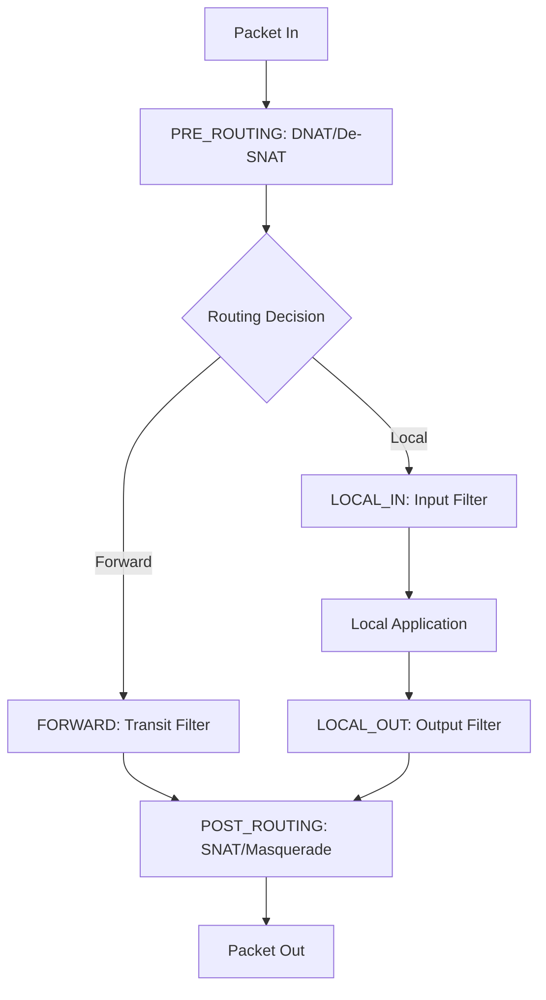
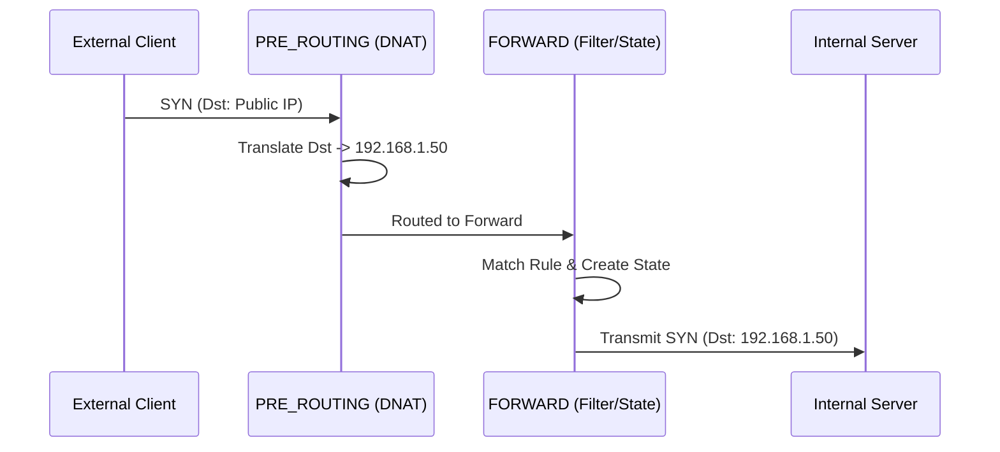
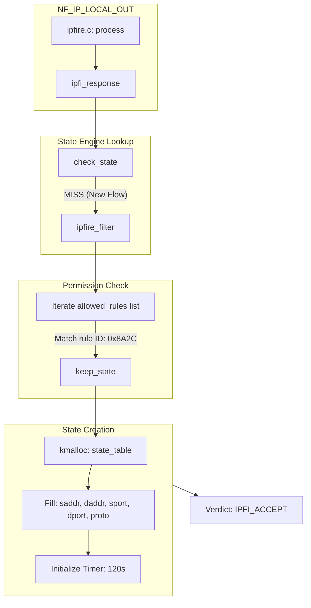
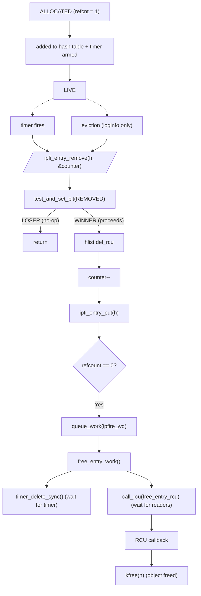
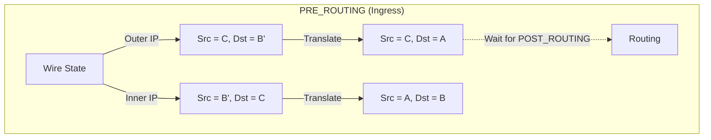
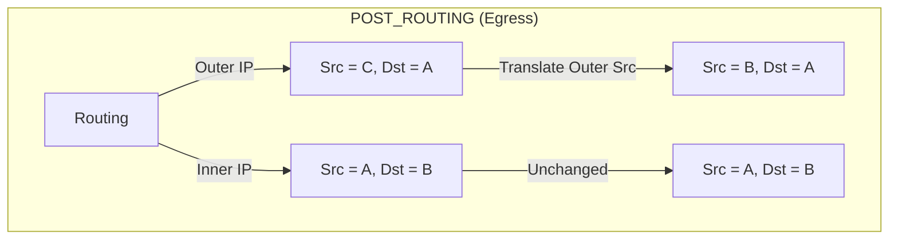
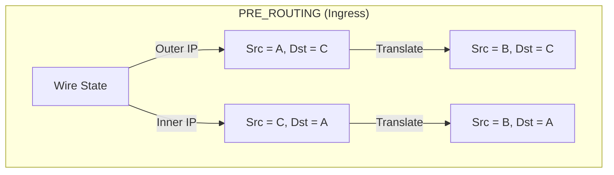
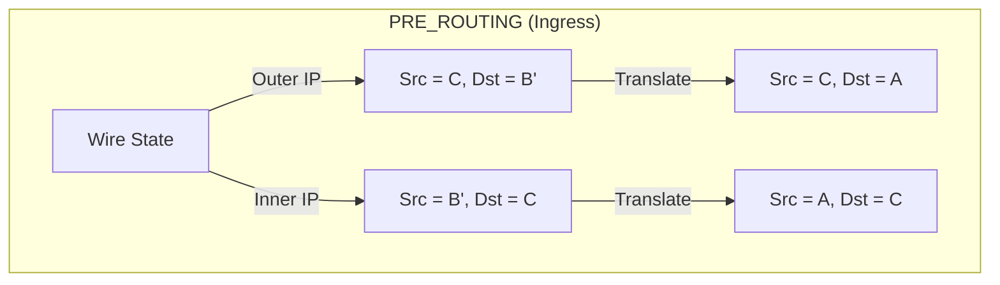

# IPFire-Wall: Consolidated Project Report

*Generated on: Fri Feb 27 03:32:37 PM CET 2026*

# Chapter 1: Refactoring & Optimization

This chapter documents the structural and performance improvements implemented during the refactoring phase of the IPFire-Wall project.

## 1.1. Modular Source Reorganization
The module was transitioned from a flat, monolithic directory structure to a specialized modular hierarchy to improve maintainability and codebase clarity.

### Directory Mapping
| Subdirectory | Responsibility |
|--------------|----------------|
| `common/` | Shared data structures, constants, and global utility functions. |
| `filter/` | The core filtering engine, rule traversal logic, and stateful hooks. |
| `filter/state/` | State machine implementation and state table management. |
| `nat/` | Translation logic for DNAT, SNAT, and Masquerade. |
| `netlink/` | Communication layer between the kernel and userspace commands. |
| `proc/` | Implementation of the `/proc/ipfire` interface. |
| `includes/` | Centralized repository for all internal headers. |

## 1.2. Per-CPU Statistics Optimization
To ensure maximum performance on multi-core systems, the statistics tracking was moved from global atomics (which cause cache-line bouncing) to purely per-CPU counters.

- **Infrastructure**: Counters are instances of `struct ipfi_counters` allocated via `alloc_percpu`.
- **Latency Reduction**: Updates in the network hot path (like `INPUT` or `FORWARD`) use the `IPFI_STAT_INC` macro, which translates to a single instruction per-core increment.
- **On-Demand Aggregation**: Global totals are only computed when a user runs `ipfire -s`, at which point the kernel iterates over all online CPUs and sums the values.

## 1.3. Netlink Protocol Simplification
The Netlink message structure was streamlined by removing legacy per-packet sequence IDs (`packet_id` and `logu_id`).

- **Rationale**: Sequential IDs created a bottleneck for parallel packet processing.
- **Reporting Transition**: Reliability is now monitored by the kernel itself. If a Netlink send fails (e.g., due to a full buffer), the kernel increments a `total_lost` counter. The userspace app now requests this counter on-demand rather than inferring loss from gaps in sequence IDs.

## 1.4. Build System Modernization
A shadow-tree build system was implemented using a `build/` directory.
- **Feature**: Source files are symlinked into `build/` before compilation.
- **Benefit**: All intermediate artifacts (`.o`, `.mod`, etc.) are hidden from the main source tree, keeping the environment clean for development.

## 1.5. Unified Table Lifecycle & Slab Allocation
The memory management for filtering tables was standardized to use a unified lifecycle and dedicated kernel slab caches (`kmem_cache`).

- **Unified Lifecycle**: All table entries (State, NAT, and LogInfo) now embed `struct ipfi_entry_head`, sharing consistent RCU-based synchronization and reference counting.
- **Slab Migration**:
  - The static `loginfo_pool` was removed in favor of the `ipfi_loginfo` slab.
  - State and NAT tables were migrated from dynamic `kmalloc` to their respective `ipfi_state` and `ipfi_nat` slabs.
- **Benefits**:
  - **Efficiency**: Slab allocation provides better cache locality and zero internal fragmentation for fixed-size entries.
  - **Consistency**: A single code path (`table_lifecycle.c`) manages the complex interactions between RCU, workqueues, and timers for all module entries.
  - **Transparency**: Memory usage is now visible per-module via `/proc/slabinfo`.

---

# Chapter 2: Kernel Module Architecture

This chapter explains the internal workings of the IPFire-Wall kernel module, its integration with Netfilter, and how it evaluates security policies.

## 2.1. Netfilter Hook Integration
IPFire-Wall registers itself at several points in the Linux network stack (Hooks).


```mermaid
graph TD
    In[Packet In] --> Pre[PRE_ROUTING: DNAT/De-SNAT]
    Pre --> Routing{Routing Decision}
    Routing -->|Local| InHook[LOCAL_IN: Input Filter]
    Routing -->|Forward| FwdHook[FORWARD: Transit Filter]
    InHook --> App[Local Application]
    App --> OutHook[LOCAL_OUT: Output Filter]
    FwdHook --> Post[POST_ROUTING: SNAT/Masquerade]
    OutHook --> Post
    Post --> Out[Packet Out]
```

## 2.2. Rule Hierarchy & Evaluation Logic
When a packet hits a filtering hook (`LOCAL_IN`, `LOCAL_OUT`, or `FORWARD`), it is evaluated against several lists of rules in a prioritized sequence.

### The Priority Chain:
1. **Blacklist (Dropped Rules)**: The engine first scans the `dropped` list. If a match is found, the packet is discarded immediately. This ensures that blocked entities cannot bypass later permission checks.
2. **Administrator Rules (Root)**: The `allowed` list is scanned for rules inserted by the system administrator.
3. **User Rules**: If enabled, rules defined by non-root users are checked next.

### Evaluation Mechanism:
- **First-Match Wins**: The evaluation stops as soon as a rule matches.
- **Default Policy**: If no rule matches any list, the module applies the `default_policy` (configured as either `ACCEPT` or `DROP`).

## 2.3. Filtering Granularity
Rules can match packets based on a wide array of criteria:
- **L3 (IP)**: Source/Destination IP addresses and IP Options.
- **L4 (Transport)**: Protocol (TCP, UDP, ICMP, IGMP) and Port numbers.
- **Direction**: Inbound, Outbound, or Forwarded.
- **Interface**: Incoming or Outgoing network device indices.
- **Payload**: FTP command inspection (for dynamic NAT).

---

# Chapter 3: Stateful Connection Management

IPFire-Wall employs a stateful inspection engine that tracks the status of network connections to improve both security and performance.

## 3.1. The Stateful Fast-Path
One of the core design goals is to avoid re-evaluating the entire rule list for every packet in a high-volume stream.

- **Slow Path**: The **first packet** (e.g., a TCP SYN) triggers a full scan of the rule lists. If accepted by a stateful rule, an entry is created in the `state_table`.
- **Fast Path**: Lookups for **subsequent packets** are performed against the state table using a hash-based mechanism (`jhash_3words`). This lookup is **O(1)**, meaning it stays fast regardless of how many rules are active.

## 3.2. State Transition Tracking
The module implements a dedicated state machine for different protocols.

### TCP Connection Lifecycle:
- `SYN_SENT`: Initial request seen.
- `SYN_RECV`: Reply from server seen (SYN/ACK).
- `ESTABLISHED`: Handshake complete (ACK seen).
- `FIN_WAIT / CLOSE_WAIT`: Connection termination in progress.

### UDP "Pseudo-States":
Since UDP is connectionless, the engine creates virtual states (`UDP_NEW` -> `UDP_ESTABLISHED`) to allow return traffic (e.g., DNS responses) through the firewall for a defined period.

## 3.3. Table Management
- **Lookups**: Perform bidirectional hashing. Both sides of a connection (`A:port1 <-> B:port2` and `B:port2 <-> A:port1`) produce the same hash key, allowing consistent tracking of bidirectional flows.
- **Lifetimes**: Every state entry has an associated kernel timer. If no traffic is seen for a specific duration (e.g., 3600s for ESTABLISHED TCP, or ~30s for UDP), the entry is automatically purged to free resources.
- **Allocation**: State entries are allocated from a dedicated `kmem_cache` slab (`ipfi_state`), ensuring low-latency access and optimized memory layout.
- **Namespaces**: In the current implementation, state tables are shared across all network namespaces (even with `per_net=1`).
- **Capacity**: The firewall enforces a `max_state_entries` limit to prevent resource exhaustion attacks.

## 3.4. FTP Support
The engine includes a specialized parser for the FTP protocol. It monitors the "control" channel for `PASV` commands and dynamically injects "Data Channel" states, allowing passive FTP to function through the NAT without requiring manual rule openings for high-numbered ports.

---

# Chapter 4: Userspace Application (ipfire)

The `ipfire` utility is the primary administrative tool for interacting with the kernel-space firewall module.

## 4.1. Core Usage & CLI Flags
The application communicates with the kernel via Netlink sockets using the `IPFI_CONTROL` and `IPFI_DATA` protocols.

### General Options
| Flag | Description |
|------|-------------|
| `-h, --help` | Show the help message and exit. |
| `-quiet` | Do not print packets to the console. |
| `-daemon` | Run the application as a background daemon. |
| `-quiet_daemon` | Run as a background daemon and redirect standard output/error to `/dev/null`. |
| `-lang <file>` | Specify a language file (detected automatically by default). |

### Initialization & Cleanup (Root Only)
| Flag | Description |
|------|-------------|
| `-load, -rc` | Load all rules from configuration files and run in the background. |
| `-flush` | Flush all rules from the kernel and exit immediately. |
| `-noflush` | Prevent the automatic flushing of rules when the userspace process exits. |
| `-rmmod` | Unload the `ipfire` kernel module upon exit. |
| `-clearlog` | Truncate the log file at startup. |

### Configuration Paths
| Flag | Description |
|------|-------------|
| `-allowed <file>` | Override the path for the permission rules file. |
| `-blacklist <file>` | Override the path for the denial rules file. |
| `-blacksites <file>`| Override the path for the blocked sites list. |
| `-translation <file>`| Override the path for the NAT rules file. |
| `-logfile <file>` | Override the path for the system log file (Root only). |

### Advanced Features & Tuning
| Flag | Description |
|------|-------------|
| `-kloglevel <0-7>` | Set the kernel-space log level (0=Emergency, 7=Debug). |
| `-loguser <0-7>` | Set the userspace interface log level. |
| `-log <0-7>` | Set the logging level for the file-based logger. |
| `-dns <seconds>` | Enable the DNS resolver with a specific refresh interval. |
| `-nodns` | Disable the background DNS resolver. |
| `-services` | Enable resolution of port numbers to service names (via `/etc/services`). |
| `-noservices` | Disable port-to-service name resolution. |
| `-allstate` | Enable stateful tracking for ALL traffic, regardless of rule flags. |
| `-mailer <V> <U>` | Send email summaries every `<V>` units of `<U>` (sec, min, hour, days). |
| `-user` | Allow normal unprivileged users to define their own rules and interact with the firewall (Root only). |
| `-nouser` | Restrict all firewall operations to the Root user. |
| `-no-nat` | Deactivate NAT on the fly, overriding the config file (Root only). |
| `-no-masquerade` | Deactivate Masquerade on the fly, overriding the config file (Root only). |

## 4.2. Configuration Files
The application behavior can be customized via config files. For the root user, these are located in `/etc/ipfire/`. For normal users, they are in `~/.IPFIRE/`.

- `allowed`: List of rules to be automatically loaded on startup.
- `options`: Global configuration file (compatible with IqFIREwall) using a simple `KEY=VALUE` format.
- Shared assets (default rules, documentation, help) are stored in `/usr/share/ipfire/`.

## 4.3. Interpreting Statistics
The `-s` (Statistics) output is divided into three sections:
1. **Userspace Stats**: Counts of packets actually received and displayed by the tool. Useful for auditing.
2. **Kernel Stats**: High-level counters for `INPUT`, `OUTPUT`, `FORWARD`, and `POST-ROUTING`.
3. **Transmission Health**: Specifically reports `total_lost` (packets the kernel tried to log but couldn't due to buffer pressure).

## 4.4. Logging and Real-time Monitoring
When running, `ipfire` can act as a listener, printing headers for every packet matched by a rule with the `NOTIFY` flag. These logs include:
- **Verdict Markers**:
  - `<span style="color:violet">[?X]</span>`: No matching rule was found (packet fallback to default policy).
  - `<span style="color:green">[OK N]</span>`: Packet accepted by permission rule number `N`.
  - `<span style="color:red">[X M]</span>`: Packet dropped by denial rule number `M`.
- Timestamp and user ID.
- Hook location and verdict (`ACCEPT`/`DROP`).
- Detailed IP/TCP/UDP header information.
## 4.5. Logging Deduplication & Technical Bounds
To prevent system instability and terminal flooding, the kernel enforces technical bounds on logging configuration. These values control the **deduplication window**: a packet hitting a rule for the first time is logged, and subsequent identical packets are suppressed until the lifetime expires.

| Parameter | Default (SMB) | Enforced Range | Description |
|-----------|---------------|----------------|-------------|
| `LOGINFO_LIFETIME` | 30s | 5s – 600s | The TTL for a deduplication entry. |
| `MAX_LOGINFO_ENTRIES` | 256 | 64 – 65536 | The maximum number of distinct flows to track for deduplication. |

If a user attempts to set values outside these bounds via the Netlink interface, the kernel will automatically adjust them to the nearest limit and print a warning in `dmesg`.

## 4.6. Installation & Systemd Integration

### Building the Project
IPFire-Wall relies on two distinct compilation processes: one for the kernel module and one for the userspace application.

1.  **Kernel Module (`ipfi.ko`)**:
    Navigate to the `kernel/` directory and use the provided `Makefile`. You will need the Linux headers for your currently running kernel installed.
    ```bash
    cd kernel/
    make
    ```
    This produces the `ipfi.ko` module, which must be loaded by the `sysadmin` or automatically via the system service before starting the userspace application.

2.  **Userspace Application (`ipfire`)**:
    The userspace tools and configuration libraries are built using CMake from the `ipfi/` subdirectory.
    ```bash
    cd ipfi/
    cmake -B build -DCMAKE_INSTALL_PREFIX=/usr
    sudo cmake --build build --target install
    ```
    *Note: The `CMAKE_INSTALL_PREFIX` dictates where the binaries (`/bin/`), configuration files (`/etc/ipfire/`), and shared language assets (`/share/ipfire/`) will be installed. If omitted, it defaults to `/usr/local`.*

### Systemd Service Setup
When the userspace project is installed via `make install`, a Systemd unit file (`ipfire.service`) is automatically placed into `${CMAKE_INSTALL_PREFIX}/etc/systemd/system/`.

This service automates the lifecycle of both the kernel module and the userspace daemon:

- **Start (`systemctl start ipfire`)**:
  The service executes `/usr/bin/ipfire -rc -user`. This tells the userspace application to load all Root configuration rules (`-rc`) into the kernel immediately securely setting them at the highest priority. It then detaches into the background and simultaneously allows standard users (`-user`) to begin defining and managing their personal packet filtering rules.

- **Stop (`systemctl stop ipfire`)**:
  Systemd automatically sends a `SIGTERM` signal to all processes in the service's cgroup. The `ipfire` application intercepts this signal, frees its memory, cleanly unloads from the kernel socket, and prints a comforting exit message:
  *"The application has been closed due to a service stop (SIGTERM)."*
  Afterward, the service runs `modprobe -r ipfi` to safely remove the kernel module. If a user is currently running a foreground `ipfire` instance (outside Systemd), the module removal will fail gracefully, ensuring active sessions are not interrupted.

- **Reload (`systemctl reload ipfire`)**:
  Systemd sends a `SIGHUP` signal to the `ipfire` main process. The application catches the `SIGHUP` and prints:
  *"The application has been closed due to a service reload (SIGHUP)."*
  The service then removes the kernel module, clearing all state, and re-executes the startup sequence (`ipfire -rc -user`) to apply fresh configurations.

---

# Chapter 5: Packet Flow Walkthroughs

This chapter provides step-by-step analysis of how specific real-world packet scenarios traverse the IPFire-Wall engine.

## 5.1. Scenario 1: DNAT to Forwarded Internal Server
An external client connects to the firewall's public IP on port 80, which is redirected to an internal web server.

1. **PRE_ROUTING Hook**:
   - The packet `Src:Client, Dst:Firewall_Public` is intercepted.
   - `dnat_translation()` matches a rule and changes the destination to `Firewall_Internal_Server`.
   - The kernel is notified of the `daddr` change and clears the old route.
2. **Routing Decision**: The kernel finds the route for the new internal destination; it is not local, so the packet moves to the FORWARD hook.
3. **FORWARD Hook**:
   - `ipfire_filter()` is called.
   - It identifies this as a new connection.
   - It matches a stateful rule allowing traffic to the server.
   - `keep_state()` creates an entry in the state table.
4. **POST_ROUTING Hook**: The packet leaves the firewall towards the internal server.


```mermaid
sequenceDiagram
    participant C as External Client
    participant P as PRE_ROUTING (DNAT)
    participant F as FORWARD (Filter/State)
    participant S as Internal Server

    C->>P: SYN (Dst: Public IP)
    P->>P: Translate Dst -> 192.168.1.50
    P->>F: Routed to Forward
    F->>F: Match Rule & Create State
    F->>S: Transmit SYN (Dst: 192.168.1.50)
```

## 5.2. Scenario 2: Masqueraded Outbound Connection
An internal client connects to the internet; the firewall hides the internal IP.

1. **LOCAL_OUT / FORWARD**: The packet is accepted by the filtering engine.
2. **POST_ROUTING**:
   - `masquerade_translation()` is called.
   - The engine dynamically finds the IP address of the outgoing WAN interface (`get_ifaddr`).
   - The packet's source address is replaced.
   - An entry is added to the `snat_table` to handle return traffic.

## 5.3. Scenario 3: Stateful Return Traffic
The reply from a previously accepted connection arrives.

1. **PRE_ROUTING**: If the original connection was NATed, the reverse translation is applied here.
2. **LOCAL_IN / FORWARD**:
   - `check_state()` is called.
   - A **reverse match** is found in the state table.
   - **Verdict: ACCEPT**. Rule evaluation is skipped entirely.
   - The state machine transitions (e.g., to `SYN_RECV` or `ESTABLISHED`).
3. **Delivery**: The packet is delivered to the initial requestor.

---

# IPFire Packet Flow Walkthrough (Technical Master Edition)

This document provides exhaustive technical walkthroughs of packet flows through the IPFire kernel module. It goes beyond high-level logic to explore the internal function call stacks, specific source code segments, and low-level state transitions.

---

## 1. The Filtering Lifecycle: Hook to Verdict

Every packet handled by IPFire follows a predictable lifecycle within the kernel.

### The Standard Call Stack
When a packet is intercepted by a Netfilter hook, the following internal chain is executed:

1.  **`ipfire.c:process()`**: The primary dispatcher for all hooks.
2.  **`ipfi_response()`**: Orchestrates the filtering decision.
3.  **`check_state()`**: Performs the O(1) hash lookup for established flows.
4.  **`ipfire_filter()`**: (If state miss) Performs the O(n) rule comparison.
5.  **`keep_state()`**: (If match) Initializes a new state tracking entry.

---

## 2. Scenario 1: Stateful HTTP Connection (OUTPUT)

### 2.1. Initial SYN (The "Slow Path")

When an application initiates a connection, the first packet triggers the "Slow Path" logic.

#### Analysis of Rule Matching Logic
In `ipfire_filter()`, the engine iterates through the `allowed` list. For an HTTP rule, the matching sequence looks like this:

```c
// Internal Matching Core (conceptual simplified C)
if (rule->direction == flow->direction && 
    (rule->protocol == 0 || rule->protocol == ip_hdr(skb)->protocol)) {
    
    // Transport layer check
    if (transport_protos_match(skb, rule)) {
        // Source/Dest IP check
        if (ip_match(skb, rule)) {
            return MATCH_FOUND;
        }
    }
}
```

#### Detailed Outgoing SYN Workflow


```mermaid
flowchart TD
    subgraph Hook_Entry [NF_IP_LOCAL_OUT]
        Process[ipfire.c: process] --> Response[ipfi_response]
    end

    subgraph State_Check [State Engine Lookup]
        Response --> CheckState[check_state]
        CheckState -- "MISS (New Flow)" --> Filter[ipfire_filter]
    end

    subgraph Rule_Evaluation [Permission Check]
        Filter --> Loop[Iterate allowed_rules list]
        Loop -- "Match rule ID: 0x8A2C" --> KeepState[keep_state]
    end

    subgraph State_Initialization [State Creation]
        KeepState --> Alloc[kmalloc: state_table]
        Alloc --> Fill[Fill: saddr, daddr, sport, dport, proto]
        Fill --> Timer[Initialize Timer: 120s]
    end

    State_Initialization --> Verdict[Verdict: IPFI_ACCEPT]
```

### 2.2. Returning SYN-ACK (The Transition)

The reply packet is the first "Reverse" match. This packet is critical because it transitions the state from `SYN_SENT` to `SYN_RECV`.

#### Internal Call: `check_state()`
The lookup in `check_state()` uses a normalized hash to find the entry regardless of direction:

```c
// Hash computation normalization
u32 hash = get_state_hash(saddr, daddr, sport, dport, proto);
// The saddr/daddr are swapped in the call to get_state_hash for reverse packets
```

### 2.3. The Fast Path (Established Data)

Once the 3-way handshake is complete, every subsequent packet avoids the rule list entirely.

#### Performance Metrics
- **Slow Path (First Packet)**: O(N) where N is number of rules in the list.
- **Fast Path (Subsequent)**: O(1) Hash Table lookup + State machine update.

---

## 3. Scenario 2: Passive FTP (Dynamic NAT)

FTP is complex because it uses a control channel to negotiate a dynamic data channel.

### 3.1. The Payload Inspection
When `FTP_SUPPORT=YES` is enabled, the state engine invokes the FTP helper during the control connection's lifetime.

#### The Hook: `helpers/ftp.c`
When a packet is identified as part of an FTP control stream, the engine calls `ftp_support()`:

```c
// Scanning for PASV response
if (data_start_with_227(payload)) {
    extract_ftp_info(payload, &finfo);
    if (finfo.valid) {
        add_ftp_dynamic_rule(sttable, finfo.ip, finfo.port);
    }
}
```

### 3.2. Data Channel "Prediction"
The `add_ftp_dynamic_rule` creates a "zombie" state entry that has no active ports yet but is pre-authorized by the control channel's policy.

---

## 4. Scenario 3: DNAT Interaction with FORWARD Hook

This is one of the most technical flows in the module because it spans across different kernel subsystem triggers.

### 4.1. Destination Translation (PRE_ROUTING)
The packet enters `PRE_ROUTING` and is transformed.

| Feature | Logic |
|---------|-------|
| **Transformation** | `ip_hdr(skb)->daddr` is changed to the internal server IP. |
| **Checkums** | `ip_send_check(iph)` is called to recompute the L3 CRC. |
| **Routing Trigger** | The destination cache (`skb_dst(skb)`) is released to force a re-route. |

```c
// Forcing Re-routing in ipfi_pre_process
if (daddr_changed) {
    dst_release(skb_dst(skb));
    skb_dst_set(skb, NULL); // Kernel will re-route before next hook
}
```

### 4.2. State Tracking in the FORWARD Hook
Because the destination was changed to a non-local address, the kernel routes the packet to the `FORWARD` chain instead of `LOCAL_IN`.

1.  **State Lookup**: `check_state` misses because the *modified* addresses are hashed.
2.  **Rule Match**: The `FORWARD` rule list is scanned.
3.  **State Creation**: A state is created based on the **post-NAT** addresses. This is critical for matching return traffic correctly.

---

## 5. Summary Table: Flow Characteristics

| Phase | Hook | Path | Algorithm | Complexity |
|-------|------|------|-----------|------------|
| Initialization | Any | Slow | Rule List Scan | O(Rules) |
| Established | Any | Fast | JHash Table | O(1) |
| NAT (Pre) | PRE_ROUTING | Logic | Rules + Table | O(NAT_Rules) |
| NAT (Post) | POST_ROUTING| Logic | Dynamic Table | O(1) |

---

# TCP/UDP State Machine: Deep Dive (Technical Master Edition)

This chapter provides an exhaustive analysis of the IPFire state machine, detailing how it tracks connection lifetimes, handles exceptions, and optimizes performance for high-throughput flows.

---

## 1. TCP State Lifecycle

The state machine implements a robust subset of RFC 793 to track connection health.

### 1.1. State Transition Table

The following table summarizes the legal transitions within the IPFire kernel.

| Current State | Event (Flags) | Next State | Logic Context |
|---------------|---------------|------------|---------------|
| `NOSTATE` | `SYN` (Out/In) | `SYN_SENT` | Initial Handshake Start |
| `SYN_SENT` | `SYN+ACK` (Rev) | `SYN_RECV` | Handshake Response |
| `SYN_RECV` | `ACK` (Dir) | `ESTABLISHED`| Connection Fully Open |
| `ESTABLISHED` | `FIN` (Out/In) | `FIN_WAIT` | Teardown Start |
| `FIN_WAIT` | `ACK` (Rev) | `CLOSE_WAIT`| Two-stage Termination |
| `ANY` | `RST` | `CLOSED` | Immediate Teardown |

### 1.2. The Three-Way Handshake Core Logic

The implementation in `ipfi_state_machine.c` ensures strict flag checking during the setup phase:

```c
// handshake logic segment
if (syn && !ack && !rst && !fin) {
    if (current_state == NOSTATE) return SYN_SENT;
}

if (syn && ack && !rst && !fin && reverse) {
    if (current_state == SYN_SENT) return SYN_RECV;
}

if (!syn && ack && !rst && !fin && !reverse) {
    if (current_state == SYN_RECV) return ESTABLISHED;
}
```

---

## 2. Timer Aggregation Logic

To avoid the performance penalty of frequent timer renewals (`mod_timer` syscall overhead), IPFire implements a "1-second throttle".

### 2.1. Why Aggregation?
In a high-speed Gbit link, a single connection might send thousands of packets per second. Updating the kernel timer for every packet would consume excessive CPU cycles.

### 2.2. The Implementation
The engine only updates the timer if at least 1 second (measured in `HZ` / Jiffies) has elapsed since the last update.

```c
void update_timer_of_state_entry(struct state_table *sttable) {
    unsigned long now = jiffies;
    // HZ represents 1 second in kernel-time
    if (time_after(now, sttable->last_timer_update + HZ)) {
        mod_timer(&sttable->timer_statelist, 
                  jiffies + get_timeout_by_state(sttable->protocol, sttable->state) * HZ);
        sttable->last_timer_update = now;
    }
}
```

---

## 3. GUESS States & Normalization

GUESS states are a unique feature of IPFire that allows it to "adopt" existing connections that were established before the module was loaded.

### 3.1. Mid-Flow Connection Detection
If a packet arrives that is NOT a SYN but has no matching state, the machine "guesses" where it belongs.

```c
// GUESS_ESTABLISHED detection
if (!rst && !fin && !syn && ack && (current_state == NOSTATE)) {
    return GUESS_ESTABLISHED;
}
```

### 3.2. Normalization on Storage
The engine returns a GUESS state for accounting, but **normalizes** it to a standard state before storing it in the hash table. This ensures future packets follow standard RFC transitions.

```c
// Normalization logic in set_state()
if (found_state == GUESS_ESTABLISHED) {
    entry->state.state = ESTABLISHED;
} else if (found_state == GUESS_SYN_RECV) {
    entry->state.state = SYN_RECV;
}
```

---

## 4. UDP "Pseudo-States"

Since UDP is stateless, the machine uses timeout-based persistence to simulate connection tracking.

- **`UDP_NEW`**: Created on the first packet.
- **`UDP_ESTAB`**: Promoted on the first *return* packet (where `reverse == 1`).
- **Timeout**: Typically 30-60 seconds of inactivity.

---

## 5. Security & Established Flow Bypass

One of the most important design decisions is that **Established flows bypass permission rules entirely.**

### Why?
1.  **Consistency**: Once a connection is allowed by a rule, it should remain allowed until it closes. If a firewall rule changes mid-connection, the active stream isn't "cut" unless explicitly flushed.
2.  **Performance**: Rule lists can be long (O(N)). Hash table lookups are O(1). By skipping the list for millions of data packets, we save massive amounts of CPU time.

---

# NAT and Stateful Flow Analysis (Technical Master Edition)

This report details the packet flow and code logic for Source NAT (SNAT), Masquerade, and Destination NAT (DNAT) within the IPFire kernel module, specifically focusing on the low-level manipulation of the `sk_buff` structure and transport headers.

---

## 1. The Core Engine: `manip_skb`

All NAT operations in IPFire eventually funnel into the `manip_skb()` function. This function is responsible for the delicate task of modifying packet headers while maintaining protocol integrity (checksums).

### 1.1. Step-by-Step Logic
1.  **L3 Address Swap**: The IP header's source or destination address is replaced.
2.  **L3 Checksum Update**: Since the IP header Changed, the CRC must be updated. IPFire uses incremental updates for performance.
3.  **L4 Port Swap**: For TCP/UDP, the source/destination ports are replaced.
4.  **L4 Checksum Update**: Transport layer checksums (TCP/UDP) include a "pseudo-header" that contains the IP addresses. Therefore, changing an IP address REQUIRES recomputing the L4 checksum.

### 1.2. Incremental Checksum Logic
Instead of recalculating the entire packet checksum from scratch (which is expensive), IPFire uses the `csum_replace4` utility from the kernel:

```c
// Example: Updating IP Header Checksum after address change
csum_replace4(&iph->check, oldaddr, newaddr);

// Example: Updating TCP Checksum for Pseudo-Header change
inet_proto_csum_replace4(&tcph->check, skb, oldaddr, newaddr, true);
```

---

## 2. Source NAT (SNAT) and Masquerade

### 2.1. SNAT Lifecycle
In `POST_ROUTING`, the engine identifies packets requiring SNAT.

1.  **Rule Match**: `snat_translation()` finds a match in `translation_post`.
2.  **Accounting**: `add_snatted_entry()` records the `(original_src -> new_src)` mapping. This is vital for "De-SNATting" the return traffic.
3.  **Allocation**: Entries are allocated from the `ipfi_nat` slab cache for high-performance translation tracking.
4.  **Transformation**: `do_source_nat()` executes the `manip_skb` logic on the source fields.

### 2.2. Masquerade: The Dynamic SNAT
Masquerade is identical to SNAT except it doesn't have a fixed IP. It calls `get_ifaddr()` which uses `inet_select_addr()` to find the primary IP of the outgoing network interface.

---

## 3. Destination NAT (DNAT): The Routing Challenge

DNAT is the most complex because it happens in `PRE_ROUTING`, *before* the kernel makes its final routing decision.

### 3.1. Re-Routing Logic
If IPFire changes the destination IP of a packet, the kernel's original routing plan (based on the old IP) is now invalid. To fix this, IPFire must manually clear the kernel's destination cache.

```c
// Force re-routing in ipfi_pre_process
if (daddr != iph->daddr) {
    dst_release(skb_dst(skb)); // Free old route
    skb_dst_set(skb, NULL);    // Tell kernel to re-route
}
```

### 3.2. Interaction with FORWARD Hook
When a packet's destination is changed to an internal server (e.g., Load Balancing), it no longer looks like a "Local In" packet.

1.  **Kernel Decision**: After `PRE_ROUTING` and the `skb_dst_set(NULL)` call, the kernel re-runs the routing table.
2.  **Path Change**: The packet is now destined for an internal network, so it enters the `FORWARD` hook.
3.  **State Logic**: In the `FORWARD` hook, `check_state` misses (because it was just created/NATted), and the packet hits the FORWARDing permission rules.

### 3.3. Output DNAT and Filtering Order
When DNAT is applied in the `OUTPUT` direction (e.g., redirecting local web traffic to a transparent proxy cache), IPFire-Wall evaluates the packet against the filtering rules **before** the destination address is translated.
- **Why?**: This allows the administrator to still write `DROP` rules based on the original intended destination. If filtering happened *after* translation, the packet's destination would be the proxy, making it impossible to specifically drop traffic bound for a restricted external site without also blocking the proxy itself.

---

## 4. Checksum Corner Cases

### 4.1. UDP Zero Checksum
RFC 768 allows UDP checksums to be `0` (disabled). However, when we NAT a packet, most kernels require that if you change the address, you MUST provide a valid checksum or a specific "mangled zero" value if the original was zero.

```c
// Handle UDP zero checksum
if (!pudphead->check) {
    pudphead->check = CSUM_MANGLED_0;
}
```

---

## 5. Summary: NAT Hook Matrix

| NAT Type | Direction | Hook | Primary Objective |
|----------|-----------|------|-------------------|
| **SNAT** | Outgoing | `POST_ROUTING` | Hide internal IP |
| **Masq** | Outgoing | `POST_ROUTING` | Dynamic SNAT for WAN |
| **DNAT** | Incoming | `PRE_ROUTING` | Port Forwarding / LB |
| **Re-NAT**| Incoming | `PRE_ROUTING` | Restoring original IP |

---

# Developer API Guide: Internal Kernel Interfaces

This guide provides technical documentation for developers who wish to extend or integrate with the IPFire kernel module.

---

## 1. Centralized Data Structures (`common/`)

Shared structures are defined in `common/ipfi_structures.h` to ensure consistency between kernel and userspace.

### 1.1. `ipfire_info_t`
The primary metadata carrier for packets in the filtering hot path.

```c
typedef struct {
    __u32 saddr, daddr;    // Source and Destination IPs
    __u16 sport, dport;    // Source and Destination Ports
    __u8 proto;            // Protocol (TCP/UDP/ICMP)
    __u8 direction;        // IPFI_INPUT, IPFI_OUTPUT, IPFI_FWD
    __u32 rule_id;         // Hash of the matching rule
    // ... statistics fields ...
} ipfire_info_t;
```

### 1.2. Unified Entry API (`ipfi_entry.h`)
All stateful entries use a standardized lifecycle API.

- `ipfi_entry_init(h, list_head, counter, list_lock)`: Initializes the entry, sets up the timer, and provides RCU-safe list insertion.
- `ipfi_entry_arm_timer(h)`: Activates the entry's timer. Should be called **after** the entry is safely on a list.
- `ipfi_entry_put(h)`: Standard reference decrement. If the count hits zero, the entry is queued for cleanup.
- `ipfi_entry_update_timer(h, proto, state)`: Refreshes the entry's lifetime based on the protocol state.
- `ipfi_entry_remove(h)`: Logically removes the entry from its table.

---

## 2. Kernel API: Core Logic Functions

### 2.1. `ipfi_response()`
**Location**: `kernel/ipfi_machine.c`
**Purpose**: Main entry point for filtering decisions.
**Arguments**:
- `struct sk_buff *skb`: The kernel packet buffer.
- `const ipfi_flow *flow`: Metadata about the packet's path.

### 2.2. `check_state()`
**Location**: `kernel/ipfi_state_machine.c`
**Purpose**: O(1) state lookup.
**Returns**: `struct response` (verdict and state metadata).

### 2.3. `keep_state()`
**Location**: `kernel/ipfi_state_machine.c`
**Purpose**: Initializes a new entry in the bidirectional hash table.

---

## 3. Communication Protocol: Netlink

IPFire uses a custom Netlink protocol to communicate with the `ipfire` userspace utility.

### 3.1. Application-to-Kernel Interfaces

### The /proc Interface (`/proc/IPFIRE/policy`)
For rapid default policy adjustments without restarting or using Netlink, IPFire-Wall exposes a `/proc` entry at `/proc/IPFIRE/policy`.
- **Reading**: `cat /proc/IPFIRE/policy` returns the current default verdict (`accept` or `denial`) applied to packets that do not match any explicit rule.
- **Writing**: `echo "accept" > /proc/IPFIRE/policy` or `echo "denial" > /proc/IPFIRE/policy` instantly updates the default filtering fallback policy. This is automatically cleaned up when the kernel module is safely unloaded.

### Transparent Proxying via `getsockopt()`
To support transparent proxying (such as redirecting POP3 traffic to a local virus scanner like `p3scan`), IPFire-Wall registers a custom socket option. When traffic is `DNAT`'ed locally, the listening proxy application needs to know the *original* destination IP address and port to complete the connection to the final server.
- **Constant**: `SO_IPFI_GETORIG_DST` (`200`)
- **Usage**: The userspace proxy calls `getsockopt(fd, IPPROTO_IP, SO_IPFI_GETORIG_DST, &orig_addr, &len)`.
- **Kernel Behavior**: The NAT engine looks up the associated translation entry and copies the pre-DNAT destination address back to the userspace application buffer.

### Netlink Sockets
When advanced control is required, the `ipfi_netl.c` driver provides socket-based communication. It allocates multiple message families:

### 3.2. Message Structure
Messages are sent using the `send_data_to_user()` function in `kernel/netlink/`.

| Field | Size | Description |
|-------|------|-------------|
| Header | 16 bytes | Netlink standard header |
| Proto | 1 byte | Protocol ID |
| Direction | 1 byte | In/Out/Fwd indicator |
| IPs | 8 bytes | Source and Dest addresses |
| Ports | 4 bytes | Source and Dest ports |
| Verdict| 1 byte | ACCEPT/DROP |

### 3.2. Reliability Tracking
If `netlink_unicast()` returns a negative value, the kernel increments the `total_lost` counter in the per-CPU statistics. This allows the administrator to detect if the logging daemon is falling behind.

---

## 4. Statistics Management

### 4.1. Reading Per-CPU Counters
To aggregate statistics for userspace, use the following pattern:

```c
struct ipfi_stats total = {0};
int cpu;
for_each_possible_cpu(cpu) {
    struct ipfi_counters *c = per_cpu_ptr(kernel_stats, cpu);
    total.accepted += c->accepted;
    total.dropped += c->dropped;
    // ... sum other fields ...
}
```

---

## 5. Adding a New Helper
To add support for a new protocol (like FTP), developers should:
1.  Implement a parser in `kernel/helpers/`.
2.  Register the helper in the `KEEP_STATE` logic within `ipfi_state_machine.c`.
3.  Ensure the helper correctly identifies the "adoption" phase versus the "data" phase.

---

# Chapter 10: Lifecycle & Synchronization

This chapter describes how IPFire-Wall manages memory and concurrency for its
internal tables using the unified `ipfi_entry` framework.

---

## 10.1. The Unified Entry Header

All dynamic table entries (State, NAT, LogInfo) embed `ipfi_entry_head` as
their **first** member. This layout is mandated: `container_of` relies on the
head being at offset 0 so that `kfree(h)` frees the whole object.

```c
struct ipfi_entry_head {
    struct timer_list    timer;          /* per-entry expiry timer */
    struct work_struct   cleanup_work;   /* deferred-delete work item */
    struct rcu_head      rcuh;           /* RCU callback node */
    struct list_head     lnode;          /* list linkage (NAT; loginfo LRU) */
    struct hlist_node    hnode;          /* primary hash linkage */
    refcount_t           refcnt;         /* reference counter */
    unsigned long        status;         /* IPFI_ENTRY_REMOVED bit */
    unsigned long        last_timer_update; /* throttle timestamp */
};
```

---

## 10.2. Entry Lifecycle — Full Chain

Every entry starts with `refcount = 1` (the **container reference**).


```mermaid
graph TD;
    alloc["ALLOCATED (refcnt = 1)"] --> add["added to hash table + timer armed"]
    add --> LIVE
    LIVE -.-> timer["timer fires"]
    LIVE -.-> evict["eviction (loginfo only)"]
    
    timer --> remove[/"ipfi_entry_remove(h, &counter)"/]
    evict --> remove
    
    remove --> test["test_and_set_bit(REMOVED)"]
    
    test -- "LOSER (no-op)" --> noop["return"]
    test -- "WINNER (proceeds)" --> del["hlist del_rcu"]
    
    del --> counter["counter--"]
    counter --> put["ipfi_entry_put(h)"]
    put --> check{"refcount == 0?"}
    check -- Yes --> q["queue_work(ipfire_wq)"]
    
    q --> free["free_entry_work()"]
    free --> tdsl["timer_delete_sync() (wait for timer)"]
    free --> callrcu["call_rcu(free_entry_rcu) (wait for readers)"]
    
    callrcu --> rcu["RCU callback"]
    rcu --> kfree["kfree(h) (object freed)"]
```


### Key invariants

| Invariant | Enforcement |
|-----------|-------------|
| REMOVED set **exactly once** | `test_and_set_bit` atomicity |
| `ipfi_entry_put` called **exactly once** | only the bit winner calls it |
| `kfree` happens after timer is **fully dead** | `timer_delete_sync` before `call_rcu` |
| `kfree` happens after all **RCU readers** are done | `call_rcu` grace period |
| `queue_work` is safe under `spin_lock_bh` | `queue_work` uses `spin_lock_irqsave`, never sleeps |

---

## 10.3. loginfo — The Dual-Link Special Case

`ipfire_loginfo` is the **only** entry type carrying two simultaneous links:

```
active_logi_list  ◄─── lnode ───► ipfire_loginfo ◄─── hnode ───► loginfo_hashtable
     (LRU eviction, O(1) tail)              (dedup lookup, O(1))
```

This is necessary because:
- `active_logi_list` (lnode) enables O(1) LRU eviction: oldest entry is
  always at the tail, removed when the table reaches `max_loginfo_entries`.
  The kernel enforces a capacity bound of **[64, 65536]** to ensure both
  deduplication effectiveness and memory safety.
- `loginfo_hashtable` (hnode) enables O(1) duplicate detection lookups.

`ipfi_entry_remove` handles **only hnode**. The loginfo lnode must be
managed separately, under `loginfo_list_lock`, by **both** the timer
callback and the eviction path.

### The evict-vs-timer race and its fix

Two paths can try to remove the same lnode from `active_logi_list`:

```
Path A (timer callback)         Path B (loginfo_evict_oldest)
─────────────────────           ────────────────────────────
spin_lock_bh(lock)              spin_lock_bh(lock)   ← serialised by lock
if (!REMOVED)                   list_del_rcu(lnode)
  list_del_rcu(lnode)           ipfi_entry_remove()  ← sets REMOVED, puts
ipfi_entry_remove()             timer_delete()
spin_unlock_bh(lock)            spin_unlock_bh(lock)
```

Because both paths hold `loginfo_list_lock`, they are **serialised**.
The REMOVED pre-check in path A ensures that if eviction already ran,
the timer callback skips `list_del_rcu` (which would otherwise write to
`LIST_POISON` addresses → silent hard panic).

`timer_delete()` in path B deflects any **pending** timer fire. If the
timer is already running (blocked on the lock), the REMOVED check will
cause it to skip lnode removal and be a no-op in `ipfi_entry_remove`.

---

## 10.4. Safe Module Shutdown (7-Step Sequence)

Unloading a stateful kernel module requires draining all pending timers,
work items, and RCU callbacks before freeing the slab caches.

```
Step 1  we_are_exiting = true         ← no new allocations
Step 2  unregister_hooks()            ← no new packets enter
Step 3  synchronize_net()             ← wait for in-flight packets
Step 4  fini_machine / fini_log /     ← flush tables:
        fini_translation                ipfi_entry_put chains → queue_work
Step 5  destroy_workqueue(ipfire_wq)  ← drain work items:
                                        each runs timer_delete_sync + call_rcu
Step 6  rcu_barrier()                 ← wait for all call_rcu callbacks
                                        (i.e., all kfree calls) to complete
Step 7  kmem_cache_destroy()          ← safe: all objects are freed

> [!WARNING]
> The order of Step 2 and Step 3 is critical. If `synchronize_net()` is called *before* unregistering hooks, new packets can still enter the system immediately after the synchronization finishes, leading to potential use-after-free conditions during `kmem_cache_destroy()`.

---

During shutdown or when bulk-flushing elements from a state or NAT table, it is necessary to clear all active entries without disrupting concurrent RCU readers (e.g., in-flight packets traversing the filter hooks).

The module uses `ipfi_table_flush_hash()` to safely drain hash buckets. For the loginfo LRU list, it uses `ipfi_table_flush_all()`. Both ensure that any concurrent lockless readers traversing a node will still be safely directed to the next valid element through the RCU grace period.

### The Correct Flush Pattern (Hash)
```c
hash_for_each_possible_rcu(ht, h, hnode, key) {
    if (!test_and_set_bit(IPFI_ENTRY_REMOVED, &h->status)) {
        hlist_del_rcu(&h->hnode);
        ipfi_entry_put(h);
    }
}
```

By using `test_and_set_bit()`, we establish an atomic "winner" for the removal of the entry. If a timer callback is simultaneously trying to expire the same entry, only one will successfully set the bit and proceed to the deletion and `ipfi_entry_put()`. The loser safely skips the element.

> [!WARNING]
> If steps 5 and 6 were swapped, or if step 6 were omitted, `kfree` could
> fire **after** `kmem_cache_destroy` — an immediate kernel panic.

---

## 10.5. Timer Update Path — TOCTOU Mitigation

`ipfi_entry_update_timer` must not call `mod_timer` on an entry that is
being freed. The function is **self-contained**: it takes its own
`ipfi_entry_hold_rcu` before touching the timer, so callers do not need
an extra hold. Flow:

```
ipfi_entry_update_timer(h, proto, state)
    │
    ├─ test_bit(REMOVED) → early exit if dying
    │
    └─ if last update was > 5s ago:
           ipfi_entry_hold_rcu(h)    ← atomic inc-not-zero
           test_bit(REMOVED) again   ← re-check under hold
           mod_timer(...)            ← safe: hold prevents free
           ipfi_entry_put(h)         ← release temporary hold
```

The 5-second throttle prevents O(N_packets) timer modifications under
high load while keeping entries alive under sustained traffic.

---

# Chapter 11: Network Namespace Support

This chapter details the current implementation of Network Namespace (netns) support and its intended use cases.

## 11.1. Host-Centric Design
By default, IPFire-Wall is designed as a **Host-Based Firewall**. 

- **Target**: Protect the host's primary network stack.
- **Scope**: Hooks are registered only in the initial namespace (`init_net`).
- **Performance**: Minimal overhead for systems using containers or namespaces that don't require firewalling.

## 11.2. The `per_net` Module Parameter
Administrators can control how the module interacts with namespaces via the `per_net` parameter:

| Mode | Behavior |
|------|----------|
| `per_net=0` (Default) | Hooks registered only in `init_net`. Traffic in other namespaces (including loopback inside containers) is invisible to IPFire. |
| `per_net=1` | Hooks are registered in **every** namespace (via `register_pernet_subsys`). |

## 11.3. Known Limitations (Current Version)

### Shared Global Tables
Even with `per_net=1`, the internal tables (State, NAT, and Logs) are **global and shared**. 
- A state entry created in Namespace A can be matched by traffic in Namespace B if the IPs/Ports happen to collide.
- This is intentional for the current primary use case (local performance testing) but lacks strict isolation between tenants.

### The `MYADDR` Issue
The `MYADDR` keyword in rules (e.g., `ACCEPT src=MYADDR`) currently relies on a lookup function that is **hardcoded to search `init_net`**.
- **Symptom**: "IPFIRE: no interface matching name" messages in the kernel log.
- **Cause**: If a rule uses `MYADDR` in a non-init namespace, the lookup fails because that interface name does not exist in the initial namespace's device list.
- **Recommendation**: Avoid `MYADDR` in rules when using `per_net=1` for namespace-to-namespace traffic.

## 11.4. Primary Use Case: Local Performance Lab
The `per_net=1` mode is optimized for local benchmarking:
1.  Create two namespaces connected via a `veth` pair.
2.  Enable IPFire in all namespaces.
3.  Flood packets between the namespaces using tools like `hping3` or `iperf`.
4.  Measure firewall overhead without involving physical network hardware or saturating the host's external NIC.

---

# Chapter 12: Concurrency & Safety Analysis

This chapter documents the synchronization mechanisms used in IPFire-Wall to
prevent race conditions, Use-After-Free (UAF), double-free, and
Time-of-Check-to-Time-of-Use (TOCTOU) vulnerabilities, including the bugs
discovered and fixed during high-load UDP flood testing.

---

## 12.1. The Three-Layer Safety Model

### Layer 1 — RCU (lockless hot-path reads)

Packet processing lookups use `rcu_read_lock_bh()` to traverse lists and
hash tables without taking a lock. RCU guarantees that linked objects remain
pointer-valid for the duration of the read-side critical section, **even if
another CPU unlinks them concurrently**.

```c
rcu_read_lock_bh();
hash_for_each_possible_rcu(..., entry, hnode, key) {
    if (matches(entry)) {
        ipfi_entry_update_timer(&entry->h, ...);  /* self-contained, safe */
        break;
    }
}
rcu_read_unlock_bh();
```

> [!IMPORTANT]
> RCU only guarantees **pointer validity** during the critical section, NOT
> **object liveness** beyond it. For operations that need the object to
> survive past the RCU lock, a refcount hold is required.

### Layer 2 — Reference counting (object liveness)

`refcount_t` ensures objects are freed only when **all** users have released
them. `ipfi_entry_hold_rcu` uses `refcount_inc_not_zero`: it atomically
increments the counter OR refuses if it is already at zero (dying object).

`ipfi_entry_update_timer` is self-contained: it acquires hold, updates the
timer, and puts — callers do not need an external hold.

### Layer 3 — Spinlocks (writer serialisation)

Writers (add, remove, evict) hold the table spinlock:
- prevents concurrent `hlist_del_rcu` / `list_del_rcu` on the same bucket
- protects plain-`unsigned int` counters from data races
- serialises the loginfo lnode pre-check + `list_del_rcu` sequence

---

## 12.2. Lock Disciplines

| Operation | Lock held | Locking function |
|-----------|-----------|-----------------|
| Add state entry | `state_list_lock` | `spin_lock_bh` |
| Remove (timer) state | `state_list_lock` | `spin_lock_bh` |
| Add NAT entry | `nat_locks[type]` | `spin_lock_bh` |
| Remove (timer) NAT | `nat_locks[type]` | `spin_lock_bh` |
| Add loginfo entry | `loginfo_list_lock` | `spin_lock_bh` |
| Remove (timer) loginfo | `loginfo_list_lock` | `spin_lock_bh` |
| Evict loginfo (capacity) | `loginfo_list_lock` | `spin_lock_bh` |
| Lookup (state/NAT/log) | none (RCU) | `rcu_read_lock_bh` |
| Timer update | none (internal hold) | `ipfi_entry_hold_rcu` |
| Flush (module unload) | table spinlock | `spin_lock_bh` (brief) |

`spin_lock_bh` disables BH (softirqs), preventing timer callbacks from
running on the same CPU while a lock is held. This avoids the need for
`spin_lock_irqsave` in most paths (timers run in softirq, not hard IRQ).

---

## 12.3. ipfi_entry_remove — Ownership Model

`ipfi_entry_remove` owns the final `ipfi_entry_put`. The **winner** of the
`test_and_set_bit(REMOVED)` race performs unlink + put; the **loser** is a
complete no-op.

```c
void ipfi_entry_remove(struct ipfi_entry_head *h, unsigned int *counter) {
    if (test_and_set_bit(IPFI_ENTRY_REMOVED, &h->status))
        return;           /* loser: no-op */

    hlist_del_rcu(&h->hnode);   /* or list_del_rcu in list mode */
    (*counter)--;
    ipfi_entry_put(h);           /* winner: sole caller of put */
}
```

Callers must **not** call `ipfi_entry_put` after `ipfi_entry_remove`.
`queue_work` (inside `ipfi_entry_put`) is safe from BH-disabled spinlock
context: it uses `spin_lock_irqsave` internally and never sleeps.

---

## 12.4. Post-Mortem: Silent Kernel Crash Under UDP Flood

### Symptom

`iperf3 -u -b 1G -P 120` crashed the machine **immediately** with no kernel
oops, no kdump trace — a completely silent hard reset. Even a single stream
crashed with high probability.

**Root cause: fault in softirq context before the oops path could execute.**

---

### Bug 1 — `handle_loginfo_timeout`: `list_del_rcu` on LIST_POISON (CRITICAL)

**File:** `logging/log.c` — `handle_loginfo_timeout` (hash mode)

```
CPU 0 (eviction, holds loginfo_list_lock)     CPU 1 (timer fires, waits for lock)
──────────────────────────────────────────    ────────────────────────────────────
list_del_rcu(X.lnode)                         [blocked on lock]
ipfi_entry_remove(X) ← sets REMOVED
  └─ ipfi_entry_put → queue_work
spin_unlock_bh()
                                              spin_lock_bh() ← acquired
                                              list_del_rcu(X.lnode)  ← X.lnode.prev
                                                                         = LIST_POISON!
                                              WRITE to 0x100 → page fault in softirq
                                              → no oops printed → hard reset
```

**Fix:** Check `REMOVED` before `list_del_rcu` in the timer callback:

```c
if (!test_bit(IPFI_ENTRY_REMOVED, &h->status))
    list_del_rcu(&h->lnode);
ipfi_entry_remove(h, &loginfo_entry_counter); /* winner puts; loser no-op */
```

---

### Bug 2 — `loginfo_evict_oldest`: no timer cancellation

**File:** `logging/log.c` — `loginfo_evict_oldest`

After eviction sets REMOVED and calls `ipfi_entry_put` (refcount → 0,
work queued), the timer can still fire on another CPU before the workqueue
runs `timer_delete_sync`. The timer callback then acquires the lock and
reaches `list_del_rcu` with a poisoned lnode.

**Fix:** `timer_delete()` after `ipfi_entry_remove`. Non-sync is safe: if
the timer is running it's blocked on the lock we hold; REMOVED is set so
it becomes a no-op when it eventually acquires the lock.

```c
ipfi_entry_remove(&oldest->h, &loginfo_entry_counter);
timer_delete(&oldest->h.timer);   /* deflect pending timer fire */
```

---

### Bug 3 — `add_packet_to_infolist`: arm-timer after lock release (UAF)

**File:** `logging/log.c` — `add_packet_to_infolist`

```
CPU 0                           CPU 1
─────────────────────           ─────────────────────
list_add_rcu(lnode)
loginfo_entry_counter++
spin_unlock_bh()                [eviction: list is at capacity]
                                ipfi_entry_remove(new_entry) → put → work queued
                                timer_delete_sync() → kfree(new_entry)
ipfi_entry_arm_timer()          ← mod_timer on freed object!  UAF!
```

**Fix:** Hold an extra refcount reference spanning the lock-release →
arm-timer gap:

```c
ipfi_entry_hold(&ipli->h);   /* arm-guard: refcount → 2 */
spin_unlock_bh(&loginfo_list_lock);
ipfi_entry_arm_timer(&ipli->h);  /* safe: refcount ≥ 2 */
ipfi_entry_put(&ipli->h);    /* release arm-guard */
```

---

### Bug 4 — `fini_log` (hash mode): lnode left dangling

**File:** `logging/log.c` — `fini_log`

`ipfi_table_flush_hash` unlinks `hnode` only. In hash mode, loginfo lnodes
remained in `active_logi_list` after flush → UAF on any subsequent traversal.

**Fix:** Always drain via `active_logi_list` (lnode-based flush works for
both links because REMOVED prevents timer callbacks from re-entering):

```c
ipfi_table_flush_all(&active_logi_list, &loginfo_list_lock,
                     &loginfo_entry_counter);
```

---

## 12.5. Final UAF / TOCTOU / Double-Free Audit

### State table

| Path | Lock | Race risk | Status |
|------|------|-----------|--------|
| `check_state` timer update | RCU | `update_timer` is self-contained (internal hold) | ✅ safe |
| `handle_keep_state_timeout` remove | `state_list_lock` | single removal path, no eviction | ✅ safe |
| `lookup_state_table_n_update_timer` | RCU + `state_hold_rcu` | redundant outer hold, harmless | ✅ safe |
| `add_state_table_to_list` | `state_list_lock` | `we_are_exiting` double-check inside lock | ✅ safe |

### NAT table

| Path | Lock | Race risk | Status |
|------|------|-----------|--------|
| `lookup_nat_forward` timer update | RCU + `nat_hold_rcu` | correct hold before `update_timer` | ✅ safe |
| `handle_nat_entry_timeout` remove | `nat_locks[type]` | single removal path | ✅ safe |

### LogInfo

| Path | Lock | Race risk | Status |
|------|------|-----------|--------|
| `handle_loginfo_timeout` lnode | `loginfo_list_lock` | REMOVED pre-check added | ✅ fixed |
| `loginfo_evict_oldest` timer | `loginfo_list_lock` | `timer_delete()` added | ✅ fixed |
| `add_packet_to_infolist` arm | — | extra hold spanning gap | ✅ fixed |
| `fini_log` lnode flush | `loginfo_list_lock` | lnode-based flush | ✅ fixed |
| `packet_not_seen` (hash) update | RCU | `update_timer` self-contained | ✅ safe |
| `packet_not_seen` (list) update | RCU + `ipfi_entry_hold_rcu` | outer hold redundant but safe | ✅ safe |

### Module unload

| Step | Safety concern | Status |
|------|----------------|--------|
| `fini_machine` → `free_state_tables` | entries in-flight in timers | REMOVED set, timer callback no-ops | ✅ safe |
| `destroy_workqueue` | work items post `call_rcu` | `destroy_workqueue` drains all | ✅ safe |
| `rcu_barrier` | `kfree` callbacks in flight | barrier waits for all | ✅ safe |
| `kmem_cache_destroy` after `rcu_barrier` | use-after-destroy | ordering guarantees objects freed | ✅ safe |

---

## 12.6. Debugging Silent Panics

A fault in softirq context (`list_del_rcu` → page fault at LIST_POISON)
crashes the machine before the oops message can be serialised to any
output. To capture such events:

```bash
# Serial console (capture before framebuffer flush):
GRUB_CMDLINE_LINUX="... console=ttyS0,115200 earlyprintk=serial,ttyS0,115200"

# Verify kdump crash kernel is loaded:
cat /sys/kernel/kexec_crash_loaded   # must be 1

# Force panic on oops + immediate reboot (trips kdump):
echo 1 > /proc/sys/kernel/panic_on_oops
echo 1 > /proc/sys/kernel/panic

# Compile with KASAN for in-kernel UAF detection (requires source rebuild):
# CONFIG_KASAN=y
# CONFIG_KASAN_INLINE=y
```

With `crashkernel=256M` already set, kdump should produce a vmcore after
the next crash. Analyse with:

```bash
crash /usr/lib/debug/boot/vmlinux-$(uname -r) /var/crash/*/vmcore
```

---

# Chapter 13: Privileges and Policies

IPFire-Wall is designed to allow both system administrators and standard, unprivileged users to filter traffic and personalize their network experience asynchronously. This chapter outlines the strict separation of capabilities between the Root user and normal users.

## 13.1. The Root Administrator `(uid = 0)`

The system administrator is ultimately responsible for the health, routing, and fundamental security of the machine. Only the root user inherently possesses the exact rights necessary to:

1. **Alter Firewall Options**:
   - Change the kernel-space log level (`-kloglevel`).
   - Modify the default firewall policy (`ACCEPT` or `DROP`).
   - Change the timeout values for state connections (`-time`).
   - Modify the maximum allowed sizing of dynamic lists, such as the Network Address Translation tables or State tables (`-max_nat_entries`, `-max_state_entries`).
2. **Perform Network Address Translation (NAT)**:
   - Defining `SNAT`, `DNAT`, or `MASQUERADE` rules is strictly forbidden for normal users, as it influences routing directly and poses severe security implications if exposed to unprivileged users.
3. **Control Resolvers**:
   - Resolve "Blacklisted Sites" into dynamic denial rules via the daemon's background DNS resolver thread.

### The `-user` Option
The administrator explicitly grants the capability for normal users to connect their own client instances to the active firewall by starting the main daemon with the `-user` flag (e.g., `ipfire -daemon -user`). If `-nouser` is provided, all subsequent unprivileged user requests to the kernel are rejected with `RULE_NOT_ADDED_NO_PERM`.

## 13.2. Unprivileged Users `(uid > 0)`

When `-user` is permitted, unprivileged users can start their own `ipfire` client.

### Permitted Operations
- **Personalized Filtering**: Users can define their own Denial (drop) and Permission (accept) rules, which are saved in their home directory `~/.IPFIRE/`.
- **Packet Monitoring**: Users can observe packet flows in real-time, receiving Netlink messages for packets that trigger `NOTIFY` rules.

### Restricted Operations
- **System Alterations**: Unprivileged users cannot modify global tracking timers, max threshold limits, or initiate NAT translation rules. 
- **Flushing Behavior**: When a normal user instructs the firewall to flush rules (e.g., selecting "Flush all rules" or shutting down their interface), the kernel iterates over the lists and *only* deletes rules where the `owner` matches the user's `uid`. The administrator's rules (`uid = 0`) remain entirely unaffected.

## 13.3. Rule Priority and Chronological Loading

While there is a clear distinction in capabilities, the kernel's packet filtering engine itself does not enforce a rigid hierarchical sorting mechanism (i.e., Root rules are not inherently prioritized simply because they belong to root). 

Instead, prioritization is established through chronological list insertion:
1. Rules are evaluated sequentially using `list_for_each_entry_rcu`.
2. New rules sent via Netlink are always appended to the tail of the lists (`list_add_tail_rcu`).
3. Since the system `ipfire` service initiates on boot as Root loading the `/etc/ipfire/` files, the Root rules are inserted first.
4. When a user subsequently logs in and loads their rules via `~/.IPFIRE/`, their rules are organically appended *after* the Root rules.

This ensures that the administrator's broad security sweeps (evaluated first) will catch packets before they can ever reach a user's local override rule. 

---

# Chapter 14: Port Scanning Test Analysis

IPFire-Wall's stateful inspection and default DROP policies have been rigorously tested against industry-standard network scanners like **NMAP**. This chapter outlines how the kernel filtering engine responds to various stealth scanning techniques.

## 14.1. Stealth TCP Scans

Because IPFire-Wall automatically drops unapproved traffic, the firewall achieves high stealth by refusing to send `RST` (Reset) or `ICMP Unreachable` packets back to the scanner. This typically results in NMAP classifying ports as `filtered` rather than `closed`, obscuring the network topology.

### SYN Scanning
In a standard SYN scan, NMAP sends a `SYN` packet. 
- **Expected Open**: `SYN/ACK`
- **Expected Closed**: `RST`
- **IPFire-Wall Response**: If no explicit rule or state exists, IPFire-Wall drops the packet silently without sending a `RST`. This causes NMAP to eventually time out and classify the port as `filtered` rather than `closed`.

### ACK Scanning
ACK scanning is used to determine if a firewall is stateful or simply a rudimentary SYN-blocker. It sends an `ACK` packet simulating an established connection.
- **IPFire-Wall Response**: Because IPFire-Wall tracks connections statefully, an unexpected `ACK` packet without a preceding `SYN_SENT`/`SYN_RECV` state is immediately identified as invalid by the `check_state()` engine. The packet is dropped silently, yielding a `filtered` result in NMAP.

## 14.2. Advanced Flag Manipulation Scans

Attackers often manipulate TCP flags to bypass poorly configured firewalls that only examine the `SYN` flag. IPFire-Wall's protocol tracking ensures these are caught.

### FIN Scanning
A naked `FIN` packet is sent to the target. In older RFC implementations, closed ports reply with `RST`, while open ports ignore it.
- **How IPFire-Wall Blocks It**: A user might wonder why legitimate closing connections (which use `FIN` flags) work, but bare `FIN` scans fail. Stateful connections are verified *before* the rule list is checked. A valid `FIN` belongs to an `ESTABLISHED` state. A bare `FIN` scan has no state table entry, falls through to the rule definitions (which default to DROP), and is silently discarded.

### NULL and XMAS Tree Scanning
- **NULL Scan**: All TCP flags (SYN, ACK, FIN, RST, URG, PSH) are turned off.
- **XMAS Scan**: The FIN, PSH, and URG flags are simultaneously turned on.
- **IPFire-Wall Response**: Similar to the FIN scan, these packets have no corresponding state in the tracking table. Because they do not match the strict state transition mapping of a legitimate flow, they are dropped. NMAP receives no response and classifies them as `open|filtered`.

## 14.3. Connectionless Scans

### UDP Scanning
UDP scanning attempts to find open UDP services by sending a 0-byte UDP packet. 
- **Expected Closed**: `ICMP Port Unreachable`.
- **IPFire-Wall Response**: Without an explicit `ALLOW` rule, the UDP packet is dropped. IPFire-Wall does *not* generate an `ICMP Port Unreachable` response, causing NMAP to mark the port as `open|filtered`.

### IP Protocol Scanning
This scan sends raw IP packets without a transport layer header (TCP/UDP). 
- **Expected Closed**: `ICMP Protocol Unreachable`.
- **IPFire-Wall Response**: The unsupported protocol falls through the parsing engine to the default rejection policy. It is dropped silently, resulting in an `open|filtered` scan result.

---

# Chapter 15: Sample Network Scenarios

This chapter aggregates practical configuration scenarios for IPFire-Wall, focusing specifically on Network Address Translation (NAT) and redirection flows. These examples illustrate the flexibility of the DNAT and SNAT engines.

## 15.1. Port Redirection (Local Host)
**Goal:** Redirect traffic from an external standard port (e.g., HTTP 80) to a different local service port (e.g., 8080).
- **Hook Used**: `PRE_ROUTING` (DNAT)
- **Mechanism**: The incoming packet's destination port is swapped before routing. The local IP stack then perceives the packet as destined for port 8080 and delivers it to the application listening there.

## 15.2. Transparent Proxying (Virus Scanning)
**Goal:** Redirect outbound user POP3 mail traffic (port 110) transparently to a local virus scanning proxy (`p3scan` on port 8110) before it reaches the Internet.
- **Hook Used**: `OUTPUT` (DNAT)
- **Mechanism**: Normal users initiate a connection to an external email server. Due to an Output DNAT rule, the packet's destination is changed to the local proxy (127.0.0.1:8110). 
- **API Extraction**: The proxy intercepts the packet and uses the `getsockopt` API (`SO_IPFI_GETORIG_DST`) to query IPFire-Wall for the original external server IP. The proxy retrieves the emails safely, scans them, and hands them to the email client.

## 15.3. External SSH Server Forwarding
**Goal:** A client connects to the IPFire-Wall router requesting SSH. The firewall redirects the connection to an internal SSH server (Host Y).
- **Hook Used**: `PRE_ROUTING` (DNAT) -> `FORWARD` -> `POST_ROUTING` (SNAT/Masquerade)
- **Mechanism**: 
  - In `PRE_ROUTING`, the firewall rewrites the packet's destination IP to the internal Server Y.
  - The routing table forwards the packet.
  - In `POST_ROUTING`, if the internal server Y doesn't have a default route back through the firewall, a Source NAT (Masquerade) is applied to ensure the replies return through the firewall before proceeding to the original client.

## 15.4. DNS Interception
**Goal:** Prevent users from bypassing parental controls or organizational policies by hardcoding an external DNS server (e.g., 8.8.8.8).
- **Hook Used**: `PRE_ROUTING` / `OUTPUT`
- **Mechanism**: A destination NAT rule intercepts all UDP traffic destined for port 53. Regardless of the intended external server, the address is rewritten to point to the local network's strictly-managed DNS caching server.

---

# Chapter 16: ICMP Error NAT Translation & Table Architecture

This document covers two major advanced topics in the IPFire-Wall engine:
1. The translation logic for ICMP Error payloads associated with mapped connections (DNAT & SNAT).
2. The core data structures and architectural design of the NAT and State tracking tables, specifically focusing on `ipfi_entry_head` and hash lookups.

---

## Part 1: ICMP Error NAT Translation

When a router or server drops a packet or encounters a network error, it replies with an ICMP Error message (e.g., Destination Unreachable, Time Exceeded). The payload of this ICMP message contains a copy of the original IP header and the first 8 bytes of the transport layer header (the "inner header") that caused the error.

If the original packet underwent Network Address Translation (NAT) before generating the error, the ICMP error packet returning to the client must also be reverse-translated. The firewall must rewrite both the **Outer ICMP/IP Header** (to route the error to the correct recipient) and the **Inner Packaged IP Header** (so the client recognizes the error as belonging to its original connection).

### IP Terminology

We define the following standard terminology for actors in the NAT traversal:
- **A** = Client (Original Source of the traffic)
- **B** = Firewall Public IP (External-facing IP address)
- **B'** = Firewall Masquerade / Local IP (Internal-facing IP address of the firewall)
- **C** = Server (Original Destination for SNAT, or the Internal DNAT target for DNAT)

### Case 1: DNAT Forward Direction Error (Client A to Server C)

**Scenario:** Client A sends a packet to the Firewall's Public IP (B). The Firewall DNATs the packet and forwards it to the Internal Server (C). The Server (C) rejects the packet (e.g., UDP Port Unreachable) and generates an ICMP error sent back to the Firewall (B' or A directly, depending on if Masquerade was also applied).

* The originally sent Inner Packet was: `Src = A (or B'), Dst = C`
* The generated ICMP Error on the wire (arriving at the firewall) is:
  * Outer IP: `Src = C, Dst = B' (or A)`
  * Inner IP (the original packet): `Src = B' (or A), Dst = C`

#### Translation Flow

This translation is split across `PRE_ROUTING` and `POST_ROUTING`.

**1. `PRE_ROUTING` Hook:**
We must rewrite the **Outer Dst** and **all Inner Headers**. We DO NOT rewrite the Outer Src yet to prevent the packet from being dropped by the kernel as a "martian source" (a local IP arriving from an external interface).


```mermaid
flowchart TD
    subgraph PRE_ROUTING ["PRE_ROUTING (Ingress)"]
        ID["Wire State"] --> |Outer IP| O1["Src = C, Dst = B'"]
        ID --> |Inner IP| I1["Src = B', Dst = C"]
        
        O1 --> |Translate| O2["Src = C, Dst = A"]
        I1 --> |Translate| I2["Src = A, Dst = B"]
        
        O2 -.-> |Wait for POST_ROUTING| Routing
    end
```

**2. `POST_ROUTING` Hook:**
Because the inner headers are already fully de-NATed to their original state (`Src = A, Dst = B`), the `POST_ROUTING` NAT lookup recognizes this packet as matching the DNAT entry. We now execute the final fixup: rewriting the **Outer Src** so Client A sees the error coming from the IP it was talking to (B).


```mermaid
flowchart TD
    subgraph POST_ROUTING ["POST_ROUTING (Egress)"]
        Routing --> |Outer IP| O2["Src = C, Dst = A"]
        Routing --> |Inner IP| I2["Src = A, Dst = B"]
        
        O2 --> |Translate Outer Src| O3["Src = B, Dst = A"]
        I2 --> |Unchanged| I3["Src = A, Dst = B"]
    end
```

### Case 2: DNAT Reverse Direction Error (Server C back to Client A)

**Scenario:** Server C sends a reply packet back to Client A. The firewall (B') or Client A itself rejects the packet and generates an ICMP error going *towards* Server C.

* The originally sent Inner Packet was: `Src = C, Dst = A (or B')`
* The generated ICMP Error on the wire (arriving at the firewall) is:
  * Outer IP: `Src = A (or B'), Dst = C`
  * Inner IP (the original packet): `Src = C, Dst = A (or B')`

#### Translation Flow

This is handled entirely in `PRE_ROUTING`. Only the Source IPs need to be un-DNATed to match the state before the original packet left the firewall.


```mermaid
flowchart TD
    subgraph PRE_ROUTING ["PRE_ROUTING (Ingress)"]
        ID["Wire State"] --> |Outer IP| O1["Src = A, Dst = C"]
        ID --> |Inner IP| I1["Src = C, Dst = A"]
        
        O1 --> |Translate| O2["Src = B, Dst = C"]
        I1 --> |Translate| I2["Src = B, Dst = A"]
    end
```

### Case 3: SNAT / Masquerade Forward Direction Error

**Scenario:** Client A sends a packet to Remote Server C. The Firewall SNATs it to its own Public IP (B'). The Server (C) rejects the packet and generates an ICMP error sent back to the Firewall (B').

* The originally sent Inner Packet was: `Src = B', Dst = C`
* The generated ICMP Error on the wire (arriving at the firewall) is:
  * Outer IP: `Src = C, Dst = B'`
  * Inner IP (the original packet): `Src = B', Dst = C`

#### Translation Flow

Handled entirely in `PRE_ROUTING`. We rewrite the Outer Dst and Inner Src back to the original client IP (A).


```mermaid
flowchart TD
    subgraph PRE_ROUTING ["PRE_ROUTING (Ingress)"]
        ID["Wire State"] --> |Outer IP| O1["Src = C, Dst = B'"]
        ID --> |Inner IP| I1["Src = B', Dst = C"]
        
        O1 --> |Translate| O2["Src = C, Dst = A"]
        I1 --> |Translate| I2["Src = A, Dst = C"]
    end
```


---

# Appendix: Source Code

This appendix contains all the kernel module source code logically ordered.

<style>

/* General Source Styling */
.source-code { 
    background: #ffffff; 
    border: 1px solid #e1e4e8;
    border-radius: 6px; 
    padding: 16px; 
    font-family: 'SFMono-Regular', Consolas, 'Liberation Mono', Menlo, monospace;
    font-size: 10px;
    line-height: 1.45;
    color: #24292e;
}

/* Base Highlighting (inspired by GitHub/VSCode) */
.source-code .k  { color: #d73a49; font-weight: bold; }       /* Keywords: struct, if, return (Red) */
.source-code .kt { color: #005cc5; font-weight: bold; }       /* Built-in Types: int, char (Blue) */
.source-code .kn { color: #d73a49; font-weight: bold; }       /* Keywords.Namespace: #include */
.source-code .nc { color: #2b91af !important; font-weight: bold; } /* Custom Types / Struct Names (Teal) */
.source-code .nf { color: #6f42c1; font-weight: bold; }       /* Name.Function Definitions (Purple) */
.source-code .no { color: #005cc5; font-weight: bold; }       /* Name.Constant (Blue) */
.source-code .o  { color: #d73a49; font-weight: bold; }       /* Operators: =, +, -> (Red) */
.source-code .p  { color: #24292e; }                          /* Punctuation: ( ) { } ; */
.source-code .m  { color: #005cc5; }                          /* Numbers */
.source-code .s  { color: #032f62; }                          /* Strings */
.source-code .cm, .source-code .c1 { color: #6a737d; font-style: italic; } /* Comments */

/* Semantic Overrides (Variable Scopes) */
.source-code span.v-global    { color: #b010b0 !important; font-weight: bold; } /* Magenta for Globals */
.source-code span.v-param     { color: #22863a !important; font-weight: bold; } /* Green for Parameters */
.source-code span.v-local     { color: #e36209 !important; }                     /* Orange for Locals/Variables */
.source-code span.v-func-call { color: #003366 !important; font-weight: bold; } /* Dark Blue for Function Calls */
.source-code span.v-member    { color: #213547 !important; font-weight: bold; font-style: italic; } /* Dark Slate for Members */

/* Specifically targeting switch/case labels */
.source-code .nl { color: #005cc5; font-weight: bold; }       /* Name.Label: case labels */

</style>

## module_init.h

<pre class="source-code"><span class="cp">#</span><span class="cp">ifndef MODULE_INIT_H</span><span class="cp">
</span><span class="cp">#</span><span class="cp">define MODULE_INIT_H</span><span class="cp">
</span><span class="w">
</span><span class="cp">#</span><span class="cp">endif </span><span class="c1">// MODULE_INIT_H
</span></pre>

## module_init.c

<pre class="source-code"><span class="w">
</span></pre>

## ipfire.h

<pre class="source-code"><span class="cp">#</span><span class="cp">ifndef IPFI_H</span><span class="cp">
</span><span class="cp">#</span><span class="cp">define IPFI_H</span><span class="cp">
</span><span class="w">
</span><span class="cm">/* See ipfi.c for details and
 * use of this software.
 * (C) 2005 Giacomo S.
 */</span><span class="w">
</span><span class="w">
</span><span class="c1">// #include &lt;linux/config.h&gt;
</span><span class="cp">#</span><span class="cp">include</span><span class="w"> </span><span class="cpf">&lt;common/ipfi_structures.h&gt;</span><span class="cp">
</span><span class="cp">#</span><span class="cp">include</span><span class="w"> </span><span class="cpf">&lt;linux/inetdevice.h&gt;</span><span class="cp">
</span><span class="cp">#</span><span class="cp">include</span><span class="w"> </span><span class="cpf">&lt;linux/init.h&gt;</span><span class="cp">
</span><span class="cp">#</span><span class="cp">include</span><span class="w"> </span><span class="cpf">&lt;linux/kernel.h&gt;</span><span class="cp">
</span><span class="cp">#</span><span class="cp">include</span><span class="w"> </span><span class="cpf">&lt;linux/module.h&gt;</span><span class="cp">
</span><span class="cp">#</span><span class="cp">include</span><span class="w"> </span><span class="cpf">&lt;linux/moduleparam.h&gt;</span><span class="cp">
</span><span class="cp">#</span><span class="cp">include</span><span class="w"> </span><span class="cpf">&lt;linux/netfilter.h&gt;</span><span class="c1">      /* for hook registering */</span><span class="cp">
</span><span class="cp">#</span><span class="cp">include</span><span class="w"> </span><span class="cpf">&lt;linux/netfilter_ipv4.h&gt;</span><span class="c1"> /* for hook registering */</span><span class="cp">
</span><span class="cp">#</span><span class="cp">include</span><span class="w"> </span><span class="cpf">&lt;linux/rcupdate.h&gt;</span><span class="cp">
</span><span class="cp">#</span><span class="cp">include</span><span class="w"> </span><span class="cpf">&lt;linux/version.h&gt;</span><span class="cp">
</span><span class="w">
</span><span class="cp">#</span><span class="cp">include</span><span class="w"> </span><span class="cpf">&lt;net/tcp.h&gt;</span><span class="cp">
</span><span class="cp">#</span><span class="cp">include</span><span class="w"> </span><span class="cpf">&lt;net/udp.h&gt;</span><span class="cp">
</span><span class="w">
</span><span class="k">extern</span><span class="w"> </span><span class="kt">pid_t</span><span class="w"> </span><span class="n v-global">userspace_control_pid</span><span class="p">;</span><span class="w">
</span><span class="k">extern</span><span class="w"> </span><span class="kt">pid_t</span><span class="w"> </span><span class="n v-global">userspace_data_pid</span><span class="p">;</span><span class="w">
</span><span class="k">extern</span><span class="w"> </span><span class="kt">uid_t</span><span class="w"> </span><span class="n v-global">userspace_uid</span><span class="p">;</span><span class="w">
</span><span class="k">extern</span><span class="w"> </span><span class="k">struct</span><span class="w"> </span><span class="nc nc">sock</span><span class="w"> </span><span class="o">*</span><span class="n v-global">sknl_ipfi_control</span><span class="p">;</span><span class="w">
</span><span class="k">extern</span><span class="w"> </span><span class="k">struct</span><span class="w"> </span><span class="nc nc">sock</span><span class="w"> </span><span class="o">*</span><span class="n v-global">sknl_ipfi_data</span><span class="p">;</span><span class="w">
</span><span class="k">extern</span><span class="w"> </span><span class="k">struct</span><span class="w"> </span><span class="nc nc">sock</span><span class="w"> </span><span class="o">*</span><span class="n v-global">sknl_ipfi_gui_notifier</span><span class="p">;</span><span class="w">
</span><span class="w">
</span><span class="cp">#</span><span class="cp">include</span><span class="w"> </span><span class="cpf">&quot;filter/header_check.h&quot;</span><span class="cp">
</span><span class="w">
</span><span class="k">extern</span><span class="w"> </span><span class="k">struct</span><span class="w"> </span><span class="nc nc">nf_hook_ops</span><span class="w"> </span><span class="n v-global">nfh_pre</span><span class="p">,</span><span class="w"> </span><span class="n v-global">nfh_in</span><span class="p">,</span><span class="w"> </span><span class="n v-global">nfh_out</span><span class="p">,</span><span class="w"> </span><span class="n v-global">nfh_fwd</span><span class="p">,</span><span class="w"> </span><span class="n v-global">nfh_post</span><span class="p">,</span><span class="w">
</span><span class="w">    </span><span class="n v-global">nfh_defrag_pre</span><span class="p">,</span><span class="w"> </span><span class="n v-global">nfh_defrag_out</span><span class="p">;</span><span class="w">
</span><span class="w">
</span><span class="cp">#</span><span class="cp">define NOLOCK 0</span><span class="cp">
</span><span class="cp">#</span><span class="cp">define ACQUIRE_LOCK 1</span><span class="cp">
</span><span class="w">
</span><span class="cp">#</span><span class="cp">define IPFIRE_DEFAULT_POLICY IPFI_DROP </span><span class="cm">/* denial */</span><span class="cp">
</span><span class="w">
</span><span class="cp">#</span><span class="cp">define NETLINK_IPFI_DATA MAX_LINKS - 3</span><span class="cp">
</span><span class="cp">#</span><span class="cp">define NETLINK_IPFI_CONTROL MAX_LINKS - 2</span><span class="cp">
</span><span class="cp">#</span><span class="cp">define NETLINK_IPFI_GUI_NOTIFIER MAX_LINKS - 1</span><span class="cp">
</span><span class="w">
</span><span class="cm">/* network printk() should be guarded by net_ratelimit() function -- see
 * net/core/utils.c */</span><span class="w">
</span><span class="cp">#</span><span class="cp">define IPFI_PRINTK(args...)                                                   \</span><span class="cp">
</span><span class="cp">  do {                                                                         \</span><span class="cp">
</span><span class="cp">    if (net_ratelimit())                                                       \</span><span class="cp">
</span><span class="cp">      printk(args);                                                            \</span><span class="cp">
</span><span class="cp">  } while (0)</span><span class="cp">
</span><span class="w">
</span><span class="cp">#</span><span class="cp">define MODERATE_LIMIT 32</span><span class="cp">
</span><span class="cp">#</span><span class="cp">define MAXMODERATE_ARGS 16</span><span class="cp">
</span><span class="w">
</span><span class="cm">/* this macro avoids filling kernel log with the same message hundred of times.
 * There are MAXMODERATE_ARGS different messages that can be registered by means
 * of the enumeration moderate_print_sections below. The associated message is
 * printed by printk only every MODERATE_LIMIT times.
 * The variable used by this macro must be globally declared in the file/module
 * that uses it and its name must be `moderate_print. It must be an unsigned int
 * array of dimension MAXMODERATE_ARGS. An example is represented in
 * ipfi_machine, where `moderate_print is declared at the beginning of the file
 * and initialized to 0 values in the initialization method `init_translation()'
 * via the memset function.
 */</span><span class="w">
</span><span class="cp">#</span><span class="cp">define IPFI_MODERATE_PRINTK(id, args...)                                      \</span><span class="cp">
</span><span class="cp">  do {                                                                         \</span><span class="cp">
</span><span class="cp">    if (id &lt; MAXMODERATE_ARGS) {                                               \</span><span class="cp">
</span><span class="cp">      if (moderate_print[id] % moderate_print_limit[id] == 0) {                \</span><span class="cp">
</span><span class="cp">        moderate_print[id]++;                                                  \</span><span class="cp">
</span><span class="cp">        IPFI_PRINTK(args);                                                     \</span><span class="cp">
</span><span class="cp">        IPFI_PRINTK(&quot;[message repeated %u times. Next repetition in %u &quot;       \</span><span class="cp">
</span><span class="cp">                    &quot;events of the same type]\n&quot;,                              \</span><span class="cp">
</span><span class="cp">                    moderate_print[id], moderate_print_limit[id]);             \</span><span class="cp">
</span><span class="cp">      } else {                                                                 \</span><span class="cp">
</span><span class="cp">        moderate_print[id]++;                                                  \</span><span class="cp">
</span><span class="cp">      }                                                                        \</span><span class="cp">
</span><span class="cp">    }                                                                          \</span><span class="cp">
</span><span class="cp">  } while (0)</span><span class="cp">
</span><span class="w">
</span><span class="k">enum</span><span class="w"> </span><span class="n v-global">moderate_print_sections</span><span class="w"> </span><span class="p">{</span><span class="w">
</span><span class="w">  </span><span class="n v-local">PRINT_PROTO_UNSUPPORTED</span><span class="w"> </span><span class="o">=</span><span class="w"> </span><span class="mi">0</span><span class="p">,</span><span class="w">
</span><span class="w">  </span><span class="n v-local">PRINT_SKB_ALLOC_FAILED</span><span class="p">,</span><span class="w">
</span><span class="w">  </span><span class="n v-local">PRINT_TEST</span><span class="p">,</span><span class="w">
</span><span class="w">  </span><span class="cm">/* register here other custom sections */</span><span class="w">
</span><span class="w">
</span><span class="w">  </span><span class="n v-local">END_MODERATE_LIST</span><span class="w"> </span><span class="o">=</span><span class="w"> </span><span class="n v-local">MAXMODERATE_ARGS</span><span class="w"> </span><span class="o">-</span><span class="w"> </span><span class="mi">1</span><span class="p">,</span><span class="w">
</span><span class="p">}</span><span class="p">;</span><span class="w">
</span><span class="w">
</span><span class="k">enum</span><span class="w"> </span><span class="n v-global">checksum_errors</span><span class="w"> </span><span class="p">{</span><span class="w">
</span><span class="w">  </span><span class="n v-local">BAD_IP_CSUM</span><span class="w"> </span><span class="o">=</span><span class="w"> </span><span class="mi">1</span><span class="p">,</span><span class="w">
</span><span class="w">  </span><span class="n v-local">BAD_TCPHEAD_CSUM</span><span class="p">,</span><span class="w">
</span><span class="w">  </span><span class="n v-local">BAD_TCPHEAD_CHECK</span><span class="p">,</span><span class="w">
</span><span class="w">  </span><span class="n v-local">BAD_UDPHEAD_CHECK</span><span class="p">,</span><span class="w">
</span><span class="w">  </span><span class="n v-local">BAD_UDPHEAD_CSUM</span><span class="w">
</span><span class="p">}</span><span class="p">;</span><span class="w">
</span><span class="w">
</span><span class="cp">#</span><span class="cp">define BAD_CHECKSUM INT_MIN</span><span class="cp">
</span><span class="w">
</span><span class="cm">/* constant for updating statistic counters */</span><span class="w">
</span><span class="cp">#</span><span class="cp">define IPFI_FAILED_NETLINK_USPACE 10</span><span class="cp">
</span><span class="w">
</span><span class="cm">/* every PRINTK_WARN_IPFI_DISABLED packets a warning is logged
 * telling IPFI is disabled */</span><span class="w">
</span><span class="cp">#</span><span class="cp">define PRINTK_WARN_IPFI_DISABLED 20</span><span class="cp">
</span><span class="w">
</span><span class="c1">// /* linked list containing rules */
</span><span class="c1">// struct rule_list {
</span><span class="c1">// 	ipfire_rule rule;
</span><span class="c1">// 	struct list_head list;
</span><span class="c1">//
</span><span class="c1">// 	struct rcu_head rulelist_rcuh;
</span><span class="c1">// };
</span><span class="w">
</span><span class="cm">/* loguser:
                 if loguser &gt;= 2  implicit denial is sent back;
                 if loguser &gt;= 4 implicit and explicit denial;
                 if loguser &gt;= 5 all filtering is sent back;
                 if loguser &gt;= 6 filtering and pre/post stuff is sent.
                 commands in do_control are always sent back: loguser
                 then decides to print or not information. To have information
                 printed on commands received _at_startup_ loguser
                 must be 7.
 */</span><span class="w">
</span><span class="cm">/* loglevel
    if loglevel &gt; 3 printk of rule added in manage_rule()
    (ipfi_netl.c );
    if loglevel &gt; 2 printk of command received in do_control
    (ipfi_netl.c);
  */</span><span class="w">
</span><span class="k">struct</span><span class="w"> </span><span class="nc nc">ipfire_options</span><span class="w"> </span><span class="p">{</span><span class="w">
</span><span class="w">  </span><span class="n nc">u8</span><span class="w"> </span><span class="n v-local">nat</span><span class="w"> </span><span class="o">:</span><span class="w"> </span><span class="mi">1</span><span class="p">,</span><span class="w"> </span><span class="n v-local">masquerade</span><span class="w"> </span><span class="o">:</span><span class="w"> </span><span class="mi">1</span><span class="p">,</span><span class="w"> </span><span class="n v-local">state</span><span class="w"> </span><span class="o">:</span><span class="w"> </span><span class="mi">1</span><span class="p">,</span><span class="w"> </span><span class="n v-local">all_stateful</span><span class="w"> </span><span class="o">:</span><span class="w"> </span><span class="mi">1</span><span class="p">,</span><span class="w"> </span><span class="n v-local">free</span><span class="w"> </span><span class="o">:</span><span class="w"> </span><span class="mi">4</span><span class="p">;</span><span class="w">
</span><span class="w">  </span><span class="n nc">u8</span><span class="w"> </span><span class="n v-local">user_allowed</span><span class="w"> </span><span class="o">:</span><span class="w"> </span><span class="mi">1</span><span class="p">,</span><span class="w"> </span><span class="n v-local">noflush_on_exit</span><span class="w"> </span><span class="o">:</span><span class="w"> </span><span class="mi">1</span><span class="p">,</span><span class="w">
</span><span class="w">      </span><span class="nl v-local">loglevel</span><span class="w"> </span><span class="p">:</span><span class="w"> </span><span class="mi">3</span><span class="p">,</span><span class="w"> </span><span class="cm">/* logging level by means of printk */</span><span class="w">
</span><span class="w">      </span><span class="nl v-local">loguser</span><span class="w"> </span><span class="p">:</span><span class="w"> </span><span class="mi">3</span><span class="p">;</span><span class="w">  </span><span class="cm">/* sending information to userspace */</span><span class="w">
</span><span class="w">  </span><span class="kt">unsigned</span><span class="w"> </span><span class="kt">long</span><span class="w"> </span><span class="kt">int</span><span class="w"> </span><span class="n v-local">snatted_lifetime</span><span class="p">;</span><span class="w">
</span><span class="w">  </span><span class="kt">unsigned</span><span class="w"> </span><span class="kt">long</span><span class="w"> </span><span class="kt">int</span><span class="w"> </span><span class="n v-local">dnatted_lifetime</span><span class="p">;</span><span class="w">
</span><span class="w">  </span><span class="kt">unsigned</span><span class="w"> </span><span class="kt">long</span><span class="w"> </span><span class="kt">int</span><span class="w"> </span><span class="n v-local">state_lifetime</span><span class="p">;</span><span class="w">
</span><span class="w">  </span><span class="kt">unsigned</span><span class="w"> </span><span class="kt">long</span><span class="w"> </span><span class="kt">int</span><span class="w"> </span><span class="n v-local">setup_shutd_state_lifetime</span><span class="p">;</span><span class="w">
</span><span class="w">  </span><span class="kt">unsigned</span><span class="w"> </span><span class="kt">long</span><span class="w"> </span><span class="kt">int</span><span class="w"> </span><span class="n v-local">loginfo_lifetime</span><span class="p">;</span><span class="w">
</span><span class="w">  </span><span class="kt">unsigned</span><span class="w"> </span><span class="kt">long</span><span class="w"> </span><span class="kt">int</span><span class="w"> </span><span class="n v-local">max_loginfo_entries</span><span class="p">;</span><span class="w">
</span><span class="w">  </span><span class="kt">unsigned</span><span class="w"> </span><span class="kt">long</span><span class="w"> </span><span class="kt">int</span><span class="w"> </span><span class="n v-local">max_nat_entries</span><span class="p">;</span><span class="w">
</span><span class="w">  </span><span class="kt">unsigned</span><span class="w"> </span><span class="kt">long</span><span class="w"> </span><span class="kt">int</span><span class="w"> </span><span class="n v-local">max_state_entries</span><span class="p">;</span><span class="w">
</span><span class="p">}</span><span class="p">;</span><span class="w">
</span><span class="w">
</span><span class="cm">/* functions to register with netfilter hooks */</span><span class="w">
</span><span class="kt">int</span><span class="w"> </span><span class="nf v-global">register_hooks</span><span class="p">(</span><span class="kt">void</span><span class="p">)</span><span class="p">;</span><span class="w">
</span><span class="w">
</span><span class="kt">int</span><span class="w"> </span><span class="nf v-global">check_headers</span><span class="p">(</span><span class="k">struct</span><span class="w"> </span><span class="nc nc">sk_buff</span><span class="w"> </span><span class="o">*</span><span class="n v-param">skb</span><span class="p">)</span><span class="p">;</span><span class="w">
</span><span class="kt">unsigned</span><span class="w"> </span><span class="kt">int</span><span class="w"> </span><span class="nf v-global">process</span><span class="p">(</span><span class="kt">void</span><span class="w"> </span><span class="o">*</span><span class="n v-param">priv</span><span class="p">,</span><span class="w"> </span><span class="k">struct</span><span class="w"> </span><span class="nc nc">sk_buff</span><span class="w"> </span><span class="o">*</span><span class="n v-param">skb</span><span class="p">,</span><span class="w">
</span><span class="w">                     </span><span class="k">const</span><span class="w"> </span><span class="k">struct</span><span class="w"> </span><span class="nc nc">nf_hook_state</span><span class="w"> </span><span class="o">*</span><span class="n v-param">state</span><span class="p">)</span><span class="p">;</span><span class="w">
</span><span class="w">
</span><span class="cm">/* ipfire functions */</span><span class="w">
</span><span class="w">
</span><span class="k">struct</span><span class="w"> </span><span class="nc nc">response</span><span class="w"> </span><span class="n v-global">iph_in_get_response</span><span class="p">(</span><span class="k">struct</span><span class="w"> </span><span class="nc nc">sk_buff</span><span class="w"> </span><span class="o">*</span><span class="n v-param">skb</span><span class="p">,</span><span class="w"> </span><span class="n nc">ipfi_flow</span><span class="w"> </span><span class="o">*</span><span class="n v-param">flow</span><span class="p">,</span><span class="w">
</span><span class="w">                                    </span><span class="k">struct</span><span class="w"> </span><span class="nc nc">info_flags</span><span class="w"> </span><span class="o">*</span><span class="n v-param">flags</span><span class="p">)</span><span class="p">;</span><span class="w">
</span><span class="w">
</span><span class="cm">/* if rulename in src is specified, copy it to dest rulename */</span><span class="w">
</span><span class="kr">inline</span><span class="w"> </span><span class="kt">void</span><span class="w"> </span><span class="nf v-global">copy_rulename</span><span class="p">(</span><span class="n nc">ipfire_info_t</span><span class="w"> </span><span class="o">*</span><span class="n v-param">iit_dest</span><span class="p">,</span><span class="w">
</span><span class="w">                          </span><span class="k">const</span><span class="w"> </span><span class="n nc">ipfire_info_t</span><span class="w"> </span><span class="o">*</span><span class="n v-param">iit_src</span><span class="p">)</span><span class="p">;</span><span class="w">
</span><span class="w">
</span><span class="cm">/* if *cnt reaches ULONG MAX, it must be reset to 0 */</span><span class="w">
</span><span class="kr">inline</span><span class="w"> </span><span class="kt">void</span><span class="w"> </span><span class="nf v-global">check_packet_num</span><span class="p">(</span><span class="kt">unsigned</span><span class="w"> </span><span class="kt">long</span><span class="w"> </span><span class="kt">long</span><span class="w"> </span><span class="o">*</span><span class="n v-param">cnt</span><span class="p">)</span><span class="p">;</span><span class="w">
</span><span class="w">
</span><span class="kt">int</span><span class="w"> </span><span class="nf v-global">ipfi_response</span><span class="p">(</span><span class="k">const</span><span class="w"> </span><span class="k">struct</span><span class="w"> </span><span class="nc nc">nf_hook_state</span><span class="w"> </span><span class="o">*</span><span class="n v-param">state</span><span class="p">,</span><span class="w"> </span><span class="k">struct</span><span class="w"> </span><span class="nc nc">sk_buff</span><span class="w"> </span><span class="o">*</span><span class="n v-param">skb</span><span class="p">,</span><span class="w">
</span><span class="w">                  </span><span class="n nc">ipfi_flow</span><span class="w"> </span><span class="o">*</span><span class="n v-param">_flow</span><span class="p">)</span><span class="p">;</span><span class="w">
</span><span class="w">
</span><span class="kt">int</span><span class="w"> </span><span class="nf v-global">ipfi_pre_process</span><span class="p">(</span><span class="k">struct</span><span class="w"> </span><span class="nc nc">sk_buff</span><span class="w"> </span><span class="o">*</span><span class="n v-param">skb</span><span class="p">,</span><span class="w"> </span><span class="k">const</span><span class="w"> </span><span class="n nc">ipfi_flow</span><span class="w"> </span><span class="o">*</span><span class="n v-param">flow</span><span class="p">)</span><span class="p">;</span><span class="w">
</span><span class="kt">int</span><span class="w"> </span><span class="nf v-global">ipfi_post_process</span><span class="p">(</span><span class="k">struct</span><span class="w"> </span><span class="nc nc">sk_buff</span><span class="w"> </span><span class="o">*</span><span class="n v-param">skb</span><span class="p">,</span><span class="w"> </span><span class="k">const</span><span class="w"> </span><span class="n nc">ipfi_flow</span><span class="w"> </span><span class="o">*</span><span class="n v-param">flow</span><span class="p">)</span><span class="p">;</span><span class="w">
</span><span class="w">
</span><span class="kt">int</span><span class="w"> </span><span class="nf v-global">recalculate_ip_checksum</span><span class="p">(</span><span class="k">struct</span><span class="w"> </span><span class="nc nc">sk_buff</span><span class="w"> </span><span class="o">*</span><span class="n v-param">skb</span><span class="p">,</span><span class="w"> </span><span class="kt">int</span><span class="w"> </span><span class="n v-param">direction</span><span class="p">)</span><span class="p">;</span><span class="w">
</span><span class="w">
</span><span class="cm">/* updates sent counter, sends packet to userspace and calls
 * update_kernel_stats()
 */</span><span class="w">
</span><span class="kr">inline</span><span class="w"> </span><span class="kt">int</span><span class="w"> </span><span class="nf v-global">send_packet_to_userspace_and_update_counters</span><span class="p">(</span><span class="w">
</span><span class="w">    </span><span class="k">const</span><span class="w"> </span><span class="k">struct</span><span class="w"> </span><span class="nc nc">sk_buff</span><span class="w"> </span><span class="o">*</span><span class="n v-param">skb</span><span class="p">,</span><span class="w"> </span><span class="k">const</span><span class="w"> </span><span class="n nc">ipfi_flow</span><span class="w"> </span><span class="o">*</span><span class="n v-param">flow</span><span class="p">,</span><span class="w">
</span><span class="w">    </span><span class="k">const</span><span class="w"> </span><span class="k">struct</span><span class="w"> </span><span class="nc nc">response</span><span class="w"> </span><span class="o">*</span><span class="n v-param">resp</span><span class="p">,</span><span class="w"> </span><span class="k">const</span><span class="w"> </span><span class="k">struct</span><span class="w"> </span><span class="nc nc">info_flags</span><span class="w"> </span><span class="o">*</span><span class="n v-param">flags</span><span class="p">)</span><span class="p">;</span><span class="w">
</span><span class="w">
</span><span class="cm">/* prints just tcp checksum, for debug. To remove */</span><span class="w">
</span><span class="kt">void</span><span class="w"> </span><span class="nf v-global">print_check</span><span class="p">(</span><span class="k">struct</span><span class="w"> </span><span class="nc nc">sk_buff</span><span class="w"> </span><span class="o">*</span><span class="n v-param">skb</span><span class="p">)</span><span class="p">;</span><span class="w">
</span><span class="w">
</span><span class="cm">/* Callback to free a rule removed from the linked list. */</span><span class="w">
</span><span class="kt">void</span><span class="w"> </span><span class="nf v-global">free_rule_rcu_call</span><span class="p">(</span><span class="k">struct</span><span class="w"> </span><span class="nc nc">rcu_head</span><span class="w"> </span><span class="o">*</span><span class="n v-param">head</span><span class="p">)</span><span class="p">;</span><span class="w">
</span><span class="w">
</span><span class="k">static</span><span class="w"> </span><span class="kr">inline</span><span class="w"> </span><span class="kt">void</span><span class="w"> </span><span class="nf v-global">log_skb_tuple</span><span class="p">(</span><span class="k">const</span><span class="w"> </span><span class="k">struct</span><span class="w"> </span><span class="nc nc">sk_buff</span><span class="w"> </span><span class="o">*</span><span class="n v-param">skb</span><span class="p">)</span><span class="w"> </span><span class="p">{</span><span class="w">
</span><span class="w">  </span><span class="k">const</span><span class="w"> </span><span class="k">struct</span><span class="w"> </span><span class="nc nc">iphdr</span><span class="w"> </span><span class="o">*</span><span class="n v-local">iph</span><span class="p">;</span><span class="w">
</span><span class="w">  </span><span class="n nc">__be32</span><span class="w"> </span><span class="n v-local">saddr</span><span class="p">,</span><span class="w"> </span><span class="n v-local">daddr</span><span class="p">;</span><span class="w">
</span><span class="w">  </span><span class="k">if</span><span class="w"> </span><span class="p">(</span><span class="o">!</span><span class="n v-param">skb</span><span class="p">)</span><span class="w">
</span><span class="w">    </span><span class="k">return</span><span class="p">;</span><span class="w">
</span><span class="w">  </span><span class="n v-local">iph</span><span class="w"> </span><span class="o">=</span><span class="w"> </span><span class="n v-func-call">ip_hdr</span><span class="p">(</span><span class="n v-param">skb</span><span class="p">)</span><span class="p">;</span><span class="w">
</span><span class="w">  </span><span class="k">if</span><span class="w"> </span><span class="p">(</span><span class="o">!</span><span class="n v-local">iph</span><span class="p">)</span><span class="w">
</span><span class="w">    </span><span class="k">return</span><span class="p">;</span><span class="w">
</span><span class="w">
</span><span class="w">  </span><span class="n v-local">saddr</span><span class="w"> </span><span class="o">=</span><span class="w"> </span><span class="n v-local">iph</span><span class="o">-</span><span class="o">&gt;</span><span class="n v-member">saddr</span><span class="p">;</span><span class="w">
</span><span class="w">  </span><span class="n v-local">daddr</span><span class="w"> </span><span class="o">=</span><span class="w"> </span><span class="n v-local">iph</span><span class="o">-</span><span class="o">&gt;</span><span class="n v-member">daddr</span><span class="p">;</span><span class="w">
</span><span class="w">
</span><span class="w">  </span><span class="cm">/* TCP */</span><span class="w">
</span><span class="w">  </span><span class="k">if</span><span class="w"> </span><span class="p">(</span><span class="n v-local">iph</span><span class="o">-</span><span class="o">&gt;</span><span class="n v-member">protocol</span><span class="w"> </span><span class="o">=</span><span class="o">=</span><span class="w"> </span><span class="n v-local">IPPROTO_TCP</span><span class="p">)</span><span class="w"> </span><span class="p">{</span><span class="w">
</span><span class="w">    </span><span class="k">const</span><span class="w"> </span><span class="k">struct</span><span class="w"> </span><span class="nc nc">tcphdr</span><span class="w"> </span><span class="o">*</span><span class="n v-local">tcph</span><span class="p">;</span><span class="w">
</span><span class="w">
</span><span class="w">    </span><span class="k">if</span><span class="w"> </span><span class="p">(</span><span class="o">!</span><span class="n v-func-call">pskb_may_pull</span><span class="p">(</span><span class="p">(</span><span class="k">struct</span><span class="w"> </span><span class="nc nc">sk_buff</span><span class="w"> </span><span class="o">*</span><span class="p">)</span><span class="n v-param">skb</span><span class="p">,</span><span class="w">
</span><span class="w">                       </span><span class="n v-func-call">ip_hdrlen</span><span class="p">(</span><span class="n v-param">skb</span><span class="p">)</span><span class="w"> </span><span class="o">+</span><span class="w"> </span><span class="k">sizeof</span><span class="p">(</span><span class="k">struct</span><span class="w"> </span><span class="nc nc">tcphdr</span><span class="p">)</span><span class="p">)</span><span class="p">)</span><span class="w">
</span><span class="w">      </span><span class="k">return</span><span class="p">;</span><span class="w">
</span><span class="w">
</span><span class="w">    </span><span class="n v-local">tcph</span><span class="w"> </span><span class="o">=</span><span class="w"> </span><span class="n v-func-call">tcp_hdr</span><span class="p">(</span><span class="n v-param">skb</span><span class="p">)</span><span class="p">;</span><span class="w">
</span><span class="w">
</span><span class="w">    </span><span class="n v-func-call">pr_info</span><span class="p">(</span><span class="s">&quot;</span><span class="s">TCP %pI4:%u -&gt; %pI4:%u</span><span class="se">\n</span><span class="s">&quot;</span><span class="p">,</span><span class="w"> </span><span class="o">&amp;</span><span class="n v-local">saddr</span><span class="p">,</span><span class="w"> </span><span class="n v-func-call">ntohs</span><span class="p">(</span><span class="n v-local">tcph</span><span class="o">-</span><span class="o">&gt;</span><span class="n v-member">source</span><span class="p">)</span><span class="p">,</span><span class="w"> </span><span class="o">&amp;</span><span class="n v-local">daddr</span><span class="p">,</span><span class="w">
</span><span class="w">            </span><span class="n v-func-call">ntohs</span><span class="p">(</span><span class="n v-local">tcph</span><span class="o">-</span><span class="o">&gt;</span><span class="n v-member">dest</span><span class="p">)</span><span class="p">)</span><span class="p">;</span><span class="w">
</span><span class="w">  </span><span class="p">}</span><span class="w">
</span><span class="w">  </span><span class="cm">/* UDP */</span><span class="w">
</span><span class="w">  </span><span class="k">else</span><span class="w"> </span><span class="k">if</span><span class="w"> </span><span class="p">(</span><span class="n v-local">iph</span><span class="o">-</span><span class="o">&gt;</span><span class="n v-member">protocol</span><span class="w"> </span><span class="o">=</span><span class="o">=</span><span class="w"> </span><span class="n v-local">IPPROTO_UDP</span><span class="p">)</span><span class="w"> </span><span class="p">{</span><span class="w">
</span><span class="w">    </span><span class="k">const</span><span class="w"> </span><span class="k">struct</span><span class="w"> </span><span class="nc nc">udphdr</span><span class="w"> </span><span class="o">*</span><span class="n v-local">udph</span><span class="p">;</span><span class="w">
</span><span class="w">
</span><span class="w">    </span><span class="k">if</span><span class="w"> </span><span class="p">(</span><span class="o">!</span><span class="n v-func-call">pskb_may_pull</span><span class="p">(</span><span class="p">(</span><span class="k">struct</span><span class="w"> </span><span class="nc nc">sk_buff</span><span class="w"> </span><span class="o">*</span><span class="p">)</span><span class="n v-param">skb</span><span class="p">,</span><span class="w">
</span><span class="w">                       </span><span class="n v-func-call">ip_hdrlen</span><span class="p">(</span><span class="n v-param">skb</span><span class="p">)</span><span class="w"> </span><span class="o">+</span><span class="w"> </span><span class="k">sizeof</span><span class="p">(</span><span class="k">struct</span><span class="w"> </span><span class="nc nc">udphdr</span><span class="p">)</span><span class="p">)</span><span class="p">)</span><span class="w">
</span><span class="w">      </span><span class="k">return</span><span class="p">;</span><span class="w">
</span><span class="w">
</span><span class="w">    </span><span class="n v-local">udph</span><span class="w"> </span><span class="o">=</span><span class="w"> </span><span class="n v-func-call">udp_hdr</span><span class="p">(</span><span class="n v-param">skb</span><span class="p">)</span><span class="p">;</span><span class="w">
</span><span class="w">
</span><span class="w">    </span><span class="n v-func-call">pr_info</span><span class="p">(</span><span class="s">&quot;</span><span class="s">UDP %pI4:%u -&gt; %pI4:%u</span><span class="se">\n</span><span class="s">&quot;</span><span class="p">,</span><span class="w"> </span><span class="o">&amp;</span><span class="n v-local">saddr</span><span class="p">,</span><span class="w"> </span><span class="n v-func-call">ntohs</span><span class="p">(</span><span class="n v-local">udph</span><span class="o">-</span><span class="o">&gt;</span><span class="n v-member">source</span><span class="p">)</span><span class="p">,</span><span class="w"> </span><span class="o">&amp;</span><span class="n v-local">daddr</span><span class="p">,</span><span class="w">
</span><span class="w">            </span><span class="n v-func-call">ntohs</span><span class="p">(</span><span class="n v-local">udph</span><span class="o">-</span><span class="o">&gt;</span><span class="n v-member">dest</span><span class="p">)</span><span class="p">)</span><span class="p">;</span><span class="w">
</span><span class="w">  </span><span class="p">}</span><span class="w">
</span><span class="w">  </span><span class="cm">/* Other protocols */</span><span class="w">
</span><span class="w">  </span><span class="k">else</span><span class="w"> </span><span class="p">{</span><span class="w">
</span><span class="w">    </span><span class="n v-func-call">pr_info</span><span class="p">(</span><span class="s">&quot;</span><span class="s">IP proto=%u %pI4 -&gt; %pI4</span><span class="se">\n</span><span class="s">&quot;</span><span class="p">,</span><span class="w"> </span><span class="n v-local">iph</span><span class="o">-</span><span class="o">&gt;</span><span class="n v-member">protocol</span><span class="p">,</span><span class="w"> </span><span class="o">&amp;</span><span class="n v-local">saddr</span><span class="p">,</span><span class="w"> </span><span class="o">&amp;</span><span class="n v-local">daddr</span><span class="p">)</span><span class="p">;</span><span class="w">
</span><span class="w">  </span><span class="p">}</span><span class="w">
</span><span class="p">}</span><span class="w">
</span><span class="w">
</span><span class="cp">#</span><span class="cp">endif</span><span class="cp">
</span></pre>

## ipfire.c

<pre class="source-code"><span class="cm">/* ip firewall Giacomo S. */</span><span class="w">
</span><span class="cp">#</span><span class="cp">include</span><span class="w"> </span><span class="cpf">&quot;ipfire.h&quot;</span><span class="cp">
</span><span class="cp">#</span><span class="cp">include</span><span class="w"> </span><span class="cpf">&quot;build.h&quot;</span><span class="cp">
</span><span class="cp">#</span><span class="cp">include</span><span class="w"> </span><span class="cpf">&quot;filter/defrag.h&quot;</span><span class="cp">
</span><span class="cp">#</span><span class="cp">include</span><span class="w"> </span><span class="cpf">&quot;filter/state/state_machine.h&quot;</span><span class="cp">
</span><span class="cp">#</span><span class="cp">include</span><span class="w"> </span><span class="cpf">&quot;globals.h&quot;</span><span class="cp">
</span><span class="cp">#</span><span class="cp">include</span><span class="w"> </span><span class="cpf">&quot;helpers/icmp_nat.h&quot;</span><span class="cp">
</span><span class="cp">#</span><span class="cp">include</span><span class="w"> </span><span class="cpf">&quot;ipfi_machine.h&quot;</span><span class="cp">
</span><span class="cp">#</span><span class="cp">include</span><span class="w"> </span><span class="cpf">&quot;mangle/tcpmss.h&quot;</span><span class="cp">
</span><span class="cp">#</span><span class="cp">include</span><span class="w"> </span><span class="cpf">&quot;module_init.h&quot;</span><span class="cp">
</span><span class="cp">#</span><span class="cp">include</span><span class="w"> </span><span class="cpf">&quot;netlink/ipfi_netl.h&quot;</span><span class="cp">
</span><span class="cp">#</span><span class="cp">include</span><span class="w"> </span><span class="cpf">&quot;netlink/message_builder.h&quot;</span><span class="cp">
</span><span class="cp">#</span><span class="cp">include</span><span class="w"> </span><span class="cpf">&quot;proc/proc.h&quot;</span><span class="cp">
</span><span class="cp">#</span><span class="cp">include</span><span class="w"> </span><span class="cpf">&lt;linux/init.h&gt;</span><span class="cp">
</span><span class="cp">#</span><span class="cp">include</span><span class="w"> </span><span class="cpf">&lt;linux/list.h&gt;</span><span class="cp">
</span><span class="cp">#</span><span class="cp">include</span><span class="w"> </span><span class="cpf">&lt;linux/module.h&gt;</span><span class="cp">
</span><span class="cp">#</span><span class="cp">include</span><span class="w"> </span><span class="cpf">&lt;linux/netfilter.h&gt;</span><span class="cp">
</span><span class="cp">#</span><span class="cp">include</span><span class="w"> </span><span class="cpf">&lt;net/net_namespace.h&gt;</span><span class="cp">
</span><span class="cp">#</span><span class="cp">include</span><span class="w"> </span><span class="cpf">&lt;net/tcp.h&gt;</span><span class="cp">
</span><span class="cp">#</span><span class="cp">include</span><span class="w"> </span><span class="cpf">&lt;net/udp.h&gt;</span><span class="cp">
</span><span class="w">
</span><span class="cp">#</span><span class="cp">define NF_IP_PRE_ROUTING NF_INET_PRE_ROUTING</span><span class="cp">
</span><span class="cp">#</span><span class="cp">define NF_IP_POST_ROUTING NF_INET_POST_ROUTING</span><span class="cp">
</span><span class="cp">#</span><span class="cp">define NF_IP_LOCAL_IN NF_INET_LOCAL_IN</span><span class="cp">
</span><span class="cp">#</span><span class="cp">define NF_IP_LOCAL_OUT NF_INET_LOCAL_OUT</span><span class="cp">
</span><span class="cp">#</span><span class="cp">define NF_IP_FORWARD NF_INET_FORWARD</span><span class="cp">
</span><span class="w">
</span><span class="n v-global">MODULE_LICENSE</span><span class="p">(</span><span class="s">&quot;</span><span class="s">GPL</span><span class="s">&quot;</span><span class="p">)</span><span class="p">;</span><span class="w">
</span><span class="n v-global">MODULE_AUTHOR</span><span class="p">(</span><span class="s">&quot;</span><span class="s">Giacomo S. &lt;delleceste@gmail.com&gt;</span><span class="s">&quot;</span><span class="p">)</span><span class="p">;</span><span class="w">
</span><span class="n v-global">MODULE_DESCRIPTION</span><span class="p">(</span><span class="w">
</span><span class="w">    </span><span class="s">&quot;</span><span class="s">IPFIRE-wall: A high-performance, stateful IPv4 packet filter.</span><span class="se">\n</span><span class="s">&quot;</span><span class="w">
</span><span class="w">    </span><span class="s">&quot;</span><span class="s">Features:</span><span class="se">\n</span><span class="s">&quot;</span><span class="w">
</span><span class="w">    </span><span class="s">&quot;</span><span class="s">  - Stateful Inspection: Advanced TCP/UDP/ICMP state tracking.</span><span class="se">\n</span><span class="s">&quot;</span><span class="w">
</span><span class="w">    </span><span class="s">&quot;</span><span class="s">  - NAT: SNAT, DNAT, and Masquerading support.</span><span class="se">\n</span><span class="s">&quot;</span><span class="w">
</span><span class="w">    </span><span class="s">&quot;</span><span class="s">  - Lifecycle Management: Unified ipfi_entry with RCU and per-entry </span><span class="s">&quot;</span><span class="w">
</span><span class="w">    </span><span class="s">&quot;</span><span class="s">timers.</span><span class="se">\n</span><span class="s">&quot;</span><span class="w">
</span><span class="w">    </span><span class="s">&quot;</span><span class="s">  - Slab Allocation: Dedicated kmem_cache for state, NAT, and log </span><span class="s">&quot;</span><span class="w">
</span><span class="w">    </span><span class="s">&quot;</span><span class="s">entries.</span><span class="se">\n</span><span class="s">&quot;</span><span class="w">
</span><span class="w">    </span><span class="s">&quot;</span><span class="s">  - Smart Logging: Rate-limited, duplicate-suppressed logging system.</span><span class="se">\n</span><span class="s">&quot;</span><span class="w">
</span><span class="w">    </span><span class="s">&quot;</span><span class="s">  - Protocol Helpers: Optimized support for Passive FTP.</span><span class="se">\n</span><span class="s">&quot;</span><span class="w">
</span><span class="w">    </span><span class="s">&quot;</span><span class="s">  - Networking: TCP MSS clamping and IPv4 defragmentation.</span><span class="se">\n</span><span class="s">&quot;</span><span class="w">
</span><span class="w">    </span><span class="s">&quot;</span><span class="s">  - Userspace: Netlink-based control, ruleset sync, and statistics.</span><span class="se">\n</span><span class="s">&quot;</span><span class="w">
</span><span class="w">    </span><span class="s">&quot;</span><span class="s">Network Namespaces (netns):</span><span class="se">\n</span><span class="s">&quot;</span><span class="w">
</span><span class="w">    </span><span class="s">&quot;</span><span class="s">  - per_net=0 (default): Hooks registered in init_net only.</span><span class="se">\n</span><span class="s">&quot;</span><span class="w">
</span><span class="w">    </span><span class="s">&quot;</span><span class="s">  - per_net=1: Hooks in all namespaces; tables (state, NAT, logs) are </span><span class="s">&quot;</span><span class="w">
</span><span class="w">    </span><span class="s">&quot;</span><span class="s">shared.</span><span class="se">\n</span><span class="s">&quot;</span><span class="w">
</span><span class="w">    </span><span class="s">&quot;</span><span class="s">  - Primary use: Local host firewalling and cross-netns performance </span><span class="s">&quot;</span><span class="w">
</span><span class="w">    </span><span class="s">&quot;</span><span class="s">testing.</span><span class="s">&quot;</span><span class="p">)</span><span class="p">;</span><span class="w">
</span><span class="w">
</span><span class="cm">/* Versione di test!
 * (C) Giacomo Strangolino, 2005-2026
 * Filtro di pacchetti con funzionalita' di NAT.
 * Il software in kernel space consta di 6 moduli interdipendenti.
 * Per problemi potete scrivere a Giacomo S.
 * posta elettronica: delleceste@gmail.com
 * Software libero :)
 * Si legga la documentazione per l'uso e l'installazione.
 * I commenti al codice e la documentazione sono in lingua inglese
 * per facilitare la lettura del codice a chi ne avesse bisogno, dal
 * momento che io stesso sono stato aiutato nello svolgimento
 * del progetto da diverse persone sparse in tutto il mondo.
 * Grazie!
 * Giacomo.
 */</span><span class="w">
</span><span class="w">
</span><span class="cm">/***************************************************************************
 *  Copyright  2005-2026  Giacomo Strangolino.
 *
 *  email:
 *  delleceste@gmail.com
 *
 *  Web Site: 		www.giacomos.it
 *  IPFIRE-wall home: 	www.giacomos.it/ipfire
 *
 ****************************************************************************/</span><span class="w">
</span><span class="w">
</span><span class="cm">/*
 *  This program is free software; you can redistribute it and/or modify
 *  it under the terms of the GNU General Public License as published by
 *  the Free Software Foundation; either version 2 of the License, or
 *  (at your option) any later version.
 *
 *  This program is distributed in the hope that it will be useful,
 *  but WITHOUT ANY WARRANTY; without even the implied warranty of
 *  MERCHANTABILITY or FITNESS FOR A PARTICULAR PURPOSE.  See the
 *  GNU General Public License for more details.
 */</span><span class="w">
</span><span class="w">
</span><span class="cm">/*
 * Thanks to:
 * Alessandro Rubini, Alexander Harsch, Andrea Barberio, Jozsef Kadlecsik, Diego
 * Billi, Luigi Rizzo, Paul `Rusty' Russell, Andrew Gargan, Daniele orlandi,
 * Stephen Hemminger, Kasper Dupont, Peter T. Breuer, Tauno Voipio;
 */</span><span class="w">
</span><span class="w">
</span><span class="cm">/* Linux kernel 2.6.9 and above were used for test, together with
 * debian GNU/Linux - www.debian.org - and
 * slackware Linux  - www.slackware.org.
 */</span><span class="w">
</span><span class="w">
</span><span class="kt">char</span><span class="w"> </span><span class="o">*</span><span class="n v-global">policy</span><span class="w"> </span><span class="o">=</span><span class="w"> </span><span class="s">&quot;</span><span class="s">drop</span><span class="s">&quot;</span><span class="p">;</span><span class="w">
</span><span class="w">
</span><span class="n v-global">module_param</span><span class="p">(</span><span class="n v-param">policy</span><span class="p">,</span><span class="w"> </span><span class="n v-param">charp</span><span class="p">,</span><span class="w"> </span><span class="n v-param">S_IRUSR</span><span class="w"> </span><span class="o">|</span><span class="w"> </span><span class="n v-param">S_IWUSR</span><span class="w"> </span><span class="o">|</span><span class="w"> </span><span class="n v-param">S_IRGRP</span><span class="w"> </span><span class="o">|</span><span class="w"> </span><span class="n v-param">S_IWGRP</span><span class="p">)</span><span class="p">;</span><span class="w">
</span><span class="n v-global">MODULE_PARM_DESC</span><span class="p">(</span><span class="n v-param">default_policy</span><span class="p">,</span><span class="w"> </span><span class="s">&quot;</span><span class="se">\&quot;</span><span class="s">accept</span><span class="se">\&quot;</span><span class="s"> or </span><span class="se">\&quot;</span><span class="s">drop</span><span class="se">\&quot;</span><span class="s"> policy as default.</span><span class="se">\n</span><span class="s">&quot;</span><span class="p">)</span><span class="p">;</span><span class="w">
</span><span class="w">
</span><span class="cm">/*
 * per_net — Network namespace hook registration mode.
 *
 * 0 (default): Hooks are registered in init_net only. The firewall sees
 *              traffic on the host's main network stack. Packets inside
 *              other namespaces (even through loopback) are invisible
 *              because each namespace has its own netfilter hook chain.
 *
 * 1:           Hooks are registered in every network namespace via
 *              register_pernet_subsys(). All namespaces share the same
 *              state, NAT, and log tables (no per-namespace isolation).
 *
 * The per_net=1 mode is primarily intended for local performance testing:
 * flood traffic between namespaces on the same host to measure firewall
 * overhead without flooding the physical network.
 */</span><span class="w">
</span><span class="k">static</span><span class="w"> </span><span class="kt">int</span><span class="w"> </span><span class="n v-global">per_net</span><span class="w"> </span><span class="o">=</span><span class="w"> </span><span class="mi">0</span><span class="p">;</span><span class="w">
</span><span class="n v-global">module_param</span><span class="p">(</span><span class="n v-param">per_net</span><span class="p">,</span><span class="w"> </span><span class="kt">int</span><span class="p">,</span><span class="w"> </span><span class="n v-param">S_IRUGO</span><span class="p">)</span><span class="p">;</span><span class="w">
</span><span class="n v-global">MODULE_PARM_DESC</span><span class="p">(</span><span class="w">
</span><span class="w">    </span><span class="n v-param">per_net</span><span class="p">,</span><span class="w">
</span><span class="w">    </span><span class="s">&quot;</span><span class="s">Hook registration mode: 0=init_net only (default), 1=all namespaces.</span><span class="se">\n</span><span class="s">&quot;</span><span class="w">
</span><span class="w">    </span><span class="s">&quot;</span><span class="s">With per_net=0, traffic in non-init namespaces is not filtered.</span><span class="se">\n</span><span class="s">&quot;</span><span class="p">)</span><span class="p">;</span><span class="w">
</span><span class="w">
</span><span class="kt">int</span><span class="w"> </span><span class="nf v-global">welcome</span><span class="p">(</span><span class="kt">void</span><span class="p">)</span><span class="p">;</span><span class="w">
</span><span class="w">
</span><span class="cm">/* packet counters */</span><span class="w">
</span><span class="kt">unsigned</span><span class="w"> </span><span class="kt">long</span><span class="w"> </span><span class="kt">long</span><span class="w"> </span><span class="kt">int</span><span class="w"> </span><span class="n v-global">in_counter</span><span class="w"> </span><span class="o">=</span><span class="w"> </span><span class="mi">0</span><span class="p">;</span><span class="w">
</span><span class="kt">unsigned</span><span class="w"> </span><span class="kt">long</span><span class="w"> </span><span class="kt">long</span><span class="w"> </span><span class="kt">int</span><span class="w"> </span><span class="n v-global">out_counter</span><span class="w"> </span><span class="o">=</span><span class="w"> </span><span class="mi">0</span><span class="p">;</span><span class="w">
</span><span class="kt">unsigned</span><span class="w"> </span><span class="kt">long</span><span class="w"> </span><span class="kt">long</span><span class="w"> </span><span class="kt">int</span><span class="w"> </span><span class="n v-global">fwd_counter</span><span class="w"> </span><span class="o">=</span><span class="w"> </span><span class="mi">0</span><span class="p">;</span><span class="w">
</span><span class="kt">unsigned</span><span class="w"> </span><span class="kt">long</span><span class="w"> </span><span class="kt">long</span><span class="w"> </span><span class="kt">int</span><span class="w"> </span><span class="n v-global">pre_counter</span><span class="w"> </span><span class="o">=</span><span class="w"> </span><span class="mi">0</span><span class="p">;</span><span class="w">
</span><span class="kt">unsigned</span><span class="w"> </span><span class="kt">long</span><span class="w"> </span><span class="kt">long</span><span class="w"> </span><span class="kt">int</span><span class="w"> </span><span class="n v-global">post_counter</span><span class="w"> </span><span class="o">=</span><span class="w"> </span><span class="mi">0</span><span class="p">;</span><span class="w">
</span><span class="w">
</span><span class="n nc">time64_t</span><span class="w"> </span><span class="n v-global">module_load_time</span><span class="p">;</span><span class="w">
</span><span class="w">
</span><span class="cm">/* bad checksum counter for packets received */</span><span class="w">
</span><span class="kt">unsigned</span><span class="w"> </span><span class="n v-global">badcsum_cnt_rcv</span><span class="w"> </span><span class="o">=</span><span class="w"> </span><span class="mi">0</span><span class="p">;</span><span class="w">
</span><span class="w">
</span><span class="k">struct</span><span class="w"> </span><span class="nc nc">response</span><span class="w"> </span><span class="n v-global">iph_in_get_response</span><span class="p">(</span><span class="k">struct</span><span class="w"> </span><span class="nc nc">sk_buff</span><span class="w"> </span><span class="o">*</span><span class="n v-param">skb</span><span class="p">,</span><span class="w"> </span><span class="n nc">ipfi_flow</span><span class="w"> </span><span class="o">*</span><span class="n v-param">flow</span><span class="p">,</span><span class="w">
</span><span class="w">                                    </span><span class="k">struct</span><span class="w"> </span><span class="nc nc">info_flags</span><span class="w"> </span><span class="o">*</span><span class="n v-param">flags</span><span class="p">)</span><span class="w"> </span><span class="p">{</span><span class="w">
</span><span class="w">  </span><span class="k">struct</span><span class="w"> </span><span class="nc nc">response</span><span class="w"> </span><span class="n v-local">response</span><span class="w"> </span><span class="o">=</span><span class="w"> </span><span class="p">{</span><span class="p">}</span><span class="p">;</span><span class="w">
</span><span class="w">  </span><span class="n v-param">flags</span><span class="o">-</span><span class="o">&gt;</span><span class="n v-member">direction</span><span class="w"> </span><span class="o">=</span><span class="w"> </span><span class="n v-param">flow</span><span class="o">-</span><span class="o">&gt;</span><span class="n v-member">direction</span><span class="p">;</span><span class="w">
</span><span class="w">  </span><span class="cm">/* invoke engine function passing the appropriate rule lists */</span><span class="w">
</span><span class="w">  </span><span class="k">if</span><span class="w"> </span><span class="p">(</span><span class="n v-param">flow</span><span class="o">-</span><span class="o">&gt;</span><span class="n v-member">direction</span><span class="w"> </span><span class="o">=</span><span class="o">=</span><span class="w"> </span><span class="n v-local">IPFI_INPUT</span><span class="p">)</span><span class="w">
</span><span class="w">    </span><span class="n v-local">response</span><span class="w"> </span><span class="o">=</span><span class="w"> </span><span class="n v-func-call">ipfire_filter</span><span class="p">(</span><span class="o">&amp;</span><span class="n v-local">in_drop</span><span class="p">,</span><span class="w"> </span><span class="o">&amp;</span><span class="n v-local">in_acc</span><span class="p">,</span><span class="w"> </span><span class="o">&amp;</span><span class="n v-local">fwopts</span><span class="p">,</span><span class="w"> </span><span class="n v-param">skb</span><span class="p">,</span><span class="w"> </span><span class="n v-param">flow</span><span class="p">,</span><span class="w"> </span><span class="n v-param">flags</span><span class="p">)</span><span class="p">;</span><span class="w">
</span><span class="w">  </span><span class="k">else</span><span class="w"> </span><span class="k">if</span><span class="w"> </span><span class="p">(</span><span class="n v-param">flow</span><span class="o">-</span><span class="o">&gt;</span><span class="n v-member">direction</span><span class="w"> </span><span class="o">=</span><span class="o">=</span><span class="w"> </span><span class="n v-local">IPFI_OUTPUT</span><span class="p">)</span><span class="w">
</span><span class="w">    </span><span class="n v-local">response</span><span class="w"> </span><span class="o">=</span><span class="w"> </span><span class="n v-func-call">ipfire_filter</span><span class="p">(</span><span class="o">&amp;</span><span class="n v-local">out_drop</span><span class="p">,</span><span class="w"> </span><span class="o">&amp;</span><span class="n v-local">out_acc</span><span class="p">,</span><span class="w"> </span><span class="o">&amp;</span><span class="n v-local">fwopts</span><span class="p">,</span><span class="w"> </span><span class="n v-param">skb</span><span class="p">,</span><span class="w"> </span><span class="n v-param">flow</span><span class="p">,</span><span class="w"> </span><span class="n v-param">flags</span><span class="p">)</span><span class="p">;</span><span class="w">
</span><span class="w">  </span><span class="k">else</span><span class="w"> </span><span class="k">if</span><span class="w"> </span><span class="p">(</span><span class="n v-param">flow</span><span class="o">-</span><span class="o">&gt;</span><span class="n v-member">direction</span><span class="w"> </span><span class="o">=</span><span class="o">=</span><span class="w"> </span><span class="n v-local">IPFI_FWD</span><span class="p">)</span><span class="w">
</span><span class="w">    </span><span class="n v-local">response</span><span class="w"> </span><span class="o">=</span><span class="w"> </span><span class="n v-func-call">ipfire_filter</span><span class="p">(</span><span class="o">&amp;</span><span class="n v-local">fwd_drop</span><span class="p">,</span><span class="w"> </span><span class="o">&amp;</span><span class="n v-local">fwd_acc</span><span class="p">,</span><span class="w"> </span><span class="o">&amp;</span><span class="n v-local">fwopts</span><span class="p">,</span><span class="w"> </span><span class="n v-param">skb</span><span class="p">,</span><span class="w"> </span><span class="n v-param">flow</span><span class="p">,</span><span class="w"> </span><span class="n v-param">flags</span><span class="p">)</span><span class="p">;</span><span class="w">
</span><span class="w">  </span><span class="k">else</span><span class="w">
</span><span class="w">    </span><span class="n v-func-call">IPFI_PRINTK</span><span class="p">(</span><span class="s">&quot;</span><span class="s">IPFIRE: iph_in_get_response(): invalid direction!</span><span class="se">\n</span><span class="s">&quot;</span><span class="p">)</span><span class="p">;</span><span class="w">
</span><span class="w">  </span><span class="k">return</span><span class="w"> </span><span class="n v-local">response</span><span class="p">;</span><span class="w">
</span><span class="p">}</span><span class="w">
</span><span class="w">
</span><span class="k">struct</span><span class="w"> </span><span class="nc nc">nf_hook_ops</span><span class="w"> </span><span class="n v-global">nfh_pre</span><span class="p">,</span><span class="w"> </span><span class="n v-global">nfh_in</span><span class="p">,</span><span class="w"> </span><span class="n v-global">nfh_out</span><span class="p">,</span><span class="w"> </span><span class="n v-global">nfh_fwd</span><span class="p">,</span><span class="w"> </span><span class="n v-global">nfh_post</span><span class="p">,</span><span class="w"> </span><span class="n v-global">nfh_defrag_pre</span><span class="p">,</span><span class="w">
</span><span class="w">    </span><span class="n v-global">nfh_defrag_out</span><span class="p">;</span><span class="w">
</span><span class="w">
</span><span class="k">static</span><span class="w"> </span><span class="kt">int</span><span class="w"> </span><span class="nf v-global">register_ipfire_net</span><span class="p">(</span><span class="k">struct</span><span class="w"> </span><span class="nc nc">net</span><span class="w"> </span><span class="o">*</span><span class="n v-param">net</span><span class="p">)</span><span class="p">;</span><span class="w">
</span><span class="k">static</span><span class="w"> </span><span class="kt">void</span><span class="w"> </span><span class="nf v-global">unregister_ipfire_net</span><span class="p">(</span><span class="k">struct</span><span class="w"> </span><span class="nc nc">net</span><span class="w"> </span><span class="o">*</span><span class="n v-param">net</span><span class="p">)</span><span class="p">;</span><span class="w">
</span><span class="w">
</span><span class="k">static</span><span class="w"> </span><span class="kt">int</span><span class="w"> </span><span class="nf v-global">ipfire_net_init</span><span class="p">(</span><span class="k">struct</span><span class="w"> </span><span class="nc nc">net</span><span class="w"> </span><span class="o">*</span><span class="n v-param">net</span><span class="p">)</span><span class="w"> </span><span class="p">{</span><span class="w"> </span><span class="k">return</span><span class="w"> </span><span class="n v-func-call">register_ipfire_net</span><span class="p">(</span><span class="n v-param">net</span><span class="p">)</span><span class="p">;</span><span class="w"> </span><span class="p">}</span><span class="w">
</span><span class="w">
</span><span class="k">static</span><span class="w"> </span><span class="kt">void</span><span class="w"> </span><span class="nf v-global">ipfire_net_exit</span><span class="p">(</span><span class="k">struct</span><span class="w"> </span><span class="nc nc">net</span><span class="w"> </span><span class="o">*</span><span class="n v-param">net</span><span class="p">)</span><span class="w"> </span><span class="p">{</span><span class="w"> </span><span class="n v-func-call">unregister_ipfire_net</span><span class="p">(</span><span class="n v-param">net</span><span class="p">)</span><span class="p">;</span><span class="w"> </span><span class="p">}</span><span class="w">
</span><span class="w">
</span><span class="k">static</span><span class="w"> </span><span class="k">struct</span><span class="w"> </span><span class="nc nc">pernet_operations</span><span class="w"> </span><span class="n v-global">ipfire_net_ops</span><span class="w"> </span><span class="o">=</span><span class="w"> </span><span class="p">{</span><span class="w">
</span><span class="w">    </span><span class="p">.</span><span class="n v-member">init</span><span class="w"> </span><span class="o">=</span><span class="w"> </span><span class="n v-local">ipfire_net_init</span><span class="p">,</span><span class="w">
</span><span class="w">    </span><span class="p">.</span><span class="n v-member">exit</span><span class="w"> </span><span class="o">=</span><span class="w"> </span><span class="n v-local">ipfire_net_exit</span><span class="p">,</span><span class="w">
</span><span class="p">}</span><span class="p">;</span><span class="w">
</span><span class="w">
</span><span class="cm">/*
 * Hook Registration
 *
 * nf_register_net_hook() is namespace-scoped: hooks only fire for packets
 * traversing the struct net they were registered in.
 *
 * per_net=0: register_ipfire_net(&amp;init_net) — only the host's own traffic.
 *            Other namespaces have their own hook chains and are unaffected.
 *
 * per_net=1: register_pernet_subsys() — hooks fire in every namespace.
 *            Useful for local performance testing: create namespaces with
 *            veth pairs and flood packets between them to measure firewall
 *            overhead, without sending any traffic on the physical network.
 */</span><span class="w">
</span><span class="w">
</span><span class="cp">#</span><span class="cp">ifdef _BUILD_VERSION</span><span class="cp">
</span><span class="cp">#</span><span class="cp">define KERNEL_MODULE_VERSION _BUILD_VERSION</span><span class="cp">
</span><span class="cp">#</span><span class="cp">else</span><span class="cp">
</span><span class="cp">#</span><span class="cp">define KERNEL_MODULE_VERSION &quot;2.0.0-alpha&quot;</span><span class="cp">
</span><span class="cp">#</span><span class="cp">endif</span><span class="cp">
</span><span class="w">
</span><span class="cp">#</span><span class="cp">ifdef _BUILD_CODENAME</span><span class="cp">
</span><span class="cp">#</span><span class="cp">define KERNEL_MODULE_CODENAME _BUILD_CODENAME</span><span class="cp">
</span><span class="cp">#</span><span class="cp">else</span><span class="cp">
</span><span class="cp">#</span><span class="cp">define KERNEL_MODULE_CODENAME &quot;lin&quot;</span><span class="cp">
</span><span class="cp">#</span><span class="cp">endif</span><span class="cp">
</span><span class="w">
</span><span class="cp">#</span><span class="cp">define BUILD_DATE _BUILD_DATE</span><span class="cp">
</span><span class="cp">#</span><span class="cp">define BUILD_SYS _BUILD_SYS</span><span class="cp">
</span><span class="w">
</span><span class="kt">int</span><span class="w"> </span><span class="nf v-global">welcome</span><span class="p">(</span><span class="kt">void</span><span class="p">)</span><span class="w"> </span><span class="p">{</span><span class="w">
</span><span class="w">  </span><span class="k">struct</span><span class="w"> </span><span class="nc nc">timespec64</span><span class="w"> </span><span class="n v-local">tv_load_time</span><span class="p">;</span><span class="w">
</span><span class="w">  </span><span class="n v-func-call">IPFI_PRINTK</span><span class="p">(</span><span class="s">&quot;</span><span class="s">IPFIRE: MODULE INITIALIZED [%s] codename %s built on %s, %s - </span><span class="s">&quot;</span><span class="w">
</span><span class="w">              </span><span class="s">&quot;</span><span class="s">Giacomo S. </span><span class="s">&quot;</span><span class="w">
</span><span class="w">              </span><span class="s">&quot;</span><span class="s">&lt;delleceste@gmail.com&gt;</span><span class="se">\n</span><span class="s">&quot;</span><span class="p">,</span><span class="w">
</span><span class="w">              </span><span class="n v-local">KERNEL_MODULE_VERSION</span><span class="p">,</span><span class="w"> </span><span class="n v-local">KERNEL_MODULE_CODENAME</span><span class="p">,</span><span class="w"> </span><span class="n v-local">BUILD_DATE</span><span class="p">,</span><span class="w">
</span><span class="w">              </span><span class="n v-local">BUILD_SYS</span><span class="p">)</span><span class="p">;</span><span class="w">
</span><span class="w">
</span><span class="w">  </span><span class="cm">/* set loading time into kernel stats struct */</span><span class="w">
</span><span class="w">  </span><span class="n v-func-call">ktime_get_real_ts64</span><span class="p">(</span><span class="o">&amp;</span><span class="n v-local">tv_load_time</span><span class="p">)</span><span class="p">;</span><span class="w">
</span><span class="w">  </span><span class="n v-local">module_load_time</span><span class="w"> </span><span class="o">=</span><span class="w"> </span><span class="n v-local">tv_load_time</span><span class="p">.</span><span class="n v-member">tv_sec</span><span class="p">;</span><span class="w">
</span><span class="w">
</span><span class="w">  </span><span class="cm">/* Allocate per-CPU counters */</span><span class="w">
</span><span class="w">  </span><span class="n v-local">ipfi_counters</span><span class="w"> </span><span class="o">=</span><span class="w"> </span><span class="n v-func-call">alloc_percpu</span><span class="p">(</span><span class="k">struct</span><span class="w"> </span><span class="nc nc">ipfi_counters</span><span class="p">)</span><span class="p">;</span><span class="w">
</span><span class="w">  </span><span class="k">if</span><span class="w"> </span><span class="p">(</span><span class="o">!</span><span class="n v-local">ipfi_counters</span><span class="p">)</span><span class="w"> </span><span class="p">{</span><span class="w">
</span><span class="w">    </span><span class="n v-func-call">IPFI_PRINTK</span><span class="p">(</span><span class="s">&quot;</span><span class="s">IPFIRE: failed to allocate per-CPU counters</span><span class="se">\n</span><span class="s">&quot;</span><span class="p">)</span><span class="p">;</span><span class="w">
</span><span class="w">    </span><span class="k">return</span><span class="w"> </span><span class="o">-</span><span class="n v-local">ENOMEM</span><span class="p">;</span><span class="w">
</span><span class="w">  </span><span class="p">}</span><span class="w">
</span><span class="w">
</span><span class="w">  </span><span class="cm">/* Set default policy and write it in kernel stats */</span><span class="w">
</span><span class="w">  </span><span class="n v-func-call">init_options</span><span class="p">(</span><span class="o">&amp;</span><span class="n v-local">fwopts</span><span class="p">)</span><span class="p">;</span><span class="w">
</span><span class="w">  </span><span class="n v-func-call">set_policy</span><span class="p">(</span><span class="n v-local">policy</span><span class="p">)</span><span class="p">;</span><span class="w">
</span><span class="w">  </span><span class="n v-func-call">init_kernel_stats</span><span class="p">(</span><span class="o">&amp;</span><span class="n v-local">kstats</span><span class="p">)</span><span class="p">;</span><span class="w">
</span><span class="w">  </span><span class="n v-local">kstats</span><span class="p">.</span><span class="n v-member">policy</span><span class="w"> </span><span class="o">=</span><span class="w"> </span><span class="n v-local">default_policy</span><span class="p">;</span><span class="w">
</span><span class="w">  </span><span class="n v-local">kstats</span><span class="p">.</span><span class="n v-member">kmod_load_time</span><span class="w"> </span><span class="o">=</span><span class="w"> </span><span class="n v-local">module_load_time</span><span class="p">;</span><span class="w">
</span><span class="w">  </span><span class="k">if</span><span class="w"> </span><span class="p">(</span><span class="n v-func-call">init_procentry</span><span class="p">(</span><span class="n v-local">PROCENT</span><span class="p">,</span><span class="w"> </span><span class="n v-local">policy</span><span class="p">)</span><span class="w"> </span><span class="o">&lt;</span><span class="w"> </span><span class="mi">0</span><span class="p">)</span><span class="w">
</span><span class="w">    </span><span class="k">return</span><span class="w"> </span><span class="mi">-1</span><span class="p">;</span><span class="w">
</span><span class="w">  </span><span class="n v-func-call">set_procentry_values</span><span class="p">(</span><span class="p">)</span><span class="p">;</span><span class="w">
</span><span class="w">  </span><span class="n v-local">userspace_control_pid</span><span class="w"> </span><span class="o">=</span><span class="w"> </span><span class="mi">0</span><span class="p">;</span><span class="w">
</span><span class="w">  </span><span class="n v-local">userspace_data_pid</span><span class="w"> </span><span class="o">=</span><span class="w"> </span><span class="mi">0</span><span class="p">;</span><span class="w">
</span><span class="w">
</span><span class="w">  </span><span class="cm">/* Initialize ruleset lists before any potential notifier event */</span><span class="w">
</span><span class="w">  </span><span class="n v-func-call">init_ruleset_heads</span><span class="p">(</span><span class="p">)</span><span class="p">;</span><span class="w">
</span><span class="w">
</span><span class="w">  </span><span class="cm">/* Allocate global workqueue for entry cleanup (before component init) */</span><span class="w">
</span><span class="w">  </span><span class="n v-local">ipfire_wq</span><span class="w"> </span><span class="o">=</span><span class="w"> </span><span class="n v-func-call">alloc_workqueue</span><span class="p">(</span><span class="s">&quot;</span><span class="s">ipfire_wq</span><span class="s">&quot;</span><span class="p">,</span><span class="w"> </span><span class="n v-local">WQ_MEM_RECLAIM</span><span class="p">,</span><span class="w"> </span><span class="mi">0</span><span class="p">)</span><span class="p">;</span><span class="w">
</span><span class="w">  </span><span class="k">if</span><span class="w"> </span><span class="p">(</span><span class="o">!</span><span class="n v-local">ipfire_wq</span><span class="p">)</span><span class="w"> </span><span class="p">{</span><span class="w">
</span><span class="w">    </span><span class="n v-func-call">IPFI_PRINTK</span><span class="p">(</span><span class="s">&quot;</span><span class="s">IPFIRE: failed to allocate workqueue</span><span class="se">\n</span><span class="s">&quot;</span><span class="p">)</span><span class="p">;</span><span class="w">
</span><span class="w">    </span><span class="k">return</span><span class="w"> </span><span class="o">-</span><span class="n v-local">ENOMEM</span><span class="p">;</span><span class="w">
</span><span class="w">  </span><span class="p">}</span><span class="w">
</span><span class="w">
</span><span class="w">  </span><span class="n v-func-call">init_translation</span><span class="p">(</span><span class="p">)</span><span class="p">;</span><span class="w">
</span><span class="w">  </span><span class="n v-func-call">init_log</span><span class="p">(</span><span class="p">)</span><span class="p">;</span><span class="w">
</span><span class="w">  </span><span class="k">if</span><span class="w"> </span><span class="p">(</span><span class="n v-func-call">init_netl</span><span class="p">(</span><span class="p">)</span><span class="w"> </span><span class="o">=</span><span class="o">=</span><span class="w"> </span><span class="mi">0</span><span class="p">)</span><span class="w"> </span><span class="p">{</span><span class="w">
</span><span class="w">    </span><span class="n v-func-call">init_machine</span><span class="p">(</span><span class="p">)</span><span class="p">;</span><span class="w"> </span><span class="cm">/* registers netdevice notifier */</span><span class="w">
</span><span class="w">    </span><span class="k">if</span><span class="w"> </span><span class="p">(</span><span class="n v-local">per_net</span><span class="p">)</span><span class="w"> </span><span class="p">{</span><span class="w">
</span><span class="w">      </span><span class="k">if</span><span class="w"> </span><span class="p">(</span><span class="n v-func-call">register_pernet_subsys</span><span class="p">(</span><span class="o">&amp;</span><span class="n v-local">ipfire_net_ops</span><span class="p">)</span><span class="w"> </span><span class="o">&lt;</span><span class="w"> </span><span class="mi">0</span><span class="p">)</span><span class="w"> </span><span class="p">{</span><span class="w">
</span><span class="w">        </span><span class="n v-func-call">IPFI_PRINTK</span><span class="p">(</span><span class="s">&quot;</span><span class="s">IPFIRE: failed to register pernet subsystem</span><span class="se">\n</span><span class="s">&quot;</span><span class="p">)</span><span class="p">;</span><span class="w">
</span><span class="w">        </span><span class="k">return</span><span class="w"> </span><span class="mi">-1</span><span class="p">;</span><span class="w">
</span><span class="w">      </span><span class="p">}</span><span class="w">
</span><span class="w">    </span><span class="p">}</span><span class="w"> </span><span class="k">else</span><span class="w"> </span><span class="p">{</span><span class="w">
</span><span class="w">      </span><span class="n v-func-call">register_ipfire_net</span><span class="p">(</span><span class="o">&amp;</span><span class="n v-local">init_net</span><span class="p">)</span><span class="p">;</span><span class="w">
</span><span class="w">    </span><span class="p">}</span><span class="w">
</span><span class="w">  </span><span class="p">}</span><span class="w">
</span><span class="w">
</span><span class="w">  </span><span class="k">return</span><span class="w"> </span><span class="mi">0</span><span class="p">;</span><span class="w">
</span><span class="p">}</span><span class="w">
</span><span class="w">
</span><span class="k">static</span><span class="w"> </span><span class="kt">int</span><span class="w"> </span><span class="n nc">__init</span><span class="w"> </span><span class="nf v-global">ini</span><span class="p">(</span><span class="kt">void</span><span class="p">)</span><span class="w"> </span><span class="p">{</span><span class="w"> </span><span class="k">return</span><span class="w"> </span><span class="n v-func-call">welcome</span><span class="p">(</span><span class="p">)</span><span class="p">;</span><span class="w"> </span><span class="p">}</span><span class="w">
</span><span class="w">
</span><span class="k">static</span><span class="w"> </span><span class="kt">void</span><span class="w"> </span><span class="n nc">__exit</span><span class="w"> </span><span class="nf v-global">fini</span><span class="p">(</span><span class="kt">void</span><span class="p">)</span><span class="w"> </span><span class="p">{</span><span class="w">
</span><span class="w">  </span><span class="cm">/*
   * ===== SHUTDOWN SEQUENCE =====
   *
   * The unified lifecycle (ipfi_entry) uses a deferred-free chain:
   *
   *   flush_all / timer_cb
   *     → ipfi_entry_put()
   *       → queue_work(ipfire_wq, cleanup_work)      [step A: work queued]
   *         → free_entry_work()
   *           → timer_delete_sync()
   *           → call_rcu(free_entry_rcu)              [step B: RCU cb queued]
   *             → free_entry_rcu()
   *               → kfree(h)                          [step C: actual free]
   *
   * To safely destroy kmem_cache, we must ensure step C has completed
   * for ALL entries. This requires:
   *
   *   1. we_are_exiting = true        → stop new allocations
   *   2. synchronize_net()            → finish in-flight packet hooks
   *   3. unregister hooks             → no more packets
   *   4. fini_machine / fini_log /    → flush_all queues work items (step A)
   *      fini_translation
   *   5. destroy_workqueue(ipfire_wq) → flushes &amp; runs all work items,
   *                                      which post call_rcu (step B)
   *   6. rcu_barrier()                → waits for all call_rcu callbacks
   *                                      to finish (step C — kfree done)
   *   7. kmem_cache_destroy(...)      → now safe, all objects freed
   */</span><span class="w">
</span><span class="w">
</span><span class="w">  </span><span class="cm">/* --- Step 1: signal exit --- */</span><span class="w">
</span><span class="w">  </span><span class="n v-func-call">WRITE_ONCE</span><span class="p">(</span><span class="n v-local">we_are_exiting</span><span class="p">,</span><span class="w"> </span><span class="nb v-local">true</span><span class="p">)</span><span class="p">;</span><span class="w">
</span><span class="w">
</span><span class="w">  </span><span class="cm">/* --- Step 2: unregister hooks ---
   * Stop new packets from entering the module's paths */</span><span class="w">
</span><span class="w">  </span><span class="k">if</span><span class="w"> </span><span class="p">(</span><span class="n v-local">per_net</span><span class="p">)</span><span class="w"> </span><span class="p">{</span><span class="w">
</span><span class="w">    </span><span class="n v-func-call">unregister_pernet_subsys</span><span class="p">(</span><span class="o">&amp;</span><span class="n v-local">ipfire_net_ops</span><span class="p">)</span><span class="p">;</span><span class="w">
</span><span class="w">  </span><span class="p">}</span><span class="w"> </span><span class="k">else</span><span class="w"> </span><span class="p">{</span><span class="w">
</span><span class="w">    </span><span class="n v-func-call">unregister_ipfire_net</span><span class="p">(</span><span class="o">&amp;</span><span class="n v-local">init_net</span><span class="p">)</span><span class="p">;</span><span class="w">
</span><span class="w">  </span><span class="p">}</span><span class="w">
</span><span class="w">
</span><span class="w">  </span><span class="cm">/* --- Step 3: wait for in-flight RCU readers (packet hooks) ---
   * synchronize_net() calls synchronize_rcu() internally.
   * Note: synchronize_rcu() only waits for _readers_, NOT for
   * call_rcu() _callbacks_ — that's what rcu_barrier() is for.
   * We do this AFTER unregistering hooks so we know no new
   * packets are entering. */</span><span class="w">
</span><span class="w">  </span><span class="n v-func-call">synchronize_net</span><span class="p">(</span><span class="p">)</span><span class="p">;</span><span class="w">
</span><span class="w">
</span><span class="w">  </span><span class="cm">/* --- Step 4: flush all tables ---
   * Each fini function calls ipfi_table_flush_hash() (or flush_all for LRU
   * lists), which:
   *   - iterates buckets/lists, marks entries REMOVED
   *   - calls ipfi_entry_put() → queues cleanup work on ipfire_wq */</span><span class="w">
</span><span class="w">  </span><span class="n v-func-call">fini_machine</span><span class="p">(</span><span class="p">)</span><span class="p">;</span><span class="w">
</span><span class="w">  </span><span class="n v-func-call">fini_log</span><span class="p">(</span><span class="p">)</span><span class="p">;</span><span class="w">
</span><span class="w">  </span><span class="n v-func-call">fini_translation</span><span class="p">(</span><span class="p">)</span><span class="p">;</span><span class="w">
</span><span class="w">
</span><span class="w">  </span><span class="cm">/* fini_netl(): just calls sock_release on the netlink socket */</span><span class="w">
</span><span class="w">  </span><span class="n v-func-call">fini_netl</span><span class="p">(</span><span class="p">)</span><span class="p">;</span><span class="w">
</span><span class="w">  </span><span class="n v-func-call">clean_proc</span><span class="p">(</span><span class="p">)</span><span class="p">;</span><span class="w">
</span><span class="w">
</span><span class="w">  </span><span class="cm">/* --- Step 5: flush the workqueue ---
   * destroy_workqueue() drains all pending work items.
   * This runs free_entry_work() for every entry, which calls
   * timer_delete_sync() + call_rcu(free_entry_rcu).
   * After this, all call_rcu callbacks are _posted_ but may
   * not have _executed_ yet. */</span><span class="w">
</span><span class="w">  </span><span class="k">if</span><span class="w"> </span><span class="p">(</span><span class="n v-local">ipfire_wq</span><span class="p">)</span><span class="w"> </span><span class="p">{</span><span class="w">
</span><span class="w">    </span><span class="n v-func-call">destroy_workqueue</span><span class="p">(</span><span class="n v-local">ipfire_wq</span><span class="p">)</span><span class="p">;</span><span class="w">
</span><span class="w">    </span><span class="n v-local">ipfire_wq</span><span class="w"> </span><span class="o">=</span><span class="w"> </span><span class="nb v-local">NULL</span><span class="p">;</span><span class="w">
</span><span class="w">  </span><span class="p">}</span><span class="w">
</span><span class="w">
</span><span class="w">  </span><span class="cm">/* --- Step 6: wait for all RCU callbacks ---
   * rcu_barrier() blocks until every call_rcu(free_entry_rcu)
   * posted in step 5 has finished executing (i.e., kfree done).
   * After this returns, no slab objects are in use. */</span><span class="w">
</span><span class="w">  </span><span class="n v-func-call">rcu_barrier</span><span class="p">(</span><span class="p">)</span><span class="p">;</span><span class="w">
</span><span class="w">
</span><span class="w">  </span><span class="cm">/* --- Step 7: destroy slab caches ---
   * All objects have been freed, safe to tear down the caches. */</span><span class="w">
</span><span class="w">  </span><span class="n v-func-call">kmem_cache_destroy</span><span class="p">(</span><span class="n v-local">state_cache</span><span class="p">)</span><span class="p">;</span><span class="w">
</span><span class="w">  </span><span class="n v-func-call">kmem_cache_destroy</span><span class="p">(</span><span class="n v-local">nat_cache</span><span class="p">)</span><span class="p">;</span><span class="w">
</span><span class="w">  </span><span class="n v-func-call">kmem_cache_destroy</span><span class="p">(</span><span class="n v-local">loginfo_cache</span><span class="p">)</span><span class="p">;</span><span class="w">
</span><span class="w">
</span><span class="w">  </span><span class="k">if</span><span class="w"> </span><span class="p">(</span><span class="n v-local">ipfi_counters</span><span class="p">)</span><span class="w">
</span><span class="w">    </span><span class="n v-func-call">free_percpu</span><span class="p">(</span><span class="n v-local">ipfi_counters</span><span class="p">)</span><span class="p">;</span><span class="w">
</span><span class="p">}</span><span class="w">
</span><span class="w">
</span><span class="kt">void</span><span class="w"> </span><span class="nf v-global">set_policy</span><span class="p">(</span><span class="k">const</span><span class="w"> </span><span class="kt">char</span><span class="w"> </span><span class="o">*</span><span class="n v-param">def_policy</span><span class="p">)</span><span class="w"> </span><span class="p">{</span><span class="w">
</span><span class="w">  </span><span class="k">if</span><span class="w"> </span><span class="p">(</span><span class="n v-func-call">strncmp</span><span class="p">(</span><span class="n v-param">def_policy</span><span class="p">,</span><span class="w"> </span><span class="s">&quot;</span><span class="s">accept</span><span class="s">&quot;</span><span class="p">,</span><span class="w"> </span><span class="mi">6</span><span class="p">)</span><span class="w"> </span><span class="o">=</span><span class="o">=</span><span class="w"> </span><span class="mi">0</span><span class="p">)</span><span class="w"> </span><span class="p">{</span><span class="w">
</span><span class="w">    </span><span class="n v-local">kstats</span><span class="p">.</span><span class="n v-member">policy</span><span class="w"> </span><span class="o">=</span><span class="w"> </span><span class="n v-local">default_policy</span><span class="w"> </span><span class="o">=</span><span class="w"> </span><span class="n v-local">IPFI_ACCEPT</span><span class="p">;</span><span class="w">
</span><span class="w">  </span><span class="p">}</span><span class="w"> </span><span class="k">else</span><span class="w"> </span><span class="p">{</span><span class="w">
</span><span class="w">    </span><span class="n v-local">kstats</span><span class="p">.</span><span class="n v-member">policy</span><span class="w"> </span><span class="o">=</span><span class="w"> </span><span class="n v-local">default_policy</span><span class="w"> </span><span class="o">=</span><span class="w"> </span><span class="n v-local">IPFI_DROP</span><span class="p">;</span><span class="w">
</span><span class="w">  </span><span class="p">}</span><span class="w">
</span><span class="p">}</span><span class="w">
</span><span class="w">
</span><span class="kt">void</span><span class="w"> </span><span class="nf v-global">init_options</span><span class="p">(</span><span class="k">struct</span><span class="w"> </span><span class="nc nc">ipfire_options</span><span class="w"> </span><span class="o">*</span><span class="n v-param">opts</span><span class="p">)</span><span class="w"> </span><span class="p">{</span><span class="w">
</span><span class="w">  </span><span class="n v-func-call">memset</span><span class="p">(</span><span class="n v-param">opts</span><span class="p">,</span><span class="w"> </span><span class="mi">0</span><span class="p">,</span><span class="w"> </span><span class="k">sizeof</span><span class="p">(</span><span class="k">struct</span><span class="w"> </span><span class="nc nc">ipfire_options</span><span class="p">)</span><span class="p">)</span><span class="p">;</span><span class="w">
</span><span class="w">  </span><span class="cm">/* by default, users are allowed to insert their rules.
   * Administrator, to avoid users' rules, have to start
   * firewall with option noflush and disabling users */</span><span class="w">
</span><span class="w">  </span><span class="n v-param">opts</span><span class="o">-</span><span class="o">&gt;</span><span class="n v-member">user_allowed</span><span class="w"> </span><span class="o">=</span><span class="w"> </span><span class="mi">1</span><span class="p">;</span><span class="w">
</span><span class="p">}</span><span class="w">
</span><span class="w">
</span><span class="c1">// enum nf_ip_hook_priorities {
</span><span class="c1">// 	NF_IP_PRI_FIRST = INT_MIN,
</span><span class="c1">// 	NF_IP_PRI_CONNTRACK_DEFRAG = -400,
</span><span class="c1">// 	NF_IP_PRI_RAW = -300,
</span><span class="c1">// 	NF_IP_PRI_SELINUX_FIRST = -225,
</span><span class="c1">// 	NF_IP_PRI_CONNTRACK = -200,
</span><span class="c1">// 	NF_IP_PRI_MANGLE = -150,
</span><span class="c1">// 	NF_IP_PRI_NAT_DST = -100,
</span><span class="c1">// 	NF_IP_PRI_FILTER = 0,
</span><span class="c1">// 	NF_IP_PRI_SECURITY = 50,
</span><span class="c1">// 	NF_IP_PRI_NAT_SRC = 100,
</span><span class="c1">// 	NF_IP_PRI_SELINUX_LAST = 225,
</span><span class="c1">// 	NF_IP_PRI_CONNTRACK_CONFIRM = INT_MAX,
</span><span class="c1">// 	NF_IP_PRI_LAST = INT_MAX,
</span><span class="c1">// };
</span><span class="w">
</span><span class="cm">/*
 * register_ipfire_net - Initialize and register netfilter hooks for a namespace
 *
 * This function sets up the hook structures (nf_hook_ops) that define our
 * packet processing callbacks, then registers them in the given namespace.
 *
 * Returns: 0 on success, negative error code on failure
 */</span><span class="w">
</span><span class="k">static</span><span class="w"> </span><span class="kt">int</span><span class="w"> </span><span class="nf v-global">register_ipfire_net</span><span class="p">(</span><span class="k">struct</span><span class="w"> </span><span class="nc nc">net</span><span class="w"> </span><span class="o">*</span><span class="n v-param">net</span><span class="p">)</span><span class="w"> </span><span class="p">{</span><span class="w">
</span><span class="w">  </span><span class="kt">int</span><span class="w"> </span><span class="n v-local">ret</span><span class="p">;</span><span class="w">
</span><span class="w">
</span><span class="w">  </span><span class="cm">/* Setup hook structures (using global ops for simplicity if they can be
   * shared)
   * Note: In modern kernels, nf_hook_ops can be shared if they are immutable.
   */</span><span class="w">
</span><span class="w">  </span><span class="cm">/* PRE_ROUTING: Defragmentation hook (highest priority) */</span><span class="w">
</span><span class="w">  </span><span class="n v-local">nfh_defrag_pre</span><span class="p">.</span><span class="n v-member">pf</span><span class="w"> </span><span class="o">=</span><span class="w"> </span><span class="n v-local">PF_INET</span><span class="p">;</span><span class="w">
</span><span class="w">  </span><span class="n v-local">nfh_defrag_pre</span><span class="p">.</span><span class="n v-member">hook</span><span class="w"> </span><span class="o">=</span><span class="w"> </span><span class="n v-local">ipfi_defrag</span><span class="p">;</span><span class="w">
</span><span class="w">  </span><span class="n v-local">nfh_defrag_pre</span><span class="p">.</span><span class="n v-member">hooknum</span><span class="w"> </span><span class="o">=</span><span class="w"> </span><span class="n v-local">NF_INET_PRE_ROUTING</span><span class="p">;</span><span class="w">
</span><span class="w">  </span><span class="n v-local">nfh_defrag_pre</span><span class="p">.</span><span class="n v-member">priority</span><span class="w"> </span><span class="o">=</span><span class="w"> </span><span class="n v-local">NF_IP_PRI_CONNTRACK_DEFRAG</span><span class="p">;</span><span class="w">
</span><span class="w">
</span><span class="w">  </span><span class="cm">/* pre routing */</span><span class="w">
</span><span class="w">  </span><span class="n v-local">nfh_pre</span><span class="p">.</span><span class="n v-member">pf</span><span class="w"> </span><span class="o">=</span><span class="w"> </span><span class="n v-local">PF_INET</span><span class="p">;</span><span class="w">
</span><span class="w">  </span><span class="n v-local">nfh_pre</span><span class="p">.</span><span class="n v-member">hooknum</span><span class="w"> </span><span class="o">=</span><span class="w"> </span><span class="n v-local">NF_IP_PRE_ROUTING</span><span class="p">;</span><span class="w">
</span><span class="w">  </span><span class="n v-local">nfh_pre</span><span class="p">.</span><span class="n v-member">priority</span><span class="w"> </span><span class="o">=</span><span class="w"> </span><span class="n v-local">NF_IP_PRI_NAT_DST</span><span class="p">;</span><span class="w">
</span><span class="w">  </span><span class="n v-local">nfh_pre</span><span class="p">.</span><span class="n v-member">hook</span><span class="w"> </span><span class="o">=</span><span class="w"> </span><span class="n v-local">process</span><span class="p">;</span><span class="w">
</span><span class="w">
</span><span class="w">  </span><span class="cm">/* input */</span><span class="w">
</span><span class="w">  </span><span class="n v-local">nfh_in</span><span class="p">.</span><span class="n v-member">pf</span><span class="w"> </span><span class="o">=</span><span class="w"> </span><span class="n v-local">PF_INET</span><span class="p">;</span><span class="w">
</span><span class="w">  </span><span class="n v-local">nfh_in</span><span class="p">.</span><span class="n v-member">hooknum</span><span class="w"> </span><span class="o">=</span><span class="w"> </span><span class="n v-local">NF_IP_LOCAL_IN</span><span class="p">;</span><span class="w">
</span><span class="w">  </span><span class="n v-local">nfh_in</span><span class="p">.</span><span class="n v-member">priority</span><span class="w"> </span><span class="o">=</span><span class="w"> </span><span class="n v-local">NF_IP_PRI_FILTER</span><span class="p">;</span><span class="w">
</span><span class="w">  </span><span class="n v-local">nfh_in</span><span class="p">.</span><span class="n v-member">hook</span><span class="w"> </span><span class="o">=</span><span class="w"> </span><span class="n v-local">process</span><span class="p">;</span><span class="w">
</span><span class="w">
</span><span class="w">  </span><span class="cm">/* forward */</span><span class="w">
</span><span class="w">  </span><span class="n v-local">nfh_fwd</span><span class="p">.</span><span class="n v-member">pf</span><span class="w"> </span><span class="o">=</span><span class="w"> </span><span class="n v-local">PF_INET</span><span class="p">;</span><span class="w">
</span><span class="w">  </span><span class="n v-local">nfh_fwd</span><span class="p">.</span><span class="n v-member">hooknum</span><span class="w"> </span><span class="o">=</span><span class="w"> </span><span class="n v-local">NF_IP_FORWARD</span><span class="p">;</span><span class="w">
</span><span class="w">  </span><span class="n v-local">nfh_fwd</span><span class="p">.</span><span class="n v-member">priority</span><span class="w"> </span><span class="o">=</span><span class="w"> </span><span class="n v-local">NF_IP_PRI_FILTER</span><span class="p">;</span><span class="w">
</span><span class="w">  </span><span class="n v-local">nfh_fwd</span><span class="p">.</span><span class="n v-member">hook</span><span class="w"> </span><span class="o">=</span><span class="w"> </span><span class="n v-local">process</span><span class="p">;</span><span class="w">
</span><span class="w">
</span><span class="w">  </span><span class="cm">/* output */</span><span class="w">
</span><span class="w">  </span><span class="n v-local">nfh_out</span><span class="p">.</span><span class="n v-member">pf</span><span class="w"> </span><span class="o">=</span><span class="w"> </span><span class="n v-local">PF_INET</span><span class="p">;</span><span class="w">
</span><span class="w">  </span><span class="n v-local">nfh_out</span><span class="p">.</span><span class="n v-member">hooknum</span><span class="w"> </span><span class="o">=</span><span class="w"> </span><span class="n v-local">NF_IP_LOCAL_OUT</span><span class="p">;</span><span class="w">
</span><span class="w">  </span><span class="n v-local">nfh_out</span><span class="p">.</span><span class="n v-member">priority</span><span class="w"> </span><span class="o">=</span><span class="w"> </span><span class="n v-local">NF_IP_PRI_FILTER</span><span class="p">;</span><span class="w">
</span><span class="w">  </span><span class="n v-local">nfh_out</span><span class="p">.</span><span class="n v-member">hook</span><span class="w"> </span><span class="o">=</span><span class="w"> </span><span class="n v-local">process</span><span class="p">;</span><span class="w">
</span><span class="w">
</span><span class="w">  </span><span class="cm">/* output - defrag */</span><span class="w">
</span><span class="w">  </span><span class="n v-local">nfh_defrag_out</span><span class="p">.</span><span class="n v-member">pf</span><span class="w"> </span><span class="o">=</span><span class="w"> </span><span class="n v-local">PF_INET</span><span class="p">;</span><span class="w">
</span><span class="w">  </span><span class="n v-local">nfh_defrag_out</span><span class="p">.</span><span class="n v-member">hook</span><span class="w"> </span><span class="o">=</span><span class="w"> </span><span class="n v-local">ipfi_defrag</span><span class="p">;</span><span class="w">
</span><span class="w">  </span><span class="n v-local">nfh_defrag_out</span><span class="p">.</span><span class="n v-member">hooknum</span><span class="w"> </span><span class="o">=</span><span class="w"> </span><span class="n v-local">NF_INET_LOCAL_OUT</span><span class="p">;</span><span class="w">
</span><span class="w">  </span><span class="n v-local">nfh_defrag_out</span><span class="p">.</span><span class="n v-member">priority</span><span class="w"> </span><span class="o">=</span><span class="w"> </span><span class="n v-local">NF_IP_PRI_CONNTRACK_DEFRAG</span><span class="p">;</span><span class="w">
</span><span class="w">
</span><span class="w">  </span><span class="cm">/* post routing */</span><span class="w">
</span><span class="w">  </span><span class="n v-local">nfh_post</span><span class="p">.</span><span class="n v-member">pf</span><span class="w"> </span><span class="o">=</span><span class="w"> </span><span class="n v-local">PF_INET</span><span class="p">;</span><span class="w">
</span><span class="w">  </span><span class="n v-local">nfh_post</span><span class="p">.</span><span class="n v-member">hooknum</span><span class="w"> </span><span class="o">=</span><span class="w"> </span><span class="n v-local">NF_IP_POST_ROUTING</span><span class="p">;</span><span class="w">
</span><span class="w">  </span><span class="n v-local">nfh_post</span><span class="p">.</span><span class="n v-member">priority</span><span class="w"> </span><span class="o">=</span><span class="w"> </span><span class="n v-local">NF_IP_PRI_NAT_SRC</span><span class="p">;</span><span class="w">
</span><span class="w">  </span><span class="n v-local">nfh_post</span><span class="p">.</span><span class="n v-member">hook</span><span class="w"> </span><span class="o">=</span><span class="w"> </span><span class="n v-local">process</span><span class="p">;</span><span class="w">
</span><span class="w">
</span><span class="w">  </span><span class="cm">/* Register hooks for the given net namespace */</span><span class="w">
</span><span class="w">  </span><span class="n v-local">ret</span><span class="w"> </span><span class="o">=</span><span class="w"> </span><span class="n v-func-call">nf_register_net_hook</span><span class="p">(</span><span class="n v-param">net</span><span class="p">,</span><span class="w"> </span><span class="o">&amp;</span><span class="n v-local">nfh_defrag_pre</span><span class="p">)</span><span class="p">;</span><span class="w">
</span><span class="w">  </span><span class="k">if</span><span class="w"> </span><span class="p">(</span><span class="n v-local">ret</span><span class="w"> </span><span class="o">&lt;</span><span class="w"> </span><span class="mi">0</span><span class="p">)</span><span class="w">
</span><span class="w">    </span><span class="k">goto</span><span class="w"> </span><span class="n v-local">err_defrag_pre</span><span class="p">;</span><span class="w">
</span><span class="w">
</span><span class="w">  </span><span class="n v-local">ret</span><span class="w"> </span><span class="o">=</span><span class="w"> </span><span class="n v-func-call">nf_register_net_hook</span><span class="p">(</span><span class="n v-param">net</span><span class="p">,</span><span class="w"> </span><span class="o">&amp;</span><span class="n v-local">nfh_pre</span><span class="p">)</span><span class="p">;</span><span class="w">
</span><span class="w">  </span><span class="k">if</span><span class="w"> </span><span class="p">(</span><span class="n v-local">ret</span><span class="w"> </span><span class="o">&lt;</span><span class="w"> </span><span class="mi">0</span><span class="p">)</span><span class="w">
</span><span class="w">    </span><span class="k">goto</span><span class="w"> </span><span class="n v-local">err_pre</span><span class="p">;</span><span class="w">
</span><span class="w">
</span><span class="w">  </span><span class="n v-local">ret</span><span class="w"> </span><span class="o">=</span><span class="w"> </span><span class="n v-func-call">nf_register_net_hook</span><span class="p">(</span><span class="n v-param">net</span><span class="p">,</span><span class="w"> </span><span class="o">&amp;</span><span class="n v-local">nfh_in</span><span class="p">)</span><span class="p">;</span><span class="w">
</span><span class="w">  </span><span class="k">if</span><span class="w"> </span><span class="p">(</span><span class="n v-local">ret</span><span class="w"> </span><span class="o">&lt;</span><span class="w"> </span><span class="mi">0</span><span class="p">)</span><span class="w">
</span><span class="w">    </span><span class="k">goto</span><span class="w"> </span><span class="n v-local">err_in</span><span class="p">;</span><span class="w">
</span><span class="w">
</span><span class="w">  </span><span class="n v-local">ret</span><span class="w"> </span><span class="o">=</span><span class="w"> </span><span class="n v-func-call">nf_register_net_hook</span><span class="p">(</span><span class="n v-param">net</span><span class="p">,</span><span class="w"> </span><span class="o">&amp;</span><span class="n v-local">nfh_fwd</span><span class="p">)</span><span class="p">;</span><span class="w">
</span><span class="w">  </span><span class="k">if</span><span class="w"> </span><span class="p">(</span><span class="n v-local">ret</span><span class="w"> </span><span class="o">&lt;</span><span class="w"> </span><span class="mi">0</span><span class="p">)</span><span class="w">
</span><span class="w">    </span><span class="k">goto</span><span class="w"> </span><span class="n v-local">err_fwd</span><span class="p">;</span><span class="w">
</span><span class="w">
</span><span class="w">  </span><span class="n v-local">ret</span><span class="w"> </span><span class="o">=</span><span class="w"> </span><span class="n v-func-call">nf_register_net_hook</span><span class="p">(</span><span class="n v-param">net</span><span class="p">,</span><span class="w"> </span><span class="o">&amp;</span><span class="n v-local">nfh_out</span><span class="p">)</span><span class="p">;</span><span class="w">
</span><span class="w">  </span><span class="k">if</span><span class="w"> </span><span class="p">(</span><span class="n v-local">ret</span><span class="w"> </span><span class="o">&lt;</span><span class="w"> </span><span class="mi">0</span><span class="p">)</span><span class="w">
</span><span class="w">    </span><span class="k">goto</span><span class="w"> </span><span class="n v-local">err_out</span><span class="p">;</span><span class="w">
</span><span class="w">
</span><span class="w">  </span><span class="n v-local">ret</span><span class="w"> </span><span class="o">=</span><span class="w"> </span><span class="n v-func-call">nf_register_net_hook</span><span class="p">(</span><span class="n v-param">net</span><span class="p">,</span><span class="w"> </span><span class="o">&amp;</span><span class="n v-local">nfh_defrag_out</span><span class="p">)</span><span class="p">;</span><span class="w">
</span><span class="w">  </span><span class="k">if</span><span class="w"> </span><span class="p">(</span><span class="n v-local">ret</span><span class="w"> </span><span class="o">&lt;</span><span class="w"> </span><span class="mi">0</span><span class="p">)</span><span class="w">
</span><span class="w">    </span><span class="k">goto</span><span class="w"> </span><span class="n v-local">err_defrag_out</span><span class="p">;</span><span class="w">
</span><span class="w">
</span><span class="w">  </span><span class="n v-local">ret</span><span class="w"> </span><span class="o">=</span><span class="w"> </span><span class="n v-func-call">nf_register_net_hook</span><span class="p">(</span><span class="n v-param">net</span><span class="p">,</span><span class="w"> </span><span class="o">&amp;</span><span class="n v-local">nfh_post</span><span class="p">)</span><span class="p">;</span><span class="w">
</span><span class="w">  </span><span class="k">if</span><span class="w"> </span><span class="p">(</span><span class="n v-local">ret</span><span class="w"> </span><span class="o">&lt;</span><span class="w"> </span><span class="mi">0</span><span class="p">)</span><span class="w">
</span><span class="w">    </span><span class="k">goto</span><span class="w"> </span><span class="n v-local">err_post</span><span class="p">;</span><span class="w">
</span><span class="w">
</span><span class="w">  </span><span class="k">return</span><span class="w"> </span><span class="mi">0</span><span class="p">;</span><span class="w">
</span><span class="w">
</span><span class="w">  </span><span class="cm">/* Error handling - unregister in reverse order */</span><span class="w">
</span><span class="nl v-local">err_post</span><span class="p">:</span><span class="w">
</span><span class="w">  </span><span class="n v-func-call">nf_unregister_net_hook</span><span class="p">(</span><span class="n v-param">net</span><span class="p">,</span><span class="w"> </span><span class="o">&amp;</span><span class="n v-local">nfh_defrag_out</span><span class="p">)</span><span class="p">;</span><span class="w">
</span><span class="nl v-local">err_defrag_out</span><span class="p">:</span><span class="w">
</span><span class="w">  </span><span class="n v-func-call">nf_unregister_net_hook</span><span class="p">(</span><span class="n v-param">net</span><span class="p">,</span><span class="w"> </span><span class="o">&amp;</span><span class="n v-local">nfh_out</span><span class="p">)</span><span class="p">;</span><span class="w">
</span><span class="nl v-local">err_out</span><span class="p">:</span><span class="w">
</span><span class="w">  </span><span class="n v-func-call">nf_unregister_net_hook</span><span class="p">(</span><span class="n v-param">net</span><span class="p">,</span><span class="w"> </span><span class="o">&amp;</span><span class="n v-local">nfh_fwd</span><span class="p">)</span><span class="p">;</span><span class="w">
</span><span class="nl v-local">err_fwd</span><span class="p">:</span><span class="w">
</span><span class="w">  </span><span class="n v-func-call">nf_unregister_net_hook</span><span class="p">(</span><span class="n v-param">net</span><span class="p">,</span><span class="w"> </span><span class="o">&amp;</span><span class="n v-local">nfh_in</span><span class="p">)</span><span class="p">;</span><span class="w">
</span><span class="nl v-local">err_in</span><span class="p">:</span><span class="w">
</span><span class="w">  </span><span class="n v-func-call">nf_unregister_net_hook</span><span class="p">(</span><span class="n v-param">net</span><span class="p">,</span><span class="w"> </span><span class="o">&amp;</span><span class="n v-local">nfh_pre</span><span class="p">)</span><span class="p">;</span><span class="w">
</span><span class="nl v-local">err_pre</span><span class="p">:</span><span class="w">
</span><span class="w">  </span><span class="n v-func-call">nf_unregister_net_hook</span><span class="p">(</span><span class="n v-param">net</span><span class="p">,</span><span class="w"> </span><span class="o">&amp;</span><span class="n v-local">nfh_defrag_pre</span><span class="p">)</span><span class="p">;</span><span class="w">
</span><span class="nl v-local">err_defrag_pre</span><span class="p">:</span><span class="w">
</span><span class="w">  </span><span class="k">return</span><span class="w"> </span><span class="n v-local">ret</span><span class="p">;</span><span class="w">
</span><span class="p">}</span><span class="w">
</span><span class="w">
</span><span class="k">static</span><span class="w"> </span><span class="kt">void</span><span class="w"> </span><span class="nf v-global">unregister_ipfire_net</span><span class="p">(</span><span class="k">struct</span><span class="w"> </span><span class="nc nc">net</span><span class="w"> </span><span class="o">*</span><span class="n v-param">net</span><span class="p">)</span><span class="w"> </span><span class="p">{</span><span class="w">
</span><span class="w">  </span><span class="n v-func-call">nf_unregister_net_hook</span><span class="p">(</span><span class="n v-param">net</span><span class="p">,</span><span class="w"> </span><span class="o">&amp;</span><span class="n v-local">nfh_post</span><span class="p">)</span><span class="p">;</span><span class="w">
</span><span class="w">  </span><span class="n v-func-call">nf_unregister_net_hook</span><span class="p">(</span><span class="n v-param">net</span><span class="p">,</span><span class="w"> </span><span class="o">&amp;</span><span class="n v-local">nfh_defrag_out</span><span class="p">)</span><span class="p">;</span><span class="w">
</span><span class="w">  </span><span class="n v-func-call">nf_unregister_net_hook</span><span class="p">(</span><span class="n v-param">net</span><span class="p">,</span><span class="w"> </span><span class="o">&amp;</span><span class="n v-local">nfh_out</span><span class="p">)</span><span class="p">;</span><span class="w">
</span><span class="w">  </span><span class="n v-func-call">nf_unregister_net_hook</span><span class="p">(</span><span class="n v-param">net</span><span class="p">,</span><span class="w"> </span><span class="o">&amp;</span><span class="n v-local">nfh_fwd</span><span class="p">)</span><span class="p">;</span><span class="w">
</span><span class="w">  </span><span class="n v-func-call">nf_unregister_net_hook</span><span class="p">(</span><span class="n v-param">net</span><span class="p">,</span><span class="w"> </span><span class="o">&amp;</span><span class="n v-local">nfh_in</span><span class="p">)</span><span class="p">;</span><span class="w">
</span><span class="w">  </span><span class="n v-func-call">nf_unregister_net_hook</span><span class="p">(</span><span class="n v-param">net</span><span class="p">,</span><span class="w"> </span><span class="o">&amp;</span><span class="n v-local">nfh_pre</span><span class="p">)</span><span class="p">;</span><span class="w">
</span><span class="w">  </span><span class="n v-func-call">nf_unregister_net_hook</span><span class="p">(</span><span class="n v-param">net</span><span class="p">,</span><span class="w"> </span><span class="o">&amp;</span><span class="n v-local">nfh_defrag_pre</span><span class="p">)</span><span class="p">;</span><span class="w">
</span><span class="p">}</span><span class="w">
</span><span class="w">
</span><span class="kt">int</span><span class="w"> </span><span class="nf v-global">check_headers</span><span class="p">(</span><span class="k">struct</span><span class="w"> </span><span class="nc nc">sk_buff</span><span class="w"> </span><span class="o">*</span><span class="n v-param">skb</span><span class="p">)</span><span class="w"> </span><span class="p">{</span><span class="w">
</span><span class="w">  </span><span class="k">if</span><span class="w"> </span><span class="p">(</span><span class="n v-func-call">pskb_may_pull</span><span class="p">(</span><span class="n v-param">skb</span><span class="p">,</span><span class="w"> </span><span class="k">sizeof</span><span class="p">(</span><span class="k">struct</span><span class="w"> </span><span class="nc nc">iphdr</span><span class="p">)</span><span class="p">)</span><span class="p">)</span><span class="w"> </span><span class="p">{</span><span class="w">
</span><span class="w">    </span><span class="c1">// pskb_may_pull may realloc skb: get a fresh ptr to iphdr
</span><span class="w">    </span><span class="k">struct</span><span class="w"> </span><span class="nc nc">iphdr</span><span class="w"> </span><span class="o">*</span><span class="n v-local">ih</span><span class="w"> </span><span class="o">=</span><span class="w"> </span><span class="n v-func-call">ip_hdr</span><span class="p">(</span><span class="n v-param">skb</span><span class="p">)</span><span class="p">;</span><span class="w">
</span><span class="w">    </span><span class="kt">unsigned</span><span class="w"> </span><span class="kt">int</span><span class="w"> </span><span class="n v-local">ihl</span><span class="p">;</span><span class="w">
</span><span class="w">    </span><span class="kt">uint8_t</span><span class="w"> </span><span class="n v-local">protocol</span><span class="p">;</span><span class="w">
</span><span class="w">
</span><span class="w">    </span><span class="k">if</span><span class="w"> </span><span class="p">(</span><span class="n v-local">ih</span><span class="o">-</span><span class="o">&gt;</span><span class="n v-member">ihl</span><span class="w"> </span><span class="o">&lt;</span><span class="w"> </span><span class="mi">5</span><span class="w"> </span><span class="o">|</span><span class="o">|</span><span class="w"> </span><span class="n v-local">ih</span><span class="o">-</span><span class="o">&gt;</span><span class="n v-member">version</span><span class="w"> </span><span class="o">!</span><span class="o">=</span><span class="w"> </span><span class="mi">4</span><span class="p">)</span><span class="w"> </span><span class="p">{</span><span class="w">
</span><span class="w">      </span><span class="n v-func-call">IPFI_PRINTK</span><span class="p">(</span><span class="w">
</span><span class="w">          </span><span class="s">&quot;</span><span class="s">ipfire_core: check_headers: invalid ip hdr (ihl %d, version %d)</span><span class="s">&quot;</span><span class="p">,</span><span class="w">
</span><span class="w">          </span><span class="n v-local">ih</span><span class="o">-</span><span class="o">&gt;</span><span class="n v-member">ihl</span><span class="p">,</span><span class="w"> </span><span class="n v-local">ih</span><span class="o">-</span><span class="o">&gt;</span><span class="n v-member">version</span><span class="p">)</span><span class="p">;</span><span class="w">
</span><span class="w">      </span><span class="k">return</span><span class="w"> </span><span class="mi">-1</span><span class="p">;</span><span class="w">
</span><span class="w">    </span><span class="p">}</span><span class="w">
</span><span class="w">
</span><span class="w">    </span><span class="n v-local">ihl</span><span class="w"> </span><span class="o">=</span><span class="w"> </span><span class="n v-local">ih</span><span class="o">-</span><span class="o">&gt;</span><span class="n v-member">ihl</span><span class="w"> </span><span class="o">*</span><span class="w"> </span><span class="mi">4</span><span class="p">;</span><span class="w">
</span><span class="w">    </span><span class="n v-local">protocol</span><span class="w"> </span><span class="o">=</span><span class="w"> </span><span class="n v-local">ih</span><span class="o">-</span><span class="o">&gt;</span><span class="n v-member">protocol</span><span class="p">;</span><span class="w">
</span><span class="w">
</span><span class="w">    </span><span class="k">switch</span><span class="w"> </span><span class="p">(</span><span class="n v-local">protocol</span><span class="p">)</span><span class="w"> </span><span class="p">{</span><span class="w">
</span><span class="w">    </span><span class="k">case</span><span class="w"> </span><span class="no v-local">IPPROTO_TCP</span><span class="p">:</span><span class="w">
</span><span class="w">      </span><span class="k">if</span><span class="w"> </span><span class="p">(</span><span class="o">!</span><span class="n v-func-call">pskb_may_pull</span><span class="p">(</span><span class="n v-param">skb</span><span class="p">,</span><span class="w"> </span><span class="n v-local">ihl</span><span class="w"> </span><span class="o">+</span><span class="w"> </span><span class="k">sizeof</span><span class="p">(</span><span class="k">struct</span><span class="w"> </span><span class="nc nc">tcphdr</span><span class="p">)</span><span class="p">)</span><span class="p">)</span><span class="w">
</span><span class="w">        </span><span class="k">return</span><span class="w"> </span><span class="mi">-1</span><span class="p">;</span><span class="w">
</span><span class="w">      </span><span class="k">break</span><span class="p">;</span><span class="w">
</span><span class="w">    </span><span class="k">case</span><span class="w"> </span><span class="no v-local">IPPROTO_UDP</span><span class="p">:</span><span class="w">
</span><span class="w">      </span><span class="k">if</span><span class="w"> </span><span class="p">(</span><span class="o">!</span><span class="n v-func-call">pskb_may_pull</span><span class="p">(</span><span class="n v-param">skb</span><span class="p">,</span><span class="w"> </span><span class="n v-local">ihl</span><span class="w"> </span><span class="o">+</span><span class="w"> </span><span class="k">sizeof</span><span class="p">(</span><span class="k">struct</span><span class="w"> </span><span class="nc nc">udphdr</span><span class="p">)</span><span class="p">)</span><span class="p">)</span><span class="w">
</span><span class="w">        </span><span class="k">return</span><span class="w"> </span><span class="mi">-1</span><span class="p">;</span><span class="w">
</span><span class="w">      </span><span class="k">break</span><span class="p">;</span><span class="w">
</span><span class="w">    </span><span class="k">case</span><span class="w"> </span><span class="no v-local">IPPROTO_ICMP</span><span class="p">:</span><span class="w">
</span><span class="w">      </span><span class="k">if</span><span class="w"> </span><span class="p">(</span><span class="o">!</span><span class="n v-func-call">pskb_may_pull</span><span class="p">(</span><span class="n v-param">skb</span><span class="p">,</span><span class="w"> </span><span class="n v-local">ihl</span><span class="w"> </span><span class="o">+</span><span class="w"> </span><span class="k">sizeof</span><span class="p">(</span><span class="k">struct</span><span class="w"> </span><span class="nc nc">icmphdr</span><span class="p">)</span><span class="p">)</span><span class="p">)</span><span class="w">
</span><span class="w">        </span><span class="k">return</span><span class="w"> </span><span class="mi">-1</span><span class="p">;</span><span class="w">
</span><span class="w">      </span><span class="k">break</span><span class="p">;</span><span class="w">
</span><span class="w">    </span><span class="k">case</span><span class="w"> </span><span class="no v-local">IPPROTO_IGMP</span><span class="p">:</span><span class="w">
</span><span class="w">      </span><span class="k">if</span><span class="w"> </span><span class="p">(</span><span class="o">!</span><span class="n v-func-call">pskb_may_pull</span><span class="p">(</span><span class="n v-param">skb</span><span class="p">,</span><span class="w"> </span><span class="n v-local">ihl</span><span class="w"> </span><span class="o">+</span><span class="w"> </span><span class="k">sizeof</span><span class="p">(</span><span class="k">struct</span><span class="w"> </span><span class="nc nc">igmphdr</span><span class="p">)</span><span class="p">)</span><span class="p">)</span><span class="w">
</span><span class="w">        </span><span class="k">return</span><span class="w"> </span><span class="mi">-1</span><span class="p">;</span><span class="w">
</span><span class="w">      </span><span class="k">break</span><span class="p">;</span><span class="w">
</span><span class="w">    </span><span class="k">case</span><span class="w"> </span><span class="no v-local">IPPROTO_GRE</span><span class="p">:</span><span class="w">
</span><span class="w">    </span><span class="k">case</span><span class="w"> </span><span class="no v-local">IPPROTO_PIM</span><span class="p">:</span><span class="w">
</span><span class="w">      </span><span class="cm">/* protocols only for L2/L3 matching, no further pull needed */</span><span class="w">
</span><span class="w">      </span><span class="k">break</span><span class="p">;</span><span class="w">
</span><span class="w">    </span><span class="k">default</span><span class="o">:</span><span class="w">
</span><span class="w">      </span><span class="cm">/* other protocols are allowed but not specifically handled here */</span><span class="w">
</span><span class="w">      </span><span class="k">break</span><span class="p">;</span><span class="w">
</span><span class="w">    </span><span class="p">}</span><span class="w">
</span><span class="w">    </span><span class="k">return</span><span class="w"> </span><span class="mi">0</span><span class="p">;</span><span class="w">
</span><span class="w">  </span><span class="p">}</span><span class="w">
</span><span class="w">  </span><span class="n v-func-call">IPFI_PRINTK</span><span class="p">(</span><span class="s">&quot;</span><span class="s">ipfire_core: check_headers: malformed ip hdr</span><span class="s">&quot;</span><span class="p">)</span><span class="p">;</span><span class="w">
</span><span class="w">  </span><span class="k">return</span><span class="w"> </span><span class="mi">-1</span><span class="p">;</span><span class="w">
</span><span class="p">}</span><span class="w">
</span><span class="w">
</span><span class="k">static</span><span class="w"> </span><span class="kt">unsigned</span><span class="w"> </span><span class="kt">int</span><span class="w"> </span><span class="nf v-global">local_output_dnat</span><span class="p">(</span><span class="k">const</span><span class="w"> </span><span class="k">struct</span><span class="w"> </span><span class="nc nc">nf_hook_state</span><span class="w"> </span><span class="o">*</span><span class="n v-param">state</span><span class="p">,</span><span class="w">
</span><span class="w">                                      </span><span class="k">struct</span><span class="w"> </span><span class="nc nc">sk_buff</span><span class="w"> </span><span class="o">*</span><span class="n v-param">skb</span><span class="p">,</span><span class="w"> </span><span class="n nc">ipfi_flow</span><span class="w"> </span><span class="o">*</span><span class="n v-param">flow</span><span class="p">)</span><span class="w"> </span><span class="p">{</span><span class="w">
</span><span class="w">  </span><span class="k">if</span><span class="w"> </span><span class="p">(</span><span class="n v-local">fwopts</span><span class="p">.</span><span class="n v-member">nat</span><span class="w"> </span><span class="o">!</span><span class="o">=</span><span class="w"> </span><span class="mi">0</span><span class="w"> </span><span class="o">&amp;</span><span class="o">&amp;</span><span class="w"> </span><span class="n v-param">flow</span><span class="o">-</span><span class="o">&gt;</span><span class="n v-member">direction</span><span class="w"> </span><span class="o">=</span><span class="o">=</span><span class="w"> </span><span class="n v-local">IPFI_OUTPUT</span><span class="p">)</span><span class="w"> </span><span class="p">{</span><span class="w">
</span><span class="w">    </span><span class="k">struct</span><span class="w"> </span><span class="nc nc">info_flags</span><span class="w"> </span><span class="n v-local">flags</span><span class="w"> </span><span class="o">=</span><span class="w"> </span><span class="p">{</span><span class="p">}</span><span class="p">;</span><span class="w">
</span><span class="w">    </span><span class="k">struct</span><span class="w"> </span><span class="nc nc">response</span><span class="w"> </span><span class="n v-local">res</span><span class="w"> </span><span class="o">=</span><span class="w"> </span><span class="p">{</span><span class="p">.</span><span class="n v-member">verdict</span><span class="w"> </span><span class="o">=</span><span class="w"> </span><span class="n v-local">IPFI_ACCEPT</span><span class="p">}</span><span class="p">;</span><span class="w">
</span><span class="w">    </span><span class="k">struct</span><span class="w"> </span><span class="nc nc">nat_table</span><span class="w"> </span><span class="o">*</span><span class="n v-local">dnt</span><span class="w"> </span><span class="o">=</span><span class="w">
</span><span class="w">        </span><span class="n v-func-call">get_dnatted_count</span><span class="p">(</span><span class="p">)</span><span class="w"> </span><span class="o">&gt;</span><span class="w"> </span><span class="mi">0</span><span class="w"> </span><span class="o">?</span><span class="w"> </span><span class="n v-func-call">lookup_nat_forward</span><span class="p">(</span><span class="n v-param">skb</span><span class="p">,</span><span class="w"> </span><span class="n v-local">NAT_DNAT</span><span class="p">)</span><span class="w"> </span><span class="o">:</span><span class="w"> </span><span class="nb v-local">NULL</span><span class="p">;</span><span class="w">
</span><span class="w">    </span><span class="kt">int</span><span class="w"> </span><span class="n v-local">dnat_ret</span><span class="w"> </span><span class="o">=</span><span class="w"> </span><span class="mi">-1</span><span class="p">;</span><span class="w">
</span><span class="w">
</span><span class="w">    </span><span class="n v-local">flags</span><span class="p">.</span><span class="n v-member">direction</span><span class="w"> </span><span class="o">=</span><span class="w"> </span><span class="n v-param">flow</span><span class="o">-</span><span class="o">&gt;</span><span class="n v-member">direction</span><span class="p">;</span><span class="w">
</span><span class="w">
</span><span class="w">    </span><span class="k">if</span><span class="w"> </span><span class="p">(</span><span class="n v-local">dnt</span><span class="w"> </span><span class="o">!</span><span class="o">=</span><span class="w"> </span><span class="nb v-local">NULL</span><span class="p">)</span><span class="w"> </span><span class="p">{</span><span class="w">
</span><span class="w">      </span><span class="n v-local">res</span><span class="p">.</span><span class="n v-member">rule_id</span><span class="w"> </span><span class="o">=</span><span class="w"> </span><span class="n v-local">dnt</span><span class="o">-</span><span class="o">&gt;</span><span class="n v-member">rule_id</span><span class="p">;</span><span class="w">
</span><span class="w">      </span><span class="n v-local">dnat_ret</span><span class="w"> </span><span class="o">=</span><span class="w"> </span><span class="n v-func-call">dest_translate</span><span class="p">(</span><span class="n v-param">skb</span><span class="p">,</span><span class="w"> </span><span class="n v-local">dnt</span><span class="p">)</span><span class="p">;</span><span class="w">
</span><span class="w">      </span><span class="n v-func-call">nat_put</span><span class="p">(</span><span class="n v-local">dnt</span><span class="p">)</span><span class="p">;</span><span class="w">
</span><span class="w">    </span><span class="p">}</span><span class="w"> </span><span class="k">else</span><span class="w"> </span><span class="p">{</span><span class="w">
</span><span class="w">      </span><span class="n v-local">dnat_ret</span><span class="w"> </span><span class="o">=</span><span class="w"> </span><span class="n v-func-call">dnat_translation</span><span class="p">(</span><span class="n v-param">skb</span><span class="p">,</span><span class="w"> </span><span class="n v-param">flow</span><span class="p">,</span><span class="w"> </span><span class="o">&amp;</span><span class="n v-local">res</span><span class="p">,</span><span class="w"> </span><span class="o">&amp;</span><span class="n v-local">flags</span><span class="p">)</span><span class="p">;</span><span class="w">
</span><span class="w">    </span><span class="p">}</span><span class="w">
</span><span class="w">
</span><span class="w">    </span><span class="k">if</span><span class="w"> </span><span class="p">(</span><span class="n v-local">dnat_ret</span><span class="w"> </span><span class="o">&gt;</span><span class="o">=</span><span class="w"> </span><span class="mi">0</span><span class="p">)</span><span class="w"> </span><span class="p">{</span><span class="w">
</span><span class="w">      </span><span class="n v-local">flags</span><span class="p">.</span><span class="n v-member">nat</span><span class="w"> </span><span class="o">=</span><span class="w"> </span><span class="mi">1</span><span class="p">;</span><span class="w">
</span><span class="w">      </span><span class="k">struct</span><span class="w"> </span><span class="nc nc">sock</span><span class="w"> </span><span class="o">*</span><span class="n v-local">routing_sk</span><span class="w"> </span><span class="o">=</span><span class="w"> </span><span class="n v-param">skb</span><span class="o">-</span><span class="o">&gt;</span><span class="n v-member">sk</span><span class="w"> </span><span class="o">?</span><span class="w"> </span><span class="n v-param">skb</span><span class="o">-</span><span class="o">&gt;</span><span class="n v-member">sk</span><span class="w"> </span><span class="o">:</span><span class="w"> </span><span class="n v-param">state</span><span class="o">-</span><span class="o">&gt;</span><span class="n v-member">sk</span><span class="p">;</span><span class="w">
</span><span class="w">      </span><span class="k">if</span><span class="w"> </span><span class="p">(</span><span class="n v-func-call">ip_route_me_harder</span><span class="p">(</span><span class="n v-param">state</span><span class="o">-</span><span class="o">&gt;</span><span class="n v-member">net</span><span class="p">,</span><span class="w"> </span><span class="n v-local">routing_sk</span><span class="p">,</span><span class="w"> </span><span class="n v-param">skb</span><span class="p">,</span><span class="w"> </span><span class="n v-local">RTN_UNSPEC</span><span class="p">)</span><span class="p">)</span><span class="w"> </span><span class="p">{</span><span class="w">
</span><span class="w">        </span><span class="n v-func-call">IPFI_PRINTK</span><span class="p">(</span><span class="s">&quot;</span><span class="s">IPFIRE: ip_route_me_harder failed after OUTPUT DNAT</span><span class="se">\n</span><span class="s">&quot;</span><span class="p">)</span><span class="p">;</span><span class="w">
</span><span class="w">        </span><span class="k">return</span><span class="w"> </span><span class="n v-local">NF_DROP</span><span class="p">;</span><span class="w">
</span><span class="w">      </span><span class="p">}</span><span class="w">
</span><span class="w">
</span><span class="w">      </span><span class="k">if</span><span class="w"> </span><span class="p">(</span><span class="p">(</span><span class="n v-local">userspace_data_pid</span><span class="p">)</span><span class="w"> </span><span class="o">&amp;</span><span class="o">&amp;</span><span class="w"> </span><span class="p">(</span><span class="n v-local">loguser_enabled</span><span class="p">)</span><span class="w"> </span><span class="o">&amp;</span><span class="o">&amp;</span><span class="w">
</span><span class="w">          </span><span class="p">(</span><span class="n v-func-call">is_to_send</span><span class="p">(</span><span class="n v-param">skb</span><span class="p">,</span><span class="w"> </span><span class="o">&amp;</span><span class="n v-local">fwopts</span><span class="p">,</span><span class="w"> </span><span class="o">&amp;</span><span class="n v-local">res</span><span class="p">,</span><span class="w"> </span><span class="n v-param">flow</span><span class="p">,</span><span class="w"> </span><span class="o">&amp;</span><span class="n v-local">flags</span><span class="p">)</span><span class="w"> </span><span class="o">&gt;</span><span class="w"> </span><span class="mi">0</span><span class="p">)</span><span class="p">)</span><span class="w"> </span><span class="p">{</span><span class="w">
</span><span class="w">        </span><span class="kt">int</span><span class="w"> </span><span class="n v-local">err</span><span class="p">;</span><span class="w">
</span><span class="w">        </span><span class="k">struct</span><span class="w"> </span><span class="nc nc">sk_buff</span><span class="w"> </span><span class="o">*</span><span class="n v-local">skb_touser</span><span class="w"> </span><span class="o">=</span><span class="w">
</span><span class="w">            </span><span class="n v-func-call">build_info_t_nlmsg</span><span class="p">(</span><span class="n v-param">skb</span><span class="p">,</span><span class="w"> </span><span class="n v-param">flow</span><span class="p">,</span><span class="w"> </span><span class="o">&amp;</span><span class="n v-local">res</span><span class="p">,</span><span class="w"> </span><span class="o">&amp;</span><span class="n v-local">flags</span><span class="p">,</span><span class="w"> </span><span class="o">&amp;</span><span class="n v-local">err</span><span class="p">)</span><span class="p">;</span><span class="w">
</span><span class="w">        </span><span class="k">if</span><span class="w"> </span><span class="p">(</span><span class="n v-local">skb_touser</span><span class="w"> </span><span class="o">!</span><span class="o">=</span><span class="w"> </span><span class="nb v-local">NULL</span><span class="p">)</span><span class="w"> </span><span class="p">{</span><span class="w">
</span><span class="w">          </span><span class="n v-func-call">skb_send_to_user</span><span class="p">(</span><span class="n v-local">skb_touser</span><span class="p">,</span><span class="w"> </span><span class="n v-local">LISTENER_DATA</span><span class="p">)</span><span class="p">;</span><span class="w">
</span><span class="w">        </span><span class="p">}</span><span class="w"> </span><span class="k">else</span><span class="w"> </span><span class="p">{</span><span class="w">
</span><span class="w">          </span><span class="n v-func-call">IPFI_PRINTK</span><span class="p">(</span><span class="w">
</span><span class="w">              </span><span class="s">&quot;</span><span class="s">IPFIRE: failed to build log message after OUTPUT DNAT</span><span class="se">\n</span><span class="s">&quot;</span><span class="p">)</span><span class="p">;</span><span class="w">
</span><span class="w">        </span><span class="p">}</span><span class="w">
</span><span class="w">      </span><span class="p">}</span><span class="w">
</span><span class="w">    </span><span class="p">}</span><span class="w">
</span><span class="w">  </span><span class="p">}</span><span class="w">
</span><span class="w">  </span><span class="k">return</span><span class="w"> </span><span class="n v-local">NF_ACCEPT</span><span class="p">;</span><span class="w">
</span><span class="p">}</span><span class="w">
</span><span class="w">
</span><span class="kt">unsigned</span><span class="w"> </span><span class="kt">int</span><span class="w"> </span><span class="nf v-global">process</span><span class="p">(</span><span class="kt">void</span><span class="w"> </span><span class="o">*</span><span class="n v-param">priv</span><span class="p">,</span><span class="w"> </span><span class="k">struct</span><span class="w"> </span><span class="nc nc">sk_buff</span><span class="w"> </span><span class="o">*</span><span class="n v-param">skb</span><span class="p">,</span><span class="w">
</span><span class="w">                     </span><span class="k">const</span><span class="w"> </span><span class="k">struct</span><span class="w"> </span><span class="nc nc">nf_hook_state</span><span class="w"> </span><span class="o">*</span><span class="n v-param">state</span><span class="p">)</span><span class="w"> </span><span class="p">{</span><span class="w">
</span><span class="w">  </span><span class="kt">unsigned</span><span class="w"> </span><span class="kt">int</span><span class="w"> </span><span class="n v-local">hooknum</span><span class="w"> </span><span class="o">=</span><span class="w"> </span><span class="n v-param">state</span><span class="o">-</span><span class="o">&gt;</span><span class="n v-member">hook</span><span class="p">;</span><span class="w">
</span><span class="w">  </span><span class="k">const</span><span class="w"> </span><span class="k">struct</span><span class="w"> </span><span class="nc nc">net_device</span><span class="w"> </span><span class="o">*</span><span class="n v-local">in</span><span class="w"> </span><span class="o">=</span><span class="w"> </span><span class="n v-param">state</span><span class="o">-</span><span class="o">&gt;</span><span class="n v-member">in</span><span class="p">;</span><span class="w">
</span><span class="w">  </span><span class="k">const</span><span class="w"> </span><span class="k">struct</span><span class="w"> </span><span class="nc nc">net_device</span><span class="w"> </span><span class="o">*</span><span class="n v-local">out</span><span class="w"> </span><span class="o">=</span><span class="w"> </span><span class="n v-param">state</span><span class="o">-</span><span class="o">&gt;</span><span class="n v-member">out</span><span class="p">;</span><span class="w">
</span><span class="w">
</span><span class="w">  </span><span class="kt">unsigned</span><span class="w"> </span><span class="kt">int</span><span class="w"> </span><span class="n v-local">ret</span><span class="p">;</span><span class="w">
</span><span class="w">  </span><span class="n nc">__be32</span><span class="w"> </span><span class="n v-local">daddr</span><span class="p">;</span><span class="w">
</span><span class="w">  </span><span class="n nc">ipfi_flow</span><span class="w"> </span><span class="n v-local">flow</span><span class="w"> </span><span class="o">=</span><span class="w"> </span><span class="p">{</span><span class="n v-local">in</span><span class="p">,</span><span class="w"> </span><span class="n v-local">out</span><span class="p">,</span><span class="w"> </span><span class="n v-local">NODIRECTION</span><span class="p">}</span><span class="p">;</span><span class="w">
</span><span class="w">  </span><span class="c1">// malformed packet or unsupported protocol
</span><span class="w">  </span><span class="k">if</span><span class="w"> </span><span class="p">(</span><span class="n v-func-call">check_headers</span><span class="p">(</span><span class="n v-param">skb</span><span class="p">)</span><span class="w"> </span><span class="o">&lt;</span><span class="w"> </span><span class="mi">0</span><span class="p">)</span><span class="w">
</span><span class="w">    </span><span class="k">return</span><span class="w"> </span><span class="n v-local">NF_DROP</span><span class="p">;</span><span class="w">
</span><span class="w">  </span><span class="kt">bool</span><span class="w"> </span><span class="n v-local">no_nat</span><span class="w"> </span><span class="o">=</span><span class="w"> </span><span class="p">(</span><span class="n v-local">fwopts</span><span class="p">.</span><span class="n v-member">masquerade</span><span class="w"> </span><span class="o">=</span><span class="o">=</span><span class="w"> </span><span class="mi">0</span><span class="w"> </span><span class="o">&amp;</span><span class="o">&amp;</span><span class="w"> </span><span class="n v-local">fwopts</span><span class="p">.</span><span class="n v-member">nat</span><span class="w"> </span><span class="o">=</span><span class="o">=</span><span class="w"> </span><span class="mi">0</span><span class="p">)</span><span class="w"> </span><span class="o">|</span><span class="o">|</span><span class="w">
</span><span class="w">                </span><span class="p">(</span><span class="n v-func-call">list_empty</span><span class="p">(</span><span class="o">&amp;</span><span class="n v-local">translation_pre</span><span class="p">.</span><span class="n v-member">list</span><span class="p">)</span><span class="w"> </span><span class="o">&amp;</span><span class="o">&amp;</span><span class="w">
</span><span class="w">                 </span><span class="n v-func-call">list_empty</span><span class="p">(</span><span class="o">&amp;</span><span class="n v-local">translation_post</span><span class="p">.</span><span class="n v-member">list</span><span class="p">)</span><span class="w"> </span><span class="o">&amp;</span><span class="o">&amp;</span><span class="w">
</span><span class="w">                 </span><span class="n v-func-call">list_empty</span><span class="p">(</span><span class="o">&amp;</span><span class="n v-local">translation_out</span><span class="p">.</span><span class="n v-member">list</span><span class="p">)</span><span class="w"> </span><span class="o">&amp;</span><span class="o">&amp;</span><span class="w">
</span><span class="w">                 </span><span class="n v-func-call">get_dnatted_count</span><span class="p">(</span><span class="p">)</span><span class="w"> </span><span class="o">=</span><span class="o">=</span><span class="w"> </span><span class="mi">0</span><span class="w"> </span><span class="o">&amp;</span><span class="o">&amp;</span><span class="w"> </span><span class="n v-func-call">get_snatted_count</span><span class="p">(</span><span class="p">)</span><span class="w"> </span><span class="o">=</span><span class="o">=</span><span class="w"> </span><span class="mi">0</span><span class="p">)</span><span class="p">;</span><span class="w">
</span><span class="w">
</span><span class="w">  </span><span class="k">switch</span><span class="w"> </span><span class="p">(</span><span class="n v-local">hooknum</span><span class="p">)</span><span class="w"> </span><span class="p">{</span><span class="w">
</span><span class="w">  </span><span class="k">case</span><span class="w"> </span><span class="no v-local">NF_IP_PRE_ROUTING</span><span class="p">:</span><span class="w">
</span><span class="w">    </span><span class="k">if</span><span class="w"> </span><span class="p">(</span><span class="n v-local">no_nat</span><span class="p">)</span><span class="w">
</span><span class="w">      </span><span class="k">return</span><span class="w"> </span><span class="n v-local">NF_ACCEPT</span><span class="p">;</span><span class="w">
</span><span class="w">    </span><span class="n v-func-call">IPFI_STAT_INC</span><span class="p">(</span><span class="n v-local">pre_rcv</span><span class="p">)</span><span class="p">;</span><span class="w">     </span><span class="c1">// stats
</span><span class="w">    </span><span class="n v-local">daddr</span><span class="w"> </span><span class="o">=</span><span class="w"> </span><span class="n v-func-call">ip_hdr</span><span class="p">(</span><span class="n v-param">skb</span><span class="p">)</span><span class="o">-</span><span class="o">&gt;</span><span class="n v-member">daddr</span><span class="p">;</span><span class="w"> </span><span class="cm">/* save original destination address */</span><span class="w">
</span><span class="w">    </span><span class="n v-local">flow</span><span class="p">.</span><span class="n v-member">direction</span><span class="w"> </span><span class="o">=</span><span class="w"> </span><span class="n v-local">IPFI_INPUT_PRE</span><span class="p">;</span><span class="w">
</span><span class="w">    </span><span class="n v-local">ret</span><span class="w"> </span><span class="o">=</span><span class="w"> </span><span class="n v-func-call">ipfi_pre_process</span><span class="p">(</span><span class="n v-param">skb</span><span class="p">,</span><span class="w"> </span><span class="o">&amp;</span><span class="n v-local">flow</span><span class="p">)</span><span class="p">;</span><span class="w">
</span><span class="w">    </span><span class="c1">// if (ret != NF_DROP &amp;&amp; ret != NF_STOLEN &amp;&amp; daddr != ip_hdr(skb)-&gt;daddr) {
</span><span class="w">    </span><span class="c1">// destination nat applied and destination address changed in pre routing
</span><span class="w">    </span><span class="c1">// dst_release(skb_dst(skb));
</span><span class="w">    </span><span class="c1">// skb_dst_set(skb, NULL);
</span><span class="w">    </span><span class="c1">// }
</span><span class="w">    </span><span class="k">return</span><span class="w"> </span><span class="n v-local">ret</span><span class="p">;</span><span class="w">
</span><span class="w">  </span><span class="k">case</span><span class="w"> </span><span class="no v-local">NF_IP_LOCAL_IN</span><span class="p">:</span><span class="w">
</span><span class="w">    </span><span class="n v-func-call">IPFI_STAT_INC</span><span class="p">(</span><span class="n v-local">in_rcv</span><span class="p">)</span><span class="p">;</span><span class="w">
</span><span class="w">    </span><span class="n v-local">flow</span><span class="p">.</span><span class="n v-member">direction</span><span class="w"> </span><span class="o">=</span><span class="w"> </span><span class="n v-local">IPFI_INPUT</span><span class="p">;</span><span class="w">
</span><span class="w">    </span><span class="k">return</span><span class="w"> </span><span class="n v-func-call">ipfi_response</span><span class="p">(</span><span class="n v-param">state</span><span class="p">,</span><span class="w"> </span><span class="n v-param">skb</span><span class="p">,</span><span class="w"> </span><span class="o">&amp;</span><span class="n v-local">flow</span><span class="p">)</span><span class="p">;</span><span class="w">
</span><span class="w">  </span><span class="k">case</span><span class="w"> </span><span class="no v-local">NF_IP_LOCAL_OUT</span><span class="p">:</span><span class="w">
</span><span class="w">    </span><span class="n v-func-call">IPFI_STAT_INC</span><span class="p">(</span><span class="n v-local">out_rcv</span><span class="p">)</span><span class="p">;</span><span class="w">
</span><span class="w">    </span><span class="n v-local">flow</span><span class="p">.</span><span class="n v-member">direction</span><span class="w"> </span><span class="o">=</span><span class="w"> </span><span class="n v-local">IPFI_OUTPUT</span><span class="p">;</span><span class="w">
</span><span class="w">
</span><span class="w">    </span><span class="cm">/* 1. Evaluate firewall rules and update state based on ORIGINAL destination
     */</span><span class="w">
</span><span class="w">    </span><span class="n v-local">ret</span><span class="w"> </span><span class="o">=</span><span class="w"> </span><span class="n v-func-call">ipfi_response</span><span class="p">(</span><span class="n v-param">state</span><span class="p">,</span><span class="w"> </span><span class="n v-param">skb</span><span class="p">,</span><span class="w"> </span><span class="o">&amp;</span><span class="n v-local">flow</span><span class="p">)</span><span class="p">;</span><span class="w">
</span><span class="w">    </span><span class="k">if</span><span class="w"> </span><span class="p">(</span><span class="n v-local">ret</span><span class="w"> </span><span class="o">!</span><span class="o">=</span><span class="w"> </span><span class="n v-local">NF_ACCEPT</span><span class="p">)</span><span class="w">
</span><span class="w">      </span><span class="k">return</span><span class="w"> </span><span class="n v-local">ret</span><span class="p">;</span><span class="w">
</span><span class="w">
</span><span class="w">    </span><span class="cm">/* 2. Apply OUTPUT DNAT (which modifies the destination) */</span><span class="w">
</span><span class="w">    </span><span class="k">if</span><span class="w"> </span><span class="p">(</span><span class="o">!</span><span class="n v-local">no_nat</span><span class="w"> </span><span class="o">&amp;</span><span class="o">&amp;</span><span class="w"> </span><span class="n v-func-call">local_output_dnat</span><span class="p">(</span><span class="n v-param">state</span><span class="p">,</span><span class="w"> </span><span class="n v-param">skb</span><span class="p">,</span><span class="w"> </span><span class="o">&amp;</span><span class="n v-local">flow</span><span class="p">)</span><span class="w"> </span><span class="o">=</span><span class="o">=</span><span class="w"> </span><span class="n v-local">NF_DROP</span><span class="p">)</span><span class="w">
</span><span class="w">      </span><span class="k">return</span><span class="w"> </span><span class="n v-local">NF_DROP</span><span class="p">;</span><span class="w">
</span><span class="w">
</span><span class="w">    </span><span class="k">return</span><span class="w"> </span><span class="n v-local">NF_ACCEPT</span><span class="p">;</span><span class="w">
</span><span class="w">  </span><span class="k">case</span><span class="w"> </span><span class="no v-local">NF_IP_FORWARD</span><span class="p">:</span><span class="w">
</span><span class="w">    </span><span class="n v-func-call">IPFI_STAT_INC</span><span class="p">(</span><span class="n v-local">fwd_rcv</span><span class="p">)</span><span class="p">;</span><span class="w">
</span><span class="w">    </span><span class="n v-local">flow</span><span class="p">.</span><span class="n v-member">direction</span><span class="w"> </span><span class="o">=</span><span class="w"> </span><span class="n v-local">IPFI_FWD</span><span class="p">;</span><span class="w">
</span><span class="w">    </span><span class="k">return</span><span class="w"> </span><span class="n v-func-call">ipfi_response</span><span class="p">(</span><span class="n v-param">state</span><span class="p">,</span><span class="w"> </span><span class="n v-param">skb</span><span class="p">,</span><span class="w"> </span><span class="o">&amp;</span><span class="n v-local">flow</span><span class="p">)</span><span class="p">;</span><span class="w">
</span><span class="w">  </span><span class="k">case</span><span class="w"> </span><span class="no v-local">NF_IP_POST_ROUTING</span><span class="p">:</span><span class="w">
</span><span class="w">    </span><span class="k">if</span><span class="w"> </span><span class="p">(</span><span class="n v-local">no_nat</span><span class="p">)</span><span class="w">
</span><span class="w">      </span><span class="k">return</span><span class="w"> </span><span class="n v-local">NF_ACCEPT</span><span class="p">;</span><span class="w">
</span><span class="w">    </span><span class="n v-func-call">IPFI_STAT_INC</span><span class="p">(</span><span class="n v-local">post_rcv</span><span class="p">)</span><span class="p">;</span><span class="w">
</span><span class="w">    </span><span class="n v-local">flow</span><span class="p">.</span><span class="n v-member">direction</span><span class="w"> </span><span class="o">=</span><span class="w"> </span><span class="n v-local">IPFI_OUTPUT_POST</span><span class="p">;</span><span class="w">
</span><span class="w">    </span><span class="k">return</span><span class="w"> </span><span class="n v-func-call">ipfi_post_process</span><span class="p">(</span><span class="n v-param">skb</span><span class="p">,</span><span class="w"> </span><span class="o">&amp;</span><span class="n v-local">flow</span><span class="p">)</span><span class="p">;</span><span class="w">
</span><span class="w">  </span><span class="k">default</span><span class="o">:</span><span class="w">
</span><span class="w">    </span><span class="k">return</span><span class="w"> </span><span class="n v-local">NF_DROP</span><span class="p">;</span><span class="w">
</span><span class="w">  </span><span class="p">}</span><span class="w">
</span><span class="w">  </span><span class="k">return</span><span class="w"> </span><span class="n v-local">NF_DROP</span><span class="p">;</span><span class="w">
</span><span class="p">}</span><span class="w">
</span><span class="w">
</span><span class="kt">void</span><span class="w"> </span><span class="nf v-global">init_kernel_stats</span><span class="p">(</span><span class="k">struct</span><span class="w"> </span><span class="nc nc">kernel_stats</span><span class="w"> </span><span class="o">*</span><span class="n v-param">nl_kstats</span><span class="p">)</span><span class="w"> </span><span class="p">{</span><span class="w">
</span><span class="w">  </span><span class="n v-func-call">memset</span><span class="p">(</span><span class="n v-param">nl_kstats</span><span class="p">,</span><span class="w"> </span><span class="mi">0</span><span class="p">,</span><span class="w"> </span><span class="k">sizeof</span><span class="p">(</span><span class="k">struct</span><span class="w"> </span><span class="nc nc">kernel_stats</span><span class="p">)</span><span class="p">)</span><span class="p">;</span><span class="w">
</span><span class="p">}</span><span class="w">
</span><span class="w">
</span><span class="cm">/* updates sent counter, sends packet to userspace and calls
 * update_kernel_stats()
 */</span><span class="w">
</span><span class="kr">inline</span><span class="w"> </span><span class="kt">int</span><span class="w"> </span><span class="nf v-global">send_packet_to_userspace_and_update_counters</span><span class="p">(</span><span class="w">
</span><span class="w">    </span><span class="k">const</span><span class="w"> </span><span class="k">struct</span><span class="w"> </span><span class="nc nc">sk_buff</span><span class="w"> </span><span class="o">*</span><span class="n v-param">skb</span><span class="p">,</span><span class="w"> </span><span class="k">const</span><span class="w"> </span><span class="n nc">ipfi_flow</span><span class="w"> </span><span class="o">*</span><span class="n v-param">flow</span><span class="p">,</span><span class="w">
</span><span class="w">    </span><span class="k">const</span><span class="w"> </span><span class="k">struct</span><span class="w"> </span><span class="nc nc">response</span><span class="w"> </span><span class="o">*</span><span class="n v-param">resp</span><span class="p">,</span><span class="w"> </span><span class="k">const</span><span class="w"> </span><span class="k">struct</span><span class="w"> </span><span class="nc nc">info_flags</span><span class="w"> </span><span class="o">*</span><span class="n v-param">flags</span><span class="p">)</span><span class="w"> </span><span class="p">{</span><span class="w">
</span><span class="w">  </span><span class="kt">int</span><span class="w"> </span><span class="n v-local">err</span><span class="w"> </span><span class="o">=</span><span class="w"> </span><span class="mi">0</span><span class="p">;</span><span class="w">
</span><span class="w">  </span><span class="k">struct</span><span class="w"> </span><span class="nc nc">sk_buff</span><span class="w"> </span><span class="o">*</span><span class="n v-local">skb_to_user</span><span class="w"> </span><span class="o">=</span><span class="w"> </span><span class="nb v-local">NULL</span><span class="p">;</span><span class="w">
</span><span class="w">
</span><span class="w">  </span><span class="n v-local">skb_to_user</span><span class="w"> </span><span class="o">=</span><span class="w"> </span><span class="n v-func-call">build_info_t_nlmsg</span><span class="p">(</span><span class="n v-param">skb</span><span class="p">,</span><span class="w"> </span><span class="n v-param">flow</span><span class="p">,</span><span class="w"> </span><span class="n v-param">resp</span><span class="p">,</span><span class="w"> </span><span class="n v-param">flags</span><span class="p">,</span><span class="w"> </span><span class="o">&amp;</span><span class="n v-local">err</span><span class="p">)</span><span class="p">;</span><span class="w">
</span><span class="w">  </span><span class="k">if</span><span class="w"> </span><span class="p">(</span><span class="n v-local">skb_to_user</span><span class="w"> </span><span class="o">!</span><span class="o">=</span><span class="w"> </span><span class="nb v-local">NULL</span><span class="p">)</span><span class="w"> </span><span class="p">{</span><span class="w">
</span><span class="w">    </span><span class="n v-func-call">IPFI_STAT_INC</span><span class="p">(</span><span class="n v-local">sent_tou</span><span class="p">)</span><span class="p">;</span><span class="w">
</span><span class="w">    </span><span class="k">if</span><span class="w"> </span><span class="p">(</span><span class="n v-func-call">skb_send_to_user</span><span class="p">(</span><span class="n v-local">skb_to_user</span><span class="p">,</span><span class="w"> </span><span class="n v-local">LISTENER_DATA</span><span class="p">)</span><span class="w"> </span><span class="o">&lt;</span><span class="w"> </span><span class="mi">0</span><span class="p">)</span><span class="w"> </span><span class="p">{</span><span class="w">
</span><span class="w">      </span><span class="n v-func-call">printk</span><span class="p">(</span><span class="s">&quot;</span><span class="s">send_packet_to_userspace_and_update_counters skb_send failed</span><span class="se">\n</span><span class="s">&quot;</span><span class="p">)</span><span class="p">;</span><span class="w">
</span><span class="w">      </span><span class="n v-func-call">update_kernel_stats</span><span class="p">(</span><span class="n v-local">IPFI_FAILED_NETLINK_USPACE</span><span class="p">,</span><span class="w"> </span><span class="n v-param">resp</span><span class="o">-</span><span class="o">&gt;</span><span class="n v-member">verdict</span><span class="p">)</span><span class="p">;</span><span class="w">
</span><span class="w">      </span><span class="k">return</span><span class="w"> </span><span class="mi">-1</span><span class="p">;</span><span class="w">
</span><span class="w">    </span><span class="p">}</span><span class="w">
</span><span class="w">  </span><span class="p">}</span><span class="w"> </span><span class="k">else</span><span class="w"> </span><span class="k">if</span><span class="w"> </span><span class="p">(</span><span class="n v-local">skb_to_user</span><span class="w"> </span><span class="o">=</span><span class="o">=</span><span class="w"> </span><span class="nb v-local">NULL</span><span class="p">)</span><span class="w"> </span><span class="p">{</span><span class="w">
</span><span class="w">    </span><span class="n v-func-call">IPFI_PRINTK</span><span class="p">(</span><span class="s">&quot;</span><span class="s">IPFIRE: failed to allocate memory for socket buffer in </span><span class="s">&quot;</span><span class="w">
</span><span class="w">                </span><span class="s">&quot;</span><span class="s">send_packet_to_userspace_and_update_counters()</span><span class="se">\n</span><span class="s">&quot;</span><span class="p">)</span><span class="p">;</span><span class="w">
</span><span class="w">    </span><span class="k">return</span><span class="w"> </span><span class="mi">-1</span><span class="p">;</span><span class="w">
</span><span class="w">  </span><span class="p">}</span><span class="w">
</span><span class="w">  </span><span class="k">return</span><span class="w"> </span><span class="mi">0</span><span class="p">;</span><span class="w">
</span><span class="p">}</span><span class="w">
</span><span class="w">
</span><span class="kt">int</span><span class="w"> </span><span class="nf v-global">ipfi_pre_process</span><span class="p">(</span><span class="k">struct</span><span class="w"> </span><span class="nc nc">sk_buff</span><span class="w"> </span><span class="o">*</span><span class="n v-param">skb</span><span class="p">,</span><span class="w"> </span><span class="k">const</span><span class="w"> </span><span class="n nc">ipfi_flow</span><span class="w"> </span><span class="o">*</span><span class="n v-param">flow</span><span class="p">)</span><span class="w"> </span><span class="p">{</span><span class="w">
</span><span class="w">  </span><span class="kt">int</span><span class="w"> </span><span class="n v-local">ret</span><span class="w"> </span><span class="o">=</span><span class="w"> </span><span class="mi">-1</span><span class="p">;</span><span class="w">
</span><span class="w">  </span><span class="kt">int</span><span class="w"> </span><span class="n v-local">verdict</span><span class="p">;</span><span class="w">
</span><span class="w">  </span><span class="k">struct</span><span class="w"> </span><span class="nc nc">response</span><span class="w"> </span><span class="n v-local">resp</span><span class="w"> </span><span class="o">=</span><span class="w"> </span><span class="p">{</span><span class="p">}</span><span class="p">;</span><span class="w">
</span><span class="w">  </span><span class="k">struct</span><span class="w"> </span><span class="nc nc">info_flags</span><span class="w"> </span><span class="n v-local">flags</span><span class="w"> </span><span class="o">=</span><span class="w"> </span><span class="p">{</span><span class="p">}</span><span class="p">;</span><span class="w">
</span><span class="w">  </span><span class="n v-local">flags</span><span class="p">.</span><span class="n v-member">direction</span><span class="w"> </span><span class="o">=</span><span class="w"> </span><span class="n v-param">flow</span><span class="o">-</span><span class="o">&gt;</span><span class="n v-member">direction</span><span class="p">;</span><span class="w">
</span><span class="w">  </span><span class="cm">/* in pre routing we do not do any filtering. In normal cases we will return
   * IPFI_ACCEPT as verdict in this hook. In case of errors instead, we'll
   * return IPFI_DROP, to interrupt packet processing. This happens in case of
   * checksum error in incoming packets or (unprobable) memory allocation
   * errors
   */</span><span class="w">
</span><span class="w">  </span><span class="n v-local">verdict</span><span class="w"> </span><span class="o">=</span><span class="w"> </span><span class="n v-local">NF_ACCEPT</span><span class="p">;</span><span class="w">
</span><span class="w">  </span><span class="cm">/* MASQUERADE or NAT are enabled: go on! */</span><span class="w">
</span><span class="w">
</span><span class="w">  </span><span class="cm">/* No more kmalloc for ipfire_info_t. We use stack-based flags and response.
   */</span><span class="w">
</span><span class="w">
</span><span class="w">  </span><span class="cm">/* No more build_ipfire_info_from_skb or init_packet needed for translation
   * here. Translation functions now take skb and components directly.
   */</span><span class="w">
</span><span class="w">
</span><span class="w">  </span><span class="cm">/* if it's an ICMP error for a NATed connection, handle it directly */</span><span class="w">
</span><span class="w">  </span><span class="k">if</span><span class="w"> </span><span class="p">(</span><span class="n v-func-call">ip_hdr</span><span class="p">(</span><span class="n v-param">skb</span><span class="p">)</span><span class="o">-</span><span class="o">&gt;</span><span class="n v-member">protocol</span><span class="w"> </span><span class="o">=</span><span class="o">=</span><span class="w"> </span><span class="n v-local">IPPROTO_ICMP</span><span class="p">)</span><span class="w"> </span><span class="p">{</span><span class="w">
</span><span class="w">    </span><span class="k">if</span><span class="w"> </span><span class="p">(</span><span class="n v-func-call">icmp_nat_process</span><span class="p">(</span><span class="n v-param">skb</span><span class="p">,</span><span class="w"> </span><span class="n v-local">NF_IP_PRE_ROUTING</span><span class="p">)</span><span class="w"> </span><span class="o">=</span><span class="o">=</span><span class="w"> </span><span class="mi">1</span><span class="p">)</span><span class="w"> </span><span class="p">{</span><span class="w">
</span><span class="w">      </span><span class="cm">/* The outer Dst IP changed (e.g. local .245 -&gt; remote .25).
       * The cached routing decision (LOCAL_IN) is now stale.
       * Drop it so the kernel re-evaluates routing → FORWARD.
       */</span><span class="w">
</span><span class="w">      </span><span class="n v-local">ret</span><span class="w"> </span><span class="o">=</span><span class="w"> </span><span class="mi">1</span><span class="p">;</span><span class="w">
</span><span class="w">    </span><span class="p">}</span><span class="w">
</span><span class="w">  </span><span class="p">}</span><span class="w">
</span><span class="w">
</span><span class="w">  </span><span class="cm">/* if a packet comes back from a dnatted connection,
   * i.e. has been forwarded, we must de dnat it. Dynamic
   * rules are checked in this case.
   */</span><span class="w">
</span><span class="w">  </span><span class="k">if</span><span class="w"> </span><span class="p">(</span><span class="n v-func-call">get_dnatted_count</span><span class="p">(</span><span class="p">)</span><span class="w"> </span><span class="o">&gt;</span><span class="w"> </span><span class="mi">0</span><span class="p">)</span><span class="w"> </span><span class="p">{</span><span class="w">
</span><span class="w">    </span><span class="n v-local">ret</span><span class="w"> </span><span class="o">=</span><span class="w"> </span><span class="n v-func-call">pre_de_dnat</span><span class="p">(</span><span class="n v-param">skb</span><span class="p">,</span><span class="w"> </span><span class="n v-param">flow</span><span class="p">,</span><span class="w"> </span><span class="o">&amp;</span><span class="n v-local">resp</span><span class="p">,</span><span class="w"> </span><span class="o">&amp;</span><span class="n v-local">flags</span><span class="p">)</span><span class="p">;</span><span class="w">
</span><span class="w">
</span><span class="w">    </span><span class="cm">/* implements pre processing of the packets: DNAT.
     * check if we already have a translation for this session
     * (early lookup consolidated here)
     */</span><span class="w">
</span><span class="w">    </span><span class="k">if</span><span class="w"> </span><span class="p">(</span><span class="n v-local">ret</span><span class="w"> </span><span class="o">&lt;</span><span class="w"> </span><span class="mi">0</span><span class="p">)</span><span class="w"> </span><span class="p">{</span><span class="w">
</span><span class="w">      </span><span class="k">struct</span><span class="w"> </span><span class="nc nc">nat_table</span><span class="w"> </span><span class="o">*</span><span class="n v-local">dnt</span><span class="w"> </span><span class="o">=</span><span class="w"> </span><span class="n v-func-call">lookup_nat_forward</span><span class="p">(</span><span class="n v-param">skb</span><span class="p">,</span><span class="w"> </span><span class="n v-local">NAT_DNAT</span><span class="p">)</span><span class="p">;</span><span class="w">
</span><span class="w">      </span><span class="k">if</span><span class="w"> </span><span class="p">(</span><span class="n v-local">dnt</span><span class="w"> </span><span class="o">!</span><span class="o">=</span><span class="w"> </span><span class="nb v-local">NULL</span><span class="p">)</span><span class="w"> </span><span class="p">{</span><span class="w">
</span><span class="w">        </span><span class="n v-local">ret</span><span class="w"> </span><span class="o">=</span><span class="w"> </span><span class="n v-func-call">dest_translate</span><span class="p">(</span><span class="n v-param">skb</span><span class="p">,</span><span class="w"> </span><span class="n v-local">dnt</span><span class="p">)</span><span class="p">;</span><span class="w">
</span><span class="w">        </span><span class="n v-func-call">nat_put</span><span class="p">(</span><span class="n v-local">dnt</span><span class="p">)</span><span class="p">;</span><span class="w">
</span><span class="w">      </span><span class="p">}</span><span class="w">
</span><span class="w">    </span><span class="p">}</span><span class="w">
</span><span class="w">  </span><span class="p">}</span><span class="w">
</span><span class="w">
</span><span class="w">  </span><span class="cm">/* dnat_translation() requires direct match with DNAT rules inserted by user.
   */</span><span class="w">
</span><span class="w">  </span><span class="k">if</span><span class="w"> </span><span class="p">(</span><span class="n v-local">ret</span><span class="w"> </span><span class="o">&lt;</span><span class="w"> </span><span class="mi">0</span><span class="p">)</span><span class="w"> </span><span class="cm">/* no pre_de_dnat, maybe dnat_translation */</span><span class="w">
</span><span class="w">    </span><span class="n v-local">ret</span><span class="w"> </span><span class="o">=</span><span class="w"> </span><span class="n v-func-call">dnat_translation</span><span class="p">(</span><span class="n v-param">skb</span><span class="p">,</span><span class="w"> </span><span class="n v-param">flow</span><span class="p">,</span><span class="w"> </span><span class="o">&amp;</span><span class="n v-local">resp</span><span class="p">,</span><span class="w"> </span><span class="o">&amp;</span><span class="n v-local">flags</span><span class="p">)</span><span class="p">;</span><span class="w">
</span><span class="w">
</span><span class="w">  </span><span class="cm">/* now let's de-snat, or de-masquerade, if no match has previously succeeded
   */</span><span class="w">
</span><span class="w">  </span><span class="k">if</span><span class="w"> </span><span class="p">(</span><span class="n v-local">ret</span><span class="w"> </span><span class="o">&lt;</span><span class="w"> </span><span class="mi">0</span><span class="w"> </span><span class="o">&amp;</span><span class="o">&amp;</span><span class="w"> </span><span class="n v-func-call">get_snatted_count</span><span class="p">(</span><span class="p">)</span><span class="w"> </span><span class="o">&gt;</span><span class="w"> </span><span class="mi">0</span><span class="p">)</span><span class="w">
</span><span class="w">    </span><span class="n v-local">ret</span><span class="w"> </span><span class="o">=</span><span class="w"> </span><span class="n v-func-call">pre_de_snat</span><span class="p">(</span><span class="n v-param">skb</span><span class="p">,</span><span class="w"> </span><span class="n v-param">flow</span><span class="p">,</span><span class="w"> </span><span class="o">&amp;</span><span class="n v-local">resp</span><span class="p">,</span><span class="w"> </span><span class="o">&amp;</span><span class="n v-local">flags</span><span class="p">)</span><span class="p">;</span><span class="w">
</span><span class="w">
</span><span class="w">  </span><span class="cm">/* checksum is calculated inside set_pairs_in_skb(), ipfi_translation.c */</span><span class="w">
</span><span class="w">  </span><span class="k">if</span><span class="w"> </span><span class="p">(</span><span class="n v-local">ret</span><span class="w"> </span><span class="o">&gt;</span><span class="o">=</span><span class="w"> </span><span class="mi">0</span><span class="p">)</span><span class="w"> </span><span class="p">{</span><span class="w">
</span><span class="w">    </span><span class="n v-local">resp</span><span class="p">.</span><span class="n v-member">verdict</span><span class="w"> </span><span class="o">=</span><span class="w"> </span><span class="n v-local">IPFI_ACCEPT</span><span class="p">;</span><span class="w">
</span><span class="w">    </span><span class="n v-local">flags</span><span class="p">.</span><span class="n v-member">nat</span><span class="w"> </span><span class="o">=</span><span class="w"> </span><span class="mi">1</span><span class="p">;</span><span class="w">
</span><span class="w">
</span><span class="w">    </span><span class="cm">/* we send to userspace old packet, to let see how translation changed it,
     * if loguser is greater than 5 */</span><span class="w">
</span><span class="w">    </span><span class="k">if</span><span class="w"> </span><span class="p">(</span><span class="p">(</span><span class="n v-local">userspace_data_pid</span><span class="p">)</span><span class="w"> </span><span class="o">&amp;</span><span class="o">&amp;</span><span class="w"> </span><span class="p">(</span><span class="n v-local">loguser_enabled</span><span class="p">)</span><span class="w"> </span><span class="o">&amp;</span><span class="o">&amp;</span><span class="w">
</span><span class="w">        </span><span class="p">(</span><span class="n v-func-call">is_to_send</span><span class="p">(</span><span class="n v-param">skb</span><span class="p">,</span><span class="w"> </span><span class="o">&amp;</span><span class="n v-local">fwopts</span><span class="p">,</span><span class="w"> </span><span class="o">&amp;</span><span class="n v-local">resp</span><span class="p">,</span><span class="w"> </span><span class="n v-param">flow</span><span class="p">,</span><span class="w"> </span><span class="o">&amp;</span><span class="n v-local">flags</span><span class="p">)</span><span class="p">)</span><span class="p">)</span><span class="w">
</span><span class="w">      </span><span class="n v-func-call">send_packet_to_userspace_and_update_counters</span><span class="p">(</span><span class="n v-param">skb</span><span class="p">,</span><span class="w"> </span><span class="n v-param">flow</span><span class="p">,</span><span class="w"> </span><span class="o">&amp;</span><span class="n v-local">resp</span><span class="p">,</span><span class="w"> </span><span class="o">&amp;</span><span class="n v-local">flags</span><span class="p">)</span><span class="p">;</span><span class="w">
</span><span class="w">    </span><span class="k">else</span><span class="w"> </span><span class="cm">/* not sent because of log level */</span><span class="w">
</span><span class="w">      </span><span class="n v-func-call">IPFI_STAT_INC</span><span class="p">(</span><span class="n v-local">not_sent</span><span class="p">)</span><span class="p">;</span><span class="w">
</span><span class="w">  </span><span class="p">}</span><span class="w"> </span><span class="k">else</span><span class="w"> </span><span class="k">if</span><span class="w"> </span><span class="p">(</span><span class="n v-local">ret</span><span class="w"> </span><span class="o">=</span><span class="o">=</span><span class="w"> </span><span class="n v-local">BAD_CHECKSUM</span><span class="p">)</span><span class="w"> </span><span class="p">{</span><span class="w">
</span><span class="w">    </span><span class="k">if</span><span class="w"> </span><span class="p">(</span><span class="n v-local">we_are_exiting</span><span class="p">)</span><span class="w"> </span><span class="p">{</span><span class="w">
</span><span class="w">      </span><span class="n v-func-call">IPFI_STAT_INC</span><span class="p">(</span><span class="n v-local">not_sent</span><span class="p">)</span><span class="p">;</span><span class="w">
</span><span class="w">      </span><span class="k">return</span><span class="w"> </span><span class="n v-local">NF_DROP</span><span class="p">;</span><span class="w">
</span><span class="w">    </span><span class="p">}</span><span class="w">
</span><span class="w">
</span><span class="w">    </span><span class="n v-func-call">IPFI_STAT_INC</span><span class="p">(</span><span class="n v-local">bad_checksum_in</span><span class="p">)</span><span class="p">;</span><span class="w">
</span><span class="w">    </span><span class="n v-func-call">IPFI_PRINTK</span><span class="p">(</span><span class="w">
</span><span class="w">        </span><span class="s">&quot;</span><span class="s">IPFIRE: bad checksum on incoming packet %llu over %llu received.</span><span class="se">\n</span><span class="s">&quot;</span><span class="p">,</span><span class="w">
</span><span class="w">        </span><span class="n v-func-call">this_cpu_read</span><span class="p">(</span><span class="n v-local">ipfi_counters</span><span class="o">-</span><span class="o">&gt;</span><span class="n v-member">bad_checksum_in</span><span class="p">)</span><span class="p">,</span><span class="w">
</span><span class="w">        </span><span class="n v-func-call">this_cpu_read</span><span class="p">(</span><span class="n v-local">ipfi_counters</span><span class="o">-</span><span class="o">&gt;</span><span class="n v-member">pre_rcv</span><span class="p">)</span><span class="p">)</span><span class="p">;</span><span class="w">
</span><span class="w">    </span><span class="cm">/* send a packet signaling an error */</span><span class="w">
</span><span class="w">    </span><span class="n v-func-call">send_packet_to_userspace_and_update_counters</span><span class="p">(</span><span class="n v-param">skb</span><span class="p">,</span><span class="w"> </span><span class="n v-param">flow</span><span class="p">,</span><span class="w"> </span><span class="o">&amp;</span><span class="n v-local">resp</span><span class="p">,</span><span class="w"> </span><span class="o">&amp;</span><span class="n v-local">flags</span><span class="p">)</span><span class="p">;</span><span class="w">
</span><span class="w">    </span><span class="n v-local">verdict</span><span class="w"> </span><span class="o">=</span><span class="w"> </span><span class="n v-local">NF_DROP</span><span class="p">;</span><span class="w">
</span><span class="w">  </span><span class="p">}</span><span class="w">
</span><span class="w">  </span><span class="cm">/* No more kfree(packet) needed */</span><span class="w">
</span><span class="w">  </span><span class="k">return</span><span class="w"> </span><span class="n v-local">verdict</span><span class="p">;</span><span class="w">
</span><span class="p">}</span><span class="w">
</span><span class="w">
</span><span class="kt">int</span><span class="w"> </span><span class="nf v-global">ipfi_post_process</span><span class="p">(</span><span class="k">struct</span><span class="w"> </span><span class="nc nc">sk_buff</span><span class="w"> </span><span class="o">*</span><span class="n v-param">skb</span><span class="p">,</span><span class="w"> </span><span class="k">const</span><span class="w"> </span><span class="n nc">ipfi_flow</span><span class="w"> </span><span class="o">*</span><span class="n v-param">flow</span><span class="p">)</span><span class="w"> </span><span class="p">{</span><span class="w">
</span><span class="w">  </span><span class="k">struct</span><span class="w"> </span><span class="nc nc">response</span><span class="w"> </span><span class="n v-local">resp</span><span class="w"> </span><span class="o">=</span><span class="w"> </span><span class="p">{</span><span class="p">.</span><span class="n v-member">verdict</span><span class="w"> </span><span class="o">=</span><span class="w"> </span><span class="n v-local">IPFI_ACCEPT</span><span class="p">}</span><span class="p">;</span><span class="w">
</span><span class="w">  </span><span class="k">struct</span><span class="w"> </span><span class="nc nc">info_flags</span><span class="w"> </span><span class="n v-local">flags</span><span class="w"> </span><span class="o">=</span><span class="w"> </span><span class="p">{</span><span class="p">}</span><span class="p">;</span><span class="w">
</span><span class="w">  </span><span class="n v-local">flags</span><span class="p">.</span><span class="n v-member">direction</span><span class="w"> </span><span class="o">=</span><span class="w"> </span><span class="n v-param">flow</span><span class="o">-</span><span class="o">&gt;</span><span class="n v-member">direction</span><span class="p">;</span><span class="w">
</span><span class="w">  </span><span class="cm">/* do post routing tasks. Checksumming is performed in set_pairs_in_skb(),
   * the manipulation function inside ipfi_translation.c
   */</span><span class="w">
</span><span class="w">  </span><span class="kt">int</span><span class="w"> </span><span class="n v-local">de_dnat_done</span><span class="w"> </span><span class="o">=</span><span class="w"> </span><span class="mi">-1</span><span class="p">,</span><span class="w"> </span><span class="n v-local">snat_done</span><span class="w"> </span><span class="o">=</span><span class="w"> </span><span class="mi">-1</span><span class="p">;</span><span class="w">
</span><span class="w">
</span><span class="w">  </span><span class="cm">/* stats — use per-CPU counters to avoid cache-line bouncing */</span><span class="w">
</span><span class="w">  </span><span class="n v-func-call">IPFI_STAT_INC</span><span class="p">(</span><span class="n v-local">post_rcv</span><span class="p">)</span><span class="p">;</span><span class="w">
</span><span class="w">  </span><span class="cm">/* No more kmalloc for ipfire_info_t. */</span><span class="w">
</span><span class="w">
</span><span class="w">  </span><span class="cm">/* MASQUERADE and SNAT now take components directly. No
   * build_ipfire_info_from_skb needed here. */</span><span class="w">
</span><span class="w">
</span><span class="w">  </span><span class="cm">/* if it's an ICMP error for a NATed connection, handle it directly */</span><span class="w">
</span><span class="w">  </span><span class="k">if</span><span class="w"> </span><span class="p">(</span><span class="n v-func-call">ip_hdr</span><span class="p">(</span><span class="n v-param">skb</span><span class="p">)</span><span class="o">-</span><span class="o">&gt;</span><span class="n v-member">protocol</span><span class="w"> </span><span class="o">=</span><span class="o">=</span><span class="w"> </span><span class="n v-local">IPPROTO_ICMP</span><span class="p">)</span><span class="w"> </span><span class="p">{</span><span class="w">
</span><span class="w">    </span><span class="k">if</span><span class="w"> </span><span class="p">(</span><span class="n v-func-call">icmp_nat_process</span><span class="p">(</span><span class="n v-param">skb</span><span class="p">,</span><span class="w"> </span><span class="n v-local">NF_IP_POST_ROUTING</span><span class="p">)</span><span class="w"> </span><span class="o">=</span><span class="o">=</span><span class="w"> </span><span class="mi">1</span><span class="p">)</span><span class="w"> </span><span class="p">{</span><span class="w">
</span><span class="w">      </span><span class="cm">/* Translation applied, accept packet immediately */</span><span class="w">
</span><span class="w">      </span><span class="n v-func-call">IPFI_STAT_INC</span><span class="p">(</span><span class="n v-local">post_rcv</span><span class="p">)</span><span class="p">;</span><span class="w">
</span><span class="w">      </span><span class="n v-local">snat_done</span><span class="w"> </span><span class="o">=</span><span class="w"> </span><span class="mi">1</span><span class="p">;</span><span class="w">
</span><span class="w">      </span><span class="k">goto</span><span class="w"> </span><span class="n v-local">send_touser</span><span class="p">;</span><span class="w">
</span><span class="w">    </span><span class="p">}</span><span class="w">
</span><span class="w">  </span><span class="p">}</span><span class="w">
</span><span class="w">
</span><span class="w">  </span><span class="k">if</span><span class="w"> </span><span class="p">(</span><span class="n v-func-call">get_dnatted_count</span><span class="p">(</span><span class="p">)</span><span class="w"> </span><span class="o">&gt;</span><span class="w"> </span><span class="mi">0</span><span class="p">)</span><span class="w"> </span><span class="p">{</span><span class="w">
</span><span class="w">    </span><span class="cm">/*
     * Consolidate: both post_snat_dynamic() and de_dnat_translation()
     * do lookup_nat_idx(NAT_DNAT, NAT_IDX_POSTNAT, skb), which probes
     * the exact same hash bucket. Do ONE lookup and handle both cases:
     *   - dynamic masquerade (forward packet through DNAT entry)
     *   - de-DNAT (reply packet returning from DNAT target)
     */</span><span class="w">
</span><span class="w">    </span><span class="k">struct</span><span class="w"> </span><span class="nc nc">nat_table</span><span class="w"> </span><span class="o">*</span><span class="n v-local">dntmp</span><span class="w"> </span><span class="o">=</span><span class="w"> </span><span class="n v-func-call">lookup_nat_idx</span><span class="p">(</span><span class="n v-local">NAT_DNAT</span><span class="p">,</span><span class="w"> </span><span class="n v-local">NAT_IDX_POSTNAT</span><span class="p">,</span><span class="w"> </span><span class="n v-param">skb</span><span class="p">)</span><span class="p">;</span><span class="w">
</span><span class="w">    </span><span class="k">if</span><span class="w"> </span><span class="p">(</span><span class="n v-local">dntmp</span><span class="p">)</span><span class="w"> </span><span class="p">{</span><span class="w">
</span><span class="w">      </span><span class="cm">/* Try dynamic masquerade first (forward direction) */</span><span class="w">
</span><span class="w">      </span><span class="k">if</span><span class="w"> </span><span class="p">(</span><span class="n v-func-call">snat_dynamic_table_match</span><span class="p">(</span><span class="n v-local">dntmp</span><span class="p">,</span><span class="w"> </span><span class="n v-param">skb</span><span class="p">)</span><span class="w"> </span><span class="o">&gt;</span><span class="w"> </span><span class="mi">0</span><span class="p">)</span><span class="w"> </span><span class="p">{</span><span class="w">
</span><span class="w">        </span><span class="n v-local">dntmp</span><span class="o">-</span><span class="o">&gt;</span><span class="n v-member">state</span><span class="w"> </span><span class="o">=</span><span class="w"> </span><span class="n v-func-call">state_machine</span><span class="p">(</span><span class="n v-param">skb</span><span class="p">,</span><span class="w"> </span><span class="n v-local">dntmp</span><span class="o">-</span><span class="o">&gt;</span><span class="n v-member">state</span><span class="p">,</span><span class="w"> </span><span class="mi">0</span><span class="p">)</span><span class="p">;</span><span class="w">
</span><span class="w">        </span><span class="n v-func-call">ipfi_entry_update_timer</span><span class="p">(</span><span class="o">&amp;</span><span class="n v-local">dntmp</span><span class="o">-</span><span class="o">&gt;</span><span class="n v-member">h</span><span class="p">,</span><span class="w"> </span><span class="n v-local">dntmp</span><span class="o">-</span><span class="o">&gt;</span><span class="n v-member">protocol</span><span class="p">,</span><span class="w"> </span><span class="n v-local">dntmp</span><span class="o">-</span><span class="o">&gt;</span><span class="n v-member">state</span><span class="p">)</span><span class="p">;</span><span class="w">
</span><span class="w">        </span><span class="n v-local">snat_done</span><span class="w"> </span><span class="o">=</span><span class="w"> </span><span class="n v-func-call">snat_dynamic_translate</span><span class="p">(</span><span class="n v-param">skb</span><span class="p">,</span><span class="w"> </span><span class="n v-local">dntmp</span><span class="p">,</span><span class="w"> </span><span class="n v-param">flow</span><span class="p">)</span><span class="p">;</span><span class="w">
</span><span class="w">
</span><span class="w">        </span><span class="cm">/* Update/Add Reply index with the new Masquerade address */</span><span class="w">
</span><span class="w">        </span><span class="p">{</span><span class="w">
</span><span class="w">          </span><span class="n nc">u32</span><span class="w"> </span><span class="n v-local">reply_key</span><span class="w"> </span><span class="o">=</span><span class="w"> </span><span class="n v-func-call">get_nat_tuple_hash</span><span class="p">(</span><span class="n v-local">dntmp</span><span class="o">-</span><span class="o">&gt;</span><span class="n v-member">new_addr</span><span class="p">,</span><span class="w"> </span><span class="n v-local">dntmp</span><span class="o">-</span><span class="o">&gt;</span><span class="n v-member">new_port</span><span class="p">,</span><span class="w">
</span><span class="w">                                             </span><span class="n v-local">dntmp</span><span class="o">-</span><span class="o">&gt;</span><span class="n v-member">our_ifaddr</span><span class="p">,</span><span class="w">
</span><span class="w">                                             </span><span class="n v-local">dntmp</span><span class="o">-</span><span class="o">&gt;</span><span class="n v-member">old_sport</span><span class="p">,</span><span class="w"> </span><span class="n v-local">dntmp</span><span class="o">-</span><span class="o">&gt;</span><span class="n v-member">protocol</span><span class="p">)</span><span class="p">;</span><span class="w">
</span><span class="w">          </span><span class="n v-func-call">nat_add_index</span><span class="p">(</span><span class="n v-local">dntmp</span><span class="p">,</span><span class="w"> </span><span class="n v-local">NAT_IDX_REPLY</span><span class="p">,</span><span class="w"> </span><span class="n v-local">reply_key</span><span class="p">)</span><span class="p">;</span><span class="w">
</span><span class="w">        </span><span class="p">}</span><span class="w">
</span><span class="w">
</span><span class="w">        </span><span class="n v-func-call">nat_put</span><span class="p">(</span><span class="n v-local">dntmp</span><span class="p">)</span><span class="p">;</span><span class="w">
</span><span class="w">        </span><span class="k">goto</span><span class="w"> </span><span class="n v-local">send_touser</span><span class="p">;</span><span class="w">
</span><span class="w">      </span><span class="p">}</span><span class="w">
</span><span class="w">      </span><span class="cm">/* Try de-DNAT (reverse direction) */</span><span class="w">
</span><span class="w">      </span><span class="k">if</span><span class="w"> </span><span class="p">(</span><span class="n v-func-call">de_dnat_table_match</span><span class="p">(</span><span class="n v-local">dntmp</span><span class="p">,</span><span class="w"> </span><span class="n v-param">skb</span><span class="p">)</span><span class="w"> </span><span class="o">&gt;</span><span class="w"> </span><span class="mi">0</span><span class="p">)</span><span class="w"> </span><span class="p">{</span><span class="w">
</span><span class="w">        </span><span class="n v-local">dntmp</span><span class="o">-</span><span class="o">&gt;</span><span class="n v-member">state</span><span class="w"> </span><span class="o">=</span><span class="w"> </span><span class="n v-func-call">state_machine</span><span class="p">(</span><span class="n v-param">skb</span><span class="p">,</span><span class="w"> </span><span class="n v-local">dntmp</span><span class="o">-</span><span class="o">&gt;</span><span class="n v-member">state</span><span class="p">,</span><span class="w"> </span><span class="mi">1</span><span class="p">)</span><span class="p">;</span><span class="w">
</span><span class="w">        </span><span class="n v-func-call">ipfi_entry_update_timer</span><span class="p">(</span><span class="o">&amp;</span><span class="n v-local">dntmp</span><span class="o">-</span><span class="o">&gt;</span><span class="n v-member">h</span><span class="p">,</span><span class="w"> </span><span class="n v-local">dntmp</span><span class="o">-</span><span class="o">&gt;</span><span class="n v-member">protocol</span><span class="p">,</span><span class="w"> </span><span class="n v-local">dntmp</span><span class="o">-</span><span class="o">&gt;</span><span class="n v-member">state</span><span class="p">)</span><span class="p">;</span><span class="w">
</span><span class="w">        </span><span class="n v-local">de_dnat_done</span><span class="w"> </span><span class="o">=</span><span class="w"> </span><span class="n v-func-call">de_dnat</span><span class="p">(</span><span class="n v-param">skb</span><span class="p">,</span><span class="w"> </span><span class="n v-local">dntmp</span><span class="p">)</span><span class="p">;</span><span class="w">
</span><span class="w">      </span><span class="p">}</span><span class="w">
</span><span class="w">      </span><span class="n v-func-call">nat_put</span><span class="p">(</span><span class="n v-local">dntmp</span><span class="p">)</span><span class="p">;</span><span class="w">
</span><span class="w">    </span><span class="p">}</span><span class="w">
</span><span class="w">  </span><span class="p">}</span><span class="w">
</span><span class="w">
</span><span class="w">  </span><span class="cm">/* check if we already have a translation for this session
   * (early lookup consolidated here, covers both SNAT and Masquerade)
   */</span><span class="w">
</span><span class="w">  </span><span class="k">if</span><span class="w"> </span><span class="p">(</span><span class="n v-func-call">get_snatted_count</span><span class="p">(</span><span class="p">)</span><span class="w"> </span><span class="o">&gt;</span><span class="w"> </span><span class="mi">0</span><span class="p">)</span><span class="w"> </span><span class="p">{</span><span class="w">
</span><span class="w">    </span><span class="k">struct</span><span class="w"> </span><span class="nc nc">nat_table</span><span class="w"> </span><span class="o">*</span><span class="n v-local">snt</span><span class="w"> </span><span class="o">=</span><span class="w"> </span><span class="n v-func-call">lookup_nat_forward</span><span class="p">(</span><span class="n v-param">skb</span><span class="p">,</span><span class="w"> </span><span class="n v-local">NAT_SNAT</span><span class="p">)</span><span class="p">;</span><span class="w">
</span><span class="w">    </span><span class="k">if</span><span class="w"> </span><span class="p">(</span><span class="n v-local">snt</span><span class="w"> </span><span class="o">!</span><span class="o">=</span><span class="w"> </span><span class="nb v-local">NULL</span><span class="p">)</span><span class="w"> </span><span class="p">{</span><span class="w">
</span><span class="w">      </span><span class="n v-local">snat_done</span><span class="w"> </span><span class="o">=</span><span class="w"> </span><span class="n v-func-call">snat_packet</span><span class="p">(</span><span class="n v-param">skb</span><span class="p">,</span><span class="w"> </span><span class="n v-local">snt</span><span class="p">)</span><span class="p">;</span><span class="w">
</span><span class="w">      </span><span class="n v-func-call">nat_put</span><span class="p">(</span><span class="n v-local">snt</span><span class="p">)</span><span class="p">;</span><span class="w">
</span><span class="w">      </span><span class="k">goto</span><span class="w"> </span><span class="n v-local">send_touser</span><span class="p">;</span><span class="w">
</span><span class="w">    </span><span class="p">}</span><span class="w">
</span><span class="w">  </span><span class="p">}</span><span class="w">
</span><span class="w">
</span><span class="w">  </span><span class="cm">/* masquerade_translation() scans masquerade_post list */</span><span class="w">
</span><span class="w">  </span><span class="k">if</span><span class="w"> </span><span class="p">(</span><span class="p">(</span><span class="n v-local">snat_done</span><span class="w"> </span><span class="o">=</span><span class="w"> </span><span class="n v-func-call">masquerade_translation</span><span class="p">(</span><span class="n v-param">skb</span><span class="p">,</span><span class="w"> </span><span class="n v-param">flow</span><span class="p">,</span><span class="w"> </span><span class="o">&amp;</span><span class="n v-local">resp</span><span class="p">,</span><span class="w"> </span><span class="o">&amp;</span><span class="n v-local">flags</span><span class="p">)</span><span class="p">)</span><span class="w"> </span><span class="o">&gt;</span><span class="o">=</span><span class="w"> </span><span class="mi">0</span><span class="p">)</span><span class="w">
</span><span class="w">    </span><span class="k">goto</span><span class="w"> </span><span class="n v-local">send_touser</span><span class="p">;</span><span class="w">
</span><span class="w">
</span><span class="w">  </span><span class="cm">/* snat_translation scans translation_post list */</span><span class="w">
</span><span class="w">  </span><span class="n v-local">snat_done</span><span class="w"> </span><span class="o">=</span><span class="w"> </span><span class="n v-func-call">snat_translation</span><span class="p">(</span><span class="n v-param">skb</span><span class="p">,</span><span class="w"> </span><span class="n v-param">flow</span><span class="p">,</span><span class="w"> </span><span class="o">&amp;</span><span class="n v-local">resp</span><span class="p">,</span><span class="w"> </span><span class="o">&amp;</span><span class="n v-local">flags</span><span class="p">)</span><span class="p">;</span><span class="w">
</span><span class="w">
</span><span class="nl v-local">send_touser</span><span class="p">:</span><span class="w">
</span><span class="w">
</span><span class="w">  </span><span class="k">if</span><span class="w"> </span><span class="p">(</span><span class="p">(</span><span class="n v-local">snat_done</span><span class="w"> </span><span class="o">&gt;</span><span class="o">=</span><span class="w"> </span><span class="mi">0</span><span class="p">)</span><span class="w"> </span><span class="o">|</span><span class="o">|</span><span class="w"> </span><span class="p">(</span><span class="n v-local">de_dnat_done</span><span class="w"> </span><span class="o">&gt;</span><span class="o">=</span><span class="w"> </span><span class="mi">0</span><span class="p">)</span><span class="p">)</span><span class="w"> </span><span class="p">{</span><span class="w">
</span><span class="w">    </span><span class="n v-local">flags</span><span class="p">.</span><span class="n v-member">nat</span><span class="w"> </span><span class="o">=</span><span class="w"> </span><span class="mi">1U</span><span class="p">;</span><span class="w">
</span><span class="w">    </span><span class="k">if</span><span class="w"> </span><span class="p">(</span><span class="n v-local">snat_done</span><span class="w"> </span><span class="o">&gt;</span><span class="o">=</span><span class="w"> </span><span class="mi">0</span><span class="p">)</span><span class="w">
</span><span class="w">      </span><span class="n v-local">flags</span><span class="p">.</span><span class="n v-member">snat</span><span class="w"> </span><span class="o">=</span><span class="w"> </span><span class="mi">1U</span><span class="p">;</span><span class="w">
</span><span class="w">    </span><span class="k">if</span><span class="w"> </span><span class="p">(</span><span class="p">(</span><span class="n v-local">userspace_data_pid</span><span class="p">)</span><span class="w"> </span><span class="o">&amp;</span><span class="o">&amp;</span><span class="w"> </span><span class="p">(</span><span class="n v-local">loguser_enabled</span><span class="p">)</span><span class="w"> </span><span class="o">&amp;</span><span class="o">&amp;</span><span class="w">
</span><span class="w">        </span><span class="p">(</span><span class="n v-func-call">is_to_send</span><span class="p">(</span><span class="n v-param">skb</span><span class="p">,</span><span class="w"> </span><span class="o">&amp;</span><span class="n v-local">fwopts</span><span class="p">,</span><span class="w"> </span><span class="o">&amp;</span><span class="n v-local">resp</span><span class="p">,</span><span class="w"> </span><span class="n v-param">flow</span><span class="p">,</span><span class="w"> </span><span class="o">&amp;</span><span class="n v-local">flags</span><span class="p">)</span><span class="p">)</span><span class="p">)</span><span class="w">
</span><span class="w">      </span><span class="n v-func-call">send_packet_to_userspace_and_update_counters</span><span class="p">(</span><span class="n v-param">skb</span><span class="p">,</span><span class="w"> </span><span class="n v-param">flow</span><span class="p">,</span><span class="w"> </span><span class="o">&amp;</span><span class="n v-local">resp</span><span class="p">,</span><span class="w"> </span><span class="o">&amp;</span><span class="n v-local">flags</span><span class="p">)</span><span class="p">;</span><span class="w">
</span><span class="w">    </span><span class="k">else</span><span class="w"> </span><span class="cm">/* not sent because of log level */</span><span class="w">
</span><span class="w">      </span><span class="n v-func-call">IPFI_STAT_INC</span><span class="p">(</span><span class="n v-local">not_sent</span><span class="p">)</span><span class="p">;</span><span class="w">
</span><span class="w">  </span><span class="p">}</span><span class="w">
</span><span class="w">  </span><span class="cm">/* Don't check for bad checksum on outgoing packets.
   * See netfilter ip_conntrack_proto_tcp.c comment */</span><span class="w">
</span><span class="w">
</span><span class="w">  </span><span class="cm">/* checksumming... */</span><span class="w">
</span><span class="w">  </span><span class="k">return</span><span class="w"> </span><span class="n v-local">NF_ACCEPT</span><span class="p">;</span><span class="w">
</span><span class="p">}</span><span class="w">
</span><span class="w">
</span><span class="kt">int</span><span class="w"> </span><span class="nf v-global">ipfi_response</span><span class="p">(</span><span class="k">const</span><span class="w"> </span><span class="k">struct</span><span class="w"> </span><span class="nc nc">nf_hook_state</span><span class="w"> </span><span class="o">*</span><span class="n v-param">state</span><span class="p">,</span><span class="w"> </span><span class="k">struct</span><span class="w"> </span><span class="nc nc">sk_buff</span><span class="w"> </span><span class="o">*</span><span class="n v-param">skb</span><span class="p">,</span><span class="w">
</span><span class="w">                  </span><span class="n nc">ipfi_flow</span><span class="w"> </span><span class="o">*</span><span class="n v-param">flow</span><span class="p">)</span><span class="w"> </span><span class="p">{</span><span class="w">
</span><span class="w">  </span><span class="cm">/* 0.98.4: When we have to DNAT in output direction, we have to
   * check if the original destination is allowed by the
   * filter rules. Imagine we have setup a proxy web and the
   * user wants to block connections to www.badsite.com.
   * If the output connections are redirected to the proxy
   * by means of an OUTPUT DNAT rule, the connection will
   * pass through also if it is not desired.
   */</span><span class="w">
</span><span class="w">  </span><span class="k">struct</span><span class="w"> </span><span class="nc nc">info_flags</span><span class="w"> </span><span class="n v-local">flags</span><span class="w"> </span><span class="o">=</span><span class="w"> </span><span class="p">{</span><span class="p">}</span><span class="p">;</span><span class="w">
</span><span class="w">  </span><span class="k">struct</span><span class="w"> </span><span class="nc nc">response</span><span class="w"> </span><span class="n v-local">res</span><span class="w"> </span><span class="o">=</span><span class="w"> </span><span class="n v-func-call">iph_in_get_response</span><span class="p">(</span><span class="n v-param">skb</span><span class="p">,</span><span class="w"> </span><span class="n v-param">flow</span><span class="p">,</span><span class="w"> </span><span class="o">&amp;</span><span class="n v-local">flags</span><span class="p">)</span><span class="p">;</span><span class="w">
</span><span class="w">  </span><span class="cm">/* decide according to loguser if to send or not feedback */</span><span class="w">
</span><span class="w">  </span><span class="k">if</span><span class="w"> </span><span class="p">(</span><span class="p">(</span><span class="n v-local">userspace_data_pid</span><span class="p">)</span><span class="w"> </span><span class="o">&amp;</span><span class="o">&amp;</span><span class="w"> </span><span class="p">(</span><span class="n v-local">loguser_enabled</span><span class="p">)</span><span class="p">)</span><span class="w"> </span><span class="p">{</span><span class="w">
</span><span class="w">    </span><span class="k">if</span><span class="w"> </span><span class="p">(</span><span class="p">(</span><span class="n v-func-call">is_to_send</span><span class="p">(</span><span class="n v-param">skb</span><span class="p">,</span><span class="w"> </span><span class="o">&amp;</span><span class="n v-local">fwopts</span><span class="p">,</span><span class="w"> </span><span class="o">&amp;</span><span class="n v-local">res</span><span class="p">,</span><span class="w"> </span><span class="n v-param">flow</span><span class="p">,</span><span class="w"> </span><span class="o">&amp;</span><span class="n v-local">flags</span><span class="p">)</span><span class="w"> </span><span class="o">&gt;</span><span class="w"> </span><span class="mi">0</span><span class="p">)</span><span class="p">)</span><span class="w"> </span><span class="p">{</span><span class="w">
</span><span class="w">      </span><span class="kt">int</span><span class="w"> </span><span class="n v-local">err</span><span class="p">;</span><span class="w">
</span><span class="w">      </span><span class="k">struct</span><span class="w"> </span><span class="nc nc">sk_buff</span><span class="w"> </span><span class="o">*</span><span class="n v-local">skb_touser</span><span class="w"> </span><span class="o">=</span><span class="w">
</span><span class="w">          </span><span class="n v-func-call">build_info_t_nlmsg</span><span class="p">(</span><span class="n v-param">skb</span><span class="p">,</span><span class="w"> </span><span class="n v-param">flow</span><span class="p">,</span><span class="w"> </span><span class="o">&amp;</span><span class="n v-local">res</span><span class="p">,</span><span class="w"> </span><span class="o">&amp;</span><span class="n v-local">flags</span><span class="p">,</span><span class="w"> </span><span class="o">&amp;</span><span class="n v-local">err</span><span class="p">)</span><span class="p">;</span><span class="w">
</span><span class="w">      </span><span class="k">if</span><span class="w"> </span><span class="p">(</span><span class="n v-local">skb_touser</span><span class="w"> </span><span class="o">=</span><span class="o">=</span><span class="w"> </span><span class="nb v-local">NULL</span><span class="p">)</span><span class="w"> </span><span class="cm">/* shouldn't happen :r */</span><span class="w">
</span><span class="w">        </span><span class="n v-func-call">IPFI_PRINTK</span><span class="p">(</span><span class="s">&quot;</span><span class="s">IPFIRE: failed to allocate memory for socket buffer in </span><span class="s">&quot;</span><span class="w">
</span><span class="w">                    </span><span class="s">&quot;</span><span class="s">iph_in_get_response()</span><span class="se">\n</span><span class="s">&quot;</span><span class="p">)</span><span class="p">;</span><span class="w">
</span><span class="w">      </span><span class="k">else</span><span class="w"> </span><span class="k">if</span><span class="w"> </span><span class="p">(</span><span class="n v-func-call">skb_send_to_user</span><span class="p">(</span><span class="n v-local">skb_touser</span><span class="p">,</span><span class="w"> </span><span class="n v-local">LISTENER_DATA</span><span class="p">)</span><span class="w"> </span><span class="o">&lt;</span><span class="w"> </span><span class="mi">0</span><span class="p">)</span><span class="w">
</span><span class="w">        </span><span class="n v-func-call">update_kernel_stats</span><span class="p">(</span><span class="n v-local">IPFI_FAILED_NETLINK_USPACE</span><span class="p">,</span><span class="w"> </span><span class="n v-local">res</span><span class="p">.</span><span class="n v-member">verdict</span><span class="p">)</span><span class="p">;</span><span class="w">
</span><span class="w">    </span><span class="p">}</span><span class="w">
</span><span class="w">
</span><span class="w">    </span><span class="cm">/* Qt-GUI: if gui_notifier_enabled we send the info if there is no match
     * (popup asking the user the verdict for the new seen packet - if
     * directions are in or out -) OR if there was a rule matching and a
     * notification was requested for tha packets matching _that_ rule.
     */</span><span class="w">
</span><span class="w">    </span><span class="k">if</span><span class="w"> </span><span class="p">(</span><span class="n v-local">gui_notifier_enabled</span><span class="w"> </span><span class="o">&amp;</span><span class="o">&amp;</span><span class="w">
</span><span class="w">        </span><span class="p">(</span><span class="p">(</span><span class="n v-local">res</span><span class="p">.</span><span class="n v-member">verdict</span><span class="w"> </span><span class="o">=</span><span class="o">=</span><span class="w"> </span><span class="n v-local">IPFI_IMPLICIT</span><span class="w"> </span><span class="o">&amp;</span><span class="o">&amp;</span><span class="w"> </span><span class="n v-param">flow</span><span class="o">-</span><span class="o">&gt;</span><span class="n v-member">direction</span><span class="w"> </span><span class="o">!</span><span class="o">=</span><span class="w"> </span><span class="n v-local">IPFI_FWD</span><span class="p">)</span><span class="w"> </span><span class="o">|</span><span class="o">|</span><span class="w">
</span><span class="w">         </span><span class="p">(</span><span class="n v-local">res</span><span class="p">.</span><span class="n v-member">verdict</span><span class="w"> </span><span class="o">!</span><span class="o">=</span><span class="w"> </span><span class="n v-local">IPFI_IMPLICIT</span><span class="w"> </span><span class="o">&amp;</span><span class="o">&amp;</span><span class="w"> </span><span class="n v-local">res</span><span class="p">.</span><span class="n v-member">notify</span><span class="p">)</span><span class="p">)</span><span class="p">)</span><span class="w"> </span><span class="p">{</span><span class="w">
</span><span class="w">      </span><span class="n v-func-call">printk</span><span class="p">(</span><span class="s">&quot;</span><span class="s">GUI NOTIFIER ENABLED!!</span><span class="se">\n</span><span class="s">&quot;</span><span class="p">)</span><span class="p">;</span><span class="w">
</span><span class="w">      </span><span class="cm">/* previous socket buffer sent to userspace: the kernel will have freed
       * it... so the pointer skb_touser is no more valid: create a new socket
       * buffer with the same ipfire_info_t contents: this will be sent via
       * the notifier socket.
       */</span><span class="w">
</span><span class="w">      </span><span class="kt">int</span><span class="w"> </span><span class="n v-local">err</span><span class="w"> </span><span class="o">=</span><span class="w"> </span><span class="mi">0</span><span class="p">;</span><span class="w">
</span><span class="w">      </span><span class="k">struct</span><span class="w"> </span><span class="nc nc">sk_buff</span><span class="w"> </span><span class="o">*</span><span class="n v-local">skb_touser</span><span class="w"> </span><span class="o">=</span><span class="w">
</span><span class="w">          </span><span class="n v-func-call">build_info_t_nlmsg</span><span class="p">(</span><span class="n v-param">skb</span><span class="p">,</span><span class="w"> </span><span class="n v-param">flow</span><span class="p">,</span><span class="w"> </span><span class="o">&amp;</span><span class="n v-local">res</span><span class="p">,</span><span class="w"> </span><span class="o">&amp;</span><span class="n v-local">flags</span><span class="p">,</span><span class="w"> </span><span class="o">&amp;</span><span class="n v-local">err</span><span class="p">)</span><span class="p">;</span><span class="w">
</span><span class="w">      </span><span class="k">if</span><span class="w"> </span><span class="p">(</span><span class="n v-local">skb_touser</span><span class="w"> </span><span class="o">!</span><span class="o">=</span><span class="w"> </span><span class="nb v-local">NULL</span><span class="w"> </span><span class="o">&amp;</span><span class="o">&amp;</span><span class="w">
</span><span class="w">          </span><span class="n v-func-call">skb_send_to_user</span><span class="p">(</span><span class="n v-local">skb_touser</span><span class="p">,</span><span class="w"> </span><span class="n v-local">GUI_NOTIF_DATA</span><span class="p">)</span><span class="w"> </span><span class="o">&lt;</span><span class="w"> </span><span class="mi">0</span><span class="p">)</span><span class="w"> </span><span class="p">{</span><span class="w">
</span><span class="w">        </span><span class="n v-func-call">IPFI_PRINTK</span><span class="p">(</span><span class="s">&quot;</span><span class="s">failed to send message to userspace via netlink: %d</span><span class="se">\n</span><span class="s">&quot;</span><span class="p">,</span><span class="w">
</span><span class="w">                    </span><span class="n v-local">err</span><span class="p">)</span><span class="p">;</span><span class="w">
</span><span class="w">        </span><span class="n v-func-call">update_kernel_stats</span><span class="p">(</span><span class="n v-local">IPFI_FAILED_NETLINK_USPACE</span><span class="p">,</span><span class="w"> </span><span class="n v-local">res</span><span class="p">.</span><span class="n v-member">verdict</span><span class="p">)</span><span class="p">;</span><span class="w">
</span><span class="w">      </span><span class="p">}</span><span class="w">
</span><span class="w">    </span><span class="p">}</span><span class="w">
</span><span class="w">
</span><span class="w">  </span><span class="p">}</span><span class="w"> </span><span class="k">else</span><span class="w"> </span><span class="cm">/* packets not sent because of log level */</span><span class="w"> </span><span class="p">{</span><span class="w">
</span><span class="w">    </span><span class="n v-func-call">IPFI_STAT_INC</span><span class="p">(</span><span class="n v-local">not_sent</span><span class="p">)</span><span class="p">;</span><span class="w">
</span><span class="w">  </span><span class="p">}</span><span class="w">
</span><span class="w">
</span><span class="w">  </span><span class="cm">/* update the sum of the packets processed */</span><span class="w">
</span><span class="w">  </span><span class="n v-func-call">IPFI_STAT_INC</span><span class="p">(</span><span class="n v-local">sum</span><span class="p">)</span><span class="p">;</span><span class="w">
</span><span class="w">
</span><span class="w">  </span><span class="cm">/* update statistics */</span><span class="w">
</span><span class="w">  </span><span class="n v-func-call">update_kernel_stats</span><span class="p">(</span><span class="n v-param">flow</span><span class="o">-</span><span class="o">&gt;</span><span class="n v-member">direction</span><span class="p">,</span><span class="w"> </span><span class="n v-local">res</span><span class="p">.</span><span class="n v-member">verdict</span><span class="p">)</span><span class="p">;</span><span class="w">
</span><span class="w">
</span><span class="w">  </span><span class="cm">/* Map internal IPFI verdicts to netfilter verdicts:
   * IPFI_ACCEPT (2) -&gt; NF_ACCEPT (1)
   * IPFI_DROP (1) -&gt; NF_DROP (0)
   * IPFI_IMPLICIT (0) -&gt; apply default_policy
   */</span><span class="w">
</span><span class="w">  </span><span class="k">if</span><span class="w"> </span><span class="p">(</span><span class="n v-local">res</span><span class="p">.</span><span class="n v-member">verdict</span><span class="w"> </span><span class="o">=</span><span class="o">=</span><span class="w"> </span><span class="n v-local">IPFI_ACCEPT</span><span class="p">)</span><span class="w">
</span><span class="w">    </span><span class="k">return</span><span class="w"> </span><span class="n v-local">NF_ACCEPT</span><span class="p">;</span><span class="w">
</span><span class="w">  </span><span class="k">else</span><span class="w"> </span><span class="k">if</span><span class="w"> </span><span class="p">(</span><span class="n v-local">res</span><span class="p">.</span><span class="n v-member">verdict</span><span class="w"> </span><span class="o">=</span><span class="o">=</span><span class="w"> </span><span class="n v-local">IPFI_DROP</span><span class="p">)</span><span class="w">
</span><span class="w">    </span><span class="k">return</span><span class="w"> </span><span class="n v-local">NF_DROP</span><span class="p">;</span><span class="w">
</span><span class="w">  </span><span class="k">else</span><span class="w"> </span><span class="p">{</span><span class="w">
</span><span class="w">    </span><span class="cm">/* IPFI_IMPLICIT: apply default policy */</span><span class="w">
</span><span class="w">    </span><span class="k">if</span><span class="w"> </span><span class="p">(</span><span class="n v-local">default_policy</span><span class="w"> </span><span class="o">=</span><span class="o">=</span><span class="w"> </span><span class="n v-local">IPFI_ACCEPT</span><span class="p">)</span><span class="w">
</span><span class="w">      </span><span class="k">return</span><span class="w"> </span><span class="n v-local">NF_ACCEPT</span><span class="p">;</span><span class="w">
</span><span class="w">    </span><span class="k">return</span><span class="w"> </span><span class="n v-local">NF_DROP</span><span class="p">;</span><span class="w">
</span><span class="w">  </span><span class="p">}</span><span class="w">
</span><span class="p">}</span><span class="w">
</span><span class="w">
</span><span class="cm">/* no more needed since 1.96 */</span><span class="w">
</span><span class="kt">int</span><span class="w"> </span><span class="nf v-global">recalculate_ip_checksum</span><span class="p">(</span><span class="k">struct</span><span class="w"> </span><span class="nc nc">sk_buff</span><span class="w"> </span><span class="o">*</span><span class="n v-param">skb</span><span class="p">,</span><span class="w"> </span><span class="kt">int</span><span class="w"> </span><span class="n v-param">direction</span><span class="p">)</span><span class="w"> </span><span class="p">{</span><span class="w">
</span><span class="w">  </span><span class="kt">int</span><span class="w"> </span><span class="n v-local">len</span><span class="p">;</span><span class="w">
</span><span class="w">  </span><span class="kt">int</span><span class="w"> </span><span class="n v-local">datalen</span><span class="p">;</span><span class="w">
</span><span class="w">  </span><span class="kt">int</span><span class="w"> </span><span class="n v-local">iph_sum_old</span><span class="p">;</span><span class="w">
</span><span class="w">  </span><span class="k">struct</span><span class="w"> </span><span class="nc nc">iphdr</span><span class="w"> </span><span class="o">*</span><span class="n v-local">iph</span><span class="p">;</span><span class="w">
</span><span class="w">  </span><span class="k">struct</span><span class="w"> </span><span class="nc nc">tcphdr</span><span class="w"> </span><span class="o">*</span><span class="n v-local">th</span><span class="p">;</span><span class="w">
</span><span class="w">  </span><span class="k">struct</span><span class="w"> </span><span class="nc nc">udphdr</span><span class="w"> </span><span class="o">*</span><span class="n v-local">uh</span><span class="p">;</span><span class="w">
</span><span class="w">
</span><span class="w">  </span><span class="k">if</span><span class="w"> </span><span class="p">(</span><span class="n v-param">skb</span><span class="w"> </span><span class="o">=</span><span class="o">=</span><span class="w"> </span><span class="nb v-local">NULL</span><span class="p">)</span><span class="w">
</span><span class="w">    </span><span class="k">return</span><span class="w"> </span><span class="n v-func-call">network_header_null</span><span class="p">(</span><span class="s">&quot;</span><span class="s">recalculate_ip_checksum()</span><span class="s">&quot;</span><span class="p">,</span><span class="w">
</span><span class="w">                               </span><span class="s">&quot;</span><span class="s">socket buffer NULL</span><span class="s">&quot;</span><span class="p">)</span><span class="p">;</span><span class="w">
</span><span class="w">  </span><span class="n v-local">len</span><span class="w"> </span><span class="o">=</span><span class="w"> </span><span class="n v-param">skb</span><span class="o">-</span><span class="o">&gt;</span><span class="n v-member">len</span><span class="p">;</span><span class="w">
</span><span class="w">  </span><span class="n v-local">iph</span><span class="w"> </span><span class="o">=</span><span class="w"> </span><span class="n v-func-call">ip_hdr</span><span class="p">(</span><span class="n v-param">skb</span><span class="p">)</span><span class="p">;</span><span class="w">
</span><span class="w">
</span><span class="w">  </span><span class="n v-local">datalen</span><span class="w"> </span><span class="o">=</span><span class="w"> </span><span class="n v-param">skb</span><span class="o">-</span><span class="o">&gt;</span><span class="n v-member">len</span><span class="w"> </span><span class="o">-</span><span class="w"> </span><span class="n v-local">iph</span><span class="o">-</span><span class="o">&gt;</span><span class="n v-member">ihl</span><span class="w"> </span><span class="o">*</span><span class="w"> </span><span class="mi">4</span><span class="p">;</span><span class="w">
</span><span class="w">  </span><span class="n v-local">iph_sum_old</span><span class="w"> </span><span class="o">=</span><span class="w"> </span><span class="n v-local">iph</span><span class="o">-</span><span class="o">&gt;</span><span class="n v-member">check</span><span class="p">;</span><span class="w">
</span><span class="w">  </span><span class="n v-local">iph</span><span class="o">-</span><span class="o">&gt;</span><span class="n v-member">check</span><span class="w"> </span><span class="o">=</span><span class="w"> </span><span class="mi">0</span><span class="p">;</span><span class="w">
</span><span class="w">  </span><span class="n v-local">iph</span><span class="o">-</span><span class="o">&gt;</span><span class="n v-member">check</span><span class="w"> </span><span class="o">=</span><span class="w"> </span><span class="n v-func-call">ip_fast_csum</span><span class="p">(</span><span class="p">(</span><span class="n nc">u8</span><span class="w"> </span><span class="o">*</span><span class="p">)</span><span class="n v-local">iph</span><span class="p">,</span><span class="w"> </span><span class="n v-local">iph</span><span class="o">-</span><span class="o">&gt;</span><span class="n v-member">ihl</span><span class="p">)</span><span class="p">;</span><span class="w">
</span><span class="w">
</span><span class="w">  </span><span class="cm">/* tcp */</span><span class="w">
</span><span class="w">  </span><span class="k">switch</span><span class="w"> </span><span class="p">(</span><span class="n v-local">iph</span><span class="o">-</span><span class="o">&gt;</span><span class="n v-member">protocol</span><span class="p">)</span><span class="w"> </span><span class="p">{</span><span class="w">
</span><span class="w">  </span><span class="k">case</span><span class="w"> </span><span class="no v-local">IPPROTO_TCP</span><span class="p">:</span><span class="w">
</span><span class="w">    </span><span class="n v-local">th</span><span class="w"> </span><span class="o">=</span><span class="w"> </span><span class="p">(</span><span class="k">struct</span><span class="w"> </span><span class="nc nc">tcphdr</span><span class="w"> </span><span class="o">*</span><span class="p">)</span><span class="p">(</span><span class="p">(</span><span class="kt">void</span><span class="w"> </span><span class="o">*</span><span class="p">)</span><span class="n v-local">iph</span><span class="w"> </span><span class="o">+</span><span class="w"> </span><span class="n v-local">iph</span><span class="o">-</span><span class="o">&gt;</span><span class="n v-member">ihl</span><span class="w"> </span><span class="o">*</span><span class="w"> </span><span class="mi">4</span><span class="p">)</span><span class="p">;</span><span class="w">
</span><span class="w">    </span><span class="n v-local">th</span><span class="o">-</span><span class="o">&gt;</span><span class="n v-member">check</span><span class="w"> </span><span class="o">=</span><span class="w"> </span><span class="mi">0</span><span class="p">;</span><span class="w">
</span><span class="w">    </span><span class="n v-local">th</span><span class="o">-</span><span class="o">&gt;</span><span class="n v-member">check</span><span class="w"> </span><span class="o">=</span><span class="w"> </span><span class="n v-func-call">tcp_v4_check</span><span class="p">(</span><span class="n v-local">datalen</span><span class="p">,</span><span class="w"> </span><span class="n v-local">iph</span><span class="o">-</span><span class="o">&gt;</span><span class="n v-member">saddr</span><span class="p">,</span><span class="w"> </span><span class="n v-local">iph</span><span class="o">-</span><span class="o">&gt;</span><span class="n v-member">daddr</span><span class="p">,</span><span class="w">
</span><span class="w">                             </span><span class="n v-func-call">skb_checksum</span><span class="p">(</span><span class="n v-param">skb</span><span class="p">,</span><span class="w"> </span><span class="n v-local">iph</span><span class="o">-</span><span class="o">&gt;</span><span class="n v-member">ihl</span><span class="w"> </span><span class="o">*</span><span class="w"> </span><span class="mi">4</span><span class="p">,</span><span class="w"> </span><span class="n v-local">datalen</span><span class="p">,</span><span class="w"> </span><span class="mi">0</span><span class="p">)</span><span class="p">)</span><span class="p">;</span><span class="w">
</span><span class="w">    </span><span class="k">break</span><span class="p">;</span><span class="w">
</span><span class="w">  </span><span class="k">case</span><span class="w"> </span><span class="no v-local">IPPROTO_UDP</span><span class="p">:</span><span class="w">
</span><span class="w">    </span><span class="n v-local">uh</span><span class="w"> </span><span class="o">=</span><span class="w"> </span><span class="p">(</span><span class="k">struct</span><span class="w"> </span><span class="nc nc">udphdr</span><span class="w"> </span><span class="o">*</span><span class="p">)</span><span class="p">(</span><span class="p">(</span><span class="kt">void</span><span class="w"> </span><span class="o">*</span><span class="p">)</span><span class="n v-local">iph</span><span class="w"> </span><span class="o">+</span><span class="w"> </span><span class="n v-local">iph</span><span class="o">-</span><span class="o">&gt;</span><span class="n v-member">ihl</span><span class="w"> </span><span class="o">*</span><span class="w"> </span><span class="mi">4</span><span class="p">)</span><span class="p">;</span><span class="w">
</span><span class="w">    </span><span class="n v-local">uh</span><span class="o">-</span><span class="o">&gt;</span><span class="n v-member">check</span><span class="w"> </span><span class="o">=</span><span class="w"> </span><span class="mi">0</span><span class="p">;</span><span class="w">
</span><span class="w">    </span><span class="n v-local">uh</span><span class="o">-</span><span class="o">&gt;</span><span class="n v-member">check</span><span class="w"> </span><span class="o">=</span><span class="w"> </span><span class="n v-func-call">udp_v4_check</span><span class="p">(</span><span class="n v-local">datalen</span><span class="p">,</span><span class="w"> </span><span class="n v-local">iph</span><span class="o">-</span><span class="o">&gt;</span><span class="n v-member">saddr</span><span class="p">,</span><span class="w"> </span><span class="n v-local">iph</span><span class="o">-</span><span class="o">&gt;</span><span class="n v-member">daddr</span><span class="p">,</span><span class="w">
</span><span class="w">                             </span><span class="n v-func-call">skb_checksum</span><span class="p">(</span><span class="n v-param">skb</span><span class="p">,</span><span class="w"> </span><span class="n v-local">iph</span><span class="o">-</span><span class="o">&gt;</span><span class="n v-member">ihl</span><span class="w"> </span><span class="o">*</span><span class="w"> </span><span class="mi">4</span><span class="p">,</span><span class="w"> </span><span class="n v-local">datalen</span><span class="p">,</span><span class="w"> </span><span class="mi">0</span><span class="p">)</span><span class="p">)</span><span class="p">;</span><span class="w">
</span><span class="w">    </span><span class="k">break</span><span class="p">;</span><span class="w">
</span><span class="w">  </span><span class="k">default</span><span class="o">:</span><span class="w">
</span><span class="w">    </span><span class="k">break</span><span class="p">;</span><span class="w">
</span><span class="w">  </span><span class="p">}</span><span class="w">
</span><span class="w">  </span><span class="cm">/* see include/skbuff.h: &quot;B.Checksumming on output&quot;:
   * CHECKSUM_NONE: skb is checksummed by protocol or csum is not required.
   * If checksum is calculated here, no need to recalculate it. */</span><span class="w">
</span><span class="w">  </span><span class="k">if</span><span class="w"> </span><span class="p">(</span><span class="p">(</span><span class="n v-param">direction</span><span class="w"> </span><span class="o">=</span><span class="o">=</span><span class="w"> </span><span class="n v-local">IPFI_OUTPUT</span><span class="p">)</span><span class="w"> </span><span class="o">|</span><span class="o">|</span><span class="w"> </span><span class="p">(</span><span class="n v-param">direction</span><span class="w"> </span><span class="o">=</span><span class="o">=</span><span class="w"> </span><span class="n v-local">IPFI_OUTPUT_POST</span><span class="p">)</span><span class="p">)</span><span class="w">
</span><span class="w">    </span><span class="n v-param">skb</span><span class="o">-</span><span class="o">&gt;</span><span class="n v-member">ip_summed</span><span class="w"> </span><span class="o">=</span><span class="w"> </span><span class="n v-local">CHECKSUM_NONE</span><span class="p">;</span><span class="w">
</span><span class="w">  </span><span class="k">return</span><span class="w"> </span><span class="mi">0</span><span class="p">;</span><span class="w">
</span><span class="p">}</span><span class="w">
</span><span class="w">
</span><span class="n v-global">module_init</span><span class="p">(</span><span class="n v-param">ini</span><span class="p">)</span><span class="p">;</span><span class="w">
</span><span class="n v-global">module_exit</span><span class="p">(</span><span class="n v-param">fini</span><span class="p">)</span><span class="p">;</span><span class="w">
</span></pre>

## ipfi_macros.h

<pre class="source-code"><span class="cm">/* macros in ip_input.c, ip_output.c, ip_forward.c */</span><span class="w">
</span><span class="w"> </span><span class="w">
</span><span class="cp">#</span><span class="cp">define IPFI_INPUT_FUNCTION()  \</span><span class="cp">
</span><span class="cp">ipfi_packet_input_counter ++; \</span><span class="cp">
</span><span class="cp">	if(ipfi_input_processing != NULL) </span><span class="cm">/* pre routing processing */</span><span class="cp"> \</span><span class="cp">
</span><span class="cp">{ \</span><span class="cp">
</span><span class="cp">	printk(&quot;INPUT: LOCAL_DELIVER()  [LOCAL_IN]: %lu\n&quot;, ipfi_packet_input_counter); 	\</span><span class="cp">
</span><span class="cp">	if( ipfi_input_processing(skb, ipfi_packet_input_counter, IPFI_INPUT) == IPFI_DROP)	\</span><span class="cp">
</span><span class="cp">		return IPFI_DROP;	\</span><span class="cp">
</span><span class="cp">}	\</span><span class="cp">
</span><span class="cp">	else	\</span><span class="cp">
</span><span class="cp">{	\</span><span class="cp">
</span><span class="cp">	if(ipfi_packet_input_counter % PRINTK_WARN_IPFI_DISABLED == 0)	\</span><span class="cp">
</span><span class="cp">		printk(&quot;IPFI: WARNING: FIREWALL DISABLED [input packet n. %lu]\n&quot;,	\</span><span class="cp">
</span><span class="cp">		       ipfi_packet_input_counter);	\</span><span class="cp">
</span><span class="cp">}	\</span><span class="cp">
</span><span class="cp">
</span><span class="w">
</span><span class="cp">#</span><span class="cp">define IPFI_PRE_FUNCTION() \</span><span class="cp">
</span><span class="cp">ipfi_packet_pre_counter ++;	\</span><span class="cp">
</span><span class="cp">if(ipfi_pre_processing != NULL) </span><span class="cm">/* pre routing processing */</span><span class="cp">	\</span><span class="cp">
</span><span class="cp">{	\</span><span class="cp">
</span><span class="cp">	printk(&quot;INPUT: IP_RCV [LOCAL_PRE]: %lu\n&quot;, ipfi_packet_pre_counter);	\</span><span class="cp">
</span><span class="cp">	if( ipfi_pre_processing(skb, ipfi_packet_pre_counter, IPFI_INPUT_PRE) == IPFI_DROP)	\</span><span class="cp">
</span><span class="cp">		return IPFI_DROP;	\</span><span class="cp">
</span><span class="cp">}	\</span><span class="cp">
</span><span class="cp">	else	\</span><span class="cp">
</span><span class="cp">{	\</span><span class="cp">
</span><span class="cp">	if(ipfi_packet_pre_counter % PRINTK_WARN_IPFI_DISABLED == 0)	\</span><span class="cp">
</span><span class="cp">		printk(&quot;IPFI: WARNING: FIREWALL DISABLED [input pre packet n. %lu]\n&quot;,	\</span><span class="cp">
</span><span class="cp">		       ipfi_packet_pre_counter);	\</span><span class="cp">
</span><span class="cp">}	</span><span class="cp">
</span><span class="w">
</span><span class="cp">#</span><span class="cp">define IPFI_OUTPUT_FUNCTION()	\</span><span class="cp">
</span><span class="cp">ipfi_packet_output_counter ++;	\</span><span class="cp">
</span><span class="cp">	\</span><span class="cp">
</span><span class="cp">if(ipfi_output_processing != NULL) </span><span class="cm">/* pre routing processing */</span><span class="cp">	\</span><span class="cp">
</span><span class="cp">{	\</span><span class="cp">
</span><span class="cp">	if(ipfi_output_processing(skb, ipfi_packet_output_counter, IPFI_OUTPUT) 	\</span><span class="cp">
</span><span class="cp">		  == IPFI_DROP)	\</span><span class="cp">
</span><span class="cp">		return IPFI_DROP;	\</span><span class="cp">
</span><span class="cp">}	\</span><span class="cp">
</span><span class="cp">	else	\</span><span class="cp">
</span><span class="cp">{	\</span><span class="cp">
</span><span class="cp">	if(ipfi_packet_output_counter % PRINTK_WARN_IPFI_DISABLED == 0)	\</span><span class="cp">
</span><span class="cp">		printk(&quot;IPFI: WARNING: FIREWALL DISABLED [output packet n. %lu]\n&quot;,	\</span><span class="cp">
</span><span class="cp">		       ipfi_packet_output_counter);	\</span><span class="cp">
</span><span class="cp">}</span><span class="cp">
</span><span class="w">
</span><span class="cp">#</span><span class="cp">define IPFI_POST_FUNCTION()	\</span><span class="cp">
</span><span class="cp">ipfi_post_packet_counter++;	\</span><span class="cp">
</span><span class="cp">	printk(&quot;IPFI_FINISH_OUTPUT() [POSTROUTING]: %lu\n&quot;, ipfi_post_packet_counter);	\</span><span class="cp">
</span><span class="cp">	if(ipfi_post_processing == NULL)	\</span><span class="cp">
</span><span class="cp">{	\</span><span class="cp">
</span><span class="cp">	if(ipfi_post_packet_counter % PRINTK_WARN_IPFI_DISABLED == 0)	\</span><span class="cp">
</span><span class="cp">		printk(&quot;IPFI: WARNING FIREWALL DISABLED [output post packet n.%lu]\n&quot;,	\</span><span class="cp">
</span><span class="cp">		       ipfi_post_packet_counter);	\</span><span class="cp">
</span><span class="cp">}	\</span><span class="cp">
</span><span class="cp">	else	\</span><span class="cp">
</span><span class="cp">{	\</span><span class="cp">
</span><span class="cp">	if(ipfi_post_processing(skb, ipfi_post_packet_counter, IPFI_OUTPUT_POST) == IPFI_DROP)	\</span><span class="cp">
</span><span class="cp">		return IPFI_DROP;	\</span><span class="cp">
</span><span class="cp">}</span><span class="cp">
</span><span class="w">
</span><span class="cp">#</span><span class="cp">define IPFI_FWD_FUNCTION() 	\</span><span class="cp">
</span><span class="cp">ipfi_packet_forward_counter ++;	\</span><span class="cp">
</span><span class="cp">if(ipfi_forward_processing != NULL) </span><span class="cm">/* pre routing processing */</span><span class="cp">	\</span><span class="cp">
</span><span class="cp">{	\</span><span class="cp">
</span><span class="cp">	if( ipfi_forward_processing(skb, ipfi_packet_forward_counter, IPFI_FWD) == IPFI_DROP)	\</span><span class="cp">
</span><span class="cp">		return IPFI_DROP;	\</span><span class="cp">
</span><span class="cp">}	\</span><span class="cp">
</span><span class="cp">else	\</span><span class="cp">
</span><span class="cp">{	\</span><span class="cp">
</span><span class="cp">	if(ipfi_packet_forward_counter % PRINTK_WARN_IPFI_DISABLED == 0)	\</span><span class="cp">
</span><span class="cp">		printk(&quot;IPFI: WARNING: FIREWALL DISABLED [forward packet n. %lu]\n&quot;,	\</span><span class="cp">
</span><span class="cp">		       ipfi_packet_forward_counter);	\</span><span class="cp">
</span><span class="cp">}</span><span class="cp">
</span></pre>

## ipfi_entry.h

<pre class="source-code"><span class="cm">/* ipfi_entry.h — Common lifecycle header for all ipfire table entries
 *
 * Every table entry struct (state_table, nat_table) embeds an
 * ipfi_entry_head as its FIRST member. The lifecycle functions in
 * table_lifecycle.c operate on this embedded header.
 */</span><span class="w">
</span><span class="cp">#</span><span class="cp">ifndef IPFI_ENTRY_H</span><span class="cp">
</span><span class="cp">#</span><span class="cp">define IPFI_ENTRY_H</span><span class="cp">
</span><span class="w">
</span><span class="cp">#</span><span class="cp">include</span><span class="w"> </span><span class="cpf">&lt;linux/hashtable.h&gt;</span><span class="cp">
</span><span class="cp">#</span><span class="cp">include</span><span class="w"> </span><span class="cpf">&lt;linux/jhash.h&gt;</span><span class="cp">
</span><span class="cp">#</span><span class="cp">include</span><span class="w"> </span><span class="cpf">&lt;linux/list.h&gt;</span><span class="cp">
</span><span class="cp">#</span><span class="cp">include</span><span class="w"> </span><span class="cpf">&lt;linux/percpu_counter.h&gt;</span><span class="cp">
</span><span class="cp">#</span><span class="cp">include</span><span class="w"> </span><span class="cpf">&lt;linux/rcupdate.h&gt;</span><span class="cp">
</span><span class="cp">#</span><span class="cp">include</span><span class="w"> </span><span class="cpf">&lt;linux/refcount.h&gt;</span><span class="cp">
</span><span class="cp">#</span><span class="cp">include</span><span class="w"> </span><span class="cpf">&lt;linux/spinlock.h&gt;</span><span class="cp">
</span><span class="cp">#</span><span class="cp">include</span><span class="w"> </span><span class="cpf">&lt;linux/timer.h&gt;</span><span class="cp">
</span><span class="cp">#</span><span class="cp">include</span><span class="w"> </span><span class="cpf">&lt;linux/workqueue.h&gt;</span><span class="cp">
</span><span class="w">
</span><span class="cm">/* Bit index for the &quot;entry has been removed from its list&quot; flag */</span><span class="w">
</span><span class="cp">#</span><span class="cp">define IPFI_ENTRY_REMOVED 0</span><span class="cp">
</span><span class="w">
</span><span class="k">extern</span><span class="w"> </span><span class="k">struct</span><span class="w"> </span><span class="nc nc">workqueue_struct</span><span class="w"> </span><span class="o">*</span><span class="n v-global">ipfire_wq</span><span class="p">;</span><span class="w">
</span><span class="w">
</span><span class="cm">/**
 * struct ipfi_entry_head - common header embedded in every table entry
 *
 * This must be the FIRST member of any table entry struct, so that
 * container_of(head, struct whatever, h) works uniformly and the
 * pointer to the head IS the pointer to the entry.
 */</span><span class="w">
</span><span class="k">struct</span><span class="w"> </span><span class="nc nc">ipfi_entry_head</span><span class="w"> </span><span class="p">{</span><span class="w">
</span><span class="w">  </span><span class="k">struct</span><span class="w"> </span><span class="nc nc">timer_list</span><span class="w"> </span><span class="n v-local">timer</span><span class="p">;</span><span class="w">
</span><span class="w">  </span><span class="k">struct</span><span class="w"> </span><span class="nc nc">work_struct</span><span class="w"> </span><span class="n v-local">cleanup_work</span><span class="p">;</span><span class="w">
</span><span class="w">  </span><span class="k">struct</span><span class="w"> </span><span class="nc nc">rcu_head</span><span class="w"> </span><span class="n v-local">rcuh</span><span class="p">;</span><span class="w">
</span><span class="w">  </span><span class="k">struct</span><span class="w"> </span><span class="nc nc">list_head</span><span class="w"> </span><span class="n v-local">lnode</span><span class="p">;</span><span class="w">  </span><span class="cm">/* list linkage (used by loginfo LRU) */</span><span class="w">
</span><span class="w">  </span><span class="k">struct</span><span class="w"> </span><span class="nc nc">hlist_node</span><span class="w"> </span><span class="n v-local">hnode</span><span class="p">;</span><span class="w"> </span><span class="cm">/* hash linkage */</span><span class="w">
</span><span class="w">  </span><span class="n nc">refcount_t</span><span class="w"> </span><span class="n v-local">refcnt</span><span class="p">;</span><span class="w">
</span><span class="w">  </span><span class="kt">unsigned</span><span class="w"> </span><span class="kt">long</span><span class="w"> </span><span class="n v-local">status</span><span class="p">;</span><span class="w">
</span><span class="w">  </span><span class="kt">unsigned</span><span class="w"> </span><span class="kt">long</span><span class="w"> </span><span class="n v-local">last_timer_update</span><span class="p">;</span><span class="w">
</span><span class="p">}</span><span class="p">;</span><span class="w">
</span><span class="w">
</span><span class="cm">/* ===== Lifecycle functions (table_lifecycle.c) ===== */</span><span class="w">
</span><span class="w">
</span><span class="cm">/**
 * ipfi_entry_init - Initialise lifecycle fields of a new entry.
 * @h:         pointer to the embedded head
 * @timeout_s: initial timeout in seconds
 *
 * Sets up the timer, work struct, refcount (at 0 — caller must set it),
 * status (cleared), and initial expiry.
 */</span><span class="w">
</span><span class="kt">void</span><span class="w"> </span><span class="nf v-global">ipfi_entry_init</span><span class="p">(</span><span class="k">struct</span><span class="w"> </span><span class="nc nc">ipfi_entry_head</span><span class="w"> </span><span class="o">*</span><span class="n v-param">h</span><span class="p">,</span><span class="w"> </span><span class="kt">unsigned</span><span class="w"> </span><span class="kt">int</span><span class="w"> </span><span class="n v-param">timeout_s</span><span class="p">,</span><span class="w">
</span><span class="w">                     </span><span class="kt">void</span><span class="w"> </span><span class="p">(</span><span class="o">*</span><span class="n v-param">timeout_fn</span><span class="p">)</span><span class="p">(</span><span class="k">struct</span><span class="w"> </span><span class="nc nc">timer_list</span><span class="w"> </span><span class="o">*</span><span class="p">)</span><span class="p">)</span><span class="p">;</span><span class="w">
</span><span class="w">
</span><span class="cm">/**
 * ipfi_entry_arm_timer - Start the timer after entry has been added to its
 * list.
 */</span><span class="w">
</span><span class="k">static</span><span class="w"> </span><span class="kr">inline</span><span class="w"> </span><span class="kt">void</span><span class="w"> </span><span class="nf v-global">ipfi_entry_arm_timer</span><span class="p">(</span><span class="k">struct</span><span class="w"> </span><span class="nc nc">ipfi_entry_head</span><span class="w"> </span><span class="o">*</span><span class="n v-param">h</span><span class="p">)</span><span class="w"> </span><span class="p">{</span><span class="w">
</span><span class="w">  </span><span class="n v-func-call">mod_timer</span><span class="p">(</span><span class="o">&amp;</span><span class="n v-local">h</span><span class="o">-</span><span class="o">&gt;</span><span class="n v-member">timer</span><span class="p">,</span><span class="w"> </span><span class="n v-local">h</span><span class="o">-</span><span class="o">&gt;</span><span class="n v-member">timer</span><span class="p">.</span><span class="n v-member">expires</span><span class="p">)</span><span class="p">;</span><span class="w">
</span><span class="p">}</span><span class="w">
</span><span class="w">
</span><span class="cm">/**
 * ipfi_entry_hold / ipfi_entry_put - refcount management.
 *
 * When refcount drops to zero, _put queues the cleanup work which
 * syncs the timer and then schedules RCU-delayed kfree.
 */</span><span class="w">
</span><span class="k">static</span><span class="w"> </span><span class="kr">inline</span><span class="w"> </span><span class="kt">void</span><span class="w"> </span><span class="nf v-global">ipfi_entry_hold</span><span class="p">(</span><span class="k">struct</span><span class="w"> </span><span class="nc nc">ipfi_entry_head</span><span class="w"> </span><span class="o">*</span><span class="n v-param">h</span><span class="p">)</span><span class="w"> </span><span class="p">{</span><span class="w">
</span><span class="w">  </span><span class="n v-func-call">refcount_inc</span><span class="p">(</span><span class="o">&amp;</span><span class="n v-local">h</span><span class="o">-</span><span class="o">&gt;</span><span class="n v-member">refcnt</span><span class="p">)</span><span class="p">;</span><span class="w">
</span><span class="p">}</span><span class="w">
</span><span class="w">
</span><span class="cm">/**
 * ipfi_entry_hold_rcu - Try to acquire a reference in RCU context.
 * Returns true if successful, false if the entry is already dead (0 refcnt).
 */</span><span class="w">
</span><span class="k">static</span><span class="w"> </span><span class="kr">inline</span><span class="w"> </span><span class="kt">bool</span><span class="w"> </span><span class="nf v-global">ipfi_entry_hold_rcu</span><span class="p">(</span><span class="k">struct</span><span class="w"> </span><span class="nc nc">ipfi_entry_head</span><span class="w"> </span><span class="o">*</span><span class="n v-param">h</span><span class="p">)</span><span class="w"> </span><span class="p">{</span><span class="w">
</span><span class="w">  </span><span class="k">return</span><span class="w"> </span><span class="n v-func-call">refcount_inc_not_zero</span><span class="p">(</span><span class="o">&amp;</span><span class="n v-local">h</span><span class="o">-</span><span class="o">&gt;</span><span class="n v-member">refcnt</span><span class="p">)</span><span class="p">;</span><span class="w">
</span><span class="p">}</span><span class="w">
</span><span class="w">
</span><span class="kt">void</span><span class="w"> </span><span class="nf v-global">ipfi_entry_put</span><span class="p">(</span><span class="k">struct</span><span class="w"> </span><span class="nc nc">ipfi_entry_head</span><span class="w"> </span><span class="o">*</span><span class="n v-param">h</span><span class="p">)</span><span class="p">;</span><span class="w">
</span><span class="w">
</span><span class="cm">/**
 * ipfi_entry_update_timer - Throttled timer refresh.
 * @h:        entry head
 * @proto:    protocol (IPPROTO_*)
 * @state:    current connection state (int, passed to get_timeout_by_state)
 *
 * Skips if REMOVED is set or if last update was &lt;5 s ago.
 */</span><span class="w">
</span><span class="kt">void</span><span class="w"> </span><span class="nf v-global">ipfi_entry_update_timer</span><span class="p">(</span><span class="k">struct</span><span class="w"> </span><span class="nc nc">ipfi_entry_head</span><span class="w"> </span><span class="o">*</span><span class="n v-param">h</span><span class="p">,</span><span class="w"> </span><span class="kt">int</span><span class="w"> </span><span class="n v-param">proto</span><span class="p">,</span><span class="w"> </span><span class="kt">int</span><span class="w"> </span><span class="n v-param">state</span><span class="p">)</span><span class="p">;</span><span class="w">
</span><span class="w">
</span><span class="cm">/**
 * ipfi_entry_remove - Unlink an entry from its container (under caller's lock).
 * @h:       entry head
 * @counter: pointer to the entry counter (decremented)
 *
 * List build: does list_del_rcu + set_bit(REMOVED) + counter-- + put.
 * Hash build: does hlist_del_rcu + set_bit(REMOVED) + counter-- + put.
 * The caller MUST hold the protecting spinlock.
 *
 * The thread that wins the test_and_set_bit(REMOVED) race calls
 * ipfi_entry_put(h) internally. The loser is a complete no-op.
 * Callers must NOT call ipfi_entry_put() after this function.
 *
 * ipfi_entry_put() calls queue_work(), which is safe from BH-disabled
 * spinlock context (queue_work takes an internal irqsave lock, never sleeps).
 */</span><span class="w">
</span><span class="kt">void</span><span class="w"> </span><span class="nf v-global">ipfi_entry_remove</span><span class="p">(</span><span class="k">struct</span><span class="w"> </span><span class="nc nc">ipfi_entry_head</span><span class="w"> </span><span class="o">*</span><span class="n v-param">h</span><span class="p">,</span><span class="w">
</span><span class="w">                       </span><span class="k">struct</span><span class="w"> </span><span class="nc nc">percpu_counter</span><span class="w"> </span><span class="o">*</span><span class="n v-param">counter</span><span class="p">)</span><span class="p">;</span><span class="w">
</span><span class="w">
</span><span class="cm">/**
 * ipfi_table_flush_all - Remove and put all lnode-linked entries.
 *

 * Process-context only (sleepable).
 */</span><span class="w">
</span><span class="kt">int</span><span class="w"> </span><span class="nf v-global">ipfi_table_flush_all</span><span class="p">(</span><span class="k">struct</span><span class="w"> </span><span class="nc nc">list_head</span><span class="w"> </span><span class="o">*</span><span class="n v-param">list</span><span class="p">,</span><span class="w"> </span><span class="n nc">spinlock_t</span><span class="w"> </span><span class="o">*</span><span class="n v-param">lock</span><span class="p">,</span><span class="w">
</span><span class="w">                         </span><span class="k">struct</span><span class="w"> </span><span class="nc nc">percpu_counter</span><span class="w"> </span><span class="o">*</span><span class="n v-param">counter</span><span class="p">)</span><span class="p">;</span><span class="w">
</span><span class="w">
</span><span class="cm">/**
 * ipfi_table_flush_hash - Remove and put all hnode-linked entries.
 *
 * Used by the state table and log table.
 * Process-context only (sleepable).
 */</span><span class="w">
</span><span class="kt">int</span><span class="w"> </span><span class="nf v-global">ipfi_table_flush_hash</span><span class="p">(</span><span class="k">struct</span><span class="w"> </span><span class="nc nc">hlist_head</span><span class="w"> </span><span class="o">*</span><span class="n v-param">ht</span><span class="p">,</span><span class="w"> </span><span class="kt">unsigned</span><span class="w"> </span><span class="kt">int</span><span class="w"> </span><span class="n v-param">nbuckets</span><span class="p">,</span><span class="w">
</span><span class="w">                          </span><span class="n nc">spinlock_t</span><span class="w"> </span><span class="o">*</span><span class="n v-param">lock</span><span class="p">,</span><span class="w"> </span><span class="k">struct</span><span class="w"> </span><span class="nc nc">percpu_counter</span><span class="w"> </span><span class="o">*</span><span class="n v-param">counter</span><span class="p">)</span><span class="p">;</span><span class="w">
</span><span class="w">
</span><span class="cm">/**
 * ipfi_table_flush_hash_bucketed - Remove and put all hnode-linked entries
 * using per-bucket spinlocks.
 *
 * Process-context only (sleepable).
 */</span><span class="w">
</span><span class="kt">int</span><span class="w"> </span><span class="nf v-global">ipfi_table_flush_hash_bucketed</span><span class="p">(</span><span class="k">struct</span><span class="w"> </span><span class="nc nc">hlist_head</span><span class="w"> </span><span class="o">*</span><span class="n v-param">ht</span><span class="p">,</span><span class="w"> </span><span class="kt">unsigned</span><span class="w"> </span><span class="kt">int</span><span class="w"> </span><span class="n v-param">nbuckets</span><span class="p">,</span><span class="w">
</span><span class="w">                                   </span><span class="n nc">spinlock_t</span><span class="w"> </span><span class="o">*</span><span class="n v-param">locks</span><span class="p">,</span><span class="w">
</span><span class="w">                                   </span><span class="k">struct</span><span class="w"> </span><span class="nc nc">percpu_counter</span><span class="w"> </span><span class="o">*</span><span class="n v-param">counter</span><span class="p">)</span><span class="p">;</span><span class="w">
</span><span class="w">
</span><span class="cp">#</span><span class="cp">endif</span><span class="cp">
</span><span class="w">
</span><span class="cm">/* IPFI_ENTRY_H */</span><span class="w">
</span></pre>

## table_lifecycle.c

<pre class="source-code"><span class="cm">/* table_lifecycle.c — Unified lifecycle management for ipfire table entries
 *
 * Provides refcounting, timer management, RCU-safe destruction, and
 * bulk flush for any struct that embeds an ipfi_entry_head as its
 * first member (state_table, nat_table, ipfire_loginfo).
 *

 *   - List build  (default off): uses list_head / lnode for O(N) traversal
 *   - Hash build  (default on):  uses hlist_node / hnode for O(1) lookups
 *
 * ═══════════════════════════════════════════════════════════
 * OWNERSHIP AND DELETION CHAIN
 * ═══════════════════════════════════════════════════════════
 *
 * Every entry starts with refcount = 1 (the &quot;container reference&quot;).
 * The lifecycle is:
 *
 *   CREATED (refcnt=1)
 *       │
 *       ▼
 *   LINKED into list/hash + timer armed
 *       │
 *       ▼  timer fires  ──or──  eviction (loginfo only)
 *   ipfi_entry_remove()          [under table spinlock]
 *     ├─ test_and_set_bit(REMOVED)   ← atomic &quot;winner&quot; gate
 *     ├─ hlist_del_rcu / list_del_rcu
 *     ├─ counter--
 *     └─ ipfi_entry_put()            ← winner puts, loser is no-op
 *           └─ refcount → 0
 *                 └─ queue_work(ipfire_wq, cleanup_work)
 *                       └─ [workqueue / process context]
 *                             timer_delete_sync()
 *                             call_rcu(free_entry_rcu)
 *                                   └─ [RCU callback]
 *                                         kfree(h)
 *
 * KEY INVARIANTS
 * ─────────────────────────────────────────────────────────
 * 1. REMOVED bit is set exactly once (test_and_set_bit).
 * 2. ipfi_entry_put is called exactly once (by the winner of the bit race).
 * 3. kfree happens only after: timer is dead AND RCU grace period has
 *    elapsed, guaranteeing no CPU is still touching the object.
 * 4. queue_work() is safe from BH-disabled spinlock context because it
 *    uses spin_lock_irqsave internally and never sleeps.
 *
 * LOGINFO SPECIAL CASE (see log.c)
 * ─────────────────────────────────────────────────────────
 * loginfo entries maintain TWO simultaneous links in hash mode:
 *   lnode → active_logi_list   (LRU eviction, O(1) tail access)
 *   hnode → loginfo_hashtable  (deduplication lookup, O(1))
 *
 * ipfi_entry_remove only handles hnode. The lnode is managed explicitly
 * by the loginfo timer callback and eviction path, both under
 * loginfo_list_lock, guarded by a REMOVED pre-check to prevent
 * double list_del_rcu (which would write to LIST_POISON addresses).
 * ═══════════════════════════════════════════════════════════
 */</span><span class="w">
</span><span class="w">
</span><span class="cp">#</span><span class="cp">include</span><span class="w"> </span><span class="cpf">&quot;ipfi_entry.h&quot;</span><span class="cp">
</span><span class="cp">#</span><span class="cp">include</span><span class="w"> </span><span class="cpf">&lt;linux/bitops.h&gt;</span><span class="cp">
</span><span class="cp">#</span><span class="cp">include</span><span class="w"> </span><span class="cpf">&lt;linux/jiffies.h&gt;</span><span class="cp">
</span><span class="cp">#</span><span class="cp">include</span><span class="w"> </span><span class="cpf">&lt;linux/list.h&gt;</span><span class="cp">
</span><span class="cp">#</span><span class="cp">include</span><span class="w"> </span><span class="cpf">&lt;linux/percpu_counter.h&gt;</span><span class="cp">
</span><span class="cp">#</span><span class="cp">include</span><span class="w"> </span><span class="cpf">&lt;linux/rculist.h&gt;</span><span class="cp">
</span><span class="cp">#</span><span class="cp">include</span><span class="w"> </span><span class="cpf">&lt;linux/slab.h&gt;</span><span class="cp">
</span><span class="cp">#</span><span class="cp">include</span><span class="w"> </span><span class="cpf">&lt;linux/spinlock.h&gt;</span><span class="cp">
</span><span class="w">
</span><span class="cm">/* Forward declaration: timeout helper from state_timeout.c */</span><span class="w">
</span><span class="kt">unsigned</span><span class="w"> </span><span class="kt">int</span><span class="w"> </span><span class="nf v-global">get_timeout_by_state</span><span class="p">(</span><span class="kt">int</span><span class="w"> </span><span class="n v-param">protocol</span><span class="p">,</span><span class="w"> </span><span class="kt">int</span><span class="w"> </span><span class="n v-param">state</span><span class="p">)</span><span class="p">;</span><span class="w">
</span><span class="w">
</span><span class="cm">/* ---- RCU callback: final kfree ---- */</span><span class="w">
</span><span class="w">
</span><span class="k">static</span><span class="w"> </span><span class="kt">void</span><span class="w"> </span><span class="nf v-global">free_entry_rcu</span><span class="p">(</span><span class="k">struct</span><span class="w"> </span><span class="nc nc">rcu_head</span><span class="w"> </span><span class="o">*</span><span class="n v-param">rcu</span><span class="p">)</span><span class="w"> </span><span class="p">{</span><span class="w">
</span><span class="w">  </span><span class="k">struct</span><span class="w"> </span><span class="nc nc">ipfi_entry_head</span><span class="w"> </span><span class="o">*</span><span class="n v-local">h</span><span class="w"> </span><span class="o">=</span><span class="w"> </span><span class="n v-func-call">container_of</span><span class="p">(</span><span class="n v-param">rcu</span><span class="p">,</span><span class="w"> </span><span class="k">struct</span><span class="w"> </span><span class="nc nc">ipfi_entry_head</span><span class="p">,</span><span class="w"> </span><span class="n v-local">rcuh</span><span class="p">)</span><span class="p">;</span><span class="w">
</span><span class="w">  </span><span class="cm">/*
   * All entries are allocated via kmem_cache_alloc.
   * kfree() handles kmem_cache objects correctly on
   * modern kernels (6.x) via virt_to_slab().
   */</span><span class="w">
</span><span class="w">  </span><span class="n v-func-call">kfree</span><span class="p">(</span><span class="n v-local">h</span><span class="p">)</span><span class="p">;</span><span class="w">
</span><span class="p">}</span><span class="w">
</span><span class="w">
</span><span class="cm">/* ---- Work handler: process-context cleanup ---- */</span><span class="w">
</span><span class="w">
</span><span class="k">static</span><span class="w"> </span><span class="kt">void</span><span class="w"> </span><span class="nf v-global">free_entry_work</span><span class="p">(</span><span class="k">struct</span><span class="w"> </span><span class="nc nc">work_struct</span><span class="w"> </span><span class="o">*</span><span class="n v-param">work</span><span class="p">)</span><span class="w"> </span><span class="p">{</span><span class="w">
</span><span class="w">  </span><span class="k">struct</span><span class="w"> </span><span class="nc nc">ipfi_entry_head</span><span class="w"> </span><span class="o">*</span><span class="n v-local">h</span><span class="w"> </span><span class="o">=</span><span class="w">
</span><span class="w">      </span><span class="n v-func-call">container_of</span><span class="p">(</span><span class="n v-param">work</span><span class="p">,</span><span class="w"> </span><span class="k">struct</span><span class="w"> </span><span class="nc nc">ipfi_entry_head</span><span class="p">,</span><span class="w"> </span><span class="n v-local">cleanup_work</span><span class="p">)</span><span class="p">;</span><span class="w">
</span><span class="w">
</span><span class="w">  </span><span class="cm">/* Safe in process context */</span><span class="w">
</span><span class="w">  </span><span class="n v-func-call">timer_delete_sync</span><span class="p">(</span><span class="o">&amp;</span><span class="n v-local">h</span><span class="o">-</span><span class="o">&gt;</span><span class="n v-member">timer</span><span class="p">)</span><span class="p">;</span><span class="w">
</span><span class="w">
</span><span class="w">  </span><span class="cm">/* After RCU grace period, kfree the entry */</span><span class="w">
</span><span class="w">  </span><span class="n v-func-call">call_rcu</span><span class="p">(</span><span class="o">&amp;</span><span class="n v-local">h</span><span class="o">-</span><span class="o">&gt;</span><span class="n v-member">rcuh</span><span class="p">,</span><span class="w"> </span><span class="n v-local">free_entry_rcu</span><span class="p">)</span><span class="p">;</span><span class="w">
</span><span class="p">}</span><span class="w">
</span><span class="w">
</span><span class="cm">/* ---- Public API ---- */</span><span class="w">
</span><span class="w">
</span><span class="kt">void</span><span class="w"> </span><span class="nf v-global">ipfi_entry_init</span><span class="p">(</span><span class="k">struct</span><span class="w"> </span><span class="nc nc">ipfi_entry_head</span><span class="w"> </span><span class="o">*</span><span class="n v-param">h</span><span class="p">,</span><span class="w"> </span><span class="kt">unsigned</span><span class="w"> </span><span class="kt">int</span><span class="w"> </span><span class="n v-param">timeout_s</span><span class="p">,</span><span class="w">
</span><span class="w">                     </span><span class="kt">void</span><span class="w"> </span><span class="p">(</span><span class="o">*</span><span class="n v-param">timeout_fn</span><span class="p">)</span><span class="p">(</span><span class="k">struct</span><span class="w"> </span><span class="nc nc">timer_list</span><span class="w"> </span><span class="o">*</span><span class="p">)</span><span class="p">)</span><span class="w"> </span><span class="p">{</span><span class="w">
</span><span class="w">  </span><span class="n v-func-call">INIT_WORK</span><span class="p">(</span><span class="o">&amp;</span><span class="n v-local">h</span><span class="o">-</span><span class="o">&gt;</span><span class="n v-member">cleanup_work</span><span class="p">,</span><span class="w"> </span><span class="n v-local">free_entry_work</span><span class="p">)</span><span class="p">;</span><span class="w">
</span><span class="w">  </span><span class="n v-func-call">timer_setup</span><span class="p">(</span><span class="o">&amp;</span><span class="n v-local">h</span><span class="o">-</span><span class="o">&gt;</span><span class="n v-member">timer</span><span class="p">,</span><span class="w"> </span><span class="n v-param">timeout_fn</span><span class="p">,</span><span class="w"> </span><span class="mi">0</span><span class="p">)</span><span class="p">;</span><span class="w">
</span><span class="w">  </span><span class="n v-local">h</span><span class="o">-</span><span class="o">&gt;</span><span class="n v-member">timer</span><span class="p">.</span><span class="n v-member">expires</span><span class="w"> </span><span class="o">=</span><span class="w"> </span><span class="n v-local">jiffies</span><span class="w"> </span><span class="o">+</span><span class="w"> </span><span class="n nc">HZ</span><span class="w"> </span><span class="o">*</span><span class="w"> </span><span class="n v-param">timeout_s</span><span class="p">;</span><span class="w">
</span><span class="w">  </span><span class="n v-local">h</span><span class="o">-</span><span class="o">&gt;</span><span class="n v-member">status</span><span class="w"> </span><span class="o">=</span><span class="w"> </span><span class="mi">0</span><span class="p">;</span><span class="w">
</span><span class="w">  </span><span class="n v-local">h</span><span class="o">-</span><span class="o">&gt;</span><span class="n v-member">last_timer_update</span><span class="w"> </span><span class="o">=</span><span class="w"> </span><span class="n v-local">jiffies</span><span class="p">;</span><span class="w">
</span><span class="w">  </span><span class="cm">/* refcnt is NOT set here — caller is responsible
   * (refcount_set before or after init as appropriate). */</span><span class="w">
</span><span class="p">}</span><span class="w">
</span><span class="w">
</span><span class="kt">void</span><span class="w"> </span><span class="nf v-global">ipfi_entry_put</span><span class="p">(</span><span class="k">struct</span><span class="w"> </span><span class="nc nc">ipfi_entry_head</span><span class="w"> </span><span class="o">*</span><span class="n v-param">h</span><span class="p">)</span><span class="w"> </span><span class="p">{</span><span class="w">
</span><span class="w">  </span><span class="k">if</span><span class="w"> </span><span class="p">(</span><span class="o">!</span><span class="n v-func-call">refcount_dec_and_test</span><span class="p">(</span><span class="o">&amp;</span><span class="n v-local">h</span><span class="o">-</span><span class="o">&gt;</span><span class="n v-member">refcnt</span><span class="p">)</span><span class="p">)</span><span class="w">
</span><span class="w">    </span><span class="k">return</span><span class="p">;</span><span class="w">
</span><span class="w">
</span><span class="w">  </span><span class="cm">/*
   * Defer final cleanup via workqueue so we don't risk kfree'ing
   * while other contexts (RCU readers, timers) may touch the object.
   */</span><span class="w">
</span><span class="w">  </span><span class="k">if</span><span class="w"> </span><span class="p">(</span><span class="o">!</span><span class="n v-local">ipfire_wq</span><span class="p">)</span><span class="w"> </span><span class="p">{</span><span class="w">
</span><span class="w">    </span><span class="n v-func-call">WARN_ON</span><span class="p">(</span><span class="mi">1</span><span class="p">)</span><span class="p">;</span><span class="w">
</span><span class="w">    </span><span class="n v-func-call">queue_work</span><span class="p">(</span><span class="n v-local">system_wq</span><span class="p">,</span><span class="w"> </span><span class="o">&amp;</span><span class="n v-local">h</span><span class="o">-</span><span class="o">&gt;</span><span class="n v-member">cleanup_work</span><span class="p">)</span><span class="p">;</span><span class="w">
</span><span class="w">  </span><span class="p">}</span><span class="w"> </span><span class="k">else</span><span class="w"> </span><span class="p">{</span><span class="w">
</span><span class="w">    </span><span class="n v-func-call">queue_work</span><span class="p">(</span><span class="n v-local">ipfire_wq</span><span class="p">,</span><span class="w"> </span><span class="o">&amp;</span><span class="n v-local">h</span><span class="o">-</span><span class="o">&gt;</span><span class="n v-member">cleanup_work</span><span class="p">)</span><span class="p">;</span><span class="w">
</span><span class="w">  </span><span class="p">}</span><span class="w">
</span><span class="p">}</span><span class="w">
</span><span class="w">
</span><span class="kt">void</span><span class="w"> </span><span class="nf v-global">ipfi_entry_update_timer</span><span class="p">(</span><span class="k">struct</span><span class="w"> </span><span class="nc nc">ipfi_entry_head</span><span class="w"> </span><span class="o">*</span><span class="n v-param">h</span><span class="p">,</span><span class="w"> </span><span class="kt">int</span><span class="w"> </span><span class="n v-param">proto</span><span class="p">,</span><span class="w"> </span><span class="kt">int</span><span class="w"> </span><span class="n v-param">state</span><span class="p">)</span><span class="w"> </span><span class="p">{</span><span class="w">
</span><span class="w">  </span><span class="k">if</span><span class="w"> </span><span class="p">(</span><span class="n v-func-call">unlikely</span><span class="p">(</span><span class="n v-func-call">test_bit</span><span class="p">(</span><span class="n v-local">IPFI_ENTRY_REMOVED</span><span class="p">,</span><span class="w"> </span><span class="o">&amp;</span><span class="n v-local">h</span><span class="o">-</span><span class="o">&gt;</span><span class="n v-member">status</span><span class="p">)</span><span class="p">)</span><span class="p">)</span><span class="w">
</span><span class="w">    </span><span class="k">return</span><span class="p">;</span><span class="w">
</span><span class="w">
</span><span class="w">  </span><span class="k">if</span><span class="w"> </span><span class="p">(</span><span class="n v-func-call">time_after</span><span class="p">(</span><span class="n v-local">jiffies</span><span class="p">,</span><span class="w"> </span><span class="n v-func-call">READ_ONCE</span><span class="p">(</span><span class="n v-local">h</span><span class="o">-</span><span class="o">&gt;</span><span class="n v-member">last_timer_update</span><span class="p">)</span><span class="w"> </span><span class="o">+</span><span class="w"> </span><span class="p">(</span><span class="mi">5</span><span class="w"> </span><span class="o">*</span><span class="w"> </span><span class="n v-local">HZ</span><span class="p">)</span><span class="p">)</span><span class="p">)</span><span class="w"> </span><span class="p">{</span><span class="w">
</span><span class="w">    </span><span class="kt">unsigned</span><span class="w"> </span><span class="kt">int</span><span class="w"> </span><span class="n v-local">timeout</span><span class="p">;</span><span class="w">
</span><span class="w">
</span><span class="w">    </span><span class="cm">/* Safely get a reference while under RCU/pointer validity */</span><span class="w">
</span><span class="w">    </span><span class="k">if</span><span class="w"> </span><span class="p">(</span><span class="o">!</span><span class="n v-func-call">ipfi_entry_hold_rcu</span><span class="p">(</span><span class="n v-local">h</span><span class="p">)</span><span class="p">)</span><span class="w">
</span><span class="w">      </span><span class="k">return</span><span class="p">;</span><span class="w">
</span><span class="w">
</span><span class="w">    </span><span class="cm">/* Re-check removal bit under the reference */</span><span class="w">
</span><span class="w">    </span><span class="k">if</span><span class="w"> </span><span class="p">(</span><span class="n v-func-call">unlikely</span><span class="p">(</span><span class="n v-func-call">test_bit</span><span class="p">(</span><span class="n v-local">IPFI_ENTRY_REMOVED</span><span class="p">,</span><span class="w"> </span><span class="o">&amp;</span><span class="n v-local">h</span><span class="o">-</span><span class="o">&gt;</span><span class="n v-member">status</span><span class="p">)</span><span class="p">)</span><span class="p">)</span><span class="w"> </span><span class="p">{</span><span class="w">
</span><span class="w">      </span><span class="n v-func-call">ipfi_entry_put</span><span class="p">(</span><span class="n v-local">h</span><span class="p">)</span><span class="p">;</span><span class="w">
</span><span class="w">      </span><span class="k">return</span><span class="p">;</span><span class="w">
</span><span class="w">    </span><span class="p">}</span><span class="w">
</span><span class="w">
</span><span class="w">    </span><span class="n v-local">timeout</span><span class="w"> </span><span class="o">=</span><span class="w"> </span><span class="n v-func-call">get_timeout_by_state</span><span class="p">(</span><span class="n v-param">proto</span><span class="p">,</span><span class="w"> </span><span class="n v-param">state</span><span class="p">)</span><span class="p">;</span><span class="w">
</span><span class="w">    </span><span class="n v-func-call">mod_timer</span><span class="p">(</span><span class="o">&amp;</span><span class="n v-local">h</span><span class="o">-</span><span class="o">&gt;</span><span class="n v-member">timer</span><span class="p">,</span><span class="w"> </span><span class="n v-local">jiffies</span><span class="w"> </span><span class="o">+</span><span class="w"> </span><span class="n nc">HZ</span><span class="w"> </span><span class="o">*</span><span class="w"> </span><span class="n v-local">timeout</span><span class="p">)</span><span class="p">;</span><span class="w">
</span><span class="w">    </span><span class="n v-func-call">WRITE_ONCE</span><span class="p">(</span><span class="n v-local">h</span><span class="o">-</span><span class="o">&gt;</span><span class="n v-member">last_timer_update</span><span class="p">,</span><span class="w"> </span><span class="n v-local">jiffies</span><span class="p">)</span><span class="p">;</span><span class="w">
</span><span class="w">
</span><span class="w">    </span><span class="n v-func-call">ipfi_entry_put</span><span class="p">(</span><span class="n v-local">h</span><span class="p">)</span><span class="p">;</span><span class="w">
</span><span class="w">  </span><span class="p">}</span><span class="w">
</span><span class="p">}</span><span class="w">
</span><span class="w">
</span><span class="cm">/**
 * ipfi_entry_remove - Unlink an entry from its container (under caller's lock).
 *
 * CRITICAL: test_and_set_bit(REMOVED) MUST happen BEFORE the del_rcu call.
 * Only the thread that successfully sets the bit unlinks the entry.
 */</span><span class="w">
</span><span class="kt">void</span><span class="w"> </span><span class="nf v-global">ipfi_entry_remove</span><span class="p">(</span><span class="k">struct</span><span class="w"> </span><span class="nc nc">ipfi_entry_head</span><span class="w"> </span><span class="o">*</span><span class="n v-param">h</span><span class="p">,</span><span class="w">
</span><span class="w">                       </span><span class="k">struct</span><span class="w"> </span><span class="nc nc">percpu_counter</span><span class="w"> </span><span class="o">*</span><span class="n v-param">counter</span><span class="p">)</span><span class="w"> </span><span class="p">{</span><span class="w">
</span><span class="w">  </span><span class="k">if</span><span class="w"> </span><span class="p">(</span><span class="n v-func-call">test_and_set_bit</span><span class="p">(</span><span class="n v-local">IPFI_ENTRY_REMOVED</span><span class="p">,</span><span class="w"> </span><span class="o">&amp;</span><span class="n v-local">h</span><span class="o">-</span><span class="o">&gt;</span><span class="n v-member">status</span><span class="p">)</span><span class="p">)</span><span class="w">
</span><span class="w">    </span><span class="k">return</span><span class="p">;</span><span class="w"> </span><span class="cm">/* loser: complete no-op */</span><span class="w">
</span><span class="w">
</span><span class="w">  </span><span class="cm">/* Entries are tracked by hnode in hash mode */</span><span class="w">
</span><span class="w">  </span><span class="n v-func-call">hlist_del_rcu</span><span class="p">(</span><span class="o">&amp;</span><span class="n v-local">h</span><span class="o">-</span><span class="o">&gt;</span><span class="n v-member">hnode</span><span class="p">)</span><span class="p">;</span><span class="w">
</span><span class="w">  </span><span class="n v-func-call">percpu_counter_add_batch</span><span class="p">(</span><span class="n v-param">counter</span><span class="p">,</span><span class="w"> </span><span class="mi">-1</span><span class="p">,</span><span class="w"> </span><span class="mi">1</span><span class="p">)</span><span class="p">;</span><span class="w">
</span><span class="w">
</span><span class="w">  </span><span class="cm">/*
   * Winner always puts. queue_work() is safe from BH-disabled spinlock
   * context: it uses spin_lock_irqsave internally and never sleeps.
   */</span><span class="w">
</span><span class="w">  </span><span class="n v-func-call">ipfi_entry_put</span><span class="p">(</span><span class="n v-local">h</span><span class="p">)</span><span class="p">;</span><span class="w">
</span><span class="p">}</span><span class="w">
</span><span class="w">
</span><span class="cm">/* ============================================================
 * List-mode bulk flush (always compiled — used by NAT tables
 * regardless of whether hash mode is active for the state table)
 * ============================================================ */</span><span class="w">
</span><span class="w">
</span><span class="kt">int</span><span class="w"> </span><span class="nf v-global">ipfi_table_flush_all</span><span class="p">(</span><span class="k">struct</span><span class="w"> </span><span class="nc nc">list_head</span><span class="w"> </span><span class="o">*</span><span class="n v-param">list</span><span class="p">,</span><span class="w"> </span><span class="n nc">spinlock_t</span><span class="w"> </span><span class="o">*</span><span class="n v-param">lock</span><span class="p">,</span><span class="w">
</span><span class="w">                         </span><span class="k">struct</span><span class="w"> </span><span class="nc nc">percpu_counter</span><span class="w"> </span><span class="o">*</span><span class="n v-param">counter</span><span class="p">)</span><span class="w"> </span><span class="p">{</span><span class="w">
</span><span class="w">  </span><span class="k">struct</span><span class="w"> </span><span class="nc nc">ipfi_entry_head</span><span class="w"> </span><span class="o">*</span><span class="n v-local">h</span><span class="p">,</span><span class="w"> </span><span class="o">*</span><span class="n v-local">tmp</span><span class="p">;</span><span class="w">
</span><span class="w">  </span><span class="kt">int</span><span class="w"> </span><span class="n v-local">count</span><span class="w"> </span><span class="o">=</span><span class="w"> </span><span class="mi">0</span><span class="p">;</span><span class="w">
</span><span class="w">
</span><span class="w">  </span><span class="n v-func-call">spin_lock_bh</span><span class="p">(</span><span class="n v-param">lock</span><span class="p">)</span><span class="p">;</span><span class="w">
</span><span class="w">  </span><span class="n v-local">count</span><span class="w"> </span><span class="o">=</span><span class="w"> </span><span class="n v-func-call">percpu_counter_sum</span><span class="p">(</span><span class="n v-param">counter</span><span class="p">)</span><span class="p">;</span><span class="w">
</span><span class="w">  </span><span class="n v-func-call">percpu_counter_set</span><span class="p">(</span><span class="n v-param">counter</span><span class="p">,</span><span class="w"> </span><span class="mi">0</span><span class="p">)</span><span class="p">;</span><span class="w">
</span><span class="w">
</span><span class="w">  </span><span class="n v-func-call">list_for_each_entry_safe</span><span class="p">(</span><span class="n v-local">h</span><span class="p">,</span><span class="w"> </span><span class="n v-local">tmp</span><span class="p">,</span><span class="w"> </span><span class="n v-param">list</span><span class="p">,</span><span class="w"> </span><span class="n v-local">lnode</span><span class="p">)</span><span class="w"> </span><span class="p">{</span><span class="w">
</span><span class="w">    </span><span class="k">if</span><span class="w"> </span><span class="p">(</span><span class="o">!</span><span class="n v-func-call">test_and_set_bit</span><span class="p">(</span><span class="n v-local">IPFI_ENTRY_REMOVED</span><span class="p">,</span><span class="w"> </span><span class="o">&amp;</span><span class="n v-local">h</span><span class="o">-</span><span class="o">&gt;</span><span class="n v-member">status</span><span class="p">)</span><span class="p">)</span><span class="w"> </span><span class="p">{</span><span class="w">
</span><span class="w">      </span><span class="n v-func-call">list_del_rcu</span><span class="p">(</span><span class="o">&amp;</span><span class="n v-local">h</span><span class="o">-</span><span class="o">&gt;</span><span class="n v-member">lnode</span><span class="p">)</span><span class="p">;</span><span class="w">
</span><span class="w">      </span><span class="n v-func-call">ipfi_entry_put</span><span class="p">(</span><span class="n v-local">h</span><span class="p">)</span><span class="p">;</span><span class="w">
</span><span class="w">    </span><span class="p">}</span><span class="w">
</span><span class="w">  </span><span class="p">}</span><span class="w">
</span><span class="w">  </span><span class="n v-func-call">spin_unlock_bh</span><span class="p">(</span><span class="n v-param">lock</span><span class="p">)</span><span class="p">;</span><span class="w">
</span><span class="w">
</span><span class="w">  </span><span class="k">return</span><span class="w"> </span><span class="n v-local">count</span><span class="p">;</span><span class="w">
</span><span class="p">}</span><span class="w">
</span><span class="w">
</span><span class="cm">/* ============================================================
 * Hash-mode bulk flush
 * ============================================================ */</span><span class="w">
</span><span class="w">
</span><span class="cm">/**
 * ipfi_table_flush_hash - drain all entries from a hash table.
 * @ht:       the hlist_head array (e.g. state_hashtable)
 * @nbuckets: number of buckets (ARRAY_SIZE of the hash table)
 * @lock:     the spinlock protecting the table
 * @counter:  pointer to the entry counter (zeroed)
 *
 * Mirrors ipfi_table_flush_all() for the hash case.
 * Process-context only (sleepable, calls queue_work via ipfi_entry_put).
 */</span><span class="w">
</span><span class="kt">int</span><span class="w"> </span><span class="nf v-global">ipfi_table_flush_hash</span><span class="p">(</span><span class="k">struct</span><span class="w"> </span><span class="nc nc">hlist_head</span><span class="w"> </span><span class="o">*</span><span class="n v-param">ht</span><span class="p">,</span><span class="w"> </span><span class="kt">unsigned</span><span class="w"> </span><span class="kt">int</span><span class="w"> </span><span class="n v-param">nbuckets</span><span class="p">,</span><span class="w">
</span><span class="w">                          </span><span class="n nc">spinlock_t</span><span class="w"> </span><span class="o">*</span><span class="n v-param">lock</span><span class="p">,</span><span class="w"> </span><span class="k">struct</span><span class="w"> </span><span class="nc nc">percpu_counter</span><span class="w"> </span><span class="o">*</span><span class="n v-param">counter</span><span class="p">)</span><span class="w"> </span><span class="p">{</span><span class="w">
</span><span class="w">  </span><span class="k">struct</span><span class="w"> </span><span class="nc nc">ipfi_entry_head</span><span class="w"> </span><span class="o">*</span><span class="n v-local">h</span><span class="p">;</span><span class="w">
</span><span class="w">  </span><span class="k">struct</span><span class="w"> </span><span class="nc nc">hlist_node</span><span class="w"> </span><span class="o">*</span><span class="n v-local">tmp</span><span class="p">;</span><span class="w">
</span><span class="w">  </span><span class="kt">unsigned</span><span class="w"> </span><span class="kt">int</span><span class="w"> </span><span class="n v-local">bkt</span><span class="p">;</span><span class="w">
</span><span class="w">  </span><span class="kt">int</span><span class="w"> </span><span class="n v-local">count</span><span class="p">;</span><span class="w">
</span><span class="w">
</span><span class="w">  </span><span class="n v-func-call">spin_lock_bh</span><span class="p">(</span><span class="n v-param">lock</span><span class="p">)</span><span class="p">;</span><span class="w">
</span><span class="w">  </span><span class="k">for</span><span class="w"> </span><span class="p">(</span><span class="n v-local">bkt</span><span class="w"> </span><span class="o">=</span><span class="w"> </span><span class="mi">0</span><span class="p">;</span><span class="w"> </span><span class="n v-local">bkt</span><span class="w"> </span><span class="o">&lt;</span><span class="w"> </span><span class="n v-param">nbuckets</span><span class="p">;</span><span class="w"> </span><span class="n v-local">bkt</span><span class="o">+</span><span class="o">+</span><span class="p">)</span><span class="w"> </span><span class="p">{</span><span class="w">
</span><span class="w">    </span><span class="n v-func-call">hlist_for_each_entry_safe</span><span class="p">(</span><span class="n v-local">h</span><span class="p">,</span><span class="w"> </span><span class="n v-local">tmp</span><span class="p">,</span><span class="w"> </span><span class="o">&amp;</span><span class="n v-param">ht</span><span class="p">[</span><span class="n v-local">bkt</span><span class="p">]</span><span class="p">,</span><span class="w"> </span><span class="n v-local">hnode</span><span class="p">)</span><span class="w"> </span><span class="p">{</span><span class="w">
</span><span class="w">      </span><span class="k">if</span><span class="w"> </span><span class="p">(</span><span class="o">!</span><span class="n v-func-call">test_and_set_bit</span><span class="p">(</span><span class="n v-local">IPFI_ENTRY_REMOVED</span><span class="p">,</span><span class="w"> </span><span class="o">&amp;</span><span class="n v-local">h</span><span class="o">-</span><span class="o">&gt;</span><span class="n v-member">status</span><span class="p">)</span><span class="p">)</span><span class="w"> </span><span class="p">{</span><span class="w">
</span><span class="w">        </span><span class="n v-func-call">hlist_del_rcu</span><span class="p">(</span><span class="o">&amp;</span><span class="n v-local">h</span><span class="o">-</span><span class="o">&gt;</span><span class="n v-member">hnode</span><span class="p">)</span><span class="p">;</span><span class="w">
</span><span class="w">        </span><span class="cm">/*
         * ipfi_entry_put only calls queue_work(), which is
         * safe from BH/spinlock context.
         */</span><span class="w">
</span><span class="w">        </span><span class="n v-func-call">ipfi_entry_put</span><span class="p">(</span><span class="n v-local">h</span><span class="p">)</span><span class="p">;</span><span class="w">
</span><span class="w">      </span><span class="p">}</span><span class="w">
</span><span class="w">    </span><span class="p">}</span><span class="w">
</span><span class="w">  </span><span class="p">}</span><span class="w">
</span><span class="w">  </span><span class="n v-local">count</span><span class="w"> </span><span class="o">=</span><span class="w"> </span><span class="n v-func-call">percpu_counter_sum</span><span class="p">(</span><span class="n v-param">counter</span><span class="p">)</span><span class="p">;</span><span class="w">
</span><span class="w">  </span><span class="n v-func-call">percpu_counter_set</span><span class="p">(</span><span class="n v-param">counter</span><span class="p">,</span><span class="w"> </span><span class="mi">0</span><span class="p">)</span><span class="p">;</span><span class="w">
</span><span class="w">  </span><span class="n v-func-call">spin_unlock_bh</span><span class="p">(</span><span class="n v-param">lock</span><span class="p">)</span><span class="p">;</span><span class="w">
</span><span class="w">
</span><span class="w">  </span><span class="k">return</span><span class="w"> </span><span class="n v-local">count</span><span class="p">;</span><span class="w">
</span><span class="p">}</span><span class="w">
</span><span class="w">
</span><span class="kt">int</span><span class="w"> </span><span class="nf v-global">ipfi_table_flush_hash_bucketed</span><span class="p">(</span><span class="k">struct</span><span class="w"> </span><span class="nc nc">hlist_head</span><span class="w"> </span><span class="o">*</span><span class="n v-param">ht</span><span class="p">,</span><span class="w"> </span><span class="kt">unsigned</span><span class="w"> </span><span class="kt">int</span><span class="w"> </span><span class="n v-param">nbuckets</span><span class="p">,</span><span class="w">
</span><span class="w">                                   </span><span class="n nc">spinlock_t</span><span class="w"> </span><span class="o">*</span><span class="n v-param">locks</span><span class="p">,</span><span class="w">
</span><span class="w">                                   </span><span class="k">struct</span><span class="w"> </span><span class="nc nc">percpu_counter</span><span class="w"> </span><span class="o">*</span><span class="n v-param">counter</span><span class="p">)</span><span class="w"> </span><span class="p">{</span><span class="w">
</span><span class="w">  </span><span class="k">struct</span><span class="w"> </span><span class="nc nc">ipfi_entry_head</span><span class="w"> </span><span class="o">*</span><span class="n v-local">h</span><span class="p">;</span><span class="w">
</span><span class="w">  </span><span class="k">struct</span><span class="w"> </span><span class="nc nc">hlist_node</span><span class="w"> </span><span class="o">*</span><span class="n v-local">tmp</span><span class="p">;</span><span class="w">
</span><span class="w">  </span><span class="kt">unsigned</span><span class="w"> </span><span class="kt">int</span><span class="w"> </span><span class="n v-local">bkt</span><span class="p">;</span><span class="w">
</span><span class="w">  </span><span class="kt">int</span><span class="w"> </span><span class="n v-local">count</span><span class="p">;</span><span class="w">
</span><span class="w">
</span><span class="w">  </span><span class="k">for</span><span class="w"> </span><span class="p">(</span><span class="n v-local">bkt</span><span class="w"> </span><span class="o">=</span><span class="w"> </span><span class="mi">0</span><span class="p">;</span><span class="w"> </span><span class="n v-local">bkt</span><span class="w"> </span><span class="o">&lt;</span><span class="w"> </span><span class="n v-param">nbuckets</span><span class="p">;</span><span class="w"> </span><span class="n v-local">bkt</span><span class="o">+</span><span class="o">+</span><span class="p">)</span><span class="w"> </span><span class="p">{</span><span class="w">
</span><span class="w">    </span><span class="n v-func-call">spin_lock_bh</span><span class="p">(</span><span class="o">&amp;</span><span class="n v-param">locks</span><span class="p">[</span><span class="n v-local">bkt</span><span class="p">]</span><span class="p">)</span><span class="p">;</span><span class="w">
</span><span class="w">    </span><span class="n v-func-call">hlist_for_each_entry_safe</span><span class="p">(</span><span class="n v-local">h</span><span class="p">,</span><span class="w"> </span><span class="n v-local">tmp</span><span class="p">,</span><span class="w"> </span><span class="o">&amp;</span><span class="n v-param">ht</span><span class="p">[</span><span class="n v-local">bkt</span><span class="p">]</span><span class="p">,</span><span class="w"> </span><span class="n v-local">hnode</span><span class="p">)</span><span class="w"> </span><span class="p">{</span><span class="w">
</span><span class="w">      </span><span class="k">if</span><span class="w"> </span><span class="p">(</span><span class="o">!</span><span class="n v-func-call">test_and_set_bit</span><span class="p">(</span><span class="n v-local">IPFI_ENTRY_REMOVED</span><span class="p">,</span><span class="w"> </span><span class="o">&amp;</span><span class="n v-local">h</span><span class="o">-</span><span class="o">&gt;</span><span class="n v-member">status</span><span class="p">)</span><span class="p">)</span><span class="w"> </span><span class="p">{</span><span class="w">
</span><span class="w">        </span><span class="n v-func-call">hlist_del_rcu</span><span class="p">(</span><span class="o">&amp;</span><span class="n v-local">h</span><span class="o">-</span><span class="o">&gt;</span><span class="n v-member">hnode</span><span class="p">)</span><span class="p">;</span><span class="w">
</span><span class="w">        </span><span class="n v-func-call">ipfi_entry_put</span><span class="p">(</span><span class="n v-local">h</span><span class="p">)</span><span class="p">;</span><span class="w">
</span><span class="w">      </span><span class="p">}</span><span class="w">
</span><span class="w">    </span><span class="p">}</span><span class="w">
</span><span class="w">    </span><span class="n v-func-call">spin_unlock_bh</span><span class="p">(</span><span class="o">&amp;</span><span class="n v-param">locks</span><span class="p">[</span><span class="n v-local">bkt</span><span class="p">]</span><span class="p">)</span><span class="p">;</span><span class="w">
</span><span class="w">  </span><span class="p">}</span><span class="w">
</span><span class="w">
</span><span class="w">  </span><span class="cm">/* Since we don't have a global lock during flush, we just sum up what's left
   * and reset. This is typically used during unload where traffic flow is
   * stopped anyway. */</span><span class="w">
</span><span class="w">  </span><span class="n v-local">count</span><span class="w"> </span><span class="o">=</span><span class="w"> </span><span class="n v-func-call">percpu_counter_sum</span><span class="p">(</span><span class="n v-param">counter</span><span class="p">)</span><span class="p">;</span><span class="w">
</span><span class="w">  </span><span class="n v-func-call">percpu_counter_set</span><span class="p">(</span><span class="n v-param">counter</span><span class="p">,</span><span class="w"> </span><span class="mi">0</span><span class="p">)</span><span class="p">;</span><span class="w">
</span><span class="w">
</span><span class="w">  </span><span class="k">return</span><span class="w"> </span><span class="n v-local">count</span><span class="p">;</span><span class="w">
</span><span class="p">}</span><span class="w">
</span></pre>

## filter/filter_engine.h

<pre class="source-code"><span class="cp">#</span><span class="cp">ifndef IPFI_FILTER_ENGINE_H</span><span class="cp">
</span><span class="cp">#</span><span class="cp">define IPFI_FILTER_ENGINE_H</span><span class="cp">
</span><span class="w">
</span><span class="cp">#</span><span class="cp">include</span><span class="w"> </span><span class="cpf">&lt;linux/skbuff.h&gt;</span><span class="cp">
</span><span class="cp">#</span><span class="cp">include</span><span class="w"> </span><span class="cpf">&lt;common/ipfi_structures.h&gt;</span><span class="cp">
</span><span class="cp">#</span><span class="cp">include</span><span class="w"> </span><span class="cpf">&quot;ipfire.h&quot;</span><span class="c1"> /* for ipfire_options if needed, or forward declare */</span><span class="cp">
</span><span class="w">
</span><span class="cm">/* struct ipfire_options is defined in ipfi.h usually or ipfi_structures? 
   It's in ipfi.h based on typical usage. Let's check ipfi.h content if needed.
   For now assuming it's available via ipfi.h inclusion.
*/</span><span class="w">
</span><span class="w">
</span><span class="k">struct</span><span class="w"> </span><span class="nc nc">response</span><span class="w"> </span><span class="n v-global">ipfire_filter</span><span class="p">(</span><span class="k">const</span><span class="w"> </span><span class="n nc">ipfire_rule</span><span class="w"> </span><span class="o">*</span><span class="n v-param">denied</span><span class="p">,</span><span class="w">
</span><span class="w">                              </span><span class="k">const</span><span class="w"> </span><span class="n nc">ipfire_rule</span><span class="w"> </span><span class="o">*</span><span class="n v-param">allowed</span><span class="p">,</span><span class="w">
</span><span class="w">                              </span><span class="k">const</span><span class="w"> </span><span class="k">struct</span><span class="w"> </span><span class="nc nc">ipfire_options</span><span class="w"> </span><span class="o">*</span><span class="n v-param">ipfi_opts</span><span class="p">,</span><span class="w">
</span><span class="w">                              </span><span class="k">struct</span><span class="w"> </span><span class="nc nc">sk_buff</span><span class="w"> </span><span class="o">*</span><span class="n v-param">skb</span><span class="p">,</span><span class="w"> </span><span class="k">const</span><span class="w"> </span><span class="n nc">ipfi_flow</span><span class="w"> </span><span class="o">*</span><span class="n v-param">flow</span><span class="p">,</span><span class="w">
</span><span class="w">                              </span><span class="k">struct</span><span class="w"> </span><span class="nc nc">info_flags</span><span class="w"> </span><span class="o">*</span><span class="n v-param">flags</span><span class="p">)</span><span class="p">;</span><span class="w">
</span><span class="w">
</span><span class="cp">#</span><span class="cp">endif</span><span class="cp">
</span></pre>

## filter/filter_engine.c

<pre class="source-code"><span class="cm">/* filter/filter_engine.c: Main filtering engine for ipfire-wall */</span><span class="w">
</span><span class="w">
</span><span class="cp">#</span><span class="cp">include</span><span class="w"> </span><span class="cpf">&lt;common/ipfi_structures.h&gt;</span><span class="cp">
</span><span class="cp">#</span><span class="cp">include</span><span class="w"> </span><span class="cpf">&lt;linux/icmp.h&gt;</span><span class="cp">
</span><span class="cp">#</span><span class="cp">include</span><span class="w"> </span><span class="cpf">&lt;linux/inetdevice.h&gt;</span><span class="cp">
</span><span class="cp">#</span><span class="cp">include</span><span class="w"> </span><span class="cpf">&lt;linux/ip.h&gt;</span><span class="cp">
</span><span class="cp">#</span><span class="cp">include</span><span class="w"> </span><span class="cpf">&lt;linux/list.h&gt;</span><span class="cp">
</span><span class="cp">#</span><span class="cp">include</span><span class="w"> </span><span class="cpf">&lt;linux/module.h&gt;</span><span class="cp">
</span><span class="cp">#</span><span class="cp">include</span><span class="w"> </span><span class="cpf">&lt;linux/skbuff.h&gt;</span><span class="cp">
</span><span class="cp">#</span><span class="cp">include</span><span class="w"> </span><span class="cpf">&lt;linux/tcp.h&gt;</span><span class="cp">
</span><span class="cp">#</span><span class="cp">include</span><span class="w"> </span><span class="cpf">&lt;linux/udp.h&gt;</span><span class="cp">
</span><span class="w">
</span><span class="k">struct</span><span class="w"> </span><span class="nc nc">state_table</span><span class="p">;</span><span class="w">
</span><span class="cp">#</span><span class="cp">include</span><span class="w"> </span><span class="cpf">&quot;globals.h&quot;</span><span class="cp">
</span><span class="cp">#</span><span class="cp">include</span><span class="w"> </span><span class="cpf">&quot;ipfi_machine.h&quot;</span><span class="cp">
</span><span class="cp">#</span><span class="cp">include</span><span class="w"> </span><span class="cpf">&quot;ipfire.h&quot;</span><span class="cp">
</span><span class="cp">#</span><span class="cp">include</span><span class="w"> </span><span class="cpf">&quot;mangle/mangle.h&quot;</span><span class="cp">
</span><span class="cp">#</span><span class="cp">include</span><span class="w"> </span><span class="cpf">&quot;netlink/ipfi_netl.h&quot;</span><span class="cp">
</span><span class="cp">#</span><span class="cp">include</span><span class="w"> </span><span class="cpf">&quot;netlink/message_builder.h&quot;</span><span class="cp">
</span><span class="cp">#</span><span class="cp">include</span><span class="w"> </span><span class="cpf">&quot;state/state_machine.h&quot;</span><span class="cp">
</span><span class="cp">#</span><span class="cp">include</span><span class="w"> </span><span class="cpf">&quot;state/state_table.h&quot;</span><span class="cp">
</span><span class="w">
</span><span class="k">struct</span><span class="w"> </span><span class="nc nc">response</span><span class="w"> </span><span class="n v-global">ipfire_filter</span><span class="p">(</span><span class="k">const</span><span class="w"> </span><span class="n nc">ipfire_rule</span><span class="w"> </span><span class="o">*</span><span class="n v-param">dropped</span><span class="p">,</span><span class="w">
</span><span class="w">                              </span><span class="k">const</span><span class="w"> </span><span class="n nc">ipfire_rule</span><span class="w"> </span><span class="o">*</span><span class="n v-param">allowed</span><span class="p">,</span><span class="w">
</span><span class="w">                              </span><span class="k">const</span><span class="w"> </span><span class="k">struct</span><span class="w"> </span><span class="nc nc">ipfire_options</span><span class="w"> </span><span class="o">*</span><span class="n v-param">ipfi_opts</span><span class="p">,</span><span class="w">
</span><span class="w">                              </span><span class="k">struct</span><span class="w"> </span><span class="nc nc">sk_buff</span><span class="w"> </span><span class="o">*</span><span class="n v-param">skb</span><span class="p">,</span><span class="w"> </span><span class="k">const</span><span class="w"> </span><span class="n nc">ipfi_flow</span><span class="w"> </span><span class="o">*</span><span class="n v-param">flow</span><span class="p">,</span><span class="w">
</span><span class="w">                              </span><span class="k">struct</span><span class="w"> </span><span class="nc nc">info_flags</span><span class="w"> </span><span class="o">*</span><span class="n v-param">flags</span><span class="p">)</span><span class="w"> </span><span class="p">{</span><span class="w">
</span><span class="w">  </span><span class="k">struct</span><span class="w"> </span><span class="nc nc">response</span><span class="w"> </span><span class="n v-local">response</span><span class="w"> </span><span class="o">=</span><span class="w"> </span><span class="p">{</span><span class="w">
</span><span class="w">      </span><span class="p">.</span><span class="n v-member">verdict</span><span class="w"> </span><span class="o">=</span><span class="w"> </span><span class="n v-local">IPFI_IMPLICIT</span><span class="p">,</span><span class="w">
</span><span class="w">  </span><span class="p">}</span><span class="p">;</span><span class="w">
</span><span class="w">  </span><span class="n nc">ipfire_rule</span><span class="w"> </span><span class="o">*</span><span class="n v-local">rule</span><span class="p">;</span><span class="w">
</span><span class="w">  </span><span class="kt">short</span><span class="w"> </span><span class="n v-local">pass</span><span class="p">;</span><span class="w">
</span><span class="w">  </span><span class="kt">short</span><span class="w"> </span><span class="n v-local">res</span><span class="p">;</span><span class="w">
</span><span class="w">  </span><span class="kt">short</span><span class="w"> </span><span class="n v-local">drop</span><span class="w"> </span><span class="o">=</span><span class="w"> </span><span class="mi">0</span><span class="p">;</span><span class="w">
</span><span class="w">  </span><span class="k">struct</span><span class="w"> </span><span class="nc nc">state_table</span><span class="w"> </span><span class="o">*</span><span class="n v-local">newtable</span><span class="w"> </span><span class="o">=</span><span class="w"> </span><span class="nb v-local">NULL</span><span class="p">;</span><span class="w">
</span><span class="w">  </span><span class="k">struct</span><span class="w"> </span><span class="nc nc">iphdr</span><span class="w"> </span><span class="o">*</span><span class="n v-local">iph</span><span class="w"> </span><span class="o">=</span><span class="w"> </span><span class="n v-func-call">ip_hdr</span><span class="p">(</span><span class="n v-param">skb</span><span class="p">)</span><span class="p">;</span><span class="w">
</span><span class="w">
</span><span class="w">  </span><span class="k">if</span><span class="w"> </span><span class="p">(</span><span class="n v-param">flow</span><span class="o">-</span><span class="o">&gt;</span><span class="n v-member">direction</span><span class="w"> </span><span class="o">=</span><span class="o">=</span><span class="w"> </span><span class="n v-local">IPFI_INPUT</span><span class="w"> </span><span class="o">|</span><span class="o">|</span><span class="w"> </span><span class="n v-param">flow</span><span class="o">-</span><span class="o">&gt;</span><span class="n v-member">direction</span><span class="w"> </span><span class="o">=</span><span class="o">=</span><span class="w"> </span><span class="n v-local">IPFI_OUTPUT</span><span class="w"> </span><span class="o">|</span><span class="o">|</span><span class="w">
</span><span class="w">      </span><span class="n v-param">flow</span><span class="o">-</span><span class="o">&gt;</span><span class="n v-member">direction</span><span class="w"> </span><span class="o">=</span><span class="o">=</span><span class="w"> </span><span class="n v-local">IPFI_FWD</span><span class="p">)</span><span class="w"> </span><span class="p">{</span><span class="w">
</span><span class="w">    </span><span class="p">{</span><span class="w">
</span><span class="w">      </span><span class="n nc">__u8</span><span class="w"> </span><span class="n v-local">ftp_tmp</span><span class="w"> </span><span class="o">=</span><span class="w"> </span><span class="n v-param">flags</span><span class="o">-</span><span class="o">&gt;</span><span class="n v-member">ftp</span><span class="p">;</span><span class="w">
</span><span class="w">      </span><span class="n v-local">response</span><span class="w"> </span><span class="o">=</span><span class="w"> </span><span class="n v-func-call">check_state</span><span class="p">(</span><span class="n v-param">skb</span><span class="p">,</span><span class="w"> </span><span class="n v-param">flow</span><span class="p">,</span><span class="w"> </span><span class="o">&amp;</span><span class="n v-local">ftp_tmp</span><span class="p">)</span><span class="p">;</span><span class="w">
</span><span class="w">      </span><span class="n v-param">flags</span><span class="o">-</span><span class="o">&gt;</span><span class="n v-member">ftp</span><span class="w"> </span><span class="o">=</span><span class="w"> </span><span class="n v-local">ftp_tmp</span><span class="p">;</span><span class="w">
</span><span class="w">    </span><span class="p">}</span><span class="w">
</span><span class="w">    </span><span class="n v-local">pass</span><span class="w"> </span><span class="o">=</span><span class="w"> </span><span class="n v-local">response</span><span class="p">.</span><span class="n v-member">verdict</span><span class="p">;</span><span class="w">
</span><span class="w">    </span><span class="k">if</span><span class="w"> </span><span class="p">(</span><span class="n v-local">pass</span><span class="w"> </span><span class="o">&gt;</span><span class="w"> </span><span class="mi">0</span><span class="p">)</span><span class="w"> </span><span class="p">{</span><span class="w">
</span><span class="w">      </span><span class="n v-local">response</span><span class="p">.</span><span class="n v-member">state</span><span class="w"> </span><span class="o">=</span><span class="w"> </span><span class="mi">1U</span><span class="p">;</span><span class="w">
</span><span class="w">      </span><span class="k">return</span><span class="w"> </span><span class="n v-local">response</span><span class="p">;</span><span class="w">
</span><span class="w">    </span><span class="p">}</span><span class="w">
</span><span class="w">  </span><span class="p">}</span><span class="w">
</span><span class="w">
</span><span class="w">  </span><span class="n v-func-call">rcu_read_lock</span><span class="p">(</span><span class="p">)</span><span class="p">;</span><span class="w">
</span><span class="w">  </span><span class="n v-func-call">list_for_each_entry_rcu</span><span class="p">(</span><span class="n v-local">rule</span><span class="p">,</span><span class="w"> </span><span class="o">&amp;</span><span class="n v-param">dropped</span><span class="o">-</span><span class="o">&gt;</span><span class="n v-member">list</span><span class="p">,</span><span class="w"> </span><span class="n v-local">list</span><span class="p">)</span><span class="w"> </span><span class="p">{</span><span class="w">
</span><span class="w">    </span><span class="k">if</span><span class="w"> </span><span class="p">(</span><span class="p">(</span><span class="n v-local">res</span><span class="w"> </span><span class="o">=</span><span class="w"> </span><span class="n v-func-call">direction_filter</span><span class="p">(</span><span class="n v-param">flow</span><span class="o">-</span><span class="o">&gt;</span><span class="n v-member">direction</span><span class="p">,</span><span class="w"> </span><span class="n v-local">rule</span><span class="p">)</span><span class="p">)</span><span class="w"> </span><span class="o">&lt;</span><span class="w"> </span><span class="mi">0</span><span class="p">)</span><span class="w">
</span><span class="w">      </span><span class="k">goto</span><span class="w"> </span><span class="n v-local">next_drop_rule</span><span class="p">;</span><span class="w">
</span><span class="w">    </span><span class="k">else</span><span class="w"> </span><span class="k">if</span><span class="w"> </span><span class="p">(</span><span class="n v-local">res</span><span class="w"> </span><span class="o">&gt;</span><span class="w"> </span><span class="mi">0</span><span class="p">)</span><span class="w">
</span><span class="w">      </span><span class="n v-local">drop</span><span class="w"> </span><span class="o">=</span><span class="w"> </span><span class="mi">1</span><span class="p">;</span><span class="w">
</span><span class="w">
</span><span class="w">    </span><span class="k">if</span><span class="w"> </span><span class="p">(</span><span class="p">(</span><span class="n v-local">res</span><span class="w"> </span><span class="o">=</span><span class="w"> </span><span class="n v-func-call">device_filter</span><span class="p">(</span><span class="n v-local">rule</span><span class="p">,</span><span class="w"> </span><span class="n v-param">flow</span><span class="o">-</span><span class="o">&gt;</span><span class="n v-member">in</span><span class="p">,</span><span class="w"> </span><span class="n v-param">flow</span><span class="o">-</span><span class="o">&gt;</span><span class="n v-member">out</span><span class="p">)</span><span class="p">)</span><span class="w"> </span><span class="o">&lt;</span><span class="w"> </span><span class="mi">0</span><span class="p">)</span><span class="w">
</span><span class="w">      </span><span class="k">goto</span><span class="w"> </span><span class="n v-local">next_drop_rule</span><span class="p">;</span><span class="w">
</span><span class="w">    </span><span class="k">else</span><span class="w"> </span><span class="k">if</span><span class="w"> </span><span class="p">(</span><span class="n v-local">res</span><span class="w"> </span><span class="o">&gt;</span><span class="w"> </span><span class="mi">0</span><span class="p">)</span><span class="w">
</span><span class="w">      </span><span class="n v-local">drop</span><span class="w"> </span><span class="o">=</span><span class="w"> </span><span class="mi">1</span><span class="p">;</span><span class="w">
</span><span class="w">
</span><span class="w">    </span><span class="k">if</span><span class="w"> </span><span class="p">(</span><span class="p">(</span><span class="n v-local">res</span><span class="w"> </span><span class="o">=</span><span class="w"> </span><span class="n v-func-call">ip_layer_filter</span><span class="p">(</span><span class="n v-local">iph</span><span class="p">,</span><span class="w"> </span><span class="n v-local">rule</span><span class="p">,</span><span class="w"> </span><span class="n v-param">flow</span><span class="o">-</span><span class="o">&gt;</span><span class="n v-member">direction</span><span class="p">,</span><span class="w"> </span><span class="n v-param">flow</span><span class="o">-</span><span class="o">&gt;</span><span class="n v-member">in</span><span class="p">,</span><span class="w">
</span><span class="w">                               </span><span class="n v-param">flow</span><span class="o">-</span><span class="o">&gt;</span><span class="n v-member">out</span><span class="p">)</span><span class="p">)</span><span class="w"> </span><span class="o">&lt;</span><span class="w"> </span><span class="mi">0</span><span class="p">)</span><span class="w">
</span><span class="w">      </span><span class="k">goto</span><span class="w"> </span><span class="n v-local">next_drop_rule</span><span class="p">;</span><span class="w">
</span><span class="w">    </span><span class="k">else</span><span class="w"> </span><span class="k">if</span><span class="w"> </span><span class="p">(</span><span class="n v-local">res</span><span class="w"> </span><span class="o">&gt;</span><span class="w"> </span><span class="mi">0</span><span class="p">)</span><span class="w">
</span><span class="w">      </span><span class="n v-local">drop</span><span class="w"> </span><span class="o">=</span><span class="w"> </span><span class="mi">1</span><span class="p">;</span><span class="w">
</span><span class="w">
</span><span class="w">    </span><span class="k">if</span><span class="w"> </span><span class="p">(</span><span class="n v-local">iph</span><span class="o">-</span><span class="o">&gt;</span><span class="n v-member">protocol</span><span class="w"> </span><span class="o">=</span><span class="o">=</span><span class="w"> </span><span class="n v-local">IPPROTO_TCP</span><span class="p">)</span><span class="w"> </span><span class="p">{</span><span class="w">
</span><span class="w">      </span><span class="k">struct</span><span class="w"> </span><span class="nc nc">tcphdr</span><span class="w"> </span><span class="o">*</span><span class="n v-local">th</span><span class="w"> </span><span class="o">=</span><span class="w"> </span><span class="p">(</span><span class="k">struct</span><span class="w"> </span><span class="nc nc">tcphdr</span><span class="w"> </span><span class="o">*</span><span class="p">)</span><span class="p">(</span><span class="p">(</span><span class="kt">void</span><span class="w"> </span><span class="o">*</span><span class="p">)</span><span class="n v-local">iph</span><span class="w"> </span><span class="o">+</span><span class="w"> </span><span class="n v-local">iph</span><span class="o">-</span><span class="o">&gt;</span><span class="n v-member">ihl</span><span class="w"> </span><span class="o">*</span><span class="w"> </span><span class="mi">4</span><span class="p">)</span><span class="p">;</span><span class="w">
</span><span class="w">      </span><span class="k">if</span><span class="w"> </span><span class="p">(</span><span class="p">(</span><span class="n v-local">res</span><span class="w"> </span><span class="o">=</span><span class="w"> </span><span class="n v-func-call">ipfi_tcp_filter</span><span class="p">(</span><span class="n v-local">th</span><span class="p">,</span><span class="w"> </span><span class="n v-local">rule</span><span class="p">)</span><span class="p">)</span><span class="w"> </span><span class="o">&lt;</span><span class="w"> </span><span class="mi">0</span><span class="p">)</span><span class="w">
</span><span class="w">        </span><span class="k">goto</span><span class="w"> </span><span class="n v-local">next_drop_rule</span><span class="p">;</span><span class="w">
</span><span class="w">      </span><span class="k">else</span><span class="w"> </span><span class="k">if</span><span class="w"> </span><span class="p">(</span><span class="n v-local">res</span><span class="w"> </span><span class="o">&gt;</span><span class="w"> </span><span class="mi">0</span><span class="p">)</span><span class="w">
</span><span class="w">        </span><span class="n v-local">drop</span><span class="w"> </span><span class="o">=</span><span class="w"> </span><span class="mi">1</span><span class="p">;</span><span class="w">
</span><span class="w">    </span><span class="p">}</span><span class="w"> </span><span class="k">else</span><span class="w"> </span><span class="k">if</span><span class="w"> </span><span class="p">(</span><span class="n v-local">iph</span><span class="o">-</span><span class="o">&gt;</span><span class="n v-member">protocol</span><span class="w"> </span><span class="o">=</span><span class="o">=</span><span class="w"> </span><span class="n v-local">IPPROTO_UDP</span><span class="p">)</span><span class="w"> </span><span class="p">{</span><span class="w">
</span><span class="w">      </span><span class="k">struct</span><span class="w"> </span><span class="nc nc">udphdr</span><span class="w"> </span><span class="o">*</span><span class="n v-local">uh</span><span class="w"> </span><span class="o">=</span><span class="w"> </span><span class="p">(</span><span class="k">struct</span><span class="w"> </span><span class="nc nc">udphdr</span><span class="w"> </span><span class="o">*</span><span class="p">)</span><span class="p">(</span><span class="p">(</span><span class="kt">void</span><span class="w"> </span><span class="o">*</span><span class="p">)</span><span class="n v-local">iph</span><span class="w"> </span><span class="o">+</span><span class="w"> </span><span class="n v-local">iph</span><span class="o">-</span><span class="o">&gt;</span><span class="n v-member">ihl</span><span class="w"> </span><span class="o">*</span><span class="w"> </span><span class="mi">4</span><span class="p">)</span><span class="p">;</span><span class="w">
</span><span class="w">      </span><span class="k">if</span><span class="w"> </span><span class="p">(</span><span class="p">(</span><span class="n v-local">res</span><span class="w"> </span><span class="o">=</span><span class="w"> </span><span class="n v-func-call">udp_filter</span><span class="p">(</span><span class="n v-local">uh</span><span class="p">,</span><span class="w"> </span><span class="n v-local">rule</span><span class="p">)</span><span class="p">)</span><span class="w"> </span><span class="o">&lt;</span><span class="w"> </span><span class="mi">0</span><span class="p">)</span><span class="w">
</span><span class="w">        </span><span class="k">goto</span><span class="w"> </span><span class="n v-local">next_drop_rule</span><span class="p">;</span><span class="w">
</span><span class="w">      </span><span class="k">else</span><span class="w"> </span><span class="k">if</span><span class="w"> </span><span class="p">(</span><span class="n v-local">res</span><span class="w"> </span><span class="o">&gt;</span><span class="w"> </span><span class="mi">0</span><span class="p">)</span><span class="w">
</span><span class="w">        </span><span class="n v-local">drop</span><span class="w"> </span><span class="o">=</span><span class="w"> </span><span class="mi">1</span><span class="p">;</span><span class="w">
</span><span class="w">    </span><span class="p">}</span><span class="w"> </span><span class="k">else</span><span class="w"> </span><span class="k">if</span><span class="w"> </span><span class="p">(</span><span class="n v-local">iph</span><span class="o">-</span><span class="o">&gt;</span><span class="n v-member">protocol</span><span class="w"> </span><span class="o">=</span><span class="o">=</span><span class="w"> </span><span class="n v-local">IPPROTO_ICMP</span><span class="p">)</span><span class="w"> </span><span class="p">{</span><span class="w">
</span><span class="w">      </span><span class="k">struct</span><span class="w"> </span><span class="nc nc">icmphdr</span><span class="w"> </span><span class="o">*</span><span class="n v-local">ih</span><span class="w"> </span><span class="o">=</span><span class="w"> </span><span class="p">(</span><span class="k">struct</span><span class="w"> </span><span class="nc nc">icmphdr</span><span class="w"> </span><span class="o">*</span><span class="p">)</span><span class="p">(</span><span class="p">(</span><span class="kt">void</span><span class="w"> </span><span class="o">*</span><span class="p">)</span><span class="n v-local">iph</span><span class="w"> </span><span class="o">+</span><span class="w"> </span><span class="n v-local">iph</span><span class="o">-</span><span class="o">&gt;</span><span class="n v-member">ihl</span><span class="w"> </span><span class="o">*</span><span class="w"> </span><span class="mi">4</span><span class="p">)</span><span class="p">;</span><span class="w">
</span><span class="w">      </span><span class="k">if</span><span class="w"> </span><span class="p">(</span><span class="p">(</span><span class="n v-local">res</span><span class="w"> </span><span class="o">=</span><span class="w"> </span><span class="n v-func-call">icmp_filter</span><span class="p">(</span><span class="n v-local">ih</span><span class="p">,</span><span class="w"> </span><span class="n v-local">rule</span><span class="p">)</span><span class="p">)</span><span class="w"> </span><span class="o">&lt;</span><span class="w"> </span><span class="mi">0</span><span class="p">)</span><span class="w">
</span><span class="w">        </span><span class="k">goto</span><span class="w"> </span><span class="n v-local">next_drop_rule</span><span class="p">;</span><span class="w">
</span><span class="w">      </span><span class="k">else</span><span class="w"> </span><span class="k">if</span><span class="w"> </span><span class="p">(</span><span class="n v-local">res</span><span class="w"> </span><span class="o">&gt;</span><span class="w"> </span><span class="mi">0</span><span class="p">)</span><span class="w">
</span><span class="w">        </span><span class="n v-local">drop</span><span class="w"> </span><span class="o">=</span><span class="w"> </span><span class="mi">1</span><span class="p">;</span><span class="w">
</span><span class="w">    </span><span class="p">}</span><span class="w">
</span><span class="w">
</span><span class="w">    </span><span class="k">if</span><span class="w"> </span><span class="p">(</span><span class="n v-local">drop</span><span class="w"> </span><span class="o">&gt;</span><span class="w"> </span><span class="mi">0</span><span class="p">)</span><span class="w"> </span><span class="p">{</span><span class="w">
</span><span class="w">      </span><span class="n v-local">response</span><span class="p">.</span><span class="n v-member">state</span><span class="w"> </span><span class="o">=</span><span class="w"> </span><span class="mi">0</span><span class="p">;</span><span class="w">
</span><span class="w">      </span><span class="n v-local">response</span><span class="p">.</span><span class="n v-member">verdict</span><span class="w"> </span><span class="o">=</span><span class="w"> </span><span class="n v-local">IPFI_DROP</span><span class="p">;</span><span class="w">
</span><span class="w">      </span><span class="n v-local">response</span><span class="p">.</span><span class="n v-member">notify</span><span class="w"> </span><span class="o">=</span><span class="w"> </span><span class="n v-local">rule</span><span class="o">-</span><span class="o">&gt;</span><span class="n v-member">notify</span><span class="p">;</span><span class="w">
</span><span class="w">      </span><span class="n v-local">response</span><span class="p">.</span><span class="n v-member">rule_id</span><span class="w"> </span><span class="o">=</span><span class="w"> </span><span class="n v-local">rule</span><span class="o">-</span><span class="o">&gt;</span><span class="n v-member">rule_id</span><span class="p">;</span><span class="w">
</span><span class="w">      </span><span class="n v-func-call">rcu_read_unlock</span><span class="p">(</span><span class="p">)</span><span class="p">;</span><span class="w">
</span><span class="w">      </span><span class="k">return</span><span class="w"> </span><span class="n v-local">response</span><span class="p">;</span><span class="w">
</span><span class="w">    </span><span class="p">}</span><span class="w">
</span><span class="w">
</span><span class="w">  </span><span class="nl v-local">next_drop_rule</span><span class="p">:</span><span class="p">;</span><span class="w">
</span><span class="w">  </span><span class="p">}</span><span class="w">
</span><span class="w">
</span><span class="w">  </span><span class="n v-local">pass</span><span class="w"> </span><span class="o">=</span><span class="w"> </span><span class="mi">0</span><span class="p">;</span><span class="w">
</span><span class="w">  </span><span class="n v-func-call">list_for_each_entry_rcu</span><span class="p">(</span><span class="n v-local">rule</span><span class="p">,</span><span class="w"> </span><span class="o">&amp;</span><span class="n v-param">allowed</span><span class="o">-</span><span class="o">&gt;</span><span class="n v-member">list</span><span class="p">,</span><span class="w"> </span><span class="n v-local">list</span><span class="p">)</span><span class="w"> </span><span class="p">{</span><span class="w">
</span><span class="w">    </span><span class="k">if</span><span class="w"> </span><span class="p">(</span><span class="p">(</span><span class="n v-local">res</span><span class="w"> </span><span class="o">=</span><span class="w"> </span><span class="n v-func-call">direction_filter</span><span class="p">(</span><span class="n v-param">flow</span><span class="o">-</span><span class="o">&gt;</span><span class="n v-member">direction</span><span class="p">,</span><span class="w"> </span><span class="n v-local">rule</span><span class="p">)</span><span class="p">)</span><span class="w"> </span><span class="o">&lt;</span><span class="w"> </span><span class="mi">0</span><span class="p">)</span><span class="w">
</span><span class="w">      </span><span class="k">goto</span><span class="w"> </span><span class="n v-local">next_pass_rule</span><span class="p">;</span><span class="w">
</span><span class="w">    </span><span class="k">else</span><span class="w"> </span><span class="k">if</span><span class="w"> </span><span class="p">(</span><span class="n v-local">res</span><span class="w"> </span><span class="o">&gt;</span><span class="w"> </span><span class="mi">0</span><span class="p">)</span><span class="w">
</span><span class="w">      </span><span class="n v-local">pass</span><span class="w"> </span><span class="o">=</span><span class="w"> </span><span class="mi">1</span><span class="p">;</span><span class="w">
</span><span class="w">
</span><span class="w">    </span><span class="kt">int</span><span class="w"> </span><span class="n v-local">in_lo</span><span class="w"> </span><span class="o">=</span><span class="w"> </span><span class="mi">0</span><span class="p">,</span><span class="w"> </span><span class="n v-local">out_lo</span><span class="w"> </span><span class="o">=</span><span class="w"> </span><span class="mi">0</span><span class="p">;</span><span class="w">
</span><span class="w">    </span><span class="k">if</span><span class="w"> </span><span class="p">(</span><span class="n v-param">flow</span><span class="o">-</span><span class="o">&gt;</span><span class="n v-member">in</span><span class="w"> </span><span class="o">!</span><span class="o">=</span><span class="w"> </span><span class="nb v-local">NULL</span><span class="w"> </span><span class="o">&amp;</span><span class="o">&amp;</span><span class="w"> </span><span class="n v-func-call">strcmp</span><span class="p">(</span><span class="n v-param">flow</span><span class="o">-</span><span class="o">&gt;</span><span class="n v-member">in</span><span class="o">-</span><span class="o">&gt;</span><span class="n v-member">name</span><span class="p">,</span><span class="w"> </span><span class="s">&quot;</span><span class="s">lo</span><span class="s">&quot;</span><span class="p">)</span><span class="w"> </span><span class="o">=</span><span class="o">=</span><span class="w"> </span><span class="mi">0</span><span class="p">)</span><span class="w">
</span><span class="w">      </span><span class="n v-local">in_lo</span><span class="w"> </span><span class="o">=</span><span class="w"> </span><span class="mi">1</span><span class="p">;</span><span class="w">
</span><span class="w">    </span><span class="k">if</span><span class="w"> </span><span class="p">(</span><span class="n v-param">flow</span><span class="o">-</span><span class="o">&gt;</span><span class="n v-member">out</span><span class="w"> </span><span class="o">!</span><span class="o">=</span><span class="w"> </span><span class="nb v-local">NULL</span><span class="w"> </span><span class="o">&amp;</span><span class="o">&amp;</span><span class="w"> </span><span class="n v-func-call">strcmp</span><span class="p">(</span><span class="n v-param">flow</span><span class="o">-</span><span class="o">&gt;</span><span class="n v-member">out</span><span class="o">-</span><span class="o">&gt;</span><span class="n v-member">name</span><span class="p">,</span><span class="w"> </span><span class="s">&quot;</span><span class="s">lo</span><span class="s">&quot;</span><span class="p">)</span><span class="w"> </span><span class="o">=</span><span class="o">=</span><span class="w"> </span><span class="mi">0</span><span class="p">)</span><span class="w">
</span><span class="w">      </span><span class="n v-local">out_lo</span><span class="w"> </span><span class="o">=</span><span class="w"> </span><span class="mi">1</span><span class="p">;</span><span class="w">
</span><span class="w">
</span><span class="w">    </span><span class="k">if</span><span class="w"> </span><span class="p">(</span><span class="p">(</span><span class="n v-local">res</span><span class="w"> </span><span class="o">=</span><span class="w"> </span><span class="n v-func-call">device_filter</span><span class="p">(</span><span class="n v-local">rule</span><span class="p">,</span><span class="w"> </span><span class="n v-param">flow</span><span class="o">-</span><span class="o">&gt;</span><span class="n v-member">in</span><span class="p">,</span><span class="w"> </span><span class="n v-param">flow</span><span class="o">-</span><span class="o">&gt;</span><span class="n v-member">out</span><span class="p">)</span><span class="p">)</span><span class="w"> </span><span class="o">&lt;</span><span class="w"> </span><span class="mi">0</span><span class="p">)</span><span class="w"> </span><span class="p">{</span><span class="w">
</span><span class="w">      </span><span class="k">if</span><span class="w"> </span><span class="p">(</span><span class="n v-local">in_lo</span><span class="p">)</span><span class="w"> </span><span class="p">{</span><span class="w">
</span><span class="w">        </span><span class="n v-func-call">printk</span><span class="p">(</span><span class="s">&quot;</span><span class="s">loopback in: failed device filters</span><span class="se">\n</span><span class="s">&quot;</span><span class="p">)</span><span class="p">;</span><span class="w">
</span><span class="w">      </span><span class="p">}</span><span class="w">
</span><span class="w">      </span><span class="k">if</span><span class="w"> </span><span class="p">(</span><span class="n v-local">out_lo</span><span class="p">)</span><span class="w"> </span><span class="p">{</span><span class="w">
</span><span class="w">        </span><span class="n v-func-call">printk</span><span class="p">(</span><span class="s">&quot;</span><span class="s">loopback out: failed device filters</span><span class="se">\n</span><span class="s">&quot;</span><span class="p">)</span><span class="p">;</span><span class="w">
</span><span class="w">      </span><span class="p">}</span><span class="w">
</span><span class="w">      </span><span class="k">goto</span><span class="w"> </span><span class="n v-local">next_pass_rule</span><span class="p">;</span><span class="w">
</span><span class="w">    </span><span class="p">}</span><span class="w"> </span><span class="k">else</span><span class="w"> </span><span class="k">if</span><span class="w"> </span><span class="p">(</span><span class="n v-local">res</span><span class="w"> </span><span class="o">&gt;</span><span class="w"> </span><span class="mi">0</span><span class="p">)</span><span class="w">
</span><span class="w">      </span><span class="n v-local">pass</span><span class="w"> </span><span class="o">=</span><span class="w"> </span><span class="mi">1</span><span class="p">;</span><span class="w">
</span><span class="w">
</span><span class="w">    </span><span class="k">if</span><span class="w"> </span><span class="p">(</span><span class="p">(</span><span class="n v-local">res</span><span class="w"> </span><span class="o">=</span><span class="w"> </span><span class="n v-func-call">ip_layer_filter</span><span class="p">(</span><span class="n v-local">iph</span><span class="p">,</span><span class="w"> </span><span class="n v-local">rule</span><span class="p">,</span><span class="w"> </span><span class="n v-param">flow</span><span class="o">-</span><span class="o">&gt;</span><span class="n v-member">direction</span><span class="p">,</span><span class="w"> </span><span class="n v-param">flow</span><span class="o">-</span><span class="o">&gt;</span><span class="n v-member">in</span><span class="p">,</span><span class="w">
</span><span class="w">                               </span><span class="n v-param">flow</span><span class="o">-</span><span class="o">&gt;</span><span class="n v-member">out</span><span class="p">)</span><span class="p">)</span><span class="w"> </span><span class="o">&lt;</span><span class="w"> </span><span class="mi">0</span><span class="p">)</span><span class="w">
</span><span class="w">      </span><span class="k">goto</span><span class="w"> </span><span class="n v-local">next_pass_rule</span><span class="p">;</span><span class="w">
</span><span class="w">    </span><span class="k">else</span><span class="w"> </span><span class="k">if</span><span class="w"> </span><span class="p">(</span><span class="n v-local">res</span><span class="w"> </span><span class="o">&gt;</span><span class="w"> </span><span class="mi">0</span><span class="p">)</span><span class="w">
</span><span class="w">      </span><span class="n v-local">pass</span><span class="w"> </span><span class="o">=</span><span class="w"> </span><span class="mi">1</span><span class="p">;</span><span class="w">
</span><span class="w">
</span><span class="w">    </span><span class="k">if</span><span class="w"> </span><span class="p">(</span><span class="n v-local">iph</span><span class="o">-</span><span class="o">&gt;</span><span class="n v-member">protocol</span><span class="w"> </span><span class="o">=</span><span class="o">=</span><span class="w"> </span><span class="n v-local">IPPROTO_TCP</span><span class="p">)</span><span class="w"> </span><span class="p">{</span><span class="w">
</span><span class="w">      </span><span class="k">struct</span><span class="w"> </span><span class="nc nc">tcphdr</span><span class="w"> </span><span class="o">*</span><span class="n v-local">th</span><span class="w"> </span><span class="o">=</span><span class="w"> </span><span class="p">(</span><span class="k">struct</span><span class="w"> </span><span class="nc nc">tcphdr</span><span class="w"> </span><span class="o">*</span><span class="p">)</span><span class="p">(</span><span class="p">(</span><span class="kt">void</span><span class="w"> </span><span class="o">*</span><span class="p">)</span><span class="n v-local">iph</span><span class="w"> </span><span class="o">+</span><span class="w"> </span><span class="n v-local">iph</span><span class="o">-</span><span class="o">&gt;</span><span class="n v-member">ihl</span><span class="w"> </span><span class="o">*</span><span class="w"> </span><span class="mi">4</span><span class="p">)</span><span class="p">;</span><span class="w">
</span><span class="w">      </span><span class="k">if</span><span class="w"> </span><span class="p">(</span><span class="p">(</span><span class="n v-local">res</span><span class="w"> </span><span class="o">=</span><span class="w"> </span><span class="n v-func-call">ipfi_tcp_filter</span><span class="p">(</span><span class="n v-local">th</span><span class="p">,</span><span class="w"> </span><span class="n v-local">rule</span><span class="p">)</span><span class="p">)</span><span class="w"> </span><span class="o">&lt;</span><span class="w"> </span><span class="mi">0</span><span class="p">)</span><span class="w">
</span><span class="w">        </span><span class="k">goto</span><span class="w"> </span><span class="n v-local">next_pass_rule</span><span class="p">;</span><span class="w">
</span><span class="w">      </span><span class="k">else</span><span class="w"> </span><span class="k">if</span><span class="w"> </span><span class="p">(</span><span class="n v-local">res</span><span class="w"> </span><span class="o">&gt;</span><span class="w"> </span><span class="mi">0</span><span class="p">)</span><span class="w">
</span><span class="w">        </span><span class="n v-local">pass</span><span class="w"> </span><span class="o">=</span><span class="w"> </span><span class="mi">1</span><span class="p">;</span><span class="w">
</span><span class="w">    </span><span class="p">}</span><span class="w"> </span><span class="k">else</span><span class="w"> </span><span class="k">if</span><span class="w"> </span><span class="p">(</span><span class="n v-local">iph</span><span class="o">-</span><span class="o">&gt;</span><span class="n v-member">protocol</span><span class="w"> </span><span class="o">=</span><span class="o">=</span><span class="w"> </span><span class="n v-local">IPPROTO_UDP</span><span class="p">)</span><span class="w"> </span><span class="p">{</span><span class="w">
</span><span class="w">      </span><span class="k">struct</span><span class="w"> </span><span class="nc nc">udphdr</span><span class="w"> </span><span class="o">*</span><span class="n v-local">uh</span><span class="w"> </span><span class="o">=</span><span class="w"> </span><span class="p">(</span><span class="k">struct</span><span class="w"> </span><span class="nc nc">udphdr</span><span class="w"> </span><span class="o">*</span><span class="p">)</span><span class="p">(</span><span class="p">(</span><span class="kt">void</span><span class="w"> </span><span class="o">*</span><span class="p">)</span><span class="n v-local">iph</span><span class="w"> </span><span class="o">+</span><span class="w"> </span><span class="n v-local">iph</span><span class="o">-</span><span class="o">&gt;</span><span class="n v-member">ihl</span><span class="w"> </span><span class="o">*</span><span class="w"> </span><span class="mi">4</span><span class="p">)</span><span class="p">;</span><span class="w">
</span><span class="w">      </span><span class="k">if</span><span class="w"> </span><span class="p">(</span><span class="p">(</span><span class="n v-local">res</span><span class="w"> </span><span class="o">=</span><span class="w"> </span><span class="n v-func-call">udp_filter</span><span class="p">(</span><span class="n v-local">uh</span><span class="p">,</span><span class="w"> </span><span class="n v-local">rule</span><span class="p">)</span><span class="p">)</span><span class="w"> </span><span class="o">&lt;</span><span class="w"> </span><span class="mi">0</span><span class="p">)</span><span class="w">
</span><span class="w">        </span><span class="k">goto</span><span class="w"> </span><span class="n v-local">next_pass_rule</span><span class="p">;</span><span class="w">
</span><span class="w">      </span><span class="k">else</span><span class="w"> </span><span class="k">if</span><span class="w"> </span><span class="p">(</span><span class="n v-local">res</span><span class="w"> </span><span class="o">&gt;</span><span class="w"> </span><span class="mi">0</span><span class="p">)</span><span class="w">
</span><span class="w">        </span><span class="n v-local">pass</span><span class="w"> </span><span class="o">=</span><span class="w"> </span><span class="mi">1</span><span class="p">;</span><span class="w">
</span><span class="w">    </span><span class="p">}</span><span class="w"> </span><span class="k">else</span><span class="w"> </span><span class="k">if</span><span class="w"> </span><span class="p">(</span><span class="n v-local">iph</span><span class="o">-</span><span class="o">&gt;</span><span class="n v-member">protocol</span><span class="w"> </span><span class="o">=</span><span class="o">=</span><span class="w"> </span><span class="n v-local">IPPROTO_ICMP</span><span class="p">)</span><span class="w"> </span><span class="p">{</span><span class="w">
</span><span class="w">      </span><span class="k">struct</span><span class="w"> </span><span class="nc nc">icmphdr</span><span class="w"> </span><span class="o">*</span><span class="n v-local">ih</span><span class="w"> </span><span class="o">=</span><span class="w"> </span><span class="p">(</span><span class="k">struct</span><span class="w"> </span><span class="nc nc">icmphdr</span><span class="w"> </span><span class="o">*</span><span class="p">)</span><span class="p">(</span><span class="p">(</span><span class="kt">void</span><span class="w"> </span><span class="o">*</span><span class="p">)</span><span class="n v-local">iph</span><span class="w"> </span><span class="o">+</span><span class="w"> </span><span class="n v-local">iph</span><span class="o">-</span><span class="o">&gt;</span><span class="n v-member">ihl</span><span class="w"> </span><span class="o">*</span><span class="w"> </span><span class="mi">4</span><span class="p">)</span><span class="p">;</span><span class="w">
</span><span class="w">      </span><span class="k">if</span><span class="w"> </span><span class="p">(</span><span class="p">(</span><span class="n v-local">res</span><span class="w"> </span><span class="o">=</span><span class="w"> </span><span class="n v-func-call">icmp_filter</span><span class="p">(</span><span class="n v-local">ih</span><span class="p">,</span><span class="w"> </span><span class="n v-local">rule</span><span class="p">)</span><span class="p">)</span><span class="w"> </span><span class="o">&lt;</span><span class="w"> </span><span class="mi">0</span><span class="p">)</span><span class="w">
</span><span class="w">        </span><span class="k">goto</span><span class="w"> </span><span class="n v-local">next_pass_rule</span><span class="p">;</span><span class="w">
</span><span class="w">      </span><span class="k">else</span><span class="w"> </span><span class="k">if</span><span class="w"> </span><span class="p">(</span><span class="n v-local">res</span><span class="w"> </span><span class="o">&gt;</span><span class="w"> </span><span class="mi">0</span><span class="p">)</span><span class="w">
</span><span class="w">        </span><span class="n v-local">pass</span><span class="w"> </span><span class="o">=</span><span class="w"> </span><span class="mi">1</span><span class="p">;</span><span class="w">
</span><span class="w">    </span><span class="p">}</span><span class="w">
</span><span class="w">
</span><span class="w">    </span><span class="k">if</span><span class="w"> </span><span class="p">(</span><span class="n v-local">pass</span><span class="w"> </span><span class="o">&gt;</span><span class="w"> </span><span class="mi">0</span><span class="p">)</span><span class="w"> </span><span class="p">{</span><span class="w">
</span><span class="w">      </span><span class="n v-local">response</span><span class="p">.</span><span class="n v-member">state</span><span class="w"> </span><span class="o">=</span><span class="w"> </span><span class="mi">0U</span><span class="p">;</span><span class="w">
</span><span class="w">      </span><span class="n v-local">response</span><span class="p">.</span><span class="n v-member">verdict</span><span class="w"> </span><span class="o">=</span><span class="w"> </span><span class="n v-local">IPFI_ACCEPT</span><span class="p">;</span><span class="w">
</span><span class="w">      </span><span class="n v-local">response</span><span class="p">.</span><span class="n v-member">notify</span><span class="w"> </span><span class="o">=</span><span class="w"> </span><span class="n v-local">rule</span><span class="o">-</span><span class="o">&gt;</span><span class="n v-member">notify</span><span class="p">;</span><span class="w">
</span><span class="w">      </span><span class="n v-local">response</span><span class="p">.</span><span class="n v-member">rule_id</span><span class="w"> </span><span class="o">=</span><span class="w"> </span><span class="n v-local">rule</span><span class="o">-</span><span class="o">&gt;</span><span class="n v-member">rule_id</span><span class="p">;</span><span class="w">
</span><span class="w">      </span><span class="n v-local">response</span><span class="p">.</span><span class="n v-member">nolog</span><span class="w"> </span><span class="o">=</span><span class="w"> </span><span class="n v-local">rule</span><span class="o">-</span><span class="o">&gt;</span><span class="n v-member">nflags</span><span class="p">.</span><span class="n v-member">nolog</span><span class="p">;</span><span class="w"> </span><span class="cm">/* propagate nolog flag */</span><span class="w">
</span><span class="w">    </span><span class="p">}</span><span class="w">
</span><span class="w">
</span><span class="w">    </span><span class="k">if</span><span class="w"> </span><span class="p">(</span><span class="p">(</span><span class="n v-local">pass</span><span class="w"> </span><span class="o">&gt;</span><span class="w"> </span><span class="mi">0</span><span class="p">)</span><span class="w"> </span><span class="o">&amp;</span><span class="o">&amp;</span><span class="w"> </span><span class="p">(</span><span class="p">(</span><span class="n v-local">rule</span><span class="o">-</span><span class="o">&gt;</span><span class="n v-member">state</span><span class="p">)</span><span class="w"> </span><span class="o">|</span><span class="o">|</span><span class="w"> </span><span class="p">(</span><span class="n v-param">ipfi_opts</span><span class="o">-</span><span class="o">&gt;</span><span class="n v-member">all_stateful</span><span class="p">)</span><span class="p">)</span><span class="w"> </span><span class="o">&amp;</span><span class="o">&amp;</span><span class="w">
</span><span class="w">        </span><span class="p">(</span><span class="n v-param">ipfi_opts</span><span class="o">-</span><span class="o">&gt;</span><span class="n v-member">state</span><span class="p">)</span><span class="p">)</span><span class="w"> </span><span class="p">{</span><span class="w">
</span><span class="w">      </span><span class="k">if</span><span class="w"> </span><span class="p">(</span><span class="n v-param">flow</span><span class="o">-</span><span class="o">&gt;</span><span class="n v-member">direction</span><span class="w"> </span><span class="o">=</span><span class="o">=</span><span class="w"> </span><span class="n v-local">IPFI_INPUT</span><span class="w"> </span><span class="o">|</span><span class="o">|</span><span class="w"> </span><span class="n v-param">flow</span><span class="o">-</span><span class="o">&gt;</span><span class="n v-member">direction</span><span class="w"> </span><span class="o">=</span><span class="o">=</span><span class="w"> </span><span class="n v-local">IPFI_OUTPUT</span><span class="w"> </span><span class="o">|</span><span class="o">|</span><span class="w">
</span><span class="w">          </span><span class="n v-param">flow</span><span class="o">-</span><span class="o">&gt;</span><span class="n v-member">direction</span><span class="w"> </span><span class="o">=</span><span class="o">=</span><span class="w"> </span><span class="n v-local">IPFI_FWD</span><span class="p">)</span><span class="w"> </span><span class="p">{</span><span class="w">
</span><span class="w">        </span><span class="n v-local">newtable</span><span class="w"> </span><span class="o">=</span><span class="w"> </span><span class="n v-func-call">keep_state</span><span class="p">(</span><span class="n v-param">skb</span><span class="p">,</span><span class="w"> </span><span class="n v-local">rule</span><span class="p">,</span><span class="w"> </span><span class="n v-param">flow</span><span class="p">)</span><span class="p">;</span><span class="w">
</span><span class="w">        </span><span class="n v-local">response</span><span class="p">.</span><span class="n v-member">state</span><span class="w"> </span><span class="o">=</span><span class="w"> </span><span class="mi">1U</span><span class="p">;</span><span class="w">
</span><span class="w">      </span><span class="p">}</span><span class="w">
</span><span class="w">    </span><span class="p">}</span><span class="w">
</span><span class="w">    </span><span class="k">if</span><span class="w"> </span><span class="p">(</span><span class="n v-local">pass</span><span class="w"> </span><span class="o">&gt;</span><span class="w"> </span><span class="mi">0</span><span class="p">)</span><span class="w"> </span><span class="p">{</span><span class="w">
</span><span class="w">      </span><span class="n v-func-call">rcu_read_unlock</span><span class="p">(</span><span class="p">)</span><span class="p">;</span><span class="w">
</span><span class="w">      </span><span class="k">if</span><span class="w"> </span><span class="p">(</span><span class="n v-local">newtable</span><span class="w"> </span><span class="o">!</span><span class="o">=</span><span class="w"> </span><span class="nb v-local">NULL</span><span class="p">)</span><span class="w"> </span><span class="p">{</span><span class="w">
</span><span class="w">        </span><span class="n v-func-call">add_state_table_to_list</span><span class="p">(</span><span class="n v-local">newtable</span><span class="p">)</span><span class="p">;</span><span class="w">
</span><span class="w">        </span><span class="n v-func-call">state_put</span><span class="p">(</span><span class="n v-local">newtable</span><span class="p">)</span><span class="p">;</span><span class="w">
</span><span class="w">      </span><span class="p">}</span><span class="w">
</span><span class="w">      </span><span class="k">if</span><span class="w"> </span><span class="p">(</span><span class="n v-func-call">mangle_skb</span><span class="p">(</span><span class="o">&amp;</span><span class="n v-local">rule</span><span class="o">-</span><span class="o">&gt;</span><span class="n v-member">pkmangle</span><span class="p">,</span><span class="w"> </span><span class="n v-param">skb</span><span class="p">,</span><span class="w"> </span><span class="n v-param">flow</span><span class="p">,</span><span class="w"> </span><span class="mi">0</span><span class="p">)</span><span class="w"> </span><span class="o">&lt;</span><span class="w"> </span><span class="mi">0</span><span class="p">)</span><span class="w"> </span><span class="p">{</span><span class="w">
</span><span class="w">        </span><span class="n v-func-call">IPFI_PRINTK</span><span class="p">(</span><span class="s">&quot;</span><span class="s">IPFIRE: ipfire_filter(): MSS mangle failed for rule</span><span class="se">\n</span><span class="s">&quot;</span><span class="p">)</span><span class="p">;</span><span class="w">
</span><span class="w">      </span><span class="p">}</span><span class="w">
</span><span class="w">      </span><span class="k">return</span><span class="w"> </span><span class="n v-local">response</span><span class="p">;</span><span class="w">
</span><span class="w">    </span><span class="p">}</span><span class="w">
</span><span class="w">  </span><span class="nl v-local">next_pass_rule</span><span class="p">:</span><span class="p">;</span><span class="w">
</span><span class="w">  </span><span class="p">}</span><span class="w">
</span><span class="w">  </span><span class="n v-func-call">rcu_read_unlock</span><span class="p">(</span><span class="p">)</span><span class="p">;</span><span class="w">
</span><span class="w">  </span><span class="k">return</span><span class="w"> </span><span class="n v-local">response</span><span class="p">;</span><span class="w">
</span><span class="p">}</span><span class="w">
</span><span class="w">
</span><span class="k">struct</span><span class="w"> </span><span class="nc nc">state_table</span><span class="w"> </span><span class="o">*</span><span class="n v-global">keep_state</span><span class="p">(</span><span class="k">const</span><span class="w"> </span><span class="k">struct</span><span class="w"> </span><span class="nc nc">sk_buff</span><span class="w"> </span><span class="o">*</span><span class="n v-param">skb</span><span class="p">,</span><span class="w">
</span><span class="w">                               </span><span class="k">const</span><span class="w"> </span><span class="n nc">ipfire_rule</span><span class="w"> </span><span class="o">*</span><span class="n v-param">p_rule</span><span class="p">,</span><span class="w">
</span><span class="w">                               </span><span class="k">const</span><span class="w"> </span><span class="n nc">ipfi_flow</span><span class="w"> </span><span class="o">*</span><span class="n v-param">flow</span><span class="p">)</span><span class="w"> </span><span class="p">{</span><span class="w">
</span><span class="w">  </span><span class="n nc">ipfire_info_t</span><span class="w"> </span><span class="o">*</span><span class="n v-local">ipfi_info_warn</span><span class="p">;</span><span class="w">
</span><span class="w">  </span><span class="k">if</span><span class="w"> </span><span class="p">(</span><span class="n v-param">p_rule</span><span class="w"> </span><span class="o">=</span><span class="o">=</span><span class="w"> </span><span class="nb v-local">NULL</span><span class="p">)</span><span class="w">
</span><span class="w">    </span><span class="k">return</span><span class="w"> </span><span class="nb v-local">NULL</span><span class="p">;</span><span class="w">
</span><span class="w">
</span><span class="w">  </span><span class="k">if</span><span class="w"> </span><span class="p">(</span><span class="n v-func-call">percpu_counter_read</span><span class="p">(</span><span class="o">&amp;</span><span class="n v-local">state_tables_counter</span><span class="p">)</span><span class="w"> </span><span class="o">&gt;</span><span class="o">=</span><span class="w"> </span><span class="n v-local">max_state_entries</span><span class="p">)</span><span class="w"> </span><span class="p">{</span><span class="w">
</span><span class="w">    </span><span class="n v-local">ipfi_info_warn</span><span class="w"> </span><span class="o">=</span><span class="w">
</span><span class="w">        </span><span class="p">(</span><span class="n nc">ipfire_info_t</span><span class="w"> </span><span class="o">*</span><span class="p">)</span><span class="n v-func-call">kmalloc</span><span class="p">(</span><span class="k">sizeof</span><span class="p">(</span><span class="n v-local">ipfire_info_t</span><span class="p">)</span><span class="p">,</span><span class="w"> </span><span class="n v-local">GFP_ATOMIC</span><span class="p">)</span><span class="p">;</span><span class="w">
</span><span class="w">    </span><span class="k">if</span><span class="w"> </span><span class="p">(</span><span class="n v-local">ipfi_info_warn</span><span class="w"> </span><span class="o">!</span><span class="o">=</span><span class="w"> </span><span class="nb v-local">NULL</span><span class="p">)</span><span class="w"> </span><span class="p">{</span><span class="w">
</span><span class="w">      </span><span class="n v-func-call">memset</span><span class="p">(</span><span class="n v-local">ipfi_info_warn</span><span class="p">,</span><span class="w"> </span><span class="mi">0</span><span class="p">,</span><span class="w"> </span><span class="k">sizeof</span><span class="p">(</span><span class="n v-local">ipfire_info_t</span><span class="p">)</span><span class="p">)</span><span class="p">;</span><span class="w">
</span><span class="w">      </span><span class="n v-local">ipfi_info_warn</span><span class="o">-</span><span class="o">&gt;</span><span class="n v-member">flags</span><span class="p">.</span><span class="n v-member">state_max_entries</span><span class="w"> </span><span class="o">=</span><span class="w"> </span><span class="mi">1</span><span class="p">;</span><span class="w">
</span><span class="w">      </span><span class="k">struct</span><span class="w"> </span><span class="nc nc">sk_buff</span><span class="w"> </span><span class="o">*</span><span class="n v-local">skbi</span><span class="w"> </span><span class="o">=</span><span class="w"> </span><span class="n v-func-call">build_info_t_packet</span><span class="p">(</span><span class="n v-local">ipfi_info_warn</span><span class="p">)</span><span class="p">;</span><span class="w">
</span><span class="w">      </span><span class="k">if</span><span class="w"> </span><span class="p">(</span><span class="n v-local">skbi</span><span class="w"> </span><span class="o">!</span><span class="o">=</span><span class="w"> </span><span class="nb v-local">NULL</span><span class="w"> </span><span class="o">&amp;</span><span class="o">&amp;</span><span class="w"> </span><span class="n v-func-call">skb_send_to_user</span><span class="p">(</span><span class="n v-local">skbi</span><span class="p">,</span><span class="w"> </span><span class="n v-local">LISTENER_DATA</span><span class="p">)</span><span class="w"> </span><span class="o">&lt;</span><span class="w"> </span><span class="mi">0</span><span class="p">)</span><span class="w">
</span><span class="w">        </span><span class="n v-func-call">IPFI_PRINTK</span><span class="p">(</span><span class="s">&quot;</span><span class="s">IPFIRE: error notifying maximum number of state entries </span><span class="s">&quot;</span><span class="w">
</span><span class="w">                    </span><span class="s">&quot;</span><span class="s">to user</span><span class="se">\n</span><span class="s">&quot;</span><span class="p">)</span><span class="p">;</span><span class="w">
</span><span class="w">      </span><span class="k">else</span><span class="w"> </span><span class="k">if</span><span class="w"> </span><span class="p">(</span><span class="n v-local">skbi</span><span class="w"> </span><span class="o">=</span><span class="o">=</span><span class="w"> </span><span class="nb v-local">NULL</span><span class="p">)</span><span class="w">
</span><span class="w">        </span><span class="n v-func-call">IPFI_PRINTK</span><span class="p">(</span><span class="w">
</span><span class="w">            </span><span class="s">&quot;</span><span class="s">IPFIRE: failed to allocate socket buffer space in keep_state()</span><span class="se">\n</span><span class="s">&quot;</span><span class="p">)</span><span class="p">;</span><span class="w">
</span><span class="w">      </span><span class="n v-func-call">kfree</span><span class="p">(</span><span class="n v-local">ipfi_info_warn</span><span class="p">)</span><span class="p">;</span><span class="w">
</span><span class="w">    </span><span class="p">}</span><span class="w"> </span><span class="k">else</span><span class="w">
</span><span class="w">      </span><span class="n v-func-call">IPFI_PRINTK</span><span class="p">(</span><span class="w">
</span><span class="w">          </span><span class="s">&quot;</span><span class="s">IPFIRE: memory allocation error in keep_state, ipfi_machine.c</span><span class="se">\n</span><span class="s">&quot;</span><span class="p">)</span><span class="p">;</span><span class="w">
</span><span class="w">
</span><span class="w">    </span><span class="n v-func-call">IPFI_PRINTK</span><span class="p">(</span><span class="s">&quot;</span><span class="s">IPFIRE: reached maximum count for STATE entries: %lld</span><span class="se">\n</span><span class="s">&quot;</span><span class="p">,</span><span class="w">
</span><span class="w">                </span><span class="p">(</span><span class="kt">long</span><span class="w"> </span><span class="kt">long</span><span class="p">)</span><span class="n v-func-call">percpu_counter_read</span><span class="p">(</span><span class="o">&amp;</span><span class="n v-local">state_tables_counter</span><span class="p">)</span><span class="p">)</span><span class="p">;</span><span class="w">
</span><span class="w">    </span><span class="k">return</span><span class="w"> </span><span class="nb v-local">NULL</span><span class="p">;</span><span class="w">
</span><span class="w">  </span><span class="p">}</span><span class="w">
</span><span class="w">  </span><span class="k">struct</span><span class="w"> </span><span class="nc nc">state_table</span><span class="w"> </span><span class="o">*</span><span class="n v-local">state_t</span><span class="w"> </span><span class="o">=</span><span class="w">
</span><span class="w">      </span><span class="p">(</span><span class="k">struct</span><span class="w"> </span><span class="nc nc">state_table</span><span class="w"> </span><span class="o">*</span><span class="p">)</span><span class="n v-func-call">kmem_cache_alloc</span><span class="p">(</span><span class="n v-local">state_cache</span><span class="p">,</span><span class="w"> </span><span class="n v-local">GFP_ATOMIC</span><span class="p">)</span><span class="p">;</span><span class="w">
</span><span class="w">  </span><span class="k">if</span><span class="w"> </span><span class="p">(</span><span class="o">!</span><span class="n v-local">state_t</span><span class="p">)</span><span class="w"> </span><span class="p">{</span><span class="w">
</span><span class="w">    </span><span class="n v-func-call">IPFI_PRINTK</span><span class="p">(</span><span class="s">&quot;</span><span class="s">IPFIRE: memory allocation error in keep_state </span><span class="s">&quot;</span><span class="w">
</span><span class="w">                </span><span class="s">&quot;</span><span class="s">(kmem_cache_alloc failed)</span><span class="se">\n</span><span class="s">&quot;</span><span class="p">)</span><span class="p">;</span><span class="w">
</span><span class="w">    </span><span class="k">return</span><span class="w"> </span><span class="nb v-local">NULL</span><span class="p">;</span><span class="w">
</span><span class="w">  </span><span class="p">}</span><span class="w">
</span><span class="w">  </span><span class="n v-func-call">memset</span><span class="p">(</span><span class="n v-local">state_t</span><span class="p">,</span><span class="w"> </span><span class="mi">0</span><span class="p">,</span><span class="w"> </span><span class="k">sizeof</span><span class="p">(</span><span class="k">struct</span><span class="w"> </span><span class="nc nc">state_table</span><span class="p">)</span><span class="p">)</span><span class="p">;</span><span class="w">
</span><span class="w">  </span><span class="n v-func-call">refcount_set</span><span class="p">(</span><span class="o">&amp;</span><span class="n v-local">state_t</span><span class="o">-</span><span class="o">&gt;</span><span class="n v-member">h</span><span class="p">.</span><span class="n v-member">refcnt</span><span class="p">,</span><span class="w"> </span><span class="mi">1</span><span class="p">)</span><span class="p">;</span><span class="w"> </span><span class="c1">// initial refcount
</span><span class="w">  </span><span class="k">if</span><span class="w"> </span><span class="p">(</span><span class="n v-func-call">fill_net_table_fields</span><span class="p">(</span><span class="n v-local">state_t</span><span class="p">,</span><span class="w"> </span><span class="n v-param">skb</span><span class="p">,</span><span class="w"> </span><span class="n v-param">flow</span><span class="p">)</span><span class="w"> </span><span class="o">&lt;</span><span class="w"> </span><span class="mi">0</span><span class="p">)</span><span class="w"> </span><span class="p">{</span><span class="w">
</span><span class="w">    </span><span class="n v-func-call">IPFI_PRINTK</span><span class="p">(</span><span class="s">&quot;</span><span class="s">IPFIRE: fill_net_table_fields failed, ipfi_machine.c</span><span class="se">\n</span><span class="s">&quot;</span><span class="p">)</span><span class="p">;</span><span class="w">
</span><span class="w">    </span><span class="n v-func-call">kmem_cache_free</span><span class="p">(</span><span class="n v-local">state_cache</span><span class="p">,</span><span class="w"> </span><span class="n v-local">state_t</span><span class="p">)</span><span class="p">;</span><span class="w">
</span><span class="w">    </span><span class="k">return</span><span class="w"> </span><span class="nb v-local">NULL</span><span class="p">;</span><span class="w">
</span><span class="w">  </span><span class="p">}</span><span class="w"> </span><span class="k">else</span><span class="w"> </span><span class="k">if</span><span class="w"> </span><span class="p">(</span><span class="n v-func-call">set_state</span><span class="p">(</span><span class="n v-param">skb</span><span class="p">,</span><span class="w"> </span><span class="n v-local">state_t</span><span class="p">,</span><span class="w"> </span><span class="mi">0</span><span class="p">)</span><span class="w"> </span><span class="o">&lt;</span><span class="w"> </span><span class="mi">0</span><span class="p">)</span><span class="w"> </span><span class="p">{</span><span class="w">
</span><span class="w">    </span><span class="n v-func-call">IPFI_PRINTK</span><span class="p">(</span><span class="s">&quot;</span><span class="s">IPFIRE: invalid state when adding new state entry!</span><span class="se">\n</span><span class="s">&quot;</span><span class="p">)</span><span class="p">;</span><span class="w">
</span><span class="w">    </span><span class="n v-func-call">kmem_cache_free</span><span class="p">(</span><span class="n v-local">state_cache</span><span class="p">,</span><span class="w"> </span><span class="n v-local">state_t</span><span class="p">)</span><span class="p">;</span><span class="w">
</span><span class="w">    </span><span class="k">return</span><span class="w"> </span><span class="nb v-local">NULL</span><span class="p">;</span><span class="w">
</span><span class="w">  </span><span class="p">}</span><span class="w">
</span><span class="w">  </span><span class="k">if</span><span class="w"> </span><span class="p">(</span><span class="n v-param">p_rule</span><span class="o">-</span><span class="o">&gt;</span><span class="n v-member">nflags</span><span class="p">.</span><span class="n v-member">ftp</span><span class="p">)</span><span class="w"> </span><span class="p">{</span><span class="w">
</span><span class="w">    </span><span class="n v-local">state_t</span><span class="o">-</span><span class="o">&gt;</span><span class="n v-member">ftp</span><span class="w"> </span><span class="o">=</span><span class="w"> </span><span class="n v-local">FTP_LOOK_FOR</span><span class="p">;</span><span class="w">
</span><span class="w">  </span><span class="p">}</span><span class="w">
</span><span class="w">  </span><span class="n v-local">state_t</span><span class="o">-</span><span class="o">&gt;</span><span class="n v-member">rule_id</span><span class="w"> </span><span class="o">=</span><span class="w"> </span><span class="n v-param">p_rule</span><span class="o">-</span><span class="o">&gt;</span><span class="n v-member">rule_id</span><span class="p">;</span><span class="w">
</span><span class="w">  </span><span class="n v-local">state_t</span><span class="o">-</span><span class="o">&gt;</span><span class="n v-member">notify</span><span class="w"> </span><span class="o">=</span><span class="w"> </span><span class="n v-param">p_rule</span><span class="o">-</span><span class="o">&gt;</span><span class="n v-member">notify</span><span class="p">;</span><span class="w">
</span><span class="w">  </span><span class="n v-local">state_t</span><span class="o">-</span><span class="o">&gt;</span><span class="n v-member">nolog</span><span class="w"> </span><span class="o">=</span><span class="w"> </span><span class="n v-param">p_rule</span><span class="o">-</span><span class="o">&gt;</span><span class="n v-member">nflags</span><span class="p">.</span><span class="n v-member">nolog</span><span class="p">;</span><span class="w">
</span><span class="w">  </span><span class="n v-local">state_t</span><span class="o">-</span><span class="o">&gt;</span><span class="n v-member">admin</span><span class="w"> </span><span class="o">=</span><span class="w"> </span><span class="o">!</span><span class="n v-param">p_rule</span><span class="o">-</span><span class="o">&gt;</span><span class="n v-member">owner</span><span class="p">;</span><span class="w">
</span><span class="w">
</span><span class="w">  </span><span class="k">return</span><span class="w"> </span><span class="n v-local">state_t</span><span class="p">;</span><span class="w">
</span><span class="p">}</span><span class="w">
</span><span class="w">
</span><span class="kt">void</span><span class="w"> </span><span class="n v-global">fill_state_info</span><span class="p">(</span><span class="k">struct</span><span class="w"> </span><span class="nc nc">state_info</span><span class="w"> </span><span class="o">*</span><span class="n v-param">stinfo</span><span class="p">,</span><span class="w"> </span><span class="k">const</span><span class="w"> </span><span class="k">struct</span><span class="w"> </span><span class="nc nc">state_table</span><span class="w"> </span><span class="o">*</span><span class="n v-param">stt</span><span class="p">)</span><span class="w"> </span><span class="p">{</span><span class="w">
</span><span class="w">  </span><span class="n v-param">stinfo</span><span class="o">-</span><span class="o">&gt;</span><span class="n v-member">saddr</span><span class="w"> </span><span class="o">=</span><span class="w"> </span><span class="n v-param">stt</span><span class="o">-</span><span class="o">&gt;</span><span class="n v-member">saddr</span><span class="p">;</span><span class="w">
</span><span class="w">  </span><span class="n v-param">stinfo</span><span class="o">-</span><span class="o">&gt;</span><span class="n v-member">daddr</span><span class="w"> </span><span class="o">=</span><span class="w"> </span><span class="n v-param">stt</span><span class="o">-</span><span class="o">&gt;</span><span class="n v-member">daddr</span><span class="p">;</span><span class="w">
</span><span class="w">  </span><span class="n v-param">stinfo</span><span class="o">-</span><span class="o">&gt;</span><span class="n v-member">sport</span><span class="w"> </span><span class="o">=</span><span class="w"> </span><span class="n v-param">stt</span><span class="o">-</span><span class="o">&gt;</span><span class="n v-member">sport</span><span class="p">;</span><span class="w">
</span><span class="w">  </span><span class="n v-param">stinfo</span><span class="o">-</span><span class="o">&gt;</span><span class="n v-member">dport</span><span class="w"> </span><span class="o">=</span><span class="w"> </span><span class="n v-param">stt</span><span class="o">-</span><span class="o">&gt;</span><span class="n v-member">dport</span><span class="p">;</span><span class="w">
</span><span class="w">  </span><span class="n v-param">stinfo</span><span class="o">-</span><span class="o">&gt;</span><span class="n v-member">protocol</span><span class="w"> </span><span class="o">=</span><span class="w"> </span><span class="n v-param">stt</span><span class="o">-</span><span class="o">&gt;</span><span class="n v-member">protocol</span><span class="p">;</span><span class="w">
</span><span class="w">  </span><span class="n v-param">stinfo</span><span class="o">-</span><span class="o">&gt;</span><span class="n v-member">state</span><span class="w"> </span><span class="o">=</span><span class="w"> </span><span class="n v-param">stt</span><span class="o">-</span><span class="o">&gt;</span><span class="n v-member">state</span><span class="p">;</span><span class="w">
</span><span class="w">  </span><span class="n v-param">stinfo</span><span class="o">-</span><span class="o">&gt;</span><span class="n v-member">direction</span><span class="w"> </span><span class="o">=</span><span class="w"> </span><span class="n v-param">stt</span><span class="o">-</span><span class="o">&gt;</span><span class="n v-member">direction</span><span class="p">;</span><span class="w">
</span><span class="w">  </span><span class="n v-param">stinfo</span><span class="o">-</span><span class="o">&gt;</span><span class="n v-member">ftp</span><span class="w"> </span><span class="o">=</span><span class="w"> </span><span class="n v-param">stt</span><span class="o">-</span><span class="o">&gt;</span><span class="n v-member">ftp</span><span class="p">;</span><span class="w">
</span><span class="w">  </span><span class="n v-param">stinfo</span><span class="o">-</span><span class="o">&gt;</span><span class="n v-member">rule_id</span><span class="w"> </span><span class="o">=</span><span class="w"> </span><span class="n v-param">stt</span><span class="o">-</span><span class="o">&gt;</span><span class="n v-member">rule_id</span><span class="p">;</span><span class="w">
</span><span class="w">
</span><span class="w">  </span><span class="cm">/* Calculate remaining timeout from timer */</span><span class="w">
</span><span class="w">  </span><span class="k">if</span><span class="w"> </span><span class="p">(</span><span class="n v-func-call">timer_pending</span><span class="p">(</span><span class="o">&amp;</span><span class="n v-param">stt</span><span class="o">-</span><span class="o">&gt;</span><span class="n v-member">h</span><span class="p">.</span><span class="n v-member">timer</span><span class="p">)</span><span class="p">)</span><span class="w"> </span><span class="p">{</span><span class="w">
</span><span class="w">    </span><span class="kt">long</span><span class="w"> </span><span class="n v-local">remaining</span><span class="w"> </span><span class="o">=</span><span class="w"> </span><span class="n v-param">stt</span><span class="o">-</span><span class="o">&gt;</span><span class="n v-member">h</span><span class="p">.</span><span class="n v-member">timer</span><span class="p">.</span><span class="n v-member">expires</span><span class="w"> </span><span class="o">-</span><span class="w"> </span><span class="n v-local">jiffies</span><span class="p">;</span><span class="w">
</span><span class="w">    </span><span class="n v-param">stinfo</span><span class="o">-</span><span class="o">&gt;</span><span class="n v-member">timeout</span><span class="w"> </span><span class="o">=</span><span class="w"> </span><span class="n v-local">remaining</span><span class="w"> </span><span class="o">&gt;</span><span class="w"> </span><span class="mi">0</span><span class="w"> </span><span class="o">?</span><span class="w"> </span><span class="p">(</span><span class="kt">unsigned</span><span class="w"> </span><span class="kt">int</span><span class="p">)</span><span class="p">(</span><span class="n v-local">remaining</span><span class="w"> </span><span class="o">/</span><span class="w"> </span><span class="n v-local">HZ</span><span class="p">)</span><span class="w"> </span><span class="o">:</span><span class="w"> </span><span class="mi">0</span><span class="p">;</span><span class="w">
</span><span class="w">  </span><span class="p">}</span><span class="w"> </span><span class="k">else</span><span class="w"> </span><span class="p">{</span><span class="w">
</span><span class="w">    </span><span class="n v-param">stinfo</span><span class="o">-</span><span class="o">&gt;</span><span class="n v-member">timeout</span><span class="w"> </span><span class="o">=</span><span class="w"> </span><span class="mi">0</span><span class="p">;</span><span class="w">
</span><span class="w">  </span><span class="p">}</span><span class="w">
</span><span class="w">
</span><span class="w">  </span><span class="n v-func-call">strncpy</span><span class="p">(</span><span class="n v-param">stinfo</span><span class="o">-</span><span class="o">&gt;</span><span class="n v-member">in_devname</span><span class="p">,</span><span class="w"> </span><span class="n v-param">stt</span><span class="o">-</span><span class="o">&gt;</span><span class="n v-member">in_devname</span><span class="p">,</span><span class="w"> </span><span class="n v-local">IFNAMSIZ</span><span class="p">)</span><span class="p">;</span><span class="w">
</span><span class="w">  </span><span class="n v-func-call">strncpy</span><span class="p">(</span><span class="n v-param">stinfo</span><span class="o">-</span><span class="o">&gt;</span><span class="n v-member">out_devname</span><span class="p">,</span><span class="w"> </span><span class="n v-param">stt</span><span class="o">-</span><span class="o">&gt;</span><span class="n v-member">out_devname</span><span class="p">,</span><span class="w"> </span><span class="n v-local">IFNAMSIZ</span><span class="p">)</span><span class="p">;</span><span class="w">
</span><span class="w">  </span><span class="n v-param">stinfo</span><span class="o">-</span><span class="o">&gt;</span><span class="n v-member">notify</span><span class="w"> </span><span class="o">=</span><span class="w"> </span><span class="n v-param">stt</span><span class="o">-</span><span class="o">&gt;</span><span class="n v-member">notify</span><span class="p">;</span><span class="w">
</span><span class="w">  </span><span class="n v-param">stinfo</span><span class="o">-</span><span class="o">&gt;</span><span class="n v-member">admin</span><span class="w"> </span><span class="o">=</span><span class="w"> </span><span class="n v-param">stt</span><span class="o">-</span><span class="o">&gt;</span><span class="n v-member">admin</span><span class="p">;</span><span class="w">
</span><span class="p">}</span><span class="w">
</span><span class="w">
</span><span class="kt">int</span><span class="w"> </span><span class="n v-global">get_dev_ifaddr</span><span class="p">(</span><span class="n nc">__u32</span><span class="w"> </span><span class="o">*</span><span class="n v-param">addr</span><span class="p">,</span><span class="w"> </span><span class="kt">int</span><span class="w"> </span><span class="n v-param">direction</span><span class="p">,</span><span class="w"> </span><span class="k">const</span><span class="w"> </span><span class="k">struct</span><span class="w"> </span><span class="nc nc">net_device</span><span class="w"> </span><span class="o">*</span><span class="n v-param">in</span><span class="p">,</span><span class="w">
</span><span class="w">                   </span><span class="k">const</span><span class="w"> </span><span class="k">struct</span><span class="w"> </span><span class="nc nc">net_device</span><span class="w"> </span><span class="o">*</span><span class="n v-param">out</span><span class="p">)</span><span class="w"> </span><span class="p">{</span><span class="w">
</span><span class="w">  </span><span class="k">switch</span><span class="w"> </span><span class="p">(</span><span class="n v-param">direction</span><span class="p">)</span><span class="w"> </span><span class="p">{</span><span class="w">
</span><span class="w">  </span><span class="k">case</span><span class="w"> </span><span class="no v-local">IPFI_INPUT_PRE</span><span class="p">:</span><span class="w">
</span><span class="w">  </span><span class="k">case</span><span class="w"> </span><span class="no v-local">IPFI_INPUT</span><span class="p">:</span><span class="w">
</span><span class="w">    </span><span class="k">if</span><span class="w"> </span><span class="p">(</span><span class="n v-param">in</span><span class="p">)</span><span class="w"> </span><span class="p">{</span><span class="w">
</span><span class="w">      </span><span class="k">if</span><span class="w"> </span><span class="p">(</span><span class="n v-func-call">get_ifaddr_by_name</span><span class="p">(</span><span class="n v-param">in</span><span class="o">-</span><span class="o">&gt;</span><span class="n v-member">name</span><span class="p">,</span><span class="w"> </span><span class="n v-param">addr</span><span class="p">)</span><span class="w"> </span><span class="o">&lt;</span><span class="w"> </span><span class="mi">0</span><span class="p">)</span><span class="w"> </span><span class="p">{</span><span class="w">
</span><span class="w">        </span><span class="n v-func-call">IPFI_PRINTK</span><span class="p">(</span><span class="s">&quot;</span><span class="s">IPFIRE: direction: input no interface matching name %s!</span><span class="se">\n</span><span class="s">&quot;</span><span class="p">,</span><span class="w">
</span><span class="w">                    </span><span class="n v-param">in</span><span class="o">-</span><span class="o">&gt;</span><span class="n v-member">name</span><span class="p">)</span><span class="p">;</span><span class="w">
</span><span class="w">        </span><span class="k">return</span><span class="w"> </span><span class="mi">-1</span><span class="p">;</span><span class="w">
</span><span class="w">      </span><span class="p">}</span><span class="w">
</span><span class="w">    </span><span class="p">}</span><span class="w"> </span><span class="k">else</span><span class="w"> </span><span class="p">{</span><span class="w">
</span><span class="w">      </span><span class="k">return</span><span class="w"> </span><span class="mi">-1</span><span class="p">;</span><span class="w">
</span><span class="w">    </span><span class="p">}</span><span class="w">
</span><span class="w">    </span><span class="k">break</span><span class="p">;</span><span class="w">
</span><span class="w">  </span><span class="k">case</span><span class="w"> </span><span class="no v-local">IPFI_OUTPUT_POST</span><span class="p">:</span><span class="w">
</span><span class="w">  </span><span class="k">case</span><span class="w"> </span><span class="no v-local">IPFI_OUTPUT</span><span class="p">:</span><span class="w">
</span><span class="w">    </span><span class="k">if</span><span class="w"> </span><span class="p">(</span><span class="n v-param">out</span><span class="p">)</span><span class="w"> </span><span class="p">{</span><span class="w">
</span><span class="w">      </span><span class="k">if</span><span class="w"> </span><span class="p">(</span><span class="n v-func-call">get_ifaddr_by_name</span><span class="p">(</span><span class="n v-param">out</span><span class="o">-</span><span class="o">&gt;</span><span class="n v-member">name</span><span class="p">,</span><span class="w"> </span><span class="n v-param">addr</span><span class="p">)</span><span class="w"> </span><span class="o">&lt;</span><span class="w"> </span><span class="mi">0</span><span class="p">)</span><span class="w"> </span><span class="p">{</span><span class="w">
</span><span class="w">        </span><span class="n v-func-call">printk</span><span class="p">(</span><span class="s">&quot;</span><span class="s">IPFIRE: direction: output: no interface matching name %s!</span><span class="se">\n</span><span class="s">&quot;</span><span class="p">,</span><span class="w">
</span><span class="w">               </span><span class="n v-param">out</span><span class="o">-</span><span class="o">&gt;</span><span class="n v-member">name</span><span class="p">)</span><span class="p">;</span><span class="w">
</span><span class="w">        </span><span class="k">return</span><span class="w"> </span><span class="mi">-1</span><span class="p">;</span><span class="w">
</span><span class="w">      </span><span class="p">}</span><span class="w">
</span><span class="w">    </span><span class="p">}</span><span class="w"> </span><span class="k">else</span><span class="w"> </span><span class="p">{</span><span class="w">
</span><span class="w">      </span><span class="k">return</span><span class="w"> </span><span class="mi">-1</span><span class="p">;</span><span class="w">
</span><span class="w">    </span><span class="p">}</span><span class="w">
</span><span class="w">    </span><span class="k">break</span><span class="p">;</span><span class="w">
</span><span class="w">  </span><span class="k">default</span><span class="o">:</span><span class="w">
</span><span class="w">    </span><span class="n v-func-call">printk</span><span class="p">(</span><span class="s">&quot;</span><span class="s">IPFIRE: cannot get my address for direction %d!</span><span class="se">\n</span><span class="s">&quot;</span><span class="p">,</span><span class="w"> </span><span class="n v-param">direction</span><span class="p">)</span><span class="p">;</span><span class="w">
</span><span class="w">    </span><span class="k">return</span><span class="w"> </span><span class="mi">-1</span><span class="p">;</span><span class="w">
</span><span class="w">  </span><span class="p">}</span><span class="w">
</span><span class="w">  </span><span class="k">return</span><span class="w"> </span><span class="mi">0</span><span class="p">;</span><span class="w">
</span><span class="p">}</span><span class="w">
</span><span class="w">
</span><span class="kt">int</span><span class="w"> </span><span class="n v-global">get_ifaddr_by_name</span><span class="p">(</span><span class="k">const</span><span class="w"> </span><span class="kt">char</span><span class="w"> </span><span class="o">*</span><span class="n v-param">ifname</span><span class="p">,</span><span class="w"> </span><span class="n nc">__u32</span><span class="w"> </span><span class="o">*</span><span class="n v-param">addr</span><span class="p">)</span><span class="w"> </span><span class="p">{</span><span class="w">
</span><span class="w">  </span><span class="k">struct</span><span class="w"> </span><span class="nc nc">net_device</span><span class="w"> </span><span class="o">*</span><span class="n v-local">pnet_device</span><span class="p">;</span><span class="w">
</span><span class="w">  </span><span class="k">struct</span><span class="w"> </span><span class="nc nc">in_device</span><span class="w"> </span><span class="o">*</span><span class="n v-local">pin_device</span><span class="p">;</span><span class="w">
</span><span class="w">  </span><span class="k">struct</span><span class="w"> </span><span class="nc nc">in_ifaddr</span><span class="w"> </span><span class="o">*</span><span class="n v-local">inet_ifaddr</span><span class="p">;</span><span class="w">
</span><span class="w">
</span><span class="w">  </span><span class="n v-func-call">rcu_read_lock</span><span class="p">(</span><span class="p">)</span><span class="p">;</span><span class="w">
</span><span class="w">  </span><span class="n v-func-call">for_each_netdev_rcu</span><span class="p">(</span><span class="o">&amp;</span><span class="n v-local">init_net</span><span class="p">,</span><span class="w"> </span><span class="n v-local">pnet_device</span><span class="p">)</span><span class="w"> </span><span class="p">{</span><span class="w">
</span><span class="w">    </span><span class="k">if</span><span class="w"> </span><span class="p">(</span><span class="p">(</span><span class="n v-func-call">netif_running</span><span class="p">(</span><span class="n v-local">pnet_device</span><span class="p">)</span><span class="p">)</span><span class="w"> </span><span class="o">&amp;</span><span class="o">&amp;</span><span class="w"> </span><span class="p">(</span><span class="n v-local">pnet_device</span><span class="o">-</span><span class="o">&gt;</span><span class="n v-member">ip_ptr</span><span class="w"> </span><span class="o">!</span><span class="o">=</span><span class="w"> </span><span class="nb v-local">NULL</span><span class="p">)</span><span class="w"> </span><span class="o">&amp;</span><span class="o">&amp;</span><span class="w">
</span><span class="w">        </span><span class="p">(</span><span class="n v-func-call">strcmp</span><span class="p">(</span><span class="n v-local">pnet_device</span><span class="o">-</span><span class="o">&gt;</span><span class="n v-member">name</span><span class="p">,</span><span class="w"> </span><span class="n v-param">ifname</span><span class="p">)</span><span class="w"> </span><span class="o">=</span><span class="o">=</span><span class="w"> </span><span class="mi">0</span><span class="p">)</span><span class="p">)</span><span class="w"> </span><span class="p">{</span><span class="w">
</span><span class="w">      </span><span class="n v-local">pin_device</span><span class="w"> </span><span class="o">=</span><span class="w"> </span><span class="p">(</span><span class="k">struct</span><span class="w"> </span><span class="nc nc">in_device</span><span class="w"> </span><span class="o">*</span><span class="p">)</span><span class="n v-local">pnet_device</span><span class="o">-</span><span class="o">&gt;</span><span class="n v-member">ip_ptr</span><span class="p">;</span><span class="w">
</span><span class="w">      </span><span class="n v-local">inet_ifaddr</span><span class="w"> </span><span class="o">=</span><span class="w"> </span><span class="n v-local">pin_device</span><span class="o">-</span><span class="o">&gt;</span><span class="n v-member">ifa_list</span><span class="p">;</span><span class="w">
</span><span class="w">      </span><span class="k">if</span><span class="w"> </span><span class="p">(</span><span class="n v-local">inet_ifaddr</span><span class="w"> </span><span class="o">=</span><span class="o">=</span><span class="w"> </span><span class="nb v-local">NULL</span><span class="p">)</span><span class="w"> </span><span class="p">{</span><span class="w">
</span><span class="w">        </span><span class="n v-func-call">IPFI_PRINTK</span><span class="p">(</span><span class="s">&quot;</span><span class="s">ifa_list is null!</span><span class="se">\n</span><span class="s">&quot;</span><span class="p">)</span><span class="p">;</span><span class="w">
</span><span class="w">        </span><span class="k">break</span><span class="p">;</span><span class="w">
</span><span class="w">      </span><span class="p">}</span><span class="w">
</span><span class="w">      </span><span class="o">*</span><span class="n v-param">addr</span><span class="w"> </span><span class="o">=</span><span class="w"> </span><span class="p">(</span><span class="n v-local">inet_ifaddr</span><span class="o">-</span><span class="o">&gt;</span><span class="n v-member">ifa_local</span><span class="p">)</span><span class="p">;</span><span class="w">
</span><span class="w">      </span><span class="n v-func-call">rcu_read_unlock</span><span class="p">(</span><span class="p">)</span><span class="p">;</span><span class="w">
</span><span class="w">      </span><span class="k">return</span><span class="w"> </span><span class="mi">1</span><span class="p">;</span><span class="w">
</span><span class="w">    </span><span class="p">}</span><span class="w">
</span><span class="w">  </span><span class="p">}</span><span class="w">
</span><span class="w">
</span><span class="w">  </span><span class="n v-func-call">rcu_read_unlock</span><span class="p">(</span><span class="p">)</span><span class="p">;</span><span class="w">
</span><span class="w">  </span><span class="k">return</span><span class="w"> </span><span class="mi">-1</span><span class="p">;</span><span class="w">
</span><span class="p">}</span><span class="w">
</span><span class="w">
</span><span class="kt">int</span><span class="w"> </span><span class="n v-global">add_ftp_dynamic_rule</span><span class="p">(</span><span class="k">struct</span><span class="w"> </span><span class="nc nc">state_table</span><span class="w"> </span><span class="o">*</span><span class="n v-param">ftpt</span><span class="p">)</span><span class="w"> </span><span class="p">{</span><span class="w">
</span><span class="w">  </span><span class="kt">int</span><span class="w"> </span><span class="n v-local">ret</span><span class="p">;</span><span class="w">
</span><span class="w">
</span><span class="w">  </span><span class="k">if</span><span class="w"> </span><span class="p">(</span><span class="n v-func-call">percpu_counter_read</span><span class="p">(</span><span class="o">&amp;</span><span class="n v-local">state_tables_counter</span><span class="p">)</span><span class="w"> </span><span class="o">&gt;</span><span class="o">=</span><span class="w"> </span><span class="n v-local">max_state_entries</span><span class="p">)</span><span class="w"> </span><span class="p">{</span><span class="w">
</span><span class="w">    </span><span class="n v-func-call">IPFI_PRINTK</span><span class="p">(</span><span class="s">&quot;</span><span class="s">IPFIRE: reached maximum count for STATE entries </span><span class="s">&quot;</span><span class="w">
</span><span class="w">                </span><span class="s">&quot;</span><span class="s">(adding FTP rule): %lld</span><span class="se">\n</span><span class="s">&quot;</span><span class="p">,</span><span class="w">
</span><span class="w">                </span><span class="p">(</span><span class="kt">long</span><span class="w"> </span><span class="kt">long</span><span class="p">)</span><span class="n v-func-call">percpu_counter_read</span><span class="p">(</span><span class="o">&amp;</span><span class="n v-local">state_tables_counter</span><span class="p">)</span><span class="p">)</span><span class="p">;</span><span class="w">
</span><span class="w">    </span><span class="k">return</span><span class="w"> </span><span class="mi">-1</span><span class="p">;</span><span class="w">
</span><span class="w">  </span><span class="p">}</span><span class="w">
</span><span class="w">  </span><span class="n v-param">ftpt</span><span class="o">-</span><span class="o">&gt;</span><span class="n v-member">state</span><span class="p">.</span><span class="n v-member">state</span><span class="w"> </span><span class="o">=</span><span class="w"> </span><span class="n v-local">FTP_NEW</span><span class="p">;</span><span class="w">
</span><span class="w">
</span><span class="w">  </span><span class="k">if</span><span class="w"> </span><span class="p">(</span><span class="n v-param">ftpt</span><span class="o">-</span><span class="o">&gt;</span><span class="n v-member">ftp</span><span class="w"> </span><span class="o">!</span><span class="o">=</span><span class="w"> </span><span class="n v-local">FTP_DEFINED</span><span class="p">)</span><span class="w"> </span><span class="p">{</span><span class="w">
</span><span class="w">    </span><span class="n v-func-call">IPFI_PRINTK</span><span class="p">(</span><span class="s">&quot;</span><span class="s">IPFIRE: ftp support: you shouldn't be here without </span><span class="s">&quot;</span><span class="w">
</span><span class="w">                </span><span class="s">&quot;</span><span class="s">FTP_DEFINED set!</span><span class="se">\n</span><span class="s">&quot;</span><span class="p">)</span><span class="p">;</span><span class="w">
</span><span class="w">    </span><span class="k">return</span><span class="w"> </span><span class="mi">-1</span><span class="p">;</span><span class="w">
</span><span class="w">  </span><span class="p">}</span><span class="w">
</span><span class="w">
</span><span class="w">  </span><span class="n v-local">ret</span><span class="w"> </span><span class="o">=</span><span class="w"> </span><span class="n v-func-call">add_state_table_to_list</span><span class="p">(</span><span class="n v-param">ftpt</span><span class="p">)</span><span class="p">;</span><span class="w">
</span><span class="w">  </span><span class="k">if</span><span class="w"> </span><span class="p">(</span><span class="n v-local">ret</span><span class="w"> </span><span class="o">&lt;</span><span class="w"> </span><span class="mi">0</span><span class="p">)</span><span class="w"> </span><span class="p">{</span><span class="w">
</span><span class="w">    </span><span class="n v-func-call">IPFI_PRINTK</span><span class="p">(</span><span class="s">&quot;</span><span class="s">IPFIRE FTP: add_state_table_to_list failed: %d</span><span class="se">\n</span><span class="s">&quot;</span><span class="p">,</span><span class="w"> </span><span class="n v-local">ret</span><span class="p">)</span><span class="p">;</span><span class="w">
</span><span class="w">    </span><span class="k">return</span><span class="w"> </span><span class="mi">-1</span><span class="p">;</span><span class="w">
</span><span class="w">  </span><span class="p">}</span><span class="w">
</span><span class="w">  </span><span class="k">return</span><span class="w"> </span><span class="mi">0</span><span class="p">;</span><span class="w">
</span><span class="p">}</span><span class="w">
</span></pre>

## filter/rule_match.h

<pre class="source-code"><span class="cp">#</span><span class="cp">ifndef IPFI_RULE_MATCH_H</span><span class="cp">
</span><span class="cp">#</span><span class="cp">define IPFI_RULE_MATCH_H</span><span class="cp">
</span><span class="w">
</span><span class="cp">#</span><span class="cp">include</span><span class="w"> </span><span class="cpf">&lt;linux/skbuff.h&gt;</span><span class="cp">
</span><span class="cp">#</span><span class="cp">include</span><span class="w"> </span><span class="cpf">&lt;linux/ip.h&gt;</span><span class="cp">
</span><span class="cp">#</span><span class="cp">include</span><span class="w"> </span><span class="cpf">&lt;linux/tcp.h&gt;</span><span class="cp">
</span><span class="cp">#</span><span class="cp">include</span><span class="w"> </span><span class="cpf">&lt;linux/udp.h&gt;</span><span class="cp">
</span><span class="cp">#</span><span class="cp">include</span><span class="w"> </span><span class="cpf">&lt;linux/icmp.h&gt;</span><span class="cp">
</span><span class="cp">#</span><span class="cp">include</span><span class="w"> </span><span class="cpf">&lt;linux/netdevice.h&gt;</span><span class="cp">
</span><span class="cp">#</span><span class="cp">include</span><span class="w"> </span><span class="cpf">&lt;common/ipfi_structures.h&gt;</span><span class="cp">
</span><span class="w">
</span><span class="kt">int</span><span class="w"> </span><span class="nf v-global">direction_filter</span><span class="p">(</span><span class="kt">int</span><span class="w"> </span><span class="n v-param">direction</span><span class="p">,</span><span class="w"> </span><span class="k">const</span><span class="w"> </span><span class="n nc">ipfire_rule</span><span class="w"> </span><span class="o">*</span><span class="n v-param">r</span><span class="p">)</span><span class="p">;</span><span class="w">
</span><span class="kt">int</span><span class="w"> </span><span class="nf v-global">device_filter</span><span class="p">(</span><span class="k">const</span><span class="w"> </span><span class="n nc">ipfire_rule</span><span class="w"> </span><span class="o">*</span><span class="n v-param">r</span><span class="p">,</span><span class="w"> </span><span class="k">const</span><span class="w"> </span><span class="k">struct</span><span class="w"> </span><span class="nc nc">net_device</span><span class="w"> </span><span class="o">*</span><span class="n v-param">in</span><span class="p">,</span><span class="w"> </span><span class="k">const</span><span class="w"> </span><span class="k">struct</span><span class="w"> </span><span class="nc nc">net_device</span><span class="w"> </span><span class="o">*</span><span class="n v-param">out</span><span class="p">)</span><span class="p">;</span><span class="w">
</span><span class="kt">int</span><span class="w"> </span><span class="nf v-global">address_match</span><span class="p">(</span><span class="k">const</span><span class="w"> </span><span class="k">struct</span><span class="w"> </span><span class="nc nc">iphdr</span><span class="w"> </span><span class="o">*</span><span class="n v-param">iph</span><span class="p">,</span><span class="w"> </span><span class="k">const</span><span class="w"> </span><span class="n nc">ipfire_rule</span><span class="w"> </span><span class="o">*</span><span class="n v-param">r</span><span class="p">,</span><span class="w"> </span><span class="kt">int</span><span class="w"> </span><span class="n v-param">direction</span><span class="p">,</span><span class="w"> </span><span class="k">const</span><span class="w"> </span><span class="k">struct</span><span class="w"> </span><span class="nc nc">net_device</span><span class="w"> </span><span class="o">*</span><span class="n v-param">in</span><span class="p">,</span><span class="w"> </span><span class="k">const</span><span class="w"> </span><span class="k">struct</span><span class="w"> </span><span class="nc nc">net_device</span><span class="w"> </span><span class="o">*</span><span class="n v-param">out</span><span class="p">)</span><span class="p">;</span><span class="w">
</span><span class="kt">int</span><span class="w"> </span><span class="nf v-global">port_match</span><span class="p">(</span><span class="k">const</span><span class="w"> </span><span class="k">struct</span><span class="w"> </span><span class="nc nc">tcphdr</span><span class="w"> </span><span class="o">*</span><span class="n v-param">tcph</span><span class="p">,</span><span class="w"> </span><span class="k">const</span><span class="w"> </span><span class="k">struct</span><span class="w"> </span><span class="nc nc">udphdr</span><span class="w"> </span><span class="o">*</span><span class="n v-param">udph</span><span class="p">,</span><span class="w"> </span><span class="k">const</span><span class="w"> </span><span class="n nc">ipfire_rule</span><span class="w"> </span><span class="o">*</span><span class="n v-param">r</span><span class="p">,</span><span class="w"> </span><span class="kt">short</span><span class="w"> </span><span class="n v-param">protocol</span><span class="p">)</span><span class="p">;</span><span class="w">
</span><span class="kt">int</span><span class="w"> </span><span class="nf v-global">ip_layer_filter</span><span class="p">(</span><span class="k">const</span><span class="w"> </span><span class="k">struct</span><span class="w"> </span><span class="nc nc">iphdr</span><span class="w"> </span><span class="o">*</span><span class="n v-param">iph</span><span class="p">,</span><span class="w"> </span><span class="k">const</span><span class="w"> </span><span class="n nc">ipfire_rule</span><span class="w"> </span><span class="o">*</span><span class="n v-param">r</span><span class="p">,</span><span class="w"> </span><span class="kt">int</span><span class="w"> </span><span class="n v-param">direction</span><span class="p">,</span><span class="w"> </span><span class="k">const</span><span class="w"> </span><span class="k">struct</span><span class="w"> </span><span class="nc nc">net_device</span><span class="w"> </span><span class="o">*</span><span class="n v-param">in</span><span class="p">,</span><span class="w"> </span><span class="k">const</span><span class="w"> </span><span class="k">struct</span><span class="w"> </span><span class="nc nc">net_device</span><span class="w"> </span><span class="o">*</span><span class="n v-param">out</span><span class="p">)</span><span class="p">;</span><span class="w">
</span><span class="kt">int</span><span class="w"> </span><span class="nf v-global">ipfi_tcp_filter</span><span class="p">(</span><span class="k">const</span><span class="w"> </span><span class="k">struct</span><span class="w"> </span><span class="nc nc">tcphdr</span><span class="w"> </span><span class="o">*</span><span class="n v-param">tcph</span><span class="p">,</span><span class="w"> </span><span class="k">const</span><span class="w"> </span><span class="n nc">ipfire_rule</span><span class="w"> </span><span class="o">*</span><span class="n v-param">r</span><span class="p">)</span><span class="p">;</span><span class="w">
</span><span class="kt">int</span><span class="w"> </span><span class="nf v-global">udp_filter</span><span class="p">(</span><span class="k">const</span><span class="w"> </span><span class="k">struct</span><span class="w"> </span><span class="nc nc">udphdr</span><span class="w"> </span><span class="o">*</span><span class="n v-param">udph</span><span class="p">,</span><span class="w"> </span><span class="k">const</span><span class="w"> </span><span class="n nc">ipfire_rule</span><span class="w"> </span><span class="o">*</span><span class="n v-param">r</span><span class="p">)</span><span class="p">;</span><span class="w">
</span><span class="kt">int</span><span class="w"> </span><span class="nf v-global">icmp_filter</span><span class="p">(</span><span class="k">const</span><span class="w"> </span><span class="k">struct</span><span class="w"> </span><span class="nc nc">icmphdr</span><span class="w"> </span><span class="o">*</span><span class="n v-param">icmph</span><span class="p">,</span><span class="w"> </span><span class="k">const</span><span class="w"> </span><span class="n nc">ipfire_rule</span><span class="w"> </span><span class="o">*</span><span class="n v-param">r</span><span class="p">)</span><span class="p">;</span><span class="w">
</span><span class="w">
</span><span class="cp">#</span><span class="cp">endif</span><span class="cp">
</span></pre>

## filter/rule_match.c

<pre class="source-code"><span class="cm">/* filter/rule_match.c: Rule matching logic for ipfire-wall */</span><span class="w">
</span><span class="w">
</span><span class="cp">#</span><span class="cp">include</span><span class="w"> </span><span class="cpf">&lt;linux/ip.h&gt;</span><span class="cp">
</span><span class="cp">#</span><span class="cp">include</span><span class="w"> </span><span class="cpf">&lt;linux/tcp.h&gt;</span><span class="cp">
</span><span class="cp">#</span><span class="cp">include</span><span class="w"> </span><span class="cpf">&lt;linux/udp.h&gt;</span><span class="cp">
</span><span class="cp">#</span><span class="cp">include</span><span class="w"> </span><span class="cpf">&lt;linux/icmp.h&gt;</span><span class="cp">
</span><span class="cp">#</span><span class="cp">include</span><span class="w"> </span><span class="cpf">&lt;linux/netdevice.h&gt;</span><span class="cp">
</span><span class="cp">#</span><span class="cp">include</span><span class="w"> </span><span class="cpf">&quot;ipfire.h&quot;</span><span class="cp">
</span><span class="cp">#</span><span class="cp">include</span><span class="w"> </span><span class="cpf">&quot;ipfi_machine.h&quot;</span><span class="cp">
</span><span class="w">
</span><span class="kr">inline</span><span class="w"> </span><span class="kt">int</span><span class="w"> </span><span class="nf v-global">direction_filter</span><span class="p">(</span><span class="kt">int</span><span class="w"> </span><span class="n v-param">direction</span><span class="p">,</span><span class="w"> </span><span class="k">const</span><span class="w"> </span><span class="n nc">ipfire_rule</span><span class="w"> </span><span class="o">*</span><span class="w"> </span><span class="n v-param">r</span><span class="p">)</span><span class="w">
</span><span class="p">{</span><span class="w">
</span><span class="w">    </span><span class="k">if</span><span class="w"> </span><span class="p">(</span><span class="n v-local">r</span><span class="o">-</span><span class="o">&gt;</span><span class="n v-member">nflags</span><span class="p">.</span><span class="n v-member">direction</span><span class="p">)</span><span class="w">
</span><span class="w">    </span><span class="p">{</span><span class="w">
</span><span class="w">        </span><span class="k">if</span><span class="w"> </span><span class="p">(</span><span class="n v-local">r</span><span class="o">-</span><span class="o">&gt;</span><span class="n v-member">direction</span><span class="w"> </span><span class="o">!</span><span class="o">=</span><span class="w"> </span><span class="n v-param">direction</span><span class="p">)</span><span class="w">
</span><span class="w">            </span><span class="k">return</span><span class="w"> </span><span class="mi">-1</span><span class="p">;</span><span class="w">
</span><span class="w">        </span><span class="k">return</span><span class="w"> </span><span class="mi">1</span><span class="p">;</span><span class="w">
</span><span class="w">    </span><span class="p">}</span><span class="w">
</span><span class="w">    </span><span class="k">return</span><span class="w"> </span><span class="mi">0</span><span class="p">;</span><span class="w">
</span><span class="p">}</span><span class="w">
</span><span class="w">
</span><span class="kt">int</span><span class="w"> </span><span class="nf v-global">device_filter</span><span class="p">(</span><span class="k">const</span><span class="w"> </span><span class="n nc">ipfire_rule</span><span class="w"> </span><span class="o">*</span><span class="w"> </span><span class="n v-param">r</span><span class="p">,</span><span class="w">
</span><span class="w">                  </span><span class="k">const</span><span class="w"> </span><span class="k">struct</span><span class="w"> </span><span class="nc nc">net_device</span><span class="w"> </span><span class="o">*</span><span class="n v-param">in</span><span class="p">,</span><span class="w">
</span><span class="w">                  </span><span class="k">const</span><span class="w"> </span><span class="k">struct</span><span class="w"> </span><span class="nc nc">net_device</span><span class="w"> </span><span class="o">*</span><span class="n v-param">out</span><span class="p">)</span><span class="w">
</span><span class="p">{</span><span class="w">
</span><span class="w">    </span><span class="cm">/* don't bother if user fills in output rule within input context
        * or viceversa */</span><span class="w">
</span><span class="w">    </span><span class="k">if</span><span class="w"> </span><span class="p">(</span><span class="n v-local">r</span><span class="o">-</span><span class="o">&gt;</span><span class="n v-member">nflags</span><span class="p">.</span><span class="n v-member">indev</span><span class="w"> </span><span class="o">&amp;</span><span class="o">&amp;</span><span class="w"> </span><span class="n v-param">in</span><span class="w"> </span><span class="o">!</span><span class="o">=</span><span class="w"> </span><span class="nb v-local">NULL</span><span class="p">)</span><span class="w"> </span><span class="p">{</span><span class="w">
</span><span class="w">        </span><span class="k">if</span><span class="p">(</span><span class="n v-func-call">strncmp</span><span class="p">(</span><span class="n v-param">in</span><span class="o">-</span><span class="o">&gt;</span><span class="n v-member">name</span><span class="p">,</span><span class="w"> </span><span class="n v-local">r</span><span class="o">-</span><span class="o">&gt;</span><span class="n v-member">devpar</span><span class="p">.</span><span class="n v-member">in_devname</span><span class="p">,</span><span class="w"> </span><span class="n v-local">IFNAMSIZ</span><span class="p">)</span><span class="w"> </span><span class="o">=</span><span class="o">=</span><span class="w"> </span><span class="mi">0</span><span class="p">)</span><span class="w">
</span><span class="w">            </span><span class="k">return</span><span class="w"> </span><span class="mi">1</span><span class="p">;</span><span class="w">
</span><span class="w">        </span><span class="k">else</span><span class="w">
</span><span class="w">            </span><span class="k">return</span><span class="w"> </span><span class="mi">-1</span><span class="p">;</span><span class="w">
</span><span class="w">    </span><span class="p">}</span><span class="w">
</span><span class="w">
</span><span class="w">    </span><span class="k">if</span><span class="w"> </span><span class="p">(</span><span class="n v-local">r</span><span class="o">-</span><span class="o">&gt;</span><span class="n v-member">nflags</span><span class="p">.</span><span class="n v-member">outdev</span><span class="w"> </span><span class="o">&amp;</span><span class="o">&amp;</span><span class="w"> </span><span class="n v-param">out</span><span class="w"> </span><span class="o">!</span><span class="o">=</span><span class="w"> </span><span class="nb v-local">NULL</span><span class="p">)</span><span class="w"> </span><span class="p">{</span><span class="w">
</span><span class="w">        </span><span class="k">if</span><span class="p">(</span><span class="n v-func-call">strncmp</span><span class="p">(</span><span class="n v-param">out</span><span class="o">-</span><span class="o">&gt;</span><span class="n v-member">name</span><span class="p">,</span><span class="w"> </span><span class="n v-local">r</span><span class="o">-</span><span class="o">&gt;</span><span class="n v-member">devpar</span><span class="p">.</span><span class="n v-member">out_devname</span><span class="p">,</span><span class="w"> </span><span class="n v-local">IFNAMSIZ</span><span class="p">)</span><span class="w"> </span><span class="o">=</span><span class="o">=</span><span class="w"> </span><span class="mi">0</span><span class="p">)</span><span class="w">
</span><span class="w">            </span><span class="k">return</span><span class="w"> </span><span class="mi">1</span><span class="p">;</span><span class="w">
</span><span class="w">        </span><span class="k">else</span><span class="w">
</span><span class="w">            </span><span class="k">return</span><span class="w"> </span><span class="mi">-1</span><span class="p">;</span><span class="w">
</span><span class="w">    </span><span class="p">}</span><span class="w">
</span><span class="w">    </span><span class="k">return</span><span class="w"> </span><span class="mi">0</span><span class="p">;</span><span class="w">
</span><span class="p">}</span><span class="w">
</span><span class="w">
</span><span class="kt">int</span><span class="w"> </span><span class="nf v-global">address_match</span><span class="p">(</span><span class="k">const</span><span class="w"> </span><span class="k">struct</span><span class="w"> </span><span class="nc nc">iphdr</span><span class="w"> </span><span class="o">*</span><span class="w"> </span><span class="n v-param">iph</span><span class="p">,</span><span class="w">
</span><span class="w">                  </span><span class="k">const</span><span class="w"> </span><span class="n nc">ipfire_rule</span><span class="w"> </span><span class="o">*</span><span class="w"> </span><span class="n v-param">r</span><span class="p">,</span><span class="w">
</span><span class="w">                  </span><span class="kt">int</span><span class="w"> </span><span class="n v-param">direction</span><span class="p">,</span><span class="w">
</span><span class="w">                  </span><span class="k">const</span><span class="w"> </span><span class="k">struct</span><span class="w"> </span><span class="nc nc">net_device</span><span class="w"> </span><span class="o">*</span><span class="n v-param">in</span><span class="p">,</span><span class="w">
</span><span class="w">                  </span><span class="k">const</span><span class="w"> </span><span class="k">struct</span><span class="w"> </span><span class="nc nc">net_device</span><span class="w"> </span><span class="o">*</span><span class="n v-param">out</span><span class="p">)</span><span class="w">
</span><span class="p">{</span><span class="w">
</span><span class="w">    </span><span class="kt">int</span><span class="w"> </span><span class="n v-local">match</span><span class="w"> </span><span class="o">=</span><span class="w"> </span><span class="mi">0</span><span class="p">;</span><span class="w">
</span><span class="w">    </span><span class="kt">int</span><span class="w"> </span><span class="n v-local">i</span><span class="p">,</span><span class="w"> </span><span class="n v-local">addr_in_list</span><span class="p">;</span><span class="w">
</span><span class="w">    </span><span class="n nc">__u32</span><span class="w"> </span><span class="n v-local">source_address</span><span class="p">,</span><span class="w"> </span><span class="n v-local">p_source_address</span><span class="w"> </span><span class="o">=</span><span class="w"> </span><span class="mi">0</span><span class="p">;</span><span class="w">
</span><span class="w">    </span><span class="n nc">__u32</span><span class="w"> </span><span class="n v-local">dest_address</span><span class="p">,</span><span class="w"> </span><span class="n v-local">p_dest_address</span><span class="w"> </span><span class="o">=</span><span class="w"> </span><span class="mi">0</span><span class="p">;</span><span class="w">
</span><span class="w">
</span><span class="w">    </span><span class="cm">/* source address */</span><span class="w">
</span><span class="w">    </span><span class="cm">/* Set correct source and destination address: the one corresponding
    * to the interface in packet if MYADDR was specified, the dotted
    * decimal one if ADDR is specified in flags */</span><span class="w">
</span><span class="w">    </span><span class="k">if</span><span class="w"> </span><span class="p">(</span><span class="n v-local">r</span><span class="o">-</span><span class="o">&gt;</span><span class="n v-member">nflags</span><span class="p">.</span><span class="n v-member">src_addr</span><span class="w"> </span><span class="o">=</span><span class="o">=</span><span class="w"> </span><span class="n v-local">MYADDR</span><span class="p">)</span><span class="w"> </span><span class="p">{</span><span class="w">
</span><span class="w">        </span><span class="k">if</span><span class="w"> </span><span class="p">(</span><span class="n v-func-call">get_dev_ifaddr</span><span class="p">(</span><span class="o">&amp;</span><span class="n v-local">p_source_address</span><span class="p">,</span><span class="w"> </span><span class="n v-param">direction</span><span class="p">,</span><span class="w"> </span><span class="n v-param">in</span><span class="p">,</span><span class="w"> </span><span class="n v-param">out</span><span class="p">)</span><span class="w"> </span><span class="o">&lt;</span><span class="w"> </span><span class="mi">0</span><span class="p">)</span><span class="w"> </span><span class="p">{</span><span class="w">
</span><span class="w">            </span><span class="k">return</span><span class="w"> </span><span class="mi">-1</span><span class="p">;</span><span class="w">
</span><span class="w">        </span><span class="p">}</span><span class="w">
</span><span class="w">        </span><span class="n v-local">source_address</span><span class="w"> </span><span class="o">=</span><span class="w"> </span><span class="n v-local">p_source_address</span><span class="p">;</span><span class="w">
</span><span class="w">    </span><span class="p">}</span><span class="w">
</span><span class="w">    </span><span class="k">else</span><span class="w">
</span><span class="w">        </span><span class="n v-local">source_address</span><span class="w"> </span><span class="o">=</span><span class="w"> </span><span class="n v-local">r</span><span class="o">-</span><span class="o">&gt;</span><span class="n v-member">ip</span><span class="p">.</span><span class="n v-member">ipsrc</span><span class="p">[</span><span class="mi">0</span><span class="p">]</span><span class="p">;</span><span class="w">
</span><span class="w">
</span><span class="w">    </span><span class="cm">/* initialize addr_in list */</span><span class="w">
</span><span class="w">    </span><span class="n v-local">addr_in_list</span><span class="w"> </span><span class="o">=</span><span class="w"> </span><span class="mi">0</span><span class="p">;</span><span class="w">
</span><span class="w">    </span><span class="cm">/* a single ip is given: it must match exactly */</span><span class="w">
</span><span class="w">    </span><span class="k">if</span><span class="w"> </span><span class="p">(</span><span class="p">(</span><span class="n v-local">r</span><span class="o">-</span><span class="o">&gt;</span><span class="n v-member">nflags</span><span class="p">.</span><span class="n v-member">src_addr</span><span class="p">)</span><span class="w"> </span><span class="o">&amp;</span><span class="o">&amp;</span><span class="w"> </span><span class="p">(</span><span class="n v-local">r</span><span class="o">-</span><span class="o">&gt;</span><span class="n v-member">parmean</span><span class="p">.</span><span class="n v-member">samean</span><span class="w"> </span><span class="o">=</span><span class="o">=</span><span class="w"> </span><span class="n v-local">SINGLE</span><span class="p">)</span><span class="p">)</span><span class="w">
</span><span class="w">    </span><span class="p">{</span><span class="w">
</span><span class="w">        </span><span class="k">if</span><span class="w"> </span><span class="p">(</span><span class="n v-local">source_address</span><span class="w"> </span><span class="o">!</span><span class="o">=</span><span class="w"> </span><span class="n v-param">iph</span><span class="o">-</span><span class="o">&gt;</span><span class="n v-member">saddr</span><span class="p">)</span><span class="w">
</span><span class="w">            </span><span class="k">return</span><span class="w"> </span><span class="mi">-1</span><span class="p">;</span><span class="w">
</span><span class="w">        </span><span class="k">else</span><span class="w">
</span><span class="w">            </span><span class="n v-local">match</span><span class="w"> </span><span class="o">=</span><span class="w"> </span><span class="mi">1</span><span class="p">;</span><span class="w">
</span><span class="w">    </span><span class="p">}</span><span class="w">
</span><span class="w">    </span><span class="cm">/* an interval is given: src address in packet must be contained in it.
    * Addresses cannot be mine */</span><span class="w">
</span><span class="w">    </span><span class="k">else</span><span class="w"> </span><span class="k">if</span><span class="w"> </span><span class="p">(</span><span class="p">(</span><span class="n v-local">r</span><span class="o">-</span><span class="o">&gt;</span><span class="n v-member">nflags</span><span class="p">.</span><span class="n v-member">src_addr</span><span class="w"> </span><span class="o">=</span><span class="o">=</span><span class="w"> </span><span class="n v-local">ONEADDR</span><span class="p">)</span><span class="w"> </span><span class="o">&amp;</span><span class="o">&amp;</span><span class="w"> </span><span class="p">(</span><span class="n v-local">r</span><span class="o">-</span><span class="o">&gt;</span><span class="n v-member">parmean</span><span class="p">.</span><span class="n v-member">samean</span><span class="w"> </span><span class="o">=</span><span class="o">=</span><span class="w"> </span><span class="n v-local">INTERVAL</span><span class="p">)</span><span class="p">)</span><span class="w">
</span><span class="w">    </span><span class="p">{</span><span class="w">
</span><span class="w">        </span><span class="k">if</span><span class="w"> </span><span class="p">(</span><span class="p">(</span><span class="n v-func-call">ntohl</span><span class="p">(</span><span class="n v-local">r</span><span class="o">-</span><span class="o">&gt;</span><span class="n v-member">ip</span><span class="p">.</span><span class="n v-member">ipsrc</span><span class="p">[</span><span class="mi">0</span><span class="p">]</span><span class="p">)</span><span class="w"> </span><span class="o">&lt;</span><span class="o">=</span><span class="w"> </span><span class="n v-func-call">ntohl</span><span class="p">(</span><span class="n v-param">iph</span><span class="o">-</span><span class="o">&gt;</span><span class="n v-member">saddr</span><span class="p">)</span><span class="p">)</span><span class="w"> </span><span class="o">&amp;</span><span class="o">&amp;</span><span class="w"> </span><span class="p">(</span><span class="n v-func-call">ntohl</span><span class="p">(</span><span class="n v-local">r</span><span class="o">-</span><span class="o">&gt;</span><span class="n v-member">ip</span><span class="p">.</span><span class="n v-member">ipsrc</span><span class="p">[</span><span class="mi">1</span><span class="p">]</span><span class="p">)</span><span class="w"> </span><span class="o">&gt;</span><span class="o">=</span><span class="w"> </span><span class="n v-func-call">ntohl</span><span class="p">(</span><span class="n v-param">iph</span><span class="o">-</span><span class="o">&gt;</span><span class="n v-member">saddr</span><span class="p">)</span><span class="p">)</span><span class="p">)</span><span class="w"> </span><span class="p">{</span><span class="w">
</span><span class="w">            </span><span class="n v-local">match</span><span class="w"> </span><span class="o">=</span><span class="w"> </span><span class="mi">1</span><span class="p">;</span><span class="w">
</span><span class="w">        </span><span class="p">}</span><span class="w">
</span><span class="w">        </span><span class="k">else</span><span class="w">
</span><span class="w">            </span><span class="k">return</span><span class="w"> </span><span class="mi">-1</span><span class="p">;</span><span class="w">
</span><span class="w">    </span><span class="p">}</span><span class="w">
</span><span class="w">    </span><span class="cm">/* address in packet must be different from address in rule */</span><span class="w">
</span><span class="w">    </span><span class="k">else</span><span class="w"> </span><span class="k">if</span><span class="w"> </span><span class="p">(</span><span class="p">(</span><span class="n v-local">r</span><span class="o">-</span><span class="o">&gt;</span><span class="n v-member">nflags</span><span class="p">.</span><span class="n v-member">src_addr</span><span class="p">)</span><span class="w"> </span><span class="o">&amp;</span><span class="o">&amp;</span><span class="w"> </span><span class="p">(</span><span class="n v-local">r</span><span class="o">-</span><span class="o">&gt;</span><span class="n v-member">parmean</span><span class="p">.</span><span class="n v-member">samean</span><span class="w"> </span><span class="o">=</span><span class="o">=</span><span class="w"> </span><span class="n v-local">DIFFERENT_FROM</span><span class="p">)</span><span class="p">)</span><span class="w">
</span><span class="w">    </span><span class="p">{</span><span class="w">
</span><span class="w">        </span><span class="k">if</span><span class="w"> </span><span class="p">(</span><span class="n v-local">source_address</span><span class="w"> </span><span class="o">!</span><span class="o">=</span><span class="w"> </span><span class="n v-param">iph</span><span class="o">-</span><span class="o">&gt;</span><span class="n v-member">saddr</span><span class="p">)</span><span class="w">
</span><span class="w">            </span><span class="n v-local">match</span><span class="w"> </span><span class="o">=</span><span class="w"> </span><span class="mi">1</span><span class="p">;</span><span class="w">
</span><span class="w">        </span><span class="k">else</span><span class="w">
</span><span class="w">            </span><span class="k">return</span><span class="w"> </span><span class="mi">-1</span><span class="p">;</span><span class="w">
</span><span class="w">    </span><span class="p">}</span><span class="w">
</span><span class="w">    </span><span class="cm">/* finally: src address in packet must be not included in rule source ip interval */</span><span class="w">
</span><span class="w">    </span><span class="k">else</span><span class="w"> </span><span class="k">if</span><span class="w"> </span><span class="p">(</span><span class="p">(</span><span class="n v-local">r</span><span class="o">-</span><span class="o">&gt;</span><span class="n v-member">nflags</span><span class="p">.</span><span class="n v-member">src_addr</span><span class="w"> </span><span class="o">=</span><span class="o">=</span><span class="w"> </span><span class="n v-local">ONEADDR</span><span class="p">)</span><span class="w"> </span><span class="o">&amp;</span><span class="o">&amp;</span><span class="w"> </span><span class="p">(</span><span class="n v-local">r</span><span class="o">-</span><span class="o">&gt;</span><span class="n v-member">parmean</span><span class="p">.</span><span class="n v-member">samean</span><span class="w"> </span><span class="o">=</span><span class="o">=</span><span class="w"> </span><span class="n v-local">INTERVAL_DIFFERENT_FROM</span><span class="p">)</span><span class="p">)</span><span class="w">
</span><span class="w">    </span><span class="p">{</span><span class="w">
</span><span class="w">        </span><span class="k">if</span><span class="w"> </span><span class="p">(</span><span class="p">(</span><span class="n v-func-call">ntohl</span><span class="p">(</span><span class="n v-local">r</span><span class="o">-</span><span class="o">&gt;</span><span class="n v-member">ip</span><span class="p">.</span><span class="n v-member">ipsrc</span><span class="p">[</span><span class="mi">0</span><span class="p">]</span><span class="p">)</span><span class="w"> </span><span class="o">&lt;</span><span class="o">=</span><span class="w"> </span><span class="n v-func-call">ntohl</span><span class="p">(</span><span class="n v-param">iph</span><span class="o">-</span><span class="o">&gt;</span><span class="n v-member">saddr</span><span class="p">)</span><span class="p">)</span><span class="w"> </span><span class="o">&amp;</span><span class="o">&amp;</span><span class="w"> </span><span class="p">(</span><span class="n v-func-call">ntohl</span><span class="p">(</span><span class="n v-local">r</span><span class="o">-</span><span class="o">&gt;</span><span class="n v-member">ip</span><span class="p">.</span><span class="n v-member">ipsrc</span><span class="p">[</span><span class="mi">1</span><span class="p">]</span><span class="p">)</span><span class="w"> </span><span class="o">&gt;</span><span class="o">=</span><span class="w"> </span><span class="n v-func-call">ntohl</span><span class="p">(</span><span class="n v-param">iph</span><span class="o">-</span><span class="o">&gt;</span><span class="n v-member">saddr</span><span class="p">)</span><span class="p">)</span><span class="p">)</span><span class="w">
</span><span class="w">            </span><span class="k">return</span><span class="w"> </span><span class="mi">-1</span><span class="p">;</span><span class="w">
</span><span class="w">        </span><span class="k">else</span><span class="w">		</span><span class="cm">/* saddr of iphead not contained: ok */</span><span class="w">
</span><span class="w">            </span><span class="n v-local">match</span><span class="w"> </span><span class="o">=</span><span class="w"> </span><span class="mi">1</span><span class="p">;</span><span class="w">
</span><span class="w">    </span><span class="p">}</span><span class="w">
</span><span class="w">    </span><span class="k">else</span><span class="w"> </span><span class="k">if</span><span class="w"> </span><span class="p">(</span><span class="p">(</span><span class="n v-local">r</span><span class="o">-</span><span class="o">&gt;</span><span class="n v-member">nflags</span><span class="p">.</span><span class="n v-member">src_addr</span><span class="w"> </span><span class="o">=</span><span class="o">=</span><span class="w"> </span><span class="n v-local">ONEADDR</span><span class="p">)</span><span class="w"> </span><span class="o">&amp;</span><span class="o">&amp;</span><span class="w"> </span><span class="p">(</span><span class="n v-local">r</span><span class="o">-</span><span class="o">&gt;</span><span class="n v-member">parmean</span><span class="p">.</span><span class="n v-member">samean</span><span class="w"> </span><span class="o">=</span><span class="o">=</span><span class="w"> </span><span class="n v-local">MULTI</span><span class="p">)</span><span class="p">)</span><span class="w">
</span><span class="w">    </span><span class="p">{</span><span class="w">
</span><span class="w">        </span><span class="k">for</span><span class="p">(</span><span class="n v-local">i</span><span class="w"> </span><span class="o">=</span><span class="w"> </span><span class="mi">0</span><span class="p">;</span><span class="w"> </span><span class="n v-local">i</span><span class="w"> </span><span class="o">&lt;</span><span class="w"> </span><span class="n v-local">MAXMULTILEN</span><span class="w"> </span><span class="o">&amp;</span><span class="o">&amp;</span><span class="w"> </span><span class="n v-local">r</span><span class="o">-</span><span class="o">&gt;</span><span class="n v-member">ip</span><span class="p">.</span><span class="n v-member">ipsrc</span><span class="p">[</span><span class="n v-local">i</span><span class="p">]</span><span class="w"> </span><span class="o">!</span><span class="o">=</span><span class="w"> </span><span class="mi">0</span><span class="p">;</span><span class="w"> </span><span class="n v-local">i</span><span class="o">+</span><span class="o">+</span><span class="p">)</span><span class="w">
</span><span class="w">        </span><span class="p">{</span><span class="w">
</span><span class="w">            </span><span class="k">if</span><span class="p">(</span><span class="n v-local">r</span><span class="o">-</span><span class="o">&gt;</span><span class="n v-member">ip</span><span class="p">.</span><span class="n v-member">ipsrc</span><span class="p">[</span><span class="n v-local">i</span><span class="p">]</span><span class="w"> </span><span class="o">=</span><span class="o">=</span><span class="w"> </span><span class="n v-param">iph</span><span class="o">-</span><span class="o">&gt;</span><span class="n v-member">saddr</span><span class="p">)</span><span class="w">
</span><span class="w">            </span><span class="p">{</span><span class="w">
</span><span class="w">                </span><span class="n v-local">addr_in_list</span><span class="w"> </span><span class="o">=</span><span class="w"> </span><span class="mi">1</span><span class="p">;</span><span class="w">
</span><span class="w">                </span><span class="k">break</span><span class="p">;</span><span class="w"> </span><span class="cm">/* no need to go further on */</span><span class="w">
</span><span class="w">            </span><span class="p">}</span><span class="w">
</span><span class="w">        </span><span class="p">}</span><span class="w">
</span><span class="w">        </span><span class="k">if</span><span class="p">(</span><span class="n v-local">addr_in_list</span><span class="w"> </span><span class="o">=</span><span class="o">=</span><span class="w"> </span><span class="mi">1</span><span class="p">)</span><span class="w">
</span><span class="w">            </span><span class="n v-local">match</span><span class="w"> </span><span class="o">=</span><span class="w"> </span><span class="mi">1</span><span class="p">;</span><span class="w">
</span><span class="w">        </span><span class="k">else</span><span class="w">
</span><span class="w">            </span><span class="k">return</span><span class="w"> </span><span class="mi">-1</span><span class="p">;</span><span class="w">
</span><span class="w">    </span><span class="p">}</span><span class="w">
</span><span class="w">    </span><span class="k">else</span><span class="w"> </span><span class="k">if</span><span class="w"> </span><span class="p">(</span><span class="p">(</span><span class="n v-local">r</span><span class="o">-</span><span class="o">&gt;</span><span class="n v-member">nflags</span><span class="p">.</span><span class="n v-member">src_addr</span><span class="w"> </span><span class="o">=</span><span class="o">=</span><span class="w"> </span><span class="n v-local">ONEADDR</span><span class="p">)</span><span class="w"> </span><span class="o">&amp;</span><span class="o">&amp;</span><span class="w"> </span><span class="p">(</span><span class="n v-local">r</span><span class="o">-</span><span class="o">&gt;</span><span class="n v-member">parmean</span><span class="p">.</span><span class="n v-member">samean</span><span class="w"> </span><span class="o">=</span><span class="o">=</span><span class="w"> </span><span class="n v-local">MULTI_DIFFERENT</span><span class="p">)</span><span class="p">)</span><span class="w">
</span><span class="w">    </span><span class="p">{</span><span class="w">
</span><span class="w">        </span><span class="n v-local">match</span><span class="w"> </span><span class="o">=</span><span class="w"> </span><span class="mi">1</span><span class="p">;</span><span class="w"> </span><span class="cm">/* suppose packet-&gt;iphead.saddr is different from any element of the list */</span><span class="w">
</span><span class="w">        </span><span class="k">for</span><span class="p">(</span><span class="n v-local">i</span><span class="w"> </span><span class="o">=</span><span class="w"> </span><span class="mi">0</span><span class="p">;</span><span class="w"> </span><span class="n v-local">i</span><span class="w"> </span><span class="o">&lt;</span><span class="w"> </span><span class="n v-local">MAXMULTILEN</span><span class="w"> </span><span class="o">&amp;</span><span class="o">&amp;</span><span class="w"> </span><span class="n v-local">r</span><span class="o">-</span><span class="o">&gt;</span><span class="n v-member">ip</span><span class="p">.</span><span class="n v-member">ipsrc</span><span class="p">[</span><span class="n v-local">i</span><span class="p">]</span><span class="w"> </span><span class="o">!</span><span class="o">=</span><span class="w"> </span><span class="mi">0</span><span class="p">;</span><span class="w"> </span><span class="n v-local">i</span><span class="o">+</span><span class="o">+</span><span class="p">)</span><span class="w">
</span><span class="w">        </span><span class="p">{</span><span class="w">
</span><span class="w">            </span><span class="k">if</span><span class="p">(</span><span class="n v-local">r</span><span class="o">-</span><span class="o">&gt;</span><span class="n v-member">ip</span><span class="p">.</span><span class="n v-member">ipsrc</span><span class="p">[</span><span class="n v-local">i</span><span class="p">]</span><span class="w"> </span><span class="o">=</span><span class="o">=</span><span class="w"> </span><span class="n v-param">iph</span><span class="o">-</span><span class="o">&gt;</span><span class="n v-member">saddr</span><span class="p">)</span><span class="w"> </span><span class="cm">/* one element of the list matches */</span><span class="w">
</span><span class="w">                </span><span class="k">return</span><span class="w"> </span><span class="mi">-1</span><span class="p">;</span><span class="w"> </span><span class="cm">/* then if one element matches source address, we must leave */</span><span class="w">
</span><span class="w">        </span><span class="p">}</span><span class="w">
</span><span class="w">    </span><span class="p">}</span><span class="w">
</span><span class="w">    </span><span class="cm">/* destination address */</span><span class="w">
</span><span class="w">    </span><span class="k">if</span><span class="w"> </span><span class="p">(</span><span class="n v-local">r</span><span class="o">-</span><span class="o">&gt;</span><span class="n v-member">nflags</span><span class="p">.</span><span class="n v-member">dst_addr</span><span class="w"> </span><span class="o">=</span><span class="o">=</span><span class="w"> </span><span class="n v-local">MYADDR</span><span class="p">)</span><span class="w">
</span><span class="w">    </span><span class="p">{</span><span class="w">
</span><span class="w">        </span><span class="k">if</span><span class="w"> </span><span class="p">(</span><span class="n v-func-call">get_dev_ifaddr</span><span class="p">(</span><span class="o">&amp;</span><span class="n v-local">p_dest_address</span><span class="p">,</span><span class="w"> </span><span class="n v-param">direction</span><span class="p">,</span><span class="w"> </span><span class="n v-param">in</span><span class="p">,</span><span class="w"> </span><span class="n v-param">out</span><span class="p">)</span><span class="w"> </span><span class="o">&lt;</span><span class="w"> </span><span class="mi">0</span><span class="p">)</span><span class="w">
</span><span class="w">        </span><span class="p">{</span><span class="w">
</span><span class="w">            </span><span class="k">return</span><span class="w"> </span><span class="mi">-1</span><span class="p">;</span><span class="w">
</span><span class="w">        </span><span class="p">}</span><span class="w">
</span><span class="w">        </span><span class="n v-local">dest_address</span><span class="w"> </span><span class="o">=</span><span class="w"> </span><span class="n v-local">p_dest_address</span><span class="p">;</span><span class="w">
</span><span class="w">    </span><span class="p">}</span><span class="w">
</span><span class="w">    </span><span class="k">else</span><span class="w">
</span><span class="w">        </span><span class="n v-local">dest_address</span><span class="w"> </span><span class="o">=</span><span class="w"> </span><span class="n v-local">r</span><span class="o">-</span><span class="o">&gt;</span><span class="n v-member">ip</span><span class="p">.</span><span class="n v-member">ipdst</span><span class="p">[</span><span class="mi">0</span><span class="p">]</span><span class="p">;</span><span class="w">
</span><span class="w">
</span><span class="w">    </span><span class="k">if</span><span class="w"> </span><span class="p">(</span><span class="p">(</span><span class="n v-local">r</span><span class="o">-</span><span class="o">&gt;</span><span class="n v-member">nflags</span><span class="p">.</span><span class="n v-member">dst_addr</span><span class="w"> </span><span class="o">&gt;</span><span class="w"> </span><span class="mi">0</span><span class="p">)</span><span class="w"> </span><span class="o">&amp;</span><span class="o">&amp;</span><span class="w"> </span><span class="p">(</span><span class="n v-local">r</span><span class="o">-</span><span class="o">&gt;</span><span class="n v-member">parmean</span><span class="p">.</span><span class="n v-member">damean</span><span class="w"> </span><span class="o">=</span><span class="o">=</span><span class="w"> </span><span class="n v-local">SINGLE</span><span class="p">)</span><span class="p">)</span><span class="w">
</span><span class="w">    </span><span class="p">{</span><span class="w">
</span><span class="w">        </span><span class="k">if</span><span class="w"> </span><span class="p">(</span><span class="n v-local">dest_address</span><span class="w"> </span><span class="o">!</span><span class="o">=</span><span class="w"> </span><span class="n v-param">iph</span><span class="o">-</span><span class="o">&gt;</span><span class="n v-member">daddr</span><span class="p">)</span><span class="w">
</span><span class="w">            </span><span class="k">return</span><span class="w"> </span><span class="mi">-1</span><span class="p">;</span><span class="w">
</span><span class="w">        </span><span class="k">else</span><span class="w">
</span><span class="w">            </span><span class="n v-local">match</span><span class="w"> </span><span class="o">=</span><span class="w"> </span><span class="mi">1</span><span class="p">;</span><span class="w">
</span><span class="w">    </span><span class="p">}</span><span class="w">
</span><span class="w">    </span><span class="k">else</span><span class="w"> </span><span class="k">if</span><span class="w"> </span><span class="p">(</span><span class="p">(</span><span class="n v-local">r</span><span class="o">-</span><span class="o">&gt;</span><span class="n v-member">nflags</span><span class="p">.</span><span class="n v-member">dst_addr</span><span class="w"> </span><span class="o">=</span><span class="o">=</span><span class="w"> </span><span class="n v-local">ONEADDR</span><span class="p">)</span><span class="w"> </span><span class="o">&amp;</span><span class="o">&amp;</span><span class="w"> </span><span class="p">(</span><span class="n v-local">r</span><span class="o">-</span><span class="o">&gt;</span><span class="n v-member">parmean</span><span class="p">.</span><span class="n v-member">damean</span><span class="w"> </span><span class="o">=</span><span class="o">=</span><span class="w"> </span><span class="n v-local">INTERVAL</span><span class="p">)</span><span class="p">)</span><span class="w">
</span><span class="w">    </span><span class="p">{</span><span class="w">
</span><span class="w">        </span><span class="k">if</span><span class="w"> </span><span class="p">(</span><span class="p">(</span><span class="n v-func-call">ntohl</span><span class="p">(</span><span class="n v-local">r</span><span class="o">-</span><span class="o">&gt;</span><span class="n v-member">ip</span><span class="p">.</span><span class="n v-member">ipdst</span><span class="p">[</span><span class="mi">0</span><span class="p">]</span><span class="p">)</span><span class="w"> </span><span class="o">&lt;</span><span class="o">=</span><span class="w"> </span><span class="n v-func-call">ntohl</span><span class="p">(</span><span class="n v-param">iph</span><span class="o">-</span><span class="o">&gt;</span><span class="n v-member">daddr</span><span class="p">)</span><span class="p">)</span><span class="w"> </span><span class="o">&amp;</span><span class="o">&amp;</span><span class="w"> </span><span class="p">(</span><span class="n v-func-call">ntohl</span><span class="p">(</span><span class="n v-local">r</span><span class="o">-</span><span class="o">&gt;</span><span class="n v-member">ip</span><span class="p">.</span><span class="n v-member">ipdst</span><span class="p">[</span><span class="mi">1</span><span class="p">]</span><span class="p">)</span><span class="w"> </span><span class="o">&gt;</span><span class="o">=</span><span class="w"> </span><span class="n v-func-call">ntohl</span><span class="p">(</span><span class="n v-param">iph</span><span class="o">-</span><span class="o">&gt;</span><span class="n v-member">daddr</span><span class="p">)</span><span class="p">)</span><span class="p">)</span><span class="w">
</span><span class="w">            </span><span class="n v-local">match</span><span class="w"> </span><span class="o">=</span><span class="w"> </span><span class="mi">1</span><span class="p">;</span><span class="w">
</span><span class="w">        </span><span class="k">else</span><span class="w">
</span><span class="w">            </span><span class="k">return</span><span class="w"> </span><span class="mi">-1</span><span class="p">;</span><span class="w">
</span><span class="w">    </span><span class="p">}</span><span class="w">
</span><span class="w">    </span><span class="k">else</span><span class="w"> </span><span class="k">if</span><span class="w"> </span><span class="p">(</span><span class="p">(</span><span class="n v-local">r</span><span class="o">-</span><span class="o">&gt;</span><span class="n v-member">nflags</span><span class="p">.</span><span class="n v-member">dst_addr</span><span class="w"> </span><span class="o">&gt;</span><span class="w"> </span><span class="mi">0</span><span class="p">)</span><span class="w"> </span><span class="o">&amp;</span><span class="o">&amp;</span><span class="w"> </span><span class="p">(</span><span class="n v-local">r</span><span class="o">-</span><span class="o">&gt;</span><span class="n v-member">parmean</span><span class="p">.</span><span class="n v-member">damean</span><span class="w"> </span><span class="o">=</span><span class="o">=</span><span class="w"> </span><span class="n v-local">DIFFERENT_FROM</span><span class="p">)</span><span class="p">)</span><span class="w">
</span><span class="w">    </span><span class="p">{</span><span class="w">
</span><span class="w">        </span><span class="k">if</span><span class="w"> </span><span class="p">(</span><span class="n v-local">dest_address</span><span class="w"> </span><span class="o">!</span><span class="o">=</span><span class="w"> </span><span class="n v-param">iph</span><span class="o">-</span><span class="o">&gt;</span><span class="n v-member">daddr</span><span class="p">)</span><span class="w">
</span><span class="w">            </span><span class="n v-local">match</span><span class="w"> </span><span class="o">=</span><span class="w"> </span><span class="mi">1</span><span class="p">;</span><span class="w">
</span><span class="w">        </span><span class="k">else</span><span class="w">
</span><span class="w">            </span><span class="k">return</span><span class="w"> </span><span class="mi">-1</span><span class="p">;</span><span class="w">
</span><span class="w">    </span><span class="p">}</span><span class="w">
</span><span class="w">    </span><span class="k">else</span><span class="w"> </span><span class="k">if</span><span class="w"> </span><span class="p">(</span><span class="p">(</span><span class="n v-local">r</span><span class="o">-</span><span class="o">&gt;</span><span class="n v-member">nflags</span><span class="p">.</span><span class="n v-member">dst_addr</span><span class="w"> </span><span class="o">=</span><span class="o">=</span><span class="w"> </span><span class="n v-local">ONEADDR</span><span class="p">)</span><span class="w"> </span><span class="o">&amp;</span><span class="o">&amp;</span><span class="w"> </span><span class="p">(</span><span class="n v-local">r</span><span class="o">-</span><span class="o">&gt;</span><span class="n v-member">parmean</span><span class="p">.</span><span class="n v-member">damean</span><span class="w"> </span><span class="o">=</span><span class="o">=</span><span class="w"> </span><span class="n v-local">INTERVAL_DIFFERENT_FROM</span><span class="p">)</span><span class="p">)</span><span class="w">
</span><span class="w">    </span><span class="p">{</span><span class="w">
</span><span class="w">        </span><span class="k">if</span><span class="w"> </span><span class="p">(</span><span class="p">(</span><span class="n v-func-call">ntohl</span><span class="p">(</span><span class="n v-local">r</span><span class="o">-</span><span class="o">&gt;</span><span class="n v-member">ip</span><span class="p">.</span><span class="n v-member">ipdst</span><span class="p">[</span><span class="mi">0</span><span class="p">]</span><span class="p">)</span><span class="w"> </span><span class="o">&lt;</span><span class="o">=</span><span class="w"> </span><span class="n v-func-call">ntohl</span><span class="p">(</span><span class="n v-param">iph</span><span class="o">-</span><span class="o">&gt;</span><span class="n v-member">daddr</span><span class="p">)</span><span class="p">)</span><span class="w"> </span><span class="o">&amp;</span><span class="o">&amp;</span><span class="w"> </span><span class="p">(</span><span class="n v-func-call">ntohl</span><span class="p">(</span><span class="n v-local">r</span><span class="o">-</span><span class="o">&gt;</span><span class="n v-member">ip</span><span class="p">.</span><span class="n v-member">ipdst</span><span class="p">[</span><span class="mi">1</span><span class="p">]</span><span class="p">)</span><span class="w"> </span><span class="o">&gt;</span><span class="o">=</span><span class="w"> </span><span class="n v-func-call">ntohl</span><span class="p">(</span><span class="n v-param">iph</span><span class="o">-</span><span class="o">&gt;</span><span class="n v-member">daddr</span><span class="p">)</span><span class="p">)</span><span class="p">)</span><span class="w">
</span><span class="w">            </span><span class="k">return</span><span class="w"> </span><span class="mi">-1</span><span class="p">;</span><span class="w">
</span><span class="w">        </span><span class="k">else</span><span class="w">
</span><span class="w">            </span><span class="n v-local">match</span><span class="w"> </span><span class="o">=</span><span class="w"> </span><span class="mi">1</span><span class="p">;</span><span class="w">
</span><span class="w">    </span><span class="p">}</span><span class="w">
</span><span class="w">    </span><span class="cm">/* list of IP addresses */</span><span class="w">
</span><span class="w">    </span><span class="k">else</span><span class="w"> </span><span class="k">if</span><span class="w"> </span><span class="p">(</span><span class="p">(</span><span class="n v-local">r</span><span class="o">-</span><span class="o">&gt;</span><span class="n v-member">nflags</span><span class="p">.</span><span class="n v-member">dst_addr</span><span class="w"> </span><span class="o">=</span><span class="o">=</span><span class="w"> </span><span class="n v-local">ONEADDR</span><span class="p">)</span><span class="w"> </span><span class="o">&amp;</span><span class="o">&amp;</span><span class="w"> </span><span class="p">(</span><span class="n v-local">r</span><span class="o">-</span><span class="o">&gt;</span><span class="n v-member">parmean</span><span class="p">.</span><span class="n v-member">damean</span><span class="w"> </span><span class="o">=</span><span class="o">=</span><span class="w"> </span><span class="n v-local">MULTI</span><span class="p">)</span><span class="p">)</span><span class="w">
</span><span class="w">    </span><span class="p">{</span><span class="w">
</span><span class="w">        </span><span class="cm">/* re initialize addr_in list before parsing destination address */</span><span class="w">
</span><span class="w">        </span><span class="n v-local">addr_in_list</span><span class="w"> </span><span class="o">=</span><span class="w"> </span><span class="mi">0</span><span class="p">;</span><span class="w">
</span><span class="w">        </span><span class="k">for</span><span class="p">(</span><span class="n v-local">i</span><span class="w"> </span><span class="o">=</span><span class="w"> </span><span class="mi">0</span><span class="p">;</span><span class="w"> </span><span class="n v-local">i</span><span class="w"> </span><span class="o">&lt;</span><span class="w"> </span><span class="n v-local">MAXMULTILEN</span><span class="w"> </span><span class="o">&amp;</span><span class="o">&amp;</span><span class="w"> </span><span class="n v-local">r</span><span class="o">-</span><span class="o">&gt;</span><span class="n v-member">ip</span><span class="p">.</span><span class="n v-member">ipdst</span><span class="p">[</span><span class="n v-local">i</span><span class="p">]</span><span class="w"> </span><span class="o">!</span><span class="o">=</span><span class="w"> </span><span class="mi">0</span><span class="p">;</span><span class="w"> </span><span class="n v-local">i</span><span class="o">+</span><span class="o">+</span><span class="p">)</span><span class="w">
</span><span class="w">        </span><span class="p">{</span><span class="w">
</span><span class="w">            </span><span class="k">if</span><span class="p">(</span><span class="n v-local">r</span><span class="o">-</span><span class="o">&gt;</span><span class="n v-member">ip</span><span class="p">.</span><span class="n v-member">ipdst</span><span class="p">[</span><span class="n v-local">i</span><span class="p">]</span><span class="w"> </span><span class="o">=</span><span class="o">=</span><span class="w"> </span><span class="n v-param">iph</span><span class="o">-</span><span class="o">&gt;</span><span class="n v-member">daddr</span><span class="p">)</span><span class="w">
</span><span class="w">            </span><span class="p">{</span><span class="w">
</span><span class="w">                </span><span class="n v-local">addr_in_list</span><span class="w"> </span><span class="o">=</span><span class="w"> </span><span class="mi">1</span><span class="p">;</span><span class="w">
</span><span class="w">                </span><span class="k">break</span><span class="p">;</span><span class="w"> </span><span class="cm">/* no need to go further on */</span><span class="w">
</span><span class="w">            </span><span class="p">}</span><span class="w">
</span><span class="w">        </span><span class="p">}</span><span class="w">
</span><span class="w">        </span><span class="k">if</span><span class="p">(</span><span class="n v-local">addr_in_list</span><span class="w"> </span><span class="o">=</span><span class="o">=</span><span class="w"> </span><span class="mi">1</span><span class="p">)</span><span class="w">
</span><span class="w">            </span><span class="n v-local">match</span><span class="w"> </span><span class="o">=</span><span class="w"> </span><span class="mi">1</span><span class="p">;</span><span class="w">
</span><span class="w">        </span><span class="k">else</span><span class="w">
</span><span class="w">            </span><span class="k">return</span><span class="w"> </span><span class="mi">-1</span><span class="p">;</span><span class="w">
</span><span class="w">    </span><span class="p">}</span><span class="w">
</span><span class="w">    </span><span class="k">else</span><span class="w"> </span><span class="k">if</span><span class="w"> </span><span class="p">(</span><span class="p">(</span><span class="n v-local">r</span><span class="o">-</span><span class="o">&gt;</span><span class="n v-member">nflags</span><span class="p">.</span><span class="n v-member">dst_addr</span><span class="w"> </span><span class="o">=</span><span class="o">=</span><span class="w"> </span><span class="n v-local">ONEADDR</span><span class="p">)</span><span class="w"> </span><span class="o">&amp;</span><span class="o">&amp;</span><span class="w"> </span><span class="p">(</span><span class="n v-local">r</span><span class="o">-</span><span class="o">&gt;</span><span class="n v-member">parmean</span><span class="p">.</span><span class="n v-member">damean</span><span class="w"> </span><span class="o">=</span><span class="o">=</span><span class="w"> </span><span class="n v-local">MULTI_DIFFERENT</span><span class="p">)</span><span class="p">)</span><span class="w">
</span><span class="w">    </span><span class="p">{</span><span class="w">
</span><span class="w">        </span><span class="n v-local">match</span><span class="w"> </span><span class="o">=</span><span class="w"> </span><span class="mi">1</span><span class="p">;</span><span class="w"> </span><span class="cm">/* suppose packet-&gt;iphead.daddr is different from any element of the list */</span><span class="w">
</span><span class="w">        </span><span class="k">for</span><span class="p">(</span><span class="n v-local">i</span><span class="w"> </span><span class="o">=</span><span class="w"> </span><span class="mi">0</span><span class="p">;</span><span class="w"> </span><span class="n v-local">i</span><span class="w"> </span><span class="o">&lt;</span><span class="w"> </span><span class="n v-local">MAXMULTILEN</span><span class="w"> </span><span class="o">&amp;</span><span class="o">&amp;</span><span class="w"> </span><span class="n v-local">r</span><span class="o">-</span><span class="o">&gt;</span><span class="n v-member">ip</span><span class="p">.</span><span class="n v-member">ipdst</span><span class="p">[</span><span class="n v-local">i</span><span class="p">]</span><span class="w"> </span><span class="o">!</span><span class="o">=</span><span class="w"> </span><span class="mi">0</span><span class="p">;</span><span class="w"> </span><span class="n v-local">i</span><span class="o">+</span><span class="o">+</span><span class="p">)</span><span class="w">
</span><span class="w">        </span><span class="p">{</span><span class="w">
</span><span class="w">            </span><span class="k">if</span><span class="p">(</span><span class="n v-local">r</span><span class="o">-</span><span class="o">&gt;</span><span class="n v-member">ip</span><span class="p">.</span><span class="n v-member">ipdst</span><span class="p">[</span><span class="n v-local">i</span><span class="p">]</span><span class="w"> </span><span class="o">=</span><span class="o">=</span><span class="w"> </span><span class="n v-param">iph</span><span class="o">-</span><span class="o">&gt;</span><span class="n v-member">daddr</span><span class="p">)</span><span class="w"> </span><span class="cm">/* one element of the list matches */</span><span class="w">
</span><span class="w">                </span><span class="k">return</span><span class="w"> </span><span class="mi">-1</span><span class="p">;</span><span class="w"> </span><span class="cm">/* then if one element matches destination address, we must leave with -1 */</span><span class="w">
</span><span class="w">        </span><span class="p">}</span><span class="w">
</span><span class="w">    </span><span class="p">}</span><span class="w">
</span><span class="w">    </span><span class="k">return</span><span class="w"> </span><span class="n v-local">match</span><span class="p">;</span><span class="w">
</span><span class="p">}</span><span class="w">
</span><span class="w">
</span><span class="kt">int</span><span class="w"> </span><span class="nf v-global">port_match</span><span class="p">(</span><span class="k">const</span><span class="w"> </span><span class="k">struct</span><span class="w"> </span><span class="nc nc">tcphdr</span><span class="w"> </span><span class="o">*</span><span class="n v-param">tcph</span><span class="p">,</span><span class="w">
</span><span class="w">               </span><span class="k">const</span><span class="w"> </span><span class="k">struct</span><span class="w"> </span><span class="nc nc">udphdr</span><span class="w"> </span><span class="o">*</span><span class="n v-param">udph</span><span class="p">,</span><span class="w">
</span><span class="w">               </span><span class="k">const</span><span class="w"> </span><span class="n nc">ipfire_rule</span><span class="w"> </span><span class="o">*</span><span class="w"> </span><span class="n v-param">r</span><span class="p">,</span><span class="w">
</span><span class="w">               </span><span class="kt">short</span><span class="w"> </span><span class="n v-param">protocol</span><span class="p">)</span><span class="w">
</span><span class="p">{</span><span class="w">
</span><span class="w">    </span><span class="kt">int</span><span class="w"> </span><span class="n v-local">match</span><span class="w"> </span><span class="o">=</span><span class="w"> </span><span class="mi">0</span><span class="p">,</span><span class="w"> </span><span class="n v-local">sport_found</span><span class="w"> </span><span class="o">=</span><span class="w"> </span><span class="mi">0</span><span class="p">,</span><span class="w"> </span><span class="n v-local">dport_found</span><span class="w"> </span><span class="o">=</span><span class="w"> </span><span class="mi">0</span><span class="p">;</span><span class="w">
</span><span class="w">    </span><span class="kt">int</span><span class="w"> </span><span class="n v-local">i</span><span class="p">;</span><span class="w">
</span><span class="w">    </span><span class="n nc">u16</span><span class="w"> </span><span class="n v-local">sport</span><span class="p">;</span><span class="w">
</span><span class="w">    </span><span class="n nc">u16</span><span class="w"> </span><span class="n v-local">dport</span><span class="p">;</span><span class="w">
</span><span class="w">    </span><span class="k">switch</span><span class="w"> </span><span class="p">(</span><span class="n v-param">protocol</span><span class="p">)</span><span class="w">
</span><span class="w">    </span><span class="p">{</span><span class="w">
</span><span class="w">    </span><span class="k">case</span><span class="w"> </span><span class="no v-local">IPPROTO_TCP</span><span class="p">:</span><span class="w">
</span><span class="w">        </span><span class="n v-local">sport</span><span class="w"> </span><span class="o">=</span><span class="w"> </span><span class="n v-param">tcph</span><span class="o">-</span><span class="o">&gt;</span><span class="n v-member">source</span><span class="p">;</span><span class="w">
</span><span class="w">        </span><span class="n v-local">dport</span><span class="w"> </span><span class="o">=</span><span class="w"> </span><span class="n v-param">tcph</span><span class="o">-</span><span class="o">&gt;</span><span class="n v-member">dest</span><span class="p">;</span><span class="w">
</span><span class="w">        </span><span class="k">break</span><span class="p">;</span><span class="w">
</span><span class="w">    </span><span class="k">case</span><span class="w"> </span><span class="no v-local">IPPROTO_UDP</span><span class="p">:</span><span class="w">
</span><span class="w">        </span><span class="n v-local">sport</span><span class="w"> </span><span class="o">=</span><span class="w"> </span><span class="n v-param">udph</span><span class="o">-</span><span class="o">&gt;</span><span class="n v-member">source</span><span class="p">;</span><span class="w">
</span><span class="w">        </span><span class="n v-local">dport</span><span class="w"> </span><span class="o">=</span><span class="w"> </span><span class="n v-param">udph</span><span class="o">-</span><span class="o">&gt;</span><span class="n v-member">dest</span><span class="p">;</span><span class="w">
</span><span class="w">        </span><span class="k">break</span><span class="p">;</span><span class="w">
</span><span class="w">    </span><span class="k">default</span><span class="o">:</span><span class="w">
</span><span class="w">        </span><span class="n v-func-call">IPFI_PRINTK</span><span class="p">(</span><span class="s">&quot;</span><span class="s">IPFIRE: port_match(): invalid protocol %d!</span><span class="se">\n</span><span class="s">&quot;</span><span class="p">,</span><span class="w">
</span><span class="w">                    </span><span class="n v-param">protocol</span><span class="p">)</span><span class="p">;</span><span class="w">
</span><span class="w">        </span><span class="k">return</span><span class="w"> </span><span class="mi">-1</span><span class="p">;</span><span class="w">
</span><span class="w">        </span><span class="k">break</span><span class="p">;</span><span class="w">
</span><span class="w">    </span><span class="p">}</span><span class="w">
</span><span class="w">    </span><span class="cm">/* source port */</span><span class="w">
</span><span class="w">    </span><span class="cm">/* a single port is given: it must match exactly */</span><span class="w">
</span><span class="w">    </span><span class="k">if</span><span class="w"> </span><span class="p">(</span><span class="p">(</span><span class="n v-local">r</span><span class="o">-</span><span class="o">&gt;</span><span class="n v-member">nflags</span><span class="p">.</span><span class="n v-member">src_port</span><span class="p">)</span><span class="w"> </span><span class="o">&amp;</span><span class="o">&amp;</span><span class="w"> </span><span class="p">(</span><span class="n v-local">r</span><span class="o">-</span><span class="o">&gt;</span><span class="n v-member">parmean</span><span class="p">.</span><span class="n v-member">spmean</span><span class="w"> </span><span class="o">=</span><span class="o">=</span><span class="w"> </span><span class="n v-local">SINGLE</span><span class="p">)</span><span class="p">)</span><span class="w">
</span><span class="w">    </span><span class="p">{</span><span class="w">
</span><span class="w">        </span><span class="k">if</span><span class="w"> </span><span class="p">(</span><span class="n v-local">r</span><span class="o">-</span><span class="o">&gt;</span><span class="n v-member">tp</span><span class="p">.</span><span class="n v-member">sport</span><span class="p">[</span><span class="mi">0</span><span class="p">]</span><span class="w"> </span><span class="o">!</span><span class="o">=</span><span class="w"> </span><span class="n v-local">sport</span><span class="p">)</span><span class="w">
</span><span class="w">            </span><span class="k">return</span><span class="w"> </span><span class="mi">-1</span><span class="p">;</span><span class="w">
</span><span class="w">        </span><span class="k">else</span><span class="w">
</span><span class="w">            </span><span class="n v-local">match</span><span class="w"> </span><span class="o">=</span><span class="w"> </span><span class="mi">1</span><span class="p">;</span><span class="w">
</span><span class="w">    </span><span class="p">}</span><span class="w">
</span><span class="w">    </span><span class="cm">/* an interval is given: src port in packet must be contained in it */</span><span class="w">
</span><span class="w">    </span><span class="k">else</span><span class="w"> </span><span class="k">if</span><span class="w"> </span><span class="p">(</span><span class="p">(</span><span class="n v-local">r</span><span class="o">-</span><span class="o">&gt;</span><span class="n v-member">nflags</span><span class="p">.</span><span class="n v-member">src_port</span><span class="p">)</span><span class="w"> </span><span class="o">&amp;</span><span class="o">&amp;</span><span class="w"> </span><span class="p">(</span><span class="n v-local">r</span><span class="o">-</span><span class="o">&gt;</span><span class="n v-member">parmean</span><span class="p">.</span><span class="n v-member">spmean</span><span class="w"> </span><span class="o">=</span><span class="o">=</span><span class="w"> </span><span class="n v-local">INTERVAL</span><span class="p">)</span><span class="p">)</span><span class="w">
</span><span class="w">    </span><span class="p">{</span><span class="w">
</span><span class="w">        </span><span class="k">if</span><span class="w"> </span><span class="p">(</span><span class="p">(</span><span class="n v-func-call">ntohs</span><span class="p">(</span><span class="n v-local">r</span><span class="o">-</span><span class="o">&gt;</span><span class="n v-member">tp</span><span class="p">.</span><span class="n v-member">sport</span><span class="p">[</span><span class="mi">0</span><span class="p">]</span><span class="p">)</span><span class="w"> </span><span class="o">&lt;</span><span class="o">=</span><span class="w"> </span><span class="n v-func-call">ntohs</span><span class="p">(</span><span class="n v-local">sport</span><span class="p">)</span><span class="p">)</span><span class="w"> </span><span class="o">&amp;</span><span class="o">&amp;</span><span class="w">
</span><span class="w">                </span><span class="p">(</span><span class="n v-func-call">ntohs</span><span class="p">(</span><span class="n v-local">r</span><span class="o">-</span><span class="o">&gt;</span><span class="n v-member">tp</span><span class="p">.</span><span class="n v-member">sport</span><span class="p">[</span><span class="mi">1</span><span class="p">]</span><span class="p">)</span><span class="w"> </span><span class="o">&gt;</span><span class="o">=</span><span class="w"> </span><span class="n v-func-call">ntohs</span><span class="p">(</span><span class="n v-local">sport</span><span class="p">)</span><span class="p">)</span><span class="p">)</span><span class="w">
</span><span class="w">            </span><span class="n v-local">match</span><span class="w"> </span><span class="o">=</span><span class="w"> </span><span class="mi">1</span><span class="p">;</span><span class="w">
</span><span class="w">        </span><span class="k">else</span><span class="w">
</span><span class="w">            </span><span class="k">return</span><span class="w"> </span><span class="mi">-1</span><span class="p">;</span><span class="w">
</span><span class="w">    </span><span class="p">}</span><span class="w">
</span><span class="w">    </span><span class="cm">/* port in packet must be different from port in rule */</span><span class="w">
</span><span class="w">    </span><span class="k">else</span><span class="w"> </span><span class="k">if</span><span class="w"> </span><span class="p">(</span><span class="p">(</span><span class="n v-local">r</span><span class="o">-</span><span class="o">&gt;</span><span class="n v-member">nflags</span><span class="p">.</span><span class="n v-member">src_port</span><span class="p">)</span><span class="w"> </span><span class="o">&amp;</span><span class="o">&amp;</span><span class="w"> </span><span class="p">(</span><span class="n v-local">r</span><span class="o">-</span><span class="o">&gt;</span><span class="n v-member">parmean</span><span class="p">.</span><span class="n v-member">spmean</span><span class="w"> </span><span class="o">=</span><span class="o">=</span><span class="w"> </span><span class="n v-local">DIFFERENT_FROM</span><span class="p">)</span><span class="p">)</span><span class="w">
</span><span class="w">    </span><span class="p">{</span><span class="w">
</span><span class="w">        </span><span class="k">if</span><span class="w"> </span><span class="p">(</span><span class="n v-local">r</span><span class="o">-</span><span class="o">&gt;</span><span class="n v-member">tp</span><span class="p">.</span><span class="n v-member">sport</span><span class="p">[</span><span class="mi">0</span><span class="p">]</span><span class="w"> </span><span class="o">!</span><span class="o">=</span><span class="w"> </span><span class="n v-local">sport</span><span class="p">)</span><span class="w">
</span><span class="w">            </span><span class="n v-local">match</span><span class="w"> </span><span class="o">=</span><span class="w"> </span><span class="mi">1</span><span class="p">;</span><span class="w">
</span><span class="w">        </span><span class="k">else</span><span class="w">
</span><span class="w">            </span><span class="k">return</span><span class="w"> </span><span class="mi">-1</span><span class="p">;</span><span class="w">
</span><span class="w">    </span><span class="p">}</span><span class="w">
</span><span class="w">    </span><span class="cm">/* port must not be inside rule interval */</span><span class="w">
</span><span class="w">    </span><span class="k">else</span><span class="w"> </span><span class="k">if</span><span class="w"> </span><span class="p">(</span><span class="p">(</span><span class="n v-local">r</span><span class="o">-</span><span class="o">&gt;</span><span class="n v-member">nflags</span><span class="p">.</span><span class="n v-member">src_port</span><span class="p">)</span><span class="w"> </span><span class="o">&amp;</span><span class="o">&amp;</span><span class="w"> </span><span class="p">(</span><span class="n v-local">r</span><span class="o">-</span><span class="o">&gt;</span><span class="n v-member">parmean</span><span class="p">.</span><span class="n v-member">spmean</span><span class="w"> </span><span class="o">=</span><span class="o">=</span><span class="w"> </span><span class="n v-local">INTERVAL_DIFFERENT_FROM</span><span class="p">)</span><span class="p">)</span><span class="w">
</span><span class="w">    </span><span class="p">{</span><span class="w">
</span><span class="w">        </span><span class="k">if</span><span class="w"> </span><span class="p">(</span><span class="p">(</span><span class="n v-func-call">ntohs</span><span class="p">(</span><span class="n v-local">r</span><span class="o">-</span><span class="o">&gt;</span><span class="n v-member">tp</span><span class="p">.</span><span class="n v-member">sport</span><span class="p">[</span><span class="mi">0</span><span class="p">]</span><span class="p">)</span><span class="w"> </span><span class="o">&lt;</span><span class="o">=</span><span class="w"> </span><span class="n v-func-call">ntohs</span><span class="p">(</span><span class="n v-local">sport</span><span class="p">)</span><span class="p">)</span><span class="w">
</span><span class="w">                </span><span class="o">&amp;</span><span class="o">&amp;</span><span class="w"> </span><span class="p">(</span><span class="n v-func-call">ntohs</span><span class="p">(</span><span class="n v-local">r</span><span class="o">-</span><span class="o">&gt;</span><span class="n v-member">tp</span><span class="p">.</span><span class="n v-member">sport</span><span class="p">[</span><span class="mi">1</span><span class="p">]</span><span class="p">)</span><span class="w"> </span><span class="o">&gt;</span><span class="o">=</span><span class="w"> </span><span class="n v-func-call">ntohs</span><span class="p">(</span><span class="n v-local">sport</span><span class="p">)</span><span class="p">)</span><span class="p">)</span><span class="w">
</span><span class="w">            </span><span class="k">return</span><span class="w"> </span><span class="mi">-1</span><span class="p">;</span><span class="w">
</span><span class="w">        </span><span class="k">else</span><span class="w">
</span><span class="w">            </span><span class="n v-local">match</span><span class="w"> </span><span class="o">=</span><span class="w"> </span><span class="mi">1</span><span class="p">;</span><span class="w">
</span><span class="w">    </span><span class="p">}</span><span class="w">
</span><span class="w">    </span><span class="cm">/* a list of ports to check */</span><span class="w">
</span><span class="w">    </span><span class="k">else</span><span class="w"> </span><span class="k">if</span><span class="w"> </span><span class="p">(</span><span class="p">(</span><span class="n v-local">r</span><span class="o">-</span><span class="o">&gt;</span><span class="n v-member">nflags</span><span class="p">.</span><span class="n v-member">src_port</span><span class="p">)</span><span class="w"> </span><span class="o">&amp;</span><span class="o">&amp;</span><span class="w"> </span><span class="p">(</span><span class="n v-local">r</span><span class="o">-</span><span class="o">&gt;</span><span class="n v-member">parmean</span><span class="p">.</span><span class="n v-member">spmean</span><span class="w"> </span><span class="o">=</span><span class="o">=</span><span class="w"> </span><span class="n v-local">MULTI</span><span class="p">)</span><span class="p">)</span><span class="w">
</span><span class="w">    </span><span class="p">{</span><span class="w">
</span><span class="w">        </span><span class="k">for</span><span class="p">(</span><span class="n v-local">i</span><span class="w"> </span><span class="o">=</span><span class="w"> </span><span class="mi">0</span><span class="p">;</span><span class="w"> </span><span class="n v-local">i</span><span class="w"> </span><span class="o">&lt;</span><span class="w"> </span><span class="n v-local">MAXMULTILEN</span><span class="p">;</span><span class="w"> </span><span class="n v-local">i</span><span class="o">+</span><span class="o">+</span><span class="p">)</span><span class="w">
</span><span class="w">        </span><span class="p">{</span><span class="w">
</span><span class="w">            </span><span class="cm">/* if one element is zero, leave */</span><span class="w">
</span><span class="w">            </span><span class="k">if</span><span class="p">(</span><span class="n v-local">r</span><span class="o">-</span><span class="o">&gt;</span><span class="n v-member">tp</span><span class="p">.</span><span class="n v-member">sport</span><span class="p">[</span><span class="n v-local">i</span><span class="p">]</span><span class="w"> </span><span class="o">=</span><span class="o">=</span><span class="w"> </span><span class="mi">0</span><span class="p">)</span><span class="w">
</span><span class="w">                </span><span class="k">break</span><span class="p">;</span><span class="w">
</span><span class="w">            </span><span class="k">if</span><span class="p">(</span><span class="n v-func-call">ntohs</span><span class="p">(</span><span class="n v-local">r</span><span class="o">-</span><span class="o">&gt;</span><span class="n v-member">tp</span><span class="p">.</span><span class="n v-member">sport</span><span class="p">[</span><span class="n v-local">i</span><span class="p">]</span><span class="p">)</span><span class="w"> </span><span class="o">=</span><span class="o">=</span><span class="w"> </span><span class="n v-func-call">ntohs</span><span class="p">(</span><span class="n v-local">sport</span><span class="p">)</span><span class="p">)</span><span class="w"> </span><span class="cm">/* one element matches */</span><span class="w">
</span><span class="w">            </span><span class="p">{</span><span class="w">
</span><span class="w">                </span><span class="n v-local">sport_found</span><span class="w"> </span><span class="o">=</span><span class="w"> </span><span class="mi">1</span><span class="p">;</span><span class="w">
</span><span class="w">                </span><span class="k">break</span><span class="p">;</span><span class="w">
</span><span class="w">            </span><span class="p">}</span><span class="w">
</span><span class="w">        </span><span class="p">}</span><span class="w">
</span><span class="w">        </span><span class="k">if</span><span class="p">(</span><span class="n v-local">sport_found</span><span class="w"> </span><span class="o">=</span><span class="o">=</span><span class="w"> </span><span class="mi">1</span><span class="p">)</span><span class="w"> </span><span class="cm">/* found a matching port */</span><span class="w">
</span><span class="w">            </span><span class="n v-local">match</span><span class="w"> </span><span class="o">=</span><span class="w"> </span><span class="mi">1</span><span class="p">;</span><span class="w">
</span><span class="w">        </span><span class="k">else</span><span class="w">
</span><span class="w">            </span><span class="k">return</span><span class="w"> </span><span class="mi">-1</span><span class="p">;</span><span class="w">
</span><span class="w">    </span><span class="p">}</span><span class="w">
</span><span class="w">    </span><span class="k">else</span><span class="w"> </span><span class="k">if</span><span class="w"> </span><span class="p">(</span><span class="p">(</span><span class="n v-local">r</span><span class="o">-</span><span class="o">&gt;</span><span class="n v-member">nflags</span><span class="p">.</span><span class="n v-member">src_port</span><span class="p">)</span><span class="w"> </span><span class="o">&amp;</span><span class="o">&amp;</span><span class="w"> </span><span class="p">(</span><span class="n v-local">r</span><span class="o">-</span><span class="o">&gt;</span><span class="n v-member">parmean</span><span class="p">.</span><span class="n v-member">spmean</span><span class="w"> </span><span class="o">=</span><span class="o">=</span><span class="w"> </span><span class="n v-local">MULTI_DIFFERENT</span><span class="p">)</span><span class="p">)</span><span class="w">
</span><span class="w">    </span><span class="p">{</span><span class="w">
</span><span class="w">        </span><span class="k">for</span><span class="p">(</span><span class="n v-local">i</span><span class="w"> </span><span class="o">=</span><span class="w"> </span><span class="mi">0</span><span class="p">;</span><span class="w"> </span><span class="n v-local">i</span><span class="w"> </span><span class="o">&lt;</span><span class="w"> </span><span class="n v-local">MAXMULTILEN</span><span class="p">;</span><span class="w"> </span><span class="n v-local">i</span><span class="o">+</span><span class="o">+</span><span class="p">)</span><span class="w">
</span><span class="w">        </span><span class="p">{</span><span class="w">
</span><span class="w">            </span><span class="cm">/* if one element is zero, leave */</span><span class="w">
</span><span class="w">            </span><span class="k">if</span><span class="p">(</span><span class="n v-local">r</span><span class="o">-</span><span class="o">&gt;</span><span class="n v-member">tp</span><span class="p">.</span><span class="n v-member">sport</span><span class="p">[</span><span class="n v-local">i</span><span class="p">]</span><span class="w"> </span><span class="o">=</span><span class="o">=</span><span class="w"> </span><span class="mi">0</span><span class="p">)</span><span class="w">
</span><span class="w">                </span><span class="k">break</span><span class="p">;</span><span class="w">
</span><span class="w">            </span><span class="k">if</span><span class="p">(</span><span class="n v-func-call">ntohs</span><span class="p">(</span><span class="n v-local">r</span><span class="o">-</span><span class="o">&gt;</span><span class="n v-member">tp</span><span class="p">.</span><span class="n v-member">sport</span><span class="p">[</span><span class="n v-local">i</span><span class="p">]</span><span class="p">)</span><span class="w"> </span><span class="o">=</span><span class="o">=</span><span class="w"> </span><span class="n v-func-call">ntohs</span><span class="p">(</span><span class="n v-local">sport</span><span class="p">)</span><span class="p">)</span><span class="w"> </span><span class="cm">/* one element matches, the check fails */</span><span class="w">
</span><span class="w">                </span><span class="k">return</span><span class="w"> </span><span class="mi">-1</span><span class="p">;</span><span class="w">
</span><span class="w">        </span><span class="p">}</span><span class="w">
</span><span class="w">        </span><span class="cm">/* We have left the cycle without returning, so the match is positive */</span><span class="w">
</span><span class="w">        </span><span class="n v-local">match</span><span class="w"> </span><span class="o">=</span><span class="w"> </span><span class="mi">1</span><span class="p">;</span><span class="w">
</span><span class="w">    </span><span class="p">}</span><span class="w">
</span><span class="w">    </span><span class="cm">/* destination port */</span><span class="w">
</span><span class="w">    </span><span class="k">if</span><span class="w"> </span><span class="p">(</span><span class="p">(</span><span class="n v-local">r</span><span class="o">-</span><span class="o">&gt;</span><span class="n v-member">nflags</span><span class="p">.</span><span class="n v-member">dst_port</span><span class="p">)</span><span class="w"> </span><span class="o">&amp;</span><span class="o">&amp;</span><span class="w"> </span><span class="p">(</span><span class="n v-local">r</span><span class="o">-</span><span class="o">&gt;</span><span class="n v-member">parmean</span><span class="p">.</span><span class="n v-member">dpmean</span><span class="w"> </span><span class="o">=</span><span class="o">=</span><span class="w"> </span><span class="n v-local">SINGLE</span><span class="p">)</span><span class="p">)</span><span class="w">
</span><span class="w">    </span><span class="p">{</span><span class="w">
</span><span class="w">        </span><span class="k">if</span><span class="w"> </span><span class="p">(</span><span class="n v-local">r</span><span class="o">-</span><span class="o">&gt;</span><span class="n v-member">tp</span><span class="p">.</span><span class="n v-member">dport</span><span class="p">[</span><span class="mi">0</span><span class="p">]</span><span class="w"> </span><span class="o">!</span><span class="o">=</span><span class="w"> </span><span class="n v-local">dport</span><span class="p">)</span><span class="w">
</span><span class="w">            </span><span class="k">return</span><span class="w"> </span><span class="mi">-1</span><span class="p">;</span><span class="w">
</span><span class="w">        </span><span class="k">else</span><span class="w">
</span><span class="w">            </span><span class="n v-local">match</span><span class="w"> </span><span class="o">=</span><span class="w"> </span><span class="mi">1</span><span class="p">;</span><span class="w">
</span><span class="w">    </span><span class="p">}</span><span class="w">
</span><span class="w">    </span><span class="k">else</span><span class="w"> </span><span class="k">if</span><span class="w"> </span><span class="p">(</span><span class="p">(</span><span class="n v-local">r</span><span class="o">-</span><span class="o">&gt;</span><span class="n v-member">nflags</span><span class="p">.</span><span class="n v-member">dst_port</span><span class="p">)</span><span class="w"> </span><span class="o">&amp;</span><span class="o">&amp;</span><span class="w"> </span><span class="p">(</span><span class="n v-local">r</span><span class="o">-</span><span class="o">&gt;</span><span class="n v-member">parmean</span><span class="p">.</span><span class="n v-member">dpmean</span><span class="w"> </span><span class="o">=</span><span class="o">=</span><span class="w"> </span><span class="n v-local">INTERVAL</span><span class="p">)</span><span class="p">)</span><span class="w">
</span><span class="w">    </span><span class="p">{</span><span class="w">
</span><span class="w">        </span><span class="k">if</span><span class="w"> </span><span class="p">(</span><span class="p">(</span><span class="n v-func-call">ntohs</span><span class="p">(</span><span class="n v-local">r</span><span class="o">-</span><span class="o">&gt;</span><span class="n v-member">tp</span><span class="p">.</span><span class="n v-member">dport</span><span class="p">[</span><span class="mi">0</span><span class="p">]</span><span class="p">)</span><span class="w"> </span><span class="o">&lt;</span><span class="o">=</span><span class="w"> </span><span class="n v-func-call">ntohs</span><span class="p">(</span><span class="n v-local">dport</span><span class="p">)</span><span class="p">)</span><span class="w"> </span><span class="o">&amp;</span><span class="o">&amp;</span><span class="w">
</span><span class="w">                </span><span class="p">(</span><span class="n v-func-call">ntohs</span><span class="p">(</span><span class="n v-local">r</span><span class="o">-</span><span class="o">&gt;</span><span class="n v-member">tp</span><span class="p">.</span><span class="n v-member">dport</span><span class="p">[</span><span class="mi">1</span><span class="p">]</span><span class="p">)</span><span class="w"> </span><span class="o">&gt;</span><span class="o">=</span><span class="w"> </span><span class="n v-func-call">ntohs</span><span class="p">(</span><span class="n v-local">dport</span><span class="p">)</span><span class="p">)</span><span class="p">)</span><span class="w">
</span><span class="w">            </span><span class="n v-local">match</span><span class="w"> </span><span class="o">=</span><span class="w"> </span><span class="mi">1</span><span class="p">;</span><span class="w">
</span><span class="w">        </span><span class="k">else</span><span class="w">
</span><span class="w">            </span><span class="k">return</span><span class="w"> </span><span class="mi">-1</span><span class="p">;</span><span class="w">
</span><span class="w">    </span><span class="p">}</span><span class="w">
</span><span class="w">    </span><span class="k">else</span><span class="w"> </span><span class="k">if</span><span class="w"> </span><span class="p">(</span><span class="p">(</span><span class="n v-local">r</span><span class="o">-</span><span class="o">&gt;</span><span class="n v-member">nflags</span><span class="p">.</span><span class="n v-member">dst_port</span><span class="p">)</span><span class="w"> </span><span class="o">&amp;</span><span class="o">&amp;</span><span class="w"> </span><span class="p">(</span><span class="n v-local">r</span><span class="o">-</span><span class="o">&gt;</span><span class="n v-member">parmean</span><span class="p">.</span><span class="n v-member">dpmean</span><span class="w"> </span><span class="o">=</span><span class="o">=</span><span class="w"> </span><span class="n v-local">DIFFERENT_FROM</span><span class="p">)</span><span class="p">)</span><span class="w">
</span><span class="w">    </span><span class="p">{</span><span class="w">
</span><span class="w">        </span><span class="k">if</span><span class="w"> </span><span class="p">(</span><span class="n v-local">r</span><span class="o">-</span><span class="o">&gt;</span><span class="n v-member">tp</span><span class="p">.</span><span class="n v-member">dport</span><span class="p">[</span><span class="mi">0</span><span class="p">]</span><span class="w"> </span><span class="o">!</span><span class="o">=</span><span class="w"> </span><span class="n v-local">dport</span><span class="p">)</span><span class="w">
</span><span class="w">            </span><span class="n v-local">match</span><span class="w"> </span><span class="o">=</span><span class="w"> </span><span class="mi">1</span><span class="p">;</span><span class="w">
</span><span class="w">        </span><span class="k">else</span><span class="w">
</span><span class="w">            </span><span class="k">return</span><span class="w"> </span><span class="mi">-1</span><span class="p">;</span><span class="w">
</span><span class="w">    </span><span class="p">}</span><span class="w">
</span><span class="w">    </span><span class="k">else</span><span class="w"> </span><span class="k">if</span><span class="w"> </span><span class="p">(</span><span class="p">(</span><span class="n v-local">r</span><span class="o">-</span><span class="o">&gt;</span><span class="n v-member">nflags</span><span class="p">.</span><span class="n v-member">dst_port</span><span class="p">)</span><span class="w"> </span><span class="o">&amp;</span><span class="o">&amp;</span><span class="w"> </span><span class="p">(</span><span class="n v-local">r</span><span class="o">-</span><span class="o">&gt;</span><span class="n v-member">parmean</span><span class="p">.</span><span class="n v-member">dpmean</span><span class="w"> </span><span class="o">=</span><span class="o">=</span><span class="w"> </span><span class="n v-local">INTERVAL_DIFFERENT_FROM</span><span class="p">)</span><span class="p">)</span><span class="w">
</span><span class="w">    </span><span class="p">{</span><span class="w">
</span><span class="w">        </span><span class="k">if</span><span class="w"> </span><span class="p">(</span><span class="p">(</span><span class="n v-func-call">ntohs</span><span class="p">(</span><span class="n v-local">r</span><span class="o">-</span><span class="o">&gt;</span><span class="n v-member">tp</span><span class="p">.</span><span class="n v-member">dport</span><span class="p">[</span><span class="mi">0</span><span class="p">]</span><span class="p">)</span><span class="w"> </span><span class="o">&lt;</span><span class="o">=</span><span class="w"> </span><span class="n v-func-call">ntohs</span><span class="p">(</span><span class="n v-local">dport</span><span class="p">)</span><span class="p">)</span><span class="w">
</span><span class="w">                </span><span class="o">&amp;</span><span class="o">&amp;</span><span class="w"> </span><span class="p">(</span><span class="n v-func-call">ntohs</span><span class="p">(</span><span class="n v-local">r</span><span class="o">-</span><span class="o">&gt;</span><span class="n v-member">tp</span><span class="p">.</span><span class="n v-member">dport</span><span class="p">[</span><span class="mi">1</span><span class="p">]</span><span class="p">)</span><span class="w"> </span><span class="o">&gt;</span><span class="o">=</span><span class="w"> </span><span class="n v-func-call">ntohs</span><span class="p">(</span><span class="n v-local">dport</span><span class="p">)</span><span class="p">)</span><span class="p">)</span><span class="w">
</span><span class="w">            </span><span class="k">return</span><span class="w"> </span><span class="mi">-1</span><span class="p">;</span><span class="w">
</span><span class="w">        </span><span class="k">else</span><span class="w">
</span><span class="w">            </span><span class="n v-local">match</span><span class="w"> </span><span class="o">=</span><span class="w"> </span><span class="mi">1</span><span class="p">;</span><span class="w">
</span><span class="w">    </span><span class="p">}</span><span class="w">
</span><span class="w">    </span><span class="cm">/* a list of (destination) ports to check */</span><span class="w">
</span><span class="w">    </span><span class="k">else</span><span class="w"> </span><span class="k">if</span><span class="w"> </span><span class="p">(</span><span class="p">(</span><span class="n v-local">r</span><span class="o">-</span><span class="o">&gt;</span><span class="n v-member">nflags</span><span class="p">.</span><span class="n v-member">dst_port</span><span class="p">)</span><span class="w"> </span><span class="o">&amp;</span><span class="o">&amp;</span><span class="w"> </span><span class="p">(</span><span class="n v-local">r</span><span class="o">-</span><span class="o">&gt;</span><span class="n v-member">parmean</span><span class="p">.</span><span class="n v-member">dpmean</span><span class="w"> </span><span class="o">=</span><span class="o">=</span><span class="w"> </span><span class="n v-local">MULTI</span><span class="p">)</span><span class="p">)</span><span class="w">
</span><span class="w">    </span><span class="p">{</span><span class="w">
</span><span class="w">        </span><span class="k">for</span><span class="p">(</span><span class="n v-local">i</span><span class="w"> </span><span class="o">=</span><span class="w"> </span><span class="mi">0</span><span class="p">;</span><span class="w"> </span><span class="n v-local">i</span><span class="w"> </span><span class="o">&lt;</span><span class="w"> </span><span class="n v-local">MAXMULTILEN</span><span class="p">;</span><span class="w"> </span><span class="n v-local">i</span><span class="o">+</span><span class="o">+</span><span class="p">)</span><span class="w">
</span><span class="w">        </span><span class="p">{</span><span class="w">
</span><span class="w">            </span><span class="cm">/* if one element is zero, leave */</span><span class="w">
</span><span class="w">            </span><span class="k">if</span><span class="p">(</span><span class="n v-local">r</span><span class="o">-</span><span class="o">&gt;</span><span class="n v-member">tp</span><span class="p">.</span><span class="n v-member">dport</span><span class="p">[</span><span class="n v-local">i</span><span class="p">]</span><span class="w"> </span><span class="o">=</span><span class="o">=</span><span class="w"> </span><span class="mi">0</span><span class="p">)</span><span class="w">
</span><span class="w">                </span><span class="k">break</span><span class="p">;</span><span class="w">
</span><span class="w">            </span><span class="k">if</span><span class="p">(</span><span class="n v-func-call">ntohs</span><span class="p">(</span><span class="n v-local">r</span><span class="o">-</span><span class="o">&gt;</span><span class="n v-member">tp</span><span class="p">.</span><span class="n v-member">dport</span><span class="p">[</span><span class="n v-local">i</span><span class="p">]</span><span class="p">)</span><span class="w"> </span><span class="o">=</span><span class="o">=</span><span class="w"> </span><span class="n v-func-call">ntohs</span><span class="p">(</span><span class="n v-local">dport</span><span class="p">)</span><span class="p">)</span><span class="w"> </span><span class="cm">/* one element matches */</span><span class="w">
</span><span class="w">            </span><span class="p">{</span><span class="w">
</span><span class="w">                </span><span class="n v-local">dport_found</span><span class="w"> </span><span class="o">=</span><span class="w"> </span><span class="mi">1</span><span class="p">;</span><span class="w">
</span><span class="w">                </span><span class="k">break</span><span class="p">;</span><span class="w">
</span><span class="w">            </span><span class="p">}</span><span class="w">
</span><span class="w">        </span><span class="p">}</span><span class="w">
</span><span class="w">        </span><span class="k">if</span><span class="p">(</span><span class="n v-local">dport_found</span><span class="w"> </span><span class="o">=</span><span class="o">=</span><span class="w"> </span><span class="mi">1</span><span class="p">)</span><span class="w"> </span><span class="cm">/* found a matching port */</span><span class="w">
</span><span class="w">            </span><span class="n v-local">match</span><span class="w"> </span><span class="o">=</span><span class="w"> </span><span class="mi">1</span><span class="p">;</span><span class="w">
</span><span class="w">        </span><span class="k">else</span><span class="w">
</span><span class="w">            </span><span class="k">return</span><span class="w"> </span><span class="mi">-1</span><span class="p">;</span><span class="w">
</span><span class="w">    </span><span class="p">}</span><span class="w">
</span><span class="w">    </span><span class="k">else</span><span class="w"> </span><span class="k">if</span><span class="w"> </span><span class="p">(</span><span class="p">(</span><span class="n v-local">r</span><span class="o">-</span><span class="o">&gt;</span><span class="n v-member">nflags</span><span class="p">.</span><span class="n v-member">dst_port</span><span class="p">)</span><span class="w"> </span><span class="o">&amp;</span><span class="o">&amp;</span><span class="w"> </span><span class="p">(</span><span class="n v-local">r</span><span class="o">-</span><span class="o">&gt;</span><span class="n v-member">parmean</span><span class="p">.</span><span class="n v-member">dpmean</span><span class="w"> </span><span class="o">=</span><span class="o">=</span><span class="w"> </span><span class="n v-local">MULTI_DIFFERENT</span><span class="p">)</span><span class="p">)</span><span class="w">
</span><span class="w">    </span><span class="p">{</span><span class="w">
</span><span class="w">        </span><span class="k">for</span><span class="p">(</span><span class="n v-local">i</span><span class="w"> </span><span class="o">=</span><span class="w"> </span><span class="mi">0</span><span class="p">;</span><span class="w"> </span><span class="n v-local">i</span><span class="w"> </span><span class="o">&lt;</span><span class="w"> </span><span class="n v-local">MAXMULTILEN</span><span class="p">;</span><span class="w"> </span><span class="n v-local">i</span><span class="o">+</span><span class="o">+</span><span class="p">)</span><span class="w">
</span><span class="w">        </span><span class="p">{</span><span class="w">
</span><span class="w">            </span><span class="cm">/* if one element is zero, leave */</span><span class="w">
</span><span class="w">            </span><span class="k">if</span><span class="p">(</span><span class="n v-local">r</span><span class="o">-</span><span class="o">&gt;</span><span class="n v-member">tp</span><span class="p">.</span><span class="n v-member">dport</span><span class="p">[</span><span class="n v-local">i</span><span class="p">]</span><span class="w"> </span><span class="o">=</span><span class="o">=</span><span class="w"> </span><span class="mi">0</span><span class="p">)</span><span class="w">
</span><span class="w">                </span><span class="k">break</span><span class="p">;</span><span class="w">
</span><span class="w">            </span><span class="k">if</span><span class="p">(</span><span class="n v-func-call">ntohs</span><span class="p">(</span><span class="n v-local">r</span><span class="o">-</span><span class="o">&gt;</span><span class="n v-member">tp</span><span class="p">.</span><span class="n v-member">dport</span><span class="p">[</span><span class="n v-local">i</span><span class="p">]</span><span class="p">)</span><span class="w"> </span><span class="o">=</span><span class="o">=</span><span class="w"> </span><span class="n v-func-call">ntohs</span><span class="p">(</span><span class="n v-local">dport</span><span class="p">)</span><span class="p">)</span><span class="w"> </span><span class="cm">/* one element matches, the check fails */</span><span class="w">
</span><span class="w">                </span><span class="k">return</span><span class="w"> </span><span class="mi">-1</span><span class="p">;</span><span class="w">
</span><span class="w">        </span><span class="p">}</span><span class="w">
</span><span class="w">        </span><span class="cm">/* We have left the cycle without returning, so the match is positive */</span><span class="w">
</span><span class="w">        </span><span class="n v-local">match</span><span class="w"> </span><span class="o">=</span><span class="w"> </span><span class="mi">1</span><span class="p">;</span><span class="w">
</span><span class="w">    </span><span class="p">}</span><span class="w">
</span><span class="w">
</span><span class="w">    </span><span class="k">return</span><span class="w"> </span><span class="n v-local">match</span><span class="p">;</span><span class="w">
</span><span class="p">}</span><span class="w">
</span><span class="w">
</span><span class="kt">int</span><span class="w"> </span><span class="nf v-global">ip_layer_filter</span><span class="p">(</span><span class="k">const</span><span class="w"> </span><span class="k">struct</span><span class="w"> </span><span class="nc nc">iphdr</span><span class="w"> </span><span class="o">*</span><span class="n v-param">iph</span><span class="p">,</span><span class="w"> </span><span class="k">const</span><span class="w"> </span><span class="n nc">ipfire_rule</span><span class="o">*</span><span class="w"> </span><span class="n v-param">r</span><span class="p">,</span><span class="w"> </span><span class="kt">int</span><span class="w"> </span><span class="n v-param">direction</span><span class="p">,</span><span class="w">
</span><span class="w">                    </span><span class="k">const</span><span class="w"> </span><span class="k">struct</span><span class="w"> </span><span class="nc nc">net_device</span><span class="w"> </span><span class="o">*</span><span class="n v-param">in</span><span class="p">,</span><span class="w"> </span><span class="k">const</span><span class="w"> </span><span class="k">struct</span><span class="w"> </span><span class="nc nc">net_device</span><span class="w"> </span><span class="o">*</span><span class="n v-param">out</span><span class="p">)</span><span class="w">
</span><span class="p">{</span><span class="w">
</span><span class="w">    </span><span class="kt">int</span><span class="w"> </span><span class="n v-local">match</span><span class="w"> </span><span class="o">=</span><span class="w"> </span><span class="mi">0</span><span class="p">;</span><span class="w">
</span><span class="w">    </span><span class="k">if</span><span class="w"> </span><span class="p">(</span><span class="p">(</span><span class="n v-local">match</span><span class="w"> </span><span class="o">=</span><span class="w"> </span><span class="n v-func-call">address_match</span><span class="p">(</span><span class="n v-param">iph</span><span class="p">,</span><span class="w"> </span><span class="n v-local">r</span><span class="p">,</span><span class="w"> </span><span class="n v-param">direction</span><span class="p">,</span><span class="w"> </span><span class="n v-param">in</span><span class="p">,</span><span class="w"> </span><span class="n v-param">out</span><span class="p">)</span><span class="p">)</span><span class="w"> </span><span class="o">&lt;</span><span class="w"> </span><span class="mi">0</span><span class="p">)</span><span class="w"> </span><span class="p">{</span><span class="w">
</span><span class="w">        </span><span class="k">return</span><span class="w"> </span><span class="mi">-1</span><span class="p">;</span><span class="w">
</span><span class="w">    </span><span class="p">}</span><span class="w">
</span><span class="w">    </span><span class="k">if</span><span class="w"> </span><span class="p">(</span><span class="n v-param">iph</span><span class="w"> </span><span class="o">&amp;</span><span class="o">&amp;</span><span class="w"> </span><span class="n v-local">r</span><span class="o">-</span><span class="o">&gt;</span><span class="n v-member">nflags</span><span class="p">.</span><span class="n v-member">proto</span><span class="p">)</span><span class="w"> </span><span class="p">{</span><span class="w"> </span><span class="c1">// filter by proto
</span><span class="w">        </span><span class="k">if</span><span class="w"> </span><span class="p">(</span><span class="n v-local">r</span><span class="o">-</span><span class="o">&gt;</span><span class="n v-member">ip</span><span class="p">.</span><span class="n v-member">protocol</span><span class="w"> </span><span class="o">!</span><span class="o">=</span><span class="w"> </span><span class="n v-param">iph</span><span class="o">-</span><span class="o">&gt;</span><span class="n v-member">protocol</span><span class="p">)</span><span class="w">
</span><span class="w">            </span><span class="k">return</span><span class="w"> </span><span class="mi">-1</span><span class="p">;</span><span class="w">
</span><span class="w">        </span><span class="k">else</span><span class="w">
</span><span class="w">            </span><span class="n v-local">match</span><span class="w"> </span><span class="o">=</span><span class="w"> </span><span class="mi">1</span><span class="p">;</span><span class="w">
</span><span class="w">    </span><span class="p">}</span><span class="w">
</span><span class="w">    </span><span class="k">if</span><span class="w"> </span><span class="p">(</span><span class="n v-local">r</span><span class="o">-</span><span class="o">&gt;</span><span class="n v-member">nflags</span><span class="p">.</span><span class="n v-member">tot_len</span><span class="p">)</span><span class="w">
</span><span class="w">    </span><span class="p">{</span><span class="w">
</span><span class="w">        </span><span class="k">if</span><span class="w"> </span><span class="p">(</span><span class="n v-local">r</span><span class="o">-</span><span class="o">&gt;</span><span class="n v-member">ip</span><span class="p">.</span><span class="n v-member">total_length</span><span class="w"> </span><span class="o">!</span><span class="o">=</span><span class="w"> </span><span class="n v-param">iph</span><span class="o">-</span><span class="o">&gt;</span><span class="n v-member">tot_len</span><span class="p">)</span><span class="w">
</span><span class="w">            </span><span class="k">return</span><span class="w"> </span><span class="mi">-1</span><span class="p">;</span><span class="w">
</span><span class="w">        </span><span class="k">else</span><span class="w">
</span><span class="w">            </span><span class="n v-local">match</span><span class="w"> </span><span class="o">=</span><span class="w"> </span><span class="mi">1</span><span class="p">;</span><span class="w">
</span><span class="w">    </span><span class="p">}</span><span class="w">
</span><span class="w">    </span><span class="k">if</span><span class="w"> </span><span class="p">(</span><span class="n v-local">r</span><span class="o">-</span><span class="o">&gt;</span><span class="n v-member">nflags</span><span class="p">.</span><span class="n v-member">tos</span><span class="p">)</span><span class="w">
</span><span class="w">    </span><span class="p">{</span><span class="w">
</span><span class="w">        </span><span class="k">if</span><span class="w"> </span><span class="p">(</span><span class="n v-local">r</span><span class="o">-</span><span class="o">&gt;</span><span class="n v-member">ip</span><span class="p">.</span><span class="n v-member">tos</span><span class="w"> </span><span class="o">!</span><span class="o">=</span><span class="w"> </span><span class="n v-param">iph</span><span class="o">-</span><span class="o">&gt;</span><span class="n v-member">tos</span><span class="p">)</span><span class="w">
</span><span class="w">            </span><span class="k">return</span><span class="w"> </span><span class="mi">-1</span><span class="p">;</span><span class="w">
</span><span class="w">        </span><span class="k">else</span><span class="w">
</span><span class="w">            </span><span class="n v-local">match</span><span class="w"> </span><span class="o">=</span><span class="w"> </span><span class="mi">1</span><span class="p">;</span><span class="w">
</span><span class="w">    </span><span class="p">}</span><span class="w">
</span><span class="w">    </span><span class="k">return</span><span class="w"> </span><span class="n v-local">match</span><span class="p">;</span><span class="w">
</span><span class="p">}</span><span class="w">
</span><span class="w">
</span><span class="kt">int</span><span class="w"> </span><span class="nf v-global">ipfi_tcp_filter</span><span class="p">(</span><span class="k">const</span><span class="w"> </span><span class="k">struct</span><span class="w"> </span><span class="nc nc">tcphdr</span><span class="w"> </span><span class="o">*</span><span class="n v-param">tcph</span><span class="p">,</span><span class="w"> </span><span class="k">const</span><span class="w"> </span><span class="n nc">ipfire_rule</span><span class="w"> </span><span class="o">*</span><span class="w"> </span><span class="n v-param">r</span><span class="p">)</span><span class="w">
</span><span class="p">{</span><span class="w">
</span><span class="w">    </span><span class="kt">int</span><span class="w"> </span><span class="n v-local">match</span><span class="w"> </span><span class="o">=</span><span class="w"> </span><span class="mi">0</span><span class="p">;</span><span class="w">
</span><span class="w">    </span><span class="cm">/* check tcp specific fields */</span><span class="w">
</span><span class="w">    </span><span class="k">if</span><span class="w"> </span><span class="p">(</span><span class="p">(</span><span class="n v-local">match</span><span class="w"> </span><span class="o">=</span><span class="w"> </span><span class="n v-func-call">port_match</span><span class="p">(</span><span class="n v-param">tcph</span><span class="p">,</span><span class="w"> </span><span class="nb v-local">NULL</span><span class="p">,</span><span class="w"> </span><span class="n v-local">r</span><span class="p">,</span><span class="w"> </span><span class="n v-local">IPPROTO_TCP</span><span class="p">)</span><span class="p">)</span><span class="w"> </span><span class="o">&lt;</span><span class="w"> </span><span class="mi">0</span><span class="p">)</span><span class="w">
</span><span class="w">    </span><span class="p">{</span><span class="w">
</span><span class="w">        </span><span class="k">return</span><span class="w"> </span><span class="mi">-1</span><span class="p">;</span><span class="w">
</span><span class="w">    </span><span class="p">}</span><span class="w">
</span><span class="w">    </span><span class="k">if</span><span class="w"> </span><span class="p">(</span><span class="n v-local">r</span><span class="o">-</span><span class="o">&gt;</span><span class="n v-member">nflags</span><span class="p">.</span><span class="n v-member">fin</span><span class="p">)</span><span class="w">
</span><span class="w">    </span><span class="p">{</span><span class="w">
</span><span class="w">        </span><span class="k">if</span><span class="w"> </span><span class="p">(</span><span class="n v-local">r</span><span class="o">-</span><span class="o">&gt;</span><span class="n v-member">tp</span><span class="p">.</span><span class="n v-member">fin</span><span class="w"> </span><span class="o">!</span><span class="o">=</span><span class="w"> </span><span class="n v-param">tcph</span><span class="o">-</span><span class="o">&gt;</span><span class="n v-member">fin</span><span class="p">)</span><span class="w">
</span><span class="w">            </span><span class="k">return</span><span class="w"> </span><span class="mi">-1</span><span class="p">;</span><span class="w">
</span><span class="w">        </span><span class="k">else</span><span class="w">
</span><span class="w">            </span><span class="n v-local">match</span><span class="w"> </span><span class="o">=</span><span class="w"> </span><span class="mi">1</span><span class="p">;</span><span class="w">
</span><span class="w">    </span><span class="p">}</span><span class="w">
</span><span class="w">    </span><span class="k">if</span><span class="w"> </span><span class="p">(</span><span class="n v-local">r</span><span class="o">-</span><span class="o">&gt;</span><span class="n v-member">nflags</span><span class="p">.</span><span class="n v-member">syn</span><span class="p">)</span><span class="w">
</span><span class="w">    </span><span class="p">{</span><span class="w">
</span><span class="w">        </span><span class="k">if</span><span class="w"> </span><span class="p">(</span><span class="n v-local">r</span><span class="o">-</span><span class="o">&gt;</span><span class="n v-member">tp</span><span class="p">.</span><span class="n v-member">syn</span><span class="w"> </span><span class="o">!</span><span class="o">=</span><span class="w"> </span><span class="n v-param">tcph</span><span class="o">-</span><span class="o">&gt;</span><span class="n v-member">syn</span><span class="p">)</span><span class="w">
</span><span class="w">            </span><span class="k">return</span><span class="w"> </span><span class="mi">-1</span><span class="p">;</span><span class="w">
</span><span class="w">        </span><span class="k">else</span><span class="w">
</span><span class="w">            </span><span class="n v-local">match</span><span class="w"> </span><span class="o">=</span><span class="w"> </span><span class="mi">1</span><span class="p">;</span><span class="w">
</span><span class="w">    </span><span class="p">}</span><span class="w">
</span><span class="w">    </span><span class="k">if</span><span class="w"> </span><span class="p">(</span><span class="n v-local">r</span><span class="o">-</span><span class="o">&gt;</span><span class="n v-member">nflags</span><span class="p">.</span><span class="n v-member">rst</span><span class="p">)</span><span class="w">
</span><span class="w">    </span><span class="p">{</span><span class="w">
</span><span class="w">        </span><span class="k">if</span><span class="w"> </span><span class="p">(</span><span class="n v-local">r</span><span class="o">-</span><span class="o">&gt;</span><span class="n v-member">tp</span><span class="p">.</span><span class="n v-member">rst</span><span class="w"> </span><span class="o">!</span><span class="o">=</span><span class="w"> </span><span class="n v-param">tcph</span><span class="o">-</span><span class="o">&gt;</span><span class="n v-member">rst</span><span class="p">)</span><span class="w">
</span><span class="w">            </span><span class="k">return</span><span class="w"> </span><span class="mi">-1</span><span class="p">;</span><span class="w">
</span><span class="w">        </span><span class="k">else</span><span class="w">
</span><span class="w">            </span><span class="n v-local">match</span><span class="w"> </span><span class="o">=</span><span class="w"> </span><span class="mi">1</span><span class="p">;</span><span class="w">
</span><span class="w">    </span><span class="p">}</span><span class="w">
</span><span class="w">    </span><span class="k">if</span><span class="w"> </span><span class="p">(</span><span class="n v-local">r</span><span class="o">-</span><span class="o">&gt;</span><span class="n v-member">nflags</span><span class="p">.</span><span class="n v-member">psh</span><span class="p">)</span><span class="w">
</span><span class="w">    </span><span class="p">{</span><span class="w">
</span><span class="w">        </span><span class="k">if</span><span class="w"> </span><span class="p">(</span><span class="n v-local">r</span><span class="o">-</span><span class="o">&gt;</span><span class="n v-member">tp</span><span class="p">.</span><span class="n v-member">psh</span><span class="w"> </span><span class="o">!</span><span class="o">=</span><span class="w"> </span><span class="n v-param">tcph</span><span class="o">-</span><span class="o">&gt;</span><span class="n v-member">psh</span><span class="p">)</span><span class="w">
</span><span class="w">            </span><span class="k">return</span><span class="w"> </span><span class="mi">-1</span><span class="p">;</span><span class="w">
</span><span class="w">        </span><span class="k">else</span><span class="w">
</span><span class="w">            </span><span class="n v-local">match</span><span class="w"> </span><span class="o">=</span><span class="w"> </span><span class="mi">1</span><span class="p">;</span><span class="w">
</span><span class="w">    </span><span class="p">}</span><span class="w">
</span><span class="w">    </span><span class="k">if</span><span class="w"> </span><span class="p">(</span><span class="n v-local">r</span><span class="o">-</span><span class="o">&gt;</span><span class="n v-member">nflags</span><span class="p">.</span><span class="n v-member">ack</span><span class="p">)</span><span class="w">
</span><span class="w">    </span><span class="p">{</span><span class="w">
</span><span class="w">        </span><span class="k">if</span><span class="w"> </span><span class="p">(</span><span class="n v-local">r</span><span class="o">-</span><span class="o">&gt;</span><span class="n v-member">tp</span><span class="p">.</span><span class="n v-member">ack</span><span class="w"> </span><span class="o">!</span><span class="o">=</span><span class="w"> </span><span class="n v-param">tcph</span><span class="o">-</span><span class="o">&gt;</span><span class="n v-member">ack</span><span class="p">)</span><span class="w">
</span><span class="w">            </span><span class="k">return</span><span class="w"> </span><span class="mi">-1</span><span class="p">;</span><span class="w">
</span><span class="w">        </span><span class="k">else</span><span class="w">
</span><span class="w">            </span><span class="n v-local">match</span><span class="w"> </span><span class="o">=</span><span class="w"> </span><span class="mi">1</span><span class="p">;</span><span class="w">
</span><span class="w">    </span><span class="p">}</span><span class="w">
</span><span class="w">    </span><span class="k">if</span><span class="w"> </span><span class="p">(</span><span class="n v-local">r</span><span class="o">-</span><span class="o">&gt;</span><span class="n v-member">nflags</span><span class="p">.</span><span class="n v-member">urg</span><span class="p">)</span><span class="w">
</span><span class="w">    </span><span class="p">{</span><span class="w">
</span><span class="w">        </span><span class="k">if</span><span class="w"> </span><span class="p">(</span><span class="n v-local">r</span><span class="o">-</span><span class="o">&gt;</span><span class="n v-member">tp</span><span class="p">.</span><span class="n v-member">urg</span><span class="w"> </span><span class="o">!</span><span class="o">=</span><span class="w"> </span><span class="n v-param">tcph</span><span class="o">-</span><span class="o">&gt;</span><span class="n v-member">urg</span><span class="p">)</span><span class="w">
</span><span class="w">            </span><span class="k">return</span><span class="w"> </span><span class="mi">-1</span><span class="p">;</span><span class="w">
</span><span class="w">        </span><span class="k">else</span><span class="w">
</span><span class="w">            </span><span class="n v-local">match</span><span class="w"> </span><span class="o">=</span><span class="w"> </span><span class="mi">1</span><span class="p">;</span><span class="w">
</span><span class="w">    </span><span class="p">}</span><span class="w">
</span><span class="w">    </span><span class="k">return</span><span class="w"> </span><span class="n v-local">match</span><span class="p">;</span><span class="w">
</span><span class="p">}</span><span class="w">
</span><span class="w">
</span><span class="kt">int</span><span class="w"> </span><span class="nf v-global">udp_filter</span><span class="p">(</span><span class="k">const</span><span class="w"> </span><span class="k">struct</span><span class="w"> </span><span class="nc nc">udphdr</span><span class="w"> </span><span class="o">*</span><span class="n v-param">udph</span><span class="p">,</span><span class="w"> </span><span class="k">const</span><span class="w"> </span><span class="n nc">ipfire_rule</span><span class="w"> </span><span class="o">*</span><span class="w"> </span><span class="n v-param">r</span><span class="p">)</span><span class="w">
</span><span class="p">{</span><span class="w">
</span><span class="w">    </span><span class="kt">int</span><span class="w"> </span><span class="n v-local">match</span><span class="w"> </span><span class="o">=</span><span class="w"> </span><span class="mi">0</span><span class="p">;</span><span class="w">
</span><span class="w">    </span><span class="cm">/* check tcp specific fields */</span><span class="w">
</span><span class="w">    </span><span class="k">if</span><span class="w"> </span><span class="p">(</span><span class="p">(</span><span class="n v-local">match</span><span class="w"> </span><span class="o">=</span><span class="w"> </span><span class="n v-func-call">port_match</span><span class="p">(</span><span class="nb v-local">NULL</span><span class="p">,</span><span class="w"> </span><span class="n v-param">udph</span><span class="p">,</span><span class="w"> </span><span class="n v-local">r</span><span class="p">,</span><span class="w"> </span><span class="n v-local">IPPROTO_UDP</span><span class="p">)</span><span class="p">)</span><span class="w"> </span><span class="o">&lt;</span><span class="w"> </span><span class="mi">0</span><span class="p">)</span><span class="w">
</span><span class="w">        </span><span class="k">return</span><span class="w"> </span><span class="mi">-1</span><span class="p">;</span><span class="w">
</span><span class="w">    </span><span class="k">return</span><span class="w"> </span><span class="n v-local">match</span><span class="p">;</span><span class="w">
</span><span class="p">}</span><span class="w">
</span><span class="w">
</span><span class="kt">int</span><span class="w"> </span><span class="nf v-global">icmp_filter</span><span class="p">(</span><span class="k">const</span><span class="w"> </span><span class="k">struct</span><span class="w"> </span><span class="nc nc">icmphdr</span><span class="w"> </span><span class="o">*</span><span class="w"> </span><span class="n v-param">icmph</span><span class="p">,</span><span class="w"> </span><span class="k">const</span><span class="w"> </span><span class="n nc">ipfire_rule</span><span class="w"> </span><span class="o">*</span><span class="w"> </span><span class="n v-param">r</span><span class="p">)</span><span class="w">
</span><span class="p">{</span><span class="w">
</span><span class="w">    </span><span class="kt">int</span><span class="w"> </span><span class="n v-local">match</span><span class="w"> </span><span class="o">=</span><span class="w"> </span><span class="mi">0</span><span class="p">;</span><span class="w">
</span><span class="w">    </span><span class="cm">/* icmp specific fields */</span><span class="w">
</span><span class="w">    </span><span class="k">if</span><span class="w"> </span><span class="p">(</span><span class="n v-local">r</span><span class="o">-</span><span class="o">&gt;</span><span class="n v-member">nflags</span><span class="p">.</span><span class="n v-member">icmp_type</span><span class="p">)</span><span class="w">
</span><span class="w">    </span><span class="p">{</span><span class="w">
</span><span class="w">        </span><span class="k">if</span><span class="w"> </span><span class="p">(</span><span class="n v-local">r</span><span class="o">-</span><span class="o">&gt;</span><span class="n v-member">icmp_p</span><span class="p">.</span><span class="n v-member">type</span><span class="w"> </span><span class="o">!</span><span class="o">=</span><span class="w"> </span><span class="n v-param">icmph</span><span class="o">-</span><span class="o">&gt;</span><span class="n v-member">type</span><span class="p">)</span><span class="w">
</span><span class="w">            </span><span class="k">return</span><span class="w"> </span><span class="mi">-1</span><span class="p">;</span><span class="w">
</span><span class="w">        </span><span class="k">else</span><span class="w">
</span><span class="w">            </span><span class="n v-local">match</span><span class="w"> </span><span class="o">=</span><span class="w"> </span><span class="mi">1</span><span class="p">;</span><span class="w">
</span><span class="w">    </span><span class="p">}</span><span class="w">
</span><span class="w">    </span><span class="k">if</span><span class="w"> </span><span class="p">(</span><span class="n v-local">r</span><span class="o">-</span><span class="o">&gt;</span><span class="n v-member">nflags</span><span class="p">.</span><span class="n v-member">icmp_code</span><span class="p">)</span><span class="w">
</span><span class="w">    </span><span class="p">{</span><span class="w">
</span><span class="w">        </span><span class="k">if</span><span class="w"> </span><span class="p">(</span><span class="n v-local">r</span><span class="o">-</span><span class="o">&gt;</span><span class="n v-member">icmp_p</span><span class="p">.</span><span class="n v-member">code</span><span class="w"> </span><span class="o">!</span><span class="o">=</span><span class="w"> </span><span class="n v-param">icmph</span><span class="o">-</span><span class="o">&gt;</span><span class="n v-member">code</span><span class="p">)</span><span class="w">
</span><span class="w">            </span><span class="k">return</span><span class="w"> </span><span class="mi">-1</span><span class="p">;</span><span class="w">
</span><span class="w">        </span><span class="k">else</span><span class="w">
</span><span class="w">            </span><span class="n v-local">match</span><span class="w"> </span><span class="o">=</span><span class="w"> </span><span class="mi">1</span><span class="p">;</span><span class="w">
</span><span class="w">    </span><span class="p">}</span><span class="w">
</span><span class="w">    </span><span class="k">if</span><span class="w"> </span><span class="p">(</span><span class="n v-local">r</span><span class="o">-</span><span class="o">&gt;</span><span class="n v-member">nflags</span><span class="p">.</span><span class="n v-member">icmp_echo_id</span><span class="p">)</span><span class="w">
</span><span class="w">    </span><span class="p">{</span><span class="w">
</span><span class="w">        </span><span class="k">if</span><span class="w"> </span><span class="p">(</span><span class="n v-local">r</span><span class="o">-</span><span class="o">&gt;</span><span class="n v-member">icmp_p</span><span class="p">.</span><span class="n v-member">echo_id</span><span class="w"> </span><span class="o">!</span><span class="o">=</span><span class="w"> </span><span class="n v-param">icmph</span><span class="o">-</span><span class="o">&gt;</span><span class="n v-member">un</span><span class="p">.</span><span class="n v-member">echo</span><span class="p">.</span><span class="n v-member">id</span><span class="p">)</span><span class="w">
</span><span class="w">            </span><span class="k">return</span><span class="w"> </span><span class="mi">-1</span><span class="p">;</span><span class="w">
</span><span class="w">        </span><span class="k">else</span><span class="w">
</span><span class="w">            </span><span class="n v-local">match</span><span class="w"> </span><span class="o">=</span><span class="w"> </span><span class="mi">1</span><span class="p">;</span><span class="w">
</span><span class="w">    </span><span class="p">}</span><span class="w">
</span><span class="w">    </span><span class="k">if</span><span class="w"> </span><span class="p">(</span><span class="n v-local">r</span><span class="o">-</span><span class="o">&gt;</span><span class="n v-member">nflags</span><span class="p">.</span><span class="n v-member">icmp_echo_seq</span><span class="p">)</span><span class="w">
</span><span class="w">    </span><span class="p">{</span><span class="w">
</span><span class="w">        </span><span class="k">if</span><span class="w"> </span><span class="p">(</span><span class="n v-local">r</span><span class="o">-</span><span class="o">&gt;</span><span class="n v-member">icmp_p</span><span class="p">.</span><span class="n v-member">echo_seq</span><span class="w"> </span><span class="o">!</span><span class="o">=</span><span class="w"> </span><span class="n v-param">icmph</span><span class="o">-</span><span class="o">&gt;</span><span class="n v-member">un</span><span class="p">.</span><span class="n v-member">echo</span><span class="p">.</span><span class="n v-member">sequence</span><span class="p">)</span><span class="w">
</span><span class="w">            </span><span class="k">return</span><span class="w"> </span><span class="mi">-1</span><span class="p">;</span><span class="w">
</span><span class="w">        </span><span class="k">else</span><span class="w">
</span><span class="w">            </span><span class="n v-local">match</span><span class="w"> </span><span class="o">=</span><span class="w"> </span><span class="mi">1</span><span class="p">;</span><span class="w">
</span><span class="w">    </span><span class="p">}</span><span class="w">
</span><span class="w">    </span><span class="cm">/* disabled icmp_frag_mtu. */</span><span class="w">
</span><span class="w">    </span><span class="k">return</span><span class="w"> </span><span class="n v-local">match</span><span class="p">;</span><span class="w">
</span><span class="p">}</span><span class="w">
</span></pre>

## filter/header_check.h

<pre class="source-code"><span class="cp">#</span><span class="cp">ifndef IPFI_HEADER_CHECK_H</span><span class="cp">
</span><span class="cp">#</span><span class="cp">define IPFI_HEADER_CHECK_H</span><span class="cp">
</span><span class="w">
</span><span class="cm">/* Prints an error message and always returns -1.
 * It is used to signal on syslog a network IP or TCP or UDP 
 * header null and to return the -1 as error code.
 */</span><span class="w">
</span><span class="kt">int</span><span class="w"> </span><span class="nf v-global">network_header_null</span><span class="p">(</span><span class="k">const</span><span class="w"> </span><span class="kt">char</span><span class="w"> </span><span class="o">*</span><span class="n v-param">funcname</span><span class="p">,</span><span class="w"> </span><span class="k">const</span><span class="w"> </span><span class="kt">char</span><span class="w"> </span><span class="o">*</span><span class="n v-param">message</span><span class="p">)</span><span class="p">;</span><span class="w">
</span><span class="w">
</span><span class="w">
</span><span class="cp">#</span><span class="cp">endif</span><span class="cp">
</span></pre>

## filter/header_check.c

<pre class="source-code"><span class="cp">#</span><span class="cp">include</span><span class="w"> </span><span class="cpf">&quot;filter/header_check.h&quot;</span><span class="cp">
</span><span class="cp">#</span><span class="cp">include</span><span class="w"> </span><span class="cpf">&lt;linux/kernel.h&gt;</span><span class="cp">
</span><span class="w">
</span><span class="kt">int</span><span class="w"> </span><span class="nf v-global">network_header_null</span><span class="p">(</span><span class="k">const</span><span class="w"> </span><span class="kt">char</span><span class="w"> </span><span class="o">*</span><span class="n v-param">funcname</span><span class="p">,</span><span class="w"> </span><span class="k">const</span><span class="w"> </span><span class="kt">char</span><span class="w"> </span><span class="o">*</span><span class="n v-param">message</span><span class="p">)</span><span class="w"> </span><span class="p">{</span><span class="w">
</span><span class="w">	</span><span class="n v-func-call">printk</span><span class="p">(</span><span class="s">&quot;</span><span class="s">IPFIRE: %s: %s</span><span class="se">\n</span><span class="s">&quot;</span><span class="p">,</span><span class="w"> </span><span class="n v-param">funcname</span><span class="p">,</span><span class="w"> </span><span class="n v-param">message</span><span class="p">)</span><span class="p">;</span><span class="w">
</span><span class="w">	</span><span class="k">return</span><span class="w"> </span><span class="mi">-1</span><span class="p">;</span><span class="w">
</span><span class="p">}</span><span class="w">
</span></pre>

## filter/defrag.h

<pre class="source-code"><span class="cp">#</span><span class="cp">ifndef IPFI_DEFRAG_H</span><span class="cp">
</span><span class="cp">#</span><span class="cp">define IPFI_DEFRAG_H</span><span class="cp">
</span><span class="w">
</span><span class="kt">int</span><span class="w"> </span><span class="nf v-global">ipfi_gather_frags</span><span class="p">(</span><span class="k">struct</span><span class="w"> </span><span class="nc nc">sk_buff</span><span class="w"> </span><span class="o">*</span><span class="n v-param">skb</span><span class="p">,</span><span class="w"> </span><span class="n nc">u_int32_t</span><span class="w"> </span><span class="n v-param">user</span><span class="p">)</span><span class="p">;</span><span class="w">
</span><span class="w">
</span><span class="kt">unsigned</span><span class="w"> </span><span class="kt">int</span><span class="w"> </span><span class="nf v-global">ipfi_defrag</span><span class="p">(</span><span class="kt">void</span><span class="w"> </span><span class="o">*</span><span class="n v-param">priv</span><span class="p">,</span><span class="w">
</span><span class="w">                      </span><span class="k">struct</span><span class="w"> </span><span class="nc nc">sk_buff</span><span class="w"> </span><span class="o">*</span><span class="n v-param">skb</span><span class="p">,</span><span class="w">
</span><span class="w">                      </span><span class="k">const</span><span class="w"> </span><span class="k">struct</span><span class="w"> </span><span class="nc nc">nf_hook_state</span><span class="w"> </span><span class="o">*</span><span class="n v-param">state</span><span class="p">)</span><span class="p">;</span><span class="w">
</span><span class="w">
</span><span class="cp">#</span><span class="cp">endif</span><span class="cp">
</span></pre>

## filter/defrag.c

<pre class="source-code"><span class="cp">#</span><span class="cp">include</span><span class="w"> </span><span class="cpf">&lt;linux/types.h&gt;</span><span class="cp">
</span><span class="cp">#</span><span class="cp">include</span><span class="w"> </span><span class="cpf">&lt;linux/ip.h&gt;</span><span class="cp">
</span><span class="cp">#</span><span class="cp">include</span><span class="w"> </span><span class="cpf">&lt;linux/netfilter.h&gt;</span><span class="cp">
</span><span class="cp">#</span><span class="cp">include</span><span class="w"> </span><span class="cpf">&lt;linux/module.h&gt;</span><span class="cp">
</span><span class="cp">#</span><span class="cp">include</span><span class="w"> </span><span class="cpf">&lt;linux/skbuff.h&gt;</span><span class="cp">
</span><span class="cp">#</span><span class="cp">include</span><span class="w"> </span><span class="cpf">&lt;net/route.h&gt;</span><span class="cp">
</span><span class="cp">#</span><span class="cp">include</span><span class="w"> </span><span class="cpf">&lt;net/ip.h&gt;</span><span class="cp">
</span><span class="c1">/// toglier
</span><span class="cp">#</span><span class="cp">include</span><span class="w"> </span><span class="cpf">&lt;linux/tcp.h&gt;</span><span class="cp">
</span><span class="w">
</span><span class="cp">#</span><span class="cp">include</span><span class="w"> </span><span class="cpf">&quot;ipfire.h&quot;</span><span class="cp">
</span><span class="cp">#</span><span class="cp">include</span><span class="w"> </span><span class="cpf">&quot;filter/defrag.h&quot;</span><span class="cp">
</span><span class="w">
</span><span class="cm">/* Returns new sk_buff, or NULL */</span><span class="w">
</span><span class="kt">int</span><span class="w"> </span><span class="nf v-global">ipfi_gather_frags</span><span class="p">(</span><span class="k">struct</span><span class="w"> </span><span class="nc nc">sk_buff</span><span class="w"> </span><span class="o">*</span><span class="n v-param">skb</span><span class="p">,</span><span class="w"> </span><span class="n nc">u_int32_t</span><span class="w"> </span><span class="n v-param">user</span><span class="p">)</span><span class="w">
</span><span class="p">{</span><span class="w">
</span><span class="w">    </span><span class="kt">int</span><span class="w"> </span><span class="n v-local">err</span><span class="p">;</span><span class="w">
</span><span class="w">
</span><span class="w">    </span><span class="n v-func-call">skb_orphan</span><span class="p">(</span><span class="n v-param">skb</span><span class="p">)</span><span class="p">;</span><span class="w">
</span><span class="w">
</span><span class="w">    </span><span class="n v-func-call">local_bh_disable</span><span class="p">(</span><span class="p">)</span><span class="p">;</span><span class="w">
</span><span class="w">    </span><span class="cm">/* Process an incoming IP datagram fragment. - net/ipv4/ip_fragment.c */</span><span class="w">
</span><span class="w">    </span><span class="n v-local">err</span><span class="w"> </span><span class="o">=</span><span class="w"> </span><span class="n v-func-call">ip_defrag</span><span class="p">(</span><span class="o">&amp;</span><span class="n v-local">init_net</span><span class="p">,</span><span class="w"> </span><span class="n v-param">skb</span><span class="p">,</span><span class="w"> </span><span class="n v-param">user</span><span class="p">)</span><span class="p">;</span><span class="w">
</span><span class="w">    </span><span class="n v-func-call">local_bh_enable</span><span class="p">(</span><span class="p">)</span><span class="p">;</span><span class="w">
</span><span class="w">
</span><span class="w">    </span><span class="k">if</span><span class="w"> </span><span class="p">(</span><span class="o">!</span><span class="n v-local">err</span><span class="p">)</span><span class="w">
</span><span class="w">        </span><span class="n v-func-call">ip_send_check</span><span class="p">(</span><span class="n v-func-call">ip_hdr</span><span class="p">(</span><span class="n v-param">skb</span><span class="p">)</span><span class="p">)</span><span class="p">;</span><span class="w"> </span><span class="cm">/* Generate a checksum for an outgoing IP datagram. (net/ipv4/ip_output.c) */</span><span class="w">
</span><span class="w">
</span><span class="w">    </span><span class="k">return</span><span class="w"> </span><span class="n v-local">err</span><span class="p">;</span><span class="w">
</span><span class="p">}</span><span class="w">
</span><span class="w">
</span><span class="kt">unsigned</span><span class="w"> </span><span class="kt">int</span><span class="w"> </span><span class="nf v-global">ipfi_defrag</span><span class="p">(</span><span class="kt">void</span><span class="w"> </span><span class="o">*</span><span class="n v-param">priv</span><span class="p">,</span><span class="w">
</span><span class="w">                      </span><span class="k">struct</span><span class="w"> </span><span class="nc nc">sk_buff</span><span class="w"> </span><span class="o">*</span><span class="n v-param">skb</span><span class="p">,</span><span class="w">
</span><span class="w">                      </span><span class="k">const</span><span class="w"> </span><span class="k">struct</span><span class="w"> </span><span class="nc nc">nf_hook_state</span><span class="w"> </span><span class="o">*</span><span class="n v-param">state</span><span class="p">)</span><span class="w">
</span><span class="p">{</span><span class="w">
</span><span class="w">    </span><span class="kt">unsigned</span><span class="w"> </span><span class="kt">int</span><span class="w"> </span><span class="n v-local">hooknum</span><span class="w"> </span><span class="o">=</span><span class="w"> </span><span class="n v-param">state</span><span class="o">-</span><span class="o">&gt;</span><span class="n v-member">hook</span><span class="p">;</span><span class="w">
</span><span class="w">    </span><span class="cm">/* Gather fragments. */</span><span class="w">
</span><span class="w">    </span><span class="cm">/* Fragment Offset: 13-bits  used to identify where each of the fragments belong at the time of reassembly.
     * IP_MF = 0x2000, IP_OFFSET = 0x1FFF -&gt; ored make 13 bits.
	 * NF_STOLEN means don't continue to process the packet and not deallocate it.
	 * NF_DROP, equivalent to IPFI_ACCEPT, means don't continue to process the packet, but deallocate it. 
	 */</span><span class="w">
</span><span class="w">    </span><span class="k">if</span><span class="w"> </span><span class="p">(</span><span class="n v-func-call">ip_hdr</span><span class="p">(</span><span class="n v-param">skb</span><span class="p">)</span><span class="o">-</span><span class="o">&gt;</span><span class="n v-member">frag_off</span><span class="w"> </span><span class="o">&amp;</span><span class="w"> </span><span class="n v-func-call">htons</span><span class="p">(</span><span class="n v-local">IP_MF</span><span class="w"> </span><span class="o">|</span><span class="w"> </span><span class="n v-local">IP_OFFSET</span><span class="p">)</span><span class="p">)</span><span class="w"> </span><span class="w">
</span><span class="w">    </span><span class="p">{</span><span class="w">
</span><span class="w">		 </span><span class="cm">/* include/net/ip.h defines IP_DEFRAG_CONNTRACK_IN and IP_DEFRAG_CONNTRACK_OUT: might suit */</span><span class="w">
</span><span class="w">        </span><span class="k">if</span><span class="w"> </span><span class="p">(</span><span class="n v-func-call">ipfi_gather_frags</span><span class="p">(</span><span class="n v-param">skb</span><span class="p">,</span><span class="w"> </span><span class="w">
</span><span class="w">		  </span><span class="n v-local">hooknum</span><span class="w"> </span><span class="o">=</span><span class="o">=</span><span class="w"> </span><span class="n v-local">NF_INET_PRE_ROUTING</span><span class="w"> </span><span class="o">?</span><span class="w"> </span><span class="n v-local">IP_DEFRAG_CONNTRACK_IN</span><span class="w"> </span><span class="o">:</span><span class="w"> </span><span class="n v-local">IP_DEFRAG_CONNTRACK_OUT</span><span class="p">)</span><span class="p">)</span><span class="w">
</span><span class="w">		</span><span class="p">{</span><span class="w">
</span><span class="w">            </span><span class="k">return</span><span class="w"> </span><span class="n v-local">NF_STOLEN</span><span class="p">;</span><span class="w">
</span><span class="w">		</span><span class="p">}</span><span class="w">
</span><span class="w">    </span><span class="p">}</span><span class="w">
</span><span class="w">    </span><span class="k">return</span><span class="w"> </span><span class="n v-local">NF_ACCEPT</span><span class="p">;</span><span class="w">
</span><span class="p">}</span><span class="w">
</span></pre>

## nat/nat.h

<pre class="source-code"><span class="cp">#</span><span class="cp">ifndef IPFI_NAT_H</span><span class="cp">
</span><span class="cp">#</span><span class="cp">define IPFI_NAT_H</span><span class="cp">
</span><span class="w">
</span><span class="cp">#</span><span class="cp">include</span><span class="w"> </span><span class="cpf">&lt;common/ipfi_structures.h&gt;</span><span class="cp">
</span><span class="cp">#</span><span class="cp">include</span><span class="w"> </span><span class="cpf">&lt;linux/refcount.h&gt;</span><span class="cp">
</span><span class="cp">#</span><span class="cp">include</span><span class="w"> </span><span class="cpf">&lt;linux/slab.h&gt;</span><span class="cp">
</span><span class="cp">#</span><span class="cp">include</span><span class="w"> </span><span class="cpf">&lt;linux/timer.h&gt;</span><span class="cp">
</span><span class="cp">#</span><span class="cp">include</span><span class="w"> </span><span class="cpf">&lt;linux/workqueue.h&gt;</span><span class="cp">
</span><span class="w">
</span><span class="cp">#</span><span class="cp">define SO_IPFI_GETORIG_DST 200 </span><span class="cm">/* a number */</span><span class="cp">
</span><span class="w">
</span><span class="cp">#</span><span class="cp">define SNAT_ENTRY 0</span><span class="cp">
</span><span class="cp">#</span><span class="cp">define DNAT_ENTRY 1</span><span class="cp">
</span><span class="w">
</span><span class="cp">#</span><span class="cp">define DNAT_HASH_BITS 10</span><span class="cp">
</span><span class="cp">#</span><span class="cp">define SNAT_HASH_BITS 10</span><span class="cp">
</span><span class="w">
</span><span class="k">typedef</span><span class="w"> </span><span class="k">struct</span><span class="w"> </span><span class="p">{</span><span class="w">
</span><span class="w">  </span><span class="n nc">__u32</span><span class="w"> </span><span class="n v-local">saddr</span><span class="p">,</span><span class="w"> </span><span class="n v-local">daddr</span><span class="p">;</span><span class="w">
</span><span class="w">  </span><span class="n nc">__u16</span><span class="w"> </span><span class="n v-local">sport</span><span class="p">,</span><span class="w"> </span><span class="n v-local">dport</span><span class="p">;</span><span class="w">
</span><span class="w">  </span><span class="cm">/* 0 is not valid */</span><span class="w">
</span><span class="w">  </span><span class="kt">short</span><span class="w"> </span><span class="kt">int</span><span class="w"> </span><span class="n v-local">valid</span><span class="p">;</span><span class="w">
</span><span class="p">}</span><span class="w"> </span><span class="n v-global">net_quadruplet</span><span class="p">;</span><span class="w">
</span><span class="w">
</span><span class="cp">#</span><span class="cp">define IPFI_NAT_REMOVED 0</span><span class="cp">
</span><span class="w">
</span><span class="k">struct</span><span class="w"> </span><span class="nc nc">pkt_manip_info</span><span class="w"> </span><span class="p">{</span><span class="w">
</span><span class="w">  </span><span class="n nc">__u8</span><span class="w"> </span><span class="n v-local">sa</span><span class="w"> </span><span class="o">:</span><span class="w"> </span><span class="mi">1</span><span class="p">,</span><span class="w"> </span><span class="n v-local">sp</span><span class="w"> </span><span class="o">:</span><span class="w"> </span><span class="mi">1</span><span class="p">,</span><span class="w"> </span><span class="n v-local">da</span><span class="w"> </span><span class="o">:</span><span class="w"> </span><span class="mi">1</span><span class="p">,</span><span class="w"> </span><span class="n v-local">dp</span><span class="w"> </span><span class="o">:</span><span class="w"> </span><span class="mi">1</span><span class="p">,</span><span class="w">
</span><span class="w">      </span><span class="nl v-local">direction</span><span class="w"> </span><span class="p">:</span><span class="w"> </span><span class="mi">4</span><span class="p">;</span><span class="w"> </span><span class="cm">/* 4 bits as in ipfire_rule */</span><span class="w">
</span><span class="p">}</span><span class="p">;</span><span class="w">
</span><span class="w">
</span><span class="k">extern</span><span class="w"> </span><span class="k">struct</span><span class="w"> </span><span class="nc nc">workqueue_struct</span><span class="w"> </span><span class="o">*</span><span class="n v-global">ipfire_wq</span><span class="p">;</span><span class="w">
</span><span class="w">
</span><span class="cm">/* Common functions */</span><span class="w">
</span><span class="kt">int</span><span class="w"> </span><span class="nf v-global">init_translation</span><span class="p">(</span><span class="kt">void</span><span class="p">)</span><span class="p">;</span><span class="w">
</span><span class="kt">void</span><span class="w"> </span><span class="nf v-global">fini_translation</span><span class="p">(</span><span class="kt">void</span><span class="p">)</span><span class="p">;</span><span class="w">
</span><span class="w">
</span><span class="n nc">net_quadruplet</span><span class="w"> </span><span class="nf v-global">get_quad_from_skb</span><span class="p">(</span><span class="k">const</span><span class="w"> </span><span class="k">struct</span><span class="w"> </span><span class="nc nc">sk_buff</span><span class="w"> </span><span class="o">*</span><span class="n v-param">skb</span><span class="p">)</span><span class="p">;</span><span class="w">
</span><span class="w">
</span><span class="cm">/* given source and destination addresses and ports, this function sets them
 * in socket buffer passed as parameter. In case of TCP or UDP protocols,
 * returns 1, 0 for ICMP, -1 in case of errors
 */</span><span class="w">
</span><span class="kt">int</span><span class="w"> </span><span class="nf v-global">manip_skb</span><span class="p">(</span><span class="k">struct</span><span class="w"> </span><span class="nc nc">sk_buff</span><span class="w"> </span><span class="o">*</span><span class="n v-param">skb</span><span class="p">,</span><span class="w"> </span><span class="n nc">__u32</span><span class="w"> </span><span class="n v-param">saddr</span><span class="p">,</span><span class="w"> </span><span class="n nc">__u16</span><span class="w"> </span><span class="n v-param">sport</span><span class="p">,</span><span class="w"> </span><span class="n nc">__u32</span><span class="w"> </span><span class="n v-param">daddr</span><span class="p">,</span><span class="w">
</span><span class="w">              </span><span class="n nc">__u16</span><span class="w"> </span><span class="n v-param">dport</span><span class="p">,</span><span class="w"> </span><span class="k">struct</span><span class="w"> </span><span class="nc nc">pkt_manip_info</span><span class="w"> </span><span class="n v-param">pf</span><span class="p">)</span><span class="p">;</span><span class="w">
</span><span class="w">
</span><span class="cm">/* checks ip and transport checksums, returning 0  if correct,
 * a negative value picked from enum checksum_errors (ipfi.h) otherwise */</span><span class="w">
</span><span class="kt">int</span><span class="w"> </span><span class="nf v-global">check_checksums</span><span class="p">(</span><span class="k">const</span><span class="w"> </span><span class="k">struct</span><span class="w"> </span><span class="nc nc">sk_buff</span><span class="w"> </span><span class="o">*</span><span class="n v-param">skb</span><span class="p">)</span><span class="p">;</span><span class="w">
</span><span class="w">
</span><span class="cm">/* prints the checksum error message according to the checksum_errore enum
 * defined in ipfi.h and returns -1. Introducted in 0.99.2
 */</span><span class="w">
</span><span class="kt">int</span><span class="w"> </span><span class="nf v-global">csum_error_message</span><span class="p">(</span><span class="k">const</span><span class="w"> </span><span class="kt">char</span><span class="w"> </span><span class="o">*</span><span class="n v-param">origin</span><span class="p">,</span><span class="w"> </span><span class="kt">int</span><span class="w"> </span><span class="n v-param">enum_code</span><span class="p">)</span><span class="p">;</span><span class="w">
</span><span class="w">
</span><span class="cm">/* skb contains the fields taken from sk_buff, r is the translation rule.
 * In this function, the skb must match the rule provided by user for
 * DNAT or SNAT (or MASQUERADE). 1 is returned on success
 */</span><span class="w">
</span><span class="kt">int</span><span class="w"> </span><span class="nf v-global">translation_rule_match</span><span class="p">(</span><span class="k">const</span><span class="w"> </span><span class="k">struct</span><span class="w"> </span><span class="nc nc">sk_buff</span><span class="w"> </span><span class="o">*</span><span class="n v-param">skb</span><span class="p">,</span><span class="w"> </span><span class="k">const</span><span class="w"> </span><span class="n nc">ipfi_flow</span><span class="w"> </span><span class="o">*</span><span class="n v-param">flow</span><span class="p">,</span><span class="w">
</span><span class="w">                           </span><span class="k">const</span><span class="w"> </span><span class="k">struct</span><span class="w"> </span><span class="nc nc">info_flags</span><span class="w"> </span><span class="o">*</span><span class="n v-param">flags</span><span class="p">,</span><span class="w">
</span><span class="w">                           </span><span class="k">const</span><span class="w"> </span><span class="n nc">ipfire_rule</span><span class="w"> </span><span class="o">*</span><span class="n v-param">r</span><span class="p">)</span><span class="p">;</span><span class="w">
</span><span class="w">
</span><span class="cm">/* returns 1 if network address is a private one conforming
 * to rfc 1918, 0 otherwise */</span><span class="w">
</span><span class="kr">inline</span><span class="w"> </span><span class="kt">int</span><span class="w"> </span><span class="nf v-global">private_address</span><span class="p">(</span><span class="n nc">__u32</span><span class="w"> </span><span class="n v-param">addr</span><span class="p">)</span><span class="p">;</span><span class="w">
</span><span class="w">
</span><span class="cm">/* returns 1 if packet comes from a public host and
 * gets redirected to an internal host. */</span><span class="w">
</span><span class="kt">int</span><span class="w"> </span><span class="nf v-global">public_to_private_address</span><span class="p">(</span><span class="k">const</span><span class="w"> </span><span class="k">struct</span><span class="w"> </span><span class="nc nc">sk_buff</span><span class="w"> </span><span class="o">*</span><span class="n v-param">skb</span><span class="p">,</span><span class="w">
</span><span class="w">                              </span><span class="k">const</span><span class="w"> </span><span class="n nc">ipfire_rule</span><span class="w"> </span><span class="o">*</span><span class="n v-param">transrule</span><span class="p">)</span><span class="p">;</span><span class="w">
</span><span class="w">
</span><span class="cm">/* copies address in *address, looking for devices with name
 * equal to device name in skb. Returns 1 or -1 in case of failure  */</span><span class="w">
</span><span class="n nc">__u32</span><span class="w"> </span><span class="nf v-global">get_ifaddr</span><span class="p">(</span><span class="k">const</span><span class="w"> </span><span class="k">struct</span><span class="w"> </span><span class="nc nc">sk_buff</span><span class="w"> </span><span class="o">*</span><span class="n v-param">skb</span><span class="p">,</span><span class="w"> </span><span class="k">const</span><span class="w"> </span><span class="k">struct</span><span class="w"> </span><span class="nc nc">net_device</span><span class="w"> </span><span class="o">*</span><span class="n v-param">dev</span><span class="p">)</span><span class="p">;</span><span class="w">
</span><span class="w">
</span><span class="cp">#</span><span class="cp">endif </span><span class="cm">/* IPFI_NAT_H */</span><span class="cp">
</span></pre>

## nat/nat_engine.c

<pre class="source-code"><span class="cm">/* nat/nat_engine.c: NAT engine entry point for ipfire-wall */</span><span class="w">
</span><span class="w">
</span><span class="cp">#</span><span class="cp">include</span><span class="w"> </span><span class="cpf">&quot;../../filter/state/state_machine.h&quot;</span><span class="cp">
</span><span class="cp">#</span><span class="cp">include</span><span class="w"> </span><span class="cpf">&quot;globals.h&quot;</span><span class="cp">
</span><span class="cp">#</span><span class="cp">include</span><span class="w"> </span><span class="cpf">&quot;ipfi_machine.h&quot;</span><span class="cp">
</span><span class="cp">#</span><span class="cp">include</span><span class="w"> </span><span class="cpf">&quot;ipfire.h&quot;</span><span class="cp">
</span><span class="cp">#</span><span class="cp">include</span><span class="w"> </span><span class="cpf">&quot;nat.h&quot;</span><span class="cp">
</span><span class="cp">#</span><span class="cp">include</span><span class="w"> </span><span class="cpf">&quot;nat_table.h&quot;</span><span class="cp">
</span><span class="cp">#</span><span class="cp">include</span><span class="w"> </span><span class="cpf">&quot;netlink/ipfi_netl.h&quot;</span><span class="cp">
</span><span class="cp">#</span><span class="cp">include</span><span class="w"> </span><span class="cpf">&lt;linux/hashtable.h&gt;</span><span class="cp">
</span><span class="cp">#</span><span class="cp">include</span><span class="w"> </span><span class="cpf">&lt;linux/icmp.h&gt;</span><span class="cp">
</span><span class="cp">#</span><span class="cp">include</span><span class="w"> </span><span class="cpf">&lt;linux/ip.h&gt;</span><span class="cp">
</span><span class="cp">#</span><span class="cp">include</span><span class="w"> </span><span class="cpf">&lt;linux/jhash.h&gt;</span><span class="cp">
</span><span class="cp">#</span><span class="cp">include</span><span class="w"> </span><span class="cpf">&lt;linux/module.h&gt;</span><span class="cp">
</span><span class="cp">#</span><span class="cp">include</span><span class="w"> </span><span class="cpf">&lt;linux/netfilter_ipv4.h&gt;</span><span class="cp">
</span><span class="cp">#</span><span class="cp">include</span><span class="w"> </span><span class="cpf">&lt;linux/skbuff.h&gt;</span><span class="cp">
</span><span class="cp">#</span><span class="cp">include</span><span class="w"> </span><span class="cpf">&lt;linux/tcp.h&gt;</span><span class="cp">
</span><span class="cp">#</span><span class="cp">include</span><span class="w"> </span><span class="cpf">&lt;linux/udp.h&gt;</span><span class="cp">
</span><span class="cp">#</span><span class="cp">include</span><span class="w"> </span><span class="cpf">&lt;net/tcp.h&gt;</span><span class="cp">
</span><span class="cp">#</span><span class="cp">include</span><span class="w"> </span><span class="cpf">&lt;net/udp.h&gt;</span><span class="cp">
</span><span class="w">
</span><span class="kt">int</span><span class="w"> </span><span class="nf v-global">translation_rule_match</span><span class="p">(</span><span class="k">const</span><span class="w"> </span><span class="k">struct</span><span class="w"> </span><span class="nc nc">sk_buff</span><span class="w"> </span><span class="o">*</span><span class="n v-param">skb</span><span class="p">,</span><span class="w"> </span><span class="k">const</span><span class="w"> </span><span class="n nc">ipfi_flow</span><span class="w"> </span><span class="o">*</span><span class="n v-param">flow</span><span class="p">,</span><span class="w">
</span><span class="w">                           </span><span class="k">const</span><span class="w"> </span><span class="k">struct</span><span class="w"> </span><span class="nc nc">info_flags</span><span class="w"> </span><span class="o">*</span><span class="n v-param">flags</span><span class="p">,</span><span class="w">
</span><span class="w">                           </span><span class="k">const</span><span class="w"> </span><span class="n nc">ipfire_rule</span><span class="w"> </span><span class="o">*</span><span class="n v-param">r</span><span class="p">)</span><span class="w"> </span><span class="p">{</span><span class="w">
</span><span class="w">  </span><span class="k">struct</span><span class="w"> </span><span class="nc nc">iphdr</span><span class="w"> </span><span class="o">*</span><span class="n v-local">iph</span><span class="w"> </span><span class="o">=</span><span class="w"> </span><span class="n v-func-call">ip_hdr</span><span class="p">(</span><span class="n v-param">skb</span><span class="p">)</span><span class="p">;</span><span class="w">
</span><span class="w">  </span><span class="k">if</span><span class="w"> </span><span class="p">(</span><span class="n v-local">r</span><span class="o">-</span><span class="o">&gt;</span><span class="n v-member">direction</span><span class="w"> </span><span class="o">!</span><span class="o">=</span><span class="w"> </span><span class="n v-param">flags</span><span class="o">-</span><span class="o">&gt;</span><span class="n v-member">direction</span><span class="p">)</span><span class="w"> </span><span class="p">{</span><span class="w">
</span><span class="w">    </span><span class="k">return</span><span class="w"> </span><span class="mi">-1</span><span class="p">;</span><span class="w">
</span><span class="w">  </span><span class="p">}</span><span class="w">
</span><span class="w">
</span><span class="w">  </span><span class="k">if</span><span class="w"> </span><span class="p">(</span><span class="n v-local">r</span><span class="o">-</span><span class="o">&gt;</span><span class="n v-member">ip</span><span class="p">.</span><span class="n v-member">protocol</span><span class="w"> </span><span class="o">!</span><span class="o">=</span><span class="w"> </span><span class="n v-local">iph</span><span class="o">-</span><span class="o">&gt;</span><span class="n v-member">protocol</span><span class="p">)</span><span class="w"> </span><span class="p">{</span><span class="w">
</span><span class="w">    </span><span class="k">return</span><span class="w"> </span><span class="mi">-1</span><span class="p">;</span><span class="w">
</span><span class="w">  </span><span class="p">}</span><span class="w">
</span><span class="w">
</span><span class="w">  </span><span class="k">if</span><span class="w"> </span><span class="p">(</span><span class="n v-local">r</span><span class="o">-</span><span class="o">&gt;</span><span class="n v-member">nflags</span><span class="p">.</span><span class="n v-member">indev</span><span class="w"> </span><span class="o">&amp;</span><span class="o">&amp;</span><span class="w">
</span><span class="w">      </span><span class="p">(</span><span class="n v-param">flow</span><span class="o">-</span><span class="o">&gt;</span><span class="n v-member">in</span><span class="w"> </span><span class="o">=</span><span class="o">=</span><span class="w"> </span><span class="nb v-local">NULL</span><span class="w"> </span><span class="o">|</span><span class="o">|</span><span class="w">
</span><span class="w">       </span><span class="n v-func-call">strncmp</span><span class="p">(</span><span class="n v-local">r</span><span class="o">-</span><span class="o">&gt;</span><span class="n v-member">devpar</span><span class="p">.</span><span class="n v-member">in_devname</span><span class="p">,</span><span class="w"> </span><span class="n v-param">flow</span><span class="o">-</span><span class="o">&gt;</span><span class="n v-member">in</span><span class="o">-</span><span class="o">&gt;</span><span class="n v-member">name</span><span class="p">,</span><span class="w"> </span><span class="n v-local">IFNAMSIZ</span><span class="p">)</span><span class="w"> </span><span class="o">!</span><span class="o">=</span><span class="w"> </span><span class="mi">0</span><span class="p">)</span><span class="p">)</span><span class="w"> </span><span class="p">{</span><span class="w">
</span><span class="w">    </span><span class="k">return</span><span class="w"> </span><span class="mi">-1</span><span class="p">;</span><span class="w">
</span><span class="w">  </span><span class="p">}</span><span class="w">
</span><span class="w">  </span><span class="k">if</span><span class="w"> </span><span class="p">(</span><span class="n v-local">r</span><span class="o">-</span><span class="o">&gt;</span><span class="n v-member">nflags</span><span class="p">.</span><span class="n v-member">outdev</span><span class="w"> </span><span class="o">&amp;</span><span class="o">&amp;</span><span class="w">
</span><span class="w">      </span><span class="p">(</span><span class="n v-param">flow</span><span class="o">-</span><span class="o">&gt;</span><span class="n v-member">out</span><span class="w"> </span><span class="o">=</span><span class="o">=</span><span class="w"> </span><span class="nb v-local">NULL</span><span class="w"> </span><span class="o">|</span><span class="o">|</span><span class="w">
</span><span class="w">       </span><span class="n v-func-call">strncmp</span><span class="p">(</span><span class="n v-local">r</span><span class="o">-</span><span class="o">&gt;</span><span class="n v-member">devpar</span><span class="p">.</span><span class="n v-member">out_devname</span><span class="p">,</span><span class="w"> </span><span class="n v-param">flow</span><span class="o">-</span><span class="o">&gt;</span><span class="n v-member">out</span><span class="o">-</span><span class="o">&gt;</span><span class="n v-member">name</span><span class="p">,</span><span class="w"> </span><span class="n v-local">IFNAMSIZ</span><span class="p">)</span><span class="w"> </span><span class="o">!</span><span class="o">=</span><span class="w"> </span><span class="mi">0</span><span class="p">)</span><span class="p">)</span><span class="w"> </span><span class="p">{</span><span class="w">
</span><span class="w">    </span><span class="k">return</span><span class="w"> </span><span class="mi">-1</span><span class="p">;</span><span class="w">
</span><span class="w">  </span><span class="p">}</span><span class="w">
</span><span class="w">
</span><span class="w">  </span><span class="k">if</span><span class="w"> </span><span class="p">(</span><span class="n v-func-call">address_match</span><span class="p">(</span><span class="n v-local">iph</span><span class="p">,</span><span class="w"> </span><span class="n v-local">r</span><span class="p">,</span><span class="w"> </span><span class="n v-param">flags</span><span class="o">-</span><span class="o">&gt;</span><span class="n v-member">direction</span><span class="p">,</span><span class="w"> </span><span class="n v-param">flow</span><span class="o">-</span><span class="o">&gt;</span><span class="n v-member">in</span><span class="p">,</span><span class="w"> </span><span class="n v-param">flow</span><span class="o">-</span><span class="o">&gt;</span><span class="n v-member">out</span><span class="p">)</span><span class="w"> </span><span class="o">&lt;</span><span class="w"> </span><span class="mi">0</span><span class="p">)</span><span class="w"> </span><span class="p">{</span><span class="w">
</span><span class="w">    </span><span class="k">return</span><span class="w"> </span><span class="mi">-1</span><span class="p">;</span><span class="w">
</span><span class="w">  </span><span class="p">}</span><span class="w">
</span><span class="w">
</span><span class="w">  </span><span class="k">switch</span><span class="w"> </span><span class="p">(</span><span class="n v-local">iph</span><span class="o">-</span><span class="o">&gt;</span><span class="n v-member">protocol</span><span class="p">)</span><span class="w"> </span><span class="p">{</span><span class="w">
</span><span class="w">  </span><span class="k">case</span><span class="w"> </span><span class="no v-local">IPPROTO_TCP</span><span class="p">:</span><span class="w"> </span><span class="p">{</span><span class="w">
</span><span class="w">    </span><span class="k">struct</span><span class="w"> </span><span class="nc nc">tcphdr</span><span class="w"> </span><span class="o">*</span><span class="n v-local">th</span><span class="w"> </span><span class="o">=</span><span class="w"> </span><span class="p">(</span><span class="k">struct</span><span class="w"> </span><span class="nc nc">tcphdr</span><span class="w"> </span><span class="o">*</span><span class="p">)</span><span class="p">(</span><span class="p">(</span><span class="kt">void</span><span class="w"> </span><span class="o">*</span><span class="p">)</span><span class="n v-local">iph</span><span class="w"> </span><span class="o">+</span><span class="w"> </span><span class="n v-local">iph</span><span class="o">-</span><span class="o">&gt;</span><span class="n v-member">ihl</span><span class="w"> </span><span class="o">*</span><span class="w"> </span><span class="mi">4</span><span class="p">)</span><span class="p">;</span><span class="w">
</span><span class="w">    </span><span class="k">if</span><span class="w"> </span><span class="p">(</span><span class="n v-func-call">port_match</span><span class="p">(</span><span class="n v-local">th</span><span class="p">,</span><span class="w"> </span><span class="nb v-local">NULL</span><span class="p">,</span><span class="w"> </span><span class="n v-local">r</span><span class="p">,</span><span class="w"> </span><span class="n v-local">IPPROTO_TCP</span><span class="p">)</span><span class="w"> </span><span class="o">&lt;</span><span class="w"> </span><span class="mi">0</span><span class="p">)</span><span class="w"> </span><span class="p">{</span><span class="w">
</span><span class="w">      </span><span class="k">return</span><span class="w"> </span><span class="mi">-1</span><span class="p">;</span><span class="w">
</span><span class="w">    </span><span class="p">}</span><span class="w">
</span><span class="w">    </span><span class="k">break</span><span class="p">;</span><span class="w">
</span><span class="w">  </span><span class="p">}</span><span class="w">
</span><span class="w">  </span><span class="k">case</span><span class="w"> </span><span class="no v-local">IPPROTO_UDP</span><span class="p">:</span><span class="w"> </span><span class="p">{</span><span class="w">
</span><span class="w">    </span><span class="k">struct</span><span class="w"> </span><span class="nc nc">udphdr</span><span class="w"> </span><span class="o">*</span><span class="n v-local">uh</span><span class="w"> </span><span class="o">=</span><span class="w"> </span><span class="p">(</span><span class="k">struct</span><span class="w"> </span><span class="nc nc">udphdr</span><span class="w"> </span><span class="o">*</span><span class="p">)</span><span class="p">(</span><span class="p">(</span><span class="kt">void</span><span class="w"> </span><span class="o">*</span><span class="p">)</span><span class="n v-local">iph</span><span class="w"> </span><span class="o">+</span><span class="w"> </span><span class="n v-local">iph</span><span class="o">-</span><span class="o">&gt;</span><span class="n v-member">ihl</span><span class="w"> </span><span class="o">*</span><span class="w"> </span><span class="mi">4</span><span class="p">)</span><span class="p">;</span><span class="w">
</span><span class="w">    </span><span class="k">if</span><span class="w"> </span><span class="p">(</span><span class="n v-func-call">port_match</span><span class="p">(</span><span class="nb v-local">NULL</span><span class="p">,</span><span class="w"> </span><span class="n v-local">uh</span><span class="p">,</span><span class="w"> </span><span class="n v-local">r</span><span class="p">,</span><span class="w"> </span><span class="n v-local">IPPROTO_UDP</span><span class="p">)</span><span class="w"> </span><span class="o">&lt;</span><span class="w"> </span><span class="mi">0</span><span class="p">)</span><span class="w"> </span><span class="p">{</span><span class="w">
</span><span class="w">      </span><span class="k">return</span><span class="w"> </span><span class="mi">-1</span><span class="p">;</span><span class="w">
</span><span class="w">    </span><span class="p">}</span><span class="w">
</span><span class="w">    </span><span class="k">break</span><span class="p">;</span><span class="w">
</span><span class="w">  </span><span class="p">}</span><span class="w">
</span><span class="w">  </span><span class="p">}</span><span class="w">
</span><span class="w">  </span><span class="k">return</span><span class="w"> </span><span class="mi">1</span><span class="p">;</span><span class="w">
</span><span class="p">}</span><span class="w">
</span><span class="w">
</span><span class="kt">int</span><span class="w"> </span><span class="nf v-global">manip_skb</span><span class="p">(</span><span class="k">struct</span><span class="w"> </span><span class="nc nc">sk_buff</span><span class="w"> </span><span class="o">*</span><span class="n v-param">skb</span><span class="p">,</span><span class="w"> </span><span class="n nc">__u32</span><span class="w"> </span><span class="n v-param">saddr</span><span class="p">,</span><span class="w"> </span><span class="n nc">__u16</span><span class="w"> </span><span class="n v-param">sport</span><span class="p">,</span><span class="w"> </span><span class="n nc">__u32</span><span class="w"> </span><span class="n v-param">daddr</span><span class="p">,</span><span class="w">
</span><span class="w">              </span><span class="n nc">__u16</span><span class="w"> </span><span class="n v-param">dport</span><span class="p">,</span><span class="w"> </span><span class="k">struct</span><span class="w"> </span><span class="nc nc">pkt_manip_info</span><span class="w"> </span><span class="n v-param">mi</span><span class="p">)</span><span class="w"> </span><span class="p">{</span><span class="w">
</span><span class="w">
</span><span class="w">  </span><span class="k">struct</span><span class="w"> </span><span class="nc nc">iphdr</span><span class="w"> </span><span class="o">*</span><span class="n v-local">ipheader</span><span class="p">;</span><span class="w">
</span><span class="w">  </span><span class="kt">unsigned</span><span class="w"> </span><span class="kt">int</span><span class="w"> </span><span class="n v-local">l4hdroff</span><span class="p">;</span><span class="w">
</span><span class="w">  </span><span class="k">struct</span><span class="w"> </span><span class="nc nc">tcphdr</span><span class="w"> </span><span class="o">*</span><span class="n v-local">ptcphead</span><span class="w"> </span><span class="o">=</span><span class="w"> </span><span class="nb v-local">NULL</span><span class="p">;</span><span class="w">
</span><span class="w">  </span><span class="k">struct</span><span class="w"> </span><span class="nc nc">udphdr</span><span class="w"> </span><span class="o">*</span><span class="n v-local">pudphead</span><span class="w"> </span><span class="o">=</span><span class="w"> </span><span class="nb v-local">NULL</span><span class="p">;</span><span class="w">
</span><span class="w">  </span><span class="kt">unsigned</span><span class="w"> </span><span class="kt">int</span><span class="w"> </span><span class="n v-local">writable_len</span><span class="w"> </span><span class="o">=</span><span class="w"> </span><span class="mi">0</span><span class="p">;</span><span class="w">
</span><span class="w">  </span><span class="n nc">__u32</span><span class="w"> </span><span class="n v-local">oldaddr</span><span class="w"> </span><span class="o">=</span><span class="w"> </span><span class="mi">0</span><span class="p">,</span><span class="w"> </span><span class="n v-local">newaddr</span><span class="w"> </span><span class="o">=</span><span class="w"> </span><span class="mi">0</span><span class="p">;</span><span class="w">
</span><span class="w">  </span><span class="n nc">__u16</span><span class="w"> </span><span class="n v-local">oldport</span><span class="w"> </span><span class="o">=</span><span class="w"> </span><span class="mi">0</span><span class="p">,</span><span class="w"> </span><span class="n v-local">newport</span><span class="w"> </span><span class="o">=</span><span class="w"> </span><span class="mi">0</span><span class="p">;</span><span class="w">
</span><span class="w">
</span><span class="w">  </span><span class="cm">/*
   * Checksum verification is NOT done here.
   * Callers (dnat_translation, etc.) already call check_checksums()
   * before invoking manip_skb, so verifying again would be double work.
   */</span><span class="w">
</span><span class="w">
</span><span class="w">  </span><span class="k">if</span><span class="w"> </span><span class="p">(</span><span class="o">!</span><span class="n v-param">skb</span><span class="p">)</span><span class="w">
</span><span class="w">    </span><span class="k">return</span><span class="w"> </span><span class="mi">-1</span><span class="p">;</span><span class="w">
</span><span class="w">  </span><span class="n v-local">ipheader</span><span class="w"> </span><span class="o">=</span><span class="w"> </span><span class="n v-func-call">ip_hdr</span><span class="p">(</span><span class="n v-param">skb</span><span class="p">)</span><span class="p">;</span><span class="w">
</span><span class="w">  </span><span class="k">if</span><span class="w"> </span><span class="p">(</span><span class="n v-local">ipheader</span><span class="w"> </span><span class="o">=</span><span class="o">=</span><span class="w"> </span><span class="nb v-local">NULL</span><span class="p">)</span><span class="w">
</span><span class="w">    </span><span class="k">return</span><span class="w"> </span><span class="mi">-1</span><span class="p">;</span><span class="w">
</span><span class="w">  </span><span class="n v-local">l4hdroff</span><span class="w"> </span><span class="o">=</span><span class="w"> </span><span class="n v-func-call">ip_hdrlen</span><span class="p">(</span><span class="n v-param">skb</span><span class="p">)</span><span class="p">;</span><span class="w">
</span><span class="w">
</span><span class="w">  </span><span class="k">if</span><span class="w"> </span><span class="p">(</span><span class="p">(</span><span class="n v-param">mi</span><span class="p">.</span><span class="n v-member">sa</span><span class="w"> </span><span class="o">|</span><span class="o">|</span><span class="w"> </span><span class="n v-param">mi</span><span class="p">.</span><span class="n v-member">da</span><span class="w"> </span><span class="o">|</span><span class="o">|</span><span class="w"> </span><span class="n v-param">mi</span><span class="p">.</span><span class="n v-member">sp</span><span class="w"> </span><span class="o">|</span><span class="o">|</span><span class="w"> </span><span class="n v-param">mi</span><span class="p">.</span><span class="n v-member">dp</span><span class="p">)</span><span class="w"> </span><span class="o">&amp;</span><span class="o">&amp;</span><span class="w"> </span><span class="n v-local">ipheader</span><span class="o">-</span><span class="o">&gt;</span><span class="n v-member">protocol</span><span class="w"> </span><span class="o">=</span><span class="o">=</span><span class="w"> </span><span class="n v-local">IPPROTO_TCP</span><span class="p">)</span><span class="w">
</span><span class="w">    </span><span class="n v-local">writable_len</span><span class="w"> </span><span class="o">=</span><span class="w"> </span><span class="n v-local">l4hdroff</span><span class="w"> </span><span class="o">+</span><span class="w"> </span><span class="k">sizeof</span><span class="p">(</span><span class="k">struct</span><span class="w"> </span><span class="nc nc">tcphdr</span><span class="p">)</span><span class="p">;</span><span class="w">
</span><span class="w">  </span><span class="k">else</span><span class="w"> </span><span class="k">if</span><span class="w"> </span><span class="p">(</span><span class="p">(</span><span class="n v-param">mi</span><span class="p">.</span><span class="n v-member">sa</span><span class="w"> </span><span class="o">|</span><span class="o">|</span><span class="w"> </span><span class="n v-param">mi</span><span class="p">.</span><span class="n v-member">da</span><span class="w"> </span><span class="o">|</span><span class="o">|</span><span class="w"> </span><span class="n v-param">mi</span><span class="p">.</span><span class="n v-member">sp</span><span class="w"> </span><span class="o">|</span><span class="o">|</span><span class="w"> </span><span class="n v-param">mi</span><span class="p">.</span><span class="n v-member">dp</span><span class="p">)</span><span class="w"> </span><span class="o">&amp;</span><span class="o">&amp;</span><span class="w">
</span><span class="w">           </span><span class="n v-local">ipheader</span><span class="o">-</span><span class="o">&gt;</span><span class="n v-member">protocol</span><span class="w"> </span><span class="o">=</span><span class="o">=</span><span class="w"> </span><span class="n v-local">IPPROTO_UDP</span><span class="p">)</span><span class="w">
</span><span class="w">    </span><span class="n v-local">writable_len</span><span class="w"> </span><span class="o">=</span><span class="w"> </span><span class="n v-local">l4hdroff</span><span class="w"> </span><span class="o">+</span><span class="w"> </span><span class="k">sizeof</span><span class="p">(</span><span class="k">struct</span><span class="w"> </span><span class="nc nc">udphdr</span><span class="p">)</span><span class="p">;</span><span class="w">
</span><span class="w">  </span><span class="k">else</span><span class="w">
</span><span class="w">    </span><span class="n v-local">writable_len</span><span class="w"> </span><span class="o">=</span><span class="w"> </span><span class="n v-local">l4hdroff</span><span class="p">;</span><span class="w">
</span><span class="w">
</span><span class="w">  </span><span class="k">if</span><span class="w"> </span><span class="p">(</span><span class="n v-func-call">skb_ensure_writable</span><span class="p">(</span><span class="n v-param">skb</span><span class="p">,</span><span class="w"> </span><span class="n v-local">writable_len</span><span class="p">)</span><span class="p">)</span><span class="w">
</span><span class="w">    </span><span class="k">return</span><span class="w"> </span><span class="mi">-1</span><span class="p">;</span><span class="w">
</span><span class="w">
</span><span class="w">  </span><span class="cm">/* skb_ensure_writable may reallocate: refresh pointers.
   * No need for pskb_may_pull — skb_ensure_writable already linearised
   * and made writable up to writable_len which covers L4 headers. */</span><span class="w">
</span><span class="w">  </span><span class="n v-local">ipheader</span><span class="w"> </span><span class="o">=</span><span class="w"> </span><span class="n v-func-call">ip_hdr</span><span class="p">(</span><span class="n v-param">skb</span><span class="p">)</span><span class="p">;</span><span class="w">
</span><span class="w">  </span><span class="k">if</span><span class="w"> </span><span class="p">(</span><span class="n v-local">ipheader</span><span class="w"> </span><span class="o">=</span><span class="o">=</span><span class="w"> </span><span class="nb v-local">NULL</span><span class="p">)</span><span class="w">
</span><span class="w">    </span><span class="k">return</span><span class="w"> </span><span class="mi">-1</span><span class="p">;</span><span class="w">
</span><span class="w">  </span><span class="n v-local">l4hdroff</span><span class="w"> </span><span class="o">=</span><span class="w"> </span><span class="n v-func-call">ip_hdrlen</span><span class="p">(</span><span class="n v-param">skb</span><span class="p">)</span><span class="p">;</span><span class="w">
</span><span class="w">
</span><span class="w">  </span><span class="k">if</span><span class="w"> </span><span class="p">(</span><span class="n v-local">ipheader</span><span class="o">-</span><span class="o">&gt;</span><span class="n v-member">protocol</span><span class="w"> </span><span class="o">=</span><span class="o">=</span><span class="w"> </span><span class="n v-local">IPPROTO_TCP</span><span class="p">)</span><span class="w">
</span><span class="w">    </span><span class="n v-local">ptcphead</span><span class="w"> </span><span class="o">=</span><span class="w"> </span><span class="n v-func-call">tcp_hdr</span><span class="p">(</span><span class="n v-param">skb</span><span class="p">)</span><span class="p">;</span><span class="w">
</span><span class="w">  </span><span class="k">else</span><span class="w"> </span><span class="k">if</span><span class="w"> </span><span class="p">(</span><span class="n v-local">ipheader</span><span class="o">-</span><span class="o">&gt;</span><span class="n v-member">protocol</span><span class="w"> </span><span class="o">=</span><span class="o">=</span><span class="w"> </span><span class="n v-local">IPPROTO_UDP</span><span class="p">)</span><span class="w">
</span><span class="w">    </span><span class="n v-local">pudphead</span><span class="w"> </span><span class="o">=</span><span class="w"> </span><span class="n v-func-call">udp_hdr</span><span class="p">(</span><span class="n v-param">skb</span><span class="p">)</span><span class="p">;</span><span class="w">
</span><span class="w">
</span><span class="w">  </span><span class="k">if</span><span class="w"> </span><span class="p">(</span><span class="n v-param">mi</span><span class="p">.</span><span class="n v-member">sa</span><span class="p">)</span><span class="w"> </span><span class="p">{</span><span class="w">
</span><span class="w">    </span><span class="n v-local">oldaddr</span><span class="w"> </span><span class="o">=</span><span class="w"> </span><span class="n v-local">ipheader</span><span class="o">-</span><span class="o">&gt;</span><span class="n v-member">saddr</span><span class="p">;</span><span class="w">
</span><span class="w">    </span><span class="n v-local">newaddr</span><span class="w"> </span><span class="o">=</span><span class="w"> </span><span class="n v-param">saddr</span><span class="p">;</span><span class="w">
</span><span class="w">    </span><span class="n v-local">ipheader</span><span class="o">-</span><span class="o">&gt;</span><span class="n v-member">saddr</span><span class="w"> </span><span class="o">=</span><span class="w"> </span><span class="n v-param">saddr</span><span class="p">;</span><span class="w">
</span><span class="w">  </span><span class="p">}</span><span class="w"> </span><span class="k">else</span><span class="w"> </span><span class="k">if</span><span class="w"> </span><span class="p">(</span><span class="n v-param">mi</span><span class="p">.</span><span class="n v-member">da</span><span class="p">)</span><span class="w"> </span><span class="p">{</span><span class="w">
</span><span class="w">    </span><span class="n v-local">oldaddr</span><span class="w"> </span><span class="o">=</span><span class="w"> </span><span class="n v-local">ipheader</span><span class="o">-</span><span class="o">&gt;</span><span class="n v-member">daddr</span><span class="p">;</span><span class="w">
</span><span class="w">    </span><span class="n v-local">newaddr</span><span class="w"> </span><span class="o">=</span><span class="w"> </span><span class="n v-param">daddr</span><span class="p">;</span><span class="w">
</span><span class="w">    </span><span class="n v-local">ipheader</span><span class="o">-</span><span class="o">&gt;</span><span class="n v-member">daddr</span><span class="w"> </span><span class="o">=</span><span class="w"> </span><span class="n v-param">daddr</span><span class="p">;</span><span class="w">
</span><span class="w">  </span><span class="p">}</span><span class="w">
</span><span class="w">
</span><span class="w">  </span><span class="k">if</span><span class="w"> </span><span class="p">(</span><span class="n v-param">mi</span><span class="p">.</span><span class="n v-member">sp</span><span class="w"> </span><span class="o">|</span><span class="o">|</span><span class="w"> </span><span class="n v-param">mi</span><span class="p">.</span><span class="n v-member">dp</span><span class="p">)</span><span class="w"> </span><span class="p">{</span><span class="w">
</span><span class="w">    </span><span class="k">switch</span><span class="w"> </span><span class="p">(</span><span class="n v-local">ipheader</span><span class="o">-</span><span class="o">&gt;</span><span class="n v-member">protocol</span><span class="p">)</span><span class="w"> </span><span class="p">{</span><span class="w">
</span><span class="w">    </span><span class="k">case</span><span class="w"> </span><span class="no v-local">IPPROTO_TCP</span><span class="p">:</span><span class="w">
</span><span class="w">      </span><span class="k">if</span><span class="w"> </span><span class="p">(</span><span class="n v-param">mi</span><span class="p">.</span><span class="n v-member">sp</span><span class="w"> </span><span class="o">&amp;</span><span class="o">&amp;</span><span class="w"> </span><span class="n v-local">ptcphead</span><span class="p">)</span><span class="w"> </span><span class="p">{</span><span class="w">
</span><span class="w">        </span><span class="n v-local">oldport</span><span class="w"> </span><span class="o">=</span><span class="w"> </span><span class="n v-local">ptcphead</span><span class="o">-</span><span class="o">&gt;</span><span class="n v-member">source</span><span class="p">;</span><span class="w">
</span><span class="w">        </span><span class="n v-local">newport</span><span class="w"> </span><span class="o">=</span><span class="w"> </span><span class="n v-param">sport</span><span class="p">;</span><span class="w">
</span><span class="w">        </span><span class="n v-local">ptcphead</span><span class="o">-</span><span class="o">&gt;</span><span class="n v-member">source</span><span class="w"> </span><span class="o">=</span><span class="w"> </span><span class="n v-local">newport</span><span class="p">;</span><span class="w">
</span><span class="w">      </span><span class="p">}</span><span class="w"> </span><span class="k">else</span><span class="w"> </span><span class="k">if</span><span class="w"> </span><span class="p">(</span><span class="n v-param">mi</span><span class="p">.</span><span class="n v-member">dp</span><span class="w"> </span><span class="o">&amp;</span><span class="o">&amp;</span><span class="w"> </span><span class="n v-local">ptcphead</span><span class="p">)</span><span class="w"> </span><span class="p">{</span><span class="w">
</span><span class="w">        </span><span class="n v-local">oldport</span><span class="w"> </span><span class="o">=</span><span class="w"> </span><span class="n v-local">ptcphead</span><span class="o">-</span><span class="o">&gt;</span><span class="n v-member">dest</span><span class="p">;</span><span class="w">
</span><span class="w">        </span><span class="n v-local">newport</span><span class="w"> </span><span class="o">=</span><span class="w"> </span><span class="n v-param">dport</span><span class="p">;</span><span class="w">
</span><span class="w">        </span><span class="n v-local">ptcphead</span><span class="o">-</span><span class="o">&gt;</span><span class="n v-member">dest</span><span class="w"> </span><span class="o">=</span><span class="w"> </span><span class="n v-local">newport</span><span class="p">;</span><span class="w">
</span><span class="w">      </span><span class="p">}</span><span class="w">
</span><span class="w">      </span><span class="k">break</span><span class="p">;</span><span class="w">
</span><span class="w">    </span><span class="k">case</span><span class="w"> </span><span class="no v-local">IPPROTO_UDP</span><span class="p">:</span><span class="w">
</span><span class="w">      </span><span class="k">if</span><span class="w"> </span><span class="p">(</span><span class="n v-param">mi</span><span class="p">.</span><span class="n v-member">sp</span><span class="w"> </span><span class="o">&amp;</span><span class="o">&amp;</span><span class="w"> </span><span class="n v-local">pudphead</span><span class="p">)</span><span class="w"> </span><span class="p">{</span><span class="w">
</span><span class="w">        </span><span class="n v-local">oldport</span><span class="w"> </span><span class="o">=</span><span class="w"> </span><span class="n v-local">pudphead</span><span class="o">-</span><span class="o">&gt;</span><span class="n v-member">source</span><span class="p">;</span><span class="w">
</span><span class="w">        </span><span class="n v-local">newport</span><span class="w"> </span><span class="o">=</span><span class="w"> </span><span class="n v-param">sport</span><span class="p">;</span><span class="w">
</span><span class="w">        </span><span class="n v-local">pudphead</span><span class="o">-</span><span class="o">&gt;</span><span class="n v-member">source</span><span class="w"> </span><span class="o">=</span><span class="w"> </span><span class="n v-local">newport</span><span class="p">;</span><span class="w">
</span><span class="w">      </span><span class="p">}</span><span class="w"> </span><span class="k">else</span><span class="w"> </span><span class="k">if</span><span class="w"> </span><span class="p">(</span><span class="n v-param">mi</span><span class="p">.</span><span class="n v-member">dp</span><span class="w"> </span><span class="o">&amp;</span><span class="o">&amp;</span><span class="w"> </span><span class="n v-local">pudphead</span><span class="p">)</span><span class="w"> </span><span class="p">{</span><span class="w">
</span><span class="w">        </span><span class="n v-local">oldport</span><span class="w"> </span><span class="o">=</span><span class="w"> </span><span class="n v-local">pudphead</span><span class="o">-</span><span class="o">&gt;</span><span class="n v-member">dest</span><span class="p">;</span><span class="w">
</span><span class="w">        </span><span class="n v-local">newport</span><span class="w"> </span><span class="o">=</span><span class="w"> </span><span class="n v-param">dport</span><span class="p">;</span><span class="w">
</span><span class="w">        </span><span class="n v-local">pudphead</span><span class="o">-</span><span class="o">&gt;</span><span class="n v-member">dest</span><span class="w"> </span><span class="o">=</span><span class="w"> </span><span class="n v-local">newport</span><span class="p">;</span><span class="w">
</span><span class="w">      </span><span class="p">}</span><span class="w">
</span><span class="w">      </span><span class="k">break</span><span class="p">;</span><span class="w">
</span><span class="w">    </span><span class="p">}</span><span class="w">
</span><span class="w">  </span><span class="p">}</span><span class="w">
</span><span class="w">
</span><span class="w">  </span><span class="k">if</span><span class="w"> </span><span class="p">(</span><span class="n v-param">mi</span><span class="p">.</span><span class="n v-member">sa</span><span class="w"> </span><span class="o">|</span><span class="o">|</span><span class="w"> </span><span class="n v-param">mi</span><span class="p">.</span><span class="n v-member">da</span><span class="p">)</span><span class="w"> </span><span class="p">{</span><span class="w">
</span><span class="w">    </span><span class="n v-func-call">csum_replace4</span><span class="p">(</span><span class="o">&amp;</span><span class="n v-local">ipheader</span><span class="o">-</span><span class="o">&gt;</span><span class="n v-member">check</span><span class="p">,</span><span class="w"> </span><span class="n v-local">oldaddr</span><span class="p">,</span><span class="w"> </span><span class="n v-local">newaddr</span><span class="p">)</span><span class="p">;</span><span class="w">
</span><span class="w">    </span><span class="k">switch</span><span class="w"> </span><span class="p">(</span><span class="n v-local">ipheader</span><span class="o">-</span><span class="o">&gt;</span><span class="n v-member">protocol</span><span class="p">)</span><span class="w"> </span><span class="p">{</span><span class="w">
</span><span class="w">    </span><span class="k">case</span><span class="w"> </span><span class="no v-local">IPPROTO_TCP</span><span class="p">:</span><span class="w">
</span><span class="w">      </span><span class="n v-func-call">inet_proto_csum_replace4</span><span class="p">(</span><span class="o">&amp;</span><span class="n v-local">ptcphead</span><span class="o">-</span><span class="o">&gt;</span><span class="n v-member">check</span><span class="p">,</span><span class="w"> </span><span class="n v-param">skb</span><span class="p">,</span><span class="w"> </span><span class="n v-local">oldaddr</span><span class="p">,</span><span class="w"> </span><span class="n v-local">newaddr</span><span class="p">,</span><span class="w"> </span><span class="mi">1</span><span class="p">)</span><span class="p">;</span><span class="w">
</span><span class="w">      </span><span class="k">break</span><span class="p">;</span><span class="w">
</span><span class="w">    </span><span class="k">case</span><span class="w"> </span><span class="no v-local">IPPROTO_UDP</span><span class="p">:</span><span class="w">
</span><span class="w">      </span><span class="k">if</span><span class="w"> </span><span class="p">(</span><span class="n v-local">pudphead</span><span class="o">-</span><span class="o">&gt;</span><span class="n v-member">check</span><span class="w"> </span><span class="o">|</span><span class="o">|</span><span class="w"> </span><span class="n v-param">skb</span><span class="o">-</span><span class="o">&gt;</span><span class="n v-member">ip_summed</span><span class="w"> </span><span class="o">=</span><span class="o">=</span><span class="w"> </span><span class="n v-local">CHECKSUM_PARTIAL</span><span class="p">)</span><span class="w"> </span><span class="p">{</span><span class="w">
</span><span class="w">        </span><span class="n v-func-call">inet_proto_csum_replace4</span><span class="p">(</span><span class="o">&amp;</span><span class="n v-local">pudphead</span><span class="o">-</span><span class="o">&gt;</span><span class="n v-member">check</span><span class="p">,</span><span class="w"> </span><span class="n v-param">skb</span><span class="p">,</span><span class="w"> </span><span class="n v-local">oldaddr</span><span class="p">,</span><span class="w"> </span><span class="n v-local">newaddr</span><span class="p">,</span><span class="w"> </span><span class="mi">1</span><span class="p">)</span><span class="p">;</span><span class="w">
</span><span class="w">        </span><span class="k">if</span><span class="w"> </span><span class="p">(</span><span class="o">!</span><span class="n v-local">pudphead</span><span class="o">-</span><span class="o">&gt;</span><span class="n v-member">check</span><span class="p">)</span><span class="w">
</span><span class="w">          </span><span class="n v-local">pudphead</span><span class="o">-</span><span class="o">&gt;</span><span class="n v-member">check</span><span class="w"> </span><span class="o">=</span><span class="w"> </span><span class="n v-local">CSUM_MANGLED_0</span><span class="p">;</span><span class="w">
</span><span class="w">      </span><span class="p">}</span><span class="w">
</span><span class="w">      </span><span class="k">break</span><span class="p">;</span><span class="w">
</span><span class="w">    </span><span class="p">}</span><span class="w">
</span><span class="w">  </span><span class="p">}</span><span class="w">
</span><span class="w">  </span><span class="k">if</span><span class="w"> </span><span class="p">(</span><span class="n v-param">mi</span><span class="p">.</span><span class="n v-member">sp</span><span class="w"> </span><span class="o">|</span><span class="o">|</span><span class="w"> </span><span class="n v-param">mi</span><span class="p">.</span><span class="n v-member">dp</span><span class="p">)</span><span class="w"> </span><span class="p">{</span><span class="w">
</span><span class="w">    </span><span class="k">switch</span><span class="w"> </span><span class="p">(</span><span class="n v-local">ipheader</span><span class="o">-</span><span class="o">&gt;</span><span class="n v-member">protocol</span><span class="p">)</span><span class="w"> </span><span class="p">{</span><span class="w">
</span><span class="w">    </span><span class="k">case</span><span class="w"> </span><span class="no v-local">IPPROTO_UDP</span><span class="p">:</span><span class="w">
</span><span class="w">      </span><span class="k">if</span><span class="w"> </span><span class="p">(</span><span class="n v-local">pudphead</span><span class="o">-</span><span class="o">&gt;</span><span class="n v-member">check</span><span class="w"> </span><span class="o">|</span><span class="o">|</span><span class="w"> </span><span class="n v-param">skb</span><span class="o">-</span><span class="o">&gt;</span><span class="n v-member">ip_summed</span><span class="w"> </span><span class="o">=</span><span class="o">=</span><span class="w"> </span><span class="n v-local">CHECKSUM_PARTIAL</span><span class="p">)</span><span class="w"> </span><span class="p">{</span><span class="w">
</span><span class="w">        </span><span class="n v-func-call">inet_proto_csum_replace2</span><span class="p">(</span><span class="o">&amp;</span><span class="n v-local">pudphead</span><span class="o">-</span><span class="o">&gt;</span><span class="n v-member">check</span><span class="p">,</span><span class="w"> </span><span class="n v-param">skb</span><span class="p">,</span><span class="w"> </span><span class="n v-local">oldport</span><span class="p">,</span><span class="w"> </span><span class="n v-local">newport</span><span class="p">,</span><span class="w"> </span><span class="mi">0</span><span class="p">)</span><span class="p">;</span><span class="w">
</span><span class="w">        </span><span class="k">if</span><span class="w"> </span><span class="p">(</span><span class="o">!</span><span class="n v-local">pudphead</span><span class="o">-</span><span class="o">&gt;</span><span class="n v-member">check</span><span class="p">)</span><span class="w">
</span><span class="w">          </span><span class="n v-local">pudphead</span><span class="o">-</span><span class="o">&gt;</span><span class="n v-member">check</span><span class="w"> </span><span class="o">=</span><span class="w"> </span><span class="n v-local">CSUM_MANGLED_0</span><span class="p">;</span><span class="w">
</span><span class="w">      </span><span class="p">}</span><span class="w">
</span><span class="w">      </span><span class="k">break</span><span class="p">;</span><span class="w">
</span><span class="w">    </span><span class="k">case</span><span class="w"> </span><span class="no v-local">IPPROTO_TCP</span><span class="p">:</span><span class="w">
</span><span class="w">      </span><span class="n v-func-call">inet_proto_csum_replace2</span><span class="p">(</span><span class="o">&amp;</span><span class="n v-local">ptcphead</span><span class="o">-</span><span class="o">&gt;</span><span class="n v-member">check</span><span class="p">,</span><span class="w"> </span><span class="n v-param">skb</span><span class="p">,</span><span class="w"> </span><span class="n v-local">oldport</span><span class="p">,</span><span class="w"> </span><span class="n v-local">newport</span><span class="p">,</span><span class="w"> </span><span class="mi">0</span><span class="p">)</span><span class="p">;</span><span class="w">
</span><span class="w">      </span><span class="k">break</span><span class="p">;</span><span class="w">
</span><span class="w">    </span><span class="p">}</span><span class="w">
</span><span class="w">  </span><span class="p">}</span><span class="w">
</span><span class="w">
</span><span class="w">  </span><span class="k">return</span><span class="w"> </span><span class="mi">1</span><span class="p">;</span><span class="w">
</span><span class="p">}</span><span class="w">
</span><span class="w">
</span><span class="n nc">net_quadruplet</span><span class="w"> </span><span class="nf v-global">get_quad_from_skb</span><span class="p">(</span><span class="k">const</span><span class="w"> </span><span class="k">struct</span><span class="w"> </span><span class="nc nc">sk_buff</span><span class="w"> </span><span class="o">*</span><span class="n v-param">skb</span><span class="p">)</span><span class="w"> </span><span class="p">{</span><span class="w">
</span><span class="w">  </span><span class="k">struct</span><span class="w"> </span><span class="nc nc">iphdr</span><span class="w"> </span><span class="o">*</span><span class="n v-local">iphdr</span><span class="p">;</span><span class="w">
</span><span class="w">  </span><span class="n nc">net_quadruplet</span><span class="w"> </span><span class="n v-local">netquad</span><span class="p">;</span><span class="w">
</span><span class="w">  </span><span class="n v-func-call">memset</span><span class="p">(</span><span class="o">&amp;</span><span class="n v-local">netquad</span><span class="p">,</span><span class="w"> </span><span class="mi">0</span><span class="p">,</span><span class="w"> </span><span class="k">sizeof</span><span class="p">(</span><span class="n v-local">net_quadruplet</span><span class="p">)</span><span class="p">)</span><span class="p">;</span><span class="w">
</span><span class="w">  </span><span class="k">if</span><span class="w"> </span><span class="p">(</span><span class="n v-param">skb</span><span class="w"> </span><span class="o">=</span><span class="o">=</span><span class="w"> </span><span class="nb v-local">NULL</span><span class="p">)</span><span class="w">
</span><span class="w">    </span><span class="k">return</span><span class="w"> </span><span class="n v-local">netquad</span><span class="p">;</span><span class="w">
</span><span class="w">  </span><span class="n v-local">iphdr</span><span class="w"> </span><span class="o">=</span><span class="w"> </span><span class="n v-func-call">ip_hdr</span><span class="p">(</span><span class="n v-param">skb</span><span class="p">)</span><span class="p">;</span><span class="w">
</span><span class="w">  </span><span class="k">if</span><span class="w"> </span><span class="p">(</span><span class="n v-local">iphdr</span><span class="w"> </span><span class="o">=</span><span class="o">=</span><span class="w"> </span><span class="nb v-local">NULL</span><span class="p">)</span><span class="w">
</span><span class="w">    </span><span class="k">return</span><span class="w"> </span><span class="n v-local">netquad</span><span class="p">;</span><span class="w">
</span><span class="w">  </span><span class="n v-local">netquad</span><span class="p">.</span><span class="n v-member">saddr</span><span class="w"> </span><span class="o">=</span><span class="w"> </span><span class="n v-local">iphdr</span><span class="o">-</span><span class="o">&gt;</span><span class="n v-member">saddr</span><span class="p">;</span><span class="w">
</span><span class="w">  </span><span class="n v-local">netquad</span><span class="p">.</span><span class="n v-member">daddr</span><span class="w"> </span><span class="o">=</span><span class="w"> </span><span class="n v-local">iphdr</span><span class="o">-</span><span class="o">&gt;</span><span class="n v-member">daddr</span><span class="p">;</span><span class="w">
</span><span class="w">  </span><span class="n v-local">netquad</span><span class="p">.</span><span class="n v-member">valid</span><span class="w"> </span><span class="o">=</span><span class="w"> </span><span class="mi">1</span><span class="p">;</span><span class="w">
</span><span class="w">  </span><span class="k">switch</span><span class="w"> </span><span class="p">(</span><span class="n v-local">iphdr</span><span class="o">-</span><span class="o">&gt;</span><span class="n v-member">protocol</span><span class="p">)</span><span class="w"> </span><span class="p">{</span><span class="w">
</span><span class="w">  </span><span class="k">case</span><span class="w"> </span><span class="no v-local">IPPROTO_TCP</span><span class="p">:</span><span class="w"> </span><span class="p">{</span><span class="w">
</span><span class="w">    </span><span class="k">struct</span><span class="w"> </span><span class="nc nc">tcphdr</span><span class="w"> </span><span class="o">*</span><span class="n v-local">th</span><span class="w"> </span><span class="o">=</span><span class="w"> </span><span class="p">(</span><span class="k">struct</span><span class="w"> </span><span class="nc nc">tcphdr</span><span class="w"> </span><span class="o">*</span><span class="p">)</span><span class="p">(</span><span class="p">(</span><span class="kt">void</span><span class="w"> </span><span class="o">*</span><span class="p">)</span><span class="n v-local">iphdr</span><span class="w"> </span><span class="o">+</span><span class="w"> </span><span class="n v-local">iphdr</span><span class="o">-</span><span class="o">&gt;</span><span class="n v-member">ihl</span><span class="w"> </span><span class="o">*</span><span class="w"> </span><span class="mi">4</span><span class="p">)</span><span class="p">;</span><span class="w">
</span><span class="w">    </span><span class="n v-local">netquad</span><span class="p">.</span><span class="n v-member">sport</span><span class="w"> </span><span class="o">=</span><span class="w"> </span><span class="n v-local">th</span><span class="o">-</span><span class="o">&gt;</span><span class="n v-member">source</span><span class="p">;</span><span class="w">
</span><span class="w">    </span><span class="n v-local">netquad</span><span class="p">.</span><span class="n v-member">dport</span><span class="w"> </span><span class="o">=</span><span class="w"> </span><span class="n v-local">th</span><span class="o">-</span><span class="o">&gt;</span><span class="n v-member">dest</span><span class="p">;</span><span class="w">
</span><span class="w">    </span><span class="k">break</span><span class="p">;</span><span class="w">
</span><span class="w">  </span><span class="p">}</span><span class="w">
</span><span class="w">  </span><span class="k">case</span><span class="w"> </span><span class="no v-local">IPPROTO_UDP</span><span class="p">:</span><span class="w"> </span><span class="p">{</span><span class="w">
</span><span class="w">    </span><span class="k">struct</span><span class="w"> </span><span class="nc nc">udphdr</span><span class="w"> </span><span class="o">*</span><span class="n v-local">uh</span><span class="w"> </span><span class="o">=</span><span class="w"> </span><span class="p">(</span><span class="k">struct</span><span class="w"> </span><span class="nc nc">udphdr</span><span class="w"> </span><span class="o">*</span><span class="p">)</span><span class="p">(</span><span class="p">(</span><span class="kt">void</span><span class="w"> </span><span class="o">*</span><span class="p">)</span><span class="n v-local">iphdr</span><span class="w"> </span><span class="o">+</span><span class="w"> </span><span class="n v-local">iphdr</span><span class="o">-</span><span class="o">&gt;</span><span class="n v-member">ihl</span><span class="w"> </span><span class="o">*</span><span class="w"> </span><span class="mi">4</span><span class="p">)</span><span class="p">;</span><span class="w">
</span><span class="w">    </span><span class="n v-local">netquad</span><span class="p">.</span><span class="n v-member">sport</span><span class="w"> </span><span class="o">=</span><span class="w"> </span><span class="n v-local">uh</span><span class="o">-</span><span class="o">&gt;</span><span class="n v-member">source</span><span class="p">;</span><span class="w">
</span><span class="w">    </span><span class="n v-local">netquad</span><span class="p">.</span><span class="n v-member">dport</span><span class="w"> </span><span class="o">=</span><span class="w"> </span><span class="n v-local">uh</span><span class="o">-</span><span class="o">&gt;</span><span class="n v-member">dest</span><span class="p">;</span><span class="w">
</span><span class="w">    </span><span class="k">break</span><span class="p">;</span><span class="w">
</span><span class="w">  </span><span class="p">}</span><span class="w">
</span><span class="w">  </span><span class="k">case</span><span class="w"> </span><span class="no v-local">IPPROTO_ICMP</span><span class="p">:</span><span class="w"> </span><span class="p">{</span><span class="w">
</span><span class="w">    </span><span class="n v-local">netquad</span><span class="p">.</span><span class="n v-member">sport</span><span class="w"> </span><span class="o">=</span><span class="w"> </span><span class="mi">0</span><span class="p">;</span><span class="w">
</span><span class="w">    </span><span class="n v-local">netquad</span><span class="p">.</span><span class="n v-member">dport</span><span class="w"> </span><span class="o">=</span><span class="w"> </span><span class="mi">0</span><span class="p">;</span><span class="w">
</span><span class="w">    </span><span class="k">break</span><span class="p">;</span><span class="w">
</span><span class="w">  </span><span class="p">}</span><span class="w">
</span><span class="w">  </span><span class="p">}</span><span class="w">
</span><span class="w">  </span><span class="k">return</span><span class="w"> </span><span class="n v-local">netquad</span><span class="p">;</span><span class="w">
</span><span class="p">}</span><span class="w">
</span><span class="w">
</span><span class="kt">int</span><span class="w"> </span><span class="nf v-global">get_original_dest</span><span class="p">(</span><span class="k">struct</span><span class="w"> </span><span class="nc nc">sock</span><span class="w"> </span><span class="o">*</span><span class="n v-param">sk</span><span class="p">,</span><span class="w"> </span><span class="kt">int</span><span class="w"> </span><span class="n v-param">optval</span><span class="p">,</span><span class="w"> </span><span class="kt">void</span><span class="w"> </span><span class="n nc">__user</span><span class="w"> </span><span class="o">*</span><span class="n v-param">user</span><span class="p">,</span><span class="w">
</span><span class="w">                      </span><span class="kt">int</span><span class="w"> </span><span class="o">*</span><span class="n v-param">len</span><span class="p">)</span><span class="w"> </span><span class="p">{</span><span class="w">
</span><span class="w">  </span><span class="k">struct</span><span class="w"> </span><span class="nc nc">inet_sock</span><span class="w"> </span><span class="o">*</span><span class="n v-local">inet</span><span class="p">;</span><span class="w">
</span><span class="w">  </span><span class="k">struct</span><span class="w"> </span><span class="nc nc">sockaddr_in</span><span class="w"> </span><span class="o">*</span><span class="n v-local">sin</span><span class="p">;</span><span class="w">
</span><span class="w">  </span><span class="k">if</span><span class="w"> </span><span class="p">(</span><span class="n v-func-call">strcmp</span><span class="p">(</span><span class="n v-param">sk</span><span class="o">-</span><span class="o">&gt;</span><span class="n v-member">sk_prot</span><span class="o">-</span><span class="o">&gt;</span><span class="n v-member">name</span><span class="p">,</span><span class="w"> </span><span class="s">&quot;</span><span class="s">TCP</span><span class="s">&quot;</span><span class="p">)</span><span class="p">)</span><span class="w">
</span><span class="w">    </span><span class="k">return</span><span class="w"> </span><span class="o">-</span><span class="n v-local">ENOPROTOOPT</span><span class="p">;</span><span class="w">
</span><span class="w">  </span><span class="k">if</span><span class="w"> </span><span class="p">(</span><span class="p">(</span><span class="kt">unsigned</span><span class="w"> </span><span class="kt">int</span><span class="p">)</span><span class="o">*</span><span class="n v-param">len</span><span class="w"> </span><span class="o">&lt;</span><span class="w"> </span><span class="k">sizeof</span><span class="p">(</span><span class="k">struct</span><span class="w"> </span><span class="nc nc">sockaddr_in</span><span class="p">)</span><span class="p">)</span><span class="w">
</span><span class="w">    </span><span class="k">return</span><span class="w"> </span><span class="o">-</span><span class="n v-local">EINVAL</span><span class="p">;</span><span class="w">
</span><span class="w">  </span><span class="n v-local">sin</span><span class="w"> </span><span class="o">=</span><span class="w"> </span><span class="n v-func-call">kmalloc</span><span class="p">(</span><span class="k">sizeof</span><span class="p">(</span><span class="k">struct</span><span class="w"> </span><span class="nc nc">sockaddr_in</span><span class="p">)</span><span class="p">,</span><span class="w"> </span><span class="n v-local">GFP_ATOMIC</span><span class="p">)</span><span class="p">;</span><span class="w">
</span><span class="w">  </span><span class="k">if</span><span class="w"> </span><span class="p">(</span><span class="o">!</span><span class="n v-local">sin</span><span class="p">)</span><span class="w">
</span><span class="w">    </span><span class="k">return</span><span class="w"> </span><span class="o">-</span><span class="n v-local">ENOMEM</span><span class="p">;</span><span class="w">
</span><span class="w">  </span><span class="n v-local">inet</span><span class="w"> </span><span class="o">=</span><span class="w"> </span><span class="p">(</span><span class="k">struct</span><span class="w"> </span><span class="nc nc">inet_sock</span><span class="w"> </span><span class="o">*</span><span class="p">)</span><span class="n v-param">sk</span><span class="p">;</span><span class="w">
</span><span class="w">  </span><span class="n nc">net_quadruplet</span><span class="w"> </span><span class="n v-local">n4</span><span class="w"> </span><span class="o">=</span><span class="w"> </span><span class="p">{</span><span class="n v-local">inet</span><span class="o">-</span><span class="o">&gt;</span><span class="n v-member">inet_rcv_saddr</span><span class="p">,</span><span class="w"> </span><span class="n v-local">inet</span><span class="o">-</span><span class="o">&gt;</span><span class="n v-member">inet_daddr</span><span class="p">,</span><span class="w"> </span><span class="n v-local">inet</span><span class="o">-</span><span class="o">&gt;</span><span class="n v-member">inet_sport</span><span class="p">,</span><span class="w">
</span><span class="w">                       </span><span class="n v-local">inet</span><span class="o">-</span><span class="o">&gt;</span><span class="n v-member">inet_dport</span><span class="p">,</span><span class="w"> </span><span class="mi">1</span><span class="p">}</span><span class="p">;</span><span class="w">
</span><span class="w">  </span><span class="k">if</span><span class="w"> </span><span class="p">(</span><span class="n v-func-call">lookup_dnat_table_and_getorigdst</span><span class="p">(</span><span class="o">&amp;</span><span class="n v-local">n4</span><span class="p">,</span><span class="w"> </span><span class="n v-local">sin</span><span class="p">)</span><span class="w"> </span><span class="o">&lt;</span><span class="w"> </span><span class="mi">0</span><span class="p">)</span><span class="w"> </span><span class="p">{</span><span class="w">
</span><span class="w">    </span><span class="n v-func-call">kfree</span><span class="p">(</span><span class="n v-local">sin</span><span class="p">)</span><span class="p">;</span><span class="w">
</span><span class="w">    </span><span class="k">return</span><span class="w"> </span><span class="o">-</span><span class="n v-local">ENOENT</span><span class="p">;</span><span class="w">
</span><span class="w">  </span><span class="p">}</span><span class="w">
</span><span class="w">  </span><span class="n v-local">sin</span><span class="o">-</span><span class="o">&gt;</span><span class="n v-member">sin_family</span><span class="w"> </span><span class="o">=</span><span class="w"> </span><span class="n v-local">AF_INET</span><span class="p">;</span><span class="w">
</span><span class="w">  </span><span class="k">if</span><span class="w"> </span><span class="p">(</span><span class="n v-func-call">copy_to_user</span><span class="p">(</span><span class="n v-param">user</span><span class="p">,</span><span class="w"> </span><span class="n v-local">sin</span><span class="p">,</span><span class="w"> </span><span class="k">sizeof</span><span class="p">(</span><span class="k">struct</span><span class="w"> </span><span class="nc nc">sockaddr_in</span><span class="p">)</span><span class="p">)</span><span class="w"> </span><span class="o">!</span><span class="o">=</span><span class="w"> </span><span class="mi">0</span><span class="p">)</span><span class="w"> </span><span class="p">{</span><span class="w">
</span><span class="w">    </span><span class="n v-func-call">kfree</span><span class="p">(</span><span class="n v-local">sin</span><span class="p">)</span><span class="p">;</span><span class="w">
</span><span class="w">    </span><span class="k">return</span><span class="w"> </span><span class="o">-</span><span class="n v-local">EFAULT</span><span class="p">;</span><span class="w">
</span><span class="w">  </span><span class="p">}</span><span class="w">
</span><span class="w">  </span><span class="n v-func-call">kfree</span><span class="p">(</span><span class="n v-local">sin</span><span class="p">)</span><span class="p">;</span><span class="w">
</span><span class="w">  </span><span class="k">return</span><span class="w"> </span><span class="mi">0</span><span class="p">;</span><span class="w">
</span><span class="p">}</span><span class="w">
</span><span class="w">
</span><span class="kt">int</span><span class="w"> </span><span class="nf v-global">get_orig_from_dnat_entry</span><span class="p">(</span><span class="k">const</span><span class="w"> </span><span class="k">struct</span><span class="w"> </span><span class="nc nc">nat_table</span><span class="w"> </span><span class="o">*</span><span class="n v-param">dnt</span><span class="p">,</span><span class="w">
</span><span class="w">                             </span><span class="k">const</span><span class="w"> </span><span class="n nc">net_quadruplet</span><span class="w"> </span><span class="o">*</span><span class="n v-param">n4</span><span class="p">,</span><span class="w">
</span><span class="w">                             </span><span class="k">struct</span><span class="w"> </span><span class="nc nc">sockaddr_in</span><span class="w"> </span><span class="o">*</span><span class="n v-param">sin</span><span class="p">)</span><span class="w"> </span><span class="p">{</span><span class="w">
</span><span class="w">  </span><span class="k">if</span><span class="w"> </span><span class="p">(</span><span class="n v-param">dnt</span><span class="o">-</span><span class="o">&gt;</span><span class="n v-member">protocol</span><span class="w"> </span><span class="o">!</span><span class="o">=</span><span class="w"> </span><span class="n v-local">IPPROTO_TCP</span><span class="p">)</span><span class="w">
</span><span class="w">    </span><span class="k">return</span><span class="w"> </span><span class="mi">-1</span><span class="p">;</span><span class="w">
</span><span class="w">  </span><span class="k">if</span><span class="w"> </span><span class="p">(</span><span class="p">(</span><span class="n v-param">dnt</span><span class="o">-</span><span class="o">&gt;</span><span class="n v-member">old_saddr</span><span class="w"> </span><span class="o">=</span><span class="o">=</span><span class="w"> </span><span class="n v-param">n4</span><span class="o">-</span><span class="o">&gt;</span><span class="n v-member">daddr</span><span class="p">)</span><span class="w"> </span><span class="o">&amp;</span><span class="o">&amp;</span><span class="w"> </span><span class="p">(</span><span class="n v-param">dnt</span><span class="o">-</span><span class="o">&gt;</span><span class="n v-member">new_addr</span><span class="w"> </span><span class="o">=</span><span class="o">=</span><span class="w"> </span><span class="n v-param">n4</span><span class="o">-</span><span class="o">&gt;</span><span class="n v-member">saddr</span><span class="p">)</span><span class="w"> </span><span class="o">&amp;</span><span class="o">&amp;</span><span class="w">
</span><span class="w">      </span><span class="p">(</span><span class="n v-param">dnt</span><span class="o">-</span><span class="o">&gt;</span><span class="n v-member">old_sport</span><span class="w"> </span><span class="o">=</span><span class="o">=</span><span class="w"> </span><span class="n v-param">n4</span><span class="o">-</span><span class="o">&gt;</span><span class="n v-member">dport</span><span class="p">)</span><span class="w"> </span><span class="o">&amp;</span><span class="o">&amp;</span><span class="w"> </span><span class="p">(</span><span class="n v-param">dnt</span><span class="o">-</span><span class="o">&gt;</span><span class="n v-member">new_port</span><span class="w"> </span><span class="o">=</span><span class="o">=</span><span class="w"> </span><span class="n v-param">n4</span><span class="o">-</span><span class="o">&gt;</span><span class="n v-member">sport</span><span class="p">)</span><span class="p">)</span><span class="w"> </span><span class="p">{</span><span class="w">
</span><span class="w">    </span><span class="n v-param">sin</span><span class="o">-</span><span class="o">&gt;</span><span class="n v-member">sin_addr</span><span class="p">.</span><span class="n v-member">s_addr</span><span class="w"> </span><span class="o">=</span><span class="w"> </span><span class="n v-param">dnt</span><span class="o">-</span><span class="o">&gt;</span><span class="n v-member">old_daddr</span><span class="p">;</span><span class="w">
</span><span class="w">    </span><span class="n v-param">sin</span><span class="o">-</span><span class="o">&gt;</span><span class="n v-member">sin_port</span><span class="w"> </span><span class="o">=</span><span class="w"> </span><span class="n v-param">dnt</span><span class="o">-</span><span class="o">&gt;</span><span class="n v-member">old_dport</span><span class="p">;</span><span class="w">
</span><span class="w">    </span><span class="k">return</span><span class="w"> </span><span class="mi">1</span><span class="p">;</span><span class="w">
</span><span class="w">  </span><span class="p">}</span><span class="w">
</span><span class="w">  </span><span class="k">return</span><span class="w"> </span><span class="mi">-1</span><span class="p">;</span><span class="w">
</span><span class="p">}</span><span class="w">
</span><span class="w">
</span><span class="kt">int</span><span class="w"> </span><span class="nf v-global">lookup_dnat_table_and_getorigdst</span><span class="p">(</span><span class="k">const</span><span class="w"> </span><span class="n nc">net_quadruplet</span><span class="w"> </span><span class="o">*</span><span class="n v-param">n4</span><span class="p">,</span><span class="w">
</span><span class="w">                                     </span><span class="k">struct</span><span class="w"> </span><span class="nc nc">sockaddr_in</span><span class="w"> </span><span class="o">*</span><span class="n v-param">sin</span><span class="p">)</span><span class="w"> </span><span class="p">{</span><span class="w">
</span><span class="w">  </span><span class="k">struct</span><span class="w"> </span><span class="nc nc">nat_table</span><span class="w"> </span><span class="o">*</span><span class="n v-local">dntmp</span><span class="p">;</span><span class="w">
</span><span class="w">  </span><span class="n v-func-call">rcu_read_lock_bh</span><span class="p">(</span><span class="p">)</span><span class="p">;</span><span class="w">
</span><span class="w">  </span><span class="p">{</span><span class="w">
</span><span class="w">    </span><span class="kt">unsigned</span><span class="w"> </span><span class="kt">int</span><span class="w"> </span><span class="n v-local">bkt</span><span class="p">;</span><span class="w">
</span><span class="w">    </span><span class="n nc">u32</span><span class="w"> </span><span class="n v-local">key</span><span class="w"> </span><span class="o">=</span><span class="w"> </span><span class="n v-func-call">get_nat_tuple_hash</span><span class="p">(</span><span class="n v-param">n4</span><span class="o">-</span><span class="o">&gt;</span><span class="n v-member">saddr</span><span class="p">,</span><span class="w"> </span><span class="n v-param">n4</span><span class="o">-</span><span class="o">&gt;</span><span class="n v-member">sport</span><span class="p">,</span><span class="w"> </span><span class="n v-param">n4</span><span class="o">-</span><span class="o">&gt;</span><span class="n v-member">daddr</span><span class="p">,</span><span class="w"> </span><span class="n v-param">n4</span><span class="o">-</span><span class="o">&gt;</span><span class="n v-member">dport</span><span class="p">,</span><span class="w">
</span><span class="w">                                 </span><span class="n v-local">IPPROTO_TCP</span><span class="p">)</span><span class="p">;</span><span class="w">
</span><span class="w">    </span><span class="n v-local">bkt</span><span class="w"> </span><span class="o">=</span><span class="w"> </span><span class="n v-local">key</span><span class="w"> </span><span class="o">&amp;</span><span class="w"> </span><span class="p">(</span><span class="p">(</span><span class="mi">1</span><span class="w"> </span><span class="o">&lt;</span><span class="o">&lt;</span><span class="w"> </span><span class="n v-local">NAT_HASH_BITS</span><span class="p">)</span><span class="w"> </span><span class="o">-</span><span class="w"> </span><span class="mi">1</span><span class="p">)</span><span class="p">;</span><span class="w">
</span><span class="w">
</span><span class="w">    </span><span class="n v-func-call">hlist_for_each_entry_rcu</span><span class="p">(</span><span class="n v-local">dntmp</span><span class="p">,</span><span class="w">
</span><span class="w">                             </span><span class="o">&amp;</span><span class="n v-local">nat_hashtables</span><span class="p">[</span><span class="n v-local">NAT_DNAT</span><span class="p">]</span><span class="p">[</span><span class="n v-local">NAT_IDX_REPLY</span><span class="p">]</span><span class="p">[</span><span class="n v-local">bkt</span><span class="p">]</span><span class="p">,</span><span class="w">
</span><span class="w">                             </span><span class="n v-local">h_indices</span><span class="p">[</span><span class="n v-local">NAT_IDX_REPLY</span><span class="w"> </span><span class="o">-</span><span class="w"> </span><span class="mi">1</span><span class="p">]</span><span class="p">)</span><span class="w"> </span><span class="p">{</span><span class="w">
</span><span class="w">      </span><span class="k">if</span><span class="w"> </span><span class="p">(</span><span class="n v-func-call">get_orig_from_dnat_entry</span><span class="p">(</span><span class="n v-local">dntmp</span><span class="p">,</span><span class="w"> </span><span class="n v-param">n4</span><span class="p">,</span><span class="w"> </span><span class="n v-param">sin</span><span class="p">)</span><span class="w"> </span><span class="o">=</span><span class="o">=</span><span class="w"> </span><span class="mi">1</span><span class="p">)</span><span class="w"> </span><span class="p">{</span><span class="w">
</span><span class="w">        </span><span class="n v-func-call">rcu_read_unlock_bh</span><span class="p">(</span><span class="p">)</span><span class="p">;</span><span class="w">
</span><span class="w">        </span><span class="k">return</span><span class="w"> </span><span class="mi">0</span><span class="p">;</span><span class="w">
</span><span class="w">      </span><span class="p">}</span><span class="w">
</span><span class="w">    </span><span class="p">}</span><span class="w">
</span><span class="w">  </span><span class="p">}</span><span class="w">
</span><span class="w">  </span><span class="n v-func-call">rcu_read_unlock_bh</span><span class="p">(</span><span class="p">)</span><span class="p">;</span><span class="w">
</span><span class="w">  </span><span class="k">return</span><span class="w"> </span><span class="mi">-1</span><span class="p">;</span><span class="w">
</span><span class="p">}</span><span class="w">
</span><span class="w">
</span><span class="kr">inline</span><span class="w"> </span><span class="kt">int</span><span class="w"> </span><span class="nf v-global">private_address</span><span class="p">(</span><span class="n nc">__u32</span><span class="w"> </span><span class="n v-param">addr</span><span class="p">)</span><span class="w"> </span><span class="p">{</span><span class="w">
</span><span class="w">  </span><span class="n nc">__u32</span><span class="w"> </span><span class="n v-local">haddr</span><span class="w"> </span><span class="o">=</span><span class="w"> </span><span class="n v-func-call">ntohl</span><span class="p">(</span><span class="n v-param">addr</span><span class="p">)</span><span class="p">;</span><span class="w">
</span><span class="w">  </span><span class="k">if</span><span class="w"> </span><span class="p">(</span><span class="p">(</span><span class="n v-local">haddr</span><span class="w"> </span><span class="o">&gt;</span><span class="o">=</span><span class="w"> </span><span class="mh">0x0a000000</span><span class="p">)</span><span class="w"> </span><span class="o">&amp;</span><span class="o">&amp;</span><span class="w"> </span><span class="p">(</span><span class="n v-local">haddr</span><span class="w"> </span><span class="o">&lt;</span><span class="o">=</span><span class="w"> </span><span class="mh">0x0affffff</span><span class="p">)</span><span class="p">)</span><span class="w">
</span><span class="w">    </span><span class="k">return</span><span class="w"> </span><span class="mi">1</span><span class="p">;</span><span class="w">
</span><span class="w">  </span><span class="k">if</span><span class="w"> </span><span class="p">(</span><span class="p">(</span><span class="n v-local">haddr</span><span class="w"> </span><span class="o">&gt;</span><span class="o">=</span><span class="w"> </span><span class="mh">0xac100000</span><span class="p">)</span><span class="w"> </span><span class="o">&amp;</span><span class="o">&amp;</span><span class="w"> </span><span class="p">(</span><span class="n v-local">haddr</span><span class="w"> </span><span class="o">&lt;</span><span class="o">=</span><span class="w"> </span><span class="mh">0xac1fffff</span><span class="p">)</span><span class="p">)</span><span class="w">
</span><span class="w">    </span><span class="k">return</span><span class="w"> </span><span class="mi">1</span><span class="p">;</span><span class="w">
</span><span class="w">  </span><span class="k">if</span><span class="w"> </span><span class="p">(</span><span class="p">(</span><span class="n v-local">haddr</span><span class="w"> </span><span class="o">&gt;</span><span class="o">=</span><span class="w"> </span><span class="mh">0xc0a80000</span><span class="p">)</span><span class="w"> </span><span class="o">&amp;</span><span class="o">&amp;</span><span class="w"> </span><span class="p">(</span><span class="n v-local">haddr</span><span class="w"> </span><span class="o">&lt;</span><span class="o">=</span><span class="w"> </span><span class="mh">0xc0a8ffff</span><span class="p">)</span><span class="p">)</span><span class="w">
</span><span class="w">    </span><span class="k">return</span><span class="w"> </span><span class="mi">1</span><span class="p">;</span><span class="w">
</span><span class="w">  </span><span class="k">return</span><span class="w"> </span><span class="mi">0</span><span class="p">;</span><span class="w">
</span><span class="p">}</span><span class="w">
</span><span class="w">
</span><span class="kr">inline</span><span class="w"> </span><span class="kt">int</span><span class="w"> </span><span class="nf v-global">public_to_private_address</span><span class="p">(</span><span class="k">const</span><span class="w"> </span><span class="k">struct</span><span class="w"> </span><span class="nc nc">sk_buff</span><span class="w"> </span><span class="o">*</span><span class="n v-param">skb</span><span class="p">,</span><span class="w">
</span><span class="w">                                     </span><span class="k">const</span><span class="w"> </span><span class="n nc">ipfire_rule</span><span class="w"> </span><span class="o">*</span><span class="n v-param">ipfr</span><span class="p">)</span><span class="w"> </span><span class="p">{</span><span class="w">
</span><span class="w">  </span><span class="k">struct</span><span class="w"> </span><span class="nc nc">iphdr</span><span class="w"> </span><span class="o">*</span><span class="n v-local">iphead</span><span class="w"> </span><span class="o">=</span><span class="w"> </span><span class="n v-func-call">ip_hdr</span><span class="p">(</span><span class="n v-param">skb</span><span class="p">)</span><span class="p">;</span><span class="w">
</span><span class="w">  </span><span class="k">if</span><span class="w"> </span><span class="p">(</span><span class="n v-local">iphead</span><span class="w"> </span><span class="o">=</span><span class="o">=</span><span class="w"> </span><span class="nb v-local">NULL</span><span class="p">)</span><span class="w">
</span><span class="w">    </span><span class="k">return</span><span class="w"> </span><span class="mi">-1</span><span class="p">;</span><span class="w">
</span><span class="w">  </span><span class="k">if</span><span class="w"> </span><span class="p">(</span><span class="n v-func-call">private_address</span><span class="p">(</span><span class="n v-local">iphead</span><span class="o">-</span><span class="o">&gt;</span><span class="n v-member">saddr</span><span class="p">)</span><span class="p">)</span><span class="w">
</span><span class="w">    </span><span class="k">return</span><span class="w"> </span><span class="mi">0</span><span class="p">;</span><span class="w">
</span><span class="w">  </span><span class="k">if</span><span class="w"> </span><span class="p">(</span><span class="n v-func-call">private_address</span><span class="p">(</span><span class="n v-param">ipfr</span><span class="o">-</span><span class="o">&gt;</span><span class="n v-member">newaddr</span><span class="p">)</span><span class="p">)</span><span class="w">
</span><span class="w">    </span><span class="k">return</span><span class="w"> </span><span class="mi">1</span><span class="p">;</span><span class="w">
</span><span class="w">  </span><span class="k">return</span><span class="w"> </span><span class="mi">0</span><span class="p">;</span><span class="w">
</span><span class="p">}</span><span class="w">
</span><span class="w">
</span><span class="kt">int</span><span class="w"> </span><span class="nf v-global">csum_error_message</span><span class="p">(</span><span class="k">const</span><span class="w"> </span><span class="kt">char</span><span class="w"> </span><span class="o">*</span><span class="n v-param">origin</span><span class="p">,</span><span class="w"> </span><span class="kt">int</span><span class="w"> </span><span class="n v-param">enum_code</span><span class="p">)</span><span class="w"> </span><span class="p">{</span><span class="w">
</span><span class="w">  </span><span class="n v-func-call">IPFI_PRINTK</span><span class="p">(</span><span class="s">&quot;</span><span class="s">IPFIRE: %s: checksum error: %d</span><span class="se">\n</span><span class="s">&quot;</span><span class="p">,</span><span class="w"> </span><span class="n v-param">origin</span><span class="p">,</span><span class="w"> </span><span class="n v-param">enum_code</span><span class="p">)</span><span class="p">;</span><span class="w">
</span><span class="w">  </span><span class="k">return</span><span class="w"> </span><span class="n v-local">BAD_CHECKSUM</span><span class="p">;</span><span class="w">
</span><span class="p">}</span><span class="w">
</span><span class="w">
</span><span class="kt">int</span><span class="w"> </span><span class="nf v-global">check_checksums</span><span class="p">(</span><span class="k">const</span><span class="w"> </span><span class="k">struct</span><span class="w"> </span><span class="nc nc">sk_buff</span><span class="w"> </span><span class="o">*</span><span class="n v-param">skb</span><span class="p">)</span><span class="w"> </span><span class="p">{</span><span class="w">
</span><span class="w">  </span><span class="kt">int</span><span class="w"> </span><span class="n v-local">datalen</span><span class="p">;</span><span class="w">
</span><span class="w">  </span><span class="k">struct</span><span class="w"> </span><span class="nc nc">iphdr</span><span class="w"> </span><span class="o">*</span><span class="n v-local">iph</span><span class="w"> </span><span class="o">=</span><span class="w"> </span><span class="n v-func-call">ip_hdr</span><span class="p">(</span><span class="n v-param">skb</span><span class="p">)</span><span class="p">;</span><span class="w">
</span><span class="w">  </span><span class="k">if</span><span class="w"> </span><span class="p">(</span><span class="n v-local">iph</span><span class="w"> </span><span class="o">=</span><span class="o">=</span><span class="w"> </span><span class="nb v-local">NULL</span><span class="p">)</span><span class="w">
</span><span class="w">    </span><span class="k">return</span><span class="w"> </span><span class="mi">-1</span><span class="p">;</span><span class="w">
</span><span class="w">  </span><span class="cm">/* Skip verification for packets with offloaded checksums (e.g. veth,
   * xen-vif). In virtual environments, the stack often avoids calculating
   * checksums until the packet leaves the physical interface. Verifying them
   * here would fail and drop legitimate packets. */</span><span class="w">
</span><span class="w">  </span><span class="k">if</span><span class="w"> </span><span class="p">(</span><span class="n v-param">skb</span><span class="o">-</span><span class="o">&gt;</span><span class="n v-member">ip_summed</span><span class="w"> </span><span class="o">=</span><span class="o">=</span><span class="w"> </span><span class="n v-local">CHECKSUM_PARTIAL</span><span class="p">)</span><span class="w">
</span><span class="w">    </span><span class="k">return</span><span class="w"> </span><span class="mi">0</span><span class="p">;</span><span class="w">
</span><span class="w">  </span><span class="cm">/* If the NIC/driver already verified the checksum, trust it.
   * CHECKSUM_UNNECESSARY means hardware confirmed correctness. */</span><span class="w">
</span><span class="w">  </span><span class="k">if</span><span class="w"> </span><span class="p">(</span><span class="n v-param">skb</span><span class="o">-</span><span class="o">&gt;</span><span class="n v-member">ip_summed</span><span class="w"> </span><span class="o">=</span><span class="o">=</span><span class="w"> </span><span class="n v-local">CHECKSUM_UNNECESSARY</span><span class="p">)</span><span class="w">
</span><span class="w">    </span><span class="k">return</span><span class="w"> </span><span class="mi">0</span><span class="p">;</span><span class="w">
</span><span class="w">  </span><span class="n v-local">datalen</span><span class="w"> </span><span class="o">=</span><span class="w"> </span><span class="n v-param">skb</span><span class="o">-</span><span class="o">&gt;</span><span class="n v-member">len</span><span class="w"> </span><span class="o">-</span><span class="w"> </span><span class="n v-local">iph</span><span class="o">-</span><span class="o">&gt;</span><span class="n v-member">ihl</span><span class="w"> </span><span class="o">*</span><span class="w"> </span><span class="mi">4</span><span class="p">;</span><span class="w">
</span><span class="w">  </span><span class="k">if</span><span class="w"> </span><span class="p">(</span><span class="n v-func-call">ip_fast_csum</span><span class="p">(</span><span class="p">(</span><span class="n nc">u8</span><span class="w"> </span><span class="o">*</span><span class="p">)</span><span class="n v-local">iph</span><span class="p">,</span><span class="w"> </span><span class="n v-local">iph</span><span class="o">-</span><span class="o">&gt;</span><span class="n v-member">ihl</span><span class="p">)</span><span class="w"> </span><span class="o">!</span><span class="o">=</span><span class="w"> </span><span class="mi">0</span><span class="p">)</span><span class="w">
</span><span class="w">    </span><span class="k">return</span><span class="w"> </span><span class="o">-</span><span class="n v-local">BAD_IP_CSUM</span><span class="p">;</span><span class="w">
</span><span class="w">  </span><span class="k">switch</span><span class="w"> </span><span class="p">(</span><span class="n v-local">iph</span><span class="o">-</span><span class="o">&gt;</span><span class="n v-member">protocol</span><span class="p">)</span><span class="w"> </span><span class="p">{</span><span class="w">
</span><span class="w">  </span><span class="k">case</span><span class="w"> </span><span class="no v-local">IPPROTO_TCP</span><span class="p">:</span><span class="w"> </span><span class="p">{</span><span class="w">
</span><span class="w">    </span><span class="k">if</span><span class="w"> </span><span class="p">(</span><span class="n v-func-call">csum_tcpudp_magic</span><span class="p">(</span><span class="n v-local">iph</span><span class="o">-</span><span class="o">&gt;</span><span class="n v-member">saddr</span><span class="p">,</span><span class="w"> </span><span class="n v-local">iph</span><span class="o">-</span><span class="o">&gt;</span><span class="n v-member">daddr</span><span class="p">,</span><span class="w"> </span><span class="n v-local">datalen</span><span class="p">,</span><span class="w"> </span><span class="n v-local">IPPROTO_TCP</span><span class="p">,</span><span class="w">
</span><span class="w">                          </span><span class="n v-param">skb</span><span class="o">-</span><span class="o">&gt;</span><span class="n v-member">ip_summed</span><span class="w"> </span><span class="o">=</span><span class="o">=</span><span class="w"> </span><span class="n v-local">CHECKSUM_COMPLETE</span><span class="w">
</span><span class="w">                              </span><span class="o">?</span><span class="w"> </span><span class="n v-param">skb</span><span class="o">-</span><span class="o">&gt;</span><span class="n v-member">csum</span><span class="w">
</span><span class="w">                              </span><span class="o">:</span><span class="w"> </span><span class="n v-func-call">skb_checksum</span><span class="p">(</span><span class="n v-param">skb</span><span class="p">,</span><span class="w"> </span><span class="n v-local">iph</span><span class="o">-</span><span class="o">&gt;</span><span class="n v-member">ihl</span><span class="w"> </span><span class="o">*</span><span class="w"> </span><span class="mi">4</span><span class="p">,</span><span class="w"> </span><span class="n v-local">datalen</span><span class="p">,</span><span class="w"> </span><span class="mi">0</span><span class="p">)</span><span class="p">)</span><span class="p">)</span><span class="w">
</span><span class="w">      </span><span class="k">return</span><span class="w"> </span><span class="o">-</span><span class="n v-local">BAD_TCPHEAD_CSUM</span><span class="p">;</span><span class="w">
</span><span class="w">    </span><span class="k">break</span><span class="p">;</span><span class="w">
</span><span class="w">  </span><span class="p">}</span><span class="w">
</span><span class="w">  </span><span class="k">case</span><span class="w"> </span><span class="no v-local">IPPROTO_UDP</span><span class="p">:</span><span class="w"> </span><span class="p">{</span><span class="w">
</span><span class="w">    </span><span class="k">struct</span><span class="w"> </span><span class="nc nc">udphdr</span><span class="w"> </span><span class="o">*</span><span class="n v-local">uh</span><span class="w"> </span><span class="o">=</span><span class="w"> </span><span class="p">(</span><span class="k">struct</span><span class="w"> </span><span class="nc nc">udphdr</span><span class="w"> </span><span class="o">*</span><span class="p">)</span><span class="p">(</span><span class="p">(</span><span class="kt">void</span><span class="w"> </span><span class="o">*</span><span class="p">)</span><span class="n v-local">iph</span><span class="w"> </span><span class="o">+</span><span class="w"> </span><span class="n v-local">iph</span><span class="o">-</span><span class="o">&gt;</span><span class="n v-member">ihl</span><span class="w"> </span><span class="o">*</span><span class="w"> </span><span class="mi">4</span><span class="p">)</span><span class="p">;</span><span class="w">
</span><span class="w">    </span><span class="k">if</span><span class="w"> </span><span class="p">(</span><span class="o">!</span><span class="n v-local">uh</span><span class="o">-</span><span class="o">&gt;</span><span class="n v-member">check</span><span class="p">)</span><span class="w">
</span><span class="w">      </span><span class="k">return</span><span class="w"> </span><span class="mi">0</span><span class="p">;</span><span class="w">
</span><span class="w">    </span><span class="k">if</span><span class="w"> </span><span class="p">(</span><span class="n v-func-call">csum_tcpudp_magic</span><span class="p">(</span><span class="n v-local">iph</span><span class="o">-</span><span class="o">&gt;</span><span class="n v-member">saddr</span><span class="p">,</span><span class="w"> </span><span class="n v-local">iph</span><span class="o">-</span><span class="o">&gt;</span><span class="n v-member">daddr</span><span class="p">,</span><span class="w"> </span><span class="n v-local">datalen</span><span class="p">,</span><span class="w"> </span><span class="n v-local">IPPROTO_UDP</span><span class="p">,</span><span class="w">
</span><span class="w">                          </span><span class="n v-param">skb</span><span class="o">-</span><span class="o">&gt;</span><span class="n v-member">ip_summed</span><span class="w"> </span><span class="o">=</span><span class="o">=</span><span class="w"> </span><span class="n v-local">CHECKSUM_COMPLETE</span><span class="w">
</span><span class="w">                              </span><span class="o">?</span><span class="w"> </span><span class="n v-param">skb</span><span class="o">-</span><span class="o">&gt;</span><span class="n v-member">csum</span><span class="w">
</span><span class="w">                              </span><span class="o">:</span><span class="w"> </span><span class="n v-func-call">skb_checksum</span><span class="p">(</span><span class="n v-param">skb</span><span class="p">,</span><span class="w"> </span><span class="n v-local">iph</span><span class="o">-</span><span class="o">&gt;</span><span class="n v-member">ihl</span><span class="w"> </span><span class="o">*</span><span class="w"> </span><span class="mi">4</span><span class="p">,</span><span class="w"> </span><span class="n v-local">datalen</span><span class="p">,</span><span class="w"> </span><span class="mi">0</span><span class="p">)</span><span class="p">)</span><span class="p">)</span><span class="w">
</span><span class="w">      </span><span class="k">return</span><span class="w"> </span><span class="o">-</span><span class="n v-local">BAD_UDPHEAD_CSUM</span><span class="p">;</span><span class="w">
</span><span class="w">    </span><span class="k">break</span><span class="p">;</span><span class="w">
</span><span class="w">  </span><span class="p">}</span><span class="w">
</span><span class="w">  </span><span class="p">}</span><span class="w">
</span><span class="w">  </span><span class="k">return</span><span class="w"> </span><span class="mi">0</span><span class="p">;</span><span class="w">
</span><span class="p">}</span><span class="w">
</span><span class="w">
</span><span class="k">static</span><span class="w"> </span><span class="k">struct</span><span class="w"> </span><span class="nc nc">nf_sockopt_ops</span><span class="w"> </span><span class="n v-global">so_getoriginal_dst</span><span class="w"> </span><span class="o">=</span><span class="w"> </span><span class="p">{</span><span class="w">
</span><span class="w">    </span><span class="p">.</span><span class="n v-member">pf</span><span class="w"> </span><span class="o">=</span><span class="w"> </span><span class="n v-local">PF_INET</span><span class="p">,</span><span class="w">
</span><span class="w">    </span><span class="p">.</span><span class="n v-member">get_optmin</span><span class="w"> </span><span class="o">=</span><span class="w"> </span><span class="n v-local">SO_IPFI_GETORIG_DST</span><span class="p">,</span><span class="w">
</span><span class="w">    </span><span class="p">.</span><span class="n v-member">get_optmax</span><span class="w"> </span><span class="o">=</span><span class="w"> </span><span class="n v-local">SO_IPFI_GETORIG_DST</span><span class="w"> </span><span class="o">+</span><span class="w"> </span><span class="mi">1</span><span class="p">,</span><span class="w">
</span><span class="w">    </span><span class="p">.</span><span class="n v-member">get</span><span class="w"> </span><span class="o">=</span><span class="w"> </span><span class="o">&amp;</span><span class="n v-local">get_original_dest</span><span class="p">,</span><span class="w">
</span><span class="p">}</span><span class="p">;</span><span class="w">
</span><span class="w">
</span><span class="kt">int</span><span class="w"> </span><span class="nf v-global">init_translation</span><span class="p">(</span><span class="kt">void</span><span class="p">)</span><span class="w"> </span><span class="p">{</span><span class="w">
</span><span class="w">  </span><span class="n v-func-call">init_nat_tables</span><span class="p">(</span><span class="p">)</span><span class="p">;</span><span class="w">
</span><span class="w">  </span><span class="k">return</span><span class="w"> </span><span class="n v-func-call">nf_register_sockopt</span><span class="p">(</span><span class="o">&amp;</span><span class="n v-local">so_getoriginal_dst</span><span class="p">)</span><span class="p">;</span><span class="w">
</span><span class="p">}</span><span class="w">
</span><span class="w">
</span><span class="kt">void</span><span class="w"> </span><span class="nf v-global">fini_translation</span><span class="p">(</span><span class="kt">void</span><span class="p">)</span><span class="w"> </span><span class="p">{</span><span class="w">
</span><span class="w">  </span><span class="n v-func-call">fini_nat_tables</span><span class="p">(</span><span class="p">)</span><span class="p">;</span><span class="w">
</span><span class="w">  </span><span class="n v-func-call">might_sleep</span><span class="p">(</span><span class="p">)</span><span class="p">;</span><span class="w">
</span><span class="w">  </span><span class="n v-func-call">nf_unregister_sockopt</span><span class="p">(</span><span class="o">&amp;</span><span class="n v-local">so_getoriginal_dst</span><span class="p">)</span><span class="p">;</span><span class="w">
</span><span class="p">}</span><span class="w">
</span></pre>

## nat/nat_table.h

<pre class="source-code"><span class="cm">/* nat/nat_table.h — Unified NAT table structure
 *
 * Replaces the separate snatted_table and dnatted_table structs.
 * Every NAT entry (SNAT or DNAT) is represented as a struct nat_table
 * with a type flag.
 */</span><span class="w">
</span><span class="cp">#</span><span class="cp">ifndef IPFI_NAT_TABLE_H</span><span class="cp">
</span><span class="cp">#</span><span class="cp">define IPFI_NAT_TABLE_H</span><span class="cp">
</span><span class="w">
</span><span class="cp">#</span><span class="cp">include</span><span class="w"> </span><span class="cpf">&quot;../ipfi_entry.h&quot;</span><span class="cp">
</span><span class="cp">#</span><span class="cp">include</span><span class="w"> </span><span class="cpf">&quot;nat.h&quot;</span><span class="cp">
</span><span class="cp">#</span><span class="cp">include</span><span class="w"> </span><span class="cpf">&lt;common/ipfi_structures.h&gt;</span><span class="cp">
</span><span class="cp">#</span><span class="cp">include</span><span class="w"> </span><span class="cpf">&lt;linux/netdevice.h&gt;</span><span class="cp">
</span><span class="cp">#</span><span class="cp">include</span><span class="w"> </span><span class="cpf">&lt;linux/percpu_counter.h&gt;</span><span class="cp">
</span><span class="w">
</span><span class="k">enum</span><span class="w"> </span><span class="n v-global">nat_type</span><span class="w"> </span><span class="p">{</span><span class="w"> </span><span class="n v-local">NAT_SNAT</span><span class="w"> </span><span class="o">=</span><span class="w"> </span><span class="mi">0</span><span class="p">,</span><span class="w"> </span><span class="n v-local">NAT_DNAT</span><span class="w"> </span><span class="o">=</span><span class="w"> </span><span class="mi">1</span><span class="w"> </span><span class="p">}</span><span class="p">;</span><span class="w">
</span><span class="k">enum</span><span class="w"> </span><span class="n v-global">nat_index</span><span class="w"> </span><span class="p">{</span><span class="w">
</span><span class="w">  </span><span class="n v-local">NAT_IDX_ORIG</span><span class="w"> </span><span class="o">=</span><span class="w"> </span><span class="mi">0</span><span class="p">,</span><span class="w">
</span><span class="w">  </span><span class="n v-local">NAT_IDX_POSTNAT</span><span class="w"> </span><span class="o">=</span><span class="w"> </span><span class="mi">1</span><span class="p">,</span><span class="w">
</span><span class="w">  </span><span class="n v-local">NAT_IDX_REPLY</span><span class="w"> </span><span class="o">=</span><span class="w"> </span><span class="mi">2</span><span class="p">,</span><span class="w">
</span><span class="w">  </span><span class="n v-local">NAT_IDX_COUNT</span><span class="w"> </span><span class="o">=</span><span class="w"> </span><span class="mi">3</span><span class="w">
</span><span class="p">}</span><span class="p">;</span><span class="w">
</span><span class="w">
</span><span class="k">struct</span><span class="w"> </span><span class="nc nc">nat_table</span><span class="w"> </span><span class="p">{</span><span class="w">
</span><span class="w">  </span><span class="k">struct</span><span class="w"> </span><span class="nc nc">ipfi_entry_head</span><span class="w"> </span><span class="n v-local">h</span><span class="p">;</span><span class="w"> </span><span class="cm">/* MUST be first. h-&gt;hnode is ORIG index. */</span><span class="w">
</span><span class="w">  </span><span class="k">struct</span><span class="w"> </span><span class="nc nc">hlist_node</span><span class="w"> </span><span class="n v-local">h_indices</span><span class="p">[</span><span class="n v-local">NAT_IDX_COUNT</span><span class="w"> </span><span class="o">-</span><span class="w"> </span><span class="mi">1</span><span class="p">]</span><span class="p">;</span><span class="w"> </span><span class="cm">/* POSTNAT and REPLY */</span><span class="w">
</span><span class="w">
</span><span class="w">  </span><span class="cm">/* Original packet fields */</span><span class="w">
</span><span class="w">  </span><span class="n nc">__u32</span><span class="w"> </span><span class="n v-local">old_saddr</span><span class="p">,</span><span class="w"> </span><span class="n v-local">old_daddr</span><span class="p">;</span><span class="w">
</span><span class="w">  </span><span class="n nc">__u16</span><span class="w"> </span><span class="n v-local">old_sport</span><span class="p">,</span><span class="w"> </span><span class="n v-local">old_dport</span><span class="p">;</span><span class="w">
</span><span class="w">
</span><span class="w">  </span><span class="cm">/* Translated fields:
   *   SNAT: new_addr = new source addr, new_port = new source port
   *   DNAT: new_addr = new dest addr,   new_port = new dest port
   */</span><span class="w">
</span><span class="w">  </span><span class="n nc">__u32</span><span class="w"> </span><span class="n v-local">new_addr</span><span class="p">;</span><span class="w">
</span><span class="w">  </span><span class="n nc">__u16</span><span class="w"> </span><span class="n v-local">new_port</span><span class="p">;</span><span class="w">
</span><span class="w">
</span><span class="w">  </span><span class="n nc">__u32</span><span class="w"> </span><span class="n v-local">our_ifaddr</span><span class="p">;</span><span class="w"> </span><span class="cm">/* DNAT dynamic SNAT reverse, 0 for SNAT */</span><span class="w">
</span><span class="w">
</span><span class="w">  </span><span class="n nc">__u8</span><span class="w"> </span><span class="n v-local">direction</span><span class="w"> </span><span class="o">:</span><span class="w"> </span><span class="mi">4</span><span class="p">,</span><span class="w"> </span><span class="n v-local">external</span><span class="w"> </span><span class="o">:</span><span class="w"> </span><span class="mi">3</span><span class="p">,</span><span class="w"> </span><span class="n v-local">nolog</span><span class="w"> </span><span class="o">:</span><span class="w"> </span><span class="mi">1</span><span class="p">;</span><span class="w">
</span><span class="w">  </span><span class="n nc">__u8</span><span class="w"> </span><span class="n v-local">protocol</span><span class="p">;</span><span class="w">
</span><span class="w">  </span><span class="n nc">__u8</span><span class="w"> </span><span class="n v-local">state</span><span class="p">;</span><span class="w">
</span><span class="w">  </span><span class="k">enum</span><span class="w"> </span><span class="n nc">nat_type</span><span class="w"> </span><span class="n v-local">type</span><span class="p">;</span><span class="w">
</span><span class="w">
</span><span class="w">  </span><span class="kt">uint32_t</span><span class="w"> </span><span class="n v-local">rule_id</span><span class="p">;</span><span class="w">
</span><span class="w">  </span><span class="kt">unsigned</span><span class="w"> </span><span class="kt">int</span><span class="w"> </span><span class="n v-local">position</span><span class="p">;</span><span class="w">
</span><span class="w">
</span><span class="w">  </span><span class="n nc">u32</span><span class="w"> </span><span class="n v-local">keys</span><span class="p">[</span><span class="n v-local">NAT_IDX_COUNT</span><span class="p">]</span><span class="p">;</span><span class="w">
</span><span class="w">  </span><span class="kt">unsigned</span><span class="w"> </span><span class="kt">int</span><span class="w"> </span><span class="n v-local">bkts</span><span class="p">[</span><span class="n v-local">NAT_IDX_COUNT</span><span class="p">]</span><span class="p">;</span><span class="w">
</span><span class="w">  </span><span class="n nc">u8</span><span class="w"> </span><span class="n v-local">active_indices</span><span class="p">;</span><span class="w"> </span><span class="cm">/* bitmask of enum nat_index */</span><span class="w">
</span><span class="w">
</span><span class="w">  </span><span class="kt">int</span><span class="w"> </span><span class="n v-local">in_ifindex</span><span class="p">,</span><span class="w"> </span><span class="n v-local">out_ifindex</span><span class="p">;</span><span class="w">
</span><span class="w">  </span><span class="kt">char</span><span class="w"> </span><span class="n v-local">in_devname</span><span class="p">[</span><span class="n v-local">IFNAMSIZ</span><span class="p">]</span><span class="p">;</span><span class="w">
</span><span class="w">  </span><span class="kt">char</span><span class="w"> </span><span class="n v-local">out_devname</span><span class="p">[</span><span class="n v-local">IFNAMSIZ</span><span class="p">]</span><span class="p">;</span><span class="w">
</span><span class="w">  </span><span class="kt">char</span><span class="w"> </span><span class="n v-local">rulename</span><span class="p">[</span><span class="n v-local">RULENAMELEN</span><span class="p">]</span><span class="p">;</span><span class="w"> </span><span class="cm">/* DNAT only, empty for SNAT */</span><span class="w">
</span><span class="p">}</span><span class="p">;</span><span class="w">
</span><span class="w">
</span><span class="cm">/* ---- Inline hold/put delegating to lifecycle ---- */</span><span class="w">
</span><span class="w">
</span><span class="k">static</span><span class="w"> </span><span class="kr">inline</span><span class="w"> </span><span class="kt">void</span><span class="w"> </span><span class="nf v-global">nat_hold</span><span class="p">(</span><span class="k">struct</span><span class="w"> </span><span class="nc nc">nat_table</span><span class="w"> </span><span class="o">*</span><span class="n v-param">nt</span><span class="p">)</span><span class="w"> </span><span class="p">{</span><span class="w"> </span><span class="n v-func-call">ipfi_entry_hold</span><span class="p">(</span><span class="o">&amp;</span><span class="n v-param">nt</span><span class="o">-</span><span class="o">&gt;</span><span class="n v-member">h</span><span class="p">)</span><span class="p">;</span><span class="w"> </span><span class="p">}</span><span class="w">
</span><span class="w">
</span><span class="k">static</span><span class="w"> </span><span class="kr">inline</span><span class="w"> </span><span class="kt">bool</span><span class="w"> </span><span class="nf v-global">nat_hold_rcu</span><span class="p">(</span><span class="k">struct</span><span class="w"> </span><span class="nc nc">nat_table</span><span class="w"> </span><span class="o">*</span><span class="n v-param">nt</span><span class="p">)</span><span class="w"> </span><span class="p">{</span><span class="w">
</span><span class="w">  </span><span class="k">return</span><span class="w"> </span><span class="n v-func-call">ipfi_entry_hold_rcu</span><span class="p">(</span><span class="o">&amp;</span><span class="n v-param">nt</span><span class="o">-</span><span class="o">&gt;</span><span class="n v-member">h</span><span class="p">)</span><span class="p">;</span><span class="w">
</span><span class="p">}</span><span class="w">
</span><span class="w">
</span><span class="k">static</span><span class="w"> </span><span class="kr">inline</span><span class="w"> </span><span class="kt">void</span><span class="w"> </span><span class="nf v-global">nat_put</span><span class="p">(</span><span class="k">struct</span><span class="w"> </span><span class="nc nc">nat_table</span><span class="w"> </span><span class="o">*</span><span class="n v-param">nt</span><span class="p">)</span><span class="w"> </span><span class="p">{</span><span class="w"> </span><span class="n v-func-call">ipfi_entry_put</span><span class="p">(</span><span class="o">&amp;</span><span class="n v-param">nt</span><span class="o">-</span><span class="o">&gt;</span><span class="n v-member">h</span><span class="p">)</span><span class="p">;</span><span class="w"> </span><span class="p">}</span><span class="w">
</span><span class="w">
</span><span class="cm">/* ---- NAT table functions (nat_table.c) ---- */</span><span class="w">
</span><span class="w">
</span><span class="cm">/* Hash functions */</span><span class="w">
</span><span class="n nc">u32</span><span class="w"> </span><span class="nf v-global">get_snat_hash</span><span class="p">(</span><span class="n nc">__u32</span><span class="w"> </span><span class="n v-param">new_saddr</span><span class="p">,</span><span class="w"> </span><span class="n nc">__u16</span><span class="w"> </span><span class="n v-param">new_sport</span><span class="p">,</span><span class="w"> </span><span class="n nc">__u32</span><span class="w"> </span><span class="n v-param">old_daddr</span><span class="p">,</span><span class="w">
</span><span class="w">                  </span><span class="n nc">__u16</span><span class="w"> </span><span class="n v-param">old_dport</span><span class="p">,</span><span class="w"> </span><span class="n nc">__u8</span><span class="w"> </span><span class="n v-param">proto</span><span class="p">)</span><span class="p">;</span><span class="w">
</span><span class="n nc">u32</span><span class="w"> </span><span class="nf v-global">get_dnat_hash</span><span class="p">(</span><span class="n nc">__u32</span><span class="w"> </span><span class="n v-param">old_saddr</span><span class="p">,</span><span class="w"> </span><span class="n nc">__u16</span><span class="w"> </span><span class="n v-param">old_sport</span><span class="p">,</span><span class="w"> </span><span class="n nc">__u32</span><span class="w"> </span><span class="n v-param">new_daddr</span><span class="p">,</span><span class="w">
</span><span class="w">                  </span><span class="n nc">__u16</span><span class="w"> </span><span class="n v-param">new_dport</span><span class="p">,</span><span class="w"> </span><span class="n nc">__u8</span><span class="w"> </span><span class="n v-param">proto</span><span class="p">)</span><span class="p">;</span><span class="w">
</span><span class="n nc">u32</span><span class="w"> </span><span class="nf v-global">get_nat_tuple_hash</span><span class="p">(</span><span class="n nc">__u32</span><span class="w"> </span><span class="n v-param">saddr</span><span class="p">,</span><span class="w"> </span><span class="n nc">__u16</span><span class="w"> </span><span class="n v-param">sport</span><span class="p">,</span><span class="w"> </span><span class="n nc">__u32</span><span class="w"> </span><span class="n v-param">daddr</span><span class="p">,</span><span class="w"> </span><span class="n nc">__u16</span><span class="w"> </span><span class="n v-param">dport</span><span class="p">,</span><span class="w">
</span><span class="w">                       </span><span class="n nc">__u8</span><span class="w"> </span><span class="n v-param">proto</span><span class="p">)</span><span class="p">;</span><span class="w">
</span><span class="w">
</span><span class="cm">/* Lookup:
 * All lookup functions search RCU-protected hash tables.
 *
 * lookup_nat_idx:
 *   - Internally handles rcu_read_lock_bh().
 *   - Returns entry with a reference hold (nat_hold_rcu).
 *   - Caller MUST call nat_put() when finished.
 */</span><span class="w">
</span><span class="k">struct</span><span class="w"> </span><span class="nc nc">nat_table</span><span class="w"> </span><span class="o">*</span><span class="n v-global">lookup_nat_idx</span><span class="p">(</span><span class="k">enum</span><span class="w"> </span><span class="n nc">nat_type</span><span class="w"> </span><span class="n v-param">type</span><span class="p">,</span><span class="w"> </span><span class="k">enum</span><span class="w"> </span><span class="n nc">nat_index</span><span class="w"> </span><span class="n v-param">idx</span><span class="p">,</span><span class="w">
</span><span class="w">                                 </span><span class="k">const</span><span class="w"> </span><span class="k">struct</span><span class="w"> </span><span class="nc nc">sk_buff</span><span class="w"> </span><span class="o">*</span><span class="n v-param">skb</span><span class="p">)</span><span class="p">;</span><span class="w">
</span><span class="w">
</span><span class="cm">/* lookup_nat_forward:
 *   - Internally handles rcu_read_lock_bh().
 *   - Wraps lookup_nat_idx(NAT_IDX_ORIG).
 *   - Updates timer and state internally.
 *   - Returns entry with a reference hold.
 */</span><span class="w">
</span><span class="k">struct</span><span class="w"> </span><span class="nc nc">nat_table</span><span class="w"> </span><span class="o">*</span><span class="n v-global">lookup_nat_forward</span><span class="p">(</span><span class="k">const</span><span class="w"> </span><span class="k">struct</span><span class="w"> </span><span class="nc nc">sk_buff</span><span class="w"> </span><span class="o">*</span><span class="n v-param">skb</span><span class="p">,</span><span class="w">
</span><span class="w">                                     </span><span class="k">enum</span><span class="w"> </span><span class="n nc">nat_type</span><span class="w"> </span><span class="n v-param">type</span><span class="p">)</span><span class="p">;</span><span class="w">
</span><span class="w">
</span><span class="kt">int</span><span class="w"> </span><span class="nf v-global">fill_nat_entry_fields</span><span class="p">(</span><span class="k">struct</span><span class="w"> </span><span class="nc nc">nat_table</span><span class="w"> </span><span class="o">*</span><span class="n v-param">entry</span><span class="p">,</span><span class="w"> </span><span class="k">const</span><span class="w"> </span><span class="k">struct</span><span class="w"> </span><span class="nc nc">sk_buff</span><span class="w"> </span><span class="o">*</span><span class="n v-param">skb</span><span class="p">,</span><span class="w">
</span><span class="w">                          </span><span class="k">const</span><span class="w"> </span><span class="n nc">ipfi_flow</span><span class="w"> </span><span class="o">*</span><span class="n v-param">flow</span><span class="p">,</span><span class="w"> </span><span class="k">const</span><span class="w"> </span><span class="k">struct</span><span class="w"> </span><span class="nc nc">response</span><span class="w"> </span><span class="o">*</span><span class="n v-param">resp</span><span class="p">,</span><span class="w">
</span><span class="w">                          </span><span class="k">const</span><span class="w"> </span><span class="k">struct</span><span class="w"> </span><span class="nc nc">info_flags</span><span class="w"> </span><span class="o">*</span><span class="n v-param">flags</span><span class="p">,</span><span class="w">
</span><span class="w">                          </span><span class="k">const</span><span class="w"> </span><span class="n nc">ipfire_rule</span><span class="w"> </span><span class="o">*</span><span class="n v-param">rule</span><span class="p">,</span><span class="w"> </span><span class="k">enum</span><span class="w"> </span><span class="n nc">nat_type</span><span class="w"> </span><span class="n v-param">type</span><span class="p">)</span><span class="p">;</span><span class="w">
</span><span class="w">
</span><span class="cm">/* Supplemental index management */</span><span class="w">
</span><span class="kt">void</span><span class="w"> </span><span class="nf v-global">nat_add_index</span><span class="p">(</span><span class="k">struct</span><span class="w"> </span><span class="nc nc">nat_table</span><span class="w"> </span><span class="o">*</span><span class="n v-param">nt</span><span class="p">,</span><span class="w"> </span><span class="k">enum</span><span class="w"> </span><span class="n nc">nat_index</span><span class="w"> </span><span class="n v-param">idx</span><span class="p">,</span><span class="w"> </span><span class="n nc">__u32</span><span class="w"> </span><span class="n v-param">key</span><span class="p">)</span><span class="p">;</span><span class="w">
</span><span class="w">
</span><span class="cm">/* Compare */</span><span class="w">
</span><span class="kt">int</span><span class="w"> </span><span class="nf v-global">compare_nat_entries</span><span class="p">(</span><span class="k">const</span><span class="w"> </span><span class="k">struct</span><span class="w"> </span><span class="nc nc">nat_table</span><span class="w"> </span><span class="o">*</span><span class="n v-param">a</span><span class="p">,</span><span class="w"> </span><span class="k">const</span><span class="w"> </span><span class="k">struct</span><span class="w"> </span><span class="nc nc">nat_table</span><span class="w"> </span><span class="o">*</span><span class="n v-param">b</span><span class="p">)</span><span class="p">;</span><span class="w">
</span><span class="w">
</span><span class="cm">/* Timer callback */</span><span class="w">
</span><span class="kt">void</span><span class="w"> </span><span class="nf v-global">handle_nat_entry_timeout</span><span class="p">(</span><span class="k">struct</span><span class="w"> </span><span class="nc nc">timer_list</span><span class="w"> </span><span class="o">*</span><span class="n v-param">t</span><span class="p">)</span><span class="p">;</span><span class="w">
</span><span class="w">
</span><span class="cm">/* Flush */</span><span class="w">
</span><span class="kt">int</span><span class="w"> </span><span class="nf v-global">free_nat_tables</span><span class="p">(</span><span class="k">enum</span><span class="w"> </span><span class="n nc">nat_type</span><span class="w"> </span><span class="n v-param">type</span><span class="p">)</span><span class="p">;</span><span class="w">
</span><span class="w">
</span><span class="cm">/* Init/Fini */</span><span class="w">
</span><span class="kt">int</span><span class="w"> </span><span class="nf v-global">init_nat_tables</span><span class="p">(</span><span class="kt">void</span><span class="p">)</span><span class="p">;</span><span class="w">
</span><span class="kt">void</span><span class="w"> </span><span class="nf v-global">fini_nat_tables</span><span class="p">(</span><span class="kt">void</span><span class="p">)</span><span class="p">;</span><span class="w">
</span><span class="w">
</span><span class="cm">/* Access to per-type globals — implemented as arrays indexed by nat_type.
 * In hash mode, entries are stored in nat_hashtables and nat_counters.
 * In list mode, entries are stored in nat_lists and nat_counters.
 * Locks and counters are always present.
 */</span><span class="w">
</span><span class="cp">#</span><span class="cp">ifndef NAT_HASH_BITS</span><span class="cp">
</span><span class="cp">#</span><span class="cp">define NAT_HASH_BITS 8</span><span class="cp">
</span><span class="cp">#</span><span class="cp">endif</span><span class="cp">
</span><span class="w">
</span><span class="k">extern</span><span class="w"> </span><span class="n nc">spinlock_t</span><span class="w"> </span><span class="n v-global">nat_bucket_locks</span><span class="p">[</span><span class="mi">2</span><span class="p">]</span><span class="p">[</span><span class="n v-global">NAT_IDX_COUNT</span><span class="p">]</span><span class="p">[</span><span class="mi">1</span><span class="w"> </span><span class="o">&lt;</span><span class="o">&lt;</span><span class="w"> </span><span class="n v-global">NAT_HASH_BITS</span><span class="p">]</span><span class="p">;</span><span class="w">
</span><span class="k">extern</span><span class="w"> </span><span class="k">struct</span><span class="w"> </span><span class="nc nc">percpu_counter</span><span class="w"> </span><span class="n v-global">nat_counters</span><span class="p">[</span><span class="mi">2</span><span class="p">]</span><span class="p">;</span><span class="w">
</span><span class="k">extern</span><span class="w"> </span><span class="k">struct</span><span class="w"> </span><span class="nc nc">kmem_cache</span><span class="w"> </span><span class="o">*</span><span class="n v-global">nat_cache</span><span class="p">;</span><span class="w">
</span><span class="k">extern</span><span class="w"> </span><span class="k">struct</span><span class="w"> </span><span class="nc nc">hlist_head</span><span class="w"> </span><span class="n v-global">nat_hashtables</span><span class="p">[</span><span class="mi">2</span><span class="p">]</span><span class="p">[</span><span class="n v-global">NAT_IDX_COUNT</span><span class="p">]</span><span class="p">[</span><span class="mi">1</span><span class="w"> </span><span class="o">&lt;</span><span class="o">&lt;</span><span class="w"> </span><span class="n v-global">NAT_HASH_BITS</span><span class="p">]</span><span class="p">;</span><span class="w">
</span><span class="w">
</span><span class="cp">#</span><span class="cp">endif </span><span class="cm">/* IPFI_NAT_TABLE_H */</span><span class="cp">
</span></pre>

## nat/nat_table.c

<pre class="source-code"><span class="cm">/* nat/nat_table.c — Unified NAT table management for ipfire-wall
 *
 * Merges the former snat_table.c and dnat_table.c into a single
 * implementation. All SNAT and DNAT entries share the same struct
 * nat_table and lifecycle functions from table_lifecycle.c.
 */</span><span class="w">
</span><span class="w">
</span><span class="cp">#</span><span class="cp">include</span><span class="w"> </span><span class="cpf">&quot;nat_table.h&quot;</span><span class="cp">
</span><span class="cp">#</span><span class="cp">include</span><span class="w"> </span><span class="cpf">&quot;../filter/state/state_machine.h&quot;</span><span class="cp">
</span><span class="cp">#</span><span class="cp">include</span><span class="w"> </span><span class="cpf">&quot;../globals.h&quot;</span><span class="cp">
</span><span class="cp">#</span><span class="cp">include</span><span class="w"> </span><span class="cpf">&quot;ipfi_machine.h&quot;</span><span class="cp">
</span><span class="cp">#</span><span class="cp">include</span><span class="w"> </span><span class="cpf">&quot;ipfire.h&quot;</span><span class="cp">
</span><span class="cp">#</span><span class="cp">include</span><span class="w"> </span><span class="cpf">&quot;nat.h&quot;</span><span class="cp">
</span><span class="cp">#</span><span class="cp">include</span><span class="w"> </span><span class="cpf">&lt;linux/bitops.h&gt;</span><span class="cp">
</span><span class="cp">#</span><span class="cp">include</span><span class="w"> </span><span class="cpf">&lt;linux/gfp.h&gt;</span><span class="cp">
</span><span class="cp">#</span><span class="cp">include</span><span class="w"> </span><span class="cpf">&lt;linux/hashtable.h&gt;</span><span class="cp">
</span><span class="cp">#</span><span class="cp">include</span><span class="w"> </span><span class="cpf">&lt;linux/jhash.h&gt;</span><span class="cp">
</span><span class="cp">#</span><span class="cp">include</span><span class="w"> </span><span class="cpf">&lt;linux/module.h&gt;</span><span class="cp">
</span><span class="cp">#</span><span class="cp">include</span><span class="w"> </span><span class="cpf">&lt;linux/slab.h&gt;</span><span class="cp">
</span><span class="cp">#</span><span class="cp">include</span><span class="w"> </span><span class="cpf">&lt;linux/timer.h&gt;</span><span class="cp">
</span><span class="w">
</span><span class="cm">/* ---- Per-type globals ---- */</span><span class="w">
</span><span class="w">
</span><span class="cm">/* Hash tables: two arrays of hlist_head, one per nat_type */</span><span class="w">
</span><span class="cm">/* (defined in common/globals.c via globals.h extern) */</span><span class="w">
</span><span class="cm">/* (defined in common/globals.c via globals.h extern) */</span><span class="w">
</span><span class="k">extern</span><span class="w"> </span><span class="k">struct</span><span class="w"> </span><span class="nc nc">percpu_counter</span><span class="w"> </span><span class="n v-global">nat_counters</span><span class="p">[</span><span class="mi">2</span><span class="p">]</span><span class="p">;</span><span class="w">
</span><span class="k">extern</span><span class="w"> </span><span class="k">struct</span><span class="w"> </span><span class="nc nc">kmem_cache</span><span class="w"> </span><span class="o">*</span><span class="n v-global">nat_cache</span><span class="p">;</span><span class="w">
</span><span class="w">
</span><span class="kt">void</span><span class="w"> </span><span class="nf v-global">fini_nat_tables</span><span class="p">(</span><span class="kt">void</span><span class="p">)</span><span class="w"> </span><span class="p">{</span><span class="w">
</span><span class="w">  </span><span class="kt">int</span><span class="w"> </span><span class="n v-local">s</span><span class="p">,</span><span class="w"> </span><span class="n v-local">d</span><span class="p">;</span><span class="w">
</span><span class="w">  </span><span class="n v-local">s</span><span class="w"> </span><span class="o">=</span><span class="w"> </span><span class="n v-func-call">free_nat_tables</span><span class="p">(</span><span class="n v-local">NAT_SNAT</span><span class="p">)</span><span class="p">;</span><span class="w">
</span><span class="w">  </span><span class="n v-local">d</span><span class="w"> </span><span class="o">=</span><span class="w"> </span><span class="n v-func-call">free_nat_tables</span><span class="p">(</span><span class="n v-local">NAT_DNAT</span><span class="p">)</span><span class="p">;</span><span class="w">
</span><span class="w">  </span><span class="n v-func-call">percpu_counter_destroy</span><span class="p">(</span><span class="o">&amp;</span><span class="n v-local">nat_counters</span><span class="p">[</span><span class="n v-local">NAT_SNAT</span><span class="p">]</span><span class="p">)</span><span class="p">;</span><span class="w">
</span><span class="w">  </span><span class="n v-func-call">percpu_counter_destroy</span><span class="p">(</span><span class="o">&amp;</span><span class="n v-local">nat_counters</span><span class="p">[</span><span class="n v-local">NAT_DNAT</span><span class="p">]</span><span class="p">)</span><span class="p">;</span><span class="w">
</span><span class="w">  </span><span class="n v-func-call">IPFI_PRINTK</span><span class="p">(</span><span class="s">&quot;</span><span class="s">IPFIRE: NAT tables freed: snat=%d dnat=%d</span><span class="se">\n</span><span class="s">&quot;</span><span class="p">,</span><span class="w"> </span><span class="n v-local">s</span><span class="p">,</span><span class="w"> </span><span class="n v-local">d</span><span class="p">)</span><span class="p">;</span><span class="w">
</span><span class="w">  </span><span class="cm">/* kmem_cache_destroy deferred to ipfire.c::fini() after
   * destroy_workqueue + rcu_barrier ensure all kfree callbacks ran. */</span><span class="w">
</span><span class="p">}</span><span class="w">
</span><span class="w">
</span><span class="kt">int</span><span class="w"> </span><span class="nf v-global">init_nat_tables</span><span class="p">(</span><span class="kt">void</span><span class="p">)</span><span class="w"> </span><span class="p">{</span><span class="w">
</span><span class="w">  </span><span class="n v-local">nat_cache</span><span class="w"> </span><span class="o">=</span><span class="w"> </span><span class="n v-func-call">kmem_cache_create</span><span class="p">(</span><span class="s">&quot;</span><span class="s">ipfi_nat</span><span class="s">&quot;</span><span class="p">,</span><span class="w"> </span><span class="k">sizeof</span><span class="p">(</span><span class="k">struct</span><span class="w"> </span><span class="nc nc">nat_table</span><span class="p">)</span><span class="p">,</span><span class="w"> </span><span class="mi">0</span><span class="p">,</span><span class="w">
</span><span class="w">                                </span><span class="n v-local">SLAB_HWCACHE_ALIGN</span><span class="p">,</span><span class="w"> </span><span class="nb v-local">NULL</span><span class="p">)</span><span class="p">;</span><span class="w">
</span><span class="w">  </span><span class="k">if</span><span class="w"> </span><span class="p">(</span><span class="o">!</span><span class="n v-local">nat_cache</span><span class="p">)</span><span class="w"> </span><span class="p">{</span><span class="w">
</span><span class="w">    </span><span class="n v-func-call">IPFI_PRINTK</span><span class="p">(</span><span class="s">&quot;</span><span class="s">IPFIRE: failed to create NAT slab cache</span><span class="se">\n</span><span class="s">&quot;</span><span class="p">)</span><span class="p">;</span><span class="w">
</span><span class="w">    </span><span class="k">return</span><span class="w"> </span><span class="o">-</span><span class="n v-local">ENOMEM</span><span class="p">;</span><span class="w">
</span><span class="w">  </span><span class="p">}</span><span class="w">
</span><span class="w">  </span><span class="p">{</span><span class="w">
</span><span class="w">    </span><span class="kt">unsigned</span><span class="w"> </span><span class="kt">int</span><span class="w"> </span><span class="n v-local">i</span><span class="p">,</span><span class="w"> </span><span class="n v-local">j</span><span class="p">;</span><span class="w">
</span><span class="w">    </span><span class="k">for</span><span class="w"> </span><span class="p">(</span><span class="n v-local">i</span><span class="w"> </span><span class="o">=</span><span class="w"> </span><span class="mi">0</span><span class="p">;</span><span class="w"> </span><span class="n v-local">i</span><span class="w"> </span><span class="o">&lt;</span><span class="w"> </span><span class="p">(</span><span class="mi">1</span><span class="w"> </span><span class="o">&lt;</span><span class="o">&lt;</span><span class="w"> </span><span class="n v-local">NAT_HASH_BITS</span><span class="p">)</span><span class="p">;</span><span class="w"> </span><span class="n v-local">i</span><span class="o">+</span><span class="o">+</span><span class="p">)</span><span class="w"> </span><span class="p">{</span><span class="w">
</span><span class="w">      </span><span class="k">for</span><span class="w"> </span><span class="p">(</span><span class="n v-local">j</span><span class="w"> </span><span class="o">=</span><span class="w"> </span><span class="mi">0</span><span class="p">;</span><span class="w"> </span><span class="n v-local">j</span><span class="w"> </span><span class="o">&lt;</span><span class="w"> </span><span class="n v-local">NAT_IDX_COUNT</span><span class="p">;</span><span class="w"> </span><span class="n v-local">j</span><span class="o">+</span><span class="o">+</span><span class="p">)</span><span class="w"> </span><span class="p">{</span><span class="w">
</span><span class="w">        </span><span class="n v-func-call">INIT_HLIST_HEAD</span><span class="p">(</span><span class="o">&amp;</span><span class="n v-local">nat_hashtables</span><span class="p">[</span><span class="n v-local">NAT_SNAT</span><span class="p">]</span><span class="p">[</span><span class="n v-local">j</span><span class="p">]</span><span class="p">[</span><span class="n v-local">i</span><span class="p">]</span><span class="p">)</span><span class="p">;</span><span class="w">
</span><span class="w">        </span><span class="n v-func-call">INIT_HLIST_HEAD</span><span class="p">(</span><span class="o">&amp;</span><span class="n v-local">nat_hashtables</span><span class="p">[</span><span class="n v-local">NAT_DNAT</span><span class="p">]</span><span class="p">[</span><span class="n v-local">j</span><span class="p">]</span><span class="p">[</span><span class="n v-local">i</span><span class="p">]</span><span class="p">)</span><span class="p">;</span><span class="w">
</span><span class="w">        </span><span class="n v-func-call">spin_lock_init</span><span class="p">(</span><span class="o">&amp;</span><span class="n v-local">nat_bucket_locks</span><span class="p">[</span><span class="n v-local">NAT_SNAT</span><span class="p">]</span><span class="p">[</span><span class="n v-local">j</span><span class="p">]</span><span class="p">[</span><span class="n v-local">i</span><span class="p">]</span><span class="p">)</span><span class="p">;</span><span class="w">
</span><span class="w">        </span><span class="n v-func-call">spin_lock_init</span><span class="p">(</span><span class="o">&amp;</span><span class="n v-local">nat_bucket_locks</span><span class="p">[</span><span class="n v-local">NAT_DNAT</span><span class="p">]</span><span class="p">[</span><span class="n v-local">j</span><span class="p">]</span><span class="p">[</span><span class="n v-local">i</span><span class="p">]</span><span class="p">)</span><span class="p">;</span><span class="w">
</span><span class="w">      </span><span class="p">}</span><span class="w">
</span><span class="w">    </span><span class="p">}</span><span class="w">
</span><span class="w">  </span><span class="p">}</span><span class="w">
</span><span class="w">  </span><span class="n v-func-call">percpu_counter_init</span><span class="p">(</span><span class="o">&amp;</span><span class="n v-local">nat_counters</span><span class="p">[</span><span class="n v-local">NAT_SNAT</span><span class="p">]</span><span class="p">,</span><span class="w"> </span><span class="mi">0</span><span class="p">,</span><span class="w"> </span><span class="n v-local">GFP_KERNEL</span><span class="p">)</span><span class="p">;</span><span class="w">
</span><span class="w">  </span><span class="n v-func-call">percpu_counter_init</span><span class="p">(</span><span class="o">&amp;</span><span class="n v-local">nat_counters</span><span class="p">[</span><span class="n v-local">NAT_DNAT</span><span class="p">]</span><span class="p">,</span><span class="w"> </span><span class="mi">0</span><span class="p">,</span><span class="w"> </span><span class="n v-local">GFP_KERNEL</span><span class="p">)</span><span class="p">;</span><span class="w">
</span><span class="w">  </span><span class="k">return</span><span class="w"> </span><span class="mi">0</span><span class="p">;</span><span class="w">
</span><span class="p">}</span><span class="w">
</span><span class="w">
</span><span class="cm">/* ---- Hash functions ---- */</span><span class="w">
</span><span class="w">
</span><span class="n nc">u32</span><span class="w"> </span><span class="nf v-global">get_snat_hash</span><span class="p">(</span><span class="n nc">__u32</span><span class="w"> </span><span class="n v-param">new_saddr</span><span class="p">,</span><span class="w"> </span><span class="n nc">__u16</span><span class="w"> </span><span class="n v-param">new_sport</span><span class="p">,</span><span class="w"> </span><span class="n nc">__u32</span><span class="w"> </span><span class="n v-param">old_daddr</span><span class="p">,</span><span class="w">
</span><span class="w">                  </span><span class="n nc">__u16</span><span class="w"> </span><span class="n v-param">old_dport</span><span class="p">,</span><span class="w"> </span><span class="n nc">__u8</span><span class="w"> </span><span class="n v-param">proto</span><span class="p">)</span><span class="w"> </span><span class="p">{</span><span class="w">
</span><span class="w">  </span><span class="n nc">__u32</span><span class="w"> </span><span class="n v-local">a1</span><span class="w"> </span><span class="o">=</span><span class="w"> </span><span class="n v-param">new_saddr</span><span class="p">,</span><span class="w"> </span><span class="n v-local">a2</span><span class="w"> </span><span class="o">=</span><span class="w"> </span><span class="n v-param">old_daddr</span><span class="p">;</span><span class="w">
</span><span class="w">  </span><span class="n nc">__u16</span><span class="w"> </span><span class="n v-local">p1</span><span class="w"> </span><span class="o">=</span><span class="w"> </span><span class="n v-param">new_sport</span><span class="p">,</span><span class="w"> </span><span class="n v-local">p2</span><span class="w"> </span><span class="o">=</span><span class="w"> </span><span class="n v-param">old_dport</span><span class="p">;</span><span class="w">
</span><span class="w">  </span><span class="k">if</span><span class="w"> </span><span class="p">(</span><span class="n v-local">a1</span><span class="w"> </span><span class="o">&gt;</span><span class="w"> </span><span class="n v-local">a2</span><span class="w"> </span><span class="o">|</span><span class="o">|</span><span class="w"> </span><span class="p">(</span><span class="n v-local">a1</span><span class="w"> </span><span class="o">=</span><span class="o">=</span><span class="w"> </span><span class="n v-local">a2</span><span class="w"> </span><span class="o">&amp;</span><span class="o">&amp;</span><span class="w"> </span><span class="n v-local">p1</span><span class="w"> </span><span class="o">&gt;</span><span class="w"> </span><span class="n v-local">p2</span><span class="p">)</span><span class="p">)</span><span class="w"> </span><span class="p">{</span><span class="w">
</span><span class="w">    </span><span class="n v-func-call">swap</span><span class="p">(</span><span class="n v-local">a1</span><span class="p">,</span><span class="w"> </span><span class="n v-local">a2</span><span class="p">)</span><span class="p">;</span><span class="w">
</span><span class="w">    </span><span class="n v-func-call">swap</span><span class="p">(</span><span class="n v-local">p1</span><span class="p">,</span><span class="w"> </span><span class="n v-local">p2</span><span class="p">)</span><span class="p">;</span><span class="w">
</span><span class="w">  </span><span class="p">}</span><span class="w">
</span><span class="w">  </span><span class="k">if</span><span class="w"> </span><span class="p">(</span><span class="n v-param">proto</span><span class="w"> </span><span class="o">=</span><span class="o">=</span><span class="w"> </span><span class="n v-local">IPPROTO_ICMP</span><span class="p">)</span><span class="w">
</span><span class="w">    </span><span class="k">return</span><span class="w"> </span><span class="n v-func-call">jhash_3words</span><span class="p">(</span><span class="n v-local">a1</span><span class="p">,</span><span class="w"> </span><span class="n v-local">a2</span><span class="p">,</span><span class="w"> </span><span class="mi">0</span><span class="p">,</span><span class="w"> </span><span class="n v-param">proto</span><span class="p">)</span><span class="p">;</span><span class="w">
</span><span class="w">  </span><span class="k">return</span><span class="w"> </span><span class="n v-func-call">jhash_3words</span><span class="p">(</span><span class="n v-local">a1</span><span class="p">,</span><span class="w"> </span><span class="n v-local">a2</span><span class="p">,</span><span class="w"> </span><span class="p">(</span><span class="p">(</span><span class="n v-local">u32</span><span class="p">)</span><span class="n v-local">p1</span><span class="w"> </span><span class="o">&lt;</span><span class="o">&lt;</span><span class="w"> </span><span class="mi">16</span><span class="p">)</span><span class="w"> </span><span class="o">|</span><span class="w"> </span><span class="n v-local">p2</span><span class="p">,</span><span class="w"> </span><span class="n v-param">proto</span><span class="p">)</span><span class="p">;</span><span class="w">
</span><span class="p">}</span><span class="w">
</span><span class="w">
</span><span class="n nc">u32</span><span class="w"> </span><span class="nf v-global">get_nat_tuple_hash</span><span class="p">(</span><span class="n nc">__u32</span><span class="w"> </span><span class="n v-param">saddr</span><span class="p">,</span><span class="w"> </span><span class="n nc">__u16</span><span class="w"> </span><span class="n v-param">sport</span><span class="p">,</span><span class="w"> </span><span class="n nc">__u32</span><span class="w"> </span><span class="n v-param">daddr</span><span class="p">,</span><span class="w"> </span><span class="n nc">__u16</span><span class="w"> </span><span class="n v-param">dport</span><span class="p">,</span><span class="w">
</span><span class="w">                       </span><span class="n nc">__u8</span><span class="w"> </span><span class="n v-param">proto</span><span class="p">)</span><span class="w"> </span><span class="p">{</span><span class="w">
</span><span class="w">  </span><span class="n nc">__u32</span><span class="w"> </span><span class="n v-local">a1</span><span class="w"> </span><span class="o">=</span><span class="w"> </span><span class="n v-param">saddr</span><span class="p">,</span><span class="w"> </span><span class="n v-local">a2</span><span class="w"> </span><span class="o">=</span><span class="w"> </span><span class="n v-param">daddr</span><span class="p">;</span><span class="w">
</span><span class="w">  </span><span class="n nc">__u16</span><span class="w"> </span><span class="n v-local">p1</span><span class="w"> </span><span class="o">=</span><span class="w"> </span><span class="n v-param">sport</span><span class="p">,</span><span class="w"> </span><span class="n v-local">p2</span><span class="w"> </span><span class="o">=</span><span class="w"> </span><span class="n v-param">dport</span><span class="p">;</span><span class="w">
</span><span class="w">  </span><span class="k">if</span><span class="w"> </span><span class="p">(</span><span class="n v-local">a1</span><span class="w"> </span><span class="o">&gt;</span><span class="w"> </span><span class="n v-local">a2</span><span class="w"> </span><span class="o">|</span><span class="o">|</span><span class="w"> </span><span class="p">(</span><span class="n v-local">a1</span><span class="w"> </span><span class="o">=</span><span class="o">=</span><span class="w"> </span><span class="n v-local">a2</span><span class="w"> </span><span class="o">&amp;</span><span class="o">&amp;</span><span class="w"> </span><span class="n v-local">p1</span><span class="w"> </span><span class="o">&gt;</span><span class="w"> </span><span class="n v-local">p2</span><span class="p">)</span><span class="p">)</span><span class="w"> </span><span class="p">{</span><span class="w">
</span><span class="w">    </span><span class="n v-func-call">swap</span><span class="p">(</span><span class="n v-local">a1</span><span class="p">,</span><span class="w"> </span><span class="n v-local">a2</span><span class="p">)</span><span class="p">;</span><span class="w">
</span><span class="w">    </span><span class="n v-func-call">swap</span><span class="p">(</span><span class="n v-local">p1</span><span class="p">,</span><span class="w"> </span><span class="n v-local">p2</span><span class="p">)</span><span class="p">;</span><span class="w">
</span><span class="w">  </span><span class="p">}</span><span class="w">
</span><span class="w">  </span><span class="k">if</span><span class="w"> </span><span class="p">(</span><span class="n v-param">proto</span><span class="w"> </span><span class="o">=</span><span class="o">=</span><span class="w"> </span><span class="n v-local">IPPROTO_ICMP</span><span class="p">)</span><span class="w">
</span><span class="w">    </span><span class="k">return</span><span class="w"> </span><span class="n v-func-call">jhash_3words</span><span class="p">(</span><span class="n v-local">a1</span><span class="p">,</span><span class="w"> </span><span class="n v-local">a2</span><span class="p">,</span><span class="w"> </span><span class="mi">0</span><span class="p">,</span><span class="w"> </span><span class="n v-param">proto</span><span class="p">)</span><span class="p">;</span><span class="w">
</span><span class="w">  </span><span class="k">return</span><span class="w"> </span><span class="n v-func-call">jhash_3words</span><span class="p">(</span><span class="n v-local">a1</span><span class="p">,</span><span class="w"> </span><span class="n v-local">a2</span><span class="p">,</span><span class="w"> </span><span class="p">(</span><span class="p">(</span><span class="n v-local">u32</span><span class="p">)</span><span class="n v-local">p1</span><span class="w"> </span><span class="o">&lt;</span><span class="o">&lt;</span><span class="w"> </span><span class="mi">16</span><span class="p">)</span><span class="w"> </span><span class="o">|</span><span class="w"> </span><span class="n v-local">p2</span><span class="p">,</span><span class="w"> </span><span class="n v-param">proto</span><span class="p">)</span><span class="p">;</span><span class="w">
</span><span class="p">}</span><span class="w">
</span><span class="w">
</span><span class="n nc">u32</span><span class="w"> </span><span class="nf v-global">get_dnat_hash</span><span class="p">(</span><span class="n nc">__u32</span><span class="w"> </span><span class="n v-param">old_saddr</span><span class="p">,</span><span class="w"> </span><span class="n nc">__u16</span><span class="w"> </span><span class="n v-param">old_sport</span><span class="p">,</span><span class="w"> </span><span class="n nc">__u32</span><span class="w"> </span><span class="n v-param">new_daddr</span><span class="p">,</span><span class="w">
</span><span class="w">                  </span><span class="n nc">__u16</span><span class="w"> </span><span class="n v-param">new_dport</span><span class="p">,</span><span class="w"> </span><span class="n nc">__u8</span><span class="w"> </span><span class="n v-param">proto</span><span class="p">)</span><span class="w"> </span><span class="p">{</span><span class="w">
</span><span class="w">  </span><span class="k">return</span><span class="w"> </span><span class="n v-func-call">get_nat_tuple_hash</span><span class="p">(</span><span class="n v-param">old_saddr</span><span class="p">,</span><span class="w"> </span><span class="n v-param">old_sport</span><span class="p">,</span><span class="w"> </span><span class="n v-param">new_daddr</span><span class="p">,</span><span class="w"> </span><span class="n v-param">new_dport</span><span class="p">,</span><span class="w"> </span><span class="n v-param">proto</span><span class="p">)</span><span class="p">;</span><span class="w">
</span><span class="p">}</span><span class="w">
</span><span class="w">
</span><span class="cm">/* Supplemental index management */</span><span class="w">
</span><span class="kt">void</span><span class="w"> </span><span class="nf v-global">nat_add_index</span><span class="p">(</span><span class="k">struct</span><span class="w"> </span><span class="nc nc">nat_table</span><span class="w"> </span><span class="o">*</span><span class="n v-param">nt</span><span class="p">,</span><span class="w"> </span><span class="k">enum</span><span class="w"> </span><span class="n nc">nat_index</span><span class="w"> </span><span class="n v-param">idx</span><span class="p">,</span><span class="w"> </span><span class="n nc">__u32</span><span class="w"> </span><span class="n v-param">key</span><span class="p">)</span><span class="w"> </span><span class="p">{</span><span class="w">
</span><span class="w">  </span><span class="kt">unsigned</span><span class="w"> </span><span class="kt">int</span><span class="w"> </span><span class="n v-local">new_bkt</span><span class="p">,</span><span class="w"> </span><span class="n v-local">old_bkt</span><span class="p">;</span><span class="w">
</span><span class="w">
</span><span class="w">  </span><span class="k">if</span><span class="w"> </span><span class="p">(</span><span class="n v-param">idx</span><span class="w"> </span><span class="o">&lt;</span><span class="o">=</span><span class="w"> </span><span class="n v-local">NAT_IDX_ORIG</span><span class="w"> </span><span class="o">|</span><span class="o">|</span><span class="w"> </span><span class="n v-param">idx</span><span class="w"> </span><span class="o">&gt;</span><span class="o">=</span><span class="w"> </span><span class="n v-local">NAT_IDX_COUNT</span><span class="p">)</span><span class="w">
</span><span class="w">    </span><span class="k">return</span><span class="p">;</span><span class="w">
</span><span class="w">
</span><span class="w">  </span><span class="n v-local">new_bkt</span><span class="w"> </span><span class="o">=</span><span class="w"> </span><span class="n v-param">key</span><span class="w"> </span><span class="o">&amp;</span><span class="w"> </span><span class="p">(</span><span class="p">(</span><span class="mi">1</span><span class="w"> </span><span class="o">&lt;</span><span class="o">&lt;</span><span class="w"> </span><span class="n v-local">NAT_HASH_BITS</span><span class="p">)</span><span class="w"> </span><span class="o">-</span><span class="w"> </span><span class="mi">1</span><span class="p">)</span><span class="p">;</span><span class="w">
</span><span class="w">
</span><span class="w">  </span><span class="cm">/* Case 1: Entry already has this index. Check if it needs moving. */</span><span class="w">
</span><span class="w">  </span><span class="k">if</span><span class="w"> </span><span class="p">(</span><span class="n v-param">nt</span><span class="o">-</span><span class="o">&gt;</span><span class="n v-member">active_indices</span><span class="w"> </span><span class="o">&amp;</span><span class="w"> </span><span class="p">(</span><span class="mi">1</span><span class="w"> </span><span class="o">&lt;</span><span class="o">&lt;</span><span class="w"> </span><span class="n v-param">idx</span><span class="p">)</span><span class="p">)</span><span class="w"> </span><span class="p">{</span><span class="w">
</span><span class="w">    </span><span class="k">if</span><span class="w"> </span><span class="p">(</span><span class="n v-param">nt</span><span class="o">-</span><span class="o">&gt;</span><span class="n v-member">keys</span><span class="p">[</span><span class="n v-param">idx</span><span class="p">]</span><span class="w"> </span><span class="o">=</span><span class="o">=</span><span class="w"> </span><span class="n v-param">key</span><span class="p">)</span><span class="w">
</span><span class="w">      </span><span class="k">return</span><span class="p">;</span><span class="w"> </span><span class="cm">/* Bucket same, nothing to do (idempotency) */</span><span class="w">
</span><span class="w">
</span><span class="w">    </span><span class="cm">/* Identity changed (e.g. masquerading updated our_ifaddr).
     * Move entry to the new bucket. */</span><span class="w">
</span><span class="w">    </span><span class="n v-local">old_bkt</span><span class="w"> </span><span class="o">=</span><span class="w"> </span><span class="n v-param">nt</span><span class="o">-</span><span class="o">&gt;</span><span class="n v-member">bkts</span><span class="p">[</span><span class="n v-param">idx</span><span class="p">]</span><span class="p">;</span><span class="w">
</span><span class="w">
</span><span class="w">    </span><span class="cm">/* Unlink from old bucket */</span><span class="w">
</span><span class="w">    </span><span class="n v-func-call">spin_lock_bh</span><span class="p">(</span><span class="o">&amp;</span><span class="n v-local">nat_bucket_locks</span><span class="p">[</span><span class="n v-param">nt</span><span class="o">-</span><span class="o">&gt;</span><span class="n v-member">type</span><span class="p">]</span><span class="p">[</span><span class="n v-param">idx</span><span class="p">]</span><span class="p">[</span><span class="n v-local">old_bkt</span><span class="p">]</span><span class="p">)</span><span class="p">;</span><span class="w">
</span><span class="w">    </span><span class="n v-func-call">hlist_del_rcu</span><span class="p">(</span><span class="o">&amp;</span><span class="n v-param">nt</span><span class="o">-</span><span class="o">&gt;</span><span class="n v-member">h_indices</span><span class="p">[</span><span class="n v-param">idx</span><span class="w"> </span><span class="o">-</span><span class="w"> </span><span class="mi">1</span><span class="p">]</span><span class="p">)</span><span class="p">;</span><span class="w">
</span><span class="w">    </span><span class="n v-param">nt</span><span class="o">-</span><span class="o">&gt;</span><span class="n v-member">active_indices</span><span class="w"> </span><span class="o">&amp;</span><span class="o">=</span><span class="w"> </span><span class="o">~</span><span class="p">(</span><span class="mi">1</span><span class="w"> </span><span class="o">&lt;</span><span class="o">&lt;</span><span class="w"> </span><span class="n v-param">idx</span><span class="p">)</span><span class="p">;</span><span class="w">
</span><span class="w">    </span><span class="n v-func-call">spin_unlock_bh</span><span class="p">(</span><span class="o">&amp;</span><span class="n v-local">nat_bucket_locks</span><span class="p">[</span><span class="n v-param">nt</span><span class="o">-</span><span class="o">&gt;</span><span class="n v-member">type</span><span class="p">]</span><span class="p">[</span><span class="n v-param">idx</span><span class="p">]</span><span class="p">[</span><span class="n v-local">old_bkt</span><span class="p">]</span><span class="p">)</span><span class="p">;</span><span class="w">
</span><span class="w">  </span><span class="p">}</span><span class="w">
</span><span class="w">
</span><span class="w">  </span><span class="cm">/* Case 2: Add to new bucket (or relocated bucket) */</span><span class="w">
</span><span class="w">  </span><span class="n v-func-call">spin_lock_bh</span><span class="p">(</span><span class="o">&amp;</span><span class="n v-local">nat_bucket_locks</span><span class="p">[</span><span class="n v-param">nt</span><span class="o">-</span><span class="o">&gt;</span><span class="n v-member">type</span><span class="p">]</span><span class="p">[</span><span class="n v-param">idx</span><span class="p">]</span><span class="p">[</span><span class="n v-local">new_bkt</span><span class="p">]</span><span class="p">)</span><span class="p">;</span><span class="w">
</span><span class="w">  </span><span class="n v-param">nt</span><span class="o">-</span><span class="o">&gt;</span><span class="n v-member">keys</span><span class="p">[</span><span class="n v-param">idx</span><span class="p">]</span><span class="w"> </span><span class="o">=</span><span class="w"> </span><span class="n v-param">key</span><span class="p">;</span><span class="w">
</span><span class="w">  </span><span class="n v-param">nt</span><span class="o">-</span><span class="o">&gt;</span><span class="n v-member">bkts</span><span class="p">[</span><span class="n v-param">idx</span><span class="p">]</span><span class="w"> </span><span class="o">=</span><span class="w"> </span><span class="n v-local">new_bkt</span><span class="p">;</span><span class="w">
</span><span class="w">  </span><span class="n v-param">nt</span><span class="o">-</span><span class="o">&gt;</span><span class="n v-member">active_indices</span><span class="w"> </span><span class="o">|</span><span class="o">=</span><span class="w"> </span><span class="p">(</span><span class="mi">1</span><span class="w"> </span><span class="o">&lt;</span><span class="o">&lt;</span><span class="w"> </span><span class="n v-param">idx</span><span class="p">)</span><span class="p">;</span><span class="w">
</span><span class="w">
</span><span class="w">  </span><span class="n v-func-call">hlist_add_head_rcu</span><span class="p">(</span><span class="o">&amp;</span><span class="n v-param">nt</span><span class="o">-</span><span class="o">&gt;</span><span class="n v-member">h_indices</span><span class="p">[</span><span class="n v-param">idx</span><span class="w"> </span><span class="o">-</span><span class="w"> </span><span class="mi">1</span><span class="p">]</span><span class="p">,</span><span class="w">
</span><span class="w">                     </span><span class="o">&amp;</span><span class="n v-local">nat_hashtables</span><span class="p">[</span><span class="n v-param">nt</span><span class="o">-</span><span class="o">&gt;</span><span class="n v-member">type</span><span class="p">]</span><span class="p">[</span><span class="n v-param">idx</span><span class="p">]</span><span class="p">[</span><span class="n v-local">new_bkt</span><span class="p">]</span><span class="p">)</span><span class="p">;</span><span class="w">
</span><span class="w">  </span><span class="n v-func-call">spin_unlock_bh</span><span class="p">(</span><span class="o">&amp;</span><span class="n v-local">nat_bucket_locks</span><span class="p">[</span><span class="n v-param">nt</span><span class="o">-</span><span class="o">&gt;</span><span class="n v-member">type</span><span class="p">]</span><span class="p">[</span><span class="n v-param">idx</span><span class="p">]</span><span class="p">[</span><span class="n v-local">new_bkt</span><span class="p">]</span><span class="p">)</span><span class="p">;</span><span class="w">
</span><span class="p">}</span><span class="w">
</span><span class="w">
</span><span class="cm">/* ---- Compare ---- */</span><span class="w">
</span><span class="w">
</span><span class="kt">int</span><span class="w"> </span><span class="nf v-global">compare_nat_entries</span><span class="p">(</span><span class="k">const</span><span class="w"> </span><span class="k">struct</span><span class="w"> </span><span class="nc nc">nat_table</span><span class="w"> </span><span class="o">*</span><span class="n v-param">a</span><span class="p">,</span><span class="w"> </span><span class="k">const</span><span class="w"> </span><span class="k">struct</span><span class="w"> </span><span class="nc nc">nat_table</span><span class="w"> </span><span class="o">*</span><span class="n v-param">b</span><span class="p">)</span><span class="w"> </span><span class="p">{</span><span class="w">
</span><span class="w">  </span><span class="k">return</span><span class="w"> </span><span class="p">(</span><span class="n v-local">a</span><span class="o">-</span><span class="o">&gt;</span><span class="n v-member">type</span><span class="w"> </span><span class="o">=</span><span class="o">=</span><span class="w"> </span><span class="n v-local">b</span><span class="o">-</span><span class="o">&gt;</span><span class="n v-member">type</span><span class="p">)</span><span class="w"> </span><span class="o">&amp;</span><span class="o">&amp;</span><span class="w"> </span><span class="p">(</span><span class="n v-local">a</span><span class="o">-</span><span class="o">&gt;</span><span class="n v-member">protocol</span><span class="w"> </span><span class="o">=</span><span class="o">=</span><span class="w"> </span><span class="n v-local">b</span><span class="o">-</span><span class="o">&gt;</span><span class="n v-member">protocol</span><span class="p">)</span><span class="w"> </span><span class="o">&amp;</span><span class="o">&amp;</span><span class="w">
</span><span class="w">         </span><span class="p">(</span><span class="n v-local">a</span><span class="o">-</span><span class="o">&gt;</span><span class="n v-member">old_saddr</span><span class="w"> </span><span class="o">=</span><span class="o">=</span><span class="w"> </span><span class="n v-local">b</span><span class="o">-</span><span class="o">&gt;</span><span class="n v-member">old_saddr</span><span class="p">)</span><span class="w"> </span><span class="o">&amp;</span><span class="o">&amp;</span><span class="w"> </span><span class="p">(</span><span class="n v-local">a</span><span class="o">-</span><span class="o">&gt;</span><span class="n v-member">old_daddr</span><span class="w"> </span><span class="o">=</span><span class="o">=</span><span class="w"> </span><span class="n v-local">b</span><span class="o">-</span><span class="o">&gt;</span><span class="n v-member">old_daddr</span><span class="p">)</span><span class="w"> </span><span class="o">&amp;</span><span class="o">&amp;</span><span class="w">
</span><span class="w">         </span><span class="p">(</span><span class="n v-local">a</span><span class="o">-</span><span class="o">&gt;</span><span class="n v-member">old_sport</span><span class="w"> </span><span class="o">=</span><span class="o">=</span><span class="w"> </span><span class="n v-local">b</span><span class="o">-</span><span class="o">&gt;</span><span class="n v-member">old_sport</span><span class="p">)</span><span class="w"> </span><span class="o">&amp;</span><span class="o">&amp;</span><span class="w"> </span><span class="p">(</span><span class="n v-local">a</span><span class="o">-</span><span class="o">&gt;</span><span class="n v-member">old_dport</span><span class="w"> </span><span class="o">=</span><span class="o">=</span><span class="w"> </span><span class="n v-local">b</span><span class="o">-</span><span class="o">&gt;</span><span class="n v-member">old_dport</span><span class="p">)</span><span class="w"> </span><span class="o">&amp;</span><span class="o">&amp;</span><span class="w">
</span><span class="w">         </span><span class="p">(</span><span class="n v-local">a</span><span class="o">-</span><span class="o">&gt;</span><span class="n v-member">new_addr</span><span class="w"> </span><span class="o">=</span><span class="o">=</span><span class="w"> </span><span class="n v-local">b</span><span class="o">-</span><span class="o">&gt;</span><span class="n v-member">new_addr</span><span class="p">)</span><span class="w"> </span><span class="o">&amp;</span><span class="o">&amp;</span><span class="w"> </span><span class="p">(</span><span class="n v-local">a</span><span class="o">-</span><span class="o">&gt;</span><span class="n v-member">new_port</span><span class="w"> </span><span class="o">=</span><span class="o">=</span><span class="w"> </span><span class="n v-local">b</span><span class="o">-</span><span class="o">&gt;</span><span class="n v-member">new_port</span><span class="p">)</span><span class="w"> </span><span class="o">&amp;</span><span class="o">&amp;</span><span class="w">
</span><span class="w">         </span><span class="p">(</span><span class="n v-local">a</span><span class="o">-</span><span class="o">&gt;</span><span class="n v-member">direction</span><span class="w"> </span><span class="o">=</span><span class="o">=</span><span class="w"> </span><span class="n v-local">b</span><span class="o">-</span><span class="o">&gt;</span><span class="n v-member">direction</span><span class="p">)</span><span class="p">;</span><span class="w">
</span><span class="p">}</span><span class="w">
</span><span class="w">
</span><span class="cm">/* ---- Fill network fields ---- */</span><span class="w">
</span><span class="w">
</span><span class="kt">int</span><span class="w"> </span><span class="nf v-global">fill_nat_entry_fields</span><span class="p">(</span><span class="k">struct</span><span class="w"> </span><span class="nc nc">nat_table</span><span class="w"> </span><span class="o">*</span><span class="n v-param">entry</span><span class="p">,</span><span class="w"> </span><span class="k">const</span><span class="w"> </span><span class="k">struct</span><span class="w"> </span><span class="nc nc">sk_buff</span><span class="w"> </span><span class="o">*</span><span class="n v-param">skb</span><span class="p">,</span><span class="w">
</span><span class="w">                          </span><span class="k">const</span><span class="w"> </span><span class="n nc">ipfi_flow</span><span class="w"> </span><span class="o">*</span><span class="n v-param">flow</span><span class="p">,</span><span class="w"> </span><span class="k">const</span><span class="w"> </span><span class="k">struct</span><span class="w"> </span><span class="nc nc">response</span><span class="w"> </span><span class="o">*</span><span class="n v-param">resp</span><span class="p">,</span><span class="w">
</span><span class="w">                          </span><span class="k">const</span><span class="w"> </span><span class="k">struct</span><span class="w"> </span><span class="nc nc">info_flags</span><span class="w"> </span><span class="o">*</span><span class="n v-param">flags</span><span class="p">,</span><span class="w">
</span><span class="w">                          </span><span class="k">const</span><span class="w"> </span><span class="n nc">ipfire_rule</span><span class="w"> </span><span class="o">*</span><span class="n v-param">rule</span><span class="p">,</span><span class="w"> </span><span class="k">enum</span><span class="w"> </span><span class="n nc">nat_type</span><span class="w"> </span><span class="n v-param">type</span><span class="p">)</span><span class="w"> </span><span class="p">{</span><span class="w">
</span><span class="w">  </span><span class="k">struct</span><span class="w"> </span><span class="nc nc">iphdr</span><span class="w"> </span><span class="o">*</span><span class="n v-local">iph</span><span class="w"> </span><span class="o">=</span><span class="w"> </span><span class="n v-func-call">ip_hdr</span><span class="p">(</span><span class="n v-param">skb</span><span class="p">)</span><span class="p">;</span><span class="w">
</span><span class="w">
</span><span class="w">  </span><span class="n v-func-call">memset</span><span class="p">(</span><span class="n v-param">entry</span><span class="p">,</span><span class="w"> </span><span class="mi">0</span><span class="p">,</span><span class="w"> </span><span class="k">sizeof</span><span class="p">(</span><span class="k">struct</span><span class="w"> </span><span class="nc nc">nat_table</span><span class="p">)</span><span class="p">)</span><span class="p">;</span><span class="w">
</span><span class="w">  </span><span class="n v-param">entry</span><span class="o">-</span><span class="o">&gt;</span><span class="n v-member">type</span><span class="w"> </span><span class="o">=</span><span class="w"> </span><span class="n v-param">type</span><span class="p">;</span><span class="w">
</span><span class="w">  </span><span class="n v-param">entry</span><span class="o">-</span><span class="o">&gt;</span><span class="n v-member">protocol</span><span class="w"> </span><span class="o">=</span><span class="w"> </span><span class="n v-local">iph</span><span class="o">-</span><span class="o">&gt;</span><span class="n v-member">protocol</span><span class="p">;</span><span class="w">
</span><span class="w">  </span><span class="n v-param">entry</span><span class="o">-</span><span class="o">&gt;</span><span class="n v-member">old_saddr</span><span class="w"> </span><span class="o">=</span><span class="w"> </span><span class="n v-local">iph</span><span class="o">-</span><span class="o">&gt;</span><span class="n v-member">saddr</span><span class="p">;</span><span class="w">
</span><span class="w">  </span><span class="n v-param">entry</span><span class="o">-</span><span class="o">&gt;</span><span class="n v-member">old_daddr</span><span class="w"> </span><span class="o">=</span><span class="w"> </span><span class="n v-local">iph</span><span class="o">-</span><span class="o">&gt;</span><span class="n v-member">daddr</span><span class="p">;</span><span class="w">
</span><span class="w">  </span><span class="n v-param">entry</span><span class="o">-</span><span class="o">&gt;</span><span class="n v-member">direction</span><span class="w"> </span><span class="o">=</span><span class="w"> </span><span class="n v-param">flags</span><span class="o">-</span><span class="o">&gt;</span><span class="n v-member">direction</span><span class="p">;</span><span class="w">
</span><span class="w">  </span><span class="n v-param">entry</span><span class="o">-</span><span class="o">&gt;</span><span class="n v-member">nolog</span><span class="w"> </span><span class="o">=</span><span class="w"> </span><span class="n v-param">rule</span><span class="o">-</span><span class="o">&gt;</span><span class="n v-member">nflags</span><span class="p">.</span><span class="n v-member">nolog</span><span class="p">;</span><span class="w">
</span><span class="w">  </span><span class="n v-param">entry</span><span class="o">-</span><span class="o">&gt;</span><span class="n v-member">external</span><span class="w"> </span><span class="o">=</span><span class="w"> </span><span class="n v-param">flags</span><span class="o">-</span><span class="o">&gt;</span><span class="n v-member">external</span><span class="p">;</span><span class="w">
</span><span class="w">  </span><span class="n v-param">entry</span><span class="o">-</span><span class="o">&gt;</span><span class="n v-member">rule_id</span><span class="w"> </span><span class="o">=</span><span class="w"> </span><span class="n v-param">resp</span><span class="o">-</span><span class="o">&gt;</span><span class="n v-member">rule_id</span><span class="p">;</span><span class="w">
</span><span class="w">  </span><span class="n v-param">entry</span><span class="o">-</span><span class="o">&gt;</span><span class="n v-member">position</span><span class="w"> </span><span class="o">=</span><span class="w"> </span><span class="n v-func-call">percpu_counter_read</span><span class="p">(</span><span class="o">&amp;</span><span class="n v-local">nat_counters</span><span class="p">[</span><span class="n v-param">type</span><span class="p">]</span><span class="p">)</span><span class="p">;</span><span class="w">
</span><span class="w">
</span><span class="w">  </span><span class="cm">/* Initialize index metadata for NAT_IDX_ORIG */</span><span class="w">
</span><span class="w">  </span><span class="n v-param">entry</span><span class="o">-</span><span class="o">&gt;</span><span class="n v-member">active_indices</span><span class="w"> </span><span class="o">=</span><span class="w"> </span><span class="p">(</span><span class="mi">1</span><span class="w"> </span><span class="o">&lt;</span><span class="o">&lt;</span><span class="w"> </span><span class="n v-local">NAT_IDX_ORIG</span><span class="p">)</span><span class="p">;</span><span class="w">
</span><span class="w">  </span><span class="n v-param">entry</span><span class="o">-</span><span class="o">&gt;</span><span class="n v-member">keys</span><span class="p">[</span><span class="n v-local">NAT_IDX_ORIG</span><span class="p">]</span><span class="w"> </span><span class="o">=</span><span class="w"> </span><span class="n v-func-call">get_nat_tuple_hash</span><span class="p">(</span><span class="w">
</span><span class="w">      </span><span class="n v-local">iph</span><span class="o">-</span><span class="o">&gt;</span><span class="n v-member">saddr</span><span class="p">,</span><span class="w">
</span><span class="w">      </span><span class="p">(</span><span class="n v-local">iph</span><span class="o">-</span><span class="o">&gt;</span><span class="n v-member">protocol</span><span class="w"> </span><span class="o">=</span><span class="o">=</span><span class="w"> </span><span class="n v-local">IPPROTO_TCP</span><span class="w"> </span><span class="o">|</span><span class="o">|</span><span class="w"> </span><span class="n v-local">iph</span><span class="o">-</span><span class="o">&gt;</span><span class="n v-member">protocol</span><span class="w"> </span><span class="o">=</span><span class="o">=</span><span class="w"> </span><span class="n v-local">IPPROTO_UDP</span><span class="p">)</span><span class="w">
</span><span class="w">          </span><span class="o">?</span><span class="w"> </span><span class="p">(</span><span class="p">(</span><span class="k">struct</span><span class="w"> </span><span class="nc nc">tcphdr</span><span class="w"> </span><span class="o">*</span><span class="p">)</span><span class="p">(</span><span class="p">(</span><span class="kt">void</span><span class="w"> </span><span class="o">*</span><span class="p">)</span><span class="n v-local">iph</span><span class="w"> </span><span class="o">+</span><span class="w"> </span><span class="n v-local">iph</span><span class="o">-</span><span class="o">&gt;</span><span class="n v-member">ihl</span><span class="w"> </span><span class="o">*</span><span class="w"> </span><span class="mi">4</span><span class="p">)</span><span class="p">)</span><span class="o">-</span><span class="o">&gt;</span><span class="n v-member">source</span><span class="w">
</span><span class="w">          </span><span class="o">:</span><span class="w"> </span><span class="mi">0</span><span class="p">,</span><span class="w">
</span><span class="w">      </span><span class="n v-local">iph</span><span class="o">-</span><span class="o">&gt;</span><span class="n v-member">daddr</span><span class="p">,</span><span class="w">
</span><span class="w">      </span><span class="p">(</span><span class="n v-local">iph</span><span class="o">-</span><span class="o">&gt;</span><span class="n v-member">protocol</span><span class="w"> </span><span class="o">=</span><span class="o">=</span><span class="w"> </span><span class="n v-local">IPPROTO_TCP</span><span class="w"> </span><span class="o">|</span><span class="o">|</span><span class="w"> </span><span class="n v-local">iph</span><span class="o">-</span><span class="o">&gt;</span><span class="n v-member">protocol</span><span class="w"> </span><span class="o">=</span><span class="o">=</span><span class="w"> </span><span class="n v-local">IPPROTO_UDP</span><span class="p">)</span><span class="w">
</span><span class="w">          </span><span class="o">?</span><span class="w"> </span><span class="p">(</span><span class="p">(</span><span class="k">struct</span><span class="w"> </span><span class="nc nc">tcphdr</span><span class="w"> </span><span class="o">*</span><span class="p">)</span><span class="p">(</span><span class="p">(</span><span class="kt">void</span><span class="w"> </span><span class="o">*</span><span class="p">)</span><span class="n v-local">iph</span><span class="w"> </span><span class="o">+</span><span class="w"> </span><span class="n v-local">iph</span><span class="o">-</span><span class="o">&gt;</span><span class="n v-member">ihl</span><span class="w"> </span><span class="o">*</span><span class="w"> </span><span class="mi">4</span><span class="p">)</span><span class="p">)</span><span class="o">-</span><span class="o">&gt;</span><span class="n v-member">dest</span><span class="w">
</span><span class="w">          </span><span class="o">:</span><span class="w"> </span><span class="mi">0</span><span class="p">,</span><span class="w">
</span><span class="w">      </span><span class="n v-local">iph</span><span class="o">-</span><span class="o">&gt;</span><span class="n v-member">protocol</span><span class="p">)</span><span class="p">;</span><span class="w">
</span><span class="w">  </span><span class="n v-param">entry</span><span class="o">-</span><span class="o">&gt;</span><span class="n v-member">bkts</span><span class="p">[</span><span class="n v-local">NAT_IDX_ORIG</span><span class="p">]</span><span class="w"> </span><span class="o">=</span><span class="w">
</span><span class="w">      </span><span class="n v-param">entry</span><span class="o">-</span><span class="o">&gt;</span><span class="n v-member">keys</span><span class="p">[</span><span class="n v-local">NAT_IDX_ORIG</span><span class="p">]</span><span class="w"> </span><span class="o">&amp;</span><span class="w"> </span><span class="p">(</span><span class="p">(</span><span class="mi">1</span><span class="w"> </span><span class="o">&lt;</span><span class="o">&lt;</span><span class="w"> </span><span class="n v-local">NAT_HASH_BITS</span><span class="p">)</span><span class="w"> </span><span class="o">-</span><span class="w"> </span><span class="mi">1</span><span class="p">)</span><span class="p">;</span><span class="w">
</span><span class="w">
</span><span class="w">  </span><span class="k">if</span><span class="w"> </span><span class="p">(</span><span class="n v-param">flow</span><span class="o">-</span><span class="o">&gt;</span><span class="n v-member">in</span><span class="p">)</span><span class="w">
</span><span class="w">    </span><span class="n v-func-call">strncpy</span><span class="p">(</span><span class="n v-param">entry</span><span class="o">-</span><span class="o">&gt;</span><span class="n v-member">in_devname</span><span class="p">,</span><span class="w"> </span><span class="n v-param">flow</span><span class="o">-</span><span class="o">&gt;</span><span class="n v-member">in</span><span class="o">-</span><span class="o">&gt;</span><span class="n v-member">name</span><span class="p">,</span><span class="w"> </span><span class="n v-local">IFNAMSIZ</span><span class="p">)</span><span class="p">;</span><span class="w">
</span><span class="w">  </span><span class="k">if</span><span class="w"> </span><span class="p">(</span><span class="n v-param">flow</span><span class="o">-</span><span class="o">&gt;</span><span class="n v-member">out</span><span class="p">)</span><span class="w">
</span><span class="w">    </span><span class="n v-func-call">strncpy</span><span class="p">(</span><span class="n v-param">entry</span><span class="o">-</span><span class="o">&gt;</span><span class="n v-member">out_devname</span><span class="p">,</span><span class="w"> </span><span class="n v-param">flow</span><span class="o">-</span><span class="o">&gt;</span><span class="n v-member">out</span><span class="o">-</span><span class="o">&gt;</span><span class="n v-member">name</span><span class="p">,</span><span class="w"> </span><span class="n v-local">IFNAMSIZ</span><span class="p">)</span><span class="p">;</span><span class="w">
</span><span class="w">
</span><span class="w">  </span><span class="k">if</span><span class="w"> </span><span class="p">(</span><span class="n v-local">iph</span><span class="o">-</span><span class="o">&gt;</span><span class="n v-member">protocol</span><span class="w"> </span><span class="o">=</span><span class="o">=</span><span class="w"> </span><span class="n v-local">IPPROTO_TCP</span><span class="w"> </span><span class="o">|</span><span class="o">|</span><span class="w"> </span><span class="n v-local">iph</span><span class="o">-</span><span class="o">&gt;</span><span class="n v-member">protocol</span><span class="w"> </span><span class="o">=</span><span class="o">=</span><span class="w"> </span><span class="n v-local">IPPROTO_UDP</span><span class="p">)</span><span class="w"> </span><span class="p">{</span><span class="w">
</span><span class="w">    </span><span class="k">struct</span><span class="w"> </span><span class="nc nc">tcphdr</span><span class="w"> </span><span class="o">*</span><span class="n v-local">th</span><span class="w"> </span><span class="o">=</span><span class="w"> </span><span class="p">(</span><span class="k">struct</span><span class="w"> </span><span class="nc nc">tcphdr</span><span class="w"> </span><span class="o">*</span><span class="p">)</span><span class="p">(</span><span class="p">(</span><span class="kt">void</span><span class="w"> </span><span class="o">*</span><span class="p">)</span><span class="n v-local">iph</span><span class="w"> </span><span class="o">+</span><span class="w"> </span><span class="n v-local">iph</span><span class="o">-</span><span class="o">&gt;</span><span class="n v-member">ihl</span><span class="w"> </span><span class="o">*</span><span class="w"> </span><span class="mi">4</span><span class="p">)</span><span class="p">;</span><span class="w">
</span><span class="w">    </span><span class="n v-param">entry</span><span class="o">-</span><span class="o">&gt;</span><span class="n v-member">old_sport</span><span class="w"> </span><span class="o">=</span><span class="w"> </span><span class="n v-local">th</span><span class="o">-</span><span class="o">&gt;</span><span class="n v-member">source</span><span class="p">;</span><span class="w">
</span><span class="w">    </span><span class="n v-param">entry</span><span class="o">-</span><span class="o">&gt;</span><span class="n v-member">old_dport</span><span class="w"> </span><span class="o">=</span><span class="w"> </span><span class="n v-local">th</span><span class="o">-</span><span class="o">&gt;</span><span class="n v-member">dest</span><span class="p">;</span><span class="w">
</span><span class="w">  </span><span class="p">}</span><span class="w"> </span><span class="k">else</span><span class="w"> </span><span class="k">if</span><span class="w"> </span><span class="p">(</span><span class="n v-local">iph</span><span class="o">-</span><span class="o">&gt;</span><span class="n v-member">protocol</span><span class="w"> </span><span class="o">=</span><span class="o">=</span><span class="w"> </span><span class="n v-local">IPPROTO_ICMP</span><span class="p">)</span><span class="w"> </span><span class="p">{</span><span class="w">
</span><span class="w">    </span><span class="n v-param">entry</span><span class="o">-</span><span class="o">&gt;</span><span class="n v-member">old_sport</span><span class="w"> </span><span class="o">=</span><span class="w"> </span><span class="mi">0</span><span class="p">;</span><span class="w">
</span><span class="w">    </span><span class="n v-param">entry</span><span class="o">-</span><span class="o">&gt;</span><span class="n v-member">old_dport</span><span class="w"> </span><span class="o">=</span><span class="w"> </span><span class="mi">0</span><span class="p">;</span><span class="w">
</span><span class="w">  </span><span class="p">}</span><span class="w">
</span><span class="w">
</span><span class="w">  </span><span class="k">if</span><span class="w"> </span><span class="p">(</span><span class="n v-param">type</span><span class="w"> </span><span class="o">=</span><span class="o">=</span><span class="w"> </span><span class="n v-local">NAT_SNAT</span><span class="p">)</span><span class="w"> </span><span class="p">{</span><span class="w">
</span><span class="w">    </span><span class="cm">/* Default: keep original source */</span><span class="w">
</span><span class="w">    </span><span class="n v-param">entry</span><span class="o">-</span><span class="o">&gt;</span><span class="n v-member">new_addr</span><span class="w"> </span><span class="o">=</span><span class="w"> </span><span class="n v-local">iph</span><span class="o">-</span><span class="o">&gt;</span><span class="n v-member">saddr</span><span class="p">;</span><span class="w">
</span><span class="w">    </span><span class="n v-param">entry</span><span class="o">-</span><span class="o">&gt;</span><span class="n v-member">new_port</span><span class="w"> </span><span class="o">=</span><span class="w">
</span><span class="w">        </span><span class="p">(</span><span class="n v-local">iph</span><span class="o">-</span><span class="o">&gt;</span><span class="n v-member">protocol</span><span class="w"> </span><span class="o">=</span><span class="o">=</span><span class="w"> </span><span class="n v-local">IPPROTO_TCP</span><span class="w"> </span><span class="o">|</span><span class="o">|</span><span class="w"> </span><span class="n v-local">iph</span><span class="o">-</span><span class="o">&gt;</span><span class="n v-member">protocol</span><span class="w"> </span><span class="o">=</span><span class="o">=</span><span class="w"> </span><span class="n v-local">IPPROTO_UDP</span><span class="p">)</span><span class="w">
</span><span class="w">            </span><span class="o">?</span><span class="w"> </span><span class="n v-param">entry</span><span class="o">-</span><span class="o">&gt;</span><span class="n v-member">old_sport</span><span class="w">
</span><span class="w">            </span><span class="o">:</span><span class="w"> </span><span class="mi">0</span><span class="p">;</span><span class="w">
</span><span class="w">    </span><span class="k">if</span><span class="w"> </span><span class="p">(</span><span class="n v-param">rule</span><span class="o">-</span><span class="o">&gt;</span><span class="n v-member">nflags</span><span class="p">.</span><span class="n v-member">newaddr</span><span class="p">)</span><span class="w">
</span><span class="w">      </span><span class="n v-param">entry</span><span class="o">-</span><span class="o">&gt;</span><span class="n v-member">new_addr</span><span class="w"> </span><span class="o">=</span><span class="w"> </span><span class="n v-param">rule</span><span class="o">-</span><span class="o">&gt;</span><span class="n v-member">newaddr</span><span class="p">;</span><span class="w">
</span><span class="w">    </span><span class="k">if</span><span class="w"> </span><span class="p">(</span><span class="n v-param">rule</span><span class="o">-</span><span class="o">&gt;</span><span class="n v-member">nflags</span><span class="p">.</span><span class="n v-member">newport</span><span class="p">)</span><span class="w">
</span><span class="w">      </span><span class="n v-param">entry</span><span class="o">-</span><span class="o">&gt;</span><span class="n v-member">new_port</span><span class="w"> </span><span class="o">=</span><span class="w"> </span><span class="n v-param">rule</span><span class="o">-</span><span class="o">&gt;</span><span class="n v-member">newport</span><span class="p">;</span><span class="w">
</span><span class="w">  </span><span class="p">}</span><span class="w"> </span><span class="k">else</span><span class="w"> </span><span class="p">{</span><span class="w"> </span><span class="cm">/* NAT_DNAT */</span><span class="w">
</span><span class="w">    </span><span class="cm">/* Default: keep original dest */</span><span class="w">
</span><span class="w">    </span><span class="n v-param">entry</span><span class="o">-</span><span class="o">&gt;</span><span class="n v-member">new_addr</span><span class="w"> </span><span class="o">=</span><span class="w"> </span><span class="n v-local">iph</span><span class="o">-</span><span class="o">&gt;</span><span class="n v-member">daddr</span><span class="p">;</span><span class="w">
</span><span class="w">    </span><span class="n v-param">entry</span><span class="o">-</span><span class="o">&gt;</span><span class="n v-member">new_port</span><span class="w"> </span><span class="o">=</span><span class="w">
</span><span class="w">        </span><span class="p">(</span><span class="n v-local">iph</span><span class="o">-</span><span class="o">&gt;</span><span class="n v-member">protocol</span><span class="w"> </span><span class="o">=</span><span class="o">=</span><span class="w"> </span><span class="n v-local">IPPROTO_TCP</span><span class="w"> </span><span class="o">|</span><span class="o">|</span><span class="w"> </span><span class="n v-local">iph</span><span class="o">-</span><span class="o">&gt;</span><span class="n v-member">protocol</span><span class="w"> </span><span class="o">=</span><span class="o">=</span><span class="w"> </span><span class="n v-local">IPPROTO_UDP</span><span class="p">)</span><span class="w">
</span><span class="w">            </span><span class="o">?</span><span class="w"> </span><span class="n v-param">entry</span><span class="o">-</span><span class="o">&gt;</span><span class="n v-member">old_dport</span><span class="w">
</span><span class="w">            </span><span class="o">:</span><span class="w"> </span><span class="mi">0</span><span class="p">;</span><span class="w">
</span><span class="w">    </span><span class="k">if</span><span class="w"> </span><span class="p">(</span><span class="n v-param">rule</span><span class="o">-</span><span class="o">&gt;</span><span class="n v-member">nflags</span><span class="p">.</span><span class="n v-member">newaddr</span><span class="p">)</span><span class="w">
</span><span class="w">      </span><span class="n v-param">entry</span><span class="o">-</span><span class="o">&gt;</span><span class="n v-member">new_addr</span><span class="w"> </span><span class="o">=</span><span class="w"> </span><span class="n v-param">rule</span><span class="o">-</span><span class="o">&gt;</span><span class="n v-member">newaddr</span><span class="p">;</span><span class="w">
</span><span class="w">    </span><span class="k">if</span><span class="w"> </span><span class="p">(</span><span class="n v-param">rule</span><span class="o">-</span><span class="o">&gt;</span><span class="n v-member">nflags</span><span class="p">.</span><span class="n v-member">newport</span><span class="p">)</span><span class="w">
</span><span class="w">      </span><span class="n v-param">entry</span><span class="o">-</span><span class="o">&gt;</span><span class="n v-member">new_port</span><span class="w"> </span><span class="o">=</span><span class="w"> </span><span class="n v-param">rule</span><span class="o">-</span><span class="o">&gt;</span><span class="n v-member">newport</span><span class="p">;</span><span class="w">
</span><span class="w">  </span><span class="p">}</span><span class="w">
</span><span class="w">
</span><span class="w">  </span><span class="k">return</span><span class="w"> </span><span class="mi">0</span><span class="p">;</span><span class="w">
</span><span class="p">}</span><span class="w">
</span><span class="w">
</span><span class="cm">/* ---- Timer callback ---- */</span><span class="w">
</span><span class="w">
</span><span class="kt">void</span><span class="w"> </span><span class="nf v-global">handle_nat_entry_timeout</span><span class="p">(</span><span class="k">struct</span><span class="w"> </span><span class="nc nc">timer_list</span><span class="w"> </span><span class="o">*</span><span class="n v-param">t</span><span class="p">)</span><span class="w"> </span><span class="p">{</span><span class="w">
</span><span class="w">  </span><span class="k">struct</span><span class="w"> </span><span class="nc nc">nat_table</span><span class="w"> </span><span class="o">*</span><span class="n v-local">nt</span><span class="w"> </span><span class="o">=</span><span class="w"> </span><span class="n v-func-call">timer_container_of</span><span class="p">(</span><span class="n v-local">nt</span><span class="p">,</span><span class="w"> </span><span class="n v-local">t</span><span class="p">,</span><span class="w"> </span><span class="n v-local">h</span><span class="p">.</span><span class="n v-member">timer</span><span class="p">)</span><span class="p">;</span><span class="w">
</span><span class="w">  </span><span class="k">enum</span><span class="w"> </span><span class="n nc">nat_type</span><span class="w"> </span><span class="n v-local">type</span><span class="w"> </span><span class="o">=</span><span class="w"> </span><span class="n v-local">nt</span><span class="o">-</span><span class="o">&gt;</span><span class="n v-member">type</span><span class="p">;</span><span class="w">
</span><span class="w">  </span><span class="kt">int</span><span class="w"> </span><span class="n v-local">i</span><span class="p">;</span><span class="w">
</span><span class="w">  </span><span class="k">struct</span><span class="w"> </span><span class="p">{</span><span class="w">
</span><span class="w">    </span><span class="kt">unsigned</span><span class="w"> </span><span class="kt">int</span><span class="w"> </span><span class="n v-local">bkt</span><span class="p">;</span><span class="w">
</span><span class="w">    </span><span class="k">enum</span><span class="w"> </span><span class="n nc">nat_index</span><span class="w"> </span><span class="n v-local">idx</span><span class="p">;</span><span class="w">
</span><span class="w">  </span><span class="p">}</span><span class="w"> </span><span class="n v-local">locks</span><span class="p">[</span><span class="n v-local">NAT_IDX_COUNT</span><span class="p">]</span><span class="p">;</span><span class="w">
</span><span class="w">  </span><span class="kt">int</span><span class="w"> </span><span class="n v-local">lock_count</span><span class="w"> </span><span class="o">=</span><span class="w"> </span><span class="mi">0</span><span class="p">;</span><span class="w">
</span><span class="w">
</span><span class="w">  </span><span class="cm">/* Identify active locks and order them to avoid deadlock */</span><span class="w">
</span><span class="w">  </span><span class="k">for</span><span class="w"> </span><span class="p">(</span><span class="n v-local">i</span><span class="w"> </span><span class="o">=</span><span class="w"> </span><span class="mi">0</span><span class="p">;</span><span class="w"> </span><span class="n v-local">i</span><span class="w"> </span><span class="o">&lt;</span><span class="w"> </span><span class="n v-local">NAT_IDX_COUNT</span><span class="p">;</span><span class="w"> </span><span class="n v-local">i</span><span class="o">+</span><span class="o">+</span><span class="p">)</span><span class="w"> </span><span class="p">{</span><span class="w">
</span><span class="w">    </span><span class="k">if</span><span class="w"> </span><span class="p">(</span><span class="n v-local">nt</span><span class="o">-</span><span class="o">&gt;</span><span class="n v-member">active_indices</span><span class="w"> </span><span class="o">&amp;</span><span class="w"> </span><span class="p">(</span><span class="mi">1</span><span class="w"> </span><span class="o">&lt;</span><span class="o">&lt;</span><span class="w"> </span><span class="n v-local">i</span><span class="p">)</span><span class="p">)</span><span class="w"> </span><span class="p">{</span><span class="w">
</span><span class="w">      </span><span class="n v-local">locks</span><span class="p">[</span><span class="n v-local">lock_count</span><span class="p">]</span><span class="p">.</span><span class="n v-member">bkt</span><span class="w"> </span><span class="o">=</span><span class="w"> </span><span class="n v-local">nt</span><span class="o">-</span><span class="o">&gt;</span><span class="n v-member">bkts</span><span class="p">[</span><span class="n v-local">i</span><span class="p">]</span><span class="p">;</span><span class="w">
</span><span class="w">      </span><span class="n v-local">locks</span><span class="p">[</span><span class="n v-local">lock_count</span><span class="p">]</span><span class="p">.</span><span class="n v-member">idx</span><span class="w"> </span><span class="o">=</span><span class="w"> </span><span class="n v-local">i</span><span class="p">;</span><span class="w">
</span><span class="w">      </span><span class="n v-local">lock_count</span><span class="o">+</span><span class="o">+</span><span class="p">;</span><span class="w">
</span><span class="w">    </span><span class="p">}</span><span class="w">
</span><span class="w">  </span><span class="p">}</span><span class="w">
</span><span class="w">
</span><span class="w">  </span><span class="cm">/* Bubble sort by (idx, bkt) for consistent locking order */</span><span class="w">
</span><span class="w">  </span><span class="k">for</span><span class="w"> </span><span class="p">(</span><span class="n v-local">i</span><span class="w"> </span><span class="o">=</span><span class="w"> </span><span class="mi">0</span><span class="p">;</span><span class="w"> </span><span class="n v-local">i</span><span class="w"> </span><span class="o">&lt;</span><span class="w"> </span><span class="n v-local">lock_count</span><span class="w"> </span><span class="o">-</span><span class="w"> </span><span class="mi">1</span><span class="p">;</span><span class="w"> </span><span class="n v-local">i</span><span class="o">+</span><span class="o">+</span><span class="p">)</span><span class="w"> </span><span class="p">{</span><span class="w">
</span><span class="w">    </span><span class="k">for</span><span class="w"> </span><span class="p">(</span><span class="kt">int</span><span class="w"> </span><span class="n v-local">j</span><span class="w"> </span><span class="o">=</span><span class="w"> </span><span class="mi">0</span><span class="p">;</span><span class="w"> </span><span class="n v-local">j</span><span class="w"> </span><span class="o">&lt;</span><span class="w"> </span><span class="n v-local">lock_count</span><span class="w"> </span><span class="o">-</span><span class="w"> </span><span class="n v-local">i</span><span class="w"> </span><span class="o">-</span><span class="w"> </span><span class="mi">1</span><span class="p">;</span><span class="w"> </span><span class="n v-local">j</span><span class="o">+</span><span class="o">+</span><span class="p">)</span><span class="w"> </span><span class="p">{</span><span class="w">
</span><span class="w">      </span><span class="k">if</span><span class="w"> </span><span class="p">(</span><span class="n v-local">locks</span><span class="p">[</span><span class="n v-local">j</span><span class="p">]</span><span class="p">.</span><span class="n v-member">idx</span><span class="w"> </span><span class="o">&gt;</span><span class="w"> </span><span class="n v-local">locks</span><span class="p">[</span><span class="n v-local">j</span><span class="w"> </span><span class="o">+</span><span class="w"> </span><span class="mi">1</span><span class="p">]</span><span class="p">.</span><span class="n v-member">idx</span><span class="w"> </span><span class="o">|</span><span class="o">|</span><span class="w">
</span><span class="w">          </span><span class="p">(</span><span class="n v-local">locks</span><span class="p">[</span><span class="n v-local">j</span><span class="p">]</span><span class="p">.</span><span class="n v-member">idx</span><span class="w"> </span><span class="o">=</span><span class="o">=</span><span class="w"> </span><span class="n v-local">locks</span><span class="p">[</span><span class="n v-local">j</span><span class="w"> </span><span class="o">+</span><span class="w"> </span><span class="mi">1</span><span class="p">]</span><span class="p">.</span><span class="n v-member">idx</span><span class="w"> </span><span class="o">&amp;</span><span class="o">&amp;</span><span class="w">
</span><span class="w">           </span><span class="n v-local">locks</span><span class="p">[</span><span class="n v-local">j</span><span class="p">]</span><span class="p">.</span><span class="n v-member">bkt</span><span class="w"> </span><span class="o">&gt;</span><span class="w"> </span><span class="n v-local">locks</span><span class="p">[</span><span class="n v-local">j</span><span class="w"> </span><span class="o">+</span><span class="w"> </span><span class="mi">1</span><span class="p">]</span><span class="p">.</span><span class="n v-member">bkt</span><span class="p">)</span><span class="p">)</span><span class="w"> </span><span class="p">{</span><span class="w">
</span><span class="w">        </span><span class="n v-func-call">swap</span><span class="p">(</span><span class="n v-local">locks</span><span class="p">[</span><span class="n v-local">j</span><span class="p">]</span><span class="p">,</span><span class="w"> </span><span class="n v-local">locks</span><span class="p">[</span><span class="n v-local">j</span><span class="w"> </span><span class="o">+</span><span class="w"> </span><span class="mi">1</span><span class="p">]</span><span class="p">)</span><span class="p">;</span><span class="w">
</span><span class="w">      </span><span class="p">}</span><span class="w">
</span><span class="w">    </span><span class="p">}</span><span class="w">
</span><span class="w">  </span><span class="p">}</span><span class="w">
</span><span class="w">
</span><span class="w">  </span><span class="cm">/* Acquire locks */</span><span class="w">
</span><span class="w">  </span><span class="k">for</span><span class="w"> </span><span class="p">(</span><span class="n v-local">i</span><span class="w"> </span><span class="o">=</span><span class="w"> </span><span class="mi">0</span><span class="p">;</span><span class="w"> </span><span class="n v-local">i</span><span class="w"> </span><span class="o">&lt;</span><span class="w"> </span><span class="n v-local">lock_count</span><span class="p">;</span><span class="w"> </span><span class="n v-local">i</span><span class="o">+</span><span class="o">+</span><span class="p">)</span><span class="w"> </span><span class="p">{</span><span class="w">
</span><span class="w">    </span><span class="n v-func-call">spin_lock_bh</span><span class="p">(</span><span class="o">&amp;</span><span class="n v-local">nat_bucket_locks</span><span class="p">[</span><span class="n v-local">type</span><span class="p">]</span><span class="p">[</span><span class="n v-local">locks</span><span class="p">[</span><span class="n v-local">i</span><span class="p">]</span><span class="p">.</span><span class="n v-member">idx</span><span class="p">]</span><span class="p">[</span><span class="n v-local">locks</span><span class="p">[</span><span class="n v-local">i</span><span class="p">]</span><span class="p">.</span><span class="n v-member">bkt</span><span class="p">]</span><span class="p">)</span><span class="p">;</span><span class="w">
</span><span class="w">  </span><span class="p">}</span><span class="w">
</span><span class="w">
</span><span class="w">  </span><span class="cm">/* Unlink from all indices */</span><span class="w">
</span><span class="w">  </span><span class="k">if</span><span class="w"> </span><span class="p">(</span><span class="n v-func-call">test_and_set_bit</span><span class="p">(</span><span class="n v-local">IPFI_ENTRY_REMOVED</span><span class="p">,</span><span class="w"> </span><span class="o">&amp;</span><span class="n v-local">nt</span><span class="o">-</span><span class="o">&gt;</span><span class="n v-member">h</span><span class="p">.</span><span class="n v-member">status</span><span class="p">)</span><span class="p">)</span><span class="w">
</span><span class="w">    </span><span class="k">goto</span><span class="w"> </span><span class="n v-local">unlock</span><span class="p">;</span><span class="w">
</span><span class="w">
</span><span class="w">  </span><span class="n v-func-call">hlist_del_rcu</span><span class="p">(</span><span class="o">&amp;</span><span class="n v-local">nt</span><span class="o">-</span><span class="o">&gt;</span><span class="n v-member">h</span><span class="p">.</span><span class="n v-member">hnode</span><span class="p">)</span><span class="p">;</span><span class="w"> </span><span class="cm">/* ORIG */</span><span class="w">
</span><span class="w">  </span><span class="k">for</span><span class="w"> </span><span class="p">(</span><span class="n v-local">i</span><span class="w"> </span><span class="o">=</span><span class="w"> </span><span class="mi">0</span><span class="p">;</span><span class="w"> </span><span class="n v-local">i</span><span class="w"> </span><span class="o">&lt;</span><span class="w"> </span><span class="n v-local">NAT_IDX_COUNT</span><span class="w"> </span><span class="o">-</span><span class="w"> </span><span class="mi">1</span><span class="p">;</span><span class="w"> </span><span class="n v-local">i</span><span class="o">+</span><span class="o">+</span><span class="p">)</span><span class="w"> </span><span class="p">{</span><span class="w">
</span><span class="w">    </span><span class="k">if</span><span class="w"> </span><span class="p">(</span><span class="n v-local">nt</span><span class="o">-</span><span class="o">&gt;</span><span class="n v-member">active_indices</span><span class="w"> </span><span class="o">&amp;</span><span class="w"> </span><span class="p">(</span><span class="mi">1</span><span class="w"> </span><span class="o">&lt;</span><span class="o">&lt;</span><span class="w"> </span><span class="p">(</span><span class="n v-local">i</span><span class="w"> </span><span class="o">+</span><span class="w"> </span><span class="mi">1</span><span class="p">)</span><span class="p">)</span><span class="p">)</span><span class="w"> </span><span class="p">{</span><span class="w">
</span><span class="w">      </span><span class="n v-func-call">hlist_del_rcu</span><span class="p">(</span><span class="o">&amp;</span><span class="n v-local">nt</span><span class="o">-</span><span class="o">&gt;</span><span class="n v-member">h_indices</span><span class="p">[</span><span class="n v-local">i</span><span class="p">]</span><span class="p">)</span><span class="p">;</span><span class="w">
</span><span class="w">    </span><span class="p">}</span><span class="w">
</span><span class="w">  </span><span class="p">}</span><span class="w">
</span><span class="w">
</span><span class="w">  </span><span class="n v-func-call">percpu_counter_add_batch</span><span class="p">(</span><span class="o">&amp;</span><span class="n v-local">nat_counters</span><span class="p">[</span><span class="n v-local">type</span><span class="p">]</span><span class="p">,</span><span class="w"> </span><span class="mi">-1</span><span class="p">,</span><span class="w"> </span><span class="mi">1</span><span class="p">)</span><span class="p">;</span><span class="w">
</span><span class="w">  </span><span class="n v-func-call">ipfi_entry_put</span><span class="p">(</span><span class="o">&amp;</span><span class="n v-local">nt</span><span class="o">-</span><span class="o">&gt;</span><span class="n v-member">h</span><span class="p">)</span><span class="p">;</span><span class="w">
</span><span class="w">
</span><span class="nl v-local">unlock</span><span class="p">:</span><span class="w">
</span><span class="w">  </span><span class="k">for</span><span class="w"> </span><span class="p">(</span><span class="n v-local">i</span><span class="w"> </span><span class="o">=</span><span class="w"> </span><span class="n v-local">lock_count</span><span class="w"> </span><span class="o">-</span><span class="w"> </span><span class="mi">1</span><span class="p">;</span><span class="w"> </span><span class="n v-local">i</span><span class="w"> </span><span class="o">&gt;</span><span class="o">=</span><span class="w"> </span><span class="mi">0</span><span class="p">;</span><span class="w"> </span><span class="n v-local">i</span><span class="o">-</span><span class="o">-</span><span class="p">)</span><span class="w"> </span><span class="p">{</span><span class="w">
</span><span class="w">    </span><span class="n v-func-call">spin_unlock_bh</span><span class="p">(</span><span class="o">&amp;</span><span class="n v-local">nat_bucket_locks</span><span class="p">[</span><span class="n v-local">type</span><span class="p">]</span><span class="p">[</span><span class="n v-local">locks</span><span class="p">[</span><span class="n v-local">i</span><span class="p">]</span><span class="p">.</span><span class="n v-member">idx</span><span class="p">]</span><span class="p">[</span><span class="n v-local">locks</span><span class="p">[</span><span class="n v-local">i</span><span class="p">]</span><span class="p">.</span><span class="n v-member">bkt</span><span class="p">]</span><span class="p">)</span><span class="p">;</span><span class="w">
</span><span class="w">  </span><span class="p">}</span><span class="w">
</span><span class="p">}</span><span class="w">
</span><span class="w">
</span><span class="cm">/* ---- Forward match (for early lookup in existing sessions) ---- */</span><span class="w">
</span><span class="w">
</span><span class="cm">/* ---- Lookup: by specific index (O(1)) ----
 *
 * This function handles RCU read-side protection internally.
 * It searches the specified index and returns a pointer to the entry
 * with a reference count hold (using nat_hold_rcu).
 *
 * The caller MUST call nat_put() when the entry is no longer needed.
 */</span><span class="w">
</span><span class="k">struct</span><span class="w"> </span><span class="nc nc">nat_table</span><span class="w"> </span><span class="o">*</span><span class="n v-global">lookup_nat_idx</span><span class="p">(</span><span class="k">enum</span><span class="w"> </span><span class="n nc">nat_type</span><span class="w"> </span><span class="n v-param">type</span><span class="p">,</span><span class="w"> </span><span class="k">enum</span><span class="w"> </span><span class="n nc">nat_index</span><span class="w"> </span><span class="n v-param">idx</span><span class="p">,</span><span class="w">
</span><span class="w">                                 </span><span class="k">const</span><span class="w"> </span><span class="k">struct</span><span class="w"> </span><span class="nc nc">sk_buff</span><span class="w"> </span><span class="o">*</span><span class="n v-param">skb</span><span class="p">)</span><span class="w"> </span><span class="p">{</span><span class="w">
</span><span class="w">  </span><span class="k">struct</span><span class="w"> </span><span class="nc nc">nat_table</span><span class="w"> </span><span class="o">*</span><span class="n v-local">tmp</span><span class="p">;</span><span class="w">
</span><span class="w">  </span><span class="k">struct</span><span class="w"> </span><span class="nc nc">iphdr</span><span class="w"> </span><span class="o">*</span><span class="n v-local">iph</span><span class="w"> </span><span class="o">=</span><span class="w"> </span><span class="n v-func-call">ip_hdr</span><span class="p">(</span><span class="n v-param">skb</span><span class="p">)</span><span class="p">;</span><span class="w">
</span><span class="w">  </span><span class="n nc">net_quadruplet</span><span class="w"> </span><span class="n v-local">nq</span><span class="p">;</span><span class="w">
</span><span class="w">  </span><span class="n nc">u32</span><span class="w"> </span><span class="n v-local">key</span><span class="p">;</span><span class="w">
</span><span class="w">  </span><span class="kt">unsigned</span><span class="w"> </span><span class="kt">int</span><span class="w"> </span><span class="n v-local">bkt</span><span class="p">;</span><span class="w">
</span><span class="w">
</span><span class="w">  </span><span class="k">if</span><span class="w"> </span><span class="p">(</span><span class="n v-func-call">unlikely</span><span class="p">(</span><span class="o">!</span><span class="n v-local">iph</span><span class="p">)</span><span class="p">)</span><span class="w">
</span><span class="w">    </span><span class="k">return</span><span class="w"> </span><span class="nb v-local">NULL</span><span class="p">;</span><span class="w">
</span><span class="w">
</span><span class="w">  </span><span class="n v-local">nq</span><span class="w"> </span><span class="o">=</span><span class="w"> </span><span class="n v-func-call">get_quad_from_skb</span><span class="p">(</span><span class="n v-param">skb</span><span class="p">)</span><span class="p">;</span><span class="w">
</span><span class="w">  </span><span class="k">if</span><span class="w"> </span><span class="p">(</span><span class="n v-func-call">unlikely</span><span class="p">(</span><span class="o">!</span><span class="n v-local">nq</span><span class="p">.</span><span class="n v-member">valid</span><span class="p">)</span><span class="p">)</span><span class="w">
</span><span class="w">    </span><span class="k">return</span><span class="w"> </span><span class="nb v-local">NULL</span><span class="p">;</span><span class="w">
</span><span class="w">
</span><span class="w">  </span><span class="n v-local">key</span><span class="w"> </span><span class="o">=</span><span class="w">
</span><span class="w">      </span><span class="n v-func-call">get_nat_tuple_hash</span><span class="p">(</span><span class="n v-local">nq</span><span class="p">.</span><span class="n v-member">saddr</span><span class="p">,</span><span class="w"> </span><span class="n v-local">nq</span><span class="p">.</span><span class="n v-member">sport</span><span class="p">,</span><span class="w"> </span><span class="n v-local">nq</span><span class="p">.</span><span class="n v-member">daddr</span><span class="p">,</span><span class="w"> </span><span class="n v-local">nq</span><span class="p">.</span><span class="n v-member">dport</span><span class="p">,</span><span class="w"> </span><span class="n v-local">iph</span><span class="o">-</span><span class="o">&gt;</span><span class="n v-member">protocol</span><span class="p">)</span><span class="p">;</span><span class="w">
</span><span class="w">  </span><span class="n v-local">bkt</span><span class="w"> </span><span class="o">=</span><span class="w"> </span><span class="n v-local">key</span><span class="w"> </span><span class="o">&amp;</span><span class="w"> </span><span class="p">(</span><span class="p">(</span><span class="mi">1</span><span class="w"> </span><span class="o">&lt;</span><span class="o">&lt;</span><span class="w"> </span><span class="n v-local">NAT_HASH_BITS</span><span class="p">)</span><span class="w"> </span><span class="o">-</span><span class="w"> </span><span class="mi">1</span><span class="p">)</span><span class="p">;</span><span class="w">
</span><span class="w">
</span><span class="w">  </span><span class="n v-func-call">rcu_read_lock_bh</span><span class="p">(</span><span class="p">)</span><span class="p">;</span><span class="w">
</span><span class="w">  </span><span class="k">if</span><span class="w"> </span><span class="p">(</span><span class="n v-param">idx</span><span class="w"> </span><span class="o">=</span><span class="o">=</span><span class="w"> </span><span class="n v-local">NAT_IDX_ORIG</span><span class="p">)</span><span class="w"> </span><span class="p">{</span><span class="w">
</span><span class="w">    </span><span class="n v-func-call">hlist_for_each_entry_rcu</span><span class="p">(</span><span class="n v-local">tmp</span><span class="p">,</span><span class="w"> </span><span class="o">&amp;</span><span class="n v-local">nat_hashtables</span><span class="p">[</span><span class="n v-param">type</span><span class="p">]</span><span class="p">[</span><span class="n v-param">idx</span><span class="p">]</span><span class="p">[</span><span class="n v-local">bkt</span><span class="p">]</span><span class="p">,</span><span class="w"> </span><span class="n v-local">h</span><span class="p">.</span><span class="n v-member">hnode</span><span class="p">)</span><span class="w"> </span><span class="p">{</span><span class="w">
</span><span class="w">      </span><span class="k">if</span><span class="w"> </span><span class="p">(</span><span class="n v-local">iph</span><span class="o">-</span><span class="o">&gt;</span><span class="n v-member">protocol</span><span class="w"> </span><span class="o">=</span><span class="o">=</span><span class="w"> </span><span class="n v-local">tmp</span><span class="o">-</span><span class="o">&gt;</span><span class="n v-member">protocol</span><span class="p">)</span><span class="w"> </span><span class="p">{</span><span class="w">
</span><span class="w">        </span><span class="k">if</span><span class="w"> </span><span class="p">(</span><span class="n v-local">nq</span><span class="p">.</span><span class="n v-member">saddr</span><span class="w"> </span><span class="o">=</span><span class="o">=</span><span class="w"> </span><span class="n v-local">tmp</span><span class="o">-</span><span class="o">&gt;</span><span class="n v-member">old_saddr</span><span class="w"> </span><span class="o">&amp;</span><span class="o">&amp;</span><span class="w"> </span><span class="n v-local">nq</span><span class="p">.</span><span class="n v-member">sport</span><span class="w"> </span><span class="o">=</span><span class="o">=</span><span class="w"> </span><span class="n v-local">tmp</span><span class="o">-</span><span class="o">&gt;</span><span class="n v-member">old_sport</span><span class="w"> </span><span class="o">&amp;</span><span class="o">&amp;</span><span class="w">
</span><span class="w">            </span><span class="n v-local">nq</span><span class="p">.</span><span class="n v-member">daddr</span><span class="w"> </span><span class="o">=</span><span class="o">=</span><span class="w"> </span><span class="n v-local">tmp</span><span class="o">-</span><span class="o">&gt;</span><span class="n v-member">old_daddr</span><span class="w"> </span><span class="o">&amp;</span><span class="o">&amp;</span><span class="w"> </span><span class="n v-local">nq</span><span class="p">.</span><span class="n v-member">dport</span><span class="w"> </span><span class="o">=</span><span class="o">=</span><span class="w"> </span><span class="n v-local">tmp</span><span class="o">-</span><span class="o">&gt;</span><span class="n v-member">old_dport</span><span class="p">)</span><span class="w"> </span><span class="p">{</span><span class="w">
</span><span class="w">          </span><span class="k">if</span><span class="w"> </span><span class="p">(</span><span class="n v-func-call">nat_hold_rcu</span><span class="p">(</span><span class="n v-local">tmp</span><span class="p">)</span><span class="p">)</span><span class="w"> </span><span class="p">{</span><span class="w">
</span><span class="w">            </span><span class="n v-func-call">rcu_read_unlock_bh</span><span class="p">(</span><span class="p">)</span><span class="p">;</span><span class="w">
</span><span class="w">            </span><span class="k">return</span><span class="w"> </span><span class="n v-local">tmp</span><span class="p">;</span><span class="w">
</span><span class="w">          </span><span class="p">}</span><span class="w">
</span><span class="w">        </span><span class="p">}</span><span class="w">
</span><span class="w">      </span><span class="p">}</span><span class="w">
</span><span class="w">    </span><span class="p">}</span><span class="w">
</span><span class="w">  </span><span class="p">}</span><span class="w"> </span><span class="k">else</span><span class="w"> </span><span class="p">{</span><span class="w">
</span><span class="w">    </span><span class="cm">/* Use the appropriate index in h_indices */</span><span class="w">
</span><span class="w">    </span><span class="kt">int</span><span class="w"> </span><span class="n v-local">h_idx</span><span class="w"> </span><span class="o">=</span><span class="w"> </span><span class="p">(</span><span class="kt">int</span><span class="p">)</span><span class="n v-param">idx</span><span class="w"> </span><span class="o">-</span><span class="w"> </span><span class="mi">1</span><span class="p">;</span><span class="w">
</span><span class="w">    </span><span class="k">if</span><span class="w"> </span><span class="p">(</span><span class="n v-local">h_idx</span><span class="w"> </span><span class="o">=</span><span class="o">=</span><span class="w"> </span><span class="mi">0</span><span class="p">)</span><span class="w"> </span><span class="p">{</span><span class="w"> </span><span class="cm">/* POSTNAT */</span><span class="w">
</span><span class="w">      </span><span class="n v-func-call">hlist_for_each_entry_rcu</span><span class="p">(</span><span class="n v-local">tmp</span><span class="p">,</span><span class="w"> </span><span class="o">&amp;</span><span class="n v-local">nat_hashtables</span><span class="p">[</span><span class="n v-param">type</span><span class="p">]</span><span class="p">[</span><span class="n v-param">idx</span><span class="p">]</span><span class="p">[</span><span class="n v-local">bkt</span><span class="p">]</span><span class="p">,</span><span class="w">
</span><span class="w">                               </span><span class="n v-local">h_indices</span><span class="p">[</span><span class="mi">0</span><span class="p">]</span><span class="p">)</span><span class="w"> </span><span class="p">{</span><span class="w">
</span><span class="w">        </span><span class="k">if</span><span class="w"> </span><span class="p">(</span><span class="n v-local">iph</span><span class="o">-</span><span class="o">&gt;</span><span class="n v-member">protocol</span><span class="w"> </span><span class="o">=</span><span class="o">=</span><span class="w"> </span><span class="n v-local">tmp</span><span class="o">-</span><span class="o">&gt;</span><span class="n v-member">protocol</span><span class="p">)</span><span class="w"> </span><span class="p">{</span><span class="w">
</span><span class="w">          </span><span class="k">if</span><span class="w"> </span><span class="p">(</span><span class="n v-local">tmp</span><span class="o">-</span><span class="o">&gt;</span><span class="n v-member">type</span><span class="w"> </span><span class="o">=</span><span class="o">=</span><span class="w"> </span><span class="n v-local">NAT_DNAT</span><span class="p">)</span><span class="w"> </span><span class="p">{</span><span class="w">
</span><span class="w">            </span><span class="cm">/* DNAT POSTNAT: A -&gt; C (Destination is new) */</span><span class="w">
</span><span class="w">            </span><span class="k">if</span><span class="w"> </span><span class="p">(</span><span class="n v-local">nq</span><span class="p">.</span><span class="n v-member">saddr</span><span class="w"> </span><span class="o">=</span><span class="o">=</span><span class="w"> </span><span class="n v-local">tmp</span><span class="o">-</span><span class="o">&gt;</span><span class="n v-member">old_saddr</span><span class="w"> </span><span class="o">&amp;</span><span class="o">&amp;</span><span class="w"> </span><span class="n v-local">nq</span><span class="p">.</span><span class="n v-member">sport</span><span class="w"> </span><span class="o">=</span><span class="o">=</span><span class="w"> </span><span class="n v-local">tmp</span><span class="o">-</span><span class="o">&gt;</span><span class="n v-member">old_sport</span><span class="w"> </span><span class="o">&amp;</span><span class="o">&amp;</span><span class="w">
</span><span class="w">                </span><span class="n v-local">nq</span><span class="p">.</span><span class="n v-member">daddr</span><span class="w"> </span><span class="o">=</span><span class="o">=</span><span class="w"> </span><span class="n v-local">tmp</span><span class="o">-</span><span class="o">&gt;</span><span class="n v-member">new_addr</span><span class="w"> </span><span class="o">&amp;</span><span class="o">&amp;</span><span class="w"> </span><span class="n v-local">nq</span><span class="p">.</span><span class="n v-member">dport</span><span class="w"> </span><span class="o">=</span><span class="o">=</span><span class="w"> </span><span class="n v-local">tmp</span><span class="o">-</span><span class="o">&gt;</span><span class="n v-member">new_port</span><span class="p">)</span><span class="w"> </span><span class="p">{</span><span class="w">
</span><span class="w">              </span><span class="k">if</span><span class="w"> </span><span class="p">(</span><span class="n v-func-call">nat_hold_rcu</span><span class="p">(</span><span class="n v-local">tmp</span><span class="p">)</span><span class="p">)</span><span class="w"> </span><span class="p">{</span><span class="w">
</span><span class="w">                </span><span class="n v-func-call">rcu_read_unlock_bh</span><span class="p">(</span><span class="p">)</span><span class="p">;</span><span class="w">
</span><span class="w">                </span><span class="k">return</span><span class="w"> </span><span class="n v-local">tmp</span><span class="p">;</span><span class="w">
</span><span class="w">              </span><span class="p">}</span><span class="w">
</span><span class="w">            </span><span class="p">}</span><span class="w">
</span><span class="w">            </span><span class="cm">/* DNAT POSTNAT Reverse: C -&gt; A (Reply from DNAT target to original
             * source) */</span><span class="w">
</span><span class="w">            </span><span class="k">if</span><span class="w"> </span><span class="p">(</span><span class="n v-local">nq</span><span class="p">.</span><span class="n v-member">saddr</span><span class="w"> </span><span class="o">=</span><span class="o">=</span><span class="w"> </span><span class="n v-local">tmp</span><span class="o">-</span><span class="o">&gt;</span><span class="n v-member">new_addr</span><span class="w"> </span><span class="o">&amp;</span><span class="o">&amp;</span><span class="w"> </span><span class="n v-local">nq</span><span class="p">.</span><span class="n v-member">sport</span><span class="w"> </span><span class="o">=</span><span class="o">=</span><span class="w"> </span><span class="n v-local">tmp</span><span class="o">-</span><span class="o">&gt;</span><span class="n v-member">new_port</span><span class="w"> </span><span class="o">&amp;</span><span class="o">&amp;</span><span class="w">
</span><span class="w">                </span><span class="n v-local">nq</span><span class="p">.</span><span class="n v-member">daddr</span><span class="w"> </span><span class="o">=</span><span class="o">=</span><span class="w"> </span><span class="n v-local">tmp</span><span class="o">-</span><span class="o">&gt;</span><span class="n v-member">old_saddr</span><span class="w"> </span><span class="o">&amp;</span><span class="o">&amp;</span><span class="w"> </span><span class="n v-local">nq</span><span class="p">.</span><span class="n v-member">dport</span><span class="w"> </span><span class="o">=</span><span class="o">=</span><span class="w"> </span><span class="n v-local">tmp</span><span class="o">-</span><span class="o">&gt;</span><span class="n v-member">old_sport</span><span class="p">)</span><span class="w"> </span><span class="p">{</span><span class="w">
</span><span class="w">              </span><span class="k">if</span><span class="w"> </span><span class="p">(</span><span class="n v-func-call">nat_hold_rcu</span><span class="p">(</span><span class="n v-local">tmp</span><span class="p">)</span><span class="p">)</span><span class="w"> </span><span class="p">{</span><span class="w">
</span><span class="w">                </span><span class="n v-func-call">rcu_read_unlock_bh</span><span class="p">(</span><span class="p">)</span><span class="p">;</span><span class="w">
</span><span class="w">                </span><span class="k">return</span><span class="w"> </span><span class="n v-local">tmp</span><span class="p">;</span><span class="w">
</span><span class="w">              </span><span class="p">}</span><span class="w">
</span><span class="w">            </span><span class="p">}</span><span class="w">
</span><span class="w">          </span><span class="p">}</span><span class="w"> </span><span class="k">else</span><span class="w"> </span><span class="p">{</span><span class="w">
</span><span class="w">            </span><span class="cm">/* SNAT POSTNAT: C -&gt; B (Source is new) */</span><span class="w">
</span><span class="w">            </span><span class="k">if</span><span class="w"> </span><span class="p">(</span><span class="n v-local">nq</span><span class="p">.</span><span class="n v-member">saddr</span><span class="w"> </span><span class="o">=</span><span class="o">=</span><span class="w"> </span><span class="n v-local">tmp</span><span class="o">-</span><span class="o">&gt;</span><span class="n v-member">new_addr</span><span class="w"> </span><span class="o">&amp;</span><span class="o">&amp;</span><span class="w"> </span><span class="n v-local">nq</span><span class="p">.</span><span class="n v-member">sport</span><span class="w"> </span><span class="o">=</span><span class="o">=</span><span class="w"> </span><span class="n v-local">tmp</span><span class="o">-</span><span class="o">&gt;</span><span class="n v-member">new_port</span><span class="w"> </span><span class="o">&amp;</span><span class="o">&amp;</span><span class="w">
</span><span class="w">                </span><span class="n v-local">nq</span><span class="p">.</span><span class="n v-member">daddr</span><span class="w"> </span><span class="o">=</span><span class="o">=</span><span class="w"> </span><span class="n v-local">tmp</span><span class="o">-</span><span class="o">&gt;</span><span class="n v-member">old_daddr</span><span class="w"> </span><span class="o">&amp;</span><span class="o">&amp;</span><span class="w"> </span><span class="n v-local">nq</span><span class="p">.</span><span class="n v-member">dport</span><span class="w"> </span><span class="o">=</span><span class="o">=</span><span class="w"> </span><span class="n v-local">tmp</span><span class="o">-</span><span class="o">&gt;</span><span class="n v-member">old_dport</span><span class="p">)</span><span class="w"> </span><span class="p">{</span><span class="w">
</span><span class="w">              </span><span class="k">if</span><span class="w"> </span><span class="p">(</span><span class="n v-func-call">nat_hold_rcu</span><span class="p">(</span><span class="n v-local">tmp</span><span class="p">)</span><span class="p">)</span><span class="w"> </span><span class="p">{</span><span class="w">
</span><span class="w">                </span><span class="n v-func-call">rcu_read_unlock_bh</span><span class="p">(</span><span class="p">)</span><span class="p">;</span><span class="w">
</span><span class="w">                </span><span class="k">return</span><span class="w"> </span><span class="n v-local">tmp</span><span class="p">;</span><span class="w">
</span><span class="w">              </span><span class="p">}</span><span class="w">
</span><span class="w">            </span><span class="p">}</span><span class="w">
</span><span class="w">          </span><span class="p">}</span><span class="w">
</span><span class="w">        </span><span class="p">}</span><span class="w">
</span><span class="w">      </span><span class="p">}</span><span class="w">
</span><span class="w">    </span><span class="p">}</span><span class="w"> </span><span class="k">else</span><span class="w"> </span><span class="p">{</span><span class="w"> </span><span class="cm">/* REPLY */</span><span class="w">
</span><span class="w">      </span><span class="n v-func-call">hlist_for_each_entry_rcu</span><span class="p">(</span><span class="n v-local">tmp</span><span class="p">,</span><span class="w"> </span><span class="o">&amp;</span><span class="n v-local">nat_hashtables</span><span class="p">[</span><span class="n v-param">type</span><span class="p">]</span><span class="p">[</span><span class="n v-param">idx</span><span class="p">]</span><span class="p">[</span><span class="n v-local">bkt</span><span class="p">]</span><span class="p">,</span><span class="w">
</span><span class="w">                               </span><span class="n v-local">h_indices</span><span class="p">[</span><span class="mi">1</span><span class="p">]</span><span class="p">)</span><span class="w"> </span><span class="p">{</span><span class="w">
</span><span class="w">        </span><span class="k">if</span><span class="w"> </span><span class="p">(</span><span class="n v-local">iph</span><span class="o">-</span><span class="o">&gt;</span><span class="n v-member">protocol</span><span class="w"> </span><span class="o">=</span><span class="o">=</span><span class="w"> </span><span class="n v-local">tmp</span><span class="o">-</span><span class="o">&gt;</span><span class="n v-member">protocol</span><span class="p">)</span><span class="w"> </span><span class="p">{</span><span class="w">
</span><span class="w">          </span><span class="k">if</span><span class="w"> </span><span class="p">(</span><span class="n v-local">tmp</span><span class="o">-</span><span class="o">&gt;</span><span class="n v-member">type</span><span class="w"> </span><span class="o">=</span><span class="o">=</span><span class="w"> </span><span class="n v-local">NAT_DNAT</span><span class="p">)</span><span class="w"> </span><span class="p">{</span><span class="w">
</span><span class="w">            </span><span class="cm">/* DNAT REPLY: C -&gt; B (Reply to DNATed destination)
             * Match criteria for packets returning from a DNAT target server
             * (C). Used in:
             * - PREROUTING (pre_de_dnat): Identifies replies to keep state.
             * - POSTROUTING (de_dnat_translation): Restores the original
             *   destination address of the forward packet as the source of this
             *   reply, so the client (B) sees the gateway's IP.
             */</span><span class="w">
</span><span class="w">            </span><span class="k">if</span><span class="w"> </span><span class="p">(</span><span class="n v-local">tmp</span><span class="o">-</span><span class="o">&gt;</span><span class="n v-member">direction</span><span class="w"> </span><span class="o">=</span><span class="o">=</span><span class="w"> </span><span class="n v-local">IPFI_OUTPUT</span><span class="p">)</span><span class="w"> </span><span class="p">{</span><span class="w">
</span><span class="w">              </span><span class="cm">/* OUTPUT DNAT REPLY: C -&gt; A
               * Packet generated locally (A -&gt; B), translated to A -&gt; C.
               * Reply is C -&gt; A. It comes back to the local host's old_saddr.
               */</span><span class="w">
</span><span class="w">              </span><span class="k">if</span><span class="w"> </span><span class="p">(</span><span class="n v-local">nq</span><span class="p">.</span><span class="n v-member">saddr</span><span class="w"> </span><span class="o">=</span><span class="o">=</span><span class="w"> </span><span class="n v-local">tmp</span><span class="o">-</span><span class="o">&gt;</span><span class="n v-member">new_addr</span><span class="w"> </span><span class="o">&amp;</span><span class="o">&amp;</span><span class="w"> </span><span class="n v-local">nq</span><span class="p">.</span><span class="n v-member">sport</span><span class="w"> </span><span class="o">=</span><span class="o">=</span><span class="w"> </span><span class="n v-local">tmp</span><span class="o">-</span><span class="o">&gt;</span><span class="n v-member">new_port</span><span class="w"> </span><span class="o">&amp;</span><span class="o">&amp;</span><span class="w">
</span><span class="w">                  </span><span class="n v-local">nq</span><span class="p">.</span><span class="n v-member">daddr</span><span class="w"> </span><span class="o">=</span><span class="o">=</span><span class="w"> </span><span class="n v-local">tmp</span><span class="o">-</span><span class="o">&gt;</span><span class="n v-member">old_saddr</span><span class="w"> </span><span class="o">&amp;</span><span class="o">&amp;</span><span class="w"> </span><span class="n v-local">nq</span><span class="p">.</span><span class="n v-member">dport</span><span class="w"> </span><span class="o">=</span><span class="o">=</span><span class="w"> </span><span class="n v-local">tmp</span><span class="o">-</span><span class="o">&gt;</span><span class="n v-member">old_sport</span><span class="p">)</span><span class="w"> </span><span class="p">{</span><span class="w">
</span><span class="w">                </span><span class="k">if</span><span class="w"> </span><span class="p">(</span><span class="n v-func-call">nat_hold_rcu</span><span class="p">(</span><span class="n v-local">tmp</span><span class="p">)</span><span class="p">)</span><span class="w"> </span><span class="p">{</span><span class="w">
</span><span class="w">                  </span><span class="n v-func-call">rcu_read_unlock_bh</span><span class="p">(</span><span class="p">)</span><span class="p">;</span><span class="w">
</span><span class="w">                  </span><span class="k">return</span><span class="w"> </span><span class="n v-local">tmp</span><span class="p">;</span><span class="w">
</span><span class="w">                </span><span class="p">}</span><span class="w">
</span><span class="w">              </span><span class="p">}</span><span class="w">
</span><span class="w">            </span><span class="p">}</span><span class="w"> </span><span class="k">else</span><span class="w"> </span><span class="p">{</span><span class="w">
</span><span class="w">              </span><span class="k">if</span><span class="w"> </span><span class="p">(</span><span class="n v-local">nq</span><span class="p">.</span><span class="n v-member">saddr</span><span class="w"> </span><span class="o">=</span><span class="o">=</span><span class="w"> </span><span class="n v-local">tmp</span><span class="o">-</span><span class="o">&gt;</span><span class="n v-member">new_addr</span><span class="w"> </span><span class="o">&amp;</span><span class="o">&amp;</span><span class="w"> </span><span class="n v-local">nq</span><span class="p">.</span><span class="n v-member">sport</span><span class="w"> </span><span class="o">=</span><span class="o">=</span><span class="w"> </span><span class="n v-local">tmp</span><span class="o">-</span><span class="o">&gt;</span><span class="n v-member">new_port</span><span class="w"> </span><span class="o">&amp;</span><span class="o">&amp;</span><span class="w">
</span><span class="w">                  </span><span class="p">(</span><span class="n v-local">nq</span><span class="p">.</span><span class="n v-member">daddr</span><span class="w"> </span><span class="o">=</span><span class="o">=</span><span class="w"> </span><span class="n v-local">tmp</span><span class="o">-</span><span class="o">&gt;</span><span class="n v-member">old_daddr</span><span class="w"> </span><span class="o">|</span><span class="o">|</span><span class="w">
</span><span class="w">                   </span><span class="p">(</span><span class="n v-local">tmp</span><span class="o">-</span><span class="o">&gt;</span><span class="n v-member">our_ifaddr</span><span class="w"> </span><span class="o">&amp;</span><span class="o">&amp;</span><span class="w"> </span><span class="n v-local">nq</span><span class="p">.</span><span class="n v-member">daddr</span><span class="w"> </span><span class="o">=</span><span class="o">=</span><span class="w"> </span><span class="n v-local">tmp</span><span class="o">-</span><span class="o">&gt;</span><span class="n v-member">our_ifaddr</span><span class="p">)</span><span class="p">)</span><span class="p">)</span><span class="w"> </span><span class="p">{</span><span class="w">
</span><span class="w">                </span><span class="k">if</span><span class="w"> </span><span class="p">(</span><span class="n v-func-call">nat_hold_rcu</span><span class="p">(</span><span class="n v-local">tmp</span><span class="p">)</span><span class="p">)</span><span class="w"> </span><span class="p">{</span><span class="w">
</span><span class="w">                  </span><span class="n v-func-call">rcu_read_unlock_bh</span><span class="p">(</span><span class="p">)</span><span class="p">;</span><span class="w">
</span><span class="w">                  </span><span class="k">return</span><span class="w"> </span><span class="n v-local">tmp</span><span class="p">;</span><span class="w">
</span><span class="w">                </span><span class="p">}</span><span class="w">
</span><span class="w">              </span><span class="p">}</span><span class="w">
</span><span class="w">            </span><span class="p">}</span><span class="w">
</span><span class="w">          </span><span class="p">}</span><span class="w"> </span><span class="k">else</span><span class="w"> </span><span class="p">{</span><span class="w">
</span><span class="w">            </span><span class="cm">/* SNAT REPLY: B -&gt; C (Reply to SNATed source)
             * Match criteria for packets returning to an SNATed source (C).
             * Used in:
             * - PREROUTING (pre_de_snat): The FIRST step in reverse processing.
             *   Correctly identifies the reply packet and restores the original
             *   client IP as the destination, before any DNAT reverse
             * processing.
             */</span><span class="w">
</span><span class="w">            </span><span class="k">if</span><span class="w"> </span><span class="p">(</span><span class="n v-local">nq</span><span class="p">.</span><span class="n v-member">saddr</span><span class="w"> </span><span class="o">=</span><span class="o">=</span><span class="w"> </span><span class="n v-local">tmp</span><span class="o">-</span><span class="o">&gt;</span><span class="n v-member">old_daddr</span><span class="w"> </span><span class="o">&amp;</span><span class="o">&amp;</span><span class="w"> </span><span class="n v-local">nq</span><span class="p">.</span><span class="n v-member">sport</span><span class="w"> </span><span class="o">=</span><span class="o">=</span><span class="w"> </span><span class="n v-local">tmp</span><span class="o">-</span><span class="o">&gt;</span><span class="n v-member">old_dport</span><span class="w"> </span><span class="o">&amp;</span><span class="o">&amp;</span><span class="w">
</span><span class="w">                </span><span class="n v-local">nq</span><span class="p">.</span><span class="n v-member">daddr</span><span class="w"> </span><span class="o">=</span><span class="o">=</span><span class="w"> </span><span class="n v-local">tmp</span><span class="o">-</span><span class="o">&gt;</span><span class="n v-member">new_addr</span><span class="w"> </span><span class="o">&amp;</span><span class="o">&amp;</span><span class="w"> </span><span class="n v-local">nq</span><span class="p">.</span><span class="n v-member">dport</span><span class="w"> </span><span class="o">=</span><span class="o">=</span><span class="w"> </span><span class="n v-local">tmp</span><span class="o">-</span><span class="o">&gt;</span><span class="n v-member">new_port</span><span class="p">)</span><span class="w"> </span><span class="p">{</span><span class="w">
</span><span class="w">              </span><span class="k">if</span><span class="w"> </span><span class="p">(</span><span class="n v-func-call">nat_hold_rcu</span><span class="p">(</span><span class="n v-local">tmp</span><span class="p">)</span><span class="p">)</span><span class="w"> </span><span class="p">{</span><span class="w">
</span><span class="w">                </span><span class="n v-func-call">rcu_read_unlock_bh</span><span class="p">(</span><span class="p">)</span><span class="p">;</span><span class="w">
</span><span class="w">                </span><span class="k">return</span><span class="w"> </span><span class="n v-local">tmp</span><span class="p">;</span><span class="w">
</span><span class="w">              </span><span class="p">}</span><span class="w">
</span><span class="w">            </span><span class="p">}</span><span class="w">
</span><span class="w">          </span><span class="p">}</span><span class="w">
</span><span class="w">        </span><span class="p">}</span><span class="w">
</span><span class="w">      </span><span class="p">}</span><span class="w">
</span><span class="w">    </span><span class="p">}</span><span class="w">
</span><span class="w">  </span><span class="p">}</span><span class="w">
</span><span class="w">  </span><span class="n v-func-call">rcu_read_unlock_bh</span><span class="p">(</span><span class="p">)</span><span class="p">;</span><span class="w">
</span><span class="w">  </span><span class="k">return</span><span class="w"> </span><span class="nb v-local">NULL</span><span class="p">;</span><span class="w">
</span><span class="p">}</span><span class="w">
</span><span class="w">
</span><span class="cm">/* ---- Forward match (for original direction) ---- */</span><span class="w">
</span><span class="w">
</span><span class="cm">/* ---- Lookup: by entry comparison (for duplicate detection) ---- */</span><span class="w">
</span><span class="w">
</span><span class="cm">/* ---- Lookup: by forward 5-tuple (for existing session reuse) ----
 *
 * Wraps lookup_nat_idx for the original direction.
 * Internally handles RCU protection and state/timer updates.
 *
 * Returns entry with reference hold.
 */</span><span class="w">
</span><span class="k">struct</span><span class="w"> </span><span class="nc nc">nat_table</span><span class="w"> </span><span class="o">*</span><span class="n v-global">lookup_nat_forward</span><span class="p">(</span><span class="k">const</span><span class="w"> </span><span class="k">struct</span><span class="w"> </span><span class="nc nc">sk_buff</span><span class="w"> </span><span class="o">*</span><span class="n v-param">skb</span><span class="p">,</span><span class="w">
</span><span class="w">                                     </span><span class="k">enum</span><span class="w"> </span><span class="n nc">nat_type</span><span class="w"> </span><span class="n v-param">type</span><span class="p">)</span><span class="w"> </span><span class="p">{</span><span class="w">
</span><span class="w">  </span><span class="k">struct</span><span class="w"> </span><span class="nc nc">nat_table</span><span class="w"> </span><span class="o">*</span><span class="n v-local">nt</span><span class="w"> </span><span class="o">=</span><span class="w"> </span><span class="n v-func-call">lookup_nat_idx</span><span class="p">(</span><span class="n v-param">type</span><span class="p">,</span><span class="w"> </span><span class="n v-local">NAT_IDX_ORIG</span><span class="p">,</span><span class="w"> </span><span class="n v-param">skb</span><span class="p">)</span><span class="p">;</span><span class="w">
</span><span class="w">  </span><span class="k">if</span><span class="w"> </span><span class="p">(</span><span class="n v-local">nt</span><span class="p">)</span><span class="w"> </span><span class="p">{</span><span class="w">
</span><span class="w">    </span><span class="n v-local">nt</span><span class="o">-</span><span class="o">&gt;</span><span class="n v-member">state</span><span class="w"> </span><span class="o">=</span><span class="w"> </span><span class="n v-func-call">state_machine</span><span class="p">(</span><span class="n v-param">skb</span><span class="p">,</span><span class="w"> </span><span class="n v-local">nt</span><span class="o">-</span><span class="o">&gt;</span><span class="n v-member">state</span><span class="p">,</span><span class="w"> </span><span class="mi">0</span><span class="p">)</span><span class="p">;</span><span class="w">
</span><span class="w">    </span><span class="n v-func-call">ipfi_entry_update_timer</span><span class="p">(</span><span class="o">&amp;</span><span class="n v-local">nt</span><span class="o">-</span><span class="o">&gt;</span><span class="n v-member">h</span><span class="p">,</span><span class="w"> </span><span class="n v-local">nt</span><span class="o">-</span><span class="o">&gt;</span><span class="n v-member">protocol</span><span class="p">,</span><span class="w"> </span><span class="n v-local">nt</span><span class="o">-</span><span class="o">&gt;</span><span class="n v-member">state</span><span class="p">)</span><span class="p">;</span><span class="w">
</span><span class="w">  </span><span class="p">}</span><span class="w">
</span><span class="w">  </span><span class="k">return</span><span class="w"> </span><span class="n v-local">nt</span><span class="p">;</span><span class="w">
</span><span class="p">}</span><span class="w">
</span><span class="w">
</span><span class="cm">/* ---- Flush ---- */</span><span class="w">
</span><span class="w">
</span><span class="kt">int</span><span class="w"> </span><span class="n v-global">free_nat_tables</span><span class="p">(</span><span class="k">enum</span><span class="w"> </span><span class="n nc">nat_type</span><span class="w"> </span><span class="n v-param">type</span><span class="p">)</span><span class="w"> </span><span class="p">{</span><span class="w">
</span><span class="w">  </span><span class="k">struct</span><span class="w"> </span><span class="nc nc">nat_table</span><span class="w"> </span><span class="o">*</span><span class="n v-local">nt</span><span class="p">;</span><span class="w">
</span><span class="w">  </span><span class="k">struct</span><span class="w"> </span><span class="nc nc">hlist_node</span><span class="w"> </span><span class="o">*</span><span class="n v-local">tmp</span><span class="p">;</span><span class="w">
</span><span class="w">  </span><span class="kt">unsigned</span><span class="w"> </span><span class="kt">int</span><span class="w"> </span><span class="n v-local">bkt</span><span class="p">;</span><span class="w">
</span><span class="w">
</span><span class="w">  </span><span class="cm">/* Supplemental indices must be cleared first.
   * We don't call ipfi_entry_put here because the final ORIG flush
   * will handle entry destruction.
   */</span><span class="w">
</span><span class="w">  </span><span class="k">for</span><span class="w"> </span><span class="p">(</span><span class="n v-local">bkt</span><span class="w"> </span><span class="o">=</span><span class="w"> </span><span class="mi">0</span><span class="p">;</span><span class="w"> </span><span class="n v-local">bkt</span><span class="w"> </span><span class="o">&lt;</span><span class="w"> </span><span class="p">(</span><span class="mi">1</span><span class="w"> </span><span class="o">&lt;</span><span class="o">&lt;</span><span class="w"> </span><span class="n v-local">NAT_HASH_BITS</span><span class="p">)</span><span class="p">;</span><span class="w"> </span><span class="n v-local">bkt</span><span class="o">+</span><span class="o">+</span><span class="p">)</span><span class="w"> </span><span class="p">{</span><span class="w">
</span><span class="w">    </span><span class="cm">/* 1. Flush POSTNAT index */</span><span class="w">
</span><span class="w">    </span><span class="n v-func-call">spin_lock_bh</span><span class="p">(</span><span class="o">&amp;</span><span class="n v-local">nat_bucket_locks</span><span class="p">[</span><span class="n v-param">type</span><span class="p">]</span><span class="p">[</span><span class="n v-local">NAT_IDX_POSTNAT</span><span class="p">]</span><span class="p">[</span><span class="n v-local">bkt</span><span class="p">]</span><span class="p">)</span><span class="p">;</span><span class="w">
</span><span class="w">    </span><span class="n v-func-call">hlist_for_each_entry_safe</span><span class="p">(</span><span class="n v-local">nt</span><span class="p">,</span><span class="w"> </span><span class="n v-local">tmp</span><span class="p">,</span><span class="w">
</span><span class="w">                              </span><span class="o">&amp;</span><span class="n v-local">nat_hashtables</span><span class="p">[</span><span class="n v-param">type</span><span class="p">]</span><span class="p">[</span><span class="n v-local">NAT_IDX_POSTNAT</span><span class="p">]</span><span class="p">[</span><span class="n v-local">bkt</span><span class="p">]</span><span class="p">,</span><span class="w">
</span><span class="w">                              </span><span class="n v-local">h_indices</span><span class="p">[</span><span class="n v-local">NAT_IDX_POSTNAT</span><span class="w"> </span><span class="o">-</span><span class="w"> </span><span class="mi">1</span><span class="p">]</span><span class="p">)</span><span class="w"> </span><span class="p">{</span><span class="w">
</span><span class="w">      </span><span class="cm">/* Only the thread that marks the entry as REMOVED (either the
       * final ORIG flush or a timer) should handle supplemental unlinking.
       * However, during module unload we clear everything. We check the
       * status to avoid double-deletion if a timer is firing. */</span><span class="w">
</span><span class="w">      </span><span class="k">if</span><span class="w"> </span><span class="p">(</span><span class="o">!</span><span class="n v-func-call">test_bit</span><span class="p">(</span><span class="n v-local">IPFI_ENTRY_REMOVED</span><span class="p">,</span><span class="w"> </span><span class="o">&amp;</span><span class="n v-local">nt</span><span class="o">-</span><span class="o">&gt;</span><span class="n v-member">h</span><span class="p">.</span><span class="n v-member">status</span><span class="p">)</span><span class="p">)</span><span class="w"> </span><span class="p">{</span><span class="w">
</span><span class="w">        </span><span class="n v-func-call">hlist_del_rcu</span><span class="p">(</span><span class="o">&amp;</span><span class="n v-local">nt</span><span class="o">-</span><span class="o">&gt;</span><span class="n v-member">h_indices</span><span class="p">[</span><span class="n v-local">NAT_IDX_POSTNAT</span><span class="w"> </span><span class="o">-</span><span class="w"> </span><span class="mi">1</span><span class="p">]</span><span class="p">)</span><span class="p">;</span><span class="w">
</span><span class="w">        </span><span class="n v-local">nt</span><span class="o">-</span><span class="o">&gt;</span><span class="n v-member">active_indices</span><span class="w"> </span><span class="o">&amp;</span><span class="o">=</span><span class="w"> </span><span class="o">~</span><span class="p">(</span><span class="mi">1</span><span class="w"> </span><span class="o">&lt;</span><span class="o">&lt;</span><span class="w"> </span><span class="n v-local">NAT_IDX_POSTNAT</span><span class="p">)</span><span class="p">;</span><span class="w">
</span><span class="w">      </span><span class="p">}</span><span class="w">
</span><span class="w">    </span><span class="p">}</span><span class="w">
</span><span class="w">    </span><span class="n v-func-call">spin_unlock_bh</span><span class="p">(</span><span class="o">&amp;</span><span class="n v-local">nat_bucket_locks</span><span class="p">[</span><span class="n v-param">type</span><span class="p">]</span><span class="p">[</span><span class="n v-local">NAT_IDX_POSTNAT</span><span class="p">]</span><span class="p">[</span><span class="n v-local">bkt</span><span class="p">]</span><span class="p">)</span><span class="p">;</span><span class="w">
</span><span class="w">
</span><span class="w">    </span><span class="cm">/* 2. Flush REPLY index */</span><span class="w">
</span><span class="w">    </span><span class="n v-func-call">spin_lock_bh</span><span class="p">(</span><span class="o">&amp;</span><span class="n v-local">nat_bucket_locks</span><span class="p">[</span><span class="n v-param">type</span><span class="p">]</span><span class="p">[</span><span class="n v-local">NAT_IDX_REPLY</span><span class="p">]</span><span class="p">[</span><span class="n v-local">bkt</span><span class="p">]</span><span class="p">)</span><span class="p">;</span><span class="w">
</span><span class="w">    </span><span class="n v-func-call">hlist_for_each_entry_safe</span><span class="p">(</span><span class="n v-local">nt</span><span class="p">,</span><span class="w"> </span><span class="n v-local">tmp</span><span class="p">,</span><span class="w">
</span><span class="w">                              </span><span class="o">&amp;</span><span class="n v-local">nat_hashtables</span><span class="p">[</span><span class="n v-param">type</span><span class="p">]</span><span class="p">[</span><span class="n v-local">NAT_IDX_REPLY</span><span class="p">]</span><span class="p">[</span><span class="n v-local">bkt</span><span class="p">]</span><span class="p">,</span><span class="w">
</span><span class="w">                              </span><span class="n v-local">h_indices</span><span class="p">[</span><span class="n v-local">NAT_IDX_REPLY</span><span class="w"> </span><span class="o">-</span><span class="w"> </span><span class="mi">1</span><span class="p">]</span><span class="p">)</span><span class="w"> </span><span class="p">{</span><span class="w">
</span><span class="w">      </span><span class="k">if</span><span class="w"> </span><span class="p">(</span><span class="o">!</span><span class="n v-func-call">test_bit</span><span class="p">(</span><span class="n v-local">IPFI_ENTRY_REMOVED</span><span class="p">,</span><span class="w"> </span><span class="o">&amp;</span><span class="n v-local">nt</span><span class="o">-</span><span class="o">&gt;</span><span class="n v-member">h</span><span class="p">.</span><span class="n v-member">status</span><span class="p">)</span><span class="p">)</span><span class="w"> </span><span class="p">{</span><span class="w">
</span><span class="w">        </span><span class="n v-func-call">hlist_del_rcu</span><span class="p">(</span><span class="o">&amp;</span><span class="n v-local">nt</span><span class="o">-</span><span class="o">&gt;</span><span class="n v-member">h_indices</span><span class="p">[</span><span class="n v-local">NAT_IDX_REPLY</span><span class="w"> </span><span class="o">-</span><span class="w"> </span><span class="mi">1</span><span class="p">]</span><span class="p">)</span><span class="p">;</span><span class="w">
</span><span class="w">        </span><span class="n v-local">nt</span><span class="o">-</span><span class="o">&gt;</span><span class="n v-member">active_indices</span><span class="w"> </span><span class="o">&amp;</span><span class="o">=</span><span class="w"> </span><span class="o">~</span><span class="p">(</span><span class="mi">1</span><span class="w"> </span><span class="o">&lt;</span><span class="o">&lt;</span><span class="w"> </span><span class="n v-local">NAT_IDX_REPLY</span><span class="p">)</span><span class="p">;</span><span class="w">
</span><span class="w">      </span><span class="p">}</span><span class="w">
</span><span class="w">    </span><span class="p">}</span><span class="w">
</span><span class="w">    </span><span class="n v-func-call">spin_unlock_bh</span><span class="p">(</span><span class="o">&amp;</span><span class="n v-local">nat_bucket_locks</span><span class="p">[</span><span class="n v-param">type</span><span class="p">]</span><span class="p">[</span><span class="n v-local">NAT_IDX_REPLY</span><span class="p">]</span><span class="p">[</span><span class="n v-local">bkt</span><span class="p">]</span><span class="p">)</span><span class="p">;</span><span class="w">
</span><span class="w">  </span><span class="p">}</span><span class="w">
</span><span class="w">
</span><span class="w">  </span><span class="cm">/* 3. Flush ORIG index (standard traversal of h.hnode) */</span><span class="w">
</span><span class="w">  </span><span class="k">return</span><span class="w"> </span><span class="n v-func-call">ipfi_table_flush_hash_bucketed</span><span class="p">(</span><span class="w">
</span><span class="w">      </span><span class="n v-local">nat_hashtables</span><span class="p">[</span><span class="n v-param">type</span><span class="p">]</span><span class="p">[</span><span class="n v-local">NAT_IDX_ORIG</span><span class="p">]</span><span class="p">,</span><span class="w"> </span><span class="mi">1</span><span class="w"> </span><span class="o">&lt;</span><span class="o">&lt;</span><span class="w"> </span><span class="n v-local">NAT_HASH_BITS</span><span class="p">,</span><span class="w">
</span><span class="w">      </span><span class="n v-local">nat_bucket_locks</span><span class="p">[</span><span class="n v-param">type</span><span class="p">]</span><span class="p">[</span><span class="n v-local">NAT_IDX_ORIG</span><span class="p">]</span><span class="p">,</span><span class="w"> </span><span class="o">&amp;</span><span class="n v-local">nat_counters</span><span class="p">[</span><span class="n v-param">type</span><span class="p">]</span><span class="p">)</span><span class="p">;</span><span class="w">
</span><span class="p">}</span><span class="w">
</span></pre>

## nat/translation.h

<pre class="source-code"><span class="cm">/* DEPRECATED: usage of this file is deprecated.
 * Please include nat/nat.h, nat/snat/snat.h or nat/dnat/dnat.h instead.
 * This file will be removed in future.
 */</span><span class="w">
</span><span class="cp">#</span><span class="cp">ifndef IPFI_TRANSLATION_DEPRECATED_H</span><span class="cp">
</span><span class="cp">#</span><span class="cp">define IPFI_TRANSLATION_DEPRECATED_H</span><span class="cp">
</span><span class="c1">//#warning &quot;ipfi_translation.h is deprecated. Use nat/nat.h instead.&quot;
</span><span class="cp">#</span><span class="cp">endif</span><span class="cp">
</span></pre>

## mangle/mangle.h

<pre class="source-code"><span class="cp">#</span><span class="cp">ifndef IPFI_MANGLE_H</span><span class="cp">
</span><span class="cp">#</span><span class="cp">define IPFI_MANGLE_H</span><span class="cp">
</span><span class="w">
</span><span class="cp">#</span><span class="cp">include</span><span class="w"> </span><span class="cpf">&quot;ipfire.h&quot;</span><span class="cp">
</span><span class="w">
</span><span class="cm">/**
 * mangle_skb() - Apply packet manipulations based on firewall rule settings
 * @pm: packet manipulation structure from the firewall rule
 * @skb: socket buffer to modify
 * @flow: flow information (direction, interfaces)
 * @reverse: flag indicating if this is a reverse-direction packet
 *
 * Returns: &lt;0 on error, 0 if no manipulation needed/applied, &gt;0 if manipulation succeeded
 */</span><span class="w">
</span><span class="kt">int</span><span class="w"> </span><span class="nf v-global">mangle_skb</span><span class="p">(</span><span class="k">const</span><span class="w"> </span><span class="k">struct</span><span class="w"> </span><span class="nc nc">packet_manip</span><span class="o">*</span><span class="w"> </span><span class="n v-param">pm</span><span class="p">,</span><span class="w"> </span><span class="k">struct</span><span class="w"> </span><span class="nc nc">sk_buff</span><span class="w"> </span><span class="o">*</span><span class="n v-param">skb</span><span class="p">,</span><span class="w"> </span><span class="w">
</span><span class="w">               </span><span class="k">const</span><span class="w"> </span><span class="n nc">ipfi_flow</span><span class="w"> </span><span class="o">*</span><span class="n v-param">flow</span><span class="p">,</span><span class="w"> </span><span class="kt">short</span><span class="w"> </span><span class="n v-param">reverse</span><span class="p">)</span><span class="p">;</span><span class="w">
</span><span class="w">
</span><span class="cm">/** @return != 0 if some field is set inside packet_manip *pm, 0 otherwise 
 *  @param pm pointer to struct packet_manip to evaluate.
 *
 *  The function simply memcmps pm with a zero filled struct packet_manip, to see if
 *  some field of the structure pm has been set. 
 */</span><span class="w">
</span><span class="kt">int</span><span class="w"> </span><span class="nf v-global">some_manip_enabled</span><span class="p">(</span><span class="k">const</span><span class="w"> </span><span class="k">struct</span><span class="w"> </span><span class="nc nc">packet_manip</span><span class="w"> </span><span class="o">*</span><span class="n v-param">pm</span><span class="p">)</span><span class="p">;</span><span class="w">
</span><span class="w">
</span><span class="cp">#</span><span class="cp">endif</span><span class="cp">
</span></pre>

## mangle/mangle.c

<pre class="source-code"><span class="cp">#</span><span class="cp">include</span><span class="w"> </span><span class="cpf">&quot;mangle/mangle.h&quot;</span><span class="cp">
</span><span class="cp">#</span><span class="cp">include</span><span class="w"> </span><span class="cpf">&quot;mangle/tcpmss.h&quot;</span><span class="cp">
</span><span class="w">
</span><span class="cm">/**
 * mangle_skb() - Apply packet manipulations based on firewall rule settings
 * @pm: packet manipulation structure from the firewall rule
 * @skb: socket buffer to modify
 * @flow: flow information (direction, interfaces)
 * @reverse: flag indicating if this is a reverse-direction packet
 *
 * This function examines the packet_manip structure from a firewall rule
 * and applies any enabled manipulations. Currently supports:
 * - TCP MSS clamping (for PMTU discovery)
 *
 * Returns: &lt;0 on error, 0 if no manipulation needed/applied, &gt;0 if manipulation succeeded
 */</span><span class="w">
</span><span class="kt">int</span><span class="w"> </span><span class="nf v-global">mangle_skb</span><span class="p">(</span><span class="k">const</span><span class="w"> </span><span class="k">struct</span><span class="w"> </span><span class="nc nc">packet_manip</span><span class="o">*</span><span class="w"> </span><span class="n v-param">pm</span><span class="p">,</span><span class="w"> </span><span class="k">struct</span><span class="w"> </span><span class="nc nc">sk_buff</span><span class="w"> </span><span class="o">*</span><span class="n v-param">skb</span><span class="p">,</span><span class="w"> </span><span class="w">
</span><span class="w">               </span><span class="k">const</span><span class="w"> </span><span class="n nc">ipfi_flow</span><span class="w"> </span><span class="o">*</span><span class="n v-param">flow</span><span class="p">,</span><span class="w"> </span><span class="kt">short</span><span class="w"> </span><span class="n v-param">reverse</span><span class="p">)</span><span class="w">
</span><span class="p">{</span><span class="w">
</span><span class="w">  </span><span class="kt">int</span><span class="w"> </span><span class="n v-local">ret</span><span class="w"> </span><span class="o">=</span><span class="w"> </span><span class="mi">0</span><span class="p">;</span><span class="w">
</span><span class="w">  </span><span class="w">
</span><span class="w">  </span><span class="cm">/* TCP Maximum Segment Size manipulation 
   * Only applied if:
   * 1. MSS mangling is enabled in the rule (pm-&gt;mss.enabled)
   * 2. Packet is suitable (TCP SYN or SYN/ACK)
   */</span><span class="w">
</span><span class="w">  </span><span class="k">if</span><span class="p">(</span><span class="n v-param">pm</span><span class="o">-</span><span class="o">&gt;</span><span class="n v-member">mss</span><span class="p">.</span><span class="n v-member">enabled</span><span class="w"> </span><span class="o">&amp;</span><span class="o">&amp;</span><span class="w"> </span><span class="n v-func-call">packet_suitable_for_mss_change</span><span class="p">(</span><span class="n v-param">skb</span><span class="p">,</span><span class="w"> </span><span class="n v-param">flow</span><span class="p">,</span><span class="w"> </span><span class="n v-param">reverse</span><span class="p">)</span><span class="w"> </span><span class="o">&gt;</span><span class="w"> </span><span class="mi">0</span><span class="p">)</span><span class="w">
</span><span class="w">    </span><span class="n v-local">ret</span><span class="w"> </span><span class="o">=</span><span class="w"> </span><span class="n v-func-call">tcpmss_mangle_packet</span><span class="p">(</span><span class="n v-param">skb</span><span class="p">,</span><span class="w"> </span><span class="n v-param">pm</span><span class="o">-</span><span class="o">&gt;</span><span class="n v-member">mss</span><span class="p">.</span><span class="n v-member">option</span><span class="p">,</span><span class="w"> </span><span class="n v-param">pm</span><span class="o">-</span><span class="o">&gt;</span><span class="n v-member">mss</span><span class="p">.</span><span class="n v-member">mss</span><span class="p">)</span><span class="p">;</span><span class="w">
</span><span class="w">    </span><span class="w">
</span><span class="w">  </span><span class="k">return</span><span class="w"> </span><span class="n v-local">ret</span><span class="p">;</span><span class="w">
</span><span class="p">}</span><span class="w">
</span><span class="w">
</span><span class="kt">int</span><span class="w"> </span><span class="nf v-global">some_manip_enabled</span><span class="p">(</span><span class="k">const</span><span class="w"> </span><span class="k">struct</span><span class="w"> </span><span class="nc nc">packet_manip</span><span class="w"> </span><span class="o">*</span><span class="n v-param">pm</span><span class="p">)</span><span class="w">
</span><span class="p">{</span><span class="w">
</span><span class="w">  </span><span class="k">struct</span><span class="w"> </span><span class="nc nc">packet_manip</span><span class="w"> </span><span class="n v-local">zero_manip</span><span class="p">;</span><span class="w">
</span><span class="w">  </span><span class="n v-func-call">memset</span><span class="p">(</span><span class="o">&amp;</span><span class="n v-local">zero_manip</span><span class="p">,</span><span class="w"> </span><span class="mi">0</span><span class="p">,</span><span class="w"> </span><span class="k">sizeof</span><span class="p">(</span><span class="n v-local">zero_manip</span><span class="p">)</span><span class="p">)</span><span class="p">;</span><span class="w">
</span><span class="w">  </span><span class="cm">/* memcmp returns 0 if the two memory areas match */</span><span class="w">
</span><span class="w">  </span><span class="k">return</span><span class="w"> </span><span class="n v-func-call">memcmp</span><span class="p">(</span><span class="n v-param">pm</span><span class="p">,</span><span class="w"> </span><span class="o">&amp;</span><span class="n v-local">zero_manip</span><span class="p">,</span><span class="w"> </span><span class="k">sizeof</span><span class="p">(</span><span class="k">struct</span><span class="w"> </span><span class="nc nc">packet_manip</span><span class="p">)</span><span class="p">)</span><span class="p">;</span><span class="w">
</span><span class="p">}</span><span class="w">
</span></pre>

## mangle/tcpmss.h

<pre class="source-code"><span class="cp">#</span><span class="cp">ifndef IPFI_TCPMSS_H</span><span class="cp">
</span><span class="cp">#</span><span class="cp">define IPFI_TCPMSS_H</span><span class="cp">
</span><span class="w">
</span><span class="cp">#</span><span class="cp">include</span><span class="w"> </span><span class="cpf">&quot;ipfire.h&quot;</span><span class="cp">
</span><span class="cp">#</span><span class="cp">include</span><span class="w"> </span><span class="cpf">&lt;linux/types.h&gt;</span><span class="cp">
</span><span class="cp">#</span><span class="cp">include</span><span class="w"> </span><span class="cpf">&lt;linux/skbuff.h&gt;</span><span class="cp">
</span><span class="w">
</span><span class="n nc">u_int32_t</span><span class="w"> </span><span class="nf v-global">get_net_mtu</span><span class="p">(</span><span class="n nc">__u32</span><span class="w"> </span><span class="n v-param">address</span><span class="p">)</span><span class="p">;</span><span class="w">
</span><span class="w">
</span><span class="kt">int</span><span class="w"> </span><span class="nf v-global">tcpmss_mangle_packet</span><span class="p">(</span><span class="k">struct</span><span class="w"> </span><span class="nc nc">sk_buff</span><span class="w"> </span><span class="o">*</span><span class="n v-param">skb</span><span class="p">,</span><span class="w">  </span><span class="kt">short</span><span class="w"> </span><span class="kt">unsigned</span><span class="w"> </span><span class="kt">int</span><span class="w"> </span><span class="n v-param">option</span><span class="p">,</span><span class="w"> </span><span class="n nc">__u16</span><span class="w"> </span><span class="n v-param">mss</span><span class="p">)</span><span class="p">;</span><span class="w">
</span><span class="w">
</span><span class="kt">int</span><span class="w"> </span><span class="nf v-global">packet_suitable_for_mss_change</span><span class="p">(</span><span class="k">const</span><span class="w"> </span><span class="k">struct</span><span class="w"> </span><span class="nc nc">sk_buff</span><span class="w"> </span><span class="o">*</span><span class="n v-param">skb</span><span class="p">,</span><span class="w"> </span><span class="k">const</span><span class="w"> </span><span class="n nc">ipfi_flow</span><span class="w"> </span><span class="o">*</span><span class="n v-param">flow</span><span class="p">,</span><span class="w"> </span><span class="kt">short</span><span class="w"> </span><span class="n v-param">reverse</span><span class="p">)</span><span class="p">;</span><span class="w">
</span><span class="w">
</span><span class="kt">int</span><span class="w"> </span><span class="nf v-global">optlen</span><span class="p">(</span><span class="k">const</span><span class="w"> </span><span class="n nc">u_int8_t</span><span class="w"> </span><span class="o">*</span><span class="n v-param">opt</span><span class="p">,</span><span class="w"> </span><span class="kt">unsigned</span><span class="w"> </span><span class="kt">int</span><span class="w"> </span><span class="n v-param">offset</span><span class="p">)</span><span class="p">;</span><span class="w">
</span><span class="w">
</span><span class="cp">#</span><span class="cp">endif</span><span class="cp">
</span></pre>

## mangle/tcpmss.c

<pre class="source-code"><span class="cp">#</span><span class="cp">include</span><span class="w"> </span><span class="cpf">&quot;mangle/tcpmss.h&quot;</span><span class="cp">
</span><span class="cp">#</span><span class="cp">include</span><span class="w"> </span><span class="cpf">&lt;net/tcp.h&gt;</span><span class="c1"> /* TCPOLEN_MSS... */</span><span class="cp">
</span><span class="cp">#</span><span class="cp">include</span><span class="w"> </span><span class="cpf">&lt;linux/version.h&gt;</span><span class="cp">
</span><span class="w">
</span><span class="cm">/* private manip function */</span><span class="w">
</span><span class="kt">int</span><span class="w"> </span><span class="nf v-global">__tcpmss_mangle_packet</span><span class="p">(</span><span class="k">struct</span><span class="w"> </span><span class="nc nc">sk_buff</span><span class="w"> </span><span class="o">*</span><span class="n v-param">skb</span><span class="p">,</span><span class="w">  </span><span class="kt">short</span><span class="w"> </span><span class="kt">unsigned</span><span class="w"> </span><span class="kt">int</span><span class="w"> </span><span class="n v-param">option</span><span class="p">,</span><span class="w"> </span><span class="n nc">__u16</span><span class="w"> </span><span class="n v-param">mss</span><span class="p">)</span><span class="p">;</span><span class="w">
</span><span class="w">
</span><span class="cm">/* TCPOLEN_MSS: length of the tcp header mss option, from include/net/tcp.h 
 * TCPOPT_MSS: segment size negotiating, from include/net/tcp.h
 * TCPOPT_NOP: padding, from include/net/tcp.h
 */</span><span class="w">
</span><span class="w">
</span><span class="cm">/**
 * packet_suitable_for_mss_change() - Determine if packet is suitable for TCP MSS manipulation
 * @skb: socket buffer containing the packet
 * @flow: flow information (direction, interfaces)
 * @reverse: flag indicating if this is a reverse-direction packet (reply)
 *
 * TCP MSS (Maximum Segment Size) mangling is needed for Path MTU Discovery (PMTUD).
 * When packets traverse networks with different MTUs (e.g., PPPoE with 1492 vs Ethernet 1500),
 * the firewall may need to clamp MSS to prevent fragmentation issues.
 *
 * MSS mangling is ONLY applicable to TCP SYN packets because:
 * - MSS option is negotiated during connection establishment (SYN, SYN/ACK)
 * - Once negotiated, it cannot be changed mid-connection
 * - Mangling non-SYN packets would break the connection
 *
 * Returns: 1 if packet is suitable for MSS manipulation, 0 otherwise
 */</span><span class="w">
</span><span class="kt">int</span><span class="w"> </span><span class="nf v-global">packet_suitable_for_mss_change</span><span class="p">(</span><span class="k">const</span><span class="w"> </span><span class="k">struct</span><span class="w"> </span><span class="nc nc">sk_buff</span><span class="w"> </span><span class="o">*</span><span class="n v-param">skb</span><span class="p">,</span><span class="w"> </span><span class="w">
</span><span class="w">                                     </span><span class="k">const</span><span class="w"> </span><span class="n nc">ipfi_flow</span><span class="w"> </span><span class="o">*</span><span class="n v-param">flow</span><span class="p">,</span><span class="w"> </span><span class="kt">short</span><span class="w"> </span><span class="n v-param">reverse</span><span class="p">)</span><span class="w">
</span><span class="p">{</span><span class="w">
</span><span class="w">    </span><span class="k">struct</span><span class="w"> </span><span class="nc nc">iphdr</span><span class="w"> </span><span class="o">*</span><span class="n v-local">iph</span><span class="p">;</span><span class="w">
</span><span class="w">    </span><span class="k">struct</span><span class="w"> </span><span class="nc nc">tcphdr</span><span class="w"> </span><span class="o">*</span><span class="n v-local">tcph</span><span class="p">;</span><span class="w">
</span><span class="w">    </span><span class="w">
</span><span class="w">    </span><span class="cm">/* Extract IP header from socket buffer */</span><span class="w">
</span><span class="w">    </span><span class="n v-local">iph</span><span class="w"> </span><span class="o">=</span><span class="w"> </span><span class="n v-func-call">ip_hdr</span><span class="p">(</span><span class="n v-param">skb</span><span class="p">)</span><span class="p">;</span><span class="w">
</span><span class="w">    </span><span class="k">if</span><span class="w"> </span><span class="p">(</span><span class="o">!</span><span class="n v-local">iph</span><span class="p">)</span><span class="w">
</span><span class="w">        </span><span class="k">return</span><span class="w"> </span><span class="mi">0</span><span class="p">;</span><span class="w">
</span><span class="w">    </span><span class="w">
</span><span class="w">    </span><span class="cm">/* MSS mangling only applies to TCP protocol */</span><span class="w">
</span><span class="w">    </span><span class="k">if</span><span class="w"> </span><span class="p">(</span><span class="n v-local">iph</span><span class="o">-</span><span class="o">&gt;</span><span class="n v-member">protocol</span><span class="w"> </span><span class="o">!</span><span class="o">=</span><span class="w"> </span><span class="n v-local">IPPROTO_TCP</span><span class="p">)</span><span class="w">
</span><span class="w">        </span><span class="k">return</span><span class="w"> </span><span class="mi">0</span><span class="p">;</span><span class="w">
</span><span class="w">    </span><span class="w">
</span><span class="w">    </span><span class="cm">/* Extract TCP header (located iph-&gt;ihl * 4 bytes after IP header) */</span><span class="w">
</span><span class="w">    </span><span class="n v-local">tcph</span><span class="w"> </span><span class="o">=</span><span class="w"> </span><span class="p">(</span><span class="k">struct</span><span class="w"> </span><span class="nc nc">tcphdr</span><span class="w"> </span><span class="o">*</span><span class="p">)</span><span class="p">(</span><span class="p">(</span><span class="kt">void</span><span class="w"> </span><span class="o">*</span><span class="p">)</span><span class="n v-local">iph</span><span class="w"> </span><span class="o">+</span><span class="w"> </span><span class="n v-local">iph</span><span class="o">-</span><span class="o">&gt;</span><span class="n v-member">ihl</span><span class="w"> </span><span class="o">*</span><span class="w"> </span><span class="mi">4</span><span class="p">)</span><span class="p">;</span><span class="w">
</span><span class="w">    </span><span class="w">
</span><span class="w">    </span><span class="cm">/* CASE 1: Outgoing SYN packet (connection initiation)
     * - SYN=1, ACK=0 indicates initial SYN packet from client
     * - This is where initial MSS is advertised
     * - We may need to clamp it to prevent PMTU issues
     */</span><span class="w">
</span><span class="w">    </span><span class="k">if</span><span class="w"> </span><span class="p">(</span><span class="n v-local">tcph</span><span class="o">-</span><span class="o">&gt;</span><span class="n v-member">syn</span><span class="w"> </span><span class="o">=</span><span class="o">=</span><span class="w"> </span><span class="mi">1</span><span class="w"> </span><span class="o">&amp;</span><span class="o">&amp;</span><span class="w"> </span><span class="n v-local">tcph</span><span class="o">-</span><span class="o">&gt;</span><span class="n v-member">ack</span><span class="w"> </span><span class="o">=</span><span class="o">=</span><span class="w"> </span><span class="mi">0</span><span class="p">)</span><span class="w">
</span><span class="w">        </span><span class="k">return</span><span class="w"> </span><span class="mi">1</span><span class="p">;</span><span class="w">
</span><span class="w">    </span><span class="w">
</span><span class="w">    </span><span class="cm">/* CASE 2: Forwarded SYN/ACK packet in reverse direction (server reply)
     * - Direction is FORWARD (packet being routed)
     * - SYN=1, ACK=1 indicates SYN/ACK reply from server  
     * - reverse=1 means this is the return packet of an established flow
     * - Server's MSS also needs clamping to match path MTU
     */</span><span class="w">
</span><span class="w">    </span><span class="k">if</span><span class="w"> </span><span class="p">(</span><span class="n v-param">flow</span><span class="o">-</span><span class="o">&gt;</span><span class="n v-member">direction</span><span class="w"> </span><span class="o">=</span><span class="o">=</span><span class="w"> </span><span class="n v-local">IPFI_FWD</span><span class="w"> </span><span class="o">&amp;</span><span class="o">&amp;</span><span class="w"> </span><span class="n v-local">tcph</span><span class="o">-</span><span class="o">&gt;</span><span class="n v-member">syn</span><span class="w"> </span><span class="o">=</span><span class="o">=</span><span class="w"> </span><span class="mi">1</span><span class="w"> </span><span class="o">&amp;</span><span class="o">&amp;</span><span class="w"> </span><span class="w">
</span><span class="w">        </span><span class="n v-local">tcph</span><span class="o">-</span><span class="o">&gt;</span><span class="n v-member">ack</span><span class="w"> </span><span class="o">=</span><span class="o">=</span><span class="w"> </span><span class="mi">1</span><span class="w"> </span><span class="o">&amp;</span><span class="o">&amp;</span><span class="w"> </span><span class="n v-param">reverse</span><span class="p">)</span><span class="w">
</span><span class="w">        </span><span class="k">return</span><span class="w"> </span><span class="mi">1</span><span class="p">;</span><span class="w">
</span><span class="w">    </span><span class="w">
</span><span class="w">    </span><span class="cm">/* Diagnostic: SYN/ACK in forward but not reverse - shouldn't happen normally
     * This indicates a potential state tracking issue
     */</span><span class="w">
</span><span class="w">    </span><span class="k">if</span><span class="w"> </span><span class="p">(</span><span class="n v-param">flow</span><span class="o">-</span><span class="o">&gt;</span><span class="n v-member">direction</span><span class="w"> </span><span class="o">=</span><span class="o">=</span><span class="w"> </span><span class="n v-local">IPFI_FWD</span><span class="w"> </span><span class="o">&amp;</span><span class="o">&amp;</span><span class="w"> </span><span class="n v-local">tcph</span><span class="o">-</span><span class="o">&gt;</span><span class="n v-member">syn</span><span class="w"> </span><span class="o">=</span><span class="o">=</span><span class="w"> </span><span class="mi">1</span><span class="w"> </span><span class="o">&amp;</span><span class="o">&amp;</span><span class="w"> </span><span class="w">
</span><span class="w">        </span><span class="n v-local">tcph</span><span class="o">-</span><span class="o">&gt;</span><span class="n v-member">ack</span><span class="w"> </span><span class="o">=</span><span class="o">=</span><span class="w"> </span><span class="mi">1</span><span class="w"> </span><span class="o">&amp;</span><span class="o">&amp;</span><span class="w"> </span><span class="o">!</span><span class="n v-param">reverse</span><span class="p">)</span><span class="w">
</span><span class="w">        </span><span class="n v-func-call">IPFI_PRINTK</span><span class="p">(</span><span class="s">&quot;</span><span class="s">IPFIRE: SYN+ACK packet not marked as reverse - unexpected!</span><span class="se">\\</span><span class="s">n</span><span class="s">&quot;</span><span class="p">)</span><span class="p">;</span><span class="w">
</span><span class="w">    </span><span class="w">
</span><span class="w">    </span><span class="cm">/* All other packets (data, ACK, FIN, etc.) are not suitable for MSS mangling */</span><span class="w">
</span><span class="w">    </span><span class="k">return</span><span class="w"> </span><span class="mi">0</span><span class="p">;</span><span class="w">
</span><span class="p">}</span><span class="w">
</span><span class="w">
</span><span class="kt">int</span><span class="w"> </span><span class="nf v-global">optlen</span><span class="p">(</span><span class="k">const</span><span class="w"> </span><span class="n nc">u_int8_t</span><span class="w"> </span><span class="o">*</span><span class="n v-param">opt</span><span class="p">,</span><span class="w"> </span><span class="kt">unsigned</span><span class="w"> </span><span class="kt">int</span><span class="w"> </span><span class="n v-param">offset</span><span class="p">)</span><span class="w">
</span><span class="p">{</span><span class="w">
</span><span class="w">    </span><span class="cm">/* Beware zero-length options: make finite progress */</span><span class="w">
</span><span class="w">    </span><span class="k">if</span><span class="w"> </span><span class="p">(</span><span class="n v-param">opt</span><span class="p">[</span><span class="n v-param">offset</span><span class="p">]</span><span class="w"> </span><span class="o">&lt;</span><span class="o">=</span><span class="w"> </span><span class="n v-local">TCPOPT_NOP</span><span class="w"> </span><span class="o">|</span><span class="o">|</span><span class="w"> </span><span class="n v-param">opt</span><span class="p">[</span><span class="n v-param">offset</span><span class="o">+</span><span class="mi">1</span><span class="p">]</span><span class="w"> </span><span class="o">=</span><span class="o">=</span><span class="w"> </span><span class="mi">0</span><span class="p">)</span><span class="w">
</span><span class="w">        </span><span class="k">return</span><span class="w"> </span><span class="mi">1</span><span class="p">;</span><span class="w">
</span><span class="w">    </span><span class="k">else</span><span class="w">
</span><span class="w">        </span><span class="k">return</span><span class="w"> </span><span class="n v-param">opt</span><span class="p">[</span><span class="n v-param">offset</span><span class="o">+</span><span class="mi">1</span><span class="p">]</span><span class="p">;</span><span class="w">
</span><span class="p">}</span><span class="w">
</span><span class="w">
</span><span class="cm">/* code taken from xt_TCPMSS.c, net/netfilter */</span><span class="w">
</span><span class="n nc">u_int32_t</span><span class="w"> </span><span class="nf v-global">get_net_mtu</span><span class="p">(</span><span class="n nc">__u32</span><span class="w"> </span><span class="n v-param">address</span><span class="p">)</span><span class="w">
</span><span class="p">{</span><span class="w">
</span><span class="w">    </span><span class="cm">/* generic internet flow structure */</span><span class="w">
</span><span class="w">    </span><span class="k">struct</span><span class="w"> </span><span class="nc nc">rtable</span><span class="w"> </span><span class="o">*</span><span class="n v-local">rt</span><span class="p">;</span><span class="w">
</span><span class="w">    </span><span class="n nc">u_int32_t</span><span class="w"> </span><span class="n v-local">mtu</span><span class="w">     </span><span class="o">=</span><span class="w"> </span><span class="o">~</span><span class="mi">0U</span><span class="p">;</span><span class="w">
</span><span class="w">    </span><span class="cm">/* ipv4 only */</span><span class="w">
</span><span class="w">    </span><span class="k">struct</span><span class="w"> </span><span class="nc nc">flowi4</span><span class="w"> </span><span class="n v-local">fl4</span><span class="w"> </span><span class="o">=</span><span class="w"> </span><span class="p">{</span><span class="w">
</span><span class="w">        </span><span class="p">.</span><span class="n v-member">daddr</span><span class="w"> </span><span class="o">=</span><span class="w"> </span><span class="n v-param">address</span><span class="p">,</span><span class="w">
</span><span class="w">    </span><span class="p">}</span><span class="p">;</span><span class="w">
</span><span class="w">
</span><span class="w">    </span><span class="n v-local">rt</span><span class="w"> </span><span class="o">=</span><span class="w"> </span><span class="n v-func-call">ip_route_output_key</span><span class="p">(</span><span class="o">&amp;</span><span class="n v-local">init_net</span><span class="p">,</span><span class="w"> </span><span class="o">&amp;</span><span class="n v-local">fl4</span><span class="p">)</span><span class="p">;</span><span class="w">
</span><span class="w">    </span><span class="k">if</span><span class="w"> </span><span class="p">(</span><span class="o">!</span><span class="n v-func-call">IS_ERR</span><span class="p">(</span><span class="n v-local">rt</span><span class="p">)</span><span class="p">)</span><span class="w"> </span><span class="p">{</span><span class="w">
</span><span class="w">        </span><span class="n v-local">mtu</span><span class="w"> </span><span class="o">=</span><span class="w"> </span><span class="n v-func-call">dst_mtu</span><span class="p">(</span><span class="o">&amp;</span><span class="n v-local">rt</span><span class="o">-</span><span class="o">&gt;</span><span class="n v-member">dst</span><span class="p">)</span><span class="p">;</span><span class="w">
</span><span class="w">        </span><span class="n v-func-call">ip_rt_put</span><span class="p">(</span><span class="n v-local">rt</span><span class="p">)</span><span class="p">;</span><span class="w">
</span><span class="w">    </span><span class="p">}</span><span class="w">
</span><span class="w">    </span><span class="k">return</span><span class="w"> </span><span class="n v-local">mtu</span><span class="p">;</span><span class="w">
</span><span class="p">}</span><span class="w">
</span><span class="w">
</span><span class="cm">/**
 * tcpmss_mangle_packet() - Mangle TCP MSS option in a packet
 * @skb: socket buffer containing the packet to modify
 * @tcpmss_option: type of MSS manipulation (MSS_VALUE or ADJUST_MSS_TO_PMTU)
 * @mss: target MSS value (only used if tcpmss_option == MSS_VALUE)
 *
 * This is the main entry point for TCP MSS manipulation. It:
 * 1. Calls __tcpmss_mangle_packet() to modify the MSS option in TCP header
 * 2. If successful, updates the IP header total_length and checksum
 *
 * The function may enlarge the packet if the MSS option needs to be added.
 * In this case, ret &gt; 0 indicates how many bytes were added.
 *
 * Returns: &lt;0 on error, 0 if no change needed, &gt;0 if packet was enlarged
 */</span><span class="w">
</span><span class="kt">int</span><span class="w"> </span><span class="nf v-global">tcpmss_mangle_packet</span><span class="p">(</span><span class="k">struct</span><span class="w"> </span><span class="nc nc">sk_buff</span><span class="w"> </span><span class="o">*</span><span class="n v-param">skb</span><span class="p">,</span><span class="w"> </span><span class="kt">short</span><span class="w"> </span><span class="kt">unsigned</span><span class="w"> </span><span class="kt">int</span><span class="w"> </span><span class="n v-param">tcpmss_option</span><span class="p">,</span><span class="w"> </span><span class="n nc">__u16</span><span class="w"> </span><span class="n v-param">mss</span><span class="p">)</span><span class="w">
</span><span class="p">{</span><span class="w">
</span><span class="w">    </span><span class="kt">int</span><span class="w"> </span><span class="n v-local">ret</span><span class="p">,</span><span class="w"> </span><span class="n v-local">newlen</span><span class="p">;</span><span class="w">
</span><span class="w">    </span><span class="k">struct</span><span class="w"> </span><span class="nc nc">iphdr</span><span class="w"> </span><span class="o">*</span><span class="n v-local">iph</span><span class="p">;</span><span class="w">
</span><span class="w">
</span><span class="w">    </span><span class="cm">/* Perform the actual MSS mangling */</span><span class="w">
</span><span class="w">    </span><span class="n v-local">ret</span><span class="w"> </span><span class="o">=</span><span class="w"> </span><span class="n v-func-call">__tcpmss_mangle_packet</span><span class="p">(</span><span class="n v-param">skb</span><span class="p">,</span><span class="w"> </span><span class="n v-param">tcpmss_option</span><span class="p">,</span><span class="w"> </span><span class="n v-param">mss</span><span class="p">)</span><span class="p">;</span><span class="w">
</span><span class="w">
</span><span class="w">    </span><span class="cm">/* If packet was enlarged (MSS option was added), update IP header */</span><span class="w">
</span><span class="w">    </span><span class="k">if</span><span class="w"> </span><span class="p">(</span><span class="n v-local">ret</span><span class="w"> </span><span class="o">&gt;</span><span class="w"> </span><span class="mi">0</span><span class="p">)</span><span class="w">  </span><span class="p">{</span><span class="w">
</span><span class="w">        </span><span class="n v-local">iph</span><span class="w"> </span><span class="o">=</span><span class="w"> </span><span class="n v-func-call">ip_hdr</span><span class="p">(</span><span class="n v-param">skb</span><span class="p">)</span><span class="p">;</span><span class="w">
</span><span class="w">        </span><span class="cm">/* Socket buffer has been enlarged by 'ret' bytes
         * Calculate new total length: old_length + bytes_added
         */</span><span class="w">
</span><span class="w">        </span><span class="n v-local">newlen</span><span class="w"> </span><span class="o">=</span><span class="w"> </span><span class="n v-func-call">htons</span><span class="p">(</span><span class="n v-func-call">ntohs</span><span class="p">(</span><span class="n v-local">iph</span><span class="o">-</span><span class="o">&gt;</span><span class="n v-member">tot_len</span><span class="p">)</span><span class="w"> </span><span class="o">+</span><span class="w"> </span><span class="n v-local">ret</span><span class="p">)</span><span class="p">;</span><span class="w">
</span><span class="w">        </span><span class="w">
</span><span class="w">        </span><span class="cm">/* Update IP header checksum to reflect new total length 
         * csum_replace2(): efficiently updates checksum by replacing old value with new
         */</span><span class="w">
</span><span class="w">        </span><span class="n v-func-call">csum_replace2</span><span class="p">(</span><span class="o">&amp;</span><span class="n v-local">iph</span><span class="o">-</span><span class="o">&gt;</span><span class="n v-member">check</span><span class="p">,</span><span class="w"> </span><span class="n v-local">iph</span><span class="o">-</span><span class="o">&gt;</span><span class="n v-member">tot_len</span><span class="p">,</span><span class="w"> </span><span class="n v-local">newlen</span><span class="p">)</span><span class="p">;</span><span class="w">
</span><span class="w">        </span><span class="n v-local">iph</span><span class="o">-</span><span class="o">&gt;</span><span class="n v-member">tot_len</span><span class="w"> </span><span class="o">=</span><span class="w"> </span><span class="n v-local">newlen</span><span class="p">;</span><span class="w">
</span><span class="w">    </span><span class="p">}</span><span class="w">
</span><span class="w">    </span><span class="k">return</span><span class="w"> </span><span class="n v-local">ret</span><span class="p">;</span><span class="w">
</span><span class="p">}</span><span class="w">
</span><span class="w">
</span><span class="kt">int</span><span class="w"> </span><span class="nf v-global">__tcpmss_mangle_packet</span><span class="p">(</span><span class="k">struct</span><span class="w"> </span><span class="nc nc">sk_buff</span><span class="w"> </span><span class="o">*</span><span class="n v-param">skb</span><span class="p">,</span><span class="w">
</span><span class="w">                           </span><span class="kt">short</span><span class="w"> </span><span class="kt">unsigned</span><span class="w"> </span><span class="kt">int</span><span class="w"> </span><span class="n v-param">tcpmss_option</span><span class="p">,</span><span class="w">
</span><span class="w">                           </span><span class="n nc">__u16</span><span class="w"> </span><span class="n v-param">mss</span><span class="cm">/*,
                           ipfire_info_t *info*/</span><span class="p">)</span><span class="w">
</span><span class="p">{</span><span class="w">
</span><span class="w">
</span><span class="w">    </span><span class="k">struct</span><span class="w"> </span><span class="nc nc">tcphdr</span><span class="w"> </span><span class="o">*</span><span class="n v-local">tcph</span><span class="p">;</span><span class="w">
</span><span class="w">    </span><span class="k">struct</span><span class="w"> </span><span class="nc nc">iphdr</span><span class="w"> </span><span class="o">*</span><span class="n v-local">iph</span><span class="p">;</span><span class="w">
</span><span class="w">    </span><span class="kt">unsigned</span><span class="w"> </span><span class="kt">int</span><span class="w"> </span><span class="n v-local">tcplen</span><span class="p">,</span><span class="w"> </span><span class="n v-local">i</span><span class="p">,</span><span class="w"> </span><span class="n v-local">tcphoff</span><span class="p">,</span><span class="w"> </span><span class="n v-local">mtu_minlen</span><span class="p">;</span><span class="w">
</span><span class="w">    </span><span class="n nc">__be16</span><span class="w"> </span><span class="n v-local">oldval</span><span class="p">;</span><span class="w">
</span><span class="w">    </span><span class="n nc">__u16</span><span class="w"> </span><span class="n v-local">newmss</span><span class="p">;</span><span class="w">
</span><span class="w">    </span><span class="n nc">u_int16_t</span><span class="w"> </span><span class="n v-local">oldmss</span><span class="p">;</span><span class="w">
</span><span class="w">    </span><span class="n nc">u32</span><span class="w"> </span><span class="n v-local">net_mtu</span><span class="p">;</span><span class="w">
</span><span class="w">    </span><span class="n nc">u8</span><span class="w"> </span><span class="o">*</span><span class="n v-local">opt</span><span class="p">;</span><span class="w">
</span><span class="w">    </span><span class="n v-local">mtu_minlen</span><span class="w"> </span><span class="o">=</span><span class="w"> </span><span class="k">sizeof</span><span class="p">(</span><span class="k">struct</span><span class="w"> </span><span class="nc nc">iphdr</span><span class="p">)</span><span class="w"> </span><span class="o">+</span><span class="w"> </span><span class="k">sizeof</span><span class="p">(</span><span class="k">struct</span><span class="w"> </span><span class="nc nc">tcphdr</span><span class="p">)</span><span class="p">;</span><span class="w">
</span><span class="w">
</span><span class="w">    </span><span class="k">if</span><span class="w"> </span><span class="p">(</span><span class="n v-func-call">skb_ensure_writable</span><span class="p">(</span><span class="n v-param">skb</span><span class="p">,</span><span class="w"> </span><span class="n v-param">skb</span><span class="o">-</span><span class="o">&gt;</span><span class="n v-member">len</span><span class="p">)</span><span class="p">)</span><span class="w">
</span><span class="w">    </span><span class="p">{</span><span class="w">
</span><span class="w">        </span><span class="n v-func-call">IPFI_PRINTK</span><span class="p">(</span><span class="s">&quot;</span><span class="s">IPFI: __tcpmss_mangle_packet(): skb_ensure_writable failed</span><span class="se">\n</span><span class="s">&quot;</span><span class="p">)</span><span class="p">;</span><span class="w">
</span><span class="w">        </span><span class="k">return</span><span class="w"> </span><span class="mi">-1</span><span class="p">;</span><span class="w">
</span><span class="w">    </span><span class="p">}</span><span class="w">
</span><span class="w">    </span><span class="cm">/* reload pointers after skb_make_writable() call */</span><span class="w">
</span><span class="w">    </span><span class="n v-local">iph</span><span class="w"> </span><span class="o">=</span><span class="w"> </span><span class="n v-func-call">ip_hdr</span><span class="p">(</span><span class="n v-param">skb</span><span class="p">)</span><span class="p">;</span><span class="w">
</span><span class="w">    </span><span class="n v-local">tcphoff</span><span class="w"> </span><span class="o">=</span><span class="w"> </span><span class="n v-local">iph</span><span class="o">-</span><span class="o">&gt;</span><span class="n v-member">ihl</span><span class="w"> </span><span class="o">*</span><span class="w"> </span><span class="mi">4</span><span class="p">;</span><span class="w">
</span><span class="w">    </span><span class="n v-local">tcplen</span><span class="w"> </span><span class="o">=</span><span class="w"> </span><span class="n v-param">skb</span><span class="o">-</span><span class="o">&gt;</span><span class="n v-member">len</span><span class="w"> </span><span class="o">-</span><span class="w"> </span><span class="n v-local">tcphoff</span><span class="p">;</span><span class="w">
</span><span class="w">    </span><span class="n v-local">tcph</span><span class="w"> </span><span class="o">=</span><span class="w"> </span><span class="p">(</span><span class="k">struct</span><span class="w"> </span><span class="nc nc">tcphdr</span><span class="w"> </span><span class="o">*</span><span class="p">)</span><span class="p">(</span><span class="n v-func-call">skb_network_header</span><span class="p">(</span><span class="n v-param">skb</span><span class="p">)</span><span class="w"> </span><span class="o">+</span><span class="w"> </span><span class="n v-local">tcphoff</span><span class="p">)</span><span class="p">;</span><span class="w">
</span><span class="w">
</span><span class="w">    </span><span class="cm">/* (1) Since it passed flags test in tcp match, we know it is is
     * not a fragment, and has data &gt;= tcp header length.  SYN
     * packets should not contain data: if they did, then we risk
     * running over MTU, sending Frag Needed and breaking things
     * badly. --RR
     *
         * (1) Quoted from net/netfilter/xt_TCPMSS.c
     */</span><span class="w">
</span><span class="w">    </span><span class="k">if</span><span class="w"> </span><span class="p">(</span><span class="n v-local">tcplen</span><span class="w"> </span><span class="o">!</span><span class="o">=</span><span class="w"> </span><span class="n v-local">tcph</span><span class="o">-</span><span class="o">&gt;</span><span class="n v-member">doff</span><span class="w"> </span><span class="o">*</span><span class="w"> </span><span class="mi">4</span><span class="p">)</span><span class="w">
</span><span class="w">    </span><span class="p">{</span><span class="w">
</span><span class="w">        </span><span class="n v-func-call">IPFI_PRINTK</span><span class="p">(</span><span class="s">&quot;</span><span class="s">IPFIRE: __tcpmss_mangle_packet(): bad tcp header length (%u bytes)</span><span class="se">\n</span><span class="s">&quot;</span><span class="p">,</span><span class="w"> </span><span class="n v-param">skb</span><span class="o">-</span><span class="o">&gt;</span><span class="n v-member">len</span><span class="p">)</span><span class="p">;</span><span class="w">
</span><span class="w">        </span><span class="k">return</span><span class="w"> </span><span class="mi">-1</span><span class="p">;</span><span class="w">
</span><span class="w">    </span><span class="p">}</span><span class="w">
</span><span class="w">
</span><span class="w">    </span><span class="k">if</span><span class="p">(</span><span class="n v-param">tcpmss_option</span><span class="w"> </span><span class="o">=</span><span class="o">=</span><span class="w"> </span><span class="n v-local">ADJUST_MSS_TO_PMTU</span><span class="p">)</span><span class="w"> </span><span class="p">{</span><span class="w">
</span><span class="w">        </span><span class="k">struct</span><span class="w"> </span><span class="nc nc">dst_entry</span><span class="w"> </span><span class="o">*</span><span class="n v-local">dst_en</span><span class="w"> </span><span class="o">=</span><span class="w"> </span><span class="n v-func-call">skb_dst</span><span class="p">(</span><span class="n v-param">skb</span><span class="p">)</span><span class="p">;</span><span class="w">
</span><span class="w">        </span><span class="n v-local">net_mtu</span><span class="w"> </span><span class="o">=</span><span class="w"> </span><span class="n v-func-call">get_net_mtu</span><span class="p">(</span><span class="n v-local">iph</span><span class="o">-</span><span class="o">&gt;</span><span class="n v-member">saddr</span><span class="p">)</span><span class="p">;</span><span class="w">
</span><span class="w">        </span><span class="k">if</span><span class="p">(</span><span class="n v-func-call">dst_mtu</span><span class="p">(</span><span class="n v-local">dst_en</span><span class="p">)</span><span class="w"> </span><span class="o">&lt;</span><span class="o">=</span><span class="w"> </span><span class="n v-local">mtu_minlen</span><span class="p">)</span><span class="w">
</span><span class="w">        </span><span class="p">{</span><span class="w">
</span><span class="w">            </span><span class="n v-func-call">IPFI_PRINTK</span><span class="p">(</span><span class="s">&quot;</span><span class="s">__tcpmss_mangle_packet(): unknown or invalid skb PATH-MTU (%u)</span><span class="se">\n</span><span class="s">&quot;</span><span class="p">,</span><span class="w"> </span><span class="n v-func-call">dst_mtu</span><span class="p">(</span><span class="n v-local">dst_en</span><span class="p">)</span><span class="p">)</span><span class="p">;</span><span class="w">
</span><span class="w">            </span><span class="k">return</span><span class="w"> </span><span class="mi">-1</span><span class="p">;</span><span class="w">
</span><span class="w">        </span><span class="p">}</span><span class="w">
</span><span class="w">        </span><span class="k">if</span><span class="p">(</span><span class="n v-local">net_mtu</span><span class="w"> </span><span class="o">&lt;</span><span class="o">=</span><span class="w"> </span><span class="n v-local">mtu_minlen</span><span class="p">)</span><span class="w">
</span><span class="w">        </span><span class="p">{</span><span class="w">
</span><span class="w">            </span><span class="n v-func-call">IPFI_PRINTK</span><span class="p">(</span><span class="s">&quot;</span><span class="s">__tcpmss_mangle_packet(): unknown or invalid calculated PATH-MTU (%u)</span><span class="se">\n</span><span class="s">&quot;</span><span class="p">,</span><span class="w"> </span><span class="n v-local">net_mtu</span><span class="p">)</span><span class="p">;</span><span class="w">
</span><span class="w">            </span><span class="k">return</span><span class="w"> </span><span class="mi">-1</span><span class="p">;</span><span class="w">
</span><span class="w">        </span><span class="p">}</span><span class="w">
</span><span class="w">        </span><span class="n v-local">newmss</span><span class="w"> </span><span class="o">=</span><span class="w"> </span><span class="n v-func-call">min</span><span class="p">(</span><span class="n v-func-call">dst_mtu</span><span class="p">(</span><span class="n v-local">dst_en</span><span class="p">)</span><span class="p">,</span><span class="w"> </span><span class="n v-local">net_mtu</span><span class="p">)</span><span class="w"> </span><span class="o">-</span><span class="w"> </span><span class="n v-local">mtu_minlen</span><span class="p">;</span><span class="w">
</span><span class="w">    </span><span class="p">}</span><span class="w">
</span><span class="w">    </span><span class="k">else</span><span class="w">
</span><span class="w">    </span><span class="p">{</span><span class="w">
</span><span class="w">        </span><span class="n v-local">newmss</span><span class="w"> </span><span class="o">=</span><span class="w"> </span><span class="n v-param">mss</span><span class="p">;</span><span class="w">
</span><span class="w">    </span><span class="p">}</span><span class="w">
</span><span class="w">
</span><span class="w">    </span><span class="cm">/* first byte of the tcp header */</span><span class="w">
</span><span class="w">    </span><span class="n v-local">opt</span><span class="w"> </span><span class="o">=</span><span class="w"> </span><span class="p">(</span><span class="n nc">u_int8_t</span><span class="w"> </span><span class="o">*</span><span class="p">)</span><span class="n v-local">tcph</span><span class="p">;</span><span class="w">
</span><span class="w">    </span><span class="cm">/* cycle: start: i: first byte after the end of the tcp header;
     *        test:  i: less than tcp header data offset (start of data) - the number of 32 bit words in the TCP Header
     *   increment:  i: length of option
     */</span><span class="w">
</span><span class="w">    </span><span class="k">for</span><span class="w"> </span><span class="p">(</span><span class="n v-local">i</span><span class="w"> </span><span class="o">=</span><span class="w"> </span><span class="k">sizeof</span><span class="p">(</span><span class="k">struct</span><span class="w"> </span><span class="nc nc">tcphdr</span><span class="p">)</span><span class="p">;</span><span class="w"> </span><span class="n v-local">i</span><span class="w"> </span><span class="o">&lt;</span><span class="w"> </span><span class="n v-local">tcph</span><span class="o">-</span><span class="o">&gt;</span><span class="n v-member">doff</span><span class="w"> </span><span class="o">*</span><span class="w"> </span><span class="mi">4</span><span class="p">;</span><span class="w"> </span><span class="n v-local">i</span><span class="w"> </span><span class="o">+</span><span class="o">=</span><span class="w"> </span><span class="n v-func-call">optlen</span><span class="p">(</span><span class="n v-local">opt</span><span class="p">,</span><span class="w"> </span><span class="n v-local">i</span><span class="p">)</span><span class="p">)</span><span class="w">
</span><span class="w">    </span><span class="p">{</span><span class="w">
</span><span class="w">        </span><span class="cm">/* TCPOLEN_MSS: length of the tcp header mss option, from include/net/tcp.h
           * TCPOPT_MSS: option `segment size negotiating', from include/net/tcp.h
           * Maximum Segment Size

            +--------+--------+---------+--------+
            |00000010|00000100|   max seg size   |
            +--------+--------+---------+--------+
            Kind      Length:4
           *
           * note: tcph-&gt;doff * 4 - i must be greater than or equal TCPOLEN_MSS (4 bytes: 1:kind,2:length,3,4:mss)
           */</span><span class="w">
</span><span class="w">        </span><span class="k">if</span><span class="w"> </span><span class="p">(</span><span class="n v-local">opt</span><span class="p">[</span><span class="n v-local">i</span><span class="p">]</span><span class="w"> </span><span class="o">=</span><span class="o">=</span><span class="w"> </span><span class="n v-local">TCPOPT_MSS</span><span class="w"> </span><span class="o">&amp;</span><span class="o">&amp;</span><span class="w"> </span><span class="n v-local">tcph</span><span class="o">-</span><span class="o">&gt;</span><span class="n v-member">doff</span><span class="w"> </span><span class="o">*</span><span class="w"> </span><span class="mi">4</span><span class="w"> </span><span class="o">-</span><span class="w"> </span><span class="n v-local">i</span><span class="w"> </span><span class="o">&gt;</span><span class="o">=</span><span class="w"> </span><span class="n v-local">TCPOLEN_MSS</span><span class="w"> </span><span class="o">&amp;</span><span class="o">&amp;</span><span class="w"> </span><span class="n v-local">opt</span><span class="p">[</span><span class="n v-local">i</span><span class="o">+</span><span class="mi">1</span><span class="p">]</span><span class="w"> </span><span class="o">=</span><span class="o">=</span><span class="w"> </span><span class="n v-local">TCPOLEN_MSS</span><span class="p">)</span><span class="w">
</span><span class="w">        </span><span class="p">{</span><span class="w">
</span><span class="w">            </span><span class="n v-local">oldmss</span><span class="w"> </span><span class="o">=</span><span class="w"> </span><span class="p">(</span><span class="n v-local">opt</span><span class="p">[</span><span class="n v-local">i</span><span class="o">+</span><span class="mi">2</span><span class="p">]</span><span class="w"> </span><span class="o">&lt;</span><span class="o">&lt;</span><span class="w"> </span><span class="mi">8</span><span class="p">)</span><span class="w"> </span><span class="o">|</span><span class="w"> </span><span class="n v-local">opt</span><span class="p">[</span><span class="n v-local">i</span><span class="o">+</span><span class="mi">3</span><span class="p">]</span><span class="p">;</span><span class="w">
</span><span class="w">            </span><span class="c1">// 			IPFI_PRINTK(&quot;oldmss: %u   ----------------  new mss (possibile): %u [i = %d]\n&quot;, oldmss, newmss, i);
</span><span class="w">            </span><span class="cm">/* Never increase MSS, even when setting it, as
             * doing so results in problems for hosts that rely
             * on MSS being set correctly.
             */</span><span class="w">
</span><span class="w">            </span><span class="c1">// info-&gt;manipinfo.pmanip.mss.enabled = 1;
</span><span class="w">            </span><span class="k">if</span><span class="w"> </span><span class="p">(</span><span class="n v-local">oldmss</span><span class="w"> </span><span class="o">&lt;</span><span class="o">=</span><span class="w"> </span><span class="n v-local">newmss</span><span class="p">)</span><span class="w">
</span><span class="w">            </span><span class="p">{</span><span class="w">
</span><span class="w">                </span><span class="c1">// info-&gt;manipinfo.pmanip.mss.old_lessthan = 1;
</span><span class="w">                </span><span class="c1">// info-&gt;manipinfo.pmanip.mss.mss = oldmss;
</span><span class="w">                </span><span class="k">return</span><span class="w"> </span><span class="mi">0</span><span class="p">;</span><span class="w">
</span><span class="w">            </span><span class="p">}</span><span class="w">
</span><span class="w">            </span><span class="cm">/* else: fill in the new mss */</span><span class="w">
</span><span class="w">            </span><span class="n v-local">opt</span><span class="p">[</span><span class="n v-local">i</span><span class="o">+</span><span class="mi">2</span><span class="p">]</span><span class="w"> </span><span class="o">=</span><span class="w"> </span><span class="p">(</span><span class="n v-local">newmss</span><span class="w"> </span><span class="o">&amp;</span><span class="w"> </span><span class="mh">0xff00</span><span class="p">)</span><span class="w"> </span><span class="o">&gt;</span><span class="o">&gt;</span><span class="w"> </span><span class="mi">8</span><span class="p">;</span><span class="w">
</span><span class="w">            </span><span class="n v-local">opt</span><span class="p">[</span><span class="n v-local">i</span><span class="o">+</span><span class="mi">3</span><span class="p">]</span><span class="w"> </span><span class="o">=</span><span class="w"> </span><span class="n v-local">newmss</span><span class="w"> </span><span class="o">&amp;</span><span class="w"> </span><span class="mh">0x00ff</span><span class="p">;</span><span class="w">
</span><span class="w">            </span><span class="c1">// info-&gt;manipinfo.pmanip.mss.mss = newmss;
</span><span class="w">            </span><span class="cm">/* update checksum */</span><span class="w">
</span><span class="w">            </span><span class="n v-func-call">inet_proto_csum_replace2</span><span class="p">(</span><span class="o">&amp;</span><span class="n v-local">tcph</span><span class="o">-</span><span class="o">&gt;</span><span class="n v-member">check</span><span class="p">,</span><span class="w"> </span><span class="n v-param">skb</span><span class="p">,</span><span class="w">
</span><span class="w">                                     </span><span class="n v-func-call">htons</span><span class="p">(</span><span class="n v-local">oldmss</span><span class="p">)</span><span class="p">,</span><span class="w"> </span><span class="n v-func-call">htons</span><span class="p">(</span><span class="n v-local">newmss</span><span class="p">)</span><span class="p">,</span><span class="w">
</span><span class="w">                                     </span><span class="mi">0</span><span class="p">)</span><span class="p">;</span><span class="w">
</span><span class="w">            </span><span class="k">return</span><span class="w"> </span><span class="mi">0</span><span class="p">;</span><span class="w">
</span><span class="w">        </span><span class="p">}</span><span class="w">
</span><span class="w">    </span><span class="p">}</span><span class="w">
</span><span class="w">
</span><span class="w">    </span><span class="n v-func-call">IPFI_PRINTK</span><span class="p">(</span><span class="s">&quot;</span><span class="s">IPFIRE: mss option not found. Adding</span><span class="se">\n</span><span class="s">&quot;</span><span class="p">)</span><span class="p">;</span><span class="w">
</span><span class="w">    </span><span class="cm">/*
     * MSS Option not found ?! add it..
     */</span><span class="w">
</span><span class="w">    </span><span class="k">if</span><span class="w"> </span><span class="p">(</span><span class="n v-func-call">skb_tailroom</span><span class="p">(</span><span class="n v-param">skb</span><span class="p">)</span><span class="w"> </span><span class="o">&lt;</span><span class="w"> </span><span class="n v-local">TCPOLEN_MSS</span><span class="p">)</span><span class="w">
</span><span class="w">    </span><span class="p">{</span><span class="w">
</span><span class="w">        </span><span class="k">if</span><span class="w"> </span><span class="p">(</span><span class="n v-func-call">pskb_expand_head</span><span class="p">(</span><span class="n v-param">skb</span><span class="p">,</span><span class="w"> </span><span class="mi">0</span><span class="p">,</span><span class="w">  </span><span class="n v-local">TCPOLEN_MSS</span><span class="w"> </span><span class="o">-</span><span class="w"> </span><span class="n v-func-call">skb_tailroom</span><span class="p">(</span><span class="n v-param">skb</span><span class="p">)</span><span class="p">,</span><span class="w"> </span><span class="n v-local">GFP_ATOMIC</span><span class="p">)</span><span class="p">)</span><span class="w">
</span><span class="w">            </span><span class="k">return</span><span class="w"> </span><span class="mi">-1</span><span class="p">;</span><span class="w">
</span><span class="w">        </span><span class="n v-local">tcph</span><span class="w"> </span><span class="o">=</span><span class="w"> </span><span class="p">(</span><span class="k">struct</span><span class="w"> </span><span class="nc nc">tcphdr</span><span class="w"> </span><span class="o">*</span><span class="p">)</span><span class="p">(</span><span class="n v-func-call">skb_network_header</span><span class="p">(</span><span class="n v-param">skb</span><span class="p">)</span><span class="w"> </span><span class="o">+</span><span class="w"> </span><span class="n v-local">tcphoff</span><span class="p">)</span><span class="p">;</span><span class="w">
</span><span class="w">    </span><span class="p">}</span><span class="w">
</span><span class="w">
</span><span class="w">    </span><span class="cm">/* net/core/skbuff.c: skb_put - add data to a buffer.
     * Extends the used data area of the buffer of an amount TCPOLEN_MSS
     */</span><span class="w">
</span><span class="w">    </span><span class="n v-func-call">skb_put</span><span class="p">(</span><span class="n v-param">skb</span><span class="p">,</span><span class="w"> </span><span class="n v-local">TCPOLEN_MSS</span><span class="p">)</span><span class="p">;</span><span class="w">
</span><span class="w">    </span><span class="n v-local">opt</span><span class="w"> </span><span class="o">=</span><span class="w"> </span><span class="p">(</span><span class="n nc">u_int8_t</span><span class="w"> </span><span class="o">*</span><span class="p">)</span><span class="n v-local">tcph</span><span class="w"> </span><span class="o">+</span><span class="w"> </span><span class="k">sizeof</span><span class="p">(</span><span class="k">struct</span><span class="w"> </span><span class="nc nc">tcphdr</span><span class="p">)</span><span class="p">;</span><span class="w">
</span><span class="w">    </span><span class="cm">/* (tcplen = skb-&gt;len - tcphoff) move memory pointed by opt (tcph + sizeof(struct tcphdr) = start of data
     * into opt + TCPOLEN+MSS
     */</span><span class="w">
</span><span class="w">    </span><span class="n v-func-call">memmove</span><span class="p">(</span><span class="n v-local">opt</span><span class="w"> </span><span class="o">+</span><span class="w"> </span><span class="n v-local">TCPOLEN_MSS</span><span class="p">,</span><span class="w"> </span><span class="n v-local">opt</span><span class="p">,</span><span class="w"> </span><span class="n v-local">tcplen</span><span class="w"> </span><span class="o">-</span><span class="w"> </span><span class="k">sizeof</span><span class="p">(</span><span class="k">struct</span><span class="w"> </span><span class="nc nc">tcphdr</span><span class="p">)</span><span class="p">)</span><span class="p">;</span><span class="w">
</span><span class="w">
</span><span class="w">    </span><span class="n v-func-call">inet_proto_csum_replace2</span><span class="p">(</span><span class="o">&amp;</span><span class="n v-local">tcph</span><span class="o">-</span><span class="o">&gt;</span><span class="n v-member">check</span><span class="p">,</span><span class="w"> </span><span class="n v-param">skb</span><span class="p">,</span><span class="w">  </span><span class="n v-func-call">htons</span><span class="p">(</span><span class="n v-local">tcplen</span><span class="p">)</span><span class="p">,</span><span class="w"> </span><span class="n v-func-call">htons</span><span class="p">(</span><span class="n v-local">tcplen</span><span class="w"> </span><span class="o">+</span><span class="w"> </span><span class="n v-local">TCPOLEN_MSS</span><span class="p">)</span><span class="p">,</span><span class="w"> </span><span class="mi">1</span><span class="p">)</span><span class="p">;</span><span class="w">
</span><span class="w">    </span><span class="n v-local">opt</span><span class="p">[</span><span class="mi">0</span><span class="p">]</span><span class="w"> </span><span class="o">=</span><span class="w"> </span><span class="n v-local">TCPOPT_MSS</span><span class="p">;</span><span class="w">
</span><span class="w">    </span><span class="n v-local">opt</span><span class="p">[</span><span class="mi">1</span><span class="p">]</span><span class="w"> </span><span class="o">=</span><span class="w"> </span><span class="n v-local">TCPOLEN_MSS</span><span class="p">;</span><span class="w">
</span><span class="w">    </span><span class="n v-local">opt</span><span class="p">[</span><span class="mi">2</span><span class="p">]</span><span class="w"> </span><span class="o">=</span><span class="w"> </span><span class="p">(</span><span class="n v-local">newmss</span><span class="w"> </span><span class="o">&amp;</span><span class="w"> </span><span class="mh">0xff00</span><span class="p">)</span><span class="w"> </span><span class="o">&gt;</span><span class="o">&gt;</span><span class="w"> </span><span class="mi">8</span><span class="p">;</span><span class="w">
</span><span class="w">    </span><span class="n v-local">opt</span><span class="p">[</span><span class="mi">3</span><span class="p">]</span><span class="w"> </span><span class="o">=</span><span class="w"> </span><span class="n v-local">newmss</span><span class="w"> </span><span class="o">&amp;</span><span class="w"> </span><span class="mh">0x00ff</span><span class="p">;</span><span class="w">
</span><span class="w">
</span><span class="w">    </span><span class="n v-func-call">inet_proto_csum_replace4</span><span class="p">(</span><span class="o">&amp;</span><span class="n v-local">tcph</span><span class="o">-</span><span class="o">&gt;</span><span class="n v-member">check</span><span class="p">,</span><span class="w"> </span><span class="n v-param">skb</span><span class="p">,</span><span class="w"> </span><span class="mi">0</span><span class="p">,</span><span class="w"> </span><span class="o">*</span><span class="p">(</span><span class="p">(</span><span class="n nc">__be32</span><span class="w"> </span><span class="o">*</span><span class="p">)</span><span class="n v-local">opt</span><span class="p">)</span><span class="p">,</span><span class="w"> </span><span class="mi">0</span><span class="p">)</span><span class="p">;</span><span class="w">
</span><span class="w">
</span><span class="w">    </span><span class="n v-local">oldval</span><span class="w"> </span><span class="o">=</span><span class="w"> </span><span class="p">(</span><span class="p">(</span><span class="n nc">__be16</span><span class="w"> </span><span class="o">*</span><span class="p">)</span><span class="n v-local">tcph</span><span class="p">)</span><span class="p">[</span><span class="mi">6</span><span class="p">]</span><span class="p">;</span><span class="w">  </span><span class="cm">/* old value calculation to use in csum_replace.. below */</span><span class="w">
</span><span class="w">    </span><span class="n v-local">tcph</span><span class="o">-</span><span class="o">&gt;</span><span class="n v-member">doff</span><span class="w"> </span><span class="o">+</span><span class="o">=</span><span class="w"> </span><span class="n v-local">TCPOLEN_MSS</span><span class="o">/</span><span class="mi">4</span><span class="p">;</span><span class="w">   </span><span class="cm">/* new start of data position */</span><span class="w">
</span><span class="w">    </span><span class="n v-func-call">inet_proto_csum_replace2</span><span class="p">(</span><span class="o">&amp;</span><span class="n v-local">tcph</span><span class="o">-</span><span class="o">&gt;</span><span class="n v-member">check</span><span class="p">,</span><span class="w"> </span><span class="n v-param">skb</span><span class="p">,</span><span class="w"> </span><span class="n v-local">oldval</span><span class="p">,</span><span class="w"> </span><span class="p">(</span><span class="p">(</span><span class="n nc">__be16</span><span class="w"> </span><span class="o">*</span><span class="p">)</span><span class="n v-local">tcph</span><span class="p">)</span><span class="p">[</span><span class="mi">6</span><span class="p">]</span><span class="p">,</span><span class="w"> </span><span class="mi">0</span><span class="p">)</span><span class="p">;</span><span class="w">
</span><span class="w">    </span><span class="c1">// info-&gt;manipinfo.pmanip.mss.skb_enlarged = 1;
</span><span class="w">    </span><span class="k">return</span><span class="w"> </span><span class="n v-local">TCPOLEN_MSS</span><span class="p">;</span><span class="w">
</span><span class="p">}</span><span class="w">
</span><span class="w">
</span><span class="n v-global">EXPORT_SYMBOL</span><span class="p">(</span><span class="n v-param">packet_suitable_for_mss_change</span><span class="p">)</span><span class="p">;</span><span class="w">
</span><span class="n v-global">EXPORT_SYMBOL</span><span class="p">(</span><span class="n v-param">tcpmss_mangle_packet</span><span class="p">)</span><span class="p">;</span><span class="w">
</span></pre>

## logging/log.h

<pre class="source-code"><span class="cp">#</span><span class="cp">ifndef IPFI_LOG_H</span><span class="cp">
</span><span class="cp">#</span><span class="cp">define IPFI_LOG_H</span><span class="cp">
</span><span class="w">
</span><span class="cp">#</span><span class="cp">include</span><span class="w"> </span><span class="cpf">&quot;ipfire.h&quot;</span><span class="cp">
</span><span class="cp">#</span><span class="cp">include</span><span class="w"> </span><span class="cpf">&quot;ipfi_entry.h&quot;</span><span class="cp">
</span><span class="cp">#</span><span class="cp">include</span><span class="w"> </span><span class="cpf">&lt;linux/list.h&gt;</span><span class="cp">
</span><span class="cp">#</span><span class="cp">include</span><span class="w"> </span><span class="cpf">&lt;linux/skbuff.h&gt;</span><span class="cp">
</span><span class="cp">#</span><span class="cp">include</span><span class="w"> </span><span class="cpf">&lt;linux/spinlock.h&gt;</span><span class="cp">
</span><span class="cp">#</span><span class="cp">include</span><span class="w"> </span><span class="cpf">&lt;linux/types.h&gt;</span><span class="cp">
</span><span class="w">
</span><span class="k">struct</span><span class="w"> </span><span class="nc nc">ipfire_loginfo</span><span class="w"> </span><span class="p">{</span><span class="w">
</span><span class="w">  </span><span class="k">struct</span><span class="w"> </span><span class="nc nc">ipfi_entry_head</span><span class="w"> </span><span class="n v-local">h</span><span class="p">;</span><span class="w">  </span><span class="cm">/* MUST be first */</span><span class="w">
</span><span class="w">  </span><span class="n nc">ipfire_info_t</span><span class="w"> </span><span class="n v-local">info</span><span class="p">;</span><span class="w">
</span><span class="p">}</span><span class="p">;</span><span class="w">
</span><span class="w">
</span><span class="kt">int</span><span class="w"> </span><span class="nf v-global">init_log</span><span class="p">(</span><span class="kt">void</span><span class="p">)</span><span class="p">;</span><span class="w">
</span><span class="kt">void</span><span class="w"> </span><span class="nf v-global">fini_log</span><span class="p">(</span><span class="kt">void</span><span class="p">)</span><span class="p">;</span><span class="w">
</span><span class="w">
</span><span class="k">extern</span><span class="w"> </span><span class="k">struct</span><span class="w"> </span><span class="nc nc">kmem_cache</span><span class="w"> </span><span class="o">*</span><span class="n v-global">loginfo_cache</span><span class="p">;</span><span class="w">
</span><span class="w">
</span><span class="kt">int</span><span class="w"> </span><span class="nf v-global">build_ipfire_info_from_skb</span><span class="p">(</span><span class="k">const</span><span class="w"> </span><span class="k">struct</span><span class="w"> </span><span class="nc nc">sk_buff</span><span class="w"> </span><span class="o">*</span><span class="n v-param">skb</span><span class="p">,</span><span class="w"> </span><span class="k">const</span><span class="w"> </span><span class="n nc">ipfi_flow</span><span class="w"> </span><span class="o">*</span><span class="n v-param">flow</span><span class="p">,</span><span class="w">
</span><span class="w">                               </span><span class="k">const</span><span class="w"> </span><span class="k">struct</span><span class="w"> </span><span class="nc nc">response</span><span class="w"> </span><span class="o">*</span><span class="n v-param">res</span><span class="p">,</span><span class="w">
</span><span class="w">                               </span><span class="k">const</span><span class="w"> </span><span class="k">struct</span><span class="w"> </span><span class="nc nc">info_flags</span><span class="w"> </span><span class="o">*</span><span class="n v-param">flags</span><span class="p">,</span><span class="w">
</span><span class="w">                               </span><span class="n nc">ipfire_info_t</span><span class="w"> </span><span class="o">*</span><span class="n v-param">dest</span><span class="p">)</span><span class="p">;</span><span class="w">
</span><span class="w">
</span><span class="kt">int</span><span class="w"> </span><span class="nf v-global">packet_matches_log_entry</span><span class="p">(</span><span class="k">const</span><span class="w"> </span><span class="k">struct</span><span class="w"> </span><span class="nc nc">sk_buff</span><span class="w"> </span><span class="o">*</span><span class="n v-param">skb</span><span class="p">,</span><span class="w">
</span><span class="w">                             </span><span class="k">const</span><span class="w"> </span><span class="k">struct</span><span class="w"> </span><span class="nc nc">response</span><span class="w"> </span><span class="o">*</span><span class="n v-param">res</span><span class="p">,</span><span class="w"> </span><span class="k">const</span><span class="w"> </span><span class="n nc">ipfi_flow</span><span class="w"> </span><span class="o">*</span><span class="n v-param">flow</span><span class="p">,</span><span class="w">
</span><span class="w">                             </span><span class="k">const</span><span class="w"> </span><span class="k">struct</span><span class="w"> </span><span class="nc nc">info_flags</span><span class="w"> </span><span class="o">*</span><span class="n v-param">flags</span><span class="p">,</span><span class="w">
</span><span class="w">                             </span><span class="k">const</span><span class="w"> </span><span class="n nc">ipfire_info_t</span><span class="w"> </span><span class="o">*</span><span class="n v-param">p2</span><span class="p">)</span><span class="p">;</span><span class="w">
</span><span class="w">
</span><span class="kr">inline</span><span class="w"> </span><span class="kt">int</span><span class="w"> </span><span class="nf v-global">compare_loginfo_packets</span><span class="p">(</span><span class="k">const</span><span class="w"> </span><span class="k">struct</span><span class="w"> </span><span class="nc nc">sk_buff</span><span class="w"> </span><span class="o">*</span><span class="n v-param">skb</span><span class="p">,</span><span class="w">
</span><span class="w">                                   </span><span class="k">const</span><span class="w"> </span><span class="k">struct</span><span class="w"> </span><span class="nc nc">response</span><span class="w"> </span><span class="o">*</span><span class="n v-param">res</span><span class="p">,</span><span class="w">
</span><span class="w">                                   </span><span class="k">const</span><span class="w"> </span><span class="n nc">ipfi_flow</span><span class="w"> </span><span class="o">*</span><span class="n v-param">flow</span><span class="p">,</span><span class="w">
</span><span class="w">                                   </span><span class="k">const</span><span class="w"> </span><span class="k">struct</span><span class="w"> </span><span class="nc nc">info_flags</span><span class="w"> </span><span class="o">*</span><span class="n v-param">flags</span><span class="p">,</span><span class="w">
</span><span class="w">                                   </span><span class="k">const</span><span class="w"> </span><span class="n nc">ipfire_info_t</span><span class="w"> </span><span class="o">*</span><span class="n v-param">packet2</span><span class="p">)</span><span class="p">;</span><span class="w">
</span><span class="w">
</span><span class="kr">inline</span><span class="w"> </span><span class="kt">int</span><span class="w"> </span><span class="nf v-global">packet_not_seen</span><span class="p">(</span><span class="k">const</span><span class="w"> </span><span class="k">struct</span><span class="w"> </span><span class="nc nc">sk_buff</span><span class="w"> </span><span class="o">*</span><span class="n v-param">skb</span><span class="p">,</span><span class="w">
</span><span class="w">                           </span><span class="k">const</span><span class="w"> </span><span class="k">struct</span><span class="w"> </span><span class="nc nc">response</span><span class="w"> </span><span class="o">*</span><span class="n v-param">res</span><span class="p">,</span><span class="w"> </span><span class="k">const</span><span class="w"> </span><span class="n nc">ipfi_flow</span><span class="w"> </span><span class="o">*</span><span class="n v-param">flow</span><span class="p">,</span><span class="w">
</span><span class="w">                           </span><span class="k">const</span><span class="w"> </span><span class="k">struct</span><span class="w"> </span><span class="nc nc">info_flags</span><span class="w"> </span><span class="o">*</span><span class="n v-param">flags</span><span class="p">,</span><span class="w"> </span><span class="kt">int</span><span class="w"> </span><span class="n v-param">chk_state</span><span class="p">)</span><span class="p">;</span><span class="w">
</span><span class="w">
</span><span class="kt">int</span><span class="w"> </span><span class="nf v-global">smart_log</span><span class="p">(</span><span class="k">const</span><span class="w"> </span><span class="k">struct</span><span class="w"> </span><span class="nc nc">sk_buff</span><span class="w"> </span><span class="o">*</span><span class="n v-param">skb</span><span class="p">,</span><span class="w"> </span><span class="k">const</span><span class="w"> </span><span class="k">struct</span><span class="w"> </span><span class="nc nc">response</span><span class="w"> </span><span class="o">*</span><span class="n v-param">res</span><span class="p">,</span><span class="w">
</span><span class="w">              </span><span class="k">const</span><span class="w"> </span><span class="n nc">ipfi_flow</span><span class="w"> </span><span class="o">*</span><span class="n v-param">flow</span><span class="p">,</span><span class="w"> </span><span class="k">const</span><span class="w"> </span><span class="k">struct</span><span class="w"> </span><span class="nc nc">info_flags</span><span class="w"> </span><span class="o">*</span><span class="n v-param">flags</span><span class="p">)</span><span class="p">;</span><span class="w">
</span><span class="w">
</span><span class="kt">int</span><span class="w"> </span><span class="nf v-global">smart_log_with_state_check</span><span class="p">(</span><span class="k">const</span><span class="w"> </span><span class="k">struct</span><span class="w"> </span><span class="nc nc">sk_buff</span><span class="w"> </span><span class="o">*</span><span class="n v-param">skb</span><span class="p">,</span><span class="w">
</span><span class="w">                               </span><span class="k">const</span><span class="w"> </span><span class="k">struct</span><span class="w"> </span><span class="nc nc">response</span><span class="w"> </span><span class="o">*</span><span class="n v-param">res</span><span class="p">,</span><span class="w">
</span><span class="w">                               </span><span class="k">const</span><span class="w"> </span><span class="n nc">ipfi_flow</span><span class="w"> </span><span class="o">*</span><span class="n v-param">flow</span><span class="p">,</span><span class="w">
</span><span class="w">                               </span><span class="k">const</span><span class="w"> </span><span class="k">struct</span><span class="w"> </span><span class="nc nc">info_flags</span><span class="w"> </span><span class="o">*</span><span class="n v-param">flags</span><span class="p">)</span><span class="p">;</span><span class="w">
</span><span class="w">
</span><span class="kr">inline</span><span class="w"> </span><span class="kt">int</span><span class="w"> </span><span class="nf v-global">add_packet_to_infolist</span><span class="p">(</span><span class="k">const</span><span class="w"> </span><span class="k">struct</span><span class="w"> </span><span class="nc nc">sk_buff</span><span class="w"> </span><span class="o">*</span><span class="n v-param">skb</span><span class="p">,</span><span class="w">
</span><span class="w">                                  </span><span class="k">const</span><span class="w"> </span><span class="k">struct</span><span class="w"> </span><span class="nc nc">response</span><span class="w"> </span><span class="o">*</span><span class="n v-param">res</span><span class="p">,</span><span class="w">
</span><span class="w">                                  </span><span class="k">const</span><span class="w"> </span><span class="n nc">ipfi_flow</span><span class="w"> </span><span class="o">*</span><span class="n v-param">flow</span><span class="p">,</span><span class="w">
</span><span class="w">                                  </span><span class="k">const</span><span class="w"> </span><span class="k">struct</span><span class="w"> </span><span class="nc nc">info_flags</span><span class="w"> </span><span class="o">*</span><span class="n v-param">flags</span><span class="p">)</span><span class="p">;</span><span class="w">
</span><span class="w">
</span><span class="cp">#</span><span class="cp">endif</span><span class="cp">
</span></pre>

## logging/log.c

<pre class="source-code"><span class="cm">/* ipfi_log.c: a packet to be logged is really sent to userspace only if
 * it is not identical to a one previously sent. This reduces kernel/user
 * communication load */</span><span class="w">
</span><span class="w">
</span><span class="cm">/***************************************************************************
 *  Copyright  2005  Giacomo
 *  jacum@libero.it
 ****************************************************************************/</span><span class="w">
</span><span class="w">
</span><span class="cp">#</span><span class="cp">include</span><span class="w"> </span><span class="cpf">&quot;logging/log.h&quot;</span><span class="cp">
</span><span class="cp">#</span><span class="cp">include</span><span class="w"> </span><span class="cpf">&quot;globals.h&quot;</span><span class="cp">
</span><span class="cp">#</span><span class="cp">include</span><span class="w"> </span><span class="cpf">&lt;linux/gfp.h&gt;</span><span class="cp">
</span><span class="cp">#</span><span class="cp">include</span><span class="w"> </span><span class="cpf">&lt;linux/hashtable.h&gt;</span><span class="cp">
</span><span class="cp">#</span><span class="cp">include</span><span class="w"> </span><span class="cpf">&lt;linux/jhash.h&gt;</span><span class="cp">
</span><span class="cp">#</span><span class="cp">include</span><span class="w"> </span><span class="cpf">&lt;linux/percpu_counter.h&gt;</span><span class="cp">
</span><span class="cp">#</span><span class="cp">include</span><span class="w"> </span><span class="cpf">&lt;linux/slab.h&gt;</span><span class="cp">
</span><span class="w">
</span><span class="cm">/*
 * DESIGN:
 *
 * Log entries follow the unified ipfi_entry lifecycle (table_lifecycle.c):
 *
 * 1. ALLOCATION: kmem_cache_alloc from a dedicated slab cache.
 * 2. LIFECYCLE:  Each entry has an individual timer that fires on
 *                expiration. On duplicate match, the timer is refreshed
 *                via ipfi_entry_update_timer() using IPPROTO_IPFI_LOG
 *                as sentinel protocol (throttled to 5s).
 * 3. REMOVAL:    Timer callback calls ipfi_entry_remove + ipfi_entry_put.
 *                ipfi_entry_put defers to workqueue -&gt; timer_delete_sync
 *                -&gt; call_rcu -&gt; kfree (handles kmem_cache objects on 6.x).
 * 4. MAX CAP:    loginfo_entry_counter is checked before allocation.
 *                If at capacity, the oldest entry is evicted.
 */</span><span class="w">
</span><span class="w">
</span><span class="cm">/* ---- Dedicated slab cache for ipfire_loginfo entries ---- */</span><span class="w">
</span><span class="k">struct</span><span class="w"> </span><span class="nc nc">kmem_cache</span><span class="w"> </span><span class="o">*</span><span class="n v-global">loginfo_cache</span><span class="p">;</span><span class="w">
</span><span class="w">
</span><span class="cm">/**
 * get_log_hash - compute the hash bucket key for a log-deduplication entry.
 * @saddr:  IPv4 source address (network byte order)
 * @daddr:  IPv4 destination address (network byte order)
 * @proto:  IP protocol number (IPPROTO_TCP, IPPROTO_UDP, IPPROTO_ICMP, …)
 *
 * DESIGN: 3-TUPLE KEY vs. 5-TUPLE (state/NAT tables)
 * ---------------------------------------------------
 * State and NAT tables use the full 5-tuple (saddr, daddr, sport, dport,
 * proto) as their hash key.  This is correct for those tables because each
 * lookup must retrieve *one specific connection*: sport and dport together
 * make every flow unique, so the extra discrimination cuts collision chains
 * to near-zero even at high connection rates.
 *
 * The log-deduplication table has a different contract.  packet_not_seen()
 * never returns a single authoritative entry; it scans every entry in the
 * bucket and delegates the actual equality test to compare_loginfo_packets(),
 * which performs a full content comparison (IPs, ports, flags, direction,
 * rule ID, connection state).  The hash key here is only a *pre-filter*: its
 * job is to route the lookup to the right bucket quickly, not to identify the
 * entry by itself.
 *
 * Using a 3-tuple (saddr, daddr, proto) trades a slightly longer per-bucket
 * scan in exchange for two concrete advantages:
 *
 *   1. PROTOCOL GENERALITY.  ICMP, IGMP, GRE, PIM and other protocols carry
 *      no port numbers.  A 5-tuple key would require special-casing (zero-
 *      filling sport/dport) for each of these, and would still place all
 *      portless packets from the same host pair in the same bucket — so the
 *      extra complexity buys nothing.  The 3-tuple handles all protocols
 *      uniformly with a single code path.
 *
 *   2. LOG SEMANTIC.  A log entry represents &quot;a class of recently-seen
 *      packets between this src/dst pair using this protocol&quot;.  Two TCP
 *      connections from the same client to the same server on different
 *      ephemeral ports are still the same logging event from a firewall
 *      visibility standpoint.  Grouping them in the same bucket is
 *      semantically appropriate; the full comparison in
 *      compare_loginfo_packets() still distinguishes them when needed.
 *
 * Note: with LOG_HASH_BITS=7 (128 buckets) and a typical loginfo table
 * that stays well below max_loginfo_entries, per-bucket chains are short
 * regardless.  A migration to a 5-tuple key (to mirror state/NAT) is a
 * valid future optimisation for very large deployments.
 */</span><span class="w">
</span><span class="k">static</span><span class="w"> </span><span class="n nc">u32</span><span class="w"> </span><span class="nf v-global">get_log_hash</span><span class="p">(</span><span class="n nc">__be32</span><span class="w"> </span><span class="n v-param">saddr</span><span class="p">,</span><span class="w"> </span><span class="n nc">__be32</span><span class="w"> </span><span class="n v-param">daddr</span><span class="p">,</span><span class="w"> </span><span class="n nc">__u8</span><span class="w"> </span><span class="n v-param">proto</span><span class="p">)</span><span class="w"> </span><span class="p">{</span><span class="w">
</span><span class="w">  </span><span class="k">return</span><span class="w"> </span><span class="n v-func-call">jhash_3words</span><span class="p">(</span><span class="p">(</span><span class="n v-local">__u32</span><span class="p">)</span><span class="n v-param">saddr</span><span class="p">,</span><span class="w"> </span><span class="p">(</span><span class="n v-local">__u32</span><span class="p">)</span><span class="n v-param">daddr</span><span class="p">,</span><span class="w"> </span><span class="n v-param">proto</span><span class="p">,</span><span class="w"> </span><span class="mi">0</span><span class="p">)</span><span class="p">;</span><span class="w">
</span><span class="p">}</span><span class="w">
</span><span class="w">
</span><span class="cm">/* ---- Timer callback ---- */</span><span class="w">
</span><span class="w">
</span><span class="k">static</span><span class="w"> </span><span class="kt">void</span><span class="w"> </span><span class="nf v-global">handle_loginfo_timeout</span><span class="p">(</span><span class="k">struct</span><span class="w"> </span><span class="nc nc">timer_list</span><span class="w"> </span><span class="o">*</span><span class="n v-param">t</span><span class="p">)</span><span class="w"> </span><span class="p">{</span><span class="w">
</span><span class="w">  </span><span class="k">struct</span><span class="w"> </span><span class="nc nc">ipfire_loginfo</span><span class="w"> </span><span class="o">*</span><span class="n v-local">li</span><span class="w"> </span><span class="o">=</span><span class="w"> </span><span class="n v-func-call">timer_container_of</span><span class="p">(</span><span class="n v-local">li</span><span class="p">,</span><span class="w"> </span><span class="n v-local">t</span><span class="p">,</span><span class="w"> </span><span class="n v-local">h</span><span class="p">.</span><span class="n v-member">timer</span><span class="p">)</span><span class="p">;</span><span class="w">
</span><span class="w">  </span><span class="k">struct</span><span class="w"> </span><span class="nc nc">ipfi_entry_head</span><span class="w"> </span><span class="o">*</span><span class="n v-local">h</span><span class="w"> </span><span class="o">=</span><span class="w"> </span><span class="o">&amp;</span><span class="n v-local">li</span><span class="o">-</span><span class="o">&gt;</span><span class="n v-member">h</span><span class="p">;</span><span class="w">
</span><span class="w">
</span><span class="w">  </span><span class="n v-func-call">spin_lock_bh</span><span class="p">(</span><span class="o">&amp;</span><span class="n v-local">loginfo_list_lock</span><span class="p">)</span><span class="p">;</span><span class="w">
</span><span class="w">  </span><span class="cm">/*
   * BUG FIX: check REMOVED *before* list_del_rcu.
   *
   * loginfo_evict_oldest() runs under the same lock and does:
   *   list_del_rcu(lnode) → ipfi_entry_remove (sets REMOVED, puts internally)
   *
   * If eviction already ran, lnode.prev/next are LIST_POISON. Calling
   * list_del_rcu again writes to LIST_POISON address → memory corruption
   * → silent hard panic. Guard with the REMOVED bit which is set atomically
   * by ipfi_entry_remove under this same lock.
   */</span><span class="w">
</span><span class="w">  </span><span class="k">if</span><span class="w"> </span><span class="p">(</span><span class="o">!</span><span class="n v-func-call">test_bit</span><span class="p">(</span><span class="n v-local">IPFI_ENTRY_REMOVED</span><span class="p">,</span><span class="w"> </span><span class="o">&amp;</span><span class="n v-local">h</span><span class="o">-</span><span class="o">&gt;</span><span class="n v-member">status</span><span class="p">)</span><span class="p">)</span><span class="w">
</span><span class="w">    </span><span class="n v-func-call">list_del_rcu</span><span class="p">(</span><span class="o">&amp;</span><span class="n v-local">h</span><span class="o">-</span><span class="o">&gt;</span><span class="n v-member">lnode</span><span class="p">)</span><span class="p">;</span><span class="w">
</span><span class="w">  </span><span class="n v-func-call">ipfi_entry_remove</span><span class="p">(</span><span class="n v-local">h</span><span class="p">,</span><span class="w"> </span><span class="o">&amp;</span><span class="n v-local">loginfo_entry_counter</span><span class="p">)</span><span class="p">;</span><span class="w"> </span><span class="cm">/* puts internally if winner */</span><span class="w">
</span><span class="w">  </span><span class="n v-func-call">spin_unlock_bh</span><span class="p">(</span><span class="o">&amp;</span><span class="n v-local">loginfo_list_lock</span><span class="p">)</span><span class="p">;</span><span class="w">
</span><span class="p">}</span><span class="w">
</span><span class="w">
</span><span class="cm">/* ---- Allocation ---- */</span><span class="w">
</span><span class="w">
</span><span class="k">static</span><span class="w"> </span><span class="k">struct</span><span class="w"> </span><span class="nc nc">ipfire_loginfo</span><span class="w"> </span><span class="o">*</span><span class="n v-global">loginfo_alloc</span><span class="p">(</span><span class="kt">void</span><span class="p">)</span><span class="w"> </span><span class="p">{</span><span class="w">
</span><span class="w">  </span><span class="k">struct</span><span class="w"> </span><span class="nc nc">ipfire_loginfo</span><span class="w"> </span><span class="o">*</span><span class="n v-local">li</span><span class="p">;</span><span class="w">
</span><span class="w">
</span><span class="w">  </span><span class="n v-local">li</span><span class="w"> </span><span class="o">=</span><span class="w"> </span><span class="n v-func-call">kmem_cache_alloc</span><span class="p">(</span><span class="n v-local">loginfo_cache</span><span class="p">,</span><span class="w"> </span><span class="n v-local">GFP_ATOMIC</span><span class="p">)</span><span class="p">;</span><span class="w">
</span><span class="w">  </span><span class="k">if</span><span class="w"> </span><span class="p">(</span><span class="o">!</span><span class="n v-local">li</span><span class="p">)</span><span class="w">
</span><span class="w">    </span><span class="k">return</span><span class="w"> </span><span class="nb v-local">NULL</span><span class="p">;</span><span class="w">
</span><span class="w">
</span><span class="w">  </span><span class="n v-func-call">memset</span><span class="p">(</span><span class="n v-local">li</span><span class="p">,</span><span class="w"> </span><span class="mi">0</span><span class="p">,</span><span class="w"> </span><span class="k">sizeof</span><span class="p">(</span><span class="o">*</span><span class="n v-local">li</span><span class="p">)</span><span class="p">)</span><span class="p">;</span><span class="w">
</span><span class="w">  </span><span class="n v-func-call">ipfi_entry_init</span><span class="p">(</span><span class="o">&amp;</span><span class="n v-local">li</span><span class="o">-</span><span class="o">&gt;</span><span class="n v-member">h</span><span class="p">,</span><span class="w"> </span><span class="n v-local">loginfo_lifetime</span><span class="p">,</span><span class="w"> </span><span class="n v-local">handle_loginfo_timeout</span><span class="p">)</span><span class="p">;</span><span class="w">
</span><span class="w">  </span><span class="n v-func-call">refcount_set</span><span class="p">(</span><span class="o">&amp;</span><span class="n v-local">li</span><span class="o">-</span><span class="o">&gt;</span><span class="n v-member">h</span><span class="p">.</span><span class="n v-member">refcnt</span><span class="p">,</span><span class="w"> </span><span class="mi">1</span><span class="p">)</span><span class="p">;</span><span class="w">
</span><span class="w">
</span><span class="w">  </span><span class="k">return</span><span class="w"> </span><span class="n v-local">li</span><span class="p">;</span><span class="w">
</span><span class="p">}</span><span class="w">
</span><span class="w">
</span><span class="cm">/* ---- Eviction (when at capacity) ---- */</span><span class="w">
</span><span class="w">
</span><span class="c1">// must be called under spinlock_bh
</span><span class="k">static</span><span class="w"> </span><span class="kt">void</span><span class="w"> </span><span class="n v-global">loginfo_evict_oldest</span><span class="p">(</span><span class="kt">void</span><span class="p">)</span><span class="w"> </span><span class="p">{</span><span class="w">
</span><span class="w">  </span><span class="k">struct</span><span class="w"> </span><span class="nc nc">ipfire_loginfo</span><span class="w"> </span><span class="o">*</span><span class="n v-local">oldest</span><span class="p">;</span><span class="w">
</span><span class="w">
</span><span class="w">  </span><span class="cm">/* Caller MUST hold loginfo_list_lock */</span><span class="w">
</span><span class="w">  </span><span class="k">if</span><span class="w"> </span><span class="p">(</span><span class="n v-func-call">list_empty</span><span class="p">(</span><span class="o">&amp;</span><span class="n v-local">active_logi_list</span><span class="p">)</span><span class="p">)</span><span class="w">
</span><span class="w">    </span><span class="k">return</span><span class="p">;</span><span class="w">
</span><span class="w">
</span><span class="w">  </span><span class="cm">/* lnode removal: ipfi_entry_remove removes hnode in hash mode, so we
   * remove lnode first to keep active_logi_list consistent before remove. */</span><span class="w">
</span><span class="w">  </span><span class="n v-local">oldest</span><span class="w"> </span><span class="o">=</span><span class="w"> </span><span class="n v-func-call">list_last_entry</span><span class="p">(</span><span class="o">&amp;</span><span class="n v-local">active_logi_list</span><span class="p">,</span><span class="w"> </span><span class="k">struct</span><span class="w"> </span><span class="nc nc">ipfire_loginfo</span><span class="p">,</span><span class="w"> </span><span class="n v-local">h</span><span class="p">.</span><span class="n v-member">lnode</span><span class="p">)</span><span class="p">;</span><span class="w">
</span><span class="w">  </span><span class="n v-func-call">list_del_rcu</span><span class="p">(</span><span class="o">&amp;</span><span class="n v-local">oldest</span><span class="o">-</span><span class="o">&gt;</span><span class="n v-member">h</span><span class="p">.</span><span class="n v-member">lnode</span><span class="p">)</span><span class="p">;</span><span class="w">
</span><span class="w">  </span><span class="n v-func-call">ipfi_entry_remove</span><span class="p">(</span><span class="o">&amp;</span><span class="n v-local">oldest</span><span class="o">-</span><span class="o">&gt;</span><span class="n v-member">h</span><span class="p">,</span><span class="w"> </span><span class="o">&amp;</span><span class="n v-local">loginfo_entry_counter</span><span class="p">)</span><span class="p">;</span><span class="w"> </span><span class="cm">/* puts internally */</span><span class="w">
</span><span class="w">
</span><span class="w">  </span><span class="cm">/*
   * BUG FIX: cancel a pending timer before releasing ownership.
   *
   * timer_delete() cancels the timer if it is pending (not yet running).
   * If it is already running on another CPU, that CPU is blocked on
   * loginfo_list_lock (we hold it), so it will check REMOVED (now set)
   * when it gets the lock and will skip list_del_rcu; ipfi_entry_remove
   * will be a no-op (REMOVED bit already set → no put).
   *
   * timer_delete without _sync is safe here: we hold a BH-disabled
   * spinlock and timer_delete_sync would deadlock.
   */</span><span class="w">
</span><span class="w">  </span><span class="n v-func-call">timer_delete</span><span class="p">(</span><span class="o">&amp;</span><span class="n v-local">oldest</span><span class="o">-</span><span class="o">&gt;</span><span class="n v-member">h</span><span class="p">.</span><span class="n v-member">timer</span><span class="p">)</span><span class="p">;</span><span class="w">
</span><span class="p">}</span><span class="w">
</span><span class="w">
</span><span class="cm">/* ---- Header extraction helpers (moved from ipfire.c) ---- */</span><span class="w">
</span><span class="w">
</span><span class="k">static</span><span class="w"> </span><span class="kt">void</span><span class="w"> </span><span class="n v-global">build_tcph_usermess</span><span class="p">(</span><span class="k">const</span><span class="w"> </span><span class="k">struct</span><span class="w"> </span><span class="nc nc">tcphdr</span><span class="w"> </span><span class="o">*</span><span class="n v-param">tcph</span><span class="p">,</span><span class="w">
</span><span class="w">                                </span><span class="n nc">ipfire_info_t</span><span class="w"> </span><span class="o">*</span><span class="n v-param">ipfi_info</span><span class="p">)</span><span class="w"> </span><span class="p">{</span><span class="w">
</span><span class="w">  </span><span class="cm">/* we fill in our userspace information */</span><span class="w">
</span><span class="w">  </span><span class="n v-func-call">memcpy</span><span class="p">(</span><span class="o">&amp;</span><span class="p">(</span><span class="n v-param">ipfi_info</span><span class="o">-</span><span class="o">&gt;</span><span class="n v-member">packet</span><span class="p">.</span><span class="n v-member">transport_header</span><span class="p">.</span><span class="n v-member">tcphead</span><span class="p">)</span><span class="p">,</span><span class="w"> </span><span class="n v-param">tcph</span><span class="p">,</span><span class="w">
</span><span class="w">         </span><span class="k">sizeof</span><span class="p">(</span><span class="k">struct</span><span class="w"> </span><span class="nc nc">tcphdr</span><span class="p">)</span><span class="p">)</span><span class="p">;</span><span class="w">
</span><span class="p">}</span><span class="w">
</span><span class="w">
</span><span class="k">static</span><span class="w"> </span><span class="kt">void</span><span class="w"> </span><span class="n v-global">build_udph_usermess</span><span class="p">(</span><span class="k">const</span><span class="w"> </span><span class="k">struct</span><span class="w"> </span><span class="nc nc">udphdr</span><span class="w"> </span><span class="o">*</span><span class="n v-param">p_udphead</span><span class="p">,</span><span class="w">
</span><span class="w">                                </span><span class="n nc">ipfire_info_t</span><span class="w"> </span><span class="o">*</span><span class="n v-param">ipfi_info</span><span class="p">)</span><span class="w"> </span><span class="p">{</span><span class="w">
</span><span class="w">  </span><span class="n v-func-call">memcpy</span><span class="p">(</span><span class="o">&amp;</span><span class="p">(</span><span class="n v-param">ipfi_info</span><span class="o">-</span><span class="o">&gt;</span><span class="n v-member">packet</span><span class="p">.</span><span class="n v-member">transport_header</span><span class="p">)</span><span class="p">.</span><span class="n v-member">udphead</span><span class="p">,</span><span class="w"> </span><span class="n v-param">p_udphead</span><span class="p">,</span><span class="w">
</span><span class="w">         </span><span class="k">sizeof</span><span class="p">(</span><span class="o">*</span><span class="n v-param">p_udphead</span><span class="p">)</span><span class="p">)</span><span class="p">;</span><span class="w">
</span><span class="p">}</span><span class="w">
</span><span class="w">
</span><span class="k">static</span><span class="w"> </span><span class="kt">void</span><span class="w"> </span><span class="n v-global">build_icmph_usermess</span><span class="p">(</span><span class="k">const</span><span class="w"> </span><span class="k">struct</span><span class="w"> </span><span class="nc nc">icmphdr</span><span class="w"> </span><span class="o">*</span><span class="n v-param">p_icmphead</span><span class="p">,</span><span class="w">
</span><span class="w">                                 </span><span class="n nc">ipfire_info_t</span><span class="w"> </span><span class="o">*</span><span class="n v-param">ipfi_info</span><span class="p">)</span><span class="w"> </span><span class="p">{</span><span class="w">
</span><span class="w">  </span><span class="n v-func-call">memcpy</span><span class="p">(</span><span class="o">&amp;</span><span class="p">(</span><span class="n v-param">ipfi_info</span><span class="o">-</span><span class="o">&gt;</span><span class="n v-member">packet</span><span class="p">.</span><span class="n v-member">transport_header</span><span class="p">)</span><span class="p">.</span><span class="n v-member">icmphead</span><span class="p">,</span><span class="w"> </span><span class="n v-param">p_icmphead</span><span class="p">,</span><span class="w">
</span><span class="w">         </span><span class="k">sizeof</span><span class="p">(</span><span class="o">*</span><span class="n v-param">p_icmphead</span><span class="p">)</span><span class="p">)</span><span class="p">;</span><span class="w">
</span><span class="p">}</span><span class="w">
</span><span class="w">
</span><span class="k">static</span><span class="w"> </span><span class="kt">void</span><span class="w"> </span><span class="n v-global">build_igmph_usermess</span><span class="p">(</span><span class="k">const</span><span class="w"> </span><span class="k">struct</span><span class="w"> </span><span class="nc nc">igmphdr</span><span class="w"> </span><span class="o">*</span><span class="n v-param">p_igmphead</span><span class="p">,</span><span class="w">
</span><span class="w">                                 </span><span class="n nc">ipfire_info_t</span><span class="w"> </span><span class="o">*</span><span class="n v-param">ipfi_info</span><span class="p">)</span><span class="w"> </span><span class="p">{</span><span class="w">
</span><span class="w">  </span><span class="n v-func-call">memcpy</span><span class="p">(</span><span class="o">&amp;</span><span class="p">(</span><span class="n v-param">ipfi_info</span><span class="o">-</span><span class="o">&gt;</span><span class="n v-member">packet</span><span class="p">.</span><span class="n v-member">transport_header</span><span class="p">)</span><span class="p">.</span><span class="n v-member">igmphead</span><span class="p">,</span><span class="w"> </span><span class="n v-param">p_igmphead</span><span class="p">,</span><span class="w">
</span><span class="w">         </span><span class="k">sizeof</span><span class="p">(</span><span class="o">*</span><span class="n v-param">p_igmphead</span><span class="p">)</span><span class="p">)</span><span class="p">;</span><span class="w">
</span><span class="p">}</span><span class="w">
</span><span class="w">
</span><span class="k">static</span><span class="w"> </span><span class="kt">int</span><span class="w"> </span><span class="n v-global">copy_headers</span><span class="p">(</span><span class="k">const</span><span class="w"> </span><span class="k">struct</span><span class="w"> </span><span class="nc nc">sk_buff</span><span class="w"> </span><span class="o">*</span><span class="n v-param">skb</span><span class="p">,</span><span class="w"> </span><span class="n nc">ipfire_info_t</span><span class="w"> </span><span class="o">*</span><span class="n v-param">fireinfo</span><span class="p">)</span><span class="w"> </span><span class="p">{</span><span class="w">
</span><span class="w">  </span><span class="k">struct</span><span class="w"> </span><span class="nc nc">iphdr</span><span class="w"> </span><span class="o">*</span><span class="n v-local">iph</span><span class="p">;</span><span class="w">
</span><span class="w">  </span><span class="n v-local">iph</span><span class="w"> </span><span class="o">=</span><span class="w"> </span><span class="n v-func-call">ip_hdr</span><span class="p">(</span><span class="n v-param">skb</span><span class="p">)</span><span class="p">;</span><span class="w">
</span><span class="w">  </span><span class="cm">/* protocol information */</span><span class="w">
</span><span class="w">  </span><span class="n v-param">fireinfo</span><span class="o">-</span><span class="o">&gt;</span><span class="n v-member">packet</span><span class="p">.</span><span class="n v-member">ip</span><span class="p">.</span><span class="n v-member">protocol</span><span class="w"> </span><span class="o">=</span><span class="w"> </span><span class="n v-local">iph</span><span class="o">-</span><span class="o">&gt;</span><span class="n v-member">protocol</span><span class="p">;</span><span class="w">
</span><span class="w">  </span><span class="n v-param">fireinfo</span><span class="o">-</span><span class="o">&gt;</span><span class="n v-member">packet</span><span class="p">.</span><span class="n v-member">ip</span><span class="p">.</span><span class="n v-member">saddr</span><span class="w"> </span><span class="o">=</span><span class="w"> </span><span class="n v-local">iph</span><span class="o">-</span><span class="o">&gt;</span><span class="n v-member">saddr</span><span class="p">;</span><span class="w">
</span><span class="w">  </span><span class="n v-param">fireinfo</span><span class="o">-</span><span class="o">&gt;</span><span class="n v-member">packet</span><span class="p">.</span><span class="n v-member">ip</span><span class="p">.</span><span class="n v-member">daddr</span><span class="w"> </span><span class="o">=</span><span class="w"> </span><span class="n v-local">iph</span><span class="o">-</span><span class="o">&gt;</span><span class="n v-member">daddr</span><span class="p">;</span><span class="w">
</span><span class="w">  </span><span class="cm">/* internet header */</span><span class="w">
</span><span class="w">  </span><span class="cm">/* tcp, udp icmp headers? */</span><span class="w">
</span><span class="w">  </span><span class="k">if</span><span class="w"> </span><span class="p">(</span><span class="n v-local">iph</span><span class="o">-</span><span class="o">&gt;</span><span class="n v-member">protocol</span><span class="w"> </span><span class="o">=</span><span class="o">=</span><span class="w"> </span><span class="n v-local">IPPROTO_TCP</span><span class="p">)</span><span class="w">
</span><span class="w">    </span><span class="n v-func-call">build_tcph_usermess</span><span class="p">(</span><span class="p">(</span><span class="k">struct</span><span class="w"> </span><span class="nc nc">tcphdr</span><span class="w"> </span><span class="o">*</span><span class="p">)</span><span class="p">(</span><span class="p">(</span><span class="kt">void</span><span class="w"> </span><span class="o">*</span><span class="p">)</span><span class="n v-local">iph</span><span class="w"> </span><span class="o">+</span><span class="w"> </span><span class="n v-local">iph</span><span class="o">-</span><span class="o">&gt;</span><span class="n v-member">ihl</span><span class="w"> </span><span class="o">*</span><span class="w"> </span><span class="mi">4</span><span class="p">)</span><span class="p">,</span><span class="w">
</span><span class="w">                        </span><span class="n v-param">fireinfo</span><span class="p">)</span><span class="p">;</span><span class="w">
</span><span class="w">  </span><span class="k">else</span><span class="w"> </span><span class="k">if</span><span class="w"> </span><span class="p">(</span><span class="n v-local">iph</span><span class="o">-</span><span class="o">&gt;</span><span class="n v-member">protocol</span><span class="w"> </span><span class="o">=</span><span class="o">=</span><span class="w"> </span><span class="n v-local">IPPROTO_UDP</span><span class="p">)</span><span class="w">
</span><span class="w">    </span><span class="n v-func-call">build_udph_usermess</span><span class="p">(</span><span class="p">(</span><span class="k">struct</span><span class="w"> </span><span class="nc nc">udphdr</span><span class="w"> </span><span class="o">*</span><span class="p">)</span><span class="p">(</span><span class="p">(</span><span class="kt">void</span><span class="w"> </span><span class="o">*</span><span class="p">)</span><span class="n v-local">iph</span><span class="w"> </span><span class="o">+</span><span class="w"> </span><span class="n v-local">iph</span><span class="o">-</span><span class="o">&gt;</span><span class="n v-member">ihl</span><span class="w"> </span><span class="o">*</span><span class="w"> </span><span class="mi">4</span><span class="p">)</span><span class="p">,</span><span class="w">
</span><span class="w">                        </span><span class="n v-param">fireinfo</span><span class="p">)</span><span class="p">;</span><span class="w">
</span><span class="w">  </span><span class="k">else</span><span class="w"> </span><span class="k">if</span><span class="w"> </span><span class="p">(</span><span class="n v-local">iph</span><span class="o">-</span><span class="o">&gt;</span><span class="n v-member">protocol</span><span class="w"> </span><span class="o">=</span><span class="o">=</span><span class="w"> </span><span class="n v-local">IPPROTO_ICMP</span><span class="p">)</span><span class="w">
</span><span class="w">    </span><span class="n v-func-call">build_icmph_usermess</span><span class="p">(</span><span class="p">(</span><span class="k">struct</span><span class="w"> </span><span class="nc nc">icmphdr</span><span class="w"> </span><span class="o">*</span><span class="p">)</span><span class="p">(</span><span class="p">(</span><span class="kt">void</span><span class="w"> </span><span class="o">*</span><span class="p">)</span><span class="n v-local">iph</span><span class="w"> </span><span class="o">+</span><span class="w"> </span><span class="n v-local">iph</span><span class="o">-</span><span class="o">&gt;</span><span class="n v-member">ihl</span><span class="w"> </span><span class="o">*</span><span class="w"> </span><span class="mi">4</span><span class="p">)</span><span class="p">,</span><span class="w">
</span><span class="w">                         </span><span class="n v-param">fireinfo</span><span class="p">)</span><span class="p">;</span><span class="w">
</span><span class="w">  </span><span class="k">else</span><span class="w"> </span><span class="k">if</span><span class="w"> </span><span class="p">(</span><span class="n v-local">iph</span><span class="o">-</span><span class="o">&gt;</span><span class="n v-member">protocol</span><span class="w"> </span><span class="o">=</span><span class="o">=</span><span class="w"> </span><span class="n v-local">IPPROTO_IGMP</span><span class="p">)</span><span class="w">
</span><span class="w">    </span><span class="n v-func-call">build_igmph_usermess</span><span class="p">(</span><span class="p">(</span><span class="k">struct</span><span class="w"> </span><span class="nc nc">igmphdr</span><span class="w"> </span><span class="o">*</span><span class="p">)</span><span class="p">(</span><span class="p">(</span><span class="kt">void</span><span class="w"> </span><span class="o">*</span><span class="p">)</span><span class="n v-local">iph</span><span class="w"> </span><span class="o">+</span><span class="w"> </span><span class="n v-local">iph</span><span class="o">-</span><span class="o">&gt;</span><span class="n v-member">ihl</span><span class="w"> </span><span class="o">*</span><span class="w"> </span><span class="mi">4</span><span class="p">)</span><span class="p">,</span><span class="w">
</span><span class="w">                         </span><span class="n v-param">fireinfo</span><span class="p">)</span><span class="p">;</span><span class="w"> </span><span class="cm">/* since 0.98.7 */</span><span class="w">
</span><span class="w">  </span><span class="k">else</span><span class="w"> </span><span class="p">{</span><span class="w">
</span><span class="w">    </span><span class="cm">/* Unknown protocol: allow logging but skip transport header details. */</span><span class="w">
</span><span class="w">    </span><span class="k">return</span><span class="w"> </span><span class="mi">0</span><span class="p">;</span><span class="w">
</span><span class="w">  </span><span class="p">}</span><span class="w">
</span><span class="w">  </span><span class="k">return</span><span class="w"> </span><span class="mi">0</span><span class="p">;</span><span class="w">
</span><span class="p">}</span><span class="w">
</span><span class="w">
</span><span class="kt">int</span><span class="w"> </span><span class="n v-global">build_ipfire_info_from_skb</span><span class="p">(</span><span class="k">const</span><span class="w"> </span><span class="k">struct</span><span class="w"> </span><span class="nc nc">sk_buff</span><span class="w"> </span><span class="o">*</span><span class="n v-param">skb</span><span class="p">,</span><span class="w"> </span><span class="k">const</span><span class="w"> </span><span class="n nc">ipfi_flow</span><span class="w"> </span><span class="o">*</span><span class="n v-param">flow</span><span class="p">,</span><span class="w">
</span><span class="w">                               </span><span class="k">const</span><span class="w"> </span><span class="k">struct</span><span class="w"> </span><span class="nc nc">response</span><span class="w"> </span><span class="o">*</span><span class="n v-param">res</span><span class="p">,</span><span class="w">
</span><span class="w">                               </span><span class="k">const</span><span class="w"> </span><span class="k">struct</span><span class="w"> </span><span class="nc nc">info_flags</span><span class="w"> </span><span class="o">*</span><span class="n v-param">flags</span><span class="p">,</span><span class="w">
</span><span class="w">                               </span><span class="n nc">ipfire_info_t</span><span class="w"> </span><span class="o">*</span><span class="n v-param">dest</span><span class="p">)</span><span class="w"> </span><span class="p">{</span><span class="w">
</span><span class="w">  </span><span class="k">if</span><span class="w"> </span><span class="p">(</span><span class="n v-func-call">copy_headers</span><span class="p">(</span><span class="n v-param">skb</span><span class="p">,</span><span class="w"> </span><span class="n v-param">dest</span><span class="p">)</span><span class="w"> </span><span class="o">&lt;</span><span class="w"> </span><span class="mi">0</span><span class="p">)</span><span class="w">
</span><span class="w">    </span><span class="k">return</span><span class="w"> </span><span class="mi">-1</span><span class="p">;</span><span class="w">
</span><span class="w">
</span><span class="w">  </span><span class="n v-param">dest</span><span class="o">-</span><span class="o">&gt;</span><span class="n v-member">flags</span><span class="w"> </span><span class="o">=</span><span class="w"> </span><span class="o">*</span><span class="n v-param">flags</span><span class="p">;</span><span class="w">
</span><span class="w">  </span><span class="n v-param">dest</span><span class="o">-</span><span class="o">&gt;</span><span class="n v-member">flags</span><span class="p">.</span><span class="n v-member">direction</span><span class="w"> </span><span class="o">=</span><span class="w"> </span><span class="n v-param">flow</span><span class="o">-</span><span class="o">&gt;</span><span class="n v-member">direction</span><span class="p">;</span><span class="w">
</span><span class="w">
</span><span class="w">  </span><span class="k">if</span><span class="w"> </span><span class="p">(</span><span class="n v-param">flow</span><span class="o">-</span><span class="o">&gt;</span><span class="n v-member">in</span><span class="p">)</span><span class="w">
</span><span class="w">    </span><span class="n v-func-call">strscpy</span><span class="p">(</span><span class="n v-param">dest</span><span class="o">-</span><span class="o">&gt;</span><span class="n v-member">netdevs</span><span class="p">.</span><span class="n v-member">in_devname</span><span class="p">,</span><span class="w"> </span><span class="n v-param">flow</span><span class="o">-</span><span class="o">&gt;</span><span class="n v-member">in</span><span class="o">-</span><span class="o">&gt;</span><span class="n v-member">name</span><span class="p">,</span><span class="w"> </span><span class="n v-local">IFNAMSIZ</span><span class="p">)</span><span class="p">;</span><span class="w">
</span><span class="w">  </span><span class="k">if</span><span class="w"> </span><span class="p">(</span><span class="n v-param">flow</span><span class="o">-</span><span class="o">&gt;</span><span class="n v-member">out</span><span class="p">)</span><span class="w">
</span><span class="w">    </span><span class="n v-func-call">strscpy</span><span class="p">(</span><span class="n v-param">dest</span><span class="o">-</span><span class="o">&gt;</span><span class="n v-member">netdevs</span><span class="p">.</span><span class="n v-member">out_devname</span><span class="p">,</span><span class="w"> </span><span class="n v-param">flow</span><span class="o">-</span><span class="o">&gt;</span><span class="n v-member">out</span><span class="o">-</span><span class="o">&gt;</span><span class="n v-member">name</span><span class="p">,</span><span class="w"> </span><span class="n v-local">IFNAMSIZ</span><span class="p">)</span><span class="p">;</span><span class="w">
</span><span class="w">  </span><span class="n v-param">dest</span><span class="o">-</span><span class="o">&gt;</span><span class="n v-member">response</span><span class="w"> </span><span class="o">=</span><span class="w"> </span><span class="o">*</span><span class="n v-param">res</span><span class="p">;</span><span class="w">
</span><span class="w">  </span><span class="k">return</span><span class="w"> </span><span class="mi">0</span><span class="p">;</span><span class="w">
</span><span class="p">}</span><span class="w">
</span><span class="w">
</span><span class="kr">inline</span><span class="w"> </span><span class="kt">int</span><span class="w"> </span><span class="n v-global">add_packet_to_infolist</span><span class="p">(</span><span class="k">const</span><span class="w"> </span><span class="k">struct</span><span class="w"> </span><span class="nc nc">sk_buff</span><span class="w"> </span><span class="o">*</span><span class="n v-param">skb</span><span class="p">,</span><span class="w">
</span><span class="w">                                  </span><span class="k">const</span><span class="w"> </span><span class="k">struct</span><span class="w"> </span><span class="nc nc">response</span><span class="w"> </span><span class="o">*</span><span class="n v-param">res</span><span class="p">,</span><span class="w">
</span><span class="w">                                  </span><span class="k">const</span><span class="w"> </span><span class="n nc">ipfi_flow</span><span class="w"> </span><span class="o">*</span><span class="n v-param">flow</span><span class="p">,</span><span class="w">
</span><span class="w">                                  </span><span class="k">const</span><span class="w"> </span><span class="k">struct</span><span class="w"> </span><span class="nc nc">info_flags</span><span class="w"> </span><span class="o">*</span><span class="n v-param">flags</span><span class="p">)</span><span class="w"> </span><span class="p">{</span><span class="w">
</span><span class="w">  </span><span class="k">struct</span><span class="w"> </span><span class="nc nc">ipfire_loginfo</span><span class="w"> </span><span class="o">*</span><span class="n v-local">ipli</span><span class="p">;</span><span class="w">
</span><span class="w">
</span><span class="w">  </span><span class="k">if</span><span class="w"> </span><span class="p">(</span><span class="n v-func-call">unlikely</span><span class="p">(</span><span class="n v-func-call">READ_ONCE</span><span class="p">(</span><span class="n v-local">we_are_exiting</span><span class="p">)</span><span class="p">)</span><span class="p">)</span><span class="w">
</span><span class="w">    </span><span class="k">return</span><span class="w"> </span><span class="o">-</span><span class="n v-local">EBUSY</span><span class="p">;</span><span class="w">
</span><span class="w">
</span><span class="w">  </span><span class="n v-local">ipli</span><span class="w"> </span><span class="o">=</span><span class="w"> </span><span class="n v-func-call">loginfo_alloc</span><span class="p">(</span><span class="p">)</span><span class="p">;</span><span class="w">
</span><span class="w">  </span><span class="k">if</span><span class="w"> </span><span class="p">(</span><span class="n v-func-call">unlikely</span><span class="p">(</span><span class="o">!</span><span class="n v-local">ipli</span><span class="p">)</span><span class="p">)</span><span class="w">
</span><span class="w">    </span><span class="k">return</span><span class="w"> </span><span class="o">-</span><span class="n v-local">ENOMEM</span><span class="p">;</span><span class="w">
</span><span class="w">
</span><span class="w">  </span><span class="k">if</span><span class="w"> </span><span class="p">(</span><span class="n v-func-call">build_ipfire_info_from_skb</span><span class="p">(</span><span class="n v-param">skb</span><span class="p">,</span><span class="w"> </span><span class="n v-param">flow</span><span class="p">,</span><span class="w"> </span><span class="n v-param">res</span><span class="p">,</span><span class="w"> </span><span class="n v-param">flags</span><span class="p">,</span><span class="w"> </span><span class="o">&amp;</span><span class="n v-local">ipli</span><span class="o">-</span><span class="o">&gt;</span><span class="n v-member">info</span><span class="p">)</span><span class="w"> </span><span class="o">&lt;</span><span class="w"> </span><span class="mi">0</span><span class="p">)</span><span class="w"> </span><span class="p">{</span><span class="w">
</span><span class="w">    </span><span class="n v-func-call">ipfi_entry_put</span><span class="p">(</span><span class="o">&amp;</span><span class="n v-local">ipli</span><span class="o">-</span><span class="o">&gt;</span><span class="n v-member">h</span><span class="p">)</span><span class="p">;</span><span class="w">
</span><span class="w">    </span><span class="k">return</span><span class="w"> </span><span class="mi">-1</span><span class="p">;</span><span class="w">
</span><span class="w">  </span><span class="p">}</span><span class="w">
</span><span class="w">
</span><span class="w">  </span><span class="n v-func-call">spin_lock_bh</span><span class="p">(</span><span class="o">&amp;</span><span class="n v-local">loginfo_list_lock</span><span class="p">)</span><span class="p">;</span><span class="w">
</span><span class="w">
</span><span class="w">  </span><span class="k">if</span><span class="w"> </span><span class="p">(</span><span class="n v-func-call">unlikely</span><span class="p">(</span><span class="n v-local">we_are_exiting</span><span class="p">)</span><span class="p">)</span><span class="w"> </span><span class="p">{</span><span class="w">
</span><span class="w">    </span><span class="n v-func-call">spin_unlock_bh</span><span class="p">(</span><span class="o">&amp;</span><span class="n v-local">loginfo_list_lock</span><span class="p">)</span><span class="p">;</span><span class="w">
</span><span class="w">    </span><span class="n v-func-call">ipfi_entry_put</span><span class="p">(</span><span class="o">&amp;</span><span class="n v-local">ipli</span><span class="o">-</span><span class="o">&gt;</span><span class="n v-member">h</span><span class="p">)</span><span class="p">;</span><span class="w">
</span><span class="w">    </span><span class="k">return</span><span class="w"> </span><span class="o">-</span><span class="n v-local">EBUSY</span><span class="p">;</span><span class="w">
</span><span class="w">  </span><span class="p">}</span><span class="w">
</span><span class="w">
</span><span class="w">  </span><span class="cm">/* Enforce max entries cap */</span><span class="w">
</span><span class="w">  </span><span class="k">if</span><span class="w"> </span><span class="p">(</span><span class="n v-func-call">percpu_counter_read</span><span class="p">(</span><span class="o">&amp;</span><span class="n v-local">loginfo_entry_counter</span><span class="p">)</span><span class="w"> </span><span class="o">&gt;</span><span class="o">=</span><span class="w"> </span><span class="n v-local">max_loginfo_entries</span><span class="p">)</span><span class="w"> </span><span class="p">{</span><span class="w">
</span><span class="w">    </span><span class="n v-func-call">loginfo_evict_oldest</span><span class="p">(</span><span class="p">)</span><span class="p">;</span><span class="w">
</span><span class="w">  </span><span class="p">}</span><span class="w">
</span><span class="w">
</span><span class="w">  </span><span class="cm">/* Always add to active list for LRU ordering (eviction uses list_last_entry)
   */</span><span class="w">
</span><span class="w">  </span><span class="n v-func-call">list_add_rcu</span><span class="p">(</span><span class="o">&amp;</span><span class="n v-local">ipli</span><span class="o">-</span><span class="o">&gt;</span><span class="n v-member">h</span><span class="p">.</span><span class="n v-member">lnode</span><span class="p">,</span><span class="w"> </span><span class="o">&amp;</span><span class="n v-local">active_logi_list</span><span class="p">)</span><span class="p">;</span><span class="w">
</span><span class="w">  </span><span class="p">{</span><span class="w">
</span><span class="w">    </span><span class="n nc">u32</span><span class="w"> </span><span class="n v-local">key</span><span class="w"> </span><span class="o">=</span><span class="w">
</span><span class="w">        </span><span class="n v-func-call">get_log_hash</span><span class="p">(</span><span class="n v-local">ipli</span><span class="o">-</span><span class="o">&gt;</span><span class="n v-member">info</span><span class="p">.</span><span class="n v-member">packet</span><span class="p">.</span><span class="n v-member">ip</span><span class="p">.</span><span class="n v-member">saddr</span><span class="p">,</span><span class="w"> </span><span class="n v-local">ipli</span><span class="o">-</span><span class="o">&gt;</span><span class="n v-member">info</span><span class="p">.</span><span class="n v-member">packet</span><span class="p">.</span><span class="n v-member">ip</span><span class="p">.</span><span class="n v-member">daddr</span><span class="p">,</span><span class="w">
</span><span class="w">                     </span><span class="n v-local">ipli</span><span class="o">-</span><span class="o">&gt;</span><span class="n v-member">info</span><span class="p">.</span><span class="n v-member">packet</span><span class="p">.</span><span class="n v-member">ip</span><span class="p">.</span><span class="n v-member">protocol</span><span class="p">)</span><span class="p">;</span><span class="w">
</span><span class="w">    </span><span class="n v-func-call">hash_add_rcu</span><span class="p">(</span><span class="n v-local">loginfo_hashtable</span><span class="p">,</span><span class="w"> </span><span class="o">&amp;</span><span class="n v-local">ipli</span><span class="o">-</span><span class="o">&gt;</span><span class="n v-member">h</span><span class="p">.</span><span class="n v-member">hnode</span><span class="p">,</span><span class="w"> </span><span class="n v-local">key</span><span class="p">)</span><span class="p">;</span><span class="w">
</span><span class="w">  </span><span class="p">}</span><span class="w">
</span><span class="w">  </span><span class="n v-func-call">percpu_counter_add_batch</span><span class="p">(</span><span class="o">&amp;</span><span class="n v-local">loginfo_entry_counter</span><span class="p">,</span><span class="w"> </span><span class="mi">1</span><span class="p">,</span><span class="w"> </span><span class="mi">1</span><span class="p">)</span><span class="p">;</span><span class="w">
</span><span class="w">
</span><span class="w">  </span><span class="cm">/*
   * BUG FIX: hold an extra reference across the lock → arm-timer gap.
   *
   * After spin_unlock_bh(), another CPU can see the entry in the list,
   * call loginfo_evict_oldest(), drop refcount to 0, and queue the
   * cleanup work which eventually calls kfree(). If the workqueue runs
   * before ipfi_entry_arm_timer() below, mod_timer() fires on freed
   * memory (UAF). The extra hold keeps refcount ≥ 2 until we arm the
   * timer; the matching put releases it.
   */</span><span class="w">
</span><span class="w">  </span><span class="n v-func-call">ipfi_entry_hold</span><span class="p">(</span><span class="o">&amp;</span><span class="n v-local">ipli</span><span class="o">-</span><span class="o">&gt;</span><span class="n v-member">h</span><span class="p">)</span><span class="p">;</span><span class="w">
</span><span class="w">  </span><span class="n v-func-call">spin_unlock_bh</span><span class="p">(</span><span class="o">&amp;</span><span class="n v-local">loginfo_list_lock</span><span class="p">)</span><span class="p">;</span><span class="w">
</span><span class="w">
</span><span class="w">  </span><span class="cm">/* Arm the timer AFTER the entry is on the list */</span><span class="w">
</span><span class="w">  </span><span class="n v-func-call">ipfi_entry_arm_timer</span><span class="p">(</span><span class="o">&amp;</span><span class="n v-local">ipli</span><span class="o">-</span><span class="o">&gt;</span><span class="n v-member">h</span><span class="p">)</span><span class="p">;</span><span class="w">
</span><span class="w">
</span><span class="w">  </span><span class="cm">/* Release the temporary arm-guard hold */</span><span class="w">
</span><span class="w">  </span><span class="n v-func-call">ipfi_entry_put</span><span class="p">(</span><span class="o">&amp;</span><span class="n v-local">ipli</span><span class="o">-</span><span class="o">&gt;</span><span class="n v-member">h</span><span class="p">)</span><span class="p">;</span><span class="w">
</span><span class="w">
</span><span class="w">  </span><span class="k">return</span><span class="w"> </span><span class="mi">0</span><span class="p">;</span><span class="w">
</span><span class="p">}</span><span class="w">
</span><span class="w">
</span><span class="kr">inline</span><span class="w"> </span><span class="kt">int</span><span class="w"> </span><span class="n v-global">iph_compare</span><span class="p">(</span><span class="k">const</span><span class="w"> </span><span class="k">struct</span><span class="w"> </span><span class="nc nc">iphdr</span><span class="w"> </span><span class="o">*</span><span class="n v-param">skb_iphdr</span><span class="p">,</span><span class="w"> </span><span class="k">const</span><span class="w"> </span><span class="n nc">ipfire_info_t</span><span class="w"> </span><span class="o">*</span><span class="n v-param">p2</span><span class="p">)</span><span class="w"> </span><span class="p">{</span><span class="w">
</span><span class="w">  </span><span class="k">const</span><span class="w"> </span><span class="k">struct</span><span class="w"> </span><span class="nc nc">ip_id</span><span class="w"> </span><span class="o">*</span><span class="n v-local">ip</span><span class="w"> </span><span class="o">=</span><span class="w"> </span><span class="o">&amp;</span><span class="n v-param">p2</span><span class="o">-</span><span class="o">&gt;</span><span class="n v-member">packet</span><span class="p">.</span><span class="n v-member">ip</span><span class="p">;</span><span class="w">
</span><span class="w">  </span><span class="k">return</span><span class="w"> </span><span class="p">(</span><span class="n v-param">skb_iphdr</span><span class="o">-</span><span class="o">&gt;</span><span class="n v-member">saddr</span><span class="w"> </span><span class="o">=</span><span class="o">=</span><span class="w"> </span><span class="n v-local">ip</span><span class="o">-</span><span class="o">&gt;</span><span class="n v-member">saddr</span><span class="p">)</span><span class="w"> </span><span class="o">&amp;</span><span class="o">&amp;</span><span class="w"> </span><span class="p">(</span><span class="n v-param">skb_iphdr</span><span class="o">-</span><span class="o">&gt;</span><span class="n v-member">daddr</span><span class="w"> </span><span class="o">=</span><span class="o">=</span><span class="w"> </span><span class="n v-local">ip</span><span class="o">-</span><span class="o">&gt;</span><span class="n v-member">daddr</span><span class="p">)</span><span class="p">;</span><span class="w">
</span><span class="p">}</span><span class="w">
</span><span class="w">
</span><span class="kr">inline</span><span class="w"> </span><span class="kt">int</span><span class="w"> </span><span class="n v-global">tcph_compare</span><span class="p">(</span><span class="k">const</span><span class="w"> </span><span class="k">struct</span><span class="w"> </span><span class="nc nc">tcphdr</span><span class="w"> </span><span class="o">*</span><span class="n v-param">tcph1</span><span class="p">,</span><span class="w"> </span><span class="k">const</span><span class="w"> </span><span class="n nc">ipfire_info_t</span><span class="w"> </span><span class="o">*</span><span class="n v-param">p2</span><span class="p">)</span><span class="w"> </span><span class="p">{</span><span class="w">
</span><span class="w">  </span><span class="k">const</span><span class="w"> </span><span class="k">struct</span><span class="w"> </span><span class="nc nc">tcphdr</span><span class="w"> </span><span class="n v-local">tcph2</span><span class="w"> </span><span class="o">=</span><span class="w"> </span><span class="n v-param">p2</span><span class="o">-</span><span class="o">&gt;</span><span class="n v-member">packet</span><span class="p">.</span><span class="n v-member">transport_header</span><span class="p">.</span><span class="n v-member">tcphead</span><span class="p">;</span><span class="w">
</span><span class="w">  </span><span class="k">return</span><span class="w"> </span><span class="p">(</span><span class="n v-param">tcph1</span><span class="o">-</span><span class="o">&gt;</span><span class="n v-member">source</span><span class="w"> </span><span class="o">=</span><span class="o">=</span><span class="w"> </span><span class="n v-local">tcph2</span><span class="p">.</span><span class="n v-member">source</span><span class="p">)</span><span class="w"> </span><span class="o">&amp;</span><span class="o">&amp;</span><span class="w"> </span><span class="p">(</span><span class="n v-param">tcph1</span><span class="o">-</span><span class="o">&gt;</span><span class="n v-member">dest</span><span class="w"> </span><span class="o">=</span><span class="o">=</span><span class="w"> </span><span class="n v-local">tcph2</span><span class="p">.</span><span class="n v-member">dest</span><span class="p">)</span><span class="w"> </span><span class="o">&amp;</span><span class="o">&amp;</span><span class="w">
</span><span class="w">         </span><span class="p">(</span><span class="n v-param">tcph1</span><span class="o">-</span><span class="o">&gt;</span><span class="n v-member">fin</span><span class="w"> </span><span class="o">=</span><span class="o">=</span><span class="w"> </span><span class="n v-local">tcph2</span><span class="p">.</span><span class="n v-member">fin</span><span class="p">)</span><span class="w"> </span><span class="o">&amp;</span><span class="o">&amp;</span><span class="w"> </span><span class="p">(</span><span class="n v-param">tcph1</span><span class="o">-</span><span class="o">&gt;</span><span class="n v-member">syn</span><span class="w"> </span><span class="o">=</span><span class="o">=</span><span class="w"> </span><span class="n v-local">tcph2</span><span class="p">.</span><span class="n v-member">syn</span><span class="p">)</span><span class="w"> </span><span class="o">&amp;</span><span class="o">&amp;</span><span class="w">
</span><span class="w">         </span><span class="p">(</span><span class="n v-param">tcph1</span><span class="o">-</span><span class="o">&gt;</span><span class="n v-member">ack</span><span class="w"> </span><span class="o">=</span><span class="o">=</span><span class="w"> </span><span class="n v-local">tcph2</span><span class="p">.</span><span class="n v-member">ack</span><span class="p">)</span><span class="w"> </span><span class="o">&amp;</span><span class="o">&amp;</span><span class="w"> </span><span class="p">(</span><span class="n v-param">tcph1</span><span class="o">-</span><span class="o">&gt;</span><span class="n v-member">urg</span><span class="w"> </span><span class="o">=</span><span class="o">=</span><span class="w"> </span><span class="n v-local">tcph2</span><span class="p">.</span><span class="n v-member">urg</span><span class="p">)</span><span class="w"> </span><span class="o">&amp;</span><span class="o">&amp;</span><span class="w">
</span><span class="w">         </span><span class="p">(</span><span class="n v-param">tcph1</span><span class="o">-</span><span class="o">&gt;</span><span class="n v-member">rst</span><span class="w"> </span><span class="o">=</span><span class="o">=</span><span class="w"> </span><span class="n v-local">tcph2</span><span class="p">.</span><span class="n v-member">rst</span><span class="p">)</span><span class="w"> </span><span class="o">&amp;</span><span class="o">&amp;</span><span class="w"> </span><span class="p">(</span><span class="n v-param">tcph1</span><span class="o">-</span><span class="o">&gt;</span><span class="n v-member">psh</span><span class="w"> </span><span class="o">=</span><span class="o">=</span><span class="w"> </span><span class="n v-local">tcph2</span><span class="p">.</span><span class="n v-member">psh</span><span class="p">)</span><span class="p">;</span><span class="w">
</span><span class="p">}</span><span class="w">
</span><span class="w">
</span><span class="kr">inline</span><span class="w"> </span><span class="kt">int</span><span class="w"> </span><span class="n v-global">udph_compare</span><span class="p">(</span><span class="k">const</span><span class="w"> </span><span class="k">struct</span><span class="w"> </span><span class="nc nc">udphdr</span><span class="w"> </span><span class="o">*</span><span class="n v-param">udph1</span><span class="p">,</span><span class="w"> </span><span class="k">const</span><span class="w"> </span><span class="n nc">ipfire_info_t</span><span class="w"> </span><span class="o">*</span><span class="n v-param">p2</span><span class="p">)</span><span class="w"> </span><span class="p">{</span><span class="w">
</span><span class="w">  </span><span class="k">struct</span><span class="w"> </span><span class="nc nc">udphdr</span><span class="w"> </span><span class="n v-local">udph2</span><span class="p">;</span><span class="w">
</span><span class="w">  </span><span class="n v-local">udph2</span><span class="w"> </span><span class="o">=</span><span class="w"> </span><span class="n v-param">p2</span><span class="o">-</span><span class="o">&gt;</span><span class="n v-member">packet</span><span class="p">.</span><span class="n v-member">transport_header</span><span class="p">.</span><span class="n v-member">udphead</span><span class="p">;</span><span class="w">
</span><span class="w">  </span><span class="k">return</span><span class="w"> </span><span class="p">(</span><span class="n v-param">udph1</span><span class="o">-</span><span class="o">&gt;</span><span class="n v-member">source</span><span class="w"> </span><span class="o">=</span><span class="o">=</span><span class="w"> </span><span class="n v-local">udph2</span><span class="p">.</span><span class="n v-member">source</span><span class="p">)</span><span class="w"> </span><span class="o">&amp;</span><span class="o">&amp;</span><span class="w"> </span><span class="p">(</span><span class="n v-param">udph1</span><span class="o">-</span><span class="o">&gt;</span><span class="n v-member">dest</span><span class="w"> </span><span class="o">=</span><span class="o">=</span><span class="w"> </span><span class="n v-local">udph2</span><span class="p">.</span><span class="n v-member">dest</span><span class="p">)</span><span class="p">;</span><span class="w">
</span><span class="p">}</span><span class="w">
</span><span class="w">
</span><span class="kr">inline</span><span class="w"> </span><span class="kt">int</span><span class="w"> </span><span class="n v-global">icmph_compare</span><span class="p">(</span><span class="k">const</span><span class="w"> </span><span class="k">struct</span><span class="w"> </span><span class="nc nc">icmphdr</span><span class="w"> </span><span class="o">*</span><span class="n v-param">ich1</span><span class="p">,</span><span class="w"> </span><span class="k">const</span><span class="w"> </span><span class="n nc">ipfire_info_t</span><span class="w"> </span><span class="o">*</span><span class="n v-param">p2</span><span class="p">)</span><span class="w"> </span><span class="p">{</span><span class="w">
</span><span class="w">  </span><span class="k">struct</span><span class="w"> </span><span class="nc nc">icmphdr</span><span class="w"> </span><span class="n v-local">ich2</span><span class="p">;</span><span class="w">
</span><span class="w">  </span><span class="n v-local">ich2</span><span class="w"> </span><span class="o">=</span><span class="w"> </span><span class="n v-param">p2</span><span class="o">-</span><span class="o">&gt;</span><span class="n v-member">packet</span><span class="p">.</span><span class="n v-member">transport_header</span><span class="p">.</span><span class="n v-member">icmphead</span><span class="p">;</span><span class="w">
</span><span class="w">  </span><span class="k">return</span><span class="w"> </span><span class="p">(</span><span class="n v-param">ich1</span><span class="o">-</span><span class="o">&gt;</span><span class="n v-member">type</span><span class="w"> </span><span class="o">=</span><span class="o">=</span><span class="w"> </span><span class="n v-local">ich2</span><span class="p">.</span><span class="n v-member">type</span><span class="p">)</span><span class="w"> </span><span class="o">&amp;</span><span class="o">&amp;</span><span class="w"> </span><span class="p">(</span><span class="n v-param">ich1</span><span class="o">-</span><span class="o">&gt;</span><span class="n v-member">code</span><span class="w"> </span><span class="o">=</span><span class="o">=</span><span class="w"> </span><span class="n v-local">ich2</span><span class="p">.</span><span class="n v-member">code</span><span class="p">)</span><span class="p">;</span><span class="w">
</span><span class="p">}</span><span class="w">
</span><span class="w">
</span><span class="kr">inline</span><span class="w"> </span><span class="kt">int</span><span class="w"> </span><span class="n v-global">igmph_compare</span><span class="p">(</span><span class="k">const</span><span class="w"> </span><span class="k">struct</span><span class="w"> </span><span class="nc nc">igmphdr</span><span class="w"> </span><span class="o">*</span><span class="n v-param">igh1</span><span class="p">,</span><span class="w"> </span><span class="k">const</span><span class="w"> </span><span class="n nc">ipfire_info_t</span><span class="w"> </span><span class="o">*</span><span class="n v-param">p2</span><span class="p">)</span><span class="w"> </span><span class="p">{</span><span class="w">
</span><span class="w">  </span><span class="k">struct</span><span class="w"> </span><span class="nc nc">igmphdr</span><span class="w"> </span><span class="n v-local">igh2</span><span class="p">;</span><span class="w">
</span><span class="w">  </span><span class="n v-local">igh2</span><span class="w"> </span><span class="o">=</span><span class="w"> </span><span class="n v-param">p2</span><span class="o">-</span><span class="o">&gt;</span><span class="n v-member">packet</span><span class="p">.</span><span class="n v-member">transport_header</span><span class="p">.</span><span class="n v-member">igmphead</span><span class="p">;</span><span class="w">
</span><span class="w">  </span><span class="k">return</span><span class="w"> </span><span class="p">(</span><span class="n v-param">igh1</span><span class="o">-</span><span class="o">&gt;</span><span class="n v-member">type</span><span class="w"> </span><span class="o">=</span><span class="o">=</span><span class="w"> </span><span class="n v-local">igh2</span><span class="p">.</span><span class="n v-member">type</span><span class="p">)</span><span class="w"> </span><span class="o">&amp;</span><span class="o">&amp;</span><span class="w"> </span><span class="p">(</span><span class="n v-param">igh1</span><span class="o">-</span><span class="o">&gt;</span><span class="n v-member">code</span><span class="w"> </span><span class="o">=</span><span class="o">=</span><span class="w"> </span><span class="n v-local">igh2</span><span class="p">.</span><span class="n v-member">code</span><span class="p">)</span><span class="w"> </span><span class="o">&amp;</span><span class="o">&amp;</span><span class="w">
</span><span class="w">         </span><span class="p">(</span><span class="n v-param">igh1</span><span class="o">-</span><span class="o">&gt;</span><span class="n v-member">group</span><span class="w"> </span><span class="o">=</span><span class="o">=</span><span class="w"> </span><span class="n v-local">igh2</span><span class="p">.</span><span class="n v-member">group</span><span class="p">)</span><span class="p">;</span><span class="w">
</span><span class="p">}</span><span class="w">
</span><span class="w">
</span><span class="kt">int</span><span class="w"> </span><span class="n v-global">packet_matches_log_entry</span><span class="p">(</span><span class="k">const</span><span class="w"> </span><span class="k">struct</span><span class="w"> </span><span class="nc nc">sk_buff</span><span class="w"> </span><span class="o">*</span><span class="n v-param">skb</span><span class="p">,</span><span class="w">
</span><span class="w">                             </span><span class="k">const</span><span class="w"> </span><span class="k">struct</span><span class="w"> </span><span class="nc nc">response</span><span class="w"> </span><span class="o">*</span><span class="n v-param">res</span><span class="p">,</span><span class="w"> </span><span class="k">const</span><span class="w"> </span><span class="n nc">ipfi_flow</span><span class="w"> </span><span class="o">*</span><span class="n v-param">flow</span><span class="p">,</span><span class="w">
</span><span class="w">                             </span><span class="k">const</span><span class="w"> </span><span class="k">struct</span><span class="w"> </span><span class="nc nc">info_flags</span><span class="w"> </span><span class="o">*</span><span class="n v-param">flags</span><span class="p">,</span><span class="w">
</span><span class="w">                             </span><span class="k">const</span><span class="w"> </span><span class="n nc">ipfire_info_t</span><span class="w"> </span><span class="o">*</span><span class="n v-param">p2</span><span class="p">)</span><span class="w"> </span><span class="p">{</span><span class="w">
</span><span class="w">  </span><span class="k">struct</span><span class="w"> </span><span class="nc nc">iphdr</span><span class="w"> </span><span class="o">*</span><span class="n v-local">iph</span><span class="w"> </span><span class="o">=</span><span class="w"> </span><span class="n v-func-call">ip_hdr</span><span class="p">(</span><span class="n v-param">skb</span><span class="p">)</span><span class="p">;</span><span class="w">
</span><span class="w">
</span><span class="w">  </span><span class="k">if</span><span class="w"> </span><span class="p">(</span><span class="n v-local">iph</span><span class="o">-</span><span class="o">&gt;</span><span class="n v-member">protocol</span><span class="w"> </span><span class="o">!</span><span class="o">=</span><span class="w"> </span><span class="n v-param">p2</span><span class="o">-</span><span class="o">&gt;</span><span class="n v-member">packet</span><span class="p">.</span><span class="n v-member">ip</span><span class="p">.</span><span class="n v-member">protocol</span><span class="p">)</span><span class="w"> </span><span class="p">{</span><span class="w">
</span><span class="w">    </span><span class="k">return</span><span class="w"> </span><span class="mi">-1</span><span class="p">;</span><span class="w">
</span><span class="w">  </span><span class="p">}</span><span class="w">
</span><span class="w">  </span><span class="k">if</span><span class="w"> </span><span class="p">(</span><span class="n v-param">res</span><span class="o">-</span><span class="o">&gt;</span><span class="n v-member">st</span><span class="p">.</span><span class="n v-member">state</span><span class="w"> </span><span class="o">!</span><span class="o">=</span><span class="w"> </span><span class="n v-param">p2</span><span class="o">-</span><span class="o">&gt;</span><span class="n v-member">response</span><span class="p">.</span><span class="n v-member">st</span><span class="p">.</span><span class="n v-member">state</span><span class="p">)</span><span class="w"> </span><span class="p">{</span><span class="w">
</span><span class="w">    </span><span class="k">return</span><span class="w"> </span><span class="mi">-1</span><span class="p">;</span><span class="w">
</span><span class="w">  </span><span class="p">}</span><span class="w">
</span><span class="w">  </span><span class="k">if</span><span class="w"> </span><span class="p">(</span><span class="n v-param">flow</span><span class="o">-</span><span class="o">&gt;</span><span class="n v-member">direction</span><span class="w"> </span><span class="o">!</span><span class="o">=</span><span class="w"> </span><span class="n v-param">p2</span><span class="o">-</span><span class="o">&gt;</span><span class="n v-member">flags</span><span class="p">.</span><span class="n v-member">direction</span><span class="w"> </span><span class="o">|</span><span class="o">|</span><span class="w"> </span><span class="n v-param">flags</span><span class="o">-</span><span class="o">&gt;</span><span class="n v-member">nat</span><span class="w"> </span><span class="o">!</span><span class="o">=</span><span class="w"> </span><span class="n v-param">p2</span><span class="o">-</span><span class="o">&gt;</span><span class="n v-member">flags</span><span class="p">.</span><span class="n v-member">nat</span><span class="w"> </span><span class="o">|</span><span class="o">|</span><span class="w">
</span><span class="w">      </span><span class="n v-param">flags</span><span class="o">-</span><span class="o">&gt;</span><span class="n v-member">snat</span><span class="w"> </span><span class="o">!</span><span class="o">=</span><span class="w"> </span><span class="n v-param">p2</span><span class="o">-</span><span class="o">&gt;</span><span class="n v-member">flags</span><span class="p">.</span><span class="n v-member">snat</span><span class="p">)</span><span class="w"> </span><span class="p">{</span><span class="w">
</span><span class="w">    </span><span class="k">return</span><span class="w"> </span><span class="mi">-1</span><span class="p">;</span><span class="w">
</span><span class="w">  </span><span class="p">}</span><span class="w">
</span><span class="w">
</span><span class="w">  </span><span class="k">if</span><span class="w"> </span><span class="p">(</span><span class="n v-param">res</span><span class="o">-</span><span class="o">&gt;</span><span class="n v-member">verdict</span><span class="w"> </span><span class="o">!</span><span class="o">=</span><span class="w"> </span><span class="n v-param">p2</span><span class="o">-</span><span class="o">&gt;</span><span class="n v-member">response</span><span class="p">.</span><span class="n v-member">verdict</span><span class="p">)</span><span class="w"> </span><span class="p">{</span><span class="w">
</span><span class="w">    </span><span class="k">return</span><span class="w"> </span><span class="mi">-1</span><span class="p">;</span><span class="w">
</span><span class="w">  </span><span class="p">}</span><span class="w">
</span><span class="w">  </span><span class="k">const</span><span class="w"> </span><span class="kt">char</span><span class="w"> </span><span class="o">*</span><span class="n v-local">in_name</span><span class="w"> </span><span class="o">=</span><span class="w"> </span><span class="n v-param">flow</span><span class="o">-</span><span class="o">&gt;</span><span class="n v-member">in</span><span class="w"> </span><span class="o">?</span><span class="w"> </span><span class="n v-param">flow</span><span class="o">-</span><span class="o">&gt;</span><span class="n v-member">in</span><span class="o">-</span><span class="o">&gt;</span><span class="n v-member">name</span><span class="w"> </span><span class="o">:</span><span class="w"> </span><span class="s">&quot;</span><span class="s">&quot;</span><span class="p">;</span><span class="w">
</span><span class="w">  </span><span class="k">if</span><span class="w"> </span><span class="p">(</span><span class="n v-func-call">strncmp</span><span class="p">(</span><span class="n v-local">in_name</span><span class="p">,</span><span class="w"> </span><span class="n v-param">p2</span><span class="o">-</span><span class="o">&gt;</span><span class="n v-member">netdevs</span><span class="p">.</span><span class="n v-member">in_devname</span><span class="p">,</span><span class="w"> </span><span class="n v-local">IFNAMSIZ</span><span class="p">)</span><span class="w"> </span><span class="o">!</span><span class="o">=</span><span class="w"> </span><span class="mi">0</span><span class="p">)</span><span class="w"> </span><span class="p">{</span><span class="w">
</span><span class="w">    </span><span class="k">return</span><span class="w"> </span><span class="mi">-1</span><span class="p">;</span><span class="w">
</span><span class="w">  </span><span class="p">}</span><span class="w">
</span><span class="w">  </span><span class="k">const</span><span class="w"> </span><span class="kt">char</span><span class="w"> </span><span class="o">*</span><span class="n v-local">out_name</span><span class="w"> </span><span class="o">=</span><span class="w"> </span><span class="n v-param">flow</span><span class="o">-</span><span class="o">&gt;</span><span class="n v-member">out</span><span class="w"> </span><span class="o">?</span><span class="w"> </span><span class="n v-param">flow</span><span class="o">-</span><span class="o">&gt;</span><span class="n v-member">out</span><span class="o">-</span><span class="o">&gt;</span><span class="n v-member">name</span><span class="w"> </span><span class="o">:</span><span class="w"> </span><span class="s">&quot;</span><span class="s">&quot;</span><span class="p">;</span><span class="w">
</span><span class="w">  </span><span class="k">if</span><span class="w"> </span><span class="p">(</span><span class="n v-func-call">strncmp</span><span class="p">(</span><span class="n v-local">out_name</span><span class="p">,</span><span class="w"> </span><span class="n v-param">p2</span><span class="o">-</span><span class="o">&gt;</span><span class="n v-member">netdevs</span><span class="p">.</span><span class="n v-member">out_devname</span><span class="p">,</span><span class="w"> </span><span class="n v-local">IFNAMSIZ</span><span class="p">)</span><span class="w"> </span><span class="o">!</span><span class="o">=</span><span class="w"> </span><span class="mi">0</span><span class="p">)</span><span class="w"> </span><span class="p">{</span><span class="w">
</span><span class="w">    </span><span class="k">return</span><span class="w"> </span><span class="mi">-1</span><span class="p">;</span><span class="w">
</span><span class="w">  </span><span class="p">}</span><span class="w">
</span><span class="w">
</span><span class="w">  </span><span class="k">if</span><span class="w"> </span><span class="p">(</span><span class="o">!</span><span class="n v-func-call">iph_compare</span><span class="p">(</span><span class="n v-local">iph</span><span class="p">,</span><span class="w"> </span><span class="n v-param">p2</span><span class="p">)</span><span class="p">)</span><span class="w"> </span><span class="p">{</span><span class="w">
</span><span class="w">    </span><span class="k">return</span><span class="w"> </span><span class="mi">-1</span><span class="p">;</span><span class="w">
</span><span class="w">  </span><span class="p">}</span><span class="w">
</span><span class="w">  </span><span class="k">switch</span><span class="w"> </span><span class="p">(</span><span class="n v-local">iph</span><span class="o">-</span><span class="o">&gt;</span><span class="n v-member">protocol</span><span class="p">)</span><span class="w"> </span><span class="p">{</span><span class="w">
</span><span class="w">  </span><span class="k">case</span><span class="w"> </span><span class="no v-local">IPPROTO_TCP</span><span class="p">:</span><span class="w"> </span><span class="p">{</span><span class="w">
</span><span class="w">    </span><span class="k">struct</span><span class="w"> </span><span class="nc nc">tcphdr</span><span class="w"> </span><span class="o">*</span><span class="n v-local">th</span><span class="w"> </span><span class="o">=</span><span class="w"> </span><span class="p">(</span><span class="k">struct</span><span class="w"> </span><span class="nc nc">tcphdr</span><span class="w"> </span><span class="o">*</span><span class="p">)</span><span class="p">(</span><span class="p">(</span><span class="kt">void</span><span class="w"> </span><span class="o">*</span><span class="p">)</span><span class="n v-local">iph</span><span class="w"> </span><span class="o">+</span><span class="w"> </span><span class="n v-local">iph</span><span class="o">-</span><span class="o">&gt;</span><span class="n v-member">ihl</span><span class="w"> </span><span class="o">*</span><span class="w"> </span><span class="mi">4</span><span class="p">)</span><span class="p">;</span><span class="w">
</span><span class="w">    </span><span class="k">if</span><span class="w"> </span><span class="p">(</span><span class="o">!</span><span class="n v-func-call">tcph_compare</span><span class="p">(</span><span class="n v-local">th</span><span class="p">,</span><span class="w"> </span><span class="n v-param">p2</span><span class="p">)</span><span class="p">)</span><span class="w">
</span><span class="w">      </span><span class="k">return</span><span class="w"> </span><span class="mi">-1</span><span class="p">;</span><span class="w">
</span><span class="w">    </span><span class="k">break</span><span class="p">;</span><span class="w">
</span><span class="w">  </span><span class="p">}</span><span class="w">
</span><span class="w">  </span><span class="k">case</span><span class="w"> </span><span class="no v-local">IPPROTO_UDP</span><span class="p">:</span><span class="w"> </span><span class="p">{</span><span class="w">
</span><span class="w">    </span><span class="k">struct</span><span class="w"> </span><span class="nc nc">udphdr</span><span class="w"> </span><span class="o">*</span><span class="n v-local">uh</span><span class="w"> </span><span class="o">=</span><span class="w"> </span><span class="p">(</span><span class="k">struct</span><span class="w"> </span><span class="nc nc">udphdr</span><span class="w"> </span><span class="o">*</span><span class="p">)</span><span class="p">(</span><span class="p">(</span><span class="kt">void</span><span class="w"> </span><span class="o">*</span><span class="p">)</span><span class="n v-local">iph</span><span class="w"> </span><span class="o">+</span><span class="w"> </span><span class="n v-local">iph</span><span class="o">-</span><span class="o">&gt;</span><span class="n v-member">ihl</span><span class="w"> </span><span class="o">*</span><span class="w"> </span><span class="mi">4</span><span class="p">)</span><span class="p">;</span><span class="w">
</span><span class="w">    </span><span class="k">if</span><span class="w"> </span><span class="p">(</span><span class="o">!</span><span class="n v-func-call">udph_compare</span><span class="p">(</span><span class="n v-local">uh</span><span class="p">,</span><span class="w"> </span><span class="n v-param">p2</span><span class="p">)</span><span class="p">)</span><span class="w">
</span><span class="w">      </span><span class="k">return</span><span class="w"> </span><span class="mi">-1</span><span class="p">;</span><span class="w">
</span><span class="w">    </span><span class="k">break</span><span class="p">;</span><span class="w">
</span><span class="w">  </span><span class="p">}</span><span class="w">
</span><span class="w">  </span><span class="k">case</span><span class="w"> </span><span class="no v-local">IPPROTO_ICMP</span><span class="p">:</span><span class="w"> </span><span class="p">{</span><span class="w">
</span><span class="w">    </span><span class="k">struct</span><span class="w"> </span><span class="nc nc">icmphdr</span><span class="w"> </span><span class="o">*</span><span class="n v-local">ih</span><span class="w"> </span><span class="o">=</span><span class="w"> </span><span class="p">(</span><span class="k">struct</span><span class="w"> </span><span class="nc nc">icmphdr</span><span class="w"> </span><span class="o">*</span><span class="p">)</span><span class="p">(</span><span class="p">(</span><span class="kt">void</span><span class="w"> </span><span class="o">*</span><span class="p">)</span><span class="n v-local">iph</span><span class="w"> </span><span class="o">+</span><span class="w"> </span><span class="n v-local">iph</span><span class="o">-</span><span class="o">&gt;</span><span class="n v-member">ihl</span><span class="w"> </span><span class="o">*</span><span class="w"> </span><span class="mi">4</span><span class="p">)</span><span class="p">;</span><span class="w">
</span><span class="w">    </span><span class="k">if</span><span class="w"> </span><span class="p">(</span><span class="o">!</span><span class="n v-func-call">icmph_compare</span><span class="p">(</span><span class="n v-local">ih</span><span class="p">,</span><span class="w"> </span><span class="n v-param">p2</span><span class="p">)</span><span class="p">)</span><span class="w">
</span><span class="w">      </span><span class="k">return</span><span class="w"> </span><span class="mi">-1</span><span class="p">;</span><span class="w">
</span><span class="w">    </span><span class="k">break</span><span class="p">;</span><span class="w">
</span><span class="w">  </span><span class="p">}</span><span class="w">
</span><span class="w">  </span><span class="k">case</span><span class="w"> </span><span class="no v-local">IPPROTO_IGMP</span><span class="p">:</span><span class="w"> </span><span class="p">{</span><span class="w">
</span><span class="w">    </span><span class="k">struct</span><span class="w"> </span><span class="nc nc">igmphdr</span><span class="w"> </span><span class="o">*</span><span class="n v-local">gh</span><span class="w"> </span><span class="o">=</span><span class="w"> </span><span class="p">(</span><span class="k">struct</span><span class="w"> </span><span class="nc nc">igmphdr</span><span class="w"> </span><span class="o">*</span><span class="p">)</span><span class="p">(</span><span class="p">(</span><span class="kt">void</span><span class="w"> </span><span class="o">*</span><span class="p">)</span><span class="n v-local">iph</span><span class="w"> </span><span class="o">+</span><span class="w"> </span><span class="n v-local">iph</span><span class="o">-</span><span class="o">&gt;</span><span class="n v-member">ihl</span><span class="w"> </span><span class="o">*</span><span class="w"> </span><span class="mi">4</span><span class="p">)</span><span class="p">;</span><span class="w">
</span><span class="w">    </span><span class="k">if</span><span class="w"> </span><span class="p">(</span><span class="o">!</span><span class="n v-func-call">igmph_compare</span><span class="p">(</span><span class="n v-local">gh</span><span class="p">,</span><span class="w"> </span><span class="n v-param">p2</span><span class="p">)</span><span class="p">)</span><span class="w">
</span><span class="w">      </span><span class="k">return</span><span class="w"> </span><span class="mi">-1</span><span class="p">;</span><span class="w">
</span><span class="w">    </span><span class="k">break</span><span class="p">;</span><span class="w">
</span><span class="w">  </span><span class="p">}</span><span class="w">
</span><span class="w">  </span><span class="k">case</span><span class="w"> </span><span class="no v-local">IPPROTO_GRE</span><span class="p">:</span><span class="w">
</span><span class="w">  </span><span class="k">case</span><span class="w"> </span><span class="no v-local">IPPROTO_PIM</span><span class="p">:</span><span class="w">
</span><span class="w">    </span><span class="cm">/* comparison is limited to the checks above, no GRE header comparison is
     * done, no PIM info inspected */</span><span class="w">
</span><span class="w">    </span><span class="k">break</span><span class="p">;</span><span class="w">
</span><span class="w">  </span><span class="k">default</span><span class="o">:</span><span class="w">
</span><span class="w">    </span><span class="n v-func-call">IPFI_MODERATE_PRINTK</span><span class="p">(</span><span class="w">
</span><span class="w">        </span><span class="n v-local">PRINT_PROTO_UNSUPPORTED</span><span class="p">,</span><span class="w">
</span><span class="w">        </span><span class="s">&quot;</span><span class="s">IPFIRE: ipfi_log.c: packet_matches_log_entry(): unsupported </span><span class="s">&quot;</span><span class="w">
</span><span class="w">        </span><span class="s">&quot;</span><span class="s">protocol %d.</span><span class="se">\n</span><span class="s">&quot;</span><span class="p">,</span><span class="w">
</span><span class="w">        </span><span class="n v-local">iph</span><span class="o">-</span><span class="o">&gt;</span><span class="n v-member">protocol</span><span class="p">)</span><span class="p">;</span><span class="w">
</span><span class="w">  </span><span class="p">}</span><span class="w">
</span><span class="w">  </span><span class="k">return</span><span class="w"> </span><span class="mi">0</span><span class="p">;</span><span class="w">
</span><span class="p">}</span><span class="w">
</span><span class="w">
</span><span class="kr">inline</span><span class="w"> </span><span class="kt">int</span><span class="w"> </span><span class="n v-global">compare_loginfo_packets</span><span class="p">(</span><span class="k">const</span><span class="w"> </span><span class="k">struct</span><span class="w"> </span><span class="nc nc">sk_buff</span><span class="w"> </span><span class="o">*</span><span class="n v-param">skb</span><span class="p">,</span><span class="w">
</span><span class="w">                                   </span><span class="k">const</span><span class="w"> </span><span class="k">struct</span><span class="w"> </span><span class="nc nc">response</span><span class="w"> </span><span class="o">*</span><span class="n v-param">res</span><span class="p">,</span><span class="w">
</span><span class="w">                                   </span><span class="k">const</span><span class="w"> </span><span class="n nc">ipfi_flow</span><span class="w"> </span><span class="o">*</span><span class="n v-param">flow</span><span class="p">,</span><span class="w">
</span><span class="w">                                   </span><span class="k">const</span><span class="w"> </span><span class="k">struct</span><span class="w"> </span><span class="nc nc">info_flags</span><span class="w"> </span><span class="o">*</span><span class="n v-param">flags</span><span class="p">,</span><span class="w">
</span><span class="w">                                   </span><span class="k">const</span><span class="w"> </span><span class="n nc">ipfire_info_t</span><span class="w"> </span><span class="o">*</span><span class="n v-param">packet2</span><span class="p">)</span><span class="w"> </span><span class="p">{</span><span class="w">
</span><span class="w">  </span><span class="k">if</span><span class="w"> </span><span class="p">(</span><span class="n v-func-call">packet_matches_log_entry</span><span class="p">(</span><span class="n v-param">skb</span><span class="p">,</span><span class="w"> </span><span class="n v-param">res</span><span class="p">,</span><span class="w"> </span><span class="n v-param">flow</span><span class="p">,</span><span class="w"> </span><span class="n v-param">flags</span><span class="p">,</span><span class="w"> </span><span class="n v-param">packet2</span><span class="p">)</span><span class="w"> </span><span class="o">=</span><span class="o">=</span><span class="w"> </span><span class="mi">0</span><span class="p">)</span><span class="w">
</span><span class="w">    </span><span class="k">return</span><span class="w"> </span><span class="mi">1</span><span class="p">;</span><span class="w">
</span><span class="w">  </span><span class="k">return</span><span class="w"> </span><span class="mi">0</span><span class="p">;</span><span class="w">
</span><span class="p">}</span><span class="w">
</span><span class="w">
</span><span class="kr">inline</span><span class="w"> </span><span class="kt">int</span><span class="w"> </span><span class="n v-global">packet_not_seen</span><span class="p">(</span><span class="k">const</span><span class="w"> </span><span class="k">struct</span><span class="w"> </span><span class="nc nc">sk_buff</span><span class="w"> </span><span class="o">*</span><span class="n v-param">skb</span><span class="p">,</span><span class="w">
</span><span class="w">                           </span><span class="k">const</span><span class="w"> </span><span class="k">struct</span><span class="w"> </span><span class="nc nc">response</span><span class="w"> </span><span class="o">*</span><span class="n v-param">res</span><span class="p">,</span><span class="w"> </span><span class="k">const</span><span class="w"> </span><span class="n nc">ipfi_flow</span><span class="w"> </span><span class="o">*</span><span class="n v-param">flow</span><span class="p">,</span><span class="w">
</span><span class="w">                           </span><span class="k">const</span><span class="w"> </span><span class="k">struct</span><span class="w"> </span><span class="nc nc">info_flags</span><span class="w"> </span><span class="o">*</span><span class="n v-param">flags</span><span class="p">,</span><span class="w"> </span><span class="kt">int</span><span class="w"> </span><span class="n v-param">chk_state</span><span class="p">)</span><span class="w"> </span><span class="p">{</span><span class="w">
</span><span class="w">  </span><span class="k">struct</span><span class="w"> </span><span class="nc nc">ipfire_loginfo</span><span class="w"> </span><span class="o">*</span><span class="n v-local">loginfo</span><span class="p">;</span><span class="w">
</span><span class="w">
</span><span class="w">  </span><span class="cm">/* Short circuit */</span><span class="w">
</span><span class="w">  </span><span class="k">if</span><span class="w"> </span><span class="p">(</span><span class="n v-func-call">percpu_counter_read</span><span class="p">(</span><span class="o">&amp;</span><span class="n v-local">loginfo_entry_counter</span><span class="p">)</span><span class="w"> </span><span class="o">=</span><span class="o">=</span><span class="w"> </span><span class="mi">0</span><span class="p">)</span><span class="w">
</span><span class="w">    </span><span class="k">return</span><span class="w"> </span><span class="mi">1</span><span class="p">;</span><span class="w">
</span><span class="w">
</span><span class="w">  </span><span class="n v-func-call">rcu_read_lock_bh</span><span class="p">(</span><span class="p">)</span><span class="p">;</span><span class="w">
</span><span class="w">  </span><span class="p">{</span><span class="w">
</span><span class="w">    </span><span class="k">struct</span><span class="w"> </span><span class="nc nc">iphdr</span><span class="w"> </span><span class="o">*</span><span class="n v-local">iph</span><span class="w"> </span><span class="o">=</span><span class="w"> </span><span class="n v-func-call">ip_hdr</span><span class="p">(</span><span class="n v-param">skb</span><span class="p">)</span><span class="p">;</span><span class="w">
</span><span class="w">    </span><span class="n nc">u32</span><span class="w"> </span><span class="n v-local">key</span><span class="w"> </span><span class="o">=</span><span class="w"> </span><span class="n v-func-call">get_log_hash</span><span class="p">(</span><span class="n v-local">iph</span><span class="o">-</span><span class="o">&gt;</span><span class="n v-member">saddr</span><span class="p">,</span><span class="w"> </span><span class="n v-local">iph</span><span class="o">-</span><span class="o">&gt;</span><span class="n v-member">daddr</span><span class="p">,</span><span class="w"> </span><span class="n v-local">iph</span><span class="o">-</span><span class="o">&gt;</span><span class="n v-member">protocol</span><span class="p">)</span><span class="p">;</span><span class="w">
</span><span class="w">    </span><span class="n v-func-call">hash_for_each_possible_rcu</span><span class="p">(</span><span class="n v-local">loginfo_hashtable</span><span class="p">,</span><span class="w"> </span><span class="n v-local">loginfo</span><span class="p">,</span><span class="w"> </span><span class="n v-local">h</span><span class="p">.</span><span class="n v-member">hnode</span><span class="p">,</span><span class="w"> </span><span class="n v-local">key</span><span class="p">)</span><span class="w"> </span><span class="p">{</span><span class="w">
</span><span class="w">      </span><span class="k">if</span><span class="w"> </span><span class="p">(</span><span class="n v-func-call">compare_loginfo_packets</span><span class="p">(</span><span class="n v-param">skb</span><span class="p">,</span><span class="w"> </span><span class="n v-param">res</span><span class="p">,</span><span class="w"> </span><span class="n v-param">flow</span><span class="p">,</span><span class="w"> </span><span class="n v-param">flags</span><span class="p">,</span><span class="w"> </span><span class="o">&amp;</span><span class="n v-local">loginfo</span><span class="o">-</span><span class="o">&gt;</span><span class="n v-member">info</span><span class="p">)</span><span class="p">)</span><span class="w"> </span><span class="p">{</span><span class="w">
</span><span class="w">        </span><span class="k">if</span><span class="w"> </span><span class="p">(</span><span class="o">!</span><span class="n v-param">chk_state</span><span class="w"> </span><span class="o">|</span><span class="o">|</span><span class="w">
</span><span class="w">            </span><span class="p">(</span><span class="n v-param">chk_state</span><span class="w"> </span><span class="o">&amp;</span><span class="o">&amp;</span><span class="w"> </span><span class="p">(</span><span class="n v-param">res</span><span class="o">-</span><span class="o">&gt;</span><span class="n v-member">st</span><span class="p">.</span><span class="n v-member">state</span><span class="w"> </span><span class="o">=</span><span class="o">=</span><span class="w"> </span><span class="n v-local">loginfo</span><span class="o">-</span><span class="o">&gt;</span><span class="n v-member">info</span><span class="p">.</span><span class="n v-member">response</span><span class="p">.</span><span class="n v-member">st</span><span class="p">.</span><span class="n v-member">state</span><span class="p">)</span><span class="p">)</span><span class="p">)</span><span class="w"> </span><span class="p">{</span><span class="w">
</span><span class="w">          </span><span class="n v-func-call">ipfi_entry_update_timer</span><span class="p">(</span><span class="o">&amp;</span><span class="n v-local">loginfo</span><span class="o">-</span><span class="o">&gt;</span><span class="n v-member">h</span><span class="p">,</span><span class="w"> </span><span class="n v-local">IPPROTO_IPFI_LOG</span><span class="p">,</span><span class="w"> </span><span class="mi">0</span><span class="p">)</span><span class="p">;</span><span class="w">
</span><span class="w">          </span><span class="n v-func-call">rcu_read_unlock_bh</span><span class="p">(</span><span class="p">)</span><span class="p">;</span><span class="w">
</span><span class="w">          </span><span class="k">return</span><span class="w"> </span><span class="mi">0</span><span class="p">;</span><span class="w">
</span><span class="w">        </span><span class="p">}</span><span class="w">
</span><span class="w">      </span><span class="p">}</span><span class="w">
</span><span class="w">    </span><span class="p">}</span><span class="w">
</span><span class="w">  </span><span class="p">}</span><span class="w">
</span><span class="w">  </span><span class="n v-func-call">rcu_read_unlock_bh</span><span class="p">(</span><span class="p">)</span><span class="p">;</span><span class="w">
</span><span class="w">  </span><span class="k">return</span><span class="w"> </span><span class="mi">1</span><span class="p">;</span><span class="w">
</span><span class="p">}</span><span class="w">
</span><span class="w">
</span><span class="kt">int</span><span class="w"> </span><span class="n v-global">smart_log</span><span class="p">(</span><span class="k">const</span><span class="w"> </span><span class="k">struct</span><span class="w"> </span><span class="nc nc">sk_buff</span><span class="w"> </span><span class="o">*</span><span class="n v-param">skb</span><span class="p">,</span><span class="w"> </span><span class="k">const</span><span class="w"> </span><span class="k">struct</span><span class="w"> </span><span class="nc nc">response</span><span class="w"> </span><span class="o">*</span><span class="n v-param">res</span><span class="p">,</span><span class="w">
</span><span class="w">              </span><span class="k">const</span><span class="w"> </span><span class="n nc">ipfi_flow</span><span class="w"> </span><span class="o">*</span><span class="n v-param">flow</span><span class="p">,</span><span class="w"> </span><span class="k">const</span><span class="w"> </span><span class="k">struct</span><span class="w"> </span><span class="nc nc">info_flags</span><span class="w"> </span><span class="o">*</span><span class="n v-param">flags</span><span class="p">)</span><span class="w"> </span><span class="p">{</span><span class="w">
</span><span class="w">  </span><span class="k">if</span><span class="w"> </span><span class="p">(</span><span class="n v-func-call">packet_not_seen</span><span class="p">(</span><span class="n v-param">skb</span><span class="p">,</span><span class="w"> </span><span class="n v-param">res</span><span class="p">,</span><span class="w"> </span><span class="n v-param">flow</span><span class="p">,</span><span class="w"> </span><span class="n v-param">flags</span><span class="p">,</span><span class="w"> </span><span class="mi">0</span><span class="p">)</span><span class="p">)</span><span class="w"> </span><span class="p">{</span><span class="w">
</span><span class="w">    </span><span class="n v-func-call">add_packet_to_infolist</span><span class="p">(</span><span class="n v-param">skb</span><span class="p">,</span><span class="w"> </span><span class="n v-param">res</span><span class="p">,</span><span class="w"> </span><span class="n v-param">flow</span><span class="p">,</span><span class="w"> </span><span class="n v-param">flags</span><span class="p">)</span><span class="p">;</span><span class="w">
</span><span class="w">    </span><span class="k">return</span><span class="w"> </span><span class="mi">1</span><span class="p">;</span><span class="w">
</span><span class="w">  </span><span class="p">}</span><span class="w">
</span><span class="w">  </span><span class="k">return</span><span class="w"> </span><span class="mi">0</span><span class="p">;</span><span class="w">
</span><span class="p">}</span><span class="w">
</span><span class="w">
</span><span class="kt">int</span><span class="w"> </span><span class="n v-global">smart_log_with_state_check</span><span class="p">(</span><span class="k">const</span><span class="w"> </span><span class="k">struct</span><span class="w"> </span><span class="nc nc">sk_buff</span><span class="w"> </span><span class="o">*</span><span class="n v-param">skb</span><span class="p">,</span><span class="w">
</span><span class="w">                               </span><span class="k">const</span><span class="w"> </span><span class="k">struct</span><span class="w"> </span><span class="nc nc">response</span><span class="w"> </span><span class="o">*</span><span class="n v-param">res</span><span class="p">,</span><span class="w">
</span><span class="w">                               </span><span class="k">const</span><span class="w"> </span><span class="n nc">ipfi_flow</span><span class="w"> </span><span class="o">*</span><span class="n v-param">flow</span><span class="p">,</span><span class="w">
</span><span class="w">                               </span><span class="k">const</span><span class="w"> </span><span class="k">struct</span><span class="w"> </span><span class="nc nc">info_flags</span><span class="w"> </span><span class="o">*</span><span class="n v-param">flags</span><span class="p">)</span><span class="w"> </span><span class="p">{</span><span class="w">
</span><span class="w">  </span><span class="k">if</span><span class="w"> </span><span class="p">(</span><span class="n v-func-call">packet_not_seen</span><span class="p">(</span><span class="n v-param">skb</span><span class="p">,</span><span class="w"> </span><span class="n v-param">res</span><span class="p">,</span><span class="w"> </span><span class="n v-param">flow</span><span class="p">,</span><span class="w"> </span><span class="n v-param">flags</span><span class="p">,</span><span class="w"> </span><span class="mi">1</span><span class="p">)</span><span class="p">)</span><span class="w"> </span><span class="p">{</span><span class="w">
</span><span class="w">    </span><span class="n v-func-call">add_packet_to_infolist</span><span class="p">(</span><span class="n v-param">skb</span><span class="p">,</span><span class="w"> </span><span class="n v-param">res</span><span class="p">,</span><span class="w"> </span><span class="n v-param">flow</span><span class="p">,</span><span class="w"> </span><span class="n v-param">flags</span><span class="p">)</span><span class="p">;</span><span class="w">
</span><span class="w">    </span><span class="k">return</span><span class="w"> </span><span class="mi">1</span><span class="p">;</span><span class="w">
</span><span class="w">  </span><span class="p">}</span><span class="w">
</span><span class="w">  </span><span class="k">return</span><span class="w"> </span><span class="mi">0</span><span class="p">;</span><span class="w">
</span><span class="p">}</span><span class="w">
</span><span class="w">
</span><span class="kt">int</span><span class="w"> </span><span class="n v-global">init_log</span><span class="p">(</span><span class="kt">void</span><span class="p">)</span><span class="w"> </span><span class="p">{</span><span class="w">
</span><span class="w">  </span><span class="n v-local">loginfo_cache</span><span class="w"> </span><span class="o">=</span><span class="w">
</span><span class="w">      </span><span class="n v-func-call">kmem_cache_create</span><span class="p">(</span><span class="s">&quot;</span><span class="s">ipfi_loginfo</span><span class="s">&quot;</span><span class="p">,</span><span class="w"> </span><span class="k">sizeof</span><span class="p">(</span><span class="k">struct</span><span class="w"> </span><span class="nc nc">ipfire_loginfo</span><span class="p">)</span><span class="p">,</span><span class="w"> </span><span class="mi">0</span><span class="p">,</span><span class="w">
</span><span class="w">                        </span><span class="n v-local">SLAB_HWCACHE_ALIGN</span><span class="p">,</span><span class="w"> </span><span class="nb v-local">NULL</span><span class="p">)</span><span class="p">;</span><span class="w">
</span><span class="w">  </span><span class="k">if</span><span class="w"> </span><span class="p">(</span><span class="o">!</span><span class="n v-local">loginfo_cache</span><span class="p">)</span><span class="w"> </span><span class="p">{</span><span class="w">
</span><span class="w">    </span><span class="n v-func-call">IPFI_PRINTK</span><span class="p">(</span><span class="s">&quot;</span><span class="s">IPFIRE: failed to create loginfo slab cache</span><span class="se">\n</span><span class="s">&quot;</span><span class="p">)</span><span class="p">;</span><span class="w">
</span><span class="w">    </span><span class="k">return</span><span class="w"> </span><span class="o">-</span><span class="n v-local">ENOMEM</span><span class="p">;</span><span class="w">
</span><span class="w">  </span><span class="p">}</span><span class="w">
</span><span class="w">  </span><span class="n v-func-call">percpu_counter_init</span><span class="p">(</span><span class="o">&amp;</span><span class="n v-local">loginfo_entry_counter</span><span class="p">,</span><span class="w"> </span><span class="mi">0</span><span class="p">,</span><span class="w"> </span><span class="n v-local">GFP_KERNEL</span><span class="p">)</span><span class="p">;</span><span class="w">
</span><span class="w">  </span><span class="k">return</span><span class="w"> </span><span class="mi">0</span><span class="p">;</span><span class="w">
</span><span class="p">}</span><span class="w">
</span><span class="w">
</span><span class="kt">void</span><span class="w"> </span><span class="n v-global">fini_log</span><span class="p">(</span><span class="kt">void</span><span class="p">)</span><span class="w"> </span><span class="p">{</span><span class="w">
</span><span class="w">  </span><span class="cm">/* Flush all active entries using the unified lifecycle.
   *
   * BUG FIX (hash mode): ipfi_table_flush_hash() only unlinks hnode;
   * it leaves lnode dangling in active_logi_list → UAF on any further
   * traversal. loginfo entries maintain BOTH lnode and hnode, so we
   * always drain via active_logi_list (lnode-based), which also covers
   * both links. In hash mode, entries are set REMOVED so timer callbacks
   * become no-ops after this.
   */</span><span class="w">
</span><span class="w">  </span><span class="n v-func-call">ipfi_table_flush_all</span><span class="p">(</span><span class="o">&amp;</span><span class="n v-local">active_logi_list</span><span class="p">,</span><span class="w"> </span><span class="o">&amp;</span><span class="n v-local">loginfo_list_lock</span><span class="p">,</span><span class="w">
</span><span class="w">                       </span><span class="o">&amp;</span><span class="n v-local">loginfo_entry_counter</span><span class="p">)</span><span class="p">;</span><span class="w">
</span><span class="w">  </span><span class="n v-func-call">percpu_counter_destroy</span><span class="p">(</span><span class="o">&amp;</span><span class="n v-local">loginfo_entry_counter</span><span class="p">)</span><span class="p">;</span><span class="w">
</span><span class="w">  </span><span class="cm">/* kmem_cache_destroy deferred to ipfire.c::fini() after
   * destroy_workqueue + rcu_barrier ensure all kfree callbacks ran. */</span><span class="w">
</span><span class="p">}</span><span class="w">
</span></pre>

## helpers/ftp.h

<pre class="source-code"><span class="cp">#</span><span class="cp">ifndef IPFI_FTP_H</span><span class="cp">
</span><span class="cp">#</span><span class="cp">define IPFI_FTP_H</span><span class="cp">
</span><span class="w">
</span><span class="cm">/* See ipfi.c for details and
 * use of this software.
 * (C) 2005 Giacomo S.
 */</span><span class="w">
</span><span class="w">
</span><span class="cp">#</span><span class="cp">include</span><span class="w"> </span><span class="cpf">&quot;../nat/nat.h&quot;</span><span class="cp">
</span><span class="cp">#</span><span class="cp">include</span><span class="w"> </span><span class="cpf">&quot;ipfi_machine.h&quot;</span><span class="cp">
</span><span class="cp">#</span><span class="cp">include</span><span class="w"> </span><span class="cpf">&quot;ipfire.h&quot;</span><span class="cp">
</span><span class="cp">#</span><span class="cp">include</span><span class="w"> </span><span class="cpf">&quot;netlink/ipfi_netl.h&quot;</span><span class="cp">
</span><span class="w">
</span><span class="k">typedef</span><span class="w"> </span><span class="k">struct</span><span class="w"> </span><span class="p">{</span><span class="w">
</span><span class="w">  </span><span class="n nc">__u32</span><span class="w"> </span><span class="n v-local">ftp_addr</span><span class="p">;</span><span class="w">
</span><span class="w">  </span><span class="n nc">__u16</span><span class="w"> </span><span class="n v-local">ftp_port</span><span class="p">;</span><span class="w">
</span><span class="w">  </span><span class="kt">short</span><span class="w"> </span><span class="n v-local">valid</span><span class="p">;</span><span class="w">
</span><span class="p">}</span><span class="w"> </span><span class="n v-global">ftp_info</span><span class="p">;</span><span class="w">
</span><span class="w">
</span><span class="cm">/* returns 1 if a new entry is added, 0 if the skb data do not
 * contain ftp 227 information about ip and port,
 * -1 if an error occurs */</span><span class="w">
</span><span class="k">struct</span><span class="w"> </span><span class="nc nc">state_table</span><span class="w"> </span><span class="o">*</span><span class="n v-global">ftp_support</span><span class="p">(</span><span class="k">struct</span><span class="w"> </span><span class="nc nc">state_table</span><span class="w"> </span><span class="o">*</span><span class="n v-param">tentry</span><span class="p">,</span><span class="w">
</span><span class="w">                                </span><span class="k">const</span><span class="w"> </span><span class="k">struct</span><span class="w"> </span><span class="nc nc">sk_buff</span><span class="w"> </span><span class="o">*</span><span class="n v-param">skb</span><span class="p">)</span><span class="p">;</span><span class="w">
</span><span class="w">
</span><span class="cm">/* if skb data contain ftp address and port, allocate and return the new entry
 * to be added to the dynamic tables list */</span><span class="w">
</span><span class="k">struct</span><span class="w"> </span><span class="nc nc">state_table</span><span class="w"> </span><span class="o">*</span><span class="w">
</span><span class="n v-global">packet_contains_ftp_params</span><span class="p">(</span><span class="k">const</span><span class="w"> </span><span class="k">struct</span><span class="w"> </span><span class="nc nc">sk_buff</span><span class="w"> </span><span class="o">*</span><span class="n v-param">skb</span><span class="p">,</span><span class="w">
</span><span class="w">                           </span><span class="k">const</span><span class="w"> </span><span class="k">struct</span><span class="w"> </span><span class="nc nc">state_table</span><span class="w"> </span><span class="o">*</span><span class="n v-param">orig_entry</span><span class="p">,</span><span class="w">
</span><span class="w">                           </span><span class="kt">char</span><span class="w"> </span><span class="o">*</span><span class="n v-param">ftp_buffer</span><span class="p">)</span><span class="p">;</span><span class="w">
</span><span class="w">
</span><span class="cm">/* just inspect if skb contains 227 command  (&quot;Entering passive mode&quot;) */</span><span class="w">
</span><span class="kt">int</span><span class="w"> </span><span class="nf v-global">data_start_with_227</span><span class="p">(</span><span class="k">const</span><span class="w"> </span><span class="k">struct</span><span class="w"> </span><span class="nc nc">sk_buff</span><span class="w"> </span><span class="o">*</span><span class="n v-param">skb</span><span class="p">,</span><span class="w"> </span><span class="kt">char</span><span class="w"> </span><span class="o">*</span><span class="n v-param">ftp_buffer</span><span class="p">)</span><span class="p">;</span><span class="w">
</span><span class="w">
</span><span class="cm">/* returns a new kmallocated struct state_table. It is the copy of the
 * original ftp table, with the new address and port.
 * _Remember_ to initialize a new timer and to add the rule at the tail
 * of the list in the calling function. */</span><span class="w">
</span><span class="k">struct</span><span class="w"> </span><span class="nc nc">state_table</span><span class="w"> </span><span class="o">*</span><span class="w">
</span><span class="n v-global">get_params_and_alloc_newentry</span><span class="p">(</span><span class="k">const</span><span class="w"> </span><span class="k">struct</span><span class="w"> </span><span class="nc nc">state_table</span><span class="w"> </span><span class="o">*</span><span class="n v-param">orig</span><span class="p">,</span><span class="w"> </span><span class="kt">char</span><span class="w"> </span><span class="o">*</span><span class="n v-param">ftp_buffer</span><span class="p">)</span><span class="p">;</span><span class="w">
</span><span class="w">
</span><span class="cm">/** inspects skb data and retrieves ftp address and port.
 * @return a structure of type ftp_info, which has the flag valid
 * set to 1 if it is valid, 0 if something failed. The caller must
 * check against the valid flag.
 */</span><span class="w">
</span><span class="n nc">ftp_info</span><span class="w"> </span><span class="nf v-global">get_ftpaddr_and_port</span><span class="p">(</span><span class="kt">char</span><span class="w"> </span><span class="o">*</span><span class="n v-param">ftp_buffer</span><span class="p">)</span><span class="p">;</span><span class="w">
</span><span class="w">
</span><span class="cm">/* takes ftp string and fills in integers representing ip and port */</span><span class="w">
</span><span class="kt">int</span><span class="w"> </span><span class="nf v-global">get_u8s</span><span class="p">(</span><span class="n nc">__u8</span><span class="w"> </span><span class="o">*</span><span class="n v-param">a1</span><span class="p">,</span><span class="w"> </span><span class="n nc">__u8</span><span class="w"> </span><span class="o">*</span><span class="n v-param">a2</span><span class="p">,</span><span class="w"> </span><span class="n nc">__u8</span><span class="w"> </span><span class="o">*</span><span class="n v-param">a3</span><span class="p">,</span><span class="w"> </span><span class="n nc">__u8</span><span class="w"> </span><span class="o">*</span><span class="n v-param">a4</span><span class="p">,</span><span class="w"> </span><span class="n nc">__u8</span><span class="w"> </span><span class="o">*</span><span class="n v-param">p1</span><span class="p">,</span><span class="w"> </span><span class="n nc">__u8</span><span class="w"> </span><span class="o">*</span><span class="n v-param">p2</span><span class="p">)</span><span class="p">;</span><span class="w">
</span><span class="w">
</span><span class="cm">/* checks a bit of syntax in buffer related to 227 command */</span><span class="w">
</span><span class="kr">inline</span><span class="w"> </span><span class="kt">int</span><span class="w"> </span><span class="nf v-global">check_buf</span><span class="p">(</span><span class="k">const</span><span class="w"> </span><span class="kt">char</span><span class="w"> </span><span class="o">*</span><span class="n v-param">ftpcmd</span><span class="p">)</span><span class="p">;</span><span class="w">
</span><span class="w">
</span><span class="kt">int</span><span class="w"> </span><span class="nf v-global">clean_ftp_command</span><span class="p">(</span><span class="kt">char</span><span class="w"> </span><span class="o">*</span><span class="n v-param">cleaned</span><span class="p">,</span><span class="w"> </span><span class="kt">char</span><span class="w"> </span><span class="o">*</span><span class="n v-param">ftp_buffer</span><span class="p">)</span><span class="p">;</span><span class="w">
</span><span class="w">
</span><span class="kt">void</span><span class="w"> </span><span class="nf v-global">rehash_ftp_expectation</span><span class="p">(</span><span class="k">struct</span><span class="w"> </span><span class="nc nc">state_table</span><span class="w"> </span><span class="o">*</span><span class="n v-param">entry</span><span class="p">,</span><span class="w"> </span><span class="n nc">__be16</span><span class="w"> </span><span class="n v-param">new_sport</span><span class="p">)</span><span class="p">;</span><span class="w">
</span><span class="w">
</span><span class="k">struct</span><span class="w"> </span><span class="nc nc">state_table</span><span class="w"> </span><span class="o">*</span><span class="n v-global">lookup_ftp_expectation</span><span class="p">(</span><span class="k">const</span><span class="w"> </span><span class="k">struct</span><span class="w"> </span><span class="nc nc">sk_buff</span><span class="w"> </span><span class="o">*</span><span class="n v-param">skb</span><span class="p">,</span><span class="w">
</span><span class="w">                                           </span><span class="k">const</span><span class="w"> </span><span class="k">struct</span><span class="w"> </span><span class="nc nc">iphdr</span><span class="w"> </span><span class="o">*</span><span class="n v-param">iph</span><span class="p">,</span><span class="w">
</span><span class="w">                                           </span><span class="n nc">__be16</span><span class="w"> </span><span class="n v-param">sport</span><span class="p">,</span><span class="w"> </span><span class="n nc">__be16</span><span class="w"> </span><span class="n v-param">dport</span><span class="p">,</span><span class="w">
</span><span class="w">                                           </span><span class="kt">short</span><span class="w"> </span><span class="o">*</span><span class="n v-param">reverse</span><span class="p">,</span><span class="w">
</span><span class="w">                                           </span><span class="k">const</span><span class="w"> </span><span class="n nc">ipfi_flow</span><span class="w"> </span><span class="o">*</span><span class="n v-param">flow</span><span class="p">)</span><span class="p">;</span><span class="w">
</span><span class="w">
</span><span class="cp">#</span><span class="cp">endif</span><span class="cp">
</span></pre>

## helpers/ftp.c

<pre class="source-code"><span class="cm">/* ip firewall Giacomo S.
 * Passive ftp support module */</span><span class="w">
</span><span class="w">
</span><span class="cm">/***************************************************************************
 *  Copyright  2005  Giacomo
 *  jacum@libero.it
 ****************************************************************************/</span><span class="w">
</span><span class="w">
</span><span class="cm">/*
 *  This program is free software; you can redistribute it and/or modify
 *  it under the terms of the GNU General Public License as published by
 *  the Free Software Foundation; either version 2 of the License, or
 *  (at your option) any later version.
 *
 *  This program is distributed in the hope that it will be useful,
 *  but WITHOUT ANY WARRANTY; without even the implied warranty of
 *  MERCHANTABILITY or FITNESS FOR A PARTICULAR PURPOSE.  See the
 *  GNU General Public License for more details.
 */</span><span class="w">
</span><span class="cm">/* see ipfi.c for details */</span><span class="w">
</span><span class="w">
</span><span class="cp">#</span><span class="cp">include</span><span class="w"> </span><span class="cpf">&quot;helpers/ftp.h&quot;</span><span class="cp">
</span><span class="cp">#</span><span class="cp">include</span><span class="w"> </span><span class="cpf">&quot;../filter/state/state_table.h&quot;</span><span class="cp">
</span><span class="cp">#</span><span class="cp">include</span><span class="w"> </span><span class="cpf">&quot;globals.h&quot;</span><span class="cp">
</span><span class="cp">#</span><span class="cp">include</span><span class="w"> </span><span class="cpf">&quot;ipfi_machine.h&quot;</span><span class="cp">
</span><span class="cp">#</span><span class="cp">include</span><span class="w"> </span><span class="cpf">&quot;ipfire.h&quot;</span><span class="cp">
</span><span class="cp">#</span><span class="cp">include</span><span class="w"> </span><span class="cpf">&quot;netlink/ipfi_netl.h&quot;</span><span class="cp">
</span><span class="cp">#</span><span class="cp">include</span><span class="w"> </span><span class="cpf">&lt;linux/list.h&gt;</span><span class="cp">
</span><span class="cp">#</span><span class="cp">include</span><span class="w"> </span><span class="cpf">&lt;linux/module.h&gt;</span><span class="cp">
</span><span class="w">
</span><span class="cp">#</span><span class="cp">define FTPBUF 256</span><span class="cp">
</span><span class="cp">#</span><span class="cp">define CLEANEDBUF 128</span><span class="cp">
</span><span class="w">
</span><span class="n v-global">MODULE_LICENSE</span><span class="p">(</span><span class="s">&quot;</span><span class="s">GPL</span><span class="s">&quot;</span><span class="p">)</span><span class="p">;</span><span class="w">
</span><span class="n v-global">MODULE_AUTHOR</span><span class="p">(</span><span class="s">&quot;</span><span class="s">Giacomo S. &lt;jacum@libero.it&gt;</span><span class="s">&quot;</span><span class="p">)</span><span class="p">;</span><span class="w">
</span><span class="n v-global">MODULE_DESCRIPTION</span><span class="p">(</span><span class="s">&quot;</span><span class="s">Passive FTP support module</span><span class="s">&quot;</span><span class="p">)</span><span class="p">;</span><span class="w">
</span><span class="w">
</span><span class="cm">/* Removed thread-unsafe global: char ftp_buffer[FTPBUF]; */</span><span class="w">
</span><span class="w">
</span><span class="cm">/* returns 1 if a new entry is added, 0 if the skb data do not
 * contain ftp 227 information about ip and port,
 * -1 if an error occurs
 * Comes from:
 * -iph_in_get_response();
 * - ipfire_filter();
 * - check_state();
 * skb already checked in ipfi_response() against `NULL' value
 */</span><span class="w">
</span><span class="k">struct</span><span class="w"> </span><span class="nc nc">state_table</span><span class="w"> </span><span class="o">*</span><span class="n v-global">ftp_support</span><span class="p">(</span><span class="k">struct</span><span class="w"> </span><span class="nc nc">state_table</span><span class="w"> </span><span class="o">*</span><span class="n v-param">tentry</span><span class="p">,</span><span class="w">
</span><span class="w">                                </span><span class="k">const</span><span class="w"> </span><span class="k">struct</span><span class="w"> </span><span class="nc nc">sk_buff</span><span class="w"> </span><span class="o">*</span><span class="n v-param">skb</span><span class="p">)</span><span class="w"> </span><span class="p">{</span><span class="w">
</span><span class="w">  </span><span class="kt">char</span><span class="w"> </span><span class="n v-local">ftp_buffer</span><span class="p">[</span><span class="n v-local">FTPBUF</span><span class="p">]</span><span class="p">;</span><span class="w">
</span><span class="w">  </span><span class="k">return</span><span class="w"> </span><span class="n v-func-call">packet_contains_ftp_params</span><span class="p">(</span><span class="n v-param">skb</span><span class="p">,</span><span class="w"> </span><span class="n v-param">tentry</span><span class="p">,</span><span class="w"> </span><span class="n v-local">ftp_buffer</span><span class="p">)</span><span class="p">;</span><span class="w">
</span><span class="p">}</span><span class="w">
</span><span class="w">
</span><span class="cm">/* if skb data contain ftp address and port, allocate and return the new entry
 * to be added to the dynamic tables list */</span><span class="w">
</span><span class="k">struct</span><span class="w"> </span><span class="nc nc">state_table</span><span class="w"> </span><span class="o">*</span><span class="w">
</span><span class="n v-global">packet_contains_ftp_params</span><span class="p">(</span><span class="k">const</span><span class="w"> </span><span class="k">struct</span><span class="w"> </span><span class="nc nc">sk_buff</span><span class="w"> </span><span class="o">*</span><span class="n v-param">skb</span><span class="p">,</span><span class="w">
</span><span class="w">                           </span><span class="k">const</span><span class="w"> </span><span class="k">struct</span><span class="w"> </span><span class="nc nc">state_table</span><span class="w"> </span><span class="o">*</span><span class="n v-param">orig_entry</span><span class="p">,</span><span class="w">
</span><span class="w">                           </span><span class="kt">char</span><span class="w"> </span><span class="o">*</span><span class="n v-param">ftp_buffer</span><span class="p">)</span><span class="w"> </span><span class="p">{</span><span class="w">
</span><span class="w">  </span><span class="k">struct</span><span class="w"> </span><span class="nc nc">state_table</span><span class="w"> </span><span class="o">*</span><span class="n v-local">newt</span><span class="w"> </span><span class="o">=</span><span class="w"> </span><span class="nb v-local">NULL</span><span class="p">;</span><span class="w">
</span><span class="w">  </span><span class="k">if</span><span class="w"> </span><span class="p">(</span><span class="n v-func-call">data_start_with_227</span><span class="p">(</span><span class="n v-param">skb</span><span class="p">,</span><span class="w"> </span><span class="n v-param">ftp_buffer</span><span class="p">)</span><span class="w"> </span><span class="o">&gt;</span><span class="w"> </span><span class="mi">0</span><span class="p">)</span><span class="w">
</span><span class="w">    </span><span class="n v-local">newt</span><span class="w"> </span><span class="o">=</span><span class="w"> </span><span class="n v-func-call">get_params_and_alloc_newentry</span><span class="p">(</span><span class="n v-param">orig_entry</span><span class="p">,</span><span class="w"> </span><span class="n v-param">ftp_buffer</span><span class="p">)</span><span class="p">;</span><span class="w">
</span><span class="w">  </span><span class="k">return</span><span class="w"> </span><span class="n v-local">newt</span><span class="p">;</span><span class="w">
</span><span class="p">}</span><span class="w">
</span><span class="w">
</span><span class="cm">/* just inspect if skb contains 227 command  (&quot;Entering passive mode&quot;).
 * Handles multi-response segments: when FTP commands are pipelined (e.g.
 * USER/PASS/PASV/QUIT sent at once), the server may reply with several
 * response lines concatenated in a single TCP segment.  We must search for
 * the &quot;227&quot; line anywhere in the payload, not just at byte 0.
 *
 * On success, ftp_buffer contains ONLY the &quot;227 ...(A,B,C,D,p,q)\r\n&quot; line
 * (subsequent lines are stripped) so that check_buf / get_ftpaddr_and_port
 * can parse it correctly.
 */</span><span class="w">
</span><span class="kt">int</span><span class="w"> </span><span class="n v-global">data_start_with_227</span><span class="p">(</span><span class="k">const</span><span class="w"> </span><span class="k">struct</span><span class="w"> </span><span class="nc nc">sk_buff</span><span class="w"> </span><span class="o">*</span><span class="n v-param">skb</span><span class="p">,</span><span class="w"> </span><span class="kt">char</span><span class="w"> </span><span class="o">*</span><span class="n v-param">ftp_buffer</span><span class="p">)</span><span class="w"> </span><span class="p">{</span><span class="w">
</span><span class="w">  </span><span class="kt">unsigned</span><span class="w"> </span><span class="kt">int</span><span class="w"> </span><span class="n v-local">dataoff</span><span class="p">,</span><span class="w"> </span><span class="n v-local">datalen</span><span class="p">;</span><span class="w">
</span><span class="w">  </span><span class="kt">char</span><span class="w"> </span><span class="o">*</span><span class="n v-local">data_ptr</span><span class="p">;</span><span class="w">
</span><span class="w">  </span><span class="kt">char</span><span class="w"> </span><span class="o">*</span><span class="n v-local">p</span><span class="p">,</span><span class="w"> </span><span class="o">*</span><span class="n v-local">eol</span><span class="p">;</span><span class="w">
</span><span class="w">  </span><span class="k">struct</span><span class="w"> </span><span class="nc nc">tcphdr</span><span class="w"> </span><span class="o">*</span><span class="n v-local">th</span><span class="p">;</span><span class="w">
</span><span class="w">  </span><span class="k">struct</span><span class="w"> </span><span class="nc nc">iphdr</span><span class="w"> </span><span class="o">*</span><span class="n v-local">iph</span><span class="p">;</span><span class="w">
</span><span class="w">
</span><span class="w">  </span><span class="n v-local">iph</span><span class="w"> </span><span class="o">=</span><span class="w"> </span><span class="n v-func-call">ip_hdr</span><span class="p">(</span><span class="n v-param">skb</span><span class="p">)</span><span class="p">;</span><span class="w">
</span><span class="w">
</span><span class="w">  </span><span class="cm">/* a packet arrives here if protocol is TCP, see check_state() */</span><span class="w">
</span><span class="w">  </span><span class="n v-local">th</span><span class="w"> </span><span class="o">=</span><span class="w"> </span><span class="p">(</span><span class="k">struct</span><span class="w"> </span><span class="nc nc">tcphdr</span><span class="w"> </span><span class="o">*</span><span class="p">)</span><span class="p">(</span><span class="p">(</span><span class="kt">void</span><span class="w"> </span><span class="o">*</span><span class="p">)</span><span class="n v-local">iph</span><span class="w"> </span><span class="o">+</span><span class="w"> </span><span class="n v-local">iph</span><span class="o">-</span><span class="o">&gt;</span><span class="n v-member">ihl</span><span class="w"> </span><span class="o">*</span><span class="w"> </span><span class="mi">4</span><span class="p">)</span><span class="p">;</span><span class="w">
</span><span class="w">  </span><span class="n v-local">dataoff</span><span class="w"> </span><span class="o">=</span><span class="w"> </span><span class="n v-local">iph</span><span class="o">-</span><span class="o">&gt;</span><span class="n v-member">ihl</span><span class="w"> </span><span class="o">*</span><span class="w"> </span><span class="mi">4</span><span class="w"> </span><span class="o">+</span><span class="w"> </span><span class="n v-local">th</span><span class="o">-</span><span class="o">&gt;</span><span class="n v-member">doff</span><span class="w"> </span><span class="o">*</span><span class="w"> </span><span class="mi">4</span><span class="p">;</span><span class="w">
</span><span class="w">  </span><span class="cm">/* If there is no data in the buffer, return -1 */</span><span class="w">
</span><span class="w">  </span><span class="k">if</span><span class="w"> </span><span class="p">(</span><span class="n v-local">dataoff</span><span class="w"> </span><span class="o">&gt;</span><span class="o">=</span><span class="w"> </span><span class="n v-param">skb</span><span class="o">-</span><span class="o">&gt;</span><span class="n v-member">len</span><span class="p">)</span><span class="w">
</span><span class="w">    </span><span class="k">return</span><span class="w"> </span><span class="mi">-1</span><span class="p">;</span><span class="w">
</span><span class="w">  </span><span class="n v-local">datalen</span><span class="w"> </span><span class="o">=</span><span class="w"> </span><span class="n v-param">skb</span><span class="o">-</span><span class="o">&gt;</span><span class="n v-member">len</span><span class="w"> </span><span class="o">-</span><span class="w"> </span><span class="n v-local">dataoff</span><span class="p">;</span><span class="w">
</span><span class="w">
</span><span class="w">  </span><span class="k">if</span><span class="w"> </span><span class="p">(</span><span class="n v-local">datalen</span><span class="w"> </span><span class="o">&gt;</span><span class="w"> </span><span class="n v-local">FTPBUF</span><span class="w"> </span><span class="o">-</span><span class="w"> </span><span class="mi">1</span><span class="p">)</span><span class="w">
</span><span class="w">    </span><span class="n v-local">datalen</span><span class="w"> </span><span class="o">=</span><span class="w"> </span><span class="n v-local">FTPBUF</span><span class="w"> </span><span class="o">-</span><span class="w"> </span><span class="mi">1</span><span class="p">;</span><span class="w">
</span><span class="w">
</span><span class="w">  </span><span class="n v-local">data_ptr</span><span class="w"> </span><span class="o">=</span><span class="w"> </span><span class="n v-func-call">skb_header_pointer</span><span class="p">(</span><span class="n v-param">skb</span><span class="p">,</span><span class="w"> </span><span class="n v-local">dataoff</span><span class="p">,</span><span class="w"> </span><span class="n v-local">datalen</span><span class="p">,</span><span class="w"> </span><span class="n v-param">ftp_buffer</span><span class="p">)</span><span class="p">;</span><span class="w">
</span><span class="w">
</span><span class="w">  </span><span class="k">if</span><span class="w"> </span><span class="p">(</span><span class="n v-local">data_ptr</span><span class="w"> </span><span class="o">=</span><span class="o">=</span><span class="w"> </span><span class="nb v-local">NULL</span><span class="p">)</span><span class="w"> </span><span class="p">{</span><span class="w">
</span><span class="w">    </span><span class="n v-func-call">IPFI_PRINTK</span><span class="p">(</span><span class="s">&quot;</span><span class="s">IPFIRE: fb_ptr NULL! (ipfi_ftp.c)</span><span class="se">\n</span><span class="s">&quot;</span><span class="p">)</span><span class="p">;</span><span class="w">
</span><span class="w">    </span><span class="k">return</span><span class="w"> </span><span class="mi">-1</span><span class="p">;</span><span class="w">
</span><span class="w">  </span><span class="p">}</span><span class="w">
</span><span class="w">
</span><span class="w">  </span><span class="k">if</span><span class="w"> </span><span class="p">(</span><span class="n v-local">data_ptr</span><span class="w"> </span><span class="o">!</span><span class="o">=</span><span class="w"> </span><span class="n v-param">ftp_buffer</span><span class="p">)</span><span class="w">
</span><span class="w">    </span><span class="n v-func-call">memcpy</span><span class="p">(</span><span class="n v-param">ftp_buffer</span><span class="p">,</span><span class="w"> </span><span class="n v-local">data_ptr</span><span class="p">,</span><span class="w"> </span><span class="n v-local">datalen</span><span class="p">)</span><span class="p">;</span><span class="w">
</span><span class="w">
</span><span class="w">  </span><span class="n v-param">ftp_buffer</span><span class="p">[</span><span class="n v-local">datalen</span><span class="p">]</span><span class="w"> </span><span class="o">=</span><span class="w"> </span><span class="sc">'</span><span class="sc">\0</span><span class="sc">'</span><span class="p">;</span><span class="w">
</span><span class="w">
</span><span class="w">  </span><span class="cm">/* 227 ( ) A,B,C,D,p,q -&gt; minimal string representing a 227 command */</span><span class="w">
</span><span class="w">  </span><span class="k">if</span><span class="w"> </span><span class="p">(</span><span class="n v-local">datalen</span><span class="w"> </span><span class="o">&lt;</span><span class="w"> </span><span class="mi">16</span><span class="p">)</span><span class="w">
</span><span class="w">    </span><span class="k">return</span><span class="w"> </span><span class="mi">0</span><span class="p">;</span><span class="w">
</span><span class="w">
</span><span class="w">  </span><span class="cm">/* Search for &quot;227&quot; at the start of any response line.
   * FTP response lines are delimited by \r\n, so a mid-buffer 227 is
   * always preceded by \n (or it is at position 0). */</span><span class="w">
</span><span class="w">  </span><span class="n v-local">p</span><span class="w"> </span><span class="o">=</span><span class="w"> </span><span class="n v-param">ftp_buffer</span><span class="p">;</span><span class="w">
</span><span class="w">  </span><span class="k">while</span><span class="w"> </span><span class="p">(</span><span class="p">(</span><span class="n v-local">p</span><span class="w"> </span><span class="o">=</span><span class="w"> </span><span class="n v-func-call">strstr</span><span class="p">(</span><span class="n v-local">p</span><span class="p">,</span><span class="w"> </span><span class="s">&quot;</span><span class="s">227</span><span class="s">&quot;</span><span class="p">)</span><span class="p">)</span><span class="w"> </span><span class="o">!</span><span class="o">=</span><span class="w"> </span><span class="nb v-local">NULL</span><span class="p">)</span><span class="w"> </span><span class="p">{</span><span class="w">
</span><span class="w">    </span><span class="cm">/* Accept if it's at position 0 or preceded by \n */</span><span class="w">
</span><span class="w">    </span><span class="k">if</span><span class="w"> </span><span class="p">(</span><span class="n v-local">p</span><span class="w"> </span><span class="o">=</span><span class="o">=</span><span class="w"> </span><span class="n v-param">ftp_buffer</span><span class="w"> </span><span class="o">|</span><span class="o">|</span><span class="w"> </span><span class="o">*</span><span class="p">(</span><span class="n v-local">p</span><span class="w"> </span><span class="o">-</span><span class="w"> </span><span class="mi">1</span><span class="p">)</span><span class="w"> </span><span class="o">=</span><span class="o">=</span><span class="w"> </span><span class="sc">'</span><span class="sc">\n</span><span class="sc">'</span><span class="p">)</span><span class="w"> </span><span class="p">{</span><span class="w">
</span><span class="w">      </span><span class="cm">/* Isolate this single line: find the \n that ends it */</span><span class="w">
</span><span class="w">      </span><span class="n v-local">eol</span><span class="w"> </span><span class="o">=</span><span class="w"> </span><span class="n v-func-call">strchr</span><span class="p">(</span><span class="n v-local">p</span><span class="p">,</span><span class="w"> </span><span class="sc">'</span><span class="sc">\n</span><span class="sc">'</span><span class="p">)</span><span class="p">;</span><span class="w">
</span><span class="w">      </span><span class="k">if</span><span class="w"> </span><span class="p">(</span><span class="n v-local">eol</span><span class="p">)</span><span class="w"> </span><span class="p">{</span><span class="w">
</span><span class="w">        </span><span class="o">*</span><span class="p">(</span><span class="n v-local">eol</span><span class="w"> </span><span class="o">+</span><span class="w"> </span><span class="mi">1</span><span class="p">)</span><span class="w"> </span><span class="o">=</span><span class="w"> </span><span class="sc">'</span><span class="sc">\0</span><span class="sc">'</span><span class="p">;</span><span class="w"> </span><span class="cm">/* keep the \n, remove whatever follows */</span><span class="w">
</span><span class="w">      </span><span class="p">}</span><span class="w">
</span><span class="w">      </span><span class="cm">/* Now move the 227 line to the start of ftp_buffer */</span><span class="w">
</span><span class="w">      </span><span class="k">if</span><span class="w"> </span><span class="p">(</span><span class="n v-local">p</span><span class="w"> </span><span class="o">!</span><span class="o">=</span><span class="w"> </span><span class="n v-param">ftp_buffer</span><span class="p">)</span><span class="w">
</span><span class="w">        </span><span class="n v-func-call">memmove</span><span class="p">(</span><span class="n v-param">ftp_buffer</span><span class="p">,</span><span class="w"> </span><span class="n v-local">p</span><span class="p">,</span><span class="w"> </span><span class="n v-func-call">strlen</span><span class="p">(</span><span class="n v-local">p</span><span class="p">)</span><span class="w"> </span><span class="o">+</span><span class="w"> </span><span class="mi">1</span><span class="p">)</span><span class="p">;</span><span class="w">
</span><span class="w">
</span><span class="w">      </span><span class="n v-func-call">IPFI_PRINTK</span><span class="p">(</span><span class="s">&quot;</span><span class="s">IPFIRE FTP: found 227 line: %s</span><span class="s">&quot;</span><span class="p">,</span><span class="w"> </span><span class="n v-param">ftp_buffer</span><span class="p">)</span><span class="p">;</span><span class="w">
</span><span class="w">      </span><span class="k">return</span><span class="w"> </span><span class="mi">1</span><span class="p">;</span><span class="w">
</span><span class="w">    </span><span class="p">}</span><span class="w">
</span><span class="w">    </span><span class="n v-local">p</span><span class="o">+</span><span class="o">+</span><span class="p">;</span><span class="w"> </span><span class="cm">/* advance past this non-matching &quot;227&quot; occurrence */</span><span class="w">
</span><span class="w">  </span><span class="p">}</span><span class="w">
</span><span class="w">  </span><span class="k">return</span><span class="w"> </span><span class="mi">0</span><span class="p">;</span><span class="w">
</span><span class="p">}</span><span class="w">
</span><span class="w">
</span><span class="cm">/* returns a new kmallocated struct state_table. It is the copy of the
 * original ftp table, with the new address and port.
 * _Remember_ to initialize a new timer and to add the rule at the tail
 * of the list in the calling function. */</span><span class="w">
</span><span class="k">struct</span><span class="w"> </span><span class="nc nc">state_table</span><span class="w"> </span><span class="o">*</span><span class="w">
</span><span class="n v-global">get_params_and_alloc_newentry</span><span class="p">(</span><span class="k">const</span><span class="w"> </span><span class="k">struct</span><span class="w"> </span><span class="nc nc">state_table</span><span class="w"> </span><span class="o">*</span><span class="n v-param">orig</span><span class="p">,</span><span class="w">
</span><span class="w">                              </span><span class="kt">char</span><span class="w"> </span><span class="o">*</span><span class="n v-param">ftp_buffer</span><span class="p">)</span><span class="w"> </span><span class="p">{</span><span class="w">
</span><span class="w">  </span><span class="n nc">ftp_info</span><span class="w"> </span><span class="n v-local">ftpi</span><span class="p">;</span><span class="w">
</span><span class="w">  </span><span class="k">struct</span><span class="w"> </span><span class="nc nc">state_table</span><span class="w"> </span><span class="o">*</span><span class="n v-local">newt</span><span class="w"> </span><span class="o">=</span><span class="w"> </span><span class="nb v-local">NULL</span><span class="p">;</span><span class="w">
</span><span class="w">  </span><span class="n v-local">ftpi</span><span class="w"> </span><span class="o">=</span><span class="w"> </span><span class="n v-func-call">get_ftpaddr_and_port</span><span class="p">(</span><span class="n v-param">ftp_buffer</span><span class="p">)</span><span class="p">;</span><span class="w">
</span><span class="w">
</span><span class="w">  </span><span class="k">if</span><span class="w"> </span><span class="p">(</span><span class="n v-local">ftpi</span><span class="p">.</span><span class="n v-member">valid</span><span class="p">)</span><span class="w"> </span><span class="p">{</span><span class="w">
</span><span class="w">    </span><span class="n v-local">newt</span><span class="w"> </span><span class="o">=</span><span class="w"> </span><span class="p">(</span><span class="k">struct</span><span class="w"> </span><span class="nc nc">state_table</span><span class="w"> </span><span class="o">*</span><span class="p">)</span><span class="n v-func-call">kmem_cache_alloc</span><span class="p">(</span><span class="n v-local">state_cache</span><span class="p">,</span><span class="w"> </span><span class="n v-local">GFP_ATOMIC</span><span class="p">)</span><span class="p">;</span><span class="w">
</span><span class="w">    </span><span class="k">if</span><span class="w"> </span><span class="p">(</span><span class="o">!</span><span class="n v-local">newt</span><span class="p">)</span><span class="w"> </span><span class="p">{</span><span class="w">
</span><span class="w">      </span><span class="n v-func-call">IPFI_PRINTK</span><span class="p">(</span><span class="s">&quot;</span><span class="s">failed to allocate space for the ftp state table!</span><span class="se">\n</span><span class="s">&quot;</span><span class="p">)</span><span class="p">;</span><span class="w">
</span><span class="w">      </span><span class="k">return</span><span class="w"> </span><span class="nb v-local">NULL</span><span class="p">;</span><span class="w">
</span><span class="w">    </span><span class="p">}</span><span class="w">
</span><span class="w">    </span><span class="cm">/* to start, copy old table into new one */</span><span class="w">
</span><span class="w">    </span><span class="n v-func-call">memset</span><span class="p">(</span><span class="n v-local">newt</span><span class="p">,</span><span class="w"> </span><span class="mi">0</span><span class="p">,</span><span class="w"> </span><span class="k">sizeof</span><span class="p">(</span><span class="k">struct</span><span class="w"> </span><span class="nc nc">state_table</span><span class="p">)</span><span class="p">)</span><span class="p">;</span><span class="w">
</span><span class="w">    </span><span class="n v-func-call">refcount_set</span><span class="p">(</span><span class="o">&amp;</span><span class="n v-local">newt</span><span class="o">-</span><span class="o">&gt;</span><span class="n v-member">h</span><span class="p">.</span><span class="n v-member">refcnt</span><span class="p">,</span><span class="w"> </span><span class="mi">1</span><span class="p">)</span><span class="p">;</span><span class="w">
</span><span class="w">    </span><span class="n v-local">newt</span><span class="o">-</span><span class="o">&gt;</span><span class="n v-member">saddr</span><span class="w"> </span><span class="o">=</span><span class="w"> </span><span class="n v-param">orig</span><span class="o">-</span><span class="o">&gt;</span><span class="n v-member">saddr</span><span class="p">;</span><span class="w">
</span><span class="w">    </span><span class="n v-local">newt</span><span class="o">-</span><span class="o">&gt;</span><span class="n v-member">sport</span><span class="w"> </span><span class="o">=</span><span class="w"> </span><span class="mi">0</span><span class="p">;</span><span class="w"> </span><span class="cm">/* Client data connection uses unknown ephemeral port */</span><span class="w">
</span><span class="w">    </span><span class="n v-local">newt</span><span class="o">-</span><span class="o">&gt;</span><span class="n v-member">direction</span><span class="w"> </span><span class="o">=</span><span class="w"> </span><span class="n v-param">orig</span><span class="o">-</span><span class="o">&gt;</span><span class="n v-member">direction</span><span class="p">;</span><span class="w">
</span><span class="w">    </span><span class="n v-local">newt</span><span class="o">-</span><span class="o">&gt;</span><span class="n v-member">notify</span><span class="w"> </span><span class="o">=</span><span class="w"> </span><span class="n v-param">orig</span><span class="o">-</span><span class="o">&gt;</span><span class="n v-member">notify</span><span class="p">;</span><span class="w">
</span><span class="w">    </span><span class="n v-local">newt</span><span class="o">-</span><span class="o">&gt;</span><span class="n v-member">admin</span><span class="w"> </span><span class="o">=</span><span class="w"> </span><span class="n v-param">orig</span><span class="o">-</span><span class="o">&gt;</span><span class="n v-member">admin</span><span class="p">;</span><span class="w">
</span><span class="w">    </span><span class="n v-local">newt</span><span class="o">-</span><span class="o">&gt;</span><span class="n v-member">protocol</span><span class="w"> </span><span class="o">=</span><span class="w"> </span><span class="n v-param">orig</span><span class="o">-</span><span class="o">&gt;</span><span class="n v-member">protocol</span><span class="p">;</span><span class="w">
</span><span class="w">    </span><span class="n v-local">newt</span><span class="o">-</span><span class="o">&gt;</span><span class="n v-member">h</span><span class="p">.</span><span class="n v-member">status</span><span class="w"> </span><span class="o">=</span><span class="w"> </span><span class="n v-param">orig</span><span class="o">-</span><span class="o">&gt;</span><span class="n v-member">h</span><span class="p">.</span><span class="n v-member">status</span><span class="p">;</span><span class="w">
</span><span class="w">    </span><span class="k">if</span><span class="w"> </span><span class="p">(</span><span class="n v-param">orig</span><span class="o">-</span><span class="o">&gt;</span><span class="n v-member">in_devname</span><span class="p">[</span><span class="mi">0</span><span class="p">]</span><span class="p">)</span><span class="w"> </span><span class="p">{</span><span class="w">
</span><span class="w">      </span><span class="n v-func-call">strncpy</span><span class="p">(</span><span class="n v-local">newt</span><span class="o">-</span><span class="o">&gt;</span><span class="n v-member">in_devname</span><span class="p">,</span><span class="w"> </span><span class="n v-param">orig</span><span class="o">-</span><span class="o">&gt;</span><span class="n v-member">in_devname</span><span class="p">,</span><span class="w"> </span><span class="n v-local">IFNAMSIZ</span><span class="w"> </span><span class="o">-</span><span class="w"> </span><span class="mi">1</span><span class="p">)</span><span class="p">;</span><span class="w">
</span><span class="w">      </span><span class="n v-local">newt</span><span class="o">-</span><span class="o">&gt;</span><span class="n v-member">in_devname</span><span class="p">[</span><span class="n v-local">IFNAMSIZ</span><span class="w"> </span><span class="o">-</span><span class="w"> </span><span class="mi">1</span><span class="p">]</span><span class="w"> </span><span class="o">=</span><span class="w"> </span><span class="sc">'</span><span class="sc">\0</span><span class="sc">'</span><span class="p">;</span><span class="w">
</span><span class="w">    </span><span class="p">}</span><span class="w">
</span><span class="w">    </span><span class="k">if</span><span class="w"> </span><span class="p">(</span><span class="n v-param">orig</span><span class="o">-</span><span class="o">&gt;</span><span class="n v-member">out_devname</span><span class="p">[</span><span class="mi">0</span><span class="p">]</span><span class="p">)</span><span class="w"> </span><span class="p">{</span><span class="w">
</span><span class="w">      </span><span class="n v-func-call">strncpy</span><span class="p">(</span><span class="n v-local">newt</span><span class="o">-</span><span class="o">&gt;</span><span class="n v-member">out_devname</span><span class="p">,</span><span class="w"> </span><span class="n v-param">orig</span><span class="o">-</span><span class="o">&gt;</span><span class="n v-member">out_devname</span><span class="p">,</span><span class="w"> </span><span class="n v-local">IFNAMSIZ</span><span class="w"> </span><span class="o">-</span><span class="w"> </span><span class="mi">1</span><span class="p">)</span><span class="p">;</span><span class="w">
</span><span class="w">      </span><span class="n v-local">newt</span><span class="o">-</span><span class="o">&gt;</span><span class="n v-member">out_devname</span><span class="p">[</span><span class="n v-local">IFNAMSIZ</span><span class="w"> </span><span class="o">-</span><span class="w"> </span><span class="mi">1</span><span class="p">]</span><span class="w"> </span><span class="o">=</span><span class="w"> </span><span class="sc">'</span><span class="sc">\0</span><span class="sc">'</span><span class="p">;</span><span class="w">
</span><span class="w">    </span><span class="p">}</span><span class="w">
</span><span class="w">    </span><span class="n v-local">newt</span><span class="o">-</span><span class="o">&gt;</span><span class="n v-member">state</span><span class="w"> </span><span class="o">=</span><span class="w"> </span><span class="n v-param">orig</span><span class="o">-</span><span class="o">&gt;</span><span class="n v-member">state</span><span class="p">;</span><span class="w">
</span><span class="w">    </span><span class="n v-local">newt</span><span class="o">-</span><span class="o">&gt;</span><span class="n v-member">daddr</span><span class="w"> </span><span class="o">=</span><span class="w"> </span><span class="n v-local">ftpi</span><span class="p">.</span><span class="n v-member">ftp_addr</span><span class="p">;</span><span class="w">
</span><span class="w">    </span><span class="n v-local">newt</span><span class="o">-</span><span class="o">&gt;</span><span class="n v-member">dport</span><span class="w"> </span><span class="o">=</span><span class="w"> </span><span class="n v-local">ftpi</span><span class="p">.</span><span class="n v-member">ftp_port</span><span class="p">;</span><span class="w">
</span><span class="w">    </span><span class="n v-local">newt</span><span class="o">-</span><span class="o">&gt;</span><span class="n v-member">ftp</span><span class="w"> </span><span class="o">=</span><span class="w"> </span><span class="n v-local">FTP_DEFINED</span><span class="p">;</span><span class="w">
</span><span class="w">    </span><span class="n v-local">newt</span><span class="o">-</span><span class="o">&gt;</span><span class="n v-member">rule_id</span><span class="w"> </span><span class="o">=</span><span class="w"> </span><span class="n v-param">orig</span><span class="o">-</span><span class="o">&gt;</span><span class="n v-member">rule_id</span><span class="p">;</span><span class="w">
</span><span class="w">    </span><span class="n v-local">newt</span><span class="o">-</span><span class="o">&gt;</span><span class="n v-member">related</span><span class="w"> </span><span class="o">=</span><span class="w"> </span><span class="mi">1</span><span class="p">;</span><span class="w">
</span><span class="w">  </span><span class="p">}</span><span class="w">
</span><span class="w">  </span><span class="cm">/* return the new allocated state table or NULL */</span><span class="w">
</span><span class="w">  </span><span class="k">return</span><span class="w"> </span><span class="n v-local">newt</span><span class="p">;</span><span class="w">
</span><span class="p">}</span><span class="w">
</span><span class="w">
</span><span class="cm">/* checks a bit of syntax in buffer related to 227 command.
 * Note: some FTP servers append characters after ')' before \r\n, e.g.:
 *   227 Entering Passive Mode (85,188,1,133,213,231).\r\n
 * so we search backwards for ')' rather than requiring it at a fixed offset. */</span><span class="w">
</span><span class="kr">inline</span><span class="w"> </span><span class="kt">int</span><span class="w"> </span><span class="n v-global">check_buf</span><span class="p">(</span><span class="k">const</span><span class="w"> </span><span class="kt">char</span><span class="w"> </span><span class="o">*</span><span class="n v-param">ftpcmd</span><span class="p">)</span><span class="w"> </span><span class="p">{</span><span class="w">
</span><span class="w">  </span><span class="kt">int</span><span class="w"> </span><span class="n v-local">len</span><span class="w"> </span><span class="o">=</span><span class="w"> </span><span class="n v-func-call">strlen</span><span class="p">(</span><span class="n v-param">ftpcmd</span><span class="p">)</span><span class="p">;</span><span class="w">
</span><span class="w">  </span><span class="kt">int</span><span class="w"> </span><span class="n v-local">j</span><span class="p">;</span><span class="w">
</span><span class="w">  </span><span class="kt">unsigned</span><span class="w"> </span><span class="n v-local">i</span><span class="w"> </span><span class="o">=</span><span class="w"> </span><span class="mi">0</span><span class="p">;</span><span class="w">
</span><span class="w">  </span><span class="kt">unsigned</span><span class="w"> </span><span class="n v-local">commas</span><span class="w"> </span><span class="o">=</span><span class="w"> </span><span class="mi">0</span><span class="p">,</span><span class="w"> </span><span class="n v-local">parenthesis</span><span class="w"> </span><span class="o">=</span><span class="w"> </span><span class="mi">0</span><span class="p">;</span><span class="w">
</span><span class="w">  </span><span class="k">if</span><span class="w"> </span><span class="p">(</span><span class="n v-local">len</span><span class="w"> </span><span class="o">-</span><span class="w"> </span><span class="mi">3</span><span class="w"> </span><span class="o">&lt;</span><span class="w"> </span><span class="mi">0</span><span class="w"> </span><span class="o">|</span><span class="o">|</span><span class="w"> </span><span class="n v-local">len</span><span class="w"> </span><span class="o">&gt;</span><span class="w"> </span><span class="n v-local">FTPBUF</span><span class="p">)</span><span class="w">
</span><span class="w">    </span><span class="k">return</span><span class="w"> </span><span class="mi">-1</span><span class="p">;</span><span class="w">
</span><span class="w">  </span><span class="k">if</span><span class="w"> </span><span class="p">(</span><span class="n v-param">ftpcmd</span><span class="p">[</span><span class="n v-local">len</span><span class="w"> </span><span class="o">-</span><span class="w"> </span><span class="mi">1</span><span class="p">]</span><span class="w"> </span><span class="o">!</span><span class="o">=</span><span class="w"> </span><span class="sc">'</span><span class="sc">\n</span><span class="sc">'</span><span class="p">)</span><span class="w">
</span><span class="w">    </span><span class="k">return</span><span class="w"> </span><span class="mi">-1</span><span class="p">;</span><span class="w">
</span><span class="w">  </span><span class="k">if</span><span class="w"> </span><span class="p">(</span><span class="n v-param">ftpcmd</span><span class="p">[</span><span class="n v-local">len</span><span class="w"> </span><span class="o">-</span><span class="w"> </span><span class="mi">2</span><span class="p">]</span><span class="w"> </span><span class="o">!</span><span class="o">=</span><span class="w"> </span><span class="sc">'</span><span class="sc">\r</span><span class="sc">'</span><span class="p">)</span><span class="w">
</span><span class="w">    </span><span class="k">return</span><span class="w"> </span><span class="mi">-1</span><span class="p">;</span><span class="w">
</span><span class="w">  </span><span class="cm">/* Search backwards from \r for ')'; allow trailing chars like '.' */</span><span class="w">
</span><span class="w">  </span><span class="k">for</span><span class="w"> </span><span class="p">(</span><span class="n v-local">j</span><span class="w"> </span><span class="o">=</span><span class="w"> </span><span class="n v-local">len</span><span class="w"> </span><span class="o">-</span><span class="w"> </span><span class="mi">3</span><span class="p">;</span><span class="w"> </span><span class="n v-local">j</span><span class="w"> </span><span class="o">&gt;</span><span class="o">=</span><span class="w"> </span><span class="mi">0</span><span class="p">;</span><span class="w"> </span><span class="n v-local">j</span><span class="o">-</span><span class="o">-</span><span class="p">)</span><span class="w"> </span><span class="p">{</span><span class="w">
</span><span class="w">    </span><span class="k">if</span><span class="w"> </span><span class="p">(</span><span class="n v-param">ftpcmd</span><span class="p">[</span><span class="n v-local">j</span><span class="p">]</span><span class="w"> </span><span class="o">=</span><span class="o">=</span><span class="w"> </span><span class="sc">'</span><span class="sc">)</span><span class="sc">'</span><span class="p">)</span><span class="w">
</span><span class="w">      </span><span class="k">break</span><span class="p">;</span><span class="w">
</span><span class="w">  </span><span class="p">}</span><span class="w">
</span><span class="w">  </span><span class="k">if</span><span class="w"> </span><span class="p">(</span><span class="n v-local">j</span><span class="w"> </span><span class="o">&lt;</span><span class="w"> </span><span class="mi">0</span><span class="p">)</span><span class="w">
</span><span class="w">    </span><span class="k">return</span><span class="w"> </span><span class="mi">-1</span><span class="p">;</span><span class="w">
</span><span class="w">  </span><span class="k">for</span><span class="w"> </span><span class="p">(</span><span class="n v-local">i</span><span class="w"> </span><span class="o">=</span><span class="w"> </span><span class="mi">0</span><span class="p">;</span><span class="w"> </span><span class="n v-local">i</span><span class="w"> </span><span class="o">&lt;</span><span class="w"> </span><span class="n v-local">len</span><span class="w"> </span><span class="o">&amp;</span><span class="o">&amp;</span><span class="w"> </span><span class="n v-local">i</span><span class="w"> </span><span class="o">&lt;</span><span class="w"> </span><span class="n v-local">FTPBUF</span><span class="p">;</span><span class="w"> </span><span class="n v-local">i</span><span class="o">+</span><span class="o">+</span><span class="p">)</span><span class="w"> </span><span class="p">{</span><span class="w">
</span><span class="w">    </span><span class="k">if</span><span class="w"> </span><span class="p">(</span><span class="n v-param">ftpcmd</span><span class="p">[</span><span class="n v-local">i</span><span class="p">]</span><span class="w"> </span><span class="o">=</span><span class="o">=</span><span class="w"> </span><span class="sc">'</span><span class="sc">,</span><span class="sc">'</span><span class="p">)</span><span class="w">
</span><span class="w">      </span><span class="n v-local">commas</span><span class="o">+</span><span class="o">+</span><span class="p">;</span><span class="w">
</span><span class="w">    </span><span class="k">else</span><span class="w"> </span><span class="k">if</span><span class="w"> </span><span class="p">(</span><span class="n v-param">ftpcmd</span><span class="p">[</span><span class="n v-local">i</span><span class="p">]</span><span class="w"> </span><span class="o">=</span><span class="o">=</span><span class="w"> </span><span class="sc">'</span><span class="sc">(</span><span class="sc">'</span><span class="p">)</span><span class="w">
</span><span class="w">      </span><span class="n v-local">parenthesis</span><span class="o">+</span><span class="o">+</span><span class="p">;</span><span class="w">
</span><span class="w">  </span><span class="p">}</span><span class="w">
</span><span class="w">  </span><span class="k">if</span><span class="w"> </span><span class="p">(</span><span class="p">(</span><span class="n v-local">commas</span><span class="w"> </span><span class="o">!</span><span class="o">=</span><span class="w"> </span><span class="mi">5</span><span class="p">)</span><span class="w"> </span><span class="o">|</span><span class="o">|</span><span class="w"> </span><span class="p">(</span><span class="n v-local">parenthesis</span><span class="w"> </span><span class="o">!</span><span class="o">=</span><span class="w"> </span><span class="mi">1</span><span class="p">)</span><span class="p">)</span><span class="w">
</span><span class="w">    </span><span class="k">return</span><span class="w"> </span><span class="mi">-1</span><span class="p">;</span><span class="w">
</span><span class="w">
</span><span class="w">  </span><span class="k">return</span><span class="w"> </span><span class="mi">1</span><span class="p">;</span><span class="w">
</span><span class="p">}</span><span class="w">
</span><span class="w">
</span><span class="cm">/* takes ftp string and fills in integers representing ip and port */</span><span class="w">
</span><span class="kt">int</span><span class="w"> </span><span class="n v-global">clean_ftp_command</span><span class="p">(</span><span class="kt">char</span><span class="w"> </span><span class="o">*</span><span class="n v-param">cleaned</span><span class="p">,</span><span class="w"> </span><span class="kt">char</span><span class="w"> </span><span class="o">*</span><span class="n v-param">ftp_buffer</span><span class="p">)</span><span class="w"> </span><span class="p">{</span><span class="w">
</span><span class="w">  </span><span class="kt">unsigned</span><span class="w"> </span><span class="n v-local">i</span><span class="w"> </span><span class="o">=</span><span class="w"> </span><span class="mi">0</span><span class="p">,</span><span class="w"> </span><span class="n v-local">j</span><span class="w"> </span><span class="o">=</span><span class="w"> </span><span class="mi">0</span><span class="p">;</span><span class="w">
</span><span class="w">
</span><span class="w">  </span><span class="k">if</span><span class="w"> </span><span class="p">(</span><span class="n v-func-call">check_buf</span><span class="p">(</span><span class="n v-param">ftp_buffer</span><span class="p">)</span><span class="w"> </span><span class="o">&lt;</span><span class="w"> </span><span class="mi">0</span><span class="p">)</span><span class="w"> </span><span class="p">{</span><span class="w">
</span><span class="w">    </span><span class="n v-func-call">IPFI_PRINTK</span><span class="p">(</span><span class="s">&quot;</span><span class="s">IPFIRE: bad format for 227 ftp command: </span><span class="se">\&quot;</span><span class="s">%s</span><span class="se">\&quot;</span><span class="se">\n</span><span class="s">&quot;</span><span class="p">,</span><span class="w"> </span><span class="n v-param">ftp_buffer</span><span class="p">)</span><span class="p">;</span><span class="w">
</span><span class="w">    </span><span class="k">return</span><span class="w"> </span><span class="mi">-1</span><span class="p">;</span><span class="w">
</span><span class="w">  </span><span class="p">}</span><span class="w">
</span><span class="w">
</span><span class="w">  </span><span class="k">while</span><span class="w"> </span><span class="p">(</span><span class="p">(</span><span class="n v-local">i</span><span class="w"> </span><span class="o">&lt;</span><span class="w"> </span><span class="n v-local">FTPBUF</span><span class="p">)</span><span class="w"> </span><span class="o">&amp;</span><span class="o">&amp;</span><span class="w"> </span><span class="p">(</span><span class="n v-param">ftp_buffer</span><span class="p">[</span><span class="n v-local">i</span><span class="p">]</span><span class="w"> </span><span class="o">!</span><span class="o">=</span><span class="w"> </span><span class="sc">'</span><span class="sc">\0</span><span class="sc">'</span><span class="p">)</span><span class="w"> </span><span class="o">&amp;</span><span class="o">&amp;</span><span class="w"> </span><span class="p">(</span><span class="n v-param">ftp_buffer</span><span class="p">[</span><span class="n v-local">i</span><span class="p">]</span><span class="w"> </span><span class="o">!</span><span class="o">=</span><span class="w"> </span><span class="sc">'</span><span class="sc">(</span><span class="sc">'</span><span class="p">)</span><span class="p">)</span><span class="w">
</span><span class="w">    </span><span class="n v-local">i</span><span class="o">+</span><span class="o">+</span><span class="p">;</span><span class="w">
</span><span class="w">  </span><span class="cm">/* reached '(', ftp_buffer[i] points to '(' */</span><span class="w">
</span><span class="w">  </span><span class="n v-local">i</span><span class="o">+</span><span class="o">+</span><span class="p">;</span><span class="w"> </span><span class="cm">/* pass '(' */</span><span class="w">
</span><span class="w">  </span><span class="k">while</span><span class="w"> </span><span class="p">(</span><span class="p">(</span><span class="n v-local">i</span><span class="w"> </span><span class="o">&lt;</span><span class="w"> </span><span class="n v-local">FTPBUF</span><span class="p">)</span><span class="w"> </span><span class="o">&amp;</span><span class="o">&amp;</span><span class="w"> </span><span class="p">(</span><span class="n v-local">j</span><span class="w"> </span><span class="o">&lt;</span><span class="w"> </span><span class="n v-local">CLEANEDBUF</span><span class="w"> </span><span class="o">-</span><span class="w"> </span><span class="mi">1</span><span class="p">)</span><span class="w"> </span><span class="o">&amp;</span><span class="o">&amp;</span><span class="w"> </span><span class="p">(</span><span class="n v-param">ftp_buffer</span><span class="p">[</span><span class="n v-local">i</span><span class="p">]</span><span class="w"> </span><span class="o">!</span><span class="o">=</span><span class="w"> </span><span class="sc">'</span><span class="sc">\0</span><span class="sc">'</span><span class="p">)</span><span class="w"> </span><span class="o">&amp;</span><span class="o">&amp;</span><span class="w">
</span><span class="w">         </span><span class="p">(</span><span class="n v-param">ftp_buffer</span><span class="p">[</span><span class="n v-local">i</span><span class="p">]</span><span class="w"> </span><span class="o">!</span><span class="o">=</span><span class="w"> </span><span class="sc">'</span><span class="sc">)</span><span class="sc">'</span><span class="p">)</span><span class="p">)</span><span class="w"> </span><span class="p">{</span><span class="w">
</span><span class="w">    </span><span class="n v-param">cleaned</span><span class="p">[</span><span class="n v-local">j</span><span class="p">]</span><span class="w"> </span><span class="o">=</span><span class="w"> </span><span class="n v-param">ftp_buffer</span><span class="p">[</span><span class="n v-local">i</span><span class="p">]</span><span class="p">;</span><span class="w">
</span><span class="w">    </span><span class="n v-local">i</span><span class="o">+</span><span class="o">+</span><span class="p">;</span><span class="w">
</span><span class="w">    </span><span class="n v-local">j</span><span class="o">+</span><span class="o">+</span><span class="p">;</span><span class="w">
</span><span class="w">  </span><span class="p">}</span><span class="w">
</span><span class="w">  </span><span class="n v-param">cleaned</span><span class="p">[</span><span class="n v-local">j</span><span class="p">]</span><span class="w"> </span><span class="o">=</span><span class="w"> </span><span class="sc">'</span><span class="sc">\0</span><span class="sc">'</span><span class="p">;</span><span class="w"> </span><span class="cm">/* Terminate string */</span><span class="w">
</span><span class="w">
</span><span class="w">  </span><span class="k">return</span><span class="w"> </span><span class="mi">1</span><span class="p">;</span><span class="w">
</span><span class="p">}</span><span class="w">
</span><span class="w">
</span><span class="cm">/* inspects skb data and retrieves ftp address and port.
 * returns a structure of type ftp_info, which has the flag valid
 * set to 1 if it is valid, 0 if something failed. The caller must
 * check against the valid flag.
 */</span><span class="w">
</span><span class="n nc">ftp_info</span><span class="w"> </span><span class="n v-global">get_ftpaddr_and_port</span><span class="p">(</span><span class="kt">char</span><span class="w"> </span><span class="o">*</span><span class="n v-param">ftp_buffer</span><span class="p">)</span><span class="w"> </span><span class="p">{</span><span class="w">
</span><span class="w">  </span><span class="n nc">ftp_info</span><span class="w"> </span><span class="n v-local">ftpi</span><span class="p">,</span><span class="w"> </span><span class="n v-local">invalid_ftpinfo</span><span class="p">;</span><span class="w">
</span><span class="w">  </span><span class="kt">char</span><span class="w"> </span><span class="n v-local">cleaned</span><span class="p">[</span><span class="n v-local">CLEANEDBUF</span><span class="p">]</span><span class="p">;</span><span class="w">
</span><span class="w">  </span><span class="n nc">__u8</span><span class="w"> </span><span class="n v-local">a1</span><span class="p">,</span><span class="w"> </span><span class="n v-local">a2</span><span class="p">,</span><span class="w"> </span><span class="n v-local">a3</span><span class="p">,</span><span class="w"> </span><span class="n v-local">a4</span><span class="p">,</span><span class="w"> </span><span class="n v-local">p1</span><span class="p">,</span><span class="w"> </span><span class="n v-local">p2</span><span class="p">;</span><span class="w">
</span><span class="w">  </span><span class="n nc">__u32</span><span class="w"> </span><span class="n v-local">n</span><span class="w"> </span><span class="o">=</span><span class="w"> </span><span class="mi">0</span><span class="p">,</span><span class="w"> </span><span class="n v-local">m</span><span class="w"> </span><span class="o">=</span><span class="w"> </span><span class="mi">0</span><span class="p">,</span><span class="w"> </span><span class="n v-local">o</span><span class="w"> </span><span class="o">=</span><span class="w"> </span><span class="mi">0</span><span class="p">;</span><span class="w">
</span><span class="w">
</span><span class="w">  </span><span class="n v-func-call">memset</span><span class="p">(</span><span class="o">&amp;</span><span class="n v-local">ftpi</span><span class="p">,</span><span class="w"> </span><span class="mi">0</span><span class="p">,</span><span class="w"> </span><span class="k">sizeof</span><span class="p">(</span><span class="n v-local">ftp_info</span><span class="p">)</span><span class="p">)</span><span class="p">;</span><span class="w">
</span><span class="w">  </span><span class="n v-func-call">memset</span><span class="p">(</span><span class="o">&amp;</span><span class="n v-local">invalid_ftpinfo</span><span class="p">,</span><span class="w"> </span><span class="mi">0</span><span class="p">,</span><span class="w"> </span><span class="k">sizeof</span><span class="p">(</span><span class="n v-local">invalid_ftpinfo</span><span class="p">)</span><span class="p">)</span><span class="p">;</span><span class="w">
</span><span class="w">
</span><span class="w">  </span><span class="cm">/* validate the ftp_info aimed at containing a valid result */</span><span class="w">
</span><span class="w">  </span><span class="n v-local">ftpi</span><span class="p">.</span><span class="n v-member">valid</span><span class="w"> </span><span class="o">=</span><span class="w"> </span><span class="mi">1</span><span class="p">;</span><span class="w">
</span><span class="w">
</span><span class="w">  </span><span class="k">if</span><span class="w"> </span><span class="p">(</span><span class="n v-func-call">clean_ftp_command</span><span class="p">(</span><span class="n v-local">cleaned</span><span class="p">,</span><span class="w"> </span><span class="n v-param">ftp_buffer</span><span class="p">)</span><span class="w"> </span><span class="o">&lt;</span><span class="w"> </span><span class="mi">0</span><span class="p">)</span><span class="w"> </span><span class="p">{</span><span class="w">
</span><span class="w">    </span><span class="n v-func-call">IPFI_PRINTK</span><span class="p">(</span><span class="s">&quot;</span><span class="s">IPFIRE: error cleaning ftp buffer!</span><span class="se">\n</span><span class="s">&quot;</span><span class="p">)</span><span class="p">;</span><span class="w">
</span><span class="w">    </span><span class="k">return</span><span class="w"> </span><span class="n v-local">invalid_ftpinfo</span><span class="p">;</span><span class="w">
</span><span class="w">  </span><span class="p">}</span><span class="w">
</span><span class="w">
</span><span class="w">  </span><span class="k">if</span><span class="w"> </span><span class="p">(</span><span class="n v-func-call">sscanf</span><span class="p">(</span><span class="n v-local">cleaned</span><span class="p">,</span><span class="w"> </span><span class="s">&quot;</span><span class="s">%hhu,%hhu,%hhu,%hhu,%hhu,%hhu</span><span class="s">&quot;</span><span class="p">,</span><span class="w"> </span><span class="o">&amp;</span><span class="n v-local">a1</span><span class="p">,</span><span class="w"> </span><span class="o">&amp;</span><span class="n v-local">a2</span><span class="p">,</span><span class="w"> </span><span class="o">&amp;</span><span class="n v-local">a3</span><span class="p">,</span><span class="w"> </span><span class="o">&amp;</span><span class="n v-local">a4</span><span class="p">,</span><span class="w"> </span><span class="o">&amp;</span><span class="n v-local">p1</span><span class="p">,</span><span class="w">
</span><span class="w">             </span><span class="o">&amp;</span><span class="n v-local">p2</span><span class="p">)</span><span class="w"> </span><span class="o">!</span><span class="o">=</span><span class="w"> </span><span class="mi">6</span><span class="p">)</span><span class="w"> </span><span class="p">{</span><span class="w">
</span><span class="w">    </span><span class="n v-func-call">IPFI_PRINTK</span><span class="p">(</span><span class="s">&quot;</span><span class="s">IPFIRE: sscanf failed on cleaned buffer: %s</span><span class="se">\n</span><span class="s">&quot;</span><span class="p">,</span><span class="w"> </span><span class="n v-local">cleaned</span><span class="p">)</span><span class="p">;</span><span class="w">
</span><span class="w">    </span><span class="k">return</span><span class="w"> </span><span class="n v-local">invalid_ftpinfo</span><span class="p">;</span><span class="w">
</span><span class="w">  </span><span class="p">}</span><span class="w">
</span><span class="w">  </span><span class="cm">/* compute address */</span><span class="w">
</span><span class="w">  </span><span class="n v-local">ftpi</span><span class="p">.</span><span class="n v-member">ftp_addr</span><span class="w"> </span><span class="o">=</span><span class="w"> </span><span class="n v-local">a4</span><span class="p">;</span><span class="w">
</span><span class="w">  </span><span class="n v-local">n</span><span class="w"> </span><span class="o">=</span><span class="w"> </span><span class="n v-local">a1</span><span class="p">;</span><span class="w">
</span><span class="w">  </span><span class="n v-local">n</span><span class="w"> </span><span class="o">=</span><span class="w"> </span><span class="n v-local">n</span><span class="w"> </span><span class="o">&lt;</span><span class="o">&lt;</span><span class="w"> </span><span class="mi">24</span><span class="p">;</span><span class="w">
</span><span class="w">  </span><span class="n v-local">m</span><span class="w"> </span><span class="o">=</span><span class="w"> </span><span class="n v-local">a2</span><span class="p">;</span><span class="w">
</span><span class="w">  </span><span class="n v-local">m</span><span class="w"> </span><span class="o">=</span><span class="w"> </span><span class="n v-local">m</span><span class="w"> </span><span class="o">&lt;</span><span class="o">&lt;</span><span class="w"> </span><span class="mi">16</span><span class="p">;</span><span class="w">
</span><span class="w">  </span><span class="n v-local">o</span><span class="w"> </span><span class="o">=</span><span class="w"> </span><span class="n v-local">a3</span><span class="p">;</span><span class="w">
</span><span class="w">  </span><span class="n v-local">o</span><span class="w"> </span><span class="o">=</span><span class="w"> </span><span class="n v-local">o</span><span class="w"> </span><span class="o">&lt;</span><span class="o">&lt;</span><span class="w"> </span><span class="mi">8</span><span class="p">;</span><span class="w">
</span><span class="w">  </span><span class="n v-local">ftpi</span><span class="p">.</span><span class="n v-member">ftp_addr</span><span class="w"> </span><span class="o">=</span><span class="w"> </span><span class="n v-local">ftpi</span><span class="p">.</span><span class="n v-member">ftp_addr</span><span class="w"> </span><span class="o">+</span><span class="w"> </span><span class="n v-local">n</span><span class="w"> </span><span class="o">+</span><span class="w"> </span><span class="n v-local">m</span><span class="w"> </span><span class="o">+</span><span class="w"> </span><span class="n v-local">o</span><span class="p">;</span><span class="w">
</span><span class="w">  </span><span class="n v-local">ftpi</span><span class="p">.</span><span class="n v-member">ftp_addr</span><span class="w"> </span><span class="o">=</span><span class="w"> </span><span class="n v-func-call">htonl</span><span class="p">(</span><span class="n v-local">ftpi</span><span class="p">.</span><span class="n v-member">ftp_addr</span><span class="p">)</span><span class="p">;</span><span class="w">
</span><span class="w">  </span><span class="cm">/* port */</span><span class="w">
</span><span class="w">  </span><span class="n v-local">n</span><span class="w"> </span><span class="o">=</span><span class="w"> </span><span class="n v-local">p1</span><span class="p">;</span><span class="w">
</span><span class="w">  </span><span class="n v-local">n</span><span class="w"> </span><span class="o">=</span><span class="w"> </span><span class="n v-local">n</span><span class="w"> </span><span class="o">&lt;</span><span class="o">&lt;</span><span class="w"> </span><span class="mi">8</span><span class="p">;</span><span class="w">
</span><span class="w">  </span><span class="n v-local">ftpi</span><span class="p">.</span><span class="n v-member">ftp_port</span><span class="w"> </span><span class="o">=</span><span class="w"> </span><span class="n v-local">p2</span><span class="w"> </span><span class="o">+</span><span class="w"> </span><span class="n v-local">n</span><span class="p">;</span><span class="w">
</span><span class="w">  </span><span class="n v-local">ftpi</span><span class="p">.</span><span class="n v-member">ftp_port</span><span class="w"> </span><span class="o">=</span><span class="w"> </span><span class="n v-func-call">htons</span><span class="p">(</span><span class="n v-local">ftpi</span><span class="p">.</span><span class="n v-member">ftp_port</span><span class="p">)</span><span class="p">;</span><span class="w">
</span><span class="w">
</span><span class="w">  </span><span class="n v-func-call">IPFI_PRINTK</span><span class="p">(</span><span class="s">&quot;</span><span class="s">IPFIRE FTP: Parsed PASV response: IP %pI4, Port %u</span><span class="se">\n</span><span class="s">&quot;</span><span class="p">,</span><span class="w">
</span><span class="w">              </span><span class="o">&amp;</span><span class="n v-local">ftpi</span><span class="p">.</span><span class="n v-member">ftp_addr</span><span class="p">,</span><span class="w"> </span><span class="n v-func-call">ntohs</span><span class="p">(</span><span class="n v-local">ftpi</span><span class="p">.</span><span class="n v-member">ftp_port</span><span class="p">)</span><span class="p">)</span><span class="p">;</span><span class="w">
</span><span class="w">
</span><span class="w">  </span><span class="k">return</span><span class="w"> </span><span class="n v-local">ftpi</span><span class="p">;</span><span class="w">
</span><span class="p">}</span><span class="w">
</span><span class="w">
</span><span class="cm">/*
 * rehash_ftp_expectation — one-shot optimisation for FTP passive data flows.
 *
 * When a passive-mode FTP 227 response is parsed, we create an expectation
 * entry with sport=0 (wildcard) because the client's ephemeral data port is
 * unknown at that point.  This entry is hashed into the sport=0 bucket.
 *
 * On the first data-connection packet, lookup_ftp_expectation() finds the
 * entry via the sport=0 bucket (secondary lookup).  The caller may then
 * invoke this function to:
 *   1. Fill in the real client source port (new_sport).
 *   2. Move the entry from the sport=0 bucket to the correct 5-tuple bucket.
 *   3. Set ftp = FTP_ESTABLISHED so subsequent packets hit the normal O(1)
 *      hash path and bypass the secondary lookup entirely.
 *
 * This is purely an optimisation — without it, every data packet would go
 * through the secondary lookup, which is still correct but O(bucket_size)
 * per packet.  For FTP traffic volumes, either approach is acceptable.
 *
 * Lock ordering: when two distinct buckets must be locked, the lower-numbered
 * bucket is always locked first to prevent AB-BA deadlocks.
 *
 * NOT WIRED UP YET — call site needs to be added once the caller decides
 * to use this optimisation.
 */</span><span class="w">
</span><span class="kt">void</span><span class="w"> </span><span class="n v-global">rehash_ftp_expectation</span><span class="p">(</span><span class="k">struct</span><span class="w"> </span><span class="nc nc">state_table</span><span class="w"> </span><span class="o">*</span><span class="n v-param">entry</span><span class="p">,</span><span class="w"> </span><span class="n nc">__be16</span><span class="w"> </span><span class="n v-param">new_sport</span><span class="p">)</span><span class="w"> </span><span class="p">{</span><span class="w">
</span><span class="w">  </span><span class="n nc">__u32</span><span class="w"> </span><span class="n v-local">old_key</span><span class="w"> </span><span class="o">=</span><span class="w"> </span><span class="n v-func-call">get_state_hash</span><span class="p">(</span><span class="n v-param">entry</span><span class="o">-</span><span class="o">&gt;</span><span class="n v-member">saddr</span><span class="p">,</span><span class="w"> </span><span class="n v-param">entry</span><span class="o">-</span><span class="o">&gt;</span><span class="n v-member">daddr</span><span class="p">,</span><span class="w"> </span><span class="mi">0</span><span class="p">,</span><span class="w"> </span><span class="n v-param">entry</span><span class="o">-</span><span class="o">&gt;</span><span class="n v-member">dport</span><span class="p">,</span><span class="w">
</span><span class="w">                                 </span><span class="n v-param">entry</span><span class="o">-</span><span class="o">&gt;</span><span class="n v-member">protocol</span><span class="p">)</span><span class="p">;</span><span class="w">
</span><span class="w">  </span><span class="cm">/* MUST use hash_min() — same function as
   * hash_add_rcu/hash_for_each_possible_rcu */</span><span class="w">
</span><span class="w">  </span><span class="kt">unsigned</span><span class="w"> </span><span class="kt">int</span><span class="w"> </span><span class="n v-local">old_bkt</span><span class="w"> </span><span class="o">=</span><span class="w"> </span><span class="n v-func-call">hash_min</span><span class="p">(</span><span class="n v-local">old_key</span><span class="p">,</span><span class="w"> </span><span class="n v-local">STATE_HASH_BITS</span><span class="p">)</span><span class="p">;</span><span class="w">
</span><span class="w">
</span><span class="w">  </span><span class="n nc">__u32</span><span class="w"> </span><span class="n v-local">new_key</span><span class="w"> </span><span class="o">=</span><span class="w"> </span><span class="n v-func-call">get_state_hash</span><span class="p">(</span><span class="n v-param">entry</span><span class="o">-</span><span class="o">&gt;</span><span class="n v-member">saddr</span><span class="p">,</span><span class="w"> </span><span class="n v-param">entry</span><span class="o">-</span><span class="o">&gt;</span><span class="n v-member">daddr</span><span class="p">,</span><span class="w"> </span><span class="n v-param">new_sport</span><span class="p">,</span><span class="w">
</span><span class="w">                                 </span><span class="n v-param">entry</span><span class="o">-</span><span class="o">&gt;</span><span class="n v-member">dport</span><span class="p">,</span><span class="w"> </span><span class="n v-param">entry</span><span class="o">-</span><span class="o">&gt;</span><span class="n v-member">protocol</span><span class="p">)</span><span class="p">;</span><span class="w">
</span><span class="w">  </span><span class="kt">unsigned</span><span class="w"> </span><span class="kt">int</span><span class="w"> </span><span class="n v-local">new_bkt</span><span class="w"> </span><span class="o">=</span><span class="w"> </span><span class="n v-func-call">hash_min</span><span class="p">(</span><span class="n v-local">new_key</span><span class="p">,</span><span class="w"> </span><span class="n v-local">STATE_HASH_BITS</span><span class="p">)</span><span class="p">;</span><span class="w">
</span><span class="w">
</span><span class="w">  </span><span class="k">if</span><span class="w"> </span><span class="p">(</span><span class="n v-local">old_bkt</span><span class="w"> </span><span class="o">=</span><span class="o">=</span><span class="w"> </span><span class="n v-local">new_bkt</span><span class="p">)</span><span class="w"> </span><span class="p">{</span><span class="w">
</span><span class="w">    </span><span class="n v-func-call">spin_lock_bh</span><span class="p">(</span><span class="o">&amp;</span><span class="n v-local">state_bucket_locks</span><span class="p">[</span><span class="n v-local">old_bkt</span><span class="p">]</span><span class="p">)</span><span class="p">;</span><span class="w">
</span><span class="w">    </span><span class="n v-param">entry</span><span class="o">-</span><span class="o">&gt;</span><span class="n v-member">sport</span><span class="w"> </span><span class="o">=</span><span class="w"> </span><span class="n v-param">new_sport</span><span class="p">;</span><span class="w">
</span><span class="w">    </span><span class="n v-param">entry</span><span class="o">-</span><span class="o">&gt;</span><span class="n v-member">ftp</span><span class="w"> </span><span class="o">=</span><span class="w"> </span><span class="n v-local">FTP_ESTABLISHED</span><span class="p">;</span><span class="w">
</span><span class="w">    </span><span class="n v-func-call">spin_unlock_bh</span><span class="p">(</span><span class="o">&amp;</span><span class="n v-local">state_bucket_locks</span><span class="p">[</span><span class="n v-local">old_bkt</span><span class="p">]</span><span class="p">)</span><span class="p">;</span><span class="w">
</span><span class="w">  </span><span class="p">}</span><span class="w"> </span><span class="k">else</span><span class="w"> </span><span class="p">{</span><span class="w">
</span><span class="w">    </span><span class="cm">/* Lock ordering to prevent deadlocks */</span><span class="w">
</span><span class="w">    </span><span class="k">if</span><span class="w"> </span><span class="p">(</span><span class="n v-local">old_bkt</span><span class="w"> </span><span class="o">&lt;</span><span class="w"> </span><span class="n v-local">new_bkt</span><span class="p">)</span><span class="w"> </span><span class="p">{</span><span class="w">
</span><span class="w">      </span><span class="n v-func-call">spin_lock_bh</span><span class="p">(</span><span class="o">&amp;</span><span class="n v-local">state_bucket_locks</span><span class="p">[</span><span class="n v-local">old_bkt</span><span class="p">]</span><span class="p">)</span><span class="p">;</span><span class="w">
</span><span class="w">      </span><span class="n v-func-call">spin_lock_bh</span><span class="p">(</span><span class="o">&amp;</span><span class="n v-local">state_bucket_locks</span><span class="p">[</span><span class="n v-local">new_bkt</span><span class="p">]</span><span class="p">)</span><span class="p">;</span><span class="w">
</span><span class="w">    </span><span class="p">}</span><span class="w"> </span><span class="k">else</span><span class="w"> </span><span class="p">{</span><span class="w">
</span><span class="w">      </span><span class="n v-func-call">spin_lock_bh</span><span class="p">(</span><span class="o">&amp;</span><span class="n v-local">state_bucket_locks</span><span class="p">[</span><span class="n v-local">new_bkt</span><span class="p">]</span><span class="p">)</span><span class="p">;</span><span class="w">
</span><span class="w">      </span><span class="n v-func-call">spin_lock_bh</span><span class="p">(</span><span class="o">&amp;</span><span class="n v-local">state_bucket_locks</span><span class="p">[</span><span class="n v-local">old_bkt</span><span class="p">]</span><span class="p">)</span><span class="p">;</span><span class="w">
</span><span class="w">    </span><span class="p">}</span><span class="w">
</span><span class="w">
</span><span class="w">    </span><span class="n v-func-call">hlist_del_rcu</span><span class="p">(</span><span class="o">&amp;</span><span class="n v-param">entry</span><span class="o">-</span><span class="o">&gt;</span><span class="n v-member">h</span><span class="p">.</span><span class="n v-member">hnode</span><span class="p">)</span><span class="p">;</span><span class="w">
</span><span class="w">    </span><span class="n v-param">entry</span><span class="o">-</span><span class="o">&gt;</span><span class="n v-member">sport</span><span class="w"> </span><span class="o">=</span><span class="w"> </span><span class="n v-param">new_sport</span><span class="p">;</span><span class="w">
</span><span class="w">    </span><span class="n v-param">entry</span><span class="o">-</span><span class="o">&gt;</span><span class="n v-member">ftp</span><span class="w"> </span><span class="o">=</span><span class="w"> </span><span class="n v-local">FTP_ESTABLISHED</span><span class="p">;</span><span class="w">
</span><span class="w">    </span><span class="n v-func-call">hash_add_rcu</span><span class="p">(</span><span class="n v-local">state_hashtable</span><span class="p">,</span><span class="w"> </span><span class="o">&amp;</span><span class="n v-param">entry</span><span class="o">-</span><span class="o">&gt;</span><span class="n v-member">h</span><span class="p">.</span><span class="n v-member">hnode</span><span class="p">,</span><span class="w"> </span><span class="n v-local">new_key</span><span class="p">)</span><span class="p">;</span><span class="w">
</span><span class="w">
</span><span class="w">    </span><span class="k">if</span><span class="w"> </span><span class="p">(</span><span class="n v-local">old_bkt</span><span class="w"> </span><span class="o">&lt;</span><span class="w"> </span><span class="n v-local">new_bkt</span><span class="p">)</span><span class="w"> </span><span class="p">{</span><span class="w">
</span><span class="w">      </span><span class="n v-func-call">spin_unlock_bh</span><span class="p">(</span><span class="o">&amp;</span><span class="n v-local">state_bucket_locks</span><span class="p">[</span><span class="n v-local">new_bkt</span><span class="p">]</span><span class="p">)</span><span class="p">;</span><span class="w">
</span><span class="w">      </span><span class="n v-func-call">spin_unlock_bh</span><span class="p">(</span><span class="o">&amp;</span><span class="n v-local">state_bucket_locks</span><span class="p">[</span><span class="n v-local">old_bkt</span><span class="p">]</span><span class="p">)</span><span class="p">;</span><span class="w">
</span><span class="w">    </span><span class="p">}</span><span class="w"> </span><span class="k">else</span><span class="w"> </span><span class="p">{</span><span class="w">
</span><span class="w">      </span><span class="n v-func-call">spin_unlock_bh</span><span class="p">(</span><span class="o">&amp;</span><span class="n v-local">state_bucket_locks</span><span class="p">[</span><span class="n v-local">old_bkt</span><span class="p">]</span><span class="p">)</span><span class="p">;</span><span class="w">
</span><span class="w">      </span><span class="n v-func-call">spin_unlock_bh</span><span class="p">(</span><span class="o">&amp;</span><span class="n v-local">state_bucket_locks</span><span class="p">[</span><span class="n v-local">new_bkt</span><span class="p">]</span><span class="p">)</span><span class="p">;</span><span class="w">
</span><span class="w">    </span><span class="p">}</span><span class="w">
</span><span class="w">  </span><span class="p">}</span><span class="w">
</span><span class="p">}</span><span class="w">
</span><span class="w">
</span><span class="cm">/*
 * lookup_ftp_expectation — secondary hash lookup for FTP passive data flows.
 *
 * The FTP helper creates expectation entries with sport=0 (wildcard) because
 * the client's ephemeral source port is unknown when parsing the 227 response.
 * These entries live in the hash bucket keyed by:
 *   get_state_hash(client_ip, server_data_ip, 0, server_data_port, TCP)
 *
 * For passive FTP, the client opens the data connection to the server:
 *   src = client_ip : client_ephemeral   (sport of the outgoing SYN)
 *   dst = server_data_ip : server_data_port  (dport of the outgoing SYN)
 *
 * So we probe the hash with dport (= server data port), which matches
 * the expectation's stored dport.  The sport wildcard (0) is handled
 * inside direct_state_match() when ftp == FTP_DEFINED.
 *
 * Must be called under rcu_read_lock_bh().
 *
 * Returns the matched state_table entry, or NULL if no expectation matches.
 */</span><span class="w">
</span><span class="k">struct</span><span class="w"> </span><span class="nc nc">state_table</span><span class="w"> </span><span class="o">*</span><span class="n v-global">lookup_ftp_expectation</span><span class="p">(</span><span class="k">const</span><span class="w"> </span><span class="k">struct</span><span class="w"> </span><span class="nc nc">sk_buff</span><span class="w"> </span><span class="o">*</span><span class="n v-param">skb</span><span class="p">,</span><span class="w">
</span><span class="w">                                           </span><span class="k">const</span><span class="w"> </span><span class="k">struct</span><span class="w"> </span><span class="nc nc">iphdr</span><span class="w"> </span><span class="o">*</span><span class="n v-param">iph</span><span class="p">,</span><span class="w">
</span><span class="w">                                           </span><span class="n nc">__be16</span><span class="w"> </span><span class="n v-param">sport</span><span class="p">,</span><span class="w"> </span><span class="n nc">__be16</span><span class="w"> </span><span class="n v-param">dport</span><span class="p">,</span><span class="w">
</span><span class="w">                                           </span><span class="kt">short</span><span class="w"> </span><span class="o">*</span><span class="n v-param">reverse</span><span class="p">,</span><span class="w">
</span><span class="w">                                           </span><span class="k">const</span><span class="w"> </span><span class="n nc">ipfi_flow</span><span class="w"> </span><span class="o">*</span><span class="n v-param">flow</span><span class="p">)</span><span class="w"> </span><span class="p">{</span><span class="w">
</span><span class="w">  </span><span class="k">struct</span><span class="w"> </span><span class="nc nc">state_table</span><span class="w"> </span><span class="o">*</span><span class="n v-local">table_entry</span><span class="p">;</span><span class="w">
</span><span class="w">  </span><span class="cm">/* Probe with sport=0 (wildcard) and the server data port as dport.
   * MUST use hash_for_each_possible_rcu — it internally applies hash_min()
   * (golden-ratio multiplicative hash) to map the key to a bucket, which is
   * the same function that hash_add_rcu used when storing the entry.
   * A manual &quot;key &amp; mask&quot; bitmask computes a DIFFERENT bucket! */</span><span class="w">
</span><span class="w">  </span><span class="n nc">__u32</span><span class="w"> </span><span class="n v-local">ftp_key</span><span class="w"> </span><span class="o">=</span><span class="w"> </span><span class="n v-func-call">get_state_hash</span><span class="p">(</span><span class="n v-param">iph</span><span class="o">-</span><span class="o">&gt;</span><span class="n v-member">saddr</span><span class="p">,</span><span class="w"> </span><span class="n v-param">iph</span><span class="o">-</span><span class="o">&gt;</span><span class="n v-member">daddr</span><span class="p">,</span><span class="w"> </span><span class="mi">0</span><span class="p">,</span><span class="w"> </span><span class="n v-param">dport</span><span class="p">,</span><span class="w"> </span><span class="n v-local">IPPROTO_TCP</span><span class="p">)</span><span class="p">;</span><span class="w">
</span><span class="w">
</span><span class="w">  </span><span class="n v-func-call">hash_for_each_possible_rcu</span><span class="p">(</span><span class="n v-local">state_hashtable</span><span class="p">,</span><span class="w"> </span><span class="n v-local">table_entry</span><span class="p">,</span><span class="w"> </span><span class="n v-local">h</span><span class="p">.</span><span class="n v-member">hnode</span><span class="p">,</span><span class="w"> </span><span class="n v-local">ftp_key</span><span class="p">)</span><span class="w"> </span><span class="p">{</span><span class="w">
</span><span class="w">    </span><span class="k">if</span><span class="w"> </span><span class="p">(</span><span class="n v-local">table_entry</span><span class="o">-</span><span class="o">&gt;</span><span class="n v-member">ftp</span><span class="w"> </span><span class="o">=</span><span class="o">=</span><span class="w"> </span><span class="n v-local">FTP_DEFINED</span><span class="p">)</span><span class="w"> </span><span class="p">{</span><span class="w">
</span><span class="w">      </span><span class="k">if</span><span class="w"> </span><span class="p">(</span><span class="n v-func-call">skb_matches_state_table</span><span class="p">(</span><span class="n v-param">skb</span><span class="p">,</span><span class="w"> </span><span class="n v-local">table_entry</span><span class="p">,</span><span class="w"> </span><span class="n v-param">reverse</span><span class="p">,</span><span class="w"> </span><span class="n v-param">iph</span><span class="p">,</span><span class="w"> </span><span class="n v-param">sport</span><span class="p">,</span><span class="w"> </span><span class="n v-param">dport</span><span class="p">,</span><span class="w">
</span><span class="w">                                  </span><span class="n v-param">flow</span><span class="p">)</span><span class="w"> </span><span class="o">&gt;</span><span class="w"> </span><span class="mi">0</span><span class="p">)</span><span class="w">
</span><span class="w">        </span><span class="k">return</span><span class="w"> </span><span class="n v-local">table_entry</span><span class="p">;</span><span class="w">
</span><span class="w">    </span><span class="p">}</span><span class="w">
</span><span class="w">  </span><span class="p">}</span><span class="w">
</span><span class="w">  </span><span class="k">return</span><span class="w"> </span><span class="nb v-local">NULL</span><span class="p">;</span><span class="w">
</span><span class="p">}</span><span class="w">
</span></pre>

## helpers/icmp_nat.h

<pre class="source-code"><span class="cp">#</span><span class="cp">ifndef IPFI_ICMP_NAT_H</span><span class="cp">
</span><span class="cp">#</span><span class="cp">define IPFI_ICMP_NAT_H</span><span class="cp">
</span><span class="w">
</span><span class="cp">#</span><span class="cp">include</span><span class="w"> </span><span class="cpf">&quot;../filter/state/state_table.h&quot;</span><span class="cp">
</span><span class="cp">#</span><span class="cp">include</span><span class="w"> </span><span class="cpf">&lt;linux/skbuff.h&gt;</span><span class="cp">
</span><span class="w">
</span><span class="cm">/* Handle internal rewriting of ICMP errors that reference heavily-NATed
 * connections. hooknum expected: NF_INET_PRE_ROUTING or NF_INET_POST_ROUTING.
 * Returns 1 on success, -1 otherwise.
 */</span><span class="w">
</span><span class="kt">int</span><span class="w"> </span><span class="nf v-global">icmp_nat_process</span><span class="p">(</span><span class="k">struct</span><span class="w"> </span><span class="nc nc">sk_buff</span><span class="w"> </span><span class="o">*</span><span class="n v-param">skb</span><span class="p">,</span><span class="w"> </span><span class="kt">unsigned</span><span class="w"> </span><span class="kt">int</span><span class="w"> </span><span class="n v-param">hooknum</span><span class="p">)</span><span class="p">;</span><span class="w">
</span><span class="w">
</span><span class="cm">/* Matches ICMP error payload against a state entry */</span><span class="w">
</span><span class="kt">int</span><span class="w"> </span><span class="nf v-global">match_icmp_error_payload</span><span class="p">(</span><span class="k">const</span><span class="w"> </span><span class="k">struct</span><span class="w"> </span><span class="nc nc">sk_buff</span><span class="w"> </span><span class="o">*</span><span class="n v-param">skb</span><span class="p">,</span><span class="w">
</span><span class="w">                             </span><span class="k">const</span><span class="w"> </span><span class="k">struct</span><span class="w"> </span><span class="nc nc">state_table</span><span class="w"> </span><span class="o">*</span><span class="n v-param">entry</span><span class="p">,</span><span class="w"> </span><span class="kt">short</span><span class="w"> </span><span class="o">*</span><span class="n v-param">reverse</span><span class="p">)</span><span class="p">;</span><span class="w">
</span><span class="w">
</span><span class="cm">/* Hashes the inner IP payload of an ICMP error for state table lookups */</span><span class="w">
</span><span class="kt">int</span><span class="w"> </span><span class="nf v-global">get_icmp_inner_hash</span><span class="p">(</span><span class="k">const</span><span class="w"> </span><span class="k">struct</span><span class="w"> </span><span class="nc nc">sk_buff</span><span class="w"> </span><span class="o">*</span><span class="n v-param">skb</span><span class="p">,</span><span class="w"> </span><span class="n nc">__u32</span><span class="w"> </span><span class="o">*</span><span class="n v-param">hash_key</span><span class="p">)</span><span class="p">;</span><span class="w">
</span><span class="w">
</span><span class="cp">#</span><span class="cp">endif </span><span class="cm">/* IPFI_ICMP_NAT_H */</span><span class="cp">
</span></pre>

## helpers/icmp_nat.c

<pre class="source-code"><span class="cm">/*
 * nat/icmp_nat.c: ICMP NAT Logic
 */</span><span class="w">
</span><span class="w">
</span><span class="cp">#</span><span class="cp">include</span><span class="w"> </span><span class="cpf">&quot;icmp_nat.h&quot;</span><span class="cp">
</span><span class="cp">#</span><span class="cp">include</span><span class="w"> </span><span class="cpf">&quot;../../filter/state/state_table.h&quot;</span><span class="cp">
</span><span class="cp">#</span><span class="cp">include</span><span class="w"> </span><span class="cpf">&quot;../ipfi_machine.h&quot;</span><span class="cp">
</span><span class="cp">#</span><span class="cp">include</span><span class="w"> </span><span class="cpf">&quot;../ipfire.h&quot;</span><span class="cp">
</span><span class="cp">#</span><span class="cp">include</span><span class="w"> </span><span class="cpf">&quot;../nat/nat.h&quot;</span><span class="cp">
</span><span class="cp">#</span><span class="cp">include</span><span class="w"> </span><span class="cpf">&quot;../nat/nat_table.h&quot;</span><span class="cp">
</span><span class="cp">#</span><span class="cp">include</span><span class="w"> </span><span class="cpf">&lt;linux/icmp.h&gt;</span><span class="cp">
</span><span class="cp">#</span><span class="cp">include</span><span class="w"> </span><span class="cpf">&lt;linux/ip.h&gt;</span><span class="cp">
</span><span class="cp">#</span><span class="cp">include</span><span class="w"> </span><span class="cpf">&lt;linux/skbuff.h&gt;</span><span class="cp">
</span><span class="cp">#</span><span class="cp">include</span><span class="w"> </span><span class="cpf">&lt;linux/tcp.h&gt;</span><span class="cp">
</span><span class="cp">#</span><span class="cp">include</span><span class="w"> </span><span class="cpf">&lt;linux/types.h&gt;</span><span class="cp">
</span><span class="cp">#</span><span class="cp">include</span><span class="w"> </span><span class="cpf">&lt;linux/udp.h&gt;</span><span class="cp">
</span><span class="cp">#</span><span class="cp">include</span><span class="w"> </span><span class="cpf">&lt;net/checksum.h&gt;</span><span class="cp">
</span><span class="cp">#</span><span class="cp">include</span><span class="w"> </span><span class="cpf">&lt;net/ip.h&gt;</span><span class="cp">
</span><span class="w">
</span><span class="cm">/* Helper to safely get the inner IPv4 header and the start of the inner L4
 * header */</span><span class="w">
</span><span class="k">static</span><span class="w"> </span><span class="kt">int</span><span class="w"> </span><span class="nf v-global">get_inner_headers</span><span class="p">(</span><span class="k">const</span><span class="w"> </span><span class="k">struct</span><span class="w"> </span><span class="nc nc">sk_buff</span><span class="w"> </span><span class="o">*</span><span class="n v-param">skb</span><span class="p">,</span><span class="w">
</span><span class="w">                             </span><span class="k">struct</span><span class="w"> </span><span class="nc nc">iphdr</span><span class="w"> </span><span class="o">*</span><span class="o">*</span><span class="n v-param">inner_iph</span><span class="p">,</span><span class="w"> </span><span class="kt">void</span><span class="w"> </span><span class="o">*</span><span class="o">*</span><span class="n v-param">inner_l4h</span><span class="p">)</span><span class="w"> </span><span class="p">{</span><span class="w">
</span><span class="w">  </span><span class="k">struct</span><span class="w"> </span><span class="nc nc">iphdr</span><span class="w"> </span><span class="o">*</span><span class="n v-local">iph</span><span class="w"> </span><span class="o">=</span><span class="w"> </span><span class="n v-func-call">ip_hdr</span><span class="p">(</span><span class="n v-param">skb</span><span class="p">)</span><span class="p">;</span><span class="w">
</span><span class="w">  </span><span class="k">struct</span><span class="w"> </span><span class="nc nc">icmphdr</span><span class="w"> </span><span class="o">*</span><span class="n v-local">icmph</span><span class="p">;</span><span class="w">
</span><span class="w">  </span><span class="kt">int</span><span class="w"> </span><span class="n v-local">ihl</span><span class="w"> </span><span class="o">=</span><span class="w"> </span><span class="n v-local">iph</span><span class="o">-</span><span class="o">&gt;</span><span class="n v-member">ihl</span><span class="w"> </span><span class="o">*</span><span class="w"> </span><span class="mi">4</span><span class="p">;</span><span class="w">
</span><span class="w">
</span><span class="w">  </span><span class="cm">/* Ensure we have the ICMP header */</span><span class="w">
</span><span class="w">  </span><span class="k">if</span><span class="w"> </span><span class="p">(</span><span class="o">!</span><span class="n v-func-call">pskb_may_pull</span><span class="p">(</span><span class="p">(</span><span class="k">struct</span><span class="w"> </span><span class="nc nc">sk_buff</span><span class="w"> </span><span class="o">*</span><span class="p">)</span><span class="n v-param">skb</span><span class="p">,</span><span class="w"> </span><span class="n v-local">ihl</span><span class="w"> </span><span class="o">+</span><span class="w"> </span><span class="k">sizeof</span><span class="p">(</span><span class="k">struct</span><span class="w"> </span><span class="nc nc">icmphdr</span><span class="p">)</span><span class="p">)</span><span class="p">)</span><span class="w">
</span><span class="w">    </span><span class="k">return</span><span class="w"> </span><span class="mi">-1</span><span class="p">;</span><span class="w">
</span><span class="w">
</span><span class="w">  </span><span class="n v-local">icmph</span><span class="w"> </span><span class="o">=</span><span class="w"> </span><span class="p">(</span><span class="k">struct</span><span class="w"> </span><span class="nc nc">icmphdr</span><span class="w"> </span><span class="o">*</span><span class="p">)</span><span class="p">(</span><span class="p">(</span><span class="kt">void</span><span class="w"> </span><span class="o">*</span><span class="p">)</span><span class="n v-local">iph</span><span class="w"> </span><span class="o">+</span><span class="w"> </span><span class="n v-local">ihl</span><span class="p">)</span><span class="p">;</span><span class="w">
</span><span class="w">
</span><span class="w">  </span><span class="cm">/* Check if it's an ICMP error type */</span><span class="w">
</span><span class="w">  </span><span class="k">if</span><span class="w"> </span><span class="p">(</span><span class="n v-local">icmph</span><span class="o">-</span><span class="o">&gt;</span><span class="n v-member">type</span><span class="w"> </span><span class="o">!</span><span class="o">=</span><span class="w"> </span><span class="n v-local">ICMP_DEST_UNREACH</span><span class="w"> </span><span class="o">&amp;</span><span class="o">&amp;</span><span class="w"> </span><span class="n v-local">icmph</span><span class="o">-</span><span class="o">&gt;</span><span class="n v-member">type</span><span class="w"> </span><span class="o">!</span><span class="o">=</span><span class="w"> </span><span class="n v-local">ICMP_TIME_EXCEEDED</span><span class="w"> </span><span class="o">&amp;</span><span class="o">&amp;</span><span class="w">
</span><span class="w">      </span><span class="n v-local">icmph</span><span class="o">-</span><span class="o">&gt;</span><span class="n v-member">type</span><span class="w"> </span><span class="o">!</span><span class="o">=</span><span class="w"> </span><span class="n v-local">ICMP_PARAMETERPROB</span><span class="p">)</span><span class="w">
</span><span class="w">    </span><span class="k">return</span><span class="w"> </span><span class="mi">-1</span><span class="p">;</span><span class="w">
</span><span class="w">
</span><span class="w">  </span><span class="cm">/* The inner IP header starts after the ICMP header (8 bytes) */</span><span class="w">
</span><span class="w">  </span><span class="k">if</span><span class="w"> </span><span class="p">(</span><span class="o">!</span><span class="n v-func-call">pskb_may_pull</span><span class="p">(</span><span class="p">(</span><span class="k">struct</span><span class="w"> </span><span class="nc nc">sk_buff</span><span class="w"> </span><span class="o">*</span><span class="p">)</span><span class="n v-param">skb</span><span class="p">,</span><span class="w">
</span><span class="w">                     </span><span class="n v-local">ihl</span><span class="w"> </span><span class="o">+</span><span class="w"> </span><span class="k">sizeof</span><span class="p">(</span><span class="k">struct</span><span class="w"> </span><span class="nc nc">icmphdr</span><span class="p">)</span><span class="w"> </span><span class="o">+</span><span class="w"> </span><span class="k">sizeof</span><span class="p">(</span><span class="k">struct</span><span class="w"> </span><span class="nc nc">iphdr</span><span class="p">)</span><span class="p">)</span><span class="p">)</span><span class="w">
</span><span class="w">    </span><span class="k">return</span><span class="w"> </span><span class="mi">-1</span><span class="p">;</span><span class="w">
</span><span class="w">
</span><span class="w">  </span><span class="cm">/* Recompute pointers after potential pull */</span><span class="w">
</span><span class="w">  </span><span class="n v-local">iph</span><span class="w"> </span><span class="o">=</span><span class="w"> </span><span class="n v-func-call">ip_hdr</span><span class="p">(</span><span class="n v-param">skb</span><span class="p">)</span><span class="p">;</span><span class="w">
</span><span class="w">  </span><span class="o">*</span><span class="n v-param">inner_iph</span><span class="w"> </span><span class="o">=</span><span class="w"> </span><span class="p">(</span><span class="k">struct</span><span class="w"> </span><span class="nc nc">iphdr</span><span class="w"> </span><span class="o">*</span><span class="p">)</span><span class="p">(</span><span class="p">(</span><span class="kt">void</span><span class="w"> </span><span class="o">*</span><span class="p">)</span><span class="n v-local">iph</span><span class="w"> </span><span class="o">+</span><span class="w"> </span><span class="n v-local">ihl</span><span class="w"> </span><span class="o">+</span><span class="w"> </span><span class="k">sizeof</span><span class="p">(</span><span class="k">struct</span><span class="w"> </span><span class="nc nc">icmphdr</span><span class="p">)</span><span class="p">)</span><span class="p">;</span><span class="w">
</span><span class="w">
</span><span class="w">  </span><span class="cm">/* Ensure we have enough of the inner L4 header (at least 8 bytes for ports)
   */</span><span class="w">
</span><span class="w">  </span><span class="k">if</span><span class="w"> </span><span class="p">(</span><span class="o">!</span><span class="n v-func-call">pskb_may_pull</span><span class="p">(</span><span class="p">(</span><span class="k">struct</span><span class="w"> </span><span class="nc nc">sk_buff</span><span class="w"> </span><span class="o">*</span><span class="p">)</span><span class="n v-param">skb</span><span class="p">,</span><span class="w">
</span><span class="w">                     </span><span class="n v-local">ihl</span><span class="w"> </span><span class="o">+</span><span class="w"> </span><span class="k">sizeof</span><span class="p">(</span><span class="k">struct</span><span class="w"> </span><span class="nc nc">icmphdr</span><span class="p">)</span><span class="w"> </span><span class="o">+</span><span class="w"> </span><span class="p">(</span><span class="o">*</span><span class="n v-param">inner_iph</span><span class="p">)</span><span class="o">-</span><span class="o">&gt;</span><span class="n v-member">ihl</span><span class="w"> </span><span class="o">*</span><span class="w"> </span><span class="mi">4</span><span class="w"> </span><span class="o">+</span><span class="w"> </span><span class="mi">8</span><span class="p">)</span><span class="p">)</span><span class="w">
</span><span class="w">    </span><span class="k">return</span><span class="w"> </span><span class="mi">-1</span><span class="p">;</span><span class="w">
</span><span class="w">
</span><span class="w">  </span><span class="cm">/* Recompute pointers */</span><span class="w">
</span><span class="w">  </span><span class="n v-local">iph</span><span class="w"> </span><span class="o">=</span><span class="w"> </span><span class="n v-func-call">ip_hdr</span><span class="p">(</span><span class="n v-param">skb</span><span class="p">)</span><span class="p">;</span><span class="w">
</span><span class="w">  </span><span class="o">*</span><span class="n v-param">inner_iph</span><span class="w"> </span><span class="o">=</span><span class="w"> </span><span class="p">(</span><span class="k">struct</span><span class="w"> </span><span class="nc nc">iphdr</span><span class="w"> </span><span class="o">*</span><span class="p">)</span><span class="p">(</span><span class="p">(</span><span class="kt">void</span><span class="w"> </span><span class="o">*</span><span class="p">)</span><span class="n v-local">iph</span><span class="w"> </span><span class="o">+</span><span class="w"> </span><span class="n v-local">ihl</span><span class="w"> </span><span class="o">+</span><span class="w"> </span><span class="k">sizeof</span><span class="p">(</span><span class="k">struct</span><span class="w"> </span><span class="nc nc">icmphdr</span><span class="p">)</span><span class="p">)</span><span class="p">;</span><span class="w">
</span><span class="w">  </span><span class="o">*</span><span class="n v-param">inner_l4h</span><span class="w"> </span><span class="o">=</span><span class="w"> </span><span class="p">(</span><span class="kt">void</span><span class="w"> </span><span class="o">*</span><span class="p">)</span><span class="p">(</span><span class="o">*</span><span class="n v-param">inner_iph</span><span class="p">)</span><span class="w"> </span><span class="o">+</span><span class="w"> </span><span class="p">(</span><span class="o">*</span><span class="n v-param">inner_iph</span><span class="p">)</span><span class="o">-</span><span class="o">&gt;</span><span class="n v-member">ihl</span><span class="w"> </span><span class="o">*</span><span class="w"> </span><span class="mi">4</span><span class="p">;</span><span class="w">
</span><span class="w">
</span><span class="w">  </span><span class="k">return</span><span class="w"> </span><span class="mi">0</span><span class="p">;</span><span class="w">
</span><span class="p">}</span><span class="w">
</span><span class="w">
</span><span class="k">static</span><span class="w"> </span><span class="kt">void</span><span class="w"> </span><span class="nf v-global">recompute_icmp_checksum</span><span class="p">(</span><span class="k">struct</span><span class="w"> </span><span class="nc nc">sk_buff</span><span class="w"> </span><span class="o">*</span><span class="n v-param">skb</span><span class="p">,</span><span class="w">
</span><span class="w">                                    </span><span class="k">struct</span><span class="w"> </span><span class="nc nc">icmphdr</span><span class="w"> </span><span class="o">*</span><span class="n v-param">icmph</span><span class="p">)</span><span class="w"> </span><span class="p">{</span><span class="w">
</span><span class="w">  </span><span class="kt">unsigned</span><span class="w"> </span><span class="kt">int</span><span class="w"> </span><span class="n v-local">icmp_off</span><span class="w"> </span><span class="o">=</span><span class="w"> </span><span class="p">(</span><span class="kt">unsigned</span><span class="w"> </span><span class="kt">char</span><span class="w"> </span><span class="o">*</span><span class="p">)</span><span class="n v-param">icmph</span><span class="w"> </span><span class="o">-</span><span class="w"> </span><span class="n v-param">skb</span><span class="o">-</span><span class="o">&gt;</span><span class="n v-member">data</span><span class="p">;</span><span class="w">
</span><span class="w">  </span><span class="kt">unsigned</span><span class="w"> </span><span class="kt">int</span><span class="w"> </span><span class="n v-local">icmp_len</span><span class="w"> </span><span class="o">=</span><span class="w"> </span><span class="n v-param">skb</span><span class="o">-</span><span class="o">&gt;</span><span class="n v-member">len</span><span class="w"> </span><span class="o">-</span><span class="w"> </span><span class="n v-local">icmp_off</span><span class="p">;</span><span class="w">
</span><span class="w">
</span><span class="w">  </span><span class="n v-param">icmph</span><span class="o">-</span><span class="o">&gt;</span><span class="n v-member">checksum</span><span class="w"> </span><span class="o">=</span><span class="w"> </span><span class="mi">0</span><span class="p">;</span><span class="w">
</span><span class="w">  </span><span class="n v-param">icmph</span><span class="o">-</span><span class="o">&gt;</span><span class="n v-member">checksum</span><span class="w"> </span><span class="o">=</span><span class="w"> </span><span class="n v-func-call">csum_fold</span><span class="p">(</span><span class="n v-func-call">skb_checksum</span><span class="p">(</span><span class="n v-param">skb</span><span class="p">,</span><span class="w"> </span><span class="n v-local">icmp_off</span><span class="p">,</span><span class="w"> </span><span class="n v-local">icmp_len</span><span class="p">,</span><span class="w"> </span><span class="mi">0</span><span class="p">)</span><span class="p">)</span><span class="p">;</span><span class="w">
</span><span class="p">}</span><span class="w">
</span><span class="w">
</span><span class="cm">/*
 * icmp_nat_process: Handle NAT translation for ICMP error packets.
 * This function translates the outer IP header and the embedded inner headers
 * to correctly route an ICMP error packet across the NAT.
 */</span><span class="w">
</span><span class="kt">int</span><span class="w"> </span><span class="nf v-global">icmp_nat_process</span><span class="p">(</span><span class="k">struct</span><span class="w"> </span><span class="nc nc">sk_buff</span><span class="w"> </span><span class="o">*</span><span class="n v-param">skb</span><span class="p">,</span><span class="w"> </span><span class="kt">unsigned</span><span class="w"> </span><span class="kt">int</span><span class="w"> </span><span class="n v-param">hooknum</span><span class="p">)</span><span class="w"> </span><span class="p">{</span><span class="w">
</span><span class="w">  </span><span class="k">struct</span><span class="w"> </span><span class="nc nc">iphdr</span><span class="w"> </span><span class="o">*</span><span class="n v-local">outer_iph</span><span class="p">,</span><span class="w"> </span><span class="o">*</span><span class="n v-local">inner_iph</span><span class="p">;</span><span class="w">
</span><span class="w">  </span><span class="k">struct</span><span class="w"> </span><span class="nc nc">icmphdr</span><span class="w"> </span><span class="o">*</span><span class="n v-local">icmph</span><span class="p">;</span><span class="w">
</span><span class="w">  </span><span class="kt">void</span><span class="w"> </span><span class="o">*</span><span class="n v-local">inner_l4h</span><span class="p">;</span><span class="w">
</span><span class="w">  </span><span class="n nc">net_quadruplet</span><span class="w"> </span><span class="n v-local">inner_quad</span><span class="p">;</span><span class="w">
</span><span class="w">  </span><span class="n nc">u32</span><span class="w"> </span><span class="n v-local">key</span><span class="p">;</span><span class="w">
</span><span class="w">  </span><span class="kt">unsigned</span><span class="w"> </span><span class="kt">int</span><span class="w"> </span><span class="n v-local">bkt</span><span class="p">;</span><span class="w">
</span><span class="w">  </span><span class="k">struct</span><span class="w"> </span><span class="nc nc">nat_table</span><span class="w"> </span><span class="o">*</span><span class="n v-local">nt</span><span class="w"> </span><span class="o">=</span><span class="w"> </span><span class="nb v-local">NULL</span><span class="p">;</span><span class="w">
</span><span class="w">  </span><span class="k">enum</span><span class="w"> </span><span class="n nc">nat_type</span><span class="w"> </span><span class="n v-local">n_type</span><span class="p">;</span><span class="w">
</span><span class="w">  </span><span class="kt">int</span><span class="w"> </span><span class="n v-local">ret</span><span class="w"> </span><span class="o">=</span><span class="w"> </span><span class="mi">-1</span><span class="p">;</span><span class="w">
</span><span class="w">  </span><span class="n nc">u8</span><span class="w"> </span><span class="n v-local">inner_proto</span><span class="p">;</span><span class="w">
</span><span class="w">
</span><span class="w">  </span><span class="k">if</span><span class="w"> </span><span class="p">(</span><span class="o">!</span><span class="n v-param">skb</span><span class="w"> </span><span class="o">|</span><span class="o">|</span><span class="w"> </span><span class="o">!</span><span class="p">(</span><span class="n v-param">skb</span><span class="p">)</span><span class="p">)</span><span class="w">
</span><span class="w">    </span><span class="k">return</span><span class="w"> </span><span class="mi">-1</span><span class="p">;</span><span class="w">
</span><span class="w">
</span><span class="w">  </span><span class="cm">/* We only process IPv4 ICMP packets here */</span><span class="w">
</span><span class="w">  </span><span class="k">if</span><span class="w"> </span><span class="p">(</span><span class="n v-func-call">ip_hdr</span><span class="p">(</span><span class="n v-param">skb</span><span class="p">)</span><span class="o">-</span><span class="o">&gt;</span><span class="n v-member">protocol</span><span class="w"> </span><span class="o">!</span><span class="o">=</span><span class="w"> </span><span class="n v-local">IPPROTO_ICMP</span><span class="p">)</span><span class="w">
</span><span class="w">    </span><span class="k">return</span><span class="w"> </span><span class="mi">-1</span><span class="p">;</span><span class="w">
</span><span class="w">
</span><span class="w">  </span><span class="k">if</span><span class="w"> </span><span class="p">(</span><span class="n v-func-call">get_inner_headers</span><span class="p">(</span><span class="n v-param">skb</span><span class="p">,</span><span class="w"> </span><span class="o">&amp;</span><span class="n v-local">inner_iph</span><span class="p">,</span><span class="w"> </span><span class="o">&amp;</span><span class="n v-local">inner_l4h</span><span class="p">)</span><span class="w"> </span><span class="o">&lt;</span><span class="w"> </span><span class="mi">0</span><span class="p">)</span><span class="w">
</span><span class="w">    </span><span class="k">return</span><span class="w"> </span><span class="mi">-1</span><span class="p">;</span><span class="w">
</span><span class="w">
</span><span class="w">  </span><span class="n v-local">outer_iph</span><span class="w"> </span><span class="o">=</span><span class="w"> </span><span class="n v-func-call">ip_hdr</span><span class="p">(</span><span class="n v-param">skb</span><span class="p">)</span><span class="p">;</span><span class="w">
</span><span class="w">  </span><span class="n v-local">icmph</span><span class="w"> </span><span class="o">=</span><span class="w"> </span><span class="p">(</span><span class="k">struct</span><span class="w"> </span><span class="nc nc">icmphdr</span><span class="w"> </span><span class="o">*</span><span class="p">)</span><span class="p">(</span><span class="p">(</span><span class="kt">void</span><span class="w"> </span><span class="o">*</span><span class="p">)</span><span class="n v-local">outer_iph</span><span class="w"> </span><span class="o">+</span><span class="w"> </span><span class="n v-local">outer_iph</span><span class="o">-</span><span class="o">&gt;</span><span class="n v-member">ihl</span><span class="w"> </span><span class="o">*</span><span class="w"> </span><span class="mi">4</span><span class="p">)</span><span class="p">;</span><span class="w">
</span><span class="w">
</span><span class="w">  </span><span class="cm">/* Extract the inner network quadruplet.
   * Note: The inner packet represents the ORIGINAL traffic that caused the
   * error.
   */</span><span class="w">
</span><span class="w">  </span><span class="n v-func-call">memset</span><span class="p">(</span><span class="o">&amp;</span><span class="n v-local">inner_quad</span><span class="p">,</span><span class="w"> </span><span class="mi">0</span><span class="p">,</span><span class="w"> </span><span class="k">sizeof</span><span class="p">(</span><span class="n v-local">inner_quad</span><span class="p">)</span><span class="p">)</span><span class="p">;</span><span class="w">
</span><span class="w">  </span><span class="n v-local">inner_quad</span><span class="p">.</span><span class="n v-member">saddr</span><span class="w"> </span><span class="o">=</span><span class="w"> </span><span class="n v-local">inner_iph</span><span class="o">-</span><span class="o">&gt;</span><span class="n v-member">saddr</span><span class="p">;</span><span class="w">
</span><span class="w">  </span><span class="n v-local">inner_quad</span><span class="p">.</span><span class="n v-member">daddr</span><span class="w"> </span><span class="o">=</span><span class="w"> </span><span class="n v-local">inner_iph</span><span class="o">-</span><span class="o">&gt;</span><span class="n v-member">daddr</span><span class="p">;</span><span class="w">
</span><span class="w">  </span><span class="n v-local">inner_quad</span><span class="p">.</span><span class="n v-member">valid</span><span class="w"> </span><span class="o">=</span><span class="w"> </span><span class="mi">1</span><span class="p">;</span><span class="w">
</span><span class="w">  </span><span class="cm">/* Capture the inner protocol early to prevent TOCTOU drift */</span><span class="w">
</span><span class="w">  </span><span class="n v-local">inner_proto</span><span class="w"> </span><span class="o">=</span><span class="w"> </span><span class="n v-local">inner_iph</span><span class="o">-</span><span class="o">&gt;</span><span class="n v-member">protocol</span><span class="p">;</span><span class="w">
</span><span class="w">
</span><span class="w">  </span><span class="k">if</span><span class="w"> </span><span class="p">(</span><span class="n v-local">inner_proto</span><span class="w"> </span><span class="o">=</span><span class="o">=</span><span class="w"> </span><span class="n v-local">IPPROTO_TCP</span><span class="p">)</span><span class="w"> </span><span class="p">{</span><span class="w">
</span><span class="w">    </span><span class="k">struct</span><span class="w"> </span><span class="nc nc">tcphdr</span><span class="w"> </span><span class="o">*</span><span class="n v-local">th</span><span class="w"> </span><span class="o">=</span><span class="w"> </span><span class="p">(</span><span class="k">struct</span><span class="w"> </span><span class="nc nc">tcphdr</span><span class="w"> </span><span class="o">*</span><span class="p">)</span><span class="n v-local">inner_l4h</span><span class="p">;</span><span class="w">
</span><span class="w">    </span><span class="n v-local">inner_quad</span><span class="p">.</span><span class="n v-member">sport</span><span class="w"> </span><span class="o">=</span><span class="w"> </span><span class="n v-local">th</span><span class="o">-</span><span class="o">&gt;</span><span class="n v-member">source</span><span class="p">;</span><span class="w">
</span><span class="w">    </span><span class="n v-local">inner_quad</span><span class="p">.</span><span class="n v-member">dport</span><span class="w"> </span><span class="o">=</span><span class="w"> </span><span class="n v-local">th</span><span class="o">-</span><span class="o">&gt;</span><span class="n v-member">dest</span><span class="p">;</span><span class="w">
</span><span class="w">  </span><span class="p">}</span><span class="w"> </span><span class="k">else</span><span class="w"> </span><span class="k">if</span><span class="w"> </span><span class="p">(</span><span class="n v-local">inner_proto</span><span class="w"> </span><span class="o">=</span><span class="o">=</span><span class="w"> </span><span class="n v-local">IPPROTO_UDP</span><span class="p">)</span><span class="w"> </span><span class="p">{</span><span class="w">
</span><span class="w">    </span><span class="k">struct</span><span class="w"> </span><span class="nc nc">udphdr</span><span class="w"> </span><span class="o">*</span><span class="n v-local">uh</span><span class="w"> </span><span class="o">=</span><span class="w"> </span><span class="p">(</span><span class="k">struct</span><span class="w"> </span><span class="nc nc">udphdr</span><span class="w"> </span><span class="o">*</span><span class="p">)</span><span class="n v-local">inner_l4h</span><span class="p">;</span><span class="w">
</span><span class="w">    </span><span class="n v-local">inner_quad</span><span class="p">.</span><span class="n v-member">sport</span><span class="w"> </span><span class="o">=</span><span class="w"> </span><span class="n v-local">uh</span><span class="o">-</span><span class="o">&gt;</span><span class="n v-member">source</span><span class="p">;</span><span class="w">
</span><span class="w">    </span><span class="n v-local">inner_quad</span><span class="p">.</span><span class="n v-member">dport</span><span class="w"> </span><span class="o">=</span><span class="w"> </span><span class="n v-local">uh</span><span class="o">-</span><span class="o">&gt;</span><span class="n v-member">dest</span><span class="p">;</span><span class="w">
</span><span class="w">  </span><span class="p">}</span><span class="w"> </span><span class="k">else</span><span class="w"> </span><span class="p">{</span><span class="w">
</span><span class="w">    </span><span class="cm">/* We only handle ICMP errors for TCP/UDP inner payloads right now */</span><span class="w">
</span><span class="w">    </span><span class="n v-func-call">IPFI_PRINTK</span><span class="p">(</span><span class="s">&quot;</span><span class="s">ipfire: icmp_nat: inner proto %u not supported</span><span class="se">\n</span><span class="s">&quot;</span><span class="p">,</span><span class="w">
</span><span class="w">                </span><span class="n v-local">inner_proto</span><span class="p">)</span><span class="p">;</span><span class="w">
</span><span class="w">    </span><span class="k">return</span><span class="w"> </span><span class="mi">-1</span><span class="p">;</span><span class="w">
</span><span class="w">  </span><span class="p">}</span><span class="w">
</span><span class="w">
</span><span class="w">  </span><span class="c1">// IPFI_PRINTK(&quot;ipfire: icmp_nat: inner quad s=%pI4:%u d=%pI4:%u prot=%u\n&quot;,
</span><span class="w">  </span><span class="c1">//             &amp;inner_quad.saddr, ntohs(inner_quad.sport), &amp;inner_quad.daddr,
</span><span class="w">  </span><span class="c1">//             ntohs(inner_quad.dport), inner_proto);
</span><span class="w">
</span><span class="w">  </span><span class="cm">/*
   * Look up the inner tuple in the NAT tables.
   * The inner packet corresponds to the POSTNAT index because the original
   * packet has ALREADY been translated before it caused the error downstream.
   */</span><span class="w">
</span><span class="w">  </span><span class="n v-local">key</span><span class="w"> </span><span class="o">=</span><span class="w"> </span><span class="n v-func-call">get_nat_tuple_hash</span><span class="p">(</span><span class="n v-local">inner_quad</span><span class="p">.</span><span class="n v-member">saddr</span><span class="p">,</span><span class="w"> </span><span class="n v-local">inner_quad</span><span class="p">.</span><span class="n v-member">sport</span><span class="p">,</span><span class="w"> </span><span class="n v-local">inner_quad</span><span class="p">.</span><span class="n v-member">daddr</span><span class="p">,</span><span class="w">
</span><span class="w">                           </span><span class="n v-local">inner_quad</span><span class="p">.</span><span class="n v-member">dport</span><span class="p">,</span><span class="w"> </span><span class="n v-local">inner_proto</span><span class="p">)</span><span class="p">;</span><span class="w">
</span><span class="w">  </span><span class="n v-local">bkt</span><span class="w"> </span><span class="o">=</span><span class="w"> </span><span class="n v-local">key</span><span class="w"> </span><span class="o">&amp;</span><span class="w"> </span><span class="p">(</span><span class="p">(</span><span class="mi">1</span><span class="w"> </span><span class="o">&lt;</span><span class="o">&lt;</span><span class="w"> </span><span class="n v-local">NAT_HASH_BITS</span><span class="p">)</span><span class="w"> </span><span class="o">-</span><span class="w"> </span><span class="mi">1</span><span class="p">)</span><span class="p">;</span><span class="w">
</span><span class="w">
</span><span class="w">  </span><span class="n v-func-call">rcu_read_lock_bh</span><span class="p">(</span><span class="p">)</span><span class="p">;</span><span class="w">
</span><span class="w">
</span><span class="w">  </span><span class="cm">/* Try DNAT ORIG index using hash_for_each_rcu since the inner_quad hash key
   * doesn't match the client IP hashed in NAT_IDX_ORIG.
   */</span><span class="w">
</span><span class="w">  </span><span class="n v-local">n_type</span><span class="w"> </span><span class="o">=</span><span class="w"> </span><span class="n v-local">NAT_DNAT</span><span class="p">;</span><span class="w">
</span><span class="w">  </span><span class="p">{</span><span class="w">
</span><span class="w">    </span><span class="kt">unsigned</span><span class="w"> </span><span class="kt">int</span><span class="w"> </span><span class="n v-local">iter_bkt</span><span class="p">;</span><span class="w">
</span><span class="w">    </span><span class="n v-func-call">hash_for_each_rcu</span><span class="p">(</span><span class="n v-local">nat_hashtables</span><span class="p">[</span><span class="n v-local">n_type</span><span class="p">]</span><span class="p">[</span><span class="n v-local">NAT_IDX_ORIG</span><span class="p">]</span><span class="p">,</span><span class="w"> </span><span class="n v-local">iter_bkt</span><span class="p">,</span><span class="w"> </span><span class="n v-local">nt</span><span class="p">,</span><span class="w">
</span><span class="w">                      </span><span class="n v-local">h</span><span class="p">.</span><span class="n v-member">hnode</span><span class="p">)</span><span class="w"> </span><span class="p">{</span><span class="w">
</span><span class="w">      </span><span class="k">if</span><span class="w"> </span><span class="p">(</span><span class="n v-local">nt</span><span class="o">-</span><span class="o">&gt;</span><span class="n v-member">protocol</span><span class="w"> </span><span class="o">=</span><span class="o">=</span><span class="w"> </span><span class="n v-local">inner_proto</span><span class="p">)</span><span class="w"> </span><span class="p">{</span><span class="w">
</span><span class="w">        </span><span class="cm">/* Define IP Terminology for DNAT:
         * A  = Client (Original Source)       -&gt; nt-&gt;old_saddr
         * B  = Firewall Public IP             -&gt; nt-&gt;old_daddr
         * B' = Firewall Masq/Local IP         -&gt; nt-&gt;our_ifaddr (if SNAT'd too)
         * C  = DNAT Server (Internal Target)  -&gt; nt-&gt;new_addr
         *
         * Expected inner packet (the original packet that hit the error):
         * expected_saddr is A (if pure DNAT) or B' (if DNAT + Masquerade).
         */</span><span class="w">
</span><span class="w">        </span><span class="n nc">__be32</span><span class="w"> </span><span class="n v-local">expected_saddr</span><span class="w"> </span><span class="o">=</span><span class="w"> </span><span class="n v-local">nt</span><span class="o">-</span><span class="o">&gt;</span><span class="n v-member">our_ifaddr</span><span class="w"> </span><span class="o">?</span><span class="w"> </span><span class="n v-local">nt</span><span class="o">-</span><span class="o">&gt;</span><span class="n v-member">our_ifaddr</span><span class="w"> </span><span class="o">:</span><span class="w"> </span><span class="n v-local">nt</span><span class="o">-</span><span class="o">&gt;</span><span class="n v-member">old_saddr</span><span class="p">;</span><span class="w">
</span><span class="w">
</span><span class="w">        </span><span class="cm">/* Match Case 1: Error generated by FORWARD-direction traffic.
         * &quot;Forward&quot; means the traffic was flowing Client A -&gt; Server C.
         * Server C received A's packet, rejected it, and sent an ICMP error
         * back. The Inner Quad is that original packet sent TO Server C: Src =
         * expected_saddr (A or B') Dst = nt-&gt;new_addr (C)
         */</span><span class="w">
</span><span class="w">        </span><span class="k">if</span><span class="w"> </span><span class="p">(</span><span class="n v-local">inner_quad</span><span class="p">.</span><span class="n v-member">saddr</span><span class="w"> </span><span class="o">=</span><span class="o">=</span><span class="w"> </span><span class="n v-local">expected_saddr</span><span class="w"> </span><span class="o">&amp;</span><span class="o">&amp;</span><span class="w">
</span><span class="w">            </span><span class="n v-local">inner_quad</span><span class="p">.</span><span class="n v-member">sport</span><span class="w"> </span><span class="o">=</span><span class="o">=</span><span class="w"> </span><span class="n v-local">nt</span><span class="o">-</span><span class="o">&gt;</span><span class="n v-member">old_sport</span><span class="w"> </span><span class="o">&amp;</span><span class="o">&amp;</span><span class="w">
</span><span class="w">            </span><span class="n v-local">inner_quad</span><span class="p">.</span><span class="n v-member">daddr</span><span class="w"> </span><span class="o">=</span><span class="o">=</span><span class="w"> </span><span class="n v-local">nt</span><span class="o">-</span><span class="o">&gt;</span><span class="n v-member">new_addr</span><span class="w"> </span><span class="o">&amp;</span><span class="o">&amp;</span><span class="w">
</span><span class="w">            </span><span class="n v-local">inner_quad</span><span class="p">.</span><span class="n v-member">dport</span><span class="w"> </span><span class="o">=</span><span class="o">=</span><span class="w"> </span><span class="n v-local">nt</span><span class="o">-</span><span class="o">&gt;</span><span class="n v-member">new_port</span><span class="p">)</span><span class="w"> </span><span class="p">{</span><span class="w">
</span><span class="w">          </span><span class="k">if</span><span class="w"> </span><span class="p">(</span><span class="n v-func-call">nat_hold_rcu</span><span class="p">(</span><span class="n v-local">nt</span><span class="p">)</span><span class="p">)</span><span class="w"> </span><span class="p">{</span><span class="w">
</span><span class="w">            </span><span class="k">goto</span><span class="w"> </span><span class="n v-local">match_found</span><span class="p">;</span><span class="w">
</span><span class="w">          </span><span class="p">}</span><span class="w">
</span><span class="w">        </span><span class="p">}</span><span class="w">
</span><span class="w">        </span><span class="cm">/* Match Case 2: Error generated by REVERSE-direction traffic.
         * &quot;Reverse&quot; means the traffic was flowing Server C -&gt; Client A.
         * Client A (or the firewall B) received C's response, rejected it,
         * and sent an ICMP error back to C.
         * The Inner Quad is that original packet sent FROM Server C:
         *   Src = nt-&gt;new_addr (C)
         *   Dst = expected_saddr (A or B')
         */</span><span class="w">
</span><span class="w">        </span><span class="k">if</span><span class="w"> </span><span class="p">(</span><span class="n v-local">inner_quad</span><span class="p">.</span><span class="n v-member">saddr</span><span class="w"> </span><span class="o">=</span><span class="o">=</span><span class="w"> </span><span class="n v-local">nt</span><span class="o">-</span><span class="o">&gt;</span><span class="n v-member">new_addr</span><span class="w"> </span><span class="o">&amp;</span><span class="o">&amp;</span><span class="w">
</span><span class="w">            </span><span class="n v-local">inner_quad</span><span class="p">.</span><span class="n v-member">sport</span><span class="w"> </span><span class="o">=</span><span class="o">=</span><span class="w"> </span><span class="n v-local">nt</span><span class="o">-</span><span class="o">&gt;</span><span class="n v-member">new_port</span><span class="w"> </span><span class="o">&amp;</span><span class="o">&amp;</span><span class="w">
</span><span class="w">            </span><span class="n v-local">inner_quad</span><span class="p">.</span><span class="n v-member">daddr</span><span class="w"> </span><span class="o">=</span><span class="o">=</span><span class="w"> </span><span class="n v-local">expected_saddr</span><span class="w"> </span><span class="o">&amp;</span><span class="o">&amp;</span><span class="w">
</span><span class="w">            </span><span class="n v-local">inner_quad</span><span class="p">.</span><span class="n v-member">dport</span><span class="w"> </span><span class="o">=</span><span class="o">=</span><span class="w"> </span><span class="n v-local">nt</span><span class="o">-</span><span class="o">&gt;</span><span class="n v-member">old_sport</span><span class="p">)</span><span class="w"> </span><span class="p">{</span><span class="w">
</span><span class="w">          </span><span class="k">if</span><span class="w"> </span><span class="p">(</span><span class="n v-func-call">nat_hold_rcu</span><span class="p">(</span><span class="n v-local">nt</span><span class="p">)</span><span class="p">)</span><span class="w"> </span><span class="p">{</span><span class="w">
</span><span class="w">            </span><span class="k">goto</span><span class="w"> </span><span class="n v-local">match_found</span><span class="p">;</span><span class="w">
</span><span class="w">          </span><span class="p">}</span><span class="w">
</span><span class="w">        </span><span class="p">}</span><span class="w">
</span><span class="w">        </span><span class="cm">/* Match Case 3: DNAT forward direction in POST_ROUTING.
         * The PRE_ROUTING hook already completely translated the inner packet
         * back to its original pre-NAT state (A -&gt; B).
         * Inner Quad is now:
         *   Src = nt-&gt;old_saddr (A)
         *   Dst = nt-&gt;old_daddr (B)
         */</span><span class="w">
</span><span class="w">        </span><span class="k">if</span><span class="w"> </span><span class="p">(</span><span class="n v-param">hooknum</span><span class="w"> </span><span class="o">=</span><span class="o">=</span><span class="w"> </span><span class="n v-local">NF_INET_POST_ROUTING</span><span class="w"> </span><span class="o">&amp;</span><span class="o">&amp;</span><span class="w">
</span><span class="w">            </span><span class="n v-local">inner_quad</span><span class="p">.</span><span class="n v-member">saddr</span><span class="w"> </span><span class="o">=</span><span class="o">=</span><span class="w"> </span><span class="n v-local">nt</span><span class="o">-</span><span class="o">&gt;</span><span class="n v-member">old_saddr</span><span class="w"> </span><span class="o">&amp;</span><span class="o">&amp;</span><span class="w">
</span><span class="w">            </span><span class="n v-local">inner_quad</span><span class="p">.</span><span class="n v-member">sport</span><span class="w"> </span><span class="o">=</span><span class="o">=</span><span class="w"> </span><span class="n v-local">nt</span><span class="o">-</span><span class="o">&gt;</span><span class="n v-member">old_sport</span><span class="w"> </span><span class="o">&amp;</span><span class="o">&amp;</span><span class="w">
</span><span class="w">            </span><span class="n v-local">inner_quad</span><span class="p">.</span><span class="n v-member">daddr</span><span class="w"> </span><span class="o">=</span><span class="o">=</span><span class="w"> </span><span class="n v-local">nt</span><span class="o">-</span><span class="o">&gt;</span><span class="n v-member">old_daddr</span><span class="w"> </span><span class="o">&amp;</span><span class="o">&amp;</span><span class="w">
</span><span class="w">            </span><span class="n v-local">inner_quad</span><span class="p">.</span><span class="n v-member">dport</span><span class="w"> </span><span class="o">=</span><span class="o">=</span><span class="w"> </span><span class="n v-local">nt</span><span class="o">-</span><span class="o">&gt;</span><span class="n v-member">old_dport</span><span class="p">)</span><span class="w"> </span><span class="p">{</span><span class="w">
</span><span class="w">          </span><span class="k">if</span><span class="w"> </span><span class="p">(</span><span class="n v-func-call">nat_hold_rcu</span><span class="p">(</span><span class="n v-local">nt</span><span class="p">)</span><span class="p">)</span><span class="w"> </span><span class="p">{</span><span class="w">
</span><span class="w">            </span><span class="k">goto</span><span class="w"> </span><span class="n v-local">match_found</span><span class="p">;</span><span class="w">
</span><span class="w">          </span><span class="p">}</span><span class="w">
</span><span class="w">        </span><span class="p">}</span><span class="w">
</span><span class="w">      </span><span class="p">}</span><span class="w">
</span><span class="w">    </span><span class="p">}</span><span class="w">
</span><span class="w">  </span><span class="p">}</span><span class="w">
</span><span class="w">
</span><span class="w">  </span><span class="cm">/* Try SNAT POSTNAT index */</span><span class="w">
</span><span class="w">  </span><span class="n v-local">n_type</span><span class="w"> </span><span class="o">=</span><span class="w"> </span><span class="n v-local">NAT_SNAT</span><span class="p">;</span><span class="w">
</span><span class="w">  </span><span class="n v-func-call">hlist_for_each_entry_rcu</span><span class="p">(</span><span class="n v-local">nt</span><span class="p">,</span><span class="w"> </span><span class="o">&amp;</span><span class="n v-local">nat_hashtables</span><span class="p">[</span><span class="n v-local">n_type</span><span class="p">]</span><span class="p">[</span><span class="n v-local">NAT_IDX_POSTNAT</span><span class="p">]</span><span class="p">[</span><span class="n v-local">bkt</span><span class="p">]</span><span class="p">,</span><span class="w">
</span><span class="w">                           </span><span class="n v-local">h_indices</span><span class="p">[</span><span class="n v-local">NAT_IDX_POSTNAT</span><span class="w"> </span><span class="o">-</span><span class="w"> </span><span class="mi">1</span><span class="p">]</span><span class="p">)</span><span class="w"> </span><span class="p">{</span><span class="w">
</span><span class="w">    </span><span class="k">if</span><span class="w"> </span><span class="p">(</span><span class="n v-local">nt</span><span class="o">-</span><span class="o">&gt;</span><span class="n v-member">protocol</span><span class="w"> </span><span class="o">=</span><span class="o">=</span><span class="w"> </span><span class="n v-local">inner_proto</span><span class="p">)</span><span class="w"> </span><span class="p">{</span><span class="w">
</span><span class="w">      </span><span class="cm">/* Define IP Terminology for SNAT:
       * A  = Client (Original Source)       -&gt; nt-&gt;old_saddr
       * B  = Firewall Public IP             -&gt; nt-&gt;old_daddr
       * B' = Firewall Masq/Local IP         -&gt; nt-&gt;our_ifaddr or nt-&gt;new_addr
       * C  = Remote Server                  -&gt; nt-&gt;old_daddr
       *
       * Match Case: SNAT forward direction (client A to server C).
       * Server C generated the ICMP error back to B'.
       * Inner Quad is the packet sent TO Server C (post-SNAT):
       *   Src = expected_saddr (B', the translated source)
       *   Dst = nt-&gt;old_daddr (C)
       */</span><span class="w">
</span><span class="w">      </span><span class="n nc">__be32</span><span class="w"> </span><span class="n v-local">expected_saddr</span><span class="w"> </span><span class="o">=</span><span class="w"> </span><span class="n v-local">nt</span><span class="o">-</span><span class="o">&gt;</span><span class="n v-member">our_ifaddr</span><span class="w"> </span><span class="o">?</span><span class="w"> </span><span class="n v-local">nt</span><span class="o">-</span><span class="o">&gt;</span><span class="n v-member">our_ifaddr</span><span class="w"> </span><span class="o">:</span><span class="w"> </span><span class="n v-local">nt</span><span class="o">-</span><span class="o">&gt;</span><span class="n v-member">new_addr</span><span class="p">;</span><span class="w">
</span><span class="w">      </span><span class="k">if</span><span class="w"> </span><span class="p">(</span><span class="n v-local">inner_quad</span><span class="p">.</span><span class="n v-member">saddr</span><span class="w"> </span><span class="o">=</span><span class="o">=</span><span class="w"> </span><span class="n v-local">expected_saddr</span><span class="w"> </span><span class="o">&amp;</span><span class="o">&amp;</span><span class="w">
</span><span class="w">          </span><span class="n v-local">inner_quad</span><span class="p">.</span><span class="n v-member">sport</span><span class="w"> </span><span class="o">=</span><span class="o">=</span><span class="w"> </span><span class="n v-local">nt</span><span class="o">-</span><span class="o">&gt;</span><span class="n v-member">new_port</span><span class="w"> </span><span class="o">&amp;</span><span class="o">&amp;</span><span class="w">
</span><span class="w">          </span><span class="n v-local">inner_quad</span><span class="p">.</span><span class="n v-member">daddr</span><span class="w"> </span><span class="o">=</span><span class="o">=</span><span class="w"> </span><span class="n v-local">nt</span><span class="o">-</span><span class="o">&gt;</span><span class="n v-member">old_daddr</span><span class="w"> </span><span class="o">&amp;</span><span class="o">&amp;</span><span class="w">
</span><span class="w">          </span><span class="n v-local">inner_quad</span><span class="p">.</span><span class="n v-member">dport</span><span class="w"> </span><span class="o">=</span><span class="o">=</span><span class="w"> </span><span class="n v-local">nt</span><span class="o">-</span><span class="o">&gt;</span><span class="n v-member">old_dport</span><span class="p">)</span><span class="w"> </span><span class="p">{</span><span class="w">
</span><span class="w">        </span><span class="k">if</span><span class="w"> </span><span class="p">(</span><span class="n v-func-call">nat_hold_rcu</span><span class="p">(</span><span class="n v-local">nt</span><span class="p">)</span><span class="p">)</span><span class="w"> </span><span class="p">{</span><span class="w">
</span><span class="w">          </span><span class="k">goto</span><span class="w"> </span><span class="n v-local">match_found</span><span class="p">;</span><span class="w">
</span><span class="w">        </span><span class="p">}</span><span class="w">
</span><span class="w">      </span><span class="p">}</span><span class="w">
</span><span class="w">    </span><span class="p">}</span><span class="w">
</span><span class="w">  </span><span class="p">}</span><span class="w">
</span><span class="w">
</span><span class="w">  </span><span class="n v-func-call">rcu_read_unlock_bh</span><span class="p">(</span><span class="p">)</span><span class="p">;</span><span class="w">
</span><span class="w">  </span><span class="k">return</span><span class="w"> </span><span class="mi">-1</span><span class="p">;</span><span class="w"> </span><span class="cm">/* No translation matched */</span><span class="w">
</span><span class="w">
</span><span class="nl v-local">match_found</span><span class="p">:</span><span class="w">
</span><span class="w">  </span><span class="n v-func-call">rcu_read_unlock_bh</span><span class="p">(</span><span class="p">)</span><span class="p">;</span><span class="w">
</span><span class="w">  </span><span class="cm">/*
   * It is safe to copy fields into locals after rcu_read_unlock_bh()
   * because we held a reference count via nat_hold_rcu() inside the
   * critical section. The memory won't be freed, and these 5-tuple
   * fields are immutable once initialized.
   */</span><span class="w">
</span><span class="w">  </span><span class="n nc">__be32</span><span class="w"> </span><span class="n v-local">nt_old_saddr</span><span class="w"> </span><span class="o">=</span><span class="w"> </span><span class="n v-local">nt</span><span class="o">-</span><span class="o">&gt;</span><span class="n v-member">old_saddr</span><span class="p">;</span><span class="w">
</span><span class="w">  </span><span class="n nc">__be32</span><span class="w"> </span><span class="n v-local">nt_old_daddr</span><span class="w"> </span><span class="o">=</span><span class="w"> </span><span class="n v-local">nt</span><span class="o">-</span><span class="o">&gt;</span><span class="n v-member">old_daddr</span><span class="p">;</span><span class="w">
</span><span class="w">  </span><span class="n nc">__be32</span><span class="w"> </span><span class="n v-local">nt_new_addr</span><span class="w"> </span><span class="o">=</span><span class="w"> </span><span class="n v-local">nt</span><span class="o">-</span><span class="o">&gt;</span><span class="n v-member">new_addr</span><span class="p">;</span><span class="w">
</span><span class="w">  </span><span class="n nc">__be16</span><span class="w"> </span><span class="n v-local">nt_old_sport</span><span class="w"> </span><span class="o">=</span><span class="w"> </span><span class="n v-local">nt</span><span class="o">-</span><span class="o">&gt;</span><span class="n v-member">old_sport</span><span class="p">;</span><span class="w">
</span><span class="w">  </span><span class="n nc">__be16</span><span class="w"> </span><span class="n v-local">nt_old_dport</span><span class="w"> </span><span class="o">=</span><span class="w"> </span><span class="n v-local">nt</span><span class="o">-</span><span class="o">&gt;</span><span class="n v-member">old_dport</span><span class="p">;</span><span class="w">
</span><span class="w">  </span><span class="n nc">__be16</span><span class="w"> </span><span class="n v-local">nt_new_port</span><span class="w"> </span><span class="o">=</span><span class="w"> </span><span class="n v-local">nt</span><span class="o">-</span><span class="o">&gt;</span><span class="n v-member">new_port</span><span class="p">;</span><span class="w">
</span><span class="w">  </span><span class="k">enum</span><span class="w"> </span><span class="n nc">nat_type</span><span class="w"> </span><span class="n v-local">nt_type</span><span class="w"> </span><span class="o">=</span><span class="w"> </span><span class="n v-local">nt</span><span class="o">-</span><span class="o">&gt;</span><span class="n v-member">type</span><span class="p">;</span><span class="w">
</span><span class="w">  </span><span class="n nc">__be32</span><span class="w"> </span><span class="n v-local">nt_our_ifaddr</span><span class="w"> </span><span class="o">=</span><span class="w"> </span><span class="n v-local">nt</span><span class="o">-</span><span class="o">&gt;</span><span class="n v-member">our_ifaddr</span><span class="p">;</span><span class="w">
</span><span class="w">
</span><span class="w">  </span><span class="cm">/* We must ensure skb is writable before making modifications.
   * Only need it up to the end of the inner L4 header we plan to modify.
   * Note: 'needed' is an offset from skb-&gt;data, so it implicitly covers
   * all outer headers (IP and ICMP).
   */</span><span class="w">
</span><span class="w">  </span><span class="kt">unsigned</span><span class="w"> </span><span class="kt">int</span><span class="w"> </span><span class="n v-local">needed</span><span class="w"> </span><span class="o">=</span><span class="w"> </span><span class="p">(</span><span class="kt">unsigned</span><span class="w"> </span><span class="kt">char</span><span class="w"> </span><span class="o">*</span><span class="p">)</span><span class="n v-local">inner_l4h</span><span class="w"> </span><span class="o">-</span><span class="w"> </span><span class="n v-param">skb</span><span class="o">-</span><span class="o">&gt;</span><span class="n v-member">data</span><span class="p">;</span><span class="w">
</span><span class="w">  </span><span class="k">if</span><span class="w"> </span><span class="p">(</span><span class="n v-local">inner_proto</span><span class="w"> </span><span class="o">=</span><span class="o">=</span><span class="w"> </span><span class="n v-local">IPPROTO_TCP</span><span class="p">)</span><span class="w">
</span><span class="w">    </span><span class="n v-local">needed</span><span class="w"> </span><span class="o">+</span><span class="o">=</span><span class="w"> </span><span class="k">sizeof</span><span class="p">(</span><span class="k">struct</span><span class="w"> </span><span class="nc nc">tcphdr</span><span class="p">)</span><span class="p">;</span><span class="w">
</span><span class="w">  </span><span class="k">else</span><span class="w"> </span><span class="k">if</span><span class="w"> </span><span class="p">(</span><span class="n v-local">inner_proto</span><span class="w"> </span><span class="o">=</span><span class="o">=</span><span class="w"> </span><span class="n v-local">IPPROTO_UDP</span><span class="p">)</span><span class="w">
</span><span class="w">    </span><span class="n v-local">needed</span><span class="w"> </span><span class="o">+</span><span class="o">=</span><span class="w"> </span><span class="k">sizeof</span><span class="p">(</span><span class="k">struct</span><span class="w"> </span><span class="nc nc">udphdr</span><span class="p">)</span><span class="p">;</span><span class="w">
</span><span class="w">
</span><span class="w">  </span><span class="k">if</span><span class="w"> </span><span class="p">(</span><span class="n v-func-call">skb_ensure_writable</span><span class="p">(</span><span class="n v-param">skb</span><span class="p">,</span><span class="w"> </span><span class="n v-local">needed</span><span class="p">)</span><span class="p">)</span><span class="w"> </span><span class="p">{</span><span class="w">
</span><span class="w">    </span><span class="k">if</span><span class="w"> </span><span class="p">(</span><span class="n v-func-call">net_ratelimit</span><span class="p">(</span><span class="p">)</span><span class="p">)</span><span class="w">
</span><span class="w">      </span><span class="n v-func-call">printk</span><span class="p">(</span><span class="n v-local">KERN_DEBUG</span><span class="w">
</span><span class="w">             </span><span class="s">&quot;</span><span class="s">ipfire: icmp_nat: skb_ensure_writable failed (needed %u)</span><span class="se">\n</span><span class="s">&quot;</span><span class="p">,</span><span class="w">
</span><span class="w">             </span><span class="n v-local">needed</span><span class="p">)</span><span class="p">;</span><span class="w">
</span><span class="w">    </span><span class="n v-func-call">nat_put</span><span class="p">(</span><span class="n v-local">nt</span><span class="p">)</span><span class="p">;</span><span class="w">
</span><span class="w">    </span><span class="k">return</span><span class="w"> </span><span class="mi">-1</span><span class="p">;</span><span class="w">
</span><span class="w">  </span><span class="p">}</span><span class="w">
</span><span class="w">
</span><span class="w">  </span><span class="cm">/* Re-fetch pointers after skb_ensure_writable */</span><span class="w">
</span><span class="w">  </span><span class="n v-local">outer_iph</span><span class="w"> </span><span class="o">=</span><span class="w"> </span><span class="n v-func-call">ip_hdr</span><span class="p">(</span><span class="n v-param">skb</span><span class="p">)</span><span class="p">;</span><span class="w">
</span><span class="w">  </span><span class="n v-local">icmph</span><span class="w"> </span><span class="o">=</span><span class="w"> </span><span class="p">(</span><span class="k">struct</span><span class="w"> </span><span class="nc nc">icmphdr</span><span class="w"> </span><span class="o">*</span><span class="p">)</span><span class="p">(</span><span class="p">(</span><span class="kt">void</span><span class="w"> </span><span class="o">*</span><span class="p">)</span><span class="n v-local">outer_iph</span><span class="w"> </span><span class="o">+</span><span class="w"> </span><span class="n v-local">outer_iph</span><span class="o">-</span><span class="o">&gt;</span><span class="n v-member">ihl</span><span class="w"> </span><span class="o">*</span><span class="w"> </span><span class="mi">4</span><span class="p">)</span><span class="p">;</span><span class="w">
</span><span class="w">  </span><span class="n v-local">inner_iph</span><span class="w"> </span><span class="o">=</span><span class="w"> </span><span class="p">(</span><span class="k">struct</span><span class="w"> </span><span class="nc nc">iphdr</span><span class="w"> </span><span class="o">*</span><span class="p">)</span><span class="p">(</span><span class="p">(</span><span class="kt">void</span><span class="w"> </span><span class="o">*</span><span class="p">)</span><span class="n v-local">icmph</span><span class="w"> </span><span class="o">+</span><span class="w"> </span><span class="k">sizeof</span><span class="p">(</span><span class="k">struct</span><span class="w"> </span><span class="nc nc">icmphdr</span><span class="p">)</span><span class="p">)</span><span class="p">;</span><span class="w">
</span><span class="w">  </span><span class="n v-local">inner_l4h</span><span class="w"> </span><span class="o">=</span><span class="w"> </span><span class="p">(</span><span class="kt">void</span><span class="w"> </span><span class="o">*</span><span class="p">)</span><span class="n v-local">inner_iph</span><span class="w"> </span><span class="o">+</span><span class="w"> </span><span class="n v-local">inner_iph</span><span class="o">-</span><span class="o">&gt;</span><span class="n v-member">ihl</span><span class="w"> </span><span class="o">*</span><span class="w"> </span><span class="mi">4</span><span class="p">;</span><span class="w">
</span><span class="w">
</span><span class="w">  </span><span class="cm">/* Defensive TOCTOU check: ensure the protocol hasn't been modified
   * concurrently by another packet processor before the skb was linearized */</span><span class="w">
</span><span class="w">  </span><span class="k">if</span><span class="w"> </span><span class="p">(</span><span class="n v-func-call">unlikely</span><span class="p">(</span><span class="n v-local">inner_iph</span><span class="o">-</span><span class="o">&gt;</span><span class="n v-member">protocol</span><span class="w"> </span><span class="o">!</span><span class="o">=</span><span class="w"> </span><span class="n v-local">inner_proto</span><span class="w"> </span><span class="o">|</span><span class="o">|</span><span class="w">
</span><span class="w">               </span><span class="n v-local">inner_proto</span><span class="w"> </span><span class="o">!</span><span class="o">=</span><span class="w"> </span><span class="n v-local">nt</span><span class="o">-</span><span class="o">&gt;</span><span class="n v-member">protocol</span><span class="p">)</span><span class="p">)</span><span class="w"> </span><span class="p">{</span><span class="w">
</span><span class="w">    </span><span class="k">if</span><span class="w"> </span><span class="p">(</span><span class="n v-func-call">net_ratelimit</span><span class="p">(</span><span class="p">)</span><span class="p">)</span><span class="w">
</span><span class="w">      </span><span class="n v-func-call">printk</span><span class="p">(</span><span class="n v-local">KERN_WARNING</span><span class="w"> </span><span class="s">&quot;</span><span class="s">ipfire: icmp_nat: inner protocol drift detected!</span><span class="se">\n</span><span class="s">&quot;</span><span class="p">)</span><span class="p">;</span><span class="w">
</span><span class="w">    </span><span class="n v-func-call">nat_put</span><span class="p">(</span><span class="n v-local">nt</span><span class="p">)</span><span class="p">;</span><span class="w">
</span><span class="w">    </span><span class="k">return</span><span class="w"> </span><span class="mi">-1</span><span class="p">;</span><span class="w">
</span><span class="w">  </span><span class="p">}</span><span class="w">
</span><span class="w">
</span><span class="w">  </span><span class="cm">/*
   * For NF_IP_PRE_ROUTING, the error is coming from the outside returning
   * inside. For NF_IP_POST_ROUTING, the error is generated inside returning
   * outside.
   */</span><span class="w">
</span><span class="w">  </span><span class="k">if</span><span class="w"> </span><span class="p">(</span><span class="n v-param">hooknum</span><span class="w"> </span><span class="o">=</span><span class="o">=</span><span class="w"> </span><span class="n v-local">NF_INET_PRE_ROUTING</span><span class="p">)</span><span class="w"> </span><span class="p">{</span><span class="w">
</span><span class="w">    </span><span class="k">if</span><span class="w"> </span><span class="p">(</span><span class="n v-local">nt_type</span><span class="w"> </span><span class="o">=</span><span class="o">=</span><span class="w"> </span><span class="n v-local">NAT_SNAT</span><span class="p">)</span><span class="w"> </span><span class="p">{</span><span class="w">
</span><span class="w">      </span><span class="cm">/*
       * SNAT PREROUTING: Error coming back from external host (reply to SNAT
       * client). Outer destination and Inner source must change from
       * `new_addr` (or `our_ifaddr` for masquerading) to `old_saddr`.
       * Inner source port must change from `new_port` to `old_sport`.
       */</span><span class="w">
</span><span class="w">      </span><span class="n nc">__be32</span><span class="w"> </span><span class="n v-local">new_ip</span><span class="w"> </span><span class="o">=</span><span class="w"> </span><span class="n v-local">nt_old_saddr</span><span class="p">;</span><span class="w">
</span><span class="w">      </span><span class="n nc">__be32</span><span class="w"> </span><span class="n v-local">old_ip</span><span class="w"> </span><span class="o">=</span><span class="w"> </span><span class="n v-local">inner_iph</span><span class="o">-</span><span class="o">&gt;</span><span class="n v-member">saddr</span><span class="p">;</span><span class="w">
</span><span class="w">      </span><span class="n nc">__be16</span><span class="w"> </span><span class="n v-local">new_port</span><span class="w"> </span><span class="o">=</span><span class="w"> </span><span class="n v-local">nt_old_sport</span><span class="p">;</span><span class="w">
</span><span class="w">      </span><span class="n nc">__be16</span><span class="w"> </span><span class="n v-local">old_port</span><span class="w"> </span><span class="o">=</span><span class="w"> </span><span class="n v-local">inner_quad</span><span class="p">.</span><span class="n v-member">sport</span><span class="p">;</span><span class="w">
</span><span class="w">
</span><span class="w">      </span><span class="cm">/* 1. Modify outer destination IP */</span><span class="w">
</span><span class="w">      </span><span class="n v-func-call">csum_replace4</span><span class="p">(</span><span class="o">&amp;</span><span class="n v-local">outer_iph</span><span class="o">-</span><span class="o">&gt;</span><span class="n v-member">check</span><span class="p">,</span><span class="w"> </span><span class="n v-local">outer_iph</span><span class="o">-</span><span class="o">&gt;</span><span class="n v-member">daddr</span><span class="p">,</span><span class="w"> </span><span class="n v-local">new_ip</span><span class="p">)</span><span class="p">;</span><span class="w">
</span><span class="w">      </span><span class="n v-local">outer_iph</span><span class="o">-</span><span class="o">&gt;</span><span class="n v-member">daddr</span><span class="w"> </span><span class="o">=</span><span class="w"> </span><span class="n v-local">new_ip</span><span class="p">;</span><span class="w">
</span><span class="w">
</span><span class="w">      </span><span class="cm">/* 2. Modify inner source address */</span><span class="w">
</span><span class="w">      </span><span class="n v-func-call">csum_replace4</span><span class="p">(</span><span class="o">&amp;</span><span class="n v-local">inner_iph</span><span class="o">-</span><span class="o">&gt;</span><span class="n v-member">check</span><span class="p">,</span><span class="w"> </span><span class="n v-local">old_ip</span><span class="p">,</span><span class="w"> </span><span class="n v-local">new_ip</span><span class="p">)</span><span class="p">;</span><span class="w">
</span><span class="w">      </span><span class="n v-local">inner_iph</span><span class="o">-</span><span class="o">&gt;</span><span class="n v-member">saddr</span><span class="w"> </span><span class="o">=</span><span class="w"> </span><span class="n v-local">new_ip</span><span class="p">;</span><span class="w">
</span><span class="w">
</span><span class="w">      </span><span class="cm">/* Update inner L4 checksum for pseudo-header IP change */</span><span class="w">
</span><span class="w">      </span><span class="k">if</span><span class="w"> </span><span class="p">(</span><span class="n v-local">inner_proto</span><span class="w"> </span><span class="o">=</span><span class="o">=</span><span class="w"> </span><span class="n v-local">IPPROTO_TCP</span><span class="p">)</span><span class="w"> </span><span class="p">{</span><span class="w">
</span><span class="w">        </span><span class="k">struct</span><span class="w"> </span><span class="nc nc">tcphdr</span><span class="w"> </span><span class="o">*</span><span class="n v-local">th</span><span class="w"> </span><span class="o">=</span><span class="w"> </span><span class="p">(</span><span class="k">struct</span><span class="w"> </span><span class="nc nc">tcphdr</span><span class="w"> </span><span class="o">*</span><span class="p">)</span><span class="n v-local">inner_l4h</span><span class="p">;</span><span class="w">
</span><span class="w">        </span><span class="n v-func-call">inet_proto_csum_replace4</span><span class="p">(</span><span class="o">&amp;</span><span class="n v-local">th</span><span class="o">-</span><span class="o">&gt;</span><span class="n v-member">check</span><span class="p">,</span><span class="w"> </span><span class="n v-param">skb</span><span class="p">,</span><span class="w"> </span><span class="n v-local">old_ip</span><span class="p">,</span><span class="w"> </span><span class="n v-local">new_ip</span><span class="p">,</span><span class="w"> </span><span class="nb v-local">true</span><span class="p">)</span><span class="p">;</span><span class="w">
</span><span class="w">      </span><span class="p">}</span><span class="w"> </span><span class="k">else</span><span class="w"> </span><span class="p">{</span><span class="w">
</span><span class="w">        </span><span class="k">struct</span><span class="w"> </span><span class="nc nc">udphdr</span><span class="w"> </span><span class="o">*</span><span class="n v-local">uh</span><span class="w"> </span><span class="o">=</span><span class="w"> </span><span class="p">(</span><span class="k">struct</span><span class="w"> </span><span class="nc nc">udphdr</span><span class="w"> </span><span class="o">*</span><span class="p">)</span><span class="n v-local">inner_l4h</span><span class="p">;</span><span class="w">
</span><span class="w">        </span><span class="k">if</span><span class="w"> </span><span class="p">(</span><span class="n v-local">uh</span><span class="o">-</span><span class="o">&gt;</span><span class="n v-member">check</span><span class="p">)</span><span class="w">
</span><span class="w">          </span><span class="n v-func-call">inet_proto_csum_replace4</span><span class="p">(</span><span class="o">&amp;</span><span class="n v-local">uh</span><span class="o">-</span><span class="o">&gt;</span><span class="n v-member">check</span><span class="p">,</span><span class="w"> </span><span class="n v-param">skb</span><span class="p">,</span><span class="w"> </span><span class="n v-local">old_ip</span><span class="p">,</span><span class="w"> </span><span class="n v-local">new_ip</span><span class="p">,</span><span class="w"> </span><span class="nb v-local">true</span><span class="p">)</span><span class="p">;</span><span class="w">
</span><span class="w">      </span><span class="p">}</span><span class="w">
</span><span class="w">
</span><span class="w">      </span><span class="cm">/* 3. Modify inner source port */</span><span class="w">
</span><span class="w">      </span><span class="k">if</span><span class="w"> </span><span class="p">(</span><span class="n v-local">old_port</span><span class="w"> </span><span class="o">!</span><span class="o">=</span><span class="w"> </span><span class="n v-local">new_port</span><span class="p">)</span><span class="w"> </span><span class="p">{</span><span class="w">
</span><span class="w">        </span><span class="k">if</span><span class="w"> </span><span class="p">(</span><span class="n v-local">inner_proto</span><span class="w"> </span><span class="o">=</span><span class="o">=</span><span class="w"> </span><span class="n v-local">IPPROTO_TCP</span><span class="p">)</span><span class="w"> </span><span class="p">{</span><span class="w">
</span><span class="w">          </span><span class="k">struct</span><span class="w"> </span><span class="nc nc">tcphdr</span><span class="w"> </span><span class="o">*</span><span class="n v-local">th</span><span class="w"> </span><span class="o">=</span><span class="w"> </span><span class="p">(</span><span class="k">struct</span><span class="w"> </span><span class="nc nc">tcphdr</span><span class="w"> </span><span class="o">*</span><span class="p">)</span><span class="n v-local">inner_l4h</span><span class="p">;</span><span class="w">
</span><span class="w">          </span><span class="n v-func-call">inet_proto_csum_replace2</span><span class="p">(</span><span class="o">&amp;</span><span class="n v-local">th</span><span class="o">-</span><span class="o">&gt;</span><span class="n v-member">check</span><span class="p">,</span><span class="w"> </span><span class="n v-param">skb</span><span class="p">,</span><span class="w"> </span><span class="n v-local">old_port</span><span class="p">,</span><span class="w"> </span><span class="n v-local">new_port</span><span class="p">,</span><span class="w"> </span><span class="nb v-local">false</span><span class="p">)</span><span class="p">;</span><span class="w">
</span><span class="w">          </span><span class="n v-local">th</span><span class="o">-</span><span class="o">&gt;</span><span class="n v-member">source</span><span class="w"> </span><span class="o">=</span><span class="w"> </span><span class="n v-local">new_port</span><span class="p">;</span><span class="w">
</span><span class="w">        </span><span class="p">}</span><span class="w"> </span><span class="k">else</span><span class="w"> </span><span class="p">{</span><span class="w">
</span><span class="w">          </span><span class="k">struct</span><span class="w"> </span><span class="nc nc">udphdr</span><span class="w"> </span><span class="o">*</span><span class="n v-local">uh</span><span class="w"> </span><span class="o">=</span><span class="w"> </span><span class="p">(</span><span class="k">struct</span><span class="w"> </span><span class="nc nc">udphdr</span><span class="w"> </span><span class="o">*</span><span class="p">)</span><span class="n v-local">inner_l4h</span><span class="p">;</span><span class="w">
</span><span class="w">          </span><span class="k">if</span><span class="w"> </span><span class="p">(</span><span class="n v-local">uh</span><span class="o">-</span><span class="o">&gt;</span><span class="n v-member">check</span><span class="p">)</span><span class="w">
</span><span class="w">            </span><span class="n v-func-call">inet_proto_csum_replace2</span><span class="p">(</span><span class="o">&amp;</span><span class="n v-local">uh</span><span class="o">-</span><span class="o">&gt;</span><span class="n v-member">check</span><span class="p">,</span><span class="w"> </span><span class="n v-param">skb</span><span class="p">,</span><span class="w"> </span><span class="n v-local">old_port</span><span class="p">,</span><span class="w"> </span><span class="n v-local">new_port</span><span class="p">,</span><span class="w">
</span><span class="w">                                     </span><span class="nb v-local">false</span><span class="p">)</span><span class="p">;</span><span class="w">
</span><span class="w">          </span><span class="n v-local">uh</span><span class="o">-</span><span class="o">&gt;</span><span class="n v-member">source</span><span class="w"> </span><span class="o">=</span><span class="w"> </span><span class="n v-local">new_port</span><span class="p">;</span><span class="w">
</span><span class="w">        </span><span class="p">}</span><span class="w">
</span><span class="w">      </span><span class="p">}</span><span class="w">
</span><span class="w">      </span><span class="n v-local">ret</span><span class="w"> </span><span class="o">=</span><span class="w"> </span><span class="mi">1</span><span class="p">;</span><span class="w">
</span><span class="w">
</span><span class="w">    </span><span class="p">}</span><span class="w"> </span><span class="k">else</span><span class="w"> </span><span class="k">if</span><span class="w"> </span><span class="p">(</span><span class="n v-local">nt_type</span><span class="w"> </span><span class="o">=</span><span class="o">=</span><span class="w"> </span><span class="n v-local">NAT_DNAT</span><span class="p">)</span><span class="w"> </span><span class="p">{</span><span class="w">
</span><span class="w">      </span><span class="cm">/*
       * DNAT PREROUTING: ICMP error from/to a DNATed destination.
       */</span><span class="w">
</span><span class="w">      </span><span class="k">if</span><span class="w"> </span><span class="p">(</span><span class="n v-local">inner_quad</span><span class="p">.</span><span class="n v-member">daddr</span><span class="w"> </span><span class="o">=</span><span class="o">=</span><span class="w"> </span><span class="n v-local">nt_new_addr</span><span class="p">)</span><span class="w"> </span><span class="p">{</span><span class="w">
</span><span class="w">        </span><span class="cm">/*
         * DNAT Forward direction error (Client A to Server C).
         * Inner Quad is the packet sent TO Server C.
         * We must reverse the DNAT (and any SNAT/masquerade) on the OUTER Dst
         * and on all INNER headers.
         *
         * We use inner_quad.daddr (= C) as the match key, NOT
         * outer_iph-&gt;daddr (= B', the masquerade addr). The inner packet
         * is the post-NAT original that reached the server; its destination
         * is C = nt_new_addr. The outer destination is the masq addr (B'),
         * which is unrelated to the NAT entry's new_addr.
         *
         * Ideally the outer Src after translation should be B (the firewall's
         * public address), because A thinks it was talking to B. However,
         * changing the outer Src to B (a local IP) causes the kernel's
         * fib_validate_source to reject the packet as a martian source (a
         * local address arriving on the external interface). Therefore we
         * leave the outer Src as C (the server that generated the error).
         * This is the same behaviour as iptables DNAT + MASQUERADE.
         *
         * IP Terminology:
         * A  = Client (Original Source)       = nt_old_saddr
         * B  = Firewall Public IP             = nt_old_daddr
         * B' = Firewall Masq/Local IP         = nt_our_ifaddr /
         * inner_iph-&gt;saddr C  = DNAT Server (Internal Target)  = nt_new_addr
         *
         * As seen on the wire (arriving on firewall):
         *   Outer IP: Src=C (server .49)  Dst=B' (masq addr .245)
         *   Inner IP: Src=B' (masq .245)  Dst=C  (server .49)
         *
         * After translation (forwarded to original client A):
         *   Outer IP: Src=C (.49, UNCHANGED - see above)  Dst=A (client .25)
         *   Inner IP: Src=A (client .25)   Dst=B (firewall public .245)
         */</span><span class="w">
</span><span class="w">        </span><span class="n nc">__be32</span><span class="w"> </span><span class="n v-local">old_inner_s</span><span class="w"> </span><span class="o">=</span><span class="w"> </span><span class="n v-local">inner_iph</span><span class="o">-</span><span class="o">&gt;</span><span class="n v-member">saddr</span><span class="p">;</span><span class="w"> </span><span class="cm">/* B' (masq IP) or A (client) */</span><span class="w">
</span><span class="w">        </span><span class="n nc">__be32</span><span class="w"> </span><span class="n v-local">new_inner_s</span><span class="w"> </span><span class="o">=</span><span class="w"> </span><span class="n v-local">nt_old_saddr</span><span class="p">;</span><span class="w">     </span><span class="cm">/* A  (original client) */</span><span class="w">
</span><span class="w">        </span><span class="n nc">__be32</span><span class="w"> </span><span class="n v-local">old_inner_d</span><span class="w"> </span><span class="o">=</span><span class="w"> </span><span class="n v-local">inner_iph</span><span class="o">-</span><span class="o">&gt;</span><span class="n v-member">daddr</span><span class="p">;</span><span class="w"> </span><span class="cm">/* C  (DNAT target server) */</span><span class="w">
</span><span class="w">        </span><span class="n nc">__be32</span><span class="w"> </span><span class="n v-local">new_inner_d</span><span class="w"> </span><span class="o">=</span><span class="w"> </span><span class="n v-local">nt_old_daddr</span><span class="p">;</span><span class="w"> </span><span class="cm">/* B  (public FW, pre-DNAT dst) */</span><span class="w">
</span><span class="w">
</span><span class="w">        </span><span class="n nc">__be16</span><span class="w"> </span><span class="n v-local">old_inner_sp</span><span class="w"> </span><span class="o">=</span><span class="w"> </span><span class="n v-local">inner_quad</span><span class="p">.</span><span class="n v-member">sport</span><span class="p">;</span><span class="w">
</span><span class="w">        </span><span class="n nc">__be16</span><span class="w"> </span><span class="n v-local">new_inner_sp</span><span class="w"> </span><span class="o">=</span><span class="w"> </span><span class="n v-local">nt_old_sport</span><span class="p">;</span><span class="w">
</span><span class="w">        </span><span class="n nc">__be16</span><span class="w"> </span><span class="n v-local">old_inner_dp</span><span class="w"> </span><span class="o">=</span><span class="w"> </span><span class="n v-local">inner_quad</span><span class="p">.</span><span class="n v-member">dport</span><span class="p">;</span><span class="w">
</span><span class="w">        </span><span class="n nc">__be16</span><span class="w"> </span><span class="n v-local">new_inner_dp</span><span class="w"> </span><span class="o">=</span><span class="w"> </span><span class="n v-local">nt_old_dport</span><span class="p">;</span><span class="w">
</span><span class="w">
</span><span class="w">        </span><span class="cm">/* 1. Fix Outer Dst: B' -&gt; A
         *    Outer Src (C) is NOT changed — keep server as sender. */</span><span class="w">
</span><span class="w">        </span><span class="n v-func-call">csum_replace4</span><span class="p">(</span><span class="o">&amp;</span><span class="n v-local">outer_iph</span><span class="o">-</span><span class="o">&gt;</span><span class="n v-member">check</span><span class="p">,</span><span class="w"> </span><span class="n v-local">outer_iph</span><span class="o">-</span><span class="o">&gt;</span><span class="n v-member">daddr</span><span class="p">,</span><span class="w"> </span><span class="n v-local">new_inner_s</span><span class="p">)</span><span class="p">;</span><span class="w">
</span><span class="w">        </span><span class="n v-local">outer_iph</span><span class="o">-</span><span class="o">&gt;</span><span class="n v-member">daddr</span><span class="w"> </span><span class="o">=</span><span class="w"> </span><span class="n v-local">new_inner_s</span><span class="p">;</span><span class="w">
</span><span class="w">
</span><span class="w">        </span><span class="cm">/* 2. Fix Inner IP Headers */</span><span class="w">
</span><span class="w">        </span><span class="cm">/* Inner Src: B' -&gt; A */</span><span class="w">
</span><span class="w">        </span><span class="n v-func-call">csum_replace4</span><span class="p">(</span><span class="o">&amp;</span><span class="n v-local">inner_iph</span><span class="o">-</span><span class="o">&gt;</span><span class="n v-member">check</span><span class="p">,</span><span class="w"> </span><span class="n v-local">old_inner_s</span><span class="p">,</span><span class="w"> </span><span class="n v-local">new_inner_s</span><span class="p">)</span><span class="p">;</span><span class="w">
</span><span class="w">        </span><span class="n v-local">inner_iph</span><span class="o">-</span><span class="o">&gt;</span><span class="n v-member">saddr</span><span class="w"> </span><span class="o">=</span><span class="w"> </span><span class="n v-local">new_inner_s</span><span class="p">;</span><span class="w">
</span><span class="w">        </span><span class="cm">/* Inner Dst: C -&gt; B */</span><span class="w">
</span><span class="w">        </span><span class="n v-func-call">csum_replace4</span><span class="p">(</span><span class="o">&amp;</span><span class="n v-local">inner_iph</span><span class="o">-</span><span class="o">&gt;</span><span class="n v-member">check</span><span class="p">,</span><span class="w"> </span><span class="n v-local">old_inner_d</span><span class="p">,</span><span class="w"> </span><span class="n v-local">new_inner_d</span><span class="p">)</span><span class="p">;</span><span class="w">
</span><span class="w">        </span><span class="n v-local">inner_iph</span><span class="o">-</span><span class="o">&gt;</span><span class="n v-member">daddr</span><span class="w"> </span><span class="o">=</span><span class="w"> </span><span class="n v-local">new_inner_d</span><span class="p">;</span><span class="w">
</span><span class="w">
</span><span class="w">        </span><span class="cm">/* 3. Fix Inner L4 Header (pseudo-header + port updates) */</span><span class="w">
</span><span class="w">        </span><span class="k">if</span><span class="w"> </span><span class="p">(</span><span class="n v-local">inner_proto</span><span class="w"> </span><span class="o">=</span><span class="o">=</span><span class="w"> </span><span class="n v-local">IPPROTO_TCP</span><span class="p">)</span><span class="w"> </span><span class="p">{</span><span class="w">
</span><span class="w">          </span><span class="k">struct</span><span class="w"> </span><span class="nc nc">tcphdr</span><span class="w"> </span><span class="o">*</span><span class="n v-local">th</span><span class="w"> </span><span class="o">=</span><span class="w"> </span><span class="p">(</span><span class="k">struct</span><span class="w"> </span><span class="nc nc">tcphdr</span><span class="w"> </span><span class="o">*</span><span class="p">)</span><span class="n v-local">inner_l4h</span><span class="p">;</span><span class="w">
</span><span class="w">          </span><span class="n v-func-call">inet_proto_csum_replace4</span><span class="p">(</span><span class="o">&amp;</span><span class="n v-local">th</span><span class="o">-</span><span class="o">&gt;</span><span class="n v-member">check</span><span class="p">,</span><span class="w"> </span><span class="n v-param">skb</span><span class="p">,</span><span class="w"> </span><span class="n v-local">old_inner_s</span><span class="p">,</span><span class="w"> </span><span class="n v-local">new_inner_s</span><span class="p">,</span><span class="w">
</span><span class="w">                                   </span><span class="nb v-local">true</span><span class="p">)</span><span class="p">;</span><span class="w">
</span><span class="w">          </span><span class="n v-func-call">inet_proto_csum_replace4</span><span class="p">(</span><span class="o">&amp;</span><span class="n v-local">th</span><span class="o">-</span><span class="o">&gt;</span><span class="n v-member">check</span><span class="p">,</span><span class="w"> </span><span class="n v-param">skb</span><span class="p">,</span><span class="w"> </span><span class="n v-local">old_inner_d</span><span class="p">,</span><span class="w"> </span><span class="n v-local">new_inner_d</span><span class="p">,</span><span class="w">
</span><span class="w">                                   </span><span class="nb v-local">true</span><span class="p">)</span><span class="p">;</span><span class="w">
</span><span class="w">          </span><span class="k">if</span><span class="w"> </span><span class="p">(</span><span class="n v-local">old_inner_sp</span><span class="w"> </span><span class="o">!</span><span class="o">=</span><span class="w"> </span><span class="n v-local">new_inner_sp</span><span class="p">)</span><span class="w"> </span><span class="p">{</span><span class="w">
</span><span class="w">            </span><span class="n v-func-call">inet_proto_csum_replace2</span><span class="p">(</span><span class="o">&amp;</span><span class="n v-local">th</span><span class="o">-</span><span class="o">&gt;</span><span class="n v-member">check</span><span class="p">,</span><span class="w"> </span><span class="n v-param">skb</span><span class="p">,</span><span class="w"> </span><span class="n v-local">old_inner_sp</span><span class="p">,</span><span class="w">
</span><span class="w">                                     </span><span class="n v-local">new_inner_sp</span><span class="p">,</span><span class="w"> </span><span class="nb v-local">false</span><span class="p">)</span><span class="p">;</span><span class="w">
</span><span class="w">            </span><span class="n v-local">th</span><span class="o">-</span><span class="o">&gt;</span><span class="n v-member">source</span><span class="w"> </span><span class="o">=</span><span class="w"> </span><span class="n v-local">new_inner_sp</span><span class="p">;</span><span class="w">
</span><span class="w">          </span><span class="p">}</span><span class="w">
</span><span class="w">          </span><span class="k">if</span><span class="w"> </span><span class="p">(</span><span class="n v-local">old_inner_dp</span><span class="w"> </span><span class="o">!</span><span class="o">=</span><span class="w"> </span><span class="n v-local">new_inner_dp</span><span class="p">)</span><span class="w"> </span><span class="p">{</span><span class="w">
</span><span class="w">            </span><span class="n v-func-call">inet_proto_csum_replace2</span><span class="p">(</span><span class="o">&amp;</span><span class="n v-local">th</span><span class="o">-</span><span class="o">&gt;</span><span class="n v-member">check</span><span class="p">,</span><span class="w"> </span><span class="n v-param">skb</span><span class="p">,</span><span class="w"> </span><span class="n v-local">old_inner_dp</span><span class="p">,</span><span class="w">
</span><span class="w">                                     </span><span class="n v-local">new_inner_dp</span><span class="p">,</span><span class="w"> </span><span class="nb v-local">false</span><span class="p">)</span><span class="p">;</span><span class="w">
</span><span class="w">            </span><span class="n v-local">th</span><span class="o">-</span><span class="o">&gt;</span><span class="n v-member">dest</span><span class="w"> </span><span class="o">=</span><span class="w"> </span><span class="n v-local">new_inner_dp</span><span class="p">;</span><span class="w">
</span><span class="w">          </span><span class="p">}</span><span class="w">
</span><span class="w">        </span><span class="p">}</span><span class="w"> </span><span class="k">else</span><span class="w"> </span><span class="p">{</span><span class="w">
</span><span class="w">          </span><span class="k">struct</span><span class="w"> </span><span class="nc nc">udphdr</span><span class="w"> </span><span class="o">*</span><span class="n v-local">uh</span><span class="w"> </span><span class="o">=</span><span class="w"> </span><span class="p">(</span><span class="k">struct</span><span class="w"> </span><span class="nc nc">udphdr</span><span class="w"> </span><span class="o">*</span><span class="p">)</span><span class="n v-local">inner_l4h</span><span class="p">;</span><span class="w">
</span><span class="w">          </span><span class="k">if</span><span class="w"> </span><span class="p">(</span><span class="n v-local">uh</span><span class="o">-</span><span class="o">&gt;</span><span class="n v-member">check</span><span class="p">)</span><span class="w"> </span><span class="p">{</span><span class="w">
</span><span class="w">            </span><span class="n v-func-call">inet_proto_csum_replace4</span><span class="p">(</span><span class="o">&amp;</span><span class="n v-local">uh</span><span class="o">-</span><span class="o">&gt;</span><span class="n v-member">check</span><span class="p">,</span><span class="w"> </span><span class="n v-param">skb</span><span class="p">,</span><span class="w"> </span><span class="n v-local">old_inner_s</span><span class="p">,</span><span class="w"> </span><span class="n v-local">new_inner_s</span><span class="p">,</span><span class="w">
</span><span class="w">                                     </span><span class="nb v-local">true</span><span class="p">)</span><span class="p">;</span><span class="w">
</span><span class="w">            </span><span class="n v-func-call">inet_proto_csum_replace4</span><span class="p">(</span><span class="o">&amp;</span><span class="n v-local">uh</span><span class="o">-</span><span class="o">&gt;</span><span class="n v-member">check</span><span class="p">,</span><span class="w"> </span><span class="n v-param">skb</span><span class="p">,</span><span class="w"> </span><span class="n v-local">old_inner_d</span><span class="p">,</span><span class="w"> </span><span class="n v-local">new_inner_d</span><span class="p">,</span><span class="w">
</span><span class="w">                                     </span><span class="nb v-local">true</span><span class="p">)</span><span class="p">;</span><span class="w">
</span><span class="w">            </span><span class="k">if</span><span class="w"> </span><span class="p">(</span><span class="n v-local">old_inner_sp</span><span class="w"> </span><span class="o">!</span><span class="o">=</span><span class="w"> </span><span class="n v-local">new_inner_sp</span><span class="p">)</span><span class="w">
</span><span class="w">              </span><span class="n v-func-call">inet_proto_csum_replace2</span><span class="p">(</span><span class="o">&amp;</span><span class="n v-local">uh</span><span class="o">-</span><span class="o">&gt;</span><span class="n v-member">check</span><span class="p">,</span><span class="w"> </span><span class="n v-param">skb</span><span class="p">,</span><span class="w"> </span><span class="n v-local">old_inner_sp</span><span class="p">,</span><span class="w">
</span><span class="w">                                       </span><span class="n v-local">new_inner_sp</span><span class="p">,</span><span class="w"> </span><span class="nb v-local">false</span><span class="p">)</span><span class="p">;</span><span class="w">
</span><span class="w">            </span><span class="k">if</span><span class="w"> </span><span class="p">(</span><span class="n v-local">old_inner_dp</span><span class="w"> </span><span class="o">!</span><span class="o">=</span><span class="w"> </span><span class="n v-local">new_inner_dp</span><span class="p">)</span><span class="w">
</span><span class="w">              </span><span class="n v-func-call">inet_proto_csum_replace2</span><span class="p">(</span><span class="o">&amp;</span><span class="n v-local">uh</span><span class="o">-</span><span class="o">&gt;</span><span class="n v-member">check</span><span class="p">,</span><span class="w"> </span><span class="n v-param">skb</span><span class="p">,</span><span class="w"> </span><span class="n v-local">old_inner_dp</span><span class="p">,</span><span class="w">
</span><span class="w">                                       </span><span class="n v-local">new_inner_dp</span><span class="p">,</span><span class="w"> </span><span class="nb v-local">false</span><span class="p">)</span><span class="p">;</span><span class="w">
</span><span class="w">          </span><span class="p">}</span><span class="w">
</span><span class="w">          </span><span class="n v-local">uh</span><span class="o">-</span><span class="o">&gt;</span><span class="n v-member">source</span><span class="w"> </span><span class="o">=</span><span class="w"> </span><span class="n v-local">new_inner_sp</span><span class="p">;</span><span class="w">
</span><span class="w">          </span><span class="n v-local">uh</span><span class="o">-</span><span class="o">&gt;</span><span class="n v-member">dest</span><span class="w"> </span><span class="o">=</span><span class="w"> </span><span class="n v-local">new_inner_dp</span><span class="p">;</span><span class="w">
</span><span class="w">        </span><span class="p">}</span><span class="w">
</span><span class="w">        </span><span class="n v-local">ret</span><span class="w"> </span><span class="o">=</span><span class="w"> </span><span class="mi">1</span><span class="p">;</span><span class="w">
</span><span class="w">
</span><span class="w">      </span><span class="p">}</span><span class="w"> </span><span class="k">else</span><span class="w"> </span><span class="k">if</span><span class="w"> </span><span class="p">(</span><span class="n v-local">inner_quad</span><span class="p">.</span><span class="n v-member">saddr</span><span class="w"> </span><span class="o">=</span><span class="o">=</span><span class="w"> </span><span class="n v-local">nt_new_addr</span><span class="p">)</span><span class="w"> </span><span class="p">{</span><span class="w">
</span><span class="w">        </span><span class="cm">/*
         * DNAT Reverse direction error (Server C to Client A).
         * Inner Quad is the packet sent FROM Server C.
         * The router or A generated an ICMP error back to C.
         * Only the source needs to be un-DNAT-ed: C -&gt; B (or B').
         *
         * IP Terminology:
         * A  = Client (Original Source)       = nt_old_saddr
         * B  = Firewall Public IP             = nt_old_daddr
         * C  = DNAT Server (Internal Target)  = nt_new_addr
         *
         * Here, the ICMP error is going TO C, meaning outer Dst=C.
         * Inner packet was C -&gt; A. So inner Src=C.
         * We need to change inner Src from C -&gt; B to match the original
         * packet as it left the firewall.
         */</span><span class="w">
</span><span class="w">        </span><span class="n nc">__be32</span><span class="w"> </span><span class="n v-local">new_ip</span><span class="w"> </span><span class="o">=</span><span class="w"> </span><span class="n v-local">nt_old_daddr</span><span class="p">;</span><span class="w">     </span><span class="cm">/* B (public FW) */</span><span class="w">
</span><span class="w">        </span><span class="n nc">__be32</span><span class="w"> </span><span class="n v-local">old_ip</span><span class="w"> </span><span class="o">=</span><span class="w"> </span><span class="n v-local">inner_iph</span><span class="o">-</span><span class="o">&gt;</span><span class="n v-member">saddr</span><span class="p">;</span><span class="w"> </span><span class="cm">/* C (server) */</span><span class="w">
</span><span class="w">        </span><span class="n nc">__be16</span><span class="w"> </span><span class="n v-local">new_port</span><span class="w"> </span><span class="o">=</span><span class="w"> </span><span class="n v-local">nt_old_dport</span><span class="p">;</span><span class="w">
</span><span class="w">        </span><span class="n nc">__be16</span><span class="w"> </span><span class="n v-local">old_port</span><span class="w"> </span><span class="o">=</span><span class="w"> </span><span class="n v-local">inner_quad</span><span class="p">.</span><span class="n v-member">sport</span><span class="p">;</span><span class="w">
</span><span class="w">
</span><span class="w">        </span><span class="n v-func-call">csum_replace4</span><span class="p">(</span><span class="o">&amp;</span><span class="n v-local">outer_iph</span><span class="o">-</span><span class="o">&gt;</span><span class="n v-member">check</span><span class="p">,</span><span class="w"> </span><span class="n v-local">outer_iph</span><span class="o">-</span><span class="o">&gt;</span><span class="n v-member">saddr</span><span class="p">,</span><span class="w"> </span><span class="n v-local">new_ip</span><span class="p">)</span><span class="p">;</span><span class="w">
</span><span class="w">        </span><span class="n v-local">outer_iph</span><span class="o">-</span><span class="o">&gt;</span><span class="n v-member">saddr</span><span class="w"> </span><span class="o">=</span><span class="w"> </span><span class="n v-local">new_ip</span><span class="p">;</span><span class="w">
</span><span class="w">
</span><span class="w">        </span><span class="n v-func-call">csum_replace4</span><span class="p">(</span><span class="o">&amp;</span><span class="n v-local">inner_iph</span><span class="o">-</span><span class="o">&gt;</span><span class="n v-member">check</span><span class="p">,</span><span class="w"> </span><span class="n v-local">old_ip</span><span class="p">,</span><span class="w"> </span><span class="n v-local">new_ip</span><span class="p">)</span><span class="p">;</span><span class="w">
</span><span class="w">        </span><span class="n v-local">inner_iph</span><span class="o">-</span><span class="o">&gt;</span><span class="n v-member">saddr</span><span class="w"> </span><span class="o">=</span><span class="w"> </span><span class="n v-local">new_ip</span><span class="p">;</span><span class="w">
</span><span class="w">        </span><span class="k">if</span><span class="w"> </span><span class="p">(</span><span class="n v-local">inner_proto</span><span class="w"> </span><span class="o">=</span><span class="o">=</span><span class="w"> </span><span class="n v-local">IPPROTO_TCP</span><span class="p">)</span><span class="w"> </span><span class="p">{</span><span class="w">
</span><span class="w">          </span><span class="k">struct</span><span class="w"> </span><span class="nc nc">tcphdr</span><span class="w"> </span><span class="o">*</span><span class="n v-local">th</span><span class="w"> </span><span class="o">=</span><span class="w"> </span><span class="p">(</span><span class="k">struct</span><span class="w"> </span><span class="nc nc">tcphdr</span><span class="w"> </span><span class="o">*</span><span class="p">)</span><span class="n v-local">inner_l4h</span><span class="p">;</span><span class="w">
</span><span class="w">          </span><span class="n v-func-call">inet_proto_csum_replace4</span><span class="p">(</span><span class="o">&amp;</span><span class="n v-local">th</span><span class="o">-</span><span class="o">&gt;</span><span class="n v-member">check</span><span class="p">,</span><span class="w"> </span><span class="n v-param">skb</span><span class="p">,</span><span class="w"> </span><span class="n v-local">old_ip</span><span class="p">,</span><span class="w"> </span><span class="n v-local">new_ip</span><span class="p">,</span><span class="w"> </span><span class="nb v-local">true</span><span class="p">)</span><span class="p">;</span><span class="w">
</span><span class="w">        </span><span class="p">}</span><span class="w"> </span><span class="k">else</span><span class="w"> </span><span class="p">{</span><span class="w">
</span><span class="w">          </span><span class="k">struct</span><span class="w"> </span><span class="nc nc">udphdr</span><span class="w"> </span><span class="o">*</span><span class="n v-local">uh</span><span class="w"> </span><span class="o">=</span><span class="w"> </span><span class="p">(</span><span class="k">struct</span><span class="w"> </span><span class="nc nc">udphdr</span><span class="w"> </span><span class="o">*</span><span class="p">)</span><span class="n v-local">inner_l4h</span><span class="p">;</span><span class="w">
</span><span class="w">          </span><span class="k">if</span><span class="w"> </span><span class="p">(</span><span class="n v-local">uh</span><span class="o">-</span><span class="o">&gt;</span><span class="n v-member">check</span><span class="p">)</span><span class="w">
</span><span class="w">            </span><span class="n v-func-call">inet_proto_csum_replace4</span><span class="p">(</span><span class="o">&amp;</span><span class="n v-local">uh</span><span class="o">-</span><span class="o">&gt;</span><span class="n v-member">check</span><span class="p">,</span><span class="w"> </span><span class="n v-param">skb</span><span class="p">,</span><span class="w"> </span><span class="n v-local">old_ip</span><span class="p">,</span><span class="w"> </span><span class="n v-local">new_ip</span><span class="p">,</span><span class="w"> </span><span class="nb v-local">true</span><span class="p">)</span><span class="p">;</span><span class="w">
</span><span class="w">        </span><span class="p">}</span><span class="w">
</span><span class="w">
</span><span class="w">        </span><span class="k">if</span><span class="w"> </span><span class="p">(</span><span class="n v-local">old_port</span><span class="w"> </span><span class="o">!</span><span class="o">=</span><span class="w"> </span><span class="n v-local">new_port</span><span class="p">)</span><span class="w"> </span><span class="p">{</span><span class="w">
</span><span class="w">          </span><span class="k">if</span><span class="w"> </span><span class="p">(</span><span class="n v-local">inner_proto</span><span class="w"> </span><span class="o">=</span><span class="o">=</span><span class="w"> </span><span class="n v-local">IPPROTO_TCP</span><span class="p">)</span><span class="w"> </span><span class="p">{</span><span class="w">
</span><span class="w">            </span><span class="k">struct</span><span class="w"> </span><span class="nc nc">tcphdr</span><span class="w"> </span><span class="o">*</span><span class="n v-local">th</span><span class="w"> </span><span class="o">=</span><span class="w"> </span><span class="p">(</span><span class="k">struct</span><span class="w"> </span><span class="nc nc">tcphdr</span><span class="w"> </span><span class="o">*</span><span class="p">)</span><span class="n v-local">inner_l4h</span><span class="p">;</span><span class="w">
</span><span class="w">            </span><span class="n v-func-call">inet_proto_csum_replace2</span><span class="p">(</span><span class="o">&amp;</span><span class="n v-local">th</span><span class="o">-</span><span class="o">&gt;</span><span class="n v-member">check</span><span class="p">,</span><span class="w"> </span><span class="n v-param">skb</span><span class="p">,</span><span class="w"> </span><span class="n v-local">old_port</span><span class="p">,</span><span class="w"> </span><span class="n v-local">new_port</span><span class="p">,</span><span class="w">
</span><span class="w">                                     </span><span class="nb v-local">false</span><span class="p">)</span><span class="p">;</span><span class="w">
</span><span class="w">            </span><span class="n v-local">th</span><span class="o">-</span><span class="o">&gt;</span><span class="n v-member">source</span><span class="w"> </span><span class="o">=</span><span class="w"> </span><span class="n v-local">new_port</span><span class="p">;</span><span class="w">
</span><span class="w">          </span><span class="p">}</span><span class="w"> </span><span class="k">else</span><span class="w"> </span><span class="p">{</span><span class="w">
</span><span class="w">            </span><span class="k">struct</span><span class="w"> </span><span class="nc nc">udphdr</span><span class="w"> </span><span class="o">*</span><span class="n v-local">uh</span><span class="w"> </span><span class="o">=</span><span class="w"> </span><span class="p">(</span><span class="k">struct</span><span class="w"> </span><span class="nc nc">udphdr</span><span class="w"> </span><span class="o">*</span><span class="p">)</span><span class="n v-local">inner_l4h</span><span class="p">;</span><span class="w">
</span><span class="w">            </span><span class="k">if</span><span class="w"> </span><span class="p">(</span><span class="n v-local">uh</span><span class="o">-</span><span class="o">&gt;</span><span class="n v-member">check</span><span class="p">)</span><span class="w">
</span><span class="w">              </span><span class="n v-func-call">inet_proto_csum_replace2</span><span class="p">(</span><span class="o">&amp;</span><span class="n v-local">uh</span><span class="o">-</span><span class="o">&gt;</span><span class="n v-member">check</span><span class="p">,</span><span class="w"> </span><span class="n v-param">skb</span><span class="p">,</span><span class="w"> </span><span class="n v-local">old_port</span><span class="p">,</span><span class="w"> </span><span class="n v-local">new_port</span><span class="p">,</span><span class="w">
</span><span class="w">                                       </span><span class="nb v-local">false</span><span class="p">)</span><span class="p">;</span><span class="w">
</span><span class="w">            </span><span class="n v-local">uh</span><span class="o">-</span><span class="o">&gt;</span><span class="n v-member">source</span><span class="w"> </span><span class="o">=</span><span class="w"> </span><span class="n v-local">new_port</span><span class="p">;</span><span class="w">
</span><span class="w">          </span><span class="p">}</span><span class="w">
</span><span class="w">        </span><span class="p">}</span><span class="w">
</span><span class="w">        </span><span class="n v-local">ret</span><span class="w"> </span><span class="o">=</span><span class="w"> </span><span class="mi">1</span><span class="p">;</span><span class="w">
</span><span class="w">      </span><span class="p">}</span><span class="w">
</span><span class="w">    </span><span class="p">}</span><span class="w">
</span><span class="w">  </span><span class="p">}</span><span class="w"> </span><span class="k">else</span><span class="w"> </span><span class="k">if</span><span class="w"> </span><span class="p">(</span><span class="n v-param">hooknum</span><span class="w"> </span><span class="o">=</span><span class="o">=</span><span class="w"> </span><span class="n v-local">NF_INET_POST_ROUTING</span><span class="p">)</span><span class="w"> </span><span class="p">{</span><span class="w">
</span><span class="w">    </span><span class="k">if</span><span class="w"> </span><span class="p">(</span><span class="n v-local">nt_type</span><span class="w"> </span><span class="o">=</span><span class="o">=</span><span class="w"> </span><span class="n v-local">NAT_DNAT</span><span class="p">)</span><span class="w"> </span><span class="p">{</span><span class="w">
</span><span class="w">      </span><span class="k">if</span><span class="w"> </span><span class="p">(</span><span class="n v-local">inner_quad</span><span class="p">.</span><span class="n v-member">saddr</span><span class="w"> </span><span class="o">=</span><span class="o">=</span><span class="w"> </span><span class="n v-local">nt_old_saddr</span><span class="w"> </span><span class="o">&amp;</span><span class="o">&amp;</span><span class="w">
</span><span class="w">          </span><span class="n v-local">inner_quad</span><span class="p">.</span><span class="n v-member">sport</span><span class="w"> </span><span class="o">=</span><span class="o">=</span><span class="w"> </span><span class="n v-local">nt_old_sport</span><span class="w"> </span><span class="o">&amp;</span><span class="o">&amp;</span><span class="w">
</span><span class="w">          </span><span class="n v-local">inner_quad</span><span class="p">.</span><span class="n v-member">daddr</span><span class="w"> </span><span class="o">=</span><span class="o">=</span><span class="w"> </span><span class="n v-local">nt_old_daddr</span><span class="w"> </span><span class="o">&amp;</span><span class="o">&amp;</span><span class="w">
</span><span class="w">          </span><span class="n v-local">inner_quad</span><span class="p">.</span><span class="n v-member">dport</span><span class="w"> </span><span class="o">=</span><span class="o">=</span><span class="w"> </span><span class="n v-local">nt_old_dport</span><span class="p">)</span><span class="w"> </span><span class="p">{</span><span class="w">
</span><span class="w">        </span><span class="cm">/*
         * DNAT POST_ROUTING Forward direction (Client A to Server C).
         * This ICMP error was already partially translated in PRE_ROUTING.
         * The inner headers are already de-NATed back to original (Src=A,
         * Dst=B). Outer Dst was already changed to A.
         *
         * IP Terminology:
         * A  = Client (Original Source)       = nt_old_saddr
         * B  = Firewall Public IP             = nt_old_daddr
         * C  = DNAT Server (Internal Target)  = nt_new_addr
         *
         * Now we only need to change the outer Src from C (.49, the real
         * server) to B (.245, the firewall's public address), so client A
         * sees the ICMP as coming from B — the address it thinks it is
         * talking to.
         *
         * This Cannot be done in PRE_ROUTING because B is a local IP of the
         * incoming interface (martian source algorithm drops it). Here in
         * POST_ROUTING, the packet is going OUT to A, so setting Src=B is valid
         * (masquerade-like).
         */</span><span class="w">
</span><span class="w">        </span><span class="n nc">__be32</span><span class="w"> </span><span class="n v-local">old_src</span><span class="w"> </span><span class="o">=</span><span class="w"> </span><span class="n v-local">outer_iph</span><span class="o">-</span><span class="o">&gt;</span><span class="n v-member">saddr</span><span class="p">;</span><span class="w"> </span><span class="cm">/* C (server, .49) */</span><span class="w">
</span><span class="w">        </span><span class="n nc">__be32</span><span class="w"> </span><span class="n v-local">new_src</span><span class="w"> </span><span class="o">=</span><span class="w"> </span><span class="n v-local">nt_old_daddr</span><span class="p">;</span><span class="w">     </span><span class="cm">/* B (firewall public, .245) */</span><span class="w">
</span><span class="w">        </span><span class="n v-func-call">csum_replace4</span><span class="p">(</span><span class="o">&amp;</span><span class="n v-local">outer_iph</span><span class="o">-</span><span class="o">&gt;</span><span class="n v-member">check</span><span class="p">,</span><span class="w"> </span><span class="n v-local">old_src</span><span class="p">,</span><span class="w"> </span><span class="n v-local">new_src</span><span class="p">)</span><span class="p">;</span><span class="w">
</span><span class="w">        </span><span class="n v-local">outer_iph</span><span class="o">-</span><span class="o">&gt;</span><span class="n v-member">saddr</span><span class="w"> </span><span class="o">=</span><span class="w"> </span><span class="n v-local">new_src</span><span class="p">;</span><span class="w">
</span><span class="w">        </span><span class="n v-local">ret</span><span class="w"> </span><span class="o">=</span><span class="w"> </span><span class="mi">1</span><span class="p">;</span><span class="w">
</span><span class="w">      </span><span class="p">}</span><span class="w"> </span><span class="k">else</span><span class="w"> </span><span class="p">{</span><span class="w">
</span><span class="w">        </span><span class="cm">/*
         * DNAT POSTROUTING Reverse direction (Server C to Client A).
         * Error generated internally returning to external client A.
         *
         * IP Terminology:
         * A  = Client (Original Source)       = nt_old_saddr
         * B  = Firewall Public IP             = nt_old_daddr
         * B' = Firewall Masq/Local IP         = nt_our_ifaddr
         * C  = DNAT Server (Internal Target)  = nt_new_addr
         *
         * Outer source must change from C (server IP) back to B (or B').
         * Inner destination must change from C to B (or B').
         * Inner destination port must change from new_port to old_dport.
         */</span><span class="w">
</span><span class="w">        </span><span class="n nc">__be32</span><span class="w"> </span><span class="n v-local">new_ip</span><span class="w"> </span><span class="o">=</span><span class="w">
</span><span class="w">            </span><span class="p">(</span><span class="n v-local">nt_our_ifaddr</span><span class="p">)</span><span class="w"> </span><span class="o">?</span><span class="w"> </span><span class="n v-local">nt_our_ifaddr</span><span class="w"> </span><span class="o">:</span><span class="w"> </span><span class="n v-local">nt_old_daddr</span><span class="p">;</span><span class="w"> </span><span class="cm">/* B' or B */</span><span class="w">
</span><span class="w">        </span><span class="n nc">__be32</span><span class="w"> </span><span class="n v-local">old_ip</span><span class="w"> </span><span class="o">=</span><span class="w"> </span><span class="n v-local">inner_iph</span><span class="o">-</span><span class="o">&gt;</span><span class="n v-member">daddr</span><span class="p">;</span><span class="w">                   </span><span class="cm">/* C */</span><span class="w">
</span><span class="w">        </span><span class="n nc">__be16</span><span class="w"> </span><span class="n v-local">new_port</span><span class="w"> </span><span class="o">=</span><span class="w"> </span><span class="n v-local">nt_old_dport</span><span class="p">;</span><span class="w">
</span><span class="w">        </span><span class="n nc">__be16</span><span class="w"> </span><span class="n v-local">old_port</span><span class="w"> </span><span class="o">=</span><span class="w"> </span><span class="n v-local">inner_quad</span><span class="p">.</span><span class="n v-member">dport</span><span class="p">;</span><span class="w">
</span><span class="w">
</span><span class="w">        </span><span class="cm">/* 1. Modify outer source IP */</span><span class="w">
</span><span class="w">        </span><span class="n v-func-call">csum_replace4</span><span class="p">(</span><span class="o">&amp;</span><span class="n v-local">outer_iph</span><span class="o">-</span><span class="o">&gt;</span><span class="n v-member">check</span><span class="p">,</span><span class="w"> </span><span class="n v-local">outer_iph</span><span class="o">-</span><span class="o">&gt;</span><span class="n v-member">saddr</span><span class="p">,</span><span class="w"> </span><span class="n v-local">new_ip</span><span class="p">)</span><span class="p">;</span><span class="w">
</span><span class="w">        </span><span class="n v-local">outer_iph</span><span class="o">-</span><span class="o">&gt;</span><span class="n v-member">saddr</span><span class="w"> </span><span class="o">=</span><span class="w"> </span><span class="n v-local">new_ip</span><span class="p">;</span><span class="w">
</span><span class="w">
</span><span class="w">        </span><span class="cm">/* 2. Modify inner destination address */</span><span class="w">
</span><span class="w">        </span><span class="n v-func-call">csum_replace4</span><span class="p">(</span><span class="o">&amp;</span><span class="n v-local">inner_iph</span><span class="o">-</span><span class="o">&gt;</span><span class="n v-member">check</span><span class="p">,</span><span class="w"> </span><span class="n v-local">old_ip</span><span class="p">,</span><span class="w"> </span><span class="n v-local">new_ip</span><span class="p">)</span><span class="p">;</span><span class="w">
</span><span class="w">        </span><span class="n v-local">inner_iph</span><span class="o">-</span><span class="o">&gt;</span><span class="n v-member">daddr</span><span class="w"> </span><span class="o">=</span><span class="w"> </span><span class="n v-local">new_ip</span><span class="p">;</span><span class="w">
</span><span class="w">
</span><span class="w">        </span><span class="k">if</span><span class="w"> </span><span class="p">(</span><span class="n v-local">inner_proto</span><span class="w"> </span><span class="o">=</span><span class="o">=</span><span class="w"> </span><span class="n v-local">IPPROTO_TCP</span><span class="p">)</span><span class="w"> </span><span class="p">{</span><span class="w">
</span><span class="w">          </span><span class="k">struct</span><span class="w"> </span><span class="nc nc">tcphdr</span><span class="w"> </span><span class="o">*</span><span class="n v-local">th</span><span class="w"> </span><span class="o">=</span><span class="w"> </span><span class="p">(</span><span class="k">struct</span><span class="w"> </span><span class="nc nc">tcphdr</span><span class="w"> </span><span class="o">*</span><span class="p">)</span><span class="n v-local">inner_l4h</span><span class="p">;</span><span class="w">
</span><span class="w">          </span><span class="n v-func-call">inet_proto_csum_replace4</span><span class="p">(</span><span class="o">&amp;</span><span class="n v-local">th</span><span class="o">-</span><span class="o">&gt;</span><span class="n v-member">check</span><span class="p">,</span><span class="w"> </span><span class="n v-param">skb</span><span class="p">,</span><span class="w"> </span><span class="n v-local">old_ip</span><span class="p">,</span><span class="w"> </span><span class="n v-local">new_ip</span><span class="p">,</span><span class="w"> </span><span class="nb v-local">true</span><span class="p">)</span><span class="p">;</span><span class="w">
</span><span class="w">        </span><span class="p">}</span><span class="w"> </span><span class="k">else</span><span class="w"> </span><span class="p">{</span><span class="w">
</span><span class="w">          </span><span class="k">struct</span><span class="w"> </span><span class="nc nc">udphdr</span><span class="w"> </span><span class="o">*</span><span class="n v-local">uh</span><span class="w"> </span><span class="o">=</span><span class="w"> </span><span class="p">(</span><span class="k">struct</span><span class="w"> </span><span class="nc nc">udphdr</span><span class="w"> </span><span class="o">*</span><span class="p">)</span><span class="n v-local">inner_l4h</span><span class="p">;</span><span class="w">
</span><span class="w">          </span><span class="k">if</span><span class="w"> </span><span class="p">(</span><span class="n v-local">uh</span><span class="o">-</span><span class="o">&gt;</span><span class="n v-member">check</span><span class="p">)</span><span class="w">
</span><span class="w">            </span><span class="n v-func-call">inet_proto_csum_replace4</span><span class="p">(</span><span class="o">&amp;</span><span class="n v-local">uh</span><span class="o">-</span><span class="o">&gt;</span><span class="n v-member">check</span><span class="p">,</span><span class="w"> </span><span class="n v-param">skb</span><span class="p">,</span><span class="w"> </span><span class="n v-local">old_ip</span><span class="p">,</span><span class="w"> </span><span class="n v-local">new_ip</span><span class="p">,</span><span class="w"> </span><span class="nb v-local">true</span><span class="p">)</span><span class="p">;</span><span class="w">
</span><span class="w">        </span><span class="p">}</span><span class="w">
</span><span class="w">
</span><span class="w">        </span><span class="cm">/* 3. Modify inner destination port */</span><span class="w">
</span><span class="w">        </span><span class="k">if</span><span class="w"> </span><span class="p">(</span><span class="n v-local">old_port</span><span class="w"> </span><span class="o">!</span><span class="o">=</span><span class="w"> </span><span class="n v-local">new_port</span><span class="p">)</span><span class="w"> </span><span class="p">{</span><span class="w">
</span><span class="w">          </span><span class="k">if</span><span class="w"> </span><span class="p">(</span><span class="n v-local">inner_proto</span><span class="w"> </span><span class="o">=</span><span class="o">=</span><span class="w"> </span><span class="n v-local">IPPROTO_TCP</span><span class="p">)</span><span class="w"> </span><span class="p">{</span><span class="w">
</span><span class="w">            </span><span class="k">struct</span><span class="w"> </span><span class="nc nc">tcphdr</span><span class="w"> </span><span class="o">*</span><span class="n v-local">th</span><span class="w"> </span><span class="o">=</span><span class="w"> </span><span class="p">(</span><span class="k">struct</span><span class="w"> </span><span class="nc nc">tcphdr</span><span class="w"> </span><span class="o">*</span><span class="p">)</span><span class="n v-local">inner_l4h</span><span class="p">;</span><span class="w">
</span><span class="w">            </span><span class="n v-func-call">inet_proto_csum_replace2</span><span class="p">(</span><span class="o">&amp;</span><span class="n v-local">th</span><span class="o">-</span><span class="o">&gt;</span><span class="n v-member">check</span><span class="p">,</span><span class="w"> </span><span class="n v-param">skb</span><span class="p">,</span><span class="w"> </span><span class="n v-local">old_port</span><span class="p">,</span><span class="w"> </span><span class="n v-local">new_port</span><span class="p">,</span><span class="w">
</span><span class="w">                                     </span><span class="nb v-local">false</span><span class="p">)</span><span class="p">;</span><span class="w">
</span><span class="w">            </span><span class="n v-local">th</span><span class="o">-</span><span class="o">&gt;</span><span class="n v-member">dest</span><span class="w"> </span><span class="o">=</span><span class="w"> </span><span class="n v-local">new_port</span><span class="p">;</span><span class="w">
</span><span class="w">          </span><span class="p">}</span><span class="w"> </span><span class="k">else</span><span class="w"> </span><span class="p">{</span><span class="w">
</span><span class="w">            </span><span class="k">struct</span><span class="w"> </span><span class="nc nc">udphdr</span><span class="w"> </span><span class="o">*</span><span class="n v-local">uh</span><span class="w"> </span><span class="o">=</span><span class="w"> </span><span class="p">(</span><span class="k">struct</span><span class="w"> </span><span class="nc nc">udphdr</span><span class="w"> </span><span class="o">*</span><span class="p">)</span><span class="n v-local">inner_l4h</span><span class="p">;</span><span class="w">
</span><span class="w">            </span><span class="k">if</span><span class="w"> </span><span class="p">(</span><span class="n v-local">uh</span><span class="o">-</span><span class="o">&gt;</span><span class="n v-member">check</span><span class="p">)</span><span class="w">
</span><span class="w">              </span><span class="n v-func-call">inet_proto_csum_replace2</span><span class="p">(</span><span class="o">&amp;</span><span class="n v-local">uh</span><span class="o">-</span><span class="o">&gt;</span><span class="n v-member">check</span><span class="p">,</span><span class="w"> </span><span class="n v-param">skb</span><span class="p">,</span><span class="w"> </span><span class="n v-local">old_port</span><span class="p">,</span><span class="w"> </span><span class="n v-local">new_port</span><span class="p">,</span><span class="w">
</span><span class="w">                                       </span><span class="nb v-local">false</span><span class="p">)</span><span class="p">;</span><span class="w">
</span><span class="w">            </span><span class="n v-local">uh</span><span class="o">-</span><span class="o">&gt;</span><span class="n v-member">dest</span><span class="w"> </span><span class="o">=</span><span class="w"> </span><span class="n v-local">new_port</span><span class="p">;</span><span class="w">
</span><span class="w">          </span><span class="p">}</span><span class="w">
</span><span class="w">        </span><span class="p">}</span><span class="w">
</span><span class="w">        </span><span class="n v-local">ret</span><span class="w"> </span><span class="o">=</span><span class="w"> </span><span class="mi">1</span><span class="p">;</span><span class="w">
</span><span class="w">      </span><span class="p">}</span><span class="w">
</span><span class="w">    </span><span class="p">}</span><span class="w"> </span><span class="k">else</span><span class="w"> </span><span class="k">if</span><span class="w"> </span><span class="p">(</span><span class="n v-local">nt_type</span><span class="w"> </span><span class="o">=</span><span class="o">=</span><span class="w"> </span><span class="n v-local">NAT_SNAT</span><span class="p">)</span><span class="w"> </span><span class="p">{</span><span class="w">
</span><span class="w">      </span><span class="cm">/*
       * SNAT (or Masquerade) POSTROUTING Forward direction Error.
       * Error generated internally (by the firewall itself) returning to A.
       *
       * IP Terminology:
       * A  = Client (Original Source)       = nt_old_saddr
       * B  = Firewall Public IP             = nt_old_daddr
       * B' = Firewall Masq/Local IP         = nt_our_ifaddr or nt_new_addr
       * C  = Remote Server                  = nt_old_daddr
       */</span><span class="w">
</span><span class="w">      </span><span class="k">if</span><span class="w"> </span><span class="p">(</span><span class="n v-local">inner_quad</span><span class="p">.</span><span class="n v-member">saddr</span><span class="w"> </span><span class="o">=</span><span class="o">=</span><span class="w"> </span><span class="n v-local">nt_old_saddr</span><span class="p">)</span><span class="w"> </span><span class="p">{</span><span class="w">
</span><span class="w">        </span><span class="n nc">__be32</span><span class="w"> </span><span class="n v-local">new_ip</span><span class="w"> </span><span class="o">=</span><span class="w"> </span><span class="n v-local">nt_our_ifaddr</span><span class="w"> </span><span class="o">?</span><span class="w"> </span><span class="n v-local">nt_our_ifaddr</span><span class="w"> </span><span class="o">:</span><span class="w"> </span><span class="n v-local">nt_new_addr</span><span class="p">;</span><span class="w"> </span><span class="cm">/* B' */</span><span class="w">
</span><span class="w">        </span><span class="n nc">__be32</span><span class="w"> </span><span class="n v-local">old_ip</span><span class="w"> </span><span class="o">=</span><span class="w"> </span><span class="n v-local">inner_iph</span><span class="o">-</span><span class="o">&gt;</span><span class="n v-member">saddr</span><span class="p">;</span><span class="w">                            </span><span class="cm">/* A */</span><span class="w">
</span><span class="w">        </span><span class="n nc">__be16</span><span class="w"> </span><span class="n v-local">new_port</span><span class="w"> </span><span class="o">=</span><span class="w"> </span><span class="n v-local">nt_new_port</span><span class="p">;</span><span class="w">
</span><span class="w">        </span><span class="n nc">__be16</span><span class="w"> </span><span class="n v-local">old_port</span><span class="w"> </span><span class="o">=</span><span class="w"> </span><span class="n v-local">inner_quad</span><span class="p">.</span><span class="n v-member">sport</span><span class="p">;</span><span class="w">
</span><span class="w">
</span><span class="w">        </span><span class="n v-func-call">csum_replace4</span><span class="p">(</span><span class="o">&amp;</span><span class="n v-local">outer_iph</span><span class="o">-</span><span class="o">&gt;</span><span class="n v-member">check</span><span class="p">,</span><span class="w"> </span><span class="n v-local">outer_iph</span><span class="o">-</span><span class="o">&gt;</span><span class="n v-member">saddr</span><span class="p">,</span><span class="w"> </span><span class="n v-local">new_ip</span><span class="p">)</span><span class="p">;</span><span class="w">
</span><span class="w">        </span><span class="n v-local">outer_iph</span><span class="o">-</span><span class="o">&gt;</span><span class="n v-member">saddr</span><span class="w"> </span><span class="o">=</span><span class="w"> </span><span class="n v-local">new_ip</span><span class="p">;</span><span class="w">
</span><span class="w">
</span><span class="w">        </span><span class="n v-func-call">csum_replace4</span><span class="p">(</span><span class="o">&amp;</span><span class="n v-local">inner_iph</span><span class="o">-</span><span class="o">&gt;</span><span class="n v-member">check</span><span class="p">,</span><span class="w"> </span><span class="n v-local">old_ip</span><span class="p">,</span><span class="w"> </span><span class="n v-local">new_ip</span><span class="p">)</span><span class="p">;</span><span class="w">
</span><span class="w">        </span><span class="n v-local">inner_iph</span><span class="o">-</span><span class="o">&gt;</span><span class="n v-member">saddr</span><span class="w"> </span><span class="o">=</span><span class="w"> </span><span class="n v-local">new_ip</span><span class="p">;</span><span class="w">
</span><span class="w">        </span><span class="k">if</span><span class="w"> </span><span class="p">(</span><span class="n v-local">inner_proto</span><span class="w"> </span><span class="o">=</span><span class="o">=</span><span class="w"> </span><span class="n v-local">IPPROTO_TCP</span><span class="p">)</span><span class="w"> </span><span class="p">{</span><span class="w">
</span><span class="w">          </span><span class="k">struct</span><span class="w"> </span><span class="nc nc">tcphdr</span><span class="w"> </span><span class="o">*</span><span class="n v-local">th</span><span class="w"> </span><span class="o">=</span><span class="w"> </span><span class="p">(</span><span class="k">struct</span><span class="w"> </span><span class="nc nc">tcphdr</span><span class="w"> </span><span class="o">*</span><span class="p">)</span><span class="n v-local">inner_l4h</span><span class="p">;</span><span class="w">
</span><span class="w">          </span><span class="n v-func-call">inet_proto_csum_replace4</span><span class="p">(</span><span class="o">&amp;</span><span class="n v-local">th</span><span class="o">-</span><span class="o">&gt;</span><span class="n v-member">check</span><span class="p">,</span><span class="w"> </span><span class="n v-param">skb</span><span class="p">,</span><span class="w"> </span><span class="n v-local">old_ip</span><span class="p">,</span><span class="w"> </span><span class="n v-local">new_ip</span><span class="p">,</span><span class="w"> </span><span class="nb v-local">true</span><span class="p">)</span><span class="p">;</span><span class="w">
</span><span class="w">        </span><span class="p">}</span><span class="w"> </span><span class="k">else</span><span class="w"> </span><span class="p">{</span><span class="w">
</span><span class="w">          </span><span class="k">struct</span><span class="w"> </span><span class="nc nc">udphdr</span><span class="w"> </span><span class="o">*</span><span class="n v-local">uh</span><span class="w"> </span><span class="o">=</span><span class="w"> </span><span class="p">(</span><span class="k">struct</span><span class="w"> </span><span class="nc nc">udphdr</span><span class="w"> </span><span class="o">*</span><span class="p">)</span><span class="n v-local">inner_l4h</span><span class="p">;</span><span class="w">
</span><span class="w">          </span><span class="k">if</span><span class="w"> </span><span class="p">(</span><span class="n v-local">uh</span><span class="o">-</span><span class="o">&gt;</span><span class="n v-member">check</span><span class="p">)</span><span class="w">
</span><span class="w">            </span><span class="n v-func-call">inet_proto_csum_replace4</span><span class="p">(</span><span class="o">&amp;</span><span class="n v-local">uh</span><span class="o">-</span><span class="o">&gt;</span><span class="n v-member">check</span><span class="p">,</span><span class="w"> </span><span class="n v-param">skb</span><span class="p">,</span><span class="w"> </span><span class="n v-local">old_ip</span><span class="p">,</span><span class="w"> </span><span class="n v-local">new_ip</span><span class="p">,</span><span class="w"> </span><span class="nb v-local">true</span><span class="p">)</span><span class="p">;</span><span class="w">
</span><span class="w">        </span><span class="p">}</span><span class="w">
</span><span class="w">
</span><span class="w">        </span><span class="k">if</span><span class="w"> </span><span class="p">(</span><span class="n v-local">old_port</span><span class="w"> </span><span class="o">!</span><span class="o">=</span><span class="w"> </span><span class="n v-local">new_port</span><span class="p">)</span><span class="w"> </span><span class="p">{</span><span class="w">
</span><span class="w">          </span><span class="k">if</span><span class="w"> </span><span class="p">(</span><span class="n v-local">inner_proto</span><span class="w"> </span><span class="o">=</span><span class="o">=</span><span class="w"> </span><span class="n v-local">IPPROTO_TCP</span><span class="p">)</span><span class="w"> </span><span class="p">{</span><span class="w">
</span><span class="w">            </span><span class="k">struct</span><span class="w"> </span><span class="nc nc">tcphdr</span><span class="w"> </span><span class="o">*</span><span class="n v-local">th</span><span class="w"> </span><span class="o">=</span><span class="w"> </span><span class="p">(</span><span class="k">struct</span><span class="w"> </span><span class="nc nc">tcphdr</span><span class="w"> </span><span class="o">*</span><span class="p">)</span><span class="n v-local">inner_l4h</span><span class="p">;</span><span class="w">
</span><span class="w">            </span><span class="n v-func-call">inet_proto_csum_replace2</span><span class="p">(</span><span class="o">&amp;</span><span class="n v-local">th</span><span class="o">-</span><span class="o">&gt;</span><span class="n v-member">check</span><span class="p">,</span><span class="w"> </span><span class="n v-param">skb</span><span class="p">,</span><span class="w"> </span><span class="n v-local">old_port</span><span class="p">,</span><span class="w"> </span><span class="n v-local">new_port</span><span class="p">,</span><span class="w">
</span><span class="w">                                     </span><span class="nb v-local">false</span><span class="p">)</span><span class="p">;</span><span class="w">
</span><span class="w">            </span><span class="n v-local">th</span><span class="o">-</span><span class="o">&gt;</span><span class="n v-member">source</span><span class="w"> </span><span class="o">=</span><span class="w"> </span><span class="n v-local">new_port</span><span class="p">;</span><span class="w">
</span><span class="w">          </span><span class="p">}</span><span class="w"> </span><span class="k">else</span><span class="w"> </span><span class="p">{</span><span class="w">
</span><span class="w">            </span><span class="k">struct</span><span class="w"> </span><span class="nc nc">udphdr</span><span class="w"> </span><span class="o">*</span><span class="n v-local">uh</span><span class="w"> </span><span class="o">=</span><span class="w"> </span><span class="p">(</span><span class="k">struct</span><span class="w"> </span><span class="nc nc">udphdr</span><span class="w"> </span><span class="o">*</span><span class="p">)</span><span class="n v-local">inner_l4h</span><span class="p">;</span><span class="w">
</span><span class="w">            </span><span class="k">if</span><span class="w"> </span><span class="p">(</span><span class="n v-local">uh</span><span class="o">-</span><span class="o">&gt;</span><span class="n v-member">check</span><span class="p">)</span><span class="w">
</span><span class="w">              </span><span class="n v-func-call">inet_proto_csum_replace2</span><span class="p">(</span><span class="o">&amp;</span><span class="n v-local">uh</span><span class="o">-</span><span class="o">&gt;</span><span class="n v-member">check</span><span class="p">,</span><span class="w"> </span><span class="n v-param">skb</span><span class="p">,</span><span class="w"> </span><span class="n v-local">old_port</span><span class="p">,</span><span class="w"> </span><span class="n v-local">new_port</span><span class="p">,</span><span class="w">
</span><span class="w">                                       </span><span class="nb v-local">false</span><span class="p">)</span><span class="p">;</span><span class="w">
</span><span class="w">            </span><span class="n v-local">uh</span><span class="o">-</span><span class="o">&gt;</span><span class="n v-member">source</span><span class="w"> </span><span class="o">=</span><span class="w"> </span><span class="n v-local">new_port</span><span class="p">;</span><span class="w">
</span><span class="w">          </span><span class="p">}</span><span class="w">
</span><span class="w">        </span><span class="p">}</span><span class="w">
</span><span class="w">        </span><span class="n v-local">ret</span><span class="w"> </span><span class="o">=</span><span class="w"> </span><span class="mi">1</span><span class="p">;</span><span class="w">
</span><span class="w">      </span><span class="p">}</span><span class="w">
</span><span class="w">    </span><span class="p">}</span><span class="w">
</span><span class="w">  </span><span class="p">}</span><span class="w">
</span><span class="w">
</span><span class="w">  </span><span class="k">if</span><span class="w"> </span><span class="p">(</span><span class="n v-local">ret</span><span class="w"> </span><span class="o">=</span><span class="o">=</span><span class="w"> </span><span class="mi">1</span><span class="p">)</span><span class="w"> </span><span class="p">{</span><span class="w">
</span><span class="w">    </span><span class="cm">/* Recompute full ICMP checksum since inner packet changed */</span><span class="w">
</span><span class="w">    </span><span class="n v-func-call">recompute_icmp_checksum</span><span class="p">(</span><span class="n v-param">skb</span><span class="p">,</span><span class="w"> </span><span class="n v-local">icmph</span><span class="p">)</span><span class="p">;</span><span class="w">
</span><span class="w">
</span><span class="w">    </span><span class="cm">/* Update the timer for the session tracking the error */</span><span class="w">
</span><span class="w">    </span><span class="n v-local">nt</span><span class="o">-</span><span class="o">&gt;</span><span class="n v-member">state</span><span class="w"> </span><span class="o">=</span><span class="w"> </span><span class="n v-func-call">state_machine</span><span class="p">(</span><span class="n v-param">skb</span><span class="p">,</span><span class="w"> </span><span class="n v-local">nt</span><span class="o">-</span><span class="o">&gt;</span><span class="n v-member">state</span><span class="p">,</span><span class="w"> </span><span class="mi">0</span><span class="p">)</span><span class="p">;</span><span class="w">
</span><span class="w">    </span><span class="n v-func-call">ipfi_entry_update_timer</span><span class="p">(</span><span class="o">&amp;</span><span class="n v-local">nt</span><span class="o">-</span><span class="o">&gt;</span><span class="n v-member">h</span><span class="p">,</span><span class="w"> </span><span class="n v-local">nt</span><span class="o">-</span><span class="o">&gt;</span><span class="n v-member">protocol</span><span class="p">,</span><span class="w"> </span><span class="n v-local">nt</span><span class="o">-</span><span class="o">&gt;</span><span class="n v-member">state</span><span class="p">)</span><span class="p">;</span><span class="w">
</span><span class="w">  </span><span class="p">}</span><span class="w">
</span><span class="w">
</span><span class="w">  </span><span class="n v-func-call">nat_put</span><span class="p">(</span><span class="n v-local">nt</span><span class="p">)</span><span class="p">;</span><span class="w">
</span><span class="w">  </span><span class="k">return</span><span class="w"> </span><span class="n v-local">ret</span><span class="p">;</span><span class="w">
</span><span class="p">}</span><span class="w">
</span><span class="w">
</span><span class="cm">/* Matches ICMP error payload against a state entry */</span><span class="w">
</span><span class="kt">int</span><span class="w"> </span><span class="nf v-global">match_icmp_error_payload</span><span class="p">(</span><span class="k">const</span><span class="w"> </span><span class="k">struct</span><span class="w"> </span><span class="nc nc">sk_buff</span><span class="w"> </span><span class="o">*</span><span class="n v-param">skb</span><span class="p">,</span><span class="w">
</span><span class="w">                             </span><span class="k">const</span><span class="w"> </span><span class="k">struct</span><span class="w"> </span><span class="nc nc">state_table</span><span class="w"> </span><span class="o">*</span><span class="n v-param">entry</span><span class="p">,</span><span class="w"> </span><span class="kt">short</span><span class="w"> </span><span class="o">*</span><span class="n v-param">reverse</span><span class="p">)</span><span class="w"> </span><span class="p">{</span><span class="w">
</span><span class="w">  </span><span class="k">struct</span><span class="w"> </span><span class="nc nc">iphdr</span><span class="w"> </span><span class="o">*</span><span class="n v-local">iph</span><span class="p">;</span><span class="w">
</span><span class="w">  </span><span class="k">struct</span><span class="w"> </span><span class="nc nc">icmphdr</span><span class="w"> </span><span class="o">*</span><span class="n v-local">icmph</span><span class="p">;</span><span class="w">
</span><span class="w">  </span><span class="k">struct</span><span class="w"> </span><span class="nc nc">iphdr</span><span class="w"> </span><span class="o">*</span><span class="n v-local">inner_iph</span><span class="p">;</span><span class="w">
</span><span class="w">  </span><span class="kt">void</span><span class="w"> </span><span class="o">*</span><span class="n v-local">inner_l4h</span><span class="p">;</span><span class="w">
</span><span class="w">  </span><span class="n nc">net_quadruplet</span><span class="w"> </span><span class="n v-local">inner_quad</span><span class="p">;</span><span class="w">
</span><span class="w">  </span><span class="n nc">u8</span><span class="w"> </span><span class="n v-local">inner_proto</span><span class="p">;</span><span class="w">
</span><span class="w">
</span><span class="w">  </span><span class="k">if</span><span class="w"> </span><span class="p">(</span><span class="o">!</span><span class="n v-param">skb</span><span class="w"> </span><span class="o">|</span><span class="o">|</span><span class="w"> </span><span class="o">!</span><span class="n v-param">entry</span><span class="w"> </span><span class="o">|</span><span class="o">|</span><span class="w"> </span><span class="o">!</span><span class="n v-param">reverse</span><span class="p">)</span><span class="w">
</span><span class="w">    </span><span class="k">return</span><span class="w"> </span><span class="mi">-1</span><span class="p">;</span><span class="w">
</span><span class="w">
</span><span class="w">  </span><span class="n v-local">iph</span><span class="w"> </span><span class="o">=</span><span class="w"> </span><span class="n v-func-call">ip_hdr</span><span class="p">(</span><span class="n v-param">skb</span><span class="p">)</span><span class="p">;</span><span class="w">
</span><span class="w">  </span><span class="k">if</span><span class="w"> </span><span class="p">(</span><span class="n v-local">iph</span><span class="o">-</span><span class="o">&gt;</span><span class="n v-member">protocol</span><span class="w"> </span><span class="o">!</span><span class="o">=</span><span class="w"> </span><span class="n v-local">IPPROTO_ICMP</span><span class="p">)</span><span class="w">
</span><span class="w">    </span><span class="k">return</span><span class="w"> </span><span class="mi">-1</span><span class="p">;</span><span class="w">
</span><span class="w">
</span><span class="w">  </span><span class="n v-local">icmph</span><span class="w"> </span><span class="o">=</span><span class="w"> </span><span class="p">(</span><span class="k">struct</span><span class="w"> </span><span class="nc nc">icmphdr</span><span class="w"> </span><span class="o">*</span><span class="p">)</span><span class="p">(</span><span class="p">(</span><span class="kt">void</span><span class="w"> </span><span class="o">*</span><span class="p">)</span><span class="n v-local">iph</span><span class="w"> </span><span class="o">+</span><span class="w"> </span><span class="n v-local">iph</span><span class="o">-</span><span class="o">&gt;</span><span class="n v-member">ihl</span><span class="w"> </span><span class="o">*</span><span class="w"> </span><span class="mi">4</span><span class="p">)</span><span class="p">;</span><span class="w">
</span><span class="w">  </span><span class="k">if</span><span class="w"> </span><span class="p">(</span><span class="n v-local">icmph</span><span class="o">-</span><span class="o">&gt;</span><span class="n v-member">type</span><span class="w"> </span><span class="o">=</span><span class="o">=</span><span class="w"> </span><span class="n v-local">ICMP_DEST_UNREACH</span><span class="w"> </span><span class="o">|</span><span class="o">|</span><span class="w"> </span><span class="n v-local">icmph</span><span class="o">-</span><span class="o">&gt;</span><span class="n v-member">type</span><span class="w"> </span><span class="o">=</span><span class="o">=</span><span class="w"> </span><span class="n v-local">ICMP_TIME_EXCEEDED</span><span class="w"> </span><span class="o">|</span><span class="o">|</span><span class="w">
</span><span class="w">      </span><span class="n v-local">icmph</span><span class="o">-</span><span class="o">&gt;</span><span class="n v-member">type</span><span class="w"> </span><span class="o">=</span><span class="o">=</span><span class="w"> </span><span class="n v-local">ICMP_PARAMETERPROB</span><span class="p">)</span><span class="w"> </span><span class="p">{</span><span class="w">
</span><span class="w">
</span><span class="w">    </span><span class="k">if</span><span class="w"> </span><span class="p">(</span><span class="n v-func-call">get_inner_headers</span><span class="p">(</span><span class="n v-param">skb</span><span class="p">,</span><span class="w"> </span><span class="o">&amp;</span><span class="n v-local">inner_iph</span><span class="p">,</span><span class="w"> </span><span class="o">&amp;</span><span class="n v-local">inner_l4h</span><span class="p">)</span><span class="w"> </span><span class="o">&lt;</span><span class="w"> </span><span class="mi">0</span><span class="p">)</span><span class="w">
</span><span class="w">      </span><span class="k">return</span><span class="w"> </span><span class="mi">-1</span><span class="p">;</span><span class="w">
</span><span class="w">
</span><span class="w">    </span><span class="n v-func-call">memset</span><span class="p">(</span><span class="o">&amp;</span><span class="n v-local">inner_quad</span><span class="p">,</span><span class="w"> </span><span class="mi">0</span><span class="p">,</span><span class="w"> </span><span class="k">sizeof</span><span class="p">(</span><span class="n v-local">inner_quad</span><span class="p">)</span><span class="p">)</span><span class="p">;</span><span class="w">
</span><span class="w">    </span><span class="n v-local">inner_quad</span><span class="p">.</span><span class="n v-member">saddr</span><span class="w"> </span><span class="o">=</span><span class="w"> </span><span class="n v-local">inner_iph</span><span class="o">-</span><span class="o">&gt;</span><span class="n v-member">saddr</span><span class="p">;</span><span class="w">
</span><span class="w">    </span><span class="n v-local">inner_quad</span><span class="p">.</span><span class="n v-member">daddr</span><span class="w"> </span><span class="o">=</span><span class="w"> </span><span class="n v-local">inner_iph</span><span class="o">-</span><span class="o">&gt;</span><span class="n v-member">daddr</span><span class="p">;</span><span class="w">
</span><span class="w">    </span><span class="n v-local">inner_proto</span><span class="w"> </span><span class="o">=</span><span class="w"> </span><span class="n v-local">inner_iph</span><span class="o">-</span><span class="o">&gt;</span><span class="n v-member">protocol</span><span class="p">;</span><span class="w">
</span><span class="w">
</span><span class="w">    </span><span class="k">if</span><span class="w"> </span><span class="p">(</span><span class="n v-local">inner_proto</span><span class="w"> </span><span class="o">=</span><span class="o">=</span><span class="w"> </span><span class="n v-local">IPPROTO_TCP</span><span class="p">)</span><span class="w"> </span><span class="p">{</span><span class="w">
</span><span class="w">      </span><span class="k">struct</span><span class="w"> </span><span class="nc nc">tcphdr</span><span class="w"> </span><span class="o">*</span><span class="n v-local">th</span><span class="w"> </span><span class="o">=</span><span class="w"> </span><span class="p">(</span><span class="k">struct</span><span class="w"> </span><span class="nc nc">tcphdr</span><span class="w"> </span><span class="o">*</span><span class="p">)</span><span class="n v-local">inner_l4h</span><span class="p">;</span><span class="w">
</span><span class="w">      </span><span class="n v-local">inner_quad</span><span class="p">.</span><span class="n v-member">sport</span><span class="w"> </span><span class="o">=</span><span class="w"> </span><span class="n v-local">th</span><span class="o">-</span><span class="o">&gt;</span><span class="n v-member">source</span><span class="p">;</span><span class="w">
</span><span class="w">      </span><span class="n v-local">inner_quad</span><span class="p">.</span><span class="n v-member">dport</span><span class="w"> </span><span class="o">=</span><span class="w"> </span><span class="n v-local">th</span><span class="o">-</span><span class="o">&gt;</span><span class="n v-member">dest</span><span class="p">;</span><span class="w">
</span><span class="w">    </span><span class="p">}</span><span class="w"> </span><span class="k">else</span><span class="w"> </span><span class="k">if</span><span class="w"> </span><span class="p">(</span><span class="n v-local">inner_proto</span><span class="w"> </span><span class="o">=</span><span class="o">=</span><span class="w"> </span><span class="n v-local">IPPROTO_UDP</span><span class="p">)</span><span class="w"> </span><span class="p">{</span><span class="w">
</span><span class="w">      </span><span class="k">struct</span><span class="w"> </span><span class="nc nc">udphdr</span><span class="w"> </span><span class="o">*</span><span class="n v-local">uh</span><span class="w"> </span><span class="o">=</span><span class="w"> </span><span class="p">(</span><span class="k">struct</span><span class="w"> </span><span class="nc nc">udphdr</span><span class="w"> </span><span class="o">*</span><span class="p">)</span><span class="n v-local">inner_l4h</span><span class="p">;</span><span class="w">
</span><span class="w">      </span><span class="n v-local">inner_quad</span><span class="p">.</span><span class="n v-member">sport</span><span class="w"> </span><span class="o">=</span><span class="w"> </span><span class="n v-local">uh</span><span class="o">-</span><span class="o">&gt;</span><span class="n v-member">source</span><span class="p">;</span><span class="w">
</span><span class="w">      </span><span class="n v-local">inner_quad</span><span class="p">.</span><span class="n v-member">dport</span><span class="w"> </span><span class="o">=</span><span class="w"> </span><span class="n v-local">uh</span><span class="o">-</span><span class="o">&gt;</span><span class="n v-member">dest</span><span class="p">;</span><span class="w">
</span><span class="w">    </span><span class="p">}</span><span class="w"> </span><span class="k">else</span><span class="w"> </span><span class="p">{</span><span class="w">
</span><span class="w">      </span><span class="k">return</span><span class="w"> </span><span class="mi">-1</span><span class="p">;</span><span class="w">
</span><span class="w">    </span><span class="p">}</span><span class="w">
</span><span class="w">
</span><span class="w">    </span><span class="k">if</span><span class="w"> </span><span class="p">(</span><span class="n v-local">inner_proto</span><span class="w"> </span><span class="o">=</span><span class="o">=</span><span class="w"> </span><span class="n v-param">entry</span><span class="o">-</span><span class="o">&gt;</span><span class="n v-member">protocol</span><span class="p">)</span><span class="w"> </span><span class="p">{</span><span class="w">
</span><span class="w">      </span><span class="cm">/* Direct match of the inner packet */</span><span class="w">
</span><span class="w">      </span><span class="k">if</span><span class="w"> </span><span class="p">(</span><span class="n v-local">inner_quad</span><span class="p">.</span><span class="n v-member">saddr</span><span class="w"> </span><span class="o">=</span><span class="o">=</span><span class="w"> </span><span class="n v-param">entry</span><span class="o">-</span><span class="o">&gt;</span><span class="n v-member">saddr</span><span class="w"> </span><span class="o">&amp;</span><span class="o">&amp;</span><span class="w">
</span><span class="w">          </span><span class="n v-local">inner_quad</span><span class="p">.</span><span class="n v-member">daddr</span><span class="w"> </span><span class="o">=</span><span class="o">=</span><span class="w"> </span><span class="n v-param">entry</span><span class="o">-</span><span class="o">&gt;</span><span class="n v-member">daddr</span><span class="w"> </span><span class="o">&amp;</span><span class="o">&amp;</span><span class="w">
</span><span class="w">          </span><span class="n v-local">inner_quad</span><span class="p">.</span><span class="n v-member">sport</span><span class="w"> </span><span class="o">=</span><span class="o">=</span><span class="w"> </span><span class="n v-param">entry</span><span class="o">-</span><span class="o">&gt;</span><span class="n v-member">sport</span><span class="w"> </span><span class="o">&amp;</span><span class="o">&amp;</span><span class="w">
</span><span class="w">          </span><span class="n v-local">inner_quad</span><span class="p">.</span><span class="n v-member">dport</span><span class="w"> </span><span class="o">=</span><span class="o">=</span><span class="w"> </span><span class="n v-param">entry</span><span class="o">-</span><span class="o">&gt;</span><span class="n v-member">dport</span><span class="p">)</span><span class="w"> </span><span class="p">{</span><span class="w">
</span><span class="w">        </span><span class="o">*</span><span class="n v-param">reverse</span><span class="w"> </span><span class="o">=</span><span class="w"> </span><span class="mi">0</span><span class="p">;</span><span class="w">
</span><span class="w">        </span><span class="k">return</span><span class="w"> </span><span class="mi">1</span><span class="p">;</span><span class="w">
</span><span class="w">      </span><span class="p">}</span><span class="w">
</span><span class="w">      </span><span class="cm">/* Reverse match of the inner packet */</span><span class="w">
</span><span class="w">      </span><span class="k">if</span><span class="w"> </span><span class="p">(</span><span class="n v-local">inner_quad</span><span class="p">.</span><span class="n v-member">saddr</span><span class="w"> </span><span class="o">=</span><span class="o">=</span><span class="w"> </span><span class="n v-param">entry</span><span class="o">-</span><span class="o">&gt;</span><span class="n v-member">daddr</span><span class="w"> </span><span class="o">&amp;</span><span class="o">&amp;</span><span class="w">
</span><span class="w">          </span><span class="n v-local">inner_quad</span><span class="p">.</span><span class="n v-member">daddr</span><span class="w"> </span><span class="o">=</span><span class="o">=</span><span class="w"> </span><span class="n v-param">entry</span><span class="o">-</span><span class="o">&gt;</span><span class="n v-member">saddr</span><span class="w"> </span><span class="o">&amp;</span><span class="o">&amp;</span><span class="w">
</span><span class="w">          </span><span class="n v-local">inner_quad</span><span class="p">.</span><span class="n v-member">sport</span><span class="w"> </span><span class="o">=</span><span class="o">=</span><span class="w"> </span><span class="n v-param">entry</span><span class="o">-</span><span class="o">&gt;</span><span class="n v-member">dport</span><span class="w"> </span><span class="o">&amp;</span><span class="o">&amp;</span><span class="w">
</span><span class="w">          </span><span class="n v-local">inner_quad</span><span class="p">.</span><span class="n v-member">dport</span><span class="w"> </span><span class="o">=</span><span class="o">=</span><span class="w"> </span><span class="n v-param">entry</span><span class="o">-</span><span class="o">&gt;</span><span class="n v-member">sport</span><span class="p">)</span><span class="w"> </span><span class="p">{</span><span class="w">
</span><span class="w">        </span><span class="o">*</span><span class="n v-param">reverse</span><span class="w"> </span><span class="o">=</span><span class="w"> </span><span class="mi">1</span><span class="p">;</span><span class="w">
</span><span class="w">        </span><span class="k">return</span><span class="w"> </span><span class="mi">1</span><span class="p">;</span><span class="w">
</span><span class="w">      </span><span class="p">}</span><span class="w">
</span><span class="w">    </span><span class="p">}</span><span class="w">
</span><span class="w">  </span><span class="p">}</span><span class="w">
</span><span class="w">  </span><span class="k">return</span><span class="w"> </span><span class="mi">-1</span><span class="p">;</span><span class="w">
</span><span class="p">}</span><span class="w">
</span><span class="w">
</span><span class="cm">/* Hashes the inner IP payload of an ICMP error for state table lookups */</span><span class="w">
</span><span class="kt">int</span><span class="w"> </span><span class="nf v-global">get_icmp_inner_hash</span><span class="p">(</span><span class="k">const</span><span class="w"> </span><span class="k">struct</span><span class="w"> </span><span class="nc nc">sk_buff</span><span class="w"> </span><span class="o">*</span><span class="n v-param">skb</span><span class="p">,</span><span class="w"> </span><span class="n nc">u32</span><span class="w"> </span><span class="o">*</span><span class="n v-param">hash_key</span><span class="p">)</span><span class="w"> </span><span class="p">{</span><span class="w">
</span><span class="w">  </span><span class="k">struct</span><span class="w"> </span><span class="nc nc">iphdr</span><span class="w"> </span><span class="o">*</span><span class="n v-local">iph</span><span class="p">;</span><span class="w">
</span><span class="w">  </span><span class="k">struct</span><span class="w"> </span><span class="nc nc">icmphdr</span><span class="w"> </span><span class="o">*</span><span class="n v-local">icmph</span><span class="p">;</span><span class="w">
</span><span class="w">  </span><span class="k">struct</span><span class="w"> </span><span class="nc nc">iphdr</span><span class="w"> </span><span class="o">*</span><span class="n v-local">inner_iph</span><span class="p">;</span><span class="w">
</span><span class="w">  </span><span class="kt">void</span><span class="w"> </span><span class="o">*</span><span class="n v-local">inner_l4h</span><span class="p">;</span><span class="w">
</span><span class="w">  </span><span class="n nc">u8</span><span class="w"> </span><span class="n v-local">inner_proto</span><span class="p">;</span><span class="w">
</span><span class="w">  </span><span class="n nc">u16</span><span class="w"> </span><span class="n v-local">sport</span><span class="w"> </span><span class="o">=</span><span class="w"> </span><span class="mi">0</span><span class="p">,</span><span class="w"> </span><span class="n v-local">dport</span><span class="w"> </span><span class="o">=</span><span class="w"> </span><span class="mi">0</span><span class="p">;</span><span class="w">
</span><span class="w">
</span><span class="w">  </span><span class="k">if</span><span class="w"> </span><span class="p">(</span><span class="o">!</span><span class="n v-param">skb</span><span class="w"> </span><span class="o">|</span><span class="o">|</span><span class="w"> </span><span class="o">!</span><span class="n v-param">hash_key</span><span class="p">)</span><span class="w">
</span><span class="w">    </span><span class="k">return</span><span class="w"> </span><span class="mi">-1</span><span class="p">;</span><span class="w">
</span><span class="w">
</span><span class="w">  </span><span class="n v-local">iph</span><span class="w"> </span><span class="o">=</span><span class="w"> </span><span class="n v-func-call">ip_hdr</span><span class="p">(</span><span class="n v-param">skb</span><span class="p">)</span><span class="p">;</span><span class="w">
</span><span class="w">  </span><span class="k">if</span><span class="w"> </span><span class="p">(</span><span class="n v-local">iph</span><span class="o">-</span><span class="o">&gt;</span><span class="n v-member">protocol</span><span class="w"> </span><span class="o">!</span><span class="o">=</span><span class="w"> </span><span class="n v-local">IPPROTO_ICMP</span><span class="p">)</span><span class="w">
</span><span class="w">    </span><span class="k">return</span><span class="w"> </span><span class="mi">-1</span><span class="p">;</span><span class="w">
</span><span class="w">
</span><span class="w">  </span><span class="n v-local">icmph</span><span class="w"> </span><span class="o">=</span><span class="w"> </span><span class="p">(</span><span class="k">struct</span><span class="w"> </span><span class="nc nc">icmphdr</span><span class="w"> </span><span class="o">*</span><span class="p">)</span><span class="p">(</span><span class="p">(</span><span class="kt">void</span><span class="w"> </span><span class="o">*</span><span class="p">)</span><span class="n v-local">iph</span><span class="w"> </span><span class="o">+</span><span class="w"> </span><span class="n v-local">iph</span><span class="o">-</span><span class="o">&gt;</span><span class="n v-member">ihl</span><span class="w"> </span><span class="o">*</span><span class="w"> </span><span class="mi">4</span><span class="p">)</span><span class="p">;</span><span class="w">
</span><span class="w">  </span><span class="k">if</span><span class="w"> </span><span class="p">(</span><span class="n v-local">icmph</span><span class="o">-</span><span class="o">&gt;</span><span class="n v-member">type</span><span class="w"> </span><span class="o">=</span><span class="o">=</span><span class="w"> </span><span class="n v-local">ICMP_DEST_UNREACH</span><span class="w"> </span><span class="o">|</span><span class="o">|</span><span class="w"> </span><span class="n v-local">icmph</span><span class="o">-</span><span class="o">&gt;</span><span class="n v-member">type</span><span class="w"> </span><span class="o">=</span><span class="o">=</span><span class="w"> </span><span class="n v-local">ICMP_TIME_EXCEEDED</span><span class="w"> </span><span class="o">|</span><span class="o">|</span><span class="w">
</span><span class="w">      </span><span class="n v-local">icmph</span><span class="o">-</span><span class="o">&gt;</span><span class="n v-member">type</span><span class="w"> </span><span class="o">=</span><span class="o">=</span><span class="w"> </span><span class="n v-local">ICMP_PARAMETERPROB</span><span class="p">)</span><span class="w"> </span><span class="p">{</span><span class="w">
</span><span class="w">
</span><span class="w">    </span><span class="k">if</span><span class="w"> </span><span class="p">(</span><span class="n v-func-call">get_inner_headers</span><span class="p">(</span><span class="n v-param">skb</span><span class="p">,</span><span class="w"> </span><span class="o">&amp;</span><span class="n v-local">inner_iph</span><span class="p">,</span><span class="w"> </span><span class="o">&amp;</span><span class="n v-local">inner_l4h</span><span class="p">)</span><span class="w"> </span><span class="o">&lt;</span><span class="w"> </span><span class="mi">0</span><span class="p">)</span><span class="w">
</span><span class="w">      </span><span class="k">return</span><span class="w"> </span><span class="mi">-1</span><span class="p">;</span><span class="w">
</span><span class="w">
</span><span class="w">    </span><span class="n v-local">inner_proto</span><span class="w"> </span><span class="o">=</span><span class="w"> </span><span class="n v-local">inner_iph</span><span class="o">-</span><span class="o">&gt;</span><span class="n v-member">protocol</span><span class="p">;</span><span class="w">
</span><span class="w">
</span><span class="w">    </span><span class="k">if</span><span class="w"> </span><span class="p">(</span><span class="n v-local">inner_proto</span><span class="w"> </span><span class="o">=</span><span class="o">=</span><span class="w"> </span><span class="n v-local">IPPROTO_TCP</span><span class="p">)</span><span class="w"> </span><span class="p">{</span><span class="w">
</span><span class="w">      </span><span class="k">struct</span><span class="w"> </span><span class="nc nc">tcphdr</span><span class="w"> </span><span class="o">*</span><span class="n v-local">th</span><span class="w"> </span><span class="o">=</span><span class="w"> </span><span class="p">(</span><span class="k">struct</span><span class="w"> </span><span class="nc nc">tcphdr</span><span class="w"> </span><span class="o">*</span><span class="p">)</span><span class="n v-local">inner_l4h</span><span class="p">;</span><span class="w">
</span><span class="w">      </span><span class="n v-local">sport</span><span class="w"> </span><span class="o">=</span><span class="w"> </span><span class="n v-local">th</span><span class="o">-</span><span class="o">&gt;</span><span class="n v-member">source</span><span class="p">;</span><span class="w">
</span><span class="w">      </span><span class="n v-local">dport</span><span class="w"> </span><span class="o">=</span><span class="w"> </span><span class="n v-local">th</span><span class="o">-</span><span class="o">&gt;</span><span class="n v-member">dest</span><span class="p">;</span><span class="w">
</span><span class="w">    </span><span class="p">}</span><span class="w"> </span><span class="k">else</span><span class="w"> </span><span class="k">if</span><span class="w"> </span><span class="p">(</span><span class="n v-local">inner_proto</span><span class="w"> </span><span class="o">=</span><span class="o">=</span><span class="w"> </span><span class="n v-local">IPPROTO_UDP</span><span class="p">)</span><span class="w"> </span><span class="p">{</span><span class="w">
</span><span class="w">      </span><span class="k">struct</span><span class="w"> </span><span class="nc nc">udphdr</span><span class="w"> </span><span class="o">*</span><span class="n v-local">uh</span><span class="w"> </span><span class="o">=</span><span class="w"> </span><span class="p">(</span><span class="k">struct</span><span class="w"> </span><span class="nc nc">udphdr</span><span class="w"> </span><span class="o">*</span><span class="p">)</span><span class="n v-local">inner_l4h</span><span class="p">;</span><span class="w">
</span><span class="w">      </span><span class="n v-local">sport</span><span class="w"> </span><span class="o">=</span><span class="w"> </span><span class="n v-local">uh</span><span class="o">-</span><span class="o">&gt;</span><span class="n v-member">source</span><span class="p">;</span><span class="w">
</span><span class="w">      </span><span class="n v-local">dport</span><span class="w"> </span><span class="o">=</span><span class="w"> </span><span class="n v-local">uh</span><span class="o">-</span><span class="o">&gt;</span><span class="n v-member">dest</span><span class="p">;</span><span class="w">
</span><span class="w">    </span><span class="p">}</span><span class="w"> </span><span class="k">else</span><span class="w"> </span><span class="p">{</span><span class="w">
</span><span class="w">      </span><span class="k">return</span><span class="w"> </span><span class="mi">-1</span><span class="p">;</span><span class="w">
</span><span class="w">    </span><span class="p">}</span><span class="w">
</span><span class="w">
</span><span class="w">    </span><span class="o">*</span><span class="n v-param">hash_key</span><span class="w"> </span><span class="o">=</span><span class="w"> </span><span class="n v-func-call">get_state_hash</span><span class="p">(</span><span class="n v-local">inner_iph</span><span class="o">-</span><span class="o">&gt;</span><span class="n v-member">saddr</span><span class="p">,</span><span class="w"> </span><span class="n v-local">inner_iph</span><span class="o">-</span><span class="o">&gt;</span><span class="n v-member">daddr</span><span class="p">,</span><span class="w"> </span><span class="n v-local">sport</span><span class="p">,</span><span class="w"> </span><span class="n v-local">dport</span><span class="p">,</span><span class="w">
</span><span class="w">                               </span><span class="n v-local">inner_proto</span><span class="p">)</span><span class="p">;</span><span class="w">
</span><span class="w">    </span><span class="k">return</span><span class="w"> </span><span class="mi">0</span><span class="p">;</span><span class="w">
</span><span class="w">  </span><span class="p">}</span><span class="w">
</span><span class="w">  </span><span class="k">return</span><span class="w"> </span><span class="mi">-1</span><span class="p">;</span><span class="w">
</span><span class="p">}</span><span class="w">
</span></pre>

## netlink/message_builder.h

<pre class="source-code"><span class="cp">#</span><span class="cp">ifndef NETLINK_PACKET_BUILDER_H</span><span class="cp">
</span><span class="cp">#</span><span class="cp">define NETLINK_PACKET_BUILDER_H</span><span class="cp">
</span><span class="w">
</span><span class="cp">#</span><span class="cp">include</span><span class="w"> </span><span class="cpf">&quot;ipfire.h&quot;</span><span class="cp">
</span><span class="cp">#</span><span class="cp">include</span><span class="w"> </span><span class="cpf">&quot;ipfi_machine.h&quot;</span><span class="cp">
</span><span class="cp">#</span><span class="cp">include</span><span class="w"> </span><span class="cpf">&quot;ipfire.h&quot;</span><span class="cp">
</span><span class="cp">#</span><span class="cp">include</span><span class="w"> </span><span class="cpf">&quot;../nat/nat_table.h&quot;</span><span class="cp">
</span><span class="w">
</span><span class="k">struct</span><span class="w"> </span><span class="nc nc">sk_buff</span><span class="w"> </span><span class="o">*</span><span class="n v-global">build_packet</span><span class="p">(</span><span class="kt">void</span><span class="w"> </span><span class="o">*</span><span class="n v-param">buf</span><span class="p">,</span><span class="w"> </span><span class="kt">int</span><span class="w"> </span><span class="n v-param">numbytes</span><span class="p">)</span><span class="p">;</span><span class="w">
</span><span class="w">
</span><span class="k">struct</span><span class="w"> </span><span class="nc nc">sk_buff</span><span class="o">*</span><span class="w"> </span><span class="n v-global">build_command_packet</span><span class="p">(</span><span class="k">const</span><span class="w"> </span><span class="n nc">command</span><span class="w"> </span><span class="o">*</span><span class="n v-param">cmd</span><span class="p">)</span><span class="p">;</span><span class="w">
</span><span class="w">
</span><span class="k">struct</span><span class="w"> </span><span class="nc nc">sk_buff</span><span class="o">*</span><span class="w"> </span><span class="n v-global">build_info_t_packet</span><span class="p">(</span><span class="k">const</span><span class="w"> </span><span class="n nc">ipfire_info_t</span><span class="w"> </span><span class="o">*</span><span class="n v-param">info</span><span class="p">)</span><span class="p">;</span><span class="w">
</span><span class="w">
</span><span class="k">struct</span><span class="w"> </span><span class="nc nc">sk_buff</span><span class="o">*</span><span class="w"> </span><span class="n v-global">build_info_t_nlmsg</span><span class="p">(</span><span class="k">const</span><span class="w"> </span><span class="k">struct</span><span class="w"> </span><span class="nc nc">sk_buff</span><span class="w"> </span><span class="o">*</span><span class="n v-param">skb</span><span class="p">,</span><span class="w">
</span><span class="w">                                   </span><span class="k">const</span><span class="w"> </span><span class="n nc">ipfi_flow</span><span class="o">*</span><span class="w"> </span><span class="n v-param">flow</span><span class="p">,</span><span class="w">
</span><span class="w">                                   </span><span class="k">const</span><span class="w"> </span><span class="k">struct</span><span class="w"> </span><span class="nc nc">response</span><span class="w"> </span><span class="o">*</span><span class="n v-param">res</span><span class="p">,</span><span class="w">
</span><span class="w">                                   </span><span class="k">const</span><span class="w"> </span><span class="k">struct</span><span class="w"> </span><span class="nc nc">info_flags</span><span class="w"> </span><span class="o">*</span><span class="n v-param">flags</span><span class="p">,</span><span class="w">
</span><span class="w">                                  </span><span class="kt">int</span><span class="w"> </span><span class="o">*</span><span class="n v-param">err</span><span class="p">)</span><span class="p">;</span><span class="w">
</span><span class="w">
</span><span class="k">struct</span><span class="w"> </span><span class="nc nc">sk_buff</span><span class="o">*</span><span class="w"> </span><span class="n v-global">build_dnat_t_packet</span><span class="p">(</span><span class="k">const</span><span class="w"> </span><span class="k">struct</span><span class="w"> </span><span class="nc nc">nat_table</span><span class="w"> </span><span class="o">*</span><span class="n v-param">dt</span><span class="p">)</span><span class="p">;</span><span class="w">
</span><span class="w">
</span><span class="k">struct</span><span class="w"> </span><span class="nc nc">sk_buff</span><span class="o">*</span><span class="w"> </span><span class="n v-global">build_snat_t_packet</span><span class="p">(</span><span class="k">const</span><span class="w"> </span><span class="k">struct</span><span class="w"> </span><span class="nc nc">nat_table</span><span class="w"> </span><span class="o">*</span><span class="n v-param">dt</span><span class="p">)</span><span class="p">;</span><span class="w">
</span><span class="w">
</span><span class="k">struct</span><span class="w"> </span><span class="nc nc">sk_buff</span><span class="o">*</span><span class="w"> </span><span class="n v-global">build_dnat_info_packet</span><span class="p">(</span><span class="k">const</span><span class="w"> </span><span class="k">struct</span><span class="w"> </span><span class="nc nc">dnat_info</span><span class="w"> </span><span class="o">*</span><span class="n v-param">dni</span><span class="p">)</span><span class="p">;</span><span class="w">
</span><span class="w">
</span><span class="k">struct</span><span class="w"> </span><span class="nc nc">sk_buff</span><span class="o">*</span><span class="w"> </span><span class="n v-global">build_snat_info_packet</span><span class="p">(</span><span class="k">const</span><span class="w"> </span><span class="k">struct</span><span class="w"> </span><span class="nc nc">snat_info</span><span class="w"> </span><span class="o">*</span><span class="n v-param">sni</span><span class="p">)</span><span class="p">;</span><span class="w">
</span><span class="w">
</span><span class="k">struct</span><span class="w"> </span><span class="nc nc">sk_buff</span><span class="o">*</span><span class="w"> </span><span class="n v-global">build_state_packet</span><span class="p">(</span><span class="k">const</span><span class="w"> </span><span class="k">struct</span><span class="w"> </span><span class="nc nc">state_table</span><span class="w"> </span><span class="o">*</span><span class="n v-param">st</span><span class="p">)</span><span class="p">;</span><span class="w">
</span><span class="w">
</span><span class="k">struct</span><span class="w"> </span><span class="nc nc">sk_buff</span><span class="o">*</span><span class="w"> </span><span class="n v-global">build_state_info_packet</span><span class="p">(</span><span class="k">const</span><span class="w"> </span><span class="k">struct</span><span class="w"> </span><span class="nc nc">state_info</span><span class="w"> </span><span class="o">*</span><span class="n v-param">sti</span><span class="p">)</span><span class="p">;</span><span class="w">
</span><span class="w">
</span><span class="k">struct</span><span class="w"> </span><span class="nc nc">sk_buff</span><span class="o">*</span><span class="w"> </span><span class="n v-global">build_kstats_packet</span><span class="p">(</span><span class="k">const</span><span class="w"> </span><span class="k">struct</span><span class="w"> </span><span class="nc nc">kernel_stats</span><span class="w"> </span><span class="o">*</span><span class="n v-param">kst</span><span class="p">)</span><span class="p">;</span><span class="w">
</span><span class="w">
</span><span class="k">struct</span><span class="w"> </span><span class="nc nc">sk_buff</span><span class="o">*</span><span class="w"> </span><span class="n v-global">build_kstats_light_packet</span><span class="p">(</span><span class="k">const</span><span class="w"> </span><span class="k">struct</span><span class="w"> </span><span class="nc nc">kstats_light</span><span class="w"> </span><span class="o">*</span><span class="n v-param">kstl</span><span class="p">)</span><span class="p">;</span><span class="w">
</span><span class="w">
</span><span class="k">struct</span><span class="w"> </span><span class="nc nc">sk_buff</span><span class="o">*</span><span class="w"> </span><span class="n v-global">build_ktable_info_packet</span><span class="p">(</span><span class="k">const</span><span class="w"> </span><span class="k">struct</span><span class="w"> </span><span class="nc nc">ktables_usage</span><span class="o">*</span><span class="w"> </span><span class="n v-param">ktu</span><span class="p">)</span><span class="p">;</span><span class="w">
</span><span class="w">
</span><span class="cp">#</span><span class="cp">endif</span><span class="cp">
</span></pre>

## netlink/message_builder.c

<pre class="source-code"><span class="cp">#</span><span class="cp">include</span><span class="w"> </span><span class="cpf">&quot;message_builder.h&quot;</span><span class="cp">
</span><span class="w">
</span><span class="cm">/*! returns a new struct sk_buff */</span><span class="w">
</span><span class="k">struct</span><span class="w"> </span><span class="nc nc">sk_buff</span><span class="w"> </span><span class="o">*</span><span class="n v-global">build_packet</span><span class="p">(</span><span class="kt">void</span><span class="w"> </span><span class="o">*</span><span class="n v-param">buf</span><span class="p">,</span><span class="w"> </span><span class="kt">int</span><span class="w"> </span><span class="n v-param">numbytes</span><span class="p">)</span><span class="w"> </span><span class="p">{</span><span class="w">
</span><span class="w">  </span><span class="k">struct</span><span class="w"> </span><span class="nc nc">sk_buff</span><span class="w"> </span><span class="o">*</span><span class="n v-local">skb_to_user</span><span class="p">;</span><span class="w">
</span><span class="w">  </span><span class="k">struct</span><span class="w"> </span><span class="nc nc">nlmsghdr</span><span class="w"> </span><span class="o">*</span><span class="n v-local">nlh</span><span class="p">;</span><span class="w">
</span><span class="w">  </span><span class="kt">void</span><span class="w"> </span><span class="o">*</span><span class="n v-local">data</span><span class="p">;</span><span class="w">
</span><span class="w">  </span><span class="kt">int</span><span class="w"> </span><span class="n v-local">len</span><span class="w"> </span><span class="o">=</span><span class="w"> </span><span class="n v-func-call">NLMSG_SPACE</span><span class="p">(</span><span class="n v-param">numbytes</span><span class="p">)</span><span class="p">;</span><span class="w">
</span><span class="w">
</span><span class="w">  </span><span class="n v-local">skb_to_user</span><span class="w"> </span><span class="o">=</span><span class="w"> </span><span class="n v-func-call">alloc_skb</span><span class="p">(</span><span class="n v-local">len</span><span class="p">,</span><span class="w"> </span><span class="n v-local">GFP_ATOMIC</span><span class="p">)</span><span class="p">;</span><span class="w">
</span><span class="w">
</span><span class="w">  </span><span class="k">if</span><span class="w"> </span><span class="p">(</span><span class="n v-local">skb_to_user</span><span class="w"> </span><span class="o">=</span><span class="o">=</span><span class="w"> </span><span class="nb v-local">NULL</span><span class="p">)</span><span class="w">
</span><span class="w">    </span><span class="k">return</span><span class="w"> </span><span class="nb v-local">NULL</span><span class="p">;</span><span class="w">
</span><span class="w">
</span><span class="w">  </span><span class="n v-local">nlh</span><span class="w"> </span><span class="o">=</span><span class="w"> </span><span class="n v-func-call">nlmsg_put</span><span class="p">(</span><span class="n v-local">skb_to_user</span><span class="p">,</span><span class="w"> </span><span class="mi">0</span><span class="p">,</span><span class="w"> </span><span class="mi">0</span><span class="p">,</span><span class="w"> </span><span class="mi">0</span><span class="p">,</span><span class="w"> </span><span class="n v-param">numbytes</span><span class="p">,</span><span class="w"> </span><span class="mi">0</span><span class="p">)</span><span class="p">;</span><span class="w">
</span><span class="w">
</span><span class="w">  </span><span class="k">if</span><span class="w"> </span><span class="p">(</span><span class="n v-func-call">NLMSG_OK</span><span class="p">(</span><span class="n v-local">nlh</span><span class="p">,</span><span class="w"> </span><span class="n v-func-call">NLMSG_LENGTH</span><span class="p">(</span><span class="n v-param">numbytes</span><span class="p">)</span><span class="p">)</span><span class="p">)</span><span class="w"> </span><span class="p">{</span><span class="w">
</span><span class="w">    </span><span class="n v-local">nlh</span><span class="o">-</span><span class="o">&gt;</span><span class="n v-member">nlmsg_len</span><span class="w"> </span><span class="o">=</span><span class="w"> </span><span class="n v-func-call">NLMSG_LENGTH</span><span class="p">(</span><span class="n v-param">numbytes</span><span class="p">)</span><span class="p">;</span><span class="w">
</span><span class="w">    </span><span class="n v-local">data</span><span class="w"> </span><span class="o">=</span><span class="w"> </span><span class="n v-func-call">NLMSG_DATA</span><span class="p">(</span><span class="n v-local">nlh</span><span class="p">)</span><span class="p">;</span><span class="w">
</span><span class="w">    </span><span class="n v-func-call">memcpy</span><span class="p">(</span><span class="n v-local">data</span><span class="p">,</span><span class="w"> </span><span class="n v-param">buf</span><span class="p">,</span><span class="w"> </span><span class="n v-param">numbytes</span><span class="p">)</span><span class="p">;</span><span class="w">
</span><span class="w">  </span><span class="p">}</span><span class="w"> </span><span class="k">else</span><span class="w"> </span><span class="p">{</span><span class="w">
</span><span class="w">    </span><span class="n v-func-call">printk</span><span class="p">(</span><span class="s">&quot;</span><span class="s">IPFIRE: NLMSG_OK failed: NLMSG_LENGTH(%d) is %d, </span><span class="s">&quot;</span><span class="w">
</span><span class="w">           </span><span class="s">&quot;</span><span class="s">NLMSG_SPACE(numbytes %d) is %d in build_packet(), </span><span class="s">&quot;</span><span class="w">
</span><span class="w">           </span><span class="s">&quot;</span><span class="s">ipfi_netl_packet_builder.c</span><span class="se">\n</span><span class="s">&quot;</span><span class="p">,</span><span class="w">
</span><span class="w">           </span><span class="n v-local">len</span><span class="p">,</span><span class="w"> </span><span class="n v-func-call">NLMSG_LENGTH</span><span class="p">(</span><span class="n v-local">len</span><span class="p">)</span><span class="p">,</span><span class="w"> </span><span class="n v-param">numbytes</span><span class="p">,</span><span class="w"> </span><span class="n v-func-call">NLMSG_SPACE</span><span class="p">(</span><span class="n v-param">numbytes</span><span class="p">)</span><span class="p">)</span><span class="p">;</span><span class="w">
</span><span class="w">    </span><span class="k">return</span><span class="w"> </span><span class="nb v-local">NULL</span><span class="p">;</span><span class="w">
</span><span class="w">  </span><span class="p">}</span><span class="w">
</span><span class="w">  </span><span class="k">return</span><span class="w"> </span><span class="n v-local">skb_to_user</span><span class="p">;</span><span class="w">
</span><span class="w">
</span><span class="w">  </span><span class="n v-func-call">printk</span><span class="p">(</span><span class="s">&quot;</span><span class="s">IPFIRE: nlmsg failure in build_packet() - NLMSG_SPACE:%dbytes - </span><span class="s">&quot;</span><span class="w">
</span><span class="w">         </span><span class="s">&quot;</span><span class="s">netlink header:%lubytes - data length:%dbytes - NLMSG_LENGTH(data </span><span class="s">&quot;</span><span class="w">
</span><span class="w">         </span><span class="s">&quot;</span><span class="s">len): %dbytes - ipfi_netl_packet_builder.c</span><span class="se">\n</span><span class="s">&quot;</span><span class="p">,</span><span class="w">
</span><span class="w">         </span><span class="n v-local">len</span><span class="p">,</span><span class="w"> </span><span class="k">sizeof</span><span class="p">(</span><span class="k">struct</span><span class="w"> </span><span class="nc nc">nlmsghdr</span><span class="p">)</span><span class="p">,</span><span class="w"> </span><span class="n v-param">numbytes</span><span class="p">,</span><span class="w"> </span><span class="n v-func-call">NLMSG_LENGTH</span><span class="p">(</span><span class="n v-param">numbytes</span><span class="p">)</span><span class="p">)</span><span class="p">;</span><span class="w">
</span><span class="w">  </span><span class="k">return</span><span class="w"> </span><span class="nb v-local">NULL</span><span class="p">;</span><span class="w">
</span><span class="p">}</span><span class="w">
</span><span class="w">
</span><span class="k">struct</span><span class="w"> </span><span class="nc nc">sk_buff</span><span class="w"> </span><span class="o">*</span><span class="n v-global">build_command_packet</span><span class="p">(</span><span class="k">const</span><span class="w"> </span><span class="n nc">command</span><span class="w"> </span><span class="o">*</span><span class="n v-param">cmd</span><span class="p">)</span><span class="w"> </span><span class="p">{</span><span class="w">
</span><span class="w">  </span><span class="k">struct</span><span class="w"> </span><span class="nc nc">sk_buff</span><span class="w"> </span><span class="o">*</span><span class="n v-local">skb_to_user</span><span class="w"> </span><span class="o">=</span><span class="w"> </span><span class="nb v-local">NULL</span><span class="p">;</span><span class="w">
</span><span class="w">  </span><span class="n v-local">skb_to_user</span><span class="w"> </span><span class="o">=</span><span class="w"> </span><span class="n v-func-call">build_packet</span><span class="p">(</span><span class="p">(</span><span class="kt">void</span><span class="w"> </span><span class="o">*</span><span class="p">)</span><span class="n v-param">cmd</span><span class="p">,</span><span class="w"> </span><span class="k">sizeof</span><span class="p">(</span><span class="n v-local">command</span><span class="p">)</span><span class="p">)</span><span class="p">;</span><span class="w">
</span><span class="w">  </span><span class="k">return</span><span class="w"> </span><span class="n v-local">skb_to_user</span><span class="p">;</span><span class="w">
</span><span class="p">}</span><span class="w">
</span><span class="w">
</span><span class="k">struct</span><span class="w"> </span><span class="nc nc">sk_buff</span><span class="w"> </span><span class="o">*</span><span class="n v-global">build_info_t_packet</span><span class="p">(</span><span class="k">const</span><span class="w"> </span><span class="n nc">ipfire_info_t</span><span class="w"> </span><span class="o">*</span><span class="n v-param">info</span><span class="p">)</span><span class="w"> </span><span class="p">{</span><span class="w">
</span><span class="w">  </span><span class="k">struct</span><span class="w"> </span><span class="nc nc">sk_buff</span><span class="w"> </span><span class="o">*</span><span class="n v-local">skb_to_user</span><span class="w"> </span><span class="o">=</span><span class="w"> </span><span class="nb v-local">NULL</span><span class="p">;</span><span class="w">
</span><span class="w">  </span><span class="n v-local">skb_to_user</span><span class="w"> </span><span class="o">=</span><span class="w"> </span><span class="n v-func-call">build_packet</span><span class="p">(</span><span class="p">(</span><span class="kt">void</span><span class="w"> </span><span class="o">*</span><span class="p">)</span><span class="n v-param">info</span><span class="p">,</span><span class="w"> </span><span class="k">sizeof</span><span class="p">(</span><span class="n v-local">ipfire_info_t</span><span class="p">)</span><span class="p">)</span><span class="p">;</span><span class="w">
</span><span class="w">  </span><span class="k">return</span><span class="w"> </span><span class="n v-local">skb_to_user</span><span class="p">;</span><span class="w">
</span><span class="p">}</span><span class="w">
</span><span class="w">
</span><span class="k">struct</span><span class="w"> </span><span class="nc nc">sk_buff</span><span class="w"> </span><span class="o">*</span><span class="n v-global">build_info_t_nlmsg</span><span class="p">(</span><span class="k">const</span><span class="w"> </span><span class="k">struct</span><span class="w"> </span><span class="nc nc">sk_buff</span><span class="w"> </span><span class="o">*</span><span class="n v-param">skb</span><span class="p">,</span><span class="w">
</span><span class="w">                                   </span><span class="k">const</span><span class="w"> </span><span class="n nc">ipfi_flow</span><span class="w"> </span><span class="o">*</span><span class="n v-param">flow</span><span class="p">,</span><span class="w">
</span><span class="w">                                   </span><span class="k">const</span><span class="w"> </span><span class="k">struct</span><span class="w"> </span><span class="nc nc">response</span><span class="w"> </span><span class="o">*</span><span class="n v-param">res</span><span class="p">,</span><span class="w">
</span><span class="w">                                   </span><span class="k">const</span><span class="w"> </span><span class="k">struct</span><span class="w"> </span><span class="nc nc">info_flags</span><span class="w"> </span><span class="o">*</span><span class="n v-param">flags</span><span class="p">,</span><span class="w"> </span><span class="kt">int</span><span class="w"> </span><span class="o">*</span><span class="n v-param">err</span><span class="p">)</span><span class="w"> </span><span class="p">{</span><span class="w">
</span><span class="w">  </span><span class="k">struct</span><span class="w"> </span><span class="nc nc">sk_buff</span><span class="w"> </span><span class="o">*</span><span class="n v-local">nl_skb</span><span class="p">;</span><span class="w">
</span><span class="w">  </span><span class="k">struct</span><span class="w"> </span><span class="nc nc">nlmsghdr</span><span class="w"> </span><span class="o">*</span><span class="n v-local">nlh</span><span class="p">;</span><span class="w">
</span><span class="w">  </span><span class="n nc">ipfire_info_t</span><span class="w"> </span><span class="o">*</span><span class="n v-local">msg</span><span class="p">;</span><span class="w">
</span><span class="w">  </span><span class="kt">int</span><span class="w"> </span><span class="n v-local">size</span><span class="w"> </span><span class="o">=</span><span class="w"> </span><span class="k">sizeof</span><span class="p">(</span><span class="o">*</span><span class="n v-local">msg</span><span class="p">)</span><span class="p">;</span><span class="w">
</span><span class="w">  </span><span class="k">struct</span><span class="w"> </span><span class="nc nc">iphdr</span><span class="w"> </span><span class="o">*</span><span class="n v-local">iph</span><span class="w"> </span><span class="o">=</span><span class="w"> </span><span class="n v-func-call">ip_hdr</span><span class="p">(</span><span class="n v-param">skb</span><span class="p">)</span><span class="p">;</span><span class="w"> </span><span class="c1">// checked at the origin
</span><span class="w">  </span><span class="n v-local">nl_skb</span><span class="w"> </span><span class="o">=</span><span class="w"> </span><span class="n v-func-call">nlmsg_new</span><span class="p">(</span><span class="n v-local">size</span><span class="p">,</span><span class="w"> </span><span class="n v-local">GFP_ATOMIC</span><span class="p">)</span><span class="p">;</span><span class="w">
</span><span class="w">  </span><span class="k">if</span><span class="w"> </span><span class="p">(</span><span class="o">!</span><span class="n v-local">nl_skb</span><span class="p">)</span><span class="w"> </span><span class="p">{</span><span class="w">
</span><span class="w">    </span><span class="o">*</span><span class="n v-param">err</span><span class="w"> </span><span class="o">=</span><span class="w"> </span><span class="n v-local">ENOMEM</span><span class="p">;</span><span class="w">
</span><span class="w">  </span><span class="p">}</span><span class="w"> </span><span class="k">else</span><span class="w"> </span><span class="p">{</span><span class="w">
</span><span class="w">    </span><span class="n v-local">nlh</span><span class="w"> </span><span class="o">=</span><span class="w"> </span><span class="n v-func-call">nlmsg_put</span><span class="p">(</span><span class="n v-local">nl_skb</span><span class="p">,</span><span class="w"> </span><span class="mi">0</span><span class="p">,</span><span class="w"> </span><span class="mi">0</span><span class="p">,</span><span class="w"> </span><span class="mi">0</span><span class="p">,</span><span class="w"> </span><span class="n v-local">size</span><span class="p">,</span><span class="w"> </span><span class="mi">0</span><span class="p">)</span><span class="p">;</span><span class="w">
</span><span class="w">    </span><span class="k">if</span><span class="w"> </span><span class="p">(</span><span class="o">!</span><span class="n v-local">nlh</span><span class="p">)</span><span class="w"> </span><span class="p">{</span><span class="w">
</span><span class="w">      </span><span class="n v-func-call">kfree_skb</span><span class="p">(</span><span class="n v-local">nl_skb</span><span class="p">)</span><span class="p">;</span><span class="w">
</span><span class="w">      </span><span class="o">*</span><span class="n v-param">err</span><span class="w"> </span><span class="o">=</span><span class="w"> </span><span class="n v-local">EMSGSIZE</span><span class="p">;</span><span class="w">
</span><span class="w">      </span><span class="k">return</span><span class="w"> </span><span class="nb v-local">NULL</span><span class="p">;</span><span class="w">
</span><span class="w">    </span><span class="p">}</span><span class="w">
</span><span class="w">    </span><span class="n v-local">msg</span><span class="w"> </span><span class="o">=</span><span class="w"> </span><span class="n v-func-call">nlmsg_data</span><span class="p">(</span><span class="n v-local">nlh</span><span class="p">)</span><span class="p">;</span><span class="w">
</span><span class="w">    </span><span class="n v-func-call">memset</span><span class="p">(</span><span class="n v-local">msg</span><span class="p">,</span><span class="w"> </span><span class="mi">0</span><span class="p">,</span><span class="w"> </span><span class="k">sizeof</span><span class="p">(</span><span class="o">*</span><span class="n v-local">msg</span><span class="p">)</span><span class="p">)</span><span class="p">;</span><span class="w">
</span><span class="w">    </span><span class="k">if</span><span class="w"> </span><span class="p">(</span><span class="n v-local">iph</span><span class="p">)</span><span class="w"> </span><span class="p">{</span><span class="w">
</span><span class="w">      </span><span class="n v-local">msg</span><span class="o">-</span><span class="o">&gt;</span><span class="n v-member">packet</span><span class="p">.</span><span class="n v-member">ip</span><span class="p">.</span><span class="n v-member">protocol</span><span class="w"> </span><span class="o">=</span><span class="w"> </span><span class="n v-local">iph</span><span class="o">-</span><span class="o">&gt;</span><span class="n v-member">protocol</span><span class="p">;</span><span class="w">
</span><span class="w">      </span><span class="n v-local">msg</span><span class="o">-</span><span class="o">&gt;</span><span class="n v-member">packet</span><span class="p">.</span><span class="n v-member">ip</span><span class="p">.</span><span class="n v-member">saddr</span><span class="w"> </span><span class="o">=</span><span class="w"> </span><span class="n v-local">iph</span><span class="o">-</span><span class="o">&gt;</span><span class="n v-member">saddr</span><span class="p">;</span><span class="w">
</span><span class="w">      </span><span class="n v-local">msg</span><span class="o">-</span><span class="o">&gt;</span><span class="n v-member">packet</span><span class="p">.</span><span class="n v-member">ip</span><span class="p">.</span><span class="n v-member">daddr</span><span class="w"> </span><span class="o">=</span><span class="w"> </span><span class="n v-local">iph</span><span class="o">-</span><span class="o">&gt;</span><span class="n v-member">daddr</span><span class="p">;</span><span class="w">
</span><span class="w">    </span><span class="p">}</span><span class="w">
</span><span class="w">
</span><span class="w">    </span><span class="k">switch</span><span class="w"> </span><span class="p">(</span><span class="n v-local">iph</span><span class="w"> </span><span class="o">?</span><span class="w"> </span><span class="n v-local">iph</span><span class="o">-</span><span class="o">&gt;</span><span class="n v-member">protocol</span><span class="w"> </span><span class="o">:</span><span class="w"> </span><span class="mi">0</span><span class="p">)</span><span class="w"> </span><span class="p">{</span><span class="w">
</span><span class="w">    </span><span class="k">case</span><span class="w"> </span><span class="no v-local">IPPROTO_TCP</span><span class="p">:</span><span class="w">
</span><span class="w">      </span><span class="n v-func-call">memcpy</span><span class="p">(</span><span class="o">&amp;</span><span class="n v-local">msg</span><span class="o">-</span><span class="o">&gt;</span><span class="n v-member">packet</span><span class="p">.</span><span class="n v-member">transport_header</span><span class="p">.</span><span class="n v-member">tcphead</span><span class="p">,</span><span class="w"> </span><span class="p">(</span><span class="kt">void</span><span class="w"> </span><span class="o">*</span><span class="p">)</span><span class="n v-local">iph</span><span class="w"> </span><span class="o">+</span><span class="w"> </span><span class="n v-local">iph</span><span class="o">-</span><span class="o">&gt;</span><span class="n v-member">ihl</span><span class="w"> </span><span class="o">*</span><span class="w"> </span><span class="mi">4</span><span class="p">,</span><span class="w">
</span><span class="w">             </span><span class="k">sizeof</span><span class="p">(</span><span class="k">struct</span><span class="w"> </span><span class="nc nc">tcphdr</span><span class="p">)</span><span class="p">)</span><span class="p">;</span><span class="w">
</span><span class="w">      </span><span class="k">break</span><span class="p">;</span><span class="w">
</span><span class="w">    </span><span class="k">case</span><span class="w"> </span><span class="no v-local">IPPROTO_UDP</span><span class="p">:</span><span class="w">
</span><span class="w">      </span><span class="n v-func-call">memcpy</span><span class="p">(</span><span class="o">&amp;</span><span class="n v-local">msg</span><span class="o">-</span><span class="o">&gt;</span><span class="n v-member">packet</span><span class="p">.</span><span class="n v-member">transport_header</span><span class="p">.</span><span class="n v-member">udphead</span><span class="p">,</span><span class="w"> </span><span class="p">(</span><span class="kt">void</span><span class="w"> </span><span class="o">*</span><span class="p">)</span><span class="n v-local">iph</span><span class="w"> </span><span class="o">+</span><span class="w"> </span><span class="n v-local">iph</span><span class="o">-</span><span class="o">&gt;</span><span class="n v-member">ihl</span><span class="w"> </span><span class="o">*</span><span class="w"> </span><span class="mi">4</span><span class="p">,</span><span class="w">
</span><span class="w">             </span><span class="k">sizeof</span><span class="p">(</span><span class="k">struct</span><span class="w"> </span><span class="nc nc">udphdr</span><span class="p">)</span><span class="p">)</span><span class="p">;</span><span class="w">
</span><span class="w">      </span><span class="k">break</span><span class="p">;</span><span class="w">
</span><span class="w">    </span><span class="k">case</span><span class="w"> </span><span class="no v-local">IPPROTO_ICMP</span><span class="p">:</span><span class="w">
</span><span class="w">      </span><span class="n v-func-call">memcpy</span><span class="p">(</span><span class="o">&amp;</span><span class="n v-local">msg</span><span class="o">-</span><span class="o">&gt;</span><span class="n v-member">packet</span><span class="p">.</span><span class="n v-member">transport_header</span><span class="p">.</span><span class="n v-member">icmphead</span><span class="p">,</span><span class="w"> </span><span class="p">(</span><span class="kt">void</span><span class="w"> </span><span class="o">*</span><span class="p">)</span><span class="n v-local">iph</span><span class="w"> </span><span class="o">+</span><span class="w"> </span><span class="n v-local">iph</span><span class="o">-</span><span class="o">&gt;</span><span class="n v-member">ihl</span><span class="w"> </span><span class="o">*</span><span class="w"> </span><span class="mi">4</span><span class="p">,</span><span class="w">
</span><span class="w">             </span><span class="k">sizeof</span><span class="p">(</span><span class="k">struct</span><span class="w"> </span><span class="nc nc">icmphdr</span><span class="p">)</span><span class="p">)</span><span class="p">;</span><span class="w">
</span><span class="w">      </span><span class="k">break</span><span class="p">;</span><span class="w">
</span><span class="w">    </span><span class="k">case</span><span class="w"> </span><span class="no v-local">IPPROTO_IGMP</span><span class="p">:</span><span class="w">
</span><span class="w">      </span><span class="n v-func-call">memcpy</span><span class="p">(</span><span class="o">&amp;</span><span class="n v-local">msg</span><span class="o">-</span><span class="o">&gt;</span><span class="n v-member">packet</span><span class="p">.</span><span class="n v-member">transport_header</span><span class="p">.</span><span class="n v-member">igmphead</span><span class="p">,</span><span class="w"> </span><span class="p">(</span><span class="kt">void</span><span class="w"> </span><span class="o">*</span><span class="p">)</span><span class="n v-local">iph</span><span class="w"> </span><span class="o">+</span><span class="w"> </span><span class="n v-local">iph</span><span class="o">-</span><span class="o">&gt;</span><span class="n v-member">ihl</span><span class="w"> </span><span class="o">*</span><span class="w"> </span><span class="mi">4</span><span class="p">,</span><span class="w">
</span><span class="w">             </span><span class="k">sizeof</span><span class="p">(</span><span class="k">struct</span><span class="w"> </span><span class="nc nc">igmphdr</span><span class="p">)</span><span class="p">)</span><span class="p">;</span><span class="w">
</span><span class="w">      </span><span class="k">break</span><span class="p">;</span><span class="w">
</span><span class="w">    </span><span class="k">default</span><span class="o">:</span><span class="w">
</span><span class="w">      </span><span class="k">break</span><span class="p">;</span><span class="w">
</span><span class="w">    </span><span class="p">}</span><span class="w">
</span><span class="w">
</span><span class="w">    </span><span class="n v-local">msg</span><span class="o">-</span><span class="o">&gt;</span><span class="n v-member">response</span><span class="w"> </span><span class="o">=</span><span class="w"> </span><span class="o">*</span><span class="n v-param">res</span><span class="p">;</span><span class="w">
</span><span class="w">    </span><span class="n v-local">msg</span><span class="o">-</span><span class="o">&gt;</span><span class="n v-member">flags</span><span class="w"> </span><span class="o">=</span><span class="w"> </span><span class="o">*</span><span class="n v-param">flags</span><span class="p">;</span><span class="w">
</span><span class="w">    </span><span class="n v-local">msg</span><span class="o">-</span><span class="o">&gt;</span><span class="n v-member">flags</span><span class="p">.</span><span class="n v-member">direction</span><span class="w"> </span><span class="o">=</span><span class="w">
</span><span class="w">        </span><span class="n v-param">flow</span><span class="o">-</span><span class="o">&gt;</span><span class="n v-member">direction</span><span class="p">;</span><span class="w"> </span><span class="cm">/* Ensure direction is set from flow */</span><span class="w">
</span><span class="w">    </span><span class="k">if</span><span class="w"> </span><span class="p">(</span><span class="n v-param">flow</span><span class="o">-</span><span class="o">&gt;</span><span class="n v-member">in</span><span class="p">)</span><span class="w">
</span><span class="w">      </span><span class="n v-func-call">strncpy</span><span class="p">(</span><span class="n v-local">msg</span><span class="o">-</span><span class="o">&gt;</span><span class="n v-member">netdevs</span><span class="p">.</span><span class="n v-member">in_devname</span><span class="p">,</span><span class="w"> </span><span class="n v-param">flow</span><span class="o">-</span><span class="o">&gt;</span><span class="n v-member">in</span><span class="o">-</span><span class="o">&gt;</span><span class="n v-member">name</span><span class="p">,</span><span class="w"> </span><span class="n v-local">IFNAMSIZ</span><span class="w"> </span><span class="o">-</span><span class="w"> </span><span class="mi">1</span><span class="p">)</span><span class="p">;</span><span class="w">
</span><span class="w">    </span><span class="k">if</span><span class="w"> </span><span class="p">(</span><span class="n v-param">flow</span><span class="o">-</span><span class="o">&gt;</span><span class="n v-member">out</span><span class="p">)</span><span class="w">
</span><span class="w">      </span><span class="n v-func-call">strncpy</span><span class="p">(</span><span class="n v-local">msg</span><span class="o">-</span><span class="o">&gt;</span><span class="n v-member">netdevs</span><span class="p">.</span><span class="n v-member">out_devname</span><span class="p">,</span><span class="w"> </span><span class="n v-param">flow</span><span class="o">-</span><span class="o">&gt;</span><span class="n v-member">out</span><span class="o">-</span><span class="o">&gt;</span><span class="n v-member">name</span><span class="p">,</span><span class="w"> </span><span class="n v-local">IFNAMSIZ</span><span class="w"> </span><span class="o">-</span><span class="w"> </span><span class="mi">1</span><span class="p">)</span><span class="p">;</span><span class="w">
</span><span class="w">  </span><span class="p">}</span><span class="w">
</span><span class="w">  </span><span class="k">return</span><span class="w"> </span><span class="n v-local">nl_skb</span><span class="p">;</span><span class="w">
</span><span class="p">}</span><span class="w">
</span><span class="w">
</span><span class="k">struct</span><span class="w"> </span><span class="nc nc">sk_buff</span><span class="w"> </span><span class="o">*</span><span class="n v-global">build_dnat_t_packet</span><span class="p">(</span><span class="k">const</span><span class="w"> </span><span class="k">struct</span><span class="w"> </span><span class="nc nc">nat_table</span><span class="w"> </span><span class="o">*</span><span class="n v-param">dt</span><span class="p">)</span><span class="w"> </span><span class="p">{</span><span class="w">
</span><span class="w">  </span><span class="k">struct</span><span class="w"> </span><span class="nc nc">sk_buff</span><span class="w"> </span><span class="o">*</span><span class="n v-local">skb_to_user</span><span class="w"> </span><span class="o">=</span><span class="w"> </span><span class="nb v-local">NULL</span><span class="p">;</span><span class="w">
</span><span class="w">  </span><span class="n v-local">skb_to_user</span><span class="w"> </span><span class="o">=</span><span class="w"> </span><span class="n v-func-call">build_packet</span><span class="p">(</span><span class="p">(</span><span class="kt">void</span><span class="w"> </span><span class="o">*</span><span class="p">)</span><span class="n v-param">dt</span><span class="p">,</span><span class="w"> </span><span class="k">sizeof</span><span class="p">(</span><span class="o">*</span><span class="n v-param">dt</span><span class="p">)</span><span class="p">)</span><span class="p">;</span><span class="w">
</span><span class="w">  </span><span class="k">return</span><span class="w"> </span><span class="n v-local">skb_to_user</span><span class="p">;</span><span class="w">
</span><span class="p">}</span><span class="w">
</span><span class="w">
</span><span class="k">struct</span><span class="w"> </span><span class="nc nc">sk_buff</span><span class="w"> </span><span class="o">*</span><span class="n v-global">build_snat_t_packet</span><span class="p">(</span><span class="k">const</span><span class="w"> </span><span class="k">struct</span><span class="w"> </span><span class="nc nc">nat_table</span><span class="w"> </span><span class="o">*</span><span class="n v-param">st</span><span class="p">)</span><span class="w"> </span><span class="p">{</span><span class="w">
</span><span class="w">  </span><span class="k">struct</span><span class="w"> </span><span class="nc nc">sk_buff</span><span class="w"> </span><span class="o">*</span><span class="n v-local">skb_to_user</span><span class="w"> </span><span class="o">=</span><span class="w"> </span><span class="nb v-local">NULL</span><span class="p">;</span><span class="w">
</span><span class="w">  </span><span class="n v-local">skb_to_user</span><span class="w"> </span><span class="o">=</span><span class="w"> </span><span class="n v-func-call">build_packet</span><span class="p">(</span><span class="p">(</span><span class="kt">void</span><span class="w"> </span><span class="o">*</span><span class="p">)</span><span class="n v-param">st</span><span class="p">,</span><span class="w"> </span><span class="k">sizeof</span><span class="p">(</span><span class="o">*</span><span class="n v-param">st</span><span class="p">)</span><span class="p">)</span><span class="p">;</span><span class="w">
</span><span class="w">  </span><span class="k">return</span><span class="w"> </span><span class="n v-local">skb_to_user</span><span class="p">;</span><span class="w">
</span><span class="p">}</span><span class="w">
</span><span class="w">
</span><span class="k">struct</span><span class="w"> </span><span class="nc nc">sk_buff</span><span class="w"> </span><span class="o">*</span><span class="n v-global">build_snat_info_packet</span><span class="p">(</span><span class="k">const</span><span class="w"> </span><span class="k">struct</span><span class="w"> </span><span class="nc nc">snat_info</span><span class="w"> </span><span class="o">*</span><span class="n v-param">sni</span><span class="p">)</span><span class="w"> </span><span class="p">{</span><span class="w">
</span><span class="w">  </span><span class="k">struct</span><span class="w"> </span><span class="nc nc">sk_buff</span><span class="w"> </span><span class="o">*</span><span class="n v-local">skb_to_user</span><span class="w"> </span><span class="o">=</span><span class="w"> </span><span class="nb v-local">NULL</span><span class="p">;</span><span class="w">
</span><span class="w">  </span><span class="n v-local">skb_to_user</span><span class="w"> </span><span class="o">=</span><span class="w"> </span><span class="n v-func-call">build_packet</span><span class="p">(</span><span class="p">(</span><span class="kt">void</span><span class="w"> </span><span class="o">*</span><span class="p">)</span><span class="n v-param">sni</span><span class="p">,</span><span class="w"> </span><span class="k">sizeof</span><span class="p">(</span><span class="o">*</span><span class="n v-param">sni</span><span class="p">)</span><span class="p">)</span><span class="p">;</span><span class="w">
</span><span class="w">  </span><span class="k">return</span><span class="w"> </span><span class="n v-local">skb_to_user</span><span class="p">;</span><span class="w">
</span><span class="p">}</span><span class="w">
</span><span class="w">
</span><span class="k">struct</span><span class="w"> </span><span class="nc nc">sk_buff</span><span class="w"> </span><span class="o">*</span><span class="n v-global">build_dnat_info_packet</span><span class="p">(</span><span class="k">const</span><span class="w"> </span><span class="k">struct</span><span class="w"> </span><span class="nc nc">dnat_info</span><span class="w"> </span><span class="o">*</span><span class="n v-param">dni</span><span class="p">)</span><span class="w"> </span><span class="p">{</span><span class="w">
</span><span class="w">  </span><span class="k">struct</span><span class="w"> </span><span class="nc nc">sk_buff</span><span class="w"> </span><span class="o">*</span><span class="n v-local">skb_to_user</span><span class="w"> </span><span class="o">=</span><span class="w"> </span><span class="nb v-local">NULL</span><span class="p">;</span><span class="w">
</span><span class="w">  </span><span class="n v-local">skb_to_user</span><span class="w"> </span><span class="o">=</span><span class="w"> </span><span class="n v-func-call">build_packet</span><span class="p">(</span><span class="p">(</span><span class="kt">void</span><span class="w"> </span><span class="o">*</span><span class="p">)</span><span class="n v-param">dni</span><span class="p">,</span><span class="w"> </span><span class="k">sizeof</span><span class="p">(</span><span class="o">*</span><span class="n v-param">dni</span><span class="p">)</span><span class="p">)</span><span class="p">;</span><span class="w">
</span><span class="w">  </span><span class="k">return</span><span class="w"> </span><span class="n v-local">skb_to_user</span><span class="p">;</span><span class="w">
</span><span class="p">}</span><span class="w">
</span><span class="w">
</span><span class="k">struct</span><span class="w"> </span><span class="nc nc">sk_buff</span><span class="w"> </span><span class="o">*</span><span class="n v-global">build_state_packet</span><span class="p">(</span><span class="k">const</span><span class="w"> </span><span class="k">struct</span><span class="w"> </span><span class="nc nc">state_table</span><span class="w"> </span><span class="o">*</span><span class="n v-param">st</span><span class="p">)</span><span class="w"> </span><span class="p">{</span><span class="w">
</span><span class="w">  </span><span class="k">struct</span><span class="w"> </span><span class="nc nc">sk_buff</span><span class="w"> </span><span class="o">*</span><span class="n v-local">skb_to_user</span><span class="w"> </span><span class="o">=</span><span class="w"> </span><span class="nb v-local">NULL</span><span class="p">;</span><span class="w">
</span><span class="w">  </span><span class="n v-local">skb_to_user</span><span class="w"> </span><span class="o">=</span><span class="w"> </span><span class="n v-func-call">build_packet</span><span class="p">(</span><span class="p">(</span><span class="kt">void</span><span class="w"> </span><span class="o">*</span><span class="p">)</span><span class="n v-param">st</span><span class="p">,</span><span class="w"> </span><span class="k">sizeof</span><span class="p">(</span><span class="o">*</span><span class="n v-param">st</span><span class="p">)</span><span class="p">)</span><span class="p">;</span><span class="w">
</span><span class="w">  </span><span class="k">return</span><span class="w"> </span><span class="n v-local">skb_to_user</span><span class="p">;</span><span class="w">
</span><span class="p">}</span><span class="w">
</span><span class="w">
</span><span class="k">struct</span><span class="w"> </span><span class="nc nc">sk_buff</span><span class="w"> </span><span class="o">*</span><span class="n v-global">build_ktable_info_packet</span><span class="p">(</span><span class="k">const</span><span class="w"> </span><span class="k">struct</span><span class="w"> </span><span class="nc nc">ktables_usage</span><span class="w"> </span><span class="o">*</span><span class="n v-param">ktu</span><span class="p">)</span><span class="w"> </span><span class="p">{</span><span class="w">
</span><span class="w">  </span><span class="k">struct</span><span class="w"> </span><span class="nc nc">sk_buff</span><span class="w"> </span><span class="o">*</span><span class="n v-local">skb_to_user</span><span class="w"> </span><span class="o">=</span><span class="w"> </span><span class="nb v-local">NULL</span><span class="p">;</span><span class="w">
</span><span class="w">  </span><span class="n v-local">skb_to_user</span><span class="w"> </span><span class="o">=</span><span class="w"> </span><span class="n v-func-call">build_packet</span><span class="p">(</span><span class="p">(</span><span class="kt">void</span><span class="w"> </span><span class="o">*</span><span class="p">)</span><span class="n v-param">ktu</span><span class="p">,</span><span class="w"> </span><span class="k">sizeof</span><span class="p">(</span><span class="o">*</span><span class="n v-param">ktu</span><span class="p">)</span><span class="p">)</span><span class="p">;</span><span class="w">
</span><span class="w">  </span><span class="k">return</span><span class="w"> </span><span class="n v-local">skb_to_user</span><span class="p">;</span><span class="w">
</span><span class="p">}</span><span class="w">
</span><span class="w">
</span><span class="k">struct</span><span class="w"> </span><span class="nc nc">sk_buff</span><span class="w"> </span><span class="o">*</span><span class="n v-global">build_state_info_packet</span><span class="p">(</span><span class="k">const</span><span class="w"> </span><span class="k">struct</span><span class="w"> </span><span class="nc nc">state_info</span><span class="w"> </span><span class="o">*</span><span class="n v-param">sti</span><span class="p">)</span><span class="w"> </span><span class="p">{</span><span class="w">
</span><span class="w">  </span><span class="k">struct</span><span class="w"> </span><span class="nc nc">sk_buff</span><span class="w"> </span><span class="o">*</span><span class="n v-local">skb_to_user</span><span class="w"> </span><span class="o">=</span><span class="w"> </span><span class="nb v-local">NULL</span><span class="p">;</span><span class="w">
</span><span class="w">  </span><span class="n v-local">skb_to_user</span><span class="w"> </span><span class="o">=</span><span class="w"> </span><span class="n v-func-call">build_packet</span><span class="p">(</span><span class="p">(</span><span class="kt">void</span><span class="w"> </span><span class="o">*</span><span class="p">)</span><span class="n v-param">sti</span><span class="p">,</span><span class="w"> </span><span class="k">sizeof</span><span class="p">(</span><span class="o">*</span><span class="n v-param">sti</span><span class="p">)</span><span class="p">)</span><span class="p">;</span><span class="w">
</span><span class="w">  </span><span class="k">return</span><span class="w"> </span><span class="n v-local">skb_to_user</span><span class="p">;</span><span class="w">
</span><span class="p">}</span><span class="w">
</span><span class="w">
</span><span class="k">struct</span><span class="w"> </span><span class="nc nc">sk_buff</span><span class="w"> </span><span class="o">*</span><span class="n v-global">build_kstats_packet</span><span class="p">(</span><span class="k">const</span><span class="w"> </span><span class="k">struct</span><span class="w"> </span><span class="nc nc">kernel_stats</span><span class="w"> </span><span class="o">*</span><span class="n v-param">kst</span><span class="p">)</span><span class="w"> </span><span class="p">{</span><span class="w">
</span><span class="w">  </span><span class="k">struct</span><span class="w"> </span><span class="nc nc">sk_buff</span><span class="w"> </span><span class="o">*</span><span class="n v-local">skb_to_user</span><span class="w"> </span><span class="o">=</span><span class="w"> </span><span class="nb v-local">NULL</span><span class="p">;</span><span class="w">
</span><span class="w">  </span><span class="n v-local">skb_to_user</span><span class="w"> </span><span class="o">=</span><span class="w"> </span><span class="n v-func-call">build_packet</span><span class="p">(</span><span class="p">(</span><span class="kt">void</span><span class="w"> </span><span class="o">*</span><span class="p">)</span><span class="n v-param">kst</span><span class="p">,</span><span class="w"> </span><span class="k">sizeof</span><span class="p">(</span><span class="o">*</span><span class="n v-param">kst</span><span class="p">)</span><span class="p">)</span><span class="p">;</span><span class="w">
</span><span class="w">  </span><span class="k">return</span><span class="w"> </span><span class="n v-local">skb_to_user</span><span class="p">;</span><span class="w">
</span><span class="p">}</span><span class="w">
</span><span class="w">
</span><span class="k">struct</span><span class="w"> </span><span class="nc nc">sk_buff</span><span class="w"> </span><span class="o">*</span><span class="n v-global">build_kstats_light_packet</span><span class="p">(</span><span class="k">const</span><span class="w"> </span><span class="k">struct</span><span class="w"> </span><span class="nc nc">kstats_light</span><span class="w"> </span><span class="o">*</span><span class="n v-param">kstl</span><span class="p">)</span><span class="w"> </span><span class="p">{</span><span class="w">
</span><span class="w">  </span><span class="k">struct</span><span class="w"> </span><span class="nc nc">sk_buff</span><span class="w"> </span><span class="o">*</span><span class="n v-local">skb_to_user</span><span class="w"> </span><span class="o">=</span><span class="w"> </span><span class="nb v-local">NULL</span><span class="p">;</span><span class="w">
</span><span class="w">  </span><span class="n v-local">skb_to_user</span><span class="w"> </span><span class="o">=</span><span class="w"> </span><span class="n v-func-call">build_packet</span><span class="p">(</span><span class="p">(</span><span class="kt">void</span><span class="w"> </span><span class="o">*</span><span class="p">)</span><span class="n v-param">kstl</span><span class="p">,</span><span class="w"> </span><span class="k">sizeof</span><span class="p">(</span><span class="o">*</span><span class="n v-param">kstl</span><span class="p">)</span><span class="p">)</span><span class="p">;</span><span class="w">
</span><span class="w">  </span><span class="k">return</span><span class="w"> </span><span class="n v-local">skb_to_user</span><span class="p">;</span><span class="w">
</span><span class="p">}</span><span class="w">
</span></pre>

## netlink/netlink_data.c

<pre class="source-code"><span class="cm">/* netlink/netlink_data.c: Netlink data channel for ipfire-wall */</span><span class="w">
</span><span class="w">
</span><span class="cp">#</span><span class="cp">include</span><span class="w"> </span><span class="cpf">&quot;../logging/log.h&quot;</span><span class="cp">
</span><span class="cp">#</span><span class="cp">include</span><span class="w"> </span><span class="cpf">&quot;globals.h&quot;</span><span class="cp">
</span><span class="cp">#</span><span class="cp">include</span><span class="w"> </span><span class="cpf">&quot;ipfire.h&quot;</span><span class="cp">
</span><span class="cp">#</span><span class="cp">include</span><span class="w"> </span><span class="cpf">&quot;netlink/ipfi_netl.h&quot;</span><span class="cp">
</span><span class="cp">#</span><span class="cp">include</span><span class="w"> </span><span class="cpf">&lt;linux/module.h&gt;</span><span class="cp">
</span><span class="cp">#</span><span class="cp">include</span><span class="w"> </span><span class="cpf">&lt;linux/netlink.h&gt;</span><span class="cp">
</span><span class="cp">#</span><span class="cp">include</span><span class="w"> </span><span class="cpf">&lt;linux/skbuff.h&gt;</span><span class="cp">
</span><span class="w">
</span><span class="cp">#</span><span class="cp">include</span><span class="w"> </span><span class="cpf">&quot;globals.h&quot;</span><span class="cp">
</span><span class="w">
</span><span class="kt">int</span><span class="w"> </span><span class="nf v-global">process_data_received</span><span class="p">(</span><span class="k">struct</span><span class="w"> </span><span class="nc nc">sk_buff</span><span class="w"> </span><span class="o">*</span><span class="n v-param">skb</span><span class="p">)</span><span class="w"> </span><span class="p">{</span><span class="w">
</span><span class="w">  </span><span class="k">if</span><span class="w"> </span><span class="p">(</span><span class="n v-func-call">nlmsg_len</span><span class="p">(</span><span class="n v-func-call">nlmsg_hdr</span><span class="p">(</span><span class="n v-param">skb</span><span class="p">)</span><span class="p">)</span><span class="w"> </span><span class="o">&lt;</span><span class="w"> </span><span class="k">sizeof</span><span class="p">(</span><span class="n v-local">listener_message</span><span class="p">)</span><span class="p">)</span><span class="w"> </span><span class="p">{</span><span class="w">
</span><span class="w">    </span><span class="n v-func-call">IPFI_PRINTK</span><span class="p">(</span><span class="s">&quot;</span><span class="s">IPFIRE: process_data_received(): netlink message too small </span><span class="s">&quot;</span><span class="w">
</span><span class="w">                </span><span class="s">&quot;</span><span class="s">for listener_message (%d &lt; %lu)</span><span class="se">\n</span><span class="s">&quot;</span><span class="p">,</span><span class="w">
</span><span class="w">                </span><span class="n v-func-call">nlmsg_len</span><span class="p">(</span><span class="n v-func-call">nlmsg_hdr</span><span class="p">(</span><span class="n v-param">skb</span><span class="p">)</span><span class="p">)</span><span class="p">,</span><span class="w"> </span><span class="k">sizeof</span><span class="p">(</span><span class="n v-local">listener_message</span><span class="p">)</span><span class="p">)</span><span class="p">;</span><span class="w">
</span><span class="w">    </span><span class="k">return</span><span class="w"> </span><span class="o">-</span><span class="n v-local">EINVAL</span><span class="p">;</span><span class="w">
</span><span class="w">  </span><span class="p">}</span><span class="w">
</span><span class="w">
</span><span class="w">  </span><span class="n nc">listener_message</span><span class="w"> </span><span class="o">*</span><span class="n v-local">listener_mess</span><span class="w"> </span><span class="o">=</span><span class="w"> </span><span class="p">(</span><span class="n nc">listener_message</span><span class="w"> </span><span class="o">*</span><span class="p">)</span><span class="n v-func-call">extract_data</span><span class="p">(</span><span class="n v-param">skb</span><span class="p">)</span><span class="p">;</span><span class="w">
</span><span class="w">  </span><span class="k">if</span><span class="w"> </span><span class="p">(</span><span class="n v-local">listener_mess</span><span class="w"> </span><span class="o">=</span><span class="o">=</span><span class="w"> </span><span class="nb v-local">NULL</span><span class="p">)</span><span class="w">
</span><span class="w">    </span><span class="k">return</span><span class="w"> </span><span class="mi">-1</span><span class="p">;</span><span class="w">
</span><span class="w">
</span><span class="w">  </span><span class="k">if</span><span class="w"> </span><span class="p">(</span><span class="n v-local">listener_mess</span><span class="o">-</span><span class="o">&gt;</span><span class="n v-member">message</span><span class="w"> </span><span class="o">=</span><span class="o">=</span><span class="w"> </span><span class="n v-local">STARTING</span><span class="p">)</span><span class="w"> </span><span class="p">{</span><span class="w">
</span><span class="w">    </span><span class="k">return</span><span class="w"> </span><span class="mi">0</span><span class="p">;</span><span class="w">
</span><span class="w">  </span><span class="p">}</span><span class="w"> </span><span class="k">else</span><span class="w"> </span><span class="k">if</span><span class="w"> </span><span class="p">(</span><span class="n v-local">listener_mess</span><span class="o">-</span><span class="o">&gt;</span><span class="n v-member">message</span><span class="w"> </span><span class="o">=</span><span class="o">=</span><span class="w"> </span><span class="n v-local">EXITING</span><span class="p">)</span><span class="w"> </span><span class="p">{</span><span class="w">
</span><span class="w">    </span><span class="k">return</span><span class="w"> </span><span class="mi">0</span><span class="p">;</span><span class="w">
</span><span class="w">  </span><span class="p">}</span><span class="w">
</span><span class="w">  </span><span class="k">return</span><span class="w"> </span><span class="mi">0</span><span class="p">;</span><span class="w">
</span><span class="p">}</span><span class="w">
</span><span class="w">
</span><span class="kt">int</span><span class="w"> </span><span class="nf v-global">is_to_send</span><span class="p">(</span><span class="k">const</span><span class="w"> </span><span class="k">struct</span><span class="w"> </span><span class="nc nc">sk_buff</span><span class="w"> </span><span class="o">*</span><span class="n v-param">skb</span><span class="p">,</span><span class="w"> </span><span class="k">const</span><span class="w"> </span><span class="k">struct</span><span class="w"> </span><span class="nc nc">ipfire_options</span><span class="w"> </span><span class="o">*</span><span class="n v-param">fwopts</span><span class="p">,</span><span class="w">
</span><span class="w">               </span><span class="k">const</span><span class="w"> </span><span class="k">struct</span><span class="w"> </span><span class="nc nc">response</span><span class="w"> </span><span class="o">*</span><span class="n v-param">res</span><span class="p">,</span><span class="w"> </span><span class="k">const</span><span class="w"> </span><span class="n nc">ipfi_flow</span><span class="w"> </span><span class="o">*</span><span class="n v-param">flow</span><span class="p">,</span><span class="w">
</span><span class="w">               </span><span class="k">const</span><span class="w"> </span><span class="k">struct</span><span class="w"> </span><span class="nc nc">info_flags</span><span class="w"> </span><span class="o">*</span><span class="n v-param">flags</span><span class="p">)</span><span class="w"> </span><span class="p">{</span><span class="w">
</span><span class="w">  </span><span class="k">if</span><span class="w"> </span><span class="p">(</span><span class="n v-param">res</span><span class="o">-</span><span class="o">&gt;</span><span class="n v-member">nolog</span><span class="p">)</span><span class="w">
</span><span class="w">    </span><span class="k">return</span><span class="w"> </span><span class="mi">0</span><span class="p">;</span><span class="w">
</span><span class="w">
</span><span class="w">  </span><span class="k">if</span><span class="w"> </span><span class="p">(</span><span class="n v-local">smartlog_func</span><span class="w"> </span><span class="o">!</span><span class="o">=</span><span class="w"> </span><span class="nb v-local">NULL</span><span class="p">)</span><span class="w">
</span><span class="w">    </span><span class="k">return</span><span class="w"> </span><span class="n v-func-call">smartlog_func</span><span class="p">(</span><span class="n v-param">skb</span><span class="p">,</span><span class="w"> </span><span class="n v-param">res</span><span class="p">,</span><span class="w"> </span><span class="n v-param">flow</span><span class="p">,</span><span class="w"> </span><span class="n v-param">flags</span><span class="p">)</span><span class="p">;</span><span class="w">
</span><span class="w">  </span><span class="k">else</span><span class="w"> </span><span class="p">{</span><span class="w">
</span><span class="w">    </span><span class="k">if</span><span class="w"> </span><span class="p">(</span><span class="n v-param">fwopts</span><span class="o">-</span><span class="o">&gt;</span><span class="n v-member">loguser</span><span class="w"> </span><span class="o">&gt;</span><span class="o">=</span><span class="w"> </span><span class="mi">6</span><span class="p">)</span><span class="w">
</span><span class="w">      </span><span class="k">return</span><span class="w"> </span><span class="mi">1</span><span class="p">;</span><span class="w">
</span><span class="w">    </span><span class="k">if</span><span class="w"> </span><span class="p">(</span><span class="n v-param">res</span><span class="o">-</span><span class="o">&gt;</span><span class="n v-member">verdict</span><span class="w"> </span><span class="o">=</span><span class="o">=</span><span class="w"> </span><span class="n v-local">IPFI_IMPLICIT</span><span class="w"> </span><span class="o">&amp;</span><span class="o">&amp;</span><span class="w"> </span><span class="n v-param">fwopts</span><span class="o">-</span><span class="o">&gt;</span><span class="n v-member">loguser</span><span class="w"> </span><span class="o">&gt;</span><span class="o">=</span><span class="w"> </span><span class="mi">2</span><span class="p">)</span><span class="w"> </span><span class="p">{</span><span class="w">
</span><span class="w">      </span><span class="k">return</span><span class="w"> </span><span class="mi">1</span><span class="p">;</span><span class="w">
</span><span class="w">    </span><span class="p">}</span><span class="w"> </span><span class="k">else</span><span class="w"> </span><span class="k">if</span><span class="w"> </span><span class="p">(</span><span class="n v-param">res</span><span class="o">-</span><span class="o">&gt;</span><span class="n v-member">verdict</span><span class="w"> </span><span class="o">=</span><span class="o">=</span><span class="w"> </span><span class="n v-local">IPFI_ACCEPT</span><span class="w"> </span><span class="o">&amp;</span><span class="o">&amp;</span><span class="w"> </span><span class="n v-param">fwopts</span><span class="o">-</span><span class="o">&gt;</span><span class="n v-member">loguser</span><span class="w"> </span><span class="o">&gt;</span><span class="o">=</span><span class="w"> </span><span class="mi">5</span><span class="p">)</span><span class="w"> </span><span class="p">{</span><span class="w">
</span><span class="w">      </span><span class="k">return</span><span class="w"> </span><span class="mi">1</span><span class="p">;</span><span class="w">
</span><span class="w">    </span><span class="p">}</span><span class="w"> </span><span class="k">else</span><span class="w"> </span><span class="k">if</span><span class="w"> </span><span class="p">(</span><span class="n v-param">res</span><span class="o">-</span><span class="o">&gt;</span><span class="n v-member">verdict</span><span class="w"> </span><span class="o">=</span><span class="o">=</span><span class="w"> </span><span class="n v-local">IPFI_DROP</span><span class="w"> </span><span class="o">&amp;</span><span class="o">&amp;</span><span class="w"> </span><span class="n v-param">fwopts</span><span class="o">-</span><span class="o">&gt;</span><span class="n v-member">loguser</span><span class="w"> </span><span class="o">&gt;</span><span class="o">=</span><span class="w"> </span><span class="mi">4</span><span class="p">)</span><span class="w"> </span><span class="p">{</span><span class="w">
</span><span class="w">      </span><span class="k">return</span><span class="w"> </span><span class="mi">1</span><span class="p">;</span><span class="w">
</span><span class="w">    </span><span class="p">}</span><span class="w">
</span><span class="w">  </span><span class="p">}</span><span class="w">
</span><span class="w">  </span><span class="k">return</span><span class="w"> </span><span class="mi">0</span><span class="p">;</span><span class="w">
</span><span class="p">}</span><span class="w">
</span><span class="w">
</span><span class="kt">unsigned</span><span class="w"> </span><span class="kt">long</span><span class="w"> </span><span class="kt">long</span><span class="w"> </span><span class="nf v-global">update_sent_counter</span><span class="p">(</span><span class="kt">int</span><span class="w"> </span><span class="n v-param">direction</span><span class="p">)</span><span class="w"> </span><span class="p">{</span><span class="w">
</span><span class="w">  </span><span class="kt">unsigned</span><span class="w"> </span><span class="kt">long</span><span class="w"> </span><span class="kt">long</span><span class="w"> </span><span class="n v-local">sent</span><span class="w"> </span><span class="o">=</span><span class="w"> </span><span class="mi">0</span><span class="p">;</span><span class="w">
</span><span class="w">  </span><span class="k">switch</span><span class="w"> </span><span class="p">(</span><span class="n v-param">direction</span><span class="p">)</span><span class="w"> </span><span class="p">{</span><span class="w">
</span><span class="w">  </span><span class="k">case</span><span class="w"> </span><span class="no v-local">IPFI_INPUT</span><span class="p">:</span><span class="w">
</span><span class="w">    </span><span class="n v-local">sent</span><span class="w"> </span><span class="o">=</span><span class="w"> </span><span class="n v-func-call">this_cpu_inc_return</span><span class="p">(</span><span class="n v-local">ipfi_counters</span><span class="o">-</span><span class="o">&gt;</span><span class="n v-member">in_sent_touser</span><span class="p">)</span><span class="w"> </span><span class="o">-</span><span class="w"> </span><span class="mi">1</span><span class="p">;</span><span class="w">
</span><span class="w">    </span><span class="k">break</span><span class="p">;</span><span class="w">
</span><span class="w">  </span><span class="k">case</span><span class="w"> </span><span class="no v-local">IPFI_OUTPUT</span><span class="p">:</span><span class="w">
</span><span class="w">    </span><span class="n v-local">sent</span><span class="w"> </span><span class="o">=</span><span class="w"> </span><span class="n v-func-call">this_cpu_inc_return</span><span class="p">(</span><span class="n v-local">ipfi_counters</span><span class="o">-</span><span class="o">&gt;</span><span class="n v-member">out_sent_touser</span><span class="p">)</span><span class="w"> </span><span class="o">-</span><span class="w"> </span><span class="mi">1</span><span class="p">;</span><span class="w">
</span><span class="w">    </span><span class="k">break</span><span class="p">;</span><span class="w">
</span><span class="w">  </span><span class="k">case</span><span class="w"> </span><span class="no v-local">IPFI_FWD</span><span class="p">:</span><span class="w">
</span><span class="w">    </span><span class="n v-local">sent</span><span class="w"> </span><span class="o">=</span><span class="w"> </span><span class="n v-func-call">this_cpu_inc_return</span><span class="p">(</span><span class="n v-local">ipfi_counters</span><span class="o">-</span><span class="o">&gt;</span><span class="n v-member">fwd_sent_touser</span><span class="p">)</span><span class="w"> </span><span class="o">-</span><span class="w"> </span><span class="mi">1</span><span class="p">;</span><span class="w">
</span><span class="w">    </span><span class="k">break</span><span class="p">;</span><span class="w">
</span><span class="w">  </span><span class="k">case</span><span class="w"> </span><span class="no v-local">IPFI_INPUT_PRE</span><span class="p">:</span><span class="w">
</span><span class="w">    </span><span class="n v-local">sent</span><span class="w"> </span><span class="o">=</span><span class="w"> </span><span class="n v-func-call">this_cpu_inc_return</span><span class="p">(</span><span class="n v-local">ipfi_counters</span><span class="o">-</span><span class="o">&gt;</span><span class="n v-member">pre_sent_touser</span><span class="p">)</span><span class="w"> </span><span class="o">-</span><span class="w"> </span><span class="mi">1</span><span class="p">;</span><span class="w">
</span><span class="w">    </span><span class="k">break</span><span class="p">;</span><span class="w">
</span><span class="w">  </span><span class="k">case</span><span class="w"> </span><span class="no v-local">IPFI_OUTPUT_POST</span><span class="p">:</span><span class="w">
</span><span class="w">    </span><span class="n v-local">sent</span><span class="w"> </span><span class="o">=</span><span class="w"> </span><span class="n v-func-call">this_cpu_inc_return</span><span class="p">(</span><span class="n v-local">ipfi_counters</span><span class="o">-</span><span class="o">&gt;</span><span class="n v-member">post_sent_touser</span><span class="p">)</span><span class="w"> </span><span class="o">-</span><span class="w"> </span><span class="mi">1</span><span class="p">;</span><span class="w">
</span><span class="w">    </span><span class="k">break</span><span class="p">;</span><span class="w">
</span><span class="w">  </span><span class="k">default</span><span class="o">:</span><span class="w">
</span><span class="w">    </span><span class="n v-local">sent</span><span class="w"> </span><span class="o">=</span><span class="w"> </span><span class="mi">0</span><span class="p">;</span><span class="w">
</span><span class="w">  </span><span class="p">}</span><span class="w">
</span><span class="w">  </span><span class="n v-func-call">IPFI_STAT_INC</span><span class="p">(</span><span class="n v-local">sent_tou</span><span class="p">)</span><span class="p">;</span><span class="w">
</span><span class="w">  </span><span class="k">return</span><span class="w"> </span><span class="n v-local">sent</span><span class="p">;</span><span class="w">
</span><span class="p">}</span><span class="w">
</span><span class="w">
</span><span class="kt">int</span><span class="w"> </span><span class="nf v-global">skb_send_to_user</span><span class="p">(</span><span class="k">struct</span><span class="w"> </span><span class="nc nc">sk_buff</span><span class="w"> </span><span class="o">*</span><span class="n v-param">skb</span><span class="p">,</span><span class="w"> </span><span class="kt">int</span><span class="w"> </span><span class="n v-param">type_of_message</span><span class="p">)</span><span class="w"> </span><span class="p">{</span><span class="w">
</span><span class="w">  </span><span class="k">struct</span><span class="w"> </span><span class="nc nc">sock</span><span class="w"> </span><span class="o">*</span><span class="n v-local">socket</span><span class="w"> </span><span class="o">=</span><span class="w"> </span><span class="nb v-local">NULL</span><span class="p">;</span><span class="w">
</span><span class="w">  </span><span class="kt">pid_t</span><span class="w"> </span><span class="n v-local">pid</span><span class="w"> </span><span class="o">=</span><span class="w"> </span><span class="mi">0</span><span class="p">;</span><span class="w">
</span><span class="w">  </span><span class="kt">int</span><span class="w"> </span><span class="n v-local">ret</span><span class="p">;</span><span class="w">
</span><span class="w">  </span><span class="k">if</span><span class="w"> </span><span class="p">(</span><span class="n v-param">type_of_message</span><span class="w"> </span><span class="o">=</span><span class="o">=</span><span class="w"> </span><span class="n v-local">CONTROL_DATA</span><span class="p">)</span><span class="w"> </span><span class="p">{</span><span class="w">
</span><span class="w">    </span><span class="n v-local">socket</span><span class="w"> </span><span class="o">=</span><span class="w"> </span><span class="n v-local">sknl_ipfi_control</span><span class="p">;</span><span class="w">
</span><span class="w">    </span><span class="n v-local">pid</span><span class="w"> </span><span class="o">=</span><span class="w"> </span><span class="n v-local">userspace_control_pid</span><span class="p">;</span><span class="w">
</span><span class="w">  </span><span class="p">}</span><span class="w"> </span><span class="k">else</span><span class="w"> </span><span class="k">if</span><span class="w"> </span><span class="p">(</span><span class="n v-param">type_of_message</span><span class="w"> </span><span class="o">=</span><span class="o">=</span><span class="w"> </span><span class="n v-local">LISTENER_DATA</span><span class="p">)</span><span class="w"> </span><span class="p">{</span><span class="w">
</span><span class="w">    </span><span class="n v-local">socket</span><span class="w"> </span><span class="o">=</span><span class="w"> </span><span class="n v-local">sknl_ipfi_data</span><span class="p">;</span><span class="w">
</span><span class="w">    </span><span class="n v-local">pid</span><span class="w"> </span><span class="o">=</span><span class="w"> </span><span class="n v-local">userspace_data_pid</span><span class="p">;</span><span class="w">
</span><span class="w">  </span><span class="p">}</span><span class="w"> </span><span class="k">else</span><span class="w"> </span><span class="k">if</span><span class="w"> </span><span class="p">(</span><span class="n v-param">type_of_message</span><span class="w"> </span><span class="o">=</span><span class="o">=</span><span class="w"> </span><span class="n v-local">GUI_NOTIF_DATA</span><span class="p">)</span><span class="w"> </span><span class="p">{</span><span class="w">
</span><span class="w">    </span><span class="n v-local">socket</span><span class="w"> </span><span class="o">=</span><span class="w"> </span><span class="n v-local">sknl_ipfi_gui_notifier</span><span class="p">;</span><span class="w">
</span><span class="w">    </span><span class="n v-local">pid</span><span class="w"> </span><span class="o">=</span><span class="w"> </span><span class="n v-local">userspace_control_pid</span><span class="p">;</span><span class="w">
</span><span class="w">  </span><span class="p">}</span><span class="w">
</span><span class="w">  </span><span class="k">if</span><span class="w"> </span><span class="p">(</span><span class="n v-local">socket</span><span class="w"> </span><span class="o">=</span><span class="o">=</span><span class="w"> </span><span class="nb v-local">NULL</span><span class="w"> </span><span class="o">|</span><span class="o">|</span><span class="w"> </span><span class="n v-local">pid</span><span class="w"> </span><span class="o">=</span><span class="o">=</span><span class="w"> </span><span class="mi">0</span><span class="p">)</span><span class="w"> </span><span class="p">{</span><span class="w">
</span><span class="w">    </span><span class="k">if</span><span class="w"> </span><span class="p">(</span><span class="n v-param">skb</span><span class="p">)</span><span class="w">
</span><span class="w">      </span><span class="n v-func-call">kfree_skb</span><span class="p">(</span><span class="n v-param">skb</span><span class="p">)</span><span class="p">;</span><span class="w">
</span><span class="w">    </span><span class="k">return</span><span class="w"> </span><span class="mi">-1</span><span class="p">;</span><span class="w">
</span><span class="w">  </span><span class="p">}</span><span class="w">
</span><span class="w">  </span><span class="k">if</span><span class="w"> </span><span class="p">(</span><span class="n v-param">skb</span><span class="w"> </span><span class="o">=</span><span class="o">=</span><span class="w"> </span><span class="nb v-local">NULL</span><span class="p">)</span><span class="w">
</span><span class="w">    </span><span class="k">return</span><span class="w"> </span><span class="mi">-1</span><span class="p">;</span><span class="w">
</span><span class="w">  </span><span class="n v-local">ret</span><span class="w"> </span><span class="o">=</span><span class="w"> </span><span class="n v-func-call">send_data_to_user</span><span class="p">(</span><span class="n v-param">skb</span><span class="p">,</span><span class="w"> </span><span class="n v-local">pid</span><span class="p">,</span><span class="w"> </span><span class="n v-local">socket</span><span class="p">)</span><span class="p">;</span><span class="w">
</span><span class="w">  </span><span class="k">if</span><span class="w"> </span><span class="p">(</span><span class="n v-local">ret</span><span class="w"> </span><span class="o">&lt;</span><span class="w"> </span><span class="mi">0</span><span class="p">)</span><span class="w">
</span><span class="w">    </span><span class="k">return</span><span class="w"> </span><span class="n v-local">ret</span><span class="p">;</span><span class="w">
</span><span class="w">  </span><span class="k">return</span><span class="w"> </span><span class="mi">0</span><span class="p">;</span><span class="w">
</span><span class="p">}</span><span class="w">
</span></pre>

## netlink/rule_sync.c

<pre class="source-code"><span class="cm">/* netlink/rule_sync.c: Rule synchronization for ipfire-wall */</span><span class="w">
</span><span class="w">
</span><span class="cp">#</span><span class="cp">include</span><span class="w"> </span><span class="cpf">&lt;linux/module.h&gt;</span><span class="cp">
</span><span class="cp">#</span><span class="cp">include</span><span class="w"> </span><span class="cpf">&lt;linux/slab.h&gt;</span><span class="cp">
</span><span class="cp">#</span><span class="cp">include</span><span class="w"> </span><span class="cpf">&lt;linux/list.h&gt;</span><span class="cp">
</span><span class="cp">#</span><span class="cp">include</span><span class="w"> </span><span class="cpf">&lt;linux/netdevice.h&gt;</span><span class="cp">
</span><span class="cp">#</span><span class="cp">include</span><span class="w"> </span><span class="cpf">&quot;ipfire.h&quot;</span><span class="cp">
</span><span class="cp">#</span><span class="cp">include</span><span class="w"> </span><span class="cpf">&quot;netlink/ipfi_netl.h&quot;</span><span class="cp">
</span><span class="cp">#</span><span class="cp">include</span><span class="w"> </span><span class="cpf">&quot;ipfi_machine.h&quot;</span><span class="cp">
</span><span class="cp">#</span><span class="cp">include</span><span class="w"> </span><span class="cpf">&quot;globals.h&quot;</span><span class="cp">
</span><span class="w">
</span><span class="kt">int</span><span class="w"> </span><span class="nf v-global">add_rule_to_list_by_command</span><span class="p">(</span><span class="n nc">command</span><span class="w"> </span><span class="o">*</span><span class="n v-param">cmd_with_rule</span><span class="p">)</span><span class="w">
</span><span class="p">{</span><span class="w">
</span><span class="w">    </span><span class="n nc">ipfire_rule</span><span class="w"> </span><span class="o">*</span><span class="n v-local">newrule</span><span class="p">;</span><span class="w">
</span><span class="w">    </span><span class="n v-local">newrule</span><span class="w"> </span><span class="o">=</span><span class="w"> </span><span class="p">(</span><span class="n nc">ipfire_rule</span><span class="w"> </span><span class="o">*</span><span class="p">)</span><span class="w"> </span><span class="n v-func-call">kmalloc</span><span class="p">(</span><span class="k">sizeof</span><span class="p">(</span><span class="n v-local">ipfire_rule</span><span class="p">)</span><span class="p">,</span><span class="w"> </span><span class="n v-local">GFP_KERNEL</span><span class="p">)</span><span class="p">;</span><span class="w">
</span><span class="w">    </span><span class="k">if</span><span class="p">(</span><span class="n v-local">newrule</span><span class="w"> </span><span class="o">=</span><span class="o">=</span><span class="w"> </span><span class="nb v-local">NULL</span><span class="w"> </span><span class="o">|</span><span class="o">|</span><span class="w"> </span><span class="n v-param">cmd_with_rule</span><span class="w"> </span><span class="o">=</span><span class="o">=</span><span class="w"> </span><span class="nb v-local">NULL</span><span class="p">)</span><span class="w">
</span><span class="w">        </span><span class="k">return</span><span class="w"> </span><span class="mi">-1</span><span class="p">;</span><span class="w">
</span><span class="w">    </span><span class="n v-func-call">memcpy</span><span class="p">(</span><span class="n v-local">newrule</span><span class="p">,</span><span class="w"> </span><span class="o">&amp;</span><span class="p">(</span><span class="n v-param">cmd_with_rule</span><span class="o">-</span><span class="o">&gt;</span><span class="n v-member">content</span><span class="p">.</span><span class="n v-member">rule</span><span class="p">)</span><span class="p">,</span><span class="w"> </span><span class="k">sizeof</span><span class="p">(</span><span class="n v-local">ipfire_rule</span><span class="p">)</span><span class="p">)</span><span class="p">;</span><span class="w">
</span><span class="w">
</span><span class="w">    </span><span class="cm">/* ifindex resolution removed for namespace robustification */</span><span class="w">
</span><span class="w">    </span><span class="c1">// if (newrule-&gt;nflags.indev) {
</span><span class="w">    </span><span class="c1">//     struct net_device *dev = dev_get_by_name(&amp;init_net, newrule-&gt;devpar.in_devname);
</span><span class="w">    </span><span class="c1">//     if (dev) {
</span><span class="w">    </span><span class="c1">//         newrule-&gt;devpar.in_ifindex = dev-&gt;ifindex;
</span><span class="w">    </span><span class="c1">//         dev_put(dev);
</span><span class="w">    </span><span class="c1">//     } else {
</span><span class="w">    </span><span class="c1">//         newrule-&gt;devpar.in_ifindex = -1;
</span><span class="w">    </span><span class="c1">//     }
</span><span class="w">    </span><span class="c1">// }
</span><span class="w">    </span><span class="c1">// if (newrule-&gt;nflags.outdev) {
</span><span class="w">    </span><span class="c1">//     struct net_device *dev = dev_get_by_name(&amp;init_net, newrule-&gt;devpar.out_devname);
</span><span class="w">    </span><span class="c1">//     if (dev) {
</span><span class="w">    </span><span class="c1">//         newrule-&gt;devpar.out_ifindex = dev-&gt;ifindex;
</span><span class="w">    </span><span class="c1">//         dev_put(dev);
</span><span class="w">    </span><span class="c1">//     } else {
</span><span class="w">    </span><span class="c1">//         newrule-&gt;devpar.out_ifindex = -1;
</span><span class="w">    </span><span class="c1">//     }
</span><span class="w">    </span><span class="c1">// }
</span><span class="w">
</span><span class="w">    </span><span class="n v-func-call">INIT_LIST_HEAD</span><span class="p">(</span><span class="o">&amp;</span><span class="n v-local">newrule</span><span class="o">-</span><span class="o">&gt;</span><span class="n v-member">list</span><span class="p">)</span><span class="p">;</span><span class="w">
</span><span class="w">    </span><span class="n v-func-call">spin_lock</span><span class="p">(</span><span class="o">&amp;</span><span class="n v-local">rulelist_lock</span><span class="p">)</span><span class="p">;</span><span class="w">
</span><span class="w">
</span><span class="w">    </span><span class="k">if</span><span class="w"> </span><span class="p">(</span><span class="n v-local">newrule</span><span class="o">-</span><span class="o">&gt;</span><span class="n v-member">direction</span><span class="w"> </span><span class="o">=</span><span class="o">=</span><span class="w"> </span><span class="n v-local">IPFI_INPUT</span><span class="p">)</span><span class="w">
</span><span class="w">    </span><span class="p">{</span><span class="w">
</span><span class="w">        </span><span class="k">if</span><span class="w"> </span><span class="p">(</span><span class="n v-local">newrule</span><span class="o">-</span><span class="o">&gt;</span><span class="n v-member">nflags</span><span class="p">.</span><span class="n v-member">policy</span><span class="w"> </span><span class="o">=</span><span class="o">=</span><span class="w"> </span><span class="n v-local">ACCEPT</span><span class="p">)</span><span class="w">
</span><span class="w">            </span><span class="n v-func-call">list_add_tail_rcu</span><span class="p">(</span><span class="o">&amp;</span><span class="p">(</span><span class="n v-local">newrule</span><span class="o">-</span><span class="o">&gt;</span><span class="n v-member">list</span><span class="p">)</span><span class="p">,</span><span class="w"> </span><span class="o">&amp;</span><span class="n v-local">in_acc</span><span class="p">.</span><span class="n v-member">list</span><span class="p">)</span><span class="p">;</span><span class="w">
</span><span class="w">        </span><span class="k">else</span><span class="w">
</span><span class="w">            </span><span class="n v-func-call">list_add_tail_rcu</span><span class="p">(</span><span class="o">&amp;</span><span class="p">(</span><span class="n v-local">newrule</span><span class="o">-</span><span class="o">&gt;</span><span class="n v-member">list</span><span class="p">)</span><span class="p">,</span><span class="w"> </span><span class="o">&amp;</span><span class="n v-local">in_drop</span><span class="p">.</span><span class="n v-member">list</span><span class="p">)</span><span class="p">;</span><span class="w">
</span><span class="w">    </span><span class="p">}</span><span class="w">
</span><span class="w">    </span><span class="k">else</span><span class="w"> </span><span class="k">if</span><span class="w"> </span><span class="p">(</span><span class="n v-local">newrule</span><span class="o">-</span><span class="o">&gt;</span><span class="n v-member">direction</span><span class="w"> </span><span class="o">=</span><span class="o">=</span><span class="w"> </span><span class="n v-local">IPFI_OUTPUT</span><span class="p">)</span><span class="w">
</span><span class="w">    </span><span class="p">{</span><span class="w">
</span><span class="w">        </span><span class="k">if</span><span class="w"> </span><span class="p">(</span><span class="n v-local">newrule</span><span class="o">-</span><span class="o">&gt;</span><span class="n v-member">nflags</span><span class="p">.</span><span class="n v-member">policy</span><span class="w"> </span><span class="o">=</span><span class="o">=</span><span class="w"> </span><span class="n v-local">ACCEPT</span><span class="p">)</span><span class="w">
</span><span class="w">            </span><span class="n v-func-call">list_add_tail_rcu</span><span class="p">(</span><span class="o">&amp;</span><span class="p">(</span><span class="n v-local">newrule</span><span class="o">-</span><span class="o">&gt;</span><span class="n v-member">list</span><span class="p">)</span><span class="p">,</span><span class="w"> </span><span class="o">&amp;</span><span class="n v-local">out_acc</span><span class="p">.</span><span class="n v-member">list</span><span class="p">)</span><span class="p">;</span><span class="w">
</span><span class="w">        </span><span class="k">else</span><span class="w"> </span><span class="k">if</span><span class="w"> </span><span class="p">(</span><span class="n v-local">newrule</span><span class="o">-</span><span class="o">&gt;</span><span class="n v-member">nflags</span><span class="p">.</span><span class="n v-member">policy</span><span class="w"> </span><span class="o">=</span><span class="o">=</span><span class="w"> </span><span class="n v-local">TRANSLATION</span><span class="p">)</span><span class="w">
</span><span class="w">        </span><span class="p">{</span><span class="w">
</span><span class="w">            </span><span class="k">if</span><span class="w"> </span><span class="p">(</span><span class="n v-local">newrule</span><span class="o">-</span><span class="o">&gt;</span><span class="n v-member">owner</span><span class="w"> </span><span class="o">=</span><span class="o">=</span><span class="w"> </span><span class="mi">0</span><span class="p">)</span><span class="w">
</span><span class="w">                </span><span class="n v-func-call">list_add_tail_rcu</span><span class="p">(</span><span class="o">&amp;</span><span class="p">(</span><span class="n v-local">newrule</span><span class="o">-</span><span class="o">&gt;</span><span class="n v-member">list</span><span class="p">)</span><span class="p">,</span><span class="w"> </span><span class="o">&amp;</span><span class="n v-local">translation_out</span><span class="p">.</span><span class="n v-member">list</span><span class="p">)</span><span class="p">;</span><span class="w">
</span><span class="w">        </span><span class="p">}</span><span class="w">
</span><span class="w">        </span><span class="k">else</span><span class="w">
</span><span class="w">            </span><span class="n v-func-call">list_add_tail_rcu</span><span class="p">(</span><span class="o">&amp;</span><span class="p">(</span><span class="n v-local">newrule</span><span class="o">-</span><span class="o">&gt;</span><span class="n v-member">list</span><span class="p">)</span><span class="p">,</span><span class="w"> </span><span class="o">&amp;</span><span class="n v-local">out_drop</span><span class="p">.</span><span class="n v-member">list</span><span class="p">)</span><span class="p">;</span><span class="w">
</span><span class="w">    </span><span class="p">}</span><span class="w">
</span><span class="w">    </span><span class="k">else</span><span class="w"> </span><span class="k">if</span><span class="w"> </span><span class="p">(</span><span class="n v-local">newrule</span><span class="o">-</span><span class="o">&gt;</span><span class="n v-member">direction</span><span class="w"> </span><span class="o">=</span><span class="o">=</span><span class="w"> </span><span class="n v-local">IPFI_FWD</span><span class="p">)</span><span class="w">
</span><span class="w">    </span><span class="p">{</span><span class="w">
</span><span class="w">        </span><span class="k">if</span><span class="w"> </span><span class="p">(</span><span class="n v-local">newrule</span><span class="o">-</span><span class="o">&gt;</span><span class="n v-member">nflags</span><span class="p">.</span><span class="n v-member">policy</span><span class="w"> </span><span class="o">=</span><span class="o">=</span><span class="w"> </span><span class="n v-local">ACCEPT</span><span class="p">)</span><span class="w">
</span><span class="w">            </span><span class="n v-func-call">list_add_tail_rcu</span><span class="p">(</span><span class="o">&amp;</span><span class="p">(</span><span class="n v-local">newrule</span><span class="o">-</span><span class="o">&gt;</span><span class="n v-member">list</span><span class="p">)</span><span class="p">,</span><span class="w"> </span><span class="o">&amp;</span><span class="n v-local">fwd_acc</span><span class="p">.</span><span class="n v-member">list</span><span class="p">)</span><span class="p">;</span><span class="w">
</span><span class="w">        </span><span class="k">else</span><span class="w">
</span><span class="w">            </span><span class="n v-func-call">list_add_tail_rcu</span><span class="p">(</span><span class="o">&amp;</span><span class="p">(</span><span class="n v-local">newrule</span><span class="o">-</span><span class="o">&gt;</span><span class="n v-member">list</span><span class="p">)</span><span class="p">,</span><span class="w"> </span><span class="o">&amp;</span><span class="n v-local">fwd_drop</span><span class="p">.</span><span class="n v-member">list</span><span class="p">)</span><span class="p">;</span><span class="w">
</span><span class="w">    </span><span class="p">}</span><span class="w">
</span><span class="w">    </span><span class="k">else</span><span class="w"> </span><span class="k">if</span><span class="w"> </span><span class="p">(</span><span class="n v-local">newrule</span><span class="o">-</span><span class="o">&gt;</span><span class="n v-member">direction</span><span class="w"> </span><span class="o">=</span><span class="o">=</span><span class="w"> </span><span class="n v-local">IPFI_INPUT_PRE</span><span class="w"> </span><span class="o">&amp;</span><span class="o">&amp;</span><span class="w"> </span><span class="n v-local">newrule</span><span class="o">-</span><span class="o">&gt;</span><span class="n v-member">nat</span><span class="p">)</span><span class="w">
</span><span class="w">    </span><span class="p">{</span><span class="w">
</span><span class="w">        </span><span class="k">if</span><span class="w"> </span><span class="p">(</span><span class="n v-local">newrule</span><span class="o">-</span><span class="o">&gt;</span><span class="n v-member">owner</span><span class="w"> </span><span class="o">=</span><span class="o">=</span><span class="w"> </span><span class="mi">0</span><span class="p">)</span><span class="w">
</span><span class="w">            </span><span class="n v-func-call">list_add_tail_rcu</span><span class="p">(</span><span class="o">&amp;</span><span class="n v-local">newrule</span><span class="o">-</span><span class="o">&gt;</span><span class="n v-member">list</span><span class="p">,</span><span class="w"> </span><span class="o">&amp;</span><span class="n v-local">translation_pre</span><span class="p">.</span><span class="n v-member">list</span><span class="p">)</span><span class="p">;</span><span class="w">
</span><span class="w">    </span><span class="p">}</span><span class="w">
</span><span class="w">    </span><span class="k">else</span><span class="w"> </span><span class="k">if</span><span class="w"> </span><span class="p">(</span><span class="p">(</span><span class="n v-local">newrule</span><span class="o">-</span><span class="o">&gt;</span><span class="n v-member">direction</span><span class="w"> </span><span class="o">=</span><span class="o">=</span><span class="w"> </span><span class="n v-local">IPFI_OUTPUT_POST</span><span class="p">)</span><span class="w"> </span><span class="o">&amp;</span><span class="o">&amp;</span><span class="w"> </span><span class="p">(</span><span class="p">(</span><span class="n v-local">newrule</span><span class="o">-</span><span class="o">&gt;</span><span class="n v-member">nat</span><span class="p">)</span><span class="w"> </span><span class="o">|</span><span class="o">|</span><span class="w"> </span><span class="p">(</span><span class="n v-local">newrule</span><span class="o">-</span><span class="o">&gt;</span><span class="n v-member">masquerade</span><span class="p">)</span><span class="p">)</span><span class="p">)</span><span class="w">
</span><span class="w">    </span><span class="p">{</span><span class="w">
</span><span class="w">        </span><span class="k">if</span><span class="w"> </span><span class="p">(</span><span class="n v-local">newrule</span><span class="o">-</span><span class="o">&gt;</span><span class="n v-member">owner</span><span class="w"> </span><span class="o">=</span><span class="o">=</span><span class="w"> </span><span class="mi">0</span><span class="p">)</span><span class="w"> </span><span class="p">{</span><span class="w">
</span><span class="w">            </span><span class="k">if</span><span class="w"> </span><span class="p">(</span><span class="n v-local">newrule</span><span class="o">-</span><span class="o">&gt;</span><span class="n v-member">nat</span><span class="w"> </span><span class="o">&amp;</span><span class="w"> </span><span class="n v-local">newrule</span><span class="o">-</span><span class="o">&gt;</span><span class="n v-member">snat</span><span class="p">)</span><span class="w">
</span><span class="w">                </span><span class="n v-func-call">list_add_tail_rcu</span><span class="p">(</span><span class="o">&amp;</span><span class="n v-local">newrule</span><span class="o">-</span><span class="o">&gt;</span><span class="n v-member">list</span><span class="p">,</span><span class="w"> </span><span class="o">&amp;</span><span class="n v-local">translation_post</span><span class="p">.</span><span class="n v-member">list</span><span class="p">)</span><span class="p">;</span><span class="w">
</span><span class="w">            </span><span class="k">else</span><span class="w"> </span><span class="k">if</span><span class="w"> </span><span class="p">(</span><span class="n v-local">newrule</span><span class="o">-</span><span class="o">&gt;</span><span class="n v-member">masquerade</span><span class="p">)</span><span class="w">
</span><span class="w">                </span><span class="n v-func-call">list_add_tail_rcu</span><span class="p">(</span><span class="o">&amp;</span><span class="n v-local">newrule</span><span class="o">-</span><span class="o">&gt;</span><span class="n v-member">list</span><span class="p">,</span><span class="w"> </span><span class="o">&amp;</span><span class="n v-local">masquerade_post</span><span class="p">.</span><span class="n v-member">list</span><span class="p">)</span><span class="p">;</span><span class="w">
</span><span class="w">        </span><span class="p">}</span><span class="w">
</span><span class="w">    </span><span class="p">}</span><span class="w">
</span><span class="w">    </span><span class="n v-func-call">spin_unlock</span><span class="p">(</span><span class="o">&amp;</span><span class="n v-local">rulelist_lock</span><span class="p">)</span><span class="p">;</span><span class="w">
</span><span class="w">    </span><span class="k">return</span><span class="w"> </span><span class="mi">0</span><span class="p">;</span><span class="w">
</span><span class="p">}</span><span class="w">
</span><span class="w">
</span><span class="kt">int</span><span class="w"> </span><span class="nf v-global">rule_not_loaded</span><span class="p">(</span><span class="k">const</span><span class="w"> </span><span class="n nc">command</span><span class="o">*</span><span class="w"> </span><span class="n v-param">cmd</span><span class="p">)</span><span class="w">
</span><span class="p">{</span><span class="w">
</span><span class="w">    </span><span class="n nc">ipfire_rule</span><span class="w"> </span><span class="o">*</span><span class="n v-local">newrule</span><span class="w"> </span><span class="o">=</span><span class="w"> </span><span class="p">(</span><span class="n nc">ipfire_rule</span><span class="w"> </span><span class="o">*</span><span class="p">)</span><span class="w"> </span><span class="n v-func-call">kmalloc</span><span class="p">(</span><span class="k">sizeof</span><span class="p">(</span><span class="n v-local">ipfire_rule</span><span class="p">)</span><span class="p">,</span><span class="w"> </span><span class="n v-local">GFP_KERNEL</span><span class="p">)</span><span class="p">;</span><span class="w">
</span><span class="w">    </span><span class="k">if</span><span class="p">(</span><span class="n v-local">newrule</span><span class="w"> </span><span class="o">=</span><span class="o">=</span><span class="w"> </span><span class="nb v-local">NULL</span><span class="p">)</span><span class="w">
</span><span class="w">        </span><span class="k">return</span><span class="w"> </span><span class="mi">0</span><span class="p">;</span><span class="w">
</span><span class="w">    </span><span class="n v-func-call">memcpy</span><span class="p">(</span><span class="n v-local">newrule</span><span class="p">,</span><span class="w"> </span><span class="o">&amp;</span><span class="p">(</span><span class="n v-param">cmd</span><span class="o">-</span><span class="o">&gt;</span><span class="n v-member">content</span><span class="p">.</span><span class="n v-member">rule</span><span class="p">)</span><span class="p">,</span><span class="w"> </span><span class="k">sizeof</span><span class="p">(</span><span class="n v-local">ipfire_rule</span><span class="p">)</span><span class="p">)</span><span class="p">;</span><span class="w">
</span><span class="w">
</span><span class="w">    </span><span class="k">if</span><span class="w"> </span><span class="p">(</span><span class="o">!</span><span class="n v-func-call">find_rules</span><span class="p">(</span><span class="o">&amp;</span><span class="n v-local">in_acc</span><span class="p">,</span><span class="w"> </span><span class="n v-local">newrule</span><span class="p">)</span><span class="w"> </span><span class="o">|</span><span class="o">|</span><span class="w"> </span><span class="o">!</span><span class="n v-func-call">find_rules</span><span class="p">(</span><span class="o">&amp;</span><span class="n v-local">in_drop</span><span class="p">,</span><span class="w"> </span><span class="n v-local">newrule</span><span class="p">)</span><span class="w"> </span><span class="o">|</span><span class="o">|</span><span class="w">
</span><span class="w">        </span><span class="o">!</span><span class="n v-func-call">find_rules</span><span class="p">(</span><span class="o">&amp;</span><span class="n v-local">fwd_drop</span><span class="p">,</span><span class="w"> </span><span class="n v-local">newrule</span><span class="p">)</span><span class="w"> </span><span class="o">|</span><span class="o">|</span><span class="w"> </span><span class="o">!</span><span class="n v-func-call">find_rules</span><span class="p">(</span><span class="o">&amp;</span><span class="n v-local">fwd_acc</span><span class="p">,</span><span class="w"> </span><span class="n v-local">newrule</span><span class="p">)</span><span class="w"> </span><span class="o">|</span><span class="o">|</span><span class="w">
</span><span class="w">        </span><span class="o">!</span><span class="n v-func-call">find_rules</span><span class="p">(</span><span class="o">&amp;</span><span class="n v-local">out_acc</span><span class="p">,</span><span class="w"> </span><span class="n v-local">newrule</span><span class="p">)</span><span class="w"> </span><span class="o">|</span><span class="o">|</span><span class="w"> </span><span class="o">!</span><span class="n v-func-call">find_rules</span><span class="p">(</span><span class="o">&amp;</span><span class="n v-local">out_drop</span><span class="p">,</span><span class="w"> </span><span class="n v-local">newrule</span><span class="p">)</span><span class="w"> </span><span class="o">|</span><span class="o">|</span><span class="w">
</span><span class="w">        </span><span class="o">!</span><span class="n v-func-call">find_rules</span><span class="p">(</span><span class="o">&amp;</span><span class="n v-local">translation_pre</span><span class="p">,</span><span class="w"> </span><span class="n v-local">newrule</span><span class="p">)</span><span class="w"> </span><span class="o">|</span><span class="o">|</span><span class="w"> </span><span class="o">!</span><span class="n v-func-call">find_rules</span><span class="p">(</span><span class="o">&amp;</span><span class="n v-local">translation_post</span><span class="p">,</span><span class="w"> </span><span class="n v-local">newrule</span><span class="p">)</span><span class="w"> </span><span class="o">|</span><span class="o">|</span><span class="w">
</span><span class="w">        </span><span class="o">!</span><span class="n v-func-call">find_rules</span><span class="p">(</span><span class="o">&amp;</span><span class="n v-local">translation_out</span><span class="p">,</span><span class="w"> </span><span class="n v-local">newrule</span><span class="p">)</span><span class="w"> </span><span class="o">|</span><span class="o">|</span><span class="w"> </span><span class="o">!</span><span class="n v-func-call">find_rules</span><span class="p">(</span><span class="o">&amp;</span><span class="n v-local">masquerade_post</span><span class="p">,</span><span class="w"> </span><span class="n v-local">newrule</span><span class="p">)</span><span class="p">)</span><span class="w">
</span><span class="w">    </span><span class="p">{</span><span class="w">
</span><span class="w">        </span><span class="n v-func-call">kfree</span><span class="p">(</span><span class="n v-local">newrule</span><span class="p">)</span><span class="p">;</span><span class="w">
</span><span class="w">        </span><span class="k">return</span><span class="w"> </span><span class="mi">0</span><span class="p">;</span><span class="w">
</span><span class="w">    </span><span class="p">}</span><span class="w">
</span><span class="w">    </span><span class="n v-func-call">kfree</span><span class="p">(</span><span class="n v-local">newrule</span><span class="p">)</span><span class="p">;</span><span class="w">
</span><span class="w">    </span><span class="k">return</span><span class="w"> </span><span class="mi">1</span><span class="p">;</span><span class="w">
</span><span class="p">}</span><span class="w">
</span><span class="w">
</span><span class="kt">int</span><span class="w"> </span><span class="nf v-global">find_rules</span><span class="p">(</span><span class="k">const</span><span class="w"> </span><span class="n nc">ipfire_rule</span><span class="w"> </span><span class="o">*</span><span class="n v-param">rlist</span><span class="p">,</span><span class="w"> </span><span class="k">const</span><span class="w"> </span><span class="n nc">ipfire_rule</span><span class="w"> </span><span class="o">*</span><span class="w"> </span><span class="n v-param">rule</span><span class="p">)</span><span class="w">
</span><span class="p">{</span><span class="w">
</span><span class="w">    </span><span class="n nc">ipfire_rule</span><span class="w"> </span><span class="o">*</span><span class="n v-local">tmp</span><span class="p">;</span><span class="w">
</span><span class="w">    </span><span class="kt">int</span><span class="w"> </span><span class="n v-local">len</span><span class="w"> </span><span class="o">=</span><span class="w"> </span><span class="k">sizeof</span><span class="p">(</span><span class="n v-local">deviceparams</span><span class="p">)</span><span class="w"> </span><span class="o">+</span><span class="w"> </span><span class="k">sizeof</span><span class="p">(</span><span class="n v-local">ipparams</span><span class="p">)</span><span class="w"> </span><span class="o">+</span><span class="w">
</span><span class="w">            </span><span class="k">sizeof</span><span class="p">(</span><span class="n v-local">transparams</span><span class="p">)</span><span class="w"> </span><span class="o">+</span><span class="w"> </span><span class="k">sizeof</span><span class="p">(</span><span class="n v-local">icmp_params</span><span class="p">)</span><span class="w"> </span><span class="o">+</span><span class="w">
</span><span class="w">            </span><span class="k">sizeof</span><span class="p">(</span><span class="n v-local">netflags</span><span class="p">)</span><span class="w"> </span><span class="o">+</span><span class="w"> </span><span class="k">sizeof</span><span class="p">(</span><span class="n v-local">meanings</span><span class="p">)</span><span class="w"> </span><span class="o">+</span><span class="w">
</span><span class="w">            </span><span class="k">sizeof</span><span class="p">(</span><span class="n v-local">u8</span><span class="p">)</span><span class="w"> </span><span class="o">+</span><span class="w"> </span><span class="k">sizeof</span><span class="p">(</span><span class="n v-local">u32</span><span class="p">)</span><span class="w"> </span><span class="o">+</span><span class="w"> </span><span class="k">sizeof</span><span class="p">(</span><span class="n v-local">u16</span><span class="p">)</span><span class="w"> </span><span class="o">+</span><span class="w">
</span><span class="w">            </span><span class="k">sizeof</span><span class="p">(</span><span class="k">struct</span><span class="w"> </span><span class="nc nc">packet_manip</span><span class="p">)</span><span class="p">;</span><span class="w">
</span><span class="w">
</span><span class="w">    </span><span class="n v-func-call">rcu_read_lock</span><span class="p">(</span><span class="p">)</span><span class="p">;</span><span class="w">
</span><span class="w">    </span><span class="n v-func-call">list_for_each_entry_rcu</span><span class="p">(</span><span class="n v-local">tmp</span><span class="p">,</span><span class="w"> </span><span class="o">&amp;</span><span class="n v-param">rlist</span><span class="o">-</span><span class="o">&gt;</span><span class="n v-member">list</span><span class="p">,</span><span class="w"> </span><span class="n v-local">list</span><span class="p">)</span><span class="w">
</span><span class="w">    </span><span class="p">{</span><span class="w">
</span><span class="w">        </span><span class="k">if</span><span class="w"> </span><span class="p">(</span><span class="n v-func-call">memcmp</span><span class="p">(</span><span class="n v-local">tmp</span><span class="p">,</span><span class="w"> </span><span class="n v-param">rule</span><span class="p">,</span><span class="w"> </span><span class="n v-local">len</span><span class="p">)</span><span class="w"> </span><span class="o">=</span><span class="o">=</span><span class="w"> </span><span class="mi">0</span><span class="p">)</span><span class="w">
</span><span class="w">        </span><span class="p">{</span><span class="w">
</span><span class="w">            </span><span class="n v-func-call">rcu_read_unlock</span><span class="p">(</span><span class="p">)</span><span class="p">;</span><span class="w">
</span><span class="w">            </span><span class="k">return</span><span class="w"> </span><span class="mi">0</span><span class="p">;</span><span class="w">
</span><span class="w">        </span><span class="p">}</span><span class="w">
</span><span class="w">    </span><span class="p">}</span><span class="w">
</span><span class="w">    </span><span class="n v-func-call">rcu_read_unlock</span><span class="p">(</span><span class="p">)</span><span class="p">;</span><span class="w">
</span><span class="w">    </span><span class="k">return</span><span class="w"> </span><span class="mi">-1</span><span class="p">;</span><span class="w">
</span><span class="p">}</span><span class="w">
</span><span class="w">
</span><span class="kt">int</span><span class="w"> </span><span class="nf v-global">manage_rule</span><span class="p">(</span><span class="n nc">command</span><span class="w"> </span><span class="o">*</span><span class="w"> </span><span class="n v-param">rule_from_user</span><span class="p">)</span><span class="w">
</span><span class="p">{</span><span class="w">
</span><span class="w">    </span><span class="kt">short</span><span class="w"> </span><span class="n v-local">add</span><span class="w"> </span><span class="o">=</span><span class="w"> </span><span class="mi">0</span><span class="p">;</span><span class="w">
</span><span class="w">    </span><span class="kt">uid_t</span><span class="w"> </span><span class="n v-local">rule_owner</span><span class="p">;</span><span class="w">
</span><span class="w">    </span><span class="k">if</span><span class="p">(</span><span class="n v-param">rule_from_user</span><span class="w"> </span><span class="o">=</span><span class="o">=</span><span class="w"> </span><span class="nb v-local">NULL</span><span class="p">)</span><span class="w">
</span><span class="w">        </span><span class="k">return</span><span class="w"> </span><span class="mi">-1</span><span class="p">;</span><span class="w">
</span><span class="w">    </span><span class="n v-local">rule_owner</span><span class="w"> </span><span class="o">=</span><span class="w"> </span><span class="n v-param">rule_from_user</span><span class="o">-</span><span class="o">&gt;</span><span class="n v-member">content</span><span class="p">.</span><span class="n v-member">rule</span><span class="p">.</span><span class="n v-member">owner</span><span class="p">;</span><span class="w">
</span><span class="w">
</span><span class="w">    </span><span class="k">if</span><span class="w"> </span><span class="p">(</span><span class="p">(</span><span class="n v-local">rule_owner</span><span class="w"> </span><span class="o">!</span><span class="o">=</span><span class="w"> </span><span class="mi">0</span><span class="p">)</span><span class="w"> </span><span class="o">&amp;</span><span class="o">&amp;</span><span class="w"> </span><span class="p">(</span><span class="o">!</span><span class="n v-local">fwopts</span><span class="p">.</span><span class="n v-member">user_allowed</span><span class="p">)</span><span class="p">)</span><span class="w">
</span><span class="w">        </span><span class="n v-param">rule_from_user</span><span class="o">-</span><span class="o">&gt;</span><span class="n v-member">cmd</span><span class="w"> </span><span class="o">=</span><span class="w"> </span><span class="n v-local">RULE_NOT_ADDED_NO_PERM</span><span class="p">;</span><span class="w">
</span><span class="w">    </span><span class="k">else</span><span class="w"> </span><span class="k">if</span><span class="w"> </span><span class="p">(</span><span class="n v-func-call">rule_not_loaded</span><span class="p">(</span><span class="n v-param">rule_from_user</span><span class="p">)</span><span class="p">)</span><span class="w">
</span><span class="w">        </span><span class="n v-local">add</span><span class="w"> </span><span class="o">=</span><span class="w"> </span><span class="mi">1</span><span class="p">;</span><span class="w">
</span><span class="w">    </span><span class="k">else</span><span class="w">
</span><span class="w">        </span><span class="n v-param">rule_from_user</span><span class="o">-</span><span class="o">&gt;</span><span class="n v-member">cmd</span><span class="w"> </span><span class="o">=</span><span class="w"> </span><span class="n v-local">RULE_ALREADY_PRESENT</span><span class="p">;</span><span class="w">
</span><span class="w">
</span><span class="w">    </span><span class="k">if</span><span class="w"> </span><span class="p">(</span><span class="n v-func-call">send_back_command</span><span class="p">(</span><span class="n v-param">rule_from_user</span><span class="p">)</span><span class="w"> </span><span class="o">&lt;</span><span class="w"> </span><span class="mi">0</span><span class="p">)</span><span class="w">
</span><span class="w">        </span><span class="k">return</span><span class="w"> </span><span class="mi">-1</span><span class="p">;</span><span class="w">
</span><span class="w">
</span><span class="w">    </span><span class="k">if</span><span class="w"> </span><span class="p">(</span><span class="n v-local">add</span><span class="w"> </span><span class="o">&gt;</span><span class="w"> </span><span class="mi">0</span><span class="p">)</span><span class="w">
</span><span class="w">        </span><span class="n v-func-call">add_rule_to_list_by_command</span><span class="p">(</span><span class="n v-param">rule_from_user</span><span class="p">)</span><span class="p">;</span><span class="w">
</span><span class="w">    </span><span class="k">return</span><span class="w"> </span><span class="mi">0</span><span class="p">;</span><span class="w">
</span><span class="p">}</span><span class="w">
</span><span class="w">
</span><span class="kt">void</span><span class="w"> </span><span class="nf v-global">update_ifindex_in_rules</span><span class="p">(</span><span class="k">const</span><span class="w"> </span><span class="kt">char</span><span class="w"> </span><span class="o">*</span><span class="n v-param">name</span><span class="p">,</span><span class="w"> </span><span class="kt">int</span><span class="w"> </span><span class="n v-param">new_index</span><span class="p">)</span><span class="w">
</span><span class="p">{</span><span class="w">
</span><span class="w">    </span><span class="cm">/* No-op: ifindex is no longer used for rule matching */</span><span class="w">
</span><span class="w">    </span><span class="k">return</span><span class="p">;</span><span class="w">
</span><span class="p">}</span><span class="w">
</span><span class="w">
</span><span class="kt">int</span><span class="w"> </span><span class="nf v-global">flush_ruleset</span><span class="p">(</span><span class="kt">uid_t</span><span class="w"> </span><span class="n v-param">userspace_commander</span><span class="p">,</span><span class="w"> </span><span class="kt">int</span><span class="w"> </span><span class="n v-param">flush_com</span><span class="p">)</span><span class="w">
</span><span class="p">{</span><span class="w">
</span><span class="w">    </span><span class="kt">unsigned</span><span class="w"> </span><span class="n v-local">l</span><span class="w"> </span><span class="o">=</span><span class="w"> </span><span class="mi">0</span><span class="p">,</span><span class="w"> </span><span class="n v-local">m</span><span class="w"> </span><span class="o">=</span><span class="w"> </span><span class="mi">0</span><span class="p">,</span><span class="w"> </span><span class="n v-local">n</span><span class="w"> </span><span class="o">=</span><span class="w"> </span><span class="mi">0</span><span class="p">,</span><span class="w"> </span><span class="n v-local">o</span><span class="w"> </span><span class="o">=</span><span class="w"> </span><span class="mi">0</span><span class="p">,</span><span class="w"> </span><span class="n v-local">p</span><span class="w"> </span><span class="o">=</span><span class="w"> </span><span class="mi">0</span><span class="p">,</span><span class="w">
</span><span class="w">            </span><span class="n v-local">q</span><span class="w"> </span><span class="o">=</span><span class="w"> </span><span class="mi">0</span><span class="p">,</span><span class="w"> </span><span class="n v-local">r</span><span class="w"> </span><span class="o">=</span><span class="w"> </span><span class="mi">0</span><span class="p">,</span><span class="w"> </span><span class="n v-local">s</span><span class="w"> </span><span class="o">=</span><span class="w"> </span><span class="mi">0</span><span class="p">,</span><span class="w"> </span><span class="n v-local">t</span><span class="w"> </span><span class="o">=</span><span class="w"> </span><span class="mi">0</span><span class="p">,</span><span class="w"> </span><span class="n v-local">u</span><span class="w"> </span><span class="o">=</span><span class="w"> </span><span class="mi">0</span><span class="p">;</span><span class="w">
</span><span class="w">
</span><span class="w">    </span><span class="k">if</span><span class="w"> </span><span class="p">(</span><span class="p">(</span><span class="n v-param">flush_com</span><span class="w"> </span><span class="o">=</span><span class="o">=</span><span class="w"> </span><span class="n v-local">FLUSH_RULES</span><span class="p">)</span><span class="w"> </span><span class="o">|</span><span class="o">|</span><span class="w"> </span><span class="p">(</span><span class="n v-param">flush_com</span><span class="w"> </span><span class="o">=</span><span class="o">=</span><span class="w"> </span><span class="n v-local">FLUSH_DENIAL_RULES</span><span class="p">)</span><span class="p">)</span><span class="w">
</span><span class="w">    </span><span class="p">{</span><span class="w">
</span><span class="w">        </span><span class="n v-local">l</span><span class="w"> </span><span class="o">=</span><span class="w"> </span><span class="n v-func-call">free_rules</span><span class="p">(</span><span class="o">&amp;</span><span class="n v-local">in_drop</span><span class="p">,</span><span class="w"> </span><span class="n v-param">userspace_commander</span><span class="p">)</span><span class="p">;</span><span class="w">
</span><span class="w">        </span><span class="n v-local">m</span><span class="w"> </span><span class="o">=</span><span class="w"> </span><span class="n v-func-call">free_rules</span><span class="p">(</span><span class="o">&amp;</span><span class="n v-local">out_drop</span><span class="p">,</span><span class="w"> </span><span class="n v-param">userspace_commander</span><span class="p">)</span><span class="p">;</span><span class="w">
</span><span class="w">        </span><span class="n v-local">n</span><span class="w"> </span><span class="o">=</span><span class="w"> </span><span class="n v-func-call">free_rules</span><span class="p">(</span><span class="o">&amp;</span><span class="n v-local">fwd_drop</span><span class="p">,</span><span class="w"> </span><span class="n v-param">userspace_commander</span><span class="p">)</span><span class="p">;</span><span class="w">
</span><span class="w">        </span><span class="w">
</span><span class="w">        </span><span class="k">if</span><span class="w"> </span><span class="p">(</span><span class="n v-param">flush_com</span><span class="w"> </span><span class="o">=</span><span class="o">=</span><span class="w"> </span><span class="n v-local">FLUSH_DENIAL_RULES</span><span class="p">)</span><span class="w"> </span><span class="p">{</span><span class="w">
</span><span class="w">            </span><span class="n v-func-call">free_state_tables</span><span class="p">(</span><span class="p">)</span><span class="p">;</span><span class="w">
</span><span class="w">        </span><span class="p">}</span><span class="w">
</span><span class="w">    </span><span class="p">}</span><span class="w">
</span><span class="w">    </span><span class="k">if</span><span class="w"> </span><span class="p">(</span><span class="p">(</span><span class="n v-param">flush_com</span><span class="w"> </span><span class="o">=</span><span class="o">=</span><span class="w"> </span><span class="n v-local">FLUSH_RULES</span><span class="p">)</span><span class="w"> </span><span class="o">|</span><span class="o">|</span><span class="w"> </span><span class="p">(</span><span class="n v-param">flush_com</span><span class="w"> </span><span class="o">=</span><span class="o">=</span><span class="w"> </span><span class="n v-local">FLUSH_PERMISSION_RULES</span><span class="p">)</span><span class="p">)</span><span class="w">
</span><span class="w">    </span><span class="p">{</span><span class="w">
</span><span class="w">        </span><span class="n v-local">o</span><span class="w"> </span><span class="o">=</span><span class="w"> </span><span class="n v-func-call">free_rules</span><span class="p">(</span><span class="o">&amp;</span><span class="n v-local">in_acc</span><span class="p">,</span><span class="w"> </span><span class="n v-param">userspace_commander</span><span class="p">)</span><span class="p">;</span><span class="w">
</span><span class="w">        </span><span class="n v-local">p</span><span class="w"> </span><span class="o">=</span><span class="w"> </span><span class="n v-func-call">free_rules</span><span class="p">(</span><span class="o">&amp;</span><span class="n v-local">out_acc</span><span class="p">,</span><span class="w"> </span><span class="n v-param">userspace_commander</span><span class="p">)</span><span class="p">;</span><span class="w">
</span><span class="w">        </span><span class="n v-local">q</span><span class="w"> </span><span class="o">=</span><span class="w"> </span><span class="n v-func-call">free_rules</span><span class="p">(</span><span class="o">&amp;</span><span class="n v-local">fwd_acc</span><span class="p">,</span><span class="w"> </span><span class="n v-param">userspace_commander</span><span class="p">)</span><span class="p">;</span><span class="w">
</span><span class="w">    </span><span class="p">}</span><span class="w">
</span><span class="w">    </span><span class="k">if</span><span class="w"> </span><span class="p">(</span><span class="p">(</span><span class="p">(</span><span class="n v-param">flush_com</span><span class="w"> </span><span class="o">=</span><span class="o">=</span><span class="w"> </span><span class="n v-local">FLUSH_RULES</span><span class="p">)</span><span class="w"> </span><span class="o">|</span><span class="o">|</span><span class="w"> </span><span class="p">(</span><span class="n v-param">flush_com</span><span class="w"> </span><span class="o">=</span><span class="o">=</span><span class="w"> </span><span class="n v-local">FLUSH_TRANSLATION_RULES</span><span class="p">)</span><span class="p">)</span><span class="w"> </span><span class="o">&amp;</span><span class="o">&amp;</span><span class="w"> </span><span class="p">(</span><span class="n v-param">userspace_commander</span><span class="w"> </span><span class="o">=</span><span class="o">=</span><span class="w"> </span><span class="mi">0</span><span class="p">)</span><span class="p">)</span><span class="w">
</span><span class="w">    </span><span class="p">{</span><span class="w">
</span><span class="w">        </span><span class="n v-local">r</span><span class="w"> </span><span class="o">=</span><span class="w"> </span><span class="n v-func-call">free_rules</span><span class="p">(</span><span class="o">&amp;</span><span class="n v-local">translation_pre</span><span class="p">,</span><span class="w"> </span><span class="mi">0</span><span class="p">)</span><span class="p">;</span><span class="w">
</span><span class="w">        </span><span class="n v-local">s</span><span class="w"> </span><span class="o">=</span><span class="w"> </span><span class="n v-func-call">free_rules</span><span class="p">(</span><span class="o">&amp;</span><span class="n v-local">translation_out</span><span class="p">,</span><span class="w"> </span><span class="mi">0</span><span class="p">)</span><span class="p">;</span><span class="w">
</span><span class="w">        </span><span class="n v-local">t</span><span class="w"> </span><span class="o">=</span><span class="w"> </span><span class="n v-func-call">free_rules</span><span class="p">(</span><span class="o">&amp;</span><span class="n v-local">translation_post</span><span class="p">,</span><span class="w"> </span><span class="mi">0</span><span class="p">)</span><span class="p">;</span><span class="w">
</span><span class="w">        </span><span class="n v-local">u</span><span class="w"> </span><span class="o">=</span><span class="w"> </span><span class="n v-func-call">free_rules</span><span class="p">(</span><span class="o">&amp;</span><span class="n v-local">masquerade_post</span><span class="p">,</span><span class="w"> </span><span class="mi">0</span><span class="p">)</span><span class="p">;</span><span class="w">
</span><span class="w">    </span><span class="p">}</span><span class="w">
</span><span class="w">    </span><span class="k">return</span><span class="w"> </span><span class="n v-local">l</span><span class="w"> </span><span class="o">+</span><span class="w"> </span><span class="n v-local">m</span><span class="w"> </span><span class="o">+</span><span class="w"> </span><span class="n v-local">n</span><span class="w"> </span><span class="o">+</span><span class="w"> </span><span class="n v-local">o</span><span class="w"> </span><span class="o">+</span><span class="w"> </span><span class="n v-local">q</span><span class="w"> </span><span class="o">+</span><span class="w"> </span><span class="n v-local">p</span><span class="w"> </span><span class="o">+</span><span class="w"> </span><span class="n v-local">r</span><span class="w"> </span><span class="o">+</span><span class="w"> </span><span class="n v-local">s</span><span class="w"> </span><span class="o">+</span><span class="w"> </span><span class="n v-local">t</span><span class="w"> </span><span class="o">+</span><span class="w"> </span><span class="n v-local">u</span><span class="p">;</span><span class="w">
</span><span class="p">}</span><span class="w">
</span><span class="w">
</span><span class="kt">void</span><span class="w"> </span><span class="nf v-global">free_rule_rcu_call</span><span class="p">(</span><span class="k">struct</span><span class="w"> </span><span class="nc nc">rcu_head</span><span class="o">*</span><span class="w"> </span><span class="n v-param">head</span><span class="p">)</span><span class="w">
</span><span class="p">{</span><span class="w">
</span><span class="w">    </span><span class="n nc">ipfire_rule</span><span class="o">*</span><span class="w"> </span><span class="n v-local">ipfirule_entry</span><span class="w"> </span><span class="o">=</span><span class="w"> </span><span class="n v-func-call">container_of</span><span class="p">(</span><span class="n v-param">head</span><span class="p">,</span><span class="w"> </span><span class="n v-local">ipfire_rule</span><span class="p">,</span><span class="w"> </span><span class="n v-local">rule_rcuh</span><span class="p">)</span><span class="p">;</span><span class="w">
</span><span class="w">    </span><span class="n v-func-call">kfree</span><span class="p">(</span><span class="n v-local">ipfirule_entry</span><span class="p">)</span><span class="p">;</span><span class="w">
</span><span class="p">}</span><span class="w">
</span><span class="w">
</span><span class="kt">int</span><span class="w"> </span><span class="nf v-global">free_rules</span><span class="p">(</span><span class="n nc">ipfire_rule</span><span class="w"> </span><span class="o">*</span><span class="n v-param">rulelist</span><span class="p">,</span><span class="w"> </span><span class="kt">uid_t</span><span class="w"> </span><span class="n v-param">user</span><span class="p">)</span><span class="w">
</span><span class="p">{</span><span class="w">
</span><span class="w">    </span><span class="kt">int</span><span class="w"> </span><span class="n v-local">rules_freed</span><span class="w"> </span><span class="o">=</span><span class="w"> </span><span class="mi">0</span><span class="p">;</span><span class="w">
</span><span class="w">    </span><span class="n nc">ipfire_rule</span><span class="w"> </span><span class="o">*</span><span class="n v-local">rule</span><span class="p">;</span><span class="w">
</span><span class="w">    </span><span class="n v-func-call">spin_lock</span><span class="p">(</span><span class="o">&amp;</span><span class="n v-local">rulelist_lock</span><span class="p">)</span><span class="p">;</span><span class="w">
</span><span class="w">    </span><span class="n v-func-call">list_for_each_entry</span><span class="p">(</span><span class="n v-local">rule</span><span class="p">,</span><span class="w"> </span><span class="o">&amp;</span><span class="n v-param">rulelist</span><span class="o">-</span><span class="o">&gt;</span><span class="n v-member">list</span><span class="p">,</span><span class="w"> </span><span class="n v-local">list</span><span class="p">)</span><span class="w">
</span><span class="w">    </span><span class="p">{</span><span class="w">
</span><span class="w">        </span><span class="k">if</span><span class="w"> </span><span class="p">(</span><span class="p">(</span><span class="n v-local">rule</span><span class="o">-</span><span class="o">&gt;</span><span class="n v-member">owner</span><span class="w"> </span><span class="o">=</span><span class="o">=</span><span class="w"> </span><span class="n v-param">user</span><span class="p">)</span><span class="w"> </span><span class="o">|</span><span class="o">|</span><span class="w"> </span><span class="p">(</span><span class="n v-param">user</span><span class="w"> </span><span class="o">=</span><span class="o">=</span><span class="w"> </span><span class="mi">0</span><span class="p">)</span><span class="p">)</span><span class="w">
</span><span class="w">        </span><span class="p">{</span><span class="w">
</span><span class="w">            </span><span class="n v-func-call">list_del_rcu</span><span class="p">(</span><span class="o">&amp;</span><span class="n v-local">rule</span><span class="o">-</span><span class="o">&gt;</span><span class="n v-member">list</span><span class="p">)</span><span class="p">;</span><span class="w">
</span><span class="w">            </span><span class="n v-func-call">call_rcu</span><span class="p">(</span><span class="o">&amp;</span><span class="n v-local">rule</span><span class="o">-</span><span class="o">&gt;</span><span class="n v-member">rule_rcuh</span><span class="p">,</span><span class="w"> </span><span class="n v-local">free_rule_rcu_call</span><span class="p">)</span><span class="p">;</span><span class="w">
</span><span class="w">            </span><span class="n v-local">rules_freed</span><span class="o">+</span><span class="o">+</span><span class="p">;</span><span class="w">
</span><span class="w">        </span><span class="p">}</span><span class="w">
</span><span class="w">    </span><span class="p">}</span><span class="w">
</span><span class="w">    </span><span class="n v-func-call">spin_unlock</span><span class="p">(</span><span class="o">&amp;</span><span class="n v-local">rulelist_lock</span><span class="p">)</span><span class="p">;</span><span class="w">
</span><span class="w">    </span><span class="k">return</span><span class="w"> </span><span class="n v-local">rules_freed</span><span class="p">;</span><span class="w">
</span><span class="p">}</span><span class="w">
</span></pre>

## netlink/netlink_control.c

<pre class="source-code"><span class="cm">/* netlink/netlink_control.c: Netlink control channel for ipfire-wall */</span><span class="w">
</span><span class="w">
</span><span class="cp">#</span><span class="cp">include</span><span class="w"> </span><span class="cpf">&quot;globals.h&quot;</span><span class="cp">
</span><span class="cp">#</span><span class="cp">include</span><span class="w"> </span><span class="cpf">&quot;ipfire.h&quot;</span><span class="cp">
</span><span class="cp">#</span><span class="cp">include</span><span class="w"> </span><span class="cpf">&quot;logging/log.h&quot;</span><span class="cp">
</span><span class="cp">#</span><span class="cp">include</span><span class="w"> </span><span class="cpf">&quot;message_builder.h&quot;</span><span class="cp">
</span><span class="cp">#</span><span class="cp">include</span><span class="w"> </span><span class="cpf">&quot;netlink/ipfi_netl.h&quot;</span><span class="cp">
</span><span class="cp">#</span><span class="cp">include</span><span class="w"> </span><span class="cpf">&lt;linux/delay.h&gt;</span><span class="cp">
</span><span class="cp">#</span><span class="cp">include</span><span class="w"> </span><span class="cpf">&lt;linux/module.h&gt;</span><span class="cp">
</span><span class="cp">#</span><span class="cp">include</span><span class="w"> </span><span class="cpf">&lt;linux/netlink.h&gt;</span><span class="cp">
</span><span class="cp">#</span><span class="cp">include</span><span class="w"> </span><span class="cpf">&lt;linux/skbuff.h&gt;</span><span class="cp">
</span><span class="cp">#</span><span class="cp">include</span><span class="w"> </span><span class="cpf">&lt;linux/slab.h&gt;</span><span class="cp">
</span><span class="cp">#</span><span class="cp">include</span><span class="w"> </span><span class="cpf">&lt;linux/user_namespace.h&gt;</span><span class="cp">
</span><span class="w">
</span><span class="kt">void</span><span class="w"> </span><span class="nf v-global">fill_dnat_info</span><span class="p">(</span><span class="k">struct</span><span class="w"> </span><span class="nc nc">dnat_info</span><span class="w"> </span><span class="o">*</span><span class="n v-param">dninfo</span><span class="p">,</span><span class="w"> </span><span class="k">const</span><span class="w"> </span><span class="k">struct</span><span class="w"> </span><span class="nc nc">nat_table</span><span class="w"> </span><span class="o">*</span><span class="n v-param">dntt</span><span class="p">)</span><span class="w"> </span><span class="p">{</span><span class="w">
</span><span class="w">  </span><span class="n v-param">dninfo</span><span class="o">-</span><span class="o">&gt;</span><span class="n v-member">saddr</span><span class="w"> </span><span class="o">=</span><span class="w"> </span><span class="n v-param">dntt</span><span class="o">-</span><span class="o">&gt;</span><span class="n v-member">old_saddr</span><span class="p">;</span><span class="w">
</span><span class="w">  </span><span class="n v-param">dninfo</span><span class="o">-</span><span class="o">&gt;</span><span class="n v-member">daddr</span><span class="w"> </span><span class="o">=</span><span class="w"> </span><span class="n v-param">dntt</span><span class="o">-</span><span class="o">&gt;</span><span class="n v-member">old_daddr</span><span class="p">;</span><span class="w">
</span><span class="w">  </span><span class="n v-param">dninfo</span><span class="o">-</span><span class="o">&gt;</span><span class="n v-member">sport</span><span class="w"> </span><span class="o">=</span><span class="w"> </span><span class="n v-param">dntt</span><span class="o">-</span><span class="o">&gt;</span><span class="n v-member">old_sport</span><span class="p">;</span><span class="w">
</span><span class="w">  </span><span class="n v-param">dninfo</span><span class="o">-</span><span class="o">&gt;</span><span class="n v-member">dport</span><span class="w"> </span><span class="o">=</span><span class="w"> </span><span class="n v-param">dntt</span><span class="o">-</span><span class="o">&gt;</span><span class="n v-member">old_dport</span><span class="p">;</span><span class="w">
</span><span class="w">  </span><span class="n v-param">dninfo</span><span class="o">-</span><span class="o">&gt;</span><span class="n v-member">newdport</span><span class="w"> </span><span class="o">=</span><span class="w"> </span><span class="n v-param">dntt</span><span class="o">-</span><span class="o">&gt;</span><span class="n v-member">new_port</span><span class="p">;</span><span class="w">
</span><span class="w">  </span><span class="n v-param">dninfo</span><span class="o">-</span><span class="o">&gt;</span><span class="n v-member">newdaddr</span><span class="w"> </span><span class="o">=</span><span class="w"> </span><span class="n v-param">dntt</span><span class="o">-</span><span class="o">&gt;</span><span class="n v-member">new_addr</span><span class="p">;</span><span class="w">
</span><span class="w">
</span><span class="w">  </span><span class="n v-param">dninfo</span><span class="o">-</span><span class="o">&gt;</span><span class="n v-member">id</span><span class="w"> </span><span class="o">=</span><span class="w"> </span><span class="n v-param">dntt</span><span class="o">-</span><span class="o">&gt;</span><span class="n v-member">rule_id</span><span class="p">;</span><span class="w">
</span><span class="w">  </span><span class="n v-param">dninfo</span><span class="o">-</span><span class="o">&gt;</span><span class="n v-member">timeout</span><span class="w"> </span><span class="o">=</span><span class="w"> </span><span class="p">(</span><span class="n v-param">dntt</span><span class="o">-</span><span class="o">&gt;</span><span class="n v-member">h</span><span class="p">.</span><span class="n v-member">timer</span><span class="p">.</span><span class="n v-member">expires</span><span class="w"> </span><span class="o">-</span><span class="w"> </span><span class="n v-local">jiffies</span><span class="p">)</span><span class="w"> </span><span class="o">/</span><span class="w"> </span><span class="n v-local">HZ</span><span class="p">;</span><span class="w">
</span><span class="w">  </span><span class="n v-param">dninfo</span><span class="o">-</span><span class="o">&gt;</span><span class="n v-member">direction</span><span class="w"> </span><span class="o">=</span><span class="w"> </span><span class="n v-param">dntt</span><span class="o">-</span><span class="o">&gt;</span><span class="n v-member">direction</span><span class="p">;</span><span class="w">
</span><span class="w">  </span><span class="n v-param">dninfo</span><span class="o">-</span><span class="o">&gt;</span><span class="n v-member">state</span><span class="p">.</span><span class="n v-member">state</span><span class="w"> </span><span class="o">=</span><span class="w"> </span><span class="n v-param">dntt</span><span class="o">-</span><span class="o">&gt;</span><span class="n v-member">state</span><span class="p">;</span><span class="w">
</span><span class="w">  </span><span class="n v-func-call">strncpy</span><span class="p">(</span><span class="n v-param">dninfo</span><span class="o">-</span><span class="o">&gt;</span><span class="n v-member">in_devname</span><span class="p">,</span><span class="w"> </span><span class="n v-param">dntt</span><span class="o">-</span><span class="o">&gt;</span><span class="n v-member">in_devname</span><span class="p">,</span><span class="w"> </span><span class="n v-local">IFNAMSIZ</span><span class="p">)</span><span class="p">;</span><span class="w">
</span><span class="w">  </span><span class="n v-func-call">strncpy</span><span class="p">(</span><span class="n v-param">dninfo</span><span class="o">-</span><span class="o">&gt;</span><span class="n v-member">out_devname</span><span class="p">,</span><span class="w"> </span><span class="n v-param">dntt</span><span class="o">-</span><span class="o">&gt;</span><span class="n v-member">out_devname</span><span class="p">,</span><span class="w"> </span><span class="n v-local">IFNAMSIZ</span><span class="p">)</span><span class="p">;</span><span class="w">
</span><span class="w">  </span><span class="n v-param">dninfo</span><span class="o">-</span><span class="o">&gt;</span><span class="n v-member">protocol</span><span class="w"> </span><span class="o">=</span><span class="w"> </span><span class="n v-param">dntt</span><span class="o">-</span><span class="o">&gt;</span><span class="n v-member">protocol</span><span class="p">;</span><span class="w">
</span><span class="p">}</span><span class="w">
</span><span class="w">
</span><span class="kt">void</span><span class="w"> </span><span class="nf v-global">fill_snat_info</span><span class="p">(</span><span class="k">struct</span><span class="w"> </span><span class="nc nc">snat_info</span><span class="w"> </span><span class="o">*</span><span class="n v-param">sninfo</span><span class="p">,</span><span class="w"> </span><span class="k">const</span><span class="w"> </span><span class="k">struct</span><span class="w"> </span><span class="nc nc">nat_table</span><span class="w"> </span><span class="o">*</span><span class="n v-param">sntt</span><span class="p">)</span><span class="w"> </span><span class="p">{</span><span class="w">
</span><span class="w">  </span><span class="n v-param">sninfo</span><span class="o">-</span><span class="o">&gt;</span><span class="n v-member">saddr</span><span class="w"> </span><span class="o">=</span><span class="w"> </span><span class="n v-param">sntt</span><span class="o">-</span><span class="o">&gt;</span><span class="n v-member">old_saddr</span><span class="p">;</span><span class="w">
</span><span class="w">  </span><span class="n v-param">sninfo</span><span class="o">-</span><span class="o">&gt;</span><span class="n v-member">daddr</span><span class="w"> </span><span class="o">=</span><span class="w"> </span><span class="n v-param">sntt</span><span class="o">-</span><span class="o">&gt;</span><span class="n v-member">old_daddr</span><span class="p">;</span><span class="w">
</span><span class="w">  </span><span class="n v-param">sninfo</span><span class="o">-</span><span class="o">&gt;</span><span class="n v-member">sport</span><span class="w"> </span><span class="o">=</span><span class="w"> </span><span class="n v-param">sntt</span><span class="o">-</span><span class="o">&gt;</span><span class="n v-member">old_sport</span><span class="p">;</span><span class="w">
</span><span class="w">  </span><span class="n v-param">sninfo</span><span class="o">-</span><span class="o">&gt;</span><span class="n v-member">dport</span><span class="w"> </span><span class="o">=</span><span class="w"> </span><span class="n v-param">sntt</span><span class="o">-</span><span class="o">&gt;</span><span class="n v-member">old_dport</span><span class="p">;</span><span class="w">
</span><span class="w">  </span><span class="n v-param">sninfo</span><span class="o">-</span><span class="o">&gt;</span><span class="n v-member">newsport</span><span class="w"> </span><span class="o">=</span><span class="w"> </span><span class="n v-param">sntt</span><span class="o">-</span><span class="o">&gt;</span><span class="n v-member">new_port</span><span class="p">;</span><span class="w">
</span><span class="w">  </span><span class="n v-param">sninfo</span><span class="o">-</span><span class="o">&gt;</span><span class="n v-member">newsaddr</span><span class="w"> </span><span class="o">=</span><span class="w"> </span><span class="n v-param">sntt</span><span class="o">-</span><span class="o">&gt;</span><span class="n v-member">new_addr</span><span class="p">;</span><span class="w">
</span><span class="w">
</span><span class="w">  </span><span class="n v-param">sninfo</span><span class="o">-</span><span class="o">&gt;</span><span class="n v-member">id</span><span class="w"> </span><span class="o">=</span><span class="w"> </span><span class="n v-param">sntt</span><span class="o">-</span><span class="o">&gt;</span><span class="n v-member">rule_id</span><span class="p">;</span><span class="w">
</span><span class="w">  </span><span class="n v-param">sninfo</span><span class="o">-</span><span class="o">&gt;</span><span class="n v-member">timeout</span><span class="w"> </span><span class="o">=</span><span class="w"> </span><span class="p">(</span><span class="n v-param">sntt</span><span class="o">-</span><span class="o">&gt;</span><span class="n v-member">h</span><span class="p">.</span><span class="n v-member">timer</span><span class="p">.</span><span class="n v-member">expires</span><span class="w"> </span><span class="o">-</span><span class="w"> </span><span class="n v-local">jiffies</span><span class="p">)</span><span class="w"> </span><span class="o">/</span><span class="w"> </span><span class="n v-local">HZ</span><span class="p">;</span><span class="w">
</span><span class="w">  </span><span class="n v-param">sninfo</span><span class="o">-</span><span class="o">&gt;</span><span class="n v-member">direction</span><span class="w"> </span><span class="o">=</span><span class="w"> </span><span class="n v-param">sntt</span><span class="o">-</span><span class="o">&gt;</span><span class="n v-member">direction</span><span class="p">;</span><span class="w">
</span><span class="w">  </span><span class="n v-param">sninfo</span><span class="o">-</span><span class="o">&gt;</span><span class="n v-member">state</span><span class="p">.</span><span class="n v-member">state</span><span class="w"> </span><span class="o">=</span><span class="w"> </span><span class="n v-param">sntt</span><span class="o">-</span><span class="o">&gt;</span><span class="n v-member">state</span><span class="p">;</span><span class="w">
</span><span class="w">  </span><span class="n v-func-call">strncpy</span><span class="p">(</span><span class="n v-param">sninfo</span><span class="o">-</span><span class="o">&gt;</span><span class="n v-member">in_devname</span><span class="p">,</span><span class="w"> </span><span class="n v-param">sntt</span><span class="o">-</span><span class="o">&gt;</span><span class="n v-member">in_devname</span><span class="p">,</span><span class="w"> </span><span class="n v-local">IFNAMSIZ</span><span class="p">)</span><span class="p">;</span><span class="w">
</span><span class="w">  </span><span class="n v-func-call">strncpy</span><span class="p">(</span><span class="n v-param">sninfo</span><span class="o">-</span><span class="o">&gt;</span><span class="n v-member">out_devname</span><span class="p">,</span><span class="w"> </span><span class="n v-param">sntt</span><span class="o">-</span><span class="o">&gt;</span><span class="n v-member">out_devname</span><span class="p">,</span><span class="w"> </span><span class="n v-local">IFNAMSIZ</span><span class="p">)</span><span class="p">;</span><span class="w">
</span><span class="w">  </span><span class="n v-param">sninfo</span><span class="o">-</span><span class="o">&gt;</span><span class="n v-member">protocol</span><span class="w"> </span><span class="o">=</span><span class="w"> </span><span class="n v-param">sntt</span><span class="o">-</span><span class="o">&gt;</span><span class="n v-member">protocol</span><span class="p">;</span><span class="w">
</span><span class="p">}</span><span class="w">
</span><span class="w">
</span><span class="kt">pid_t</span><span class="w"> </span><span class="nf v-global">get_sender_pid</span><span class="p">(</span><span class="k">const</span><span class="w"> </span><span class="k">struct</span><span class="w"> </span><span class="nc nc">sk_buff</span><span class="w"> </span><span class="o">*</span><span class="n v-param">skbff</span><span class="p">)</span><span class="p">;</span><span class="w">
</span><span class="w">
</span><span class="kt">void</span><span class="w"> </span><span class="o">*</span><span class="nf v-global">extract_data</span><span class="p">(</span><span class="k">struct</span><span class="w"> </span><span class="nc nc">sk_buff</span><span class="w"> </span><span class="o">*</span><span class="n v-param">skb</span><span class="p">)</span><span class="w"> </span><span class="p">{</span><span class="w">
</span><span class="w">  </span><span class="k">struct</span><span class="w"> </span><span class="nc nc">nlmsghdr</span><span class="w"> </span><span class="o">*</span><span class="n v-local">nlh</span><span class="p">;</span><span class="w">
</span><span class="w">  </span><span class="kt">int</span><span class="w"> </span><span class="n v-local">nlmsglen</span><span class="p">,</span><span class="w"> </span><span class="n v-local">skblen</span><span class="p">;</span><span class="w">
</span><span class="w">  </span><span class="kt">void</span><span class="w"> </span><span class="o">*</span><span class="n v-local">data_pointer</span><span class="p">;</span><span class="w">
</span><span class="w">
</span><span class="w">  </span><span class="n v-local">skblen</span><span class="w"> </span><span class="o">=</span><span class="w"> </span><span class="n v-param">skb</span><span class="o">-</span><span class="o">&gt;</span><span class="n v-member">len</span><span class="p">;</span><span class="w">
</span><span class="w">  </span><span class="k">if</span><span class="w"> </span><span class="p">(</span><span class="n v-local">skblen</span><span class="w"> </span><span class="o">&lt;</span><span class="w"> </span><span class="k">sizeof</span><span class="p">(</span><span class="o">*</span><span class="n v-local">nlh</span><span class="p">)</span><span class="p">)</span><span class="w"> </span><span class="p">{</span><span class="w">
</span><span class="w">    </span><span class="n v-func-call">IPFI_PRINTK</span><span class="p">(</span><span class="s">&quot;</span><span class="s">IPFIRE: skblen &lt; sizeof(*nlh) in extract_data()</span><span class="se">\n</span><span class="s">&quot;</span><span class="p">)</span><span class="p">;</span><span class="w">
</span><span class="w">    </span><span class="k">return</span><span class="w"> </span><span class="nb v-local">NULL</span><span class="p">;</span><span class="w">
</span><span class="w">  </span><span class="p">}</span><span class="w">
</span><span class="cp">#</span><span class="cp">if LINUX_VERSION_CODE &lt; KERNEL_VERSION(2, 6, 24)</span><span class="cp">
</span><span class="w">  </span><span class="n v-local">nlh</span><span class="w"> </span><span class="o">=</span><span class="w"> </span><span class="p">(</span><span class="k">struct</span><span class="w"> </span><span class="nc nc">nlmsghdr</span><span class="w"> </span><span class="o">*</span><span class="p">)</span><span class="n v-param">skb</span><span class="o">-</span><span class="o">&gt;</span><span class="n v-member">data</span><span class="p">;</span><span class="w">
</span><span class="cp">#</span><span class="cp">else</span><span class="cp">
</span><span class="w">  </span><span class="n v-local">nlh</span><span class="w"> </span><span class="o">=</span><span class="w"> </span><span class="n v-func-call">nlmsg_hdr</span><span class="p">(</span><span class="n v-param">skb</span><span class="p">)</span><span class="p">;</span><span class="w">
</span><span class="cp">#</span><span class="cp">endif</span><span class="cp">
</span><span class="w">  </span><span class="n v-local">nlmsglen</span><span class="w"> </span><span class="o">=</span><span class="w"> </span><span class="n v-local">nlh</span><span class="o">-</span><span class="o">&gt;</span><span class="n v-member">nlmsg_len</span><span class="p">;</span><span class="w">
</span><span class="w">  </span><span class="k">if</span><span class="w"> </span><span class="p">(</span><span class="n v-local">nlmsglen</span><span class="w"> </span><span class="o">&lt;</span><span class="w"> </span><span class="k">sizeof</span><span class="p">(</span><span class="o">*</span><span class="n v-local">nlh</span><span class="p">)</span><span class="w"> </span><span class="o">|</span><span class="o">|</span><span class="w"> </span><span class="n v-local">skblen</span><span class="w"> </span><span class="o">&lt;</span><span class="w"> </span><span class="n v-local">nlmsglen</span><span class="p">)</span><span class="w"> </span><span class="p">{</span><span class="w">
</span><span class="w">    </span><span class="n v-func-call">IPFI_PRINTK</span><span class="p">(</span><span class="s">&quot;</span><span class="s">IPFIRE: nlmsglen &lt; sizeof(*nlh) || skblen &lt; nlmsglen)  in </span><span class="s">&quot;</span><span class="w">
</span><span class="w">                </span><span class="s">&quot;</span><span class="s">extract_data()</span><span class="se">\n</span><span class="s">&quot;</span><span class="p">)</span><span class="p">;</span><span class="w">
</span><span class="w">    </span><span class="k">return</span><span class="w"> </span><span class="nb v-local">NULL</span><span class="p">;</span><span class="w">
</span><span class="w">  </span><span class="p">}</span><span class="w">
</span><span class="w">
</span><span class="w">  </span><span class="n v-local">data_pointer</span><span class="w"> </span><span class="o">=</span><span class="w"> </span><span class="n v-func-call">NLMSG_DATA</span><span class="p">(</span><span class="n v-local">nlh</span><span class="p">)</span><span class="p">;</span><span class="w">
</span><span class="w">  </span><span class="k">return</span><span class="w"> </span><span class="n v-local">data_pointer</span><span class="p">;</span><span class="w">
</span><span class="p">}</span><span class="w">
</span><span class="w">
</span><span class="kt">int</span><span class="w"> </span><span class="nf v-global">process_control_received</span><span class="p">(</span><span class="k">struct</span><span class="w"> </span><span class="nc nc">sk_buff</span><span class="w"> </span><span class="o">*</span><span class="n v-param">skb</span><span class="p">)</span><span class="w"> </span><span class="p">{</span><span class="w">
</span><span class="w">  </span><span class="kt">uid_t</span><span class="w"> </span><span class="n v-local">commander</span><span class="p">;</span><span class="w">
</span><span class="w">  </span><span class="kt">short</span><span class="w"> </span><span class="n v-local">command_id</span><span class="p">;</span><span class="w">
</span><span class="w">  </span><span class="kt">int</span><span class="w"> </span><span class="n v-local">ret</span><span class="p">;</span><span class="w">
</span><span class="w">
</span><span class="w">  </span><span class="k">if</span><span class="w"> </span><span class="p">(</span><span class="n v-func-call">nlmsg_len</span><span class="p">(</span><span class="n v-func-call">nlmsg_hdr</span><span class="p">(</span><span class="n v-param">skb</span><span class="p">)</span><span class="p">)</span><span class="w"> </span><span class="o">&lt;</span><span class="w"> </span><span class="k">sizeof</span><span class="p">(</span><span class="n v-local">command</span><span class="p">)</span><span class="p">)</span><span class="w"> </span><span class="p">{</span><span class="w">
</span><span class="w">    </span><span class="n v-func-call">IPFI_PRINTK</span><span class="p">(</span><span class="s">&quot;</span><span class="s">IPFIRE: process_control_received(): netlink message too small </span><span class="s">&quot;</span><span class="w">
</span><span class="w">                </span><span class="s">&quot;</span><span class="s">for command (%d &lt; %lu)</span><span class="se">\n</span><span class="s">&quot;</span><span class="p">,</span><span class="w">
</span><span class="w">                </span><span class="n v-func-call">nlmsg_len</span><span class="p">(</span><span class="n v-func-call">nlmsg_hdr</span><span class="p">(</span><span class="n v-param">skb</span><span class="p">)</span><span class="p">)</span><span class="p">,</span><span class="w"> </span><span class="k">sizeof</span><span class="p">(</span><span class="n v-local">command</span><span class="p">)</span><span class="p">)</span><span class="p">;</span><span class="w">
</span><span class="w">    </span><span class="k">return</span><span class="w"> </span><span class="o">-</span><span class="n v-local">EINVAL</span><span class="p">;</span><span class="w">
</span><span class="w">  </span><span class="p">}</span><span class="w">
</span><span class="w">
</span><span class="w">  </span><span class="n nc">command</span><span class="w"> </span><span class="o">*</span><span class="n v-local">cmd_from_user</span><span class="w"> </span><span class="o">=</span><span class="w"> </span><span class="p">(</span><span class="n nc">command</span><span class="w"> </span><span class="o">*</span><span class="p">)</span><span class="n v-func-call">extract_data</span><span class="p">(</span><span class="n v-param">skb</span><span class="p">)</span><span class="p">;</span><span class="w">
</span><span class="w">
</span><span class="w">  </span><span class="k">if</span><span class="w"> </span><span class="p">(</span><span class="n v-local">cmd_from_user</span><span class="w"> </span><span class="o">=</span><span class="o">=</span><span class="w"> </span><span class="nb v-local">NULL</span><span class="p">)</span><span class="w"> </span><span class="p">{</span><span class="w">
</span><span class="w">    </span><span class="n v-func-call">IPFI_PRINTK</span><span class="p">(</span><span class="s">&quot;</span><span class="s">IPFIRE: process_control_received(): error extracting data </span><span class="s">&quot;</span><span class="w">
</span><span class="w">                </span><span class="s">&quot;</span><span class="s">from socket buffer</span><span class="se">\n</span><span class="s">&quot;</span><span class="p">)</span><span class="p">;</span><span class="w">
</span><span class="w">    </span><span class="k">return</span><span class="w"> </span><span class="mi">-1</span><span class="p">;</span><span class="w">
</span><span class="w">  </span><span class="p">}</span><span class="w">
</span><span class="w">
</span><span class="w">  </span><span class="n v-func-call">memcpy</span><span class="p">(</span><span class="o">&amp;</span><span class="n v-local">command_id</span><span class="p">,</span><span class="w"> </span><span class="p">(</span><span class="kt">short</span><span class="w"> </span><span class="o">*</span><span class="p">)</span><span class="n v-local">cmd_from_user</span><span class="p">,</span><span class="w"> </span><span class="k">sizeof</span><span class="p">(</span><span class="kt">short</span><span class="p">)</span><span class="p">)</span><span class="p">;</span><span class="w">
</span><span class="w">
</span><span class="w">  </span><span class="n v-local">commander</span><span class="w"> </span><span class="o">=</span><span class="w"> </span><span class="n v-func-call">from_kuid</span><span class="p">(</span><span class="o">&amp;</span><span class="n v-local">init_user_ns</span><span class="p">,</span><span class="w"> </span><span class="n v-func-call">NETLINK_CREDS</span><span class="p">(</span><span class="n v-param">skb</span><span class="p">)</span><span class="o">-</span><span class="o">&gt;</span><span class="n v-member">uid</span><span class="p">)</span><span class="p">;</span><span class="w">
</span><span class="w">
</span><span class="w">  </span><span class="k">if</span><span class="w"> </span><span class="p">(</span><span class="n v-func-call">send_acknowledgement</span><span class="p">(</span><span class="n v-local">userspace_control_pid</span><span class="p">)</span><span class="w"> </span><span class="o">&lt;</span><span class="w"> </span><span class="mi">0</span><span class="p">)</span><span class="w"> </span><span class="p">{</span><span class="w">
</span><span class="w">    </span><span class="n v-func-call">IPFI_PRINTK</span><span class="p">(</span><span class="w">
</span><span class="w">        </span><span class="s">&quot;</span><span class="s">IPFIRE: failed to send acknowledgement to pid %d!! This is strange!</span><span class="se">\n</span><span class="s">&quot;</span><span class="w">
</span><span class="w">        </span><span class="s">&quot;</span><span class="s">IPFIRE: I will not process the control command!</span><span class="s">&quot;</span><span class="p">,</span><span class="w">
</span><span class="w">        </span><span class="n v-local">userspace_control_pid</span><span class="p">)</span><span class="p">;</span><span class="w">
</span><span class="w">    </span><span class="k">return</span><span class="w"> </span><span class="mi">-1</span><span class="p">;</span><span class="w">
</span><span class="w">  </span><span class="p">}</span><span class="w">
</span><span class="w">  </span><span class="k">if</span><span class="w"> </span><span class="p">(</span><span class="n v-local">command_id</span><span class="w"> </span><span class="o">=</span><span class="o">=</span><span class="w"> </span><span class="n v-local">HELLO</span><span class="p">)</span><span class="w"> </span><span class="p">{</span><span class="w">
</span><span class="w">    </span><span class="n v-func-call">IPFI_PRINTK</span><span class="p">(</span><span class="s">&quot;</span><span class="s">IPFIRE: hello from userspace </span><span class="se">\&quot;</span><span class="s">%s</span><span class="se">\&quot;</span><span class="s">, pid %d, uid %d.</span><span class="se">\n</span><span class="s">&quot;</span><span class="p">,</span><span class="w">
</span><span class="w">                </span><span class="n v-local">cmd_from_user</span><span class="o">-</span><span class="o">&gt;</span><span class="n v-member">content</span><span class="p">.</span><span class="n v-member">fwsizes</span><span class="p">.</span><span class="n v-member">uspace_firename</span><span class="p">,</span><span class="w">
</span><span class="w">                </span><span class="n v-local">userspace_control_pid</span><span class="p">,</span><span class="w"> </span><span class="n v-local">cmd_from_user</span><span class="o">-</span><span class="o">&gt;</span><span class="n v-member">content</span><span class="p">.</span><span class="n v-member">fwsizes</span><span class="p">.</span><span class="n v-member">uid</span><span class="p">)</span><span class="p">;</span><span class="w">
</span><span class="w">    </span><span class="k">return</span><span class="w"> </span><span class="n v-func-call">initial_handshake</span><span class="p">(</span><span class="n v-local">cmd_from_user</span><span class="p">,</span><span class="w"> </span><span class="n v-local">userspace_uid</span><span class="p">)</span><span class="p">;</span><span class="w">
</span><span class="w">  </span><span class="p">}</span><span class="w"> </span><span class="k">else</span><span class="w"> </span><span class="k">if</span><span class="w"> </span><span class="p">(</span><span class="n v-local">command_id</span><span class="w"> </span><span class="o">=</span><span class="o">=</span><span class="w"> </span><span class="n v-local">SIMPLE_GOODBYE</span><span class="p">)</span><span class="w">
</span><span class="w">    </span><span class="k">return</span><span class="w"> </span><span class="n v-func-call">simple_exit</span><span class="p">(</span><span class="p">)</span><span class="p">;</span><span class="w">
</span><span class="w">  </span><span class="k">else</span><span class="w"> </span><span class="k">if</span><span class="w"> </span><span class="p">(</span><span class="p">(</span><span class="n v-local">command_id</span><span class="w"> </span><span class="o">=</span><span class="o">=</span><span class="w"> </span><span class="n v-local">OPTIONS</span><span class="p">)</span><span class="w"> </span><span class="o">&amp;</span><span class="w"> </span><span class="p">(</span><span class="n v-local">cmd_from_user</span><span class="o">-</span><span class="o">&gt;</span><span class="n v-member">options</span><span class="p">)</span><span class="p">)</span><span class="w">
</span><span class="w">    </span><span class="k">return</span><span class="w"> </span><span class="n v-func-call">set_firewall_options</span><span class="p">(</span><span class="n v-local">cmd_from_user</span><span class="p">,</span><span class="w"> </span><span class="n v-local">commander</span><span class="p">)</span><span class="p">;</span><span class="w">
</span><span class="w">  </span><span class="k">else</span><span class="w"> </span><span class="k">if</span><span class="w"> </span><span class="p">(</span><span class="n v-local">command_id</span><span class="w"> </span><span class="o">=</span><span class="o">=</span><span class="w"> </span><span class="n v-local">PRINT_RULES</span><span class="p">)</span><span class="w">
</span><span class="w">    </span><span class="k">return</span><span class="w"> </span><span class="n v-func-call">send_rule_list_to_userspace</span><span class="p">(</span><span class="p">)</span><span class="p">;</span><span class="w">
</span><span class="w">  </span><span class="k">else</span><span class="w"> </span><span class="k">if</span><span class="w"> </span><span class="p">(</span><span class="n v-local">command_id</span><span class="w"> </span><span class="o">=</span><span class="o">=</span><span class="w"> </span><span class="n v-local">EXITING</span><span class="p">)</span><span class="w">
</span><span class="w">    </span><span class="k">return</span><span class="w"> </span><span class="n v-func-call">do_userspace_exit_tasks</span><span class="p">(</span><span class="n v-local">commander</span><span class="p">)</span><span class="p">;</span><span class="w">
</span><span class="w">  </span><span class="k">else</span><span class="w"> </span><span class="k">if</span><span class="w"> </span><span class="p">(</span><span class="n v-local">command_id</span><span class="w"> </span><span class="o">=</span><span class="o">=</span><span class="w"> </span><span class="n v-local">START_LOGUSER</span><span class="p">)</span><span class="w"> </span><span class="p">{</span><span class="w">
</span><span class="w">    </span><span class="n v-local">loguser_enabled</span><span class="w"> </span><span class="o">=</span><span class="w"> </span><span class="mi">1</span><span class="p">;</span><span class="w">
</span><span class="w">    </span><span class="n v-func-call">IPFI_PRINTK</span><span class="p">(</span><span class="s">&quot;</span><span class="s">IPFIRE: enabling log to userspace.</span><span class="se">\n</span><span class="s">&quot;</span><span class="p">)</span><span class="p">;</span><span class="w">
</span><span class="w">    </span><span class="k">return</span><span class="w"> </span><span class="mi">0</span><span class="p">;</span><span class="w">
</span><span class="w">  </span><span class="p">}</span><span class="w"> </span><span class="k">else</span><span class="w"> </span><span class="k">if</span><span class="w"> </span><span class="p">(</span><span class="n v-local">command_id</span><span class="w"> </span><span class="o">=</span><span class="o">=</span><span class="w"> </span><span class="n v-local">STOP_LOGUSER</span><span class="p">)</span><span class="w"> </span><span class="p">{</span><span class="w">
</span><span class="w">    </span><span class="n v-local">loguser_enabled</span><span class="w"> </span><span class="o">=</span><span class="w"> </span><span class="mi">0</span><span class="p">;</span><span class="w">
</span><span class="w">    </span><span class="n v-func-call">IPFI_PRINTK</span><span class="p">(</span><span class="s">&quot;</span><span class="s">IPFIRE: disabling log to userspace.</span><span class="se">\n</span><span class="s">&quot;</span><span class="p">)</span><span class="p">;</span><span class="w">
</span><span class="w">    </span><span class="k">return</span><span class="w"> </span><span class="mi">0</span><span class="p">;</span><span class="w">
</span><span class="w">  </span><span class="p">}</span><span class="w"> </span><span class="k">else</span><span class="w"> </span><span class="k">if</span><span class="w"> </span><span class="p">(</span><span class="n v-local">command_id</span><span class="w"> </span><span class="o">=</span><span class="o">=</span><span class="w"> </span><span class="n v-local">IS_LOGUSER_ENABLED</span><span class="p">)</span><span class="w"> </span><span class="p">{</span><span class="w">
</span><span class="w">    </span><span class="n v-local">ret</span><span class="w"> </span><span class="o">=</span><span class="w"> </span><span class="n v-func-call">send_loguser_enabled</span><span class="p">(</span><span class="n v-local">loguser_enabled</span><span class="p">)</span><span class="p">;</span><span class="w">
</span><span class="w">    </span><span class="k">return</span><span class="w"> </span><span class="n v-local">ret</span><span class="p">;</span><span class="w">
</span><span class="w">  </span><span class="p">}</span><span class="w"> </span><span class="k">else</span><span class="w"> </span><span class="k">if</span><span class="w"> </span><span class="p">(</span><span class="n v-local">command_id</span><span class="w"> </span><span class="o">=</span><span class="o">=</span><span class="w"> </span><span class="n v-local">FLUSH_RULES</span><span class="p">)</span><span class="w"> </span><span class="p">{</span><span class="w">
</span><span class="w">    </span><span class="n v-local">ret</span><span class="w"> </span><span class="o">=</span><span class="w"> </span><span class="n v-func-call">flush_ruleset</span><span class="p">(</span><span class="n v-local">commander</span><span class="p">,</span><span class="w"> </span><span class="n v-local">FLUSH_RULES</span><span class="p">)</span><span class="p">;</span><span class="w">
</span><span class="w">    </span><span class="n v-func-call">tell_user_howmany_rules_flushed</span><span class="p">(</span><span class="n v-local">ret</span><span class="p">)</span><span class="p">;</span><span class="w">
</span><span class="w">    </span><span class="k">return</span><span class="w"> </span><span class="n v-local">ret</span><span class="p">;</span><span class="w">
</span><span class="w">  </span><span class="p">}</span><span class="w"> </span><span class="k">else</span><span class="w"> </span><span class="k">if</span><span class="w"> </span><span class="p">(</span><span class="n v-local">command_id</span><span class="w"> </span><span class="o">=</span><span class="o">=</span><span class="w"> </span><span class="n v-local">FLUSH_PERMISSION_RULES</span><span class="p">)</span><span class="w"> </span><span class="p">{</span><span class="w">
</span><span class="w">    </span><span class="n v-local">ret</span><span class="w"> </span><span class="o">=</span><span class="w"> </span><span class="n v-func-call">flush_ruleset</span><span class="p">(</span><span class="n v-local">commander</span><span class="p">,</span><span class="w"> </span><span class="n v-local">FLUSH_PERMISSION_RULES</span><span class="p">)</span><span class="p">;</span><span class="w">
</span><span class="w">    </span><span class="n v-func-call">tell_user_howmany_rules_flushed</span><span class="p">(</span><span class="n v-local">ret</span><span class="p">)</span><span class="p">;</span><span class="w">
</span><span class="w">    </span><span class="k">return</span><span class="w"> </span><span class="n v-local">ret</span><span class="p">;</span><span class="w">
</span><span class="w">  </span><span class="p">}</span><span class="w"> </span><span class="k">else</span><span class="w"> </span><span class="k">if</span><span class="w"> </span><span class="p">(</span><span class="n v-local">command_id</span><span class="w"> </span><span class="o">=</span><span class="o">=</span><span class="w"> </span><span class="n v-local">FLUSH_DENIAL_RULES</span><span class="p">)</span><span class="w"> </span><span class="p">{</span><span class="w">
</span><span class="w">    </span><span class="n v-local">ret</span><span class="w"> </span><span class="o">=</span><span class="w"> </span><span class="n v-func-call">flush_ruleset</span><span class="p">(</span><span class="n v-local">commander</span><span class="p">,</span><span class="w"> </span><span class="n v-local">FLUSH_DENIAL_RULES</span><span class="p">)</span><span class="p">;</span><span class="w">
</span><span class="w">    </span><span class="n v-func-call">tell_user_howmany_rules_flushed</span><span class="p">(</span><span class="n v-local">ret</span><span class="p">)</span><span class="p">;</span><span class="w">
</span><span class="w">    </span><span class="k">return</span><span class="w"> </span><span class="n v-local">ret</span><span class="p">;</span><span class="w">
</span><span class="w">  </span><span class="p">}</span><span class="w"> </span><span class="k">else</span><span class="w"> </span><span class="k">if</span><span class="w"> </span><span class="p">(</span><span class="n v-local">command_id</span><span class="w"> </span><span class="o">=</span><span class="o">=</span><span class="w"> </span><span class="n v-local">FLUSH_TRANSLATION_RULES</span><span class="p">)</span><span class="w"> </span><span class="p">{</span><span class="w">
</span><span class="w">    </span><span class="n v-local">ret</span><span class="w"> </span><span class="o">=</span><span class="w"> </span><span class="n v-func-call">flush_ruleset</span><span class="p">(</span><span class="n v-local">commander</span><span class="p">,</span><span class="w"> </span><span class="n v-local">FLUSH_TRANSLATION_RULES</span><span class="p">)</span><span class="p">;</span><span class="w">
</span><span class="w">    </span><span class="n v-func-call">tell_user_howmany_rules_flushed</span><span class="p">(</span><span class="n v-local">ret</span><span class="p">)</span><span class="p">;</span><span class="w">
</span><span class="w">    </span><span class="k">return</span><span class="w"> </span><span class="n v-local">ret</span><span class="p">;</span><span class="w">
</span><span class="w">  </span><span class="p">}</span><span class="w"> </span><span class="k">else</span><span class="w"> </span><span class="k">if</span><span class="w"> </span><span class="p">(</span><span class="n v-local">command_id</span><span class="w"> </span><span class="o">=</span><span class="o">=</span><span class="w"> </span><span class="n v-local">PRINT_STATE_TABLE</span><span class="p">)</span><span class="w">
</span><span class="w">    </span><span class="k">return</span><span class="w"> </span><span class="n v-func-call">send_tables</span><span class="p">(</span><span class="p">)</span><span class="p">;</span><span class="w">
</span><span class="w">
</span><span class="w">  </span><span class="k">else</span><span class="w"> </span><span class="k">if</span><span class="w"> </span><span class="p">(</span><span class="n v-local">command_id</span><span class="w"> </span><span class="o">=</span><span class="o">=</span><span class="w"> </span><span class="n v-local">PRINT_DNAT_TABLE</span><span class="p">)</span><span class="w">
</span><span class="w">    </span><span class="k">return</span><span class="w"> </span><span class="n v-func-call">send_dnat_tables</span><span class="p">(</span><span class="p">)</span><span class="p">;</span><span class="w">
</span><span class="w">  </span><span class="k">else</span><span class="w"> </span><span class="k">if</span><span class="w"> </span><span class="p">(</span><span class="n v-local">command_id</span><span class="w"> </span><span class="o">=</span><span class="o">=</span><span class="w"> </span><span class="n v-local">PRINT_SNAT_TABLE</span><span class="p">)</span><span class="w">
</span><span class="w">    </span><span class="k">return</span><span class="w"> </span><span class="n v-func-call">send_snat_tables</span><span class="p">(</span><span class="p">)</span><span class="p">;</span><span class="w">
</span><span class="w">  </span><span class="k">else</span><span class="w"> </span><span class="k">if</span><span class="w"> </span><span class="p">(</span><span class="n v-local">command_id</span><span class="w"> </span><span class="o">=</span><span class="o">=</span><span class="w"> </span><span class="n v-local">PRINT_KTABLES_USAGE</span><span class="p">)</span><span class="w">
</span><span class="w">    </span><span class="k">return</span><span class="w"> </span><span class="n v-func-call">send_ktables_usage</span><span class="p">(</span><span class="p">)</span><span class="p">;</span><span class="w">
</span><span class="w">
</span><span class="w">  </span><span class="k">else</span><span class="w"> </span><span class="k">if</span><span class="w"> </span><span class="p">(</span><span class="n v-local">command_id</span><span class="w"> </span><span class="o">=</span><span class="o">=</span><span class="w"> </span><span class="n v-local">KSTATS_REQUEST</span><span class="p">)</span><span class="w">
</span><span class="w">    </span><span class="k">return</span><span class="w"> </span><span class="n v-func-call">send_kstats</span><span class="p">(</span><span class="p">)</span><span class="p">;</span><span class="w">
</span><span class="w">  </span><span class="k">else</span><span class="w"> </span><span class="k">if</span><span class="w"> </span><span class="p">(</span><span class="n v-local">command_id</span><span class="w"> </span><span class="o">=</span><span class="o">=</span><span class="w"> </span><span class="n v-local">KSTATS_LIGHT_REQUEST</span><span class="p">)</span><span class="w">
</span><span class="w">    </span><span class="k">return</span><span class="w"> </span><span class="n v-func-call">send_kstats_light</span><span class="p">(</span><span class="p">)</span><span class="p">;</span><span class="w">
</span><span class="w">  </span><span class="k">else</span><span class="w"> </span><span class="k">if</span><span class="w"> </span><span class="p">(</span><span class="n v-local">command_id</span><span class="w"> </span><span class="o">=</span><span class="o">=</span><span class="w"> </span><span class="n v-local">KSTRUCT_SIZES</span><span class="p">)</span><span class="w">
</span><span class="w">    </span><span class="k">return</span><span class="w"> </span><span class="n v-func-call">send_struct_sizes</span><span class="p">(</span><span class="p">)</span><span class="p">;</span><span class="w">
</span><span class="w">  </span><span class="k">else</span><span class="w"> </span><span class="k">if</span><span class="w"> </span><span class="p">(</span><span class="n v-local">command_id</span><span class="w"> </span><span class="o">=</span><span class="o">=</span><span class="w"> </span><span class="n v-local">SMART_SIMPLE</span><span class="w"> </span><span class="o">|</span><span class="o">|</span><span class="w"> </span><span class="n v-local">command_id</span><span class="w"> </span><span class="o">=</span><span class="o">=</span><span class="w"> </span><span class="n v-local">SMART_STATE</span><span class="p">)</span><span class="w">
</span><span class="w">    </span><span class="k">return</span><span class="w"> </span><span class="n v-func-call">register_log_function</span><span class="p">(</span><span class="n v-local">command_id</span><span class="p">)</span><span class="p">;</span><span class="w">
</span><span class="w">  </span><span class="k">else</span><span class="w"> </span><span class="k">if</span><span class="w"> </span><span class="p">(</span><span class="n v-local">command_id</span><span class="w"> </span><span class="o">=</span><span class="o">=</span><span class="w"> </span><span class="n v-local">SMARTLOG_TYPE</span><span class="p">)</span><span class="w">
</span><span class="w">    </span><span class="k">return</span><span class="w"> </span><span class="n v-func-call">send_smartlog_type</span><span class="p">(</span><span class="p">)</span><span class="p">;</span><span class="w">
</span><span class="w">
</span><span class="w">  </span><span class="k">else</span><span class="w"> </span><span class="k">if</span><span class="w"> </span><span class="p">(</span><span class="n v-local">command_id</span><span class="w"> </span><span class="o">=</span><span class="o">=</span><span class="w"> </span><span class="n v-local">START_NOTIFIER</span><span class="p">)</span><span class="w"> </span><span class="p">{</span><span class="w">
</span><span class="w">    </span><span class="n v-local">gui_notifier_enabled</span><span class="w"> </span><span class="o">=</span><span class="w"> </span><span class="mi">1</span><span class="p">;</span><span class="w">
</span><span class="w">    </span><span class="k">return</span><span class="w"> </span><span class="mi">0</span><span class="p">;</span><span class="w">
</span><span class="w">  </span><span class="p">}</span><span class="w"> </span><span class="k">else</span><span class="w"> </span><span class="k">if</span><span class="w"> </span><span class="p">(</span><span class="n v-local">command_id</span><span class="w"> </span><span class="o">=</span><span class="o">=</span><span class="w"> </span><span class="n v-local">STOP_NOTIFIER</span><span class="p">)</span><span class="w"> </span><span class="p">{</span><span class="w">
</span><span class="w">    </span><span class="n v-local">gui_notifier_enabled</span><span class="w"> </span><span class="o">=</span><span class="w"> </span><span class="mi">0</span><span class="p">;</span><span class="w">
</span><span class="w">    </span><span class="k">return</span><span class="w"> </span><span class="mi">0</span><span class="p">;</span><span class="w">
</span><span class="w">  </span><span class="p">}</span><span class="w"> </span><span class="k">else</span><span class="w"> </span><span class="k">if</span><span class="w"> </span><span class="p">(</span><span class="n v-local">cmd_from_user</span><span class="o">-</span><span class="o">&gt;</span><span class="n v-member">is_rule</span><span class="p">)</span><span class="w"> </span><span class="p">{</span><span class="w">
</span><span class="w">    </span><span class="k">if</span><span class="w"> </span><span class="p">(</span><span class="n v-local">cmd_from_user</span><span class="o">-</span><span class="o">&gt;</span><span class="n v-member">content</span><span class="p">.</span><span class="n v-member">rule</span><span class="p">.</span><span class="n v-member">owner</span><span class="w"> </span><span class="o">!</span><span class="o">=</span><span class="w"> </span><span class="n v-local">commander</span><span class="p">)</span><span class="w"> </span><span class="p">{</span><span class="w">
</span><span class="w">      </span><span class="n v-local">cmd_from_user</span><span class="o">-</span><span class="o">&gt;</span><span class="n v-member">content</span><span class="p">.</span><span class="n v-member">rule</span><span class="p">.</span><span class="n v-member">owner</span><span class="w"> </span><span class="o">=</span><span class="w"> </span><span class="n v-local">commander</span><span class="p">;</span><span class="w">
</span><span class="w">    </span><span class="p">}</span><span class="w">
</span><span class="w">    </span><span class="n v-func-call">manage_rule</span><span class="p">(</span><span class="n v-local">cmd_from_user</span><span class="p">)</span><span class="p">;</span><span class="w">
</span><span class="w">    </span><span class="k">return</span><span class="w"> </span><span class="n v-local">IPFI_ACCEPT</span><span class="p">;</span><span class="w">
</span><span class="w">  </span><span class="p">}</span><span class="w"> </span><span class="k">else</span><span class="w"> </span><span class="p">{</span><span class="w">
</span><span class="w">    </span><span class="n v-func-call">IPFI_PRINTK</span><span class="p">(</span><span class="s">&quot;</span><span class="s">command id </span><span class="se">\&quot;</span><span class="s">%d</span><span class="se">\&quot;</span><span class="s"> not recognized!</span><span class="se">\n</span><span class="s">&quot;</span><span class="p">,</span><span class="w"> </span><span class="n v-local">command_id</span><span class="p">)</span><span class="p">;</span><span class="w">
</span><span class="w">    </span><span class="k">return</span><span class="w"> </span><span class="mi">-1</span><span class="p">;</span><span class="w">
</span><span class="w">  </span><span class="p">}</span><span class="w">
</span><span class="w">  </span><span class="k">return</span><span class="w"> </span><span class="mi">-1</span><span class="p">;</span><span class="w">
</span><span class="p">}</span><span class="w">
</span><span class="w">
</span><span class="kt">int</span><span class="w"> </span><span class="nf v-global">send_acknowledgement</span><span class="p">(</span><span class="kt">pid_t</span><span class="w"> </span><span class="n v-param">uspace_pid</span><span class="p">)</span><span class="w"> </span><span class="p">{</span><span class="w">
</span><span class="w">  </span><span class="kt">int</span><span class="w"> </span><span class="n v-local">ret</span><span class="w"> </span><span class="o">=</span><span class="w"> </span><span class="mi">-1</span><span class="p">;</span><span class="w">
</span><span class="w">  </span><span class="n nc">command</span><span class="w"> </span><span class="o">*</span><span class="n v-local">acknow</span><span class="w"> </span><span class="o">=</span><span class="w"> </span><span class="p">(</span><span class="n nc">command</span><span class="w"> </span><span class="o">*</span><span class="p">)</span><span class="n v-func-call">kmalloc</span><span class="p">(</span><span class="k">sizeof</span><span class="p">(</span><span class="n v-local">command</span><span class="p">)</span><span class="p">,</span><span class="w"> </span><span class="n v-local">GFP_KERNEL</span><span class="p">)</span><span class="p">;</span><span class="w">
</span><span class="w">  </span><span class="k">if</span><span class="w"> </span><span class="p">(</span><span class="n v-local">acknow</span><span class="w"> </span><span class="o">!</span><span class="o">=</span><span class="w"> </span><span class="nb v-local">NULL</span><span class="p">)</span><span class="w"> </span><span class="p">{</span><span class="w">
</span><span class="w">    </span><span class="n v-func-call">memset</span><span class="p">(</span><span class="n v-local">acknow</span><span class="p">,</span><span class="w"> </span><span class="mi">0</span><span class="p">,</span><span class="w"> </span><span class="k">sizeof</span><span class="p">(</span><span class="n v-local">command</span><span class="p">)</span><span class="p">)</span><span class="p">;</span><span class="w">
</span><span class="w">    </span><span class="n v-local">acknow</span><span class="o">-</span><span class="o">&gt;</span><span class="n v-member">cmd</span><span class="w"> </span><span class="o">=</span><span class="w"> </span><span class="n v-local">ACKNOWLEDGEMENT</span><span class="p">;</span><span class="w">
</span><span class="w">    </span><span class="n v-local">ret</span><span class="w"> </span><span class="o">=</span><span class="w"> </span><span class="n v-func-call">send_back_command</span><span class="p">(</span><span class="n v-local">acknow</span><span class="p">)</span><span class="p">;</span><span class="w">
</span><span class="w">    </span><span class="n v-func-call">kfree</span><span class="p">(</span><span class="n v-local">acknow</span><span class="p">)</span><span class="p">;</span><span class="w">
</span><span class="w">  </span><span class="p">}</span><span class="w">
</span><span class="w">  </span><span class="k">return</span><span class="w"> </span><span class="n v-local">ret</span><span class="p">;</span><span class="w">
</span><span class="p">}</span><span class="w">
</span><span class="w">
</span><span class="kt">int</span><span class="w"> </span><span class="nf v-global">send_loguser_enabled</span><span class="p">(</span><span class="kt">int</span><span class="w"> </span><span class="n v-param">logu_enabled</span><span class="p">)</span><span class="w"> </span><span class="p">{</span><span class="w">
</span><span class="w">  </span><span class="kt">int</span><span class="w"> </span><span class="n v-local">ret</span><span class="w"> </span><span class="o">=</span><span class="w"> </span><span class="mi">-1</span><span class="p">;</span><span class="w">
</span><span class="w">  </span><span class="n nc">command</span><span class="w"> </span><span class="o">*</span><span class="n v-local">infologu</span><span class="w"> </span><span class="o">=</span><span class="w"> </span><span class="p">(</span><span class="n nc">command</span><span class="w"> </span><span class="o">*</span><span class="p">)</span><span class="n v-func-call">kmalloc</span><span class="p">(</span><span class="k">sizeof</span><span class="p">(</span><span class="n v-local">command</span><span class="p">)</span><span class="p">,</span><span class="w"> </span><span class="n v-local">GFP_KERNEL</span><span class="p">)</span><span class="p">;</span><span class="w">
</span><span class="w">  </span><span class="k">if</span><span class="w"> </span><span class="p">(</span><span class="n v-local">infologu</span><span class="w"> </span><span class="o">!</span><span class="o">=</span><span class="w"> </span><span class="nb v-local">NULL</span><span class="p">)</span><span class="w"> </span><span class="p">{</span><span class="w">
</span><span class="w">    </span><span class="n v-func-call">memset</span><span class="p">(</span><span class="n v-local">infologu</span><span class="p">,</span><span class="w"> </span><span class="mi">0</span><span class="p">,</span><span class="w"> </span><span class="k">sizeof</span><span class="p">(</span><span class="n v-local">command</span><span class="p">)</span><span class="p">)</span><span class="p">;</span><span class="w">
</span><span class="w">    </span><span class="n v-local">infologu</span><span class="o">-</span><span class="o">&gt;</span><span class="n v-member">cmd</span><span class="w"> </span><span class="o">=</span><span class="w"> </span><span class="n v-local">IS_LOGUSER_ENABLED</span><span class="p">;</span><span class="w">
</span><span class="w">    </span><span class="n v-local">infologu</span><span class="o">-</span><span class="o">&gt;</span><span class="n v-member">anumber</span><span class="w"> </span><span class="o">=</span><span class="w"> </span><span class="n v-param">logu_enabled</span><span class="p">;</span><span class="w">
</span><span class="w">    </span><span class="n v-local">ret</span><span class="w"> </span><span class="o">=</span><span class="w"> </span><span class="n v-func-call">send_back_command</span><span class="p">(</span><span class="n v-local">infologu</span><span class="p">)</span><span class="p">;</span><span class="w">
</span><span class="w">    </span><span class="n v-func-call">kfree</span><span class="p">(</span><span class="n v-local">infologu</span><span class="p">)</span><span class="p">;</span><span class="w">
</span><span class="w">  </span><span class="p">}</span><span class="w">
</span><span class="w">  </span><span class="k">return</span><span class="w"> </span><span class="n v-local">ret</span><span class="p">;</span><span class="w">
</span><span class="p">}</span><span class="w">
</span><span class="w">
</span><span class="kt">void</span><span class="w"> </span><span class="nf v-global">get_struct_sizes</span><span class="p">(</span><span class="k">struct</span><span class="w"> </span><span class="nc nc">firesizes</span><span class="w"> </span><span class="o">*</span><span class="n v-param">fsz</span><span class="p">)</span><span class="w"> </span><span class="p">{</span><span class="w">
</span><span class="w">  </span><span class="k">if</span><span class="w"> </span><span class="p">(</span><span class="n v-param">fsz</span><span class="w"> </span><span class="o">=</span><span class="o">=</span><span class="w"> </span><span class="nb v-local">NULL</span><span class="p">)</span><span class="w">
</span><span class="w">    </span><span class="k">return</span><span class="p">;</span><span class="w">
</span><span class="w">  </span><span class="n v-param">fsz</span><span class="o">-</span><span class="o">&gt;</span><span class="n v-member">rulesize</span><span class="w"> </span><span class="o">=</span><span class="w"> </span><span class="k">sizeof</span><span class="p">(</span><span class="n v-local">ipfire_rule</span><span class="p">)</span><span class="p">;</span><span class="w">
</span><span class="w">  </span><span class="n v-param">fsz</span><span class="o">-</span><span class="o">&gt;</span><span class="n v-member">infosize</span><span class="w"> </span><span class="o">=</span><span class="w"> </span><span class="k">sizeof</span><span class="p">(</span><span class="n v-local">ipfire_info_t</span><span class="p">)</span><span class="p">;</span><span class="w">
</span><span class="w">  </span><span class="n v-param">fsz</span><span class="o">-</span><span class="o">&gt;</span><span class="n v-member">cmdsize</span><span class="w"> </span><span class="o">=</span><span class="w"> </span><span class="k">sizeof</span><span class="p">(</span><span class="n v-local">command</span><span class="p">)</span><span class="p">;</span><span class="w">
</span><span class="w">  </span><span class="n v-param">fsz</span><span class="o">-</span><span class="o">&gt;</span><span class="n v-member">statesize</span><span class="w"> </span><span class="o">=</span><span class="w"> </span><span class="k">sizeof</span><span class="p">(</span><span class="k">struct</span><span class="w"> </span><span class="nc nc">state_table</span><span class="p">)</span><span class="p">;</span><span class="w">
</span><span class="w">  </span><span class="n v-param">fsz</span><span class="o">-</span><span class="o">&gt;</span><span class="n v-member">snatsize</span><span class="w"> </span><span class="o">=</span><span class="w"> </span><span class="k">sizeof</span><span class="p">(</span><span class="k">struct</span><span class="w"> </span><span class="nc nc">nat_table</span><span class="p">)</span><span class="p">;</span><span class="w">
</span><span class="w">  </span><span class="n v-param">fsz</span><span class="o">-</span><span class="o">&gt;</span><span class="n v-member">dnatsize</span><span class="w"> </span><span class="o">=</span><span class="w"> </span><span class="k">sizeof</span><span class="p">(</span><span class="k">struct</span><span class="w"> </span><span class="nc nc">nat_table</span><span class="p">)</span><span class="p">;</span><span class="w">
</span><span class="w">  </span><span class="n v-param">fsz</span><span class="o">-</span><span class="o">&gt;</span><span class="n v-member">loginfosize</span><span class="w"> </span><span class="o">=</span><span class="w"> </span><span class="k">sizeof</span><span class="p">(</span><span class="k">struct</span><span class="w"> </span><span class="nc nc">ipfire_loginfo</span><span class="p">)</span><span class="p">;</span><span class="w">
</span><span class="p">}</span><span class="w">
</span><span class="w">
</span><span class="kt">void</span><span class="w"> </span><span class="nf v-global">fill_firesizes_with_kernel_values</span><span class="p">(</span><span class="n nc">command</span><span class="w"> </span><span class="o">*</span><span class="n v-param">cmd</span><span class="p">,</span><span class="w"> </span><span class="kt">size_t</span><span class="w"> </span><span class="n v-param">krulesize</span><span class="p">,</span><span class="w">
</span><span class="w">                                       </span><span class="kt">size_t</span><span class="w"> </span><span class="n v-param">kinfosize</span><span class="p">,</span><span class="w"> </span><span class="kt">size_t</span><span class="w"> </span><span class="n v-param">kcmdsize</span><span class="p">,</span><span class="w">
</span><span class="w">                                       </span><span class="kt">uid_t</span><span class="w"> </span><span class="n v-param">uspace_uid</span><span class="p">)</span><span class="w"> </span><span class="p">{</span><span class="w">
</span><span class="w">  </span><span class="k">struct</span><span class="w"> </span><span class="nc nc">firesizes</span><span class="w"> </span><span class="n v-local">fsz</span><span class="w"> </span><span class="o">=</span><span class="w"> </span><span class="n v-param">cmd</span><span class="o">-</span><span class="o">&gt;</span><span class="n v-member">content</span><span class="p">.</span><span class="n v-member">fwsizes</span><span class="p">;</span><span class="w">
</span><span class="w">  </span><span class="n v-local">fsz</span><span class="p">.</span><span class="n v-member">rulesize</span><span class="w"> </span><span class="o">=</span><span class="w"> </span><span class="n v-param">krulesize</span><span class="p">;</span><span class="w">
</span><span class="w">  </span><span class="n v-local">fsz</span><span class="p">.</span><span class="n v-member">infosize</span><span class="w"> </span><span class="o">=</span><span class="w"> </span><span class="n v-param">kinfosize</span><span class="p">;</span><span class="w">
</span><span class="w">  </span><span class="n v-local">fsz</span><span class="p">.</span><span class="n v-member">cmdsize</span><span class="w"> </span><span class="o">=</span><span class="w"> </span><span class="n v-param">kcmdsize</span><span class="p">;</span><span class="w">
</span><span class="w">  </span><span class="n v-local">fsz</span><span class="p">.</span><span class="n v-member">uid</span><span class="w"> </span><span class="o">=</span><span class="w"> </span><span class="n v-param">uspace_uid</span><span class="p">;</span><span class="w">
</span><span class="p">}</span><span class="w">
</span><span class="w">
</span><span class="kt">int</span><span class="w"> </span><span class="nf v-global">initial_handshake</span><span class="p">(</span><span class="n nc">command</span><span class="w"> </span><span class="o">*</span><span class="n v-param">hello</span><span class="p">,</span><span class="w"> </span><span class="kt">uid_t</span><span class="w"> </span><span class="n v-param">userspace_uid</span><span class="p">)</span><span class="w"> </span><span class="p">{</span><span class="w">
</span><span class="w">  </span><span class="kt">int</span><span class="w"> </span><span class="n v-local">result</span><span class="p">;</span><span class="w">
</span><span class="w">  </span><span class="k">struct</span><span class="w"> </span><span class="nc nc">firesizes</span><span class="w"> </span><span class="o">*</span><span class="n v-local">kernelsizes</span><span class="p">;</span><span class="w">
</span><span class="w">  </span><span class="k">struct</span><span class="w"> </span><span class="nc nc">firesizes</span><span class="w"> </span><span class="n v-local">fsz</span><span class="w"> </span><span class="o">=</span><span class="w"> </span><span class="n v-param">hello</span><span class="o">-</span><span class="o">&gt;</span><span class="n v-member">content</span><span class="p">.</span><span class="n v-member">fwsizes</span><span class="p">;</span><span class="w">
</span><span class="w">  </span><span class="n v-local">kernelsizes</span><span class="w"> </span><span class="o">=</span><span class="w">
</span><span class="w">      </span><span class="p">(</span><span class="k">struct</span><span class="w"> </span><span class="nc nc">firesizes</span><span class="w"> </span><span class="o">*</span><span class="p">)</span><span class="n v-func-call">kmalloc</span><span class="p">(</span><span class="k">sizeof</span><span class="p">(</span><span class="k">struct</span><span class="w"> </span><span class="nc nc">firesizes</span><span class="p">)</span><span class="p">,</span><span class="w"> </span><span class="n v-local">GFP_KERNEL</span><span class="p">)</span><span class="p">;</span><span class="w">
</span><span class="w">
</span><span class="w">  </span><span class="k">if</span><span class="w"> </span><span class="p">(</span><span class="n v-local">kernelsizes</span><span class="w"> </span><span class="o">=</span><span class="o">=</span><span class="w"> </span><span class="nb v-local">NULL</span><span class="p">)</span><span class="w"> </span><span class="p">{</span><span class="w">
</span><span class="w">    </span><span class="n v-func-call">IPFI_PRINTK</span><span class="p">(</span><span class="s">&quot;</span><span class="s">IPFIRE: failed to allocate memory for struct firesizes in </span><span class="s">&quot;</span><span class="w">
</span><span class="w">                </span><span class="s">&quot;</span><span class="s">initial_handshake()</span><span class="se">\n</span><span class="s">&quot;</span><span class="p">)</span><span class="p">;</span><span class="w">
</span><span class="w">    </span><span class="k">return</span><span class="w"> </span><span class="mi">-1</span><span class="p">;</span><span class="w">
</span><span class="w">  </span><span class="p">}</span><span class="w">
</span><span class="w">  </span><span class="n v-func-call">get_struct_sizes</span><span class="p">(</span><span class="n v-local">kernelsizes</span><span class="p">)</span><span class="p">;</span><span class="w">
</span><span class="w">  </span><span class="n v-local">result</span><span class="w"> </span><span class="o">=</span><span class="w"> </span><span class="n v-local">HELLO_OK</span><span class="p">;</span><span class="w">
</span><span class="w">  </span><span class="k">if</span><span class="w"> </span><span class="p">(</span><span class="n v-local">fsz</span><span class="p">.</span><span class="n v-member">rulesize</span><span class="w"> </span><span class="o">!</span><span class="o">=</span><span class="w"> </span><span class="n v-local">kernelsizes</span><span class="o">-</span><span class="o">&gt;</span><span class="n v-member">rulesize</span><span class="p">)</span><span class="w">
</span><span class="w">    </span><span class="n v-local">result</span><span class="w"> </span><span class="o">=</span><span class="w"> </span><span class="n v-local">H_RULESIZE_MISMATCH</span><span class="p">;</span><span class="w">
</span><span class="w">  </span><span class="k">if</span><span class="w"> </span><span class="p">(</span><span class="n v-local">fsz</span><span class="p">.</span><span class="n v-member">infosize</span><span class="w"> </span><span class="o">!</span><span class="o">=</span><span class="w"> </span><span class="n v-local">kernelsizes</span><span class="o">-</span><span class="o">&gt;</span><span class="n v-member">infosize</span><span class="p">)</span><span class="w">
</span><span class="w">    </span><span class="n v-local">result</span><span class="w"> </span><span class="o">=</span><span class="w"> </span><span class="n v-local">H_INFOSIZE_MISMATCH</span><span class="p">;</span><span class="w">
</span><span class="w">  </span><span class="k">if</span><span class="w"> </span><span class="p">(</span><span class="n v-local">fsz</span><span class="p">.</span><span class="n v-member">cmdsize</span><span class="w"> </span><span class="o">!</span><span class="o">=</span><span class="w"> </span><span class="n v-local">kernelsizes</span><span class="o">-</span><span class="o">&gt;</span><span class="n v-member">cmdsize</span><span class="p">)</span><span class="w">
</span><span class="w">    </span><span class="n v-local">result</span><span class="w"> </span><span class="o">=</span><span class="w"> </span><span class="n v-local">H_CMDSIZE_MISMATCH</span><span class="p">;</span><span class="w">
</span><span class="w">
</span><span class="w">  </span><span class="n v-param">hello</span><span class="o">-</span><span class="o">&gt;</span><span class="n v-member">cmd</span><span class="w"> </span><span class="o">=</span><span class="w"> </span><span class="n v-local">result</span><span class="p">;</span><span class="w">
</span><span class="w">
</span><span class="w">  </span><span class="k">if</span><span class="w"> </span><span class="p">(</span><span class="n v-local">result</span><span class="w"> </span><span class="o">!</span><span class="o">=</span><span class="w"> </span><span class="n v-local">HELLO_OK</span><span class="p">)</span><span class="w"> </span><span class="p">{</span><span class="w">
</span><span class="w">    </span><span class="n v-func-call">IPFI_PRINTK</span><span class="p">(</span><span class="s">&quot;</span><span class="s">HELLO FAILED: %d.</span><span class="se">\n</span><span class="s">&quot;</span><span class="p">,</span><span class="w"> </span><span class="n v-local">result</span><span class="p">)</span><span class="p">;</span><span class="w">
</span><span class="w">    </span><span class="n v-func-call">fill_firesizes_with_kernel_values</span><span class="p">(</span><span class="n v-param">hello</span><span class="p">,</span><span class="w"> </span><span class="n v-local">kernelsizes</span><span class="o">-</span><span class="o">&gt;</span><span class="n v-member">rulesize</span><span class="p">,</span><span class="w">
</span><span class="w">                                      </span><span class="n v-local">kernelsizes</span><span class="o">-</span><span class="o">&gt;</span><span class="n v-member">infosize</span><span class="p">,</span><span class="w">
</span><span class="w">                                      </span><span class="n v-local">kernelsizes</span><span class="o">-</span><span class="o">&gt;</span><span class="n v-member">cmdsize</span><span class="p">,</span><span class="w"> </span><span class="n v-param">userspace_uid</span><span class="p">)</span><span class="p">;</span><span class="w">
</span><span class="w">  </span><span class="p">}</span><span class="w">
</span><span class="w">
</span><span class="w">  </span><span class="n v-func-call">kfree</span><span class="p">(</span><span class="n v-local">kernelsizes</span><span class="p">)</span><span class="p">;</span><span class="w">
</span><span class="w">
</span><span class="w">  </span><span class="k">if</span><span class="w"> </span><span class="p">(</span><span class="n v-func-call">send_back_command</span><span class="p">(</span><span class="n v-param">hello</span><span class="p">)</span><span class="w"> </span><span class="o">&lt;</span><span class="w"> </span><span class="mi">0</span><span class="p">)</span><span class="w"> </span><span class="p">{</span><span class="w">
</span><span class="w">    </span><span class="n v-func-call">IPFI_PRINTK</span><span class="p">(</span><span class="s">&quot;</span><span class="s">IPFIRE: error sending hello response to userspace!</span><span class="se">\n</span><span class="s">&quot;</span><span class="p">)</span><span class="p">;</span><span class="w">
</span><span class="w">    </span><span class="k">return</span><span class="w"> </span><span class="mi">-1</span><span class="p">;</span><span class="w">
</span><span class="w">  </span><span class="p">}</span><span class="w">
</span><span class="w">  </span><span class="k">return</span><span class="w"> </span><span class="mi">1</span><span class="p">;</span><span class="w">
</span><span class="p">}</span><span class="w">
</span><span class="w">
</span><span class="kt">int</span><span class="w"> </span><span class="nf v-global">send_struct_sizes</span><span class="p">(</span><span class="kt">void</span><span class="p">)</span><span class="w"> </span><span class="p">{</span><span class="w">
</span><span class="w">  </span><span class="kt">int</span><span class="w"> </span><span class="n v-local">ret</span><span class="w"> </span><span class="o">=</span><span class="w"> </span><span class="mi">-1</span><span class="p">;</span><span class="w">
</span><span class="w">  </span><span class="n nc">command</span><span class="w"> </span><span class="o">*</span><span class="n v-local">cmdsizes</span><span class="w"> </span><span class="o">=</span><span class="w"> </span><span class="p">(</span><span class="n nc">command</span><span class="w"> </span><span class="o">*</span><span class="p">)</span><span class="n v-func-call">kmalloc</span><span class="p">(</span><span class="k">sizeof</span><span class="p">(</span><span class="n v-local">command</span><span class="p">)</span><span class="p">,</span><span class="w"> </span><span class="n v-local">GFP_KERNEL</span><span class="p">)</span><span class="p">;</span><span class="w">
</span><span class="w">
</span><span class="w">  </span><span class="k">if</span><span class="w"> </span><span class="p">(</span><span class="n v-local">cmdsizes</span><span class="w"> </span><span class="o">!</span><span class="o">=</span><span class="w"> </span><span class="nb v-local">NULL</span><span class="p">)</span><span class="w"> </span><span class="p">{</span><span class="w">
</span><span class="w">    </span><span class="n v-func-call">memset</span><span class="p">(</span><span class="n v-local">cmdsizes</span><span class="p">,</span><span class="w"> </span><span class="mi">0</span><span class="p">,</span><span class="w"> </span><span class="k">sizeof</span><span class="p">(</span><span class="n v-local">command</span><span class="p">)</span><span class="p">)</span><span class="p">;</span><span class="w">
</span><span class="w">    </span><span class="n v-func-call">get_struct_sizes</span><span class="p">(</span><span class="o">&amp;</span><span class="p">(</span><span class="n v-local">cmdsizes</span><span class="o">-</span><span class="o">&gt;</span><span class="n v-member">content</span><span class="p">.</span><span class="n v-member">fwsizes</span><span class="p">)</span><span class="p">)</span><span class="p">;</span><span class="w">
</span><span class="w">    </span><span class="n v-local">ret</span><span class="w"> </span><span class="o">=</span><span class="w"> </span><span class="n v-func-call">send_back_command</span><span class="p">(</span><span class="n v-local">cmdsizes</span><span class="p">)</span><span class="p">;</span><span class="w">
</span><span class="w">    </span><span class="n v-func-call">kfree</span><span class="p">(</span><span class="n v-local">cmdsizes</span><span class="p">)</span><span class="p">;</span><span class="w">
</span><span class="w">  </span><span class="p">}</span><span class="w">
</span><span class="w">  </span><span class="k">return</span><span class="w"> </span><span class="n v-local">ret</span><span class="p">;</span><span class="w">
</span><span class="p">}</span><span class="w">
</span><span class="w">
</span><span class="kt">int</span><span class="w"> </span><span class="nf v-global">send_smartlog_type</span><span class="p">(</span><span class="kt">void</span><span class="p">)</span><span class="w"> </span><span class="p">{</span><span class="w">
</span><span class="w">  </span><span class="kt">int</span><span class="w"> </span><span class="n v-local">ret</span><span class="w"> </span><span class="o">=</span><span class="w"> </span><span class="mi">-1</span><span class="p">;</span><span class="w">
</span><span class="w">  </span><span class="k">struct</span><span class="w"> </span><span class="nc nc">sk_buff</span><span class="w"> </span><span class="o">*</span><span class="n v-local">to_user</span><span class="p">;</span><span class="w">
</span><span class="w">  </span><span class="n nc">command</span><span class="w"> </span><span class="o">*</span><span class="n v-local">logtype</span><span class="w"> </span><span class="o">=</span><span class="w"> </span><span class="p">(</span><span class="n nc">command</span><span class="w"> </span><span class="o">*</span><span class="p">)</span><span class="n v-func-call">kmalloc</span><span class="p">(</span><span class="k">sizeof</span><span class="p">(</span><span class="n v-local">command</span><span class="p">)</span><span class="p">,</span><span class="w"> </span><span class="n v-local">GFP_KERNEL</span><span class="p">)</span><span class="p">;</span><span class="w">
</span><span class="w">  </span><span class="k">if</span><span class="w"> </span><span class="p">(</span><span class="n v-local">logtype</span><span class="w"> </span><span class="o">!</span><span class="o">=</span><span class="w"> </span><span class="nb v-local">NULL</span><span class="p">)</span><span class="w"> </span><span class="p">{</span><span class="w">
</span><span class="w">    </span><span class="n v-func-call">memset</span><span class="p">(</span><span class="n v-local">logtype</span><span class="p">,</span><span class="w"> </span><span class="mi">0</span><span class="p">,</span><span class="w"> </span><span class="k">sizeof</span><span class="p">(</span><span class="n v-local">command</span><span class="p">)</span><span class="p">)</span><span class="p">;</span><span class="w">
</span><span class="w">    </span><span class="n v-local">logtype</span><span class="o">-</span><span class="o">&gt;</span><span class="n v-member">cmd</span><span class="w"> </span><span class="o">=</span><span class="w"> </span><span class="n v-local">SMARTLOG_TYPE</span><span class="p">;</span><span class="w">
</span><span class="w">    </span><span class="n v-local">logtype</span><span class="o">-</span><span class="o">&gt;</span><span class="n v-member">is_rule</span><span class="w"> </span><span class="o">=</span><span class="w"> </span><span class="mi">0</span><span class="p">;</span><span class="w">
</span><span class="w">    </span><span class="n v-local">logtype</span><span class="o">-</span><span class="o">&gt;</span><span class="n v-member">anumber</span><span class="w"> </span><span class="o">=</span><span class="w"> </span><span class="n v-local">fwopts</span><span class="p">.</span><span class="n v-member">loguser</span><span class="p">;</span><span class="w">
</span><span class="w">    </span><span class="n v-local">to_user</span><span class="w"> </span><span class="o">=</span><span class="w"> </span><span class="n v-func-call">build_command_packet</span><span class="p">(</span><span class="n v-local">logtype</span><span class="p">)</span><span class="p">;</span><span class="w">
</span><span class="w">    </span><span class="k">if</span><span class="w"> </span><span class="p">(</span><span class="n v-local">to_user</span><span class="w"> </span><span class="o">!</span><span class="o">=</span><span class="w"> </span><span class="nb v-local">NULL</span><span class="p">)</span><span class="w">
</span><span class="w">      </span><span class="n v-local">ret</span><span class="w"> </span><span class="o">=</span><span class="w"> </span><span class="n v-func-call">skb_send_to_user</span><span class="p">(</span><span class="n v-local">to_user</span><span class="p">,</span><span class="w"> </span><span class="n v-local">CONTROL_DATA</span><span class="p">)</span><span class="p">;</span><span class="w">
</span><span class="w">    </span><span class="n v-func-call">kfree</span><span class="p">(</span><span class="n v-local">logtype</span><span class="p">)</span><span class="p">;</span><span class="w">
</span><span class="w">  </span><span class="p">}</span><span class="w">
</span><span class="w">  </span><span class="k">return</span><span class="w"> </span><span class="n v-local">ret</span><span class="p">;</span><span class="w">
</span><span class="p">}</span><span class="w">
</span><span class="w">
</span><span class="kt">int</span><span class="w"> </span><span class="nf v-global">set_firewall_options</span><span class="p">(</span><span class="n nc">command</span><span class="w"> </span><span class="o">*</span><span class="n v-param">cmd</span><span class="p">,</span><span class="w"> </span><span class="k">const</span><span class="w"> </span><span class="kt">uid_t</span><span class="w"> </span><span class="n v-param">commander</span><span class="p">)</span><span class="w"> </span><span class="p">{</span><span class="w">
</span><span class="w">  </span><span class="k">if</span><span class="w"> </span><span class="p">(</span><span class="n v-param">commander</span><span class="w"> </span><span class="o">=</span><span class="o">=</span><span class="w"> </span><span class="mi">0</span><span class="p">)</span><span class="w"> </span><span class="p">{</span><span class="w">
</span><span class="w">    </span><span class="n v-func-call">check_max_timeout_values</span><span class="p">(</span><span class="n v-param">cmd</span><span class="p">)</span><span class="p">;</span><span class="w">
</span><span class="w">    </span><span class="n v-local">fwopts</span><span class="p">.</span><span class="n v-member">nat</span><span class="w"> </span><span class="o">=</span><span class="w"> </span><span class="n v-param">cmd</span><span class="o">-</span><span class="o">&gt;</span><span class="n v-member">nat</span><span class="p">;</span><span class="w">
</span><span class="w">    </span><span class="n v-local">fwopts</span><span class="p">.</span><span class="n v-member">masquerade</span><span class="w"> </span><span class="o">=</span><span class="w"> </span><span class="n v-param">cmd</span><span class="o">-</span><span class="o">&gt;</span><span class="n v-member">masquerade</span><span class="p">;</span><span class="w">
</span><span class="w">    </span><span class="n v-local">fwopts</span><span class="p">.</span><span class="n v-member">state</span><span class="w"> </span><span class="o">=</span><span class="w"> </span><span class="n v-param">cmd</span><span class="o">-</span><span class="o">&gt;</span><span class="n v-member">stateful</span><span class="p">;</span><span class="w">
</span><span class="w">    </span><span class="n v-local">fwopts</span><span class="p">.</span><span class="n v-member">all_stateful</span><span class="w"> </span><span class="o">=</span><span class="w"> </span><span class="n v-param">cmd</span><span class="o">-</span><span class="o">&gt;</span><span class="n v-member">all_stateful</span><span class="p">;</span><span class="w">
</span><span class="w">    </span><span class="n v-local">fwopts</span><span class="p">.</span><span class="n v-member">user_allowed</span><span class="w"> </span><span class="o">=</span><span class="w"> </span><span class="n v-param">cmd</span><span class="o">-</span><span class="o">&gt;</span><span class="n v-member">user_allowed</span><span class="p">;</span><span class="w">
</span><span class="w">    </span><span class="n v-local">fwopts</span><span class="p">.</span><span class="n v-member">noflush_on_exit</span><span class="w"> </span><span class="o">=</span><span class="w"> </span><span class="n v-param">cmd</span><span class="o">-</span><span class="o">&gt;</span><span class="n v-member">noflush_on_exit</span><span class="p">;</span><span class="w">
</span><span class="w">    </span><span class="n v-local">fwopts</span><span class="p">.</span><span class="n v-member">snatted_lifetime</span><span class="w"> </span><span class="o">=</span><span class="w"> </span><span class="n v-param">cmd</span><span class="o">-</span><span class="o">&gt;</span><span class="n v-member">snatted_lifetime</span><span class="p">;</span><span class="w">
</span><span class="w">    </span><span class="n v-local">fwopts</span><span class="p">.</span><span class="n v-member">dnatted_lifetime</span><span class="w"> </span><span class="o">=</span><span class="w"> </span><span class="n v-param">cmd</span><span class="o">-</span><span class="o">&gt;</span><span class="n v-member">dnatted_lifetime</span><span class="p">;</span><span class="w">
</span><span class="w">    </span><span class="n v-local">fwopts</span><span class="p">.</span><span class="n v-member">state_lifetime</span><span class="w"> </span><span class="o">=</span><span class="w"> </span><span class="n v-param">cmd</span><span class="o">-</span><span class="o">&gt;</span><span class="n v-member">state_lifetime</span><span class="p">;</span><span class="w">
</span><span class="w">    </span><span class="n v-local">fwopts</span><span class="p">.</span><span class="n v-member">max_loginfo_entries</span><span class="w"> </span><span class="o">=</span><span class="w"> </span><span class="n v-param">cmd</span><span class="o">-</span><span class="o">&gt;</span><span class="n v-member">max_loginfo_entries</span><span class="p">;</span><span class="w">
</span><span class="w">    </span><span class="n v-local">fwopts</span><span class="p">.</span><span class="n v-member">loginfo_lifetime</span><span class="w"> </span><span class="o">=</span><span class="w"> </span><span class="n v-param">cmd</span><span class="o">-</span><span class="o">&gt;</span><span class="n v-member">loginfo_lifetime</span><span class="p">;</span><span class="w">
</span><span class="w">    </span><span class="n v-local">fwopts</span><span class="p">.</span><span class="n v-member">max_nat_entries</span><span class="w"> </span><span class="o">=</span><span class="w"> </span><span class="n v-param">cmd</span><span class="o">-</span><span class="o">&gt;</span><span class="n v-member">max_nat_entries</span><span class="p">;</span><span class="w">
</span><span class="w">    </span><span class="n v-local">fwopts</span><span class="p">.</span><span class="n v-member">max_state_entries</span><span class="w"> </span><span class="o">=</span><span class="w"> </span><span class="n v-param">cmd</span><span class="o">-</span><span class="o">&gt;</span><span class="n v-member">max_state_entries</span><span class="p">;</span><span class="w">
</span><span class="w">    </span><span class="n v-local">state_lifetime</span><span class="w"> </span><span class="o">=</span><span class="w"> </span><span class="n v-local">fwopts</span><span class="p">.</span><span class="n v-member">state_lifetime</span><span class="p">;</span><span class="w">
</span><span class="w">    </span><span class="n v-local">setup_shutd_state_lifetime</span><span class="w"> </span><span class="o">=</span><span class="w"> </span><span class="n v-param">cmd</span><span class="o">-</span><span class="o">&gt;</span><span class="n v-member">setup_shutd_state_lifetime</span><span class="p">;</span><span class="w">
</span><span class="w">    </span><span class="n v-local">fwopts</span><span class="p">.</span><span class="n v-member">setup_shutd_state_lifetime</span><span class="w"> </span><span class="o">=</span><span class="w"> </span><span class="n v-param">cmd</span><span class="o">-</span><span class="o">&gt;</span><span class="n v-member">setup_shutd_state_lifetime</span><span class="p">;</span><span class="w">
</span><span class="w">    </span><span class="n v-local">fwopts</span><span class="p">.</span><span class="n v-member">loguser</span><span class="w"> </span><span class="o">=</span><span class="w"> </span><span class="n v-param">cmd</span><span class="o">-</span><span class="o">&gt;</span><span class="n v-member">loguser</span><span class="p">;</span><span class="w">
</span><span class="w">    </span><span class="n v-local">loginfo_lifetime</span><span class="w"> </span><span class="o">=</span><span class="w"> </span><span class="n v-local">fwopts</span><span class="p">.</span><span class="n v-member">loginfo_lifetime</span><span class="p">;</span><span class="w">
</span><span class="w">    </span><span class="n v-local">max_loginfo_entries</span><span class="w"> </span><span class="o">=</span><span class="w"> </span><span class="n v-local">fwopts</span><span class="p">.</span><span class="n v-member">max_loginfo_entries</span><span class="p">;</span><span class="w">
</span><span class="w">    </span><span class="n v-local">max_state_entries</span><span class="w"> </span><span class="o">=</span><span class="w"> </span><span class="n v-local">fwopts</span><span class="p">.</span><span class="n v-member">max_state_entries</span><span class="p">;</span><span class="w">
</span><span class="w">    </span><span class="n v-local">fwopts</span><span class="p">.</span><span class="n v-member">loglevel</span><span class="w"> </span><span class="o">=</span><span class="w"> </span><span class="n v-param">cmd</span><span class="o">-</span><span class="o">&gt;</span><span class="n v-member">loglevel</span><span class="p">;</span><span class="w">
</span><span class="w">
</span><span class="w">    </span><span class="p">{</span><span class="w">
</span><span class="w">      </span><span class="kt">char</span><span class="w"> </span><span class="n v-local">state_lim</span><span class="p">[</span><span class="mi">16</span><span class="p">]</span><span class="p">,</span><span class="w"> </span><span class="n v-local">nat_lim</span><span class="p">[</span><span class="mi">16</span><span class="p">]</span><span class="p">;</span><span class="w">
</span><span class="w">      </span><span class="k">if</span><span class="w"> </span><span class="p">(</span><span class="n v-local">fwopts</span><span class="p">.</span><span class="n v-member">state</span><span class="p">)</span><span class="w">
</span><span class="w">        </span><span class="n v-func-call">snprintf</span><span class="p">(</span><span class="n v-local">state_lim</span><span class="p">,</span><span class="w"> </span><span class="k">sizeof</span><span class="p">(</span><span class="n v-local">state_lim</span><span class="p">)</span><span class="p">,</span><span class="w"> </span><span class="s">&quot;</span><span class="s">%u</span><span class="s">&quot;</span><span class="p">,</span><span class="w"> </span><span class="n v-local">max_state_entries</span><span class="p">)</span><span class="p">;</span><span class="w">
</span><span class="w">      </span><span class="k">else</span><span class="w">
</span><span class="w">        </span><span class="n v-func-call">strcpy</span><span class="p">(</span><span class="n v-local">state_lim</span><span class="p">,</span><span class="w"> </span><span class="s">&quot;</span><span class="s">disabled</span><span class="s">&quot;</span><span class="p">)</span><span class="p">;</span><span class="w">
</span><span class="w">
</span><span class="w">      </span><span class="k">if</span><span class="w"> </span><span class="p">(</span><span class="n v-local">fwopts</span><span class="p">.</span><span class="n v-member">nat</span><span class="p">)</span><span class="w">
</span><span class="w">        </span><span class="n v-func-call">snprintf</span><span class="p">(</span><span class="n v-local">nat_lim</span><span class="p">,</span><span class="w"> </span><span class="k">sizeof</span><span class="p">(</span><span class="n v-local">nat_lim</span><span class="p">)</span><span class="p">,</span><span class="w"> </span><span class="s">&quot;</span><span class="s">%lu</span><span class="s">&quot;</span><span class="p">,</span><span class="w">
</span><span class="w">                 </span><span class="p">(</span><span class="kt">unsigned</span><span class="w"> </span><span class="kt">long</span><span class="p">)</span><span class="n v-local">fwopts</span><span class="p">.</span><span class="n v-member">max_nat_entries</span><span class="p">)</span><span class="p">;</span><span class="w">
</span><span class="w">      </span><span class="k">else</span><span class="w">
</span><span class="w">        </span><span class="n v-func-call">strcpy</span><span class="p">(</span><span class="n v-local">nat_lim</span><span class="p">,</span><span class="w"> </span><span class="s">&quot;</span><span class="s">disabled</span><span class="s">&quot;</span><span class="p">)</span><span class="p">;</span><span class="w">
</span><span class="w">
</span><span class="w">      </span><span class="n v-func-call">IPFI_PRINTK</span><span class="p">(</span><span class="s">&quot;</span><span class="s">IPFIRE: default policy: %s. tables limits: state: %s, nat: </span><span class="s">&quot;</span><span class="w">
</span><span class="w">                  </span><span class="s">&quot;</span><span class="s">%s, log info: %u</span><span class="se">\n</span><span class="s">&quot;</span><span class="p">,</span><span class="w">
</span><span class="w">                  </span><span class="n v-local">kstats</span><span class="p">.</span><span class="n v-member">policy</span><span class="w"> </span><span class="o">=</span><span class="o">=</span><span class="w"> </span><span class="n v-local">IPFI_DROP</span><span class="w"> </span><span class="o">?</span><span class="w"> </span><span class="s">&quot;</span><span class="s">drop</span><span class="s">&quot;</span><span class="w"> </span><span class="o">:</span><span class="w"> </span><span class="s">&quot;</span><span class="s">accept</span><span class="s">&quot;</span><span class="p">,</span><span class="w"> </span><span class="n v-local">state_lim</span><span class="p">,</span><span class="w">
</span><span class="w">                  </span><span class="n v-local">nat_lim</span><span class="p">,</span><span class="w"> </span><span class="n v-local">max_loginfo_entries</span><span class="p">)</span><span class="p">;</span><span class="w">
</span><span class="w">    </span><span class="p">}</span><span class="w">
</span><span class="w">  </span><span class="p">}</span><span class="w">
</span><span class="w">
</span><span class="w">  </span><span class="k">if</span><span class="w"> </span><span class="p">(</span><span class="n v-local">fwopts</span><span class="p">.</span><span class="n v-member">loglevel</span><span class="w"> </span><span class="o">&gt;</span><span class="w"> </span><span class="mi">5</span><span class="p">)</span><span class="w"> </span><span class="p">{</span><span class="w">
</span><span class="w">    </span><span class="n v-func-call">print_nat_entries_memory_usage</span><span class="p">(</span><span class="p">)</span><span class="p">;</span><span class="w">
</span><span class="w">    </span><span class="n v-func-call">print_state_entries_memory_usage</span><span class="p">(</span><span class="p">)</span><span class="p">;</span><span class="w">
</span><span class="w">  </span><span class="p">}</span><span class="w">
</span><span class="w">  </span><span class="n v-func-call">register_log_function</span><span class="p">(</span><span class="n v-local">fwopts</span><span class="p">.</span><span class="n v-member">loguser</span><span class="p">)</span><span class="p">;</span><span class="w">
</span><span class="w">
</span><span class="w">  </span><span class="n v-func-call">opts_to_cmd</span><span class="p">(</span><span class="n v-param">cmd</span><span class="p">)</span><span class="p">;</span><span class="w">
</span><span class="w">  </span><span class="k">if</span><span class="w"> </span><span class="p">(</span><span class="n v-local">fwopts</span><span class="p">.</span><span class="n v-member">loglevel</span><span class="w"> </span><span class="o">&gt;</span><span class="w"> </span><span class="mi">2</span><span class="p">)</span><span class="w">
</span><span class="w">    </span><span class="n v-func-call">print_command</span><span class="p">(</span><span class="n v-param">cmd</span><span class="p">)</span><span class="p">;</span><span class="w">
</span><span class="w">  </span><span class="k">if</span><span class="w"> </span><span class="p">(</span><span class="n v-func-call">send_back_command</span><span class="p">(</span><span class="n v-param">cmd</span><span class="p">)</span><span class="w"> </span><span class="o">&lt;</span><span class="w"> </span><span class="mi">0</span><span class="p">)</span><span class="w">
</span><span class="w">    </span><span class="n v-func-call">IPFI_PRINTK</span><span class="p">(</span><span class="s">&quot;</span><span class="s">IPFIRE: error sending ack to userspace!</span><span class="se">\n</span><span class="s">&quot;</span><span class="p">)</span><span class="p">;</span><span class="w">
</span><span class="w">  </span><span class="k">return</span><span class="w"> </span><span class="n v-local">IPFI_ACCEPT</span><span class="p">;</span><span class="w">
</span><span class="p">}</span><span class="w">
</span><span class="w">
</span><span class="kt">int</span><span class="w"> </span><span class="nf v-global">register_log_function</span><span class="p">(</span><span class="kt">int</span><span class="w"> </span><span class="n v-param">loglevel</span><span class="p">)</span><span class="w"> </span><span class="p">{</span><span class="w">
</span><span class="w">  </span><span class="n v-local">fwopts</span><span class="p">.</span><span class="n v-member">loguser</span><span class="w"> </span><span class="o">=</span><span class="w"> </span><span class="n v-param">loglevel</span><span class="p">;</span><span class="w">
</span><span class="w">  </span><span class="k">switch</span><span class="w"> </span><span class="p">(</span><span class="n v-param">loglevel</span><span class="p">)</span><span class="w"> </span><span class="p">{</span><span class="w">
</span><span class="w">  </span><span class="k">case</span><span class="w"> </span><span class="no v-local">SMART_LOG</span><span class="p">:</span><span class="w">
</span><span class="w">    </span><span class="n v-local">smartlog_func</span><span class="w"> </span><span class="o">=</span><span class="w"> </span><span class="n v-local">smart_log</span><span class="p">;</span><span class="w">
</span><span class="w">    </span><span class="k">break</span><span class="p">;</span><span class="w">
</span><span class="w">
</span><span class="w">  </span><span class="k">case</span><span class="w"> </span><span class="no v-local">SMART_LOG_WITH_STATE_CHECK</span><span class="p">:</span><span class="w">
</span><span class="w">    </span><span class="n v-local">smartlog_func</span><span class="w"> </span><span class="o">=</span><span class="w"> </span><span class="n v-local">smart_log_with_state_check</span><span class="p">;</span><span class="w">
</span><span class="w">    </span><span class="k">break</span><span class="p">;</span><span class="w">
</span><span class="w">  </span><span class="k">default</span><span class="o">:</span><span class="w">
</span><span class="w">    </span><span class="n v-local">smartlog_func</span><span class="w"> </span><span class="o">=</span><span class="w"> </span><span class="nb v-local">NULL</span><span class="p">;</span><span class="w">
</span><span class="w">    </span><span class="k">break</span><span class="p">;</span><span class="w">
</span><span class="w">  </span><span class="p">}</span><span class="w">
</span><span class="w">  </span><span class="k">return</span><span class="w"> </span><span class="mi">0</span><span class="p">;</span><span class="w">
</span><span class="p">}</span><span class="w">
</span><span class="w">
</span><span class="kt">void</span><span class="w"> </span><span class="nf v-global">check_max_timeout_values</span><span class="p">(</span><span class="n nc">command</span><span class="w"> </span><span class="o">*</span><span class="n v-param">cmd</span><span class="p">)</span><span class="w"> </span><span class="p">{</span><span class="w">
</span><span class="w">  </span><span class="k">if</span><span class="w"> </span><span class="p">(</span><span class="n v-param">cmd</span><span class="o">-</span><span class="o">&gt;</span><span class="n v-member">snatted_lifetime</span><span class="w"> </span><span class="o">&gt;</span><span class="w"> </span><span class="n v-local">MAX_TIMEOUT</span><span class="p">)</span><span class="w">
</span><span class="w">    </span><span class="n v-param">cmd</span><span class="o">-</span><span class="o">&gt;</span><span class="n v-member">snatted_lifetime</span><span class="w"> </span><span class="o">=</span><span class="w"> </span><span class="n v-local">MAX_TIMEOUT</span><span class="p">;</span><span class="w">
</span><span class="w">  </span><span class="k">if</span><span class="w"> </span><span class="p">(</span><span class="n v-param">cmd</span><span class="o">-</span><span class="o">&gt;</span><span class="n v-member">dnatted_lifetime</span><span class="w"> </span><span class="o">&gt;</span><span class="w"> </span><span class="n v-local">MAX_TIMEOUT</span><span class="p">)</span><span class="w">
</span><span class="w">    </span><span class="n v-param">cmd</span><span class="o">-</span><span class="o">&gt;</span><span class="n v-member">dnatted_lifetime</span><span class="w"> </span><span class="o">=</span><span class="w"> </span><span class="n v-local">MAX_TIMEOUT</span><span class="p">;</span><span class="w">
</span><span class="w">  </span><span class="k">if</span><span class="w"> </span><span class="p">(</span><span class="n v-param">cmd</span><span class="o">-</span><span class="o">&gt;</span><span class="n v-member">state_lifetime</span><span class="w"> </span><span class="o">&gt;</span><span class="w"> </span><span class="n v-local">MAX_TIMEOUT</span><span class="p">)</span><span class="w">
</span><span class="w">    </span><span class="n v-param">cmd</span><span class="o">-</span><span class="o">&gt;</span><span class="n v-member">state_lifetime</span><span class="w"> </span><span class="o">=</span><span class="w"> </span><span class="n v-local">MAX_TIMEOUT</span><span class="p">;</span><span class="w">
</span><span class="w">  </span><span class="k">if</span><span class="w"> </span><span class="p">(</span><span class="n v-param">cmd</span><span class="o">-</span><span class="o">&gt;</span><span class="n v-member">setup_shutd_state_lifetime</span><span class="w"> </span><span class="o">&gt;</span><span class="w"> </span><span class="n v-local">MAX_TIMEOUT</span><span class="p">)</span><span class="w">
</span><span class="w">    </span><span class="n v-param">cmd</span><span class="o">-</span><span class="o">&gt;</span><span class="n v-member">setup_shutd_state_lifetime</span><span class="w"> </span><span class="o">=</span><span class="w"> </span><span class="n v-local">MAX_TIMEOUT</span><span class="p">;</span><span class="w">
</span><span class="w">
</span><span class="w">  </span><span class="cm">/* Loginfo bounds (technical consensus for system safety/usability) */</span><span class="w">
</span><span class="w">  </span><span class="k">if</span><span class="w"> </span><span class="p">(</span><span class="n v-param">cmd</span><span class="o">-</span><span class="o">&gt;</span><span class="n v-member">loginfo_lifetime</span><span class="w"> </span><span class="o">&lt;</span><span class="w"> </span><span class="mi">5</span><span class="p">)</span><span class="w"> </span><span class="p">{</span><span class="w">
</span><span class="w">    </span><span class="n v-param">cmd</span><span class="o">-</span><span class="o">&gt;</span><span class="n v-member">loginfo_lifetime</span><span class="w"> </span><span class="o">=</span><span class="w"> </span><span class="mi">5</span><span class="p">;</span><span class="w">
</span><span class="w">    </span><span class="n v-func-call">IPFI_PRINTK</span><span class="p">(</span><span class="s">&quot;</span><span class="s">IPFIRE: loginfo_lifetime too low, adjusted to 5s</span><span class="se">\n</span><span class="s">&quot;</span><span class="p">)</span><span class="p">;</span><span class="w">
</span><span class="w">  </span><span class="p">}</span><span class="w"> </span><span class="k">else</span><span class="w"> </span><span class="k">if</span><span class="w"> </span><span class="p">(</span><span class="n v-param">cmd</span><span class="o">-</span><span class="o">&gt;</span><span class="n v-member">loginfo_lifetime</span><span class="w"> </span><span class="o">&gt;</span><span class="w"> </span><span class="mi">600</span><span class="p">)</span><span class="w"> </span><span class="p">{</span><span class="w">
</span><span class="w">    </span><span class="n v-param">cmd</span><span class="o">-</span><span class="o">&gt;</span><span class="n v-member">loginfo_lifetime</span><span class="w"> </span><span class="o">=</span><span class="w"> </span><span class="mi">600</span><span class="p">;</span><span class="w">
</span><span class="w">    </span><span class="n v-func-call">IPFI_PRINTK</span><span class="p">(</span><span class="s">&quot;</span><span class="s">IPFIRE: loginfo_lifetime %lu &gt; 600s, adjusted to 600s</span><span class="se">\n</span><span class="s">&quot;</span><span class="p">,</span><span class="w">
</span><span class="w">                </span><span class="n v-param">cmd</span><span class="o">-</span><span class="o">&gt;</span><span class="n v-member">loginfo_lifetime</span><span class="p">)</span><span class="p">;</span><span class="w">
</span><span class="w">  </span><span class="p">}</span><span class="w">
</span><span class="w">
</span><span class="w">  </span><span class="k">if</span><span class="w"> </span><span class="p">(</span><span class="n v-param">cmd</span><span class="o">-</span><span class="o">&gt;</span><span class="n v-member">max_loginfo_entries</span><span class="w"> </span><span class="o">&lt;</span><span class="w"> </span><span class="mi">64</span><span class="p">)</span><span class="w"> </span><span class="p">{</span><span class="w">
</span><span class="w">    </span><span class="n v-param">cmd</span><span class="o">-</span><span class="o">&gt;</span><span class="n v-member">max_loginfo_entries</span><span class="w"> </span><span class="o">=</span><span class="w"> </span><span class="mi">64</span><span class="p">;</span><span class="w">
</span><span class="w">    </span><span class="n v-func-call">IPFI_PRINTK</span><span class="p">(</span><span class="s">&quot;</span><span class="s">IPFIRE: max_loginfo_entries too low, adjusted to 64</span><span class="se">\n</span><span class="s">&quot;</span><span class="p">)</span><span class="p">;</span><span class="w">
</span><span class="w">  </span><span class="p">}</span><span class="w"> </span><span class="k">else</span><span class="w"> </span><span class="k">if</span><span class="w"> </span><span class="p">(</span><span class="n v-param">cmd</span><span class="o">-</span><span class="o">&gt;</span><span class="n v-member">max_loginfo_entries</span><span class="w"> </span><span class="o">&gt;</span><span class="w"> </span><span class="mi">65536</span><span class="p">)</span><span class="w"> </span><span class="p">{</span><span class="w">
</span><span class="w">    </span><span class="n v-param">cmd</span><span class="o">-</span><span class="o">&gt;</span><span class="n v-member">max_loginfo_entries</span><span class="w"> </span><span class="o">=</span><span class="w"> </span><span class="mi">65536</span><span class="p">;</span><span class="w">
</span><span class="w">    </span><span class="n v-func-call">IPFI_PRINTK</span><span class="p">(</span><span class="s">&quot;</span><span class="s">IPFIRE: max_loginfo_entries %lu too high, adjusted to 65536</span><span class="se">\n</span><span class="s">&quot;</span><span class="p">,</span><span class="w">
</span><span class="w">                </span><span class="n v-param">cmd</span><span class="o">-</span><span class="o">&gt;</span><span class="n v-member">max_loginfo_entries</span><span class="p">)</span><span class="p">;</span><span class="w">
</span><span class="w">  </span><span class="p">}</span><span class="w">
</span><span class="p">}</span><span class="w">
</span><span class="w">
</span><span class="kt">void</span><span class="w"> </span><span class="nf v-global">opts_to_cmd</span><span class="p">(</span><span class="n nc">command</span><span class="w"> </span><span class="o">*</span><span class="n v-param">cmd</span><span class="p">)</span><span class="w"> </span><span class="p">{</span><span class="w">
</span><span class="w">  </span><span class="n v-param">cmd</span><span class="o">-</span><span class="o">&gt;</span><span class="n v-member">nat</span><span class="w"> </span><span class="o">=</span><span class="w"> </span><span class="n v-local">fwopts</span><span class="p">.</span><span class="n v-member">nat</span><span class="p">;</span><span class="w">
</span><span class="w">  </span><span class="n v-param">cmd</span><span class="o">-</span><span class="o">&gt;</span><span class="n v-member">masquerade</span><span class="w"> </span><span class="o">=</span><span class="w"> </span><span class="n v-local">fwopts</span><span class="p">.</span><span class="n v-member">masquerade</span><span class="p">;</span><span class="w">
</span><span class="w">  </span><span class="n v-param">cmd</span><span class="o">-</span><span class="o">&gt;</span><span class="n v-member">stateful</span><span class="w"> </span><span class="o">=</span><span class="w"> </span><span class="n v-local">fwopts</span><span class="p">.</span><span class="n v-member">state</span><span class="p">;</span><span class="w">
</span><span class="w">  </span><span class="n v-param">cmd</span><span class="o">-</span><span class="o">&gt;</span><span class="n v-member">user_allowed</span><span class="w"> </span><span class="o">=</span><span class="w"> </span><span class="n v-local">fwopts</span><span class="p">.</span><span class="n v-member">user_allowed</span><span class="p">;</span><span class="w">
</span><span class="w">  </span><span class="n v-param">cmd</span><span class="o">-</span><span class="o">&gt;</span><span class="n v-member">snatted_lifetime</span><span class="w"> </span><span class="o">=</span><span class="w"> </span><span class="n v-local">fwopts</span><span class="p">.</span><span class="n v-member">snatted_lifetime</span><span class="p">;</span><span class="w">
</span><span class="w">  </span><span class="n v-param">cmd</span><span class="o">-</span><span class="o">&gt;</span><span class="n v-member">dnatted_lifetime</span><span class="w"> </span><span class="o">=</span><span class="w"> </span><span class="n v-local">fwopts</span><span class="p">.</span><span class="n v-member">dnatted_lifetime</span><span class="p">;</span><span class="w">
</span><span class="w">  </span><span class="n v-param">cmd</span><span class="o">-</span><span class="o">&gt;</span><span class="n v-member">state_lifetime</span><span class="w"> </span><span class="o">=</span><span class="w"> </span><span class="n v-local">fwopts</span><span class="p">.</span><span class="n v-member">state_lifetime</span><span class="p">;</span><span class="w">
</span><span class="w">  </span><span class="n v-param">cmd</span><span class="o">-</span><span class="o">&gt;</span><span class="n v-member">setup_shutd_state_lifetime</span><span class="w"> </span><span class="o">=</span><span class="w"> </span><span class="n v-local">fwopts</span><span class="p">.</span><span class="n v-member">setup_shutd_state_lifetime</span><span class="p">;</span><span class="w">
</span><span class="w">  </span><span class="n v-param">cmd</span><span class="o">-</span><span class="o">&gt;</span><span class="n v-member">noflush_on_exit</span><span class="w"> </span><span class="o">=</span><span class="w"> </span><span class="n v-local">fwopts</span><span class="p">.</span><span class="n v-member">noflush_on_exit</span><span class="p">;</span><span class="w">
</span><span class="w">  </span><span class="n v-param">cmd</span><span class="o">-</span><span class="o">&gt;</span><span class="n v-member">loglevel</span><span class="w"> </span><span class="o">=</span><span class="w"> </span><span class="n v-local">fwopts</span><span class="p">.</span><span class="n v-member">loglevel</span><span class="p">;</span><span class="w">
</span><span class="w">  </span><span class="n v-param">cmd</span><span class="o">-</span><span class="o">&gt;</span><span class="n v-member">loguser</span><span class="w"> </span><span class="o">=</span><span class="w"> </span><span class="n v-local">fwopts</span><span class="p">.</span><span class="n v-member">loguser</span><span class="p">;</span><span class="w">
</span><span class="w">  </span><span class="n v-param">cmd</span><span class="o">-</span><span class="o">&gt;</span><span class="n v-member">max_loginfo_entries</span><span class="w"> </span><span class="o">=</span><span class="w"> </span><span class="n v-local">fwopts</span><span class="p">.</span><span class="n v-member">max_loginfo_entries</span><span class="p">;</span><span class="w">
</span><span class="w">  </span><span class="n v-param">cmd</span><span class="o">-</span><span class="o">&gt;</span><span class="n v-member">loginfo_lifetime</span><span class="w"> </span><span class="o">=</span><span class="w"> </span><span class="n v-local">fwopts</span><span class="p">.</span><span class="n v-member">loginfo_lifetime</span><span class="p">;</span><span class="w">
</span><span class="w">  </span><span class="n v-param">cmd</span><span class="o">-</span><span class="o">&gt;</span><span class="n v-member">max_nat_entries</span><span class="w"> </span><span class="o">=</span><span class="w"> </span><span class="n v-local">fwopts</span><span class="p">.</span><span class="n v-member">max_nat_entries</span><span class="p">;</span><span class="w">
</span><span class="w">  </span><span class="n v-param">cmd</span><span class="o">-</span><span class="o">&gt;</span><span class="n v-member">max_state_entries</span><span class="w"> </span><span class="o">=</span><span class="w"> </span><span class="n v-local">max_state_entries</span><span class="p">;</span><span class="w">
</span><span class="p">}</span><span class="w">
</span><span class="w">
</span><span class="kt">int</span><span class="w"> </span><span class="nf v-global">print_command</span><span class="p">(</span><span class="k">const</span><span class="w"> </span><span class="n nc">command</span><span class="w"> </span><span class="o">*</span><span class="n v-param">opt</span><span class="p">)</span><span class="w"> </span><span class="p">{</span><span class="w">
</span><span class="w">  </span><span class="k">if</span><span class="w"> </span><span class="p">(</span><span class="n v-param">opt</span><span class="o">-</span><span class="o">&gt;</span><span class="n v-member">nat</span><span class="p">)</span><span class="w">
</span><span class="w">    </span><span class="n v-func-call">IPFI_PRINTK</span><span class="p">(</span><span class="s">&quot;</span><span class="s">| NAT: ENABLED | </span><span class="s">&quot;</span><span class="p">)</span><span class="p">;</span><span class="w">
</span><span class="w">  </span><span class="k">else</span><span class="w">
</span><span class="w">    </span><span class="n v-func-call">IPFI_PRINTK</span><span class="p">(</span><span class="s">&quot;</span><span class="s">| NAT: DISABLED | </span><span class="s">&quot;</span><span class="p">)</span><span class="p">;</span><span class="w">
</span><span class="w">  </span><span class="k">if</span><span class="w"> </span><span class="p">(</span><span class="n v-param">opt</span><span class="o">-</span><span class="o">&gt;</span><span class="n v-member">masquerade</span><span class="p">)</span><span class="w">
</span><span class="w">    </span><span class="n v-func-call">IPFI_PRINTK</span><span class="p">(</span><span class="s">&quot;</span><span class="s">MASQUERADE: ENABLED | </span><span class="s">&quot;</span><span class="p">)</span><span class="p">;</span><span class="w">
</span><span class="w">  </span><span class="k">else</span><span class="w">
</span><span class="w">    </span><span class="n v-func-call">IPFI_PRINTK</span><span class="p">(</span><span class="s">&quot;</span><span class="s">MASQUERADE: DISABLED | </span><span class="s">&quot;</span><span class="p">)</span><span class="p">;</span><span class="w">
</span><span class="w">  </span><span class="k">if</span><span class="w"> </span><span class="p">(</span><span class="n v-param">opt</span><span class="o">-</span><span class="o">&gt;</span><span class="n v-member">stateful</span><span class="p">)</span><span class="w">
</span><span class="w">    </span><span class="n v-func-call">IPFI_PRINTK</span><span class="p">(</span><span class="s">&quot;</span><span class="s">STATEFUL FIREWALL: ENABLED |</span><span class="se">\n</span><span class="s">&quot;</span><span class="p">)</span><span class="p">;</span><span class="w">
</span><span class="w">  </span><span class="k">else</span><span class="w">
</span><span class="w">    </span><span class="n v-func-call">IPFI_PRINTK</span><span class="p">(</span><span class="s">&quot;</span><span class="s">STATEFUL FIREWALL: DISABLED |</span><span class="se">\n</span><span class="s">&quot;</span><span class="p">)</span><span class="p">;</span><span class="w">
</span><span class="w">  </span><span class="k">if</span><span class="w"> </span><span class="p">(</span><span class="n v-param">opt</span><span class="o">-</span><span class="o">&gt;</span><span class="n v-member">user_allowed</span><span class="p">)</span><span class="w">
</span><span class="w">    </span><span class="n v-func-call">IPFI_PRINTK</span><span class="p">(</span><span class="s">&quot;</span><span class="s">USERS ARE ALLOWED TO INSERT THEIR RULES.</span><span class="se">\n</span><span class="s">&quot;</span><span class="p">)</span><span class="p">;</span><span class="w">
</span><span class="w">  </span><span class="k">else</span><span class="w">
</span><span class="w">    </span><span class="n v-func-call">IPFI_PRINTK</span><span class="p">(</span><span class="s">&quot;</span><span class="s">USERS ARE NOT ALLOWED TO INSERT THEIR RULES.</span><span class="se">\n</span><span class="s">&quot;</span><span class="p">)</span><span class="p">;</span><span class="w">
</span><span class="w">  </span><span class="k">if</span><span class="w"> </span><span class="p">(</span><span class="n v-param">opt</span><span class="o">-</span><span class="o">&gt;</span><span class="n v-member">noflush_on_exit</span><span class="p">)</span><span class="w">
</span><span class="w">    </span><span class="n v-func-call">IPFI_PRINTK</span><span class="p">(</span><span class="s">&quot;</span><span class="s">RULES NOT FLUSHED ON EXIT | </span><span class="s">&quot;</span><span class="p">)</span><span class="p">;</span><span class="w">
</span><span class="w">  </span><span class="k">else</span><span class="w">
</span><span class="w">    </span><span class="n v-func-call">IPFI_PRINTK</span><span class="p">(</span><span class="s">&quot;</span><span class="s">RULES FLUSHED ON EXIT | </span><span class="s">&quot;</span><span class="p">)</span><span class="p">;</span><span class="w">
</span><span class="w">  </span><span class="n v-func-call">IPFI_PRINTK</span><span class="p">(</span><span class="s">&quot;</span><span class="s">LOGLEVEL: %u | LOGUSER: %u |</span><span class="se">\n</span><span class="s">&quot;</span><span class="p">,</span><span class="w"> </span><span class="n v-param">opt</span><span class="o">-</span><span class="o">&gt;</span><span class="n v-member">loglevel</span><span class="p">,</span><span class="w"> </span><span class="n v-param">opt</span><span class="o">-</span><span class="o">&gt;</span><span class="n v-member">loguser</span><span class="p">)</span><span class="p">;</span><span class="w">
</span><span class="w">  </span><span class="k">return</span><span class="w"> </span><span class="mi">0</span><span class="p">;</span><span class="w">
</span><span class="p">}</span><span class="w">
</span><span class="w">
</span><span class="kt">void</span><span class="w"> </span><span class="nf v-global">print_state_entries_memory_usage</span><span class="p">(</span><span class="kt">void</span><span class="p">)</span><span class="w"> </span><span class="p">{</span><span class="w">
</span><span class="w">  </span><span class="n v-func-call">IPFI_PRINTK</span><span class="p">(</span><span class="s">&quot;</span><span class="s">IPFIRE: state table entries lifetime is %u seconds.</span><span class="se">\n</span><span class="s">&quot;</span><span class="p">,</span><span class="w">
</span><span class="w">              </span><span class="n v-local">state_lifetime</span><span class="p">)</span><span class="p">;</span><span class="w">
</span><span class="w">  </span><span class="n v-func-call">IPFI_PRINTK</span><span class="p">(</span><span class="s">&quot;</span><span class="s">IPFIRE: max. number of entries is %u.</span><span class="se">\n</span><span class="s">&quot;</span><span class="p">,</span><span class="w"> </span><span class="n v-local">max_state_entries</span><span class="p">)</span><span class="p">;</span><span class="w">
</span><span class="w">  </span><span class="n v-func-call">IPFI_PRINTK</span><span class="p">(</span><span class="s">&quot;</span><span class="s">IPFIRE: size of a source nat table is %zu bytes, so</span><span class="s">&quot;</span><span class="w">
</span><span class="w">              </span><span class="s">&quot;</span><span class="s"> total memory occupied by snat entries is %zu KB.</span><span class="se">\n</span><span class="s">&quot;</span><span class="p">,</span><span class="w">
</span><span class="w">              </span><span class="k">sizeof</span><span class="p">(</span><span class="k">struct</span><span class="w"> </span><span class="nc nc">state_table</span><span class="p">)</span><span class="p">,</span><span class="w">
</span><span class="w">              </span><span class="p">(</span><span class="n nc">max_state_entries</span><span class="w"> </span><span class="o">*</span><span class="w"> </span><span class="k">sizeof</span><span class="p">(</span><span class="k">struct</span><span class="w"> </span><span class="nc nc">state_table</span><span class="p">)</span><span class="p">)</span><span class="w"> </span><span class="o">/</span><span class="w"> </span><span class="mi">1024</span><span class="p">)</span><span class="p">;</span><span class="w">
</span><span class="p">}</span><span class="w">
</span><span class="w">
</span><span class="kt">void</span><span class="w"> </span><span class="nf v-global">print_nat_entries_memory_usage</span><span class="p">(</span><span class="kt">void</span><span class="p">)</span><span class="w"> </span><span class="p">{</span><span class="w">
</span><span class="w">  </span><span class="n v-func-call">IPFI_PRINTK</span><span class="p">(</span><span class="s">&quot;</span><span class="s">IPFIRE: source nat entries lifetime is %lu seconds.</span><span class="se">\n</span><span class="s">&quot;</span><span class="p">,</span><span class="w">
</span><span class="w">              </span><span class="n v-local">fwopts</span><span class="p">.</span><span class="n v-member">snatted_lifetime</span><span class="p">)</span><span class="p">;</span><span class="w">
</span><span class="w">  </span><span class="n v-func-call">IPFI_PRINTK</span><span class="p">(</span><span class="s">&quot;</span><span class="s">IPFIRE: max. number of entries is %lu.</span><span class="se">\n</span><span class="s">&quot;</span><span class="p">,</span><span class="w">
</span><span class="w">              </span><span class="n v-local">fwopts</span><span class="p">.</span><span class="n v-member">max_nat_entries</span><span class="p">)</span><span class="p">;</span><span class="w">
</span><span class="w">  </span><span class="n v-func-call">IPFI_PRINTK</span><span class="p">(</span><span class="w">
</span><span class="w">      </span><span class="s">&quot;</span><span class="s">IPFIRE: size of a source nat table is %zu bytes.</span><span class="se">\n</span><span class="s">IPFIRE:</span><span class="s">&quot;</span><span class="w">
</span><span class="w">      </span><span class="s">&quot;</span><span class="s"> total memory occupied by snat entries is %lu KB.</span><span class="se">\n</span><span class="s">&quot;</span><span class="p">,</span><span class="w">
</span><span class="w">      </span><span class="k">sizeof</span><span class="p">(</span><span class="k">struct</span><span class="w"> </span><span class="nc nc">nat_table</span><span class="p">)</span><span class="p">,</span><span class="w">
</span><span class="w">      </span><span class="p">(</span><span class="kt">unsigned</span><span class="w"> </span><span class="kt">long</span><span class="p">)</span><span class="p">(</span><span class="p">(</span><span class="n v-local">fwopts</span><span class="p">.</span><span class="n v-member">max_nat_entries</span><span class="w"> </span><span class="o">*</span><span class="w"> </span><span class="k">sizeof</span><span class="p">(</span><span class="k">struct</span><span class="w"> </span><span class="nc nc">nat_table</span><span class="p">)</span><span class="p">)</span><span class="w"> </span><span class="o">/</span><span class="w">
</span><span class="w">                      </span><span class="mi">1024</span><span class="p">)</span><span class="p">)</span><span class="p">;</span><span class="w">
</span><span class="w">
</span><span class="w">  </span><span class="n v-func-call">IPFI_PRINTK</span><span class="p">(</span><span class="s">&quot;</span><span class="s">IPFIRE: destination nat entries lifetime is %lu seconds.</span><span class="se">\n</span><span class="s">&quot;</span><span class="p">,</span><span class="w">
</span><span class="w">              </span><span class="n v-local">fwopts</span><span class="p">.</span><span class="n v-member">dnatted_lifetime</span><span class="p">)</span><span class="p">;</span><span class="w">
</span><span class="w">  </span><span class="n v-func-call">IPFI_PRINTK</span><span class="p">(</span><span class="s">&quot;</span><span class="s">IPFIRE: max. number of entries is %lu.</span><span class="se">\n</span><span class="s">&quot;</span><span class="p">,</span><span class="w">
</span><span class="w">              </span><span class="n v-local">fwopts</span><span class="p">.</span><span class="n v-member">max_nat_entries</span><span class="p">)</span><span class="p">;</span><span class="w">
</span><span class="w">  </span><span class="n v-func-call">IPFI_PRINTK</span><span class="p">(</span><span class="w">
</span><span class="w">      </span><span class="s">&quot;</span><span class="s">IPFIRE: size of a dest nat table is %zu bytes.</span><span class="se">\n</span><span class="s">IPFIRE:</span><span class="s">&quot;</span><span class="w">
</span><span class="w">      </span><span class="s">&quot;</span><span class="s"> total memory occupied by dnat entries is about %lu KB.</span><span class="se">\n</span><span class="s">&quot;</span><span class="p">,</span><span class="w">
</span><span class="w">      </span><span class="k">sizeof</span><span class="p">(</span><span class="k">struct</span><span class="w"> </span><span class="nc nc">nat_table</span><span class="p">)</span><span class="p">,</span><span class="w">
</span><span class="w">      </span><span class="p">(</span><span class="kt">unsigned</span><span class="w"> </span><span class="kt">long</span><span class="p">)</span><span class="p">(</span><span class="p">(</span><span class="n v-local">fwopts</span><span class="p">.</span><span class="n v-member">max_nat_entries</span><span class="w"> </span><span class="o">*</span><span class="w"> </span><span class="k">sizeof</span><span class="p">(</span><span class="k">struct</span><span class="w"> </span><span class="nc nc">nat_table</span><span class="p">)</span><span class="p">)</span><span class="w"> </span><span class="o">/</span><span class="w">
</span><span class="w">                      </span><span class="mi">1024</span><span class="p">)</span><span class="p">)</span><span class="p">;</span><span class="w">
</span><span class="p">}</span><span class="w">
</span><span class="w">
</span><span class="kt">void</span><span class="w"> </span><span class="nf v-global">print_loginfo_memory_usage</span><span class="p">(</span><span class="kt">unsigned</span><span class="w"> </span><span class="kt">long</span><span class="w"> </span><span class="n v-param">lifetime</span><span class="p">)</span><span class="w"> </span><span class="p">{</span><span class="w">
</span><span class="w">  </span><span class="n v-func-call">IPFI_PRINTK</span><span class="p">(</span><span class="s">&quot;</span><span class="s">IPFIRE: log entry lifetime is %lu seconds, </span><span class="s">&quot;</span><span class="p">,</span><span class="w"> </span><span class="n v-param">lifetime</span><span class="p">)</span><span class="p">;</span><span class="w">
</span><span class="w">  </span><span class="n v-func-call">IPFI_PRINTK</span><span class="p">(</span><span class="s">&quot;</span><span class="s">max n. of entries is %u</span><span class="se">\n</span><span class="s">&quot;</span><span class="w">
</span><span class="w">              </span><span class="s">&quot;</span><span class="s">IPFIRE: size of an entry is %zu bytes.</span><span class="se">\n</span><span class="s">IPFIRE: maximum memory</span><span class="s">&quot;</span><span class="w">
</span><span class="w">              </span><span class="s">&quot;</span><span class="s"> occupied by log entries is about %lu KB.</span><span class="se">\n</span><span class="s">&quot;</span><span class="p">,</span><span class="w">
</span><span class="w">              </span><span class="n v-local">max_loginfo_entries</span><span class="p">,</span><span class="w"> </span><span class="k">sizeof</span><span class="p">(</span><span class="k">struct</span><span class="w"> </span><span class="nc nc">ipfire_loginfo</span><span class="p">)</span><span class="p">,</span><span class="w">
</span><span class="w">              </span><span class="p">(</span><span class="kt">unsigned</span><span class="w"> </span><span class="kt">long</span><span class="p">)</span><span class="p">(</span><span class="p">(</span><span class="n nc">max_loginfo_entries</span><span class="w"> </span><span class="o">*</span><span class="w">
</span><span class="w">                               </span><span class="k">sizeof</span><span class="p">(</span><span class="k">struct</span><span class="w"> </span><span class="nc nc">ipfire_loginfo</span><span class="p">)</span><span class="w"> </span><span class="o">/</span><span class="w"> </span><span class="mi">1024</span><span class="p">)</span><span class="p">)</span><span class="p">)</span><span class="p">;</span><span class="w">
</span><span class="p">}</span><span class="w">
</span><span class="w">
</span><span class="kt">int</span><span class="w"> </span><span class="nf v-global">send_rule_list_to_userspace</span><span class="p">(</span><span class="kt">void</span><span class="p">)</span><span class="w"> </span><span class="p">{</span><span class="w">
</span><span class="w">  </span><span class="n nc">command</span><span class="w"> </span><span class="o">*</span><span class="n v-local">end_list_cmd</span><span class="w"> </span><span class="o">=</span><span class="w"> </span><span class="p">(</span><span class="n nc">command</span><span class="w"> </span><span class="o">*</span><span class="p">)</span><span class="n v-func-call">kmalloc</span><span class="p">(</span><span class="k">sizeof</span><span class="p">(</span><span class="n v-local">command</span><span class="p">)</span><span class="p">,</span><span class="w"> </span><span class="n v-local">GFP_KERNEL</span><span class="p">)</span><span class="p">;</span><span class="w">
</span><span class="w">  </span><span class="k">if</span><span class="w"> </span><span class="p">(</span><span class="n v-local">end_list_cmd</span><span class="w"> </span><span class="o">=</span><span class="o">=</span><span class="w"> </span><span class="nb v-local">NULL</span><span class="p">)</span><span class="w">
</span><span class="w">    </span><span class="k">return</span><span class="w"> </span><span class="mi">-1</span><span class="p">;</span><span class="w">
</span><span class="w">  </span><span class="n v-func-call">send_a_list</span><span class="p">(</span><span class="o">&amp;</span><span class="n v-local">in_drop</span><span class="p">)</span><span class="p">;</span><span class="w">
</span><span class="w">  </span><span class="n v-func-call">send_a_list</span><span class="p">(</span><span class="o">&amp;</span><span class="n v-local">out_drop</span><span class="p">)</span><span class="p">;</span><span class="w">
</span><span class="w">  </span><span class="n v-func-call">send_a_list</span><span class="p">(</span><span class="o">&amp;</span><span class="n v-local">fwd_drop</span><span class="p">)</span><span class="p">;</span><span class="w">
</span><span class="w">  </span><span class="n v-func-call">send_a_list</span><span class="p">(</span><span class="o">&amp;</span><span class="n v-local">in_acc</span><span class="p">)</span><span class="p">;</span><span class="w">
</span><span class="w">  </span><span class="n v-func-call">send_a_list</span><span class="p">(</span><span class="o">&amp;</span><span class="n v-local">out_acc</span><span class="p">)</span><span class="p">;</span><span class="w">
</span><span class="w">  </span><span class="n v-func-call">send_a_list</span><span class="p">(</span><span class="o">&amp;</span><span class="n v-local">fwd_acc</span><span class="p">)</span><span class="p">;</span><span class="w">
</span><span class="w">  </span><span class="n v-func-call">send_a_list</span><span class="p">(</span><span class="o">&amp;</span><span class="n v-local">translation_pre</span><span class="p">)</span><span class="p">;</span><span class="w">
</span><span class="w">  </span><span class="n v-func-call">send_a_list</span><span class="p">(</span><span class="o">&amp;</span><span class="n v-local">translation_out</span><span class="p">)</span><span class="p">;</span><span class="w">
</span><span class="w">  </span><span class="n v-func-call">send_a_list</span><span class="p">(</span><span class="o">&amp;</span><span class="n v-local">translation_post</span><span class="p">)</span><span class="p">;</span><span class="w">
</span><span class="w">  </span><span class="n v-func-call">send_a_list</span><span class="p">(</span><span class="o">&amp;</span><span class="n v-local">masquerade_post</span><span class="p">)</span><span class="p">;</span><span class="w">
</span><span class="w">
</span><span class="w">  </span><span class="n v-local">end_list_cmd</span><span class="o">-</span><span class="o">&gt;</span><span class="n v-member">cmd</span><span class="w"> </span><span class="o">=</span><span class="w"> </span><span class="n v-local">PRINT_FINISHED</span><span class="p">;</span><span class="w">
</span><span class="w">  </span><span class="k">if</span><span class="w"> </span><span class="p">(</span><span class="n v-func-call">send_back_command</span><span class="p">(</span><span class="n v-local">end_list_cmd</span><span class="p">)</span><span class="w"> </span><span class="o">&lt;</span><span class="w"> </span><span class="mi">0</span><span class="p">)</span><span class="w">
</span><span class="w">    </span><span class="n v-func-call">IPFI_PRINTK</span><span class="p">(</span><span class="s">&quot;</span><span class="s">IPFIRE: error sending end of rules list!</span><span class="se">\n</span><span class="s">&quot;</span><span class="p">)</span><span class="p">;</span><span class="w">
</span><span class="w">  </span><span class="n v-func-call">kfree</span><span class="p">(</span><span class="n v-local">end_list_cmd</span><span class="p">)</span><span class="p">;</span><span class="w">
</span><span class="w">  </span><span class="k">return</span><span class="w"> </span><span class="mi">0</span><span class="p">;</span><span class="w">
</span><span class="p">}</span><span class="w">
</span><span class="w">
</span><span class="kt">int</span><span class="w"> </span><span class="nf v-global">send_a_list</span><span class="p">(</span><span class="n nc">ipfire_rule</span><span class="w"> </span><span class="o">*</span><span class="n v-param">rlist</span><span class="p">)</span><span class="w"> </span><span class="p">{</span><span class="w">
</span><span class="w">  </span><span class="n nc">ipfire_rule</span><span class="w"> </span><span class="o">*</span><span class="n v-local">tmp</span><span class="w"> </span><span class="o">=</span><span class="w"> </span><span class="nb v-local">NULL</span><span class="p">;</span><span class="w">
</span><span class="w">  </span><span class="n nc">command</span><span class="w"> </span><span class="o">*</span><span class="n v-local">cmd</span><span class="w"> </span><span class="o">=</span><span class="w"> </span><span class="nb v-local">NULL</span><span class="p">;</span><span class="w">
</span><span class="w">  </span><span class="kt">unsigned</span><span class="w"> </span><span class="n v-local">i</span><span class="w"> </span><span class="o">=</span><span class="w"> </span><span class="mi">0</span><span class="p">;</span><span class="w">
</span><span class="w">  </span><span class="n v-func-call">list_for_each_entry</span><span class="p">(</span><span class="n v-local">tmp</span><span class="p">,</span><span class="w"> </span><span class="o">&amp;</span><span class="n v-param">rlist</span><span class="o">-</span><span class="o">&gt;</span><span class="n v-member">list</span><span class="p">,</span><span class="w"> </span><span class="n v-local">list</span><span class="p">)</span><span class="w"> </span><span class="p">{</span><span class="w">
</span><span class="w">    </span><span class="n v-local">i</span><span class="o">+</span><span class="o">+</span><span class="p">;</span><span class="w">
</span><span class="w">    </span><span class="n v-local">cmd</span><span class="w"> </span><span class="o">=</span><span class="w"> </span><span class="p">(</span><span class="n nc">command</span><span class="w"> </span><span class="o">*</span><span class="p">)</span><span class="n v-func-call">kmalloc</span><span class="p">(</span><span class="k">sizeof</span><span class="p">(</span><span class="n v-local">command</span><span class="p">)</span><span class="p">,</span><span class="w"> </span><span class="n v-local">GFP_KERNEL</span><span class="p">)</span><span class="p">;</span><span class="w">
</span><span class="w">    </span><span class="k">if</span><span class="w"> </span><span class="p">(</span><span class="n v-local">cmd</span><span class="w"> </span><span class="o">!</span><span class="o">=</span><span class="w"> </span><span class="nb v-local">NULL</span><span class="p">)</span><span class="w"> </span><span class="p">{</span><span class="w">
</span><span class="w">      </span><span class="n v-func-call">memset</span><span class="p">(</span><span class="n v-local">cmd</span><span class="p">,</span><span class="w"> </span><span class="mi">0</span><span class="p">,</span><span class="w"> </span><span class="k">sizeof</span><span class="p">(</span><span class="n v-local">command</span><span class="p">)</span><span class="p">)</span><span class="p">;</span><span class="w">
</span><span class="w">      </span><span class="n v-local">cmd</span><span class="o">-</span><span class="o">&gt;</span><span class="n v-member">cmd</span><span class="w"> </span><span class="o">=</span><span class="w"> </span><span class="n v-local">PRINT_RULES</span><span class="p">;</span><span class="w">
</span><span class="w">      </span><span class="n v-func-call">memcpy</span><span class="p">(</span><span class="o">&amp;</span><span class="n v-local">cmd</span><span class="o">-</span><span class="o">&gt;</span><span class="n v-member">content</span><span class="p">.</span><span class="n v-member">rule</span><span class="p">,</span><span class="w"> </span><span class="n v-local">tmp</span><span class="p">,</span><span class="w"> </span><span class="k">sizeof</span><span class="p">(</span><span class="n v-local">ipfire_rule</span><span class="p">)</span><span class="p">)</span><span class="p">;</span><span class="w">
</span><span class="w">      </span><span class="k">if</span><span class="w"> </span><span class="p">(</span><span class="n v-func-call">send_back_command</span><span class="p">(</span><span class="n v-local">cmd</span><span class="p">)</span><span class="w"> </span><span class="o">&lt;</span><span class="w"> </span><span class="mi">0</span><span class="p">)</span><span class="w"> </span><span class="p">{</span><span class="w">
</span><span class="w">        </span><span class="n v-func-call">IPFI_PRINTK</span><span class="p">(</span><span class="s">&quot;</span><span class="s">IPFIRE: error sending rule %d to userspace!</span><span class="se">\n</span><span class="s">&quot;</span><span class="p">,</span><span class="w"> </span><span class="n v-local">i</span><span class="p">)</span><span class="p">;</span><span class="w">
</span><span class="w">        </span><span class="n v-func-call">kfree</span><span class="p">(</span><span class="n v-local">cmd</span><span class="p">)</span><span class="p">;</span><span class="w">
</span><span class="w">        </span><span class="k">return</span><span class="w"> </span><span class="mi">-1</span><span class="p">;</span><span class="w">
</span><span class="w">      </span><span class="p">}</span><span class="w">
</span><span class="w">      </span><span class="n v-func-call">kfree</span><span class="p">(</span><span class="n v-local">cmd</span><span class="p">)</span><span class="p">;</span><span class="w">
</span><span class="w">    </span><span class="p">}</span><span class="w">
</span><span class="w">  </span><span class="p">}</span><span class="w">
</span><span class="w">  </span><span class="k">return</span><span class="w"> </span><span class="mi">0</span><span class="p">;</span><span class="w">
</span><span class="p">}</span><span class="w">
</span><span class="w">
</span><span class="cm">/* Helper: send a single skb to userspace with retry on failure.
 * netlink_unicast consumes the skb on both success and failure,
 * so we must rebuild on retry. Returns 0 on success, &lt; 0 on failure.
 */</span><span class="w">
</span><span class="k">static</span><span class="w"> </span><span class="kt">int</span><span class="w"> </span><span class="nf v-global">send_with_retry</span><span class="p">(</span><span class="kt">void</span><span class="w"> </span><span class="o">*</span><span class="n v-param">data</span><span class="p">,</span><span class="w"> </span><span class="kt">int</span><span class="w"> </span><span class="n v-param">data_size</span><span class="p">,</span><span class="w"> </span><span class="kt">int</span><span class="w"> </span><span class="n v-param">retries</span><span class="p">)</span><span class="w"> </span><span class="p">{</span><span class="w">
</span><span class="w">  </span><span class="k">struct</span><span class="w"> </span><span class="nc nc">sk_buff</span><span class="w"> </span><span class="o">*</span><span class="n v-local">skb</span><span class="p">;</span><span class="w">
</span><span class="w">  </span><span class="k">while</span><span class="w"> </span><span class="p">(</span><span class="n v-param">retries</span><span class="o">-</span><span class="o">-</span><span class="w"> </span><span class="o">&gt;</span><span class="w"> </span><span class="mi">0</span><span class="p">)</span><span class="w"> </span><span class="p">{</span><span class="w">
</span><span class="w">    </span><span class="n v-local">skb</span><span class="w"> </span><span class="o">=</span><span class="w"> </span><span class="n v-func-call">build_packet</span><span class="p">(</span><span class="n v-param">data</span><span class="p">,</span><span class="w"> </span><span class="n v-param">data_size</span><span class="p">)</span><span class="p">;</span><span class="w">
</span><span class="w">    </span><span class="k">if</span><span class="w"> </span><span class="p">(</span><span class="n v-local">skb</span><span class="w"> </span><span class="o">=</span><span class="o">=</span><span class="w"> </span><span class="nb v-local">NULL</span><span class="p">)</span><span class="w">
</span><span class="w">      </span><span class="k">return</span><span class="w"> </span><span class="o">-</span><span class="n v-local">ENOMEM</span><span class="p">;</span><span class="w">
</span><span class="w">    </span><span class="k">if</span><span class="w"> </span><span class="p">(</span><span class="n v-func-call">skb_send_to_user</span><span class="p">(</span><span class="n v-local">skb</span><span class="p">,</span><span class="w"> </span><span class="n v-local">CONTROL_DATA</span><span class="p">)</span><span class="w"> </span><span class="o">&gt;</span><span class="o">=</span><span class="w"> </span><span class="mi">0</span><span class="p">)</span><span class="w">
</span><span class="w">      </span><span class="k">return</span><span class="w"> </span><span class="mi">0</span><span class="p">;</span><span class="w">
</span><span class="w">    </span><span class="k">if</span><span class="w"> </span><span class="p">(</span><span class="n v-param">retries</span><span class="w"> </span><span class="o">&gt;</span><span class="w"> </span><span class="mi">0</span><span class="p">)</span><span class="w">
</span><span class="w">      </span><span class="n v-func-call">msleep</span><span class="p">(</span><span class="mi">20</span><span class="p">)</span><span class="p">;</span><span class="w">
</span><span class="w">  </span><span class="p">}</span><span class="w">
</span><span class="w">  </span><span class="k">return</span><span class="w"> </span><span class="o">-</span><span class="n v-local">ENOBUFS</span><span class="p">;</span><span class="w">
</span><span class="p">}</span><span class="w">
</span><span class="w">
</span><span class="kt">int</span><span class="w"> </span><span class="nf v-global">send_tables</span><span class="p">(</span><span class="kt">void</span><span class="p">)</span><span class="w"> </span><span class="p">{</span><span class="w">
</span><span class="w">  </span><span class="k">struct</span><span class="w"> </span><span class="nc nc">state_table</span><span class="w"> </span><span class="o">*</span><span class="n v-local">st</span><span class="p">;</span><span class="w">
</span><span class="w">  </span><span class="k">struct</span><span class="w"> </span><span class="nc nc">state_info</span><span class="w"> </span><span class="o">*</span><span class="n v-local">entries</span><span class="w"> </span><span class="o">=</span><span class="w"> </span><span class="nb v-local">NULL</span><span class="p">;</span><span class="w">
</span><span class="w">  </span><span class="k">struct</span><span class="w"> </span><span class="nc nc">state_info</span><span class="w"> </span><span class="n v-local">endmess</span><span class="p">;</span><span class="w">
</span><span class="w">  </span><span class="kt">int</span><span class="w"> </span><span class="n v-local">count</span><span class="w"> </span><span class="o">=</span><span class="w"> </span><span class="mi">0</span><span class="p">,</span><span class="w"> </span><span class="n v-local">i</span><span class="p">,</span><span class="w"> </span><span class="n v-local">max_entries</span><span class="p">;</span><span class="w">
</span><span class="w">
</span><span class="w">  </span><span class="cm">/* Phase 1: Pre-allocate array outside RCU (can sleep) */</span><span class="w">
</span><span class="w">  </span><span class="n v-local">max_entries</span><span class="w"> </span><span class="o">=</span><span class="w"> </span><span class="n v-func-call">percpu_counter_read</span><span class="p">(</span><span class="o">&amp;</span><span class="n v-local">state_tables_counter</span><span class="p">)</span><span class="p">;</span><span class="w">
</span><span class="w">  </span><span class="k">if</span><span class="w"> </span><span class="p">(</span><span class="n v-local">max_entries</span><span class="w"> </span><span class="o">&gt;</span><span class="w"> </span><span class="mi">0</span><span class="p">)</span><span class="w"> </span><span class="p">{</span><span class="w">
</span><span class="w">    </span><span class="n v-local">entries</span><span class="w"> </span><span class="o">=</span><span class="w"> </span><span class="n v-func-call">kmalloc_array</span><span class="p">(</span><span class="n v-local">max_entries</span><span class="p">,</span><span class="w"> </span><span class="k">sizeof</span><span class="p">(</span><span class="k">struct</span><span class="w"> </span><span class="nc nc">state_info</span><span class="p">)</span><span class="p">,</span><span class="w"> </span><span class="n v-local">GFP_KERNEL</span><span class="p">)</span><span class="p">;</span><span class="w">
</span><span class="w">    </span><span class="k">if</span><span class="w"> </span><span class="p">(</span><span class="n v-local">entries</span><span class="w"> </span><span class="o">=</span><span class="o">=</span><span class="w"> </span><span class="nb v-local">NULL</span><span class="p">)</span><span class="w">
</span><span class="w">      </span><span class="k">goto</span><span class="w"> </span><span class="n v-local">send_end_marker</span><span class="p">;</span><span class="w">
</span><span class="w">  </span><span class="p">}</span><span class="w">
</span><span class="w">
</span><span class="w">  </span><span class="cm">/* Phase 2: Collect entries under RCU lock */</span><span class="w">
</span><span class="w">  </span><span class="n v-func-call">rcu_read_lock_bh</span><span class="p">(</span><span class="p">)</span><span class="p">;</span><span class="w">
</span><span class="w">  </span><span class="p">{</span><span class="w">
</span><span class="w">    </span><span class="kt">unsigned</span><span class="w"> </span><span class="kt">int</span><span class="w"> </span><span class="n v-local">bkt</span><span class="p">;</span><span class="w">
</span><span class="w">    </span><span class="n v-func-call">hash_for_each_rcu</span><span class="p">(</span><span class="n v-local">state_hashtable</span><span class="p">,</span><span class="w"> </span><span class="n v-local">bkt</span><span class="p">,</span><span class="w"> </span><span class="n v-local">st</span><span class="p">,</span><span class="w"> </span><span class="n v-local">h</span><span class="p">.</span><span class="n v-member">hnode</span><span class="p">)</span><span class="w"> </span><span class="p">{</span><span class="w">
</span><span class="w">      </span><span class="k">if</span><span class="w"> </span><span class="p">(</span><span class="n v-local">count</span><span class="w"> </span><span class="o">&gt;</span><span class="o">=</span><span class="w"> </span><span class="n v-local">max_entries</span><span class="p">)</span><span class="w">
</span><span class="w">        </span><span class="k">break</span><span class="p">;</span><span class="w">
</span><span class="w">      </span><span class="n v-func-call">fill_state_info</span><span class="p">(</span><span class="o">&amp;</span><span class="n v-local">entries</span><span class="p">[</span><span class="n v-local">count</span><span class="p">]</span><span class="p">,</span><span class="w"> </span><span class="n v-local">st</span><span class="p">)</span><span class="p">;</span><span class="w">
</span><span class="w">      </span><span class="n v-local">count</span><span class="o">+</span><span class="o">+</span><span class="p">;</span><span class="w">
</span><span class="w">    </span><span class="p">}</span><span class="w">
</span><span class="w">  </span><span class="p">}</span><span class="w">
</span><span class="w">  </span><span class="n v-func-call">rcu_read_unlock_bh</span><span class="p">(</span><span class="p">)</span><span class="p">;</span><span class="w">
</span><span class="w">
</span><span class="w">  </span><span class="cm">/* Phase 3: Send entries outside RCU lock (can sleep/retry) */</span><span class="w">
</span><span class="w">  </span><span class="k">for</span><span class="w"> </span><span class="p">(</span><span class="n v-local">i</span><span class="w"> </span><span class="o">=</span><span class="w"> </span><span class="mi">0</span><span class="p">;</span><span class="w"> </span><span class="n v-local">i</span><span class="w"> </span><span class="o">&lt;</span><span class="w"> </span><span class="n v-local">count</span><span class="p">;</span><span class="w"> </span><span class="n v-local">i</span><span class="o">+</span><span class="o">+</span><span class="p">)</span><span class="w"> </span><span class="p">{</span><span class="w">
</span><span class="w">    </span><span class="k">if</span><span class="w"> </span><span class="p">(</span><span class="n v-func-call">send_with_retry</span><span class="p">(</span><span class="o">&amp;</span><span class="n v-local">entries</span><span class="p">[</span><span class="n v-local">i</span><span class="p">]</span><span class="p">,</span><span class="w"> </span><span class="k">sizeof</span><span class="p">(</span><span class="k">struct</span><span class="w"> </span><span class="nc nc">state_info</span><span class="p">)</span><span class="p">,</span><span class="w"> </span><span class="mi">5</span><span class="p">)</span><span class="w"> </span><span class="o">&lt;</span><span class="w"> </span><span class="mi">0</span><span class="p">)</span><span class="w">
</span><span class="w">      </span><span class="k">break</span><span class="p">;</span><span class="w">
</span><span class="w">  </span><span class="p">}</span><span class="w">
</span><span class="w">
</span><span class="w">  </span><span class="n v-func-call">kfree</span><span class="p">(</span><span class="n v-local">entries</span><span class="p">)</span><span class="p">;</span><span class="w">
</span><span class="w">
</span><span class="nl v-local">send_end_marker</span><span class="p">:</span><span class="w">
</span><span class="w">  </span><span class="cm">/* Phase 4: Send PRINT_FINISHED (always, with retry) */</span><span class="w">
</span><span class="w">  </span><span class="n v-func-call">memset</span><span class="p">(</span><span class="o">&amp;</span><span class="n v-local">endmess</span><span class="p">,</span><span class="w"> </span><span class="mi">0</span><span class="p">,</span><span class="w"> </span><span class="k">sizeof</span><span class="p">(</span><span class="n v-local">endmess</span><span class="p">)</span><span class="p">)</span><span class="p">;</span><span class="w">
</span><span class="w">  </span><span class="n v-local">endmess</span><span class="p">.</span><span class="n v-member">direction</span><span class="w"> </span><span class="o">=</span><span class="w"> </span><span class="n v-local">PRINT_FINISHED</span><span class="p">;</span><span class="w">
</span><span class="w">  </span><span class="n v-func-call">send_with_retry</span><span class="p">(</span><span class="o">&amp;</span><span class="n v-local">endmess</span><span class="p">,</span><span class="w"> </span><span class="k">sizeof</span><span class="p">(</span><span class="k">struct</span><span class="w"> </span><span class="nc nc">state_info</span><span class="p">)</span><span class="p">,</span><span class="w"> </span><span class="mi">5</span><span class="p">)</span><span class="p">;</span><span class="w">
</span><span class="w">  </span><span class="k">return</span><span class="w"> </span><span class="mi">0</span><span class="p">;</span><span class="w">
</span><span class="p">}</span><span class="w">
</span><span class="w">
</span><span class="kt">int</span><span class="w"> </span><span class="nf v-global">send_dnat_tables</span><span class="p">(</span><span class="kt">void</span><span class="p">)</span><span class="w"> </span><span class="p">{</span><span class="w">
</span><span class="w">  </span><span class="k">struct</span><span class="w"> </span><span class="nc nc">nat_table</span><span class="w"> </span><span class="o">*</span><span class="n v-local">dt</span><span class="p">;</span><span class="w">
</span><span class="w">  </span><span class="k">struct</span><span class="w"> </span><span class="nc nc">dnat_info</span><span class="w"> </span><span class="o">*</span><span class="n v-local">entries</span><span class="w"> </span><span class="o">=</span><span class="w"> </span><span class="nb v-local">NULL</span><span class="p">;</span><span class="w">
</span><span class="w">  </span><span class="k">struct</span><span class="w"> </span><span class="nc nc">dnat_info</span><span class="w"> </span><span class="n v-local">endmess</span><span class="p">;</span><span class="w">
</span><span class="w">  </span><span class="kt">int</span><span class="w"> </span><span class="n v-local">count</span><span class="w"> </span><span class="o">=</span><span class="w"> </span><span class="mi">0</span><span class="p">,</span><span class="w"> </span><span class="n v-local">i</span><span class="p">,</span><span class="w"> </span><span class="n v-local">max_entries</span><span class="p">;</span><span class="w">
</span><span class="w">
</span><span class="w">  </span><span class="cm">/* Phase 1: Pre-allocate array outside RCU (can sleep) */</span><span class="w">
</span><span class="w">  </span><span class="n v-local">max_entries</span><span class="w"> </span><span class="o">=</span><span class="w"> </span><span class="n v-func-call">percpu_counter_read</span><span class="p">(</span><span class="o">&amp;</span><span class="n v-local">nat_counters</span><span class="p">[</span><span class="n v-local">NAT_DNAT</span><span class="p">]</span><span class="p">)</span><span class="p">;</span><span class="w">
</span><span class="w">  </span><span class="k">if</span><span class="w"> </span><span class="p">(</span><span class="n v-local">max_entries</span><span class="w"> </span><span class="o">&gt;</span><span class="w"> </span><span class="mi">0</span><span class="p">)</span><span class="w"> </span><span class="p">{</span><span class="w">
</span><span class="w">    </span><span class="n v-local">entries</span><span class="w"> </span><span class="o">=</span><span class="w"> </span><span class="n v-func-call">kmalloc_array</span><span class="p">(</span><span class="n v-local">max_entries</span><span class="p">,</span><span class="w"> </span><span class="k">sizeof</span><span class="p">(</span><span class="k">struct</span><span class="w"> </span><span class="nc nc">dnat_info</span><span class="p">)</span><span class="p">,</span><span class="w"> </span><span class="n v-local">GFP_KERNEL</span><span class="p">)</span><span class="p">;</span><span class="w">
</span><span class="w">    </span><span class="k">if</span><span class="w"> </span><span class="p">(</span><span class="n v-local">entries</span><span class="w"> </span><span class="o">=</span><span class="o">=</span><span class="w"> </span><span class="nb v-local">NULL</span><span class="p">)</span><span class="w">
</span><span class="w">      </span><span class="k">goto</span><span class="w"> </span><span class="n v-local">send_end_marker</span><span class="p">;</span><span class="w">
</span><span class="w">  </span><span class="p">}</span><span class="w">
</span><span class="w">
</span><span class="w">  </span><span class="cm">/* Phase 2: Collect entries under RCU lock */</span><span class="w">
</span><span class="w">  </span><span class="n v-func-call">rcu_read_lock</span><span class="p">(</span><span class="p">)</span><span class="p">;</span><span class="w">
</span><span class="w">  </span><span class="p">{</span><span class="w">
</span><span class="w">    </span><span class="kt">unsigned</span><span class="w"> </span><span class="kt">int</span><span class="w"> </span><span class="n v-local">bkt</span><span class="p">;</span><span class="w">
</span><span class="w">    </span><span class="n v-func-call">hash_for_each_rcu</span><span class="p">(</span><span class="n v-local">nat_hashtables</span><span class="p">[</span><span class="n v-local">NAT_DNAT</span><span class="p">]</span><span class="p">[</span><span class="n v-local">NAT_IDX_ORIG</span><span class="p">]</span><span class="p">,</span><span class="w"> </span><span class="n v-local">bkt</span><span class="p">,</span><span class="w"> </span><span class="n v-local">dt</span><span class="p">,</span><span class="w">
</span><span class="w">                      </span><span class="n v-local">h</span><span class="p">.</span><span class="n v-member">hnode</span><span class="p">)</span><span class="w"> </span><span class="p">{</span><span class="w">
</span><span class="w">      </span><span class="k">if</span><span class="w"> </span><span class="p">(</span><span class="n v-local">count</span><span class="w"> </span><span class="o">&gt;</span><span class="o">=</span><span class="w"> </span><span class="n v-local">max_entries</span><span class="p">)</span><span class="w">
</span><span class="w">        </span><span class="k">break</span><span class="p">;</span><span class="w">
</span><span class="w">      </span><span class="n v-func-call">fill_dnat_info</span><span class="p">(</span><span class="o">&amp;</span><span class="n v-local">entries</span><span class="p">[</span><span class="n v-local">count</span><span class="p">]</span><span class="p">,</span><span class="w"> </span><span class="n v-local">dt</span><span class="p">)</span><span class="p">;</span><span class="w">
</span><span class="w">      </span><span class="n v-local">count</span><span class="o">+</span><span class="o">+</span><span class="p">;</span><span class="w">
</span><span class="w">    </span><span class="p">}</span><span class="w">
</span><span class="w">  </span><span class="p">}</span><span class="w">
</span><span class="w">  </span><span class="n v-func-call">rcu_read_unlock</span><span class="p">(</span><span class="p">)</span><span class="p">;</span><span class="w">
</span><span class="w">
</span><span class="w">  </span><span class="cm">/* Phase 3: Send entries outside RCU lock (can sleep/retry) */</span><span class="w">
</span><span class="w">  </span><span class="k">for</span><span class="w"> </span><span class="p">(</span><span class="n v-local">i</span><span class="w"> </span><span class="o">=</span><span class="w"> </span><span class="mi">0</span><span class="p">;</span><span class="w"> </span><span class="n v-local">i</span><span class="w"> </span><span class="o">&lt;</span><span class="w"> </span><span class="n v-local">count</span><span class="p">;</span><span class="w"> </span><span class="n v-local">i</span><span class="o">+</span><span class="o">+</span><span class="p">)</span><span class="w"> </span><span class="p">{</span><span class="w">
</span><span class="w">    </span><span class="k">if</span><span class="w"> </span><span class="p">(</span><span class="n v-func-call">send_with_retry</span><span class="p">(</span><span class="o">&amp;</span><span class="n v-local">entries</span><span class="p">[</span><span class="n v-local">i</span><span class="p">]</span><span class="p">,</span><span class="w"> </span><span class="k">sizeof</span><span class="p">(</span><span class="k">struct</span><span class="w"> </span><span class="nc nc">dnat_info</span><span class="p">)</span><span class="p">,</span><span class="w"> </span><span class="mi">5</span><span class="p">)</span><span class="w"> </span><span class="o">&lt;</span><span class="w"> </span><span class="mi">0</span><span class="p">)</span><span class="w">
</span><span class="w">      </span><span class="k">break</span><span class="p">;</span><span class="w">
</span><span class="w">  </span><span class="p">}</span><span class="w">
</span><span class="w">
</span><span class="w">  </span><span class="n v-func-call">kfree</span><span class="p">(</span><span class="n v-local">entries</span><span class="p">)</span><span class="p">;</span><span class="w">
</span><span class="w">
</span><span class="nl v-local">send_end_marker</span><span class="p">:</span><span class="w">
</span><span class="w">  </span><span class="cm">/* Phase 4: Send PRINT_FINISHED (always, with retry) */</span><span class="w">
</span><span class="w">  </span><span class="n v-func-call">memset</span><span class="p">(</span><span class="o">&amp;</span><span class="n v-local">endmess</span><span class="p">,</span><span class="w"> </span><span class="mi">0</span><span class="p">,</span><span class="w"> </span><span class="k">sizeof</span><span class="p">(</span><span class="n v-local">endmess</span><span class="p">)</span><span class="p">)</span><span class="p">;</span><span class="w">
</span><span class="w">  </span><span class="n v-local">endmess</span><span class="p">.</span><span class="n v-member">direction</span><span class="w"> </span><span class="o">=</span><span class="w"> </span><span class="n v-local">PRINT_FINISHED</span><span class="p">;</span><span class="w">
</span><span class="w">  </span><span class="n v-func-call">send_with_retry</span><span class="p">(</span><span class="o">&amp;</span><span class="n v-local">endmess</span><span class="p">,</span><span class="w"> </span><span class="k">sizeof</span><span class="p">(</span><span class="k">struct</span><span class="w"> </span><span class="nc nc">dnat_info</span><span class="p">)</span><span class="p">,</span><span class="w"> </span><span class="mi">5</span><span class="p">)</span><span class="p">;</span><span class="w">
</span><span class="w">  </span><span class="k">return</span><span class="w"> </span><span class="mi">0</span><span class="p">;</span><span class="w">
</span><span class="p">}</span><span class="w">
</span><span class="w">
</span><span class="kt">int</span><span class="w"> </span><span class="nf v-global">send_snat_tables</span><span class="p">(</span><span class="kt">void</span><span class="p">)</span><span class="w"> </span><span class="p">{</span><span class="w">
</span><span class="w">  </span><span class="k">struct</span><span class="w"> </span><span class="nc nc">nat_table</span><span class="w"> </span><span class="o">*</span><span class="n v-local">st</span><span class="p">;</span><span class="w">
</span><span class="w">  </span><span class="k">struct</span><span class="w"> </span><span class="nc nc">snat_info</span><span class="w"> </span><span class="o">*</span><span class="n v-local">entries</span><span class="w"> </span><span class="o">=</span><span class="w"> </span><span class="nb v-local">NULL</span><span class="p">;</span><span class="w">
</span><span class="w">  </span><span class="k">struct</span><span class="w"> </span><span class="nc nc">snat_info</span><span class="w"> </span><span class="n v-local">endmess</span><span class="p">;</span><span class="w">
</span><span class="w">  </span><span class="kt">int</span><span class="w"> </span><span class="n v-local">count</span><span class="w"> </span><span class="o">=</span><span class="w"> </span><span class="mi">0</span><span class="p">,</span><span class="w"> </span><span class="n v-local">i</span><span class="p">,</span><span class="w"> </span><span class="n v-local">max_entries</span><span class="p">;</span><span class="w">
</span><span class="w">
</span><span class="w">  </span><span class="cm">/* Phase 1: Pre-allocate array outside RCU (can sleep) */</span><span class="w">
</span><span class="w">  </span><span class="n v-local">max_entries</span><span class="w"> </span><span class="o">=</span><span class="w"> </span><span class="n v-func-call">percpu_counter_read</span><span class="p">(</span><span class="o">&amp;</span><span class="n v-local">nat_counters</span><span class="p">[</span><span class="n v-local">NAT_SNAT</span><span class="p">]</span><span class="p">)</span><span class="p">;</span><span class="w">
</span><span class="w">  </span><span class="k">if</span><span class="w"> </span><span class="p">(</span><span class="n v-local">max_entries</span><span class="w"> </span><span class="o">&gt;</span><span class="w"> </span><span class="mi">0</span><span class="p">)</span><span class="w"> </span><span class="p">{</span><span class="w">
</span><span class="w">    </span><span class="n v-local">entries</span><span class="w"> </span><span class="o">=</span><span class="w"> </span><span class="n v-func-call">kmalloc_array</span><span class="p">(</span><span class="n v-local">max_entries</span><span class="p">,</span><span class="w"> </span><span class="k">sizeof</span><span class="p">(</span><span class="k">struct</span><span class="w"> </span><span class="nc nc">snat_info</span><span class="p">)</span><span class="p">,</span><span class="w"> </span><span class="n v-local">GFP_KERNEL</span><span class="p">)</span><span class="p">;</span><span class="w">
</span><span class="w">    </span><span class="k">if</span><span class="w"> </span><span class="p">(</span><span class="n v-local">entries</span><span class="w"> </span><span class="o">=</span><span class="o">=</span><span class="w"> </span><span class="nb v-local">NULL</span><span class="p">)</span><span class="w">
</span><span class="w">      </span><span class="k">goto</span><span class="w"> </span><span class="n v-local">send_end_marker</span><span class="p">;</span><span class="w">
</span><span class="w">  </span><span class="p">}</span><span class="w">
</span><span class="w">
</span><span class="w">  </span><span class="cm">/* Phase 2: Collect entries under RCU lock */</span><span class="w">
</span><span class="w">  </span><span class="n v-func-call">rcu_read_lock</span><span class="p">(</span><span class="p">)</span><span class="p">;</span><span class="w">
</span><span class="w">  </span><span class="p">{</span><span class="w">
</span><span class="w">    </span><span class="kt">unsigned</span><span class="w"> </span><span class="kt">int</span><span class="w"> </span><span class="n v-local">bkt</span><span class="p">;</span><span class="w">
</span><span class="w">    </span><span class="n v-func-call">hash_for_each_rcu</span><span class="p">(</span><span class="n v-local">nat_hashtables</span><span class="p">[</span><span class="n v-local">NAT_SNAT</span><span class="p">]</span><span class="p">[</span><span class="n v-local">NAT_IDX_ORIG</span><span class="p">]</span><span class="p">,</span><span class="w"> </span><span class="n v-local">bkt</span><span class="p">,</span><span class="w"> </span><span class="n v-local">st</span><span class="p">,</span><span class="w">
</span><span class="w">                      </span><span class="n v-local">h</span><span class="p">.</span><span class="n v-member">hnode</span><span class="p">)</span><span class="w"> </span><span class="p">{</span><span class="w">
</span><span class="w">      </span><span class="k">if</span><span class="w"> </span><span class="p">(</span><span class="n v-local">count</span><span class="w"> </span><span class="o">&gt;</span><span class="o">=</span><span class="w"> </span><span class="n v-local">max_entries</span><span class="p">)</span><span class="w">
</span><span class="w">        </span><span class="k">break</span><span class="p">;</span><span class="w">
</span><span class="w">      </span><span class="n v-func-call">fill_snat_info</span><span class="p">(</span><span class="o">&amp;</span><span class="n v-local">entries</span><span class="p">[</span><span class="n v-local">count</span><span class="p">]</span><span class="p">,</span><span class="w"> </span><span class="n v-local">st</span><span class="p">)</span><span class="p">;</span><span class="w">
</span><span class="w">      </span><span class="n v-local">count</span><span class="o">+</span><span class="o">+</span><span class="p">;</span><span class="w">
</span><span class="w">    </span><span class="p">}</span><span class="w">
</span><span class="w">  </span><span class="p">}</span><span class="w">
</span><span class="w">  </span><span class="n v-func-call">rcu_read_unlock</span><span class="p">(</span><span class="p">)</span><span class="p">;</span><span class="w">
</span><span class="w">
</span><span class="w">  </span><span class="cm">/* Phase 3: Send entries outside RCU lock (can sleep/retry) */</span><span class="w">
</span><span class="w">  </span><span class="k">for</span><span class="w"> </span><span class="p">(</span><span class="n v-local">i</span><span class="w"> </span><span class="o">=</span><span class="w"> </span><span class="mi">0</span><span class="p">;</span><span class="w"> </span><span class="n v-local">i</span><span class="w"> </span><span class="o">&lt;</span><span class="w"> </span><span class="n v-local">count</span><span class="p">;</span><span class="w"> </span><span class="n v-local">i</span><span class="o">+</span><span class="o">+</span><span class="p">)</span><span class="w"> </span><span class="p">{</span><span class="w">
</span><span class="w">    </span><span class="k">if</span><span class="w"> </span><span class="p">(</span><span class="n v-func-call">send_with_retry</span><span class="p">(</span><span class="o">&amp;</span><span class="n v-local">entries</span><span class="p">[</span><span class="n v-local">i</span><span class="p">]</span><span class="p">,</span><span class="w"> </span><span class="k">sizeof</span><span class="p">(</span><span class="k">struct</span><span class="w"> </span><span class="nc nc">snat_info</span><span class="p">)</span><span class="p">,</span><span class="w"> </span><span class="mi">5</span><span class="p">)</span><span class="w"> </span><span class="o">&lt;</span><span class="w"> </span><span class="mi">0</span><span class="p">)</span><span class="w">
</span><span class="w">      </span><span class="k">break</span><span class="p">;</span><span class="w">
</span><span class="w">  </span><span class="p">}</span><span class="w">
</span><span class="w">
</span><span class="w">  </span><span class="n v-func-call">kfree</span><span class="p">(</span><span class="n v-local">entries</span><span class="p">)</span><span class="p">;</span><span class="w">
</span><span class="w">
</span><span class="nl v-local">send_end_marker</span><span class="p">:</span><span class="w">
</span><span class="w">  </span><span class="cm">/* Phase 4: Send PRINT_FINISHED (always, with retry) */</span><span class="w">
</span><span class="w">  </span><span class="n v-func-call">memset</span><span class="p">(</span><span class="o">&amp;</span><span class="n v-local">endmess</span><span class="p">,</span><span class="w"> </span><span class="mi">0</span><span class="p">,</span><span class="w"> </span><span class="k">sizeof</span><span class="p">(</span><span class="n v-local">endmess</span><span class="p">)</span><span class="p">)</span><span class="p">;</span><span class="w">
</span><span class="w">  </span><span class="n v-local">endmess</span><span class="p">.</span><span class="n v-member">direction</span><span class="w"> </span><span class="o">=</span><span class="w"> </span><span class="n v-local">PRINT_FINISHED</span><span class="p">;</span><span class="w">
</span><span class="w">  </span><span class="n v-func-call">send_with_retry</span><span class="p">(</span><span class="o">&amp;</span><span class="n v-local">endmess</span><span class="p">,</span><span class="w"> </span><span class="k">sizeof</span><span class="p">(</span><span class="k">struct</span><span class="w"> </span><span class="nc nc">snat_info</span><span class="p">)</span><span class="p">,</span><span class="w"> </span><span class="mi">5</span><span class="p">)</span><span class="p">;</span><span class="w">
</span><span class="w">  </span><span class="k">return</span><span class="w"> </span><span class="mi">0</span><span class="p">;</span><span class="w">
</span><span class="p">}</span><span class="w">
</span><span class="w">
</span><span class="kt">int</span><span class="w"> </span><span class="nf v-global">send_ktables_usage</span><span class="p">(</span><span class="kt">void</span><span class="p">)</span><span class="w"> </span><span class="p">{</span><span class="w">
</span><span class="w">  </span><span class="k">struct</span><span class="w"> </span><span class="nc nc">ktables_usage</span><span class="w"> </span><span class="o">*</span><span class="n v-local">ktu</span><span class="p">;</span><span class="w">
</span><span class="w">  </span><span class="k">struct</span><span class="w"> </span><span class="nc nc">sk_buff</span><span class="w"> </span><span class="o">*</span><span class="n v-local">skb_to_user</span><span class="w"> </span><span class="o">=</span><span class="w"> </span><span class="nb v-local">NULL</span><span class="p">;</span><span class="w">
</span><span class="w">  </span><span class="kt">int</span><span class="w"> </span><span class="n v-local">ret</span><span class="w"> </span><span class="o">=</span><span class="w"> </span><span class="mi">-1</span><span class="p">;</span><span class="w">
</span><span class="w">
</span><span class="w">  </span><span class="n v-local">ktu</span><span class="w"> </span><span class="o">=</span><span class="w">
</span><span class="w">      </span><span class="p">(</span><span class="k">struct</span><span class="w"> </span><span class="nc nc">ktables_usage</span><span class="w"> </span><span class="o">*</span><span class="p">)</span><span class="n v-func-call">kmalloc</span><span class="p">(</span><span class="k">sizeof</span><span class="p">(</span><span class="k">struct</span><span class="w"> </span><span class="nc nc">ktables_usage</span><span class="p">)</span><span class="p">,</span><span class="w"> </span><span class="n v-local">GFP_KERNEL</span><span class="p">)</span><span class="p">;</span><span class="w">
</span><span class="w">  </span><span class="k">if</span><span class="w"> </span><span class="p">(</span><span class="n v-local">ktu</span><span class="w"> </span><span class="o">!</span><span class="o">=</span><span class="w"> </span><span class="nb v-local">NULL</span><span class="p">)</span><span class="w"> </span><span class="p">{</span><span class="w">
</span><span class="w">    </span><span class="n v-local">ktu</span><span class="o">-</span><span class="o">&gt;</span><span class="n v-member">loguser</span><span class="w"> </span><span class="o">=</span><span class="w"> </span><span class="n v-local">fwopts</span><span class="p">.</span><span class="n v-member">loguser</span><span class="p">;</span><span class="w">
</span><span class="w">    </span><span class="n v-local">ktu</span><span class="o">-</span><span class="o">&gt;</span><span class="n v-member">state_tables</span><span class="w"> </span><span class="o">=</span><span class="w"> </span><span class="n v-func-call">percpu_counter_read</span><span class="p">(</span><span class="o">&amp;</span><span class="n v-local">state_tables_counter</span><span class="p">)</span><span class="p">;</span><span class="w">
</span><span class="w">    </span><span class="n v-local">ktu</span><span class="o">-</span><span class="o">&gt;</span><span class="n v-member">snat_tables</span><span class="w"> </span><span class="o">=</span><span class="w"> </span><span class="n v-func-call">get_snatted_count</span><span class="p">(</span><span class="p">)</span><span class="p">;</span><span class="w">
</span><span class="w">    </span><span class="n v-local">ktu</span><span class="o">-</span><span class="o">&gt;</span><span class="n v-member">dnat_tables</span><span class="w"> </span><span class="o">=</span><span class="w"> </span><span class="n v-func-call">get_dnatted_count</span><span class="p">(</span><span class="p">)</span><span class="p">;</span><span class="w">
</span><span class="w">    </span><span class="n v-local">ktu</span><span class="o">-</span><span class="o">&gt;</span><span class="n v-member">loginfo_tables</span><span class="w"> </span><span class="o">=</span><span class="w"> </span><span class="n v-func-call">percpu_counter_read</span><span class="p">(</span><span class="o">&amp;</span><span class="n v-local">loginfo_entry_counter</span><span class="p">)</span><span class="p">;</span><span class="w">
</span><span class="w">    </span><span class="n v-local">ktu</span><span class="o">-</span><span class="o">&gt;</span><span class="n v-member">state_lifetime</span><span class="w"> </span><span class="o">=</span><span class="w"> </span><span class="n v-local">state_lifetime</span><span class="p">;</span><span class="w">
</span><span class="w">    </span><span class="n v-local">skb_to_user</span><span class="w"> </span><span class="o">=</span><span class="w"> </span><span class="n v-func-call">build_ktable_info_packet</span><span class="p">(</span><span class="n v-local">ktu</span><span class="p">)</span><span class="p">;</span><span class="w">
</span><span class="w">    </span><span class="k">if</span><span class="w"> </span><span class="p">(</span><span class="n v-local">skb_to_user</span><span class="w"> </span><span class="o">!</span><span class="o">=</span><span class="w"> </span><span class="nb v-local">NULL</span><span class="p">)</span><span class="w">
</span><span class="w">      </span><span class="n v-local">ret</span><span class="w"> </span><span class="o">=</span><span class="w"> </span><span class="n v-func-call">skb_send_to_user</span><span class="p">(</span><span class="n v-local">skb_to_user</span><span class="p">,</span><span class="w"> </span><span class="n v-local">CONTROL_DATA</span><span class="p">)</span><span class="p">;</span><span class="w">
</span><span class="w">    </span><span class="n v-func-call">kfree</span><span class="p">(</span><span class="n v-local">ktu</span><span class="p">)</span><span class="p">;</span><span class="w">
</span><span class="w">  </span><span class="p">}</span><span class="w">
</span><span class="w">  </span><span class="k">return</span><span class="w"> </span><span class="n v-local">ret</span><span class="p">;</span><span class="w">
</span><span class="p">}</span><span class="w">
</span><span class="w">
</span><span class="kt">int</span><span class="w"> </span><span class="nf v-global">tell_user_howmany_rules_flushed</span><span class="p">(</span><span class="kt">int</span><span class="w"> </span><span class="n v-param">howmany</span><span class="p">)</span><span class="w"> </span><span class="p">{</span><span class="w">
</span><span class="w">  </span><span class="n nc">command</span><span class="w"> </span><span class="o">*</span><span class="n v-local">cmd</span><span class="w"> </span><span class="o">=</span><span class="w"> </span><span class="p">(</span><span class="n nc">command</span><span class="w"> </span><span class="o">*</span><span class="p">)</span><span class="n v-func-call">kmalloc</span><span class="p">(</span><span class="k">sizeof</span><span class="p">(</span><span class="n v-local">command</span><span class="p">)</span><span class="p">,</span><span class="w"> </span><span class="n v-local">GFP_KERNEL</span><span class="p">)</span><span class="p">;</span><span class="w">
</span><span class="w">  </span><span class="k">if</span><span class="w"> </span><span class="p">(</span><span class="n v-local">cmd</span><span class="w"> </span><span class="o">!</span><span class="o">=</span><span class="w"> </span><span class="nb v-local">NULL</span><span class="p">)</span><span class="w"> </span><span class="p">{</span><span class="w">
</span><span class="w">    </span><span class="n v-local">cmd</span><span class="o">-</span><span class="o">&gt;</span><span class="n v-member">anumber</span><span class="w"> </span><span class="o">=</span><span class="w"> </span><span class="mi">0</span><span class="p">;</span><span class="w">
</span><span class="w">    </span><span class="k">if</span><span class="w"> </span><span class="p">(</span><span class="n v-param">howmany</span><span class="w"> </span><span class="o">&lt;</span><span class="w"> </span><span class="mi">0</span><span class="p">)</span><span class="w">
</span><span class="w">      </span><span class="n v-local">cmd</span><span class="o">-</span><span class="o">&gt;</span><span class="n v-member">cmd</span><span class="w"> </span><span class="o">=</span><span class="w"> </span><span class="n v-local">ROOT_NOFLUSHED</span><span class="p">;</span><span class="w">
</span><span class="w">    </span><span class="k">else</span><span class="w"> </span><span class="p">{</span><span class="w">
</span><span class="w">      </span><span class="n v-local">cmd</span><span class="o">-</span><span class="o">&gt;</span><span class="n v-member">cmd</span><span class="w"> </span><span class="o">=</span><span class="w"> </span><span class="n v-local">FLUSH_RULES</span><span class="p">;</span><span class="w">
</span><span class="w">      </span><span class="n v-local">cmd</span><span class="o">-</span><span class="o">&gt;</span><span class="n v-member">anumber</span><span class="w"> </span><span class="o">=</span><span class="w"> </span><span class="n v-param">howmany</span><span class="p">;</span><span class="w">
</span><span class="w">    </span><span class="p">}</span><span class="w">
</span><span class="w">    </span><span class="n v-func-call">send_back_command</span><span class="p">(</span><span class="n v-local">cmd</span><span class="p">)</span><span class="p">;</span><span class="w">
</span><span class="w">    </span><span class="n v-func-call">kfree</span><span class="p">(</span><span class="n v-local">cmd</span><span class="p">)</span><span class="p">;</span><span class="w">
</span><span class="w">  </span><span class="p">}</span><span class="w">
</span><span class="w">  </span><span class="k">return</span><span class="w"> </span><span class="mi">0</span><span class="p">;</span><span class="w">
</span><span class="p">}</span><span class="w">
</span><span class="w">
</span><span class="kt">int</span><span class="w"> </span><span class="nf v-global">simple_exit</span><span class="p">(</span><span class="kt">void</span><span class="p">)</span><span class="w"> </span><span class="p">{</span><span class="w">
</span><span class="w">  </span><span class="n v-local">userspace_control_pid</span><span class="w"> </span><span class="o">=</span><span class="w"> </span><span class="mi">0</span><span class="p">;</span><span class="w">
</span><span class="w">  </span><span class="n v-local">userspace_data_pid</span><span class="w"> </span><span class="o">=</span><span class="w"> </span><span class="mi">0</span><span class="p">;</span><span class="w">
</span><span class="w">  </span><span class="n v-func-call">IPFI_PRINTK</span><span class="p">(</span><span class="s">&quot;</span><span class="s">IPFIRE: received simple exit: resetting counters and</span><span class="s">&quot;</span><span class="w">
</span><span class="w">              </span><span class="s">&quot;</span><span class="s"> waiting for new connections from userspace.</span><span class="se">\n</span><span class="s">&quot;</span><span class="p">)</span><span class="p">;</span><span class="w">
</span><span class="w">  </span><span class="k">return</span><span class="w"> </span><span class="mi">0</span><span class="p">;</span><span class="w">
</span><span class="p">}</span><span class="w">
</span><span class="w">
</span><span class="kt">int</span><span class="w"> </span><span class="nf v-global">do_userspace_exit_tasks</span><span class="p">(</span><span class="kt">uid_t</span><span class="w"> </span><span class="n v-param">userspace_commander</span><span class="p">)</span><span class="w"> </span><span class="p">{</span><span class="w">
</span><span class="w">  </span><span class="n nc">ipfire_info_t</span><span class="w"> </span><span class="o">*</span><span class="n v-local">ipfi_info_exit</span><span class="w"> </span><span class="o">=</span><span class="w"> </span><span class="nb v-local">NULL</span><span class="p">;</span><span class="w">
</span><span class="w">  </span><span class="k">struct</span><span class="w"> </span><span class="nc nc">sk_buff</span><span class="w"> </span><span class="o">*</span><span class="n v-local">skb_touser</span><span class="w"> </span><span class="o">=</span><span class="w"> </span><span class="nb v-local">NULL</span><span class="p">;</span><span class="w">
</span><span class="w">  </span><span class="kt">int</span><span class="w"> </span><span class="n v-local">ret</span><span class="w"> </span><span class="o">=</span><span class="w"> </span><span class="mi">0</span><span class="p">;</span><span class="w">
</span><span class="w">
</span><span class="w">  </span><span class="k">if</span><span class="w"> </span><span class="p">(</span><span class="p">(</span><span class="n v-param">userspace_commander</span><span class="w"> </span><span class="o">=</span><span class="o">=</span><span class="w"> </span><span class="mi">0</span><span class="p">)</span><span class="w"> </span><span class="o">&amp;</span><span class="o">&amp;</span><span class="w"> </span><span class="p">(</span><span class="n v-local">fwopts</span><span class="p">.</span><span class="n v-member">noflush_on_exit</span><span class="p">)</span><span class="p">)</span><span class="w"> </span><span class="p">{</span><span class="w">
</span><span class="w">    </span><span class="n v-func-call">tell_user_howmany_rules_flushed</span><span class="p">(</span><span class="mi">-1</span><span class="p">)</span><span class="p">;</span><span class="w">
</span><span class="w">    </span><span class="n v-func-call">IPFI_PRINTK</span><span class="p">(</span><span class="s">&quot;</span><span class="s">IPFIRE: did not flush rules as requested.</span><span class="se">\n</span><span class="s">&quot;</span><span class="p">)</span><span class="p">;</span><span class="w">
</span><span class="w">  </span><span class="p">}</span><span class="w"> </span><span class="k">else</span><span class="w"> </span><span class="p">{</span><span class="w">
</span><span class="w">    </span><span class="n v-local">ret</span><span class="w"> </span><span class="o">=</span><span class="w"> </span><span class="n v-func-call">flush_ruleset</span><span class="p">(</span><span class="n v-param">userspace_commander</span><span class="p">,</span><span class="w"> </span><span class="n v-local">FLUSH_RULES</span><span class="p">)</span><span class="p">;</span><span class="w">
</span><span class="w">    </span><span class="n v-func-call">tell_user_howmany_rules_flushed</span><span class="p">(</span><span class="n v-local">ret</span><span class="p">)</span><span class="p">;</span><span class="w">
</span><span class="w">  </span><span class="p">}</span><span class="w">
</span><span class="w">
</span><span class="w">  </span><span class="k">if</span><span class="w"> </span><span class="p">(</span><span class="n v-local">gui_notifier_enabled</span><span class="p">)</span><span class="w"> </span><span class="p">{</span><span class="w">
</span><span class="w">    </span><span class="n v-local">ipfi_info_exit</span><span class="w"> </span><span class="o">=</span><span class="w">
</span><span class="w">        </span><span class="p">(</span><span class="n nc">ipfire_info_t</span><span class="w"> </span><span class="o">*</span><span class="p">)</span><span class="n v-func-call">kmalloc</span><span class="p">(</span><span class="k">sizeof</span><span class="p">(</span><span class="n v-local">ipfire_info_t</span><span class="p">)</span><span class="p">,</span><span class="w"> </span><span class="n v-local">GFP_KERNEL</span><span class="p">)</span><span class="p">;</span><span class="w">
</span><span class="w">    </span><span class="k">if</span><span class="w"> </span><span class="p">(</span><span class="n v-local">ipfi_info_exit</span><span class="w"> </span><span class="o">!</span><span class="o">=</span><span class="w"> </span><span class="nb v-local">NULL</span><span class="p">)</span><span class="w"> </span><span class="p">{</span><span class="w">
</span><span class="w">      </span><span class="n v-func-call">memset</span><span class="p">(</span><span class="n v-local">ipfi_info_exit</span><span class="p">,</span><span class="w"> </span><span class="mi">0</span><span class="p">,</span><span class="w"> </span><span class="k">sizeof</span><span class="p">(</span><span class="n v-local">ipfire_info_t</span><span class="p">)</span><span class="p">)</span><span class="p">;</span><span class="w">
</span><span class="w">      </span><span class="n v-local">ipfi_info_exit</span><span class="o">-</span><span class="o">&gt;</span><span class="n v-member">flags</span><span class="p">.</span><span class="n v-member">exit</span><span class="w"> </span><span class="o">=</span><span class="w"> </span><span class="mi">1</span><span class="p">;</span><span class="w">
</span><span class="w">      </span><span class="n v-local">skb_touser</span><span class="w"> </span><span class="o">=</span><span class="w"> </span><span class="n v-func-call">build_info_t_packet</span><span class="p">(</span><span class="n v-local">ipfi_info_exit</span><span class="p">)</span><span class="p">;</span><span class="w">
</span><span class="w">      </span><span class="k">if</span><span class="w"> </span><span class="p">(</span><span class="n v-local">skb_touser</span><span class="w"> </span><span class="o">!</span><span class="o">=</span><span class="w"> </span><span class="nb v-local">NULL</span><span class="p">)</span><span class="w">
</span><span class="w">        </span><span class="n v-func-call">skb_send_to_user</span><span class="p">(</span><span class="n v-local">skb_touser</span><span class="p">,</span><span class="w"> </span><span class="n v-local">GUI_NOTIF_DATA</span><span class="p">)</span><span class="p">;</span><span class="w">
</span><span class="w">      </span><span class="n v-func-call">kfree</span><span class="p">(</span><span class="n v-local">ipfi_info_exit</span><span class="p">)</span><span class="p">;</span><span class="w">
</span><span class="w">    </span><span class="p">}</span><span class="w">
</span><span class="w">  </span><span class="p">}</span><span class="w">
</span><span class="w">  </span><span class="n v-local">userspace_control_pid</span><span class="w"> </span><span class="o">=</span><span class="w"> </span><span class="mi">0</span><span class="p">;</span><span class="w">
</span><span class="w">  </span><span class="n v-local">userspace_data_pid</span><span class="w"> </span><span class="o">=</span><span class="w"> </span><span class="mi">0</span><span class="p">;</span><span class="w">
</span><span class="w">  </span><span class="k">return</span><span class="w"> </span><span class="n v-local">ret</span><span class="p">;</span><span class="w">
</span><span class="p">}</span><span class="w">
</span><span class="w">
</span><span class="kt">int</span><span class="w"> </span><span class="nf v-global">send_kstats</span><span class="p">(</span><span class="kt">void</span><span class="p">)</span><span class="w"> </span><span class="p">{</span><span class="w">
</span><span class="w">  </span><span class="kt">int</span><span class="w"> </span><span class="n v-local">ret</span><span class="w"> </span><span class="o">=</span><span class="w"> </span><span class="mi">-1</span><span class="p">;</span><span class="w">
</span><span class="w">  </span><span class="k">struct</span><span class="w"> </span><span class="nc nc">sk_buff</span><span class="w"> </span><span class="o">*</span><span class="n v-local">skbtou</span><span class="p">;</span><span class="w">
</span><span class="w">  </span><span class="k">struct</span><span class="w"> </span><span class="nc nc">kernel_stats</span><span class="w"> </span><span class="o">*</span><span class="n v-local">ks</span><span class="p">;</span><span class="w">
</span><span class="w">  </span><span class="n v-local">ks</span><span class="w"> </span><span class="o">=</span><span class="w"> </span><span class="p">(</span><span class="k">struct</span><span class="w"> </span><span class="nc nc">kernel_stats</span><span class="w"> </span><span class="o">*</span><span class="p">)</span><span class="n v-func-call">kmalloc</span><span class="p">(</span><span class="k">sizeof</span><span class="p">(</span><span class="k">struct</span><span class="w"> </span><span class="nc nc">kernel_stats</span><span class="p">)</span><span class="p">,</span><span class="w"> </span><span class="n v-local">GFP_KERNEL</span><span class="p">)</span><span class="p">;</span><span class="w">
</span><span class="w">  </span><span class="k">if</span><span class="w"> </span><span class="p">(</span><span class="n v-local">ks</span><span class="w"> </span><span class="o">!</span><span class="o">=</span><span class="w"> </span><span class="nb v-local">NULL</span><span class="p">)</span><span class="w"> </span><span class="p">{</span><span class="w">
</span><span class="w">    </span><span class="n v-func-call">ipfi_get_total_stats</span><span class="p">(</span><span class="n v-local">ks</span><span class="p">)</span><span class="p">;</span><span class="w">
</span><span class="w">    </span><span class="n v-local">skbtou</span><span class="w"> </span><span class="o">=</span><span class="w"> </span><span class="n v-func-call">build_kstats_packet</span><span class="p">(</span><span class="n v-local">ks</span><span class="p">)</span><span class="p">;</span><span class="w">
</span><span class="w">    </span><span class="k">if</span><span class="w"> </span><span class="p">(</span><span class="n v-local">skbtou</span><span class="w"> </span><span class="o">!</span><span class="o">=</span><span class="w"> </span><span class="nb v-local">NULL</span><span class="p">)</span><span class="w">
</span><span class="w">      </span><span class="n v-local">ret</span><span class="w"> </span><span class="o">=</span><span class="w"> </span><span class="n v-func-call">skb_send_to_user</span><span class="p">(</span><span class="n v-local">skbtou</span><span class="p">,</span><span class="w"> </span><span class="n v-local">CONTROL_DATA</span><span class="p">)</span><span class="p">;</span><span class="w">
</span><span class="w">    </span><span class="n v-func-call">kfree</span><span class="p">(</span><span class="n v-local">ks</span><span class="p">)</span><span class="p">;</span><span class="w">
</span><span class="w">  </span><span class="p">}</span><span class="w">
</span><span class="w">  </span><span class="k">return</span><span class="w"> </span><span class="n v-local">ret</span><span class="p">;</span><span class="w">
</span><span class="p">}</span><span class="w">
</span><span class="w">
</span><span class="kt">int</span><span class="w"> </span><span class="nf v-global">send_kstats_light</span><span class="p">(</span><span class="kt">void</span><span class="p">)</span><span class="w"> </span><span class="p">{</span><span class="w">
</span><span class="w">  </span><span class="kt">int</span><span class="w"> </span><span class="n v-local">ret</span><span class="w"> </span><span class="o">=</span><span class="w"> </span><span class="mi">-1</span><span class="p">;</span><span class="w">
</span><span class="w">  </span><span class="k">struct</span><span class="w"> </span><span class="nc nc">kstats_light</span><span class="w"> </span><span class="n v-local">ksl</span><span class="p">;</span><span class="w">
</span><span class="w">  </span><span class="k">struct</span><span class="w"> </span><span class="nc nc">sk_buff</span><span class="w"> </span><span class="o">*</span><span class="n v-local">skbtou</span><span class="p">;</span><span class="w">
</span><span class="w">
</span><span class="w">  </span><span class="n v-func-call">ipfi_get_light_stats</span><span class="p">(</span><span class="o">&amp;</span><span class="n v-local">ksl</span><span class="p">)</span><span class="p">;</span><span class="w">
</span><span class="w">  </span><span class="n v-local">skbtou</span><span class="w"> </span><span class="o">=</span><span class="w"> </span><span class="n v-func-call">build_kstats_light_packet</span><span class="p">(</span><span class="o">&amp;</span><span class="n v-local">ksl</span><span class="p">)</span><span class="p">;</span><span class="w">
</span><span class="w">  </span><span class="k">if</span><span class="w"> </span><span class="p">(</span><span class="n v-local">skbtou</span><span class="w"> </span><span class="o">!</span><span class="o">=</span><span class="w"> </span><span class="nb v-local">NULL</span><span class="p">)</span><span class="w">
</span><span class="w">    </span><span class="n v-local">ret</span><span class="w"> </span><span class="o">=</span><span class="w"> </span><span class="n v-func-call">skb_send_to_user</span><span class="p">(</span><span class="n v-local">skbtou</span><span class="p">,</span><span class="w"> </span><span class="n v-local">CONTROL_DATA</span><span class="p">)</span><span class="p">;</span><span class="w">
</span><span class="w">
</span><span class="w">  </span><span class="k">return</span><span class="w"> </span><span class="n v-local">ret</span><span class="p">;</span><span class="w">
</span><span class="p">}</span><span class="w">
</span><span class="w">
</span><span class="kt">int</span><span class="w"> </span><span class="nf v-global">send_back_command</span><span class="p">(</span><span class="k">const</span><span class="w"> </span><span class="n nc">command</span><span class="w"> </span><span class="o">*</span><span class="n v-param">cmd</span><span class="p">)</span><span class="w"> </span><span class="p">{</span><span class="w">
</span><span class="w">  </span><span class="k">struct</span><span class="w"> </span><span class="nc nc">sk_buff</span><span class="w"> </span><span class="o">*</span><span class="n v-local">skbtou</span><span class="p">;</span><span class="w">
</span><span class="w">  </span><span class="n v-local">skbtou</span><span class="w"> </span><span class="o">=</span><span class="w"> </span><span class="n v-func-call">build_command_packet</span><span class="p">(</span><span class="n v-param">cmd</span><span class="p">)</span><span class="p">;</span><span class="w">
</span><span class="w">  </span><span class="k">if</span><span class="w"> </span><span class="p">(</span><span class="o">!</span><span class="n v-local">skbtou</span><span class="p">)</span><span class="w">
</span><span class="w">    </span><span class="k">return</span><span class="w"> </span><span class="o">-</span><span class="n v-local">ENOMEM</span><span class="p">;</span><span class="w">
</span><span class="w">  </span><span class="k">return</span><span class="w"> </span><span class="n v-func-call">skb_send_to_user</span><span class="p">(</span><span class="n v-local">skbtou</span><span class="p">,</span><span class="w"> </span><span class="n v-local">CONTROL_DATA</span><span class="p">)</span><span class="p">;</span><span class="w">
</span><span class="p">}</span><span class="w">
</span><span class="w">
</span><span class="kt">int</span><span class="w"> </span><span class="nf v-global">send_back_fw_busy</span><span class="p">(</span><span class="kt">pid_t</span><span class="w"> </span><span class="n v-param">pid</span><span class="p">)</span><span class="w"> </span><span class="p">{</span><span class="w">
</span><span class="w">  </span><span class="n nc">command</span><span class="w"> </span><span class="o">*</span><span class="n v-local">com</span><span class="p">;</span><span class="w">
</span><span class="w">  </span><span class="k">struct</span><span class="w"> </span><span class="nc nc">sk_buff</span><span class="w"> </span><span class="o">*</span><span class="n v-local">skb</span><span class="p">;</span><span class="w">
</span><span class="w">  </span><span class="kt">int</span><span class="w"> </span><span class="n v-local">status</span><span class="w"> </span><span class="o">=</span><span class="w"> </span><span class="mi">-1</span><span class="p">;</span><span class="w">
</span><span class="w">  </span><span class="n v-local">com</span><span class="w"> </span><span class="o">=</span><span class="w"> </span><span class="p">(</span><span class="n nc">command</span><span class="w"> </span><span class="o">*</span><span class="p">)</span><span class="n v-func-call">kmalloc</span><span class="p">(</span><span class="k">sizeof</span><span class="p">(</span><span class="n v-local">command</span><span class="p">)</span><span class="p">,</span><span class="w"> </span><span class="n v-local">GFP_KERNEL</span><span class="p">)</span><span class="p">;</span><span class="w">
</span><span class="w">  </span><span class="k">if</span><span class="w"> </span><span class="p">(</span><span class="n v-local">com</span><span class="w"> </span><span class="o">=</span><span class="o">=</span><span class="w"> </span><span class="nb v-local">NULL</span><span class="p">)</span><span class="w">
</span><span class="w">    </span><span class="k">return</span><span class="w"> </span><span class="n v-local">status</span><span class="p">;</span><span class="w">
</span><span class="w">
</span><span class="w">  </span><span class="n v-func-call">memset</span><span class="p">(</span><span class="n v-local">com</span><span class="p">,</span><span class="w"> </span><span class="mi">0</span><span class="p">,</span><span class="w"> </span><span class="k">sizeof</span><span class="p">(</span><span class="n v-local">command</span><span class="p">)</span><span class="p">)</span><span class="p">;</span><span class="w">
</span><span class="w">  </span><span class="n v-local">com</span><span class="o">-</span><span class="o">&gt;</span><span class="n v-member">cmd</span><span class="w"> </span><span class="o">=</span><span class="w"> </span><span class="n v-local">ACKNOWLEDGEMENT</span><span class="p">;</span><span class="w">
</span><span class="w">  </span><span class="n v-local">skb</span><span class="w"> </span><span class="o">=</span><span class="w"> </span><span class="n v-func-call">build_command_packet</span><span class="p">(</span><span class="n v-local">com</span><span class="p">)</span><span class="p">;</span><span class="w">
</span><span class="w">
</span><span class="w">  </span><span class="k">if</span><span class="w"> </span><span class="p">(</span><span class="n v-local">skb</span><span class="w"> </span><span class="o">!</span><span class="o">=</span><span class="w"> </span><span class="nb v-local">NULL</span><span class="p">)</span><span class="w">
</span><span class="w">    </span><span class="n v-local">status</span><span class="w"> </span><span class="o">=</span><span class="w"> </span><span class="n v-func-call">send_data_to_user</span><span class="p">(</span><span class="n v-local">skb</span><span class="p">,</span><span class="w"> </span><span class="n v-param">pid</span><span class="p">,</span><span class="w"> </span><span class="n v-local">sknl_ipfi_control</span><span class="p">)</span><span class="p">;</span><span class="w">
</span><span class="w">  </span><span class="k">else</span><span class="w">
</span><span class="w">    </span><span class="n v-local">status</span><span class="w"> </span><span class="o">=</span><span class="w"> </span><span class="o">-</span><span class="n v-local">ENOMEM</span><span class="p">;</span><span class="w">
</span><span class="w">
</span><span class="w">  </span><span class="k">if</span><span class="w"> </span><span class="p">(</span><span class="n v-local">status</span><span class="w"> </span><span class="o">&gt;</span><span class="o">=</span><span class="w"> </span><span class="mi">0</span><span class="p">)</span><span class="w"> </span><span class="p">{</span><span class="w">
</span><span class="w">    </span><span class="n v-local">com</span><span class="o">-</span><span class="o">&gt;</span><span class="n v-member">cmd</span><span class="w"> </span><span class="o">=</span><span class="w"> </span><span class="n v-local">IPFIRE_BUSY</span><span class="p">;</span><span class="w">
</span><span class="w">    </span><span class="n v-local">com</span><span class="o">-</span><span class="o">&gt;</span><span class="n v-member">anumber</span><span class="w"> </span><span class="o">=</span><span class="w"> </span><span class="n v-local">userspace_control_pid</span><span class="p">;</span><span class="w">
</span><span class="w">    </span><span class="n v-local">skb</span><span class="w"> </span><span class="o">=</span><span class="w"> </span><span class="n v-func-call">build_command_packet</span><span class="p">(</span><span class="n v-local">com</span><span class="p">)</span><span class="p">;</span><span class="w">
</span><span class="w">    </span><span class="k">if</span><span class="w"> </span><span class="p">(</span><span class="n v-local">skb</span><span class="w"> </span><span class="o">!</span><span class="o">=</span><span class="w"> </span><span class="nb v-local">NULL</span><span class="p">)</span><span class="w">
</span><span class="w">      </span><span class="n v-local">status</span><span class="w"> </span><span class="o">=</span><span class="w"> </span><span class="n v-func-call">send_data_to_user</span><span class="p">(</span><span class="n v-local">skb</span><span class="p">,</span><span class="w"> </span><span class="n v-param">pid</span><span class="p">,</span><span class="w"> </span><span class="n v-local">sknl_ipfi_control</span><span class="p">)</span><span class="p">;</span><span class="w">
</span><span class="w">    </span><span class="k">else</span><span class="w">
</span><span class="w">      </span><span class="n v-local">status</span><span class="w"> </span><span class="o">=</span><span class="w"> </span><span class="o">-</span><span class="n v-local">ENOMEM</span><span class="p">;</span><span class="w">
</span><span class="w">  </span><span class="p">}</span><span class="w">
</span><span class="w">  </span><span class="n v-func-call">kfree</span><span class="p">(</span><span class="n v-local">com</span><span class="p">)</span><span class="p">;</span><span class="w">
</span><span class="w">  </span><span class="k">return</span><span class="w"> </span><span class="n v-local">status</span><span class="p">;</span><span class="w">
</span><span class="p">}</span><span class="w">
</span></pre>

## netlink/netlink.c

<pre class="source-code"><span class="cm">/* netlink/netlink.c: Netlink socket management for ipfire-wall */</span><span class="w">
</span><span class="w">
</span><span class="cp">#</span><span class="cp">include</span><span class="w"> </span><span class="cpf">&quot;globals.h&quot;</span><span class="cp">
</span><span class="cp">#</span><span class="cp">include</span><span class="w"> </span><span class="cpf">&quot;ipfire.h&quot;</span><span class="cp">
</span><span class="cp">#</span><span class="cp">include</span><span class="w"> </span><span class="cpf">&quot;netlink/ipfi_netl.h&quot;</span><span class="cp">
</span><span class="cp">#</span><span class="cp">include</span><span class="w"> </span><span class="cpf">&lt;linux/module.h&gt;</span><span class="cp">
</span><span class="cp">#</span><span class="cp">include</span><span class="w"> </span><span class="cpf">&lt;linux/netlink.h&gt;</span><span class="cp">
</span><span class="cp">#</span><span class="cp">include</span><span class="w"> </span><span class="cpf">&lt;linux/version.h&gt;</span><span class="cp">
</span><span class="cp">#</span><span class="cp">include</span><span class="w"> </span><span class="cpf">&lt;net/sock.h&gt;</span><span class="cp">
</span><span class="w">
</span><span class="cp">#</span><span class="cp">if LINUX_VERSION_CODE &gt;= KERNEL_VERSION(2, 6, 24)</span><span class="cp">
</span><span class="k">static</span><span class="w"> </span><span class="kt">void</span><span class="w"> </span><span class="nf v-global">nl_receive_control</span><span class="p">(</span><span class="k">struct</span><span class="w"> </span><span class="nc nc">sk_buff</span><span class="w"> </span><span class="o">*</span><span class="n v-param">skb</span><span class="p">)</span><span class="p">;</span><span class="w">
</span><span class="k">static</span><span class="w"> </span><span class="kt">void</span><span class="w"> </span><span class="nf v-global">nl_receive_data</span><span class="p">(</span><span class="k">struct</span><span class="w"> </span><span class="nc nc">sk_buff</span><span class="w"> </span><span class="o">*</span><span class="n v-param">skb</span><span class="p">)</span><span class="p">;</span><span class="w">
</span><span class="cp">#</span><span class="cp">else</span><span class="cp">
</span><span class="k">static</span><span class="w"> </span><span class="kt">void</span><span class="w"> </span><span class="nf v-global">nl_receive_control</span><span class="p">(</span><span class="k">struct</span><span class="w"> </span><span class="nc nc">sock</span><span class="w"> </span><span class="o">*</span><span class="n v-param">sk</span><span class="p">,</span><span class="w"> </span><span class="kt">int</span><span class="w"> </span><span class="n v-param">len</span><span class="p">)</span><span class="p">;</span><span class="w">
</span><span class="k">static</span><span class="w"> </span><span class="kt">void</span><span class="w"> </span><span class="nf v-global">nl_receive_data</span><span class="p">(</span><span class="k">struct</span><span class="w"> </span><span class="nc nc">sock</span><span class="w"> </span><span class="o">*</span><span class="n v-param">sk</span><span class="p">,</span><span class="w"> </span><span class="kt">int</span><span class="w"> </span><span class="n v-param">len</span><span class="p">)</span><span class="p">;</span><span class="w">
</span><span class="cp">#</span><span class="cp">endif</span><span class="cp">
</span><span class="w">
</span><span class="k">static</span><span class="w"> </span><span class="kt">int</span><span class="w"> </span><span class="nf v-global">create_control_socket</span><span class="p">(</span><span class="kt">void</span><span class="p">)</span><span class="w"> </span><span class="p">{</span><span class="w">
</span><span class="cp">#</span><span class="cp">if LINUX_VERSION_CODE &lt; KERNEL_VERSION(2, 6, 14)</span><span class="cp">
</span><span class="w">  </span><span class="n v-local">sknl_ipfi_control</span><span class="w"> </span><span class="o">=</span><span class="w">
</span><span class="w">      </span><span class="n v-func-call">netlink_kernel_create</span><span class="p">(</span><span class="n v-local">NETLINK_IPFI_CONTROL</span><span class="p">,</span><span class="w"> </span><span class="n v-local">nl_receive_control</span><span class="p">)</span><span class="p">;</span><span class="w">
</span><span class="w">
</span><span class="cp">#</span><span class="cp">elif LINUX_VERSION_CODE &lt; KERNEL_VERSION(2, 6, 22)</span><span class="cp">
</span><span class="w">  </span><span class="n v-local">sknl_ipfi_control</span><span class="w"> </span><span class="o">=</span><span class="w"> </span><span class="n v-func-call">netlink_kernel_create</span><span class="p">(</span><span class="n v-local">NETLINK_IPFI_CONTROL</span><span class="p">,</span><span class="w"> </span><span class="mi">0</span><span class="p">,</span><span class="w">
</span><span class="w">                                            </span><span class="n v-local">nl_receive_control</span><span class="p">,</span><span class="w"> </span><span class="n v-local">THIS_MODULE</span><span class="p">)</span><span class="p">;</span><span class="w">
</span><span class="w">
</span><span class="cp">#</span><span class="cp">elif LINUX_VERSION_CODE &lt; KERNEL_VERSION(2, 6, 24)</span><span class="cp">
</span><span class="w">  </span><span class="n v-local">sknl_ipfi_control</span><span class="w"> </span><span class="o">=</span><span class="w"> </span><span class="n v-func-call">netlink_kernel_create</span><span class="p">(</span><span class="w">
</span><span class="w">      </span><span class="n v-local">NETLINK_IPFI_CONTROL</span><span class="p">,</span><span class="w"> </span><span class="mi">0</span><span class="p">,</span><span class="w"> </span><span class="n v-local">nl_receive_control</span><span class="p">,</span><span class="w"> </span><span class="nb v-local">NULL</span><span class="p">,</span><span class="w"> </span><span class="n v-local">THIS_MODULE</span><span class="p">)</span><span class="p">;</span><span class="w">
</span><span class="cp">#</span><span class="cp">elif LINUX_VERSION_CODE &lt; KERNEL_VERSION(3, 6, 0)</span><span class="cp">
</span><span class="w">  </span><span class="n v-local">sknl_ipfi_control</span><span class="w"> </span><span class="o">=</span><span class="w">
</span><span class="w">      </span><span class="n v-func-call">netlink_kernel_create</span><span class="p">(</span><span class="o">&amp;</span><span class="n v-local">init_net</span><span class="p">,</span><span class="w"> </span><span class="n v-local">NETLINK_IPFI_CONTROL</span><span class="p">,</span><span class="w"> </span><span class="mi">0</span><span class="p">,</span><span class="w">
</span><span class="w">                            </span><span class="n v-local">nl_receive_control</span><span class="p">,</span><span class="w"> </span><span class="nb v-local">NULL</span><span class="p">,</span><span class="w"> </span><span class="n v-local">THIS_MODULE</span><span class="p">)</span><span class="p">;</span><span class="w">
</span><span class="cp">#</span><span class="cp">else</span><span class="cp">
</span><span class="w">  </span><span class="k">struct</span><span class="w"> </span><span class="nc nc">netlink_kernel_cfg</span><span class="w"> </span><span class="n v-local">netlink_cfg</span><span class="p">;</span><span class="w">
</span><span class="w">  </span><span class="n v-local">netlink_cfg</span><span class="p">.</span><span class="n v-member">groups</span><span class="w"> </span><span class="o">=</span><span class="w"> </span><span class="mi">0</span><span class="p">;</span><span class="w">
</span><span class="w">  </span><span class="n v-local">netlink_cfg</span><span class="p">.</span><span class="n v-member">flags</span><span class="w"> </span><span class="o">=</span><span class="w"> </span><span class="mi">0</span><span class="p">;</span><span class="w">
</span><span class="w">  </span><span class="n v-local">netlink_cfg</span><span class="p">.</span><span class="n v-member">input</span><span class="w"> </span><span class="o">=</span><span class="w"> </span><span class="n v-local">nl_receive_control</span><span class="p">;</span><span class="w">
</span><span class="w">  </span><span class="n v-local">netlink_cfg</span><span class="p">.</span><span class="n v-member">bind</span><span class="w"> </span><span class="o">=</span><span class="w"> </span><span class="nb v-local">NULL</span><span class="p">;</span><span class="w">
</span><span class="w">  </span><span class="n v-local">sknl_ipfi_control</span><span class="w"> </span><span class="o">=</span><span class="w">
</span><span class="w">      </span><span class="n v-func-call">netlink_kernel_create</span><span class="p">(</span><span class="o">&amp;</span><span class="n v-local">init_net</span><span class="p">,</span><span class="w"> </span><span class="n v-local">NETLINK_IPFI_CONTROL</span><span class="p">,</span><span class="w"> </span><span class="o">&amp;</span><span class="n v-local">netlink_cfg</span><span class="p">)</span><span class="p">;</span><span class="w">
</span><span class="w">
</span><span class="cp">#</span><span class="cp">endif</span><span class="cp">
</span><span class="w">
</span><span class="w">  </span><span class="n v-local">userspace_control_pid</span><span class="w"> </span><span class="o">=</span><span class="w"> </span><span class="mi">0</span><span class="p">;</span><span class="w">
</span><span class="w">  </span><span class="k">if</span><span class="w"> </span><span class="p">(</span><span class="n v-local">sknl_ipfi_control</span><span class="w"> </span><span class="o">=</span><span class="o">=</span><span class="w"> </span><span class="nb v-local">NULL</span><span class="p">)</span><span class="w"> </span><span class="p">{</span><span class="w">
</span><span class="w">    </span><span class="n v-func-call">IPFI_PRINTK</span><span class="p">(</span><span class="w">
</span><span class="w">        </span><span class="s">&quot;</span><span class="s">IPFIRE: create_socket(): failed to create netlink control socket</span><span class="se">\n</span><span class="s">&quot;</span><span class="p">)</span><span class="p">;</span><span class="w">
</span><span class="w">    </span><span class="k">return</span><span class="w"> </span><span class="mi">-1</span><span class="p">;</span><span class="w">
</span><span class="w">  </span><span class="p">}</span><span class="w">
</span><span class="w">  </span><span class="k">return</span><span class="w"> </span><span class="mi">0</span><span class="p">;</span><span class="w">
</span><span class="p">}</span><span class="w">
</span><span class="w">
</span><span class="k">static</span><span class="w"> </span><span class="kt">int</span><span class="w"> </span><span class="nf v-global">create_data_socket</span><span class="p">(</span><span class="kt">void</span><span class="p">)</span><span class="w"> </span><span class="p">{</span><span class="w">
</span><span class="cp">#</span><span class="cp">if LINUX_VERSION_CODE &lt; KERNEL_VERSION(2, 6, 14)</span><span class="cp">
</span><span class="w">  </span><span class="n v-local">sknl_ipfi_data</span><span class="w"> </span><span class="o">=</span><span class="w"> </span><span class="n v-func-call">netlink_kernel_create</span><span class="p">(</span><span class="n v-local">NETLINK_IPFI_DATA</span><span class="p">,</span><span class="w"> </span><span class="n v-local">nl_receive_data</span><span class="p">)</span><span class="p">;</span><span class="w">
</span><span class="cp">#</span><span class="cp">elif LINUX_VERSION_CODE &lt; KERNEL_VERSION(2, 6, 22)</span><span class="cp">
</span><span class="w">  </span><span class="n v-local">sknl_ipfi_data</span><span class="w"> </span><span class="o">=</span><span class="w">
</span><span class="w">      </span><span class="n v-func-call">netlink_kernel_create</span><span class="p">(</span><span class="n v-local">NETLINK_IPFI_DATA</span><span class="p">,</span><span class="w"> </span><span class="mi">0</span><span class="p">,</span><span class="w"> </span><span class="n v-local">nl_receive_data</span><span class="p">,</span><span class="w"> </span><span class="n v-local">THIS_MODULE</span><span class="p">)</span><span class="p">;</span><span class="w">
</span><span class="w">
</span><span class="cp">#</span><span class="cp">elif LINUX_VERSION_CODE &lt; KERNEL_VERSION(2, 6, 24)</span><span class="cp">
</span><span class="w">
</span><span class="w">  </span><span class="n v-local">sknl_ipfi_data</span><span class="w"> </span><span class="o">=</span><span class="w"> </span><span class="n v-func-call">netlink_kernel_create</span><span class="p">(</span><span class="n v-local">NETLINK_IPFI_DATA</span><span class="p">,</span><span class="w"> </span><span class="mi">0</span><span class="p">,</span><span class="w"> </span><span class="n v-local">nl_receive_data</span><span class="p">,</span><span class="w">
</span><span class="w">                                         </span><span class="nb v-local">NULL</span><span class="p">,</span><span class="w"> </span><span class="n v-local">THIS_MODULE</span><span class="p">)</span><span class="p">;</span><span class="w">
</span><span class="cp">#</span><span class="cp">elif LINUX_VERSION_CODE &lt; KERNEL_VERSION(3, 6, 0)</span><span class="cp">
</span><span class="w">  </span><span class="n v-local">sknl_ipfi_data</span><span class="w"> </span><span class="o">=</span><span class="w"> </span><span class="n v-func-call">netlink_kernel_create</span><span class="p">(</span><span class="o">&amp;</span><span class="n v-local">init_net</span><span class="p">,</span><span class="w"> </span><span class="n v-local">NETLINK_IPFI_DATA</span><span class="p">,</span><span class="w"> </span><span class="mi">0</span><span class="p">,</span><span class="w">
</span><span class="w">                                         </span><span class="n v-local">nl_receive_data</span><span class="p">,</span><span class="w"> </span><span class="nb v-local">NULL</span><span class="p">,</span><span class="w"> </span><span class="n v-local">THIS_MODULE</span><span class="p">)</span><span class="p">;</span><span class="w">
</span><span class="cp">#</span><span class="cp">else</span><span class="cp">
</span><span class="w">  </span><span class="k">struct</span><span class="w"> </span><span class="nc nc">netlink_kernel_cfg</span><span class="w"> </span><span class="n v-local">netlink_cfg</span><span class="p">;</span><span class="w">
</span><span class="w">  </span><span class="n v-local">netlink_cfg</span><span class="p">.</span><span class="n v-member">groups</span><span class="w"> </span><span class="o">=</span><span class="w"> </span><span class="mi">0</span><span class="p">;</span><span class="w">
</span><span class="w">  </span><span class="n v-local">netlink_cfg</span><span class="p">.</span><span class="n v-member">flags</span><span class="w"> </span><span class="o">=</span><span class="w"> </span><span class="mi">0</span><span class="p">;</span><span class="w">
</span><span class="w">  </span><span class="n v-local">netlink_cfg</span><span class="p">.</span><span class="n v-member">input</span><span class="w"> </span><span class="o">=</span><span class="w"> </span><span class="n v-local">nl_receive_data</span><span class="p">;</span><span class="w">
</span><span class="w">  </span><span class="n v-local">netlink_cfg</span><span class="p">.</span><span class="n v-member">bind</span><span class="w"> </span><span class="o">=</span><span class="w"> </span><span class="nb v-local">NULL</span><span class="p">;</span><span class="w">
</span><span class="w">  </span><span class="n v-local">sknl_ipfi_data</span><span class="w"> </span><span class="o">=</span><span class="w">
</span><span class="w">      </span><span class="n v-func-call">netlink_kernel_create</span><span class="p">(</span><span class="o">&amp;</span><span class="n v-local">init_net</span><span class="p">,</span><span class="w"> </span><span class="n v-local">NETLINK_IPFI_DATA</span><span class="p">,</span><span class="w"> </span><span class="o">&amp;</span><span class="n v-local">netlink_cfg</span><span class="p">)</span><span class="p">;</span><span class="w">
</span><span class="cp">#</span><span class="cp">endif</span><span class="cp">
</span><span class="w">
</span><span class="w">  </span><span class="n v-local">userspace_data_pid</span><span class="w"> </span><span class="o">=</span><span class="w"> </span><span class="mi">0</span><span class="p">;</span><span class="w">
</span><span class="w">  </span><span class="k">if</span><span class="w"> </span><span class="p">(</span><span class="n v-local">sknl_ipfi_data</span><span class="w"> </span><span class="o">=</span><span class="o">=</span><span class="w"> </span><span class="nb v-local">NULL</span><span class="p">)</span><span class="w"> </span><span class="p">{</span><span class="w">
</span><span class="w">    </span><span class="n v-func-call">printk</span><span class="p">(</span><span class="s">&quot;</span><span class="s">IPFIRE: create_socket(): failed to create netlink data socket</span><span class="se">\n</span><span class="s">&quot;</span><span class="p">)</span><span class="p">;</span><span class="w">
</span><span class="w">    </span><span class="k">return</span><span class="w"> </span><span class="mi">-1</span><span class="p">;</span><span class="w">
</span><span class="w">  </span><span class="p">}</span><span class="w">
</span><span class="w">  </span><span class="k">return</span><span class="w"> </span><span class="mi">0</span><span class="p">;</span><span class="w">
</span><span class="p">}</span><span class="w">
</span><span class="w">
</span><span class="k">static</span><span class="w"> </span><span class="kt">int</span><span class="w"> </span><span class="nf v-global">create_gui_notifier_socket</span><span class="p">(</span><span class="kt">void</span><span class="p">)</span><span class="w"> </span><span class="p">{</span><span class="w">
</span><span class="cp">#</span><span class="cp">if LINUX_VERSION_CODE &lt; KERNEL_VERSION(2, 6, 14)</span><span class="cp">
</span><span class="w">  </span><span class="n v-local">sknl_ipfi_gui_notifier</span><span class="w"> </span><span class="o">=</span><span class="w">
</span><span class="w">      </span><span class="n v-func-call">netlink_kernel_create</span><span class="p">(</span><span class="n v-local">NETLINK_IPFI_GUI_NOTIFIER</span><span class="p">,</span><span class="w"> </span><span class="nb v-local">NULL</span><span class="p">)</span><span class="p">;</span><span class="w">
</span><span class="cp">#</span><span class="cp">elif LINUX_VERSION_CODE &lt; KERNEL_VERSION(2, 6, 22)</span><span class="cp">
</span><span class="w">  </span><span class="n v-local">sknl_ipfi_gui_notifier</span><span class="w"> </span><span class="o">=</span><span class="w">
</span><span class="w">      </span><span class="n v-func-call">netlink_kernel_create</span><span class="p">(</span><span class="n v-local">NETLINK_IPFI_GUI_NOTIFIER</span><span class="p">,</span><span class="w"> </span><span class="mi">0</span><span class="p">,</span><span class="w"> </span><span class="nb v-local">NULL</span><span class="p">,</span><span class="w"> </span><span class="n v-local">THIS_MODULE</span><span class="p">)</span><span class="p">;</span><span class="w">
</span><span class="cp">#</span><span class="cp">elif LINUX_VERSION_CODE &lt; KERNEL_VERSION(2, 6, 24)</span><span class="cp">
</span><span class="w">
</span><span class="w">  </span><span class="n v-local">sknl_ipfi_gui_notifier</span><span class="w"> </span><span class="o">=</span><span class="w"> </span><span class="n v-func-call">netlink_kernel_create</span><span class="p">(</span><span class="n v-local">NETLINK_IPFI_GUI_NOTIFIER</span><span class="p">,</span><span class="w"> </span><span class="mi">0</span><span class="p">,</span><span class="w">
</span><span class="w">                                                 </span><span class="nb v-local">NULL</span><span class="p">,</span><span class="w"> </span><span class="nb v-local">NULL</span><span class="p">,</span><span class="w"> </span><span class="n v-local">THIS_MODULE</span><span class="p">)</span><span class="p">;</span><span class="w">
</span><span class="cp">#</span><span class="cp">elif LINUX_VERSION_CODE &lt; KERNEL_VERSION(3, 6, 0)</span><span class="cp">
</span><span class="w">  </span><span class="n v-local">sknl_ipfi_gui_notifier</span><span class="w"> </span><span class="o">=</span><span class="w"> </span><span class="n v-func-call">netlink_kernel_create</span><span class="p">(</span><span class="w">
</span><span class="w">      </span><span class="o">&amp;</span><span class="n v-local">init_net</span><span class="p">,</span><span class="w"> </span><span class="n v-local">NETLINK_IPFI_GUI_NOTIFIER</span><span class="p">,</span><span class="w"> </span><span class="mi">0</span><span class="p">,</span><span class="w"> </span><span class="nb v-local">NULL</span><span class="p">,</span><span class="w"> </span><span class="nb v-local">NULL</span><span class="p">,</span><span class="w"> </span><span class="n v-local">THIS_MODULE</span><span class="p">)</span><span class="p">;</span><span class="w">
</span><span class="cp">#</span><span class="cp">else</span><span class="cp">
</span><span class="w">  </span><span class="k">struct</span><span class="w"> </span><span class="nc nc">netlink_kernel_cfg</span><span class="w"> </span><span class="n v-local">netlink_cfg</span><span class="p">;</span><span class="w">
</span><span class="w">  </span><span class="n v-local">netlink_cfg</span><span class="p">.</span><span class="n v-member">groups</span><span class="w"> </span><span class="o">=</span><span class="w"> </span><span class="mi">0</span><span class="p">;</span><span class="w">
</span><span class="w">  </span><span class="n v-local">netlink_cfg</span><span class="p">.</span><span class="n v-member">flags</span><span class="w"> </span><span class="o">=</span><span class="w"> </span><span class="mi">0</span><span class="p">;</span><span class="w">
</span><span class="w">  </span><span class="n v-local">netlink_cfg</span><span class="p">.</span><span class="n v-member">input</span><span class="w"> </span><span class="o">=</span><span class="w"> </span><span class="nb v-local">NULL</span><span class="p">;</span><span class="w">
</span><span class="w">  </span><span class="n v-local">netlink_cfg</span><span class="p">.</span><span class="n v-member">bind</span><span class="w"> </span><span class="o">=</span><span class="w"> </span><span class="nb v-local">NULL</span><span class="p">;</span><span class="w">
</span><span class="w">  </span><span class="n v-local">sknl_ipfi_gui_notifier</span><span class="w"> </span><span class="o">=</span><span class="w">
</span><span class="w">      </span><span class="n v-func-call">netlink_kernel_create</span><span class="p">(</span><span class="o">&amp;</span><span class="n v-local">init_net</span><span class="p">,</span><span class="w"> </span><span class="n v-local">NETLINK_IPFI_GUI_NOTIFIER</span><span class="p">,</span><span class="w"> </span><span class="o">&amp;</span><span class="n v-local">netlink_cfg</span><span class="p">)</span><span class="p">;</span><span class="w">
</span><span class="cp">#</span><span class="cp">endif</span><span class="cp">
</span><span class="w">  </span><span class="k">if</span><span class="w"> </span><span class="p">(</span><span class="n v-local">sknl_ipfi_gui_notifier</span><span class="w"> </span><span class="o">=</span><span class="o">=</span><span class="w"> </span><span class="nb v-local">NULL</span><span class="p">)</span><span class="w"> </span><span class="p">{</span><span class="w">
</span><span class="w">    </span><span class="n v-func-call">IPFI_PRINTK</span><span class="p">(</span><span class="s">&quot;</span><span class="s">IPFIRE: create_socket(): failed to create netlink gui </span><span class="s">&quot;</span><span class="w">
</span><span class="w">                </span><span class="s">&quot;</span><span class="s">notifier socket</span><span class="se">\n</span><span class="s">&quot;</span><span class="p">)</span><span class="p">;</span><span class="w">
</span><span class="w">    </span><span class="k">return</span><span class="w"> </span><span class="mi">-1</span><span class="p">;</span><span class="w">
</span><span class="w">  </span><span class="p">}</span><span class="w">
</span><span class="w">  </span><span class="k">return</span><span class="w"> </span><span class="mi">0</span><span class="p">;</span><span class="w">
</span><span class="p">}</span><span class="w">
</span><span class="w">
</span><span class="kt">int</span><span class="w"> </span><span class="nf v-global">send_data_to_user</span><span class="p">(</span><span class="k">struct</span><span class="w"> </span><span class="nc nc">sk_buff</span><span class="w"> </span><span class="o">*</span><span class="n v-param">skb</span><span class="p">,</span><span class="w"> </span><span class="kt">pid_t</span><span class="w"> </span><span class="n v-param">destination_pid</span><span class="p">,</span><span class="w">
</span><span class="w">                      </span><span class="k">struct</span><span class="w"> </span><span class="nc nc">sock</span><span class="w"> </span><span class="o">*</span><span class="n v-param">socket</span><span class="p">)</span><span class="w"> </span><span class="p">{</span><span class="w">
</span><span class="w">  </span><span class="kt">int</span><span class="w"> </span><span class="n v-local">ret</span><span class="w"> </span><span class="o">=</span><span class="w"> </span><span class="mi">-1</span><span class="p">;</span><span class="w">
</span><span class="w">  </span><span class="k">if</span><span class="w"> </span><span class="p">(</span><span class="n v-param">socket</span><span class="w"> </span><span class="o">!</span><span class="o">=</span><span class="w"> </span><span class="nb v-local">NULL</span><span class="w"> </span><span class="o">&amp;</span><span class="o">&amp;</span><span class="w"> </span><span class="n v-param">skb</span><span class="w"> </span><span class="o">!</span><span class="o">=</span><span class="w"> </span><span class="nb v-local">NULL</span><span class="p">)</span><span class="w"> </span><span class="p">{</span><span class="w">
</span><span class="w">    </span><span class="n v-func-call">NETLINK_CB</span><span class="p">(</span><span class="n v-param">skb</span><span class="p">)</span><span class="p">.</span><span class="n v-member">portid</span><span class="w"> </span><span class="o">=</span><span class="w"> </span><span class="mi">0</span><span class="p">;</span><span class="w"> </span><span class="cm">/* kernel sending */</span><span class="w">
</span><span class="w">    </span><span class="n v-func-call">NETLINK_CB</span><span class="p">(</span><span class="n v-param">skb</span><span class="p">)</span><span class="p">.</span><span class="n v-member">dst_group</span><span class="w"> </span><span class="o">=</span><span class="w"> </span><span class="mi">0</span><span class="p">;</span><span class="w">
</span><span class="w">    </span><span class="n v-local">ret</span><span class="w"> </span><span class="o">=</span><span class="w"> </span><span class="n v-func-call">netlink_unicast</span><span class="p">(</span><span class="n v-param">socket</span><span class="p">,</span><span class="w"> </span><span class="n v-param">skb</span><span class="p">,</span><span class="w"> </span><span class="n v-param">destination_pid</span><span class="p">,</span><span class="w"> </span><span class="n v-local">MSG_DONTWAIT</span><span class="p">)</span><span class="p">;</span><span class="w">
</span><span class="w">    </span><span class="k">if</span><span class="w"> </span><span class="p">(</span><span class="n v-local">ret</span><span class="w"> </span><span class="o">&lt;</span><span class="w"> </span><span class="mi">0</span><span class="p">)</span><span class="w"> </span><span class="p">{</span><span class="w">
</span><span class="w">      </span><span class="n v-func-call">IPFI_PRINTK</span><span class="p">(</span><span class="s">&quot;</span><span class="s">IPFIRE: netlink_unicast() to pid %d failed with error %d. </span><span class="s">&quot;</span><span class="w">
</span><span class="w">                  </span><span class="s">&quot;</span><span class="s">Errnos in asm-generic/errno-base.h</span><span class="se">\n</span><span class="s">&quot;</span><span class="p">,</span><span class="w">
</span><span class="w">                  </span><span class="n v-param">destination_pid</span><span class="p">,</span><span class="w"> </span><span class="n v-local">ret</span><span class="p">)</span><span class="p">;</span><span class="w">
</span><span class="w">    </span><span class="p">}</span><span class="w">
</span><span class="w">  </span><span class="p">}</span><span class="w"> </span><span class="k">else</span><span class="w">
</span><span class="w">    </span><span class="n v-func-call">IPFI_PRINTK</span><span class="p">(</span><span class="s">&quot;</span><span class="s">socket or sk_buff null in send_data_to_user(): socket: 0x%p </span><span class="s">&quot;</span><span class="w">
</span><span class="w">                </span><span class="s">&quot;</span><span class="s">skb: 0x%p</span><span class="se">\n</span><span class="s">&quot;</span><span class="p">,</span><span class="w">
</span><span class="w">                </span><span class="n v-param">socket</span><span class="p">,</span><span class="w"> </span><span class="n v-param">skb</span><span class="p">)</span><span class="p">;</span><span class="w">
</span><span class="w">  </span><span class="k">return</span><span class="w"> </span><span class="n v-local">ret</span><span class="p">;</span><span class="w">
</span><span class="p">}</span><span class="w">
</span><span class="w">
</span><span class="kt">pid_t</span><span class="w"> </span><span class="nf v-global">get_sender_pid</span><span class="p">(</span><span class="k">const</span><span class="w"> </span><span class="k">struct</span><span class="w"> </span><span class="nc nc">sk_buff</span><span class="w"> </span><span class="o">*</span><span class="n v-param">skbff</span><span class="p">)</span><span class="w"> </span><span class="p">{</span><span class="w">
</span><span class="w">  </span><span class="kt">int</span><span class="w"> </span><span class="n v-local">ret</span><span class="w"> </span><span class="o">=</span><span class="w"> </span><span class="mi">0</span><span class="p">;</span><span class="w">
</span><span class="w">  </span><span class="kt">pid_t</span><span class="w"> </span><span class="n v-local">header_pid</span><span class="p">,</span><span class="w"> </span><span class="n v-local">credentials_pid</span><span class="p">;</span><span class="w">
</span><span class="w">  </span><span class="k">struct</span><span class="w"> </span><span class="nc nc">nlmsghdr</span><span class="w"> </span><span class="o">*</span><span class="n v-local">nlh</span><span class="w"> </span><span class="o">=</span><span class="w"> </span><span class="n v-func-call">nlmsg_hdr</span><span class="p">(</span><span class="n v-param">skbff</span><span class="p">)</span><span class="p">;</span><span class="w">
</span><span class="w">  </span><span class="k">if</span><span class="w"> </span><span class="p">(</span><span class="n v-local">nlh</span><span class="w"> </span><span class="o">=</span><span class="o">=</span><span class="w"> </span><span class="nb v-local">NULL</span><span class="p">)</span><span class="w"> </span><span class="p">{</span><span class="w">
</span><span class="w">    </span><span class="n v-func-call">IPFI_PRINTK</span><span class="p">(</span><span class="s">&quot;</span><span class="s">IPFIRE: get_sender_pid(): error extracting nlmsghdr from </span><span class="s">&quot;</span><span class="w">
</span><span class="w">                </span><span class="s">&quot;</span><span class="s">socket buffer. Cannot determine header pid</span><span class="se">\n</span><span class="s">&quot;</span><span class="p">)</span><span class="p">;</span><span class="w">
</span><span class="w">    </span><span class="n v-local">ret</span><span class="w"> </span><span class="o">=</span><span class="w"> </span><span class="mi">0</span><span class="p">;</span><span class="w">
</span><span class="w">  </span><span class="p">}</span><span class="w"> </span><span class="k">else</span><span class="w"> </span><span class="p">{</span><span class="w">
</span><span class="w">    </span><span class="n v-local">header_pid</span><span class="w"> </span><span class="o">=</span><span class="w"> </span><span class="n v-local">nlh</span><span class="o">-</span><span class="o">&gt;</span><span class="n v-member">nlmsg_pid</span><span class="p">;</span><span class="w">
</span><span class="w">    </span><span class="k">if</span><span class="w"> </span><span class="p">(</span><span class="mi">1</span><span class="p">)</span><span class="w"> </span><span class="p">{</span><span class="w">
</span><span class="w">      </span><span class="n v-local">credentials_pid</span><span class="w"> </span><span class="o">=</span><span class="w"> </span><span class="n v-func-call">NETLINK_CB</span><span class="p">(</span><span class="n v-param">skbff</span><span class="p">)</span><span class="p">.</span><span class="n v-member">portid</span><span class="p">;</span><span class="w">
</span><span class="w">      </span><span class="k">if</span><span class="w"> </span><span class="p">(</span><span class="n v-local">credentials_pid</span><span class="w"> </span><span class="o">!</span><span class="o">=</span><span class="w"> </span><span class="n v-local">header_pid</span><span class="p">)</span><span class="w"> </span><span class="p">{</span><span class="w">
</span><span class="w">        </span><span class="n v-func-call">IPFI_PRINTK</span><span class="p">(</span><span class="s">&quot;</span><span class="s">IPFIRE: PID mismatch! Did you try to fool me? :)</span><span class="se">\n</span><span class="s">IPFIRE: </span><span class="s">&quot;</span><span class="w">
</span><span class="w">                    </span><span class="s">&quot;</span><span class="s">CREDENTIALS PID: %u, HEADER PID: %u</span><span class="se">\n</span><span class="s">&quot;</span><span class="p">,</span><span class="w">
</span><span class="w">                    </span><span class="n v-local">credentials_pid</span><span class="p">,</span><span class="w"> </span><span class="n v-local">header_pid</span><span class="p">)</span><span class="p">;</span><span class="w">
</span><span class="w">        </span><span class="n v-local">ret</span><span class="w"> </span><span class="o">=</span><span class="w"> </span><span class="mi">0</span><span class="p">;</span><span class="w">
</span><span class="w">      </span><span class="p">}</span><span class="w"> </span><span class="k">else</span><span class="w">
</span><span class="w">        </span><span class="n v-local">ret</span><span class="w"> </span><span class="o">=</span><span class="w"> </span><span class="n v-local">header_pid</span><span class="p">;</span><span class="w">
</span><span class="w">    </span><span class="p">}</span><span class="w">
</span><span class="w">  </span><span class="p">}</span><span class="w">
</span><span class="w">  </span><span class="k">return</span><span class="w"> </span><span class="n v-local">ret</span><span class="p">;</span><span class="w">
</span><span class="p">}</span><span class="w">
</span><span class="w">
</span><span class="k">static</span><span class="w"> </span><span class="kt">void</span><span class="w"> </span><span class="nf v-global">nl_receive_control</span><span class="p">(</span><span class="k">struct</span><span class="w"> </span><span class="nc nc">sk_buff</span><span class="w"> </span><span class="o">*</span><span class="n v-param">skb</span><span class="p">)</span><span class="w"> </span><span class="p">{</span><span class="w">
</span><span class="w">  </span><span class="kt">pid_t</span><span class="w"> </span><span class="n v-local">pid</span><span class="p">;</span><span class="w">
</span><span class="w">
</span><span class="w">  </span><span class="n v-local">pid</span><span class="w"> </span><span class="o">=</span><span class="w"> </span><span class="n v-func-call">get_sender_pid</span><span class="p">(</span><span class="n v-param">skb</span><span class="p">)</span><span class="p">;</span><span class="w">
</span><span class="w">  </span><span class="n v-local">userspace_uid</span><span class="w"> </span><span class="o">=</span><span class="w"> </span><span class="n v-func-call">from_kuid</span><span class="p">(</span><span class="o">&amp;</span><span class="n v-local">init_user_ns</span><span class="p">,</span><span class="w"> </span><span class="n v-func-call">NETLINK_CREDS</span><span class="p">(</span><span class="n v-param">skb</span><span class="p">)</span><span class="o">-</span><span class="o">&gt;</span><span class="n v-member">uid</span><span class="p">)</span><span class="p">;</span><span class="w">
</span><span class="w">  </span><span class="k">if</span><span class="w"> </span><span class="p">(</span><span class="p">(</span><span class="n v-local">userspace_control_pid</span><span class="w"> </span><span class="o">!</span><span class="o">=</span><span class="w"> </span><span class="mi">0</span><span class="p">)</span><span class="w"> </span><span class="o">&amp;</span><span class="o">&amp;</span><span class="w"> </span><span class="p">(</span><span class="n v-local">pid</span><span class="w"> </span><span class="o">!</span><span class="o">=</span><span class="w"> </span><span class="n v-local">userspace_control_pid</span><span class="p">)</span><span class="p">)</span><span class="w">
</span><span class="w">    </span><span class="n v-func-call">send_back_fw_busy</span><span class="p">(</span><span class="n v-local">pid</span><span class="p">)</span><span class="p">;</span><span class="w">
</span><span class="w">  </span><span class="k">else</span><span class="w"> </span><span class="p">{</span><span class="w">
</span><span class="w">    </span><span class="n v-local">userspace_control_pid</span><span class="w"> </span><span class="o">=</span><span class="w"> </span><span class="n v-local">pid</span><span class="p">;</span><span class="w">
</span><span class="w">    </span><span class="n v-func-call">process_control_received</span><span class="p">(</span><span class="n v-param">skb</span><span class="p">)</span><span class="p">;</span><span class="w">
</span><span class="w">  </span><span class="p">}</span><span class="w">
</span><span class="p">}</span><span class="w">
</span><span class="w">
</span><span class="k">static</span><span class="w"> </span><span class="kt">void</span><span class="w"> </span><span class="nf v-global">nl_receive_data</span><span class="p">(</span><span class="k">struct</span><span class="w"> </span><span class="nc nc">sk_buff</span><span class="w"> </span><span class="o">*</span><span class="n v-param">skb</span><span class="p">)</span><span class="w"> </span><span class="p">{</span><span class="w">
</span><span class="w">  </span><span class="n v-local">userspace_data_pid</span><span class="w"> </span><span class="o">=</span><span class="w"> </span><span class="n v-func-call">get_sender_pid</span><span class="p">(</span><span class="n v-param">skb</span><span class="p">)</span><span class="p">;</span><span class="w">
</span><span class="w">  </span><span class="n v-func-call">process_data_received</span><span class="p">(</span><span class="n v-param">skb</span><span class="p">)</span><span class="p">;</span><span class="w">
</span><span class="p">}</span><span class="w">
</span><span class="w">
</span><span class="kt">void</span><span class="w"> </span><span class="nf v-global">init_ruleset_heads</span><span class="p">(</span><span class="kt">void</span><span class="p">)</span><span class="w"> </span><span class="p">{</span><span class="w">
</span><span class="w">  </span><span class="cm">/* initialize lists */</span><span class="w">
</span><span class="w">  </span><span class="n v-func-call">INIT_LIST_HEAD</span><span class="p">(</span><span class="o">&amp;</span><span class="n v-local">in_drop</span><span class="p">.</span><span class="n v-member">list</span><span class="p">)</span><span class="p">;</span><span class="w">
</span><span class="w">  </span><span class="n v-func-call">INIT_LIST_HEAD</span><span class="p">(</span><span class="o">&amp;</span><span class="n v-local">out_drop</span><span class="p">.</span><span class="n v-member">list</span><span class="p">)</span><span class="p">;</span><span class="w">
</span><span class="w">  </span><span class="n v-func-call">INIT_LIST_HEAD</span><span class="p">(</span><span class="o">&amp;</span><span class="n v-local">fwd_drop</span><span class="p">.</span><span class="n v-member">list</span><span class="p">)</span><span class="p">;</span><span class="w">
</span><span class="w">  </span><span class="n v-func-call">INIT_LIST_HEAD</span><span class="p">(</span><span class="o">&amp;</span><span class="n v-local">in_acc</span><span class="p">.</span><span class="n v-member">list</span><span class="p">)</span><span class="p">;</span><span class="w">
</span><span class="w">  </span><span class="n v-func-call">INIT_LIST_HEAD</span><span class="p">(</span><span class="o">&amp;</span><span class="n v-local">out_acc</span><span class="p">.</span><span class="n v-member">list</span><span class="p">)</span><span class="p">;</span><span class="w">
</span><span class="w">  </span><span class="n v-func-call">INIT_LIST_HEAD</span><span class="p">(</span><span class="o">&amp;</span><span class="n v-local">fwd_acc</span><span class="p">.</span><span class="n v-member">list</span><span class="p">)</span><span class="p">;</span><span class="w">
</span><span class="w">  </span><span class="n v-func-call">INIT_LIST_HEAD</span><span class="p">(</span><span class="o">&amp;</span><span class="n v-local">translation_pre</span><span class="p">.</span><span class="n v-member">list</span><span class="p">)</span><span class="p">;</span><span class="w">
</span><span class="w">  </span><span class="n v-func-call">INIT_LIST_HEAD</span><span class="p">(</span><span class="o">&amp;</span><span class="n v-local">translation_out</span><span class="p">.</span><span class="n v-member">list</span><span class="p">)</span><span class="p">;</span><span class="w">
</span><span class="w">  </span><span class="n v-func-call">INIT_LIST_HEAD</span><span class="p">(</span><span class="o">&amp;</span><span class="n v-local">translation_post</span><span class="p">.</span><span class="n v-member">list</span><span class="p">)</span><span class="p">;</span><span class="w">
</span><span class="w">  </span><span class="n v-func-call">INIT_LIST_HEAD</span><span class="p">(</span><span class="o">&amp;</span><span class="n v-local">masquerade_post</span><span class="p">.</span><span class="n v-member">list</span><span class="p">)</span><span class="p">;</span><span class="w">
</span><span class="p">}</span><span class="w">
</span><span class="w">
</span><span class="kt">int</span><span class="w"> </span><span class="nf v-global">init_netl</span><span class="p">(</span><span class="kt">void</span><span class="p">)</span><span class="w"> </span><span class="p">{</span><span class="w">
</span><span class="w">  </span><span class="kt">int</span><span class="w"> </span><span class="n v-local">ctrl_so</span><span class="p">,</span><span class="w"> </span><span class="n v-local">data_so</span><span class="p">,</span><span class="w"> </span><span class="n v-local">gui_so</span><span class="p">;</span><span class="w">
</span><span class="w">  </span><span class="n v-local">data_so</span><span class="w"> </span><span class="o">=</span><span class="w"> </span><span class="mi">0</span><span class="p">,</span><span class="w"> </span><span class="n v-local">ctrl_so</span><span class="w"> </span><span class="o">=</span><span class="w"> </span><span class="mi">0</span><span class="p">,</span><span class="w"> </span><span class="n v-local">gui_so</span><span class="w"> </span><span class="o">=</span><span class="w"> </span><span class="mi">0</span><span class="p">;</span><span class="w">
</span><span class="w">  </span><span class="n v-local">ctrl_so</span><span class="w"> </span><span class="o">=</span><span class="w"> </span><span class="n v-func-call">create_control_socket</span><span class="p">(</span><span class="p">)</span><span class="p">;</span><span class="w">
</span><span class="w">  </span><span class="n v-local">data_so</span><span class="w"> </span><span class="o">=</span><span class="w"> </span><span class="n v-func-call">create_data_socket</span><span class="p">(</span><span class="p">)</span><span class="p">;</span><span class="w">
</span><span class="w">  </span><span class="n v-local">gui_so</span><span class="w"> </span><span class="o">=</span><span class="w"> </span><span class="n v-func-call">create_gui_notifier_socket</span><span class="p">(</span><span class="p">)</span><span class="p">;</span><span class="w">
</span><span class="w">
</span><span class="w">  </span><span class="n v-func-call">memset</span><span class="p">(</span><span class="n v-local">moderate_print</span><span class="p">,</span><span class="w"> </span><span class="mi">0</span><span class="p">,</span><span class="w"> </span><span class="k">sizeof</span><span class="p">(</span><span class="kt">unsigned</span><span class="w"> </span><span class="kt">int</span><span class="p">)</span><span class="w"> </span><span class="o">*</span><span class="w"> </span><span class="n v-local">MAXMODERATE_ARGS</span><span class="p">)</span><span class="p">;</span><span class="w">
</span><span class="w">  </span><span class="n v-func-call">memset</span><span class="p">(</span><span class="n v-local">moderate_print_limit</span><span class="p">,</span><span class="w"> </span><span class="mi">0</span><span class="p">,</span><span class="w"> </span><span class="k">sizeof</span><span class="p">(</span><span class="kt">unsigned</span><span class="w"> </span><span class="kt">int</span><span class="p">)</span><span class="w"> </span><span class="o">*</span><span class="w"> </span><span class="n v-local">MAXMODERATE_ARGS</span><span class="p">)</span><span class="p">;</span><span class="w">
</span><span class="w">  </span><span class="n v-local">moderate_print_limit</span><span class="p">[</span><span class="n v-local">PRINT_PROTO_UNSUPPORTED</span><span class="p">]</span><span class="w"> </span><span class="o">=</span><span class="w"> </span><span class="mi">10000</span><span class="p">;</span><span class="w">
</span><span class="w">
</span><span class="w">  </span><span class="n v-func-call">memset</span><span class="p">(</span><span class="o">&amp;</span><span class="n v-local">kslight</span><span class="p">,</span><span class="w"> </span><span class="mi">0</span><span class="p">,</span><span class="w"> </span><span class="k">sizeof</span><span class="p">(</span><span class="n v-local">kslight</span><span class="p">)</span><span class="p">)</span><span class="p">;</span><span class="w">
</span><span class="w">  </span><span class="k">if</span><span class="w"> </span><span class="p">(</span><span class="n v-local">ctrl_so</span><span class="w"> </span><span class="o">=</span><span class="o">=</span><span class="w"> </span><span class="mi">0</span><span class="w"> </span><span class="o">&amp;</span><span class="o">&amp;</span><span class="w"> </span><span class="n v-local">data_so</span><span class="w"> </span><span class="o">=</span><span class="o">=</span><span class="w"> </span><span class="mi">0</span><span class="w"> </span><span class="o">&amp;</span><span class="o">&amp;</span><span class="w"> </span><span class="n v-local">gui_so</span><span class="w"> </span><span class="o">=</span><span class="o">=</span><span class="w"> </span><span class="mi">0</span><span class="p">)</span><span class="w">
</span><span class="w">    </span><span class="k">return</span><span class="w"> </span><span class="mi">0</span><span class="p">;</span><span class="w">
</span><span class="w">  </span><span class="k">else</span><span class="w">
</span><span class="w">    </span><span class="k">return</span><span class="w"> </span><span class="mi">-1</span><span class="p">;</span><span class="w">
</span><span class="p">}</span><span class="w">
</span><span class="w">
</span><span class="kt">void</span><span class="w"> </span><span class="nf v-global">fini_netl</span><span class="p">(</span><span class="kt">void</span><span class="p">)</span><span class="w"> </span><span class="p">{</span><span class="w">
</span><span class="w">  </span><span class="k">if</span><span class="w"> </span><span class="p">(</span><span class="n v-local">sknl_ipfi_control</span><span class="w"> </span><span class="o">!</span><span class="o">=</span><span class="w"> </span><span class="nb v-local">NULL</span><span class="p">)</span><span class="w"> </span><span class="p">{</span><span class="w">
</span><span class="cp">#</span><span class="cp">if LINUX_VERSION_CODE &lt; KERNEL_VERSION(2, 6, 24)</span><span class="cp">
</span><span class="w">    </span><span class="n v-func-call">sock_release</span><span class="p">(</span><span class="n v-local">sknl_ipfi_control</span><span class="o">-</span><span class="o">&gt;</span><span class="n v-member">sk_socket</span><span class="p">)</span><span class="p">;</span><span class="w">
</span><span class="cp">#</span><span class="cp">else</span><span class="cp">
</span><span class="w">    </span><span class="n v-func-call">netlink_kernel_release</span><span class="p">(</span><span class="n v-local">sknl_ipfi_control</span><span class="p">)</span><span class="p">;</span><span class="w">
</span><span class="cp">#</span><span class="cp">endif</span><span class="cp">
</span><span class="w">    </span><span class="n v-local">sknl_ipfi_control</span><span class="w"> </span><span class="o">=</span><span class="w"> </span><span class="nb v-local">NULL</span><span class="p">;</span><span class="w">
</span><span class="w">  </span><span class="p">}</span><span class="w">
</span><span class="w">
</span><span class="w">  </span><span class="k">if</span><span class="w"> </span><span class="p">(</span><span class="n v-local">sknl_ipfi_data</span><span class="w"> </span><span class="o">!</span><span class="o">=</span><span class="w"> </span><span class="nb v-local">NULL</span><span class="p">)</span><span class="w"> </span><span class="p">{</span><span class="w">
</span><span class="cp">#</span><span class="cp">if LINUX_VERSION_CODE &lt; KERNEL_VERSION(2, 6, 24)</span><span class="cp">
</span><span class="w">    </span><span class="n v-func-call">sock_release</span><span class="p">(</span><span class="n v-local">sknl_ipfi_data</span><span class="o">-</span><span class="o">&gt;</span><span class="n v-member">sk_socket</span><span class="p">)</span><span class="p">;</span><span class="w">
</span><span class="cp">#</span><span class="cp">else</span><span class="cp">
</span><span class="w">    </span><span class="n v-func-call">netlink_kernel_release</span><span class="p">(</span><span class="n v-local">sknl_ipfi_data</span><span class="p">)</span><span class="p">;</span><span class="w">
</span><span class="cp">#</span><span class="cp">endif</span><span class="cp">
</span><span class="w">    </span><span class="n v-local">sknl_ipfi_data</span><span class="w"> </span><span class="o">=</span><span class="w"> </span><span class="nb v-local">NULL</span><span class="p">;</span><span class="w">
</span><span class="w">  </span><span class="p">}</span><span class="w">
</span><span class="w">
</span><span class="w">  </span><span class="k">if</span><span class="w"> </span><span class="p">(</span><span class="n v-local">sknl_ipfi_gui_notifier</span><span class="w"> </span><span class="o">!</span><span class="o">=</span><span class="w"> </span><span class="nb v-local">NULL</span><span class="p">)</span><span class="w"> </span><span class="p">{</span><span class="w">
</span><span class="cp">#</span><span class="cp">if LINUX_VERSION_CODE &lt; KERNEL_VERSION(2, 6, 24)</span><span class="cp">
</span><span class="w">    </span><span class="n v-func-call">sock_release</span><span class="p">(</span><span class="n v-local">sknl_ipfi_gui_notifier</span><span class="o">-</span><span class="o">&gt;</span><span class="n v-member">sk_socket</span><span class="p">)</span><span class="p">;</span><span class="w">
</span><span class="cp">#</span><span class="cp">else</span><span class="cp">
</span><span class="w">    </span><span class="n v-func-call">netlink_kernel_release</span><span class="p">(</span><span class="n v-local">sknl_ipfi_gui_notifier</span><span class="p">)</span><span class="p">;</span><span class="w">
</span><span class="cp">#</span><span class="cp">endif</span><span class="cp">
</span><span class="w">    </span><span class="n v-local">sknl_ipfi_gui_notifier</span><span class="w"> </span><span class="o">=</span><span class="w"> </span><span class="nb v-local">NULL</span><span class="p">;</span><span class="w">
</span><span class="w">  </span><span class="p">}</span><span class="w">
</span><span class="w">
</span><span class="w">  </span><span class="n v-func-call">IPFI_PRINTK</span><span class="p">(</span><span class="s">&quot;</span><span class="s">IPFIRE: Closing netlink sockets (control, data, gui).</span><span class="se">\n</span><span class="s">&quot;</span><span class="p">)</span><span class="p">;</span><span class="w">
</span><span class="p">}</span><span class="w">
</span></pre>

## netlink/ipfi_netl.h

<pre class="source-code"><span class="cp">#</span><span class="cp">ifndef IPFI_NETL_H</span><span class="cp">
</span><span class="cp">#</span><span class="cp">define IPFI_NETL_H</span><span class="cp">
</span><span class="w">
</span><span class="cm">/* See ipfi.c for details and 
 * use of this software.
 * (C) 2005 Giacomo S.
 */</span><span class="w">
</span><span class="w">
</span><span class="cp">#</span><span class="cp">include</span><span class="w"> </span><span class="cpf">&lt;linux/module.h&gt;</span><span class="cp">
</span><span class="cp">#</span><span class="cp">include</span><span class="w"> </span><span class="cpf">&lt;linux/skbuff.h&gt;</span><span class="cp">
</span><span class="cp">#</span><span class="cp">include</span><span class="w"> </span><span class="cpf">&lt;linux/init.h&gt;</span><span class="cp">
</span><span class="cp">#</span><span class="cp">include</span><span class="w"> </span><span class="cpf">&lt;linux/ip.h&gt;</span><span class="cp">
</span><span class="cp">#</span><span class="cp">include</span><span class="w"> </span><span class="cpf">&lt;linux/notifier.h&gt;</span><span class="cp">
</span><span class="cp">#</span><span class="cp">include</span><span class="w"> </span><span class="cpf">&lt;linux/netlink.h&gt;</span><span class="cp">
</span><span class="cp">#</span><span class="cp">include</span><span class="w"> </span><span class="cpf">&lt;linux/time.h&gt;</span><span class="c1"> </span><span class="cp">
</span><span class="cp">#</span><span class="cp">include</span><span class="w"> </span><span class="cpf">&lt;net/sock.h&gt;</span><span class="cp">
</span><span class="cp">#</span><span class="cp">include</span><span class="w"> </span><span class="cpf">&quot;ipfire.h&quot;</span><span class="cp">
</span><span class="cp">#</span><span class="cp">include</span><span class="w"> </span><span class="cpf">&quot;../logging/log.h&quot;</span><span class="cp">
</span><span class="cp">#</span><span class="cp">include</span><span class="w"> </span><span class="cpf">&quot;../nat/snat/snat.h&quot;</span><span class="cp">
</span><span class="cp">#</span><span class="cp">include</span><span class="w"> </span><span class="cpf">&quot;../nat/dnat/dnat.h&quot;</span><span class="cp">
</span><span class="cp">#</span><span class="cp">include</span><span class="w"> </span><span class="cpf">&quot;../filter/state/state_table.h&quot;</span><span class="cp">
</span><span class="cp">#</span><span class="cp">include</span><span class="w"> </span><span class="cpf">&lt;common/ipfi_structures.h&gt;</span><span class="cp">
</span><span class="w">
</span><span class="k">struct</span><span class="w"> </span><span class="nc nc">ipfire_options</span><span class="p">;</span><span class="w">
</span><span class="cm">/* Smart logging */</span><span class="w">
</span><span class="k">enum</span><span class="w"> </span><span class="n v-global">smartlog_type</span><span class="w">
</span><span class="p">{</span><span class="w">
</span><span class="w">    </span><span class="n v-local">SMART_LOG</span><span class="w"> </span><span class="o">=</span><span class="w"> </span><span class="mi">1</span><span class="p">,</span><span class="w">
</span><span class="w">    </span><span class="n v-local">SMART_LOG_WITH_STATE_CHECK</span><span class="p">,</span><span class="w">
</span><span class="p">}</span><span class="p">;</span><span class="w">
</span><span class="w">
</span><span class="cm">/* every LOG_PACKETS_RECV packets
 * received for each hook, write a line to
 * syslog */</span><span class="w">
</span><span class="cp">#</span><span class="cp">define LOG_PACKETS_RECV 1000000ULL</span><span class="cp">
</span><span class="w">
</span><span class="cm">/* every  LOG_NETLINK_FAILURES write
 * a message to syslog */</span><span class="w">
</span><span class="cp">#</span><span class="cp">define LOG_NETLINK_FAILURES 25000</span><span class="cp">
</span><span class="w">
</span><span class="cm">/* netlink related function calls */</span><span class="w">
</span><span class="w">
</span><span class="w">
</span><span class="cm">/** @param skb socket buffer received by netlink socket callback nl_receive_control()
 * Extracts the command data structure from skb with NLMSG_DATA (extract_data() ) and
 * according to the command type, invokes one of the functions in ipfi_process_control.
 * @return less than zero if an error occurred.
 */</span><span class="w">
</span><span class="kt">int</span><span class="w"> </span><span class="nf v-global">process_control_received</span><span class="p">(</span><span class="k">struct</span><span class="w"> </span><span class="nc nc">sk_buff</span><span class="w"> </span><span class="o">*</span><span class="n v-param">skb</span><span class="p">)</span><span class="p">;</span><span class="w">
</span><span class="kt">void</span><span class="w"> </span><span class="o">*</span><span class="nf v-global">extract_data</span><span class="p">(</span><span class="k">struct</span><span class="w"> </span><span class="nc nc">sk_buff</span><span class="w"> </span><span class="o">*</span><span class="n v-param">skb</span><span class="p">)</span><span class="p">;</span><span class="w">
</span><span class="kt">int</span><span class="w"> </span><span class="nf v-global">send_back_fw_busy</span><span class="p">(</span><span class="kt">pid_t</span><span class="w"> </span><span class="n v-param">pid</span><span class="p">)</span><span class="p">;</span><span class="w">
</span><span class="w">
</span><span class="w">
</span><span class="cm">/** Handshake with userspace program: checks if structure sizes
  * are correct
  */</span><span class="w">
</span><span class="kt">int</span><span class="w"> </span><span class="nf v-global">initial_handshake</span><span class="p">(</span><span class="n nc">command</span><span class="o">*</span><span class="w"> </span><span class="n v-param">hello</span><span class="p">,</span><span class="w"> </span><span class="kt">uid_t</span><span class="w"> </span><span class="n v-param">userspace_uid</span><span class="p">)</span><span class="p">;</span><span class="w">
</span><span class="w">
</span><span class="cm">/* Fills in the firesizes structure with the size of the 
 * structures.
 */</span><span class="w">
</span><span class="kt">void</span><span class="w"> </span><span class="nf v-global">get_struct_sizes</span><span class="p">(</span><span class="k">struct</span><span class="w"> </span><span class="nc nc">firesizes</span><span class="o">*</span><span class="w"> </span><span class="n v-param">fsz</span><span class="p">)</span><span class="p">;</span><span class="w">
</span><span class="w">
</span><span class="cm">/* copies kernel sizes in firesizes structure to send
 * back to userspace. */</span><span class="w">
</span><span class="kt">void</span><span class="w"> </span><span class="nf v-global">fill_firesizes_with_kernel_values</span><span class="p">(</span><span class="n nc">command</span><span class="o">*</span><span class="w"> </span><span class="n v-param">cmd</span><span class="p">,</span><span class="w"> </span><span class="kt">size_t</span><span class="w"> </span><span class="n v-param">krulesize</span><span class="p">,</span><span class="w"> </span><span class="kt">size_t</span><span class="w"> </span><span class="n v-param">kinfosize</span><span class="p">,</span><span class="w">  </span><span class="kt">size_t</span><span class="w"> </span><span class="n v-param">kcmdsize</span><span class="p">,</span><span class="w"> </span><span class="kt">uid_t</span><span class="w"> </span><span class="n v-param">uspace_uid</span><span class="p">)</span><span class="p">;</span><span class="w">
</span><span class="w">
</span><span class="kt">int</span><span class="w"> </span><span class="nf v-global">init_netl</span><span class="p">(</span><span class="kt">void</span><span class="p">)</span><span class="p">;</span><span class="w">
</span><span class="kt">void</span><span class="w"> </span><span class="nf v-global">fini_netl</span><span class="p">(</span><span class="kt">void</span><span class="p">)</span><span class="p">;</span><span class="w">
</span><span class="w">
</span><span class="kt">void</span><span class="w"> </span><span class="nf v-global">fill_dnat_info</span><span class="p">(</span><span class="k">struct</span><span class="w"> </span><span class="nc nc">dnat_info</span><span class="w"> </span><span class="o">*</span><span class="n v-param">dninfo</span><span class="p">,</span><span class="w"> </span><span class="k">const</span><span class="w"> </span><span class="k">struct</span><span class="w"> </span><span class="nc nc">nat_table</span><span class="w"> </span><span class="o">*</span><span class="n v-param">dntt</span><span class="p">)</span><span class="p">;</span><span class="w">
</span><span class="kt">void</span><span class="w"> </span><span class="nf v-global">fill_snat_info</span><span class="p">(</span><span class="k">struct</span><span class="w"> </span><span class="nc nc">snat_info</span><span class="w"> </span><span class="o">*</span><span class="n v-param">sninfo</span><span class="p">,</span><span class="w"> </span><span class="k">const</span><span class="w"> </span><span class="k">struct</span><span class="w"> </span><span class="nc nc">nat_table</span><span class="w"> </span><span class="o">*</span><span class="n v-param">sntt</span><span class="p">)</span><span class="p">;</span><span class="w">
</span><span class="w">
</span><span class="cm">/* Sends in userspace the struct sizes */</span><span class="w">
</span><span class="kt">int</span><span class="w"> </span><span class="nf v-global">send_struct_sizes</span><span class="p">(</span><span class="kt">void</span><span class="p">)</span><span class="p">;</span><span class="w">
</span><span class="w">
</span><span class="cm">/* Sends in userspace the type of logging to userspace in use.
 * Reads fwopts.
 */</span><span class="w">
</span><span class="kt">int</span><span class="w"> </span><span class="nf v-global">send_smartlog_type</span><span class="p">(</span><span class="kt">void</span><span class="p">)</span><span class="p">;</span><span class="w">
</span><span class="w">
</span><span class="cm">/* depending on loguser, this function decides if
 * firewall has to send packet skb to userspace
 * firewall */</span><span class="w">
</span><span class="kt">int</span><span class="w"> </span><span class="nf v-global">is_to_send</span><span class="p">(</span><span class="k">const</span><span class="w"> </span><span class="k">struct</span><span class="w"> </span><span class="nc nc">sk_buff</span><span class="w"> </span><span class="o">*</span><span class="n v-param">skb</span><span class="p">,</span><span class="w">
</span><span class="w">               </span><span class="k">const</span><span class="w"> </span><span class="k">struct</span><span class="w"> </span><span class="nc nc">ipfire_options</span><span class="o">*</span><span class="w"> </span><span class="n v-param">ipo</span><span class="p">,</span><span class="w">
</span><span class="w">               </span><span class="k">const</span><span class="w"> </span><span class="k">struct</span><span class="w"> </span><span class="nc nc">response</span><span class="w"> </span><span class="o">*</span><span class="n v-param">res</span><span class="p">,</span><span class="w">
</span><span class="w">               </span><span class="k">const</span><span class="w"> </span><span class="n nc">ipfi_flow</span><span class="w"> </span><span class="o">*</span><span class="n v-param">flow</span><span class="p">,</span><span class="w">
</span><span class="w">               </span><span class="k">const</span><span class="w"> </span><span class="k">struct</span><span class="w"> </span><span class="nc nc">info_flags</span><span class="w"> </span><span class="o">*</span><span class="n v-param">flags</span><span class="p">)</span><span class="p">;</span><span class="w">
</span><span class="w">
</span><span class="cm">/* packets sent to userspace get the &quot;logu_id&quot; field incremented 
 * by one each time. If this counter exceeds ULONG_MAX, it
 * has to be re-initialized to 0, to prevent overflow */</span><span class="w">
</span><span class="kt">unsigned</span><span class="w"> </span><span class="kt">long</span><span class="w"> </span><span class="kt">long</span><span class="w"> </span><span class="nf v-global">update_sent_counter</span><span class="p">(</span><span class="kt">int</span><span class="w"> </span><span class="n v-param">direction</span><span class="p">)</span><span class="p">;</span><span class="w">
</span><span class="w">
</span><span class="kt">int</span><span class="w"> </span><span class="nf v-global">send_data_to_user</span><span class="p">(</span><span class="k">struct</span><span class="w"> </span><span class="nc nc">sk_buff</span><span class="w"> </span><span class="o">*</span><span class="n v-param">skb</span><span class="p">,</span><span class="w"> </span><span class="kt">pid_t</span><span class="w"> </span><span class="n v-param">destination_pid</span><span class="p">,</span><span class="w"> </span><span class="k">struct</span><span class="w"> </span><span class="nc nc">sock</span><span class="o">*</span><span class="w"> </span><span class="n v-param">which_socket</span><span class="p">)</span><span class="p">;</span><span class="w">
</span><span class="w">
</span><span class="kt">pid_t</span><span class="w"> </span><span class="nf v-global">get_sender_pid</span><span class="p">(</span><span class="k">const</span><span class="w"> </span><span class="k">struct</span><span class="w"> </span><span class="nc nc">sk_buff</span><span class="w"> </span><span class="o">*</span><span class="n v-param">skbff</span><span class="p">)</span><span class="p">;</span><span class="w">
</span><span class="w">
</span><span class="kt">void</span><span class="w"> </span><span class="nf v-global">set_outgoing_skb_params</span><span class="p">(</span><span class="k">struct</span><span class="w"> </span><span class="nc nc">sk_buff</span><span class="w"> </span><span class="o">*</span><span class="n v-param">skbf</span><span class="p">)</span><span class="p">;</span><span class="w">
</span><span class="kt">int</span><span class="w"> </span><span class="nf v-global">nl_receive_outcome</span><span class="p">(</span><span class="k">struct</span><span class="w"> </span><span class="nc nc">sock</span><span class="o">*</span><span class="w"> </span><span class="n v-param">sknl_ipfi_data_rec</span><span class="p">)</span><span class="p">;</span><span class="w">
</span><span class="w">
</span><span class="cm">/* sends an acknowledgement to userspace program 
 * before actuating a command */</span><span class="w">
</span><span class="kr">inline</span><span class="w"> </span><span class="kt">int</span><span class="w"> </span><span class="nf v-global">send_acknowledgement</span><span class="p">(</span><span class="kt">pid_t</span><span class="w"> </span><span class="n v-param">uspace_pid</span><span class="p">)</span><span class="p">;</span><span class="w">
</span><span class="w">
</span><span class="cm">/* given a direction or a constant identifying the counter
 * which has to be incremented, this function increments
 * corresponding counter. Response is unsigned long
 * because if the counter to be incremented is total_lost
 * (last case), printk logs the packet_id field of packet
 * that failed to be sent. Moreover, response field is
 * copied to last_failed field of kernel stats structure. */</span><span class="w">
</span><span class="kt">void</span><span class="w"> </span><span class="w">
</span><span class="nf v-global">update_kernel_stats</span><span class="p">(</span><span class="kt">int</span><span class="w"> </span><span class="n v-param">counter_to_increment</span><span class="p">,</span><span class="w"> </span><span class="kt">short</span><span class="w"> </span><span class="n v-param">response</span><span class="p">)</span><span class="p">;</span><span class="w">
</span><span class="w">
</span><span class="cm">/* checks if timeouts are too high and, if so, sets them to the
 * maximum value allowed.
 * In 32 bit architecture, maximum value for timeouts is
 * 2^32/2/HZ, see ipfi_netl.h near the definition of
 * MAX_TIMEOUT.
 */</span><span class="w">
</span><span class="kt">void</span><span class="w"> </span><span class="nf v-global">check_max_timeout_values</span><span class="p">(</span><span class="n nc">command</span><span class="o">*</span><span class="w"> </span><span class="n v-param">cmd</span><span class="p">)</span><span class="p">;</span><span class="w">
</span><span class="w">
</span><span class="cm">/* sets various options related to firewall behaviour, as specified by
 * command received from userspace.
 */</span><span class="w">
</span><span class="kt">int</span><span class="w"> </span><span class="nf v-global">set_firewall_options</span><span class="p">(</span><span class="n nc">command</span><span class="o">*</span><span class="w"> </span><span class="n v-param">cmd</span><span class="p">,</span><span class="w"> </span><span class="k">const</span><span class="w"> </span><span class="kt">uid_t</span><span class="w"> </span><span class="n v-param">commander</span><span class="p">)</span><span class="p">;</span><span class="w">
</span><span class="w">
</span><span class="kt">void</span><span class="w"> </span><span class="nf v-global">opts_to_cmd</span><span class="p">(</span><span class="n nc">command</span><span class="o">*</span><span class="w"> </span><span class="n v-param">cmd</span><span class="p">)</span><span class="p">;</span><span class="w">
</span><span class="w">
</span><span class="kt">int</span><span class="w"> </span><span class="nf v-global">print_command</span><span class="p">(</span><span class="k">const</span><span class="w"> </span><span class="n nc">command</span><span class="o">*</span><span class="w"> </span><span class="n v-param">cmd</span><span class="p">)</span><span class="p">;</span><span class="w">
</span><span class="w">
</span><span class="cm">/* adds the new rule contained inside the command to the right list of 
 * rules, depending on direction and policy */</span><span class="w">
</span><span class="kt">int</span><span class="w"> </span><span class="nf v-global">add_rule_to_list_by_command</span><span class="p">(</span><span class="n nc">command</span><span class="w"> </span><span class="o">*</span><span class="n v-param">cmd</span><span class="p">)</span><span class="p">;</span><span class="w">
</span><span class="w">
</span><span class="kt">void</span><span class="w"> </span><span class="nf v-global">update_ifindex_in_rules</span><span class="p">(</span><span class="k">const</span><span class="w"> </span><span class="kt">char</span><span class="w"> </span><span class="o">*</span><span class="n v-param">name</span><span class="p">,</span><span class="w"> </span><span class="kt">int</span><span class="w"> </span><span class="n v-param">new_index</span><span class="p">)</span><span class="p">;</span><span class="w">
</span><span class="kt">void</span><span class="w"> </span><span class="nf v-global">init_ruleset_heads</span><span class="p">(</span><span class="kt">void</span><span class="p">)</span><span class="p">;</span><span class="w">
</span><span class="w">
</span><span class="kt">void</span><span class="w"> </span><span class="nf v-global">print_loginfo_memory_usage</span><span class="p">(</span><span class="kt">unsigned</span><span class="w"> </span><span class="kt">long</span><span class="w"> </span><span class="n v-param">lifetime</span><span class="p">)</span><span class="p">;</span><span class="w">
</span><span class="w">
</span><span class="kt">void</span><span class="w"> </span><span class="nf v-global">print_state_entries_memory_usage</span><span class="p">(</span><span class="kt">void</span><span class="p">)</span><span class="p">;</span><span class="w">
</span><span class="w">
</span><span class="kt">void</span><span class="w"> </span><span class="nf v-global">print_nat_entries_memory_usage</span><span class="p">(</span><span class="kt">void</span><span class="p">)</span><span class="p">;</span><span class="w">
</span><span class="w">
</span><span class="kt">int</span><span class="w"> </span><span class="nf v-global">send_rule_list_to_userspace</span><span class="p">(</span><span class="kt">void</span><span class="p">)</span><span class="p">;</span><span class="w">
</span><span class="kt">int</span><span class="w"> </span><span class="nf v-global">send_a_list</span><span class="p">(</span><span class="n nc">ipfire_rule</span><span class="o">*</span><span class="w"> </span><span class="n v-param">rlist</span><span class="p">)</span><span class="p">;</span><span class="w">
</span><span class="kt">int</span><span class="w"> </span><span class="nf v-global">send_tables</span><span class="p">(</span><span class="kt">void</span><span class="p">)</span><span class="p">;</span><span class="w">
</span><span class="kt">int</span><span class="w"> </span><span class="nf v-global">send_dnat_tables</span><span class="p">(</span><span class="kt">void</span><span class="p">)</span><span class="p">;</span><span class="w">
</span><span class="kt">int</span><span class="w"> </span><span class="nf v-global">send_snat_tables</span><span class="p">(</span><span class="kt">void</span><span class="p">)</span><span class="p">;</span><span class="w">
</span><span class="kt">int</span><span class="w"> </span><span class="nf v-global">send_ktables_usage</span><span class="p">(</span><span class="kt">void</span><span class="p">)</span><span class="p">;</span><span class="w">
</span><span class="kt">int</span><span class="w"> </span><span class="nf v-global">do_userspace_exit_tasks</span><span class="p">(</span><span class="kt">uid_t</span><span class="w"> </span><span class="n v-param">userspace_commander</span><span class="p">)</span><span class="p">;</span><span class="w">
</span><span class="kt">int</span><span class="w"> </span><span class="nf v-global">flush_ruleset</span><span class="p">(</span><span class="kt">uid_t</span><span class="w"> </span><span class="n v-param">userspace_commander</span><span class="p">,</span><span class="w"> </span><span class="kt">int</span><span class="w"> </span><span class="n v-param">flush_command</span><span class="p">)</span><span class="p">;</span><span class="w">
</span><span class="kt">int</span><span class="w"> </span><span class="nf v-global">free_rules</span><span class="p">(</span><span class="n nc">ipfire_rule</span><span class="o">*</span><span class="p">,</span><span class="w"> </span><span class="kt">uid_t</span><span class="w"> </span><span class="n v-param">user</span><span class="p">)</span><span class="p">;</span><span class="w">
</span><span class="kt">int</span><span class="w"> </span><span class="nf v-global">free_dynamic_tables</span><span class="p">(</span><span class="kt">void</span><span class="p">)</span><span class="p">;</span><span class="w">
</span><span class="cm">/* NAT tables freed via free_nat_tables() in nat_table.h */</span><span class="w">
</span><span class="kt">int</span><span class="w"> </span><span class="nf v-global">tell_user_howmany_rules_flushed</span><span class="p">(</span><span class="kt">int</span><span class="w"> </span><span class="n v-param">howmany</span><span class="p">)</span><span class="p">;</span><span class="w">
</span><span class="kt">int</span><span class="w"> </span><span class="nf v-global">send_loguser_enabled</span><span class="p">(</span><span class="kt">int</span><span class="w"> </span><span class="n v-param">logu_enabled</span><span class="p">)</span><span class="p">;</span><span class="w">
</span><span class="kt">int</span><span class="w"> </span><span class="nf v-global">initial_handshake</span><span class="p">(</span><span class="n nc">command</span><span class="w"> </span><span class="o">*</span><span class="n v-param">hello</span><span class="p">,</span><span class="w"> </span><span class="kt">uid_t</span><span class="w"> </span><span class="n v-param">userspace_uid</span><span class="p">)</span><span class="p">;</span><span class="w">
</span><span class="kt">int</span><span class="w"> </span><span class="nf v-global">register_log_function</span><span class="p">(</span><span class="kt">int</span><span class="w"> </span><span class="n v-param">loglevel</span><span class="p">)</span><span class="p">;</span><span class="w">
</span><span class="kt">int</span><span class="w"> </span><span class="nf v-global">send_back_command</span><span class="p">(</span><span class="k">const</span><span class="w"> </span><span class="n nc">command</span><span class="w"> </span><span class="o">*</span><span class="n v-param">cmd</span><span class="p">)</span><span class="p">;</span><span class="w">
</span><span class="kt">int</span><span class="w"> </span><span class="nf v-global">process_data_received</span><span class="p">(</span><span class="k">struct</span><span class="w"> </span><span class="nc nc">sk_buff</span><span class="w"> </span><span class="o">*</span><span class="n v-param">skb</span><span class="p">)</span><span class="p">;</span><span class="w">
</span><span class="kt">void</span><span class="w"> </span><span class="nf v-global">fill_state_info</span><span class="p">(</span><span class="k">struct</span><span class="w"> </span><span class="nc nc">state_info</span><span class="w"> </span><span class="o">*</span><span class="n v-param">stinfo</span><span class="p">,</span><span class="w"> </span><span class="k">const</span><span class="w"> </span><span class="k">struct</span><span class="w"> </span><span class="nc nc">state_table</span><span class="w"> </span><span class="o">*</span><span class="n v-param">stt</span><span class="p">)</span><span class="p">;</span><span class="w">
</span><span class="w">
</span><span class="w">
</span><span class="w">
</span><span class="cm">/** @param cmd a kmallocated command.
 *  @return less than 0 in case of error (-ENOMEM)
 *
 *  The parameter cmd _must_ be a kmallocated pointer to command data structure.
 *  Never pass command* through &amp; operator in the caller!
 *  This function calls build_command_packet(cmd) obtaining a pointer to a struct sk_buff.
 *  If that pointer is not NULL, the command is ready to be sent to userspace via the
 *  netlink CONTROL socket.
 */</span><span class="w">
</span><span class="kt">int</span><span class="w"> </span><span class="nf v-global">manage_rule</span><span class="p">(</span><span class="n nc">command</span><span class="o">*</span><span class="w"> </span><span class="n v-param">rule_from_user</span><span class="p">)</span><span class="p">;</span><span class="w">
</span><span class="w">
</span><span class="w">
</span><span class="kt">int</span><span class="w"> </span><span class="nf v-global">skb_send_to_user</span><span class="p">(</span><span class="k">struct</span><span class="w"> </span><span class="nc nc">sk_buff</span><span class="o">*</span><span class="w"> </span><span class="n v-param">skb</span><span class="p">,</span><span class="w"> </span><span class="kt">int</span><span class="w"> </span><span class="n v-param">type_of_message</span><span class="p">)</span><span class="p">;</span><span class="w">
</span><span class="kt">int</span><span class="w"> </span><span class="nf v-global">get_input_response</span><span class="p">(</span><span class="kt">void</span><span class="p">)</span><span class="p">;</span><span class="w">
</span><span class="kt">int</span><span class="w"> </span><span class="nf v-global">get_output_response</span><span class="p">(</span><span class="kt">void</span><span class="p">)</span><span class="p">;</span><span class="w">
</span><span class="kt">int</span><span class="w"> </span><span class="nf v-global">get_forward_response</span><span class="p">(</span><span class="kt">void</span><span class="p">)</span><span class="p">;</span><span class="w">
</span><span class="w">
</span><span class="cm">/* This function is invoked when userspace firewall 
 * sends a simple exit command. It resets counters and
 * pid values for accepting new registrations for right
 * userspace firewalls */</span><span class="w">
</span><span class="kt">int</span><span class="w"> </span><span class="nf v-global">simple_exit</span><span class="p">(</span><span class="kt">void</span><span class="p">)</span><span class="p">;</span><span class="w">
</span><span class="w">
</span><span class="kt">void</span><span class="w"> </span><span class="nf v-global">init_options</span><span class="p">(</span><span class="k">struct</span><span class="w"> </span><span class="nc nc">ipfire_options</span><span class="o">*</span><span class="w"> </span><span class="n v-param">opts</span><span class="p">)</span><span class="p">;</span><span class="w">
</span><span class="w">
</span><span class="w">
</span><span class="cm">/** @cmd the command containing the rule as content. The rule is compared with all
 * the rules in the list to establish if it is already present.
 */</span><span class="w">
</span><span class="kt">int</span><span class="w"> </span><span class="nf v-global">rule_not_loaded</span><span class="p">(</span><span class="k">const</span><span class="w"> </span><span class="n nc">command</span><span class="w"> </span><span class="o">*</span><span class="p">)</span><span class="p">;</span><span class="w">
</span><span class="w">
</span><span class="kt">int</span><span class="w"> </span><span class="nf v-global">find_rules</span><span class="p">(</span><span class="k">const</span><span class="w"> </span><span class="n nc">ipfire_rule</span><span class="o">*</span><span class="w"> </span><span class="n v-param">rlist</span><span class="p">,</span><span class="w"> </span><span class="k">const</span><span class="w"> </span><span class="n nc">ipfire_rule</span><span class="o">*</span><span class="w"> </span><span class="n v-param">rule</span><span class="p">)</span><span class="p">;</span><span class="w">
</span><span class="w">
</span><span class="kt">void</span><span class="w"> </span><span class="nf v-global">init_kernel_stats</span><span class="p">(</span><span class="k">struct</span><span class="w"> </span><span class="nc nc">kernel_stats</span><span class="o">*</span><span class="w"> </span><span class="n v-param">nl_kstats</span><span class="p">)</span><span class="p">;</span><span class="w">
</span><span class="w">
</span><span class="cm">/* sends to userspace the passed kernel_stats structure */</span><span class="w">
</span><span class="kt">int</span><span class="w"> </span><span class="nf v-global">send_kstats</span><span class="p">(</span><span class="kt">void</span><span class="w"> </span><span class="p">)</span><span class="p">;</span><span class="w">
</span><span class="w">
</span><span class="cm">/* Sends to userspace the passed kernel_stats light structure.
 * This is for the GUI which has a SystemTray that indicates the
 * traffic being filtered.
 */</span><span class="w">
</span><span class="kt">int</span><span class="w"> </span><span class="nf v-global">send_kstats_light</span><span class="p">(</span><span class="kt">void</span><span class="w"> </span><span class="p">)</span><span class="p">;</span><span class="w">
</span><span class="w">
</span><span class="cp">#</span><span class="cp">endif</span><span class="cp">
</span></pre>

## proc/proc.h

<pre class="source-code"><span class="cp">#</span><span class="cp">ifndef IPFIRE_PROC_H</span><span class="cp">
</span><span class="cp">#</span><span class="cp">define IPFIRE_PROC_H</span><span class="cp">
</span><span class="w">
</span><span class="cp">#</span><span class="cp">include</span><span class="w"> </span><span class="cpf">&lt;linux/proc_fs.h&gt;</span><span class="cp">
</span><span class="w">
</span><span class="cp">#</span><span class="cp">define PROCDIR &quot;IPFIRE&quot;</span><span class="cp">
</span><span class="cp">#</span><span class="cp">define PROCENT &quot;policy&quot;</span><span class="cp">
</span><span class="cp">#</span><span class="cp">define PROCENTRY_DATA_LEN 100</span><span class="cp">
</span><span class="w">
</span><span class="cm">/* proc entry */</span><span class="w">
</span><span class="kt">int</span><span class="w"> </span><span class="nf v-global">init_procentry</span><span class="p">(</span><span class="k">const</span><span class="w"> </span><span class="kt">char</span><span class="o">*</span><span class="w"> </span><span class="n v-param">name</span><span class="p">,</span><span class="w"> </span><span class="k">const</span><span class="w"> </span><span class="kt">char</span><span class="w"> </span><span class="o">*</span><span class="n v-param">value</span><span class="p">)</span><span class="p">;</span><span class="w">
</span><span class="w">
</span><span class="kt">void</span><span class="w"> </span><span class="nf v-global">set_procentry_values</span><span class="p">(</span><span class="kt">void</span><span class="p">)</span><span class="p">;</span><span class="w">
</span><span class="w">
</span><span class="kt">int</span><span class="w"> </span><span class="nf v-global">proc_write_ipfire</span><span class="p">(</span><span class="k">struct</span><span class="w"> </span><span class="nc nc">file</span><span class="w"> </span><span class="o">*</span><span class="n v-param">file</span><span class="p">,</span><span class="w"> </span><span class="k">const</span><span class="w"> </span><span class="kt">char</span><span class="w"> </span><span class="o">*</span><span class="n v-param">page</span><span class="p">,</span><span class="w">
</span><span class="w">			     </span><span class="kt">unsigned</span><span class="w"> </span><span class="kt">long</span><span class="w"> </span><span class="n v-param">count</span><span class="p">,</span><span class="w"> </span><span class="kt">void</span><span class="w"> </span><span class="o">*</span><span class="n v-param">data</span><span class="p">)</span><span class="p">;</span><span class="w">
</span><span class="w">			     </span><span class="w">
</span><span class="kt">int</span><span class="w"> </span><span class="nf v-global">proc_read_ipfire</span><span class="p">(</span><span class="kt">char</span><span class="w"> </span><span class="o">*</span><span class="n v-param">page</span><span class="p">,</span><span class="w"> </span><span class="kt">char</span><span class="w"> </span><span class="o">*</span><span class="o">*</span><span class="n v-param">start</span><span class="p">,</span><span class="w"> </span><span class="kt">off_t</span><span class="w"> </span><span class="n v-param">off</span><span class="p">,</span><span class="w">
</span><span class="w">		     </span><span class="kt">int</span><span class="w"> </span><span class="n v-param">count</span><span class="p">,</span><span class="w"> </span><span class="kt">int</span><span class="w"> </span><span class="o">*</span><span class="n v-param">eof</span><span class="p">,</span><span class="w"> </span><span class="kt">void</span><span class="w"> </span><span class="o">*</span><span class="n v-param">data</span><span class="p">)</span><span class="p">;</span><span class="w">
</span><span class="w">		     </span><span class="w">
</span><span class="kt">void</span><span class="w"> </span><span class="nf v-global">clean_proc</span><span class="p">(</span><span class="kt">void</span><span class="p">)</span><span class="p">;</span><span class="w">
</span><span class="w">
</span><span class="kt">void</span><span class="w"> </span><span class="nf v-global">set_policy</span><span class="p">(</span><span class="k">const</span><span class="w"> </span><span class="kt">char</span><span class="o">*</span><span class="w"> </span><span class="n v-param">def_policy</span><span class="p">)</span><span class="p">;</span><span class="w">
</span><span class="w">
</span><span class="cp">#</span><span class="cp">endif</span><span class="cp">
</span></pre>

## proc/proc.c

<pre class="source-code"><span class="cp">#</span><span class="cp">include</span><span class="w"> </span><span class="cpf">&quot;proc/proc.h&quot;</span><span class="cp">
</span><span class="cp">#</span><span class="cp">include</span><span class="w"> </span><span class="cpf">&lt;linux/module.h&gt;</span><span class="cp">
</span><span class="cp">#</span><span class="cp">include</span><span class="w"> </span><span class="cpf">&lt;linux/version.h&gt;</span><span class="cp">
</span><span class="cp">#</span><span class="cp">include</span><span class="w"> </span><span class="cpf">&lt;linux/proc_fs.h&gt;</span><span class="cp">
</span><span class="cp">#</span><span class="cp">include</span><span class="w"> </span><span class="cpf">&lt;linux/seq_file.h&gt;</span><span class="cp">
</span><span class="cp">#</span><span class="cp">include</span><span class="w"> </span><span class="cpf">&lt;linux/uaccess.h&gt;</span><span class="cp">
</span><span class="w">
</span><span class="k">static</span><span class="w"> </span><span class="k">struct</span><span class="w"> </span><span class="nc nc">proc_dir_entry</span><span class="w"> </span><span class="o">*</span><span class="n v-global">ipfire_procent</span><span class="p">,</span><span class="w"> </span><span class="o">*</span><span class="n v-global">procdir</span><span class="p">;</span><span class="w">
</span><span class="k">static</span><span class="w"> </span><span class="kt">char</span><span class="w"> </span><span class="n v-global">procentry_line</span><span class="p">[</span><span class="n v-global">PROCENTRY_DATA_LEN</span><span class="p">]</span><span class="p">;</span><span class="w">
</span><span class="w">
</span><span class="k">static</span><span class="w"> </span><span class="kt">ssize_t</span><span class="w"> </span><span class="nf v-global">ipfire_proc_read</span><span class="p">(</span><span class="k">struct</span><span class="w"> </span><span class="nc nc">file</span><span class="w"> </span><span class="o">*</span><span class="n v-param">file</span><span class="p">,</span><span class="w"> </span><span class="kt">char</span><span class="w"> </span><span class="n nc">__user</span><span class="w"> </span><span class="o">*</span><span class="n v-param">buf</span><span class="p">,</span><span class="w">
</span><span class="w">			      </span><span class="kt">size_t</span><span class="w"> </span><span class="n v-param">count</span><span class="p">,</span><span class="w"> </span><span class="n nc">loff_t</span><span class="w"> </span><span class="o">*</span><span class="n v-param">ppos</span><span class="p">)</span><span class="w">
</span><span class="p">{</span><span class="w">
</span><span class="w">	</span><span class="kt">char</span><span class="w"> </span><span class="o">*</span><span class="n v-local">data</span><span class="w"> </span><span class="o">=</span><span class="w"> </span><span class="n v-func-call">pde_data</span><span class="p">(</span><span class="n v-func-call">file_inode</span><span class="p">(</span><span class="n v-param">file</span><span class="p">)</span><span class="p">)</span><span class="p">;</span><span class="w">
</span><span class="w">	</span><span class="kt">char</span><span class="w"> </span><span class="n v-local">msg</span><span class="p">[</span><span class="n v-local">PROCENTRY_DATA_LEN</span><span class="w"> </span><span class="o">+</span><span class="w"> </span><span class="mi">64</span><span class="p">]</span><span class="p">;</span><span class="w">
</span><span class="w">	</span><span class="kt">int</span><span class="w"> </span><span class="n v-local">len</span><span class="p">;</span><span class="w">
</span><span class="w">
</span><span class="w">	</span><span class="k">if</span><span class="w"> </span><span class="p">(</span><span class="o">!</span><span class="n v-local">data</span><span class="p">)</span><span class="w">
</span><span class="w">		</span><span class="k">return</span><span class="w"> </span><span class="mi">0</span><span class="p">;</span><span class="w">
</span><span class="w">
</span><span class="w">	</span><span class="n v-local">len</span><span class="w"> </span><span class="o">=</span><span class="w"> </span><span class="n v-func-call">snprintf</span><span class="p">(</span><span class="n v-local">msg</span><span class="p">,</span><span class="w"> </span><span class="k">sizeof</span><span class="p">(</span><span class="n v-local">msg</span><span class="p">)</span><span class="p">,</span><span class="w"> </span><span class="s">&quot;</span><span class="s">IPFIRE default behaviour when a packet does not match: %s</span><span class="se">\n</span><span class="s">&quot;</span><span class="p">,</span><span class="w"> </span><span class="n v-local">data</span><span class="p">)</span><span class="p">;</span><span class="w">
</span><span class="w">
</span><span class="w">	</span><span class="k">return</span><span class="w"> </span><span class="n v-func-call">simple_read_from_buffer</span><span class="p">(</span><span class="n v-param">buf</span><span class="p">,</span><span class="w"> </span><span class="n v-param">count</span><span class="p">,</span><span class="w"> </span><span class="n v-param">ppos</span><span class="p">,</span><span class="w"> </span><span class="n v-local">msg</span><span class="p">,</span><span class="w"> </span><span class="n v-local">len</span><span class="p">)</span><span class="p">;</span><span class="w">
</span><span class="p">}</span><span class="w">
</span><span class="w">
</span><span class="k">static</span><span class="w"> </span><span class="kt">ssize_t</span><span class="w"> </span><span class="nf v-global">ipfire_proc_write</span><span class="p">(</span><span class="k">struct</span><span class="w"> </span><span class="nc nc">file</span><span class="w"> </span><span class="o">*</span><span class="n v-param">file</span><span class="p">,</span><span class="w"> </span><span class="k">const</span><span class="w"> </span><span class="kt">char</span><span class="w"> </span><span class="n nc">__user</span><span class="w"> </span><span class="o">*</span><span class="n v-param">buf</span><span class="p">,</span><span class="w">
</span><span class="w">			       </span><span class="kt">size_t</span><span class="w"> </span><span class="n v-param">count</span><span class="p">,</span><span class="w"> </span><span class="n nc">loff_t</span><span class="w"> </span><span class="o">*</span><span class="n v-param">ppos</span><span class="p">)</span><span class="w">
</span><span class="p">{</span><span class="w">
</span><span class="w">	</span><span class="kt">int</span><span class="w"> </span><span class="n v-local">len</span><span class="p">;</span><span class="w">
</span><span class="w">	</span><span class="w">
</span><span class="w">	</span><span class="k">if</span><span class="w"> </span><span class="p">(</span><span class="n v-param">count</span><span class="w"> </span><span class="o">&gt;</span><span class="o">=</span><span class="w"> </span><span class="n v-local">PROCENTRY_DATA_LEN</span><span class="p">)</span><span class="w">
</span><span class="w">		</span><span class="n v-local">len</span><span class="w"> </span><span class="o">=</span><span class="w"> </span><span class="n v-local">PROCENTRY_DATA_LEN</span><span class="w"> </span><span class="o">-</span><span class="w"> </span><span class="mi">1</span><span class="p">;</span><span class="w">
</span><span class="w">	</span><span class="k">else</span><span class="w">
</span><span class="w">		</span><span class="n v-local">len</span><span class="w"> </span><span class="o">=</span><span class="w"> </span><span class="n v-param">count</span><span class="p">;</span><span class="w">
</span><span class="w">
</span><span class="w">	</span><span class="k">if</span><span class="w"> </span><span class="p">(</span><span class="n v-func-call">copy_from_user</span><span class="p">(</span><span class="n v-local">procentry_line</span><span class="p">,</span><span class="w"> </span><span class="n v-param">buf</span><span class="p">,</span><span class="w"> </span><span class="n v-local">len</span><span class="p">)</span><span class="p">)</span><span class="w">
</span><span class="w">		</span><span class="k">return</span><span class="w"> </span><span class="o">-</span><span class="n v-local">EFAULT</span><span class="p">;</span><span class="w">
</span><span class="w">
</span><span class="w">	</span><span class="n v-local">procentry_line</span><span class="p">[</span><span class="n v-local">len</span><span class="p">]</span><span class="w"> </span><span class="o">=</span><span class="w"> </span><span class="sc">'</span><span class="sc">\0</span><span class="sc">'</span><span class="p">;</span><span class="w">
</span><span class="w">	</span><span class="cm">/* strip newline if present */</span><span class="w">
</span><span class="w">	</span><span class="k">if</span><span class="w"> </span><span class="p">(</span><span class="n v-local">len</span><span class="w"> </span><span class="o">&gt;</span><span class="w"> </span><span class="mi">0</span><span class="w"> </span><span class="o">&amp;</span><span class="o">&amp;</span><span class="w"> </span><span class="n v-local">procentry_line</span><span class="p">[</span><span class="n v-local">len</span><span class="mi">-1</span><span class="p">]</span><span class="w"> </span><span class="o">=</span><span class="o">=</span><span class="w"> </span><span class="sc">'</span><span class="sc">\n</span><span class="sc">'</span><span class="p">)</span><span class="w">
</span><span class="w">		</span><span class="n v-local">procentry_line</span><span class="p">[</span><span class="n v-local">len</span><span class="mi">-1</span><span class="p">]</span><span class="w"> </span><span class="o">=</span><span class="w"> </span><span class="sc">'</span><span class="sc">\0</span><span class="sc">'</span><span class="p">;</span><span class="w">
</span><span class="w">		</span><span class="w">
</span><span class="w">	</span><span class="n v-func-call">set_policy</span><span class="p">(</span><span class="n v-local">procentry_line</span><span class="p">)</span><span class="p">;</span><span class="w">
</span><span class="w">	</span><span class="k">return</span><span class="w"> </span><span class="n v-local">len</span><span class="p">;</span><span class="w">
</span><span class="p">}</span><span class="w">
</span><span class="w">
</span><span class="cp">#</span><span class="cp">if LINUX_VERSION_CODE &gt;= KERNEL_VERSION(5,6,0)</span><span class="cp">
</span><span class="k">static</span><span class="w"> </span><span class="k">const</span><span class="w"> </span><span class="k">struct</span><span class="w"> </span><span class="nc nc">proc_ops</span><span class="w"> </span><span class="n v-global">ipfire_proc_ops</span><span class="w"> </span><span class="o">=</span><span class="w"> </span><span class="p">{</span><span class="w">
</span><span class="w">	</span><span class="p">.</span><span class="n v-member">proc_read</span><span class="w"> </span><span class="o">=</span><span class="w"> </span><span class="n v-local">ipfire_proc_read</span><span class="p">,</span><span class="w">
</span><span class="w">	</span><span class="p">.</span><span class="n v-member">proc_write</span><span class="w"> </span><span class="o">=</span><span class="w"> </span><span class="n v-local">ipfire_proc_write</span><span class="p">,</span><span class="w">
</span><span class="w">	</span><span class="p">.</span><span class="n v-member">proc_lseek</span><span class="w"> </span><span class="o">=</span><span class="w"> </span><span class="n v-local">default_llseek</span><span class="p">,</span><span class="w">
</span><span class="p">}</span><span class="p">;</span><span class="w">
</span><span class="cp">#</span><span class="cp">else</span><span class="cp">
</span><span class="k">static</span><span class="w"> </span><span class="k">const</span><span class="w"> </span><span class="k">struct</span><span class="w"> </span><span class="nc nc">file_operations</span><span class="w"> </span><span class="n v-global">ipfire_proc_ops</span><span class="w"> </span><span class="o">=</span><span class="w"> </span><span class="p">{</span><span class="w">
</span><span class="w">	</span><span class="p">.</span><span class="n v-member">owner</span><span class="w"> </span><span class="o">=</span><span class="w"> </span><span class="n v-local">THIS_MODULE</span><span class="p">,</span><span class="w">
</span><span class="w">	</span><span class="p">.</span><span class="n v-member">read</span><span class="w"> </span><span class="o">=</span><span class="w"> </span><span class="n v-local">ipfire_proc_read</span><span class="p">,</span><span class="w">
</span><span class="w">	</span><span class="p">.</span><span class="n v-member">write</span><span class="w"> </span><span class="o">=</span><span class="w"> </span><span class="n v-local">ipfire_proc_write</span><span class="p">,</span><span class="w">
</span><span class="w">	</span><span class="p">.</span><span class="n v-member">llseek</span><span class="w"> </span><span class="o">=</span><span class="w"> </span><span class="n v-local">default_llseek</span><span class="p">,</span><span class="w">
</span><span class="p">}</span><span class="p">;</span><span class="w">
</span><span class="cp">#</span><span class="cp">endif</span><span class="cp">
</span><span class="w">
</span><span class="kt">int</span><span class="w"> </span><span class="nf v-global">init_procentry</span><span class="p">(</span><span class="k">const</span><span class="w"> </span><span class="kt">char</span><span class="w"> </span><span class="o">*</span><span class="n v-param">name</span><span class="p">,</span><span class="w"> </span><span class="k">const</span><span class="w"> </span><span class="kt">char</span><span class="w"> </span><span class="o">*</span><span class="n v-param">value</span><span class="p">)</span><span class="w">
</span><span class="p">{</span><span class="w">
</span><span class="w">	</span><span class="n v-local">procdir</span><span class="w"> </span><span class="o">=</span><span class="w"> </span><span class="n v-func-call">proc_mkdir</span><span class="p">(</span><span class="n v-local">PROCDIR</span><span class="p">,</span><span class="w"> </span><span class="nb v-local">NULL</span><span class="p">)</span><span class="p">;</span><span class="w">
</span><span class="w">	</span><span class="k">if</span><span class="w"> </span><span class="p">(</span><span class="o">!</span><span class="n v-local">procdir</span><span class="p">)</span><span class="w"> </span><span class="p">{</span><span class="w">
</span><span class="w">		</span><span class="n v-func-call">printk</span><span class="p">(</span><span class="s">&quot;</span><span class="s">IPFIRE: error creating proc dir!</span><span class="se">\n</span><span class="s">&quot;</span><span class="p">)</span><span class="p">;</span><span class="w">
</span><span class="w">		</span><span class="k">return</span><span class="w"> </span><span class="o">-</span><span class="n v-local">ENOMEM</span><span class="p">;</span><span class="w">
</span><span class="w">	</span><span class="p">}</span><span class="w">
</span><span class="w">
</span><span class="w">	</span><span class="n v-func-call">strncpy</span><span class="p">(</span><span class="n v-local">procentry_line</span><span class="p">,</span><span class="w"> </span><span class="n v-param">value</span><span class="p">,</span><span class="w"> </span><span class="n v-local">PROCENTRY_DATA_LEN</span><span class="p">)</span><span class="p">;</span><span class="w">
</span><span class="w">
</span><span class="cp">#</span><span class="cp">if LINUX_VERSION_CODE &gt;= KERNEL_VERSION(5,6,0)</span><span class="cp">
</span><span class="w">	</span><span class="n v-local">ipfire_procent</span><span class="w"> </span><span class="o">=</span><span class="w"> </span><span class="n v-func-call">proc_create_data</span><span class="p">(</span><span class="n v-param">name</span><span class="p">,</span><span class="w"> </span><span class="mo">0644</span><span class="p">,</span><span class="w"> </span><span class="n v-local">procdir</span><span class="p">,</span><span class="w"> </span><span class="o">&amp;</span><span class="n v-local">ipfire_proc_ops</span><span class="p">,</span><span class="w"> </span><span class="n v-local">procentry_line</span><span class="p">)</span><span class="p">;</span><span class="w">
</span><span class="cp">#</span><span class="cp">else</span><span class="cp">
</span><span class="w">	</span><span class="n v-local">ipfire_procent</span><span class="w"> </span><span class="o">=</span><span class="w"> </span><span class="n v-func-call">proc_create_data</span><span class="p">(</span><span class="n v-param">name</span><span class="p">,</span><span class="w"> </span><span class="mo">0644</span><span class="p">,</span><span class="w"> </span><span class="n v-local">procdir</span><span class="p">,</span><span class="w"> </span><span class="o">&amp;</span><span class="n v-local">ipfire_proc_ops</span><span class="p">,</span><span class="w"> </span><span class="n v-local">procentry_line</span><span class="p">)</span><span class="p">;</span><span class="w">
</span><span class="cp">#</span><span class="cp">endif</span><span class="cp">
</span><span class="w">
</span><span class="w">	</span><span class="k">if</span><span class="w"> </span><span class="p">(</span><span class="n v-local">ipfire_procent</span><span class="w"> </span><span class="o">=</span><span class="o">=</span><span class="w"> </span><span class="nb v-local">NULL</span><span class="p">)</span><span class="w">
</span><span class="w">	</span><span class="p">{</span><span class="w">
</span><span class="w">		</span><span class="n v-func-call">printk</span><span class="p">(</span><span class="s">&quot;</span><span class="s">IPFIRE: error creating proc entry!</span><span class="se">\n</span><span class="s">&quot;</span><span class="p">)</span><span class="p">;</span><span class="w">
</span><span class="w">		</span><span class="n v-func-call">remove_proc_entry</span><span class="p">(</span><span class="n v-local">PROCDIR</span><span class="p">,</span><span class="w"> </span><span class="nb v-local">NULL</span><span class="p">)</span><span class="p">;</span><span class="w">
</span><span class="w">		</span><span class="k">return</span><span class="w"> </span><span class="o">-</span><span class="n v-local">ENOMEM</span><span class="p">;</span><span class="w">
</span><span class="w">	</span><span class="p">}</span><span class="w">
</span><span class="w">	</span><span class="k">return</span><span class="w"> </span><span class="mi">0</span><span class="p">;</span><span class="w">
</span><span class="p">}</span><span class="w">
</span><span class="w">
</span><span class="kt">void</span><span class="w"> </span><span class="nf v-global">set_procentry_values</span><span class="p">(</span><span class="kt">void</span><span class="p">)</span><span class="w">
</span><span class="p">{</span><span class="w">
</span><span class="w">	</span><span class="cm">/* Deprecated/Removed functionality - no-op */</span><span class="w">
</span><span class="p">}</span><span class="w">
</span><span class="w">
</span><span class="kt">void</span><span class="w"> </span><span class="nf v-global">clean_proc</span><span class="p">(</span><span class="kt">void</span><span class="p">)</span><span class="w">
</span><span class="p">{</span><span class="w">
</span><span class="w">  </span><span class="k">if</span><span class="w"> </span><span class="p">(</span><span class="n v-local">ipfire_procent</span><span class="p">)</span><span class="w">
</span><span class="w">      </span><span class="n v-func-call">remove_proc_entry</span><span class="p">(</span><span class="n v-local">PROCENT</span><span class="p">,</span><span class="w"> </span><span class="n v-local">procdir</span><span class="p">)</span><span class="p">;</span><span class="w">
</span><span class="w">  </span><span class="k">if</span><span class="w"> </span><span class="p">(</span><span class="n v-local">procdir</span><span class="p">)</span><span class="w">
</span><span class="w">      </span><span class="n v-func-call">remove_proc_entry</span><span class="p">(</span><span class="n v-local">PROCDIR</span><span class="p">,</span><span class="w"> </span><span class="nb v-local">NULL</span><span class="p">)</span><span class="p">;</span><span class="w">
</span><span class="p">}</span><span class="w">
</span></pre>

## common/globals.c

<pre class="source-code"><span class="cp">#</span><span class="cp">include</span><span class="w"> </span><span class="cpf">&quot;globals.h&quot;</span><span class="cp">
</span><span class="cp">#</span><span class="cp">include</span><span class="w"> </span><span class="cpf">&lt;linux/module.h&gt;</span><span class="cp">
</span><span class="cp">#</span><span class="cp">include</span><span class="w"> </span><span class="cpf">&lt;linux/spinlock.h&gt;</span><span class="cp">
</span><span class="w">
</span><span class="cm">/* Netlink related PIDs and sockets */</span><span class="w">
</span><span class="kt">pid_t</span><span class="w"> </span><span class="n v-global">userspace_control_pid</span><span class="w"> </span><span class="o">=</span><span class="w"> </span><span class="mi">0</span><span class="p">;</span><span class="w">
</span><span class="kt">pid_t</span><span class="w"> </span><span class="n v-global">userspace_data_pid</span><span class="w"> </span><span class="o">=</span><span class="w"> </span><span class="mi">0</span><span class="p">;</span><span class="w">
</span><span class="kt">uid_t</span><span class="w"> </span><span class="n v-global">userspace_uid</span><span class="w"> </span><span class="o">=</span><span class="w"> </span><span class="mi">0</span><span class="p">;</span><span class="w">
</span><span class="k">struct</span><span class="w"> </span><span class="nc nc">sock</span><span class="w"> </span><span class="o">*</span><span class="n v-global">sknl_ipfi_control</span><span class="w"> </span><span class="o">=</span><span class="w"> </span><span class="nb v-global">NULL</span><span class="p">;</span><span class="w">
</span><span class="k">struct</span><span class="w"> </span><span class="nc nc">sock</span><span class="w"> </span><span class="o">*</span><span class="n v-global">sknl_ipfi_data</span><span class="w"> </span><span class="o">=</span><span class="w"> </span><span class="nb v-global">NULL</span><span class="p">;</span><span class="w">
</span><span class="k">struct</span><span class="w"> </span><span class="nc nc">sock</span><span class="w"> </span><span class="o">*</span><span class="n v-global">sknl_ipfi_gui_notifier</span><span class="w"> </span><span class="o">=</span><span class="w"> </span><span class="nb v-global">NULL</span><span class="p">;</span><span class="w">
</span><span class="w">
</span><span class="cm">/* Firewall options and status */</span><span class="w">
</span><span class="k">struct</span><span class="w"> </span><span class="nc nc">ipfire_options</span><span class="w"> </span><span class="n v-global">fwopts</span><span class="p">;</span><span class="w">
</span><span class="kt">short</span><span class="w"> </span><span class="n v-global">default_policy</span><span class="w"> </span><span class="o">=</span><span class="w"> </span><span class="n v-global">IPFIRE_DEFAULT_POLICY</span><span class="p">;</span><span class="w">
</span><span class="kt">short</span><span class="w"> </span><span class="n v-global">loguser_enabled</span><span class="w"> </span><span class="o">=</span><span class="w"> </span><span class="mi">1</span><span class="p">;</span><span class="w">
</span><span class="kt">short</span><span class="w"> </span><span class="n v-global">gui_notifier_enabled</span><span class="w"> </span><span class="o">=</span><span class="w"> </span><span class="mi">0</span><span class="p">;</span><span class="w">
</span><span class="w">
</span><span class="cm">/* Statistics */</span><span class="w">
</span><span class="k">struct</span><span class="w"> </span><span class="nc nc">kernel_stats</span><span class="w"> </span><span class="n v-global">kstats</span><span class="p">;</span><span class="w">
</span><span class="k">struct</span><span class="w"> </span><span class="nc nc">kstats_light</span><span class="w"> </span><span class="n v-global">kslight</span><span class="p">;</span><span class="w">
</span><span class="w">
</span><span class="k">struct</span><span class="w"> </span><span class="nc nc">ipfi_counters</span><span class="w"> </span><span class="n nc">__percpu</span><span class="w"> </span><span class="o">*</span><span class="n v-global">ipfi_counters</span><span class="w"> </span><span class="o">=</span><span class="w"> </span><span class="nb v-global">NULL</span><span class="p">;</span><span class="w">
</span><span class="w">
</span><span class="kt">void</span><span class="w"> </span><span class="nf v-global">ipfi_get_total_stats</span><span class="p">(</span><span class="k">struct</span><span class="w"> </span><span class="nc nc">kernel_stats</span><span class="w"> </span><span class="o">*</span><span class="n v-param">total</span><span class="p">)</span><span class="w"> </span><span class="p">{</span><span class="w">
</span><span class="w">  </span><span class="kt">int</span><span class="w"> </span><span class="n v-local">cpu</span><span class="p">;</span><span class="w">
</span><span class="w">  </span><span class="n v-func-call">memset</span><span class="p">(</span><span class="n v-param">total</span><span class="p">,</span><span class="w"> </span><span class="mi">0</span><span class="p">,</span><span class="w"> </span><span class="k">sizeof</span><span class="p">(</span><span class="k">struct</span><span class="w"> </span><span class="nc nc">kernel_stats</span><span class="p">)</span><span class="p">)</span><span class="p">;</span><span class="w">
</span><span class="w">
</span><span class="w">  </span><span class="cm">/* Aggregate counters from all CPUs */</span><span class="w">
</span><span class="w">  </span><span class="k">if</span><span class="w"> </span><span class="p">(</span><span class="n v-local">ipfi_counters</span><span class="p">)</span><span class="w"> </span><span class="p">{</span><span class="w">
</span><span class="w">    </span><span class="n v-func-call">for_each_possible_cpu</span><span class="p">(</span><span class="n v-local">cpu</span><span class="p">)</span><span class="w"> </span><span class="p">{</span><span class="w">
</span><span class="w">      </span><span class="k">struct</span><span class="w"> </span><span class="nc nc">ipfi_counters</span><span class="w"> </span><span class="o">*</span><span class="n v-local">c</span><span class="w"> </span><span class="o">=</span><span class="w"> </span><span class="n v-func-call">per_cpu_ptr</span><span class="p">(</span><span class="n v-local">ipfi_counters</span><span class="p">,</span><span class="w"> </span><span class="n v-local">cpu</span><span class="p">)</span><span class="p">;</span><span class="w">
</span><span class="w">      </span><span class="n v-param">total</span><span class="o">-</span><span class="o">&gt;</span><span class="n v-member">in_rcv</span><span class="w"> </span><span class="o">+</span><span class="o">=</span><span class="w"> </span><span class="n v-local">c</span><span class="o">-</span><span class="o">&gt;</span><span class="n v-member">in_rcv</span><span class="p">;</span><span class="w">
</span><span class="w">      </span><span class="n v-param">total</span><span class="o">-</span><span class="o">&gt;</span><span class="n v-member">out_rcv</span><span class="w"> </span><span class="o">+</span><span class="o">=</span><span class="w"> </span><span class="n v-local">c</span><span class="o">-</span><span class="o">&gt;</span><span class="n v-member">out_rcv</span><span class="p">;</span><span class="w">
</span><span class="w">      </span><span class="n v-param">total</span><span class="o">-</span><span class="o">&gt;</span><span class="n v-member">pre_rcv</span><span class="w"> </span><span class="o">+</span><span class="o">=</span><span class="w"> </span><span class="n v-local">c</span><span class="o">-</span><span class="o">&gt;</span><span class="n v-member">pre_rcv</span><span class="p">;</span><span class="w">
</span><span class="w">      </span><span class="n v-param">total</span><span class="o">-</span><span class="o">&gt;</span><span class="n v-member">post_rcv</span><span class="w"> </span><span class="o">+</span><span class="o">=</span><span class="w"> </span><span class="n v-local">c</span><span class="o">-</span><span class="o">&gt;</span><span class="n v-member">post_rcv</span><span class="p">;</span><span class="w">
</span><span class="w">      </span><span class="n v-param">total</span><span class="o">-</span><span class="o">&gt;</span><span class="n v-member">fwd_rcv</span><span class="w"> </span><span class="o">+</span><span class="o">=</span><span class="w"> </span><span class="n v-local">c</span><span class="o">-</span><span class="o">&gt;</span><span class="n v-member">fwd_rcv</span><span class="p">;</span><span class="w">
</span><span class="w">      </span><span class="n v-param">total</span><span class="o">-</span><span class="o">&gt;</span><span class="n v-member">sum</span><span class="w"> </span><span class="o">+</span><span class="o">=</span><span class="w"> </span><span class="n v-local">c</span><span class="o">-</span><span class="o">&gt;</span><span class="n v-member">sum</span><span class="p">;</span><span class="w">
</span><span class="w">      </span><span class="n v-param">total</span><span class="o">-</span><span class="o">&gt;</span><span class="n v-member">total_lost</span><span class="w"> </span><span class="o">+</span><span class="o">=</span><span class="w"> </span><span class="n v-local">c</span><span class="o">-</span><span class="o">&gt;</span><span class="n v-member">total_lost</span><span class="p">;</span><span class="w">
</span><span class="w">
</span><span class="w">      </span><span class="cm">/* Sum per-direction sent counters */</span><span class="w">
</span><span class="w">      </span><span class="cm">/* Note: structural update: these are not in original struct kernel_stats
       * BUT we might want to sum them somewhere or just provide them.
       * For now, we sum them into the total kstats if we added them there.
       */</span><span class="w">
</span><span class="w">      </span><span class="n v-param">total</span><span class="o">-</span><span class="o">&gt;</span><span class="n v-member">sent_tou</span><span class="w"> </span><span class="o">+</span><span class="o">=</span><span class="w"> </span><span class="n v-local">c</span><span class="o">-</span><span class="o">&gt;</span><span class="n v-member">sent_tou</span><span class="p">;</span><span class="w">
</span><span class="w">      </span><span class="n v-param">total</span><span class="o">-</span><span class="o">&gt;</span><span class="n v-member">last_failed</span><span class="w"> </span><span class="o">+</span><span class="o">=</span><span class="w"> </span><span class="n v-local">c</span><span class="o">-</span><span class="o">&gt;</span><span class="n v-member">last_failed</span><span class="p">;</span><span class="w">
</span><span class="w">
</span><span class="w">      </span><span class="n v-param">total</span><span class="o">-</span><span class="o">&gt;</span><span class="n v-member">in_acc</span><span class="w"> </span><span class="o">+</span><span class="o">=</span><span class="w"> </span><span class="n v-local">c</span><span class="o">-</span><span class="o">&gt;</span><span class="n v-member">in_acc</span><span class="p">;</span><span class="w">
</span><span class="w">      </span><span class="n v-param">total</span><span class="o">-</span><span class="o">&gt;</span><span class="n v-member">in_drop</span><span class="w"> </span><span class="o">+</span><span class="o">=</span><span class="w"> </span><span class="n v-local">c</span><span class="o">-</span><span class="o">&gt;</span><span class="n v-member">in_drop</span><span class="p">;</span><span class="w">
</span><span class="w">      </span><span class="n v-param">total</span><span class="o">-</span><span class="o">&gt;</span><span class="n v-member">in_drop_impl</span><span class="w"> </span><span class="o">+</span><span class="o">=</span><span class="w"> </span><span class="n v-local">c</span><span class="o">-</span><span class="o">&gt;</span><span class="n v-member">in_drop_impl</span><span class="p">;</span><span class="w">
</span><span class="w">      </span><span class="n v-param">total</span><span class="o">-</span><span class="o">&gt;</span><span class="n v-member">in_acc_impl</span><span class="w"> </span><span class="o">+</span><span class="o">=</span><span class="w"> </span><span class="n v-local">c</span><span class="o">-</span><span class="o">&gt;</span><span class="n v-member">in_acc_impl</span><span class="p">;</span><span class="w">
</span><span class="w">
</span><span class="w">      </span><span class="n v-param">total</span><span class="o">-</span><span class="o">&gt;</span><span class="n v-member">out_acc</span><span class="w"> </span><span class="o">+</span><span class="o">=</span><span class="w"> </span><span class="n v-local">c</span><span class="o">-</span><span class="o">&gt;</span><span class="n v-member">out_acc</span><span class="p">;</span><span class="w">
</span><span class="w">      </span><span class="n v-param">total</span><span class="o">-</span><span class="o">&gt;</span><span class="n v-member">out_drop</span><span class="w"> </span><span class="o">+</span><span class="o">=</span><span class="w"> </span><span class="n v-local">c</span><span class="o">-</span><span class="o">&gt;</span><span class="n v-member">out_drop</span><span class="p">;</span><span class="w">
</span><span class="w">      </span><span class="n v-param">total</span><span class="o">-</span><span class="o">&gt;</span><span class="n v-member">out_drop_impl</span><span class="w"> </span><span class="o">+</span><span class="o">=</span><span class="w"> </span><span class="n v-local">c</span><span class="o">-</span><span class="o">&gt;</span><span class="n v-member">out_drop_impl</span><span class="p">;</span><span class="w">
</span><span class="w">      </span><span class="n v-param">total</span><span class="o">-</span><span class="o">&gt;</span><span class="n v-member">out_acc_impl</span><span class="w"> </span><span class="o">+</span><span class="o">=</span><span class="w"> </span><span class="n v-local">c</span><span class="o">-</span><span class="o">&gt;</span><span class="n v-member">out_acc_impl</span><span class="p">;</span><span class="w">
</span><span class="w">
</span><span class="w">      </span><span class="n v-param">total</span><span class="o">-</span><span class="o">&gt;</span><span class="n v-member">fwd_acc</span><span class="w"> </span><span class="o">+</span><span class="o">=</span><span class="w"> </span><span class="n v-local">c</span><span class="o">-</span><span class="o">&gt;</span><span class="n v-member">fwd_acc</span><span class="p">;</span><span class="w">
</span><span class="w">      </span><span class="n v-param">total</span><span class="o">-</span><span class="o">&gt;</span><span class="n v-member">fwd_drop</span><span class="w"> </span><span class="o">+</span><span class="o">=</span><span class="w"> </span><span class="n v-local">c</span><span class="o">-</span><span class="o">&gt;</span><span class="n v-member">fwd_drop</span><span class="p">;</span><span class="w">
</span><span class="w">      </span><span class="n v-param">total</span><span class="o">-</span><span class="o">&gt;</span><span class="n v-member">fwd_drop_impl</span><span class="w"> </span><span class="o">+</span><span class="o">=</span><span class="w"> </span><span class="n v-local">c</span><span class="o">-</span><span class="o">&gt;</span><span class="n v-member">fwd_drop_impl</span><span class="p">;</span><span class="w">
</span><span class="w">      </span><span class="n v-param">total</span><span class="o">-</span><span class="o">&gt;</span><span class="n v-member">fwd_acc_impl</span><span class="w"> </span><span class="o">+</span><span class="o">=</span><span class="w"> </span><span class="n v-local">c</span><span class="o">-</span><span class="o">&gt;</span><span class="n v-member">fwd_acc_impl</span><span class="p">;</span><span class="w">
</span><span class="w">
</span><span class="w">      </span><span class="n v-param">total</span><span class="o">-</span><span class="o">&gt;</span><span class="n v-member">not_sent</span><span class="w"> </span><span class="o">+</span><span class="o">=</span><span class="w"> </span><span class="n v-local">c</span><span class="o">-</span><span class="o">&gt;</span><span class="n v-member">not_sent</span><span class="p">;</span><span class="w">
</span><span class="w">      </span><span class="n v-param">total</span><span class="o">-</span><span class="o">&gt;</span><span class="n v-member">bad_checksum_in</span><span class="w"> </span><span class="o">+</span><span class="o">=</span><span class="w"> </span><span class="n v-local">c</span><span class="o">-</span><span class="o">&gt;</span><span class="n v-member">bad_checksum_in</span><span class="p">;</span><span class="w">
</span><span class="w">      </span><span class="n v-param">total</span><span class="o">-</span><span class="o">&gt;</span><span class="n v-member">bad_checksum_out</span><span class="w"> </span><span class="o">+</span><span class="o">=</span><span class="w"> </span><span class="n v-local">c</span><span class="o">-</span><span class="o">&gt;</span><span class="n v-member">bad_checksum_out</span><span class="p">;</span><span class="w">
</span><span class="w">    </span><span class="p">}</span><span class="w">
</span><span class="w">  </span><span class="p">}</span><span class="w">
</span><span class="w">
</span><span class="w">  </span><span class="cm">/* Copy global metadata */</span><span class="w">
</span><span class="w">  </span><span class="n v-param">total</span><span class="o">-</span><span class="o">&gt;</span><span class="n v-member">kmod_load_time</span><span class="w"> </span><span class="o">=</span><span class="w"> </span><span class="n v-local">kstats</span><span class="p">.</span><span class="n v-member">kmod_load_time</span><span class="p">;</span><span class="w">
</span><span class="w">  </span><span class="n v-param">total</span><span class="o">-</span><span class="o">&gt;</span><span class="n v-member">policy</span><span class="w"> </span><span class="o">=</span><span class="w"> </span><span class="n v-local">kstats</span><span class="p">.</span><span class="n v-member">policy</span><span class="p">;</span><span class="w">
</span><span class="p">}</span><span class="w">
</span><span class="w">
</span><span class="kt">void</span><span class="w"> </span><span class="nf v-global">ipfi_get_light_stats</span><span class="p">(</span><span class="k">struct</span><span class="w"> </span><span class="nc nc">kstats_light</span><span class="w"> </span><span class="o">*</span><span class="n v-param">light</span><span class="p">)</span><span class="w"> </span><span class="p">{</span><span class="w">
</span><span class="w">  </span><span class="kt">int</span><span class="w"> </span><span class="n v-local">cpu</span><span class="p">;</span><span class="w">
</span><span class="w">  </span><span class="n v-func-call">memset</span><span class="p">(</span><span class="n v-param">light</span><span class="p">,</span><span class="w"> </span><span class="mi">0</span><span class="p">,</span><span class="w"> </span><span class="k">sizeof</span><span class="p">(</span><span class="k">struct</span><span class="w"> </span><span class="nc nc">kstats_light</span><span class="p">)</span><span class="p">)</span><span class="p">;</span><span class="w">
</span><span class="w">
</span><span class="w">  </span><span class="k">if</span><span class="w"> </span><span class="p">(</span><span class="n v-local">ipfi_counters</span><span class="p">)</span><span class="w"> </span><span class="p">{</span><span class="w">
</span><span class="w">    </span><span class="n v-func-call">for_each_possible_cpu</span><span class="p">(</span><span class="n v-local">cpu</span><span class="p">)</span><span class="w"> </span><span class="p">{</span><span class="w">
</span><span class="w">      </span><span class="k">struct</span><span class="w"> </span><span class="nc nc">ipfi_counters</span><span class="w"> </span><span class="o">*</span><span class="n v-local">c</span><span class="w"> </span><span class="o">=</span><span class="w"> </span><span class="n v-func-call">per_cpu_ptr</span><span class="p">(</span><span class="n v-local">ipfi_counters</span><span class="p">,</span><span class="w"> </span><span class="n v-local">cpu</span><span class="p">)</span><span class="p">;</span><span class="w">
</span><span class="w">      </span><span class="n v-param">light</span><span class="o">-</span><span class="o">&gt;</span><span class="n v-member">blocked</span><span class="w"> </span><span class="o">+</span><span class="o">=</span><span class="w"> </span><span class="n v-local">c</span><span class="o">-</span><span class="o">&gt;</span><span class="n v-member">blocked</span><span class="p">;</span><span class="w">
</span><span class="w">      </span><span class="n v-param">light</span><span class="o">-</span><span class="o">&gt;</span><span class="n v-member">allowed</span><span class="w"> </span><span class="o">+</span><span class="o">=</span><span class="w"> </span><span class="n v-local">c</span><span class="o">-</span><span class="o">&gt;</span><span class="n v-member">allowed</span><span class="p">;</span><span class="w">
</span><span class="w">    </span><span class="p">}</span><span class="w">
</span><span class="w">  </span><span class="p">}</span><span class="w">
</span><span class="p">}</span><span class="w">
</span><span class="w">
</span><span class="cm">/* Rulesets */</span><span class="w">
</span><span class="n nc">ipfire_rule</span><span class="w"> </span><span class="n v-global">in_drop</span><span class="p">;</span><span class="w">
</span><span class="n nc">ipfire_rule</span><span class="w"> </span><span class="n v-global">out_drop</span><span class="p">;</span><span class="w">
</span><span class="n nc">ipfire_rule</span><span class="w"> </span><span class="n v-global">fwd_drop</span><span class="p">;</span><span class="w">
</span><span class="n nc">ipfire_rule</span><span class="w"> </span><span class="n v-global">in_acc</span><span class="p">;</span><span class="w">
</span><span class="n nc">ipfire_rule</span><span class="w"> </span><span class="n v-global">out_acc</span><span class="p">;</span><span class="w">
</span><span class="n nc">ipfire_rule</span><span class="w"> </span><span class="n v-global">fwd_acc</span><span class="p">;</span><span class="w">
</span><span class="n nc">ipfire_rule</span><span class="w"> </span><span class="n v-global">translation_pre</span><span class="p">;</span><span class="w">
</span><span class="n nc">ipfire_rule</span><span class="w"> </span><span class="n v-global">translation_post</span><span class="p">;</span><span class="w">
</span><span class="n nc">ipfire_rule</span><span class="w"> </span><span class="n v-global">translation_out</span><span class="p">;</span><span class="w">
</span><span class="n nc">ipfire_rule</span><span class="w"> </span><span class="n v-global">masquerade_post</span><span class="p">;</span><span class="w">
</span><span class="w">
</span><span class="cm">/* State tables (NAT lists/locks/counters now in nat_table.c) */</span><span class="w">
</span><span class="k">struct</span><span class="w"> </span><span class="nc nc">kmem_cache</span><span class="w"> </span><span class="o">*</span><span class="n v-global">nat_cache</span><span class="p">;</span><span class="w">
</span><span class="w">
</span><span class="cm">/* State table storage */</span><span class="w">
</span><span class="k">struct</span><span class="w"> </span><span class="nc nc">hlist_head</span><span class="w"> </span><span class="n v-global">state_hashtable</span><span class="p">[</span><span class="mi">1</span><span class="w"> </span><span class="o">&lt;</span><span class="o">&lt;</span><span class="w"> </span><span class="n v-global">STATE_HASH_BITS</span><span class="p">]</span><span class="p">;</span><span class="w">
</span><span class="cm">/* NAT hash tables (Type, Index, Bucket) */</span><span class="w">
</span><span class="k">struct</span><span class="w"> </span><span class="nc nc">hlist_head</span><span class="w"> </span><span class="n v-global">nat_hashtables</span><span class="p">[</span><span class="mi">2</span><span class="p">]</span><span class="p">[</span><span class="n v-global">NAT_IDX_COUNT</span><span class="p">]</span><span class="p">[</span><span class="mi">1</span><span class="w"> </span><span class="o">&lt;</span><span class="o">&lt;</span><span class="w"> </span><span class="n v-global">NAT_HASH_BITS</span><span class="p">]</span><span class="p">;</span><span class="w">
</span><span class="cm">/* Loginfo hash table (list still used for LRU eviction) */</span><span class="w">
</span><span class="k">struct</span><span class="w"> </span><span class="nc nc">hlist_head</span><span class="w"> </span><span class="n v-global">loginfo_hashtable</span><span class="p">[</span><span class="mi">1</span><span class="w"> </span><span class="o">&lt;</span><span class="o">&lt;</span><span class="w"> </span><span class="n v-global">LOG_HASH_BITS</span><span class="p">]</span><span class="p">;</span><span class="w">
</span><span class="w">
</span><span class="cm">/* Log info */</span><span class="w">
</span><span class="n v-global">LIST_HEAD</span><span class="p">(</span><span class="n v-param">active_logi_list</span><span class="p">)</span><span class="p">;</span><span class="w">
</span><span class="w">
</span><span class="cm">/* Counters */</span><span class="w">
</span><span class="kt">unsigned</span><span class="w"> </span><span class="kt">int</span><span class="w"> </span><span class="n v-global">table_id</span><span class="w"> </span><span class="o">=</span><span class="w"> </span><span class="mi">0</span><span class="p">;</span><span class="w">
</span><span class="k">struct</span><span class="w"> </span><span class="nc nc">percpu_counter</span><span class="w"> </span><span class="n v-global">state_tables_counter</span><span class="p">;</span><span class="w">
</span><span class="k">struct</span><span class="w"> </span><span class="nc nc">percpu_counter</span><span class="w"> </span><span class="n v-global">nat_counters</span><span class="p">[</span><span class="mi">2</span><span class="p">]</span><span class="p">;</span><span class="w">
</span><span class="k">struct</span><span class="w"> </span><span class="nc nc">percpu_counter</span><span class="w"> </span><span class="n v-global">loginfo_entry_counter</span><span class="p">;</span><span class="w">
</span><span class="w">
</span><span class="cm">/* Timeouts and Limits */</span><span class="w">
</span><span class="kt">unsigned</span><span class="w"> </span><span class="kt">int</span><span class="w"> </span><span class="n v-global">state_lifetime</span><span class="w"> </span><span class="o">=</span><span class="w"> </span><span class="mi">432000</span><span class="p">;</span><span class="w"> </span><span class="cm">/* 5 days in seconds */</span><span class="w">
</span><span class="kt">unsigned</span><span class="w"> </span><span class="kt">int</span><span class="w"> </span><span class="n v-global">setup_shutd_state_lifetime</span><span class="w"> </span><span class="o">=</span><span class="w"> </span><span class="mi">120</span><span class="p">;</span><span class="w">
</span><span class="kt">unsigned</span><span class="w"> </span><span class="kt">int</span><span class="w"> </span><span class="n v-global">loginfo_lifetime</span><span class="w"> </span><span class="o">=</span><span class="w"> </span><span class="mi">30</span><span class="p">;</span><span class="w">
</span><span class="kt">unsigned</span><span class="w"> </span><span class="kt">int</span><span class="w"> </span><span class="n v-global">max_loginfo_entries</span><span class="w"> </span><span class="o">=</span><span class="w"> </span><span class="mi">256</span><span class="p">;</span><span class="w">
</span><span class="kt">int</span><span class="w"> </span><span class="p">(</span><span class="o">*</span><span class="n v-param">smartlog_func</span><span class="p">)</span><span class="p">(</span><span class="k">const</span><span class="w"> </span><span class="k">struct</span><span class="w"> </span><span class="nc nc">sk_buff</span><span class="w"> </span><span class="o">*</span><span class="n v-param">skb</span><span class="p">,</span><span class="w"> </span><span class="k">const</span><span class="w"> </span><span class="k">struct</span><span class="w"> </span><span class="nc nc">response</span><span class="w"> </span><span class="o">*</span><span class="n v-param">res</span><span class="p">,</span><span class="w">
</span><span class="w">                     </span><span class="k">const</span><span class="w"> </span><span class="n nc">ipfi_flow</span><span class="w"> </span><span class="o">*</span><span class="n v-param">flow</span><span class="p">,</span><span class="w">
</span><span class="w">                     </span><span class="k">const</span><span class="w"> </span><span class="k">struct</span><span class="w"> </span><span class="nc nc">info_flags</span><span class="w"> </span><span class="o">*</span><span class="n v-param">flags</span><span class="p">)</span><span class="w"> </span><span class="o">=</span><span class="w"> </span><span class="nb v-global">NULL</span><span class="p">;</span><span class="w">
</span><span class="kt">unsigned</span><span class="w"> </span><span class="kt">int</span><span class="w"> </span><span class="n v-global">max_state_entries</span><span class="w"> </span><span class="o">=</span><span class="w"> </span><span class="mi">65536</span><span class="p">;</span><span class="w">
</span><span class="w">
</span><span class="cm">/* Print limiting */</span><span class="w">
</span><span class="kt">unsigned</span><span class="w"> </span><span class="kt">int</span><span class="w"> </span><span class="n v-global">moderate_print</span><span class="p">[</span><span class="n v-global">MAXMODERATE_ARGS</span><span class="p">]</span><span class="p">;</span><span class="w">
</span><span class="kt">unsigned</span><span class="w"> </span><span class="kt">int</span><span class="w"> </span><span class="n v-global">moderate_print_limit</span><span class="p">[</span><span class="n v-global">MAXMODERATE_ARGS</span><span class="p">]</span><span class="p">;</span><span class="w">
</span><span class="w">
</span><span class="c1">// Locks. With the following macros
</span><span class="c1">// The lock is statically initialized
</span><span class="c1">// It is valid before initcall()
</span><span class="c1">// It works correctly on SMP, PREEMPT, DEBUG_SPINLOCK, etc
</span><span class="c1">// Lockdep gets the right metadata (name, class key)
</span><span class="c1">// This is the blessed way to define a global or file-scope spinlock.
</span><span class="c1">//
</span><span class="n v-global">DEFINE_SPINLOCK</span><span class="p">(</span><span class="n v-param">rulelist_lock</span><span class="p">)</span><span class="p">;</span><span class="w">
</span><span class="n v-global">DEFINE_SPINLOCK</span><span class="p">(</span><span class="n v-param">loginfo_list_lock</span><span class="p">)</span><span class="p">;</span><span class="w">
</span><span class="cm">/* NAT locks (Type, Index, Bucket) */</span><span class="w">
</span><span class="n nc">spinlock_t</span><span class="w"> </span><span class="n v-global">nat_bucket_locks</span><span class="p">[</span><span class="mi">2</span><span class="p">]</span><span class="p">[</span><span class="n v-global">NAT_IDX_COUNT</span><span class="p">]</span><span class="p">[</span><span class="mi">1</span><span class="w"> </span><span class="o">&lt;</span><span class="o">&lt;</span><span class="w"> </span><span class="n v-global">NAT_HASH_BITS</span><span class="p">]</span><span class="p">;</span><span class="w">
</span><span class="n nc">spinlock_t</span><span class="w"> </span><span class="n v-global">state_bucket_locks</span><span class="p">[</span><span class="mi">1</span><span class="w"> </span><span class="o">&lt;</span><span class="o">&lt;</span><span class="w"> </span><span class="n v-global">STATE_HASH_BITS</span><span class="p">]</span><span class="p">;</span><span class="w">
</span><span class="k">struct</span><span class="w"> </span><span class="nc nc">workqueue_struct</span><span class="w"> </span><span class="o">*</span><span class="n v-global">ipfire_wq</span><span class="w"> </span><span class="o">=</span><span class="w"> </span><span class="nb v-global">NULL</span><span class="p">;</span><span class="w">
</span><span class="w">
</span><span class="kt">bool</span><span class="w"> </span><span class="n v-global">we_are_exiting</span><span class="w"> </span><span class="o">=</span><span class="w"> </span><span class="nb v-global">false</span><span class="p">;</span><span class="w">
</span><span class="w">
</span><span class="cm">/* Export symbols if needed by other modules, but here they are used within the
 * same module */</span><span class="w">
</span></pre>

## common/stats.c

<pre class="source-code"><span class="cp">#</span><span class="cp">include</span><span class="w"> </span><span class="cpf">&lt;linux/module.h&gt;</span><span class="cp">
</span><span class="cp">#</span><span class="cp">include</span><span class="w"> </span><span class="cpf">&quot;globals.h&quot;</span><span class="cp">
</span><span class="w">
</span><span class="kt">void</span><span class="w"> </span><span class="nf v-global">update_kernel_stats</span><span class="p">(</span><span class="kt">int</span><span class="w"> </span><span class="n v-param">counter_to_increment</span><span class="p">,</span><span class="w"> </span><span class="kt">short</span><span class="w"> </span><span class="kt">int</span><span class="w"> </span><span class="n v-param">response</span><span class="p">)</span><span class="w">
</span><span class="p">{</span><span class="w">
</span><span class="w">    </span><span class="k">switch</span><span class="w"> </span><span class="p">(</span><span class="n v-param">counter_to_increment</span><span class="p">)</span><span class="w">
</span><span class="w">    </span><span class="p">{</span><span class="w">
</span><span class="w">    </span><span class="k">case</span><span class="w"> </span><span class="no v-local">IPFI_INPUT</span><span class="p">:</span><span class="w">
</span><span class="w">        </span><span class="n v-func-call">IPFI_STAT_INC</span><span class="p">(</span><span class="n v-local">in_rcv</span><span class="p">)</span><span class="p">;</span><span class="w">
</span><span class="w">        </span><span class="k">if</span><span class="w"> </span><span class="p">(</span><span class="n v-param">response</span><span class="w"> </span><span class="o">=</span><span class="o">=</span><span class="w"> </span><span class="n v-local">IPFI_IMPLICIT</span><span class="w"> </span><span class="o">&amp;</span><span class="o">&amp;</span><span class="w"> </span><span class="n v-local">default_policy</span><span class="w"> </span><span class="o">=</span><span class="o">=</span><span class="w"> </span><span class="n v-local">IPFI_DROP</span><span class="p">)</span><span class="w">
</span><span class="w">        </span><span class="p">{</span><span class="w">
</span><span class="w">            </span><span class="n v-func-call">IPFI_STAT_INC</span><span class="p">(</span><span class="n v-local">in_drop</span><span class="p">)</span><span class="p">;</span><span class="w">
</span><span class="w">            </span><span class="n v-func-call">IPFI_STAT_INC</span><span class="p">(</span><span class="n v-local">blocked</span><span class="p">)</span><span class="p">;</span><span class="w">
</span><span class="w">            </span><span class="n v-func-call">IPFI_STAT_INC</span><span class="p">(</span><span class="n v-local">in_drop_impl</span><span class="p">)</span><span class="p">;</span><span class="w">
</span><span class="w">        </span><span class="p">}</span><span class="w">
</span><span class="w">        </span><span class="k">else</span><span class="w"> </span><span class="k">if</span><span class="p">(</span><span class="n v-param">response</span><span class="w"> </span><span class="o">=</span><span class="o">=</span><span class="w"> </span><span class="n v-local">IPFI_IMPLICIT</span><span class="w"> </span><span class="o">&amp;</span><span class="o">&amp;</span><span class="w"> </span><span class="n v-local">default_policy</span><span class="w"> </span><span class="o">=</span><span class="o">=</span><span class="w"> </span><span class="n v-local">IPFI_ACCEPT</span><span class="p">)</span><span class="w">
</span><span class="w">        </span><span class="p">{</span><span class="w">
</span><span class="w">            </span><span class="n v-func-call">IPFI_STAT_INC</span><span class="p">(</span><span class="n v-local">in_acc</span><span class="p">)</span><span class="p">;</span><span class="w">
</span><span class="w">            </span><span class="n v-func-call">IPFI_STAT_INC</span><span class="p">(</span><span class="n v-local">allowed</span><span class="p">)</span><span class="p">;</span><span class="w">
</span><span class="w">            </span><span class="n v-func-call">IPFI_STAT_INC</span><span class="p">(</span><span class="n v-local">in_acc_impl</span><span class="p">)</span><span class="p">;</span><span class="w">
</span><span class="w">        </span><span class="p">}</span><span class="w">
</span><span class="w">        </span><span class="k">else</span><span class="w"> </span><span class="k">if</span><span class="w"> </span><span class="p">(</span><span class="n v-param">response</span><span class="w"> </span><span class="o">=</span><span class="o">=</span><span class="w"> </span><span class="n v-local">IPFI_DROP</span><span class="p">)</span><span class="w">
</span><span class="w">        </span><span class="p">{</span><span class="w">
</span><span class="w">            </span><span class="n v-func-call">IPFI_STAT_INC</span><span class="p">(</span><span class="n v-local">blocked</span><span class="p">)</span><span class="p">;</span><span class="w">
</span><span class="w">            </span><span class="n v-func-call">IPFI_STAT_INC</span><span class="p">(</span><span class="n v-local">in_drop</span><span class="p">)</span><span class="p">;</span><span class="w">
</span><span class="w">        </span><span class="p">}</span><span class="w">
</span><span class="w">        </span><span class="k">else</span><span class="w">
</span><span class="w">        </span><span class="p">{</span><span class="w">
</span><span class="w">            </span><span class="n v-func-call">IPFI_STAT_INC</span><span class="p">(</span><span class="n v-local">allowed</span><span class="p">)</span><span class="p">;</span><span class="w">
</span><span class="w">            </span><span class="n v-func-call">IPFI_STAT_INC</span><span class="p">(</span><span class="n v-local">in_acc</span><span class="p">)</span><span class="p">;</span><span class="w">
</span><span class="w">        </span><span class="p">}</span><span class="w">
</span><span class="w">        </span><span class="k">break</span><span class="p">;</span><span class="w">
</span><span class="w">
</span><span class="w">    </span><span class="k">case</span><span class="w"> </span><span class="no v-local">IPFI_OUTPUT</span><span class="p">:</span><span class="w">
</span><span class="w">        </span><span class="n v-func-call">IPFI_STAT_INC</span><span class="p">(</span><span class="n v-local">out_rcv</span><span class="p">)</span><span class="p">;</span><span class="w">
</span><span class="w">        </span><span class="k">if</span><span class="w"> </span><span class="p">(</span><span class="n v-param">response</span><span class="w"> </span><span class="o">=</span><span class="o">=</span><span class="w"> </span><span class="n v-local">IPFI_IMPLICIT</span><span class="w"> </span><span class="o">&amp;</span><span class="o">&amp;</span><span class="w"> </span><span class="n v-local">default_policy</span><span class="w"> </span><span class="o">=</span><span class="o">=</span><span class="w"> </span><span class="n v-local">IPFI_DROP</span><span class="p">)</span><span class="w">
</span><span class="w">        </span><span class="p">{</span><span class="w">
</span><span class="w">            </span><span class="n v-func-call">IPFI_STAT_INC</span><span class="p">(</span><span class="n v-local">out_drop</span><span class="p">)</span><span class="p">;</span><span class="w">
</span><span class="w">            </span><span class="n v-func-call">IPFI_STAT_INC</span><span class="p">(</span><span class="n v-local">blocked</span><span class="p">)</span><span class="p">;</span><span class="w">
</span><span class="w">            </span><span class="n v-func-call">IPFI_STAT_INC</span><span class="p">(</span><span class="n v-local">out_drop_impl</span><span class="p">)</span><span class="p">;</span><span class="w">
</span><span class="w">        </span><span class="p">}</span><span class="w">
</span><span class="w">        </span><span class="k">else</span><span class="w"> </span><span class="k">if</span><span class="p">(</span><span class="n v-param">response</span><span class="w"> </span><span class="o">=</span><span class="o">=</span><span class="w"> </span><span class="n v-local">IPFI_IMPLICIT</span><span class="w"> </span><span class="o">&amp;</span><span class="o">&amp;</span><span class="w"> </span><span class="n v-local">default_policy</span><span class="w"> </span><span class="o">=</span><span class="o">=</span><span class="w"> </span><span class="n v-local">IPFI_ACCEPT</span><span class="p">)</span><span class="w">
</span><span class="w">        </span><span class="p">{</span><span class="w">
</span><span class="w">            </span><span class="n v-func-call">IPFI_STAT_INC</span><span class="p">(</span><span class="n v-local">out_acc</span><span class="p">)</span><span class="p">;</span><span class="w">
</span><span class="w">            </span><span class="n v-func-call">IPFI_STAT_INC</span><span class="p">(</span><span class="n v-local">allowed</span><span class="p">)</span><span class="p">;</span><span class="w">
</span><span class="w">            </span><span class="n v-func-call">IPFI_STAT_INC</span><span class="p">(</span><span class="n v-local">out_acc_impl</span><span class="p">)</span><span class="p">;</span><span class="w">
</span><span class="w">        </span><span class="p">}</span><span class="w">
</span><span class="w">        </span><span class="k">else</span><span class="w"> </span><span class="k">if</span><span class="w"> </span><span class="p">(</span><span class="n v-param">response</span><span class="w"> </span><span class="o">=</span><span class="o">=</span><span class="w"> </span><span class="n v-local">IPFI_DROP</span><span class="p">)</span><span class="w">
</span><span class="w">        </span><span class="p">{</span><span class="w">
</span><span class="w">            </span><span class="n v-func-call">IPFI_STAT_INC</span><span class="p">(</span><span class="n v-local">blocked</span><span class="p">)</span><span class="p">;</span><span class="w">
</span><span class="w">            </span><span class="n v-func-call">IPFI_STAT_INC</span><span class="p">(</span><span class="n v-local">out_drop</span><span class="p">)</span><span class="p">;</span><span class="w">
</span><span class="w">        </span><span class="p">}</span><span class="w">
</span><span class="w">        </span><span class="k">else</span><span class="w">
</span><span class="w">        </span><span class="p">{</span><span class="w">
</span><span class="w">            </span><span class="n v-func-call">IPFI_STAT_INC</span><span class="p">(</span><span class="n v-local">allowed</span><span class="p">)</span><span class="p">;</span><span class="w">
</span><span class="w">            </span><span class="n v-func-call">IPFI_STAT_INC</span><span class="p">(</span><span class="n v-local">out_acc</span><span class="p">)</span><span class="p">;</span><span class="w">
</span><span class="w">        </span><span class="p">}</span><span class="w">
</span><span class="w">        </span><span class="k">break</span><span class="p">;</span><span class="w">
</span><span class="w">
</span><span class="w">    </span><span class="k">case</span><span class="w"> </span><span class="no v-local">IPFI_FWD</span><span class="p">:</span><span class="w">
</span><span class="w">        </span><span class="n v-func-call">IPFI_STAT_INC</span><span class="p">(</span><span class="n v-local">fwd_rcv</span><span class="p">)</span><span class="p">;</span><span class="w">
</span><span class="w">        </span><span class="k">if</span><span class="w"> </span><span class="p">(</span><span class="n v-param">response</span><span class="w"> </span><span class="o">=</span><span class="o">=</span><span class="w"> </span><span class="n v-local">IPFI_IMPLICIT</span><span class="w"> </span><span class="o">&amp;</span><span class="o">&amp;</span><span class="w"> </span><span class="n v-local">default_policy</span><span class="w"> </span><span class="o">=</span><span class="o">=</span><span class="w"> </span><span class="n v-local">IPFI_DROP</span><span class="p">)</span><span class="w">
</span><span class="w">        </span><span class="p">{</span><span class="w">
</span><span class="w">            </span><span class="n v-func-call">IPFI_STAT_INC</span><span class="p">(</span><span class="n v-local">blocked</span><span class="p">)</span><span class="p">;</span><span class="w">
</span><span class="w">            </span><span class="n v-func-call">IPFI_STAT_INC</span><span class="p">(</span><span class="n v-local">fwd_drop</span><span class="p">)</span><span class="p">;</span><span class="w">
</span><span class="w">            </span><span class="n v-func-call">IPFI_STAT_INC</span><span class="p">(</span><span class="n v-local">fwd_drop_impl</span><span class="p">)</span><span class="p">;</span><span class="w">
</span><span class="w">        </span><span class="p">}</span><span class="w">
</span><span class="w">        </span><span class="k">else</span><span class="w"> </span><span class="k">if</span><span class="p">(</span><span class="n v-param">response</span><span class="w"> </span><span class="o">=</span><span class="o">=</span><span class="w"> </span><span class="n v-local">IPFI_IMPLICIT</span><span class="w"> </span><span class="o">&amp;</span><span class="o">&amp;</span><span class="w"> </span><span class="n v-local">default_policy</span><span class="w"> </span><span class="o">=</span><span class="o">=</span><span class="w"> </span><span class="n v-local">IPFI_ACCEPT</span><span class="p">)</span><span class="w">
</span><span class="w">        </span><span class="p">{</span><span class="w">
</span><span class="w">            </span><span class="n v-func-call">IPFI_STAT_INC</span><span class="p">(</span><span class="n v-local">allowed</span><span class="p">)</span><span class="p">;</span><span class="w">
</span><span class="w">            </span><span class="n v-func-call">IPFI_STAT_INC</span><span class="p">(</span><span class="n v-local">fwd_acc</span><span class="p">)</span><span class="p">;</span><span class="w">
</span><span class="w">            </span><span class="n v-func-call">IPFI_STAT_INC</span><span class="p">(</span><span class="n v-local">fwd_acc_impl</span><span class="p">)</span><span class="p">;</span><span class="w">
</span><span class="w">        </span><span class="p">}</span><span class="w">
</span><span class="w">        </span><span class="k">else</span><span class="w"> </span><span class="k">if</span><span class="w"> </span><span class="p">(</span><span class="n v-param">response</span><span class="w"> </span><span class="o">=</span><span class="o">=</span><span class="w"> </span><span class="n v-local">IPFI_DROP</span><span class="p">)</span><span class="w">
</span><span class="w">        </span><span class="p">{</span><span class="w">
</span><span class="w">            </span><span class="n v-func-call">IPFI_STAT_INC</span><span class="p">(</span><span class="n v-local">fwd_drop</span><span class="p">)</span><span class="p">;</span><span class="w">
</span><span class="w">            </span><span class="n v-func-call">IPFI_STAT_INC</span><span class="p">(</span><span class="n v-local">blocked</span><span class="p">)</span><span class="p">;</span><span class="w">
</span><span class="w">        </span><span class="p">}</span><span class="w">
</span><span class="w">        </span><span class="k">else</span><span class="w">
</span><span class="w">        </span><span class="p">{</span><span class="w">
</span><span class="w">            </span><span class="n v-func-call">IPFI_STAT_INC</span><span class="p">(</span><span class="n v-local">allowed</span><span class="p">)</span><span class="p">;</span><span class="w">
</span><span class="w">            </span><span class="n v-func-call">IPFI_STAT_INC</span><span class="p">(</span><span class="n v-local">fwd_acc</span><span class="p">)</span><span class="p">;</span><span class="w">
</span><span class="w">        </span><span class="p">}</span><span class="w">
</span><span class="w">        </span><span class="k">break</span><span class="p">;</span><span class="w">
</span><span class="w">
</span><span class="w">    </span><span class="k">case</span><span class="w"> </span><span class="no v-local">IPFI_INPUT_PRE</span><span class="p">:</span><span class="w">
</span><span class="w">        </span><span class="n v-func-call">IPFI_STAT_INC</span><span class="p">(</span><span class="n v-local">pre_rcv</span><span class="p">)</span><span class="p">;</span><span class="w">
</span><span class="w">        </span><span class="k">break</span><span class="p">;</span><span class="w">
</span><span class="w">
</span><span class="w">    </span><span class="k">case</span><span class="w"> </span><span class="no v-local">IPFI_OUTPUT_POST</span><span class="p">:</span><span class="w">
</span><span class="w">        </span><span class="n v-func-call">IPFI_STAT_INC</span><span class="p">(</span><span class="n v-local">post_rcv</span><span class="p">)</span><span class="p">;</span><span class="w">
</span><span class="w">        </span><span class="k">break</span><span class="p">;</span><span class="w">
</span><span class="w">
</span><span class="w">    </span><span class="k">case</span><span class="w"> </span><span class="no v-local">IPFI_FAILED_NETLINK_USPACE</span><span class="p">:</span><span class="w">
</span><span class="w">        </span><span class="cm">/* Since total_lost is now per-CPU, a precise global check here is expensive.
         * We do a best-effort per-CPU check for logging. */</span><span class="w">
</span><span class="w">        </span><span class="k">if</span><span class="w"> </span><span class="p">(</span><span class="p">(</span><span class="n v-func-call">this_cpu_read</span><span class="p">(</span><span class="n v-local">ipfi_counters</span><span class="o">-</span><span class="o">&gt;</span><span class="n v-member">total_lost</span><span class="p">)</span><span class="w"> </span><span class="o">%</span><span class="w"> </span><span class="mi">25000</span><span class="w"> </span><span class="o">=</span><span class="o">=</span><span class="w"> </span><span class="mi">0</span><span class="p">)</span><span class="w">
</span><span class="w">                </span><span class="o">&amp;</span><span class="o">&amp;</span><span class="w"> </span><span class="p">(</span><span class="n v-func-call">this_cpu_read</span><span class="p">(</span><span class="n v-local">ipfi_counters</span><span class="o">-</span><span class="o">&gt;</span><span class="n v-member">total_lost</span><span class="p">)</span><span class="w"> </span><span class="o">!</span><span class="o">=</span><span class="w"> </span><span class="mi">0</span><span class="p">)</span><span class="p">)</span><span class="w">
</span><span class="w">            </span><span class="n v-func-call">IPFI_PRINTK</span><span class="p">(</span><span class="s">&quot;</span><span class="s">IPFIRE: failed to send %llu packets to userspace </span><span class="s">&quot;</span><span class="w">
</span><span class="w">                     </span><span class="s">&quot;</span><span class="s">via netlink socket [loguser: %d, response: %d]!</span><span class="se">\n</span><span class="s">&quot;</span><span class="p">,</span><span class="w">
</span><span class="w">                     </span><span class="n v-func-call">this_cpu_read</span><span class="p">(</span><span class="n v-local">ipfi_counters</span><span class="o">-</span><span class="o">&gt;</span><span class="n v-member">total_lost</span><span class="p">)</span><span class="p">,</span><span class="w"> </span><span class="n v-local">fwopts</span><span class="p">.</span><span class="n v-member">loguser</span><span class="p">,</span><span class="w">
</span><span class="w">                     </span><span class="n v-param">response</span><span class="p">)</span><span class="p">;</span><span class="w">
</span><span class="w">        </span><span class="n v-func-call">IPFI_STAT_INC</span><span class="p">(</span><span class="n v-local">total_lost</span><span class="p">)</span><span class="p">;</span><span class="w">
</span><span class="w">        </span><span class="n v-func-call">this_cpu_write</span><span class="p">(</span><span class="n v-local">ipfi_counters</span><span class="o">-</span><span class="o">&gt;</span><span class="n v-member">last_failed</span><span class="p">,</span><span class="w"> </span><span class="p">(</span><span class="kt">unsigned</span><span class="w"> </span><span class="kt">long</span><span class="w"> </span><span class="kt">long</span><span class="p">)</span><span class="n v-param">response</span><span class="p">)</span><span class="p">;</span><span class="w">
</span><span class="w">        </span><span class="k">break</span><span class="p">;</span><span class="w">
</span><span class="w">    </span><span class="p">}</span><span class="w">
</span><span class="p">}</span><span class="w">
</span></pre>

## globals.h

<pre class="source-code"><span class="cp">#</span><span class="cp">ifndef IPFI_GLOBALS_H</span><span class="cp">
</span><span class="cp">#</span><span class="cp">define IPFI_GLOBALS_H</span><span class="cp">
</span><span class="w">
</span><span class="cp">#</span><span class="cp">include</span><span class="w"> </span><span class="cpf">&quot;ipfi_machine.h&quot;</span><span class="cp">
</span><span class="cp">#</span><span class="cp">include</span><span class="w"> </span><span class="cpf">&quot;ipfire.h&quot;</span><span class="cp">
</span><span class="cp">#</span><span class="cp">include</span><span class="w"> </span><span class="cpf">&quot;logging/log.h&quot;</span><span class="cp">
</span><span class="cp">#</span><span class="cp">include</span><span class="w"> </span><span class="cpf">&quot;nat/dnat/dnat.h&quot;</span><span class="cp">
</span><span class="cp">#</span><span class="cp">include</span><span class="w"> </span><span class="cpf">&quot;nat/nat.h&quot;</span><span class="cp">
</span><span class="cp">#</span><span class="cp">include</span><span class="w"> </span><span class="cpf">&quot;nat/snat/snat.h&quot;</span><span class="cp">
</span><span class="cp">#</span><span class="cp">include</span><span class="w"> </span><span class="cpf">&lt;linux/percpu.h&gt;</span><span class="cp">
</span><span class="cp">#</span><span class="cp">include</span><span class="w"> </span><span class="cpf">&lt;linux/spinlock.h&gt;</span><span class="cp">
</span><span class="cp">#</span><span class="cp">include</span><span class="w"> </span><span class="cpf">&lt;linux/types.h&gt;</span><span class="cp">
</span><span class="w">
</span><span class="cp">#</span><span class="cp">ifndef timer_container_of</span><span class="cp">
</span><span class="cp">#</span><span class="cp">define timer_container_of(ptr, timer, member) from_timer(ptr, timer, member)</span><span class="cp">
</span><span class="cp">#</span><span class="cp">endif</span><span class="cp">
</span><span class="w">
</span><span class="cm">/*
 * Internal pseudo-protocol for loginfo timer refresh.
 * Uses IANA-reserved value 254 (experimentation/testing).
 * This lets log entries reuse ipfi_entry_update_timer()
 * without needing a separate flat-timeout function.
 */</span><span class="w">
</span><span class="cp">#</span><span class="cp">define IPPROTO_IPFI_LOG 254</span><span class="cp">
</span><span class="w">
</span><span class="cm">/* Netlink related PIDs and sockets */</span><span class="w">
</span><span class="k">extern</span><span class="w"> </span><span class="kt">pid_t</span><span class="w"> </span><span class="n v-global">userspace_control_pid</span><span class="p">;</span><span class="w">
</span><span class="k">extern</span><span class="w"> </span><span class="kt">pid_t</span><span class="w"> </span><span class="n v-global">userspace_data_pid</span><span class="p">;</span><span class="w">
</span><span class="k">extern</span><span class="w"> </span><span class="kt">uid_t</span><span class="w"> </span><span class="n v-global">userspace_uid</span><span class="p">;</span><span class="w">
</span><span class="k">extern</span><span class="w"> </span><span class="k">struct</span><span class="w"> </span><span class="nc nc">sock</span><span class="w"> </span><span class="o">*</span><span class="n v-global">sknl_ipfi_control</span><span class="p">;</span><span class="w">
</span><span class="k">extern</span><span class="w"> </span><span class="k">struct</span><span class="w"> </span><span class="nc nc">sock</span><span class="w"> </span><span class="o">*</span><span class="n v-global">sknl_ipfi_data</span><span class="p">;</span><span class="w">
</span><span class="k">extern</span><span class="w"> </span><span class="k">struct</span><span class="w"> </span><span class="nc nc">sock</span><span class="w"> </span><span class="o">*</span><span class="n v-global">sknl_ipfi_gui_notifier</span><span class="p">;</span><span class="w">
</span><span class="w">
</span><span class="cm">/* Firewall options and status */</span><span class="w">
</span><span class="k">extern</span><span class="w"> </span><span class="k">struct</span><span class="w"> </span><span class="nc nc">ipfire_options</span><span class="w"> </span><span class="n v-global">fwopts</span><span class="p">;</span><span class="w">
</span><span class="k">extern</span><span class="w"> </span><span class="kt">short</span><span class="w"> </span><span class="n v-global">default_policy</span><span class="p">;</span><span class="w">
</span><span class="k">extern</span><span class="w"> </span><span class="kt">short</span><span class="w"> </span><span class="n v-global">loguser_enabled</span><span class="p">;</span><span class="w">
</span><span class="k">extern</span><span class="w"> </span><span class="kt">short</span><span class="w"> </span><span class="n v-global">gui_notifier_enabled</span><span class="p">;</span><span class="w">
</span><span class="w">
</span><span class="cm">/* Statistics */</span><span class="w">
</span><span class="k">extern</span><span class="w"> </span><span class="k">struct</span><span class="w"> </span><span class="nc nc">kernel_stats</span><span class="w"> </span><span class="n v-global">kstats</span><span class="p">;</span><span class="w">
</span><span class="k">extern</span><span class="w"> </span><span class="k">struct</span><span class="w"> </span><span class="nc nc">kstats_light</span><span class="w"> </span><span class="n v-global">kslight</span><span class="p">;</span><span class="w">
</span><span class="w">
</span><span class="cm">/* Per-CPU Statistics */</span><span class="w">
</span><span class="k">extern</span><span class="w"> </span><span class="k">struct</span><span class="w"> </span><span class="nc nc">ipfi_counters</span><span class="w"> </span><span class="n nc">__percpu</span><span class="w"> </span><span class="o">*</span><span class="n v-global">ipfi_counters</span><span class="p">;</span><span class="w">
</span><span class="cp">#</span><span class="cp">define IPFI_STAT_INC(field) this_cpu_inc(ipfi_counters-&gt;field)</span><span class="cp">
</span><span class="w">
</span><span class="kt">void</span><span class="w"> </span><span class="nf v-global">ipfi_get_total_stats</span><span class="p">(</span><span class="k">struct</span><span class="w"> </span><span class="nc nc">kernel_stats</span><span class="w"> </span><span class="o">*</span><span class="n v-param">total</span><span class="p">)</span><span class="p">;</span><span class="w">
</span><span class="kt">void</span><span class="w"> </span><span class="nf v-global">ipfi_get_light_stats</span><span class="p">(</span><span class="k">struct</span><span class="w"> </span><span class="nc nc">kstats_light</span><span class="w"> </span><span class="o">*</span><span class="n v-param">light</span><span class="p">)</span><span class="p">;</span><span class="w">
</span><span class="w">
</span><span class="cm">/* Rulesets */</span><span class="w">
</span><span class="k">extern</span><span class="w"> </span><span class="n nc">ipfire_rule</span><span class="w"> </span><span class="n v-global">in_drop</span><span class="p">;</span><span class="w">
</span><span class="k">extern</span><span class="w"> </span><span class="n nc">ipfire_rule</span><span class="w"> </span><span class="n v-global">out_drop</span><span class="p">;</span><span class="w">
</span><span class="k">extern</span><span class="w"> </span><span class="n nc">ipfire_rule</span><span class="w"> </span><span class="n v-global">fwd_drop</span><span class="p">;</span><span class="w">
</span><span class="k">extern</span><span class="w"> </span><span class="n nc">ipfire_rule</span><span class="w"> </span><span class="n v-global">in_acc</span><span class="p">;</span><span class="w">
</span><span class="k">extern</span><span class="w"> </span><span class="n nc">ipfire_rule</span><span class="w"> </span><span class="n v-global">out_acc</span><span class="p">;</span><span class="w">
</span><span class="k">extern</span><span class="w"> </span><span class="n nc">ipfire_rule</span><span class="w"> </span><span class="n v-global">fwd_acc</span><span class="p">;</span><span class="w">
</span><span class="k">extern</span><span class="w"> </span><span class="n nc">ipfire_rule</span><span class="w"> </span><span class="n v-global">translation_pre</span><span class="p">;</span><span class="w">
</span><span class="k">extern</span><span class="w"> </span><span class="n nc">ipfire_rule</span><span class="w"> </span><span class="n v-global">translation_post</span><span class="p">;</span><span class="w">
</span><span class="k">extern</span><span class="w"> </span><span class="n nc">ipfire_rule</span><span class="w"> </span><span class="n v-global">translation_out</span><span class="p">;</span><span class="w">
</span><span class="k">extern</span><span class="w"> </span><span class="n nc">ipfire_rule</span><span class="w"> </span><span class="n v-global">masquerade_post</span><span class="p">;</span><span class="w">
</span><span class="w">
</span><span class="cm">/* State table */</span><span class="w">
</span><span class="cm">/*
 * SIZING EXPLANATION:
 * We use `1 &lt;&lt; STATE_HASH_BITS` to force the table size to be a Power of Two.
 * Example: 1 &lt;&lt; 10 = 1024.
 *
 * INTENT:
 * Computers are much faster at bitwise operations than division. By
 * guaranteeing a Power of Two size, the kernel can use a fast bitwise mask
 * (`key &amp; mask`) to find the bucket index, instead of a slow modulo operation
 * (`key % size`).
 */</span><span class="w">
</span><span class="k">extern</span><span class="w"> </span><span class="k">struct</span><span class="w"> </span><span class="nc nc">hlist_head</span><span class="w"> </span><span class="n v-global">state_hashtable</span><span class="p">[</span><span class="mi">1</span><span class="w"> </span><span class="o">&lt;</span><span class="o">&lt;</span><span class="w"> </span><span class="n v-global">STATE_HASH_BITS</span><span class="p">]</span><span class="p">;</span><span class="w">
</span><span class="w">
</span><span class="cm">/* NAT tables — per type (SNAT=0, DNAT=1); hash mode uses nat_hashtables */</span><span class="w">
</span><span class="cp">#</span><span class="cp">ifndef NAT_HASH_BITS</span><span class="cp">
</span><span class="cp">#</span><span class="cp">define NAT_HASH_BITS 8 </span><span class="cm">/* 256 buckets; override via make NAT_HASH_BITS=N */</span><span class="cp">
</span><span class="cp">#</span><span class="cp">endif</span><span class="cp">
</span><span class="k">extern</span><span class="w"> </span><span class="k">struct</span><span class="w"> </span><span class="nc nc">hlist_head</span><span class="w"> </span><span class="n v-global">nat_hashtables</span><span class="p">[</span><span class="mi">2</span><span class="p">]</span><span class="p">[</span><span class="n v-global">NAT_IDX_COUNT</span><span class="p">]</span><span class="p">[</span><span class="mi">1</span><span class="w"> </span><span class="o">&lt;</span><span class="o">&lt;</span><span class="w"> </span><span class="n v-global">NAT_HASH_BITS</span><span class="p">]</span><span class="p">;</span><span class="w">
</span><span class="cm">/* NAT locks (Type, Index, Bucket) */</span><span class="w">
</span><span class="k">extern</span><span class="w"> </span><span class="n nc">spinlock_t</span><span class="w"> </span><span class="n v-global">nat_bucket_locks</span><span class="p">[</span><span class="mi">2</span><span class="p">]</span><span class="p">[</span><span class="n v-global">NAT_IDX_COUNT</span><span class="p">]</span><span class="p">[</span><span class="mi">1</span><span class="w"> </span><span class="o">&lt;</span><span class="o">&lt;</span><span class="w"> </span><span class="n v-global">NAT_HASH_BITS</span><span class="p">]</span><span class="p">;</span><span class="w">
</span><span class="cm">/* Counters shared between list and hash modes */</span><span class="w">
</span><span class="k">extern</span><span class="w"> </span><span class="k">struct</span><span class="w"> </span><span class="nc nc">percpu_counter</span><span class="w"> </span><span class="n v-global">nat_counters</span><span class="p">[</span><span class="mi">2</span><span class="p">]</span><span class="p">;</span><span class="w">
</span><span class="w">
</span><span class="cm">/* Log info — active_logi_list kept for LRU eviction even in hash mode */</span><span class="w">
</span><span class="k">extern</span><span class="w"> </span><span class="k">struct</span><span class="w"> </span><span class="nc nc">list_head</span><span class="w"> </span><span class="n v-global">active_logi_list</span><span class="p">;</span><span class="w">
</span><span class="cp">#</span><span class="cp">ifndef LOG_HASH_BITS</span><span class="cp">
</span><span class="cp">#</span><span class="cp">define LOG_HASH_BITS 7 </span><span class="cm">/* 128 buckets; override via make LOG_HASH_BITS=N */</span><span class="cp">
</span><span class="cp">#</span><span class="cp">endif</span><span class="cp">
</span><span class="k">extern</span><span class="w"> </span><span class="k">struct</span><span class="w"> </span><span class="nc nc">hlist_head</span><span class="w"> </span><span class="n v-global">loginfo_hashtable</span><span class="p">[</span><span class="mi">1</span><span class="w"> </span><span class="o">&lt;</span><span class="o">&lt;</span><span class="w"> </span><span class="n v-global">LOG_HASH_BITS</span><span class="p">]</span><span class="p">;</span><span class="w">
</span><span class="w">
</span><span class="cm">/* Counters */</span><span class="w">
</span><span class="k">extern</span><span class="w"> </span><span class="kt">unsigned</span><span class="w"> </span><span class="kt">int</span><span class="w"> </span><span class="n v-global">table_id</span><span class="p">;</span><span class="w">
</span><span class="k">extern</span><span class="w"> </span><span class="k">struct</span><span class="w"> </span><span class="nc nc">percpu_counter</span><span class="w"> </span><span class="n v-global">state_tables_counter</span><span class="p">;</span><span class="w">
</span><span class="cm">/* Inline macros to directly read for conditionals */</span><span class="w">
</span><span class="cp">#</span><span class="cp">define get_dnatted_count() percpu_counter_read(&amp;nat_counters[NAT_DNAT])</span><span class="cp">
</span><span class="cp">#</span><span class="cp">define get_snatted_count() percpu_counter_read(&amp;nat_counters[NAT_SNAT])</span><span class="cp">
</span><span class="k">extern</span><span class="w"> </span><span class="k">struct</span><span class="w"> </span><span class="nc nc">percpu_counter</span><span class="w"> </span><span class="n v-global">loginfo_entry_counter</span><span class="p">;</span><span class="w">
</span><span class="w">
</span><span class="cm">/* Timeouts and Limits */</span><span class="w">
</span><span class="k">extern</span><span class="w"> </span><span class="kt">unsigned</span><span class="w"> </span><span class="kt">int</span><span class="w"> </span><span class="n v-global">state_lifetime</span><span class="p">;</span><span class="w">
</span><span class="k">extern</span><span class="w"> </span><span class="kt">unsigned</span><span class="w"> </span><span class="kt">int</span><span class="w"> </span><span class="n v-global">setup_shutd_state_lifetime</span><span class="p">;</span><span class="w">
</span><span class="k">extern</span><span class="w"> </span><span class="kt">unsigned</span><span class="w"> </span><span class="kt">int</span><span class="w"> </span><span class="n v-global">loginfo_lifetime</span><span class="p">;</span><span class="w">
</span><span class="k">extern</span><span class="w"> </span><span class="kt">unsigned</span><span class="w"> </span><span class="kt">int</span><span class="w"> </span><span class="n v-global">max_loginfo_entries</span><span class="p">;</span><span class="w">
</span><span class="k">extern</span><span class="w"> </span><span class="kt">int</span><span class="w"> </span><span class="p">(</span><span class="o">*</span><span class="n v-param">smartlog_func</span><span class="p">)</span><span class="p">(</span><span class="k">const</span><span class="w"> </span><span class="k">struct</span><span class="w"> </span><span class="nc nc">sk_buff</span><span class="w"> </span><span class="o">*</span><span class="n v-param">skb</span><span class="p">,</span><span class="w">
</span><span class="w">                            </span><span class="k">const</span><span class="w"> </span><span class="k">struct</span><span class="w"> </span><span class="nc nc">response</span><span class="w"> </span><span class="o">*</span><span class="n v-param">res</span><span class="p">,</span><span class="w"> </span><span class="k">const</span><span class="w"> </span><span class="n nc">ipfi_flow</span><span class="w"> </span><span class="o">*</span><span class="n v-param">flow</span><span class="p">,</span><span class="w">
</span><span class="w">                            </span><span class="k">const</span><span class="w"> </span><span class="k">struct</span><span class="w"> </span><span class="nc nc">info_flags</span><span class="w"> </span><span class="o">*</span><span class="n v-param">flags</span><span class="p">)</span><span class="p">;</span><span class="w">
</span><span class="k">extern</span><span class="w"> </span><span class="kt">unsigned</span><span class="w"> </span><span class="kt">int</span><span class="w"> </span><span class="n v-global">max_state_entries</span><span class="p">;</span><span class="w">
</span><span class="w">
</span><span class="cm">/* Print limiting */</span><span class="w">
</span><span class="k">extern</span><span class="w"> </span><span class="kt">unsigned</span><span class="w"> </span><span class="kt">int</span><span class="w"> </span><span class="n v-global">moderate_print</span><span class="p">[</span><span class="n v-global">MAXMODERATE_ARGS</span><span class="p">]</span><span class="p">;</span><span class="w">
</span><span class="k">extern</span><span class="w"> </span><span class="kt">unsigned</span><span class="w"> </span><span class="kt">int</span><span class="w"> </span><span class="n v-global">moderate_print_limit</span><span class="p">[</span><span class="n v-global">MAXMODERATE_ARGS</span><span class="p">]</span><span class="p">;</span><span class="w">
</span><span class="w">
</span><span class="cm">/* Locks */</span><span class="w">
</span><span class="k">extern</span><span class="w"> </span><span class="n nc">spinlock_t</span><span class="w"> </span><span class="n v-global">rulelist_lock</span><span class="p">;</span><span class="w">
</span><span class="k">extern</span><span class="w"> </span><span class="n nc">spinlock_t</span><span class="w"> </span><span class="n v-global">state_bucket_locks</span><span class="p">[</span><span class="mi">1</span><span class="w"> </span><span class="o">&lt;</span><span class="o">&lt;</span><span class="w"> </span><span class="n v-global">STATE_HASH_BITS</span><span class="p">]</span><span class="p">;</span><span class="w">
</span><span class="k">extern</span><span class="w"> </span><span class="n nc">spinlock_t</span><span class="w"> </span><span class="n v-global">loginfo_list_lock</span><span class="p">;</span><span class="w">
</span><span class="k">extern</span><span class="w"> </span><span class="k">struct</span><span class="w"> </span><span class="nc nc">workqueue_struct</span><span class="w"> </span><span class="o">*</span><span class="n v-global">ipfire_wq</span><span class="p">;</span><span class="w">
</span><span class="w">
</span><span class="cm">/* Other */</span><span class="w">
</span><span class="k">extern</span><span class="w"> </span><span class="kt">bool</span><span class="w"> </span><span class="n v-global">we_are_exiting</span><span class="p">;</span><span class="w">
</span><span class="w">
</span><span class="cp">#</span><span class="cp">endif </span><span class="cm">/* IPFI_GLOBALS_H */</span><span class="cp">
</span></pre>

## offset.c

<pre class="source-code"><span class="cp">#</span><span class="cp">include</span><span class="w"> </span><span class="cpf">&lt;linux/skbuff.h&gt;</span><span class="cp">
</span><span class="cp">#</span><span class="cp">include</span><span class="w"> </span><span class="cpf">&lt;linux/tcp.h&gt;</span><span class="cp">
</span><span class="w">
</span><span class="kt">int</span><span class="w"> </span><span class="nf v-global">main</span><span class="p">(</span><span class="p">)</span><span class="w"> </span><span class="p">{</span><span class="w">
</span><span class="w">    </span><span class="n v-func-call">printf</span><span class="p">(</span><span class="s">&quot;</span><span class="s">%lu</span><span class="se">\n</span><span class="s">&quot;</span><span class="p">,</span><span class="w"> </span><span class="n v-func-call">offsetof</span><span class="p">(</span><span class="k">struct</span><span class="w"> </span><span class="nc nc">sk_buff</span><span class="p">,</span><span class="w"> </span><span class="n v-local">_skb_refdst</span><span class="p">)</span><span class="p">)</span><span class="p">;</span><span class="w">
</span><span class="w">    </span><span class="k">return</span><span class="w"> </span><span class="mi">0</span><span class="p">;</span><span class="w">
</span><span class="p">}</span><span class="w">
</span></pre>


---

