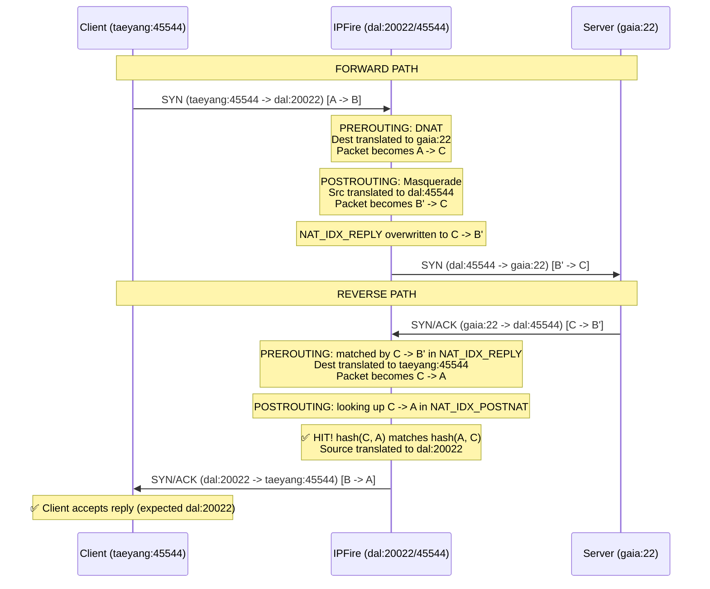

# Destination NAT (DNAT) and NAT Reversal in IPFIRE-wall

This document provides a detailed explanation of how Destination NAT (DNAT) is implemented in IPFIRE-wall, with a specific focus on the complex interactions that occur when both DNAT and Masquerade (SNAT) are applied to the same packet flow (Dual-NAT), and how IPFIRE-wall resolves NAT reversal routing.

## 1. Network Topology Example

To illustrate the packet flow, we will use the following example topology:
*   **Host A (Client)**: `taeyang` (e.g., `192.168.1.100`), initiating the connection from port `45544`.
*   **Host B (IPFire Gateway)**: `dal`, receiving external traffic on port `20022` and masquerading internal traffic using port `45544`.
*   **Host C (Internal Server)**: `gaia`, hosting an SSH service on port `22`.

The goal is for Client A (`taeyang`) to connect to Server C (`gaia:22`) by accessing the IPFire Gateway B (`dal:20022`).

## 2. The Dual-NAT Challenge

When a packet flows from `taeyang` through `dal` to `gaia`, both DNAT and Masquerade (SNAT) are actively applied to the same flow:
*   **DNAT** is needed to translate the destination of the incoming packet from `dal:20022` to `gaia:22`.
*   **SNAT** (Masquerade) is needed to translate the source of the packet from `taeyang:45544` to `dal:45544` so that `gaia` knows how to route the reply back to the gateway.

IPFire manages this connection using a single `NAT_DNAT` table entry with multiple cryptographic hashing indices.

## 3. The Forward Path

### PREROUTING (DNAT)
1. The `SYN` packet arrives at IPFire: `taeyang:45544 -> dal:20022` (A -> B).
2. A rule matches, and a `NAT_DNAT` table entry is created. To track this flow and reverse it later, the entry sets up several tracking indices (hashes):
    *   `NAT_IDX_ORIG`: `A -> B` (`taeyang:45544 -> dal:20022`) - Used to match subsequent packets in the forward direction.
    *   `NAT_IDX_POSTNAT`: `A -> C` (`taeyang:45544 -> gaia:22`) - The state of the packet after PREROUTING.
    *   `NAT_IDX_REPLY`: `C -> B` (`gaia:22 -> dal:20022`) - Used to match reply packets coming from the server.
3. The destination is rewritten. The packet becomes `A -> C` (`taeyang:45544 -> gaia:22`).

### POSTROUTING (Masquerade)
1. The packet is about to leave `dal` towards `gaia`. The kernel evaluates SNAT rules and calls `post_snat_dynamic()`, which masquerades the source address.
2. The packet becomes `B' -> C` (`dal:45544 -> gaia:22`).
3. To ensure that the gateway recognizes the reply from `gaia` to the masqueraded port, `post_snat_dynamic()` executes a `nat_add_index()` update to the `NAT_DNAT` entry's `NAT_IDX_REPLY` key.
4. The key is overwritten from `C -> B` to `C -> B'` (`gaia:22 -> dal:45544`).

## 4. The Reverse Path

When the server `gaia` replies, the `SYN/ACK` packet travels in reverse: `gaia:22 -> dal:45544` (C -> B'). This packet must undergo Reverse Masquerade and Reverse DNAT to reach the client correctly.

### PREROUTING (Reverse Masquerade)
1. The packet arrives as `C -> B'`.
2. The `pre_de_dnat()` function successfully looks up the `NAT_IDX_REPLY` index, which was updated to `C -> B'` during the forward POSTROUTING phase.
3. The entry is found. The destination address is translated *back* to the original client `A` (`taeyang:45544`).
4. The packet becomes `C -> A` (`gaia:22 -> taeyang:45544`) and enters the `FORWARD` chain.

### POSTROUTING (Reverse DNAT)
1. The packet hits the `POSTROUTING` chain. Now, `de_dnat_translation()` needs to translate the source from `gaia:22` back to `dal:20022`, so the packet finally becomes `B -> A`.
2. To find the correct `NAT_DNAT` entry, IPFire uses the current packet's 5-tuple (`C -> A`) and searches the `NAT_IDX_POSTNAT` index.
3. **Symmetric Hashing:** Because cryptographic hashing in IPFire's tuples is symmetrical (`hash(A, C) == hash(C, A)`), the reverse packet traversing `POSTROUTING` as `C -> A` naturally matches the `NAT_IDX_POSTNAT` index, which holds the forward-path routing hash of `A -> C`.
4. **Directionality Check:** Because `POSTROUTING` handles both forward SNAT (`post_snat_dynamic`) and reverse DNAT (`de_dnat_translation`), and because symmetric hashes match in both directions, we must enforce directionality. The reverse DNAT function evaluates `de_dnat_table_match()` to strictly ensure the packet matches the exact `C -> A` flow, cleanly bypassing the forward SNAT translator. 
5. The cache hit succeeds. The NAT engine reverts the source address.
6. The packet becomes `B -> A` (`dal:20022 -> taeyang:45544`) and is successfully transmitted to the client.

## 5. Sequence Diagram

Below is a visual representation of how IPFIRE-wall handles the Dual-NAT mapping and index lookups:

