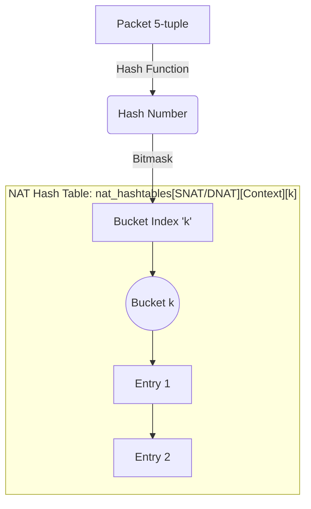
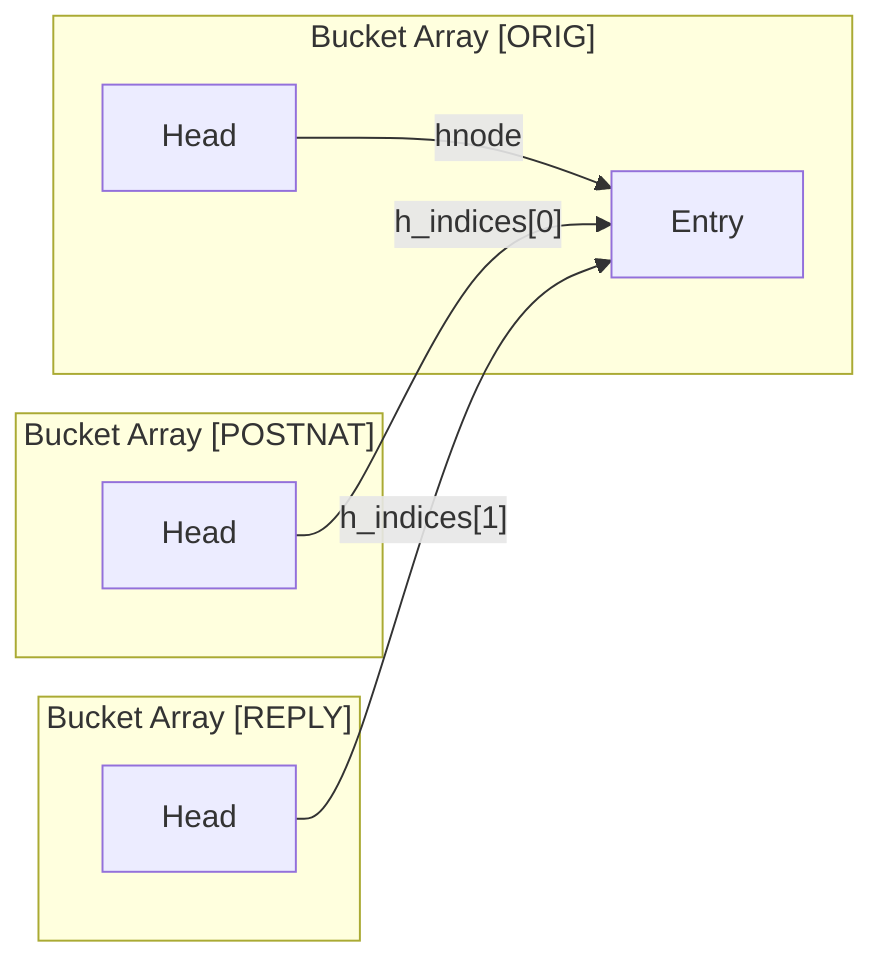

# IPFire-Wall Optimizations

The IPFire-Wall kernel module is designed with high-performance networking in mind. A core philosophy of this project is to squeeze as much processing power out of the host as possible, particularly on multi-core routing appliances, by keeping the "hot path" (the code executed for every single packet) as fast and lock-free as possible.

Below is a detailed outline of the primary architectural and algorithmic optimizations made throughout the development of the engine.

## 1. Hash Tables vs. Plain List Traversal

In early prototypes and legacy architectures, rules, state tables, and NAT entries were stored in simple linked lists.
* **List Traversal**: Finding an existing connection required an $O(N)$ linear scan of the list. Under heavy load (e.g., thousands of active connections or UDP floods), iterating through every node for every incoming packet resulted in catastrophic CPU overhead and packet drops.
* **Hash Tables**: The active connection tracking mechanism was migrated to Kernel Hash Tables (`linux/hashtable.h`). Using a computationally cheap hash over the connection's 5-tuple (Protocol, Source IP, Destination IP, Source Port, Destination Port), state and NAT lookups were reduced to $O(1)$ average time complexity. This change alone radically increased throughput capacity for large-scale deployments.

## 2. Per-CPU Counters vs. Global Counters

Tracking the exact number of active state, NAT, and log entries is crucial for enforcing resource limits (`max_state_entries`, etc.) to prevent memory exhaustion and DoS attacks. 

* **Why not Global Counters?** Using a single global integer (or an `atomic_t` counter) means every active CPU core must lock the instruction bus or acquire exclusive access to the exact same cache line in memory whenever it increments or decrements a connection count. On systems with many cores routing traffic simultaneously, this causes extreme **cache-line bouncing** (false sharing) and severely bottlenecks the network stack.
* **Per-CPU Counters (`struct percpu_counter`)**:  Per-CPU counters solve this by allocating an independent memory slot for every CPU core. When a CPU adds a connection, it increments its own local slot, avoiding cache contention with other cores completely.

### The Performance Regression: `sum_positive` vs `read`
During development, a severe performance regression (~40% drop in UDP throughput) was accidentally introduced while trying to fix count inaccuracies. 
* **The Problem (`percpu_counter_sum_positive`)**: To guarantee limit enforcement, the code was updated to use `percpu_counter_sum_positive()` on the hot path (e.g., in `get_dnatted_count` ran for *every* packet). `sum_positive` iteratively iterates over and sums the local counter slots of *every* CPU in the system. This meant our O(1) check suddenly became an O(num_cpus) blocking operation that forced the CPU to fetch remote memory cache lines for every forwarded packet.
* **The Original Fast Path (`percpu_counter_read`)**: `percpu_counter_read()` is lightning-fast and $O(1)$ because it just returns a cached global shadow variable. But standard implementations only synchronize the local CPU slot to the global shadow variable when the local slot exceeds a large predefined chunk size (creating read drift).
* **The Solution (`_inc` vs `_add_batch`)**:
  Instead of using the default `percpu_counter_inc` (which allows drift) or checking the accurate but extraordinarily slow `sum_positive`, we modified the connection creation/teardown functions to use `percpu_counter_add_batch(&counter, value, 1)`. 
  Because adding/removing a table entry is a relatively infrequent operation (only occurs on the first and last packet of a session), forcing a `batch=1` update guarantees that the global shadow count is updated immediately. This elegantly fixed the inaccuracy while allowing the hot-path packet filters to revert back to using the $O(1)$ `percpu_counter_read`, completely restoring peak packet throughput.

## 3. Other Historical Optimizations

Several other optimizations act as multipliers for the IPFire-Wall's performance:

* **RCU (Read-Copy-Update) Locks in the Hot Path**: 
  We aggressively replaced expensive read-write spinlocks (`rwlock_t`) with lockless `RCU` mechanisms (`rcu_read_lock()`). The core packet matching logic reads the state and NAT hash tables without acquiring any hardware locks. Modification (creation/deletion) is protected by minimal spinlocks and `hlist_add_head_rcu` / `hlist_del_rcu`, allowing existing packets to be parsed concurrently alongside table writes without pipeline stalls.
  
* **Rate-Limited Timer Updates with Jiffies**:
  Every packet matching a connection refreshes that connection's timeout. Updating a node's expiration time per-packet caused heavy lock contention and cache writes. We introduced rate-limiting: the timer is only extended if it has aged by a certain delta (e.g., 1/10th of its total lifetime). Additionally, expensive nanosecond-precision clocks (`ktime_get_real_ns()`) were replaced with fast, low-overhead Kernel `jiffies` comparisons.

* **Static Loginfo Pre-allocation**:
  To mitigate memory fragmentation and page-fault latency during intense traffic storms (like port scans logged by the engine), the IPFire-Wall logging subsystem utilizes static fixed-size arrays and memory pools rather than dynamically calling `kmalloc` every time a logged packet hits the system.

* **Netlink Paged Memory Construction**:
  When user-space utilities (like the F6 diagnostics menu) request millions of connection entries through Netlink, the kernel avoids massive, monolithic memory allocations inside RCU locks. Arrays are pre-allocated iteratively outside of the RCU critical section using `kmalloc_array`, ensuring that dumping diagnostic statistics doesn't block vital packet routing threads.

* **Early Flow Short-Circuiting**:
  Optimizations have been applied to filter protocol structures early. Any irrelevant traffic (unsupported Layer 4 protocols) is identified and bypassed at the very top of `filter_engine.c` before entering complex state tracking checks or deep header parsing, saving considerable CPU cycles.

## 4. Hash Tables: A Deep Dive

### What is a Hash Table?
A hash table is a data structure optimized for lightning-fast lookups. Instead of a single long list, memory is divided into an array of smaller lists called **buckets**. Each bucket is identified by an **index** (a number from `0` to `NUM_BUCKETS - 1`).

When a new connection (e.g., a packet with a specific Source/Dest IP and Port) arrives, its data (the "key") is fed into a mathematical **hash function**. This function quickly scrambles the key into a pseudo-random integer called a **hash number**. This hash number is then mapped to a specific bucket index (usually using a modulo operation or a bitmask, like `hash_number & (NUM_BUCKETS - 1)`).  

To find the connection later, the kernel hashes the packet's fields again, jumps directly to the calculated bucket index, and only scans the tiny list of entries within that specific bucket.

### State Tables vs. NAT Hashes

While the internal Firewall `state` tracking uses a standard 1-dimensional hash table array (where the bucket index is simply derived from the packet's 5-tuple), the Network Address Translation (NAT) engine requires a much more robust **three-dimensional** indexing structure:

```c
struct hlist_head nat_hashtables[2][NAT_IDX_COUNT][1 << NAT_HASH_BITS];
```

Let's break down each dimension `[i][j][k]`:

1. **`i` (Index 0 or 1): The NAT Type**
   Separates `SNAT` (Source NAT) operations from `DNAT` (Destination NAT) operations to avoid collision during lookups.

2. **`j` (Index `NAT_IDX_COUNT`): The Lookup Context**
   A single NAT connection fundamentally requires different "keys" depending on which direction the packet is flowing. We store the exact same connection in multiple hash buckets simultaneously based on these contexts:
   * `NAT_IDX_ORIG` (0): The key built from the Original packet's pre-translation 5-tuple. Used when a new packet matches an existing translation flow (e.g., a client sending another packet out).
   * `NAT_IDX_POSTNAT` (1): The key built from the packet's *translated* 5-tuple. Used primarily when resolving overlaps or searching for newly formed, post-routing signatures.
   * `NAT_IDX_REPLY` (2): The key built to match the expected *reply* traffic from the outside world. Used when an external server responds, allowing the firewall to reverse the translation (De-SNAT or De-DNAT) accurately.

3. **`k` (Index `1 << NAT_HASH_BITS`): The Bucket**
   The actual hash-mapped bucket array, functioning precisely like a standard hash table.

### Mermaid Architecture



### Multi-Indexed Hash Linkage in NAT Tables

Because a single NAT entry exists in multiple lookup contexts simultaneously (`ORIG`, `POSTNAT`, `REPLY`), it cannot be linked using just one standard list node. 

In `struct ipfi_entry_head`, which forms the foundation of all tables, we have:
```c
  struct rcu_head rcuh;    /* Used by RCU callback to safely free memory after the grace period */
  struct list_head lnode;  /* General List linkage (used by loginfo LRU queues) */
  struct hlist_node hnode; /* Primary hash linkage (used exclusively for NAT_IDX_ORIG) */
```

However, `hnode` only provides linkage for *one* hash dimension. To connect the exact same NAT entry into the `POSTNAT` and `REPLY` hash buckets concurrently without duplicating the entire table payload, the NAT table structs (`struct snat_table` / `struct dnat_table`) must declare additional inline linkage pointers:

```c
  struct hlist_node h_indices[NAT_IDX_COUNT - 1]; /* Linkage for POSTNAT and REPLY */
```


