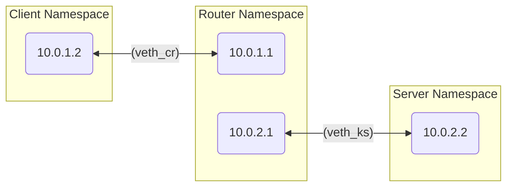
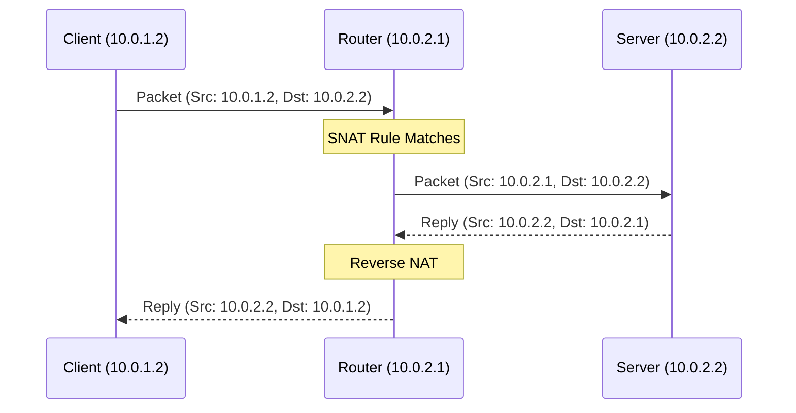
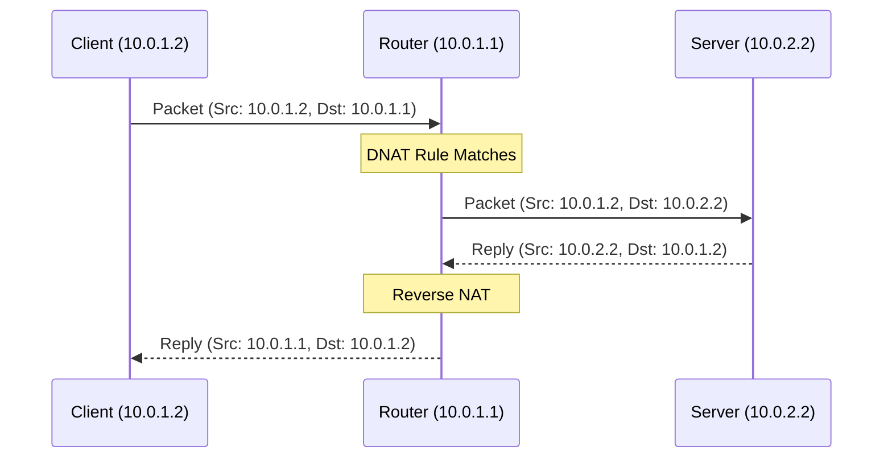
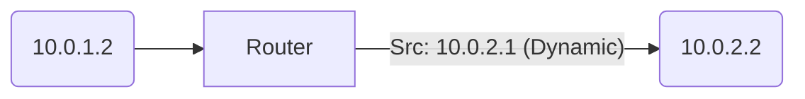

# NAT Testing with Network Namespaces

This document describes how to use the `ns_nat_test.sh` script to test the NAT functionality of the `ipfi` kernel module using Linux network namespaces.

## Prerequisites

- Root privileges (`sudo`)
- `iproute2` package (for `ip netns` commands)
- `iperf3` (for traffic generation)
- The `ipfi` kernel module compiled.
- The `ipfire` userspace tool compiled.

## Setup Overview

The script creates a network topology using three namespaces:



## Usage

1.  **Run the script:**
    ```bash
    sudo ./ns_nat_test.sh
    ```
    This will:
    - Create the namespaces (`client_ns`, `router_ns`, `server_ns`) and veth pairs.
    - Configure IP addresses and routing.
    - Verify basic connectivity.
    - **Note:** The script *does not* load the kernel module.

2.  **Start the Firewall:**
    You must start the firewall *inside* the router namespace to load the module (if not already loaded) and apply rules. Open a new terminal:
    ```bash
    sudo ip netns exec router_ns /path/to/ipfire/executable
    ```
    *Ensure that the firewall loading mechanism uses `per_net=1` when inserting the module if it's not already loaded.*

## Test Scenarios

### 1. Source NAT (SNAT)

**Goal:** Translate source IP of Client (10.0.1.2) to Router's external IP (10.0.2.1) when talking to Server.



**Verification:**
Run `iperf3` server on Server NS:
```bash
sudo ip netns exec server_ns iperf3 -s
```
Run client:
```bash
sudo ip netns exec client_ns iperf3 -c 10.0.2.2
```
*Check that the server sees the connection from 10.0.2.1.*

### 2. Destination NAT (DNAT)

**Goal:** Forward traffic sent to Router's external IP (10.0.1.1:Port) to Server (10.0.2.2:Port).



**Verification:**
Run server on Server NS:
```bash
sudo ip netns exec server_ns iperf3 -s
```
Run client pointing to Router:
```bash
sudo ip netns exec client_ns iperf3 -c 10.0.1.1
```
*Traffic should reach the server.*

### 3. Masquerade

**Goal:** Dynamic SNAT for outgoing traffic.



**Verification:**
Same as SNAT, but the rule uses Masquerade on the outgoing interface instead of static SNAT.

## Cleanup

The script cleans up namespaces on exit. If needed, manually remove them:
```bash
sudo ip netns delete client_ns
sudo ip netns delete router_ns
sudo ip netns delete server_ns
```
